<div align="center">

# ToutPanel

**لوحة استضافة الويب لنظامي Linux وWindows: المواقع وPHP وقواعد البيانات والبريد وDNS وSSL والأمان والنسخ الاحتياطية من واجهة ويب واحدة، بـ 10 لغات.**

Nginx · Apache · Caddy *(تجريبي)* · OpenLiteSpeed *(تجريبي)* · LiteSpeed Enterprise *(تجريبي)* · IIS · PHP 5.6 → 8.5 · MariaDB · MySQL · PostgreSQL · MongoDB · Postfix / Dovecot · BIND / PowerDNS / Knot · Let's Encrypt · WAF / ToutWAF · جدار الحماية · Docker · تعدد المستأجرين · تعدد الخوادم


[Français](README.md) · [English](README.en.md) · [Deutsch](README.de.md) · [Español](README.es.md) · [Italiano](README.it.md) · [Nederlands](README.nl.md) · [Português](README.pt.md) · [Русский](README.ru.md) · [中文](README.zh.md) · **العربية**

[التثبيت](#installation-complete) · [مستجدات الإصدار 0.5](#مستجدات-الإصدار-05) · [الميزات](#features) · [ما جرى اختباره فعليًا أو محاكاته أو لم يُختبر](#tested) · [أنظمة إدارة المحتوى](#cms) · [لقطات الشاشة](#screenshots) · [السمات](#themes) · [الإصدارات](#editions) · [البنية](#architecture) · [التشغيل الأول](#first-start) · [استكشاف الأخطاء وإصلاحها](#troubleshooting) · [الحدود المعروفة](#known-limits)

**Version 0.5.3** · القناة **المستقرة** · 2026-10-06

</div>

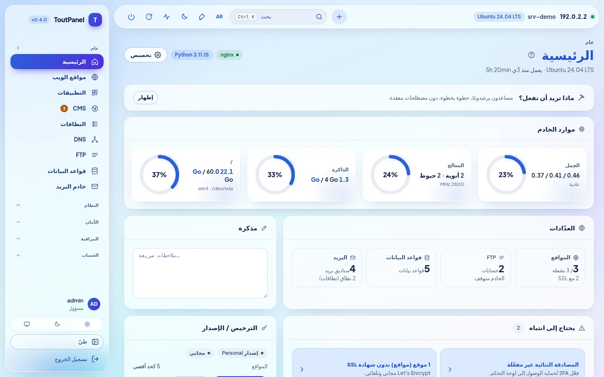

---

## ما هو ToutPanel؟

يحوّل ToutPanel خادمًا حديث التثبيت إلى **منصة استضافة ويب متكاملة** تُدار من المتصفح. أمر واحد يثبّت الحزمة البرمجية (افتراضيًا Nginx وPHP-FPM وMariaDB وRedis أو Valkey وCertbot وFail2ban، أو الحزمة التي تركّبها بنفسك: الملفات التعريفية والإصدارات وخادم الويب وFTP والبريد وDNS والمسرِّعات) ثم اللوحة وخدمتها؛ وبعد ذلك تنشئ مواقعك وقواعد بياناتك وصناديق بريدك ومناطق DNS وشهاداتك ببضع نقرات، دون تحرير ملف إعداد واحد.

وهو موجَّه إلى من يستضيف **مواقعه الخاصة** (الإصدار الشخصي المجاني، دون مفتاح ودون تسجيل) كما هو موجَّه إلى **الوكالات ومزوّدي الاستضافة** الذين يعيدون بيع الاستضافة: حسابات الموزّعين والعملاء، والخطط والحصص، والفوترة، والعلامة البيضاء، وتعدد الخوادم والتوافر العالي (الإصداران الاحترافي وEnterprise).

تبقى بياناتك **على خادمك**: لا خطوط ولا شبكات CDN خارجية في الواجهة، ولا أي اتصال بخادم التراخيص ما دام لم يُفعَّل أي ترخيص.

**هذا الملف README شامل وصريح عن قصد.** تُوسَم كل ميزة بعبارة *(تجريبي)* عندما تكون كذلك، وبعبارة **Pro** عندما تتطلب إصدارًا مدفوعًا، ويوضح كل قسم ما **نُفِّذ فعليًا** في الاختبارات وما لم يُنفَّذ إلا بالمحاكاة أو لم يُنفَّذ إطلاقًا. يجمعها جدول [ما جرى اختباره فعليًا أو محاكاته أو لم يُختبر](#tested)، وتسرد [الحدود المعروفة](#known-limits) التحفظات. إذا كانت ميزة ما حاسمة بالنسبة إليك، فتحقق منها على خادم تجريبي قبل الإنتاج.

> **لا يحتوي هذا المستودع على أي شيفرة مصدرية.** إنه ينشر فقط ما يلزم لتثبيت اللوحة: المثبّتَين `install.sh` و`install.ps1`، واللوحة المُصرَّفة (`dist/`، حزم Python wheel بصيغة «bytecode فقط»)، وملاحظات الإصدار، والترخيص، و`version.json`.

## التثبيت السريع

**Linux** (بصلاحية `root`، ويفضَّل على خادم حديث التثبيت):

```bash
curl -sSL https://raw.githubusercontent.com/qu3ntin01/toutpanel/main/install.sh | sudo bash -s -- --lang ar
```

الخيار `--lang ar` يجعل المثبّت يتحدث بالعربية؛ احذفه ليتحدث بالإنجليزية (أو بلغة النظام).

**Windows** (PowerShell **بصلاحية المسؤول**):

```powershell
Set-ExecutionPolicy Bypass -Scope Process -Force
iwr -useb https://raw.githubusercontent.com/qu3ntin01/toutpanel/main/install.ps1 | iex
```

يعرض السكربت في النهاية عنوان URL الخاص باللوحة (مع **مدخلها السري**)، وحساب المسؤول، ورابط **معالج الإعداد**. ويمكن أيضًا اختيار كل شيء بالخيارات: الحزمة (`--profile` و`--web` و`--php` و`--db` و`--ftp` و`--mail` و`--dns` و`--accel`…)، وجدار الحماية (`--firewall`)، وإصدار محدد (`--version`)، واللغة (`--lang`)، والمجلد (`--home`، والافتراضي `/var/toutpanel`)، وكلمة المرور دون إظهارها في قائمة العمليات (`TOUTPANEL_PASSWORD` و`--password-file` و`--password-stdin`). يولّد **[معالج التثبيت](https://toutpanel.com/installation-assistant)** سطر الأوامر عبر قوائم اختيار. التفاصيل والمتطلبات والمنافذ واستكشاف الأخطاء: [التثبيت الكامل](#installation-complete).

## نظرة عامة

| | |
|---|---|
| **الأنظمة** | Linux: ‏Debian 11+ وUbuntu 20.04+ وAlmaLinux / Rocky Linux / RHEL / CentOS Stream / Oracle Linux 8+ وFedora، مع عائلات أخرى بحزمة مخفّفة (openSUSE وArch وAlpine وAmazon Linux…) و**مستوى دعم** معروض (`toutpanel compat`)؛ Windows 10 / 11 وWindows Server 2016 → 2025 (أقل اختبارًا من Linux) |
| **خوادم الويب** | Nginx وApache وNginx + Apache و**Caddy**\* و**OpenLiteSpeed**\* (‏LSPHP وLSCache) و**LiteSpeed Enterprise**\* (منتج تجاري، لم يُشغَّل قط في تجاربنا: انظر [الحدود](#known-limits)؛ ويتطلب `--web litespeed` الخيار `--accept-litespeed-license`) وIIS (أساسي)؛ Apache + mod_php *قريبًا* |
| **الحزمة البرمجية** | **المُركِّب**: الملفات التعريفية والإصدارات والمخطط وتثبيت قابل للاستئناف وحالة فعلية؛ المسرِّعات (OPcache وJIT وRedis / Valkey وMemcached وVarnish\* وBrotli وZstandard\* وHTTP/3\*) |
| **PHP** | من 5.6 إلى 8.5 جنبًا إلى جنب، و138 امتدادًا في الفهرس، وإصدار لكل موقع، و`php.ini` ومجمّع FPM لكل موقع |
| **التطبيقات** | بيئات تشغيل Node.js وPython (‏WSGI / ASGI) وRuby وGo وJava و.NET بإصدار لكل موقع، وsystemd وPM2 وPassenger؛ Docker وCompose؛ نشر Git ذري |
| **قواعد البيانات** | MariaDB وMySQL (من التوزيعة، أو 8.4 / 9.x من Oracle\*) وPercona Server\* وPostgreSQL وMongoDB وSQLite وRedis / Memcached لكل حساب |
| **FTP وDNS والبريد** | FTP: مدمج وPure-FTPd\* وProFTPD\* وvsftpd\* وSFTP فقط\* · DNS: ‏BIND وPowerDNS وKnot · البريد: Postfix + Dovecot وExim\* · محرك واحد في كل مرة، مع تبديل وإمكانية رجوع · بريد ويب Roundcube وSnappyMail وSOGo\* |
| **جدار الحماية والأمان** | جدار حماية مُدار (nftables وufw وfirewalld وCSF وiptables) **أو في المنبع**، مع حاجز يمنع القفل الذاتي؛ Fail2ban؛ WAF مدمج وModSecurity وToutWAF؛ مكافحة البرمجيات الخبيثة؛ عزل الحسابات (**ما يعادل جزئيًا** CageFS) |
| **أنظمة إدارة المحتوى** | 595 نظام إدارة محتوى وتطبيقًا في الفهرس (582 جرى التحقق منها: 536 مجانيًا و46 تجاريًا)، مع اختيار الإصدار، وتثبيتات متتبَّعة وتحديثات |
| **الواجهة** | **واجهة بـ 10 لغات**، و13 سمة فاتحة / داكنة (**Horizon** افتراضيًا)، ولون تمييز حر، و**16 معالجًا** إرشاديًا، و**تشخيص من 844 فحصًا**، وإتاحة تستهدف WCAG 2.1 AA (**دون تدقيق**) |
| **التوثيق** | محرَّر بالفرنسية؛ مترجَم إلى الإنجليزية والألمانية والإسبانية والإيطالية والهولندية والبرتغالية والروسية والصينية والعربية بنسبة **79 % من الصفحات** (75 من 94، لكل لغة من هذه اللغات التسع)؛ وتبقى الصفحات الـ 19 المتبقية (قسم المرجع: API ورموز الأخطاء والقوالب… وصفحات التشخيص) بالفرنسية مع شريط تنبيه؛ أما فهرس التشخيص ورسائل API فمترجمان إلى اللغات العشر |
| **المثبّتات** | `install.sh` و`install.ps1` بـ 10 لغات (الإنجليزية افتراضيًا، و`--lang` / `--fr`…، و`TOUTPANEL_LANG`، ولغة النظام)، وخيارات الحزمة وجدار الحماية، وإصدار محدد (`--version`)، و[معالج التثبيت](https://toutpanel.com/installation-assistant) الذي يولّد الأمر |
| **الأتمتة** | API من نوع REST (1017 عملية OpenAPI)، وسطر الأوامر `toutpanel`، وwebhooks موقَّعة، وسكربتات ما قبل / بعد الإجراء، وAnsible وTerraform، و**Marketplace من 800 وحدة** تكامل (مع عرض مستوى النضج) |

<sub>\* *تجريبي*: حقيقي، لكنه أقل اختبارًا أو له حدود مُعلنة في الواجهة وفي [الحدود المعروفة](#known-limits).</sub>

## مستجدات الإصدار 0.5

الإصدار **0.5.0** هو الإصدار **المستقر** (الفرع [`main`](https://github.com/qu3ntin01/toutpanel/tree/main))؛ ويتضمن الإصدارين التجريبيين المسبقين **0.5.0b1** (قسم **Analytics**) و**0.5.0b2** (**تكامل ToutWAF**، وSSL المُدار من ToutWAF)، ويضيف إليهما **قسم «خادم الويب» في ToutWAF** و**إصلاحات أمنية** ناتجة عن مراجعة مستقلة. يوضح كل سطر ما هو حقيقي وما ليس كذلك: «جديد في 0.5» تعني حقيقيًا ومُختبَرًا، لكنه أقل اختبارًا من ميزات 0.4.

| الجديد | النضج والتحفظات |
|---|---|
| **Analytics** (المراقبة › Analytics): إحصاءات زيارات **مستضافة ذاتيًا**، على غرار Google Analytics — الزوار المتصلون، ومصادر الزيارات، والجمهور، والصفحات، والأحداث، والأهداف ومسارات التحويل، والتقارير التقنية، ومقارنة الفترات، والمرشّحات، وتصدير CSV / JSON، والتقارير عبر البريد، والتنبيهات، ورابط مشاركة للقراءة فقط؛ **دون ملفات تعريف ارتباط افتراضيًا، ولا يُحفظ عنوان IP أبدًا** | **جديد في 0.5**: المحرك وAPI مُختبَران (≈ 560 اختبارًا)؛ مسار كامل من البداية إلى النهاية في **Chromium حقيقي** مقابل **لوحة حقيقية** (130 زائرًا، و427 مشاهدة صفحة، و54 فحصًا مطابقًا للحقيقة المرجعية)؛ المتتبّع مُجرَّب على Chromium فقط (Safari وFirefox لم يُختبرا)؛ المدة والوقت الفعلي الدقيقان يتطلبان المتتبّع، أما السجلات وحدها فتعطي مشاهدات الصفحات فقط؛ ودون ملفات تعريف ارتباط لا يوجد زوار عائدون من يوم إلى آخر |
| **خريطة العالم**: 236 بلدًا، وتكبير، وقارات، ومدن مجمَّعة، ووصولات متحركة في الوقت الفعلي، وسمتان فاتحة وداكنة | **جديد في 0.5**: السلاسة مقيسة بالتصيير البرمجي، **وليس على بطاقة رسومات حقيقية** |
| **التحديد الجغرافي DB-IP** تثبّته اللوحة (البلدان والمدن والشبكات؛ CC BY 4.0، تحديث شهري) | **جديد في 0.5**: القارئ مُتحقَّق منه على قاعدة البلدان **الحقيقية**؛ أما قاعدتا **المدن والشبكات** فلم يُتحقَّق منهما إلا على ملفات اصطناعية؛ وبلا قاعدة تظهر البلدان «غير معروفة» |
| **صيغة Proxy**: يُقدَّم المتتبّع من الموقع نفسه (ضد حاجبات الإعلانات) | nginx وApache مُتحقَّق منهما مع **خوادم حقيقية**؛ Caddy: التصيير والصياغة فقط؛ **OpenLiteSpeed وLiteSpeed Enterprise وIIS غير مدعومة** (شيفرة تُلصق يدويًا) |
| **تكامل ToutWAF**: إنشاء المواقع من ToutWAF (رمز API محدود الصلاحيات يُسلَّم عند الربط، وإعادة تنفيذ الطلب دون تكرار بواسطة `Idempotency-Key`، ومخطط منشور لنموذج الإنشاء)، و**SSL المُدار من ToutWAF** (ToutWAF يُنهي HTTPS، وصفحة SSL في اللوحة تدير الشهادات في ToutWAF)، ومفاتيح تبديل عامة ولكل خادم في العنقود (Cluster)، و**قسم «خادم الويب» في ToutWAF** (رمز محدد مسبقًا بصلاحيات مقلَّصة، و`GET /api/capabilities`، و`GET /api/sites/{id}`، وتقدّم المهام، و`toutpanel waf connect --ssl toutwaf|panel`، و`toutpanel waf status`) | **جديد في 0.5**: مُختبَر مقابل **ToutWAF مزيّف** يتبع العقد الذي وصفه مطوّروه (≈ 500 اختبار)؛ **لم يُجرَّب شيء مقابل ToutWAF حقيقي** (لا قسم «خادم الويب» ولا SSL المُدار)؛ مسارات التجديد وخيارات HTTPS وقدرات API الشهادات في ToutWAF تحتاج إلى تأكيد؛ واجهة SSL غير مُتحقَّق منها في متصفح |
| **إصلاحات أمنية** (مراجعة مستقلة على مرحلتين): رفع نطاق صلاحيات رمز API (موجود منذ 0.4.0)، ورمز ToutWAF المركَّب، وسجلات الموقع ومفتاحه الخاص لـ TLS، وبيانات Analytics لموقع محذوف، وقراءة `X-Forwarded-For`، وعدم التكرار (idempotence) لكل رمز، وسقوف استقبال Analytics | **حقيقي**: اختبار عدم انحدار لكل إصلاح؛ التفاصيل والخطورة في [سجل التعديلات](CHANGELOG.md)؛ المراجعة غير شاملة (التحقق من توجيهات vhost وهجمات ReDoS في المحلِّلات لم يُفحصا) |
| **الترجمات**: الواجهة ورسائل الخادم باللغات العشر، وصفحة Analytics في التوثيق بـ 9 لغات | التوثيق مترجم بنسبة **79 % من الصفحات** (75 من 94)؛ وتبقى صفحات المرجع الـ 19 المتبقية (فهارس التشخيص، ورموز الأخطاء، وAPI، والإعدادات، والقوالب) بالفرنسية |

<a id="whats-new-04"></a>

## مستجدات الإصدار 0.4

الإصدار **0.4.0** هو الإصدار **المستقر** السابق (أما الإصداران 0.4.0b1 و0.4.0b2 فكانا إصدارين تجريبيين مسبقين من قناة `dev`). تحمل كل ميزة مستوى نضجها: **مستقرة**، أو **تجريبية** (حقيقية ومُختبَرة، لكنها أقل اختبارًا أو لها حدود مُعلنة)، أو **قريبًا** (ظاهرة ومعتّمة، ولا تُحاكى أبدًا). يوضح العمود الثاني ما هو محجوز أو محدود؛ والتفصيل الصريح لكل نقطة موجود في القسم المقابل من [الميزات](#features).

| الجديد | النضج والتحفظات |
|---|---|
| **الاستماع المتزامن عبر HTTP وHTTPS** للوحة (8888 / 8443، مع شهادة موقَّعة ذاتيًا في البداية)؛ شهادة Let's Encrypt للوحة مع سلطة اختيارية وDNS-01 وwildcard و**إعادة تحميل فوري** | مستقر؛ جرى اختباره مع Pebble (خادم ACME تجريبي)، وليس مع Let's Encrypt الحقيقي |
| **تثبيت إصدار محدد**: `--version X.Y.Z` و`--list-versions`؛ **المجلد `/var/toutpanel` افتراضيًا** | مستقر |
| **جدار حماية تديره اللوحة أو في المنبع**، وصفحة مخصصة، والمنافذ المطلوب فتحها، و**حاجز منع القفل الذاتي لمدة 60 ث** | مستقر؛ اختُبرت القواعد مع nftables / iptables حقيقيين داخل فضاء أسماء شبكي خاص |
| **مُركِّب الحزمة**: الملفات التعريفية والإصدارات ومخطط البنية وتقدير الذاكرة / القرص، و**معالج الإعداد الأول من 9 خطوات**، وصفحة **الحزمة البرمجية** | مستقر |
| **محركات DNS**: ‏BIND وPowerDNS وKnot DNS (تبديل مع ترحيل المناطق ومفاتيح DNSSEC، وإمكانية الرجوع) | مستقر؛ اختُبرت مع الخدمات الحقيقية على Ubuntu 24.04 |
| **محركات البريد**: Postfix + Dovecot، وترحيل خارجي، و**Exim + Dovecot**؛ **محركات FTP**: مدمج، و**Pure-FTPd وProFTPD وvsftpd وSFTP فقط** | Postfix وFTP المدمج: مستقر؛ Exim ومحركات FTP الأخرى: **تجريبي** |
| **خوادم الويب**: **OpenLiteSpeed** (‏LSPHP وLSCache) و**Caddy** و**LiteSpeed Enterprise** (تبديل من وإلى Nginx وApache و«كليهما» مع إمكانية الرجوع) | **تجريبي**؛ جرى اختبار OpenLiteSpeed وCaddy فعليًا على Ubuntu 24.04؛ **لم يتمكن LiteSpeed Enterprise من الإقلاع قط** (رُفض الترخيص التجريبي)، ولم يُشغَّل فعليًا سوى تثبيته الرسمي والتحقق من إعداده |
| **المسرِّعات**: OPcache وJIT وAPCu وRedis / Valkey وMemcached وذاكرة FastCGI المؤقتة وBrotli؛ **Varnish وZstandard وHTTP/3** (ومنها Nginx من nginx.org القابل للتثبيت مع ضمانات حماية) | Varnish وZstandard وHTTP/3: **تجريبي**؛ الباقي: مستقر |
| **قواعد البيانات**: MariaDB 10.6 → 11.8، و**MySQL 8.4 / 9.x** (مستودع Oracle)، و**Percona Server**، وPostgreSQL 13 → 18؛ **كلمات مرور قواعد البيانات مشفّرة أثناء التخزين** | MySQL من Oracle وPercona: **تجريبي** (لم يُثبَّتا ولم يُشغَّلا قط في تجاربنا) |
| **عزل الحسابات**: خدمة PHP-FPM لكل حساب ضمن شريحة cgroup الخاصة به، وتشديد systemd، و**قفص نظام الملفات** (bind mounts + bubblewrap) | خيارات **معطّلة افتراضيًا**؛ **ما يعادل جزئيًا** CageFS (النواة والشبكة مشتركتان)؛ غير مُختبَر: SELinux في وضع enforcing مع هذا العزل (SELinux Enforcing مُعتمَد بدونه على AlmaLinux، انظر [الأمان](#section-12))، وcgroup v2 مع حدود مطبَّقة فعليًا، وخادم كامل تحت systemd |
| **بيئات تشغيل لكل موقع** (Node.js وPython وGo وJava وRuby و.NET)، و**WSGI / ASGI**، و**PM2**، و**Passenger** | حقيقي: Node 20 وPython 3.12 وgunicorn وuvicorn وPM2 وNginx + Passenger؛ Go وJava و.NET محاكاة؛ Ruby غير مُصرَّف |
| **الإحصاءات**: GoAccess و**AWStats** وMatomo؛ **بيئة ما قبل الإنتاج** مع قاعدة بيانات ومزامنة في الاتجاهين | جرى اختبار GoAccess وAWStats وما قبل الإنتاج (MariaDB) فعليًا؛ أما Matomo فـ **لم يُجرَّب قط** على نسخة حقيقية |
| **النسخ الاحتياطية**: تشفير AES-256-GCM، ونسخ تزايدية أصلية، ووجهات **rsync** و**Borg**، وملف «الخادم الكامل»، ونسخ جزئي / وضع صارم، واختبار الاستعادة | جرى اختبار rsync وBorg 1.2.8 فعليًا؛ أما restic وS3 وB2 وrclone فـ **محاكاة**؛ rsync / Borg وrestic: **Pro** |
| **المراسلة**: حد إرسال `mail()` في PHP، و**DMARC لكل نطاق**، و**BIMI**، و**DANE**، وMTA-STS / TLS-RPT، و**SpamAssassin**، و**SOGo**، وطابور الانتظار وCalDAV / CardDAV مُختبَرة | SOGo **تجريبي** (لم يُشغَّل `sogod` قط)؛ سلسلة VMC الخاصة بـ BIMI وتوقيع DNSSEC غير مُتحقَّق منهما |
| **الترحيل**: استيراد **ISPConfig** كامل (SSH وأرشيف وتفريغ SQL)، ونقل موقع أو نطاق بين العملاء، و**ترحيل حسابات بين الخوادم موسَّع** (البريد وFTP وcron وSSL والخطة) | **Pro**؛ جرى اختبار cPanel / Plesk / DirectAdmin على أرشيفات **مُصطنعة**؛ لم يُختبر قط على خادمين فعليين |
| **التوافر العالي**: IP عائم عبر keepalived / VRRP، وتخزين مشترك NFS / GlusterFS، وتكرار Dovecot، وسجل لكل عقدة، وقالب Zabbix، و**إصلاح تلقائي موسَّع** | **Pro**؛ إعدادات جرى التحقق منها بالأدوات الحقيقية، و**لم يُختبر أي تبديل بين جهازين** |
| **المصادقة**: SSO عبر SAML / OIDC / LDAP مُختبَر مع مزوّدين تجريبيين، وWebAuthn مُختبَر مع أداة مصادقة افتراضية، و**TLS مشدَّد**، و**تنبيهات الاتصال غير المعتاد** لصاحب الحساب | SSO: **Pro**؛ لم يُختبر أي مزوّد هوية إنتاجي ولا مفتاح مادي |
| **التشخيص** (النظام › التشخيص): **844 فحصًا**، و**90 إصلاحًا تلقائيًا** مع معاينة، و**16 معالج** إعداد إرشاديًا مع اختبار فعلي | جدولة التشخيص: **Pro**؛ جزء من الفحوص مُختبَر بخدمات محاكاة |
| **رسائل الخادم مترجمة** إلى اللغات العشر؛ **ToutWAF عن بُعد**؛ توافق موسَّع مع التوزيعات؛ **مثبّت متعدد اللغات** مع خيارات الحزمة | مستقر؛ بعض الرسائل المركَّبة ديناميكيًا تبقى بالفرنسية |
| **Marketplace** من 800 وحدة تكامل (الفوترة والبوابات والمراقبة وCI/CD وIaC وSSO وDNS / CDN والنسخ الاحتياطي والسمات…) | **5 مستقرة**، و199 بيتا، و596 **مولَّدة** (لم تُجرَّب قط مع الخدمة الحقيقية) |
| Apache + mod_php | **قريبًا** (يُرفض بوضوح، ولا يُحاكى أبدًا) |

التفاصيل والحدود: [الحدود المعروفة](#known-limits) · [CHANGELOG.md](CHANGELOG.md).

<a id="features"></a>

## الميزات

تتبع الخطة **الأقسام العشرين** لمرجع لوحة استضافة متكاملة (من مستوى cPanel / Plesk / ISPConfig / DirectAdmin إلى الميزات المتقدمة)، ثم المنظومة المحيطة. وفي كل قسم، يوضح السطر «**الفعلي / الحدود**» بصراحة ما نُفِّذ وما لم يُنفَّذ. التوثيق التفصيلي لكل صفحة: **[toutpanel.com/docs](https://toutpanel.com/docs/)** (وتقدّمه اللوحة أيضًا ضمن `/help/` عند بنائه أثناء التثبيت، مع مساعدة سياقية في كل صفحة).

<a id="section-1"></a>

### 1. الحسابات والمستخدمون وتعدد المستأجرين

- التسلسل الهرمي **مسؤول ← موزّع (Pro) ← عميل ← مستخدم فرعي**؛ ولا يرى الموزّع ولا ينشئ إلا ما يقع ضمن نطاقه.
- **RBAC دقيق**: صلاحيات لكل وحدة ولكل إجراء، بتقاطع الدور والخطة وملف الوصول والأصل؛ ملفات مدمجة هي **كامل، مطوّر، محاسب، مدير ويب، قراءة فقط** وملفات مخصصة.
- **الخطط والحصص**: القرص وinodes وحركة البيانات والمواقع والنطاقات وقواعد البيانات (وحجم كل قاعدة) ونطاقات وصناديق البريد والمهام المجدولة وحسابات FTP ومناطق DNS والنسخ الاحتياطية والمستخدمون الفرعيون؛ حصص محتسبة وتمنع الإنشاء عند بلوغها. لا تقطع حركة البيانات الشهرية الموقع: بل تُطلق تنبيهًا، وفوترة التجاوز، والتعليق التلقائي إذا فعّلته.
- **حدود الموارد لكل حساب**: مستخدم نظام مخصص، وشريحة systemd (المعالج والذاكرة والإدخال/الإخراج والعمليات) مطبَّقة على المهام المجدولة ونشر Git والتطبيقات والطرفية ونُسخ Redis / Memcached؛ و**على طلبات PHP فقط مع عزل «خدمة PHP-FPM لكل حساب»** (خيار، معطّل افتراضيًا). حد الاتصالات المتزامنة لكل موقع: **Nginx فقط**.
- **التعليق** وإعادة التفعيل، يدويان أو تلقائيان (عدم الدفع، تجاوز الحصة بعد مهلة سماح).
- **الدخول «بصفة»** مستخدم آخر (انتحال الهوية) مسجَّل في سجل التدقيق ومحدود زمنيًا.
- **نقل** موقع أو نطاق من عميل إلى آخر: الملفات وFTP والنسخ الاحتياطية وقواعد البيانات ومناطق DNS ونطاقات البريد والمهام المجدولة وبيئة ما قبل الإنتاج ومشاريع Compose؛ وإعادة توليد ملكية الملفات وvhost ومجمّع PHP-FPM، والتحقق من الحصص، ومعاينة قبل التنفيذ.
- **الإنشاء بالجملة** (حتى 500 حساب)، و**استيراد / تصدير CSV** (1 000 سطر، وحماية من حقن الصيغ، وUTF-8 / UTF-16 / Windows-1252)، و**ملاحظات داخلية** و**وسوم** (tags) قابلة للتصفية.

> **الفعلي / الحدود**: التسلسل الهرمي والصلاحيات والحصص والتعليق والنقل مغطاة باختبارات API، وتُفحص الملفات التعريفية مسارًا بمسار. لم يُتحقَّق من `setquota` (حصص القرص وinodes في نظام الملفات) إلا بمنفِّذ وهمي، ويفترض نظام ملفات مُركَّبًا بالخيار `usrquota`. لم تُختبر cgroups v2 الحقيقية مع حدود مطبَّقة. لا يُنقل تعليق حساب على الخادم الرئيسي إلى حساباته المرآة على العُقد؛ ولا يمكن نقل المواقع المستضافة على عقدة بين العملاء.

<a id="section-2"></a>

### 2. المصادقة والوصول إلى اللوحة

- **المصادقة الثنائية TOTP** مع رموز احتياطية، يمكن فرضها حسب الدور أو الخطة؛ **مفاتيح الأمان WebAuthn / FIDO2 وpasskeys** (مضمَّنة في الإصدار الشخصي).
- **SSO للمؤسسات (Pro)**: **OpenID Connect** (الاكتشاف وPKCE)، و**SAML** (البيانات الوصفية ومنع إعادة التشغيل وتعيين المجموعة ← الدور)، و**LDAP / Active Directory** (‏LDAPS / StartTLS مع **التحقق من الشهادة افتراضيًا**)؛ ولا يمنح تسجيل الدخول عبر SSO دور المسؤول أبدًا افتراضيًا.
- **تقييد الوصول** إلى اللوحة بقائمة بيضاء لعناوين IP / CIDR وبالبلد (GeoIP، وقاعدة MaxMind يجب توفيرها) مع **رفض حفظ أي قاعدة قد تستثني المسؤول**.
- **مكافحة القوة الغاشمة**: قفل دائم لكل IP ولكل حساب، وزمن استجابة ثابت، و**كابتشا ALTCHA** مستضافة ذاتيًا بعد N محاولة فاشلة، وjail Fail2ban للوحة، وتنبيه عند توالي الإخفاقات.
- **الجلسات**: قائمة وإلغاء (من جهة المسؤول أيضًا)، وانتهاء مطلق وانتهاء بسبب الخمول.
- **سياسة كلمات المرور**: الطول وفئات الأحرف والكلمات الشائعة واسم المستخدم، و**Have I Been Pwned** بصيغة k-anonymity (يمكن تعطيله)، والسجل والانتهاء؛ و**إعادة التعيين** عبر رابط موقَّع للاستخدام مرة واحدة.
- **سجل عمليات الدخول** و**تنبيهات الاتصال غير المعتاد** (عنوان IP جديد، بلد جديد، جهاز جديد) تُرسل إلى المسؤول **وإلى صاحب الحساب** (يمكن تعطيلها لكل حساب، بالبريد الإلكتروني أو SMS).
- **اللوحة عبر HTTPS**: استماع متزامن عبر HTTP وHTTPS، وشهادة موقَّعة ذاتيًا مع SAN في البداية (تُعاد توليدها إذا تغيّر العنوان)، ثم **Let's Encrypt لاسم مضيف اللوحة** (ZeroSSL أو Buypass أو ACME مخصص، وDNS-01 وwildcard) مع إعادة تحميل فوري؛ و**مدخل سري** في عنوان URL (وبدونه تردّ اللوحة بالخطأ 404).

> **الفعلي / الحدود**: TOTP والقفل والجلسات وسياسة كلمات المرور: مُختبَرة. **WebAuthn**: مُختبَر مع أداة مصادقة افتراضية من Chromium (تسجيل ودخول فعليان)، **وليس مع مفتاح مادي**. **OIDC**: مُختبَر مع خادم OIDC محلي حقيقي (جرى التحقق من PKCE ورُفضت الرموز المزوَّرة)؛ **SAML**: مُختبَر مع مزوّد هوية تجريبي (31 اختبارًا: ادعاء صالح ومنتهي ومُعاد تشغيله ومزوَّر…)؛ **LDAP**: مُختبَر مع OpenLDAP حقيقي (`slapd`)؛ ولم يُجرَّب **أي مزوّد هوية حقيقي** (Keycloak وEntra ID وOkta…). يُكتشف **البلد الجديد** بقاعدة MaxMind تجريبية حقيقية. Let's Encrypt للوحة: مُختبَر مع **Pebble** + certbot 5.8 + BIND، و**ليس** مع الخدمة الحقيقية. مكتبة SAML (`python3-saml` + `xmlsec1`) اختيارية؛ وتبدأ اللوحة بدونها.

<a id="section-3"></a>

### 3. الويب واستضافة المواقع

- **مواقع بنقرة واحدة**: متعددة النطاقات، وأسماء بديلة (alias)، و**نطاقات محجوزة (parked)**، ونطاقات **معاد توجيهها**، و**wildcard** (`*.example.com`)، وPHP-FPM، ومحتوى ثابت، وreverse proxy، وتطبيقات. والنطاق الفرعي إما اسم نطاق تابع للموقع وإما موقع مستقل.
- **خوادم الويب**: vhosts لـ **Nginx وApache وNginx + Apache وCaddy\* وOpenLiteSpeed\* وLiteSpeed Enterprise\* أو IIS** تُولَّد من قوالب Jinja2 و**يُتحقق منها قبل إعادة التحميل** (`nginx -t` و`apachectl -t` و`caddy validate`…)، مع الرجوع إلى آخر vhosts صالحة عند الفشل؛ و**تبديل** Nginx ↔ Apache ↔ «كليهما» ↔ Caddy ↔ OpenLiteSpeed ↔ LiteSpeed مع إمكانية الرجوع؛ والميزات التي لا يعيد خادم ما إنتاجها (WAF المدمج وModSecurity والتصفية حسب البلد و`.htaccess`…) **يُشار إليها** ولا تُتجاهل بصمت أبدًا.
- **PHP متعدد الإصدارات** من 5.6 إلى 8.5 جنبًا إلى جنب (Sury وPPA ondrej وRemi وwindows.php.net)، وإصدار و**مجمّع PHP-FPM لكل موقع**، تحت مستخدم الحساب؛ **`php.ini` لكل موقع** (13 توجيهًا مسموحًا بينها `disable_functions` و`open_basedir`، مع التحقق منها ضد الحقن)، و**138 امتدادًا** في الفهرس (تُدار لكل إصدار PHP، من المسؤول)، وionCube، و**معاملات FPM** (`pm` و`max_children` و`start_servers` والمهلات و`max_requests`…).
- **بيئات تشغيل التطبيقات**: Node.js وPython (**WSGI / ASGI**: gunicorn وuvicorn وhypercorn وdaphne وwaitress) وRuby وGo وJava و.NET، مع **إصدار بيئة تشغيل لكل موقع** (تنزيلات رسمية يُتحقق منها بـ SHA-256، و`uv` لـ Python، ولا تصريف أبدًا؛ ويُكتشف nvm وpyenv وغيرهما)، ووحدة **systemd**، و**PM2**، و**Phusion Passenger** (‏Nginx وApache)، وproxy إلى منفذ أو مقبس Unix (بما فيه WebSocket)، وإعادة تحميل دون انقطاع، و`toutpanel runtimes`.
- **Reverse proxy** إلى منفذ أو مقبس، و**موازنة الحِمل** (round robin و`least_conn` و`ip_hash`).
- **عمليات إعادة التوجيه** 301 / 302 (مع الاستعلام أو بدونه، والتعابير النمطية)، وفرض HTTPS، والمضيف القانوني `www`.
- **ترويسات HTTP** مخصصة (CSP وX-Frame-Options…) و**HSTS** (مدة قابلة للضبط، و`includeSubDomains`، و`preload` مع تأكيد وفحص مسبق).
- **توجيهات Nginx / Apache / Caddy مخصصة لكل vhost** (للمسؤول): كتابة وإعادة توليد واختبار الخادم، و**استعادة تلقائية** إذا رفضها الخادم.
- **مجلدات محمية** بكلمة مرور (bcrypt) وقواعد وصول حسب IP، و**صفحات أخطاء** مخصصة، و**منع الربط الساخن (anti-hotlink)**، و**وضع الصيانة** (503 مع `Retry-After`، وعناوين IP المسموح بها).
- **HTTP/2** و**HTTP/3 / QUIC\*** (أصلي مع Caddy وOpenLiteSpeed؛ ومع Nginx المُصرَّف بدعم QUIC، أو Nginx من nginx.org القابل للتثبيت من صفحة المسرِّعات مع محاكاة ونسخ احتياطي وإمكانية رجوع؛ ومستحيل مع Apache وحده)، وضغط **Brotli** (إن وُجدت الوحدة) و**Gzip** و**Zstandard\***.
- **الذاكرة المؤقتة**: FastCGI cache (‏Nginx) و**OPcache** و**Redis / Valkey** و**Memcached** و**Varnish\*** (HTTP فقط) وLSCache (‏OpenLiteSpeed وLiteSpeed Enterprise)، مع **تفريغ من اللوحة** (زر «تفريغ الذاكرة المؤقتة» لكل موقع ولكل مسرِّع).
- **بيئة ما قبل الإنتاج (staging)**: استنساخ موقع (الملفات + قاعدة البيانات)، واستبدال عناوين URL **دون wp-cli** (بما فيه قيم PHP المُسلسَلة)، وجداول مستبعدة، ومزامنة **نحو الإنتاج أو منه أو في الاتجاهين** (الملفات: الأحدث يغلب؛ وقاعدة البيانات تُدمج سطرًا بسطر بالمفتاح الأساسي، مع قاعدة تعارض اختيارية، و**لا تُنشر عمليات الحذف أبدًا**)، ونسخ احتياطي مسبق على الجانبين.
- **جذر الموقع** قابل للضبط (`public/` و`web/`…)، و**سجلات الوصول والأخطاء لكل موقع** يمكن الاطلاع عليها مباشرة وتنزيلها (تدوير logrotate).
- **إحصاءات الحركة** بثلاثة محركات: **GoAccess** و**AWStats** وMatomo «لهذا الموقع»؛ و**تتبّع عرض النطاق** لكل موقع، شهرًا بشهر.

> **الفعلي / الحدود**: Nginx: vhosts قدّمها **Nginx حقيقي** واستُعلم عنها بـ curl (إعادة التوجيه، و401 / 403، وanti-hotlink، والصيانة، وwildcard، وصفحات الأخطاء). Apache: vhost جرى التحقق منه بـ `apache2 -t`، و**لم يُقدَّم فعليًا قط** في تجاربنا؛ Nginx أمام Apache: لم يُشغَّلا معًا قط؛ والتبديل بين Nginx وApache مُختبَر بمنفِّذ وهمي وبصياغة vhosts الحقيقية. OpenLiteSpeed: OpenLiteSpeed حقيقي مُشغَّل يقدّم PHP والمحتوى الثابت وإعادة التوجيه والمصادقة وLSCache. **Caddy**: Caddy 2.11 حقيقي (HTTP وHTTPS وHTTP/2 وHTTP/3 وPHP-FPM وproxy وإعادة تحميل دون انقطاع) على Ubuntu 24.04؛ لم تُنفَّذ عائلة RHEL ولا ACME الحقيقي. **LiteSpeed Enterprise: لم يُشغَّل قط** (انظر [الحدود](#known-limits)). `disable_functions` / `open_basedir`: جرى التحقق منهما مع PHP-FPM حقيقي. تثبيت إصدارات PHP من المستودعات: لم يُنفَّذ في تجاربنا (الإنترنت). **بيئات التشغيل**: حقيقي لـ Node 20 وPython 3.12 وgunicorn وuvicorn وPM2 وNginx + Passenger؛ **Go وJava و.NET محاكاة**، وRuby غير مُصرَّف، ووحدة systemd الخاصة بتطبيق لم تُشغَّل. **HTTP/3**: ملف Nginx 1.31 الثنائي الحقيقي يقدّم HTTP/3 لعميل QUIC؛ أما تثبيت حزمة nginx.org على الجهاز فلم يُنفَّذ. يعتمد Brotli على وحدة Nginx. Memcached وVarnish (‏VCL مُصرَّفة بواسطة `varnishd` 7.1): نُفِّذا فعليًا، لكن التشغيل الكامل لـ Varnish أمام Nginx لم يُنفَّذ. **GoAccess وAWStats**: نُفِّذا فعليًا؛ **Matomo: لم يُجرَّب قط على نسخة حقيقية** (خادم API مزيَّف). **بيئة ما قبل الإنتاج**: مُختبَرة على نسخة MariaDB حقيقية، والدمج سطرًا بسطر لا يصلح إلا لـ MySQL / MariaDB (يُنسخ PostgreSQL وSQLite دون استبدال عناوين URL). لا وجود لـ HTTP/3 في Apache ولا لـ FastCGI cache فيه.

<a id="section-4"></a>

### 4. SSL / TLS

- **Let's Encrypt** و**ZeroSSL** (EAB) و**Buypass** وخادم ACME مخصص؛ والتحقق بـ **HTTP-01** و**DNS-01** (كتابة TXT في BIND / PowerDNS أو لدى Cloudflare وOVH وRoute53)، وشهادات **wildcard**، وشهادات **SAN / متعددة النطاقات** (جميع أسماء الموقع وأسمائه البديلة ونطاقاته المحجوزة).
- **تجديد تلقائي** يوميًا مع إعادة تحميل الخدمات المعنية (خادم الويب والبريد وFTP واللوحة) و**تنبيه عند الفشل**؛ و**تنبيهات قبل الانتهاء** قبل 30 / 14 / 7 / 1 يومًا (قابلة للضبط).
- **استيراد** الشهادات التجارية (CRT والمفتاح والسلسلة و**PFX**) و**توليد CSR** (RSA / EC وSAN، ويبقى المفتاح الخاص على الخادم)؛ وشهادات موقَّعة ذاتيًا؛ وصفحة **الشهادات** مع الصلاحية والجهة المُصدِرة وتاريخ الانتهاء لجميع الشهادات.
- **SSL للخدمات**: البريد (SNI في Postfix / Dovecot) وFTP / FTPS واللوحة واسم المضيف.
- **TLS مشدَّد**: ملفات Mozilla (حديث = TLS 1.3 فقط، ومتوسط افتراضيًا، وقديم)، ومجموعات تشفير مخصصة يُتحقق منها، و**OCSP stapling** قابل للضبط، ومنحنيات وDH ffdhe2048، و`ssl_session_tickets off`، وHSTS لكل موقع.

> **الفعلي / الحدود**: مُختبَر مع **Pebble** (خادم ACME الخاص بـ Let's Encrypt) وcertbot 5.8 الحقيقي وBIND حقيقي: HTTP-01 وDNS-01 وwildcard والتجديد والفشل وEAB. **لم يُنفَّذ أي إصدار من Let's Encrypt الحقيقي أو ZeroSSL أو Buypass.** يتطلب DNS-01 أن تكون منطقة النطاق مُدارة من اللوحة (أو من مزوّد مُهيَّأ). TLS: جرى التحقق منه مع Nginx حقيقي و`openssl s_client` (البروتوكولات والمجموعات المعروضة فعليًا لكل ملف) ومستجيب OCSP حقيقي و`apache2 -t`؛ أما التكيّف مع OpenLiteSpeed وCaddy فغير مُختبَر؛ ولا تشفير مقاوم للحوسبة الكمومية. لا تراقب تنبيهات الانتهاء شهادات FTP.

<a id="section-5"></a>

### 5. DNS

- مناطق تخدمها **BIND أو PowerDNS أو Knot DNS** (خادم محلي واحد في كل مرة؛ والتبديل مع ترحيل المناطق ومفاتيح DNSSEC، وإمكانية الرجوع) أو تُدفع إلى مزوّد.
- **14 نوعًا من السجلات**: A وAAAA وCNAME وMX وTXT وSRV وNS وCAA وPTR وTLSA وDS وSSHFP وHTTPS وSVCB، مع تحقق دقيق؛ و**قوالب مناطق** تُطبَّق عند الإنشاء (المتغيرات `{domain}` و`{ip}` و`{mail}`…).
- **DNSSEC**: توقيع تلقائي (BIND `dnssec-policy` وKnot KASP وPowerDNS)، وعرض DS وDNSKEY للمسجِّل (registrar)، وتدوير يدوي (BIND وKnot؛ **PowerDNS: التدوير خارج اللوحة**).
- **خوادم ثانوية** عبر TSIG (‏AXFR + NOTIFY)، تلقائية على عُقد الأسطول (**Pro**).
- **مزوّدون خارجيون** عبر API: **Cloudflare وOVH وRoute 53 وPowerDNS** (دفع المناطق واستيرادها)؛ المناطق الخارجية: قائمة وتصدير (BIND وCSV وJSON) و**تحقق من الانتشار بواسطة `dig`**.
- **استيراد / تصدير BIND**، وTTL لكل سجل ولكل منطقة، و**أرقام تسلسلية تلقائية** (`YYYYMMDDnn`)، و**DNS العكسي (PTR)** لعناوين IP الخادم، و**التحقق من الانتشار** (1.1.1.1 و8.8.8.8 و9.9.9.9 والخادم المحلي) والتحقق من الصياغة (`named-checkzone` قبل إعادة التحميل).
- **سجلات البريد التلقائية**: MX وSPF وDKIM وDMARC وSRV لـ IMAP / SMTP / POP3، و`autoconfig` / `autodiscover`، وMTA-STS وTLS-RPT وCalDAV / CardDAV؛ وIPv6 والأسماء الدولية (IDN)، ومضيف البريد خارج المنطقة.

> **الفعلي / الحدود**: BIND وPowerDNS وKnot حقيقية (`named-checkzone` و`dig`، ودورة التبديل BIND ← PowerDNS ← Knot التي تحتفظ بنفس DS). **اختُبرت واجهات Cloudflare وOVH وRoute 53 وPowerDNS البرمجية بنقل محاكى**، ولم تُختبر قط مع الخدمات الحقيقية. **عنقود الخوادم الثانوية** لم يعمل قط مع خادمي DNS حقيقيين. لا يكون PTR فعّالًا إلا إذا فُوِّضت إليك كتلة العناوين: لا تستطيع اللوحة طلب ذلك من مزوّدك. لا يفحص التحقق من الانتشار الأنواع PTR وTLSA وDS وSSHFP وHTTPS وSVCB.

<a id="section-6"></a>

### 6. المراسلة

- **Postfix + Dovecot + OpenDKIM**، وRspamd أو SpamAssassin، و**Exim + Dovecot\*** اختياريًا (مجموعة جزئية من Postfix، بحدود مُعلنة)، وترحيل خارجي؛ ونطاقات، و**صناديق بريد بحصص**، و**أسماء بديلة (alias)**، و**إعادة توجيه**، و**عنوان الجمع الشامل (catch-all)**، و**قوائم بريدية** (mlmmj)، و**مجيب تلقائي بنطاق تواريخ**، و**مرشحات Sieve** (قواعد إرشادية أو سكربت، وManageSieve)، وIMAP / POP3 عبر TLS، والإرسال عبر 587 / 465.
- **بريد ويب** Roundcube أو SnappyMail أو **SOGo\*** يُثبَّت بنقرة واحدة، مع **دخول مباشر من اللوحة**.
- **SPF وDKIM** (التوليد، و**التدوير مع نشر مزدوج**)، و**DMARC لكل نطاق** (`none` / `quarantine` / `reject` و`pct` و`rua` و`ruf` و`sp` و`adkim` و`aspf` و`fo`، و**رفع تدريجي موجَّه**)، و**MTA-STS** و**TLS-RPT**، و**BIMI** (شعار SVG تستضيفه اللوحة، ولا يُنشر إلا مع DMARC تطبيقي بنسبة 100 %)، و**DANE** (‏TLSA `3 1 1` لمنافذ البريد، و**تدوير على مرحلتين**).
- **مكافحة البريد المزعج** Rspamd (إعدادات لكل نطاق ولكل صندوق، وتعلّم spam / ham) أو **SpamAssassin** مُدار (spamd و`spamass-milter` و`user_prefs` لكل صندوق؛ وamavis تجريبي)، و**مضاد الفيروسات ClamAV**، و**greylisting**، و**RBL / DNSBL**، و**قوائم بيضاء وسوداء** عامة أو لكل نطاق أو لكل صندوق.
- **تحديد معدل الإرسال**: لكل صندوق ولكل خطة وافتراضيًا (مستخدم SMTP مُصادَق عليه، عبر Rspamd) **وحد `mail()` في PHP لكل موقع ولكل حساب** (غلاف `sendmail` الخاص باللوحة: سجل، وسقوف على مدى ساعة و24 ساعة، وتنبيه، وحماية من حقن الترويسات) كي لا يرسل موقع مخترَق رسائل مزعجة.
- **ترحيل صادر / smarthost**، و**طابور الانتظار** (flush وتعليق وحذف)، و**سجل رسالة وتتبّعها**، و**التهيئة التلقائية** للعملاء (Outlook وThunderbird)، و**fetchmail**، و**CalDAV / CardDAV** (Radicale)، و**مراقبة سمعة IP** (القوائم السوداء، على جميع العناوين العامة للخادم وعناوين IP الصادرة للعُقد).

> **الفعلي / الحدود**: اختُبر طابور الانتظار مع **Postfix حقيقي**؛ Dovecot: إعداد جرى التحقق منه بـ `doveconf`؛ CalDAV / CardDAV: **Radicale 3.8 حقيقي**؛ SpamAssassin: `spamassassin --lint` و`spamd` و`spamc` حقيقية؛ `mail()` في PHP: غلاف نُفِّذ فعليًا مع `mail()` الحقيقية في PHP. **محاكاة**: Rspamd وClamAV وmlmmj وfetchmail وتركيبات `spamass-milter` / amavis؛ **SOGo: تجريبي، ولم يُشغَّل `sogod` قط**. BIMI: **سلسلة شهادة VMC غير مُتحقَّق منها**؛ DANE: توقيع DNSSEC غير مُتحقَّق منه (لا معنى لـ DANE إلا مع DNSSEC). لا **يرى** حد `mail()` في PHP سكربتًا يستدعي `sendmail` مباشرة أو يفتح اتصال SMTP. مع Exim: لا تتبّع للرسائل ولا قوائم بريدية؛ ومع SpamAssassin: لا حد معدل لكل صندوق ولا greylisting. لا تُحلَّل تقارير DMARC المستلَمة. يفترض النشر التلقائي في DNS أن المنطقة مُدارة من اللوحة. يتطلب خادم بريد موثوق عنوان IP عامًا ثابتًا وDNS عكسيًا صحيحًا ومنافذ 25 / 465 / 587 مفتوحة.

<a id="section-7"></a>

### 7. قواعد البيانات

- **MariaDB (10.6 → 11.8) وMySQL وPercona Server\* وPostgreSQL (13 → 18) وMongoDB وSQLite**: قواعد بيانات ومستخدمون و**صلاحيات** (كاملة، قراءة فقط، مخصصة)، و**وصول عن بُعد مسموح حسب IP** (قاعدة جدار حماية و`bind-address` و`pg_hba.conf`؛ ويُرفض `0.0.0.0/0`).
- **Adminer** (‏MySQL وPostgreSQL) و**phpMyAdmin** (‏MySQL) قابلان للتثبيت بإصدارات اختيارية مع التحقق من توافق PHP، و**تسجيل دخول موحّد (SSO) من اللوحة**؛ و**pgAdmin غير مدمج**.
- **استيراد / تصدير** (gzip أثناء النقل)، و**تفريغ مجدول** (مهمة مجدولة)، و**صيانة** (فحص وإصلاح وتحسين وتحليل)، و**حصص حجم** لكل قاعدة (تُسحب الصلاحيات ثم تُعاد، مع تنبيه).
- **اختيار إصدار نظام إدارة قواعد البيانات** (المستودعات الرسمية لـ MariaDB وPostgreSQL، وتغيير الإصدار الرئيسي مع **نسخ احتياطي مسبق**، ولا تخفيض للإصدار)؛ MySQL 8.4 / 9.x (مستودع Oracle) وPercona\*: محرك واحد من عائلة MySQL في كل مرة.
- **خوادم إضافية** (Docker)، و**Redis / Memcached لكل حساب** (نسخة معزولة، ومقبس Unix، و`maxmemory` من الخطة، وشريحة cgroup الخاصة بالحساب).
- **التكرار (Pro)**: MariaDB / MySQL (‏GTID) وPostgreSQL (البث)، ومعالج أوامر **وتكرار** تنفّذه اللوحة، وترقية يدوية أو **تبديل تلقائي** مع إعادة كتابة مضيف قواعد البيانات.
- **كلمات مرور قواعد البيانات مشفّرة أثناء التخزين** (Fernet، ومفتاح اللوحة مُحتفَظ بنسخة احتياطية منه)، وقوائم دون كلمات مرور، و**كشف صريح ومسجَّل**.

> **الفعلي / الحدود**: SQLite: حقيقي. **MariaDB**: نسخة حقيقية واحدة تخدم اختبارات بيئة ما قبل الإنتاج والتشخيص، لكن طبقة إدارة SQL (المستخدمون والصلاحيات والحصص) مُختبَرة أساسًا بـ **منفِّذ SQL محاكى**؛ **PostgreSQL: محاكاة**؛ MongoDB (وحدة `pymongo` اختيارية): مُختبَر بعميل مزيَّف، وعند توفر الصورة، بـ `mongod` 7 حقيقي في Docker. MySQL من Oracle وPercona: جرى التحقق من الحزم والمستودعات، و**لم يُثبَّتا ولم يُشغَّلا قط**. **لم يُنشأ التكرار قط بين خادمين حقيقيين**، والتبديل التلقائي ليس إجماعًا (consensus). **تُسجَّل بيانات اعتماد root للمحركات نصًا صريحًا في `settings.json`** (صلاحيات 0600)؛ ويعرض `mongodump` كلمة المرور في وسيط الأمر.

<a id="section-8"></a>

### 8. الملفات والوصول

- **مدير الملفات**: رفع، و**محرر CodeMirror** مع تلوين الصياغة، وصلاحيات (`chmod`) ومالك (`chown`)، وأرشيفات zip / tar، و**بحث** بالاسم وفي المحتوى، و**سلة محذوفات**، و**شغل القرص وinodes لكل مجلد**، وسحب وإفلات، و**تصحيح الصلاحيات والمالك بنقرة واحدة**.
- **خادم FTP / FTPS مدمج** (حسابات متعددة، ومجلد مقيَّد، وصلاحيات، وحصص، وعناوين IP مسموحة، وسجل) أو **Pure-FTPd\* وProFTPD\* وvsftpd\* وSFTP فقط\*** (حسابات اللوحة متزامنة، وتبديل مع إمكانية الرجوع).
- **SFTP / SSH مقيَّد (chroot) لكل مستخدم** (ملف drop-in لـ `sshd` يُتحقق منه بـ `sshd -t` مع إمكانية الرجوع، وتركيبات bind)، و**صدفة مقيَّدة** عبر jailkit أو `rbash`، و**مفاتيح SSH** (ed25519 وECDSA وRSA ≥ 2048).
- **طرفية ويب** (bash على Linux وPowerShell على Windows؛ ويبقى العميل تحت مستخدم حسابه).
- **حصص القرص وinodes** لكل حساب، و**WebDAV** بحسابات FTP.

> **الفعلي / الحدود**: FTPS: **مصافحة (handshake) حقيقية** مع شهادة جرى التحقق منها؛ الطرفية: bash حقيقي في PTY؛ jailkit: `jk_init` / `jk_jailuser` حقيقيان وصدفة حقيقية محصورة عند تثبيت jailkit؛ WebDAV: `wsgidav` حقيقي (الوحدتان الاختياريتان `wsgidav` + `a2wsgi`). محركات FTP البديلة: نُفِّذت فعليًا على Ubuntu 24.04، و**عائلة RHEL غير مُجرَّبة**. لم تُعِد الاختبارات تشغيل `sshd` الحقيقي قط؛ `setquota`: انظر القسم 1. الطرفية على Windows مبسَّطة دون وحدة `pywinpty`.

<a id="section-9"></a>

### 9. التطبيقات والنشر

- **مثبّت بنقرة واحدة**: فهرس من **595 نظام إدارة محتوى وتطبيقًا** (انظر [أنظمة إدارة المحتوى](#cms))، منها WordPress وJoomla وDrupal وPrestaShop وNextcloud وLaravel وSymfony وMatomo وDolibarr وMoodle وphpBB وMediaWiki وGhost.
- **WP Toolkit**: wp-cli، وتحديثات النواة والإضافات والسمات، والتشديد، والاستنساخ، و**اكتشاف التثبيتات المعرَّضة للثغرات** (خلاصة Wordfence Intelligence)، وتنبيه حرج.
- **نشر Git**: استنساخ وتحديث (HTTPS برمز أو SSH بمفتاح نشر لكل موقع)، وفرع أو وسم أو commit، و**webhooks موقَّعة لـ GitHub / GitLab**، و**سكربتات ما بعد النشر**، وتحديث مجدول، و**نشر ذري** (`releases/` و`shared/` والرابط `current`، وإمكانية الرجوع).
- **Composer وnpm وpip** تُشغَّل من موقع (قائمة بيضاء `install` / `ci` / `update`، تحت مستخدم الحساب).
- **Docker**: حاويات وصور، و**شبكات وأقراص (volumes)**، ومساحة القرص والتنظيف، و`docker run` يُتحقق منه، ومشاريع **Docker Compose** لكل حساب مع موقع proxy ورفض ملفات YAML الخطرة (الامتياز الكامل، والمقبس، والتركيبات الحساسة).
- **معالجات** «موقع ويب» و«تثبيت تطبيق» و«نشر Git» و«PHP» (انظر [القسم 19](#section-19)).

> **الفعلي / الحدود**: Git: `git` حقيقي على مستودع محلي (استنساخ وتحديث وwebhook موقَّع ونشر ذري على نظام ملفات حقيقي)؛ و**لم يُتصل قط بـ GitHub وGitLab الحقيقيين**. `npm` و`pip` حقيقيان تحت مستخدم الموقع؛ Composer: لم يُنفَّذ (لا phar في بيئة الاختبار). Docker: حاويات وصور وشبكات وأقراص مُختبَرة بمنفِّذ وهمي، وعندما يستجيب daemon، بدورة Docker حقيقية. **تثبيتات أنظمة إدارة المحتوى: تنزيلات محاكاة** (لم تُنفَّذ أي عملية تثبيت حقيقية من الفهرس من البداية إلى النهاية بواسطة المجموعة الآلية)؛ ولم تُنفَّذ WordPress / wp-cli الحقيقيتان في الاختبارات، باستثناء Matomo الذي ثُبِّت من البداية إلى النهاية بواسطة معالج «التطبيق».

<a id="section-10"></a>

### 10. المهام المجدولة

- **محرر مرئي** حقلًا بحقل و**صياغة cron الخام** متزامنان، ومعاينة لآخر 5 عمليات تنفيذ قادمة، واختصارات (`@daily`…)، والأنواع: زيارة عنوان، وتشغيل أمر، ونسخ موقع أو قاعدة بيانات احتياطيًا.
- **التنفيذ تحت مستخدم الحساب أو الموقع، وليس بصلاحية root أبدًا** للعميل: يُ**رفض** الأمر بدل تشغيله بصلاحية root؛ و`root` محجوز للمسؤول، مع تأكيد وأثر في سجل التدقيق؛ وتُطبَّق حدود cgroup الخاصة بالحساب.
- **مجدوِل** اختياري: داخلي (APScheduler، افتراضيًا) أو **مؤقتات systemd** (`OnCalendar` و`Persistent=true`) أو `/etc/cron.d`، مع رجوع قابل للعكس.
- **إشعار بالبريد الإلكتروني** (أبدًا / عند الخطأ / دائمًا)، و**سجل التنفيذ** (الحالة والمدة والرمز وبداية المخرجات)، و**الحد الأدنى للتكرار تفرضه الخطة**، وتنفيذ فوري، و**معالج** مع اختبار تجريبي.

> **الفعلي / الحدود**: المقارنة مع `systemd-analyze calendar` الحقيقي (18 تعبيرًا) و`systemd-analyze verify` حقيقيتان؛ و**لم يُطلَق مؤقت systemd فعليًا قط**. مع المجدوِل الداخلي، **لا تعمل المهام عندما تكون اللوحة متوقفة** (تعويض لما يقل عن 5 دقائق عند إعادة التشغيل)؛ ولا يوجد استيراد لـ crontab موجود. على Windows، تُرفض مهام العملاء.

<a id="section-11"></a>

### 11. النسخ الاحتياطية والاستعادة

- **التفصيل**: موقع، وقاعدة بيانات، ومجلد أو ملف، وصندوق بريد، ونطاق بريد، وحساب، و**الخادم بأكمله**؛ ونسخ عند الطلب و**جداول زمنية** مع احتفاظ **GFS** (يومي وأسبوعي وشهري).
- **المحرك الأصلي (zip)، مضمَّن في جميع الإصدارات**: أرشيفات بمجموع SHA-256 وفحص CRC، و**تشفير AES-256-GCM** اختياري (عبارة مرور، افتراضيًا أو لكل وجهة أو لكل جدول أو لكل نسخة)، و**نسخ تزايدية** (نسخة كاملة ثم تزايدية، واستعادة حالة كل نسخة، واحتفاظ يحافظ على السلاسل). الوجهة: مجلد محلي.
- **وجهات بعيدة (Pro)**: **rsync** (مجلد أو SSH، وروابط صلبة `--link-dest` أو أرشيفات قابلة للتشفير)، و**Borg** (مشفّر ومُزال التكرار، محلي أو SSH)، و**restic** (مشفّر ومُزال التكرار: S3 والمتوافقات معه، وSFTP، وBackblaze B2، وعبر rclone: FTP / Google Drive / OneDrive / Dropbox / WebDAV). الأسرار مشفّرة في قاعدة البيانات، ولا تُعاد أبدًا عبر API.
- **ملف «الخادم الكامل (مع الإعدادات)»**: vhosts المولَّدة، ومجمّعات PHP-FPM، والشهادات والمفاتيح، وDKIM، والبريد، وDNS، وFTP، وcrontabs، وقواعد جدار الحماية، وبيانات اللوحة؛ و**أرشيف مشفَّر إلزامي**، و**استعادة موجَّهة** على خادم جديد (محاكاة، والملفات المستبدَلة تُحفَظ باسم `.pre-restore-…`، وإعادة تحميل الخدمات). **لا يتضمن النظام ولا الحزم ولا مالكي الملفات**.
- **استعادة دقيقة** (تصفح الأرشيف، واختيار ملفات، في مكانها أو في مجلد) و**بالخدمة الذاتية من العميل**، بنطاق مضبوط؛ و**نسخ أمان احتياطية تلقائية** قبل أي عملية خطرة (استعادة، حذف، تثبيت، تحديث نظام إدارة قواعد بيانات).
- **لا يُتجاهل تفريغ قاعدة بيانات فاشل**: تُوسَم النسخة «الجزئية» (شارة، تنبيه) أو تُرفض في **الوضع الصارم**؛ و**فحص السلامة** (SHA-256 وCRC و`restic check`)، و**اختبار الاستعادة** (تفريغات تُستورد من جديد في قاعدة بيانات مؤقتة، وعيّنة ملفات تُفحص بمجموع اختباري)، و**تقرير أسبوعي** (معطّلان افتراضيًا)، و**تنبيهات الفشل**.
- **لقطات (snapshots)** اختيارية لـ Btrfs أو ZFS أو LVM لتجميد القراءة أثناء النسخ الاحتياطي.

> **الفعلي / الحدود**: الأرشيفات الأصلية والتشفير والسلاسل التزايدية وملف الخادم الكامل: نُفِّذت فعليًا؛ **rsync** (مجلد محلي وSSH عبر `sshd` مؤقت) و**Borg 1.2.8** (محلي وSSH): حقيقيان، و**لم يُجرَّبا قط نحو خادم بعيد حقيقي**؛ Borg 2.x غير مُختبَر. **restic وS3 وBackblaze B2 وrclone: أوامر مولَّدة جرى التحقق منها بمنفِّذ وهمي، ولم تُنفَّذ قط على مستودع أو خدمة حقيقيين.** لقطات ZFS / LVM / Btrfs واختبار استعادة MySQL / PostgreSQL: منفِّذ أو نظام إدارة قواعد بيانات محاكى؛ و`zfs send` غير مُنفَّذ. **اسم ملف الأرشيف المشفَّر ظاهر بوضوح** (الهدف والتاريخ)؛ ويضع rsync «tree» ملفات **غير مشفَّرة**؛ وضياع عبارة المرور يجعل الأرشيفات غير قابلة للقراءة. لا يعيد الخادم الكامل تطبيق جدار الحماية تلقائيًا. تتطلب النسخ الاحتياطية البعيدة وrestic وBorg وrsync الإصدار **Pro**؛ ولا تخلط بينها وبين مزامنة rsync / lsyncd الخاصة بالتوافر العالي، فهي ليست وجهة نسخ احتياطي.

<a id="section-12"></a>

### 12. أمان الخادم والعزل

- **جدار حماية** nftables أو firewalld أو UFW أو CSF أو iptables (اكتشاف تلقائي) **تديره ToutPanel أو في المنبع** (مجموعة أمان سحابية، أو جدار حماية المضيف: فلا تلمس اللوحة حينئذ أي قاعدة وتسرد **المنافذ المطلوب فتحها لدى المضيف**)؛ وقواعد، وقوائم IP، وخدمات محددة مسبقًا، ومنافذ قيد الاستماع وانكشافها، و**حماية أساسية من DDoS** (SYN لكل IP، وحد للاتصالات، واكتشاف المسح)، و**حاجز 60 ث**: دون تأكيد، يلغي الخادم نفسه التغيير.
- **Fail2ban**: jails لـ SSH وPostfix وDovecot وFTP واللوحة وWordPress (`wp-login.php` و`xmlrpc.php`)، وحظر يُسرد ويُضاف ويُزال، واختبار المرشّح.
- **WAF مدمج** (حقن SQL وXSS وRCE والتنقل بين المجلدات والماسحات والروبوتات ومعدل الطلبات والحظر التلقائي؛ الحظر حسب البلد **Pro**) و**ModSecurity + OWASP CRS** لكل موقع، وقواعد قابلة للتعطيل لكل موقع (**Pro**)؛ و**ToutWAF**، وهو WAF / reverse proxy من الناشر، المحرك الموصى به (**Pro**)، محلي أو **عن بُعد** على خادم آخر؛ ويبقى **BunkerWeb** و**SafeLine** (Docker) مطروحين.
- **مكافحة البرمجيات الخبيثة**: ClamAV وLinux Malware Detect وYARA، و**ImunifyAV / Imunify360 إن كان مثبّتًا بالفعل** (لا تثبّته اللوحة أبدًا)؛ وحجر وإعادة وفحص مجدول (Pro). و**اكتشاف rootkits** (rkhunter وchkrootkit)، و**سلامة** ملفات النظام (debsums و`rpm -Va` وAIDE) وملفات اللوحة.
- **فحص الثغرات**: WordPress (خلاصة Wordfence) و**ما يتجاوز WordPress** عبر قاعدة **OSV** (Joomla وDrupal وPrestaShop وOpenCart وLaravel وSymfony وTYPO3 وCraft CMS وPimcore وSilverstripe وGrav وMatomo وDjango وFlask وGhost وStrapi…) بالإضافة إلى `composer audit` و`npm audit` و`pip-audit` تحت مستخدم الحساب.
- **عزل الحسابات**: **مستخدم نظام لكل حساب**، ومجمّع PHP-FPM لكل موقع، و**خدمة PHP-FPM لكل حساب ضمن شريحة cgroup الخاصة به** (الخيار `per-account`، **معطّل افتراضيًا**)، و**تشديد systemd** (`PrivateTmp` و`ProtectSystem` و`NoNewPrivileges` ومرشح استدعاءات النظام…)، و**قفص نظام الملفات لكل حساب** (bind mounts للقراءة فقط، و`/etc` أدنى، و`/tmp` و`/proc` و`/run` خاصة، وbubblewrap للصدفة والطرفية والمهام وعمليات النشر؛ خيار، معطّل افتراضيًا). **وهذا ما يعادل جزئيًا CageFS**: تبقى النواة والشبكة مشتركتين (انظر الحدود).
- **AppArmor** (ملفات محلية لـ Nginx وPHP-FPM وBIND) و**SELinux** (تُعلَن السياقات والقيم المنطقية تلقائيًا على عائلة Red Hat؛ و**مُعتمَد في وضع Enforcing على AlmaLinux 9.8 و10.2**، انظر أدناه)؛ و**حظر GeoIP** للزوار (Nginx، **Pro**)؛ و**تحديثات الأمان التلقائية** (`unattended-upgrades` و`dnf-automatic`) وتنبيه التحديثات المعلَّقة.
- **مختبر AlmaLinux (SELinux Enforcing)**: اعتُمد AlmaLinux 9.8 و10.2 مع SELinux Enforcing في مختبر QEMU حقيقي (4 أكتوبر 2026: 69/69 و68/68 فحصًا، و0 رفض AVC، بما في ذلك إعادة التشغيل؛ دون KVM، وعقدة واحدة، ومسار محدود بـ Nginx + PHP-FPM + MariaDB + Pure-FTPd + Postfix / Dovecot / rspamd + fail2ban + firewalld)؛ ولم تُنفَّذ Rocky Linux وRHEL وFedora؛ ولم تُغطَّ Apache وOpenLiteSpeed وExim وProFTPD وvsftpd وPostgreSQL وتعدد الخوادم وToutWAF وDocker وعزل PHP-FPM لكل حساب مع SELinux. اكتشف المختبر **13 عيبًا خاصًا بعائلة RHEL** وأدّى إلى إصلاحها، منها: سياق ملف DH الخاص بـ Nginx (لم يعد Nginx يُعيد التحميل بمجرد وضع شهادة)؛ و`/var/vmail`، الذي أُنشئ بعد إعلان السياق دون `restorecon` (لم يستطع Dovecot الكتابة، فبقي البريد في الطابور)؛ وسجلات اللوحة غير القابلة للقراءة لدى fail2ban (لم تعد الخدمة تُقلع بعد إعادة تشغيل الجهاز)؛ ورفض `semanage` للمسار `/run/toutpanel-fpm` (التكافؤ `/run` = `/var/run`)؛ وإعلان السياقات نمطًا نمطًا بدل **معاملة `semanage import` واحدة** (خمس دقائق في المحاكاة)؛ وعدم تفعيل Dovecot وOpenDKIM عند الإقلاع؛ وغياب rspamd عن AlmaLinux وEPEL (أُضيف مستودع `rspamd.com`)؛ وPostfix بلا Berkeley DB على AlmaLinux 10 (جداول `lmdb` بدل `hash`)؛ وغياب `firewalld` عن الصور السحابية (يُثبَّت بالخيار `--firewall on`). التفاصيل: قسم SELinux في صفحة [التثبيت على Linux](https://toutpanel.com/docs/installation/linux/#selinux-alma-rocky-rhel-fedora) من التوثيق.
- **سجل تدقيق مختوم** (HMAC متسلسل، ومراسٍ يومية، وتصدير موقَّع) لجميع الإجراءات: من، وماذا، ومتى، ومن أي عنوان IP؛ وبطاقة «التوصيات» في صفحة الأمان.

> **الفعلي / الحدود**: قواعد وسكربت مكافحة DDoS جرى التحقق منها بـ `nft -c`، وجدار الحماية مُختبَر مع nftables وiptables حقيقيين داخل **فضاء أسماء شبكي خاص**؛ و`apparmor_parser` حقيقي؛ و**القفص** مُختبَر بعمليات حقيقية تحت مستخدمي نظام أُنشئوا للاختبار، وPHP-FPM حقيقي، ووحدة مولَّدة شُغِّلت بواسطة **systemd حقيقي** (في فضاء أسماء)؛ و`disable_functions` / `open_basedir` جرى التحقق منهما مع PHP-FPM حقيقي؛ WAF: اختبار إعداد حقيقي (`nginx -t`، وطلب عادي 200، وأربعة هجمات مزيَّفة حُظرت بـ 403). **محاكاة**: Fail2ban وfirewalld وCSF وClamAV وrkhunter والتحديثات التلقائية وImunifyAV (CLI محاكاة)، وأوامر SELinux في الاختبارات الوحدوية (منفِّذ وهمي؛ ولا تُنفَّذ فعليًا إلا في مختبر AlmaLinux أعلاه). **غير مُختبَر**: **SELinux في وضع enforcing مع القفص وعزل PHP-FPM لكل حساب**، وRocky Linux وRHEL وFedora، و**cgroups v2 حقيقية مع حدود مطبَّقة**، وخادم كامل تحت systemd حقيقي، وToutWAF (الوحدة الطرفية، وعن بُعد)، وBunkerWeb وSafeLine. **حدود العزل**: نواة مشتركة (ثغرة في النواة تتجاوز كل شيء)، وشبكة غير مصفّاة لكل حساب، و`open_basedir` لا يقيّد الأوامر التي تطلقها PHP، وقواعد البيانات يمكن بلوغها ببيانات اعتماد الموقع؛ ولا خدمة لكل حساب ولا قفص على Windows وOpenLiteSpeed. **WAF المدمج لا يحلل جسم طلبات POST**؛ ويتطلب حظر GeoIP وحدة `geoip2` وقاعدة MaxMind، ولا يعمل إلا على مستوى HTTP. لا يُطبَّق ModSecurity تحت OpenLiteSpeed. تعتمد فحوص OSV على الوصول إلى `api.osv.dev` (يمكن تعطيله).

<a id="section-13"></a>

### 13. المراقبة والتنبيهات

- **لوحة معلومات قابلة للتخصيص**: **23 أداة (widget)** (المعالج وRAM والأقراص وI/O والحِمل والشبكة والخدمات والحصص والمذكرة والنسخ الاحتياطية والتذاكر…)، وتخطيط يُحفظ لكل مستخدم؛ و**مراقبة تاريخية** للخادم (عيّنة كل 60 ث، لمدة 7 أيام) و**لكل حساب** (المعالج والذاكرة والعمليات)، و**سجل لكل عقدة** في الأسطول، والعمليات المستهلِكة مجمَّعة حسب الحساب.
- **حالة الخدمات** مع **إعادة تشغيل تلقائية** عند الانهيار (حاجز ضد الحلقات، مع احترام الإيقافات المتعمَّدة)، والتشغيل عند الإقلاع.
- **Uptime**: فحوص HTTP(S) مع رمز متوقَّع و**كلمة مفتاحية**، وإحصاءات 24 ساعة / 30 يومًا، وحوادث، وتنبيه ثم إعادة الحالة؛ و3 فحوص في الإصدار الشخصي.
- **التنبيهات**: امتلاء القرص، وبلوغ الحصة، وتوقف خدمة، وقرب انتهاء شهادة، و**IP مُدرَج في قائمة سوداء**، وفشل نسخة احتياطية، وفشل نشر، واتصال غير معتاد، وتبديل التوافر العالي، وحظر عمليات إرسال PHP…؛ **القنوات**: البريد الإلكتروني، و**SMS** (Twilio وOVHcloud وBrevo)، و**Telegram** (Bot API الرسمية أو المستضافة ذاتيًا)، وwebhooks **Slack وDiscord وMicrosoft Teams** أو JSON عام مع مرشّح أحداث؛ ونسخة من التنبيهات إلى صاحب الحساب.
- **Analytics**: إحصاءات زيارات المواقع (الزوار المتصلون، والمصدر، والجمهور، وخريطة العالم، والصفحات، والأحداث، والأهداف، ومسارات التحويل، والتقارير التقنية)، دون ملفات تعريف ارتباط افتراضيًا ودون حفظ عناوين IP؛ المصادر: سجلات الوصول ومتتبّع JavaScript؛ التحديد الجغرافي DB-IP؛ التصدير والتقارير عبر البريد والتنبيهات والمشاركة (**جديد في 0.5**، انظر [مستجدات الإصدار 0.5](#مستجدات-الإصدار-05)).
- **عارض السجلات** (اللوحة والمواقع وخوادم الويب وMySQL والنظام والبريد وLet's Encrypt و`journalctl -u`)، ومتابعة مباشرة وبحث.
- **تصدير Prometheus** `/metrics` (**Pro**)، و**لوحة معلومات Grafana** و**قالب Zabbix** (6.0 و7.0، بصيغة YAML أو JSON) قابلان للتنزيل، وملف `UserParameter`.

> **الفعلي / الحدود**: اختُبر إرسال البريد الإلكتروني (SMTP وSTARTTLS والمصادقة) مع **خادم SMTP محلي حقيقي**؛ Telegram وSlack وDiscord وSMS: **نقطة HTTP محاكاة**، ولم تُرسَل أي رسالة حقيقية. **لم يُستورد قالب Zabbix في Zabbix حقيقي**؛ ولم تُستورد لوحة معلومات Grafana في Grafana حقيقي. لا تنطلق التنبيهات إلا إذا هُيِّئت قناة واحدة على الأقل. Uptime: HTTP فقط (لا فحص TCP ولا ping). قائمة الخدمات المراقَبة ثابتة.

<a id="section-14"></a>

### 14. إدارة الخادم

- **الخدمات**: بدء وإيقاف وإعادة تشغيل وإعادة تحميل وتفعيل عند الإقلاع؛ و**تحديثات النظام** (apt وdnf / yum وpacman وapk وzypper: الأمان، والتلقائية، وإعادة التشغيل المطلوبة، والسجل)؛ و**تحديث اللوحة** حسب القناة مستقرة / dev / مخصصة مع نسخ احتياطي مسبق وفحص سلامة و**رجوع تلقائي**.
- **عناوين IP**: جرد IPv4 / IPv6، وعناوين IP إضافية دائمة (netplan وNetworkManager وifupdown)، وعناوين IP مخصصة لكل موقع أو لكل حساب، وعناوين IP مشتركة؛ و**اسم المضيف وNTP والمنطقة الزمنية وswap**.
- **اختيار المكوّنات وتبديلها**: خادم الويب (Nginx وApache وكلاهما وCaddy\* وOpenLiteSpeed\* وLiteSpeed Enterprise\*)، وإصدار PHP، وإصدار نظام إدارة قواعد البيانات، ومحركات DNS والبريد وFTP، والمسرِّعات: جميعها مع إمكانية الرجوع.
- **طابور مهام** اللوحة (الأولوية والتزامن والإلغاء وإعادة التشغيل والتطهير)، و**إصلاح تلقائي** (vhosts ومجمّعات PHP-FPM غير صالحة، ومقابس مفقودة، وخدمات متوقفة، وشهادات منتهية، وجذور يملكها root؛ مع حاجز 3 محاولات في الساعة)، و**التشخيص** (انظر [القسم 19](#section-19)).
- **تعدد الخوادم (Pro)**: **لوحة رئيسية** تدير **عُقد** ويب وبريد وDNS وقواعد بيانات منفصلة (التسجيل برمز، وشهادة مثبَّتة، وحسابات مرآة، وموارد موجَّهة حسب الدور، وعمليات مُمرَّرة).

> **الفعلي / الحدود**: يبدأ التبديل بين Nginx / Apache / «كليهما» الخدمات ويوقفها فعليًا بالترتيب الذي يحرّر المنافذ، لكنه مُختبَر فقط بمنفِّذ وهمي وبصياغة vhosts الحقيقية؛ وتحديثات النظام واللوحة مُختبَرة بـ `apt` للقراءة وgit / pip محاكيين، و**لا تحديث فعلي من المستودع العام**؛ ولم تُنفَّذ أوامر الشبكة (`ip addr add`). تعدد الخوادم مُختبَر بـ **عُقد محاكاة داخل العملية نفسها**، و**لم يُختبر قط بين جهازين حقيقيين**. إعادة تشغيل مهمة لا توجد إلا في الذاكرة (تضيع عند إعادة تشغيل اللوحة). لا يغطي الإصلاح التلقائي إعدادات البريد وDNS وقواعد البيانات.

<a id="section-15"></a>

### 15. التوافر العالي وقابلية التوسع *(Pro)*

- **موازنة الحِمل** بين عُقد الويب: مجموعات ويب (موقع يُنشأ على كل عضو، وواجهة أمامية كموقع proxy، وأوزان، واحتياطي، وفحص السلامة والتنبيه).
- **IP عائم keepalived / VRRP**: نُسخ وأولويات و`track_script` وعنوان افتراضي وتتبّع الحامل وتنبيه التبديل.
- **تخزين مشترك**: تصدير **NFS** تنشئه اللوحة، ومعالج عميل NFS / **GlusterFS** (وحدة تخزين مكرَّرة، وتأكيد إلزامي)، و**CephFS** (تركيب فقط)؛ و**مزامنة الملفات** بـ rsync دوريًا أو lsyncd في الوقت الفعلي.
- **تكرار قواعد البيانات** MariaDB / PostgreSQL مع تبديل تلقائي؛ و**DNS ثانوي** و**MX ثانوي** تلقائيان؛ و**بريد مكرَّر** (تكرار Dovecot).
- **ترحيل الحسابات الفوري** بين الخوادم (خفض TTL، ونسخ، وصيانة، وإعادة مزامنة، وتبديل DNS، وترحيل الموقع القديم).

> **الفعلي / الحدود**: لا يُنفَّذ فعليًا إلا `keepalived -t` و`exportfs` و`doveconf -n` و`nginx -t` و`apache2 -t`؛ و**العُقد وNFS وGlusterFS وVRRP وتكرار Dovecot وتكرار قواعد البيانات: محاكاة، ولم تُختبر قط بين جهازين حقيقيين**. لمجموعة الويب **واجهة أمامية وحيدة** (دون keepalived، تشكّل نقطة فشل)؛ وتبقى اللوحة الرئيسية **وحيدة**؛ وتدير اللوحة **تركيب** Ceph لكنها لا تنشئ عنقود Ceph؛ والتبديل التلقائي لقواعد البيانات ليس إجماعًا (consensus) (فضّل Patroni أو MaxScale للمتطلبات الصارمة)؛ ويتم الترحيل الفوري بنسخ الأرشيفات (لا rsync تفاضلي) ولا يخص إلا المواقع وقواعد البيانات والمناطق.

<a id="section-16"></a>

### 16. الترحيل *(الاستيراد: Pro؛ التصدير حر)*

- **المستورِدات**: **cPanel** و**Plesk** و**DirectAdmin** و**ISPConfig** (تفريغ SQL لـ `dbispconfig`، أو أرشيف أو **اتصال SSH مباشر**، ومعاينة مع الأحجام، ومرشّح حسب العميل)، و**الاستضافة المشتركة** (FTP / FTPS / SFTP و`mysqldump` عن بُعد)، و**صناديق IMAP** (imapsync أو بديل مدمج)؛ وفحص مسبق، وتقرير JSON و**CSV** بالأخطاء وحالات عدم التوافق، واستخراج آمن للأرشيفات (ضد zip-slip وقنابل الضغط).
- **نقل حساب بين خوادم اللوحة نفسها**: المواقع وقواعد البيانات ومناطق DNS و**نطاقات البريد** (الصناديق ومفاتيح DKIM والرسائل) وحسابات FTP والمهام المجدولة والشهادات وإعدادات المواقع والخطة والحدود؛ وحجم مقدَّر، و**محاكاة تجريبية**، و**استئناف** بعد الفشل، و**فحص السلامة SHA-256**، وخيار تحديث سجلات DNS.

> **الفعلي / الحدود**: ISPConfig: مُختبَر على تفريغ واقعي ومع `sshd` محلي حقيقي؛ **cPanel وPlesk وDirectAdmin: مُختبَرة على أرشيفات مُصطنعة** ببنية كاملة، **وليس على نسخ احتياطية حقيقية**؛ الاستضافة المشتركة وIMAP: **محاكاة**؛ النقل بين الخوادم: **لم يُختبر قط على خادمين ماديين**. تمر الرسائل عبر أرشيف HTTPS (لا rsync / SSH بين العُقد)، وتُعاد توليد كلمات مرور FTP المستوردة وتُعطَّل مهام cron المستوردة، ولا تُستأنف امتدادات PHP وتطبيقات «one-click»، ولا يُرحَّل fetchmail، وقواعد بيانات PostgreSQL بصيغة `pg_dump -Ft` الخاصة بـ cPanel تُستعاد يدويًا. تُنسخ شهادات Let's Encrypt كما لو كانت شهادات يدوية: أعد إصدارها بعد تبديل DNS.

<a id="section-17"></a>

### 17. API والأتمتة

- **API من نوع REST** تغطي الواجهة (1017 عملية OpenAPI مقيسة على هذا الإصدار): **الواجهة كلها تقوم عليها**؛ و**رموز محدَّدة النطاق** (scopes) و**تقييد حسب عنوان IP**؛ وتوثيق **OpenAPI / Swagger** (`/api/docs` و`/api/redoc`، محجوز للمسؤول).
- **CLI الإدارة** `toutpanel`: دورة حياة اللوحة (المنفذ والمدخل وكلمة المرور والتحديث والترخيص والعقدة) وأوامر مهنية قابلة للبرمجة النصية مع `--json` (`site` و`account` و`db` و`mail` و`dns` و`backup` و`cron` و`ftp` و`task` و`stack` و`firewall` و`waf` و`runtimes` و`diag` و`isolation` و`caddy` و`litespeed`…). لا تغطي CLI كل ما تفعله API.
- **Webhooks صادرة موقَّعة** (HMAC، وإعادة محاولات، وحصص) و**أحداث** (إنشاء حساب أو موقع أو نطاق أو قاعدة بيانات أو منطقة أو حذفها، وفاتورة…)؛ و**سكربتات ما قبل / بعد الإجراء** (سكربت ما قبل الإجراء الفاشل يحجب الإجراء).
- **Ansible وTerraform وOpenTofu وPulumi وHelm**: وحدات بنية تحتية من **Marketplace** (*بيتا*: مُختبَرة مع لوحة عرض حقيقية، وليس مع بنية تحتية إنتاجية)؛ ولا يوجد مزوّد Terraform مخصص (يُستخدم المزوّد العام REST أو `http`).

> **الفعلي / الحدود**: قد تصطدم عمليات الكتابة المتوازية بقفل SQLite (استخدم `-parallelism=1` مع Terraform)؛ وبعض المسارات لا تقبل حقول الإنشاء عند التعديل. مرجع API بالفرنسية.

<a id="section-18"></a>

### 18. التجارة والفوترة وإعادة البيع *(Pro)*

- **فوترة أصلية**: خطط وفواتير (ضريبة القيمة المضافة، والتناسب، والترقيم، والتذكيرات، وPDF)، ومدفوعات **Stripe وPayPal وتحويل مصرفي**، والمتأخرات و**التعليق التلقائي**، و**تقارير الاستخدام** والفوترة حسب الاستهلاك (CSV، وبنود التجاوز على الفاتورة).
- **توفير تلقائي عند الطلب** (`POST /api/billing/provision` وwebhook طلب موقَّع): حساب وموقع ومنطقة DNS ونطاق بريد وقاعدة بيانات في عملية واحدة؛ ودخول مباشر (SSO) من فضاء العميل.
- **التكاملات**: وحدات WHMCS وBlesta وHostBill وFOSSBilling وWooCommerce وPrestaShop وEasy Digital Downloads… من **Marketplace** (انظر أدناه).
- **العلامة البيضاء** للموزّعين: الاسم والشعار (بعنوان أو بحرف، **دون رفع ملف**) والألوان وتذييل الصفحة والدعم، و**نطاق مخصص للوحة** مع Let's Encrypt؛ و**رسائل بريد إلكتروني معاملاتية** قابلة للتخصيص (قوالب عامة من المسؤول)؛ و**تذاكر الدعم** (مرفقات وملاحظات داخلية وSLA ونطاق الموزّع)؛ و**إعلانات** موجَّهة حسب الدور أو الخطة أو الحساب.

> **الفعلي / الحدود**: الفوترة الأصلية مُختبَرة (التناسب وضريبة القيمة المضافة والترقيم والتذكيرات والمستندات). **اختُبر Stripe وPayPal بنقل محاكى، ولم يُختبرا قط مع الخدمات الحقيقية**. **WHMCS: وحدة مُختبَرة مع محاكي لـ WHMCS كُتب وفق توثيقه، ولم تُجرَّب قط في WHMCS حقيقي**؛ **Blesta وHostBill: وحدتان مُختبَرتان بفئات مزيَّفة فقط (بيتا)، ولم تُجرَّبا قط في المنتجين الحقيقيين**؛ ClientExec: بنيوي فقط. **FOSSBilling وWooCommerce وPrestaShop 8.1.7 وEasy Digital Downloads 3.7.1: وحدات ثُبِّتت ونُفِّذت في المنصة الحقيقية.** و**بوابات الدفع الـ 200 في Marketplace «مولَّدة»** انطلاقًا من التوثيق العام لكل مزوّد: **لم تُختبر قط مع الخدمات الحقيقية**. لا تُمارَس في الاختبارات عملية إصدار شهادة نطاق مخصص؛ وقوالب البريد الإلكتروني غير قابلة للتخصيص لكل موزّع.

<a id="section-19"></a>

### 19. تجربة المستخدم

- **واجهة متجاوبة** صالحة للجوال (قائمة قابلة للطي، وأهداف لمسية)؛ و**الوضع الداكن** (فاتح أو داكن أو حسب النظام)؛ و**13 سمة** ولون تمييز حر ([السمات](#themes)).
- **متعدد اللغات**: **واجهة بـ 10 لغات** (français وEnglish وespañol وDeutsch وitaliano وportuguês وNederlands وрусский و中文 والعربية مع الكتابة من اليمين إلى اليسار؛ و7 614 نصًا في الواجهة)؛ و**رسائل الخادم المُعادة مترجمة** إلى اللغات العشر (5 402 قالب رسالة، مترجمة بنسبة 100 % في اللغات التسع الأخرى وفق أداة الفحص) وكذلك **فهرس التشخيص**؛ ومثبّتات بـ 10 لغات؛ و**توثيق** مترجم بنسبة 79 % من الصفحات (75 من 94) في كل لغة من اللغات التسع غير الفرنسية، بما فيها الإنجليزية.
- **بحث شامل** `Ctrl+K` (المواقع والنطاقات والمناطق ونطاقات البريد والصناديق والأسماء البديلة وقواعد البيانات وFTP والحسابات والمهام والنسخ الاحتياطية والتطبيقات) مصفّى بحسب صلاحياتك؛ و**مساعدة سياقية** في كل صفحة.
- **16 معالج إعداد** خطوة بخطوة لغير الخبراء: موقع ويب (نطاق + SSL + DNS + قاعدة بيانات + FTP + نسخ احتياطي في خطوة واحدة)، وقاعدة بيانات، وحساب FTP، ومستخدم / عميل، ومراسلة، ونسخ احتياطي تلقائي، ومهمة مجدولة، ونشر Git، وتثبيت تطبيق، وPHP، وتشديد الأمان، وتنبيهات، وحماية (WAF)، وHTTPS، ومنطقة DNS، وجدار حماية. يشرح كلٌّ منها ويتحقق مباشرة ويعرض **«هذا ما سيُنفَّذ»** ويطبّق مع **رجوع** عند الفشل، ثم **يختبر فعليًا** (الاتصال، وتسليم رسالة، والشهادة، وهجمات مزيَّفة…) ويقترح إصلاحًا تلقائيًا.
- **التشخيص** (النظام › التشخيص): **844 فحصًا** في **15 فئة** (الشبكة وDNS والويب والنظام واللوحة والبريد والنسخ الاحتياطية وقواعد البيانات والأمان وFTP / SFTP وDocker والمهام المجدولة والتطبيقات والأداء والخدمات الخارجية)، و**90 إصلاحًا تلقائيًا** مع معاينة وتأكيد، و**7 ملفات** («موقعي لا يظهر» و«رسائلي الإلكترونية لا تصل» و«الخادم بطيء»…)، وسجل مع مقارنة، وتصدير JSON / CSV / Markdown / HTML؛ و**الجدولة مع التنبيه: Pro**.
- **الأدوات**: التحقق من DNS، واختبار HTTP والترويسات، وشهادة SSL، وping، وtraceroute، واختبار المنفذ، واختبار SMTP، وWHOIS.
- **إتاحة الاستخدام**: لوحة مفاتيح كاملة، ورابط الانتقال إلى المحتوى، ونوافذ حوار مع مصيدة تركيز (focus trap)، وأدوار ARIA، وإعلانات لقارئات الشاشة، وتباين عالٍ، و`prefers-reduced-motion`. وتستهدف الواجهة مستوى AA من WCAG 2.1.

> **الفعلي / الحدود**: **لم يثبت الامتثال لـ WCAG AA**: لم يُجرَ أي تدقيق كامل (axe أو Lighthouse أو قارئ شاشة)؛ وتتحقق الاختبارات من وجود السمات في المصادر ومن تباين الشارات. المعالجات مُختبَرة بخدمات حقيقية متى أمكن (Postfix / Dovecot حقيقيان في حزمة خاصة، و`named-checkzone` و`dig` حقيقيان، وnftables حقيقي في فضاء أسماء خاص، وطلب عادي حقيقي وهجمات مزيَّفة ضد WAF، و`git` حقيقي على مستودع محلي)؛ **محاكاة**: Fail2ban وجدار الحماية الحقيقيان، والتحديثات التلقائية، وتثبيت امتدادات PHP عبر `apt`، وGitHub، وشهادة Let's Encrypt (سلطة اختبار محلية)؛ وSFTP / S3 الخاصان بمعالج النسخ الاحتياطي غير مُختبَرين من البداية إلى النهاية. لا يظهر زر «المعالج» في ترويسة صفحة المواقع (التي لها معالج الإنشاء الخاص بها) ولا في صفحة Store؛ ومعالجات التنبيهات والأمان وWAF وجدار الحماية محجوزة للمسؤول؛ واختبار SMTP وping وtraceroute في التشخيص قليلة الاختبار؛ وبعض الرسائل المركَّبة ديناميكيًا تبقى بالفرنسية؛ وجزء من التشخيص مُختبَر مع fail2ban وجدار حماية و`apt` وPostgreSQL وMongoDB وsystemd محاكاة.

<a id="section-20"></a>

### 20. الامتثال والحوكمة

- **GDPR**: **تصدير بيانات عميل** (البطاقة والمواقع وتفريغات قواعد البيانات وMaildir ومناطق DNS) في أرشيف، و**حذف كامل** (تطهير وإخفاء هوية الفواتير وسجلات التدقيق وعمليات الدخول)، وطلب حذف من العميل، و**سجل المعالجات** (JSON أو Markdown).
- **احتفاظ بالسجلات وتدويرها** قابلان للضبط (التدقيق وعمليات الدخول والمهام وuptime والمراقبة ومكافحة البرمجيات الخبيثة وwebhooks والتصديرات وسجلات المواقع وسجل اللوحة).
- **سجل تدقيق مختوم** (HMAC متسلسل) قابل للتصدير والتحقق، مع **إرساء خارجي** يومي (ملف append-only، وsyslog، وwebhook: **Pro**)؛ و**تتبّع وصول المضيف** إلى بيانات العملاء (القراءات الحساسة مسجَّلة، وبريد إلكتروني إلى العميل).
- **سياسة كلمات المرور والمصادقة الثنائية الإلزامية**: قواعد التعقيد والسجل والانتهاء؛ ومصادقة ثنائية إلزامية حسب الدور أو الخطة.

> **الفعلي / الحدود**: الاحتفاظ الافتراضي هو **90 يومًا** للتدقيق وسجل عمليات الدخول: ارفعه بنفسك إن لزم الاحتفاظ بـ 12 شهرًا؛ ولا يشمل إلا سجلات اللوحة (لا سجلات النظام FTP / SSH / البريد خارج logrotate الخاص بالمواقع). **«استضافة البيانات المحلية»: لا وجود لميزة تقنية**: حقل «منطقة البيانات» نص إعلامي يُنقل إلى السجل؛ واللوحة مستضافة ذاتيًا، فتبقى بياناتك على خادمك، لكن لا شيء يقيّد مثلًا منطقة وجهة نسخ احتياطي بعيدة. و«**غير قابل للتزوير**» لا يصح إلا مع إرساء خارجي: فمسؤول نظام محلي قد يعيد كتابة السلسلة والمراسي المحلية. لا يوجد إعداد «مصادقة ثنائية إلزامية للجميع» بنقرة واحدة (حدّد الأدوار المعنية).

---

### ما وراء الأقسام العشرين

#### الحزمة البرمجية والمثبّت ومعالج الإعداد

- **مُركِّب الحزمة**: ملفات تعريفية للبدء (موقع واحد، ومواقع متعددة، ومضيف، وأداء عالٍ، وتطبيق، وبريد فقط، وDNS فقط، وعقدة، وLAMP…) تتكيف مع الذاكرة المكتشفة، واختيار خادم الويب وPHP وقواعد البيانات وFTP والبريد وDNS والأمان وبيئات التشغيل والأدوات؛ و**مخطط بنية** يُحدَّث عند كل اختيار (تصدير SVG / PNG)، وذاكرة وقرص مقدَّران، وإعدادات تلقائية متناسبة مع RAM.
- **المحركات نفسها، ثلاثة مداخل**: **معالج الإعداد** (9 خطوات)، وصفحة **الإعدادات › الحزمة البرمجية** (الحالة الفعلية والإضافة وتغيير الإصدار)، و`toutpanel stack` (يستدعيه المثبّت أيضًا). تثبيت **قابل للاستئناف ومتماثل التأثير (idempotent)**: لا تُحتسب خطوة فاشلة ناجحة أبدًا؛ والمكوّنات «القادمة قريبًا» ظاهرة لكنها مرفوضة، دون محاكاة.
- **المسرِّعات** (صفحة مخصصة): OPcache وJIT وAPCu وRedis / Valkey وMemcached وذاكرة FastCGI المؤقتة وBrotli؛ و**Varnish\*** و**Zstandard\*** و**HTTP/3\*** مع الحالة الفعلية والذاكرة والإعدادات و«تفريغ الذاكرة المؤقتة» وعرض الحدود.
- **توافق التوزيعات** مع مستويات الدعم (`toutpanel compat`)؛ و**مثبّت متعدد اللغات** `install.sh` / `install.ps1`.

<a id="cms"></a>

#### أنظمة إدارة المحتوى (CMS)

- **صفحة CMS**: فهرس من **595 نظام إدارة محتوى وتطبيق ويب**، منها **582 جرى التحقق منها** (استُعلم عن مصدر الإصدارات وفُحص عنوان التنزيل): **536 مجانيًا** و**46 تجاريًا**؛ وبحث، ومرشّحات حسب الفئة والنوع (PHP وNode.js وPython وGo وJava و.NET ومحتوى ثابت) والتوزيعة، وشارة «جاهز» أو «متطلبات ناقصة».
- **اختيار الإصدار**: آخر إصدار مستقر افتراضيًا، وجميع الإصدارات المنشورة (الإصدارات التمهيدية اختياريًا)؛ وبطاقة بمتطلبات جرى التحقق منها، وموقع قائم أو جديد، ومجلد فرعي، وقاعدة بيانات تُنشأ تلقائيًا، وحساب مسؤول ولغة، ومتابعة مباشرة.
- **تثبيتات مركزية**: اكتشاف على جميع المواقع (بما فيها خارج اللوحة)، والإصدار المثبّت وآخر إصدار، وشريط التحديثات؛ و**نسخ احتياطي**، و**تحديث** مع نسخ احتياطي مسبق وإمكانية الرجوع، و**تحديث الكل**، و**استنساخ**، وإعادة التثبيت، والحذف، والسجل، وتحديثات ثانوية تلقائية لكل تثبيت.
- **البرمجيات التجارية**: بطاقة بالناشر وسعر إرشادي ورابط الشراء؛ وتثبيت انطلاقًا من **الحزمة التي يوفرها الناشر** (رفع، أو مسار، أو عنوان URL خاص) ومن مفتاح ترخيصها.
- **بحث محلي عن الإصدارات**: تستعلم اللوحة بنفسها عن المصادر الرسمية (wordpress.org وGitHub وPackagist وnpm وPyPI ومواقع الناشرين)، مع ذاكرة مؤقتة لمدة 6 ساعات، و**مرتين في اليوم** (05:23 و17:23، قابلتان للضبط)؛ وتنبيه عبر قنوات الإشعار.

#### WAF وStore وMarketplace والتخصيص

- **WAF**: انظر [القسم 12](#section-12). محرك **ToutWAF** قابل للتثبيت من اللوحة بالمثبّت الرسمي (قناة مستقرة أو dev، ووحدة تحكم على `:9443`، ومزامنة المواقع، وتحديث مع إمكانية الرجوع) أو عند التثبيت (`--waf toutwaf`)؛ و**ToutWAF عن بُعد**: ترتبط اللوحة بـ ToutWAF على خادم آخر (مواقع تُعلَن عبر REST API، وشهادة وحدة التحكم مثبَّتة ببصمتها، ورمز مشفَّر، والمنفذان 80 / 443 مقيَّدان لـ ToutWAF وحده).
- **Store** مرتبط بفهرس toutpanel.com: تطبيقات، وبرمجيات خادم (apt وdnf وpacman وapk وzypper وwinget)، و**وحدات** (بيان يُتحقق منه، وSHA-256 إلزامي، وتحميل فوري)، وسمات؛ ورفع ملف zip محلي، ووضع عدم الاتصال.
- **Marketplace التكاملات**: **800 وحدة** موزعة على 14 عائلة (بوابات الدفع 200، وCI/CD 105، والمراقبة 104، وقوالب Docker Compose 65، والسمات 63، والإشعارات 61، والنسخ الاحتياطي 43، والبنية التحتية ككود 41، وSSO 30، والأتمتة 25، وDNS / CDN 24، وإضافات أنظمة إدارة المحتوى 14، والفوترة / التوفير 13، والمسجِّلون 12). **النضج معروض على كل بطاقة**: **5 مستقرة**، و**199 بيتا**، و**596 مولَّدة** (كُتبت وفق التوثيق العام للمزوّد، و**لم تُجرَّب قط مع الخدمة الحقيقية**)؛ ومستويات الاختبار: 187 جرى اختبارها في المنصة الحقيقية، و141 مقابل محاكٍ، و472 بنيوية (فحوص الصياغة والبنية فقط). 63 وحدة هي إضافات (plugins) لـ Store اللوحة، والـ 737 الأخرى تكاملات تُثبَّت على المنصة المستهدفة (WHMCS وGrafana وn8n وGitHub Actions وKeycloak…).
- **التخصيص**: 13 سمة، ولون تمييز حر، والكثافة، والشعار، وCSS، وروابط القائمة، وقوالب Jinja لـ vhosts والبريد الإلكتروني، وسمة قابلة للتصدير.

<a id="tested"></a>

## ما جرى اختباره فعليًا أو محاكاته أو لم يُختبر

يعني «مُختبَر» هنا أنه نُفِّذ بواسطة مجموعة الاختبارات الآلية للمشروع (7 709 اختبارات مُجمَّعة لهذا الإصدار) أو بفحص يدوي موصوف في سجل التعديلات. أُجريت التجارب على **Ubuntu 24.04**، باستثناء واحد: مختبر SELinux على **AlmaLinux 9.8 و10.2** (انظر السطر الأخير). يلخّص هذا الجدول الأقسام أعلاه.

| المجال | اختُبر فعليًا | محاكاة (منفِّذ وهمي، خدمة مزيَّفة، نقل محاكى) | لم يُختبر |
|---|---|---|---|
| **خوادم الويب** | Nginx حقيقي يقدّم مواقع (curl)؛ `nginx -t` و`apache2 -t`؛ OpenLiteSpeed حقيقي؛ Caddy 2.11 حقيقي؛ ملف Nginx 1.31 الثنائي الحقيقي عبر HTTP/3 | التبديل بين Nginx / Apache / «كليهما» (منفِّذ وهمي)؛ Nginx أمام Apache | **LiteSpeed Enterprise لم يُشغَّل قط**؛ Apache مُقدَّمًا فعليًا؛ Caddy / OpenLiteSpeed على Red Hat وFedora وArch وAlpine وSUSE؛ ACME الحقيقي في Caddy |
| **PHP والتطبيقات** | php-fpm حقيقي (`-t` و`disable_functions` و`open_basedir`)؛ Node 20 وPython 3.12 وgunicorn وuvicorn وPM2 وNginx + Passenger؛ `npm` و`pip` | Go وJava و.NET؛ تثبيت إصدارات PHP من المستودعات؛ تثبيتات أنظمة إدارة المحتوى (التنزيلات) | Ruby (غير مُصرَّف)؛ وحدة systemd لتطبيق مُشغَّل؛ WordPress / wp-cli |
| **SSL / TLS** | Pebble + certbot 5.8 + BIND؛ OCSP حقيقي؛ `openssl s_client` | — | **Let's Encrypt وZeroSSL وBuypass الحقيقية**؛ OpenLiteSpeed / Caddy مع TLS مشدَّد |
| **DNS** | BIND وPowerDNS وKnot حقيقية؛ `named-checkzone` و`dig`؛ دورة التبديل مع DNSSEC | واجهات Cloudflare وOVH وRoute 53 وPowerDNS البرمجية؛ عنقود الخوادم الثانوية | **خادما DNS حقيقيان**؛ واجهات المزوّدين البرمجية الحقيقية |
| **البريد** | Postfix حقيقي (طابور الانتظار، والحزمة الخاصة بالمعالج)؛ `doveconf`؛ Radicale 3.8؛ SpamAssassin / spamd / spamc؛ `mail()` في PHP | Rspamd وClamAV وmlmmj وfetchmail؛ تركيبات milter / amavis؛ Exim | `sogod` (SOGo)؛ سلسلة VMC الخاصة بـ BIMI؛ توقيع DNSSEC لـ DANE |
| **قواعد البيانات** | SQLite؛ نُسخ MariaDB حقيقية (بيئة ما قبل الإنتاج، التشخيص)؛ `mongod` 7 تحت Docker (إن وُجد)؛ Adminer / phpMyAdmin مع PHP حقيقي | مستخدمو MariaDB / MySQL وصلاحياتهما (SQL محاكى)؛ **PostgreSQL**؛ التكرار | **MySQL من Oracle وPercona (لم يُشغَّلا قط)**؛ التكرار بين خادمين حقيقيين |
| **الملفات وFTP** | مصافحة FTPS حقيقية؛ bash حقيقي في PTY؛ jailkit؛ `wsgidav`؛ محركات FTP البديلة | `setquota`؛ إعادة تحميل `sshd` الفعلية | عائلة Red Hat لمحركات FTP؛ طرفية Windows الكاملة |
| **النسخ الاحتياطية** | zip مشفَّر، وتزايدي، والخادم الكامل؛ **rsync** (SSH محلي)؛ **Borg 1.2.8** | **restic وS3 وBackblaze B2 وrclone**؛ Btrfs / ZFS / LVM؛ اختبار استعادة MySQL / PostgreSQL | **مستودع restic أو S3 حقيقي**؛ Borg 2.x؛ rsync نحو خادم بعيد |
| **الأمان والعزل** | `nft -c`؛ nftables / iptables في فضاء أسماء خاص؛ `apparmor_parser`؛ **القفص** (عمليات حقيقية وPHP-FPM وsystemd 255 في فضاء أسماء)؛ WAF (طلب عادي + 4 هجمات مزيَّفة)؛ **SELinux Enforcing على AlmaLinux 9.8 و10.2** (مختبر QEMU، مع fail2ban وfirewalld حقيقيين) | Fail2ban وfirewalld وCSF وClamAV وrkhunter والتحديثات التلقائية؛ ImunifyAV (CLI محاكاة)؛ أوامر SELinux (اختبارات وحدوية) | **SELinux enforcing مع القفص وعزل PHP-FPM لكل حساب**؛ **cgroups v2 حقيقية مع حدود مطبَّقة**؛ خادم كامل تحت systemd؛ ToutWAF وBunkerWeb وSafeLine |
| **المصادقة** | OIDC (خادم محلي)؛ SAML (مزوّد هوية تجريبي، 31 اختبارًا)؛ LDAP (`slapd` حقيقي)؛ WebAuthn (أداة مصادقة افتراضية في Chromium)؛ TOTP والقفل والجلسات | — | **مفتاح أمان مادي**؛ مزوّدو هوية حقيقيون |
| **Analytics** *(جديد في 0.5)* | المحرك وAPI (≈ 560 اختبارًا)؛ Chromium حقيقي مقابل لوحة حقيقية (54 فحصًا)؛ المتتبّع على صفحة حقيقية؛ Proxy مع nginx حقيقي وApache حقيقي؛ قارئ MMDB على قاعدة DB-IP للبلدان الحقيقية | قاعدتا DB-IP للمدن والشبكات (ملفات اصطناعية)؛ Caddy (التصيير والصياغة فقط) | Safari وFirefox؛ بطاقة رسومات حقيقية (سلاسة الخريطة)؛ OpenLiteSpeed وLiteSpeed Enterprise وIIS (Proxy غير مدعوم) |
| **المراقبة** | SMTP محلي (STARTTLS)؛ `/metrics` | Telegram وSlack وDiscord وSMS (HTTP محاكى) | استيراد قالب Zabbix؛ استيراد لوحة Grafana |
| **التوافر العالي وتعدد الخوادم** | `keepalived -t` و`exportfs` و`doveconf -n` | العُقد وNFS وGlusterFS وVRRP وdsync وتكرار قواعد البيانات | **جهازان حقيقيان** |
| **الترحيل** | ISPConfig (تفريغ + `sshd` محلي حقيقي)؛ rsync | cPanel / Plesk / DirectAdmin (أرشيفات مُصطنعة)؛ استضافة مشتركة؛ IMAP | نسخ cPanel / Plesk / DirectAdmin الاحتياطية الحقيقية؛ خادمان ماديان |
| **الفوترة وMarketplace** | FOSSBilling وWooCommerce وPrestaShop 8.1.7 وEasy Digital Downloads 3.7.1؛ وحدات IaC مقابل لوحة حقيقية | Stripe وPayPal؛ محاكي WHMCS؛ Blesta / HostBill (فئات مزيَّفة) | **WHMCS وBlesta وHostBill وClientExec الحقيقية**؛ **بوابات الدفع الحقيقية**؛ Matomo الحقيقي |
| **الواجهة وإتاحة الاستخدام** | متصفح Chromium (WebAuthn وSAML وOIDC)؛ اختبارات node للمكوّنات | — | **تدقيق WCAG كامل** (axe وLighthouse وقارئ الشاشة) |
| **التوزيعات والمعماريات** | Ubuntu 24.04 (جميع التجارب أعلاه، خارج المختبر)؛ **AlmaLinux 9.8 و10.2 مع SELinux Enforcing** اعتُمدا في مختبر QEMU حقيقي (4 أكتوبر 2026: 69/69 و68/68 فحصًا، و0 رفض AVC، بما في ذلك إعادة التشغيل؛ دون KVM، وعقدة واحدة، ومسار محدود بـ Nginx + PHP-FPM + MariaDB + Pure-FTPd + Postfix / Dovecot / rspamd + fail2ban + firewalld) | — | **Rocky Linux وRHEL وFedora** لم تُنفَّذ؛ و**Apache وOpenLiteSpeed وExim وProFTPD وvsftpd وPostgreSQL وتعدد الخوادم وToutWAF وDocker وعزل PHP-FPM لكل حساب مع SELinux** لا يغطيها المختبر؛ Debian 12 / 13 وopenSUSE وArch وAlpine وAmazon Linux و`aarch64` وWindows (أقل اختبارًا من Linux) |

تضم المجموعة 7 709 اختبارات مُجمَّعة وقت الكتابة؛ وبعضها يعتمد على ترتيب التنفيذ (حالة مشتركة). لا تعني علامات «محاكاة» أن الميزة غير صالحة للاستخدام: فالمنطق والأوامر المولَّدة جرى التحقق منها، لكن **لا تنفيذها على الخدمة الحقيقية**.

<a id="screenshots"></a>

## لقطات الشاشة

اللقطات الأربع عشرة الرئيسية بالعربية (`screenshots/ar/`)، أما باقي اللقطات فبالفرنسية. يستخدم [README الإنجليزي](README.en.md) لقطات `screenshots/en/` للشاشات المتاحة بتلك اللغة (14)؛ وتستخدم ملفات README المترجمة (`README.<langue>.md`، عند نشرها) لقطات لغتها (`screenshots/<code>/`).

| | |
|---|---|
| 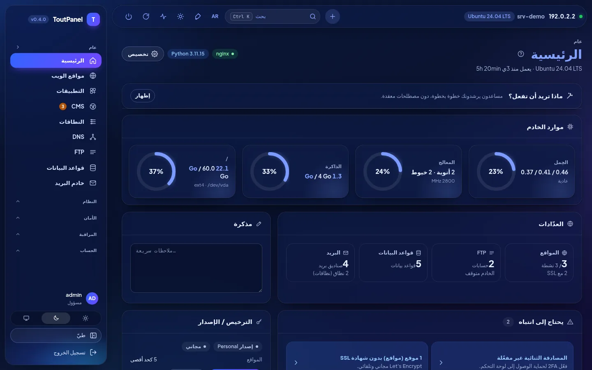<br>**الرئيسية، الوضع الداكن**: مقاييس وعدّادات ونقاط انتباه وترخيص | 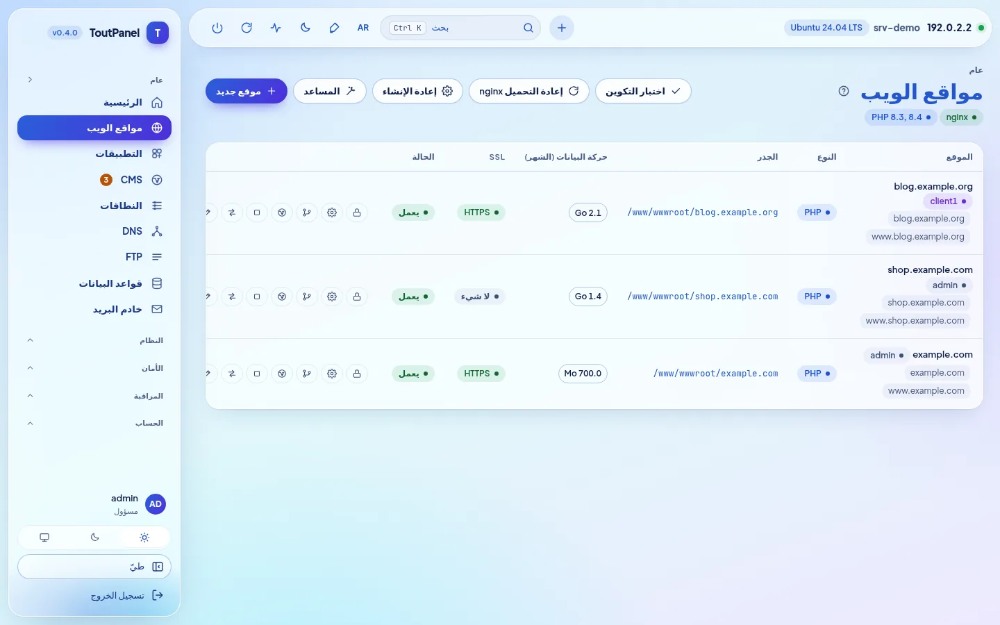<br>**المواقع**: النطاقات والنوع والجذر وحركة البيانات وSSL والإجراءات |
| <br>**PHP**: الإصدارات 5.6 → 8.5 جنبًا إلى جنب، وحالة الدعم، ومجمّعات FPM | <br>**إعدادات الموقع**: نشر Git وSSL وإعادة التوجيه والأمان |
| <br>**DNS**: مناطق BIND أو المزوّدين، والقوالب، وDNSSEC، والعنقود | <br>**الشهادات**: الصلاحية والجهة المُصدِرة والتجديد وشهادة اللوحة |
| 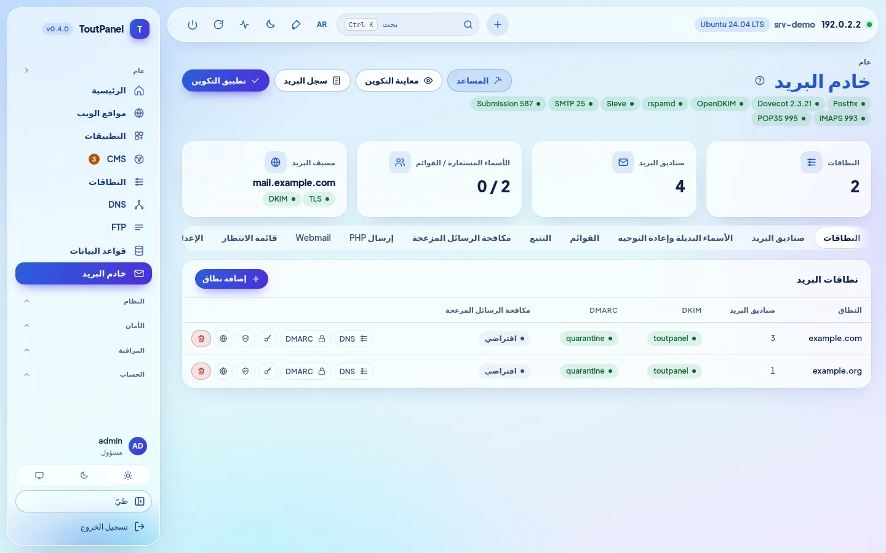<br>**خادم البريد**: Postfix وDovecot وOpenDKIM والمنافذ والتبويبات | <br>**بريد الويب**: Roundcube أو SnappyMail يُثبَّت بنقرة واحدة |
| 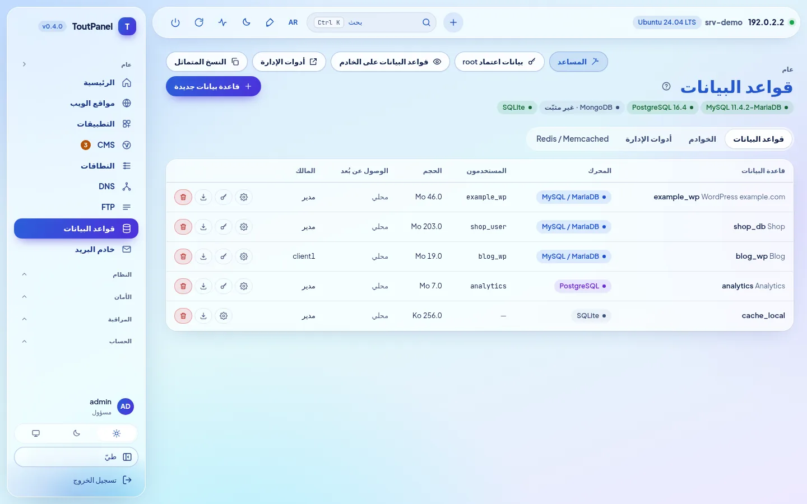<br>**قواعد البيانات**: MariaDB وPostgreSQL وMongoDB وSQLite وRedis | <br>**الملفات**: المحرر والأرشيفات والسلة والصلاحيات والشغل |
| <br>**CMS › التثبيت**: 582 نظام إدارة محتوى وتطبيقًا جرى التحقق منها، وبحث ومرشّحات وشارة «جاهز» | <br>**بطاقة نظام إدارة محتوى**: متطلبات جرى التحقق منها، واختيار الإصدار، والموقع المستهدف، وقاعدة البيانات |
| <br>**CMS › التثبيتات**: الإصدارات والتحديثات المتاحة والنسخ الاحتياطي والاستنساخ | <br>**WAF › المحرك**: ToutWAF موصى به، وWAF المدمج، وBunkerWeb، وSafeLine |
| <br>**الطرفية**: صدفة تفاعلية bash / PowerShell في المتصفح | <br>**التطبيقات**: WordPress وJoomla وDrupal وPrestaShop وNextcloud… |
| <br>**Store**: برمجيات الخادم والوحدات والسمات بنقرة واحدة | 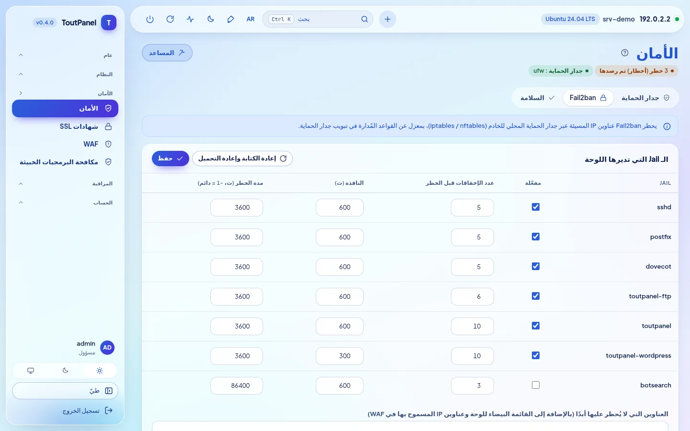<br>**الأمان**: التوصيات وجدار الحماية ومكافحة DDoS وFail2ban |
| 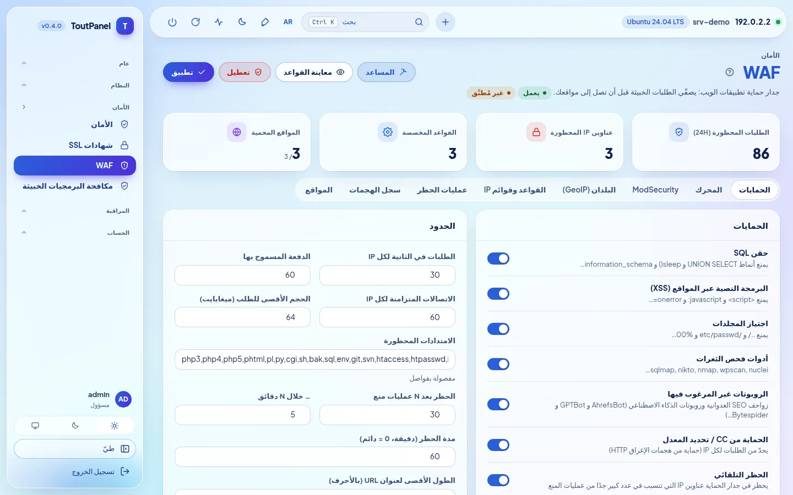<br>**WAF**: الحمايات والعتبات والمحركات وGeoIP وسجل الهجمات | <br>**المراقبة**: المعالج والذاكرة والشبكة والحِمل والقرص على مدى ساعة → 7 أيام |
| <br>**الحسابات**: الموزّعون والعملاء والخطط وملفات الوصول | <br>**الخوادم**: اللوحة الرئيسية والعُقد والتوجيه والترحيل |
| <br>**التحديثات**: حزم النظام (الأمان) واللوحة | <br>**الإعدادات**: الوصول والمنفذ والمدخل السري وHTTPS والواجهة |
| 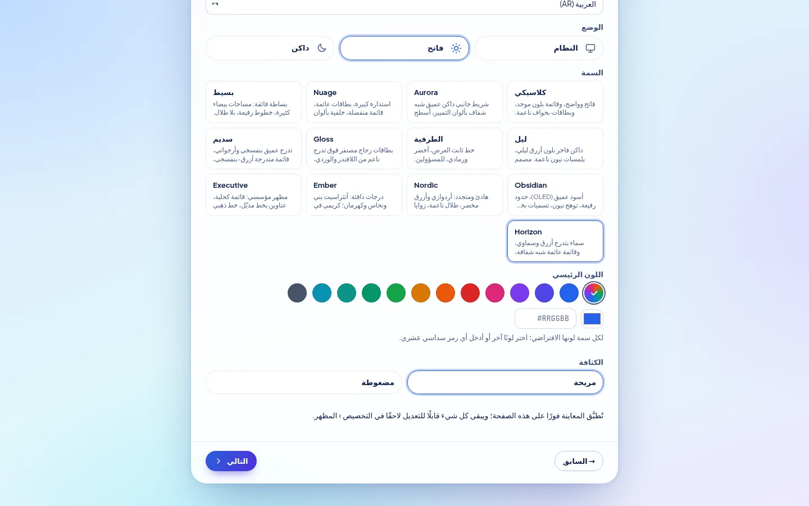<br>**معالج الإعداد**: السمة واللون الرئيسي والكثافة ومعاينة فورية | <br>**Horizon**، السمة الافتراضية: الشاشة نفسها بالوضعين الفاتح والداكن |

**مستجدات الإصدار 0.4** — لقطات من خادم عرض (عناوين التوثيق):

| | |
|---|---|
| <br>**معالج الإعداد، خطوة الملف التعريفي**: ملفات البدء، والذاكرة المكتشفة، والملف الموصى به | 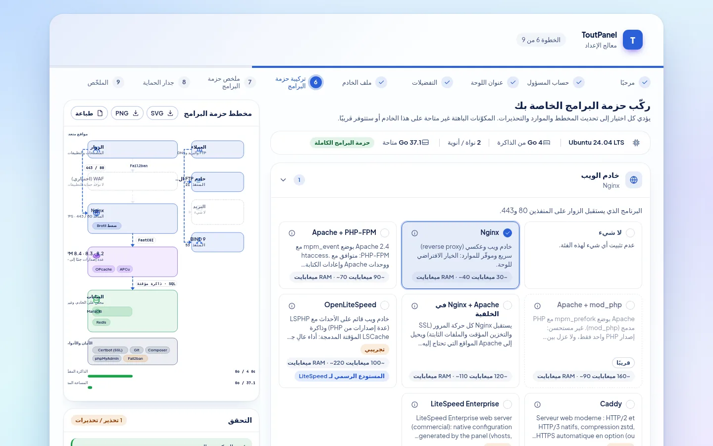<br>**تركيب الحزمة**: اختيار حسب الفئة، ومخطط البنية، والتحقق والموارد المقدَّرة |
| <br>**تثبيت الحزمة**: التقدّم والخطوات والاستئناف بعد الخطأ | <br>**المعالج، خطوة جدار الحماية**: تديره ToutPanel أو في المنبع، والمنافذ التي ستُفتح |
| <br>**الإعدادات › الحزمة البرمجية**: الحالة الفعلية والإصدارات المثبّتة ومخطط هذا الخادم | <br>**الحزمة البرمجية**، الوضع الداكن |
| <br>**المسرِّعات**: OPcache وJIT وAPCu وRedis وMemcached وFastCGI وVarnish… مع الحالة والذاكرة والحدود | <br>**OpenLiteSpeed** *(تجريبي)*: التثبيت وLSPHP وتبديل خادم الويب وWebAdmin |
| 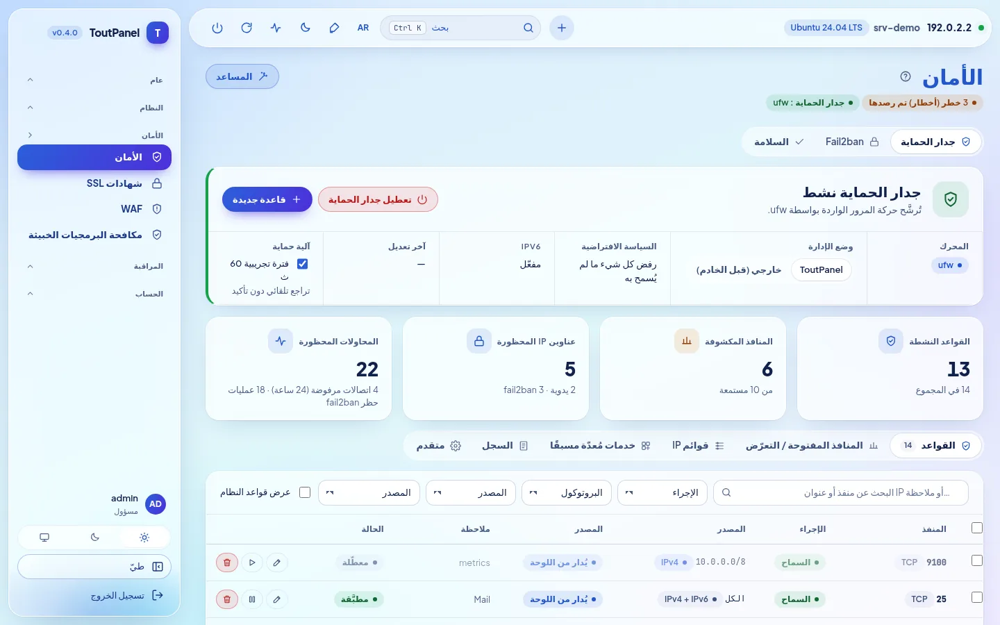<br>**الأمان › جدار الحماية**: المحرك وطريقة الإدارة والحاجز والقواعد | <br>**المنافذ قيد الاستماع وانكشافها**: مكشوف ومقيَّد ومحمي |
| <br>**جدار الحماية في المنبع**: المنافذ المطلوب فتحها لدى المضيف، للنسخ أو التنزيل | <br>**جدار الحماية**، الوضع الداكن |
| <br>**DNS › المحرك**: BIND وPowerDNS وKnot DNS ومزوّد خارجي | <br>**خادم البريد › المحرك**: Postfix وExim *(تجريبي)* وترحيل خارجي |
| <br>**FTP › المحرك**: مدمج وPure-FTPd وProFTPD وvsftpd وSFTP *(تجريبية)* | <br>**ToutWAF عن بُعد**: لوحة مرتبطة بـ ToutWAF على خادم آخر |
| <br>**الرئيسية**: شريط «توزيعة بحزمة مخفّفة» بحسب مستوى الدعم | |

**صفحات أُضيفت للإصدار 0.4.0** — الاصطلاحات نفسها (خادم عرض، عناوين التوثيق):

| | |
|---|---|
| 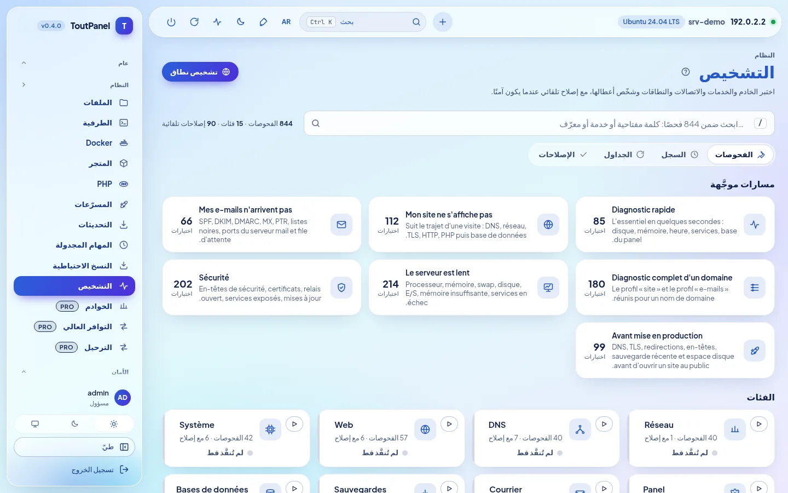<br>**النظام › التشخيص**: 844 فحصًا، ومسارات موجَّهة، وفئات، وبحث فوري | <br>**نتيجة تشخيص**: الأسباب المحتملة، ودليل تقني بأسرار محجوبة، و**إصلاح تلقائي** |
| <br>**الإصلاح التلقائي**: معاينة دقيقة لما سيُعدَّل، والأثر، وإمكانية التراجع | <br>**الرئيسية › «ماذا تريد أن تفعل؟»**: معالجات موجَّهة خطوة بخطوة |
| 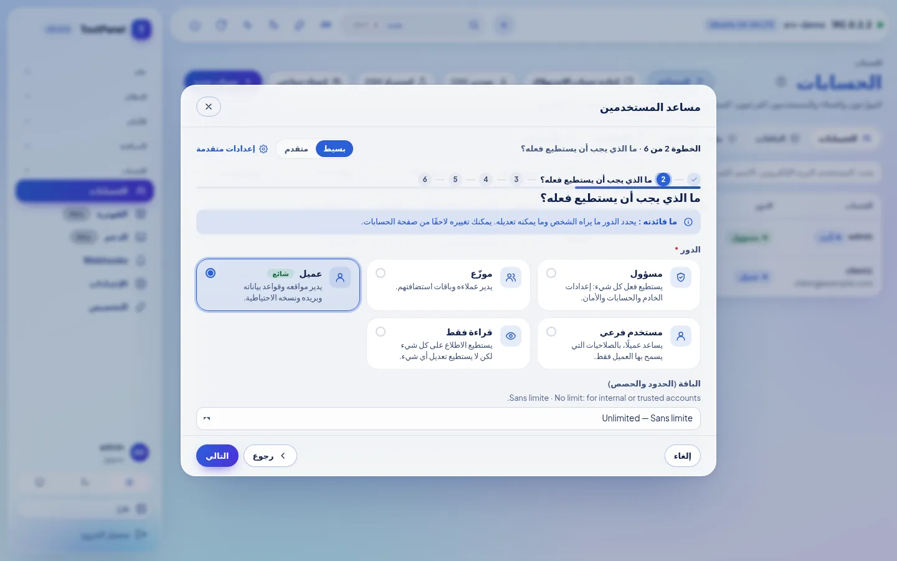<br>**معالج موجَّه** (هنا: مستخدم): الخطوات ومساعدة سياقية ووضع بسيط أو متقدم | <br>**اختبار فعلي بعد التطبيق**: النتيجة لكل فحص، والسبب المحتمل، وإصلاح بنقرة واحدة |
| <br>**التوافر العالي** *(Pro)*: IP عائم keepalived، والخوادم والأولويات، وحامل العنوان | <br>**المراقبة › أسطول الخوادم** *(Pro)*: التوافر والمعالج والذاكرة والقرص والحِمل لكل خادم |
| <br>**الخوادم** *(Pro)*: اللوحة الرئيسية وعُقد الويب / البريد / DNS والحالة وبصمة TLS المثبَّتة | <br>**الحسابات › الإعدادات › عزل الحسابات** *(خيار، معطّل افتراضيًا)*: PHP-FPM لكل حساب، وتشديد systemd، والقفص |
| <br>**الإعدادات › خادم الويب: Caddy** *(تجريبي)*: التبديل مع إمكانية الرجوع، وHTTPS، والميزات غير المدعومة | <br>**LiteSpeed Enterprise** *(تجريبي؛ لم يُشغَّل قط في تجاربنا)*: الترخيص والتثبيت الرسمي وLSPHP |
| <br>**Store › الوحدات**: Marketplace التكاملات (الفوترة والمراقبة وSSO وCI/CD وDNS / CDN…) | 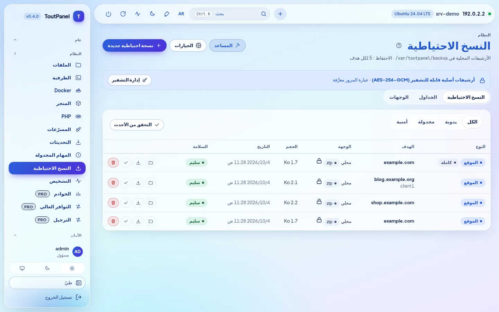<br>**النسخ الاحتياطية**: أرشيفات مشفَّرة (AES-256-GCM)، كاملة أو تزايدية |
| <br>**تشفير النسخ الاحتياطية**: عبارة مرور محفوظة مشفَّرة، وتحذير من الفقدان، وتشفير افتراضي أو إلزامي | <br>**الجداول الزمنية**: النطاق والاحتفاظ والوجهة والتزايدية |
| <br>**الإعدادات › الأمان**: تنبيهات الاتصال غير المعتاد وSSO عبر OIDC / SAML | <br>**SSO** *(Pro)*: LDAP / Active Directory وOpenID Connect وSAML 2.0 |

**على الجوال**، تتكيف الواجهة (قائمة قابلة للطي، وجداول قابلة للتمرير):

<table>
<tr>
<td align="center"><br><b>الرئيسية</b></td>
<td align="center"><br><b>المواقع</b></td>
</tr>
</table>

> أُخذت اللقطات على خادم عرض (Ubuntu 24.04، وعنوان التوثيق 192.0.2.2، ونطاقات أمثلة). في خادم العرض هذا، بعض الحالات **محاكاة** (لا تعمل عليه أي خدمة حقيقية): عزل الحسابات (systemd وcgroups) وCaddy وأسطول الخوادم وIP العائم وقواعد البيانات والبريد وWAF وفهرس Marketplace؛ أما التشخيصات والمعالجات فتُنفَّذ فعليًا. توجد لقطات بلغات أخرى في `screenshots/<langue>/` (en وde وes وit وnl وpt وru وzh وar).

<a id="themes"></a>

## السمات

### 13 سمة، ولونك أنت

يستخدم أي تثبيت جديد **Horizon**: سماء متدرجة بين الأزرق والسماوي، وقائمة وشريط علوي عائمان شبه شفافين، وحبّة نشطة بتدرج أزرق-بنفسجي تتبع اللون المختار، وعناوين زرقاء غليظة جدًا. **التخصيص › المظهر**: اختر تصميمًا آخر، ثم **أي لون تمييز** (12 لونًا مسبقًا، أو قطّارة، أو الرمز `#RRGGBB`). تستمد اللوحة منه الأزرار والروابط والقائمة النشطة والشارات والتدرجات والرسوم البيانية، مع الحفاظ على تباين لا يقل عن 4,5:1. تتوفر كل سمة بالوضعين **الفاتح والداكن**، وتراعي التباين العالي واللغات المكتوبة من اليمين إلى اليسار؛ والمعاينة فورية، ولا يُحفظ شيء قبل «حفظ التصميم». كما تُضبط الكثافة والزوايا والخط والعرض وموضع القائمة والأيقونات والحركات، لكل مستخدم أو افتراضيًا للجميع؛ والسمة قابلة للتصدير والاستيراد.


| | | |
|---|---|---|
| <br>**Horizon** *(افتراضية)* · `#2b5fd9` | <br>**Classique** · `#2563eb` | <br>**Aurora** · `#2563eb` |
| <br>**Nuage** · `#5b5bd6` | <br>**Minimal** · `#18181b` | <br>**Nuit** · `#0369a1` |
| <br>**Terminal** · `#15803d` | <br>**Gloss** · `#7c3aed` | <br>**Nébuleuse** · `#8b5cf6` |
| <br>**Obsidian** · `#22c55e` | <br>**Nordic** · `#14b8a6` | <br>**Ember** · `#f97316` |
| <br>**Executive** · `#10b981` | | |

<sub>اللون المذكور: لون التمييز الافتراضي للسمة في الوضع الفاتح، وقابل للتعديل بحرية.</sub>

يمكن أيضًا اختيار السمة والوضع و**اللون الرئيسي** و**الكثافة** منذ **معالج الإعداد** (خطوة التفضيلات)، مع معاينة فورية؛ وهي القيم الافتراضية لجميع الحسابات، ويمكن لكل حساب أن يختار قيمه بعد ذلك.

<a id="editions"></a>

## الإصدارات

البرنامج هو نفسه لجميع الإصدارات: **مفتاح ترخيص** يفعّل الميزات المتقدمة على خادم معيّن. يعمل أي تثبيت جديد بالإصدار الشخصي، دون تسجيل ودون اتصال بالإنترنت.

| الإصدار | السعر | المفتاح | لمن |
|---|---|---|---|
| **الشخصي** | مجاني، دون حد زمني | بلا | الاستخدام الشخصي: مواقعك الخاصة، **حتى 5** |
| **الاحترافي** | مدفوع | إلزامي | المضيفون والوكالات والاستخدام المهني: كل شيء مضمَّن، ومواقع غير محدودة (أو بحسب خطة الترخيص) |
| **Enterprise** | مدفوع | إلزامي | الاحترافي + تعدد خوادم غير محدود + دعم ذو أولوية |

الإصدار الشخصي **كامل**: المواقع وPHP متعدد الإصدارات وقواعد البيانات والبريد وDNS وSSL وWAF المدمج والنسخ الاحتياطية المحلية (**بما فيها تشفير AES-256-GCM والنسخ التزايدية**) والمراقبة والتشخيص اليدوي والمعالجات الموجَّهة (الخطوات التي تمس ميزة Pro تبقى محجوزة) وحسابات العملاء والمستخدمين الفرعيين وWebAuthn وأدوات GDPR وAPI وCLI. ويُحجز للإصدارات المدفوعة:

<details>
<summary><b>القائمة الدقيقة لميزات الإصدارين الاحترافي / Enterprise</b></summary>

| الميزة | الشخصي | الاحترافي |
|---|---|---|
| المواقع | 5 كحد أقصى | غير محدودة (أو بحسب الترخيص) |
| فحوص uptime | 3 | غير محدودة |
| Webhooks الصادرة | 2 | غير محدودة |
| اختيار محرك WAF (ToutWAF وBunkerWeb وSafeLine) | WAF المدمج | ✓ |
| ModSecurity + OWASP CRS | — | ✓ |
| تعدد الخوادم: العُقد والتوافر العالي والترحيل الفوري | — | ✓ |
| مجموعات الويب وعنقود DNS | — | ✓ |
| تكرار قواعد البيانات | — | ✓ |
| الفوترة والبوابات وWHMCS والتوفير | — | ✓ |
| العلامة البيضاء للموزّعين | — | ✓ |
| نطاق مخصص للوحة | — | ✓ |
| الدعم (التذاكر) | — | ✓ |
| الإعلانات | — | ✓ |
| حسابات الموزّعين | — (العملاء والمستخدمون الفرعيون: ✓) | ✓ |
| SSO عبر LDAP / OpenID Connect / SAML | — (WebAuthn: ✓) | ✓ |
| الحظر حسب البلد (GeoIP) | — | ✓ |
| مكافحة البرمجيات الخبيثة المجدولة | فحص يدوي | ✓ |
| النسخ الاحتياطية البعيدة (S3 وSFTP وB2 وrsync SSH وrclone) | تخزين محلي (بما فيه الأرشيفات المشفَّرة والتزايدية) | ✓ |
| محركات restic وBorg وrsync | — | ✓ |
| تصدير Prometheus `/metrics` | — | ✓ |
| الاستيراد من cPanel وPlesk وDirectAdmin وISPConfig والاستضافة المشتركة وIMAP | — (التصدير: ✓) | ✓ |
| الوحدات المميزة (premium) في Store | — | ✓ |
| الإرساء الخارجي لسجل التدقيق | — (تصدير GDPR وتطهيره: ✓) | ✓ |
| تشخيصات مجدولة مع تنبيه | تشخيص يدوي | ✓ |

</details>

- تحمل المداخل المعنية شارة **Pro**؛ وتبقى الصفحات متاحة للاطلاع، ولا يُحجز سوى الإنشاء والتعديل.
- التفعيل: **الإعدادات › الترخيص › تفعيل مفتاح** (`TP-XXXXX-XXXXX-XXXXX-XXXXX`) أو `toutpanel licence activate <clé>`. يُتحقق من الرمز الموقَّع محليًا: يعمل الترخيص دون اتصال (إعادة تحقق يومية، وفترة سماح 15 يومًا).
- إذا انتهى الترخيص أو لم يعد صالحًا، **تعود اللوحة إلى الإصدار الشخصي دون حذف أي شيء**.

الأسعار والشراء: **[toutpanel.com/tarifs](https://toutpanel.com/tarifs)** · التفاصيل: [الإصدارات والترخيص](https://toutpanel.com/docs/guide/editions/).

<a id="architecture"></a>

## البنية

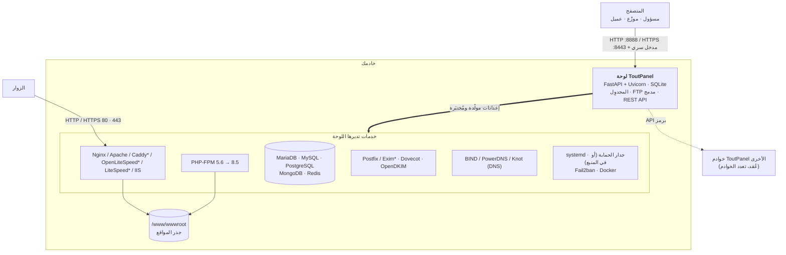

| المكوّن | الدور |
|---|---|
| **اللوحة** | تطبيق FastAPI تقدّمه Uvicorn (خدمة systemd باسم `toutpanel` على Linux، ومهمة مجدولة `ToutPanel` على Windows). واجهة ويب دون اعتماديات خارجية، وREST API، ومجدوِل مهام، وخادم FTP مدمج. |
| **حزمة الويب** | Nginx و/أو Apache (‏Caddy وOpenLiteSpeed مع LSPHP وLiteSpeed Enterprise: تجريبية؛ وIIS على Windows) مع PHP-FPM؛ تكتب اللوحة vhosts من قوالبها، وتختبرها، ثم تعيد تحميل الخدمة. ويختار **مُركِّب الحزمة** البرمجيات ويطوّرها. |
| **الخدمات** | MariaDB / MySQL / PostgreSQL / MongoDB، وPostfix (أو Exim*) / Dovecot / OpenDKIM، وBIND (أو PowerDNS أو Knot)، وFTP (مدمج أو Pure-FTPd* أو ProFTPD* أو vsftpd*)، وFail2ban، وجدار الحماية، وDocker: تديرها اللوحة عبر أدواتها الأصلية. |
| **CLI `toutpanel`** | إدارة اللوحة (المنفذ والمدخل وكلمة المرور والتحديث والترخيص…) وأوامر مهنية قابلة للبرمجة النصية (`--json`). |

<sub>\* تجريبي</sub>

```
<home>  (/var/toutpanel أو C:\toutpanel)
├── data/      قاعدة SQLite الخاصة باللوحة، وsettings.json، والمفاتيح، وinstall-info.txt
├── logs/      panel.log وسجلات المواقع
├── vhost/     vhosts المولَّدة (إذا غاب المجلد الأصلي لخادم الويب)
├── ssl/       شهادات المواقع واللوحة
├── backup/    النسخ الاحتياطية المحلية
├── src/       نسخة مستنسخة من هذا المستودع (القنوات، والوسوم، toutpanel update)
└── venv/      بيئة Python الخاصة باللوحة
/www/wwwroot   جذر المواقع (C:\toutpanel\wwwroot على Windows)
```

<a id="installation-complete"></a>

## التثبيت الكامل

### المتطلبات

| | Linux | Windows |
|---|---|---|
| **الأنظمة** | المستوى **الكامل**: Debian 11 وما بعده، وUbuntu 20.04 وما بعده، وAlmaLinux / Rocky Linux / RHEL / CentOS Stream / Oracle Linux / CloudLinux 8 وما بعده، وFedora · المستوى **المخفَّض** (تعمل اللوحة، لكن تنقص بعض الميزات): Debian 10 وUbuntu 18.04 وCentOS / RHEL 7 وAmazon Linux وopenSUSE / SLES وArch وAlpine وDevuan · انظر [توافق التوزيعات](#compat) | Windows 10 و11 · Windows Server 2016 و2019 و2022 و2025 (الإصدار 14393 كحد أدنى) |
| **الصلاحيات** | `root` (أو `sudo`) و`bash` | PowerShell 5.1+ **بصلاحية المسؤول** (لا حاجة إلى winget) |
| **Python** | من 3.9 إلى 3.14 (يثبّته السكربت إذا وفّرته التوزيعة) | يثبّته السكربت (3.12، من python.org) إن كان غائبًا |
| **الذاكرة** | 1 جيجابايت كحد أدنى (اللوحة وحدها)، و2 جيجابايت موصى بها مع MariaDB وPHP | المثل |
| **القرص** | 2 جيجابايت حرة + مواقعك | المثل |
| **الشبكة** | وصول صادر عبر HTTPS (GitHub وPyPI ومستودعات التوزيعة وLet's Encrypt)؛ وعنوان IP عام ثابت وDNS عكسي للبريد | المثل (python.org وnginx.org وwindows.php.net وMariaDB) |

المعماريات: `x86_64` و`aarch64` (غيرها: مستوى مخفَّض). يُفضَّل التثبيت على خادم **حديث التثبيت**. وعلى خادم تكون فيه Nginx أو Apache أو MariaDB مُهيَّأة بالفعل، استخدم `--stack none`: تكتشفها اللوحة وتكتب vhosts الخاصة بها في مجلدها الأصلي دون المساس بالباقي.

<a id="compat"></a>

### توافق التوزيعات

يكتشف المثبّت واللوحة التوزيعة (`/etc/os-release` والمعمارية) ويعرضان **مستوى دعم**: يسرد `toutpanel compat` التوزيعات المعروفة، ويعطي `toutpanel check` مستوى خادمك، وينبّه شريط في الرئيسية عندما لا يكون المستوى «كاملًا». **لا يوجد سقف للإصدار أبدًا**: يُعامل إصدار أحدث من عائلة معروفة كأنه آخر إصدار معروف.

| المستوى | المعنى | أمثلة |
|---|---|---|
| **كامل** | الحزمة الكاملة مقرَّرة (خادم الويب وPHP متعدد الإصدارات وقواعد بيانات بإصدارات اختيارية والبريد وجدار الحماية والتحديثات التلقائية) | Debian 11+ وUbuntu 20.04+ (LTS والوسيطة) وAlmaLinux / Rocky / RHEL / CentOS Stream / Oracle Linux 8+ وCloudLinux 8 و9 وFedora وRaspberry Pi OS بنظام 64 بت |
| **مخفَّض** | تعمل اللوحة، لكن تنقص بعض الميزات أو تتطلب تدخلًا (نظام منتهي الدعم، أو init بلا systemd، أو غياب مستودعات الأطراف الثالثة، أو معمارية 32 بت)؛ تحذير غير مانع | Debian 10 وUbuntu 18.04 وCentOS / RHEL 7 وAmazon Linux 2 و2023 (PHP واحد في كل مرة) وopenSUSE / SLES وArch ومشتقاتها وAlpine وDevuan وKali |
| **غير مدعوم** | نظام مجهول أو قديم جدًا أو غير قابل للتعديل (immutable): يخبر المثبّت بذلك ويتوقف | Fedora CoreOS / Silverblue وMicroOS وFlatcar وGentoo وNixOS وVoid |

يصف «كامل» المستوى **المقرَّر** في اللوحة؛ و**أُجريت التجارب على Ubuntu 24.04**، مع استثناء واحد: **AlmaLinux 9.8 و10.2 مع SELinux Enforcing** (مختبر QEMU بتاريخ 4 أكتوبر 2026)؛ ولم يُجرَ التحقق الشامل على التوزيعات الأخرى، بما فيها Rocky Linux وRHEL وFedora (انظر [الحدود المعروفة](#known-limits)). يُوفَّر Python 3.9+ إن كان النظام قديمًا جدًا (حزمة حديثة من التوزيعة أو Python مستقل يُتحقق منه بـ SHA-256، بموافقتك).

### Linux

```bash
curl -sSL https://raw.githubusercontent.com/qu3ntin01/toutpanel/main/install.sh | sudo bash
```

لقراءة السكربت قبل تنفيذه:

```bash
curl -sSLO https://raw.githubusercontent.com/qu3ntin01/toutpanel/main/install.sh
less install.sh
sudo bash install.sh
```

يستغرق التثبيت من 3 إلى 6 دقائق بحسب الاتصال.

**معالج التثبيت.** تُختار جميع الخيارات (الحساب والمنافذ والمجلد والحزمة وجدار الحماية وWAF والإصدار واللغة…) بقوائم على **[toutpanel.com/installation-assistant](https://toutpanel.com/installation-assistant)**، الذي يولّد سطر الأوامر ويتحقق منه مباشرة (ولا تظهر فيه الأسرار نصًا صريحًا أبدًا).

**تثبيت إصدار محدد.** يثبّت الأمر القياسي آخر إصدار مستقر؛ ويختار `--version` إصدارًا آخر (القائمة: `--list-versions`). تُنشر الإصدارات التمهيدية على قناة `dev` وتُثبَّت بـ `--channel dev`:

```bash
# آخر إصدار مستقر
curl -sSL https://raw.githubusercontent.com/qu3ntin01/toutpanel/main/install.sh | sudo bash
# إصدار محدد (القائمة: --list-versions)
curl -sSL https://raw.githubusercontent.com/qu3ntin01/toutpanel/main/install.sh | sudo bash -s -- --list-versions
curl -sSL https://raw.githubusercontent.com/qu3ntin01/toutpanel/main/install.sh | sudo bash -s -- --version 0.4.0
# آخر إصدار تمهيدي (قناة dev)
curl -sSL https://raw.githubusercontent.com/qu3ntin01/toutpanel/dev/install.sh | sudo bash -s -- --channel dev
```

**القائمة التفاعلية.** عند تشغيل السكربت في طرفية دون خيار وضع، يقدّم ToutPanel ويكتشف أي تثبيت قائم ويقترح: **التثبيت** (الحزمة الكاملة) أو **تثبيت اللوحة وحدها**، وربما في **وضع العقدة**؛ أو، إذا كانت اللوحة موجودة، **التحديث** أو **إعادة التثبيت الكاملة** أو **إلغاء التثبيت**. ويسأل أيضًا عن **جدار الحماية** (ToutPanel / في المنبع / لاحقًا) وعن **ملف الحزمة التعريفي** بعد إقلاع اللوحة. ودون طرفية (أتمتة، `--yes`)، لا يسأل: بل يثبّت، أو يحدّث إن كانت اللوحة موجودة (جدار الحماية «لاحقًا»، والحزمة الافتراضية).

**ما يفعله السكربت:**

1. يثبّت Python 3.9+ عند الحاجة وينشئ البيئة الافتراضية `<home>/venv`؛
2. يثبّت **حزمة الويب** (Nginx وPHP-FPM وMariaDB وRedis أو Valkey وCertbot وFail2ban) كما في السابق، أو الحزمة التي تركّبها (`--profile` و`--web` و`--php` و`--db`… تُمرَّر إلى `toutpanel stack apply`)؛
3. يستنسخ هذا المستودع في `<home>/src`، و**يتحقق من مجموع SHA-256** لحزمة wheel المطابقة لـ Python في النظام ويثبّتها؛
4. ينشئ **حساب مسؤول** و**عنوان وصول سري** عشوائيين؛
5. يسجّل **خدمة systemd** باسم `toutpanel`؛
6. يضبط **جدار الحماية** وفق `--firewall`: `on` (تديره ToutPanel وتفتح المنافذ اللازمة)، و`off` (جدار حماية في المنبع: لا قاعدة نظام، وقائمة بالمنافذ المطلوب فتحها لدى المضيف)، وسؤال في الطرفية، وإلا «لاحقًا» (لا يُمَسّ شيء)؛
7. يهيّئ **SELinux** (Alma وRocky وRHEL وFedora) أو **AppArmor** (Debian وUbuntu وSUSE)؛
8. يعرض ملخصًا، يُحفَظ في `<home>/data/install-info.txt` (قابل للقراءة من root فقط).

#### خيارات `install.sh`

| الخيار | الوصف | الافتراضي |
|---|---|---|
| `--stack full` | **متقادم** (انظر `--profile`): Nginx + PHP-FPM + MariaDB + Redis/Valkey + Certbot + Fail2ban | ✓ |
| `--stack minimal` | **متقادم**: Nginx + PHP-FPM + Certbot | |
| `--stack none` | **متقادم**: اللوحة فقط (خادم مُهيَّأ مسبقًا) | |
| `--profile NOM` | ملف **مُركِّب الحزمة** التعريفي: `single-site` و`multi-site` و`hosting` و`performance` و`application` و`mail-only` و`dns-only` و`node` و`lamp` و`standard` و`custom` (قيم الخيارات الأخرى: انظر الجدول أدناه) | الحزمة الافتراضية |
| `--web`, `--php`, `--php-default`, `--php-ext`, `--db`, `--redis`, `--accel`, `--ftp`, `--mail MOTEUR`, `--dns`, `--security`, `--runtime`, `--tools`, `--install-mode`, `--roles`, `--stack-file`, `--no-tuning` | خيارات المُركِّب، تُمرَّر كما هي إلى `toutpanel stack apply … --yes` بعد تثبيت اللوحة (فشل الحزمة لا يُفشل التثبيت: يُعرض أمر الاستئناف) | |
| `--accept-litespeed-license` | مع `--web litespeed[:6.3]`: يقبل عقد ترخيص LiteSpeed Technologies؛ **إلزامي** (وبدونه يتوقف المثبّت قبل أي تعديل)، وغير متوافق مع `--stack`، ومرفوض على Windows. **LiteSpeed Enterprise منتج تجاري تجريبي، ولم يُشغَّل قط في بيئة التطوير**: تجربة رسمية لمدة 15 يومًا ثم ترخيص مدفوع | لا |
| `--mail` | (وحده) يضيف Postfix وDovecot وOpenDKIM ويفتح منافذ البريد | لا |
| `--firewall on\|off\|ask` | من يدير جدار الحماية: ToutPanel (`on`)، أو جدار حماية في المنبع دون قاعدة نظام (`off`)، أو سؤال (`ask`)؛ ودون طرفية ولا قيمة: «لاحقًا»؛ ولا يُعدَّل أبدًا بتحديث | سؤال في الطرفية |
| `--firewall-engine nft\|ufw\|firewalld\|csf\|iptables` | محرك جدار الحماية الذي تديره ToutPanel | يُكتشف |
| `--dry-run` | يعرض التوزيعة المكتشفة والمجلد والأوامر المقررة، دون تعديل أي شيء (دون root) | لا |
| `--postgres` | يضيف PostgreSQL (تُولَّد كلمة مرور الدور `postgres` وتُسجَّل في اللوحة) | لا |
| `--waf toutwaf` | ينشر **ToutWAF**، WAF الناشر، أمام المواقع بمثبّته الرسمي (خدمات systemd، دون Docker؛ ينتقل خادم الويب إلى 8080 / 8443، ووحدة التحكم على 9443، والملخص في `/etc/toutwaf/INSTALL-SUMMARY.txt`) | لا |
| `--waf bunkerweb` / `--waf safeline` | يثبّت Docker وينشر WAF الخارجي أمام المواقع (ينتقل خادم الويب إلى 8080 / 8443، ووحدة التحكم على 7000 أو 9443) | لا |
| `--waf toutwaf --waf-console URL` | **ToutWAF عن بُعد**: يربط اللوحة بـ ToutWAF مثبَّت على خادم آخر (دون أي تثبيت محلي)، مع `--waf-origin-ip` و`--waf-origin-addr` و`--waf-cert-mode import\|acme` و`--waf-server-id` و`--waf-fingerprint` أو `--waf-trust-first-use` و`--waf-restrict` (المنفذان 80 / 443 مقصوران على ToutWAF)؛ ويُعطى الرمز بـ `--waf-token-file FICHIER` أو `--waf-token-stdin` (وليس وسيطًا أبدًا) | لا |
| `--node` | وضع **العقدة** في تعدد الخوادم: اللوحة عبر HTTPS فقط، ويُعرض رمز التسجيل وعنوان API وبصمة TLS (تُدخَل على اللوحة الرئيسية: النظام › الخوادم › إضافة) | لا |
| `--master URL` | مع `--node`: عنوان URL للوحة الرئيسية | — |
| `--port N` | منفذ **HTTP** للوحة | `8888` |
| `--https-port N` | منفذ **HTTPS** للوحة (تستمع اللوحة عبر HTTP **و** HTTPS؛ شهادة موقَّعة ذاتيًا في البداية) | `8443` |
| `--version X.Y.Z` | يثبّت هذا الإصدار المنشور (أيضًا `vX.Y.Z` أو `0.4.0b1` أو `0.4.0-beta.1`؛ المتغير `TOUTPANEL_VERSION`)؛ يستلزم الإصدار التمهيدي القناة `dev`؛ إصدار غير موجود أو بلا wheel لـ Python لديك: توقف قبل أي تعديل مع قائمة الإصدارات؛ والرجوع إلى إصدار أقدم يتطلب تأكيدًا (إلا مع `--yes`) | آخر إصدار في القناة |
| `--list-versions` | يسرد الإصدارات المنشورة (الأحدث أولًا) ثم يخرج، دون تثبيت أي شيء | |
| `--random-port` | منفذ عشوائي بين 20000 و39999 | |
| `--username NOM` | اسم حساب المسؤول | `admin_xxxxxx` عشوائي |
| `--password MDP` | كلمة مرور المسؤول (ظاهرة في `ps` وفي سجل الصدفة: فضّل الخيارات الثلاثة التالية) | 16 حرفًا عشوائيًا |
| `TOUTPANEL_PASSWORD` | متغير بيئة يعطي كلمة المرور (يحتفظ به `sudo -E`)؛ ويتغلب الخيار على المتغير | — |
| `--password-file FICHIER` | يقرأ كلمة المرور من السطر الأول لملف (على Linux، مقصور على مالكه: `chmod 600`) | — |
| `--password-stdin` | يقرأ كلمة المرور من الإدخال القياسي (السطر الأول؛ لا يصلح مع `curl \| bash`) | — |
| `--entrance /chemin` | المدخل الآمن في عنوان URL | `/tp_xxxxxxxxxx` عشوائي |
| `--home DIR` | مجلد اللوحة (يُكتشف ويُحتفَظ بأي تثبيت قائم في المجلد الافتراضي القديم `/www/toutpanel`) | `/var/toutpanel` |
| `--source DIR` | التثبيت من مجلد محلي (نسخة من هذا المستودع مع `dist/`) | استنساخ الفرع |
| `--branch NOM` | فرع Git المطلوب تنزيله | `main` |
| `--channel stable\|dev` | قناة التحديث، تُسجَّل في اللوحة | `stable` |
| `--update` | يحدّث تثبيتًا قائمًا (يُكتشف تلقائيًا): نسخ احتياطي للبيانات، وشيفرة جديدة، وترحيل قاعدة البيانات، وإعادة تشغيل | تلقائي |
| `--reinstall` | يفرض تثبيتًا كاملًا حتى لو كانت اللوحة موجودة | لا |
| `--uninstall` | يلغي تثبيت اللوحة (تبقى المواقع وقواعد البيانات، وتُؤرشَف بيانات اللوحة) | لا |
| `--yes`, `-y` | دون أي سؤال (القائمة والتأكيدات) | لا |
| `--lang xx` | لغة المثبّت واللغة الأولية للوحة: `en` و`fr` و`de` و`es` و`it` و`pt` و`nl` و`ru` و`zh` و`ar` | لغة النظام، وإلا `en` |
| `--en`, `--fr`, `--de`, `--es`, `--it`, `--pt`, `--nl`, `--ru`, `--zh`, `--ar` | اختصارات لـ `--lang` | |
| `-h`, `--help` | يعرض مساعدة السكربت | |

مصدر واحد لكلمة المرور في كل مرة (يُرفض خياران قبل أي تعديل). ودون أي منها، تقترح طرفية تفاعلية «توليد تلقائي (موصى به)» أو «إدخال» (دون صدى، مع تأكيد)؛ ودون طرفية أو مع `--yes`، تُولَّد كلمة مرور وتُعرض في النهاية. لا تُعرض كلمة المرور المقدَّمة ولا تُكتب في الملخص أو في `install-info.txt`، ولا يعدّلها أي تحديث أبدًا.

**قيم خيارات الحزمة** (يُتحقق منها قبل أي تعديل؛ **\*** = تجريبي):

| الخيار | القيم |
|---|---|
| `--web` | `nginx` و`apache` و`nginx-apache` و`caddy`\* و`openlitespeed`\* (`:1.9` و`:1.8` و`:1.7`) و`litespeed`\* (`:6.3` و`:6.2` و`:6.1` و`:6.0`؛ LiteSpeed Enterprise، تجاري، ويتطلب `--accept-litespeed-license`) و`none`؛ ويقبل `toutpanel stack apply` القيم نفسها |
| `--php` / `--php-default` / `--php-ext` | إصدارات مفصولة بفواصل (`8.3,8.4`، من 5.6 إلى 8.5) / الإصدار الافتراضي / `minimal` و`standard` و`full` |
| `--db` | `mariadb` (`:10.6` و`:10.11` و`:11.4` و`:11.8`) و`mysql`\* (`:8.4` و`:9.7`) و`percona`\* (`:8.0` و`:8.4`) و`postgresql` (من `:13` إلى `:18`) و`none` |
| `--accel` | `opcache` و`jit` و`apcu` و`redis` و`memcached` و`fastcgi-cache` و`varnish`\* و`brotli` و`zstd`\* و`http3`\* و`ioncube` |
| `--ftp` | `builtin` و`pureftpd`\* و`proftpd`\* و`vsftpd`\* و`sftp`\* و`none` |
| `--mail` | `postfix` و`postfix-clamav` و`postfix-light` و`exim`\* و`relay` و`none` |
| `--dns` | `bind` و`powerdns` و`knot` و`external` و`none` |
| `--security` | `firewall` و`fail2ban` و`modsecurity` و`clamav` و`toutwaf` |
| `--runtime` / `--tools` | `nodejs` و`python` و`go` و`ruby` و`java` و`docker` / `certbot` و`git` و`composer` و`phpmyadmin` و`adminer` و`restic` و`goaccess` |
| `--install-mode` / `--roles` | `single-server` و`single-site` و`multi-site` و`multi-server` / `web` و`db` و`mail` و`dns` |

يرفض `toutpanel stack` مكوّنًا «قادمًا قريبًا» (Apache + mod_php) بوضوح، دون تثبيت أي شيء.

أمثلة:

```bash
sudo bash install.sh --stack minimal --port 7443
sudo bash install.sh --profile lamp --php 8.3,8.4 --db mariadb:11.4 --firewall on
sudo bash install.sh --profile hosting --mail postfix-clamav --dns bind --firewall off --yes
sudo bash install.sh --dry-run --profile lamp          # محاكاة
sudo bash install.sh --mail --postgres
sudo bash install.sh --mail --username moi --password-file /root/mot-de-passe.txt --entrance /mon-acces
sudo bash install.sh --profile performance --web openlitespeed --php 8.3 --accel opcache,redis --firewall off --yes   # OpenLiteSpeed: تجريبي
sudo bash install.sh --web litespeed:6.3 --php 8.3 --accept-litespeed-license --yes   # LiteSpeed Enterprise: تجاري، تجريبي، الترخيص إلزامي (Linux فقط)
sudo bash install.sh --waf toutwaf                 # WAF الناشر أمام المواقع
sudo bash install.sh --stack minimal --node --master https://maitre.exemple.com:8888   # خادم تديره لوحة رئيسية
curl -sSL https://raw.githubusercontent.com/qu3ntin01/toutpanel/main/install.sh | sudo bash -s -- --yes --random-port
curl -sSL https://raw.githubusercontent.com/qu3ntin01/toutpanel/main/install.sh | sudo bash -s -- --channel dev
curl -sSL https://raw.githubusercontent.com/qu3ntin01/toutpanel/main/install.sh | sudo bash -s -- --ar   # مثبّت بالعربية
```

<a id="installer-lang"></a>

#### لغة المثبّت

المثبّتان **متعددا اللغات**: تظهر اللافتة والقائمة والأسئلة والخطوات والتحذيرات والأخطاء والمساعدة والملخص و`install-info.txt` بإحدى **اللغات العشر** أدناه، و**بالإنجليزية افتراضيًا**. وتصبح اللغة المعتمدة أيضًا **اللغة الأولية للوحة** (التثبيت وإعادة التثبيت)؛ ويشير سطر تحت اللافتة إلى اللغة المختارة ومصدرها.

| اللغة | `--lang` | اختصار Linux | Windows |
|---|---|---|---|
| English *(الافتراضية)* | `en` | `--en` | `-Lang en` / `-En` |
| Français | `fr` | `--fr` | `-Lang fr` / `-Fr` |
| Deutsch | `de` | `--de` | `-Lang de` / `-De` |
| Español | `es` | `--es` | `-Lang es` / `-Es` |
| Italiano | `it` | `--it` | `-Lang it` / `-It` |
| Português | `pt` | `--pt` | `-Lang pt` / `-Pt` |
| Nederlands | `nl` | `--nl` | `-Lang nl` / `-Nl` |
| Русский | `ru` | `--ru` | `-Lang ru` / `-Ru` |
| 中文 | `zh` | `--zh` | `-Lang zh` / `-Zh` |
| العربية | `ar` | `--ar` | `-Lang ar` / `-Ar` |

ترتيب الأولوية، من الأقوى إلى الأضعف:

| # | المصدر | Linux | Windows |
|---|---|---|---|
| 1 | خيار سطر الأوامر | `--lang xx` أو اختصار (`--fr`…) | `-Lang xx` أو اختصار (`-Fr`…) |
| 2 | متغير البيئة | `TOUTPANEL_LANG=fr` | `$env:TOUTPANEL_LANG = "fr"` |
| 3 | قيمة مكتوبة في السكربت | `INSTALLER_LANG="fr"` في أعلى `install.sh` | `$InstallerLang = "fr"` في أعلى `install.ps1` |
| 4 | **اكتشاف** لغة النظام، إن كانت من اللغات العشر | `LC_ALL` و`LC_MESSAGES` و`LANG` | `Get-Culture` |
| 5 | الإنجليزية | | |

```bash
curl -sSL https://raw.githubusercontent.com/qu3ntin01/toutpanel/main/install.sh | sudo env TOUTPANEL_LANG=de bash
```

متغيرات البيئة المعتمدة: `TOUTPANEL_LANG` (لغة المثبّت)، و`TOUTPANEL_HOME` (المجلد)، و`TOUTPANEL_REPO` (مستودع Git)، و`TOUTPANEL_BRANCH` (الفرع)، و`TOUTPANEL_CHANNEL` (`stable` أو `dev`)، و`TOUTPANEL_VERSION` (إصدار محدد)، و`TOUTPANEL_PASSWORD` (كلمة مرور المسؤول)، و`TOUTPANEL_FIREWALL` / `TOUTPANEL_FIREWALL_ENGINE`، ومتغير لكل خيار من خيارات الحزمة (`TOUTPANEL_PROFILE` و`TOUTPANEL_WEB` و`TOUTPANEL_PHP` و`TOUTPANEL_DB` و`TOUTPANEL_ACCEL` و`TOUTPANEL_FTP` و`TOUTPANEL_MAIL_ENGINE` و`TOUTPANEL_DNS`…).

<details>
<summary><b>الحزم المثبّتة بحسب التوزيعة</b></summary>

- **Debian / Ubuntu**: `nginx` و`php8.x-fpm` (+ cli وmysql وcurl وmbstring وxml وzip وgd وintl وbcmath وopcache) و`certbot` و`composer` و`mariadb-server` و`redis-server` و`fail2ban` و`python3-venv` و`git` و`unzip`؛ وPHP متعدد الإصدارات عبر packages.sury.org (Debian) أو PPA ondrej (Ubuntu).
- **AlmaLinux / Rocky / RHEL / Fedora**: `epel-release` (+ CRB) و`remi-release` و`nginx` و`php83-php-fpm` (+ امتدادات) و`certbot` و`mariadb-server` و`redis` أو `valkey` (‏Valkey على AlmaLinux 10) و`fail2ban` و`policycoreutils-python-utils` و`dnf-plugins-core` و`rspamd` (من المستودع الرسمي `rspamd.com`، تضيفه الحزمة: غائب عن AlmaLinux وEPEL) و`firewalld` (يُثبَّت مع `--firewall on`: لا تحتوي الصور السحابية على `firewalld` ولا `nft`)؛ سياقات SELinux معلَنة (`httpd_sys_rw_content_t` على `/www/wwwroot` و`httpd_log_t` و`var_log_t` و`cert_t` و`httpd_config_t` و`mail_spool_t`) والقيم المنطقية `httpd_can_network_connect` و`httpd_can_network_connect_db` و`httpd_can_sendmail` و`httpd_setrlimit` مفعَّلة.
- **وحدات Python الاختيارية** (غير مثبّتة افتراضيًا): `pymongo` (MongoDB) و`wsgidav` + `a2wsgi` (WebDAV) و`geoip2` (GeoIP) و`python3-saml` (SAML) — `/var/toutpanel/venv/bin/pip install "pymongo>=4.6"` ثم `systemctl restart toutpanel`.

</details>

### Windows

في PowerShell **بصفة مسؤول**:

```powershell
Set-ExecutionPolicy Bypass -Scope Process -Force
iwr -useb https://raw.githubusercontent.com/qu3ntin01/toutpanel/main/install.ps1 | iex
```

يتحقق السكربت من إصدار Windows والصلاحيات، ويثبّت **Python 3.12** إن لم يوجد أي Python 3.9+، وينشئ `C:\toutpanel\venv` ويثبّت فيه اللوحة، وينشئ حساب المسؤول وعنوان URL السري، ويضيف قواعد جدار الحماية (منفذ اللوحة و80 و443 و21)، وينشئ المهمة المجدولة **ToutPanel** (إقلاع تلقائي بحساب SYSTEM) ويضيف `C:\toutpanel\bin` إلى PATH.

لتثبيت حزمة الويب أيضًا (**Nginx** في `C:\nginx` و**PHP 8.5** تشرف عليه اللوحة و**MariaDB** كخدمة Windows):

```powershell
iwr -useb https://raw.githubusercontent.com/qu3ntin01/toutpanel/main/install.ps1 -OutFile install.ps1
.\install.ps1 -Stack
```

| الخيار | الوصف |
|---|---|
| `-Port 8888` | منفذ **HTTP** للوحة |
| `-HttpsPort 8443` | منفذ **HTTPS** للوحة |
| `-Version X.Y.Z` / `-ListVersions` | تثبيت إصدار منشور محدد (المتغير `TOUTPANEL_VERSION`) / سرد الإصدارات المنشورة |
| `-Home C:\toutpanel` | مجلد اللوحة |
| `-Stack` | يثبّت Nginx وPHP 8.5 وMariaDB |
| `-Username`, `-Password`, `-Entrance /x` | حساب المسؤول وعنوان URL السري المختاران (`-Password` ظاهر في قائمة العمليات: فضّل `$env:TOUTPANEL_PASSWORD` أو `-PasswordFile FICHIER` أو `-PasswordStdin`) |
| `-PythonVersion`, `-NginxVersion`, `-MariaDBVersion`, `-PhpVersion` | الإصدارات المنزَّلة |
| `-Source C:\chemin` / `-Branch main` | مجلد محلي (نسخة من هذا المستودع) / الفرع المنزَّل |
| `-Update` / `-Reinstall` / `-Uninstall` | تحديث / إعادة تثبيت كل شيء / إلغاء التثبيت |
| `-Yes` | دون أي سؤال (أتمتة) |
| `-Lang xx` / `-En`, `-Fr`, `-De`, `-Es`, `-It`, `-Pt`, `-Nl`, `-Ru`, `-Zh`, `-Ar` | لغة المثبّت واللغة الأولية للوحة (الافتراضي: لغة النظام إن كانت مدعومة، وإلا الإنجليزية؛ انظر [لغة المثبّت](#installer-lang))؛ ومع `iwr … \| iex`: `$env:TOUTPANEL_LANG = "fr"` قبل الأمر |
| `-Help` | مساعدة السكربت |

### المنافذ المطلوب فتحها

| المنفذ | الاستخدام | يفتحه المثبّت |
|---|---|---|
| **8888** (قابل للضبط) | واجهة اللوحة عبر **HTTP** | نعم |
| **8443** (قابل للضبط) | واجهة اللوحة عبر **HTTPS** (شهادة موقَّعة ذاتيًا في البداية) | نعم (أعد تشغيل المثبّت أو افتحه يدويًا في تثبيت قائم) |
| **80 / 443** | مواقع الويب | نعم |
| 21 + 60000-60100 | FTP (المدمج، أو المحرك المختار: النطاق السلبي للمحرك) | 21 فقط؛ افتح النطاق السلبي إذا فعّلت FTP |
| 25 و465 و587 و143 و993 و110 و995 و4190 | البريد (SMTP وIMAP وPOP3 وManageSieve) | مع `--mail` (4190: يُفتح لـ Sieve عن بُعد) |
| 53 (UDP وTCP) | DNS (BIND أو PowerDNS أو Knot) إذا استضفت مناطقك | لا: الأمان › جدار الحماية |
| 9443 / 7000 | وحدتا تحكم ToutWAF وSafeLine (9443)، وBunkerWeb (7000) | مع `--waf` |
| 3306 / 5432 | الوصول عن بُعد إلى قواعد البيانات (اختياري) | لا: فقط إذا فعّلته |

لا تنسَ **جدار حماية مضيفك** (مجموعة الأمان): إن كان يحجب منفذَي اللوحة (8888 و8443)، فلن يعرض المتصفح شيئًا. ومع `--firewall off` (أو وضع «في المنبع» في الأمان › جدار الحماية)، لا تلمس ToutPanel أي قاعدة نظام و**تسرد المنافذ المطلوب فتحها** لدى المضيف (`toutpanel firewall ports`، ونسخ أو تنزيل CSV في الواجهة)؛ ومع `--firewall on`، تفتحها بنفسها، و**يلغي حاجز 60 ث** أي تغيير غير مؤكَّد قد يقطع وصولك.

<a id="first-start"></a>

## التشغيل الأول

في نهاية التثبيت، يعرض السكربت ملخصًا:

```
╔══════════════════════════════════════════════════════════════════╗
║  تم تثبيت ToutPanel!                                             ║
╚══════════════════════════════════════════════════════════════════╝

  عنوان URL للوحة (HTTP)    : http://203.0.113.10:8888/tp_dchwp7kmkf
  عنوان URL للوحة (HTTPS)   : https://203.0.113.10:8443/tp_dchwp7kmkf   شهادة موقّعة ذاتيًا: تحذير المتصفح أمر طبيعي
  اسم المستخدم              : admin_gbhjkv
  كلمة المرور               : D9nYzTSKHbX8FTqC
  MariaDB root              : k3Jd82nLqP0sYt7wVb1c
  معالج الإعداد             : https://203.0.113.10:8443/tp_dchwp7kmkf#/setup?token=npSj7xpVzJOI8weJl8R00AdQ18MHYn8YIJCbOYi43B8
  يتيح هذا الرابط (24 ساعة، استخدام واحد) تغيير عنوان اللوحة واسم المستخدم وكلمة المرور المُنشأين أعلاه.
  رابط جديد: toutpanel setup-link
  PHP                       : 8.5 (Nginx + PHP-FPM جاهزان)

  حُفظت هذه المعلومات في: /var/toutpanel/data/install-info.txt
  يحتوي عنوان URL على المدخل الآمن: بدونه تُرجع اللوحة الخطأ 404.
```

1. **دوّن عنوان URL كاملًا** (HTTP وHTTPS): فهو يحتوي على **المدخل الآمن** (`/tp_…`). وبدونه تردّ اللوحة بالخطأ `404 Not Found`، مما يجعلها غير مرئية لعمليات المسح. يعيد `toutpanel info` عرضه. وشهادة HTTPS **موقَّعة ذاتيًا** في البداية: وتحذير المتصفح أمر طبيعي؛ ويُفتح معالج الإعداد عبر HTTPS كي لا يتنقل رمزه نصًا صريحًا.
2. **افتح رابط «معالج الإعداد»** (`#/setup?token=…`، صالح 24 ساعة، استخدام واحد): في **تسع خطوات** ودون تسجيل دخول، استبدل القيم المولَّدة بقيمك (اسم المستخدم وكلمة المرور والمنفذ والمدخل الآمن واسم المضيف واللغة والوضع والسمة واللون الرئيسي والكثافة)، ثم **اختر ملف خادمك التعريفي ورَكِّب حزمته** (الملف التعريفي، والتركيب مع مخطط البنية، والملخص، والتثبيت القابل للاستئناف) و**من يدير جدار الحماية** (ToutPanel أو في المنبع أو لاحقًا). انتهى الرابط؟ يولّد `toutpanel setup-link` رابطًا جديدًا. يبقى المعالج متاحًا بعد تسجيل الدخول (الرئيسية › اختصارات سريعة).
3. **أمّن الحساب**: المصادقة الثنائية (TOTP) ويفضّل مفتاح أمان WebAuthn؛ وعناوين IP المسموح بها إن كان لديك IP ثابت؛ وشهادة HTTPS معترف بها (الإعدادات › الوصول والواجهة، وLet's Encrypt إذا كان نطاق يشير إلى الخادم) وإعادة توجيه HTTP إلى HTTPS إن رغبت.
4. **أنشئ موقعك الأول**: المواقع › موقع جديد (أو زر **المعالج** لموقع + قاعدة بيانات + شهادة + صناديق بريد)، ووجّه DNS إلى الخادم، ثم القفل › Let's Encrypt و«فرض HTTPS».
5. **فعّل الحمايات**: WAF › تطبيق (أو WAF › المحرك › تثبيت ToutWAF في الإصدار الاحترافي)، وقواعد جدار الحماية (الأمان › جدار الحماية)، ونسخ احتياطي يومي مجدول، والتنبيهات (الإعدادات › التنبيهات).
6. **افحص الخادم**: النظام › التشخيص (844 فحصًا، وإصلاحات تلقائية مع معاينة)، وفي كل صفحة، زر **المعالج** لإعداد موقع أو قاعدة بيانات أو صندوق بريد أو نسخة احتياطية أو جدار الحماية خطوة بخطوة مع اختبار فعلي في النهاية.
7. **طوِّر الحزمة** في أي وقت: الإعدادات › الحزمة البرمجية (الحالة الفعلية، وإضافة مكوّن أو إصدار PHP أو محرك)، وصفحة المسرِّعات، وتبويبات المحرك في صفحات FTP وDNS وخادم البريد.

## التحديث

تحتفظ جميع الطرق بالحسابات والإعدادات والمواقع وقواعد البيانات والبرمجيات.

- **من اللوحة**: يعرض **التحديثات › اللوحة** الإصدار المثبّت والقناة المتّبعة والإصدارات المتاحة وملاحظات الإصدار. يبدأ **التحديث** بنسخ `settings.json` وقاعدة بيانات اللوحة والإصدار الحالي احتياطيًا (`<home>/data/updates/<date>/`)، ثم يثبّت wheel الإصدار الجديد، ويرحّل قاعدة البيانات ويعيد التشغيل؛ بعد ذلك تفحص اللوحة سلامتها و**تعود وحدها إلى الإصدار السابق** عند الفشل. ويبقى **العودة إلى الإصدار السابق** متاحًا في أي وقت.
- **من سطر الأوامر**:

  ```bash
  toutpanel update --check              # الإصدار المثبّت، والإصدار المتاح، وملاحظات الإصدار
  toutpanel update                      # تثبيت إصدار القناة المتّبعة
  toutpanel update --channel dev        # متابعة فرع التطوير
  toutpanel update --rollback           # العودة إلى الإصدار السابق (--restore-data: والبيانات أيضًا)
  ```

- **بسكربت التثبيت**: عند إعادة تشغيله على خادم مجهَّز بالفعل، ينتقل `install.sh` إلى وضع التحديث (نسخ `data/` احتياطيًا في `<home>/backup/panel-update-<date>/`، وwheel جديدة، و`toutpanel migrate`، وإعادة التشغيل). لا تُعاد تثبيت الحزمة إلا إذا أضفت `--stack` أو خيارًا من خيارات المُركِّب (`--profile`…) أو `--mail` أو `--waf`؛ ولا يُعدَّل جدار الحماية القائم أبدًا. على Windows: `.\install.ps1 -Update`.

## إلغاء التثبيت

```bash
curl -sSL https://raw.githubusercontent.com/qu3ntin01/toutpanel/main/install.sh | sudo bash -s -- --uninstall
```

يحذف الخدمة، و`/var/toutpanel` (أو التثبيت المكتشف، مثل `/www/toutpanel`: اللوحة وبيئة Python والسجلات والشهادات)، و`/usr/local/bin/toutpanel` وإعدادات Nginx / Apache التي ولّدتها اللوحة. وتُؤرشَف بيانات اللوحة أولًا في `/root/toutpanel-backup-<date>.tar.gz`. **تبقى المواقع (`/www/wwwroot`) وقواعد البيانات وبرمجيات الحزمة في مكانها.** أضف `--yes` لتجنّب التأكيد.

على Windows: `.\install.ps1 -Uninstall` (تُؤرشَف البيانات في `C:\toutpanel-backup-<date>.zip`، وتُنقل المواقع إلى `C:\toutpanel-wwwroot-<date>`، ويُحتفَظ بـ Nginx وPHP وMariaDB).

## التثبيت اليدوي من حزمة wheel

للبيئات الخاصة، دون السكربت. اختر حزمة wheel المطابقة لمفسّرك (`cp311` لـ Python 3.11، وهكذا):

```bash
git clone --depth 1 https://github.com/qu3ntin01/toutpanel.git /var/toutpanel/src
python3 -m venv /var/toutpanel/venv
. /var/toutpanel/venv/bin/activate          # Windows: venv\Scripts\activate
TAG=$(python -c 'import sys;print(f"cp{sys.version_info[0]}{sys.version_info[1]}")')
(cd /var/toutpanel/src/dist && sha256sum -c --ignore-missing SHA256SUMS)
pip install /var/toutpanel/src/dist/toutpanel-*-$TAG-none-any.whl
# أو، لـ Python 3.12: pip install dist/toutpanel-0.5.3-cp312-none-any.whl
export TOUTPANEL_HOME=/var/toutpanel         # Windows: $env:TOUTPANEL_HOME="C:\toutpanel"
toutpanel setup --username admin --password 'MonMotDePasse' --entrance /mon-acces
toutpanel run
```

يتيح إبقاء الاستنساخ في `<home>/src` استخدام `toutpanel update` لاحقًا (القنوات وإمكانية الرجوع). وينشئ `toutpanel service install` خدمة systemd (أو المهمة المجدولة في Windows).

<a id="troubleshooting"></a>

## استكشاف الأخطاء وإصلاحها

| العَرَض | الحل |
|---|---|
| `404 Not Found` عند فتح اللوحة | لا يحتوي عنوان URL على المدخل الآمن: يعرض `toutpanel info` عنوان URL الكامل؛ ويغيّره `toutpanel entrance /nouveau-chemin` |
| لا يعرض المتصفح شيئًا على منفذ اللوحة | جدار حماية المضيف مغلق، أو المنفذ تغيّر: افتح المنفذ وتحقق منه بـ `toutpanel info`؛ و`toutpanel port N` لتغييره |
| كلمة مرور مفقودة أو المصادقة الثنائية غير متاحة | `toutpanel passwd` (كلمة مرور جديدة مولَّدة) أو `toutpanel passwd 'Nouveau' --disable-2fa` |
| لا تبدأ اللوحة | `systemctl status toutpanel` و`journalctl -u toutpanel -n 50` و`<home>/logs/panel.log`؛ و`toutpanel check` لتشخيص الجهاز |
| `لا تستجيب اللوحة على المنفذ … بعد 30 ثانية.` | إقلاع بطيء أو فاشل: السجلات نفسها، ثم `systemctl restart toutpanel` |
| `[ToutPanel] فشل في السطر N (الرمز C): …` | فشل أمر في المثبّت (مستودع أو حزمة أو خدمة): أصلح السبب وأعد التشغيل بـ `--update` |
| `يلزم Python 3.9 أو أحدث.` أو لا توجد wheel لهذا Python | ثبّت `python3.11` أو `python3.12` (حزمة التوزيعة)، ثم أعد التشغيل |
| موقع أو PHP مرفوض على Alma / Rocky / RHEL / Fedora | SELinux: يعيد `toutpanel selinux` إعلان السياقات (لا سيما بعد تغيير مجلد) |
| تفشل خدمة أو موقع دون رسالة واضحة تحت SELinux | يسرد `ausearch -m avc,user_avc -ts recent` حالات الرفض، ثم يشرحها `audit2why` (`ausearch -m avc,user_avc -ts recent \| audit2why`)؛ ويعيد المختبر `scripts/lab/alma_selinux.sh` في مستودع التطوير تشغيل المسار المعتمَد |
| لا تستجيب خدمة، أو لا يظهر موقع، أو لا تصل رسائل بريد إلكتروني | النظام › التشخيص: الملفان «موقعي لا يظهر» و«رسائلي الإلكترونية لا تصل»، أو `toutpanel diag run --profile …` |
| Windows: «شغّل PowerShell بصلاحيات المسؤول.» | نقرة يمنى › تشغيل كمسؤول؛ و`Set-ExecutionPolicy Bypass -Scope Process -Force` قبل السكربت |

### أوامر مفيدة

```
toutpanel info                      عنوان URL كاملًا، والمستخدم، وكلمة المرور الأولية
toutpanel check                     تشخيص: النظام، وPython، والصلاحيات، وsystemd، وSELinux، وجدار الحماية، وخادم الويب، وPHP، وMariaDB، والمنفذ
toutpanel setup-link                رابط جديد لمعالج الإعداد (24 ساعة، استخدام واحد)
toutpanel passwd [MDP] [--disable-2fa]
toutpanel username NOM              إعادة تسمية المسؤول
toutpanel port N                    تغيير المنفذ (يلزم إعادة التشغيل)
toutpanel entrance [/chemin]        تحديد المدخل الآمن أو تعطيله
toutpanel ssl on|off                HTTPS للوحة (شهادة موقَّعة ذاتيًا)
toutpanel start|stop|restart|status
toutpanel service install|uninstall
toutpanel selinux | apparmor        سياقات SELinux / ملفات AppArmor
toutpanel php install|remove VERSION [--extensions a,b]
toutpanel waf status|install|remove|sync [toutwaf|bunkerweb|safeline]
toutpanel waf update|links|doctor toutwaf   تحديث ToutWAF، وروابط وحدة التحكم، والتشخيص
toutpanel waf connect|disconnect toutwaf    ربط / فك ربط ToutWAF عن بُعد (الرمز عبر TOUTPANEL_WAF_TOKEN أو الإدخال القياسي)
toutpanel stack profiles|plan|apply|status  مُركِّب الحزمة (--profile و--web و--php و--db… ؛ plan و--dry-run لا يعدّلان شيئًا)
toutpanel firewall status|mode|enable|ports جدار الحماية: وضع اللوحة / في المنبع، والمنافذ المطلوب فتحها لدى المضيف
toutpanel compat [--json]           التوزيعات المدعومة ومستوى هذا الخادم
toutpanel accel …                   المسرِّعات (Varnish وMemcached وJIT وZstandard وHTTP/3)
toutpanel ols|caddy|litespeed …     خوادم الويب التجريبية: status وinstall وswitch وtest وreload وunsupported
toutpanel runtimes list|install|remove   إصدارات Node.js وPython وGo وJava وRuby و.NET
toutpanel isolation status|sync|restart  عزل الحسابات (PHP-FPM لكل حساب، والأقفاص)
toutpanel diag list|run|fix|report|runs  التشخيص (--category و--profile و--json)
toutpanel cron list|add|del|run|backend  المهام المجدولة والمجدوِل (داخلي، ومؤقتات systemd، وcron)
toutpanel backup list|run|restore|encryption|decrypt|extract|restore-server
toutpanel dns engine [NOM] | mail engine [NOM]   محرك DNS / البريد (مع --dry-run و--rollback)
toutpanel update [--check] [--channel stable|dev|custom] [--rollback]
toutpanel node enroll [--master URL] | status
toutpanel licence status|activate CLÉ|deactivate|refresh
toutpanel site|account|db|mail|dns|ftp|task …   أوامر مهنية (--json)
```

المرجع الكامل: [سطر الأوامر](https://toutpanel.com/docs/reference/cli/) · [REST API](https://toutpanel.com/docs/reference/api/) · [رموز الأخطاء](https://toutpanel.com/docs/reference/codes-erreur/).

## القنوات

| القناة | المحتوى | التثبيت | بعد ذلك |
|---|---|---|---|
| **stable** (الافتراضية) | آخر إصدار منشور، والوسم `vX.Y.Z` على الفرع [`main`](https://github.com/qu3ntin01/toutpanel/tree/main) | `install.sh` | التحديثات › اللوحة أو `toutpanel update` |
| **dev** | الفرع [`dev`](https://github.com/qu3ntin01/toutpanel/tree/dev): مستجدات لم تُنشر بعد، وغير مضمونة | `install.sh --channel dev` | `toutpanel update --channel stable` للعودة |
| **مخصصة** | مستودع أو فرع أو وسم من اختيارك | `TOUTPANEL_REPO=… install.sh --branch …` | `toutpanel update --channel custom --repo URL --branch NOM` |

<a id="known-limits"></a>

## الحدود المعروفة

من باب الشفافية بشأن ما هو أقل تغطية. التفاصيل لكل ميزة موجودة في [الأقسام](#features) وفي جدول [ما جرى اختباره فعليًا أو محاكاته أو لم يُختبر](#tested).

**المنصات والتوزيعات**

- أُجريت جميع التجارب على **Ubuntu 24.04**، باستثناء واحد: اعتُمد **AlmaLinux 9.8 و10.2 مع SELinux Enforcing** في مختبر QEMU حقيقي (4 أكتوبر 2026: 69/69 و68/68 فحصًا، و0 رفض AVC، بما في ذلك إعادة التشغيل؛ دون KVM، وعقدة واحدة، ومسار محدود بـ Nginx + PHP-FPM + MariaDB + Pure-FTPd + Postfix / Dovecot / rspamd + fail2ban + firewalld). لم تُنفَّذ Rocky Linux وRHEL وFedora؛ ولا تُغطَّى Apache وOpenLiteSpeed وExim وProFTPD وvsftpd وPostgreSQL وتعدد الخوادم وToutWAF وDocker وعزل PHP-FPM لكل حساب مع SELinux. إن المستوى «الكامل» للتوزيعات هو المستوى **المقرَّر**؛ أما عائلات Red Hat الأخرى (Rocky وRHEL وFedora) وSUSE وArch وAlpine وAmazon Linux وDebian 12 / 13 ومعمارية `aarch64` فلم يُعتمَد عملها من البداية إلى النهاية ضمن هذا الإصدار (أوامر SELinux في مجموعة الاختبارات مُختبَرة بمنفِّذ وهمي، وقواعد AppArmor بـ `apparmor_parser` الحقيقي). وقد ينتج جهاز حقيقي أو سياسة SELinux أخرى (MLS أو مخصصة) أو وحدات خارجية حالات رفض أخرى (`ausearch -m avc,user_avc -ts recent` ثم `audit2why`). تحقق على خادم تجريبي قبل الإنتاج. تعمل Arch وAlpine وopenSUSE وAmazon Linux في **المستوى المخفَّض** (PHP النظام، وإصدار واحد، دون مستودعات الأطراف الثالثة)، **دون أن تُختبر**.
- **ARM64**: اللوحة المُصرَّفة قابلة للنقل وتوجد اعتمادياتها لـ ARM64، لكن لم يُعتمَد أي تثبيت كامل على هذه المعمارية. وتعمل معماريات 32 بت في المستوى المخفَّض.
- **Windows** أقل اختبارًا من Linux: لا خادم بريد، ولا `chmod` في مدير الملفات، وتشغّل اللوحة PHP بصيغة `php-cgi`، ولا عزل بمستخدم نظام ولا خدمة PHP-FPM لكل حساب ولا قفص، ولا حدود cgroups، وتُرفض مهام العملاء المجدولة، وIIS مدعوم بشكل أساسي (فضّل Nginx)، وطرفية مبسَّطة دون وحدة `pywinpty`، ومُركِّب الحزمة محجوز لـ Linux، و**لا LiteSpeed Enterprise** (`-AcceptLitespeedLicense` مرفوض).

**الميزات التجريبية** (حقيقية، لكنها أقل اختبارًا؛ والحدود معروضة في الواجهة)

- **OpenLiteSpeed** و**Caddy** و**LiteSpeed Enterprise** وExim وPure-FTPd وProFTPD وvsftpd وSFTP فقط وVarnish (HTTP فقط؛ ويبقى HTTPS يقدّمه خادم الويب) وZstandard وHTTP/3 (بحسب وحدة Nginx لديك أو تصريفه، وإلا رفض مع شرح) وMySQL 8.4 / 9.x (مستودع Oracle) وPercona Server وSOGo. Apache + mod_php **قريبًا**: ظاهر، ولا يُحاكى أبدًا.
- **LiteSpeed Enterprise**: منتج تجاري؛ نُفِّذ المثبّت الرسمي للإصدار 6.3.7 من البداية إلى النهاية ويقبل مدقِّق WebAdmin في LiteSpeed الإعداد المولَّد، لكن **LiteSpeed نفسه لم يتمكن قط من الإقلاع** في تجاربنا (رفضت LiteSpeed Technologies الترخيص التجريبي الرسمي من بيئة الاختبار: «Failed to communicate with licensing server»، والسبب غير محدد): **لم يُقدَّم أي طلب** بواسطة LiteSpeed Enterprise عبر ToutPanel. التوليد والمشغّل والتبديل محاكاة؛ ولا يُدعم WAF المدمج وModSecurity والتصفية حسب البلد وحد الاتصالات؛ ولم تُنفَّذ Red Hat و`aarch64` وsystemd وHTTP/3؛ ويُرفض تحديث تثبيت LiteSpeed قائم. الترخيص: تجربة (المدة المقدَّرة 15 يومًا) ثم مدفوع، أو مفتاح تقدّمه بنفسك. التثبيت: `install.sh --web litespeed[:6.3] --accept-litespeed-license` (خيار **إلزامي**: وبدونه يتوقف المثبّت قبل أي تعديل) أو `toutpanel stack apply --web litespeed --accept-litespeed-license`؛ Linux فقط، و**لا يدير Windows LiteSpeed**.
- **Caddy**: مُختبَر فعليًا مع Caddy 2.11 على Ubuntu (HTTP وHTTPS وHTTP/2 وHTTP/3 وPHP-FPM وproxy والصيانة)؛ و**لم يُنفَّذ** على Red Hat وFedora وArch وAlpine وSUSE، ولا مع إصدار ACME حقيقي؛ ولا تُعاد إنتاج WAF المدمج وModSecurity والتصفية حسب البلد وحد الاتصالات وذاكرة FastCGI المؤقتة وBrotli و`.htaccess` وتوجيهات Nginx / Apache (القائمة يعرضها `toutpanel caddy unsupported`).
- **OpenLiteSpeed**: لا يُطبَّق WAF المدمج في اللوحة وModSecurity والتصفية حسب البلد وحد الاتصالات لكل موقع (تشير الواجهة إلى ذلك)؛ ضع WAF خارجيًا أمامه. التوزيعات: Debian / Ubuntu وعائلة Red Hat من 8 إلى 10.

**الأمان والعزل**

- **عزل الحسابات ما يعادل جزئيًا فقط CageFS**: مستخدم نظام لكل حساب، وخدمة PHP-FPM لكل حساب (خيار)، وتشديد systemd وقفص نظام الملفات (bind mounts + bubblewrap)؛ وتبقى النواة والشبكة مشتركتين. تغطي حدود cgroup طلبات PHP **فقط** مع خدمة PHP-FPM لكل حساب (خيار، معطّل افتراضيًا)؛ ولا يُطبَّق حد الاتصالات المتزامنة إلا مع Nginx. **غير مُختبَر**: SELinux enforcing مع القفص، وcgroups v2 حقيقية مع حدود مطبَّقة، وخادم كامل تحت systemd حقيقي.
- **WAF المدمج**: يستند إلى التوجيهات الأصلية في Nginx / Apache و**لا يحلل جسم طلبات POST**؛ ولفحص كامل، أضف ToutWAF (موصى به) أو ModSecurity + OWASP CRS أو BunkerWeb أو SafeLine (الإصدار الاحترافي). لم تُختبر ToutWAF (وحدة التحكم، والوضع عن بُعد) وBunkerWeb وSafeLine مع خدمات حقيقية.
- **مكافحة البرمجيات الخبيثة**: لا تثبّت اللوحة ImunifyAV / Imunify360 أبدًا (منتجان من أطراف ثالثة بترخيص) واختُبر تكاملهما بـ CLI محاكاة؛ ويُثبَّت Linux Malware Detect يدويًا.
- **جدار الحماية**: لا يرى جدار الحماية في المنبع من اللوحة (تبقى عمليات حظر Fail2ban محلية)؛ ويحمي الحاجز من فقدان الوصول الشبكي لكنه لا يحل محل وحدة الطوارئ لدى مضيفك.
- **إتاحة الاستخدام**: **تستهدف** اللوحة WCAG 2.1 AA لكن **لم يُجرَ أي تدقيق كامل**؛ ولم يثبت الامتثال لمستوى AA.

**البريد وDNS وSSL**

- **البريد**: يتطلب خادم بريد موثوق عنوان IP عامًا ثابتًا وDNS عكسيًا صحيحًا ومنافذ 25 / 465 / 587 غير محجوبة من المضيف؛ وليس لدى Exim تتبّع للرسائل ولا قوائم بريدية؛ ولا يغطي حد إرسال `mail()` في PHP سكربتًا يستدعي `sendmail` مباشرة أو يفتح اتصال SMTP؛ BIMI: سلسلة VMC غير مُتحقَّق منها؛ DANE: توقيع DNSSEC غير مُتحقَّق منه؛ ولا تُحلَّل تقارير DMARC المستلَمة.
- **DNS**: لم تُختبر واجهات المزوّدين البرمجية (Cloudflare وOVH وRoute 53 وPowerDNS) وعنقود الخوادم الثانوية إلا بمحاكاة؛ ويجري تدوير مفاتيح DNSSEC في PowerDNS خارج اللوحة؛ ولا يمكن أتمتة PTR لدى مزوّد IP.
- **SSL**: لم يُنفَّذ أي إصدار حقيقي من Let's Encrypt أو ZeroSSL أو Buypass (تجارب مع Pebble)؛ ويتطلب DNS-01 أن تكون المنطقة مُدارة من اللوحة.

**قواعد البيانات والملفات والتطبيقات**

- **قواعد البيانات**: PostgreSQL وطبقة إدارة SQL في MariaDB / MySQL مُختبَرتان بمنفِّذ محاكى؛ ولم يُثبَّت MySQL من Oracle وPercona ولم يُشغَّلا قط؛ وتُسجَّل بيانات اعتماد root للمحركات نصًا صريحًا في `settings.json` (صلاحيات 0600)؛ ويعرض `mongodump` كلمة المرور في وسيط الأمر؛ وpgAdmin غير مدمج (يخدم Adminer قاعدة PostgreSQL).
- **الوحدات الاختيارية**: MongoDB (`pymongo`) وWebDAV (`wsgidav` + `a2wsgi`) وGeoIP (`geoip2` + قاعدة MaxMind) وSAML (`python3-saml`) تتطلب تثبيت وحدة Python إضافية (انظر [التثبيت الكامل](#installation-complete)).
- **بيئات التشغيل**: Go وJava و.NET محاكاة، وRuby غير مُصرَّف، ووحدات systemd للتطبيقات لم تُشغَّل فعليًا؛ و**Matomo** (الإحصاءات) لم يُجرَّب قط على نسخة حقيقية؛ وتثبيتات أنظمة إدارة المحتوى مُختبَرة بتنزيلات محاكاة؛ ولم يُتصل قط بـ GitHub وGitLab الحقيقيين.
- **المهام المجدولة**: لم تُطلَق مؤقتات systemd فعليًا قط؛ ومع المجدوِل الداخلي، لا يُنفَّذ شيء عندما تكون اللوحة متوقفة.

**النسخ الاحتياطية والترحيل والتوافر العالي**

- **النسخ الاحتياطية**: لم تُنفَّذ restic وS3 وBackblaze B2 وrclone قط على خدمات حقيقية؛ وrsync وBorg 1.2.8 مُختبَران محليًا وعبر `sshd` مؤقت، ولم يُجرَّبا قط نحو خادم بعيد؛ واسم الأرشيف المشفَّر ظاهر بوضوح؛ وrsync «tree» غير مشفَّر؛ و«الخادم الكامل» لا يتضمن النظام ولا الحزم ولا مالكي الملفات.
- **الترحيل**: لم تُختبر مستورِدات cPanel وPlesk وDirectAdmin إلا على أرشيفات مُصطنعة؛ ولم يُجرَّب النقل بين الخوادم قط على خادمين ماديين؛ وMaildir عبر أرشيف HTTPS؛ والوضع الفوري مقصور على المواقع وقواعد البيانات والمناطق.
- **تعدد الخوادم والتوافر العالي**: مُختبَران بعُقد وخدمات محاكاة؛ **لم يُجرَّب أي تبديل VRRP ولا تكرار Dovecot أو قواعد بيانات ولا وحدة تخزين GlusterFS ولا تركيب NFS بين جهازين حقيقيين**؛ وتبقى اللوحة الرئيسية والواجهة الأمامية لمجموعة الويب وحيدتين؛ ولا يُنقل تعليق حساب على الخادم الرئيسي إلى حساباته المرآة؛ ويُهيَّأ WAF الخارجي والإحصاءات على كل عقدة.

**التجارة واللغات والتوثيق**

- **الفوترة والبوابات**: لم يُختبر Stripe وPayPal قط مع الخدمات الحقيقية؛ وبوابات Marketplace الـ 200 «مولَّدة» (لم تُجرَّب قط مع الخدمة الحقيقية)؛ ولم تُنفَّذ وحدة WHMCS إلا في محاكٍ؛ وBlesta وHostBill إلا باختبارات وحدوية بفئات مزيَّفة؛ ولم تُنفَّذ في المنصة الحقيقية إلا FOSSBilling وWooCommerce وPrestaShop وEasy Digital Downloads.
- **اللغات**: تعني «10 لغات» **الواجهة** (ورسائل الخادم والمثبّتات). أما **التوثيق** فمترجم بنسبة 79 % من الصفحات (75 من 94) في كل لغة من اللغات التسع غير الفرنسية، بما فيها الإنجليزية؛ وتبقى الصفحات الـ 19 المتبقية (قسم المرجع: API ورموز الأخطاء والقوالب… وصفحات التشخيص) بالفرنسية مع شريط تنبيه. أما فهرس التشخيص ورسائل API فمترجمان إلى اللغات العشر. وتبقى بعض الرسائل المركَّبة ديناميكيًا من جهة الخادم بالفرنسية.
- **الامتثال**: «استضافة البيانات المحلية» مجرد حقل معلومات، دون قيد تقني؛ والاحتفاظ الافتراضي بالسجلات (90 يومًا) ينبغي رفعه إن كان عليك التزام قانوني أطول.
- **API وCLI**: قد تحدث كتابات متوازية مع أقفال SQLite (Terraform: `-parallelism=1`)؛ ولا تغطي CLI كل API.

## الإصدارات والتنزيلات

**Version 0.5.3** (2026-10-06) — طلبات فريق ToutWAF بعد اختبارات حقيقية على AlmaLinux 10: تطبيق **منطقة DNS واحدة** برمز ToutWAF (`dns.zone_apply`، فقط المناطق التي أنشأها الرمز نفسه) و**إصدار PHP محدَّد** عند التثبيت (لا عودة صامتة إلى 8.3 بعد خطأ شبكة؛ يسمح بها `--php-fallback`؛ و`stack.php` في `--result-json`). لم يُجرَّب شيء مع ToutWAF حقيقي ولا مستودع Remi حقيقي: السلوك مثبت بالمحاكاة.

**Version 0.5.2** (2026-10-06) — دعم **PHP 8.5** أصليًا واقتراحه افتراضيًا في عمليات التثبيت **الجديدة** (يعود إلى 8.4 ثم 8.3 إذا لم ينشره مستودع التوزيعة؛ لا يتغير أي موقع أو حزمة قائمة)، ومعالجة OPcache المدمج بشكل صحيح، وتصحيح فهرس الإضافات والمثبّتات وفق المستودعات. لم تُجرَّب هنا عملية تثبيت حقيقية لـ PHP 8.5: جرى التحقق من بيانات المستودعات الوصفية فقط.

**Version 0.5.1** (2026-10-06) — طلبات فريق ToutWAF بعد اختبارات تثبيت حقيقية: بصمة شهادة اللوحة في نبضة الحياة، و`--waf-strict`، و`toutpanel uninstall`، و`toutpanel waf connect --json` و`--lang`، وأخطاء API أوضح (`Retry-After`، العنوان المرفوض)، ورابط مباشر إلى تبويب SSL في الموقع، وفحص الوكيل الموثوق، ونشر خيارات المثبّت.

**Version 0.5.0** (2026-10-06) — قسم **Analytics** (الزوار المتصلون، وخريطة العالم، والتحديد الجغرافي DB-IP)، و**تكامل ToutWAF** (إنشاء المواقع، وSSL المُدار من ToutWAF، وقسم «خادم الويب»، وقدرات API، وتقدّم المهام)، وإصلاحات أمنية (رموز API، والسجلات، والمفتاح الخاص لـ TLS، وAnalytics)، وترجمات إلى اللغات العشر.

**Version 0.4.0** (2026-10-04) — استماع متزامن عبر HTTP وHTTPS، وتثبيت إصدار محدد، و`/var/toutpanel` افتراضيًا، و**جدار حماية** تديره اللوحة أو في المنبع، و**مُركِّب الحزمة** ومعالج إعداد من 9 خطوات، ومحركات **FTP وDNS والبريد**، وخوادم ويب **OpenLiteSpeed وCaddy وLiteSpeed Enterprise** و**مسرِّعات** (تجريبية في جزء منها)، و**ToutWAF عن بُعد**، و**عزل الحسابات** (ما يعادل جزئيًا CageFS)، و**بيئات تشغيل لكل موقع**، و**نسخ احتياطية مشفَّرة وتزايدية وrsync وBorg**، و**مراسلة** موسَّعة (DMARC وBIMI وDANE وحد `mail()` في PHP وSpamAssassin وSOGo)، و**ترحيل** موسَّع، و**توافر عالٍ** (IP عائم، وتخزين مشترك، وبريد مكرَّر)، و**تشخيص من 844 فحصًا**، و**16 معالجًا موجَّهًا**، ورسائل خادم مترجمة، و**Marketplace من 800 وحدة**، وتوافق موسَّع مع التوزيعات، ومثبّت متعدد اللغات بخيارات الحزمة. الإصدار المستقر السابق: 0.3.1 (أنظمة إدارة المحتوى، وToutWAF، وسمة Horizon). الملاحظات الكاملة في [CHANGELOG.md](CHANGELOG.md)، وتعرضها اللوحة أيضًا قبل التحديث.

| الملف | المحتوى |
|---|---|
| `install.sh` و`install.ps1` | مثبّتا Linux وWindows |
| `dist/toutpanel-0.5.3-cp3XY-none-any.whl` | اللوحة، **حزمة wheel واحدة لكل إصدار من CPython**: `cp39` و`cp310` و`cp311` و`cp312` و`cp313` و`cp314` (من 3 إلى 4,5 ميجابايت لكل منها، bytecode فقط، قابلة للنقل بين Linux / Windows) |
| `dist/manifest.json` | الإصدار وتاريخ البناء وإصدارات Python المدعومة وحجم وSHA-256 لكل wheel |
| `dist/SHA256SUMS` | المجاميع الاختبارية لحزم wheel (يتحقق منها المثبّت و`toutpanel update` تلقائيًا) |
| `version.json` | الإصدار المنشور وتاريخه، وأدنى Python، وحزم wheel المتاحة: تقرأه صفحة التحديثات |
| `CHANGELOG.md` و`LICENSE` | ملاحظات الإصدار، وترخيص الاستخدام |
| `screenshots/` | لقطات شاشة هذا README |

التحقق من حزم wheel يدويًا:

```bash
cd dist && sha256sum -c SHA256SUMS
```

تُوسَم الإصدارات المستقرة بـ `vX.Y.Z` على `main`؛ أما الإصدارات التمهيدية فلا وسوم لها وتُنشر على `dev` (تجدها بـ `install.sh --list-versions`)؛ وكل نشر هو commit وحيد.

## الترخيص

ToutPanel **برنامج مملوك**: انظر [LICENSE](LICENSE) (بالفرنسية، ثم الإنجليزية). **الإصدار الشخصي** مرخَّص مجانًا للاستخدام الشخصي غير التجاري، حتى 5 مواقع لكل تثبيت، دون مفتاح. أما الإصداران **الاحترافي** و**Enterprise** فيخضعان لمفتاح ترخيص وللشروط المنشورة على [toutpanel.com](https://toutpanel.com/tarifs). وتبقى المكوّنات الخارجية التي تستخدمها اللوحة (FastAPI وStarlette وSQLAlchemy وUvicorn وhttpx وJinja2…) خاضعة لتراخيصها الخاصة، المدرجة في `LICENSE`.

---

<div align="center">

**[toutpanel.com](https://toutpanel.com)** · **[التوثيق](https://toutpanel.com/docs/)** · **[الأسعار](https://toutpanel.com/tarifs)** · **[النسخة الإنجليزية](README.en.md)**

</div>
