<div align="center">

# ToutPanel

**Das Webhosting-Panel für Linux und Windows: Websites, PHP, Datenbanken, E-Mail, DNS, SSL, Sicherheit und Backups über eine einzige Weboberfläche, in 10 Sprachen.**

Nginx · Apache · Caddy *(experimentell)* · OpenLiteSpeed *(experimentell)* · LiteSpeed Enterprise *(experimentell)* · IIS · PHP 5.6 → 8.5 · MariaDB · MySQL · PostgreSQL · MongoDB · Postfix / Dovecot · BIND / PowerDNS / Knot · Let's Encrypt · WAF / ToutWAF · Firewall · Docker · mandantenfähig · Multi-Server


[Français](README.md) · [English](README.en.md) · **Deutsch** · [Español](README.es.md) · [Italiano](README.it.md) · [Nederlands](README.nl.md) · [Português](README.pt.md) · [Русский](README.ru.md) · [中文](README.zh.md) · [العربية](README.ar.md)

[Installieren](#vollständige-installation) · [Neuerungen in 0.5](#neuerungen-in-05) · [Funktionen](#funktionen) · [Was getestet ist](#was-tatsächlich-getestet-simuliert-oder-nicht-getestet-ist) · [CMS](#cms) · [Screenshots](#screenshots) · [Themes](#themes) · [Editionen](#editionen) · [Architektur](#architektur) · [Erster Start](#erster-start) · [Fehlerbehebung](#fehlerbehebung) · [Bekannte Einschränkungen](#bekannte-einschränkungen)

**Version 0.5.3** · Kanal **stabil** · 2026-10-06

</div>

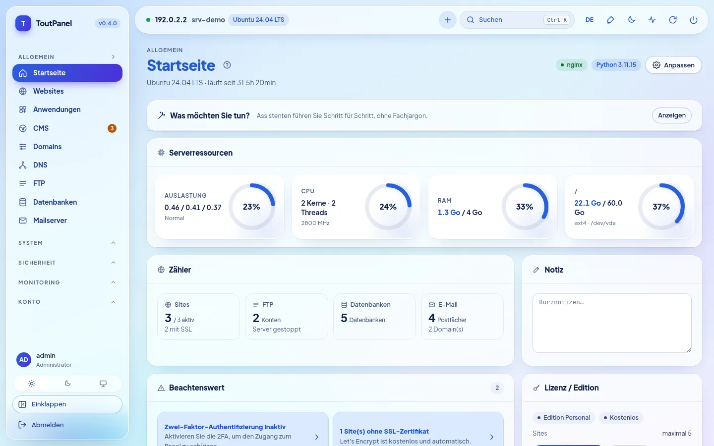

---

## Was ist ToutPanel?

ToutPanel verwandelt einen frisch installierten Server in eine **vollständige Webhosting-Plattform**, die vom Browser aus gesteuert wird. Ein einziger Befehl installiert den Stack (standardmäßig Nginx, PHP-FPM, MariaDB, Redis oder Valkey, Certbot, Fail2ban, oder den Stack, den Sie selbst zusammenstellen: Profile, Versionen, Webserver, FTP, E-Mail, DNS, Beschleuniger), das Panel und seinen Dienst; anschließend legen Sie Ihre Websites, Datenbanken, Postfächer, DNS-Zonen und Zertifikate mit wenigen Klicks an, ohne eine einzige Konfigurationsdatei zu bearbeiten.

Es richtet sich ebenso an Personen, die **ihre eigenen Websites** hosten (kostenlose Personal Edition, ohne Schlüssel und ohne Registrierung), wie an **Agenturen und Hoster**, die Hosting weiterverkaufen: Reseller- und Kundenkonten, Tarife und Kontingente, Abrechnung, White-Label, Multi-Server und Hochverfügbarkeit (Editionen Professional und Enterprise).

Ihre Daten bleiben **auf Ihrem Server**: keine externen Schriftarten und kein CDN in der Oberfläche, kein Aufruf des Lizenzservers, solange keine Lizenz aktiviert ist.

**Dieses README ist bewusst vollständig und ehrlich.** Jede Funktion ist als *(experimentell)* gekennzeichnet, wenn sie es ist, als **Pro**, wenn sie eine kostenpflichtige Edition erfordert, und jeder Abschnitt sagt, was von den Tests **tatsächlich ausgeführt** wurde und was nur mit Simulationen oder gar nicht. Die Tabelle [Was tatsächlich getestet, simuliert oder nicht getestet ist](#was-tatsächlich-getestet-simuliert-oder-nicht-getestet-ist) fasst alles zusammen, und die [Bekannten Einschränkungen](#bekannte-einschränkungen) listen die Vorbehalte auf. Wenn Ihnen eine Funktion kritisch wichtig ist, validieren Sie sie vor dem Produktivbetrieb auf einem Testserver.

> **Dieses Repository enthält keinen Quellcode.** Es veröffentlicht nur, was zur Installation des Panels dient: die Installer `install.sh` und `install.ps1`, das kompilierte Panel (`dist/`, Python-Wheels „nur Bytecode“), die Versionshinweise, die Lizenz und `version.json`.

## Schnellinstallation

**Linux** (als `root`, vorzugsweise auf einem frisch installierten Server):

```bash
curl -sSL https://raw.githubusercontent.com/qu3ntin01/toutpanel/main/install.sh | sudo bash -s -- --lang de
```

Die Option `--lang de` lässt den Installer auf Deutsch sprechen und legt Deutsch zugleich als Anfangssprache des Panels fest (unter Windows: `$env:TOUTPANEL_LANG = "de"` vor dem Aufruf von `iwr`).

**Windows** (PowerShell **als Administrator**):

```powershell
Set-ExecutionPolicy Bypass -Scope Process -Force
iwr -useb https://raw.githubusercontent.com/qu3ntin01/toutpanel/main/install.ps1 | iex
```

Am Ende zeigt das Skript die URL des Panels (mit ihrem **geheimen Zugang**), das Administratorkonto und den Link zum **Einrichtungsassistenten** an. Alles lässt sich auch über Optionen festlegen: Stack (`--profile`, `--web`, `--php`, `--db`, `--ftp`, `--mail`, `--dns`, `--accel`…), Firewall (`--firewall`), genaue Version (`--version`), Sprache (`--lang`), Verzeichnis (`--home`, standardmäßig `/var/toutpanel`) und Passwort, ohne es in der Prozessliste zu zeigen (`TOUTPANEL_PASSWORD`, `--password-file`, `--password-stdin`). Der **[Installationsassistent](https://toutpanel.com/installation-assistant)** erzeugt die Befehlszeile über Menüs. Details, Voraussetzungen, Ports und Fehlerbehebung: [Vollständige Installation](#vollständige-installation).

## Überblick

| | |
|---|---|
| **Systeme** | Linux: Debian 11+, Ubuntu 20.04+, AlmaLinux / Rocky Linux / RHEL / CentOS Stream / Oracle Linux 8+, Fedora, mit weiteren Familien auf reduziertem Stack (openSUSE, Arch, Alpine, Amazon Linux…) und einer angezeigten **Supportstufe** (`toutpanel compat`); Windows 10 / 11, Windows Server 2016 → 2025 (weniger erprobt als Linux) |
| **Webserver** | Nginx, Apache, Nginx + Apache, **Caddy**\*, **OpenLiteSpeed**\* (LSPHP, LSCache), **LiteSpeed Enterprise**\* (kommerzielles Produkt, bei unseren Versuchen nie gestartet: siehe die [Einschränkungen](#bekannte-einschränkungen); `--web litespeed` erfordert `--accept-litespeed-license`), IIS (einfach); Apache + mod_php *in Kürze* |
| **Software-Stack** | **Stack-Konfigurator**: Profile, Versionen, Schema, fortsetzbare Installation, realer Zustand; Beschleuniger (OPcache, JIT, Redis / Valkey, Memcached, Varnish\*, Brotli, Zstandard\*, HTTP/3\*) |
| **PHP** | 5.6 bis 8.5 nebeneinander, 138 Erweiterungen im Katalog, eine Version pro Website, `php.ini` und FPM-Pool pro Website |
| **Anwendungen** | Runtimes für Node.js, Python (WSGI / ASGI), Ruby, Go, Java, .NET mit Version pro Website, systemd, PM2, Passenger; Docker und Compose; atomares Git-Deployment |
| **Datenbanken** | MariaDB, MySQL (Distribution oder 8.4 / 9.x von Oracle\*), Percona Server\*, PostgreSQL, MongoDB, SQLite, Redis / Memcached pro Konto |
| **FTP, DNS, E-Mail** | FTP: integriert, Pure-FTPd\*, ProFTPD\*, vsftpd\*, nur SFTP\* · DNS: BIND, PowerDNS, Knot · E-Mail: Postfix + Dovecot, Exim\* · jeweils nur eine Engine zur Zeit, Umschalten mit Rollback · Webmail Roundcube, SnappyMail, SOGo\* |
| **Firewall und Sicherheit** | verwaltete Firewall (nftables, ufw, firewalld, CSF, iptables) **oder vorgelagert**, Schutz vor Selbstaussperrung; Fail2ban; integrierte WAF, ModSecurity, ToutWAF; Antimalware; Kontoisolierung (**teilweises Äquivalent** zu CageFS) |
| **CMS** | 595 CMS und Anwendungen im Katalog (582 verifiziert: 536 kostenlos, 46 kommerziell), Version nach Wahl, nachverfolgte Installationen und Updates |
| **Oberfläche** | **Oberfläche in 10 Sprachen**, 13 helle / dunkle Themes (**Horizon** als Standard), frei wählbare Akzentfarbe, **16 geführte Assistenten**, **Diagnose mit 844 Prüfungen**, Barrierefreiheit mit dem Ziel WCAG 2.1 AA (**nicht auditiert**) |
| **Dokumentation** | auf Französisch verfasst; ins Englische, Deutsche, Spanische, Italienische, Niederländische, Portugiesische, Russische, Chinesische und Arabische übersetzt, zu **79 % der Seiten** (75 von 94, für jede dieser 9 Sprachen); die übrigen 19 Seiten (Abschnitt Referenz: API, Fehlercodes, Vorlagen… ; Seiten der Diagnose) bleiben mit einem Hinweisbanner auf Französisch; der Katalog der Diagnose und die API-Meldungen sind in alle 10 Sprachen übersetzt |
| **Installer** | `install.sh` und `install.ps1` in 10 Sprachen (Englisch als Standard, `--lang` / `--fr`…, `TOUTPANEL_LANG`, Systemsprache), Stack- und Firewall-Optionen, genaue Version (`--version`), [Installationsassistent](https://toutpanel.com/installation-assistant), der den Befehl erzeugt |
| **Automatisierung** | REST-API (1017 OpenAPI-Operationen), CLI `toutpanel`, signierte Webhooks, Skripte vor / nach Aktionen, Ansible und Terraform, **Marketplace mit 800 Integrationsmodulen** (Reifegrad angezeigt) |

<sub>\* *experimentell*: real, aber weniger erprobt oder mit Einschränkungen, die in der Oberfläche und in den [Bekannten Einschränkungen](#bekannte-einschränkungen) ausgewiesen werden.</sub>

## Neuerungen in 0.5

Die **0.5.0** ist die **stabile** Version (Branch [`main`](https://github.com/qu3ntin01/toutpanel/tree/main)); sie übernimmt die Vorabversionen **0.5.0b1** (Bereich **Analytics**) und **0.5.0b2** (**ToutWAF-Integration**, in ToutWAF gesteuertes SSL), ergänzt sie um den **Bereich „Webserver“ von ToutWAF** und um **Sicherheitskorrekturen** aus einer unabhängigen Durchsicht. Jede Zeile sagt, was real ist und was nicht: „neu in 0.5“ bedeutet real und getestet, aber weniger erprobt als die Funktionen von 0.4.

| Neuerung | Reifegrad und Vorbehalte |
|---|---|
| **Analytics** (Monitoring → Analytics): **selbst gehostete** Besucherstatistiken im Stil von Google Analytics — Besucher online, Herkunft des Traffics, Zielgruppe, Seiten, Ereignisse, Ziele und Trichter, technische Berichte, Zeitraumvergleich, Filter, CSV- / JSON-Export, E-Mail-Berichte, Warnungen, schreibgeschützter Freigabelink; **standardmäßig ohne Cookie, IP-Adresse wird nie gespeichert** | **neu in 0.5**: Engine und API getestet (≈ 560 Tests); durchgängiger Ablauf in einem **echten Chromium** gegen ein **echtes Panel** (130 Besucher, 427 Seitenaufrufe, 54 Prüfungen entsprechen der Referenz); Tracker nur unter Chromium erprobt (Safari und Firefox nicht getestet); genaue Dauer und Echtzeit erfordern den Tracker, die Protokolle allein liefern Seitenaufrufe; ohne Cookie keine wiederkehrenden Besucher von einem Tag zum nächsten |
| **Weltkarte**: 236 Länder, Zoom, Kontinente, gruppierte Städte, animierte Zugriffe in Echtzeit, helle und dunkle Designs | **neu in 0.5**: Flüssigkeit mit Software-Rendering gemessen, **nicht auf einer echten Grafikkarte** |
| **DB-IP-Geolokalisierung**, vom Panel installiert (Länder, Städte, Netzwerke; CC BY 4.0, monatliche Aktualisierung) | **neu in 0.5**: Reader an der **echten** Länder-Datenbank validiert; **Städte- und Netzwerk-Datenbanken** nur an synthetischen Dateien validiert; ohne Datenbank sind die Länder „unbekannt“ |
| **Proxy-Variante**: Der Tracker wird von der Website selbst ausgeliefert (gegen Werbeblocker) | Nginx und Apache mit **echten Servern** validiert; Caddy: nur Rendering und Syntax; **OpenLiteSpeed, LiteSpeed Enterprise, IIS nicht unterstützt** (von Hand einzufügender Code) |
| **ToutWAF-Integration**: Anlegen von Websites aus ToutWAF (eingeschränktes API-Token, das bei der Kopplung übergeben wird, Wiederholung ohne Duplikate per `Idempotency-Key`, veröffentlichtes Schema des Anlegeformulars), **in ToutWAF gesteuertes SSL** (ToutWAF terminiert das HTTPS, die SSL-Seite des Panels verwaltet die Zertifikate in ToutWAF), globale und serverbezogene Schalter des Clusters, **Bereich „Webserver“ von ToutWAF** (vordefiniertes Token mit reduziertem Geltungsbereich, `GET /api/capabilities`, `GET /api/sites/{id}`, Fortschritt der Aufgaben, `toutpanel waf connect --ssl toutwaf|panel`, `toutpanel waf status`) | **neu in 0.5**: getestet gegen ein **falsches ToutWAF**, das dem von seinen Entwicklern beschriebenen Vertrag folgt (≈ 500 Tests); **nichts gegen ein echtes ToutWAF erprobt** (weder der Bereich „Webserver“ noch das gesteuerte SSL); Routen für Erneuerung, HTTPS-Optionen und Fähigkeiten der Zertifikats-API von ToutWAF noch zu bestätigen; SSL-Oberfläche nicht in einem Browser geprüft |
| **Sicherheitskorrekturen** (unabhängige Durchsicht, zwei Durchgänge): Erweiterung des Geltungsbereichs eines API-Tokens (seit 0.4.0 vorhanden), zusammengesetztes ToutWAF-Token, Protokolle und privater TLS-Schlüssel einer Website, Analytics-Daten einer gelöschten Website, Auswertung von `X-Forwarded-For`, Idempotenz pro Token, Obergrenzen der Analytics-Erfassung | **real**: ein Regressionstest pro Korrektur; Details und Schweregrad im [Änderungsprotokoll](CHANGELOG.md); Durchsicht nicht erschöpfend (Validierung der vhost-Direktiven und ReDoS der Parser nicht untersucht) |
| **Übersetzungen**: Oberfläche und Servermeldungen in den 10 Sprachen, Analytics-Seite der Dokumentation in 9 Sprachen | Dokumentation zu **79 % der Seiten** übersetzt (75 von 94); die 19 übrigen Referenzseiten (Diagnose-Kataloge, Fehlercodes, API, Einstellungen, Vorlagen) bleiben auf Französisch |

## Neuerungen in 0.4

**0.4.0** ist die **vorherige stabile** Version (die Versionen 0.4.0b1 und 0.4.0b2 waren Vorabversionen des Kanals `dev`). Jede Funktion trägt ihren Reifegrad: **stabil**, **experimentell** (real und getestet, aber weniger erprobt oder mit ausgewiesenen Einschränkungen) oder **in Kürze** (sichtbar, ausgegraut, nie simuliert). Die rechte Spalte nennt, was vorbehalten oder eingeschränkt ist; die ehrliche Beschreibung jedes Punkts steht im entsprechenden Abschnitt der [Funktionen](#funktionen).

| Neuerung | Reifegrad und Vorbehalte |
|---|---|
| **Gleichzeitiges Lauschen auf HTTP und HTTPS** des Panels (8888 / 8443, anfangs selbstsigniertes Zertifikat); Let's-Encrypt-Zertifikat für das Panel mit frei wählbarer Zertifizierungsstelle, DNS-01, Wildcard und **Neuladen im laufenden Betrieb** | stabil; getestet mit Pebble (ACME-Testserver), nicht mit dem echten Let's Encrypt |
| **Installation einer genauen Version**: `--version X.Y.Z`, `--list-versions`; **Verzeichnis `/var/toutpanel` als Standard** | stabil |
| **Firewall, vom Panel oder vorgelagert verwaltet**, eigene Seite, zu öffnende Ports, **60-s-Schutz vor Selbstaussperrung** | stabil; Regeln getestet mit echten nftables / iptables in einem privaten Netzwerk-Namespace |
| **Stack-Konfigurator**: Profile, Versionen, Architekturschema, Schätzung von Speicher / Festplatte, **Assistent für die Ersteinrichtung in 9 Schritten**, Seite **Software-Stack** | stabil |
| **DNS-Engines**: BIND, PowerDNS, Knot DNS (Umschalten mit Migration der Zonen und DNSSEC-Schlüssel, Rollback) | stabil; getestet mit den echten Daemons unter Ubuntu 24.04 |
| **E-Mail-Engines**: Postfix + Dovecot, externes Relay, **Exim + Dovecot**; **FTP-Engines**: integriert, **Pure-FTPd, ProFTPD, vsftpd, nur SFTP** | Postfix und integriertes FTP: stabil; Exim und die anderen FTP-Engines: **experimentell** |
| **Webserver**: **OpenLiteSpeed** (LSPHP, LSCache), **Caddy**, **LiteSpeed Enterprise** (Umschalten von / zu Nginx, Apache, „beide“ mit Rollback) | **experimentell**; OpenLiteSpeed und Caddy real unter Ubuntu 24.04 getestet; **LiteSpeed Enterprise konnte nie starten** (Testlizenz abgelehnt), nur seine offizielle Installation und die Validierung seiner Konfiguration liefen tatsächlich |
| **Beschleuniger**: OPcache, JIT, APCu, Redis / Valkey, Memcached, FastCGI-Cache, Brotli; **Varnish, Zstandard, HTTP/3** (darunter Nginx von nginx.org, installierbar mit Schutzmechanismen) | Varnish, Zstandard, HTTP/3: **experimentell**; übrige: stabil |
| **Datenbanken**: MariaDB 10.6 → 11.8, **MySQL 8.4 / 9.x** (Oracle-Repository), **Percona Server**, PostgreSQL 13 → 18; **Datenbankpasswörter im Ruhezustand verschlüsselt** | MySQL Oracle und Percona: **experimentell** (bei unseren Versuchen nie installiert und nie gestartet) |
| **Kontoisolierung**: PHP-FPM-Dienst pro Konto in seinem cgroup-Slice, systemd-Härtung, **Dateisystem-Käfig** (Bind-Mounts + bubblewrap) | Optionen, **standardmäßig deaktiviert**; **teilweises Äquivalent zu CageFS** (Kernel und Netzwerk geteilt); nicht getestet: SELinux enforcing mit dieser Isolierung (SELinux Enforcing ist ohne sie auf AlmaLinux validiert, siehe [Sicherheit](#section-12)), cgroup v2 mit tatsächlich angewendeten Limits, gesamter Server unter systemd |
| **Runtimes pro Website** (Node.js, Python, Go, Java, Ruby, .NET), **WSGI / ASGI**, **PM2**, **Passenger** | real: Node 20, Python 3.12, gunicorn, uvicorn, PM2, Nginx + Passenger; Go, Java, .NET simuliert; Ruby nicht kompiliert |
| **Statistiken**: GoAccess, **AWStats**, Matomo; **Staging** mit Datenbank und Synchronisierung in beide Richtungen | GoAccess, AWStats und Staging (MariaDB) real getestet; Matomo **nie erprobt** gegen eine echte Instanz |
| **Backups**: AES-256-GCM-Verschlüsselung, native inkrementelle Backups, Ziele **rsync** und **Borg**, Profil „vollständiger Server“, Teil-Backup / strikter Modus, Wiederherstellungstest | rsync und Borg 1.2.8 real getestet; restic, S3, B2 und rclone **simuliert**; rsync / Borg und restic: **Pro** |
| **E-Mail-Versand**: Sendelimit für PHP-`mail()`, **DMARC pro Domain**, **BIMI**, **DANE**, MTA-STS / TLS-RPT, **SpamAssassin**, **SOGo**, Warteschlange und CalDAV / CardDAV getestet | SOGo **experimentell** (`sogod` nie ausgeführt); VMC-Kette von BIMI und DNSSEC-Signatur nicht überprüft |
| **Migration**: vollständiger **ISPConfig**-Import (SSH, Archiv, SQL-Dump), Übertragung einer Website oder Domain zwischen Kunden, **erweiterte Migration von Konten zwischen Servern** (E-Mail, FTP, Cron, SSL, Tarif) | **Pro**; cPanel / Plesk / DirectAdmin an **konstruierten** Archiven getestet; nie auf zwei physischen Servern getestet |
| **Hochverfügbarkeit**: Floating-IP keepalived / VRRP, gemeinsamer Speicher NFS / GlusterFS, Dovecot-Replikation, Verlauf pro Knoten, Zabbix-Vorlage, **erweiterte automatische Reparatur** | **Pro**; Konfigurationen mit den echten Werkzeugen validiert, **kein Failover zwischen zwei Maschinen getestet** |
| **Authentifizierung**: SSO SAML / OIDC / LDAP gegen Testanbieter getestet, WebAuthn mit einem virtuellen Authenticator getestet, **gehärtetes TLS**, **Warnungen bei ungewöhnlicher Anmeldung** an den Kontoinhaber | SSO: **Pro**; weder ein produktiver Identitätsanbieter noch ein physischer Schlüssel getestet |
| **Diagnose** (System › Diagnose): **844 Prüfungen**, **90 automatische Korrekturen** mit Vorschau, **16 geführte Konfigurationsassistenten** mit echtem Test | Planung der Diagnose: **Pro**; ein Teil der Prüfungen ist mit simulierten Diensten getestet |
| **Serverseitige Meldungen in alle 10 Sprachen übersetzt**; **ToutWAF remote**; erweiterte Distributionskompatibilität; **mehrsprachiger Installer** mit Stack-Optionen | stabil; einige dynamisch zusammengesetzte Meldungen bleiben auf Französisch |
| **Marketplace** mit 800 Integrationsmodulen (Abrechnung, Gateways, Überwachung, CI/CD, IaC, SSO, DNS / CDN, Backup, Themes…) | **5 stabil**, 199 Beta, 596 **generiert** (nie mit dem echten Dienst ausprobiert) |
| Apache + mod_php | **in Kürze** (sauber abgelehnt, nie simuliert) |

Details und Einschränkungen: [Bekannte Einschränkungen](#bekannte-einschränkungen) · [CHANGELOG.md](CHANGELOG.md).

## Funktionen

Die Gliederung folgt den **20 Abschnitten** eines Referenzrasters für ein vollständiges Hosting-Panel (von der Ebene von cPanel / Plesk / ISPConfig / DirectAdmin bis zu fortgeschrittenen Funktionen) und danach dem Ökosystem. In jedem Abschnitt sagt die Zeile „**Real getestet / Grenzen**“ ehrlich, was ausgeführt wurde und was nicht. Ausführliche Dokumentation jeder Seite: **[toutpanel.com/docs](https://toutpanel.com/docs/)** (auch vom Panel unter `/help/` ausgeliefert, wenn sie bei der Installation gebaut wird, mit kontextbezogener Hilfe auf jeder Seite).

<a id="section-1"></a>

### 1. Konten, Benutzer und Mandantenfähigkeit

- Hierarchie **Administrator → Reseller (Pro) → Kunde → Unterbenutzer**; ein Reseller sieht und erstellt nur seinen eigenen Bereich.
- **Feingranulares RBAC**: Berechtigungen pro Modul und pro Aktion, Schnittmenge aus Rolle, Tarif, Zugriffsprofil und übergeordnetem Konto; eingebaute Profile **Vollzugriff, Entwickler, Buchhalter, Webmaster, Nur Lesen** sowie benutzerdefinierte Profile.
- **Tarife und Kontingente**: Festplatte, Inodes, Traffic, Websites, Domains, Datenbanken (und Größe pro Datenbank), Mail-Domains und Postfächer, geplante Aufgaben, FTP-Konten, DNS-Zonen, Backups, Unterbenutzer; Kontingente werden gezählt und blockieren bei der Erstellung. Der monatliche Traffic schaltet die Website nicht ab: Er löst eine Warnung aus, die Abrechnung der Überschreitung und die automatische Sperrung, wenn Sie sie aktivieren.
- **Ressourcenlimits pro Konto**: dedizierter Systembenutzer, systemd-Slice (CPU, Speicher, E/A, Prozesse), angewendet auf geplante Aufgaben, Git-Deployments, Anwendungen, Terminal und Redis- / Memcached-Instanzen; **auf PHP-Anfragen nur mit der Isolierung „PHP-FPM-Dienst pro Konto“** (Option, standardmäßig deaktiviert). Limit gleichzeitiger Verbindungen pro Website: **nur Nginx**.
- **Sperrung** und Reaktivierung, manuell oder automatisch (Zahlungsrückstand, Kontingentüberschreitung nach Karenzzeit).
- **Anmeldung „als“ ein anderer Benutzer** (Impersonation), im Audit-Protokoll nachverfolgt und zeitlich begrenzt.
- **Übertragung** einer Website oder einer Domain von einem Kunden auf einen anderen: Dateien, FTP, Backups, Datenbanken, DNS-Zonen, Mail-Domains, geplante Aufgaben, Staging, Compose-Projekte; Dateibesitz, vhost und PHP-FPM-Pool werden neu erzeugt, Kontingente geprüft, Vorschau vor der Ausführung.
- **Massenanlage** (bis zu 500 Konten), **CSV-Import / -Export** (1 000 Zeilen, Schutz vor Formelinjektion, UTF-8 / UTF-16 / Windows-1252), **interne Notizen** und filterbare **Tags**.

> **Real getestet / Grenzen**: Hierarchie, Berechtigungen, Kontingente, Sperrung und Übertragung sind durch API-Tests abgedeckt, und die Profile werden Route für Route geprüft. `setquota` (Festplatten- und Inode-Kontingente des Dateisystems) wurde nur mit einem Dummy-Executor überprüft und setzt ein mit `usrquota` eingehängtes Dateisystem voraus. Echte cgroups v2 mit angewendeten Limits wurden nicht getestet. Die Sperrung eines Kontos auf dem Master wird nicht an seine Spiegelkonten auf den Knoten weitergegeben; Websites, die auf einem Knoten gehostet sind, lassen sich nicht zwischen Kunden übertragen.

<a id="section-2"></a>

### 2. Authentifizierung und Zugang zum Panel

- **2FA per TOTP** mit Backup-Codes, nach Rolle oder Tarif erzwingbar; **WebAuthn- / FIDO2-Sicherheitsschlüssel und Passkeys** (in der Personal Edition enthalten).
- **Unternehmens-SSO (Pro)**: **OpenID Connect** (Discovery, PKCE), **SAML** (Metadaten, Replay-Schutz, Gruppe → Rolle), **LDAP / Active Directory** (LDAPS / StartTLS mit **standardmäßiger Zertifikatsprüfung**); eine SSO-Anmeldung vergibt standardmäßig nie die Administratorrolle.
- **Zugriffsbeschränkung** des Panels über eine Whitelist von IP-Adressen / CIDR und nach Land (GeoIP, MaxMind-Datenbank selbst bereitzustellen), mit **Verweigerung, eine Regel zu speichern, die den Administrator aussperren würde**.
- **Brute-Force-Schutz**: persistente Sperre pro IP und pro Konto, konstante Antwortzeit, selbst gehostetes **ALTCHA-Captcha** nach N Fehlversuchen, Fail2ban-Jail des Panels, Warnung bei gehäuften Fehlversuchen.
- **Sitzungen**: Liste, Widerruf (auch durch den Administrator), absolutes Ablaufen und Ablaufen bei Inaktivität.
- **Passwortrichtlinie**: Länge, Zeichenklassen, häufige Wörter, Benutzername, **Have I Been Pwned** per k-Anonymität (abschaltbar), Verlauf, Ablauf; **Zurücksetzen** über einen signierten Einmal-Link.
- **Anmeldeprotokoll** und **Warnungen bei ungewöhnlicher Anmeldung** (neue IP-Adresse, neues Land, neues Gerät), die an den Administrator **und an den Kontoinhaber** gesendet werden (pro Konto abschaltbar, per E-Mail oder SMS).
- **Panel über HTTPS**: gleichzeitiges Lauschen auf HTTP und HTTPS, anfangs selbstsigniertes Zertifikat mit SAN (neu erzeugt, wenn sich die Adresse ändert), danach **Let's Encrypt für den Hostnamen des Panels** (ZeroSSL, Buypass oder benutzerdefiniertes ACME, DNS-01 und Wildcard) mit Neuladen im laufenden Betrieb; **geheimer Zugang** in der URL (ohne ihn antwortet das Panel mit 404).

> **Real getestet / Grenzen**: TOTP, Sperre, Sitzungen, Passwortrichtlinie: getestet. **WebAuthn**: getestet mit einem virtuellen Authenticator von Chromium (echte Registrierung und Anmeldung), **nicht mit einem physischen Schlüssel**. **OIDC**: getestet gegen einen echten lokalen OIDC-Server (PKCE geprüft, gefälschte Token abgewiesen); **SAML**: getestet mit einem Test-Identitätsanbieter (31 Tests: gültige, abgelaufene, wiederholte, gefälschte Assertion…); **LDAP**: getestet gegen ein echtes OpenLDAP (`slapd`); **kein echter Identitätsanbieter** (Keycloak, Entra ID, Okta…) wurde ausprobiert. Das **neue Land** wird mit einer echten MaxMind-Testdatenbank erkannt. Let's Encrypt für das Panel: getestet mit **Pebble** + certbot 5.8 + BIND, **nicht** mit dem echten Dienst. Die SAML-Bibliothek (`python3-saml` + `xmlsec1`) ist optional; das Panel startet auch ohne sie.

<a id="section-3"></a>

### 3. Web und Website-Hosting

- **Websites mit einem Klick**: mehrere Domains, Aliase, **geparkte Domains**, **weitergeleitete** Domains, **Wildcard** (`*.beispiel.com`), PHP-FPM, statisch, Reverse Proxy, Anwendungen. Eine Subdomain ist entweder ein Domainname der Website oder eine eigene Website.
- **Webserver**: vhosts für **Nginx, Apache, Nginx + Apache, Caddy\*, OpenLiteSpeed\*, LiteSpeed Enterprise\* oder IIS**, erzeugt aus Jinja2-Vorlagen und **vor dem Neuladen validiert** (`nginx -t`, `apachectl -t`, `caddy validate`…), mit Rückkehr zu den zuletzt gültigen vhosts bei einem Fehler; **Umschalten** Nginx ↔ Apache ↔ „beide“ ↔ Caddy ↔ OpenLiteSpeed ↔ LiteSpeed mit Rollback; Funktionen, die ein Server nicht abbildet (integrierte WAF, ModSecurity, Länderfilterung, `.htaccess`…), werden **gemeldet**, nie stillschweigend ignoriert.
- **Multi-Version-PHP** 5.6 → 8.5 nebeneinander (Sury, PPA ondrej, Remi, windows.php.net), eine Version und **ein PHP-FPM-Pool pro Website**, unter dem Benutzer des Kontos; **`php.ini` pro Website** (13 erlaubte Direktiven, darunter `disable_functions` und `open_basedir`, gegen Injektion validiert), **138 Erweiterungen** im Katalog (pro PHP-Version verwaltet, Administrator), ionCube, **FPM-Parameter** (`pm`, `max_children`, `start_servers`, Timeouts, `max_requests`…).
- **Anwendungs-Runtimes**: Node.js, Python (**WSGI / ASGI**: gunicorn, uvicorn, hypercorn, daphne, waitress), Ruby, Go, Java, .NET, mit **Runtime-Version pro Website** (offizielle Downloads, per SHA-256 geprüft, `uv` für Python, nie kompiliert; nvm, pyenv usw. werden erkannt), **systemd**-Unit, **PM2**, **Phusion Passenger** (Nginx und Apache), Proxy auf einen Port oder Unix-Socket (einschließlich WebSocket), Neuladen ohne Unterbrechung, `toutpanel runtimes`.
- **Reverse Proxy** auf einen Port oder Socket, **Lastverteilung** (Round Robin, `least_conn`, `ip_hash`).
- **Weiterleitungen** 301 / 302 (mit oder ohne Query, reguläre Ausdrücke), HTTPS-Erzwingung, kanonischer Host `www`.
- Benutzerdefinierte **HTTP-Header** (CSP, X-Frame-Options…) und **HSTS** (einstellbare Dauer, `includeSubDomains`, `preload` mit Bestätigung und vorheriger Prüfung).
- **Benutzerdefinierte Nginx- / Apache- / Caddy-Direktiven pro vhost** (Administrator): Schreiben, Neuerzeugen, Servertest, **automatische Wiederherstellung**, wenn der Server sie ablehnt.
- Per Passwort geschützte **Verzeichnisse** (bcrypt) und Zugriffsregeln nach IP, benutzerdefinierte **Fehlerseiten**, **Hotlink-Schutz**, **Wartungsmodus** (503 mit `Retry-After`, erlaubte IPs).
- **HTTP/2**, **HTTP/3 / QUIC\*** (nativ mit Caddy und OpenLiteSpeed; mit QUIC-kompiliertem Nginx, oder Nginx von nginx.org, installierbar über die Seite Beschleuniger mit Simulation, Sicherung und Rollback; mit Apache allein nicht möglich), **Brotli**-Kompression (wenn das Modul existiert), **Gzip**, **Zstandard\***.
- **Cache**: FastCGI-Cache (Nginx), **OPcache**, **Redis / Valkey**, **Memcached**, **Varnish\*** (nur HTTP), LSCache (OpenLiteSpeed und LiteSpeed Enterprise), mit **Leeren aus dem Panel** (Schaltfläche „Cache leeren“ pro Website und pro Beschleuniger).
- **Staging**: Klon einer Website (Dateien + Datenbank), URL-Ersetzung **ohne wp-cli** (einschließlich serialisierter PHP-Werte), ausgeschlossene Tabellen, Synchronisierung **zur Produktion, von der Produktion oder in beide Richtungen** (Dateien: die neuere gewinnt; Datenbank zeilenweise per Primärschlüssel zusammengeführt, Konfliktregel nach Wahl, **Löschungen werden nie weitergegeben**), vorherige Sicherung auf beiden Seiten.
- Konfigurierbares **Website-Stammverzeichnis** (`public/`, `web/`…), **Zugriffs- und Fehlerprotokolle pro Website**, live einsehbar und herunterladbar (logrotate-Rotation).
- **Traffic-Statistiken** mit drei Engines: **GoAccess**, **AWStats**, **Matomo** „für diese Website“; **Bandbreitenüberwachung** pro Website, Monat für Monat.

> **Real getestet / Grenzen**: Nginx: vhosts von einem **echten Nginx** ausgeliefert und mit curl abgefragt (Weiterleitungen, 401 / 403, Hotlink-Schutz, Wartung, Wildcard, Fehlerseiten). Apache: vhost mit `apache2 -t` validiert, bei unseren Versuchen **nie real ausgeliefert**; Nginx vor Apache: nie zusammen gestartet; das Umschalten Nginx / Apache wird mit einem Dummy-Executor und der echten vhost-Syntax getestet. OpenLiteSpeed: echter, gestarteter OpenLiteSpeed, der PHP, Statisches, Weiterleitung, Authentifizierung und LSCache ausliefert. **Caddy**: echter Caddy 2.11 (HTTP, HTTPS, HTTP/2, HTTP/3, PHP-FPM, Proxy, Neuladen ohne Unterbrechung) unter Ubuntu 24.04; RHEL-Familie und echtes ACME nicht ausgeführt. **LiteSpeed Enterprise: nie gestartet** (siehe [Einschränkungen](#bekannte-einschränkungen)). `disable_functions` / `open_basedir`: mit einem echten PHP-FPM überprüft. Installation der PHP-Versionen aus den Repositories: bei unseren Versuchen nicht ausgeführt (Internet). **Runtimes**: real für Node 20, Python 3.12, gunicorn, uvicorn, PM2 und Nginx + Passenger; **Go, Java und .NET simuliert**, Ruby nicht kompiliert, systemd-Unit einer Anwendung nicht gestartet. **HTTP/3**: echte Nginx-1.31-Binärdatei, die HTTP/3 an einen QUIC-Client ausliefert; die Installation des nginx.org-Pakets auf der Maschine wurde nicht ausgeführt. Brotli hängt vom Nginx-Modul ab. Memcached und Varnish (von `varnishd` 7.1 kompilierte VCL): real ausgeführt, aber die vollständige Inbetriebnahme von Varnish vor Nginx nicht. **GoAccess und AWStats**: real ausgeführt; **Matomo: nie gegen eine echte Instanz erprobt** (gefälschter API-Server). **Staging**: an einer echten MariaDB-Instanz getestet; die zeilenweise Zusammenführung gilt nur für MySQL / MariaDB (PostgreSQL und SQLite werden ohne URL-Ersetzung kopiert). HTTP/3 und FastCGI-Cache von Apache gibt es nicht.

<a id="section-4"></a>

### 4. SSL / TLS

- **Let's Encrypt**, **ZeroSSL** (EAB), **Buypass**, benutzerdefinierter ACME-Server; Validierung per **HTTP-01** und **DNS-01** (TXT-Eintrag in BIND / PowerDNS oder bei Cloudflare, OVH, Route53), **Wildcard**-Zertifikate, **SAN- / Multi-Domain**-Zertifikate (alle Namen, Aliase und geparkten Domains der Website).
- Täglich **automatische Erneuerung** mit Neuladen der betroffenen Dienste (Webserver, E-Mail, FTP, Panel) und **Warnung bei Fehlschlag**; **Warnungen vor Ablauf** nach 30 / 14 / 7 / 1 Tagen (einstellbar).
- **Import** kommerzieller Zertifikate (CRT, Schlüssel, Kette, **PFX**) und **CSR-Erzeugung** (RSA / EC, SAN, privater Schlüssel bleibt auf dem Server); selbstsignierte Zertifikate; Seite **Zertifikate** mit Gültigkeit, Aussteller und Ablauf aller Zertifikate.
- **SSL für Dienste**: E-Mail (SNI Postfix / Dovecot), FTP / FTPS, Panel, Hostname.
- **Gehärtetes TLS**: Mozilla-Profile (modern = nur TLS 1.3, intermediate als Standard, alt), validierte benutzerdefinierte Cipher-Suites, einstellbares **OCSP-Stapling**, Kurven und DH ffdhe2048, `ssl_session_tickets off`, HSTS pro Website.

> **Real getestet / Grenzen**: getestet mit **Pebble** (ACME-Server von Let's Encrypt), dem echten certbot 5.8 und einem echten BIND: HTTP-01, DNS-01, Wildcard, Erneuerung, Fehlschlag, EAB. **Es wurde keine Ausstellung beim echten Let's Encrypt, bei ZeroSSL oder bei Buypass ausgeführt.** DNS-01 setzt voraus, dass die Zone der Domain vom Panel (oder einem konfigurierten Anbieter) verwaltet wird. TLS: überprüft mit einem echten Nginx, `openssl s_client` (je Profil tatsächlich angebotene Protokolle und Suites), einem echten OCSP-Responder und `apache2 -t`; die Anpassung an OpenLiteSpeed und Caddy ist nicht getestet; keine Post-Quanten-Kryptografie. FTP-Zertifikate werden von den Ablaufwarnungen nicht überwacht.

<a id="section-5"></a>

### 5. DNS

- Zonen, die von **BIND, PowerDNS oder Knot DNS** bedient werden (jeweils nur ein lokaler Server; Umschalten mit Migration der Zonen und DNSSEC-Schlüssel, Rollback) oder zu einem Anbieter gepusht werden.
- **14 Eintragstypen**: A, AAAA, CNAME, MX, TXT, SRV, NS, CAA, PTR, TLSA, DS, SSHFP, HTTPS, SVCB, mit feiner Validierung; bei der Erstellung angewendete **Zonenvorlagen** (Variablen `{domain}`, `{ip}`, `{mail}`…).
- **DNSSEC**: automatische Signierung (BIND `dnssec-policy`, Knot KASP, PowerDNS), DS und DNSKEY für den Registrar angezeigt, manuelle Rotation (BIND, Knot; **PowerDNS: Rotation außerhalb des Panels**).
- **Sekundäre Server** per TSIG (AXFR + NOTIFY), automatisch auf den Knoten der Flotte (**Pro**).
- **Externe Anbieter** per API: **Cloudflare, OVH, Route 53, PowerDNS** (Push und Import von Zonen); externe Zonen: Liste, Export (BIND, CSV, JSON) und **Propagationsprüfung per `dig`**.
- **BIND-Import / -Export**, TTL pro Eintrag und pro Zone, **automatische Seriennummern** (`JJJJMMTTnn`), **Reverse-DNS (PTR)** der Server-IPs, **Propagationsprüfung** (1.1.1.1, 8.8.8.8, 9.9.9.9 und lokaler Server) und Syntaxvalidierung (`named-checkzone` vor dem Neuladen).
- **Automatische E-Mail-Einträge**: MX, SPF, DKIM, DMARC, SRV IMAP / SMTP / POP3, `autoconfig` / `autodiscover`, MTA-STS, TLS-RPT, CalDAV / CardDAV; IPv6, internationalisierte Namen (IDN), Mail-Host außerhalb der Zone.

> **Real getestet / Grenzen**: BIND, PowerDNS und Knot real (`named-checkzone`, `dig`, Umschaltzyklus BIND → PowerDNS → Knot, der denselben DS beibehält). Die **APIs von Cloudflare, OVH, Route 53 und PowerDNS wurden mit einem simulierten Transport getestet**, nie mit den echten Diensten. Der **Cluster sekundärer Server** lief nie mit zwei echten DNS-Servern. PTR ist nur wirksam, wenn Ihnen der Adressblock delegiert wurde: Das Panel kann ihn bei Ihrem Anbieter nicht beantragen. Die Propagationsprüfung kontrolliert die Typen PTR, TLSA, DS, SSHFP, HTTPS und SVCB nicht.

<a id="section-6"></a>

### 6. E-Mail

- **Postfix + Dovecot + OpenDKIM**, Rspamd oder SpamAssassin, wahlweise **Exim + Dovecot\*** (Teilmenge von Postfix, ausgewiesene Einschränkungen), externes Relay; Domains, **Postfächer mit Kontingenten**, **Aliase**, **Weiterleitungen**, **Catch-all-Adresse**, **Mailinglisten** (mlmmj), **Abwesenheitsnotiz mit Datumsbereich**, **Sieve-Filter** (geführte Regeln oder Skript, ManageSieve), IMAP / POP3 über TLS, Submission 587 / 465.
- **Webmail** Roundcube, SnappyMail oder **SOGo\***, mit einem Klick installiert, mit **direkter Anmeldung aus dem Panel**.
- **SPF, DKIM** (Erzeugung, **Rotation mit doppelter Veröffentlichung**), **DMARC pro Domain** (`none` / `quarantine` / `reject`, `pct`, `rua`, `ruf`, `sp`, `adkim`, `aspf`, `fo`, **geführte Steigerung**), **MTA-STS** und **TLS-RPT**, **BIMI** (vom Panel gehostetes SVG-Logo, nur bei einem durchsetzenden DMARC mit 100 % veröffentlicht), **DANE** (TLSA `3 1 1` für die Mail-Ports, **Rotation in zwei Schritten**).
- **Antispam** Rspamd (Einstellungen pro Domain und pro Postfach, Lernen von Spam / Ham) oder gesteuertes **SpamAssassin** (spamd, `spamass-milter`, `user_prefs` pro Postfach; amavis experimentell), **Virenscanner ClamAV**, **Greylisting**, **RBL / DNSBL**, globale **Weiß- und Schwarzlisten**, pro Domain oder pro Postfach.
- **Begrenzung der Sendeleistung**: pro Postfach, pro Tarif und standardmäßig (authentifizierter SMTP-Benutzer, über Rspamd) **und Limit für PHP-`mail()` pro Website und pro Konto** (`sendmail`-Wrapper des Panels: Protokoll, Obergrenzen über 1 h und 24 h, Warnung, Schutz vor Header-Injektion), damit eine gehackte Website nicht spammt.
- **Ausgehendes Relay / Smarthost**, **Warteschlange** (Flush, Anhalten, Löschen), **Protokoll und Nachverfolgung einer Nachricht**, **Autokonfiguration** der Clients (Outlook, Thunderbird), **fetchmail**, **CalDAV / CardDAV** (Radicale), **Überwachung der IP-Reputation** (Blacklists, auf allen öffentlichen Adressen des Servers und den Ausgangs-IPs der Knoten).

> **Real getestet / Grenzen**: Die Warteschlange ist mit einem **echten Postfix** getestet; Dovecot: Konfiguration mit `doveconf` validiert; CalDAV / CardDAV: **echtes Radicale 3.8**; SpamAssassin: reales `spamassassin --lint`, `spamd` und `spamc`; PHP-`mail()`: Wrapper real ausgeführt mit dem echten `mail()` von PHP. **Simuliert**: Rspamd, ClamAV, mlmmj, fetchmail, die Aufbauten `spamass-milter` / amavis; **SOGo: experimentell, `sogod` nie ausgeführt**. BIMI: die **Kette des VMC-Zertifikats wird nicht überprüft**; DANE: die DNSSEC-Signatur wird nicht überprüft (DANE ergibt nur mit DNSSEC Sinn). Das Limit für PHP-`mail()` **sieht** ein Skript nicht, das direkt `sendmail` aufruft oder eine SMTP-Verbindung öffnet. Mit Exim: keine Nachverfolgung von Nachrichten und keine Mailinglisten; mit SpamAssassin: kein Sendelimit pro Postfach und kein Greylisting. Empfangene DMARC-Berichte werden nicht ausgewertet. Die automatische DNS-Veröffentlichung setzt voraus, dass die Zone vom Panel verwaltet wird. Ein zuverlässiger Mailserver setzt eine feste öffentliche IP, ein korrektes Reverse-DNS und geöffnete Ports 25 / 465 / 587 voraus.

<a id="section-7"></a>

### 7. Datenbanken

- **MariaDB (10.6 → 11.8), MySQL, Percona Server\*, PostgreSQL (13 → 18), MongoDB, SQLite**: Datenbanken, Benutzer und **Berechtigungen** (vollständig, nur lesend, benutzerdefiniert), **Fernzugriff per IP erlaubt** (Firewall-Regel, `bind-address`, `pg_hba.conf`; `0.0.0.0/0` abgelehnt).
- **Adminer** (MySQL und PostgreSQL) und **phpMyAdmin** (MySQL), installierbar in wählbaren Versionen mit überprüfter PHP-Kompatibilität, **Single Sign-On (SSO) aus dem Panel**; **pgAdmin ist nicht integriert**.
- **Import / Export** (gzip im laufenden Betrieb), **geplanter Dump** (geplante Aufgabe), **Wartung** (Prüfung, Reparatur, Optimierung, Analyse), **Größenkontingente** pro Datenbank (Berechtigungen entzogen und wiederhergestellt, Warnung).
- **Wahl der DBMS-Version** (offizielle Repositories von MariaDB und PostgreSQL, Wechsel der Hauptversion mit **vorheriger Sicherung**, kein Downgrade); MySQL 8.4 / 9.x (Oracle-Repository) und Percona\*: jeweils nur eine Engine der MySQL-Familie.
- **Zusätzliche Server** (Docker), **Redis / Memcached pro Konto** (isolierte Instanz, Unix-Socket, `maxmemory` des Tarifs, cgroup-Slice des Kontos).
- **Replikation (Pro)**: MariaDB / MySQL (GTID) und PostgreSQL (Streaming), Befehlsassistent **und** vom Panel ausgeführte Replikation, manuelle Promotion oder **automatisches Failover** mit Umschreiben des Datenbank-Hosts.
- **Datenbankpasswörter im Ruhezustand verschlüsselt** (Fernet, Schlüssel des Panels gesichert), Listen ohne Passwort, **ausdrückliche und protokollierte Offenlegung**.

> **Real getestet / Grenzen**: SQLite: real. **MariaDB**: Eine reale Instanz dient den Tests von Staging und Diagnose, aber die SQL-Verwaltungsschicht (Benutzer, Berechtigungen, Kontingente) wird überwiegend mit einem **simulierten SQL-Executor** getestet; **PostgreSQL: simuliert**; MongoDB (optionales Modul `pymongo`): getestet mit einem gefälschten Client und, wenn das Image vorhanden ist, einem echten `mongod` 7 in Docker. MySQL Oracle und Percona: Pakete und Repositories überprüft, **nie installiert und nie gestartet**. Die Replikation wurde **nie zwischen zwei realen Servern aufgebaut**, und das automatische Failover ist kein Konsens. Die **Root-Zugangsdaten der Engines werden im Klartext in `settings.json` gespeichert** (Rechte 0600); `mongodump` legt das Passwort als Befehlsargument offen.

<a id="section-8"></a>

### 8. Dateien und Zugriff

- **Dateimanager**: Upload, **CodeMirror-Editor** mit Syntaxhervorhebung, Berechtigungen (`chmod`) und Besitzer (`chown`), zip- / tar-Archive, **Suche** nach Name und im Inhalt, **Papierkorb**, **Belegung von Festplatte und Inodes pro Ordner**, Drag-and-drop, **Korrektur von Berechtigungen und Besitzer mit einem Klick**.
- **Integrierter FTP- / FTPS-Server** (mehrere Konten, eingeschränktes Verzeichnis, Rechte, Kontingente, erlaubte IPs, Protokoll) oder **Pure-FTPd\*, ProFTPD\*, vsftpd\*, nur SFTP\*** (Konten des Panels synchronisiert, Umschalten mit Rollback).
- **SFTP / SSH im Chroot pro Benutzer** (`sshd`-Drop-in, mit `sshd -t` validiert und mit Rollback, Bind-Mounts), **eingeschränkte Shell** über jailkit oder `rbash`, **SSH-Schlüssel** (ed25519, ECDSA, RSA ≥ 2048).
- **Web-Terminal** (bash unter Linux, PowerShell unter Windows; ein Client bleibt unter dem Benutzer seines Kontos).
- **Festplatten- und Inode-Kontingente** pro Konto, **WebDAV** mit den FTP-Konten.

> **Real getestet / Grenzen**: FTPS: **echter Handshake** mit validiertem Zertifikat; Terminal: echtes bash im PTY; jailkit: echtes `jk_init` / `jk_jailuser` und echte eingesperrte Shell, wenn jailkit installiert ist; WebDAV: echtes `wsgidav` (optionale Module `wsgidav` + `a2wsgi`). Alternative FTP-Engines: real ausgeführt unter Ubuntu 24.04, **RHEL-Familie nicht erprobt**. Ein echter `sshd` wurde von den Tests nie neu gestartet; `setquota`: siehe Abschnitt 1. Das Windows-Terminal ist ohne das Modul `pywinpty` vereinfacht.

<a id="section-9"></a>

### 9. Anwendungen und Deployment

- **Installer mit einem Klick**: Katalog mit **595 CMS und Anwendungen** (siehe [CMS](#cms)), darunter WordPress, Joomla, Drupal, PrestaShop, Nextcloud, Laravel, Symfony, Matomo, Dolibarr, Moodle, phpBB, MediaWiki, Ghost.
- **WP Toolkit**: wp-cli, Updates von Core, Plugins und Themes, Härtung, Klonen, **Erkennung verwundbarer Installationen** (Feed von Wordfence Intelligence), kritische Warnung.
- **Git-Deployment**: Clone und Update (HTTPS mit Token oder SSH mit Deploy-Key pro Website), Branch, Tag oder Commit, **signierte GitHub- / GitLab-Webhooks**, **Post-Deployment-Skripte**, geplante Aktualisierung, **atomares Deployment** (`releases/`, `shared/`, Link `current`, Rollback).
- **Composer, npm, pip**, aus einer Website gestartet (Whitelist `install` / `ci` / `update`, unter dem Benutzer des Kontos).
- **Docker**: Container, Images, **Netzwerke, Volumes**, Speicherplatz und Bereinigung, validiertes `docker run`, **Docker-Compose**-Projekte pro Konto mit Proxy-Website und Ablehnung gefährlicher YAML-Dateien (privilegiert, Socket, sensible Mounts).
- **Assistenten** „Website“, „Anwendungsinstallation“, „Git-Deployment“, „PHP“ (siehe [Abschnitt 19](#section-19)).

> **Real getestet / Grenzen**: Git: echtes `git` an einem lokalen Repository (Clone, Update, signierter Webhook, atomares Deployment auf einem echten Dateisystem); **echtes GitHub und GitLab nie kontaktiert**. `npm` und `pip` real unter dem Benutzer der Website; Composer: nicht ausgeführt (kein Phar in der Testumgebung). Docker: Container, Images, Netzwerke und Volumes getestet mit einem Dummy-Executor und, wenn ein Daemon antwortet, einem echten Docker-Zyklus. **CMS-Installationen: simulierte Downloads** (keine echte Katalog-Installation wurde von der automatischen Suite von Anfang bis Ende ausgeführt); echtes WordPress / wp-cli von den Tests nicht ausgeführt, abgesehen von Matomo, das vom Assistenten „Anwendung“ von Anfang bis Ende installiert wurde.

<a id="section-10"></a>

### 10. Geplante Aufgaben

- **Visueller Editor** Feld für Feld und **rohe Cron-Syntax**, synchronisiert, Vorschau der nächsten 5 Ausführungen, Kurzformen (`@daily`…), Typen: eine Adresse aufrufen, einen Befehl ausführen, eine Website oder eine Datenbank sichern.
- **Ausführung unter dem Benutzer des Kontos oder der Website, für einen Kunden nie als root**: Der Befehl wird **abgelehnt**, statt als root gestartet zu werden; `root` ist dem Administrator vorbehalten, mit Bestätigung und Eintrag im Audit-Protokoll; cgroup-Limits des Kontos angewendet.
- **Scheduler** nach Wahl: intern (APScheduler, Standard), **systemd-Timer** (`OnCalendar`, `Persistent=true`) oder `/etc/cron.d`, mit umkehrbarem Wechsel.
- **E-Mail-Benachrichtigung** (nie / bei Fehler / immer), **Ausführungsverlauf** (Status, Dauer, Code, Beginn der Ausgabe), **vom Tarif erzwungene Mindestfrequenz**, sofortige Ausführung, **Assistent** mit Probelauf.

> **Real getestet / Grenzen**: Der Vergleich mit dem echten `systemd-analyze calendar` (18 Ausdrücke) und `systemd-analyze verify` sind real; **ein systemd-Timer wurde nie wirklich ausgelöst**. Beim internen Scheduler **laufen die Aufgaben nicht, wenn das Panel angehalten ist** (Nachholen von weniger als 5 Minuten beim Neustart); es gibt keinen Import einer bestehenden Crontab. Unter Windows werden die Aufgaben der Kunden abgelehnt.

<a id="section-11"></a>

### 11. Sicherungen und Wiederherstellung

- **Granularität**: Website, Datenbank, Ordner oder Datei, Postfach, Mail-Domain, Konto, **gesamter Server**; Sicherung auf Anforderung und **Zeitpläne** mit **GFS**-Aufbewahrung (täglich, wöchentlich, monatlich).
- **Native Engine (zip), in allen Editionen enthalten**: Archive mit SHA-256-Summe und CRC-Prüfung, optionale **AES-256-GCM-Verschlüsselung** (Passphrase, standardmäßig, pro Ziel, pro Zeitplan oder pro Sicherung), **inkrementelle Sicherungen** (eine vollständige, dann inkrementelle, Wiederherstellung des Zustands jeder Sicherung, Aufbewahrung, die die Ketten erhält). Ziel: lokaler Ordner.
- **Entfernte Ziele (Pro)**: **rsync** (Ordner oder SSH, Hardlinks `--link-dest` oder verschlüsselbare Archive), **Borg** (verschlüsselt, dedupliziert, lokal oder SSH), **restic** (verschlüsselt, dedupliziert: S3 und kompatible, SFTP, Backblaze B2 und über rclone FTP / Google Drive / OneDrive / Dropbox / WebDAV). Geheimnisse in der Datenbank verschlüsselt, nie von der API zurückgegeben.
- **Profil „Vollständiger Server (einschließlich Konfiguration)“**: erzeugte vhosts, PHP-FPM-Pools, Zertifikate und Schlüssel, DKIM, E-Mail, DNS, FTP, Crontabs, Firewall-Regeln und Daten des Panels; **verschlüsseltes Archiv obligatorisch**, **geführte Wiederherstellung** auf einem neuen Server (Simulation, ersetzte Dateien als `.pre-restore-…` aufbewahrt, Dienste neu geladen). Enthält **weder das System noch die Pakete noch die Dateibesitzer**.
- **Granulare Wiederherstellung** (Archiv durchsuchen, Dateien auswählen, an Ort und Stelle oder in einen Ordner) und **per Self-Service durch den Kunden**, mit kontrolliertem Umfang; **automatische Sicherheitssicherungen** vor einer riskanten Operation (Wiederherstellung, Löschung, Installation, Update eines DBMS).
- **Ein fehlgeschlagener Datenbank-Dump wird nicht ignoriert**: „Teil“-Sicherung gemeldet (Badge, Warnung) oder im **strikten Modus** abgelehnt; **Integritätsprüfung** (SHA-256, CRC, `restic check`), **Wiederherstellungstest** (Dumps in eine temporäre Datenbank reimportiert, Dateistichprobe per Summe geprüft) und **Wochenbericht** (standardmäßig deaktiviert), **Warnungen bei Fehlschlag**.
- Optionale **Snapshots** von Btrfs, ZFS oder LVM, um das Lesen während einer Sicherung einzufrieren.

> **Real getestet / Grenzen**: Native Archive, Verschlüsselung, inkrementelle Ketten, Profil „Vollständiger Server“: real ausgeführt; **rsync** (lokaler Ordner und SSH über einen flüchtigen `sshd`) und **Borg 1.2.8** (lokal und SSH): real, **nie zu einem echten entfernten Server**; Borg 2.x nicht getestet. **restic, S3, Backblaze B2 und rclone: Befehle erzeugt und mit einem Dummy-Executor überprüft, nie gegen ein echtes Repository oder einen echten Dienst ausgeführt.** Snapshots ZFS / LVM / Btrfs und Wiederherstellungstest für MySQL / PostgreSQL: Executor oder DBMS simuliert; `zfs send` ist nicht implementiert. Der **Dateiname des verschlüsselten Archivs ist im Klartext** (Ziel und Datum); rsync „tree“ legt Dateien **im Klartext** ab; eine verlorene Passphrase macht die Archive unlesbar. Der vollständige Server wendet die Firewall nicht automatisch erneut an. Entfernte Sicherungen, restic, Borg und rsync erfordern die Edition **Pro**; nicht zu verwechseln mit der rsync- / lsyncd-Synchronisierung der Hochverfügbarkeit, die kein Sicherungsziel ist.

<a id="section-12"></a>

### 12. Serversicherheit und Isolierung

- **Firewall** nftables, firewalld, UFW, CSF oder iptables (automatisch erkannt), **von ToutPanel oder vorgelagert verwaltet** (Cloud-Sicherheitsgruppe, Firewall des Hosters: Das Panel rührt dann keine Regel an und listet die **beim Hoster zu öffnenden Ports** auf); Regeln, IP-Listen, vordefinierte Dienste, lauschende Ports und Exposition, **grundlegender DDoS-Schutz** (SYN pro IP, Verbindungslimit, Scan-Erkennung), **60-s-Schutz**: ohne Bestätigung wird die Änderung vom Server selbst rückgängig gemacht.
- **Fail2ban**: Jails für SSH, Postfix, Dovecot, FTP, Panel und WordPress (`wp-login.php`, `xmlrpc.php`), Sperren aufgelistet, hinzugefügt, entfernt, Filtertest.
- **Integrierte WAF** (SQL-Injektionen, XSS, RCE, Directory Traversal, Scanner, Bots, Rate, automatische Sperre; Länderblockierung **Pro**) und **ModSecurity + OWASP CRS** pro Website, Regeln pro Website deaktivierbar (**Pro**); **ToutWAF**, die WAF / der Reverse Proxy des Herstellers, empfohlene Engine (**Pro**), lokal oder **remote** auf einem anderen Server; **BunkerWeb** und **SafeLine** (Docker) werden weiterhin angeboten.
- **Antimalware**: ClamAV, Linux Malware Detect, YARA und **ImunifyAV / Imunify360, falls bereits installiert** (das Panel installiert es nie); Quarantäne, Wiederherstellung, geplante Analyse (Pro). **Rootkit-Erkennung** (rkhunter, chkrootkit), **Integrität** der Systemdateien (debsums, `rpm -Va`, AIDE) und der Dateien des Panels.
- **Schwachstellenscan**: WordPress (Wordfence-Feed) und, **über WordPress hinaus**, **OSV**-Datenbank (Joomla, Drupal, PrestaShop, OpenCart, Laravel, Symfony, TYPO3, Craft CMS, Pimcore, Silverstripe, Grav, Matomo, Django, Flask, Ghost, Strapi…) sowie `composer audit`, `npm audit` und `pip-audit` unter dem Benutzer des Kontos.
- **Kontoisolierung**: ein **Systembenutzer pro Konto**, PHP-FPM-Pool pro Website, **PHP-FPM-Dienst pro Konto in seinem cgroup-Slice** (Option `per-account`, **standardmäßig deaktiviert**), **systemd-Härtung** (`PrivateTmp`, `ProtectSystem`, `NoNewPrivileges`, Systemaufruf-Filter…), **Dateisystem-Käfig pro Konto** (schreibgeschützte Bind-Mounts, minimales `/etc`, private `/tmp`, `/proc` und `/run`, bubblewrap für Shell, Terminal, Aufgaben und Deployments; Option, standardmäßig deaktiviert). **Das ist ein teilweises Äquivalent zu CageFS**: Kernel und Netzwerk bleiben geteilt (siehe die Grenzen).
- **AppArmor** (lokale Profile für Nginx, PHP-FPM, BIND) und **SELinux** (Kontexte und Booleans in der Red-Hat-Familie automatisch deklariert; **im Enforcing-Modus validiert auf AlmaLinux 9.8 und 10.2**, siehe unten); **GeoIP-Blockierung** von Besuchern (Nginx, **Pro**); **automatische Sicherheitsupdates** (`unattended-upgrades`, `dnf-automatic`) und Warnung bei ausstehenden Updates.
- **AlmaLinux-Labor (SELinux Enforcing)**: AlmaLinux 9.8 und 10.2 mit SELinux Enforcing, validiert in einem echten QEMU-Labor (4. Oktober 2026: 69/69 und 68/68 Prüfungen, 0 AVC-Verweigerungen, einschließlich Neustart; ohne KVM, ein einziger Knoten, Ablauf beschränkt auf Nginx + PHP-FPM + MariaDB + Pure-FTPd + Postfix / Dovecot / rspamd + fail2ban + firewalld); Rocky Linux, RHEL, Fedora nicht ausgeführt; Apache, OpenLiteSpeed, Exim, ProFTPD, vsftpd, PostgreSQL, Multi-Server, ToutWAF, Docker und die PHP-FPM-Isolierung pro Konto mit SELinux nicht abgedeckt. Das Labor hat **13 Fehler gefunden und beheben lassen, die der RHEL-Familie eigen sind**, darunter: den Kontext der DH-Datei von Nginx (Nginx lud nicht mehr neu, sobald ein Zertifikat abgelegt war); `/var/vmail`, nach der Kontextdeklaration ohne `restorecon` angelegt (Dovecot konnte nicht schreiben, Post blieb in der Warteschlange); die Protokolle des Panels, für fail2ban unlesbar (der Dienst startete nach einem Neustart der Maschine nicht mehr); `semanage`, das `/run/toutpanel-fpm` ablehnte (Äquivalenz `/run` = `/var/run`); eine Deklaration der Kontexte per Muster statt in **einer einzigen `semanage import`-Transaktion** (fünf Minuten in der Emulation); Dovecot und OpenDKIM beim Start nicht aktiviert; rspamd fehlt in AlmaLinux und EPEL (Repository `rspamd.com` hinzugefügt); Postfix ohne Berkeley DB auf AlmaLinux 10 (`lmdb`-Tabellen statt `hash`); `firewalld` fehlt in Cloud-Images (mit `--firewall on` installiert). Details: Abschnitt SELinux der Seite [Installation unter Linux](https://toutpanel.com/docs/installation/linux/#selinux-alma-rocky-rhel-fedora) der Dokumentation.
- **Versiegeltes Audit-Protokoll** (verkettetes HMAC, tägliche Anker, signierter Export) aller Aktionen: wer, was, wann, von welcher IP-Adresse; Karte „Empfehlungen“ auf der Seite Sicherheit.

> **Real getestet / Grenzen**: Regeln und Anti-DDoS-Skript mit `nft -c` validiert, Firewall getestet mit echten nftables und iptables in einem **privaten Netzwerk-Namespace**; echtes `apparmor_parser`; **Käfig** getestet mit echten Prozessen unter für den Test angelegten Systembenutzern, einem echten PHP-FPM und einer erzeugten Unit, gestartet von einem **echten systemd** (in einem Namespace); `disable_functions` / `open_basedir` mit einem echten PHP-FPM überprüft; WAF: realer Konfigurationstest (`nginx -t`, normale Anfrage 200, vier gefälschte Angriffe mit 403 blockiert). **Simuliert**: Fail2ban, firewalld, CSF, ClamAV, rkhunter, automatische Updates, ImunifyAV (simuliertes CLI), SELinux-Befehle der Unit-Tests (Dummy-Executor; real ausgeführt werden sie nur im oben genannten AlmaLinux-Labor). **Nicht getestet**: **SELinux im Enforcing-Modus mit dem Käfig und der PHP-FPM-Isolierung pro Konto**, Rocky Linux, RHEL und Fedora, **echte cgroups v2 mit angewendeten Limits**, ein ganzer Server unter echtem systemd, ToutWAF (Konsole, remote), BunkerWeb und SafeLine. **Grenzen der Isolierung**: gemeinsamer Kernel (eine Kernel-Lücke umgeht alles), Netzwerk nicht pro Konto gefiltert, `open_basedir` beschränkt von PHP gestartete Befehle nicht, Datenbanken mit den Zugangsdaten der Website erreichbar; kein Dienst pro Konto und kein Käfig unter Windows und OpenLiteSpeed. Die **integrierte WAF analysiert den Body von POST-Anfragen nicht**; die GeoIP-Blockierung erfordert das Modul `geoip2` und eine MaxMind-Datenbank und wirkt nur auf HTTP-Ebene. ModSecurity wird unter OpenLiteSpeed nicht angewendet. Die OSV-Scans hängen vom Zugriff auf `api.osv.dev` ab (abschaltbar).

<a id="section-13"></a>

### 13. Monitoring und Warnungen

- **Anpassbares Dashboard**: **23 Widgets** (CPU, RAM, Festplatten, E/A, Last, Netzwerk, Dienste, Kontingente, Notiz, Sicherungen, Tickets…), pro Benutzer gespeicherte Anordnung; **historisches Monitoring** des Servers (Messung alle 60 s, 7 Tage) und **pro Konto** (CPU, Speicher, Prozesse), **Verlauf pro Knoten** der Flotte, ressourcenhungrige Prozesse nach Konto gruppiert.
- **Dienststatus** mit **automatischem Neustart** bei einem Absturz (Schutz vor Endlosschleifen, gewollte Stopps werden respektiert), Start beim Booten.
- **Uptime**: HTTP(S)-Sonden mit erwartetem Code und **Schlüsselwort**, Statistiken 24 h / 30 d, Vorfälle, Warnung und anschließende Wiederherstellung; 3 Sonden in der Personal Edition.
- **Warnungen**: Festplatte voll, Kontingent erreicht, Dienst gestoppt, ablaufendes Zertifikat, **IP auf der Blacklist**, fehlgeschlagene Sicherung, fehlgeschlagenes Deployment, ungewöhnliche Anmeldung, Hochverfügbarkeits-Failover, blockierter PHP-Versand…; **Kanäle**: E-Mail, **SMS** (Twilio, OVHcloud, Brevo), **Telegram** (offizielle oder selbst gehostete Bot API), **Slack-, Discord-, Microsoft-Teams**-Webhooks oder generisches JSON mit Ereignisfilter; Kopie der Warnungen an den Kontoinhaber.
- **Analytics**: Besucherstatistiken der Websites (Besucher online, Herkunft, Zielgruppe, Weltkarte, Seiten, Ereignisse, Ziele, Trichter, technische Berichte), standardmäßig ohne Cookie und ohne Speicherung von IP-Adressen; Quellen: Zugriffsprotokolle und JavaScript-Tracker; DB-IP-Geolokalisierung; Exporte, E-Mail-Berichte, Warnungen, Freigabe (**neu in 0.5**, siehe [Neuerungen in 0.5](#neuerungen-in-05)).
- **Log-Viewer** (Panel, Websites, Webserver, MySQL, System, E-Mail, Let's Encrypt, `journalctl -u`), Live-Verfolgung und Suche.
- **Prometheus-Export** `/metrics` (**Pro**), **Grafana-Dashboard** und **Zabbix-Vorlage** (6.0 und 7.0, YAML oder JSON) zum Herunterladen, `UserParameter`-Datei.

> **Real getestet / Grenzen**: Der E-Mail-Versand (SMTP, STARTTLS, Authentifizierung) ist gegen einen **echten lokalen SMTP-Server** getestet; Telegram, Slack, Discord, SMS: **simulierter HTTP-Endpunkt**, keine echte Nachricht gesendet. Die **Zabbix-Vorlage wurde nicht in ein echtes Zabbix importiert**; das Grafana-Dashboard wurde nicht in ein echtes Grafana importiert. Warnungen werden nur versendet, wenn mindestens ein Kanal konfiguriert ist. Uptime: nur HTTP (keine TCP-Sonde und kein Ping). Die Liste der überwachten Dienste ist fest.

<a id="section-14"></a>

### 14. Serveradministration

- **Dienste**: starten, stoppen, neu starten, neu laden, beim Start aktivieren; **Systemupdates** (apt, dnf / yum, pacman, apk, zypper: Sicherheit, automatisch, Neustart erforderlich, Verlauf); **Update des Panels** über Kanal stabil / dev / benutzerdefiniert mit vorheriger Sicherung, Gesundheitsprüfung und **automatischem Rollback**.
- **IP-Adressen**: Inventar IPv4 / IPv6, persistente zusätzliche IPs (netplan, NetworkManager, ifupdown), dedizierte IPs pro Website oder pro Konto, geteilte IPs; **Hostname, NTP, Zeitzone, Swap**.
- **Wahl und Umschalten der Komponenten**: Webserver (Nginx, Apache, beide, Caddy\*, OpenLiteSpeed\*, LiteSpeed Enterprise\*), PHP-Version, DBMS-Version, DNS-, E-Mail- und FTP-Engines, Beschleuniger: alle mit Rollback.
- **Aufgabenwarteschlange** des Panels (Priorität, Nebenläufigkeit, Abbruch, Wiederholung, Bereinigung), **automatische Reparatur** (ungültige vhosts und PHP-FPM-Pools, fehlende Sockets, gestoppte Dienste, abgelaufene Zertifikate, Wurzelverzeichnisse im Besitz von root; Schutz von 3 Versuchen pro Stunde), **Diagnose** (siehe [Abschnitt 19](#section-19)).
- **Multi-Server (Pro)**: Ein **Master-Panel** steuert getrennte **Knoten** für Web, E-Mail, DNS und Datenbanken (Registrierung per Token, gepinntes Zertifikat, Spiegelkonten, nach Rolle geroutete Ressourcen, weitergeleitete Operationen).

> **Real getestet / Grenzen**: Das Umschalten Nginx / Apache / „beide“ startet und stoppt die Dienste tatsächlich in der Reihenfolge, die die Ports freigibt, wird aber nur mit einem Dummy-Executor und der echten vhost-Syntax getestet; die System- und Panel-Updates werden mit `apt` im Lesemodus und simuliertem git / pip getestet, **kein echtes Update aus dem öffentlichen Repository**; die Netzwerkbefehle (`ip addr add`) wurden nicht ausgeführt. Der Multi-Server-Betrieb wird mit **simulierten Knoten im selben Prozess** getestet, **nie zwischen zwei realen Maschinen**. Die Wiederholung einer Aufgabe existiert nur im Speicher (beim Neustart des Panels verloren). Die automatische Reparatur deckt die Konfigurationen von E-Mail, DNS und Datenbanken nicht ab.

<a id="section-15"></a>

### 15. Hochverfügbarkeit und Skalierbarkeit *(Pro)*

- **Lastverteilung** zwischen Web-Knoten: Webgruppen (Website auf jedem Mitglied angelegt, Frontend als Proxy-Website, Gewichte, Ersatz, Gesundheitsprüfung und Warnung).
- **Floating-IP keepalived / VRRP**: Instanzen, Prioritäten, `track_script`, virtuelle Adresse, Verfolgung des Inhabers und Failover-Warnung.
- **Gemeinsamer Speicher**: vom Panel erstellter **NFS**-Export, Assistent für NFS-Clients / **GlusterFS** (replizierter Volume, Bestätigung obligatorisch), **CephFS** (nur Mount); periodische **Dateisynchronisierung** per rsync oder lsyncd in Echtzeit.
- **Datenbankreplikation** MariaDB / PostgreSQL mit automatischem Failover; automatische **sekundäre DNS** und **sekundärer MX**; **replizierte E-Mail** (Dovecot-Replikation).
- **Live-Migration von Konten** zwischen Servern (TTL gesenkt, Kopie, Wartung, Neusynchronisierung, DNS-Umschaltung, Relay der alten Website).

> **Real getestet / Grenzen**: Nur `keepalived -t`, `exportfs`, `doveconf -n`, `nginx -t` und `apache2 -t` werden real ausgeführt; **Knoten, NFS, GlusterFS, VRRP, Dovecot-Replikation, Datenbankreplikation: simuliert, nie zwischen zwei realen Maschinen getestet**. Die Webgruppe hat ein **einziges Frontend** (ohne keepalived ein Single Point of Failure); das Master-Panel bleibt **einzigartig**; das Panel verwaltet den **Mount** von Ceph, erstellt aber keinen Ceph-Cluster; das automatische Datenbank-Failover ist kein Konsens (für hohe Anforderungen sind Patroni oder MaxScale vorzuziehen); die Live-Migration kopiert per Archiv (kein differenzielles rsync) und betrifft nur Websites, Datenbanken und Zonen.

<a id="section-16"></a>

### 16. Migration *(Import: Pro; Export frei)*

- **Importer**: **cPanel**, **Plesk**, **DirectAdmin**, **ISPConfig** (SQL-Dump `dbispconfig`, Archiv oder **direkte SSH-Verbindung**, Vorschau mit Größen, Filter nach Kunde), **Shared Hosting** (FTP / FTPS / SFTP und entferntes `mysqldump`), **IMAP-Postfächer** (imapsync oder integrierter Fallback); vorherige Inspektion, JSON- und **CSV**-Bericht mit Fehlern und Inkompatibilitäten, sicheres Entpacken der Archive (gegen Zip-Slip, Dekompressionsbomben).
- **Kontoübertragung zwischen Servern desselben Panels**: Websites, Datenbanken, DNS-Zonen, **Mail-Domains** (Postfächer, DKIM-Schlüssel, Nachrichten), FTP-Konten, geplante Aufgaben, Zertifikate, Website-Einstellungen, Tarif und Limits; geschätzte Größe, **Probelauf**, **Wiederaufnahme** nach einem Fehler, **SHA-256-Integritätsprüfung**, Option zur Aktualisierung der DNS-Einträge.

> **Real getestet / Grenzen**: ISPConfig: getestet an einem realistischen Dump und mit einem echten lokalen `sshd`; **cPanel, Plesk und DirectAdmin: an konstruierten Archiven** mit vollständiger Struktur getestet, **nicht an echten Sicherungen**; Shared Hosting und IMAP: **simuliert**; Übertragung zwischen Servern: **nie auf zwei physischen Servern getestet**. Nachrichten laufen über ein HTTPS-Archiv (kein rsync / SSH zwischen Knoten), importierte FTP-Passwörter werden neu erzeugt und importierte Crons deaktiviert, PHP-Erweiterungen und „One-Click“-Anwendungen werden nicht übernommen, fetchmail wird nicht migriert, PostgreSQL-Datenbanken im Format `pg_dump -Ft` von cPanel werden von Hand übernommen. Let's-Encrypt-Zertifikate werden wie manuelle Zertifikate kopiert: Stellen Sie sie nach der DNS-Umschaltung neu aus.

<a id="section-17"></a>

### 17. API und Automatisierung

- **REST-API**, die die Oberfläche abdeckt (1017 OpenAPI-Operationen, für diese Version gemessen): **die gesamte Oberfläche beruht auf ihr**; **Token mit Geltungsbereich** (Scopes) und **Einschränkung per IP-Adresse**; **OpenAPI- / Swagger**-Dokumentation (`/api/docs`, `/api/redoc`, dem Administrator vorbehalten).
- **Administrations-CLI** `toutpanel`: Lebenszyklus des Panels (Port, Zugang, Passwort, Update, Lizenz, Knoten) und per Skript steuerbare Fachbefehle mit `--json` (`site`, `account`, `db`, `mail`, `dns`, `backup`, `cron`, `ftp`, `task`, `stack`, `firewall`, `waf`, `runtimes`, `diag`, `isolation`, `caddy`, `litespeed`…). Die CLI deckt nicht alles ab, was die API kann.
- **Signierte ausgehende Webhooks** (HMAC, Wiederholungen, Kontingente) und **Ereignisse** (Erstellung oder Löschung eines Kontos, einer Website, einer Domain, einer Datenbank, einer Zone, Rechnung…); **Skripte vor / nach Aktionen** (ein fehlschlagendes Pre-Skript blockiert die Aktion).
- **Ansible, Terraform, OpenTofu, Pulumi, Helm**: Infrastrukturmodule des **Marketplace** (*Beta*: gegen ein echtes Demo-Panel getestet, nicht gegen eine Produktionsinfrastruktur); kein eigener Terraform-Provider (es wird der generische REST- oder `http`-Provider verwendet).

> **Real getestet / Grenzen**: Parallele Schreiboperationen können an eine SQLite-Sperre stoßen (verwenden Sie `-parallelism=1` mit Terraform); einige Routen übernehmen die Erstellungsfelder bei einer Änderung nicht. Die API-Referenz ist auf Französisch.

<a id="section-18"></a>

### 18. Vertrieb, Abrechnung und Weiterverkauf *(Pro)*

- **Native Abrechnung**: Tarife, Rechnungen (MwSt., anteilig, Nummerierung, Mahnungen, PDF), Zahlungen per **Stripe, PayPal, Überweisung**, Zahlungsrückstände und **automatische Sperrung**, **Nutzungsberichte** und verbrauchsabhängige Abrechnung (CSV, Überschreitungszeilen auf der Rechnung).
- **Automatisches Provisioning bei der Bestellung** (`POST /api/billing/provision` und signierter Bestell-Webhook): Konto, Website, DNS-Zone, Mail-Domain und Datenbank in einer Operation; direkte Anmeldung (SSO) aus dem Kundenbereich.
- **Integrationen**: Module für WHMCS, Blesta, HostBill, FOSSBilling, WooCommerce, PrestaShop, Easy Digital Downloads… aus dem **Marketplace** (siehe unten).
- **White-Label** für Reseller: Name, Logo (per Adresse oder Buchstabe, **kein Datei-Upload**), Farben, Fußzeile, Support, **benutzerdefinierte Domain des Panels** mit Let's Encrypt; anpassbare **Transaktions-E-Mails** (globale Vorlagen des Administrators); **Support-Tickets** (Anhänge, interne Notizen, SLA, Reseller-Bereich); nach Rolle, Tarif oder Konto zielgerichtete **Ankündigungen**.

> **Real getestet / Grenzen**: Die native Abrechnung ist getestet (anteilig, MwSt., Nummerierung, Mahnungen, Dokumente). **Stripe und PayPal wurden mit simulierten Transporten getestet, nie gegen die echten Dienste**. **WHMCS: Modul getestet gegen einen Simulator von WHMCS, der nach dessen Dokumentation geschrieben wurde, nie in einem echten WHMCS**; **Blesta und HostBill: Module nur mit gefälschten Klassen getestet (Beta), nie in den echten Produkten**; ClientExec: nur strukturell. **FOSSBilling, WooCommerce, PrestaShop 8.1.7 und Easy Digital Downloads 3.7.1: Module in der echten Plattform installiert und ausgeführt.** Die **200 Zahlungsgateways des Marketplace sind „generiert“** nach der öffentlichen Dokumentation jedes Anbieters: **nie gegen die echten Dienste getestet**. Die Ausstellung des Zertifikats einer benutzerdefinierten Domain wird von den Tests nicht geprüft; die E-Mail-Vorlagen sind nicht pro Reseller anpassbar.

<a id="section-19"></a>

### 19. Benutzererfahrung

- **Responsive Oberfläche**, auf dem Smartphone nutzbar (einklappbares Menü, Touch-Ziele); **Dunkelmodus** (hell, dunkel oder System); **13 Themes** und frei wählbare Akzentfarbe ([Themes](#themes)).
- **Mehrsprachig**: **Oberfläche in 10 Sprachen** (Français, English, español, Deutsch, italiano, português, Nederlands, русский, 中文, العربية mit Schreibrichtung von rechts nach links; 7 614 Oberflächentexte); **vom Server zurückgegebene Meldungen übersetzt** in alle 10 Sprachen (5 402 Meldungsvorlagen, laut Kontrollwerkzeug in den 9 anderen Sprachen zu 100 % übersetzt) sowie der **Katalog der Diagnose**; Installer in 10 Sprachen; **Dokumentation** zu 79 % der Seiten (75 von 94) in jeder der 9 Sprachen außer Französisch übersetzt, Englisch eingeschlossen.
- **Globale Suche** `Ctrl+K` (Websites, Domains, Zonen, Mail-Domains, Postfächer, Aliase, Datenbanken, FTP, Konten, Aufgaben, Sicherungen, Anwendungen), nach Ihren Rechten gefiltert; **kontextbezogene Hilfe** auf jeder Seite.
- **16 Konfigurationsassistenten** Schritt für Schritt, für Nicht-Experten: Website (Domain + SSL + DNS + Datenbank + FTP + Sicherung in einem Schritt), Datenbank, FTP-Konto, Benutzer / Kunde, E-Mail, automatische Sicherung, geplante Aufgabe, Git-Deployment, Anwendungsinstallation, PHP, Sicherheitshärtung, Warnungen, Schutz (WAF), HTTPS, DNS-Zone, Firewall. Jeder erklärt, validiert live, zeigt **„Das wird jetzt getan“**, wendet bei einem Fehler mit **Rollback** an, **testet dann tatsächlich** (Verbindung, Zustellung einer Nachricht, Zertifikat, gefälschte Angriffe…) und bietet eine automatische Korrektur an.
- **Diagnose** (System › Diagnose): **844 Prüfungen** in **15 Kategorien** (Netzwerk, DNS, Web, System, Panel, E-Mail, Sicherungen, Datenbanken, Sicherheit, FTP / SFTP, Docker, geplante Aufgaben, Anwendungen, Leistung, Drittanbieterdienste), **90 automatische Korrekturen** mit Vorschau und Bestätigung, **7 Profile** („Meine Website wird nicht angezeigt“, „Meine E-Mails kommen nicht an“, „Der Server ist langsam“…), Verlauf mit Vergleich, Exporte JSON / CSV / Markdown / HTML; **Planung mit Warnung: Pro**.
- **Werkzeuge**: DNS-Prüfung, HTTP-Test und Header, SSL-Zertifikat, Ping, Traceroute, Porttest, SMTP-Test, WHOIS.
- **Barrierefreiheit**: vollständige Tastaturbedienung, Link zum Inhalt, Modale mit Fokusfalle, ARIA-Rollen, Ansagen für Screenreader, hoher Kontrast, `prefers-reduced-motion`. Die Oberfläche **zielt auf** die Stufe AA der WCAG 2.1.

> **Real getestet / Grenzen**: **Die WCAG-AA-Konformität ist nicht nachgewiesen**: Es wurde kein vollständiges Audit (axe, Lighthouse, Screenreader) durchgeführt; die Tests prüfen das Vorhandensein der Attribute in den Quellen und den Kontrast der Badges. Die Assistenten werden, wenn möglich, mit echten Diensten getestet (echtes Postfix / Dovecot in privatem Stack, reales `named-checkzone` und `dig`, echtes nftables in einem privaten Namespace, echte normale Anfrage und gefälschte Angriffe gegen eine WAF, echtes `git` an einem lokalen Repository); **simuliert**: echtes Fail2ban und echte Firewall, automatische Updates, Installation von PHP-Erweiterungen per `apt`, GitHub, Let's-Encrypt-Zertifikat (lokale Test-CA); SFTP / S3 eines Sicherungsassistenten nicht von Anfang bis Ende getestet. Die Schaltfläche „Assistent“ erscheint nicht in der Kopfzeile der Seite Websites (die einen eigenen Erstellungsassistenten hat) und nicht in der des Stores; die Assistenten für Warnungen, Sicherheit, WAF und Firewall sind dem Administrator vorbehalten; SMTP-Test, Ping und Traceroute der Diagnose werden von den Tests wenig geprüft; einige dynamisch zusammengesetzte Meldungen bleiben auf Französisch; ein Teil der Diagnose wird mit simuliertem fail2ban, simulierter Firewall, `apt`, PostgreSQL, MongoDB und systemd getestet.

<a id="section-20"></a>

### 20. Compliance und Governance

- **DSGVO**: **Export der Daten eines Kunden** (Stammblatt, Websites, Datenbank-Dumps, Maildir, DNS-Zonen) als Archiv, **vollständige Löschung** (Bereinigung und Anonymisierung von Rechnungen, Audit-Protokollen und Anmeldungen), Löschanfrage durch den Kunden, **Verzeichnis der Verarbeitungstätigkeiten** (JSON oder Markdown).
- Konfigurierbare **Aufbewahrung und Rotation der Protokolle** (Audit, Anmeldungen, Aufgaben, Uptime, Monitoring, Antimalware, Webhooks, Exporte, Protokolle der Websites, Protokoll des Panels).
- **Versiegeltes Audit-Protokoll** (verkettetes HMAC), exportierbar und überprüfbar, mit täglicher **externer Verankerung** (Append-only-Datei, Syslog, Webhook: **Pro**); **Nachvollziehbarkeit der Zugriffe des Hosters** auf Kundendaten (sensible Lesezugriffe protokolliert, E-Mail an den Kunden).
- **Erzwingbare Passwort- und 2FA-Richtlinie**: Komplexitätsregeln, Verlauf, Ablauf; 2FA obligatorisch nach Rolle oder Tarif.

> **Real getestet / Grenzen**: Die Standard-Aufbewahrung beträgt **90 Tage** für Audit und Anmeldeprotokoll: Erhöhen Sie sie selbst, wenn Sie 12 Monate aufbewahren müssen; sie betrifft nur die Protokolle des Panels (nicht die System-Protokolle von FTP / SSH / E-Mail außerhalb der logrotate-Rotation der Websites). **„Lokalisiertes Datenhosting“: keine technische Funktion**: Das Feld „Datenregion“ ist ein Informationstext, der in das Verzeichnis übernommen wird; das Panel ist selbst gehostet, Ihre Daten bleiben also auf Ihrem Server, aber nichts schränkt zum Beispiel die Region eines entfernten Sicherungsziels ein. „**Manipulationssicher**“ stimmt nur mit einer externen Verankerung: Ein lokaler Systemadministrator könnte die Kette und die lokalen Anker neu schreiben. Es gibt keine Einstellung „2FA für alle obligatorisch“ mit einem Klick (haken Sie die betroffenen Rollen an).

---

### Über die 20 Abschnitte hinaus

#### Software-Stack, Installer und Konfigurationsassistent

- **Stack-Konfigurator**: Startprofile (Einzelwebsite, mehrere Websites, Hoster, Hochleistung, Anwendung, nur E-Mail, nur DNS, Knoten, LAMP…), an den erkannten Speicher angepasst, Wahl von Webserver, PHP, Datenbanken, FTP, E-Mail, DNS, Sicherheit, Runtimes und Werkzeugen; bei jeder Wahl aktualisiertes **Architekturschema** (Export SVG / PNG), geschätzter Speicher und Festplattenplatz, automatische Einstellungen proportional zum RAM.
- **Dieselben Engines, drei Zugänge**: der **Konfigurationsassistent** (9 Schritte), die Seite **Einstellungen › Software-Stack** (realer Zustand, Hinzufügen, Versionswechsel) und `toutpanel stack` (auch vom Installer aufgerufen). **Fortsetzbare und idempotente** Installation: Ein fehlgeschlagener Schritt wird nie als erfolgreich gezählt; „in Kürze“-Komponenten sind sichtbar, werden aber ohne Simulation abgelehnt.
- **Beschleuniger** (eigene Seite): OPcache, JIT, APCu, Redis / Valkey, Memcached, FastCGI-Cache, Brotli; **Varnish\***, **Zstandard\***, **HTTP/3\*** mit realem Zustand, Speicher, Einstellungen, „Cache leeren“ und angezeigten Einschränkungen.
- **Distributionskompatibilität** mit Supportstufen (`toutpanel compat`); **mehrsprachiger Installer** `install.sh` / `install.ps1`.

#### CMS

- **Seite CMS**: Katalog mit **595 CMS und Webanwendungen**, davon **582 verifiziert** (Versionsquelle abgefragt, Download-URL geprüft): **536 kostenlos** und **46 kommerziell**; Suche, Filter nach Kategorie, Typ (PHP, Node.js, Python, Go, Java, .NET, statisch) und Distribution, Kennzeichnung „bereit“ oder „Voraussetzungen fehlen“.
- **Wahl der Version**: standardmäßig die neueste stabile, alle veröffentlichten Versionen (Vorabversionen optional); Datenblatt mit geprüften Voraussetzungen, bestehende oder neue Website, Unterordner, automatisch angelegte Datenbank, Administratorkonto und Sprache, Live-Verfolgung.
- **Zentralisierte Installationen**: Erkennung auf allen Websites (auch außerhalb des Panels), installierte und neueste Version, Banner mit Updates; **Sicherung**, **Update** mit vorheriger Sicherung und Rollback, **Alles aktualisieren**, **Klonen**, Neuinstallation, Löschung, Protokoll, automatische Minor-Updates pro Installation.
- **Kommerzielle Software**: Datenblatt mit Hersteller, Richtpreis und Kauflink; Installation aus dem **vom Hersteller gelieferten Paket** (Upload, Pfad oder private URL) und seinem Lizenzschlüssel.
- **Lokale Suche nach Versionen**: Das Panel fragt die offiziellen Quellen selbst ab (wordpress.org, GitHub, Packagist, npm, PyPI, Websites der Hersteller), Cache von 6 h, **zweimal täglich** (05:23 und 17:23, einstellbar); Warnung über die Benachrichtigungskanäle.

#### WAF, Store, Marketplace und Anpassung

- **WAF**: siehe [Abschnitt 12](#section-12). Engine **ToutWAF**, aus dem Panel über den offiziellen Installer installierbar (Kanal stabil oder dev, Konsole auf `:9443`, Synchronisierung der Websites, Update mit Rollback) oder bei der Installation (`--waf toutwaf`); **ToutWAF remote**: Das Panel verbindet sich mit einem ToutWAF auf einem anderen Server (Websites über die REST-API deklariert, Zertifikat der Konsole per Fingerabdruck gepinnt, verschlüsseltes Token, 80 / 443 ausschließlich auf ToutWAF beschränkt).
- **Store**, an den Katalog von toutpanel.com angebunden: Anwendungen, Serversoftware (apt, dnf, pacman, apk, zypper, winget), **Module** (validiertes Manifest, SHA-256 obligatorisch, Laden im laufenden Betrieb), Themes; Upload eines lokalen zip, Offline-Modus.
- **Integrations-Marketplace**: **800 Module**, verteilt auf 14 Familien (Zahlungsgateways 200, CI/CD 105, Überwachung 104, Docker-Compose-Vorlagen 65, Themes 63, Benachrichtigungen 61, Sicherung 43, Infrastructure as Code 41, SSO 30, Automatisierung 25, DNS / CDN 24, CMS-Erweiterungen 14, Abrechnung / Provisioning 13, Registrare 12). **Reifegrad auf jedem Datenblatt angezeigt**: **5 stabil**, **199 Beta**, **596 generiert** (nach der öffentlichen Dokumentation des Anbieters geschrieben, **nie mit dem echten Dienst ausprobiert**); Teststufen: 187 in der echten Plattform getestet, 141 gegen einen Simulator, 472 strukturell (nur Syntax- und Strukturprüfungen). 63 Module sind Plugins des Stores des Panels, die anderen 737 Integrationen, die auf der Zielplattform zu installieren sind (WHMCS, Grafana, n8n, GitHub Actions, Keycloak…).
- **Anpassung**: 13 Themes, frei wählbare Akzentfarbe, Dichte, Logo, CSS, Menülinks, Jinja-Vorlagen der vhosts und der E-Mails, exportierbares Theme.

## Was tatsächlich getestet, simuliert oder nicht getestet ist

„Getestet“ bedeutet hier: von der automatischen Testsuite des Projekts ausgeführt (7 709 für diese Version gesammelte Tests) oder durch eine manuelle Überprüfung, die im Änderungsprotokoll beschrieben ist. Die Versuche wurden unter **Ubuntu 24.04** durchgeführt, mit einer Ausnahme: dem SELinux-Labor unter **AlmaLinux 9.8 und 10.2** (siehe die letzte Zeile). Diese Tabelle fasst die obigen Abschnitte zusammen.

| Bereich | Wirklich getestet | Simuliert (Dummy-Executor, gefälschter Dienst, simulierter Transport) | Nicht getestet |
|---|---|---|---|
| **Webserver** | echter Nginx, der Websites ausliefert (curl); `nginx -t`, `apache2 -t`; echter OpenLiteSpeed; echter Caddy 2.11; echte Nginx-1.31-Binärdatei mit HTTP/3 | Umschalten Nginx / Apache / „beide“ (Dummy-Executor); Nginx vor Apache | **LiteSpeed Enterprise nie gestartet**; real ausgelieferter Apache; Caddy / OpenLiteSpeed auf Red Hat, Fedora, Arch, Alpine, SUSE; echtes ACME von Caddy |
| **PHP und Anwendungen** | echtes php-fpm (`-t`, `disable_functions`, `open_basedir`); Node 20, Python 3.12, gunicorn, uvicorn, PM2, Nginx + Passenger; `npm`, `pip` | Go, Java, .NET; Installation der PHP-Versionen aus den Repositories; CMS-Installationen (Downloads) | Ruby (nicht kompiliert); systemd-Unit einer gestarteten Anwendung; WordPress / wp-cli |
| **SSL / TLS** | Pebble + certbot 5.8 + BIND; echtes OCSP; `openssl s_client` | — | **echtes Let's Encrypt, ZeroSSL, Buypass**; OpenLiteSpeed / Caddy mit gehärtetem TLS |
| **DNS** | echte BIND, PowerDNS, Knot; `named-checkzone`, `dig`; Umschaltzyklus mit DNSSEC | API von Cloudflare, OVH, Route 53, PowerDNS; Cluster sekundärer Server | **zwei echte DNS-Server**; echte APIs der Anbieter |
| **E-Mail** | echtes Postfix (Warteschlange, privater Stack des Assistenten); `doveconf`; Radicale 3.8; SpamAssassin / spamd / spamc; PHP-`mail()` | Rspamd, ClamAV, mlmmj, fetchmail; milter- / amavis-Aufbauten; Exim | `sogod` (SOGo); VMC-Kette von BIMI; DNSSEC-Signatur für DANE |
| **Datenbanken** | SQLite; echte MariaDB-Instanzen (Staging, Diagnose); `mongod` 7 unter Docker (falls vorhanden); Adminer / phpMyAdmin mit echtem PHP | Benutzer und Berechtigungen von MariaDB / MySQL (simuliertes SQL); **PostgreSQL**; Replikation | **MySQL Oracle und Percona (nie gestartet)**; Replikation zwischen zwei realen Servern |
| **Dateien und FTP** | echter FTPS-Handshake; echtes bash im PTY; jailkit; `wsgidav`; alternative FTP-Engines | `setquota`; echtes Neuladen von `sshd` | Red-Hat-Familie für die FTP-Engines; vollständiges Windows-Terminal |
| **Sicherungen** | verschlüsseltes zip, inkrementell, vollständiger Server; **rsync** (lokales SSH); **Borg 1.2.8** | **restic, S3, Backblaze B2, rclone**; Btrfs / ZFS / LVM; Wiederherstellungstest für MySQL / PostgreSQL | **echtes restic- oder S3-Repository**; Borg 2.x; rsync zu einem entfernten Server |
| **Sicherheit und Isolierung** | `nft -c`; nftables / iptables in einem privaten Namespace; `apparmor_parser`; **Käfig** (echte Prozesse, PHP-FPM, systemd 255 in einem Namespace); WAF (normale Anfrage + 4 gefälschte Angriffe); **SELinux Enforcing auf AlmaLinux 9.8 und 10.2** (QEMU-Labor, mit echtem fail2ban und firewalld) | Fail2ban, firewalld, CSF, ClamAV, rkhunter, automatische Updates; ImunifyAV (simuliertes CLI); SELinux-Befehle (Unit-Tests) | **SELinux Enforcing mit dem Käfig und der PHP-FPM-Isolierung pro Konto**; **echte cgroups v2 mit angewendeten Limits**; ganzer Server unter systemd; ToutWAF, BunkerWeb, SafeLine |
| **Authentifizierung** | OIDC (lokaler Server); SAML (Test-IdP, 31 Tests); LDAP (echtes `slapd`); WebAuthn (virtueller Authenticator von Chromium); TOTP, Sperre, Sitzungen | — | **physischer Sicherheitsschlüssel**; echte Identitätsanbieter |
| **Analytics** *(neu in 0.5)* | Engine und API (≈ 560 Tests); echtes Chromium gegen ein echtes Panel (54 Prüfungen); Tracker auf einer echten Seite; Proxy mit echtem Nginx und echtem Apache; MMDB-Reader an der echten DB-IP-Länder-Datenbank | DB-IP-Städte- und Netzwerk-Datenbanken (synthetische Dateien); Caddy (nur Rendering und Syntax) | Safari und Firefox; echte Grafikkarte (Flüssigkeit der Karte); OpenLiteSpeed, LiteSpeed Enterprise, IIS (Proxy nicht unterstützt) |
| **Monitoring** | lokales SMTP (STARTTLS); `/metrics` | Telegram, Slack, Discord, SMS (simuliertes HTTP) | Import der Zabbix-Vorlage; Import des Grafana-Dashboards |
| **Hochverfügbarkeit und Multi-Server** | `keepalived -t`, `exportfs`, `doveconf -n` | Knoten, NFS, GlusterFS, VRRP, dsync, Datenbankreplikation | **zwei reale Maschinen** |
| **Migration** | ISPConfig (Dump + echter lokaler `sshd`); rsync | cPanel / Plesk / DirectAdmin (konstruierte Archive); Shared Hoster; IMAP | echte Sicherungen von cPanel / Plesk / DirectAdmin; zwei physische Server |
| **Abrechnung und Marketplace** | FOSSBilling, WooCommerce, PrestaShop 8.1.7, Easy Digital Downloads 3.7.1; IaC-Module gegen ein echtes Panel | Stripe, PayPal; WHMCS-Simulator; Blesta / HostBill (gefälschte Klassen) | **echtes WHMCS, Blesta, HostBill, ClientExec**; **echte Zahlungsgateways**; echtes Matomo |
| **Oberfläche und Barrierefreiheit** | Chromium-Browser (WebAuthn, SAML, OIDC); Node-Tests der Komponenten | — | **vollständiges WCAG-Audit** (axe, Lighthouse, Screenreader) |
| **Distributionen und Architekturen** | Ubuntu 24.04 (alle oben genannten Versuche, außerhalb des Labors); **AlmaLinux 9.8 und 10.2 mit SELinux Enforcing** in einem echten QEMU-Labor validiert (4. Oktober 2026: 69/69 und 68/68 Prüfungen, 0 AVC-Verweigerungen, einschließlich Neustart; ohne KVM, ein einziger Knoten, Ablauf beschränkt auf Nginx + PHP-FPM + MariaDB + Pure-FTPd + Postfix / Dovecot / rspamd + fail2ban + firewalld) | — | **Rocky Linux, RHEL, Fedora** nicht ausgeführt; **Apache, OpenLiteSpeed, Exim, ProFTPD, vsftpd, PostgreSQL, Multi-Server, ToutWAF, Docker und die PHP-FPM-Isolierung pro Konto mit SELinux** vom Labor nicht abgedeckt; Debian 12 / 13, openSUSE, Arch, Alpine, Amazon Linux, `aarch64`, Windows (weniger erprobt als Linux) |

Die Suite umfasst zum Zeitpunkt der Abfassung 7 709 gesammelte Tests; einige hängen von der Ausführungsreihenfolge ab (geteilter Zustand). Die Markierungen „simuliert“ bedeuten nicht, dass die Funktion unbrauchbar ist: Die Logik und die erzeugten Befehle werden überprüft, aber **nicht ihre Ausführung am echten Dienst**.

## Screenshots

Die 14 wichtigsten Screenshots (Dashboard, Websites, E-Mail, Datenbanken, Sicherheit, WAF, Firewall, Diagnose, Assistenten, Sicherungen, Einrichtungsassistent…) sind auf Deutsch (`screenshots/de/`); **die übrigen Screenshots sind auf Französisch**. Das [französische README](README.md) und das [englische README](README.en.md) verwenden die Screenshots ihrer jeweiligen Sprache (`screenshots/<Code>/`).

| | |
|---|---|
| 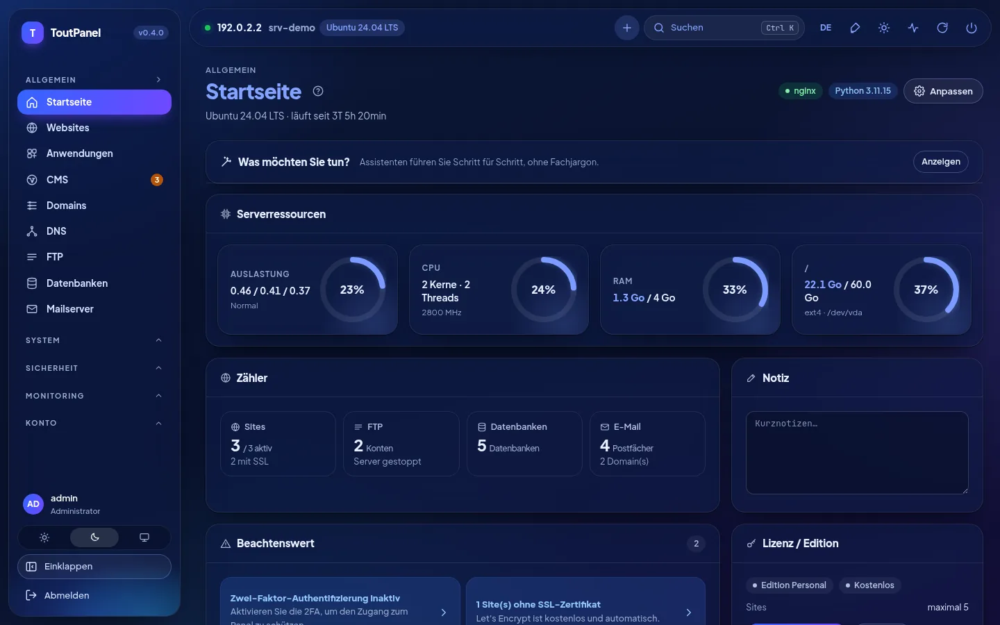<br>**Startseite, Dunkelmodus**: Anzeigen, Zähler, Aufmerksamkeitspunkte, Lizenz | 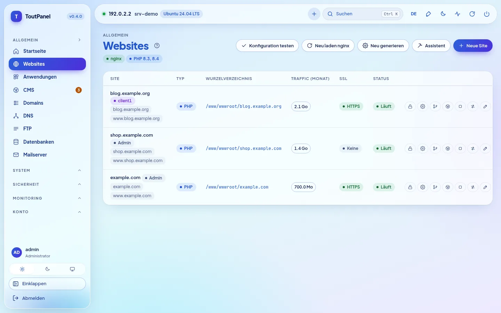<br>**Websites**: Domains, Typ, Stammverzeichnis, Traffic, SSL und Aktionen |
| <br>**PHP**: Versionen 5.6 → 8.5 nebeneinander, Supportstatus, FPM-Pools | <br>**Website-Einstellungen**: Git-Deployment, SSL, Weiterleitungen, Sicherheit |
| <br>**DNS**: BIND-Zonen oder Anbieter, Vorlagen, DNSSEC, Cluster | <br>**Zertifikate**: Gültigkeit, Aussteller, Erneuerung, Zertifikat des Panels |
| 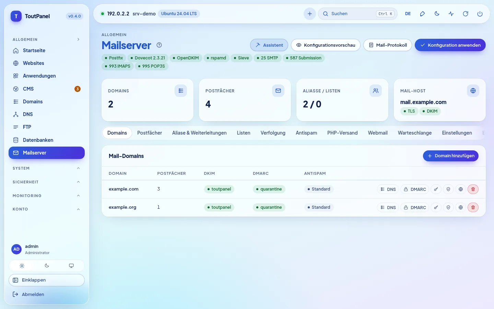<br>**Mailserver**: Postfix, Dovecot, OpenDKIM, Ports und Reiter | <br>**Webmail**: Roundcube oder SnappyMail, mit einem Klick installiert |
| 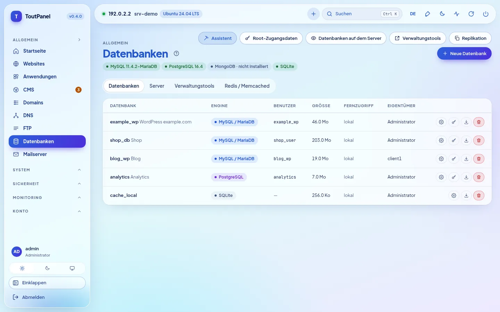<br>**Datenbanken**: MariaDB, PostgreSQL, MongoDB, SQLite, Redis | <br>**Dateien**: Editor, Archive, Papierkorb, Berechtigungen, Belegung |
| <br>**CMS › Installieren**: 582 verifizierte CMS und Anwendungen, Suche, Filter, Kennzeichnung „bereit“ | <br>**Datenblatt eines CMS**: geprüfte Voraussetzungen, Wahl der Version, Zielwebsite, Datenbank |
| <br>**CMS › Installationen**: Versionen, verfügbare Updates, Sicherung, Klonen | <br>**WAF › Engine**: ToutWAF empfohlen, integrierte WAF, BunkerWeb, SafeLine |
| <br>**Terminal**: interaktive bash- / PowerShell-Shell im Browser | <br>**Anwendungen**: WordPress, Joomla, Drupal, PrestaShop, Nextcloud… |
| <br>**Store**: Serversoftware, Module und Themes mit einem Klick | 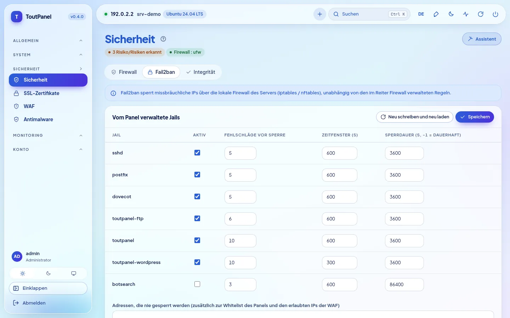<br>**Sicherheit**: Empfehlungen, Firewall, Anti-DDoS, Fail2ban |
| 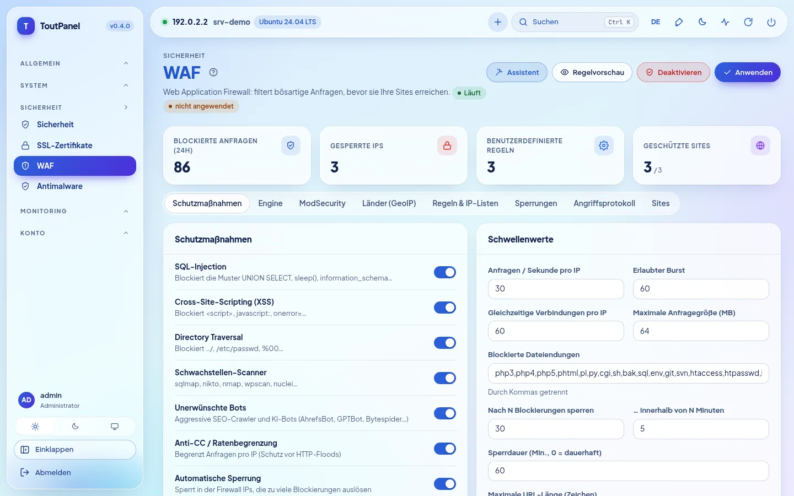<br>**WAF**: Schutzmaßnahmen, Schwellenwerte, Engines, GeoIP, Angriffsprotokoll | <br>**Monitoring**: CPU, Speicher, Netzwerk, Last und Festplatte über 1 h → 7 d |
| <br>**Konten**: Reseller, Kunden, Tarife, Zugriffsprofile | <br>**Server**: Master-Panel, Knoten, Routing, Migration |
| <br>**Updates**: Pakete des Systems (Sicherheit) und des Panels | <br>**Einstellungen**: Zugang, Port, geheimer Zugang, HTTPS, Oberfläche |
| 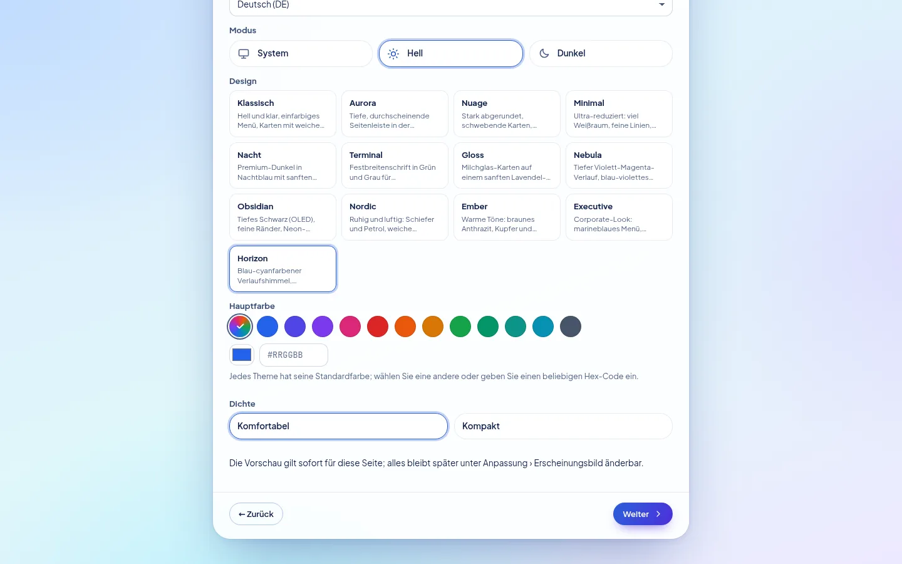<br>**Einrichtungsassistent**: Theme, Hauptfarbe, Dichte, sofortige Vorschau | <br>**Horizon**, Standard-Theme: derselbe Bildschirm in Hell und Dunkel |

**Neuerungen in 0.4** — Screenshots eines Demoservers (Dokumentationsadressen):

| | |
|---|---|
| <br>**Einrichtungsassistent, Schritt Profil**: Startprofile, erkannter Speicher, empfohlenes Profil | 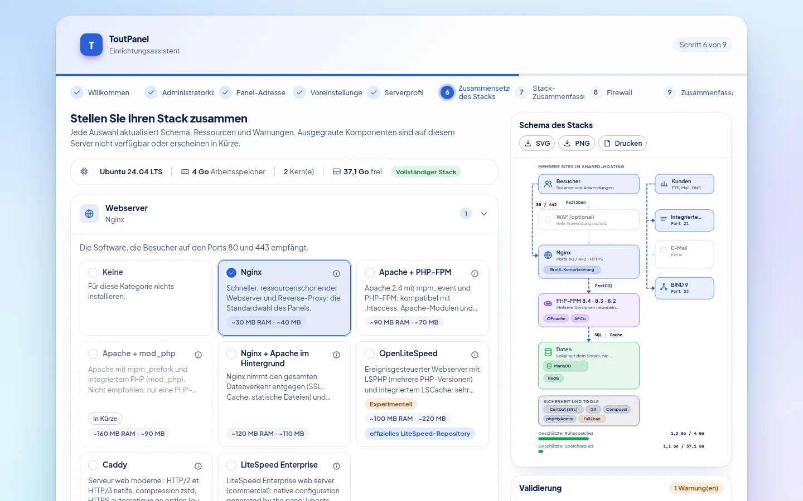<br>**Zusammenstellung des Stacks**: Auswahl pro Kategorie, Architekturschema, Validierung und geschätzte Ressourcen |
| <br>**Installation des Stacks**: Fortschritt, Schritte, Fortsetzung nach einem Fehler | <br>**Assistent, Schritt Firewall**: von ToutPanel oder vorgelagert verwaltet, Ports, die geöffnet werden |
| <br>**Einstellungen › Software-Stack**: realer Zustand, installierte Versionen, Schema dieses Servers | <br>**Software-Stack**, Dunkelmodus |
| <br>**Beschleuniger**: OPcache, JIT, APCu, Redis, Memcached, FastCGI, Varnish… mit Zustand, Speicher und Einschränkungen | <br>**OpenLiteSpeed** *(experimentell)*: Installation, LSPHP, Umschalten des Webservers, WebAdmin |
| 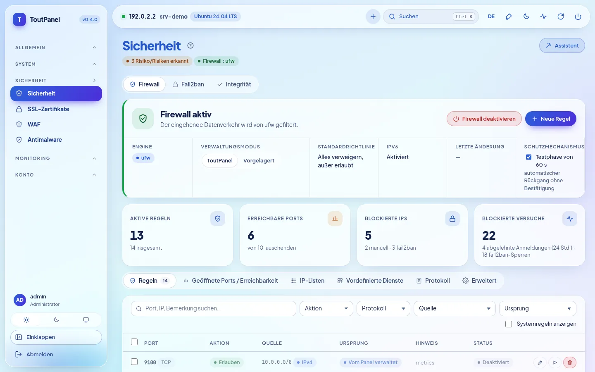<br>**Sicherheit › Firewall**: Engine, Verwaltungsmodus, Schutz vor Selbstaussperrung, Regeln | <br>**Lauschende Ports und Exposition**: exponiert, eingeschränkt, geschützt |
| <br>**Vorgelagerte Firewall**: beim Hoster zu öffnende Ports, zum Kopieren oder Herunterladen | <br>**Firewall**, Dunkelmodus |
| <br>**DNS › Engine**: BIND, PowerDNS, Knot DNS, externer Anbieter | <br>**Mailserver › Engine**: Postfix, Exim *(experimentell)*, externes Relay |
| <br>**FTP › Engine**: integriert, Pure-FTPd, ProFTPD, vsftpd, SFTP *(experimentell)* | <br>**ToutWAF remote**: Panel mit einem ToutWAF auf einem anderen Server verbunden |
| <br>**Startseite**: Banner „Distribution mit reduziertem Stack“ je nach Supportstufe | |

**Für 0.4.0 hinzugefügte Seiten** — gleiche Konventionen (Demoserver, Dokumentationsadressen):

| | |
|---|---|
| 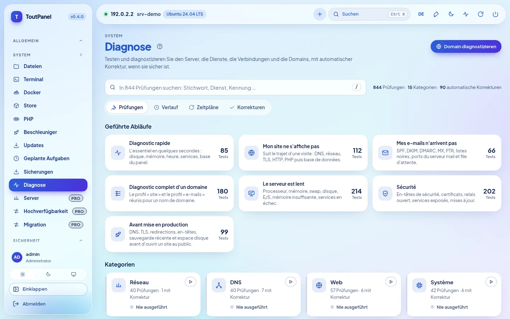<br>**System › Diagnose**: 844 Prüfungen, geführte Abläufe, Kategorien, Sofortsuche | <br>**Ergebnis einer Diagnose**: wahrscheinliche Ursachen, technischer Nachweis mit maskierten Geheimnissen, **automatische Korrektur** |
| <br>**Automatische Korrektur**: genaue Vorschau dessen, was geändert wird, Auswirkung, Rückgängigmachen möglich | <br>**Startseite › „Was möchten Sie tun?“**: Schritt für Schritt geführte Assistenten |
| 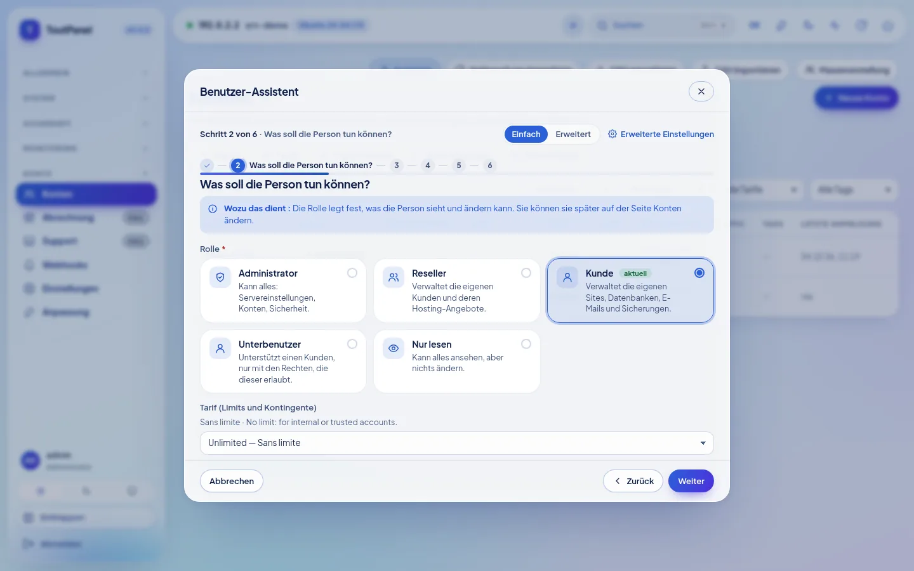<br>**Geführter Assistent** (hier: Benutzer): Schritte, kontextbezogene Hilfe, Modus Einfach oder Erweitert | <br>**Echter Test nach der Anwendung**: Ergebnis pro Prüfung, wahrscheinliche Ursache, Korrektur mit einem Klick |
| <br>**Hochverfügbarkeit** *(Pro)*: Floating-IP keepalived, Server und Prioritäten, Inhaber der Adresse | <br>**Monitoring › Serverflotte** *(Pro)*: Verfügbarkeit, CPU, Speicher, Festplatte und Last pro Server |
| <br>**Server** *(Pro)*: Master-Panel, Knoten Web / E-Mail / DNS, Zustand, gepinnter TLS-Fingerabdruck | <br>**Konten › Einstellungen › Kontoisolierung** *(Option, standardmäßig deaktiviert)*: PHP-FPM pro Konto, systemd-Härtung, Käfig |
| <br>**Einstellungen › Webserver: Caddy** *(experimentell)*: Umschalten mit Rollback, HTTPS, nicht unterstützte Funktionen | <br>**LiteSpeed Enterprise** *(experimentell; bei unseren Versuchen nie gestartet)*: Lizenz, offizielle Installation, LSPHP |
| <br>**Store › Module**: Integrations-Marketplace (Abrechnung, Überwachung, SSO, CI/CD, DNS / CDN…) | 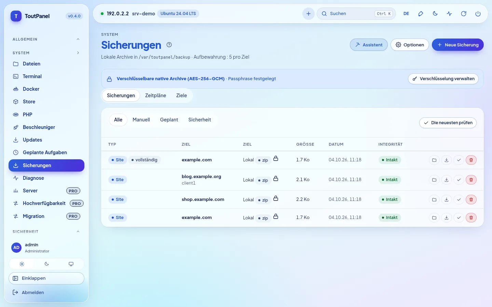<br>**Sicherungen**: verschlüsselte Archive (AES-256-GCM), vollständig oder inkrementell |
| <br>**Verschlüsselung der Sicherungen**: Passphrase verschlüsselt aufbewahrt, Warnung vor Verlust, Verschlüsselung standardmäßig oder obligatorisch | <br>**Zeitpläne**: Umfang, Aufbewahrung, Ziel, inkrementell |
| <br>**Einstellungen › Sicherheit**: Warnungen bei ungewöhnlicher Anmeldung, SSO OIDC / SAML | <br>**SSO** *(Pro)*: LDAP / Active Directory, OpenID Connect, SAML 2.0 |

**Auf dem Smartphone** passt sich die Oberfläche an (einklappbares Menü, scrollbare Tabellen):

<table>
<tr>
<td align="center"><br><b>Startseite</b></td>
<td align="center"><br><b>Websites</b></td>
</tr>
</table>

> Screenshots, aufgenommen auf einem Demoserver (Ubuntu 24.04, Dokumentationsadresse 192.0.2.2, Beispieldomains). Auf diesem Demoserver sind einige Zustände **simuliert** (es läuft dort kein echter Dienst): Kontoisolierung (systemd, cgroups), Caddy, Serverflotte und Floating-IP, Datenbanken, E-Mail, WAF und Katalog des Marketplace; die Diagnosen und die Assistenten hingegen werden tatsächlich ausgeführt. Screenshots in anderen Sprachen liegen in `screenshots/<Sprache>/` (en, de, es, it, nl, pt, ru, zh, ar).

## Themes

### 13 Themes, Ihre Farbe

Eine Neuinstallation verwendet **Horizon**: Himmel mit Blau-Cyan-Verlauf, schwebende, durchscheinende Menü- und obere Leiste, aktive Pille mit Blau-Violett-Verlauf, die der gewählten Farbe folgt, sehr fette blaue Überschriften. **Anpassung › Erscheinungsbild**: Wählen Sie ein anderes Design und dann **eine beliebige Akzentfarbe** (12 Voreinstellungen, Pipette oder Code `#RRGGBB`). Das Panel leitet daraus Schaltflächen, Links, aktives Menü, Badges, Verläufe und Diagramme ab und hält dabei einen Kontrast von mindestens 4,5:1 ein. Jedes Theme gibt es in **Hell und Dunkel**, es berücksichtigt hohen Kontrast und Sprachen mit Schreibrichtung von rechts nach links; die Vorschau ist sofort sichtbar, nichts wird gespeichert, bevor Sie „Design speichern“ wählen. Dichte, Ecken, Schriftart, Breite, Menüposition, Icons und Animationen lassen sich ebenfalls einstellen, pro Benutzer oder als Standard für alle; das Theme lässt sich exportieren und importieren.


| | | |
|---|---|---|
| <br>**Horizon** *(Standard)* · `#2b5fd9` | <br>**Klassisch** · `#2563eb` | <br>**Aurora** · `#2563eb` |
| <br>**Nuage** · `#5b5bd6` | <br>**Minimal** · `#18181b` | <br>**Nacht** · `#0369a1` |
| <br>**Terminal** · `#15803d` | <br>**Gloss** · `#7c3aed` | <br>**Nebula** · `#8b5cf6` |
| <br>**Obsidian** · `#22c55e` | <br>**Nordic** · `#14b8a6` | <br>**Ember** · `#f97316` |
| <br>**Executive** · `#10b981` | | |

<sub>Angegebene Farbe: Standard-Akzent des Themes im hellen Modus, frei änderbar.</sub>

Theme, Modus, **Hauptfarbe** und **Dichte** lassen sich auch schon im **Einrichtungsassistenten** (Schritt Einstellungen) mit sofortiger Vorschau wählen; das sind die Standardwerte aller Konten, die jeweils danach ihre eigenen wählen können.

## Editionen

Das Programm ist für alle Editionen dasselbe: Ein **Lizenzschlüssel** aktiviert die erweiterten Funktionen auf einem bestimmten Server. Eine neue Installation läuft in der Personal Edition, ohne Registrierung und ohne Internetverbindung.

| Edition | Preis | Schlüssel | Für wen |
|---|---|---|---|
| **Personal** | kostenlos, ohne zeitliche Begrenzung | keiner | persönliche Nutzung: Ihre eigenen Websites, **bis zu 5** |
| **Professional** | kostenpflichtig | erforderlich | Hoster, Agenturen, berufliche Nutzung: alles inklusive, unbegrenzt viele Websites (oder gemäß Lizenzplan) |
| **Enterprise** | kostenpflichtig | erforderlich | Professional + unbegrenzt Multi-Server + vorrangiger Support |

Die Personal Edition ist **vollständig**: Websites, Multi-Version-PHP, Datenbanken, E-Mail, DNS, SSL, integrierte WAF, lokale Sicherungen (**einschließlich AES-256-GCM-Verschlüsselung und inkrementeller Sicherungen**), Monitoring, manuelle Diagnose, geführte Assistenten (Schritte, die eine Pro-Funktion berühren, bleiben vorbehalten), Kundenkonten und Unterbenutzer, WebAuthn, DSGVO-Werkzeuge, API und CLI. Den kostenpflichtigen Editionen vorbehalten sind:

<details>
<summary><b>Genaue Liste der Funktionen von Professional / Enterprise</b></summary>

| Funktion | Personal | Professional |
|---|---|---|
| Websites | höchstens 5 | unbegrenzt (oder gemäß Lizenz) |
| Uptime-Sonden | 3 | unbegrenzt |
| Ausgehende Webhooks | 2 | unbegrenzt |
| Wahl der WAF-Engine (ToutWAF, BunkerWeb, SafeLine) | integrierte WAF | ✓ |
| ModSecurity + OWASP CRS | — | ✓ |
| Multi-Server: Knoten, Hochverfügbarkeit, Live-Migration | — | ✓ |
| Webgruppen und DNS-Cluster | — | ✓ |
| Datenbankreplikation | — | ✓ |
| Abrechnung, Gateways, WHMCS, Provisioning | — | ✓ |
| White-Label für Reseller | — | ✓ |
| Benutzerdefinierte Domain des Panels | — | ✓ |
| Support (Tickets) | — | ✓ |
| Ankündigungen | — | ✓ |
| Reseller-Konten | — (Kunden und Unterbenutzer: ✓) | ✓ |
| SSO LDAP / OpenID Connect / SAML | — (WebAuthn: ✓) | ✓ |
| Länderblockierung (GeoIP) | — | ✓ |
| Geplanter Antimalware-Scan | manuelle Analyse | ✓ |
| Entfernte Sicherungen (S3, SFTP, B2, rsync SSH, rclone) | lokaler Speicher (einschließlich verschlüsselter und inkrementeller Archive) | ✓ |
| Engines restic, Borg und rsync | — | ✓ |
| Prometheus-Export `/metrics` | — | ✓ |
| Import aus cPanel, Plesk, DirectAdmin, ISPConfig, Shared Hosting, IMAP | — (Export: ✓) | ✓ |
| Premium-Module des Stores | — | ✓ |
| Externe Verankerung des Audit-Protokolls | — (DSGVO-Export und -Löschung: ✓) | ✓ |
| Geplante Diagnosen mit Warnung | manuelle Diagnose | ✓ |

</details>

- Die betroffenen Einträge tragen ein Badge **Pro**; die Seiten bleiben einsehbar, nur Erstellen und Ändern sind vorbehalten.
- Aktivierung: **Einstellungen › Lizenz › Schlüssel aktivieren** (`TP-XXXXX-XXXXX-XXXXX-XXXXX`) oder `toutpanel licence activate <Schlüssel>`. Das signierte Token wird lokal geprüft: Die Lizenz funktioniert offline (tägliche Neuvalidierung, Karenzzeit von 15 Tagen).
- Läuft die Lizenz ab oder ist sie nicht mehr gültig, **fällt das Panel in die Personal Edition zurück, ohne etwas zu löschen**.

Preise und Kauf: **[toutpanel.com/tarifs](https://toutpanel.com/tarifs)** · Details: [Editionen und Lizenz](https://toutpanel.com/docs/guide/editions/).

## Architektur

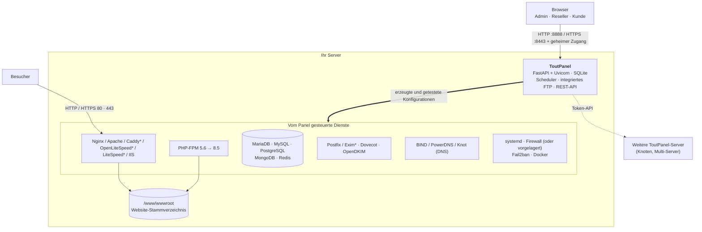

| Komponente | Rolle |
|---|---|
| **Panel** | FastAPI-Anwendung, von Uvicorn ausgeliefert (systemd-Dienst `toutpanel` unter Linux, geplante Aufgabe `ToutPanel` unter Windows). Weboberfläche ohne externe Abhängigkeit, REST-API, Aufgaben-Scheduler, integrierter FTP-Server. |
| **Web-Stack** | Nginx und/oder Apache (Caddy, OpenLiteSpeed mit LSPHP, LiteSpeed Enterprise: experimentell; IIS unter Windows) mit PHP-FPM; das Panel schreibt die vhosts aus seinen Vorlagen, testet sie und lädt dann den Dienst neu. Der **Stack-Konfigurator** wählt die Software aus und entwickelt sie weiter. |
| **Dienste** | MariaDB / MySQL / PostgreSQL / MongoDB, Postfix (oder Exim*) / Dovecot / OpenDKIM, BIND (oder PowerDNS, Knot), FTP (integriert oder Pure-FTPd*, ProFTPD*, vsftpd*), Fail2ban, Firewall, Docker: vom Panel über ihre nativen Werkzeuge gesteuert. |
| **CLI `toutpanel`** | Administration des Panels (Port, Zugang, Passwort, Update, Lizenz…) und per Skript steuerbare Fachbefehle (`--json`). |

<sub>\* experimentell</sub>

```
<home>  (/var/toutpanel oder C:\toutpanel)
├── data/      SQLite-Datenbank des Panels, settings.json, Schlüssel, install-info.txt
├── logs/      panel.log und Protokolle der Websites
├── vhost/     erzeugte vhosts (wenn der native Ordner des Webservers fehlt)
├── ssl/       Zertifikate der Websites und des Panels
├── backup/    lokale Sicherungen
├── src/       Klon dieses Repositorys (Kanäle, Tags, toutpanel update)
└── venv/      Python-Umgebung des Panels
/www/wwwroot   Website-Stammverzeichnis (C:\toutpanel\wwwroot unter Windows)
```

## Vollständige Installation

### Voraussetzungen

| | Linux | Windows |
|---|---|---|
| **Systeme** | Stufe **vollständig**: Debian 11 und neuer, Ubuntu 20.04 und neuer, AlmaLinux / Rocky Linux / RHEL / CentOS Stream / Oracle Linux / CloudLinux 8 und neuer, Fedora · Stufe **reduziert** (das Panel läuft, einige Funktionen fehlen): Debian 10, Ubuntu 18.04, CentOS / RHEL 7, Amazon Linux, openSUSE / SLES, Arch, Alpine, Devuan · siehe [Distributionskompatibilität](#distributionskompatibilität) | Windows 10, 11 · Windows Server 2016, 2019, 2022, 2025 (mindestens Build 14393) |
| **Rechte** | `root` (oder `sudo`) und `bash` | PowerShell 5.1+ **als Administrator** (winget nicht erforderlich) |
| **Python** | 3.9 bis 3.14 (vom Skript installiert, wenn die Distribution es bereitstellt) | vom Skript installiert (3.12, python.org), falls nicht vorhanden |
| **Speicher** | mindestens 1 GB (nur Panel), 2 GB empfohlen mit MariaDB und PHP | dito |
| **Festplatte** | 2 GB frei + Ihre Websites | dito |
| **Netzwerk** | ausgehender HTTPS-Zugang (GitHub, PyPI, Repositories der Distribution, Let's Encrypt); feste öffentliche IP und Reverse-DNS für E-Mail | dito (python.org, nginx.org, windows.php.net, MariaDB) |

Architekturen: `x86_64` und `aarch64` (andere: Stufe reduziert). Installieren Sie vorzugsweise auf einem **frisch installierten Server**. Auf einem Server, auf dem Nginx, Apache oder MariaDB bereits konfiguriert sind, verwenden Sie `--stack none`: Das Panel erkennt sie und schreibt seine vhosts in deren nativen Ordner, ohne den Rest anzutasten.

### Distributionskompatibilität

Der Installer und das Panel erkennen die Distribution (`/etc/os-release`, Architektur) und zeigen eine **Supportstufe** an: `toutpanel compat` listet die bekannten Distributionen auf, `toutpanel check` nennt die Stufe Ihres Servers, und ein Banner auf der Startseite warnt, wenn die Stufe nicht „vollständig“ ist. Es gibt **nie eine Obergrenze für die Version**: Eine neuere Version einer bekannten Familie wird wie die letzte bekannte behandelt.

| Stufe | Bedeutung | Beispiele |
|---|---|---|
| **Vollständig** | der komplette Stack ist vorgesehen (Webserver, Multi-Version-PHP, Datenbanken in wählbaren Versionen, E-Mail, Firewall, automatische Updates) | Debian 11+, Ubuntu 20.04+ (LTS und Zwischenversionen), AlmaLinux / Rocky / RHEL / CentOS Stream / Oracle Linux 8+, CloudLinux 8 und 9, Fedora, Raspberry Pi OS 64 Bit |
| **Reduziert** | das Panel läuft, aber einige Funktionen fehlen oder erfordern ein Eingreifen (System am Lebensende, Init ohne systemd, fehlende Drittanbieter-Repositories, 32-Bit-Architektur); nicht blockierende Warnung | Debian 10, Ubuntu 18.04, CentOS / RHEL 7, Amazon Linux 2 und 2023 (jeweils nur ein PHP), openSUSE / SLES, Arch und Derivate, Alpine, Devuan, Kali |
| **Nicht unterstützt** | unbekanntes, zu altes oder unveränderliches System: Der Installer sagt es und bricht ab | Fedora CoreOS / Silverblue, MicroOS, Flatcar, Gentoo, NixOS, Void |

„Vollständig“ beschreibt die vom Panel **vorgesehene** Stufe; **die Versuche wurden unter Ubuntu 24.04 durchgeführt**, mit einer Ausnahme: **AlmaLinux 9.8 und 10.2 mit SELinux Enforcing** (QEMU-Labor vom 4. Oktober 2026); die Validierung von Anfang bis Ende wurde auf den anderen Distributionen nicht durchgeführt, Rocky Linux, RHEL und Fedora eingeschlossen (siehe [Bekannte Einschränkungen](#bekannte-einschränkungen)). Python 3.9+ wird bereitgestellt, wenn das System zu alt ist (aktuelles Paket der Distribution oder eigenständiges, per SHA-256 geprüftes Python, mit Ihrer Zustimmung).

### Linux

```bash
curl -sSL https://raw.githubusercontent.com/qu3ntin01/toutpanel/main/install.sh | sudo bash -s -- --lang de
```

Um das Skript vor der Ausführung zu lesen:

```bash
curl -sSLO https://raw.githubusercontent.com/qu3ntin01/toutpanel/main/install.sh
less install.sh
sudo bash install.sh --lang de
```

Die Installation dauert je nach Verbindung 3 bis 6 Minuten.

**Installationsassistent.** Alle Optionen (Konto, Ports, Verzeichnis, Stack, Firewall, WAF, Version, Sprache…) lassen sich über Menüs auf **[toutpanel.com/installation-assistant](https://toutpanel.com/installation-assistant)** wählen, das die Befehlszeile erzeugt und live überprüft (Geheimnisse erscheinen dort nie im Klartext).

**Eine genaue Version installieren.** Der Standardbefehl installiert die neueste stabile Version; `--version` wählt eine andere (Liste: `--list-versions`). Vorabversionen werden auf dem Kanal `dev` veröffentlicht und mit `--channel dev` installiert:

```bash
# die neueste stabile Version
curl -sSL https://raw.githubusercontent.com/qu3ntin01/toutpanel/main/install.sh | sudo bash
# eine genaue Version (Liste: --list-versions)
curl -sSL https://raw.githubusercontent.com/qu3ntin01/toutpanel/main/install.sh | sudo bash -s -- --list-versions
curl -sSL https://raw.githubusercontent.com/qu3ntin01/toutpanel/main/install.sh | sudo bash -s -- --version 0.4.0
# die neueste Vorabversion (Kanal dev)
curl -sSL https://raw.githubusercontent.com/qu3ntin01/toutpanel/dev/install.sh | sudo bash -s -- --channel dev
```

**Interaktives Menü.** In einem Terminal ohne Moduswahl gestartet, stellt das Skript ToutPanel vor, erkennt eine bestehende Installation und bietet an: **installieren** (kompletter Stack) oder **nur das Panel installieren**, gegebenenfalls im **Knotenmodus**; oder, wenn das Panel bereits vorhanden ist, **aktualisieren**, **vollständig neu installieren** oder **deinstallieren**. Es fragt auch nach der **Firewall** (ToutPanel / vorgelagert / später) und, nach dem Start des Panels, nach dem **Stack-Profil**. Ohne Terminal (Automatisierung, `--yes`) stellt es keine Fragen: Es installiert oder aktualisiert, wenn das Panel vorhanden ist (Firewall „später“, Standard-Stack).

**Was das Skript tut:**

1. installiert bei Bedarf Python 3.9+ und legt die virtuelle Umgebung `<home>/venv` an;
2. installiert den **Web-Stack** (Nginx, PHP-FPM, MariaDB, Redis oder Valkey, Certbot, Fail2ban) wie bisher oder den, den Sie zusammenstellen (`--profile`, `--web`, `--php`, `--db`… an `toutpanel stack apply` übergeben);
3. klont dieses Repository nach `<home>/src`, **prüft die SHA-256-Summe** des zum System-Python passenden Wheels und installiert es;
4. legt ein zufälliges **Administratorkonto** und eine zufällige **geheime Zugangs-URL** an;
5. registriert den **systemd-Dienst** `toutpanel`;
6. richtet die **Firewall** gemäß `--firewall` ein: `on` (ToutPanel verwaltet sie und öffnet die nötigen Ports), `off` (vorgelagerte Firewall: keine Systemregel, Liste der beim Hoster zu öffnenden Ports), Frage in einem Terminal, sonst „später“ (nichts wird angetastet);
7. konfiguriert **SELinux** (Alma, Rocky, RHEL, Fedora) oder **AppArmor** (Debian, Ubuntu, SUSE);
8. zeigt eine Zusammenfassung an, gespeichert in `<home>/data/install-info.txt` (nur für root lesbar).

#### Optionen von `install.sh`

| Option | Beschreibung | Standard |
|---|---|---|
| `--stack full` | **veraltet** (siehe `--profile`): Nginx + PHP-FPM + MariaDB + Redis/Valkey + Certbot + Fail2ban | ✓ |
| `--stack minimal` | **veraltet**: Nginx + PHP-FPM + Certbot | |
| `--stack none` | **veraltet**: nur das Panel (Server bereits konfiguriert) | |
| `--profile NAME` | Profil des **Stack-Konfigurators**: `single-site`, `multi-site`, `hosting`, `performance`, `application`, `mail-only`, `dns-only`, `node`, `lamp`, `standard`, `custom` (Werte der anderen Optionen: siehe die Tabelle unten) | Standard-Stack |
| `--web`, `--php`, `--php-default`, `--php-ext`, `--db`, `--redis`, `--accel`, `--ftp`, `--mail ENGINE`, `--dns`, `--security`, `--runtime`, `--tools`, `--install-mode`, `--roles`, `--stack-file`, `--no-tuning` | Optionen des Konfigurators, nach der Installation des Panels unverändert an `toutpanel stack apply … --yes` übergeben (ein Fehlschlag des Stacks lässt die Installation nicht scheitern: Befehl zur Wiederaufnahme wird angezeigt) | |
| `--accept-litespeed-license` | mit `--web litespeed[:6.3]`: akzeptiert den Lizenzvertrag von LiteSpeed Technologies; **obligatorisch** (ohne sie bricht der Installer vor jeder Änderung ab), unvereinbar mit `--stack`, unter Windows abgelehnt. **LiteSpeed Enterprise ist ein kommerzielles, EXPERIMENTELLES Produkt, in der Entwicklungsumgebung nie gestartet**: offizielle Testversion von 15 Tagen, danach kostenpflichtige Lizenz | nein |
| `--mail` | (allein) fügt Postfix, Dovecot, OpenDKIM hinzu und öffnet die Mail-Ports | nein |
| `--firewall on\|off\|ask` | wer die Firewall verwaltet: ToutPanel (`on`), eine vorgelagerte Firewall ohne Systemregel (`off`), Frage (`ask`); ohne Terminal und ohne Wert: „später“; wird durch ein Update nie geändert | Frage in einem Terminal |
| `--firewall-engine nft\|ufw\|firewalld\|csf\|iptables` | Engine der von ToutPanel verwalteten Firewall | erkannt |
| `--dry-run` | zeigt die erkannte Distribution, das Verzeichnis und die geplanten Befehle an, ohne etwas zu ändern (ohne root) | nein |
| `--postgres` | fügt PostgreSQL hinzu (Passwort der Rolle `postgres` erzeugt und im Panel gespeichert) | nein |
| `--waf toutwaf` | stellt **ToutWAF**, die WAF des Herstellers, über seinen offiziellen Installer vor den Websites bereit (systemd-Dienste, ohne Docker; Webserver auf 8080 / 8443 verschoben, Konsole auf 9443, Zusammenfassung in `/etc/toutwaf/INSTALL-SUMMARY.txt`) | nein |
| `--waf bunkerweb` / `--waf safeline` | installiert Docker und stellt die externe WAF vor den Websites bereit (Webserver auf 8080 / 8443 verschoben, Konsole auf 7000 oder 9443) | nein |
| `--waf toutwaf --waf-console URL` | **ToutWAF remote**: verbindet das Panel mit einem auf einem anderen Server installierten ToutWAF (keine lokale Installation), mit `--waf-origin-ip`, `--waf-origin-addr`, `--waf-cert-mode import\|acme`, `--waf-server-id`, `--waf-fingerprint` oder `--waf-trust-first-use`, `--waf-restrict` (80 / 443 auf ToutWAF beschränkt); das Token wird über `--waf-token-file DATEI` oder `--waf-token-stdin` übergeben (nie als Argument) | nein |
| `--node` | **Knotenmodus** für Multi-Server: Panel nur über HTTPS, Registrierungstoken, API-URL und TLS-Fingerabdruck werden angezeigt (auf dem Master einzugeben: System › Server › Hinzufügen) | nein |
| `--master URL` | mit `--node`: URL des Master-Panels | — |
| `--port N` | **HTTP**-Port des Panels | `8888` |
| `--https-port N` | **HTTPS**-Port des Panels (das Panel lauscht auf HTTP **und** HTTPS; anfangs selbstsigniertes Zertifikat) | `8443` |
| `--version X.Y.Z` | installiert diese veröffentlichte Version (auch `vX.Y.Z`, `0.4.0b1` oder `0.4.0-beta.1`; Variable `TOUTPANEL_VERSION`); eine Vorabversion impliziert den Kanal `dev`; Version nicht gefunden oder ohne Wheel für Ihr Python: Abbruch vor jeder Änderung mit der Liste der Versionen; ein Downgrade verlangt eine Bestätigung (außer mit `--yes`) | neueste des Kanals |
| `--list-versions` | listet die veröffentlichten Versionen auf (neueste zuerst) und beendet sich, ohne etwas zu installieren | |
| `--random-port` | Zufallsport zwischen 20000 und 39999 | |
| `--username NAME` | Name des Administratorkontos | zufälliger `admin_xxxxxx` |
| `--password PASSWORT` | Administratorpasswort (in `ps` und im Shell-Verlauf sichtbar: ziehen Sie die drei folgenden Optionen vor) | 16 zufällige Zeichen |
| `TOUTPANEL_PASSWORD` | Umgebungsvariable mit dem Passwort (von `sudo -E` beibehalten); eine Option hat Vorrang vor der Variablen | — |
| `--password-file DATEI` | liest das Passwort aus der ersten Zeile einer Datei (unter Linux dem Besitzer vorbehalten: `chmod 600`) | — |
| `--password-stdin` | liest das Passwort von der Standardeingabe (erste Zeile; unbrauchbar mit `curl \| bash`) | — |
| `--entrance /pfad` | gesicherter Zugang der URL | zufälliger `/tp_xxxxxxxxxx` |
| `--home DIR` | Verzeichnis des Panels (eine bestehende Installation im alten Standard `/www/toutpanel` wird erkannt und beibehalten) | `/var/toutpanel` |
| `--source DIR` | aus einem lokalen Ordner installieren (Kopie dieses Repositorys mit `dist/`) | Klon des Branches |
| `--branch NAME` | herunterzuladender Git-Branch | `main` |
| `--channel stable\|dev` | Update-Kanal, im Panel gespeichert | `stable` |
| `--update` | aktualisiert eine bestehende Installation (automatisch erkannt): Datensicherung, neuer Code, Migration der Datenbank, Neustart | auto |
| `--reinstall` | erzwingt eine vollständige Installation, auch wenn das Panel vorhanden ist | nein |
| `--uninstall` | deinstalliert das Panel (Websites und Datenbanken bleiben erhalten, Daten des Panels archiviert) | nein |
| `--yes`, `-y` | keine Fragen (Menü und Bestätigungen) | nein |
| `--lang xx` | Sprache des Installers und Anfangssprache des Panels: `en`, `fr`, `de`, `es`, `it`, `pt`, `nl`, `ru`, `zh`, `ar` | Systemsprache, sonst `en` |
| `--en`, `--fr`, `--de`, `--es`, `--it`, `--pt`, `--nl`, `--ru`, `--zh`, `--ar` | Kurzformen von `--lang` | |
| `-h`, `--help` | zeigt die Hilfe des Skripts an | |

Es wird jeweils nur eine Passwortquelle akzeptiert (zwei Optionen werden vor jeder Änderung abgelehnt). Ohne eine solche bietet ein interaktives Terminal „automatisch erzeugen (empfohlen)“ oder „eingeben“ (ohne Echo, mit Bestätigung) an; ohne Terminal oder mit `--yes` wird ein Passwort erzeugt und am Ende angezeigt. Ein übergebenes Passwort wird weder angezeigt noch in die Zusammenfassung oder `install-info.txt` geschrieben, und ein Update ändert es nie.

**Werte der Stack-Optionen** (sie werden vor jeder Änderung geprüft; **\*** = experimentell):

| Option | Werte |
|---|---|
| `--web` | `nginx`, `apache`, `nginx-apache`, `caddy`\*, `openlitespeed`\* (`:1.9`, `:1.8`, `:1.7`), `litespeed`\* (`:6.3`, `:6.2`, `:6.1`, `:6.0`; LiteSpeed Enterprise, kommerziell, erfordert `--accept-litespeed-license`), `none`; `toutpanel stack apply` akzeptiert dieselben Werte |
| `--php` / `--php-default` / `--php-ext` | durch Kommas getrennte Versionen (`8.3,8.4`, von 5.6 bis 8.5) / Standardversion / `minimal`, `standard`, `full` |
| `--db` | `mariadb` (`:10.6`, `:10.11`, `:11.4`, `:11.8`), `mysql`\* (`:8.4`, `:9.7`), `percona`\* (`:8.0`, `:8.4`), `postgresql` (`:13` bis `:18`), `none` |
| `--accel` | `opcache`, `jit`, `apcu`, `redis`, `memcached`, `fastcgi-cache`, `varnish`\*, `brotli`, `zstd`\*, `http3`\*, `ioncube` |
| `--ftp` | `builtin`, `pureftpd`\*, `proftpd`\*, `vsftpd`\*, `sftp`\*, `none` |
| `--mail` | `postfix`, `postfix-clamav`, `postfix-light`, `exim`\*, `relay`, `none` |
| `--dns` | `bind`, `powerdns`, `knot`, `external`, `none` |
| `--security` | `firewall`, `fail2ban`, `modsecurity`, `clamav`, `toutwaf` |
| `--runtime` / `--tools` | `nodejs`, `python`, `go`, `ruby`, `java`, `docker` / `certbot`, `git`, `composer`, `phpmyadmin`, `adminer`, `restic`, `goaccess` |
| `--install-mode` / `--roles` | `single-server`, `single-site`, `multi-site`, `multi-server` / `web`, `db`, `mail`, `dns` |

Eine „in Kürze“-Komponente (Apache + mod_php) wird von `toutpanel stack` sauber abgelehnt, ohne etwas zu installieren.

Beispiele:

```bash
sudo bash install.sh --stack minimal --port 7443
sudo bash install.sh --profile lamp --php 8.3,8.4 --db mariadb:11.4 --firewall on
sudo bash install.sh --profile hosting --mail postfix-clamav --dns bind --firewall off --yes
sudo bash install.sh --dry-run --profile lamp          # Simulation
sudo bash install.sh --mail --postgres
sudo bash install.sh --mail --username ich --password-file /root/passwort.txt --entrance /mein-zugang
sudo bash install.sh --profile performance --web openlitespeed --php 8.3 --accel opcache,redis --firewall off --yes   # OpenLiteSpeed: experimentell
sudo bash install.sh --web litespeed:6.3 --php 8.3 --accept-litespeed-license --yes   # LiteSpeed Enterprise: kommerziell, experimentell, Lizenz obligatorisch (nur Linux)
sudo bash install.sh --waf toutwaf                 # WAF des Herstellers vor den Websites
sudo bash install.sh --stack minimal --node --master https://master.example.com:8888   # von einem Master gesteuerter Server
curl -sSL https://raw.githubusercontent.com/qu3ntin01/toutpanel/main/install.sh | sudo bash -s -- --yes --random-port
curl -sSL https://raw.githubusercontent.com/qu3ntin01/toutpanel/main/install.sh | sudo bash -s -- --channel dev
curl -sSL https://raw.githubusercontent.com/qu3ntin01/toutpanel/main/install.sh | sudo bash -s -- --de   # Installer auf Deutsch
```

#### Sprache des Installers

Die Installer sind **mehrsprachig**: Banner, Menü und Fragen, Schritte, Warnungen, Fehler, Hilfe, Zusammenfassung und `install-info.txt` erscheinen in einer der **10 Sprachen** unten, standardmäßig auf **Englisch**. Die gewählte Sprache wird auch zur **Anfangssprache des Panels** (Installation und Neuinstallation); eine Zeile unter dem Banner nennt die gewählte Sprache und ihre Herkunft.

| Sprache | `--lang` | Linux-Kurzform | Windows |
|---|---|---|---|
| English *(Standard)* | `en` | `--en` | `-Lang en` / `-En` |
| Français | `fr` | `--fr` | `-Lang fr` / `-Fr` |
| Deutsch | `de` | `--de` | `-Lang de` / `-De` |
| Español | `es` | `--es` | `-Lang es` / `-Es` |
| Italiano | `it` | `--it` | `-Lang it` / `-It` |
| Português | `pt` | `--pt` | `-Lang pt` / `-Pt` |
| Nederlands | `nl` | `--nl` | `-Lang nl` / `-Nl` |
| Русский | `ru` | `--ru` | `-Lang ru` / `-Ru` |
| 中文 | `zh` | `--zh` | `-Lang zh` / `-Zh` |
| العربية | `ar` | `--ar` | `-Lang ar` / `-Ar` |

Rangfolge, von der stärksten zur schwächsten:

| # | Quelle | Linux | Windows |
|---|---|---|---|
| 1 | Befehlszeilenoption | `--lang xx` oder Kurzform (`--fr`…) | `-Lang xx` oder Kurzform (`-Fr`…) |
| 2 | Umgebungsvariable | `TOUTPANEL_LANG=fr` | `$env:TOUTPANEL_LANG = "fr"` |
| 3 | im Skript geschriebener Wert | `INSTALLER_LANG="fr"` am Anfang von `install.sh` | `$InstallerLang = "fr"` am Anfang von `install.ps1` |
| 4 | **Erkennung** der Systemsprache, wenn sie zu den 10 gehört | `LC_ALL`, `LC_MESSAGES`, `LANG` | `Get-Culture` |
| 5 | Englisch | | |

```bash
curl -sSL https://raw.githubusercontent.com/qu3ntin01/toutpanel/main/install.sh | sudo env TOUTPANEL_LANG=de bash
```

Erkannte Umgebungsvariablen: `TOUTPANEL_LANG` (Sprache des Installers), `TOUTPANEL_HOME` (Verzeichnis), `TOUTPANEL_REPO` (Git-Repository), `TOUTPANEL_BRANCH` (Branch), `TOUTPANEL_CHANNEL` (`stable` oder `dev`), `TOUTPANEL_VERSION` (genaue Version), `TOUTPANEL_PASSWORD` (Administratorpasswort), `TOUTPANEL_FIREWALL` / `TOUTPANEL_FIREWALL_ENGINE` und eine Variable pro Stack-Option (`TOUTPANEL_PROFILE`, `TOUTPANEL_WEB`, `TOUTPANEL_PHP`, `TOUTPANEL_DB`, `TOUTPANEL_ACCEL`, `TOUTPANEL_FTP`, `TOUTPANEL_MAIL_ENGINE`, `TOUTPANEL_DNS`…).

<details>
<summary><b>Je nach Distribution installierte Pakete</b></summary>

- **Debian / Ubuntu**: `nginx`, `php8.x-fpm` (+ cli, mysql, curl, mbstring, xml, zip, gd, intl, bcmath, opcache), `certbot`, `composer`, `mariadb-server`, `redis-server`, `fail2ban`, `python3-venv`, `git`, `unzip`; Multi-Version-PHP über packages.sury.org (Debian) oder das PPA ondrej (Ubuntu).
- **AlmaLinux / Rocky / RHEL / Fedora**: `epel-release` (+ CRB), `remi-release`, `nginx`, `php83-php-fpm` (+ Erweiterungen), `certbot`, `mariadb-server`, `redis` oder `valkey` (Valkey auf AlmaLinux 10), `fail2ban`, `policycoreutils-python-utils`, `dnf-plugins-core`, `rspamd` (aus dem offiziellen Repository `rspamd.com`, vom Stack hinzugefügt: fehlt in AlmaLinux und EPEL), `firewalld` (mit `--firewall on` installiert: Cloud-Images haben weder `firewalld` noch `nft`); deklarierte SELinux-Kontexte (`httpd_sys_rw_content_t` auf `/www/wwwroot`, `httpd_log_t`, `var_log_t`, `cert_t`, `httpd_config_t`, `mail_spool_t`) und aktivierte Booleans `httpd_can_network_connect`, `httpd_can_network_connect_db`, `httpd_can_sendmail`, `httpd_setrlimit`.
- **Optionale Python-Module** (standardmäßig nicht installiert): `pymongo` (MongoDB), `wsgidav` + `a2wsgi` (WebDAV), `geoip2` (GeoIP), `python3-saml` (SAML) — `/var/toutpanel/venv/bin/pip install "pymongo>=4.6"`, dann `systemctl restart toutpanel`.

</details>

### Windows

In PowerShell **als Administrator**:

```powershell
Set-ExecutionPolicy Bypass -Scope Process -Force
iwr -useb https://raw.githubusercontent.com/qu3ntin01/toutpanel/main/install.ps1 | iex
```

Das Skript prüft die Windows-Version und die Rechte, installiert **Python 3.12**, falls kein Python 3.9+ vorhanden ist, legt `C:\toutpanel\venv` an und installiert dort das Panel, legt das Admin-Konto und die geheime URL an, fügt die Firewall-Regeln hinzu (Port des Panels, 80, 443, 21), erstellt die geplante Aufgabe **ToutPanel** (automatischer Start als SYSTEM) und fügt `C:\toutpanel\bin` zum PATH hinzu.

Um auch den Web-Stack zu installieren (**Nginx** in `C:\nginx`, vom Panel überwachtes **PHP 8.5**, **MariaDB** als Windows-Dienst):

```powershell
iwr -useb https://raw.githubusercontent.com/qu3ntin01/toutpanel/main/install.ps1 -OutFile install.ps1
.\install.ps1 -Stack
```

| Option | Beschreibung |
|---|---|
| `-Port 8888` | **HTTP**-Port des Panels |
| `-HttpsPort 8443` | **HTTPS**-Port des Panels |
| `-Version X.Y.Z` / `-ListVersions` | eine genaue veröffentlichte Version installieren (Variable `TOUTPANEL_VERSION`) / die veröffentlichten Versionen auflisten |
| `-Home C:\toutpanel` | Verzeichnis des Panels |
| `-Stack` | installiert Nginx, PHP 8.5, MariaDB |
| `-Username`, `-Password`, `-Entrance /x` | gewähltes Admin-Konto und geheime URL (`-Password` ist in der Prozessliste sichtbar: ziehen Sie `$env:TOUTPANEL_PASSWORD`, `-PasswordFile DATEI` oder `-PasswordStdin` vor) |
| `-PythonVersion`, `-NginxVersion`, `-MariaDBVersion`, `-PhpVersion` | heruntergeladene Versionen |
| `-Source C:\pfad` / `-Branch main` | lokaler Ordner (Kopie dieses Repositorys) / heruntergeladener Branch |
| `-Update` / `-Reinstall` / `-Uninstall` | aktualisieren / alles neu installieren / deinstallieren |
| `-Yes` | keine Fragen (Automatisierung) |
| `-Lang xx` / `-En`, `-Fr`, `-De`, `-Es`, `-It`, `-Pt`, `-Nl`, `-Ru`, `-Zh`, `-Ar` | Sprache des Installers und Anfangssprache des Panels (Standard: Systemsprache, sofern unterstützt, sonst Englisch; siehe [Sprache des Installers](#sprache-des-installers)); mit `iwr … \| iex`: `$env:TOUTPANEL_LANG = "de"` vor dem Befehl |
| `-Help` | Hilfe des Skripts |

### Zu öffnende Ports

| Port | Verwendung | Vom Installer geöffnet |
|---|---|---|
| **8888** (konfigurierbar) | Oberfläche des Panels über **HTTP** | ja |
| **8443** (konfigurierbar) | Oberfläche des Panels über **HTTPS** (anfangs selbstsigniertes Zertifikat) | ja (führen Sie den Installer erneut aus oder öffnen Sie ihn bei einer bestehenden Installation von Hand) |
| **80 / 443** | Websites | ja |
| 21 + 60000-60100 | FTP (integriert oder die gewählte Engine: passiver Bereich der Engine) | nur 21; öffnen Sie den passiven Bereich, wenn Sie FTP aktivieren |
| 25, 465, 587, 143, 993, 110, 995, 4190 | E-Mail (SMTP, IMAP, POP3, ManageSieve) | mit `--mail` (4190: für Sieve aus der Ferne zu öffnen) |
| 53 (UDP und TCP) | DNS (BIND, PowerDNS oder Knot), wenn Sie Ihre Zonen selbst hosten | nein: Sicherheit › Firewall |
| 9443 / 7000 | Konsolen von ToutWAF und SafeLine (9443), BunkerWeb (7000) | mit `--waf` |
| 3306 / 5432 | Fernzugriff auf Datenbanken (optional) | nein: nur wenn Sie ihn aktivieren |

Vergessen Sie nicht die **Firewall Ihres Hosters** (Sicherheitsgruppe): Wenn sie die Ports des Panels (8888 und 8443) blockiert, zeigt der Browser nichts an. Mit `--firewall off` (oder dem Modus „Vorgelagert“ unter Sicherheit › Firewall) rührt ToutPanel keine Systemregel an und **listet die zu öffnenden Ports** beim Hoster auf (`toutpanel firewall ports`, Kopieren oder CSV-Download in der Oberfläche); mit `--firewall on` öffnet es sie selbst, und ein **60-s-Schutz** macht jede unbestätigte Änderung rückgängig, die Ihnen den Zugang abschneiden würde.

## Erster Start

Am Ende der Installation zeigt das Skript eine Zusammenfassung an (hier mit den Texten des deutschsprachigen Installers):

```
╔══════════════════════════════════════════════════════════════════╗
║  ToutPanel ist installiert!                                      ║
╚══════════════════════════════════════════════════════════════════╝

  Panel-URL (HTTP)          : http://203.0.113.10:8888/tp_dchwp7kmkf
  Panel-URL (HTTPS)         : https://203.0.113.10:8443/tp_dchwp7kmkf   selbstsigniertes Zertifikat: Browserwarnung ist normal
  Benutzername              : admin_gbhjkv
  Passwort                  : D9nYzTSKHbX8FTqC
  MariaDB root              : k3Jd82nLqP0sYt7wVb1c
  Einrichtungsassistent     : https://203.0.113.10:8443/tp_dchwp7kmkf#/setup?token=npSj7xpVzJOI8weJl8R00AdQ18MHYn8YIJCbOYi43B8
  Dieser Link (24 h, einmalige Verwendung) erlaubt es, die oben erzeugte Panel-Adresse, den Benutzernamen und das Passwort zu ändern.
  Neuer Link: toutpanel setup-link
  PHP                       : 8.5 (Nginx + PHP-FPM bereit)

  Diese Informationen sind gespeichert in: /var/toutpanel/data/install-info.txt
  Die URL enthält den gesicherten Zugang: Ohne ihn antwortet das Panel mit 404.
```

1. **Notieren Sie sich die vollständige URL** (HTTP und HTTPS): Sie enthält den **gesicherten Zugang** (`/tp_…`). Ohne ihn antwortet das Panel mit `404 Not Found`, wodurch es für Scans unsichtbar bleibt. `toutpanel info` zeigt sie erneut an. Das HTTPS-Zertifikat ist anfangs **selbstsigniert**: Die Warnung des Browsers ist normal; der Einrichtungsassistent wird über HTTPS geöffnet, damit sein Token nicht im Klartext übertragen wird.
2. **Öffnen Sie den Link „Einrichtungsassistent“** (`#/setup?token=…`, 24 h gültig, einmalige Verwendung): In **neun Schritten** und ohne Anmeldung ersetzen Sie die erzeugten Werte durch Ihre eigenen (Benutzername, Passwort, Port, gesicherter Zugang, Hostname, Sprache, Modus, Theme, Hauptfarbe und Dichte), **wählen dann das Profil Ihres Servers und stellen seinen Stack zusammen** (Profil, Zusammenstellung mit Architekturschema, Zusammenfassung und fortsetzbare Installation) und legen fest, **wer die Firewall verwaltet** (ToutPanel, vorgelagert oder später). Link abgelaufen? `toutpanel setup-link` erzeugt einen neuen. Der Assistent bleibt auch nach der Anmeldung erreichbar (Startseite › Schnellzugriffe).
3. **Sichern Sie das Konto ab**: Zwei-Faktor-Authentifizierung (TOTP) und, wenn möglich, ein WebAuthn-Sicherheitsschlüssel; erlaubte IPs, wenn Sie eine feste IP haben; anerkanntes HTTPS-Zertifikat (Einstellungen › Zugang & Oberfläche, Let's Encrypt, wenn eine Domain auf den Server zeigt) und, falls gewünscht, Weiterleitung von HTTP auf HTTPS.
4. **Legen Sie eine erste Website an**: Websites › Neue Website (oder die Schaltfläche **Assistent** für Website + Datenbank + Zertifikat + Postfächer), lassen Sie das DNS auf den Server zeigen, dann Schloss › Let's Encrypt und „HTTPS erzwingen“.
5. **Aktivieren Sie die Schutzmaßnahmen**: WAF › Anwenden (oder WAF › Engine › ToutWAF installieren in der Edition Professional), Firewall-Regeln (Sicherheit › Firewall), geplante tägliche Sicherung, Warnungen (Einstellungen › Warnungen).
6. **Prüfen Sie den Server**: System › Diagnose (844 Prüfungen, automatische Korrekturen mit Vorschau) und, auf jeder Seite, die Schaltfläche **Assistent**, um eine Website, eine Datenbank, ein Postfach, eine Sicherung oder die Firewall Schritt für Schritt mit einem echten Test am Ende zu konfigurieren.
7. **Entwickeln Sie den Stack jederzeit weiter**: Einstellungen › Software-Stack (realer Zustand, Hinzufügen einer Komponente, einer PHP-Version, einer Engine), Seite Beschleuniger, Reiter Engine der Seiten FTP, DNS und Mailserver.

## Update

Alle Methoden behalten Konten, Einstellungen, Websites, Datenbanken und Software bei.

- **Aus dem Panel**: **Updates › Panel** zeigt die installierte Version, den verfolgten Kanal, die verfügbaren Versionen und die Versionshinweise an. **Aktualisieren** sichert zuerst `settings.json`, die Datenbank des Panels und die aktuelle Version (`<home>/data/updates/<Datum>/`), installiert das Wheel der neuen Version, migriert die Datenbank und startet neu; das Panel prüft anschließend seine Gesundheit und **kehrt bei einem Fehlschlag von selbst zur vorherigen Version zurück**. **Zur vorherigen Version zurückkehren** bleibt jederzeit verfügbar.
- **Über die Befehlszeile**:

  ```bash
  toutpanel update --check              # installierte Version, verfügbare Version, Versionshinweise
  toutpanel update                      # die Version des verfolgten Kanals installieren
  toutpanel update --channel dev        # dem Entwicklungsbranch folgen
  toutpanel update --rollback           # zur vorherigen Version zurückkehren (--restore-data: auch die Daten)
  ```

- **Mit dem Installationsskript**: Auf einem bereits ausgestatteten Server erneut gestartet, wechselt `install.sh` in den Update-Modus (Sicherung von `data/` nach `<home>/backup/panel-update-<Datum>/`, neues Wheel, `toutpanel migrate`, Neustart). Der Stack wird nicht neu installiert, außer Sie fügen `--stack`, eine Option des Konfigurators (`--profile`…), `--mail` oder `--waf` hinzu; die bestehende Firewall wird nie verändert. Unter Windows: `.\install.ps1 -Update`.

## Deinstallation

```bash
curl -sSL https://raw.githubusercontent.com/qu3ntin01/toutpanel/main/install.sh | sudo bash -s -- --uninstall
```

Entfernt den Dienst, `/var/toutpanel` (oder die erkannte Installation, z. B. `/www/toutpanel`: Panel, Python-Umgebung, Protokolle, Zertifikate), `/usr/local/bin/toutpanel` und die vom Panel erzeugten Nginx- / Apache-Konfigurationen. Die Daten des Panels werden zuvor in `/root/toutpanel-backup-<Datum>.tar.gz` archiviert. **Die Websites (`/www/wwwroot`), die Datenbanken und die Software des Stacks bleiben bestehen.** Fügen Sie `--yes` hinzu, um nicht bestätigen zu müssen.

Unter Windows: `.\install.ps1 -Uninstall` (Daten archiviert in `C:\toutpanel-backup-<Datum>.zip`, Websites verschoben nach `C:\toutpanel-wwwroot-<Datum>`, Nginx, PHP und MariaDB bleiben erhalten).

## Manuelle Installation aus einem Wheel

Für besondere Umgebungen, ohne das Skript. Wählen Sie das Wheel, das zu Ihrem Interpreter passt (`cp311` für Python 3.11 usw.):

```bash
git clone --depth 1 https://github.com/qu3ntin01/toutpanel.git /var/toutpanel/src
python3 -m venv /var/toutpanel/venv
. /var/toutpanel/venv/bin/activate          # Windows: venv\Scripts\activate
TAG=$(python -c 'import sys;print(f"cp{sys.version_info[0]}{sys.version_info[1]}")')
(cd /var/toutpanel/src/dist && sha256sum -c --ignore-missing SHA256SUMS)
pip install /var/toutpanel/src/dist/toutpanel-*-$TAG-none-any.whl
# oder, für Python 3.12: pip install dist/toutpanel-0.5.3-cp312-none-any.whl
export TOUTPANEL_HOME=/var/toutpanel         # Windows: $env:TOUTPANEL_HOME="C:\toutpanel"
toutpanel setup --username admin --password 'MeinPasswort' --entrance /mein-zugang
toutpanel run
```

Wenn Sie den Klon in `<home>/src` behalten, sind danach `toutpanel update` (Kanäle und Rollback) möglich. `toutpanel service install` erstellt den systemd-Dienst (oder die geplante Windows-Aufgabe).

## Fehlerbehebung

| Symptom | Lösung |
|---|---|
| `404 Not Found` beim Öffnen des Panels | die URL enthält den gesicherten Zugang nicht: `toutpanel info` zeigt die vollständige URL an; `toutpanel entrance /neuer-pfad` ändert ihn |
| der Browser zeigt auf dem Port des Panels nichts an | Firewall des Hosters geschlossen oder Port geändert: Öffnen Sie den Port, prüfen Sie ihn mit `toutpanel info`; `toutpanel port N`, um ihn zu ändern |
| Passwort verloren oder 2FA nicht erreichbar | `toutpanel passwd` (neues Passwort wird erzeugt) oder `toutpanel passwd 'Neu' --disable-2fa` |
| das Panel startet nicht | `systemctl status toutpanel`, `journalctl -u toutpanel -n 50` und `<home>/logs/panel.log`; `toutpanel check` für die Diagnose der Maschine |
| `Das Panel antwortet nach 30 s nicht auf Port ….` | langsamer Start oder Fehlschlag: dieselben Protokolle, dann `systemctl restart toutpanel` |
| `[ToutPanel] Fehlschlag in Zeile N (Code C): …` | ein Befehl des Installers ist fehlgeschlagen (Repository, Paket, Dienst): Beheben Sie die Ursache und starten Sie erneut mit `--update` |
| `Python 3.9+ erforderlich.` oder kein Wheel für dieses Python | installieren Sie `python3.11` oder `python3.12` (Paket der Distribution) und starten Sie erneut |
| Website oder PHP unter Alma / Rocky / RHEL / Fedora abgelehnt | SELinux: `toutpanel selinux` deklariert die Kontexte neu (insbesondere nach einem Verzeichniswechsel) |
| ein Dienst oder eine Website schlägt unter SELinux ohne klare Meldung fehl | `ausearch -m avc,user_avc -ts recent` listet die Verweigerungen auf, dann erklärt `audit2why` sie (`ausearch -m avc,user_avc -ts recent \| audit2why`); das Labor `scripts/lab/alma_selinux.sh` des Entwicklungs-Repositorys spielt den validierten Ablauf erneut ab |
| ein Dienst antwortet nicht, eine Website wird nicht angezeigt, E-Mails kommen nicht an | System › Diagnose: Profile „Meine Website wird nicht angezeigt“ und „Meine E-Mails kommen nicht an“, oder `toutpanel diag run --profile …` |
| Windows: „Starten Sie PowerShell als Administrator.“ | Rechtsklick › Als Administrator ausführen; `Set-ExecutionPolicy Bypass -Scope Process -Force` vor dem Skript |

### Nützliche Befehle

```
toutpanel info                      vollständige URL, Benutzername, Anfangspasswort
toutpanel check                     Diagnose: OS, Python, Rechte, systemd, SELinux, Firewall, Webserver, PHP, MariaDB, Port
toutpanel setup-link                neuer Link zum Einrichtungsassistenten (24 h, einmalige Verwendung)
toutpanel passwd [PASSWORT] [--disable-2fa]
toutpanel username NAME             den Administrator umbenennen
toutpanel port N                    den Port ändern (Neustart erforderlich)
toutpanel entrance [/pfad]          den gesicherten Zugang festlegen oder deaktivieren
toutpanel ssl on|off                HTTPS des Panels (selbstsigniertes Zertifikat)
toutpanel start|stop|restart|status
toutpanel service install|uninstall
toutpanel selinux | apparmor        SELinux-Kontexte / AppArmor-Profile
toutpanel php install|remove VERSION [--extensions a,b]
toutpanel waf status|install|remove|sync [toutwaf|bunkerweb|safeline]
toutpanel waf update|links|doctor toutwaf   Update, Links der Konsole, Diagnose von ToutWAF
toutpanel waf connect|disconnect toutwaf    ein ToutWAF remote verbinden / trennen (Token über TOUTPANEL_WAF_TOKEN oder Standardeingabe)
toutpanel stack profiles|plan|apply|status  Stack-Konfigurator (--profile, --web, --php, --db… ; plan und --dry-run ändern nichts)
toutpanel firewall status|mode|enable|ports Firewall: Modus Panel / vorgelagert, beim Hoster zu öffnende Ports
toutpanel compat [--json]           unterstützte Distributionen und Stufe dieses Servers
toutpanel accel …                   Beschleuniger (Varnish, Memcached, JIT, Zstandard, HTTP/3)
toutpanel ols|caddy|litespeed …     experimentelle Webserver: status, install, switch, test, reload, unsupported
toutpanel runtimes list|install|remove   Versionen von Node.js, Python, Go, Java, Ruby, .NET
toutpanel isolation status|sync|restart  Kontoisolierung (PHP-FPM pro Konto, Käfige)
toutpanel diag list|run|fix|report|runs  Diagnose (--category, --profile, --json)
toutpanel cron list|add|del|run|backend  geplante Aufgaben und Scheduler (intern, systemd-Timer, cron)
toutpanel backup list|run|restore|encryption|decrypt|extract|restore-server
toutpanel dns engine [NAME] | mail engine [NAME]   DNS- / E-Mail-Engine (mit --dry-run und --rollback)
toutpanel update [--check] [--channel stable|dev|custom] [--rollback]
toutpanel node enroll [--master URL] | status
toutpanel licence status|activate SCHLÜSSEL|deactivate|refresh
toutpanel site|account|db|mail|dns|ftp|task …   Fachbefehle (--json)
```

Vollständige Referenz: [Befehlszeile](https://toutpanel.com/docs/reference/cli/) · [REST-API](https://toutpanel.com/docs/reference/api/) · [Fehlercodes](https://toutpanel.com/docs/reference/codes-erreur/).

## Kanäle

| Kanal | Inhalt | Installation | Danach |
|---|---|---|---|
| **stable** (Standard) | neueste veröffentlichte Version, Tag `vX.Y.Z` auf dem Branch [`main`](https://github.com/qu3ntin01/toutpanel/tree/main) | `install.sh` | Updates › Panel oder `toutpanel update` |
| **dev** | Branch [`dev`](https://github.com/qu3ntin01/toutpanel/tree/dev): noch nicht veröffentlichte Neuerungen, nicht garantiert | `install.sh --channel dev` | `toutpanel update --channel stable`, um zurückzukehren |
| **custom** | Repository, Branch oder Tag Ihrer Wahl | `TOUTPANEL_REPO=… install.sh --branch …` | `toutpanel update --channel custom --repo URL --branch NAME` |

## Bekannte Einschränkungen

Um transparent zu sein, was weniger abgedeckt ist. Die Einzelheiten zu den Funktionen stehen in den [Abschnitten](#funktionen) und in der Tabelle [Was tatsächlich getestet, simuliert oder nicht getestet ist](#was-tatsächlich-getestet-simuliert-oder-nicht-getestet-ist).

**Plattformen und Distributionen**

- Alle Versuche wurden unter **Ubuntu 24.04** durchgeführt, mit einer Ausnahme: **AlmaLinux 9.8 und 10.2 mit SELinux Enforcing** wurden in einem echten QEMU-Labor validiert (4. Oktober 2026: 69/69 und 68/68 Prüfungen, 0 AVC-Verweigerungen, einschließlich Neustart; ohne KVM, ein einziger Knoten, Ablauf beschränkt auf Nginx + PHP-FPM + MariaDB + Pure-FTPd + Postfix / Dovecot / rspamd + fail2ban + firewalld). Rocky Linux, RHEL und Fedora wurden nicht ausgeführt; Apache, OpenLiteSpeed, Exim, ProFTPD, vsftpd, PostgreSQL, Multi-Server, ToutWAF, Docker und die PHP-FPM-Isolierung pro Konto mit SELinux sind nicht abgedeckt. Die Stufe „vollständig“ der Distributionen ist die **vorgesehene** Stufe; die übrigen Red-Hat-Familien (Rocky, RHEL, Fedora), SUSE, Arch, Alpine, Amazon Linux, Debian 12 / 13 und die Architektur `aarch64` wurden im Rahmen dieser Version nicht von Anfang bis Ende validiert (die SELinux-Befehle der Testsuite werden mit einem Dummy-Executor getestet, die AppArmor-Regeln mit dem echten `apparmor_parser`). Eine reale Maschine, eine andere SELinux-Richtlinie (MLS, benutzerdefiniert) oder Module von Drittanbietern können andere Verweigerungen erzeugen (`ausearch -m avc,user_avc -ts recent`, dann `audit2why`). Validieren Sie auf einem Testserver vor dem Produktivbetrieb. Arch, Alpine, openSUSE und Amazon Linux laufen in der **reduzierten Stufe** (System-PHP, nur eine Version, ohne Drittanbieter-Repositories), **ohne getestet worden zu sein**.
- **ARM64**: Das kompilierte Panel ist portabel und seine Abhängigkeiten existieren für ARM64, aber auf dieser Architektur wurde keine vollständige Installation validiert. 32-Bit-Architekturen laufen in der reduzierten Stufe.
- **Windows** ist weniger erprobt als Linux: kein Mailserver, kein `chmod` im Dateimanager, PHP wird vom Panel als `php-cgi` ausgeführt, keine Isolierung per Systembenutzer, kein PHP-FPM-Dienst pro Konto und kein Käfig, keine cgroup-Limits, Aufgaben der Kunden abgelehnt, IIS nur einfach unterstützt (ziehen Sie Nginx vor), vereinfachtes Terminal ohne das Modul `pywinpty`, Stack-Konfigurator Linux vorbehalten, **kein LiteSpeed Enterprise** (`-AcceptLitespeedLicense` wird abgelehnt).

**Experimentelle Funktionen** (real, aber weniger erprobt; Einschränkungen in der Oberfläche angezeigt)

- **OpenLiteSpeed**, **Caddy**, **LiteSpeed Enterprise**, Exim, Pure-FTPd, ProFTPD, vsftpd, nur SFTP, Varnish (nur HTTP; HTTPS wird weiterhin vom Webserver ausgeliefert), Zstandard und HTTP/3 (je nach Modul oder Kompilierung Ihres Nginx, sonst erklärte Ablehnung), MySQL 8.4 / 9.x (Oracle-Repository), Percona Server, SOGo. Apache + mod_php ist **in Kürze**: sichtbar, nie simuliert.
- **LiteSpeed Enterprise**: kommerzielles Produkt; der offizielle Installer von 6.3.7 wurde von Anfang bis Ende ausgeführt, und der Validator der WebAdmin von LiteSpeed akzeptiert die erzeugte Konfiguration, aber **LiteSpeed selbst konnte bei unseren Versuchen nie starten** (die offizielle Testlizenz wurde von LiteSpeed Technologies aus der Testumgebung heraus abgelehnt: „Failed to communicate with licensing server“, Ursache nicht geklärt): **Über ToutPanel wurde von LiteSpeed Enterprise keine einzige Anfrage ausgeliefert**. Rendering, Treiber und Umschalten sind simuliert; die integrierte WAF, ModSecurity, die Länderfilterung und das Verbindungslimit werden nicht unterstützt; Red Hat, `aarch64`, systemd und HTTP/3 nicht ausgeführt; das Update einer bestehenden LiteSpeed-Installation wird abgelehnt. Lizenz: Testversion (geschätzte Dauer 15 Tage), danach kostenpflichtig, oder ein von Ihnen bereitgestellter Schlüssel. Installation: `install.sh --web litespeed[:6.3] --accept-litespeed-license` (**obligatorische** Option: ohne sie bricht der Installer vor jeder Änderung ab) oder `toutpanel stack apply --web litespeed --accept-litespeed-license`; nur Linux, **Windows unterstützt LiteSpeed nicht**.
- **Caddy**: real getestet mit Caddy 2.11 unter Ubuntu (HTTP, HTTPS, HTTP/2, HTTP/3, PHP-FPM, Proxy, Wartung); **nicht ausgeführt** auf Red Hat, Fedora, Arch, Alpine und SUSE, und nicht mit einer echten ACME-Ausstellung; integrierte WAF, ModSecurity, Länderfilterung, Verbindungslimit, FastCGI-Cache, Brotli, `.htaccess` und Nginx- / Apache-Direktiven werden nicht nachgebildet (Liste, angezeigt von `toutpanel caddy unsupported`).
- **OpenLiteSpeed**: Die integrierte WAF des Panels, ModSecurity, die Länderfilterung und das Verbindungslimit pro Website greifen nicht (von der Oberfläche gemeldet); setzen Sie eine externe WAF davor. Distributionen: Debian / Ubuntu und Red-Hat-Familie 8 bis 10.

**Sicherheit und Isolierung**

- **Die Kontoisolierung ist ein TEILWEISES Äquivalent zu CageFS**: Systembenutzer pro Konto, PHP-FPM-Dienst pro Konto (Option), systemd-Härtung und Dateisystem-Käfig (Bind-Mounts + bubblewrap); Kernel und Netzwerk bleiben geteilt. Die cgroup-Limits decken PHP-Anfragen **nur** mit dem PHP-FPM-Dienst pro Konto ab (Option, standardmäßig deaktiviert); das Limit gleichzeitiger Verbindungen greift nur mit Nginx. **Nicht getestet**: SELinux Enforcing mit dem Käfig, echte cgroups v2 mit angewendeten Limits, ein ganzer Server unter echtem systemd.
- **Integrierte WAF**: Sie stützt sich auf die nativen Direktiven von Nginx / Apache und **analysiert den Body von POST-Anfragen nicht**; für eine vollständige Inspektion fügen Sie ToutWAF (empfohlen), ModSecurity + OWASP CRS, BunkerWeb oder SafeLine hinzu (Edition Professional). ToutWAF (Konsole, Remote-Modus), BunkerWeb und SafeLine wurden nicht mit echten Diensten getestet.
- **Antimalware**: ImunifyAV / Imunify360 werden vom Panel nie installiert (lizenzierte Drittprodukte), und ihre Integration wurde mit einem simulierten CLI getestet; Linux Malware Detect wird von Hand installiert.
- **Firewall**: Eine vorgelagerte Firewall ist für das Panel nicht sichtbar (die Sperren von Fail2ban bleiben lokal); der Schutz bewahrt vor dem Verlust des Netzwerkzugangs, ersetzt aber nicht die Notfallkonsole Ihres Hosters.
- **Barrierefreiheit**: Das Panel **zielt auf** WCAG 2.1 AA, aber **es wurde kein vollständiges Audit durchgeführt**; die AA-Konformität ist nicht nachgewiesen.

**E-Mail, DNS, SSL**

- **E-Mail**: Ein zuverlässiger Mailserver setzt eine feste öffentliche IP, ein korrektes Reverse-DNS und vom Hoster nicht blockierte Ports 25 / 465 / 587 voraus; Exim hat weder Nachverfolgung von Nachrichten noch Mailinglisten; das Sendelimit für PHP-`mail()` deckt ein Skript nicht ab, das direkt `sendmail` aufruft oder eine SMTP-Verbindung öffnet; BIMI: VMC-Kette nicht überprüft; DANE: DNSSEC-Signatur nicht überprüft; empfangene DMARC-Berichte werden nicht ausgewertet.
- **DNS**: Die APIs der Anbieter (Cloudflare, OVH, Route 53, PowerDNS) und der Cluster sekundärer Server wurden nur mit Simulationen getestet; die Rotation der DNSSEC-Schlüssel von PowerDNS erfolgt außerhalb des Panels; PTR beim IP-Anbieter lässt sich nicht automatisieren.
- **SSL**: Es wurde keine echte Ausstellung bei Let's Encrypt, ZeroSSL oder Buypass ausgeführt (Versuche mit Pebble); DNS-01 setzt voraus, dass die Zone vom Panel verwaltet wird.

**Datenbanken, Dateien, Anwendungen**

- **Datenbanken**: PostgreSQL und die SQL-Verwaltungsschicht von MariaDB / MySQL werden mit einem simulierten Executor getestet; MySQL Oracle und Percona wurden nie installiert und nie gestartet; die Root-Zugangsdaten der Engines werden im Klartext in `settings.json` gespeichert (Rechte 0600); `mongodump` legt das Passwort als Befehlsargument offen; pgAdmin ist nicht integriert (Adminer bedient PostgreSQL).
- **Optionale Module**: MongoDB (`pymongo`), WebDAV (`wsgidav` + `a2wsgi`), GeoIP (`geoip2` + MaxMind-Datenbank) und SAML (`python3-saml`) erfordern die Installation eines zusätzlichen Python-Moduls (siehe [Vollständige Installation](#vollständige-installation)).
- **Runtimes**: Go, Java und .NET simuliert, Ruby nicht kompiliert, systemd-Units von Anwendungen nicht wirklich gestartet; **Matomo** (Statistiken) nie gegen eine echte Instanz erprobt; CMS-Installationen mit simulierten Downloads getestet; echtes GitHub und GitLab nie kontaktiert.
- **Geplante Aufgaben**: systemd-Timer nie wirklich ausgelöst; mit dem internen Scheduler läuft nichts, wenn das Panel angehalten ist.

**Sicherungen, Migration, Hochverfügbarkeit**

- **Sicherungen**: restic, S3, Backblaze B2 und rclone wurden nie gegen echte Dienste ausgeführt; rsync und Borg 1.2.8 lokal und über einen flüchtigen `sshd` getestet, nie zu einem entfernten Server; der Name eines verschlüsselten Archivs ist im Klartext; rsync „tree“ ist im Klartext; der „vollständige Server“ enthält weder das System noch die Pakete noch die Dateibesitzer.
- **Migration**: Die Importer für cPanel, Plesk und DirectAdmin wurden nur an konstruierten Archiven getestet; die Übertragung zwischen Servern wurde nie auf zwei physischen Servern ausprobiert; Maildir per HTTPS-Archiv; Live-Modus beschränkt auf Websites, Datenbanken und Zonen.
- **Multi-Server und Hochverfügbarkeit**: mit simulierten Knoten und Diensten getestet; **kein VRRP-Failover, keine Dovecot- oder Datenbankreplikation, kein GlusterFS-Volume und kein NFS-Mount wurde zwischen zwei realen Maschinen ausprobiert**; das Master-Panel und das Frontend einer Webgruppe bleiben einzigartig; die Sperrung eines Kontos auf dem Master wird nicht an seine Spiegelkonten weitergegeben; die externe WAF und die Statistiken werden auf jedem Knoten konfiguriert.

**Vertrieb, Sprachen, Dokumentation**

- **Abrechnung und Gateways**: Stripe und PayPal nie gegen die echten Dienste getestet; die 200 Gateways des Marketplace sind „generiert“ (nie mit dem echten Dienst ausprobiert); das WHMCS-Modul wurde nur in einem Simulator ausgeführt; Blesta und HostBill nur durch Unit-Tests mit gefälschten Klassen; nur FOSSBilling, WooCommerce, PrestaShop und Easy Digital Downloads wurden in der echten Plattform ausgeführt.
- **Sprachen**: „10 Sprachen“ bezeichnet die **Oberfläche** (und die Servermeldungen, die Installer). Die **Dokumentation** ist zu 79 % der Seiten (75 von 94) in jeder der 9 Sprachen außer Französisch übersetzt, Englisch eingeschlossen; die übrigen 19 Seiten (Abschnitt Referenz: API, Fehlercodes, Vorlagen… ; Seiten der Diagnose) bleiben mit einem Banner auf Französisch. Der Katalog der Diagnose und die API-Meldungen sind in alle 10 Sprachen übersetzt. Einige serverseitig dynamisch zusammengesetzte Meldungen bleiben auf Französisch.
- **Compliance**: „Lokalisiertes Datenhosting“ ist lediglich ein Informationsfeld ohne technische Einschränkung; die Standard-Aufbewahrung der Protokolle (90 Tage) sollten Sie erhöhen, wenn Sie eine längere gesetzliche Pflicht haben.
- **API und CLI**: Parallele Schreibzugriffe sind mit SQLite-Sperren möglich (Terraform: `-parallelism=1`); die CLI deckt nicht die gesamte API ab.

## Versionen und Downloads

**Version 0.5.3** (2026-10-06) — Wünsche des ToutWAF-Teams nach echten Tests unter AlmaLinux 10: Anwenden **einer einzelnen DNS-Zone** mit dem ToutWAF-Token (`dns.zone_apply`, nur Zonen, die derselbe Token angelegt hat) und eine **deterministische PHP-Version** bei der Installation (kein stiller Rückfall auf 8.3 mehr nach einem Netzwerkfehler; `--php-fallback` erlaubt ihn; `stack.php` in `--result-json`). Nichts wurde gegen ein echtes ToutWAF oder ein echtes Remi-Repository ausprobiert: Verhalten per Simulation nachgewiesen.

**Version 0.5.2** (2026-10-06) — **PHP 8.5** nativ unterstützt und bei **neuen** Installationen standardmäßig vorgeschlagen (Rückfall auf 8.4 und dann 8.3, falls das Repository der Distribution es nicht veröffentlicht; bestehende Sites und Stacks bleiben unverändert), integriertes OPcache korrekt behandelt, Erweiterungskatalog und Installer anhand der Repositories korrigiert. Eine echte PHP-8.5-Installation wurde hier nicht ausprobiert: nur Repository-Metadaten wurden geprüft.

**Version 0.5.1** (2026-10-06) — Wünsche des ToutWAF-Teams nach echten Installationstests: Fingerabdruck des Panel-Zertifikats im Heartbeat, `--waf-strict`, `toutpanel uninstall`, `toutpanel waf connect --json` und `--lang`, aussagekräftigere API-Fehler (`Retry-After`, abgelehnte Adresse), Direktlink zum SSL-Tab einer Site, Prüfung des vertrauenswürdigen Proxys, veröffentlichte Installer-Optionen.

**Version 0.5.0** (2026-10-06) — Bereich **Analytics** (Besucher online, Weltkarte, DB-IP-Geolokalisierung), **ToutWAF-Integration** (Anlegen von Websites, in ToutWAF gesteuertes SSL, Bereich „Webserver“, Fähigkeiten der API, Fortschritt der Aufgaben), Sicherheitskorrekturen (API-Tokens, Protokolle, privater TLS-Schlüssel, Analytics), Übersetzungen in die 10 Sprachen.

**Version 0.4.0** (2026-10-04) — gleichzeitiges Lauschen auf HTTP und HTTPS, Installation einer genauen Version, `/var/toutpanel` als Standard, vom Panel oder vorgelagert verwaltete **Firewall**, **Stack-Konfigurator** und Konfigurationsassistent in 9 Schritten, **FTP-, DNS- und E-Mail**-Engines, Webserver **OpenLiteSpeed, Caddy und LiteSpeed Enterprise** und **Beschleuniger** (teilweise experimentell), **ToutWAF remote**, **Kontoisolierung** (teilweises Äquivalent zu CageFS), **Runtimes pro Website**, **verschlüsselte, inkrementelle Sicherungen, rsync und Borg**, erweiterter **E-Mail-Versand** (DMARC, BIMI, DANE, begrenztes PHP-`mail()`, SpamAssassin, SOGo), erweiterte **Migration**, **Hochverfügbarkeit** (Floating-IP, gemeinsamer Speicher, replizierte E-Mail), **Diagnose mit 844 Prüfungen**, **16 geführte Assistenten**, übersetzte Servermeldungen, **Marketplace mit 800 Modulen**, erweiterte Distributionskompatibilität, mehrsprachiger Installer mit Stack-Optionen. Vorherige stabile Version: 0.3.1 (CMS, ToutWAF, Theme Horizon). Vollständige Hinweise in [CHANGELOG.md](CHANGELOG.md), auch vom Panel vor einem Update angezeigt.

| Datei | Inhalt |
|---|---|
| `install.sh`, `install.ps1` | Installer für Linux und Windows |
| `dist/toutpanel-0.5.3-cp3XY-none-any.whl` | das Panel, **ein Wheel pro CPython-Version**: `cp39`, `cp310`, `cp311`, `cp312`, `cp313`, `cp314` (je 3 bis 4,5 MB, nur Bytecode, portabel zwischen Linux / Windows) |
| `dist/manifest.json` | Version, Build-Datum, unterstützte Python-Versionen, Größe und SHA-256 jedes Wheels |
| `dist/SHA256SUMS` | Prüfsummen der Wheels (automatisch vom Installer und von `toutpanel update` überprüft) |
| `version.json` | veröffentlichte Version und Datum, minimales Python, verfügbare Wheels: von der Seite Updates gelesen |
| `CHANGELOG.md`, `LICENSE` | Versionshinweise, Nutzungslizenz |
| `screenshots/` | Screenshots dieses READMEs |

Wheels von Hand überprüfen:

```bash
cd dist && sha256sum -c SHA256SUMS
```

Die stabilen Versionen werden auf `main` mit `vX.Y.Z` getaggt; Vorabversionen haben keinen Tag und werden auf `dev` veröffentlicht (finden Sie sie mit `install.sh --list-versions`); jede Veröffentlichung ist ein einzelner Commit.

## Lizenz

ToutPanel ist eine **proprietäre Software**: siehe [LICENSE](LICENSE) (Französisch, dann Englisch). Die **Personal Edition** wird kostenlos für den persönlichen, nicht kommerziellen Gebrauch gewährt, bis zu 5 Websites pro Installation, ohne Schlüssel. Die Editionen **Professional** und **Enterprise** unterliegen einem Lizenzschlüssel und den auf [toutpanel.com](https://toutpanel.com/tarifs) veröffentlichten Bedingungen. Die vom Panel verwendeten Komponenten von Drittanbietern (FastAPI, Starlette, SQLAlchemy, Uvicorn, httpx, Jinja2…) bleiben unter ihren eigenen Lizenzen, aufgelistet in `LICENSE`.

---

<div align="center">

**[toutpanel.com](https://toutpanel.com)** · **[Dokumentation](https://toutpanel.com/docs/)** · **[Preise](https://toutpanel.com/tarifs)** · **[Französische Version](README.md)**

</div>
