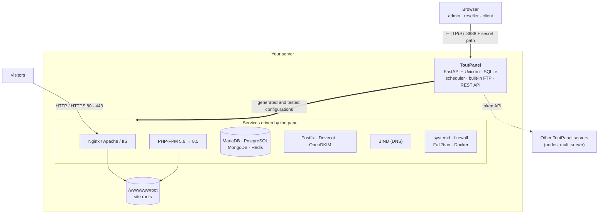

<div align="center">

# ToutPanel

**The web hosting control panel for Linux and Windows: sites, PHP, databases, mail, DNS, SSL, security and backups from a single web interface, in 10 languages.**

Nginx · Apache · IIS · PHP 5.6 → 8.5 · MariaDB · PostgreSQL · MongoDB · Postfix / Dovecot · BIND · Let's Encrypt · WAF · Docker · multi-tenant · multi-server


[Install](#full-installation) · [Features](#features) · [CMS](#cms) · [Screenshots](#screenshots) · [Themes](#themes) · [Editions](#editions) · [Architecture](#architecture) · [First start](#first-start) · [Troubleshooting](#troubleshooting) · [Français](README.md)

**Version 0.3.0** · **stable** channel · 2026-10-03

</div>


---

## What is ToutPanel?

ToutPanel turns a freshly installed server into a **complete web hosting platform**, managed from your browser. One command installs the stack (Nginx, PHP-FPM, MariaDB, Redis or Valkey, Certbot, Fail2ban), the panel and its service; you then create sites, databases, mailboxes, DNS zones and certificates in a few clicks, without editing a single configuration file.

It is built both for people hosting **their own sites** (free Personal edition, no key, no sign-up) and for **agencies and hosting providers** reselling hosting: reseller and client accounts, plans and quotas, billing, white label, multi-server and high availability (Professional and Enterprise editions).

Your data stays **on your server**: no external fonts or CDN in the interface, and no call to the licence server unless a licence is activated.

> **This repository contains no source code.** It only publishes what is needed to install the panel: the `install.sh` and `install.ps1` installers, the compiled panel (`dist/`, "bytecode only" Python wheels), the release notes, the licence and `version.json`.

| | |
|---|---|
| **Systems** | Debian 11 → 13, Ubuntu 20.04 → 24.04, AlmaLinux / Rocky Linux / RHEL 9 and 10, Fedora 40+, Windows 10 / 11, Windows Server 2016 → 2025 |
| **Web servers** | Nginx, Apache, Nginx + Apache, IIS (basic) |
| **PHP** | 5.6 to 8.5 side by side, 138 extensions in the catalogue, one version per site |
| **Databases** | MariaDB / MySQL, PostgreSQL, MongoDB, SQLite, per-account Redis / Memcached |
| **CMS** | 595 CMS and applications in the catalogue (582 verified: 536 free, 46 commercial), version of your choice, tracked and updated installations |
| **Interface** | 10 languages, 13 light / dark themes (**Horizon** by default), any accent colour, WCAG AA accessibility |
| **Installers** | `install.sh` and `install.ps1` in 10 languages (English by default, `--lang` / `--fr`…, `TOUTPANEL_LANG`, system language) |
| **Automation** | REST API (OpenAPI), 76-command CLI, signed webhooks, Ansible modules, Terraform examples |

## Features

### Web hosting
- **One-click sites**: multiple domains, PHP-FPM, static, reverse proxy, applications; **Nginx, Apache, Nginx + Apache or IIS** vhosts generated from Jinja2 templates and **tested before reload** (`nginx -t` / `apachectl -t`, last valid vhosts restored on failure).
- **Multiple PHP versions**: 5.6 → 8.5 side by side (Sury, ondrej PPA, Remi, windows.php.net), 138 extensions, ionCube, per-site `php.ini` and FPM pool, default CLI version.
- **Advanced hosting**: redirects, canonical host, headers, protected directories, error pages, anti-hotlinking, maintenance mode, FastCGI cache, staging, GoAccess statistics, load balancing (round robin, least_conn, ip_hash), compression, HTTP/2, HTTP/3, TLS profiles.
- Atomic per-site **Git deployment** (HTTPS with token or SSH, branch, tag or commit, automatic refresh, rollback).
- **Domains and IP addresses**: IP inventory, persistent additional IPs, IPs dedicated to an account, per-site listen address.

### SSL / TLS
- **Let's Encrypt** (HTTP-01, DNS-01, wildcard), ZeroSSL, Buypass, custom ACME authority, CSR, PFX import, self-signed, HSTS, **automatic renewal**.
- **Certificates** page: validity, issuer and expiry of every certificate; panel HTTPS with Let's Encrypt; SNI certificates for the mail server.

### DNS
- **BIND** zones, every record type, templates, **DNSSEC**, secondary servers (TSIG), reverse DNS, BIND import / export.
- Zones pushed to **Cloudflare, PowerDNS, OVH, Route53**; propagation check.

### Mail and webmail
- **Postfix, Dovecot, OpenDKIM** or rspamd; domains, mailboxes, aliases, forwarders, mailing lists (mlmmj), Sieve filters and autoresponder.
- **Roundcube or SnappyMail webmail** installed in one click, with direct login from the panel.
- DKIM rotation, antispam, ClamAV, greylisting, RBL, sending rate limits, outbound relay, message tracking, mail queue, fetchmail, CalDAV / CardDAV, MTA-STS, client autoconfiguration.

### Databases
- **MariaDB / MySQL, PostgreSQL, MongoDB, SQLite**: databases, users and privileges, remote access by IP, **Adminer with SSO**, import / export, maintenance, size quotas.
- Additional servers (Docker), **per-account Redis / Memcached**, version detection, official MariaDB and PostgreSQL (PGDG) repositories, major version upgrade with prior backup, replication (Pro).

### Files, FTP and access
- Full **file manager**: CodeMirror editor, archives, trash, permissions and owner, content search, disk usage, drag and drop.
- **Built-in FTP / FTPS server** (accounts, rights, quotas, log), **chrooted SFTP**, restricted shell, SSH keys, **WebDAV** with FTP accounts.
- **Web terminal**: bash on Linux, PowerShell on Windows.

### CMS
- **CMS page**: a catalogue of **595 CMS and web applications**, **582 of them verified** (version source queried, download URL checked): **536 free** and **46 commercial**; search, filters by category, type (PHP, Node.js, Python, Go, Java, .NET, static) and distribution, "ready" or "missing requirements" badge.
- **Version of your choice**: latest stable by default, every published version (pre-releases on request); a sheet with checked requirements, existing or new site, subfolder, database created for you, administrator account and language, live progress.
- **Centralised installations**: automatic detection on every site (including installations made outside the panel), installed and latest version, banner of available updates; **backup** (files and database), **update** with a backup first and rollback on failure, **Update all**, **cloning** to another site or subfolder, reinstall, removal, operation log, automatic minor updates per installation.
- **Commercial software**: sheet with vendor, indicative price and purchase link; installed from the **package you provide** (upload from the sheet, path on the server or private URL) with its licence key; updates by package.
- **Local version search**: the panel queries the official sources itself (wordpress.org, GitHub, Packagist, npm, PyPI, vendor sites) with a 6-hour local cache, **twice a day** (05:23 and 17:23, configurable) or on demand; alerts through the notification channels, menu badge and dashboard widget.

### Applications, WordPress and Docker
- **Application installer**: WordPress, Joomla, Drupal, Grav, PrestaShop, Nextcloud, Laravel, Symfony, Matomo, Dolibarr, Moodle, phpBB, MediaWiki, Ghost — download, database, configuration and post-install steps done for you.
- **WP Toolkit** (WordPress tab of the CMS page): wp-cli, updates, hardening, vulnerability detection, cloning.
- **Node.js, Python, Ruby, Go, Java, .NET** applications with systemd unit and proxy.
- **Docker**: containers, images, `docker run`, per-account **Docker Compose** projects with a proxy site.

### Backups
- Back up a site, database, folder, mailbox, account or the **whole server**; GFS schedules; granular restore; automatic safety backups (before a deletion, for instance); backup verification.
- Encrypted, deduplicated **restic** engine, **remote destinations**: S3 and compatible, SFTP, Backblaze B2, and through rclone FTP / Google Drive / OneDrive / Dropbox / WebDAV (Pro). Secrets are encrypted in the database and never returned by the API.

### Security
- **Firewall**: nftables, firewalld, UFW, CSF or iptables (auto-detected), anti-DDoS protection, listening ports.
- **Fail2ban**, **built-in WAF** (SQLi, XSS, RCE, path traversal, scanners, bots, rate limiting, automatic banning; country blocking in Pro) and per-site **ModSecurity + OWASP CRS** (Pro).
- **ToutWAF**, the vendor's WAF / reverse proxy, is the **recommended engine** in WAF › Engine (Pro): installed from the panel by its official installer (stable or dev channel, web server moved to fallback ports), secret **console** links (:9443), installed and available version, update with rollback, diagnostics, site **synchronisation** (local policy or console API); also at install time with `install.sh --waf toutwaf`. **BunkerWeb** and **SafeLine** (Docker) are still offered.
- **Antimalware**: ClamAV / maldet / YARA with quarantine, integrity checks (rkhunter, chkrootkit, debsums, AIDE), AppArmor and **SELinux** configured automatically.
- **Authentication**: TOTP 2FA and recovery codes, **WebAuthn security keys / passkeys**, secret login path, IP allow list, ALTCHA captcha, persistent lockout, revocable sessions; LDAP / Active Directory, OpenID Connect and SAML (Pro).
- **Sealed audit log** (chained HMAC), "Recommendations" card on the Security page.

### Monitoring and alerts
- Customisable dashboard: **23 widgets** (CPU, RAM, disks, I/O, network, services, quotas, notes…), layout saved per user.
- Historical **monitoring**, HTTP(S) **uptime** probes, per-account processes, live logs, services with automatic restart.
- **Alerts** by e-mail, webhook, Telegram or SMS (service down, disk full, certificate expiring…), **Prometheus** `/metrics` export (Pro).
- Host administration: hostname, time zone, NTP, swap, system updates (security, automatic, reboot required), task queue, **self-repair**.

### Multi-tenant, resellers and billing
- **Administrator → resellers → clients → sub-users** hierarchy, permissions per module and action, access profiles.
- **Plans and quotas** (disk, inodes, traffic, sites, databases, mailboxes…), CPU / RAM / I/O limits (cgroups), dedicated system user, automatic suspension, "log in as", transfer, CSV import / export.
- **Billing** (VAT, proration, reminders, PDF), Stripe, PayPal, bank transfer, provisioning on order, WHMCS / Blesta / HostBill, **white label**, transactional e-mails, support tickets, announcements (Pro).

### Multi-server and high availability
- **Master panel and nodes** enrolled with a token (web, mail, DNS, databases), routed resources, mirror accounts, **account migration** between servers (Pro).
- **High availability**: web groups (rsync, lsyncd, NFS), MariaDB / PostgreSQL replication with failover, automatic secondary DNS and secondary MX, live migration (Pro).
- **Migration** from cPanel, Plesk, DirectAdmin, ISPConfig, shared hosting or IMAP mailboxes, with a report (Pro; export stays free).

### API, CLI and automation
- Complete **REST API** with scoped, IP-restricted tokens and **OpenAPI / Swagger** documentation.
- **Signed outgoing webhooks**, pre / post-action scripts, `toutpanel` **CLI** (site, account, db, mail, dns, backup, cron, ftp, task… with `--json` output), Ansible modules and Terraform examples.

### Store, customisation and comfort
- **Store** connected to the toutpanel.com catalogue: applications, server software, **modules** (validated manifest, mandatory sha256, hot loading), themes; local zip upload, offline mode.
- **Setup wizard** at the end of the installation (account, panel address, language, mode, theme, **main colour** and **density** with instant preview), **creation wizard** (site + database + certificate + mailboxes at once), **Ctrl+K global search**, contextual help on every page, diagnostic tools (DNS, HTTP, SSL, ping, traceroute, port, SMTP, WHOIS).
- **13 themes**, with **Horizon** by default, any accent colour, logo, CSS, menu links, vhost and e-mail templates; **10 languages**: français, English, español, Deutsch, italiano, português, Nederlands, русский, 中文, العربية (right-to-left).

### Compliance (GDPR)
- Personal data export and erasure, record of processing activities, log retention, password history, traceability of host access, external anchoring of the audit log (Pro).

## Screenshots

| | |
|---|---|
| <br>**Dashboard, dark mode**: gauges, counters, attention points, licence | <br>**Websites**: domains, type, root, traffic, SSL and actions |
| <br>**PHP**: versions 5.6 → 8.5 side by side, support status, FPM pools | <br>**Site settings**: Git deployment, SSL, redirects, security |
| <br>**DNS**: BIND zones or providers, templates, DNSSEC, cluster | <br>**Certificates**: validity, issuer, renewal, panel certificate |
| <br>**Mail server**: Postfix, Dovecot, OpenDKIM, ports and tabs | <br>**Webmail**: Roundcube or SnappyMail installed in one click |
| <br>**Databases**: MariaDB, PostgreSQL, MongoDB, SQLite, Redis | <br>**Files**: editor, archives, trash, permissions, disk usage |
| <br>**CMS › Install**: 582 verified CMS and applications, search, filters, "ready" badge | <br>**CMS sheet**: checked requirements, version choice, target site, database |
| <br>**CMS › Installations**: versions, available updates, backup, cloning | <br>**WAF › Engine**: ToutWAF recommended, built-in WAF, BunkerWeb, SafeLine |
| <br>**Terminal**: interactive bash / PowerShell shell in the browser | <br>**Applications**: WordPress, Joomla, Drupal, PrestaShop, Nextcloud… |
| <br>**Store**: server software, modules and themes in one click | <br>**Security**: recommendations, firewall, anti-DDoS, Fail2ban |
| <br>**WAF**: protections, thresholds, engines, GeoIP, attack log | <br>**Monitoring**: CPU, memory, network, load and disk from 1 h to 7 days |
| <br>**Accounts**: resellers, clients, plans, access profiles | <br>**Servers**: master panel, nodes, routing, migration |
| <br>**Updates**: system packages (security) and the panel itself | <br>**Settings**: access, port, secret path, HTTPS, interface |
| <br>**Setup wizard**: theme, main colour, density, instant preview | <br>**Horizon**, the default theme: the same screen in light and dark |

**On mobile**, the interface adapts (collapsible menu, scrollable tables):

<table>
<tr>
<td align="center"><br><b>Dashboard</b></td>
<td align="center"><br><b>Websites</b></td>
</tr>
</table>

> Screenshots taken on a demonstration server (Ubuntu 24.04, documentation address 192.0.2.2), with the interface in French.

## Themes

### 13 themes, your colour

A new installation uses **Horizon**: a blue-cyan gradient sky, floating translucent menu and top bar, an active pill in a blue-violet gradient that follows the chosen colour, very bold blue headings. **Customisation › Appearance**: pick another design, then **any accent colour** (12 presets, colour picker or `#RRGGBB` code). The panel derives buttons, links, active menu, badges, gradients and charts from it while keeping a contrast ratio of at least 4.5:1. Every theme comes in **light and dark**, supports high contrast and right-to-left languages; the preview is instant and nothing is saved before "Save design". Density, corners, font, width, menu position, icons and animations can also be set, per user or as the default for everyone; themes can be exported and imported.


| | | |
|---|---|---|
| <br>**Horizon** *(default)* · `#2b5fd9` | <br>**Classique** · `#2563eb` | <br>**Aurora** · `#2563eb` |
| <br>**Nuage** · `#5b5bd6` | <br>**Minimal** · `#18181b` | <br>**Nuit** · `#0369a1` |
| <br>**Terminal** · `#15803d` | <br>**Gloss** · `#7c3aed` | <br>**Nébuleuse** · `#8b5cf6` |
| <br>**Obsidian** · `#22c55e` | <br>**Nordic** · `#14b8a6` | <br>**Ember** · `#f97316` |
| <br>**Executive** · `#10b981` | | |

<sub>Colour shown: the theme's default accent in light mode, freely changeable.</sub>

Theme, mode, **main colour** and **density** can also be chosen right in the **setup wizard** (Preferences step), with an instant preview; they become the defaults for every account, and each user can then pick their own.

## Editions

The program is the same for every edition: a **licence key** unlocks the advanced features on a given server. A fresh installation runs the Personal edition, with no sign-up and no Internet connection required.

| Edition | Price | Key | For |
|---|---|---|---|
| **Personal** | free, no time limit | none | personal use: your own sites, **up to 5** |
| **Professional** | paid | required | hosting providers, agencies, professional use: everything included, unlimited sites (or per licence plan) |
| **Enterprise** | paid | required | Professional + unlimited multi-server + priority support |

The Personal edition is **complete**: sites, multiple PHP versions, databases, mail, DNS, SSL, built-in WAF, local backups, monitoring, client accounts and sub-users, WebAuthn, GDPR tools, API and CLI. Reserved for the paid editions:

<details>
<summary><b>Exact list of Professional / Enterprise features</b></summary>

| Feature | Personal | Professional |
|---|---|---|
| Sites | 5 maximum | unlimited (or per licence) |
| Uptime probes | 3 | unlimited |
| Outgoing webhooks | 2 | unlimited |
| WAF engine choice (ToutWAF, BunkerWeb, SafeLine) | built-in WAF | ✓ |
| ModSecurity + OWASP CRS | — | ✓ |
| Multi-server: nodes, high availability, live migration | — | ✓ |
| Web groups and DNS cluster | — | ✓ |
| Database replication | — | ✓ |
| Billing, payment gateways, WHMCS, provisioning | — | ✓ |
| Reseller white label | — | ✓ |
| Custom panel domain | — | ✓ |
| Support (tickets) | — | ✓ |
| Announcements | — | ✓ |
| Reseller accounts | — (clients and sub-users: ✓) | ✓ |
| LDAP / OpenID Connect / SAML SSO | — (WebAuthn: ✓) | ✓ |
| Country blocking (GeoIP) | — | ✓ |
| Scheduled antimalware | manual scan | ✓ |
| Remote backups (S3, SFTP, B2, rclone) | local storage | ✓ |
| restic engine | — | ✓ |
| Prometheus `/metrics` export | — | ✓ |
| Import from cPanel, Plesk, DirectAdmin, ISPConfig, shared hosting, IMAP | — (export: ✓) | ✓ |
| Premium store modules | — | ✓ |
| External anchoring of the audit log | — (GDPR export and purge: ✓) | ✓ |

</details>

- Affected menu entries carry a **Pro** badge; pages remain viewable, only creating and editing are reserved.
- Activation: **Settings › Licence › Activate a key** (`TP-XXXXX-XXXXX-XXXXX-XXXXX`) or `toutpanel licence activate <key>`. The signed token is verified locally: the licence works offline (daily revalidation, 15-day grace period).
- If the licence expires or becomes invalid, the panel **falls back to the Personal edition without deleting anything**.

Pricing and purchase: **[toutpanel.com/tarifs](https://toutpanel.com/tarifs)** · details: [Editions and licence](https://toutpanel.com/docs/guide/editions/).

## Architecture



| Component | Role |
|---|---|
| **Panel** | FastAPI application served by Uvicorn (`toutpanel` systemd service on Linux, `ToutPanel` scheduled task on Windows). Web interface with no external dependency, REST API, task scheduler, built-in FTP server. |
| **Web stack** | Nginx and/or Apache (IIS on Windows) with PHP-FPM; the panel writes vhosts from its templates, tests them, then reloads the service. |
| **Services** | MariaDB / PostgreSQL / MongoDB, Postfix / Dovecot / OpenDKIM, BIND, Fail2ban, firewall, Docker: driven by the panel through their native tools. |
| **`toutpanel` CLI** | Panel administration (port, secret path, password, update, licence…) and scriptable business commands (`--json`). |

```
<home>  (/www/toutpanel or C:\toutpanel)
├── data/      panel SQLite database, settings.json, keys, install-info.txt
├── logs/      panel.log and site logs
├── vhost/     generated vhosts (when the web server's native folder is missing)
├── ssl/       site and panel certificates
├── backup/    local backups
├── src/       clone of this repository (channels, tags, toutpanel update)
└── venv/      panel Python environment
/www/wwwroot   site roots (C:\toutpanel\wwwroot on Windows)
```

## Full installation

### Requirements

| | Linux | Windows |
|---|---|---|
| **Systems** | Debian 11, 12, 13 · Ubuntu 20.04, 22.04, 24.04 · AlmaLinux / Rocky Linux / RHEL 9, 10 · Fedora 40+ (Arch, Alpine, openSUSE: panel works, reduced stack, untested) | Windows 10, 11 · Windows Server 2016, 2019, 2022, 2025 (build 14393 minimum) |
| **Rights** | `root` (or `sudo`) and `bash` | PowerShell 5.1+ **as administrator** (winget not required) |
| **Python** | 3.9 to 3.14 (installed by the script when the distribution provides it) | installed by the script (3.12, python.org) if missing |
| **Memory** | 1 GB minimum (panel only), 2 GB recommended with MariaDB and PHP | same |
| **Disk** | 2 GB free + your sites | same |
| **Network** | outbound HTTPS (GitHub, PyPI, distribution repositories, Let's Encrypt); fixed public IP and reverse DNS for mail | same (python.org, nginx.org, windows.php.net, MariaDB) |

Preferably install on a **freshly installed** server. On a server where Nginx, Apache or MariaDB are already configured, use `--stack none`: the panel detects them and writes its vhosts into their native folder without touching anything else.

### Linux

```bash
curl -sSL https://raw.githubusercontent.com/qu3ntin01/toutpanel/main/install.sh | sudo bash
```

To read the script before running it:

```bash
curl -sSLO https://raw.githubusercontent.com/qu3ntin01/toutpanel/main/install.sh
less install.sh
sudo bash install.sh
```

Installation takes 3 to 6 minutes depending on the connection.

**Interactive menu.** When run in a terminal without a mode option, the script introduces ToutPanel, detects an existing installation and offers to **install** (full stack) or **install the panel only**, optionally in **node mode**; or, if the panel is already there, to **update**, **fully reinstall** or **uninstall**. Without a terminal (automation, `--yes`), it installs, or updates if the panel is present.

**What the script does:**

1. installs Python 3.9+ if needed and creates the `<home>/venv` virtual environment;
2. installs the **web stack** (Nginx, PHP-FPM, MariaDB, Redis or Valkey, Certbot, Fail2ban), depending on `--stack`;
3. clones this repository into `<home>/src`, **checks the SHA-256 sum** of the wheel matching the system Python and installs it;
4. creates a random **administrator account** and **secret access URL**;
5. registers the `toutpanel` **systemd service**;
6. opens the required ports in the firewall;
7. configures **SELinux** (Alma, Rocky, RHEL, Fedora) or **AppArmor** (Debian, Ubuntu, SUSE);
8. prints a summary, saved in `<home>/data/install-info.txt` (readable by root only).

#### `install.sh` options

| Option | Description | Default |
|---|---|---|
| `--stack full` | Nginx + PHP-FPM + MariaDB + Redis/Valkey + Certbot + Fail2ban | ✓ |
| `--stack minimal` | Nginx + PHP-FPM + Certbot | |
| `--stack none` | panel only (already configured server) | |
| `--mail` | adds Postfix, Dovecot, OpenDKIM and opens the mail ports | no |
| `--postgres` | adds PostgreSQL (password of the `postgres` role generated and saved in the panel) | no |
| `--waf toutwaf` | deploys **ToutWAF**, the vendor's WAF, in front of the sites with its official installer (systemd services, no Docker; web server moved to 8080 / 8443, console on 9443, summary in `/etc/toutwaf/INSTALL-SUMMARY.txt`) | no |
| `--waf bunkerweb` / `--waf safeline` | installs Docker and deploys the external WAF in front of the sites (web server moved to 8080 / 8443, console on 7000 or 9443) | no |
| `--node` | multi-server **node** mode: panel HTTPS enabled, enrolment token, API URL and TLS fingerprint printed (to enter on the master: System › Servers › Add) | no |
| `--master URL` | with `--node`: URL of the master panel | — |
| `--port N` | panel port | `8888` |
| `--random-port` | random port between 20000 and 40000 | |
| `--username NAME` | administrator account name | random `admin_xxxxxx` |
| `--password PASS` | administrator password | 16 random characters |
| `--entrance /path` | secret path in the URL | random `/tp_xxxxxxxxxx` |
| `--home DIR` | panel directory | `/www/toutpanel` |
| `--source DIR` | install from a local folder (copy of this repository with `dist/`) | clone of the branch |
| `--branch NAME` | Git branch to download | `main` |
| `--channel stable\|dev` | panel update channel, saved in the panel | `stable` |
| `--update` | updates an existing installation (detected automatically): data backup, new code, database migration, restart | auto |
| `--reinstall` | forces a full installation even if the panel is present | no |
| `--uninstall` | uninstalls the panel (sites and databases kept, panel data archived) | no |
| `--yes`, `-y` | no questions (menu and confirmations) | no |
| `--lang xx` | installer language and initial panel language: `en`, `fr`, `de`, `es`, `it`, `pt`, `nl`, `ru`, `zh`, `ar` | system language, otherwise `en` |
| `--en`, `--fr`, `--de`, `--es`, `--it`, `--pt`, `--nl`, `--ru`, `--zh`, `--ar` | shortcuts for `--lang` | |
| `-h`, `--help` | prints the script help (in French) | |

Examples:

```bash
sudo bash install.sh --stack minimal --port 7443
sudo bash install.sh --mail --postgres
sudo bash install.sh --mail --username me --password 'A-Long-Password' --entrance /my-access
sudo bash install.sh --waf toutwaf                 # the vendor's WAF in front of the sites
sudo bash install.sh --stack minimal --node --master https://master.example.com:8888   # server driven by a master
curl -sSL https://raw.githubusercontent.com/qu3ntin01/toutpanel/main/install.sh | sudo bash -s -- --yes --random-port
curl -sSL https://raw.githubusercontent.com/qu3ntin01/toutpanel/main/install.sh | sudo bash -s -- --channel dev
curl -sSL https://raw.githubusercontent.com/qu3ntin01/toutpanel/main/install.sh | sudo bash -s -- --de   # installer in German
```

#### Installer language

The installers are **multilingual**: banner, menu and questions, steps, warnings, errors, help, summary and `install-info.txt` are shown in one of the **10 languages** below, **English by default**. The chosen language also becomes the panel's **initial language** (installation and reinstallation); a line under the banner states the language used and where it came from.

| Language | `--lang` | Linux shortcut | Windows |
|---|---|---|---|
| English *(default)* | `en` | `--en` | `-Lang en` / `-En` |
| Français | `fr` | `--fr` | `-Lang fr` / `-Fr` |
| Deutsch | `de` | `--de` | `-Lang de` / `-De` |
| Español | `es` | `--es` | `-Lang es` / `-Es` |
| Italiano | `it` | `--it` | `-Lang it` / `-It` |
| Português | `pt` | `--pt` | `-Lang pt` / `-Pt` |
| Nederlands | `nl` | `--nl` | `-Lang nl` / `-Nl` |
| Русский | `ru` | `--ru` | `-Lang ru` / `-Ru` |
| 中文 | `zh` | `--zh` | `-Lang zh` / `-Zh` |
| العربية | `ar` | `--ar` | `-Lang ar` / `-Ar` |

Priority order, strongest first:

| # | Source | Linux | Windows |
|---|---|---|---|
| 1 | command-line option | `--lang xx` or a shortcut (`--fr`…) | `-Lang xx` or a shortcut (`-Fr`…) |
| 2 | environment variable | `TOUTPANEL_LANG=fr` | `$env:TOUTPANEL_LANG = "fr"` |
| 3 | value written in the script | `INSTALLER_LANG="fr"` at the top of `install.sh` | `$InstallerLang = "fr"` at the top of `install.ps1` |
| 4 | **detected** system language, if it is one of the 10 | `LC_ALL`, `LC_MESSAGES`, `LANG` | `Get-Culture` |
| 5 | English | | |

```bash
curl -sSL https://raw.githubusercontent.com/qu3ntin01/toutpanel/main/install.sh | sudo env TOUTPANEL_LANG=de bash
```

Recognised environment variables: `TOUTPANEL_LANG` (installer language), `TOUTPANEL_HOME` (directory), `TOUTPANEL_REPO` (Git repository), `TOUTPANEL_BRANCH` (branch), `TOUTPANEL_CHANNEL` (`stable` or `dev`).

<details>
<summary><b>Packages installed per distribution</b></summary>

- **Debian / Ubuntu**: `nginx`, `php8.x-fpm` (+ cli, mysql, curl, mbstring, xml, zip, gd, intl, bcmath, opcache), `certbot`, `composer`, `mariadb-server`, `redis-server`, `fail2ban`, `python3-venv`, `git`, `unzip`; multiple PHP versions through packages.sury.org (Debian) or the ondrej PPA (Ubuntu).
- **AlmaLinux / Rocky / RHEL / Fedora**: `epel-release` (+ CRB), `remi-release`, `nginx`, `php83-php-fpm` (+ extensions), `certbot`, `mariadb-server`, `redis` or `valkey`, `fail2ban`, `policycoreutils-python-utils`, `dnf-plugins-core`; SELinux contexts declared (`httpd_sys_rw_content_t` on `/www/wwwroot`, `httpd_log_t`, `cert_t`, `httpd_config_t`, `mail_spool_t`) and booleans `httpd_can_network_connect`, `httpd_can_network_connect_db`, `httpd_can_sendmail`, `httpd_setrlimit` enabled.
- **Optional Python modules** (not installed by default): `pymongo` (MongoDB), `wsgidav` (WebDAV), `geoip2` (GeoIP), `python3-saml` (SAML) — `/www/toutpanel/venv/bin/pip install "pymongo>=4.6"` then `systemctl restart toutpanel`.

</details>

### Windows

In PowerShell **as administrator**:

```powershell
Set-ExecutionPolicy Bypass -Scope Process -Force
iwr -useb https://raw.githubusercontent.com/qu3ntin01/toutpanel/main/install.ps1 | iex
```

The script checks the Windows version and rights, installs **Python 3.12** if no Python 3.9+ is present, creates `C:\toutpanel\venv` and installs the panel into it, creates the admin account and secret URL, adds firewall rules (panel port, 80, 443, 21), creates the **ToutPanel** scheduled task (automatic start as SYSTEM) and adds `C:\toutpanel\bin` to the PATH.

To also install the web stack (**Nginx** in `C:\nginx`, **PHP 8.3** supervised by the panel, **MariaDB** as a Windows service):

```powershell
iwr -useb https://raw.githubusercontent.com/qu3ntin01/toutpanel/main/install.ps1 -OutFile install.ps1
.\install.ps1 -Stack
```

| Option | Description |
|---|---|
| `-Port 8888` | panel port |
| `-Home C:\toutpanel` | panel directory |
| `-Stack` | installs Nginx, PHP 8.3, MariaDB |
| `-Username`, `-Password`, `-Entrance /x` | chosen admin account and secret URL |
| `-PythonVersion`, `-NginxVersion`, `-MariaDBVersion`, `-PhpVersion` | downloaded versions |
| `-Source C:\path` / `-Branch main` | local folder (copy of this repository) / downloaded branch |
| `-Update` / `-Reinstall` / `-Uninstall` | update / reinstall everything / uninstall |
| `-Yes` | no questions (automation) |
| `-Lang xx` / `-En`, `-Fr`, `-De`, `-Es`, `-It`, `-Pt`, `-Nl`, `-Ru`, `-Zh`, `-Ar` | installer language and initial panel language (default: system language when supported, otherwise English; see [Installer language](#installer-language)); with `iwr … \| iex`: set `$env:TOUTPANEL_LANG = "fr"` first |
| `-Help` | script help |

### Ports to open

| Port | Use | Opened by the installer |
|---|---|---|
| **8888** (configurable) | panel interface | yes |
| **80 / 443** | websites | yes |
| 21 + 60000-60100 | built-in FTP (passive mode) | 21 only; open the passive range if you enable FTP |
| 25, 465, 587, 143, 993, 110, 995, 4190 | mail (SMTP, IMAP, POP3, ManageSieve) | with `--mail` (4190: open it for remote Sieve) |
| 53 (UDP and TCP) | DNS (BIND) if you host your zones | no: Security › Firewall |
| 9443 / 7000 | ToutWAF and SafeLine consoles (9443), BunkerWeb (7000) | with `--waf` |
| 3306 / 5432 | remote database access (optional) | no: only if you enable it |

Do not forget your **hosting provider's firewall** (security group): if it blocks the panel port, the browser shows nothing.

## First start

At the end of the installation, the script prints a summary (in French):

```
╔══════════════════════════════════════════════════════════════════╗
║  ToutPanel est installé !                                        ║
╚══════════════════════════════════════════════════════════════════╝

  URL du panel     : http://203.0.113.10:8888/tp_dchwp7kmkf
  Utilisateur      : admin_gbhjkv
  Mot de passe     : D9nYzTSKHbX8FTqC
  MariaDB root     : k3Jd82nLqP0sYt7wVb1c
  Assistant de configuration : http://203.0.113.10:8888/tp_dchwp7kmkf#/setup?token=npSj7xpVzJOI8weJl8R00AdQ18MHYn8YIJCbOYi43B8
  Ce lien (24 h, une seule utilisation) permet de changer l'adresse du panel, l'utilisateur et le mot de passe générés ci-dessus.
  Nouveau lien : toutpanel setup-link
  PHP              : 8.3 (Nginx + PHP-FPM prêts)

  Ces informations sont enregistrées dans : /www/toutpanel/data/install-info.txt
  L'URL contient l'entrée sécurisée : sans elle, le panel répond 404.
```

1. **Write down the full URL** (*URL du panel*): it contains the **secret path** (`/tp_…`). Without it, the panel answers `404 Not Found`, which makes it invisible to scans. `toutpanel info` prints it again.
2. **Open the setup wizard link** (*Assistant de configuration*, `#/setup?token=…`, valid 24 h, single use): in five steps and without logging in, replace the generated values with your own (username, password, port, secret path, hostname, language, mode, theme, main colour and density). Link expired? `toutpanel setup-link` creates a new one. The wizard remains available once logged in (dashboard › Quick shortcuts).
3. **Secure the account**: two-factor authentication (TOTP) and, if possible, a WebAuthn security key; allowed IPs if you have a fixed IP; panel HTTPS (Settings › Access & interface, Let's Encrypt if a domain points to the server, otherwise `toutpanel ssl on`).
4. **Create a first site**: Websites › New site (or the **Wizard** button for site + database + certificate + mailboxes), point the DNS to the server, then padlock › Let's Encrypt and "Force HTTPS".
5. **Enable protections**: WAF › Apply (or WAF › Engine › Install ToutWAF in the Professional edition), firewall rules, a scheduled daily backup, alerts (Settings › Alerts).

## Updating

Every method keeps accounts, settings, sites, databases and software.

- **From the panel**: **Updates › Panel** shows the installed version, the followed channel, the available versions and the release notes. **Update** first backs up `settings.json`, the panel database and the current version (`<home>/data/updates/<date>/`), installs the new version's wheel, migrates the database and restarts; the panel then checks its health and **automatically rolls back** on failure. **Revert to the previous version** stays available at any time.
- **From the command line**:

  ```bash
  toutpanel update --check              # installed version, available version, release notes
  toutpanel update                      # install the version of the followed channel
  toutpanel update --channel dev        # follow the development branch
  toutpanel update --rollback           # revert to the previous version (--restore-data: data too)
  ```

- **With the installer**: run again on an equipped server, `install.sh` switches to update mode (backup of `data/` into `<home>/backup/panel-update-<date>/`, new wheel, `toutpanel migrate`, restart). The stack is not reinstalled unless you add `--stack`, `--mail` or `--waf`. On Windows: `.\install.ps1 -Update`.

## Uninstalling

```bash
curl -sSL https://raw.githubusercontent.com/qu3ntin01/toutpanel/main/install.sh | sudo bash -s -- --uninstall
```

Removes the service, `/www/toutpanel` (panel, Python environment, logs, certificates), `/usr/local/bin/toutpanel` and the Nginx / Apache configurations generated by the panel. Panel data is first archived to `/root/toutpanel-backup-<date>.tar.gz`. **Sites (`/www/wwwroot`), databases and stack software stay in place.** Add `--yes` to skip confirmation.

On Windows: `.\install.ps1 -Uninstall` (data archived to `C:\toutpanel-backup-<date>.zip`, sites moved to `C:\toutpanel-wwwroot-<date>`, Nginx, PHP and MariaDB kept).

## Manual installation from a wheel

For special environments, without the script. Pick the wheel matching your interpreter (`cp311` for Python 3.11, etc.):

```bash
git clone --depth 1 https://github.com/qu3ntin01/toutpanel.git /www/toutpanel/src
python3 -m venv /www/toutpanel/venv
. /www/toutpanel/venv/bin/activate          # Windows: venv\Scripts\activate
TAG=$(python -c 'import sys;print(f"cp{sys.version_info[0]}{sys.version_info[1]}")')
(cd /www/toutpanel/src/dist && sha256sum -c --ignore-missing SHA256SUMS)
pip install /www/toutpanel/src/dist/toutpanel-*-$TAG-none-any.whl
# e.g. for Python 3.12: pip install dist/toutpanel-0.3.0-cp312-none-any.whl
export TOUTPANEL_HOME=/www/toutpanel         # Windows: $env:TOUTPANEL_HOME="C:\toutpanel"
toutpanel setup --username admin --password 'MyPassword' --entrance /my-access
toutpanel run
```

Keeping the clone in `<home>/src` then enables `toutpanel update` (channels and rollback). `toutpanel service install` creates the systemd service (or the Windows scheduled task).

## Troubleshooting

| Symptom | Solution |
|---|---|
| `404 Not Found` when opening the panel | the URL lacks the secret path: `toutpanel info` prints the full URL; `toutpanel entrance /new-path` changes it |
| the browser shows nothing on the panel port | hosting provider firewall closed, or port changed: open the port, check it with `toutpanel info`; `toutpanel port N` to change it |
| lost password or 2FA unavailable | `toutpanel passwd` (new password generated) or `toutpanel passwd 'New' --disable-2fa` |
| the panel does not start | `systemctl status toutpanel`, `journalctl -u toutpanel -n 50` and `<home>/logs/panel.log`; `toutpanel check` for a machine diagnosis |
| `Le panel ne répond pas sur le port … après 30 s.` (panel not answering after 30 s) | slow or failed start: same logs, then `systemctl restart toutpanel` |
| `[ToutPanel] Échec à la ligne N (code C) : …` (failure at line N) | an installer command failed (repository, package, service): fix the cause and run again with `--update` |
| `Python 3.9+ requis.` or no wheel for this Python | install `python3.11` or `python3.12` (distribution package), then run again |
| site or PHP denied on Alma / Rocky / RHEL / Fedora | SELinux: `toutpanel selinux` declares the contexts again (after changing directories, in particular) |
| Windows: "Lancez PowerShell en tant qu'administrateur." | right click › Run as administrator; `Set-ExecutionPolicy Bypass -Scope Process -Force` before the script |

### Useful commands

```
toutpanel info                      full URL, username, initial password
toutpanel check                     diagnosis: OS, Python, rights, systemd, SELinux, firewall, web server, PHP, MariaDB, port
toutpanel setup-link                new setup wizard link (24 h, single use)
toutpanel passwd [PASS] [--disable-2fa]
toutpanel username NAME             rename the administrator
toutpanel port N                    change the port (restart required)
toutpanel entrance [/path]          set or disable the secret path
toutpanel ssl on|off                panel HTTPS (self-signed certificate)
toutpanel start|stop|restart|status
toutpanel service install|uninstall
toutpanel selinux | apparmor        SELinux contexts / AppArmor profiles
toutpanel php install|remove VERSION [--extensions a,b]
toutpanel waf status|install|remove|sync [toutwaf|bunkerweb|safeline]
toutpanel waf update|links|doctor toutwaf   ToutWAF update, console links, diagnostics
toutpanel update [--check] [--channel stable|dev|custom] [--rollback]
toutpanel node enroll [--master URL] | status
toutpanel licence status|activate KEY|deactivate|refresh
toutpanel site|account|db|mail|dns|backup|cron|ftp|task …   business commands (--json)
```

Full reference (in French): [Command line](https://toutpanel.com/docs/reference/cli/) · [REST API](https://toutpanel.com/docs/reference/api/) · [Error codes](https://toutpanel.com/docs/reference/codes-erreur/).

## Channels

| Channel | Content | Installation | Afterwards |
|---|---|---|---|
| **stable** (default) | latest published version, `vX.Y.Z` tag on the [`main`](https://github.com/qu3ntin01/toutpanel/tree/main) branch | `install.sh` | Updates › Panel or `toutpanel update` |
| **dev** | [`dev`](https://github.com/qu3ntin01/toutpanel/tree/dev) branch: unreleased changes, not guaranteed | `install.sh --channel dev` | `toutpanel update --channel stable` to go back |
| **custom** | repository, branch or tag of your choice | `TOUTPANEL_REPO=… install.sh --branch …` | `toutpanel update --channel custom --repo URL --branch NAME` |

## Known limitations

To be transparent about what is less covered:

- **Windows** is less proven than Linux: no mail server, no `chmod` in the file manager, PHP run as `php-cgi` by the panel, no per-system-user isolation or cgroup limits, basic IIS support (prefer Nginx), simplified terminal without the `pywinpty` module.
- **Distributions**: the full installation has been validated end to end on AlmaLinux 9 and 10, and the test suite on Fedora (Python 3.14); the other supported distributions are handled by the installer but less proven. Arch, Alpine and openSUSE run the panel with a reduced stack, **untested**.
- **ARM64**: the compiled panel is portable and its dependencies exist for ARM64, but no full installation has been validated on this architecture yet.
- **Built-in WAF**: it relies on native Nginx / Apache directives and **does not inspect POST request bodies**; for full inspection, add ToutWAF (recommended), ModSecurity + OWASP CRS, BunkerWeb or SafeLine (Professional edition).
- **Multi-server**: suspending an account on the master is not yet propagated to its mirror accounts on the nodes; the external WAF and statistics are configured on each node.
- **Optional modules**: MongoDB, WebDAV, GeoIP and SAML need an additional Python module (see [Full installation](#full-installation)); BorgBackup can be installed but is not driven by the panel.
- **Language**: the panel interface is translated into 10 languages, but the installers' messages and the online documentation are in French.
- **Mail**: a reliable mail server requires a fixed public IP, correct reverse DNS and ports 25 / 465 / 587 not blocked by the hosting provider.

## Releases and downloads

**Version 0.3.0** (2026-10-03) — **CMS** page (595 CMS and applications, version of your choice, centralised installations), **ToutWAF** in WAF › Engine, installers in **10 languages**, **Horizon** as the default theme (13 themes), colour and density in the setup wizard. Full notes in [CHANGELOG.md](CHANGELOG.md) (in French), also shown by the panel before an update.

| File | Content |
|---|---|
| `install.sh`, `install.ps1` | Linux and Windows installers |
| `dist/toutpanel-0.3.0-cp3XY-none-any.whl` | the panel, **one wheel per CPython version**: `cp39`, `cp310`, `cp311`, `cp312`, `cp313`, `cp314` (3 to 4.5 MB each, bytecode only, portable across Linux / Windows) |
| `dist/manifest.json` | version, build date, supported Python versions, size and SHA-256 of each wheel |
| `dist/SHA256SUMS` | wheel checksums (verified automatically by the installer and by `toutpanel update`) |
| `version.json` | published version and date, minimum Python, available wheels: read by the Updates page |
| `CHANGELOG.md`, `LICENSE` | release notes, licence of use |
| `screenshots/` | screenshots used in this README |

Check the wheels by hand:

```bash
cd dist && sha256sum -c SHA256SUMS
```

Stable releases are tagged `vX.Y.Z` on `main`; each release is a single commit.

## Licence

ToutPanel is **proprietary software**: see [LICENSE](LICENSE) (French, then English; the French version prevails). The **Personal edition** is granted free of charge for personal, non-commercial use, up to 5 sites per installation, without a key. The **Professional** and **Enterprise** editions require a licence key and are subject to the terms published on [toutpanel.com](https://toutpanel.com/tarifs). Third-party components used by the panel (FastAPI, Starlette, SQLAlchemy, Uvicorn, httpx, Jinja2…) remain under their own licences, listed in `LICENSE`.

---

<div align="center">

**[toutpanel.com](https://toutpanel.com)** · **[Documentation](https://toutpanel.com/docs/)** · **[Pricing](https://toutpanel.com/tarifs)** · **[Version française](README.md)**

</div>
