<div align="center">

# ToutPanel

**The web hosting control panel for Linux and Windows: sites, PHP, databases, mail, DNS, SSL, security and backups from a single web interface, in 10 languages.**

Nginx · Apache · Caddy *(experimental)* · OpenLiteSpeed *(experimental)* · LiteSpeed Enterprise *(experimental)* · IIS · PHP 5.6 → 8.5 · MariaDB · MySQL · PostgreSQL · MongoDB · Postfix / Dovecot · BIND / PowerDNS / Knot · Let's Encrypt · WAF / ToutWAF · firewall · Docker · multi-tenant · multi-server


[Install](#full-installation) · [What's new in 0.5](#whats-new-in-05) · [Features](#features) · [What is tested](#what-is-tested-for-real-simulated-or-untested) · [CMS](#cms) · [Screenshots](#screenshots) · [Themes](#themes) · [Editions](#editions) · [Architecture](#architecture) · [First start](#first-start) · [Troubleshooting](#troubleshooting) · [Known limitations](#known-limitations) · [Français](README.md)

**Version 0.5.5** · **developer (beta)** channel · 2026-10-09

</div>

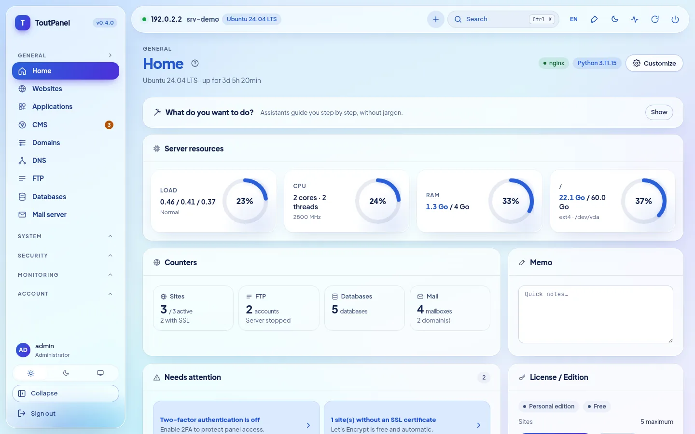

> **Development branch (beta).** Test builds, not guaranteed: for the stable version use the [`main`](https://github.com/qu3ntin01/toutpanel) branch. Install: `curl -sSL https://raw.githubusercontent.com/qu3ntin01/toutpanel/dev/install.sh | sudo bash -s -- --channel dev`.

---

## What is ToutPanel?

ToutPanel turns a freshly installed server into a **complete web hosting platform**, driven from the browser. One command installs the stack (by default Nginx, PHP-FPM, MariaDB, Redis or Valkey, Certbot, Fail2ban, or the stack you compose: profiles, versions, web server, FTP, mail, DNS, accelerators), the panel and its service; you then create your sites, databases, mailboxes, DNS zones and certificates in a few clicks, without editing a single configuration file.

It suits people who host **their own sites** (free Personal edition, no key and no sign-up) as well as **agencies and hosting providers** who resell hosting: reseller and client accounts, plans and quotas, billing, white label, multi-server and high availability (Professional and Enterprise editions).

Your data stays **on your server**: no external font or CDN in the interface, and no call to the licence server as long as no licence is activated.

**This README is deliberately complete and honest.** Every feature is marked *(experimental)* when it is, **Pro** when it needs a paid edition, and every section says what has been **actually executed** by the tests and what has only been run with simulations or not at all. The table [What is tested for real, simulated or untested](#what-is-tested-for-real-simulated-or-untested) gathers them, and the [Known limitations](#known-limitations) list the caveats. If a feature is critical for you, validate it on a test server before going to production.

> **This repository contains no source code.** It only publishes what is needed to install the panel: the `install.sh` and `install.ps1` installers, the compiled panel (`dist/`, "bytecode only" Python wheels), the release notes, the licence and `version.json`.

## Quick installation

**Linux** (as `root`, preferably on a freshly installed server):

```bash
curl -sSL https://raw.githubusercontent.com/qu3ntin01/toutpanel/main/install.sh | sudo bash
```

**Windows** (PowerShell **as administrator**):

```powershell
Set-ExecutionPolicy Bypass -Scope Process -Force
iwr -useb https://raw.githubusercontent.com/qu3ntin01/toutpanel/main/install.ps1 | iex
```

At the end the script prints the panel URL (with its **secret entrance**), the administrator account and the link to the **setup wizard**. Everything can also be chosen with options: stack (`--profile`, `--web`, `--php`, `--db`, `--ftp`, `--mail`, `--dns`, `--accel`…), firewall (`--firewall`), specific version (`--version`), language (`--lang`), directory (`--home`, `/var/toutpanel` by default) and a password that stays out of the process list (`TOUTPANEL_PASSWORD`, `--password-file`, `--password-stdin`). The **[installation assistant](https://toutpanel.com/installation-assistant)** builds the command line with menus. Details, requirements, ports and troubleshooting: [Full installation](#full-installation).

## Overview

| | |
|---|---|
| **Systems** | Linux: Debian 11+, Ubuntu 20.04+, AlmaLinux / Rocky Linux / RHEL / CentOS Stream / Oracle Linux 8+, Fedora, with other families on a reduced stack (openSUSE, Arch, Alpine, Amazon Linux…) and a displayed **support level** (`toutpanel compat`); Windows 10 / 11, Windows Server 2016 → 2025 (less proven than Linux) |
| **Web servers** | Nginx, Apache, Nginx + Apache, **Caddy**\*, **OpenLiteSpeed**\* (LSPHP, LSCache), **LiteSpeed Enterprise**\* (commercial product, never started in our tests: see the [limitations](#known-limitations); `--web litespeed` requires `--accept-litespeed-license`), IIS (basic); Apache + mod_php *coming soon* |
| **Software stack** | **composer**: profiles, versions, diagram, resumable installation, real state; accelerators (OPcache, JIT, Redis / Valkey, Memcached, Varnish\*, Brotli, Zstandard\*, HTTP/3\*) |
| **PHP** | 5.6 to 8.5 side by side, 138 extensions in the catalogue, one version per site, per-site `php.ini` and FPM pool |
| **Applications** | Node.js, Python (WSGI / ASGI), Ruby, Go, Java, .NET runtimes with per-site version, systemd, PM2, Passenger; Docker and Compose; atomic Git deployment |
| **Databases** | MariaDB, MySQL (distribution, or 8.4 / 9.x Oracle\*), Percona Server\*, PostgreSQL, MongoDB, SQLite, Redis / Memcached per account |
| **FTP, DNS, mail** | FTP: built-in, Pure-FTPd\*, ProFTPD\*, vsftpd\*, SFTP only\* · DNS: BIND, PowerDNS, Knot · mail: Postfix + Dovecot, Exim\* · one engine at a time, switch with rollback · Roundcube, SnappyMail, SOGo\* webmail |
| **Firewall and security** | managed firewall (nftables, ufw, firewalld, CSF, iptables) **or upstream**, anti-lockout guard; Fail2ban; built-in WAF, ModSecurity, ToutWAF; antimalware; account isolation (**partial equivalent** of CageFS) |
| **CMS** | 595 CMS and applications in the catalogue (582 verified: 536 free, 46 commercial), version of your choice, tracked installations and updates |
| **Interface** | **interface in 10 languages**, 13 light / dark themes (**Horizon** by default), free accent colour, **16 guided assistants**, **Diagnostic with 844 checks**, accessibility aiming at WCAG 2.1 AA (**not audited**) |
| **Documentation** | written in French; translated into English, German, Spanish, Italian, Dutch, Portuguese, Russian, Chinese and Arabic for **79% of the pages** (75 of 94, for each of these 9 languages); the 19 remaining pages (Reference section: API, error codes, templates…; Diagnostic pages) remain in French with a banner; the Diagnostic catalogue and the API messages are translated into the 10 languages |
| **Installers** | `install.sh` and `install.ps1` in 10 languages (English by default, `--lang` / `--fr`…, `TOUTPANEL_LANG`, system language), stack and firewall options, specific version (`--version`), [installation assistant](https://toutpanel.com/installation-assistant) that builds the command |
| **Automation** | REST API (1017 OpenAPI operations), `toutpanel` CLI, signed webhooks, pre / post-action scripts, Ansible and Terraform, **Marketplace of 800 integration modules** (maturity displayed) |

<sub>\* *experimental*: real, but less proven or with limits declared in the interface and in the [known limitations](#known-limitations).</sub>

## What's new in 0.5

**0.5.0** is the **stable** release ([`main`](https://github.com/qu3ntin01/toutpanel/tree/main) branch); it carries over the pre-releases **0.5.0b1** (**Analytics** section) and **0.5.0b2** (**ToutWAF integration**, SSL managed in ToutWAF), and adds the ToutWAF **"Web server" section** and **security fixes** from an independent review. Each row says what is real and what is not: "new in 0.5" means real and tested, but less proven than the 0.4 features.

| What's new | Maturity and caveats |
|---|---|
| **Analytics** (Monitoring → Analytics): **self-hosted** traffic statistics, Google Analytics style — visitors online, traffic sources, audience, pages, events, goals and funnels, technical reports, period comparison, filters, CSV / JSON exports, e-mail reports, alerts, read-only sharing link; **no cookie by default, IP address never stored** | **new in 0.5**: engine and API tested (≈ 560 tests); end-to-end journeys in a **real Chromium** against a **real panel** (130 visitors, 427 page views, 54 checks equal to the ground truth); tracker proven under Chromium only (Safari and Firefox untested); exact duration and real time require the tracker, logs alone give page views; without a cookie, no returning visitors from one day to the next |
| **World map**: 236 countries, zoom, continents, grouped cities, animated arrivals in real time, light and dark themes | **new in 0.5**: smoothness measured with software rendering, **not on a real graphics card** |
| **DB-IP geolocation** installed by the panel (countries, cities, networks; CC BY 4.0, monthly update) | **new in 0.5**: reader validated on the **real** Country database; **Cities and Networks** databases validated only on synthetic files; without a database, countries are "unknown" |
| **Proxy variant**: the tracker is served by the site itself (against ad blockers) | nginx and Apache validated with **real servers**; Caddy: rendering and syntax only; **OpenLiteSpeed, LiteSpeed Enterprise, IIS not supported** (code to paste by hand) |
| **ToutWAF integration**: site creation from ToutWAF (limited API token handed over at pairing, duplicate-free replay through `Idempotency-Key`, published schema of the creation form), **SSL managed in ToutWAF** (ToutWAF terminates HTTPS, the panel's SSL page manages the certificates in ToutWAF), global and per-server cluster switches, ToutWAF **"Web server" section** (predefined reduced-scope token, `GET /api/capabilities`, `GET /api/sites/{id}`, task progress, `toutpanel waf connect --ssl toutwaf|panel`, `toutpanel waf status`) | **new in 0.5**: tested against a **fake ToutWAF** that follows the contract described by its developers (≈ 500 tests); **nothing tried against a real ToutWAF** (neither the "Web server" section nor the managed SSL); renewal, HTTPS options and capabilities routes of ToutWAF's certificate API to be confirmed; SSL interface not checked in a browser |
| **Security fixes** (independent review, two passes): API-token scope escalation (present since 0.4.0), composed ToutWAF token, a site's logs and TLS private key, Analytics data of a deleted site, `X-Forwarded-For` reading, per-token idempotency, Analytics ingestion caps | **real**: one regression test per fix; detail and severity in the [change log](CHANGELOG.md); review not exhaustive (vhost directive validation, parser ReDoS not examined) |
| **Translations**: interface and server messages in the 10 languages, Analytics documentation page in 9 languages | documentation translated at **79% of pages** (75 out of 94); the 19 remaining reference pages (Diagnostic catalogues, error codes, API, settings, templates) remain in French |

## What's new in 0.4

**0.4.0** is the previous **stable** release (versions 0.4.0b1 and 0.4.0b2 were `dev` channel pre-releases). Each feature carries its maturity: **stable**, **experimental** (real and tested, but less proven or with declared limits) or **coming soon** (visible, greyed out, never simulated). The right-hand column says what is reserved or limited; the honest detail of each point is in the matching section of the [Features](#features).

| What's new | Maturity and caveats |
|---|---|
| **Simultaneous HTTP and HTTPS** panel listeners (8888 / 8443, self-signed certificate at first); Let's Encrypt certificate for the panel with a choice of authority, DNS-01, wildcard and **hot reload** | stable; tested with Pebble (test ACME server), not with the real Let's Encrypt |
| **Specific-version installation**: `--version X.Y.Z`, `--list-versions`; **`/var/toutpanel` by default** | stable |
| **Firewall managed by the panel or upstream**, dedicated page, ports to open, **60-second anti-lockout guard** | stable; rules tested with real nftables / iptables in a private network namespace |
| **Stack composer**: profiles, versions, architecture diagram, memory / disk estimate, **9-step first-setup wizard**, **Software stack** page | stable |
| **DNS engines**: BIND, PowerDNS, Knot DNS (switch with migration of zones and DNSSEC keys, rollback) | stable; tested with the real daemons on Ubuntu 24.04 |
| **Mail engines**: Postfix + Dovecot, external relay, **Exim + Dovecot**; **FTP engines**: built-in, **Pure-FTPd, ProFTPD, vsftpd, SFTP only** | Postfix and built-in FTP: stable; Exim and the other FTP engines: **experimental** |
| **Web servers**: **OpenLiteSpeed** (LSPHP, LSCache), **Caddy**, **LiteSpeed Enterprise** (switch from / to Nginx, Apache, "both", with rollback) | **experimental**; OpenLiteSpeed and Caddy really tested on Ubuntu 24.04; **LiteSpeed Enterprise never managed to start** (trial licence refused), only its official installation and the validation of its configuration really ran |
| **Accelerators**: OPcache, JIT, APCu, Redis / Valkey, Memcached, FastCGI cache, Brotli; **Varnish, Zstandard, HTTP/3** (including Nginx from nginx.org installable with safeguards) | Varnish, Zstandard, HTTP/3: **experimental**; others: stable |
| **Databases**: MariaDB 10.6 → 11.8, **MySQL 8.4 / 9.x** (Oracle repository), **Percona Server**, PostgreSQL 13 → 18; **database passwords encrypted at rest** | MySQL Oracle and Percona: **experimental** (never installed nor started in our tests) |
| **Account isolation**: per-account PHP-FPM service in its cgroup slice, systemd hardening, **filesystem cage** (bind mounts + bubblewrap) | options, **off by default**; **partial equivalent of CageFS** (shared kernel and network); not tested: SELinux enforcing with this isolation (SELinux Enforcing is validated without it on AlmaLinux, see [Security](#section-12)), cgroup v2 with limits really applied, a whole server under systemd |
| **Per-site runtimes** (Node.js, Python, Go, Java, Ruby, .NET), **WSGI / ASGI**, **PM2**, **Passenger** | real: Node 20, Python 3.12, gunicorn, uvicorn, PM2, Nginx + Passenger; Go, Java, .NET simulated; Ruby not compiled |
| **Statistics**: GoAccess, **AWStats**, Matomo; **staging** with database and two-way synchronisation | GoAccess, AWStats and staging (MariaDB) really tested; Matomo **never tried** against a real instance |
| **Backups**: AES-256-GCM encryption, native incrementals, **rsync** and **Borg** destinations, "full server" profile, partial backup / strict mode, restore test | rsync and Borg 1.2.8 really tested; restic, S3, B2 and rclone **simulated**; rsync / Borg and restic: **Pro** |
| **Mail**: PHP `mail()` send limit, **per-domain DMARC**, **BIMI**, **DANE**, MTA-STS / TLS-RPT, **SpamAssassin**, **SOGo**, queue and CalDAV / CardDAV tested | SOGo **experimental** (`sogod` never run); BIMI VMC chain and DNSSEC signature not verified |
| **Migration**: full **ISPConfig** import (SSH, archive, SQL dump), site or domain transfer between clients, **extended account migration between servers** (mail, FTP, cron, SSL, plan) | **Pro**; cPanel / Plesk / DirectAdmin tested on **fabricated** archives; never tested on two physical servers |
| **High availability**: keepalived / VRRP floating IP, NFS / GlusterFS shared storage, Dovecot replication, per-node history, Zabbix template, **extended automatic repair** | **Pro**; configurations validated by the real tools, **no failover tested between two machines** |
| **Authentication**: SAML / OIDC / LDAP SSO tested against test providers, WebAuthn tested with a virtual authenticator, **hardened TLS**, **unusual-login alerts** to the account holder | SSO: **Pro**; no production identity provider or physical key tested |
| **Diagnostic** (System › Diagnostic): **844 checks**, **90 automatic fixes** with preview, **16 guided configuration assistants** with a real test | scheduled Diagnostic: **Pro**; part of the checks is tested with simulated services |
| **Server messages translated** into the 10 languages; **remote ToutWAF**; extended distribution compatibility; **multilingual installer** with stack options | stable; a few dynamically composed messages remain in French |
| **Marketplace** of 800 integration modules (billing, gateways, monitoring, CI/CD, IaC, SSO, DNS / CDN, backup, themes…) | **5 stable**, 199 beta, 596 **generated** (never tried with the real service) |
| Apache + mod_php | **coming soon** (cleanly refused, never simulated) |

Details and limits: [Known limitations](#known-limitations) · [CHANGELOG.md](CHANGELOG.md) (in French).

## Features

The outline follows the **20 sections** of a reference list for a complete hosting panel (from the cPanel / Plesk / ISPConfig / DirectAdmin level to advanced features), then the ecosystem. In each section the "**Real / limits**" line honestly says what has been executed and what has not. Detailed documentation of every page: **[toutpanel.com/docs](https://toutpanel.com/docs/)** (also served by the panel under `/help/` when it is built at installation time, with contextual help on every page).

<a id="section-1"></a>

### 1. Accounts, users and multi-tenancy

- **Administrator → reseller (Pro) → client → sub-user** hierarchy; a reseller only sees and creates within their own scope.
- **Fine-grained RBAC**: permissions per module and per action, the intersection of the role, the plan, the access profile and the parent; built-in profiles **Full, Developer, Accountant, Webmaster, Read-only** and custom profiles.
- **Plans and quotas**: disk, inodes, traffic, sites, domains, databases (and size per database), mail domains and mailboxes, scheduled tasks, FTP accounts, DNS zones, backups, sub-users; quotas are counted and enforced at creation. Monthly traffic does not cut the site off: it triggers an alert, overage billing and automatic suspension if you enable it.
- **Per-account resource limits**: dedicated system user, systemd slice (CPU, memory, I/O, processes) applied to scheduled tasks, Git deployments, applications, the terminal and Redis / Memcached instances; **applied to PHP requests only with the "per-account PHP-FPM service" isolation** (option, off by default). Simultaneous-connection limit per site: **Nginx only**.
- **Suspension** and reactivation, manual or automatic (unpaid, quota exceeded after a grace period).
- **Login as** a client (impersonation), traced in the audit log and time-limited.
- **Transfer** of a site or domain from one client to another: files, FTP, backups, databases, DNS zones, mail domains, scheduled tasks, staging, Compose projects; file ownership, vhost and PHP-FPM pool regenerated, quotas checked, preview before execution.
- **Bulk creation** (up to 500 accounts), **CSV import / export** (1,000 rows, protection against formula injection, UTF-8 / UTF-16 / Windows-1252), filterable **internal notes** and **tags**.

> **Real / limits**: the hierarchy, permissions, quotas, suspension and transfer are covered by API tests, and profiles are checked route by route. `setquota` (filesystem disk and inode quotas) was only checked with a fake executor and requires a filesystem mounted with `usrquota`. Real cgroup v2 with limits applied has not been tested. Suspending an account on the master is not propagated to its mirror accounts on the nodes; sites hosted on a node cannot be transferred between clients.

<a id="section-2"></a>

### 2. Authentication and panel access

- **TOTP 2FA** with backup codes, enforceable by role or by plan; **WebAuthn / FIDO2 security keys and passkeys** (included in the Personal edition).
- **Enterprise SSO (Pro)**: **OpenID Connect** (discovery, PKCE), **SAML** (metadata, replay protection, group → role), **LDAP / Active Directory** (LDAPS / StartTLS with **certificate verification by default**); an SSO login never grants the administrator role by default.
- **Access restriction** of the panel by IP / CIDR allow-list and by country (GeoIP, MaxMind database to be supplied) with **refusal to save a rule that would lock the administrator out**.
- **Anti brute force**: persistent lockout per IP and per account, constant response time, self-hosted **ALTCHA captcha** after N failures, panel Fail2ban jail, failure-burst alert.
- **Sessions**: list, revocation (also by the administrator), absolute and idle timeouts.
- **Password policy**: length, character classes, common words, user name, **Have I Been Pwned** in k-anonymity (can be disabled), history, expiry; **reset** by a signed single-use link.
- **Login history** and **unusual-login alerts** (new IP address, new country, new device) sent to the administrator **and to the account holder** (can be disabled per account, e-mail or SMS).
- **Panel over HTTPS**: simultaneous HTTP and HTTPS listeners, self-signed certificate with SAN at first (regenerated if the address changes), then **Let's Encrypt for the panel host name** (ZeroSSL, Buypass or custom ACME, DNS-01 and wildcard) with hot reload; **secret entrance** in the URL (without it, the panel answers 404).

> **Real / limits**: TOTP, lockout, sessions, password policy: tested. **WebAuthn**: tested with a Chromium virtual authenticator (real registration and login), **not with a physical key**. **OIDC**: tested against a real local OIDC server (PKCE verified, forged tokens refused); **SAML**: tested with a test identity provider (31 tests: valid, expired, replayed, tampered assertion…); **LDAP**: tested against a real OpenLDAP (`slapd`); **no real identity provider** (Keycloak, Entra ID, Okta…) has been tried. The **new country** is detected with a real MaxMind test database. Panel Let's Encrypt: tested with **Pebble** + certbot 5.8 + BIND, **not** with the real service. The SAML library (`python3-saml` + `xmlsec1`) is optional; the panel starts without it.

<a id="section-3"></a>

### 3. Web and site hosting

- **One-click sites**: multiple domains, aliases, **parked domains**, **redirected** domains, **wildcard** (`*.example.com`), PHP-FPM, static, reverse proxy, applications. A subdomain is a domain name of the site or a separate site.
- **Web servers**: **Nginx, Apache, Nginx + Apache, Caddy\*, OpenLiteSpeed\*, LiteSpeed Enterprise\* or IIS** vhosts generated from Jinja2 templates and **validated before reload** (`nginx -t`, `apachectl -t`, `caddy validate`…), with a fall-back to the last valid vhosts on failure; **switch** Nginx ↔ Apache ↔ "both" ↔ Caddy ↔ OpenLiteSpeed ↔ LiteSpeed with rollback; features a server does not reproduce (built-in WAF, ModSecurity, country filtering, `.htaccess`…) are **reported**, never silently ignored.
- **Multi-version PHP** 5.6 → 8.5 side by side (Sury, ondrej PPA, Remi, windows.php.net), one version and **one PHP-FPM pool per site**, under the account's user; **per-site `php.ini`** (13 allowed directives including `disable_functions` and `open_basedir`, validated against injection), **138 extensions** in the catalogue (managed per PHP version, administrator), ionCube, **FPM settings** (`pm`, `max_children`, `start_servers`, timeouts, `max_requests`…).
- **Application runtimes**: Node.js, Python (**WSGI / ASGI**: gunicorn, uvicorn, hypercorn, daphne, waitress), Ruby, Go, Java, .NET, with a **per-site runtime version** (official downloads verified by SHA-256, `uv` for Python, never compiled; nvm, pyenv, etc. detected), **systemd** unit, **PM2**, **Phusion Passenger** (Nginx and Apache), proxy to a port or a Unix socket (WebSocket included), zero-downtime reload, `toutpanel runtimes`.
- **Reverse proxy** to a port or a socket, **load balancing** (round robin, `least_conn`, `ip_hash`).
- **Redirects** 301 / 302 (with or without query string, regular expressions), forced HTTPS, canonical `www` host.
- Custom **HTTP headers** (CSP, X-Frame-Options…) and **HSTS** (adjustable duration, `includeSubDomains`, `preload` with confirmation and pre-check).
- **Custom Nginx / Apache / Caddy directives per vhost** (administrator): write, regenerate, test the server, **automatic restore** if the server refuses.
- **Password-protected directories** (bcrypt) and IP access rules, custom **error pages**, **anti-hotlink**, **maintenance mode** (503 with `Retry-After`, allowed IPs).
- **HTTP/2**, **HTTP/3 / QUIC\*** (native with Caddy and OpenLiteSpeed; with a QUIC-built Nginx, or Nginx from nginx.org installable from the Accelerators page with simulation, backup and rollback; impossible with Apache alone), **Brotli** compression (if the module exists), **Gzip**, **Zstandard\***.
- **Cache**: FastCGI cache (Nginx), **OPcache**, **Redis / Valkey**, **Memcached**, **Varnish\*** (HTTP only), LSCache (OpenLiteSpeed and LiteSpeed Enterprise), with **purge from the panel** ("Clear cache" button per site and per accelerator).
- **Staging**: clone of a site (files + database), URL replacement **without wp-cli** (serialised PHP values included), excluded tables, synchronisation **to production, from production or both ways** (files: the newest wins; database merged row by row by primary key, conflict rule of your choice, **deletions never propagated**), prior backup of both sides.
- Configurable **site root** (`public/`, `web/`…), **per-site access and error logs** viewable live and downloadable (logrotate rotation).
- **Traffic statistics** with three engines: **GoAccess**, **AWStats**, **Matomo** "for this site"; per-site **bandwidth tracking**, month by month.

> **Real / limits**: Nginx: vhosts served by a **real Nginx** and queried with curl (redirects, 401 / 403, anti-hotlink, maintenance, wildcard, error pages). Apache: vhost validated by `apache2 -t`, **never actually served** in our tests; Nginx in front of Apache: never run together; the Nginx / Apache switch is tested with a fake executor and the real vhost syntax. OpenLiteSpeed: a real OpenLiteSpeed started that serves PHP, static files, redirects, authentication, LSCache. **Caddy**: real Caddy 2.11 (HTTP, HTTPS, HTTP/2, HTTP/3, PHP-FPM, proxy, zero-downtime reload) on Ubuntu 24.04; Red Hat family and real ACME not run. **LiteSpeed Enterprise: never started** (see [limitations](#known-limitations)). `disable_functions` / `open_basedir`: verified with a real PHP-FPM. Installing PHP versions from the repositories: not run in our tests (Internet). **Runtimes**: real for Node 20, Python 3.12, gunicorn, uvicorn, PM2 and Nginx + Passenger; **Go, Java and .NET simulated**, Ruby not compiled, an application's systemd unit not started. **HTTP/3**: real Nginx 1.31 binary serving HTTP/3 to a QUIC client; installing the nginx.org package on the machine was not run. Brotli depends on the Nginx module. Memcached and Varnish (VCL compiled by `varnishd` 7.1): run for real, but the full commissioning of Varnish in front of Nginx was not. **GoAccess and AWStats**: run for real; **Matomo: never tried against a real instance** (fake API server). **Staging**: tested on a real MariaDB instance; row-by-row merging only applies to MySQL / MariaDB (PostgreSQL and SQLite are copied without URL replacement). Apache has no HTTP/3 and no FastCGI cache.

<a id="section-4"></a>

### 4. SSL / TLS

- **Let's Encrypt**, **ZeroSSL** (EAB), **Buypass**, custom ACME server; **HTTP-01** and **DNS-01** validation (TXT written in BIND / PowerDNS or at Cloudflare, OVH, Route 53), **wildcard** certificates, **SAN / multi-domain** certificates (all names, aliases and parked domains of the site).
- Daily **automatic renewal** with reload of the affected services (web server, mail, FTP, panel) and **alert on failure**; **expiry alerts** at 30 / 14 / 7 / 1 days (adjustable).
- **Import** of commercial certificates (CRT, key, chain, **PFX**) and **CSR generation** (RSA / EC, SAN, private key kept on the server); self-signed certificates; **Certificates** page with validity, issuer and expiry of all certificates.
- **SSL for services**: mail (Postfix / Dovecot SNI), FTP / FTPS, panel, host name.
- **Hardened TLS**: Mozilla profiles (modern = TLS 1.3 only, intermediate by default, old), validated custom cipher suites, adjustable **OCSP stapling**, curves and ffdhe2048 DH, `ssl_session_tickets off`, per-site HSTS.

> **Real / limits**: tested with **Pebble** (Let's Encrypt's ACME test server), the real certbot 5.8 and a real BIND: HTTP-01, DNS-01, wildcard, renewal, failure, EAB. **No issuance from the real Let's Encrypt, ZeroSSL or Buypass has been run.** DNS-01 requires the domain's zone to be managed by the panel (or a configured provider). TLS: verified with a real Nginx, `openssl s_client` (protocols and suites actually offered per profile), a real OCSP responder and `apache2 -t`; adaptation to OpenLiteSpeed and Caddy is not tested; no post-quantum cryptography. FTP certificates are not watched by the expiry alerts.

<a id="section-5"></a>

### 5. DNS

- Zones served by **BIND, PowerDNS or Knot DNS** (one local server at a time; switch with migration of zones and DNSSEC keys, rollback) or pushed to a provider.
- **14 record types**: A, AAAA, CNAME, MX, TXT, SRV, NS, CAA, PTR, TLSA, DS, SSHFP, HTTPS, SVCB, with fine-grained validation; **zone templates** applied at creation (variables `{domain}`, `{ip}`, `{mail}`…).
- **DNSSEC**: automatic signing (BIND `dnssec-policy`, Knot KASP, PowerDNS), DS and DNSKEY shown for the registrar, manual rollover (BIND, Knot; **PowerDNS: rollover outside the panel**).
- **Secondary servers** by TSIG (AXFR + NOTIFY), automatic on the fleet's nodes (**Pro**).
- **External providers** by API: **Cloudflare, OVH, Route 53, PowerDNS** (zone push and import); external zones: list, export (BIND, CSV, JSON) and **propagation check by `dig`**.
- **BIND import / export**, TTL per record and per zone, **automatic serial numbers** (`YYYYMMDDnn`), **reverse DNS (PTR)** for the server's IPs, **propagation check** (1.1.1.1, 8.8.8.8, 9.9.9.9 and the local server) and syntax validation (`named-checkzone` before reload).
- **Automatic mail records**: MX, SPF, DKIM, DMARC, IMAP / SMTP / POP3 SRV, `autoconfig` / `autodiscover`, MTA-STS, TLS-RPT, CalDAV / CardDAV; IPv6, internationalised names (IDN), mail host outside the zone.

> **Real / limits**: real BIND, PowerDNS and Knot (`named-checkzone`, `dig`, BIND → PowerDNS → Knot switch cycle that keeps the same DS). The **Cloudflare, OVH, Route 53 and PowerDNS APIs were tested with a simulated transport**, never against the real services. The **secondary-server cluster** has never run with two real DNS servers. A PTR is only effective if the address block is delegated to you: the panel cannot request it from your provider. The propagation check does not cover the PTR, TLSA, DS, SSHFP, HTTPS and SVCB types.

<a id="section-6"></a>

### 6. Mail

- **Postfix + Dovecot + OpenDKIM**, Rspamd or SpamAssassin, **Exim + Dovecot\*** as an alternative (subset of Postfix, declared limits), external relay; domains, **mailboxes with quotas**, **aliases**, **forwards**, **catch-all address**, **mailing lists** (mlmmj), **auto-responder with date range**, **Sieve filters** (guided rules or script, ManageSieve), IMAP / POP3 over TLS, submission 587 / 465.
- **Webmail** Roundcube, SnappyMail or **SOGo\*** installed in one click, with **direct login from the panel**.
- **SPF, DKIM** (generation, **rotation with double publication**), **per-domain DMARC** (`none` / `quarantine` / `reject`, `pct`, `rua`, `ruf`, `sp`, `adkim`, `aspf`, `fo`, **guided ramp-up**), **MTA-STS** and **TLS-RPT**, **BIMI** (SVG logo hosted by the panel, published only with a 100% enforcing DMARC), **DANE** (TLSA `3 1 1` for the mail ports, **two-step rotation**).
- **Antispam** Rspamd (per-domain and per-mailbox settings, spam / ham learning) or **SpamAssassin** driven by the panel (spamd, `spamass-milter`, per-mailbox `user_prefs`; amavis experimental), **ClamAV antivirus**, **greylisting**, **RBL / DNSBL**, global, per-domain or per-mailbox **allow and block lists**.
- **Send-rate limiting**: per mailbox, per plan and by default (authenticated SMTP user, through Rspamd) **and a limit on PHP `mail()` per site and per account** (panel `sendmail` wrapper: log, 1 h and 24 h caps, alert, header-injection protection) so a hacked site cannot spam.
- **Outbound relay / smarthost**, **queue** (flush, hold, delete), **log and message tracing**, client **autoconfiguration** (Outlook, Thunderbird), **fetchmail**, **CalDAV / CardDAV** (Radicale), **IP reputation monitoring** (blacklists, on all the server's public addresses and the nodes' outgoing IPs).

> **Real / limits**: the queue is tested with a **real Postfix**; Dovecot: configuration validated by `doveconf`; CalDAV / CardDAV: **real Radicale 3.8**; SpamAssassin: real `spamassassin --lint`, `spamd` and `spamc`; PHP `mail()`: wrapper executed for real with PHP's real `mail()`. **Simulated**: Rspamd, ClamAV, mlmmj, fetchmail, the `spamass-milter` / amavis setups; **SOGo: experimental, `sogod` never run**. BIMI: the **VMC certificate chain is not verified**; DANE: the DNSSEC signature is not verified (DANE only makes sense with DNSSEC). The PHP `mail()` limit **does not see** a script that calls `sendmail` directly or opens an SMTP connection. With Exim: no message tracing and no mailing lists; with SpamAssassin: no per-mailbox rate limit and no greylisting. Received DMARC reports are not analysed. Automatic DNS publication assumes the zone is managed by the panel. A reliable mail server requires a fixed public IP, correct reverse DNS and open ports 25 / 465 / 587.

<a id="section-7"></a>

### 7. Databases

- **MariaDB (10.6 → 11.8), MySQL, Percona Server\*, PostgreSQL (13 → 18), MongoDB, SQLite**: databases, users and **privileges** (full, read-only, custom), **remote access allowed by IP** (firewall rule, `bind-address`, `pg_hba.conf`; `0.0.0.0/0` refused).
- **Adminer** (MySQL and PostgreSQL) and **phpMyAdmin** (MySQL) installable in versions of your choice with PHP compatibility checked, **single sign-on (SSO) from the panel**; **pgAdmin is not integrated**.
- **Import / export** (gzip on the fly), **scheduled dump** (scheduled task), **maintenance** (check, repair, optimise, analyse), per-database **size quotas** (privileges revoked then restored, alert).
- **DBMS version choice** (official MariaDB and PostgreSQL repositories, major-version change with **prior backup**, no downgrade); MySQL 8.4 / 9.x (Oracle repository) and Percona\*: one engine of the MySQL family at a time.
- **Additional servers** (Docker), **Redis / Memcached per account** (isolated instance, Unix socket, plan's `maxmemory`, account cgroup slice).
- **Replication (Pro)**: MariaDB / MySQL (GTID) and PostgreSQL (streaming), command wizard **and** replication executed by the panel, manual promotion or **automatic failover** with rewrite of the databases' host.
- **Database passwords encrypted at rest** (Fernet, panel key backed up), lists without passwords, **explicit and logged reveal**.

> **Real / limits**: SQLite: real. **MariaDB**: a real instance is used by the staging and Diagnostic tests, but the SQL administration layer (users, privileges, quotas) is tested mostly with a **simulated SQL executor**; **PostgreSQL: simulated**; MongoDB (optional `pymongo` module): tested with a fake client and, when the image is present, a real `mongod` 7 in Docker. MySQL Oracle and Percona: packages and repositories verified, **never installed nor started**. Replication has **never been set up between two real servers**, and automatic failover is not a consensus. The **engines' root credentials are stored in clear in `settings.json`** (mode 0600); `mongodump` exposes the password as a command argument.

<a id="section-8"></a>

### 8. Files and access

- **File manager**: upload, **CodeMirror editor** with syntax highlighting, permissions (`chmod`) and owner (`chown`), zip / tar archives, **search** by name and in content, **trash**, **disk and inode usage per folder**, drag and drop, **one-click permission and owner fix**.
- **Built-in FTP / FTPS server** (multiple accounts, restricted directory, rights, quotas, allowed IPs, log) or **Pure-FTPd\*, ProFTPD\*, vsftpd\*, SFTP only\*** (panel accounts synchronised, switch with rollback).
- **Per-user chrooted SFTP / SSH** (`sshd` drop-in validated by `sshd -t` with rollback, bind mounts), **restricted shell** via jailkit or `rbash`, **SSH keys** (ed25519, ECDSA, RSA ≥ 2048).
- **Web terminal** (bash on Linux, PowerShell on Windows; a client stays under their account's user).
- Per-account **disk and inode quotas**, **WebDAV** with the FTP accounts.

> **Real / limits**: FTPS: **real handshake** with a validated certificate; terminal: real bash in a PTY; jailkit: real `jk_init` / `jk_jailuser` and a real jailed shell when jailkit is installed; WebDAV: real `wsgidav` (optional `wsgidav` + `a2wsgi` modules). Alternative FTP engines: run for real on Ubuntu 24.04, **Red Hat family unproven**. A real `sshd` was never reloaded by the tests; `setquota`: see section 1. The Windows terminal is simplified without the `pywinpty` module.

<a id="section-9"></a>

### 9. Applications and deployment

- **One-click installer**: catalogue of **595 CMS and applications** (see [CMS](#cms)), including WordPress, Joomla, Drupal, PrestaShop, Nextcloud, Laravel, Symfony, Matomo, Dolibarr, Moodle, phpBB, MediaWiki, Ghost.
- **WP Toolkit**: wp-cli, core, plugin and theme updates, hardening, cloning, **detection of vulnerable installations** (Wordfence Intelligence feed), critical alert.
- **Git deployment**: clone and update (HTTPS with token or SSH with a per-site deploy key), branch, tag or commit, signed **GitHub / GitLab webhooks**, **post-deploy scripts**, scheduled refresh, **atomic deployment** (`releases/`, `shared/`, `current` link, rollback).
- **Composer, npm, pip** run from a site (`install` / `ci` / `update` allow-list, under the account's user).
- **Docker**: containers, images, **networks, volumes**, disk usage and cleanup, validated `docker run`, per-account **Docker Compose** projects with a proxy site and refusal of dangerous YAML (privileged, socket, sensitive mounts).
- **Assistants** "web site", "application install", "Git deployment", "PHP" (see [section 19](#section-19)).

> **Real / limits**: Git: real `git` on a local repository (clone, update, signed webhook, atomic deployment on a real filesystem); **real GitHub and GitLab never contacted**. Real `npm` and `pip` under the site's user; Composer: not run (no phar in the test environment). Docker: containers, images, networks and volumes tested with a fake executor and, when a daemon answers, a real Docker cycle. **CMS installations: simulated downloads** (no real catalogue installation run end to end by the automatic suite); real WordPress / wp-cli not run by the tests, except Matomo installed end to end by the "application" assistant.

<a id="section-10"></a>

### 10. Scheduled tasks

- **Visual editor** field by field and **raw cron syntax** kept in sync, preview of the next 5 runs, shortcuts (`@daily`…), types: visit a URL, run a command, back up a site or database.
- **Execution under the account's or site's user, never as root** for a client: the command is **refused** rather than run as root; `root` is reserved to the administrator, with confirmation and an audit-log entry; the account's cgroup limits apply.
- **Scheduler** of your choice: internal (APScheduler, default), **systemd timers** (`OnCalendar`, `Persistent=true`) or `/etc/cron.d`, reversible.
- **E-mail notification** (never / on error / always), **run history** (status, duration, code, start of output), **minimum frequency imposed by the plan**, immediate run, **assistant** with a dry-run test.

> **Real / limits**: the comparison with the real `systemd-analyze calendar` (18 expressions) and `systemd-analyze verify` are real; **a systemd timer has never been triggered for real**. With the internal scheduler, **tasks do not run while the panel is stopped** (catch-up of under 5 minutes on restart); there is no import of an existing crontab. On Windows, clients' tasks are refused.

<a id="section-11"></a>

### 11. Backups and restore

- **Granularity**: site, database, folder or file, mailbox, mail domain, account, **whole server**; on-demand backup and **schedules** with **GFS** retention (daily, weekly, monthly).
- **Native (zip) engine, included in every edition**: archives with SHA-256 checksum and CRC check, optional **AES-256-GCM encryption** (passphrase; by default, per destination, per schedule or per backup), **incremental backups** (one full then incrementals, restore of the state of each backup, retention that preserves chains). Destination: local folder.
- **Remote destinations (Pro)**: **rsync** (folder or SSH, `--link-dest` hard links or encryptable archives), **Borg** (encrypted, deduplicated, local or SSH), **restic** (encrypted, deduplicated: S3 and compatible, SFTP, Backblaze B2, and through rclone FTP / Google Drive / OneDrive / Dropbox / WebDAV). Secrets encrypted in the database, never returned by the API.
- **"Full server (configuration included)" profile**: generated vhosts, PHP-FPM pools, certificates and keys, DKIM, mail, DNS, FTP, crontabs, firewall rules and panel data; **encrypted archive mandatory**, **guided restore** on a new server (simulation, replaced files kept as `.pre-restore-…`, services reloaded). It includes **neither the operating system, nor packages, nor file owners**.
- **Granular restore** (browse the archive, pick files, in place or into a folder) and **self-service by the client**, with a checked scope; **automatic safety backups** before a risky operation (restore, deletion, installation, DBMS upgrade).
- **A failed database dump is not ignored**: "partial" backup flagged (badge, alert) or refused in **strict mode**; **integrity check** (SHA-256, CRC, `restic check`), **restore test** (dumps re-imported into a temporary database, sample of files checked by checksum) and **weekly report** (off by default), **failure alerts**.
- Optional Btrfs, ZFS or LVM **snapshots** to freeze reads during a backup.

> **Real / limits**: native archives, encryption, incremental chains, full-server profile: executed for real; **rsync** (local folder and SSH through an ephemeral `sshd`) and **Borg 1.2.8** (local and SSH): real, **never to a real remote server**; Borg 2.x not tested. **restic, S3, Backblaze B2 and rclone: commands generated and checked with a fake executor, never run against a real repository or service.** ZFS / LVM / Btrfs snapshots and the MySQL / PostgreSQL restore test: simulated executor or DBMS; `zfs send` is not implemented. The **encrypted archive's file name is in clear** (target and date); rsync "tree" stores files **in clear**; a lost passphrase makes archives unreadable. The full server profile does not re-apply the firewall automatically. Remote backups, restic, Borg and rsync require the **Pro** edition; do not confuse them with the rsync / lsyncd synchronisation of high availability, which is not a backup destination.

<a id="section-12"></a>

### 12. Server security and isolation

- **Firewall** nftables, firewalld, UFW, CSF or iptables (auto-detected) **managed by ToutPanel or upstream** (cloud security group, hosting provider's firewall: the panel then touches no rule and lists the **ports to open at the provider**); rules, IP lists, predefined services, listening ports and exposure, **basic anti-DDoS protection** (SYN per IP, connection limit, scan detection), **60-second guard**: without confirmation, the server itself rolls the change back.
- **Fail2ban**: SSH, Postfix, Dovecot, FTP, panel and WordPress (`wp-login.php`, `xmlrpc.php`) jails, bans listed, added, removed, filter test.
- **Built-in WAF** (SQL injection, XSS, RCE, path traversal, scanners, bots, rate, automatic banning; country blocking **Pro**) and **ModSecurity + OWASP CRS** per site, rules that can be disabled per site (**Pro**); **ToutWAF**, the vendor's WAF / reverse proxy, recommended engine (**Pro**), local or **remote** on another server; **BunkerWeb** and **SafeLine** (Docker) remain available.
- **Antimalware**: ClamAV, Linux Malware Detect, YARA, and **ImunifyAV / Imunify360 if already installed** (the panel never installs it); quarantine, restore, scheduled scan (Pro). **Rootkit detection** (rkhunter, chkrootkit), **integrity** of system files (debsums, `rpm -Va`, AIDE) and of the panel's files.
- **Vulnerability scanning**: WordPress (Wordfence feed) and, **beyond WordPress**, the **OSV** database (Joomla, Drupal, PrestaShop, OpenCart, Laravel, Symfony, TYPO3, Craft CMS, Pimcore, Silverstripe, Grav, Matomo, Django, Flask, Ghost, Strapi…) plus `composer audit`, `npm audit` and `pip-audit` under the account's user.
- **Account isolation**: one **system user per account**, PHP-FPM pool per site, **per-account PHP-FPM service in its cgroup slice** (`per-account` option, **off by default**), **systemd hardening** (`PrivateTmp`, `ProtectSystem`, `NoNewPrivileges`, syscall filter…), **per-account filesystem cage** (read-only bind mounts, minimal `/etc`, private `/tmp`, `/proc` and `/run`, bubblewrap for the shell, terminal, tasks and deployments; option, off by default). **This is a partial equivalent of CageFS**: the kernel and the network remain shared (see the limits).
- **AppArmor** (local Nginx, PHP-FPM, BIND profiles) and **SELinux** (contexts and booleans declared automatically on the Red Hat family; **validated in Enforcing mode on AlmaLinux 9.8 and 10.2**, see below); visitor **GeoIP blocking** (Nginx, **Pro**); **automatic security updates** (`unattended-upgrades`, `dnf-automatic`) and pending-update alert.
- **AlmaLinux laboratory (SELinux Enforcing)**: AlmaLinux 9.8 and 10.2 with SELinux Enforcing validated in a real QEMU laboratory (4 October 2026: 69/69 and 68/68 checks, 0 AVC denials, reboot included; without KVM, a single node, path limited to Nginx + PHP-FPM + MariaDB + Pure-FTPd + Postfix / Dovecot / rspamd + fail2ban + firewalld); Rocky Linux, RHEL, Fedora not run; Apache, OpenLiteSpeed, Exim, ProFTPD, vsftpd, PostgreSQL, multi-server, ToutWAF, Docker and per-account PHP-FPM isolation with SELinux not covered. The laboratory found, and got fixed, **13 defects specific to the RHEL family**, among them: the SELinux context of Nginx's DH file (Nginx no longer reloaded as soon as a certificate was installed); `/var/vmail`, created after the context was declared without a `restorecon` (Dovecot could not write, mail stayed queued); the panel's logs unreadable by fail2ban (the service no longer restarted after a machine reboot); `semanage` refusing `/run/toutpanel-fpm` (`/run` = `/var/run` equivalence); contexts declared one pattern at a time instead of **a single `semanage import` transaction** (five minutes under emulation); Dovecot and OpenDKIM not enabled at boot; rspamd missing from AlmaLinux and EPEL (`rspamd.com` repository added); Postfix without Berkeley DB on AlmaLinux 10 (`lmdb` tables instead of `hash`); `firewalld` missing from cloud images (installed with `--firewall on`). Details: the SELinux section of the [Linux installation](https://toutpanel.com/docs/installation/linux/#selinux-alma-rocky-rhel-fedora) documentation page.
- **Sealed audit log** (chained HMAC, daily anchors, signed export) of every action: who, what, when, from which IP address; "Recommendations" card on the Security page.

> **Real / limits**: rules and the anti-DDoS script validated by `nft -c`, firewall tested with real nftables and iptables in a **private network namespace**; real `apparmor_parser`; **cage** tested with real processes under system users created for the test, a real PHP-FPM and a generated unit started by a **real systemd** (in a namespace); `disable_functions` / `open_basedir` verified with a real PHP-FPM; WAF: real configuration test (`nginx -t`, normal request 200, four fake attacks blocked with 403). **Simulated**: Fail2ban, firewalld, CSF, ClamAV, rkhunter, automatic updates, ImunifyAV (simulated CLI), SELinux commands of the unit tests (fake executor; they are only run for real in the AlmaLinux laboratory above). **Not tested**: **SELinux in enforcing mode with the cage and per-account PHP-FPM isolation**, Rocky Linux, RHEL and Fedora, **real cgroup v2 with limits applied**, a whole server under a real systemd, ToutWAF (console, remote), BunkerWeb and SafeLine. **Isolation limits**: shared kernel (a kernel flaw bypasses everything), network not filtered per account, `open_basedir` does not constrain commands launched by PHP, databases reachable with the site's credentials; no per-account service nor cage on Windows and OpenLiteSpeed. The **built-in WAF does not inspect POST request bodies**; GeoIP blocking requires the `geoip2` module and a MaxMind database, and only acts at the HTTP level. ModSecurity is not applied under OpenLiteSpeed. OSV scans depend on access to `api.osv.dev` (can be disabled).

<a id="section-13"></a>

### 13. Monitoring and alerts

- **Customisable dashboard**: **23 widgets** (CPU, RAM, disks, I/O, load, network, services, quotas, memo, backups, tickets…), layout saved per user; **historical monitoring** of the server (a sample every 60 s, 7 days) and **per account** (CPU, memory, processes), **per-node history** of the fleet, resource-hungry processes grouped by account.
- **Service status** with **automatic restart** on crash (anti-loop guard, voluntary stops respected), start at boot.
- **Uptime**: HTTP(S) probes with expected code and **keyword**, 24 h / 30 d statistics, incidents, alert then recovery; 3 probes in the Personal edition.
- **Alerts**: disk full, quota reached, service stopped, certificate expiring, **blacklisted IP**, failed backup, failed deployment, unusual login, high-availability failover, blocked PHP sends…; **channels**: e-mail, **SMS** (Twilio, OVHcloud, Brevo), **Telegram** (official or self-hosted Bot API), **Slack, Discord, Microsoft Teams** or generic JSON webhooks with event filter; copy of the alerts to the account holder.
- **Analytics**: website traffic statistics (visitors online, sources, audience, world map, pages, events, goals, funnels, technical reports), no cookie by default and no IP address stored; sources: access logs and JavaScript tracker; DB-IP geolocation; exports, e-mail reports, alerts, sharing (**new in 0.5**, see [What's new in 0.5](#whats-new-in-05)).
- **Log viewer** (panel, sites, web servers, MySQL, system, mail, Let's Encrypt, `journalctl -u`), live follow and search.
- **Prometheus export** `/metrics` (**Pro**), downloadable **Grafana dashboard** and **Zabbix template** (6.0 and 7.0, YAML or JSON), `UserParameter` file.

> **Real / limits**: e-mail sending (SMTP, STARTTLS, authentication) is tested against a **real local SMTP server**; Telegram, Slack, Discord, SMS: **simulated HTTP endpoint**, no real message sent. The **Zabbix template has not been imported into a real Zabbix**; the Grafana dashboard has not been imported into a real Grafana. Alerts are only sent if at least one channel is configured. Uptime: HTTP only (no TCP probe nor ping). The list of watched services is fixed.

<a id="section-14"></a>

### 14. Server administration

- **Services**: start, stop, restart, reload, enable at boot; **system updates** (apt, dnf / yum, pacman, apk, zypper: security, automatic, reboot required, history); **panel update** by stable / dev / custom channel with prior backup, health check and **automatic rollback**.
- **IP addresses**: IPv4 / IPv6 inventory, persistent additional IPs (netplan, NetworkManager, ifupdown), dedicated IPs per site or per account, shared IPs; **host name, NTP, time zone, swap**.
- **Component choice and switch**: web server (Nginx, Apache, both, Caddy\*, OpenLiteSpeed\*, LiteSpeed Enterprise\*), PHP version, DBMS version, DNS, mail and FTP engines, accelerators: all with rollback.
- Panel **task queue** (priority, concurrency, cancellation, retry, purge), **automatic repair** (invalid vhosts and PHP-FPM pools, missing sockets, stopped services, expired certificates, roots owned by root; guard of 3 attempts per hour), **Diagnostic** (see [section 19](#section-19)).
- **Multi-server (Pro)**: a **master panel** drives separate web, mail, DNS and database **nodes** (token enrolment, pinned certificate, mirror accounts, resources routed by role, relayed operations).

> **Real / limits**: the Nginx / Apache / "both" switch really starts and stops the services in the order that frees the ports, but is only tested with a fake executor and the real vhost syntax; system and panel updates are tested with `apt` read-only, git / pip simulated, **no real update from the public repository**; network commands (`ip addr add`) were not run. Multi-server is tested with **simulated nodes in the same process**, **never between two real machines**. Task retry only exists in memory (lost when the panel restarts). Automatic repair does not cover mail, DNS and database configurations.

<a id="section-15"></a>

### 15. High availability and scalability *(Pro)*

- **Load balancing** between web nodes: web groups (site created on each member, proxy-site front end, weights, backups, health check and alert).
- **keepalived / VRRP floating IP**: instances, priorities, `track_script`, virtual address, holder tracking and failover alert.
- **Shared storage**: **NFS** export created by the panel, NFS / **GlusterFS** client wizard (replicated volume, mandatory confirmation), **CephFS** (mount only); **file synchronisation** by periodic rsync or real-time lsyncd.
- **Database replication** MariaDB / PostgreSQL with automatic failover; automatic **secondary DNS** and **secondary MX**; **replicated mail** (Dovecot replication).
- **Hot account migration** between servers (lowered TTL, copy, maintenance, resync, DNS switch, relay from the old site).

> **Real / limits**: only `keepalived -t`, `exportfs`, `doveconf -n`, `nginx -t` and `apache2 -t` run for real; **nodes, NFS, GlusterFS, VRRP, Dovecot replication, database replication: simulated, never tested between two real machines**. A web group has a **single front end** (without keepalived, a point of failure); the master panel remains **single**; the panel manages the **mounting** of Ceph but does not create a Ceph cluster; automatic database failover is not a consensus (prefer Patroni or MaxScale for strong requirements); hot migration copies by archives (no differential rsync) and only covers sites, databases and zones.

<a id="section-16"></a>

### 16. Migration *(import: Pro; export free)*

- **Importers**: **cPanel**, **Plesk**, **DirectAdmin**, **ISPConfig** (`dbispconfig` SQL dump, archive or **direct SSH connection**, preview with sizes, per-client filter), **shared hosting** (FTP / FTPS / SFTP and remote `mysqldump`), **IMAP mailboxes** (imapsync or built-in fallback); prior inspection, JSON and **CSV** report with errors and incompatibilities, safe archive extraction (anti zip-slip, decompression bombs).
- **Account transfer between servers of the same panel**: sites, databases, DNS zones, **mail domains** (mailboxes, DKIM keys, messages), FTP accounts, scheduled tasks, certificates, site settings, plan and limits; estimated size, **dry-run simulation**, **resume** after failure, **SHA-256 integrity check**, option to update the DNS records.

> **Real / limits**: ISPConfig: tested on a realistic dump and with a real local `sshd`; **cPanel, Plesk and DirectAdmin: tested on fabricated archives** of complete structure, **not on real backups**; shared hosting and IMAP: **simulated**; transfer between servers: **never tested on two physical servers**. Messages go through an HTTPS archive (no rsync / SSH between nodes), imported FTP passwords are regenerated and imported cron jobs disabled, PHP extensions and "one-click" applications are not carried over, fetchmail is not migrated, cPanel PostgreSQL databases in `pg_dump -Ft` format are imported by hand. Let's Encrypt certificates are copied as manual certificates: re-issue them after switching the DNS.

<a id="section-17"></a>

### 17. API and automation

- **REST API** covering the interface (1017 OpenAPI operations measured on this version): **the whole interface relies on it**; **scoped tokens** and **IP restriction**; **OpenAPI / Swagger** documentation (`/api/docs`, `/api/redoc`, administrator only).
- **`toutpanel` administration CLI**: panel life cycle (port, entrance, password, update, licence, node) and scriptable business commands with `--json` (`site`, `account`, `db`, `mail`, `dns`, `backup`, `cron`, `ftp`, `task`, `stack`, `firewall`, `waf`, `runtimes`, `diag`, `isolation`, `caddy`, `litespeed`…). The CLI does not cover everything the API does.
- **Signed outbound webhooks** (HMAC, retries, quotas) and **events** (account, site, domain, database, zone creation or deletion, invoices…); **pre / post-action scripts** (a failing pre-script blocks the action).
- **Ansible, Terraform, OpenTofu, Pulumi, Helm**: infrastructure modules in the **Marketplace** (*beta*: tested against a real demonstration panel, not against a production infrastructure); no dedicated Terraform provider (the generic REST or `http` provider is used).

> **Real / limits**: parallel write operations can hit a SQLite lock (use `-parallelism=1` with Terraform); a few routes do not accept the creation fields on update. The API reference is in French.

<a id="section-18"></a>

### 18. Commercial, billing and resale *(Pro)*

- **Native billing**: plans, invoices (VAT, proration, numbering, reminders, PDF), **Stripe, PayPal, bank transfer** payments, unpaid invoices and **automatic suspension**, **usage reports** and usage-based billing (CSV, overage lines on invoices).
- **Automatic provisioning on order** (`POST /api/billing/provision` and signed order webhook): account, site, DNS zone, mail domain and database in one operation; direct login (SSO) from the client area.
- **Integrations**: WHMCS, Blesta, HostBill, FOSSBilling, WooCommerce, PrestaShop, Easy Digital Downloads… modules from the **Marketplace** (see below).
- Resellers' **white label**: name, logo (by URL or letter, **no file upload**), colours, footer, support, **custom panel domain** with Let's Encrypt; customisable **transactional e-mails** (the administrator's global templates); **support tickets** (attachments, internal notes, SLA, reseller scope); **announcements** targeted by role, plan or account.

> **Real / limits**: native billing is tested (proration, VAT, numbering, reminders, documents). **Stripe and PayPal were tested with simulated transports, never against the real services.** **WHMCS: module tested against a WHMCS simulator written from its documentation, never in a real WHMCS**; **Blesta and HostBill: modules tested with fake classes only (beta), never in the real products**; ClientExec: structural only. **FOSSBilling, WooCommerce, PrestaShop 8.1.7 and Easy Digital Downloads 3.7.1: modules installed and run in the real platform.** The **200 payment gateways of the Marketplace are "generated"** from each provider's public documentation: **never tested against the real services**. Issuing the certificate of a custom domain is not exercised by the tests; e-mail templates cannot be customised per reseller.

<a id="section-19"></a>

### 19. User experience

- **Responsive interface** usable on mobile (collapsible menu, touch targets); **dark mode** (light, dark or system); **13 themes** and free accent colour ([Themes](#themes)).
- **Multilingual**: **interface in 10 languages** (français, English, español, Deutsch, italiano, português, Nederlands, русский, 中文, العربية with right-to-left writing; 7,614 interface texts); **server-returned messages translated** into the 10 languages (5,402 message templates, 100% translated into the other 9 languages according to the checking tool) as well as the **Diagnostic catalogue**; installers in 10 languages; **documentation** translated for 79% of the pages (75 of 94) in each of the 9 languages other than French, English included.
- **Global search** `Ctrl+K` (sites, domains, zones, mail domains, mailboxes, aliases, databases, FTP, accounts, tasks, backups, applications) filtered by your rights; **contextual help** on every page.
- **16 step-by-step configuration assistants**, for non-experts: web site (domain + SSL + DNS + database + FTP + backup in one step), database, FTP account, user / client, mail, automatic backup, scheduled task, Git deployment, application install, PHP, security hardening, alerts, protection (WAF), HTTPS, DNS zone, firewall. Each one explains, validates live, shows **"Here is what will be done"**, applies with **rollback** on failure, then **really tests** (connection, delivery of a message, certificate, fake attacks…) and offers an automatic fix.
- **Diagnostic** (System › Diagnostic): **844 checks** in **15 categories** (network, DNS, web, system, panel, mail, backups, databases, security, FTP / SFTP, Docker, scheduled tasks, applications, performance, third-party services), **90 automatic fixes** with preview and confirmation, **7 profiles** ("My site does not display", "My e-mails do not arrive", "The server is slow"…), history with comparison, JSON / CSV / Markdown / HTML exports; **scheduling with alert: Pro**.
- **Tools**: DNS check, HTTP and header test, SSL certificate, ping, traceroute, port test, SMTP test, WHOIS.
- **Accessibility**: full keyboard use, skip link, modals with focus trap, ARIA roles, screen-reader announcements, high contrast, `prefers-reduced-motion`. The interface **aims at** the AA level of WCAG 2.1.

> **Real / limits**: **WCAG AA conformance is not demonstrated**: no full audit (axe, Lighthouse, screen reader) has been carried out; the tests check the presence of attributes in the sources and the contrast of badges. The assistants are tested with real services when possible (real Postfix / Dovecot in a private stack, real `named-checkzone` and `dig`, real nftables in a private namespace, real normal request and fake attacks against a WAF, real `git` on a local repository); **simulated**: real Fail2ban and firewall, automatic updates, PHP extension installation through `apt`, GitHub, Let's Encrypt certificate (local test CA); SFTP / S3 of a backup assistant not tested end to end. The "Assistant" button does not appear in the header of the Sites page (which has its own creation assistant) nor in the Store's; the alerts, security, WAF and firewall assistants are reserved to the administrator; the Diagnostic's SMTP, ping and traceroute tests are lightly exercised by the tests; a few dynamically composed messages remain in French; part of the Diagnostic is tested with simulated fail2ban, firewall, `apt`, PostgreSQL, MongoDB and systemd.

<a id="section-20"></a>

### 20. Compliance and governance

- **GDPR**: **export of a client's data** (record, sites, database dumps, Maildir, DNS zones) as an archive, **complete deletion** (purge and anonymisation of invoices, audit logs and logins), deletion request by the client, **record of processing activities** (JSON or Markdown).
- Configurable **log retention and rotation** (audit, logins, tasks, uptime, monitoring, antimalware, webhooks, exports, site logs, panel log).
- **Sealed audit log** (chained HMAC) exportable and verifiable, with a daily **external anchor** (append-only file, syslog, webhook: **Pro**); **traceability of the host's access** to clients' data (sensitive reads logged, e-mail to the client).
- **Enforceable password and 2FA policy**: complexity rules, history, expiry; 2FA mandatory by role or by plan.

> **Real / limits**: the default retention is **90 days** for the audit and login logs: raise it yourself if you must keep 12 months; it only covers the panel's logs (not the FTP / SSH / mail system logs outside the sites' logrotate). **"Localised data hosting": no technical feature**: the "data region" field is an informational text carried into the register; the panel is self-hosted, so your data stays on your server, but nothing constrains, for example, the region of a remote backup destination. "**Tamper-proof**" is only true with an external anchor: a local system administrator could rewrite the chain and the local anchors. There is no one-click "mandatory 2FA for everyone" setting (tick the roles concerned).

---

### Beyond the 20 sections

#### Software stack, installer and setup wizard

- **Stack composer**: starting profiles (single site, multi-site, hosting provider, high performance, application, mail only, DNS only, node, LAMP…) adapted to the detected memory, choice of web server, PHP, databases, FTP, mail, DNS, security, runtimes and tools; **architecture diagram** updated at each choice (SVG / PNG export), estimated memory and disk, automatic tuning proportional to RAM.
- **Same engines, three entry points**: the **setup wizard** (9 steps), the **Settings › Software stack** page (real state, adding, changing versions) and `toutpanel stack` (also called by the installer). **Resumable and idempotent** installation: a failed step is never counted as successful; "coming soon" components are visible but refused, without simulation.
- **Accelerators** (dedicated page): OPcache, JIT, APCu, Redis / Valkey, Memcached, FastCGI cache, Brotli; **Varnish\***, **Zstandard\***, **HTTP/3\*** with real state, memory, settings, "Clear cache" and displayed limits.
- **Distribution compatibility** with support levels (`toutpanel compat`); **multilingual installer** `install.sh` / `install.ps1`.

#### CMS

- **CMS page**: a catalogue of **595 CMS and web applications**, **582 of them verified** (version source queried, download URL checked): **536 free** and **46 commercial**; search, filters by category, type (PHP, Node.js, Python, Go, Java, .NET, static) and distribution, "ready" or "missing requirements" badge.
- **Version choice**: latest stable by default, every published version (pre-releases on request); sheet with checked requirements, existing or new site, sub-folder, automatically created database, administrator account and language, live follow-up.
- **Centralised installations**: detection on all sites (including those made outside the panel), installed and latest version, banner of available updates; **backup**, **update** with prior backup and rollback, **Update all**, **cloning**, reinstall, deletion, log, automatic minor updates per installation.
- **Commercial software**: sheet with vendor, indicative price and purchase link; installation from the **package supplied by the vendor** (upload, path or private URL) and its licence key.
- **Local version search**: the panel queries the official sources itself (wordpress.org, GitHub, Packagist, npm, PyPI, vendor sites), 6-hour cache, **twice a day** (05:23 and 17:23, adjustable); alert through the notification channels.

#### WAF, Store, Marketplace and customisation

- **WAF**: see [section 12](#section-12). **ToutWAF** engine installable from the panel with the official installer (stable or dev channel, console on `:9443`, site synchronisation, update with rollback) or at installation time (`--waf toutwaf`); **remote ToutWAF**: the panel links to a ToutWAF on another server (sites declared through the REST API, console certificate pinned by fingerprint, encrypted token, 80 / 443 restricted to ToutWAF only).
- **Store** linked to the toutpanel.com catalogue: applications, server software (apt, dnf, pacman, apk, zypper, winget), **modules** (validated manifest, mandatory SHA-256, hot loading), themes; upload of a local zip, offline mode.
- **Integration Marketplace**: **800 modules** in 14 families (payment gateways 200, CI/CD 105, monitoring 104, Docker Compose templates 65, themes 63, notifications 61, backup 43, infrastructure as code 41, SSO 30, automation 25, DNS / CDN 24, CMS extensions 14, billing / provisioning 13, registrars 12). **Maturity displayed on every page**: **5 stable**, **199 beta**, **596 generated** (written from the provider's public documentation, **never tried with the real service**); test levels: 187 tested in the real platform, 141 against a simulator, 472 structural (syntax and structure checks only). 63 modules are panel Store plugins, the other 737 are integrations to install on the target platform (WHMCS, Grafana, n8n, GitHub Actions, Keycloak…).
- **Customisation**: 13 themes, free accent colour, density, logo, CSS, menu links, Jinja templates of vhosts and e-mails, exportable theme.

## What is tested for real, simulated or untested

"Tested" here means executed by the project's automatic test suite (7,709 tests collected for this version) or by a manual check described in the change log. The tests were run on **Ubuntu 24.04**, with one exception: the SELinux laboratory on **AlmaLinux 9.8 and 10.2** (see the last row). This table summarises the sections above.

| Area | Tested for real | Simulated (fake executor, fake service, simulated transport) | Not tested |
|---|---|---|---|
| **Web servers** | real Nginx serving sites (curl); `nginx -t`, `apache2 -t`; real OpenLiteSpeed; real Caddy 2.11; real Nginx 1.31 binary over HTTP/3 | Nginx / Apache / "both" switch (fake executor); Nginx in front of Apache | **LiteSpeed Enterprise never started**; Apache actually served; Caddy / OpenLiteSpeed on Red Hat, Fedora, Arch, Alpine, SUSE; Caddy's real ACME |
| **PHP and applications** | real php-fpm (`-t`, `disable_functions`, `open_basedir`); Node 20, Python 3.12, gunicorn, uvicorn, PM2, Nginx + Passenger; `npm`, `pip` | Go, Java, .NET; installing PHP versions from the repositories; CMS installations (downloads) | Ruby (not compiled); an application's systemd unit started; WordPress / wp-cli |
| **SSL / TLS** | Pebble + certbot 5.8 + BIND; real OCSP; `openssl s_client` | — | **real Let's Encrypt, ZeroSSL, Buypass**; OpenLiteSpeed / Caddy with hardened TLS |
| **DNS** | real BIND, PowerDNS, Knot; `named-checkzone`, `dig`; switch cycle with DNSSEC | Cloudflare, OVH, Route 53, PowerDNS APIs; secondary-server cluster | **two real DNS servers**; the providers' real APIs |
| **Mail** | real Postfix (queue, the assistant's private stack); `doveconf`; Radicale 3.8; SpamAssassin / spamd / spamc; PHP `mail()` | Rspamd, ClamAV, mlmmj, fetchmail; milter / amavis setups; Exim | `sogod` (SOGo); BIMI VMC chain; DNSSEC signature for DANE |
| **Databases** | SQLite; real MariaDB instances (staging, Diagnostic); `mongod` 7 under Docker (if present); Adminer / phpMyAdmin with real PHP | MariaDB / MySQL users and privileges (simulated SQL); **PostgreSQL**; replication | **MySQL Oracle and Percona (never started)**; replication between two real servers |
| **Files and FTP** | real FTPS handshake; real bash in a PTY; jailkit; `wsgidav`; alternative FTP engines | `setquota`; real `sshd` reload | Red Hat family for the FTP engines; full Windows terminal |
| **Backups** | encrypted zip, incremental, full server; **rsync** (local SSH); **Borg 1.2.8** | **restic, S3, Backblaze B2, rclone**; Btrfs / ZFS / LVM; MySQL / PostgreSQL restore test | **a real restic or S3 repository**; Borg 2.x; rsync to a remote server |
| **Security and isolation** | `nft -c`; nftables / iptables in a private namespace; `apparmor_parser`; **cage** (real processes, PHP-FPM, systemd 255 in a namespace); WAF (normal request + 4 fake attacks); **SELinux Enforcing on AlmaLinux 9.8 and 10.2** (QEMU laboratory, with real fail2ban and firewalld) | Fail2ban, firewalld, CSF, ClamAV, rkhunter, automatic updates; ImunifyAV (simulated CLI); SELinux commands (unit tests) | **SELinux enforcing with the cage and per-account PHP-FPM isolation**; **real cgroup v2 with limits applied**; a whole server under systemd; ToutWAF, BunkerWeb, SafeLine |
| **Authentication** | OIDC (local server); SAML (test IdP, 31 tests); LDAP (real `slapd`); WebAuthn (Chromium virtual authenticator); TOTP, lockout, sessions | — | **physical security key**; real identity providers |
| **Analytics** *(new in 0.5)* | engine and API (≈ 560 tests); real Chromium against a real panel (54 checks); tracker on a real page; Proxy with real nginx and real Apache; MMDB reader on the real DB-IP Country database | DB-IP Cities and Networks databases (synthetic files); Caddy (rendering and syntax only) | Safari and Firefox; real graphics card (map smoothness); OpenLiteSpeed, LiteSpeed Enterprise, IIS (Proxy not supported) |
| **Monitoring** | local SMTP (STARTTLS); `/metrics` | Telegram, Slack, Discord, SMS (simulated HTTP) | importing the Zabbix template; importing the Grafana dashboard |
| **High availability and multi-server** | `keepalived -t`, `exportfs`, `doveconf -n` | nodes, NFS, GlusterFS, VRRP, dsync, database replication | **two real machines** |
| **Migration** | ISPConfig (dump + real local `sshd`); rsync | cPanel / Plesk / DirectAdmin (fabricated archives); shared hosting; IMAP | real cPanel / Plesk / DirectAdmin backups; two physical servers |
| **Billing and Marketplace** | FOSSBilling, WooCommerce, PrestaShop 8.1.7, Easy Digital Downloads 3.7.1; IaC modules against a real panel | Stripe, PayPal; WHMCS simulator; Blesta / HostBill (fake classes) | **real WHMCS, Blesta, HostBill, ClientExec**; **real payment gateways**; real Matomo |
| **Interface and accessibility** | Chromium browser (WebAuthn, SAML, OIDC); node tests of the components | — | **full WCAG audit** (axe, Lighthouse, screen reader) |
| **Distributions and architectures** | Ubuntu 24.04 (all the tests above, laboratory excepted); **AlmaLinux 9.8 and 10.2 with SELinux Enforcing** validated in a real QEMU laboratory (4 October 2026: 69/69 and 68/68 checks, 0 AVC denials, reboot included; without KVM, a single node, path limited to Nginx + PHP-FPM + MariaDB + Pure-FTPd + Postfix / Dovecot / rspamd + fail2ban + firewalld) | — | **Rocky Linux, RHEL, Fedora** not run; **Apache, OpenLiteSpeed, Exim, ProFTPD, vsftpd, PostgreSQL, multi-server, ToutWAF, Docker and per-account PHP-FPM isolation with SELinux** not covered by the laboratory; Debian 12 / 13, openSUSE, Arch, Alpine, Amazon Linux, `aarch64`, Windows (less proven than Linux) |

The suite counts 7,709 collected tests at the time of writing; a few depend on the execution order (shared state). The "simulated" markers do not mean the feature is unusable: the logic and the generated commands are verified, but **not their execution on the real service**.

## Screenshots

These screenshots are in English where the screen exists in that language (`screenshots/en/`, 14 screens); the others are in French. The translated READMEs (`README.<language>.md`, when published) use the screenshots of their own language (`screenshots/<code>/`).

| | |
|---|---|
| 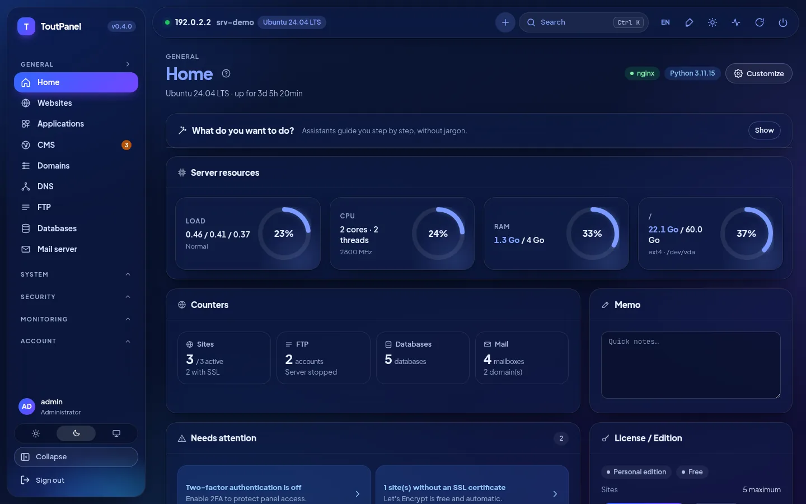<br>**Dashboard, dark mode**: gauges, counters, attention points, licence | 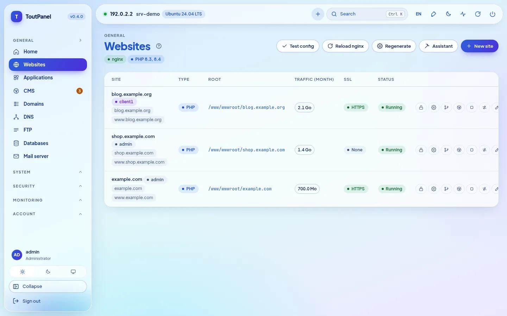<br>**Websites**: domains, type, root, traffic, SSL and actions |
| <br>**PHP**: versions 5.6 → 8.5 side by side, support status, FPM pools | <br>**Site settings**: Git deployment, SSL, redirects, security |
| <br>**DNS**: BIND zones or providers, templates, DNSSEC, cluster | <br>**Certificates**: validity, issuer, renewal, panel certificate |
| 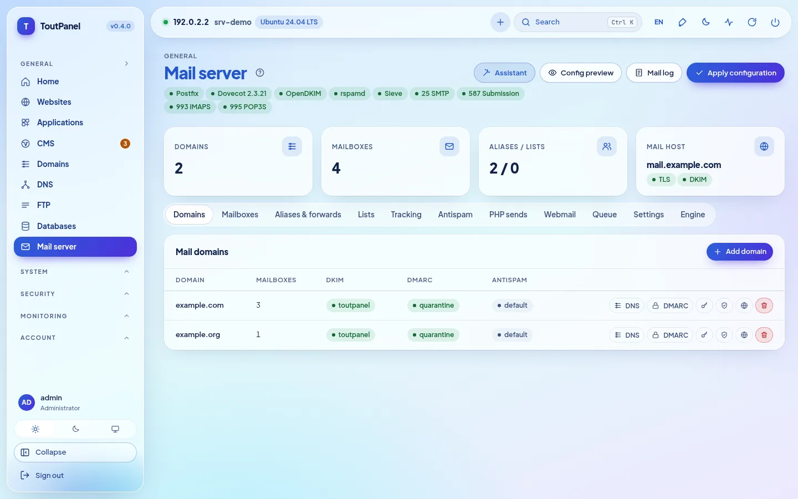<br>**Mail server**: Postfix, Dovecot, OpenDKIM, ports and tabs | <br>**Webmail**: Roundcube or SnappyMail installed in one click |
| 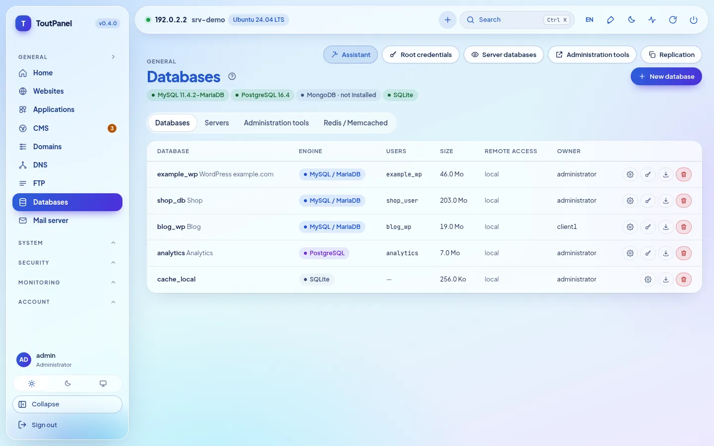<br>**Databases**: MariaDB, PostgreSQL, MongoDB, SQLite, Redis | <br>**Files**: editor, archives, trash, permissions, disk usage |
| <br>**CMS › Install**: 582 verified CMS and applications, search, filters, "ready" badge | <br>**CMS sheet**: checked requirements, version choice, target site, database |
| <br>**CMS › Installations**: versions, available updates, backup, cloning | <br>**WAF › Engine**: ToutWAF recommended, built-in WAF, BunkerWeb, SafeLine |
| <br>**Terminal**: interactive bash / PowerShell shell in the browser | <br>**Applications**: WordPress, Joomla, Drupal, PrestaShop, Nextcloud… |
| <br>**Store**: server software, modules and themes in one click | 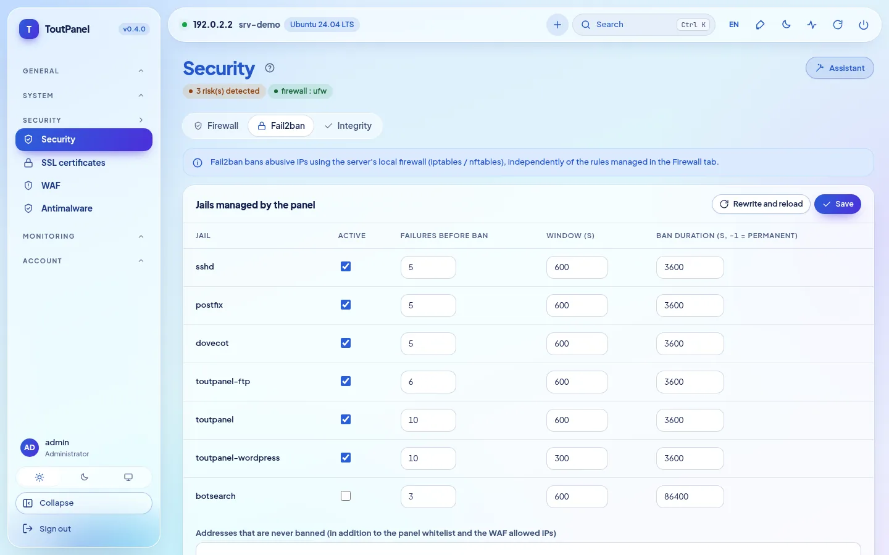<br>**Security**: recommendations, firewall, anti-DDoS, Fail2ban |
| 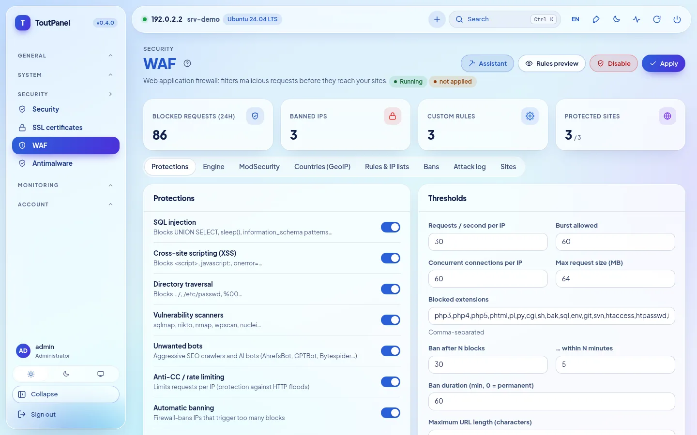<br>**WAF**: protections, thresholds, engines, GeoIP, attack log | <br>**Monitoring**: CPU, memory, network, load and disk from 1 h to 7 days |
| <br>**Accounts**: resellers, clients, plans, access profiles | <br>**Servers**: master panel, nodes, routing, migration |
| <br>**Updates**: system packages (security) and the panel itself | <br>**Settings**: access, port, secret path, HTTPS, interface |
| 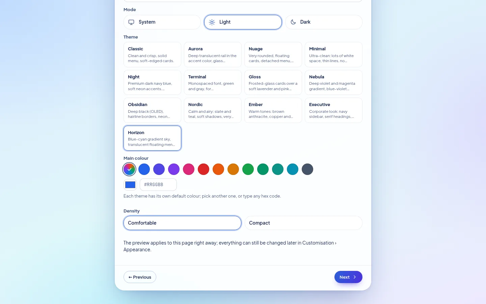<br>**Setup wizard**: theme, main colour, density, instant preview | <br>**Horizon**, the default theme: the same screen in light and dark |

**What's new in 0.4** — screenshots of a demonstration server (documentation addresses):

| | |
|---|---|
| <br>**Setup wizard, Profile step**: starting profiles, detected memory, recommended profile | 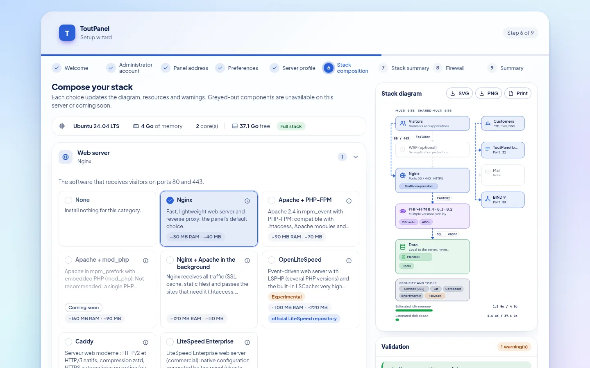<br>**Stack composition**: choices by category, architecture diagram, validation and estimated resources |
| <br>**Stack installation**: progress, steps, resume after an error | <br>**Wizard, Firewall step**: managed by ToutPanel or upstream, ports that will be opened |
| <br>**Settings › Software stack**: real state, installed versions, diagram of this server | <br>**Software stack**, dark mode |
| <br>**Accelerators**: OPcache, JIT, APCu, Redis, Memcached, FastCGI, Varnish… with state, memory and limits | <br>**OpenLiteSpeed** *(experimental)*: installation, LSPHP, web server switch, WebAdmin |
| 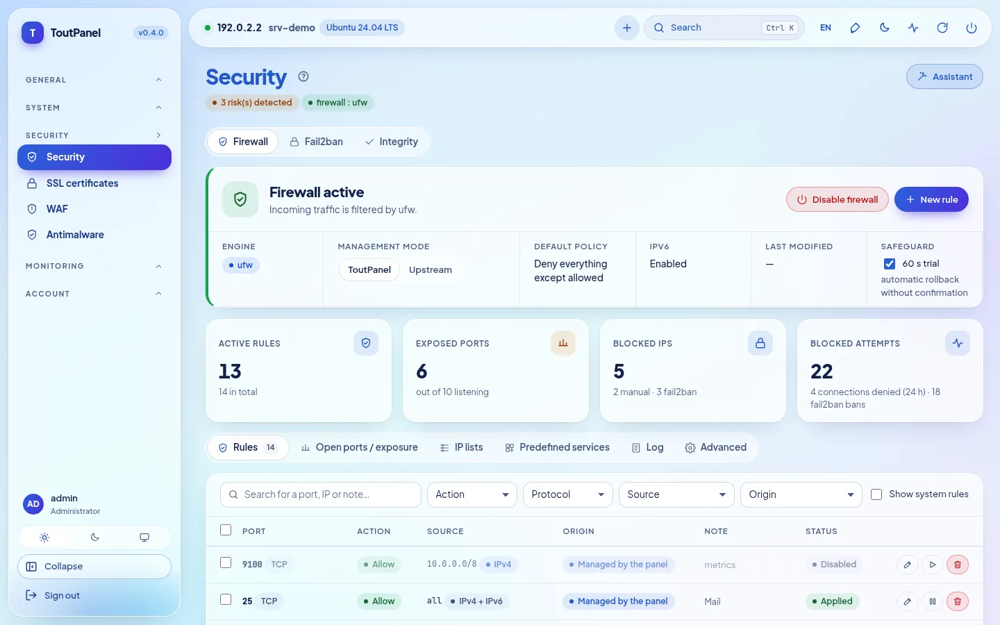<br>**Security › Firewall**: engine, management mode, guard, rules | <br>**Listening ports and exposure**: exposed, restricted, protected |
| <br>**Upstream firewall**: ports to open at your provider, to copy or download | <br>**Firewall**, dark mode |
| <br>**DNS › Engine**: BIND, PowerDNS, Knot DNS, external provider | <br>**Mail server › Engine**: Postfix, Exim *(experimental)*, external relay |
| <br>**FTP › Engine**: built-in, Pure-FTPd, ProFTPD, vsftpd, SFTP *(experimental)* | <br>**Remote ToutWAF**: panel linked to a ToutWAF on another server |
| <br>**Dashboard**: "reduced-stack distribution" banner according to the support level | |

**Pages added for 0.4.0** — same conventions (demonstration server, documentation addresses):

| | |
|---|---|
| 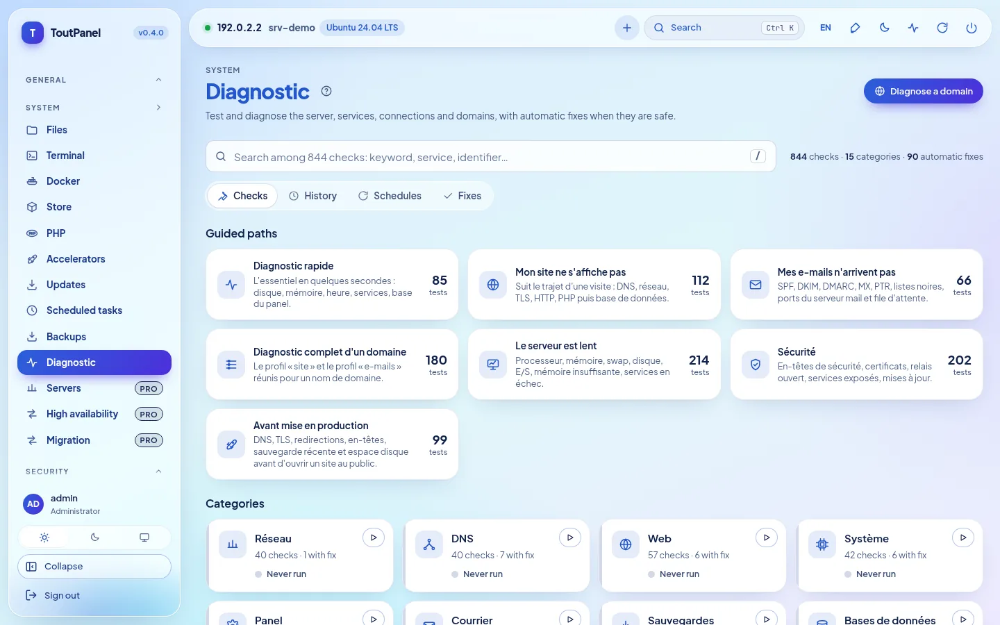<br>**System › Diagnostic**: 844 checks, guided paths, categories, instant search | <br>**A diagnostic result**: probable causes, technical evidence with secrets masked, **automatic fix** |
| <br>**Automatic fix**: exact preview of what will change, impact, undo available | <br>**Dashboard › "What do you want to do?"**: step-by-step guided assistants |
| 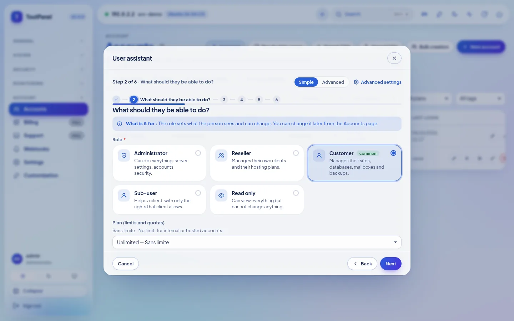<br>**Guided assistant** (here: user): steps, contextual help, Simple or Advanced mode | <br>**Real test after applying**: result per check, probable cause, one-click fix |
| <br>**High availability** *(Pro)*: keepalived floating IP, servers and priorities, address holder | <br>**Monitoring › Server fleet** *(Pro)*: availability, CPU, memory, disk and load per server |
| <br>**Servers** *(Pro)*: master panel, web / mail / DNS nodes, status, pinned TLS fingerprint | <br>**Accounts › Settings › Account isolation** *(option, off by default)*: per-account PHP-FPM, systemd hardening, cage |
| <br>**Settings › Web server: Caddy** *(experimental)*: switch with rollback, HTTPS, unsupported features | <br>**LiteSpeed Enterprise** *(experimental; never started during our tests)*: licence, official installation, LSPHP |
| <br>**Store › Modules**: integrations Marketplace (billing, monitoring, SSO, CI/CD, DNS / CDN…) | 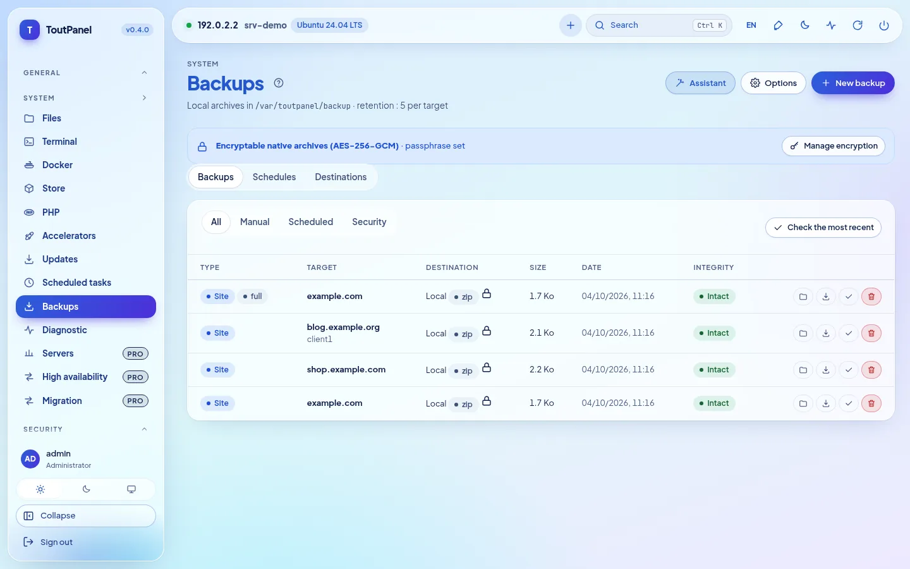<br>**Backups**: encrypted archives (AES-256-GCM), full or incremental |
| <br>**Backup encryption**: passphrase stored encrypted, loss warning, encryption by default or mandatory | <br>**Schedules**: scope, retention, destination, incremental |
| <br>**Settings › Security**: unusual-login alerts, OIDC / SAML SSO | <br>**SSO** *(Pro)*: LDAP / Active Directory, OpenID Connect, SAML 2.0 |

**On mobile**, the interface adapts (collapsible menu, scrollable tables):

<table>
<tr>
<td align="center"><br><b>Dashboard</b></td>
<td align="center"><br><b>Websites</b></td>
</tr>
</table>

> Screenshots taken on a demonstration server (Ubuntu 24.04, documentation address 192.0.2.2, example domains), with the interface in French. On this demonstration server some states are **simulated** (no real service runs there): account isolation (systemd, cgroups), Caddy, server fleet and floating IP, databases, mail, WAF and the Marketplace catalogue; diagnostics and assistants, however, really run. Screenshots in other languages are in `screenshots/<language>/` (en, de, es, it, nl, pt, ru, zh, ar).

## Themes

### 13 themes, your colour

A new installation uses **Horizon**: a blue-cyan gradient sky, floating translucent menu and top bar, an active pill in a blue-violet gradient that follows the chosen colour, very bold blue headings. **Customisation › Appearance**: pick another design, then **any accent colour** (12 presets, colour picker or `#RRGGBB` code). The panel derives buttons, links, active menu, badges, gradients and charts from it while keeping a contrast ratio of at least 4.5:1. Every theme comes in **light and dark**, supports high contrast and right-to-left languages; the preview is instant and nothing is saved before "Save design". Density, corners, font, width, menu position, icons and animations can also be set, per user or as the default for everyone; themes can be exported and imported.


| | | |
|---|---|---|
| <br>**Horizon** *(default)* · `#2b5fd9` | <br>**Classique** · `#2563eb` | <br>**Aurora** · `#2563eb` |
| <br>**Nuage** · `#5b5bd6` | <br>**Minimal** · `#18181b` | <br>**Nuit** · `#0369a1` |
| <br>**Terminal** · `#15803d` | <br>**Gloss** · `#7c3aed` | <br>**Nébuleuse** · `#8b5cf6` |
| <br>**Obsidian** · `#22c55e` | <br>**Nordic** · `#14b8a6` | <br>**Ember** · `#f97316` |
| <br>**Executive** · `#10b981` | | |

<sub>Colour shown: the theme's default accent in light mode, freely changeable.</sub>

Theme, mode, **main colour** and **density** can also be chosen right in the **setup wizard** (Preferences step), with an instant preview; they become the defaults for every account, and each user can then pick their own.

## Editions

The program is the same for every edition: a **licence key** unlocks the advanced features on a given server. A fresh installation runs the Personal edition, with no sign-up and no Internet connection required.

| Edition | Price | Key | For |
|---|---|---|---|
| **Personal** | free, no time limit | none | personal use: your own sites, **up to 5** |
| **Professional** | paid | required | hosting providers, agencies, professional use: everything included, unlimited sites (or per licence plan) |
| **Enterprise** | paid | required | Professional + unlimited multi-server + priority support |

The Personal edition is **complete**: sites, multiple PHP versions, databases, mail, DNS, SSL, built-in WAF, local backups (**AES-256-GCM encryption and incrementals included**), monitoring, manual Diagnostic, guided assistants (steps that touch a Pro feature remain reserved), client accounts and sub-users, WebAuthn, GDPR tools, API and CLI. Reserved for the paid editions:

<details>
<summary><b>Exact list of Professional / Enterprise features</b></summary>

| Feature | Personal | Professional |
|---|---|---|
| Sites | 5 maximum | unlimited (or per licence) |
| Uptime probes | 3 | unlimited |
| Outgoing webhooks | 2 | unlimited |
| WAF engine choice (ToutWAF, BunkerWeb, SafeLine) | built-in WAF | ✓ |
| ModSecurity + OWASP CRS | — | ✓ |
| Multi-server: nodes, high availability, live migration | — | ✓ |
| Web groups and DNS cluster | — | ✓ |
| Database replication | — | ✓ |
| Billing, payment gateways, WHMCS, provisioning | — | ✓ |
| Reseller white label | — | ✓ |
| Custom panel domain | — | ✓ |
| Support (tickets) | — | ✓ |
| Announcements | — | ✓ |
| Reseller accounts | — (clients and sub-users: ✓) | ✓ |
| LDAP / OpenID Connect / SAML SSO | — (WebAuthn: ✓) | ✓ |
| Country blocking (GeoIP) | — | ✓ |
| Scheduled antimalware | manual scan | ✓ |
| Remote backups (S3, SFTP, B2, SSH rsync, rclone) | local storage (encrypted and incremental archives included) | ✓ |
| restic, Borg and rsync engines | — | ✓ |
| Prometheus `/metrics` export | — | ✓ |
| Import from cPanel, Plesk, DirectAdmin, ISPConfig, shared hosting, IMAP | — (export: ✓) | ✓ |
| Premium store modules | — | ✓ |
| External anchoring of the audit log | — (GDPR export and purge: ✓) | ✓ |
| Scheduled Diagnostics with alert | manual diagnostic | ✓ |

</details>

- Affected menu entries carry a **Pro** badge; pages remain viewable, only creating and editing are reserved.
- Activation: **Settings › Licence › Activate a key** (`TP-XXXXX-XXXXX-XXXXX-XXXXX`) or `toutpanel licence activate <key>`. The signed token is verified locally: the licence works offline (daily revalidation, 15-day grace period).
- If the licence expires or becomes invalid, the panel **falls back to the Personal edition without deleting anything**.

Pricing and purchase: **[toutpanel.com/tarifs](https://toutpanel.com/tarifs)** · details: [Editions and licence](https://toutpanel.com/docs/guide/editions/).

## Architecture

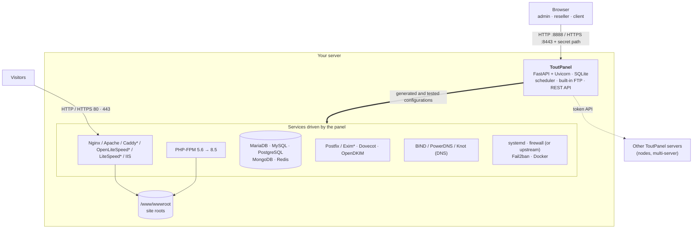

| Component | Role |
|---|---|
| **Panel** | FastAPI application served by Uvicorn (`toutpanel` systemd service on Linux, `ToutPanel` scheduled task on Windows). Web interface with no external dependency, REST API, task scheduler, built-in FTP server. |
| **Web stack** | Nginx and/or Apache (Caddy, OpenLiteSpeed with LSPHP and LiteSpeed Enterprise: experimental; IIS on Windows) with PHP-FPM; the panel writes vhosts from its templates, tests them, then reloads the service. The **stack composer** chooses and evolves the software. |
| **Services** | MariaDB / MySQL / PostgreSQL / MongoDB, Postfix (or Exim*) / Dovecot / OpenDKIM, BIND (or PowerDNS, Knot), FTP (built-in or Pure-FTPd*, ProFTPD*, vsftpd*), Fail2ban, firewall, Docker: driven by the panel through their native tools. |
| **`toutpanel` CLI** | Panel administration (port, secret path, password, update, licence…) and scriptable business commands (`--json`). |

<sub>\* experimental</sub>

```
<home>  (/var/toutpanel or C:\toutpanel)
├── data/      panel SQLite database, settings.json, keys, install-info.txt
├── logs/      panel.log and site logs
├── vhost/     generated vhosts (when the web server's native folder is missing)
├── ssl/       site and panel certificates
├── backup/    local backups
├── src/       clone of this repository (channels, tags, toutpanel update)
└── venv/      panel Python environment
/www/wwwroot   site roots (C:\toutpanel\wwwroot on Windows)
```
## Full installation

### Requirements

| | Linux | Windows |
|---|---|---|
| **Systems** | **full** level: Debian 11 and later, Ubuntu 20.04 and later, AlmaLinux / Rocky Linux / RHEL / CentOS Stream / Oracle Linux / CloudLinux 8 and later, Fedora · **reduced** level (the panel works, some features are missing): Debian 10, Ubuntu 18.04, CentOS / RHEL 7, Amazon Linux, openSUSE / SLES, Arch, Alpine, Devuan · see [Distribution compatibility](#distribution-compatibility) | Windows 10, 11 · Windows Server 2016, 2019, 2022, 2025 (build 14393 minimum) |
| **Rights** | `root` (or `sudo`) and `bash` | PowerShell 5.1+ **as administrator** (winget not required) |
| **Python** | 3.9 to 3.14 (installed by the script when the distribution provides it) | installed by the script (3.12, python.org) if missing |
| **Memory** | 1 GB minimum (panel only), 2 GB recommended with MariaDB and PHP | same |
| **Disk** | 2 GB free + your sites | same |
| **Network** | outbound HTTPS (GitHub, PyPI, distribution repositories, Let's Encrypt); fixed public IP and reverse DNS for mail | same (python.org, nginx.org, windows.php.net, MariaDB) |

Architectures: `x86_64` and `aarch64` (others: reduced level). Preferably install on a **freshly installed** server. On a server where Nginx, Apache or MariaDB are already configured, use `--stack none`: the panel detects them and writes its vhosts into their native folder without touching anything else.

### Distribution compatibility

The installer and the panel detect the distribution (`/etc/os-release`, architecture) and display a **support level**: `toutpanel compat` lists the known distributions, `toutpanel check` gives the level of your server, and a dashboard banner warns when the level is not "full". There is **never a version ceiling**: a newer version of a known family is treated like the latest known one.

| Level | Meaning | Examples |
|---|---|---|
| **Full** | the complete stack is expected (web server, multi-version PHP, databases in chosen versions, mail, firewall, automatic updates) | Debian 11+, Ubuntu 20.04+ (LTS and interim), AlmaLinux / Rocky / RHEL / CentOS Stream / Oracle Linux 8+, CloudLinux 8 and 9, Fedora, 64-bit Raspberry Pi OS |
| **Reduced** | the panel works, but some features are missing or need manual action (end-of-life system, init without systemd, missing third-party repositories, 32-bit architecture); non-blocking warning | Debian 10, Ubuntu 18.04, CentOS / RHEL 7, Amazon Linux 2 and 2023 (one PHP at a time), openSUSE / SLES, Arch and derivatives, Alpine, Devuan, Kali |
| **Unsupported** | unknown, too old or immutable system: the installer says so and stops | Fedora CoreOS / Silverblue, MicroOS, Flatcar, Gentoo, NixOS, Void |

"Full" describes the level **expected** by the panel; **the tests were run on Ubuntu 24.04**, with one exception: **AlmaLinux 9.8 and 10.2 with SELinux Enforcing** (QEMU laboratory of 4 October 2026); end-to-end validation has not been done on the other distributions, Rocky Linux, RHEL and Fedora included (see [Known limitations](#known-limitations)). Python 3.9+ is provided if the system is too old (recent distribution package, or standalone Python verified by SHA-256, with your consent).

### Linux

```bash
curl -sSL https://raw.githubusercontent.com/qu3ntin01/toutpanel/main/install.sh | sudo bash
```

To read the script before running it:

```bash
curl -sSLO https://raw.githubusercontent.com/qu3ntin01/toutpanel/main/install.sh
less install.sh
sudo bash install.sh
```

Installation takes 3 to 6 minutes depending on the connection.

**Installation assistant.** Every option (account, ports, directory, stack, firewall, WAF, version, language…) can be chosen from menus on **[toutpanel.com/installation-assistant](https://toutpanel.com/installation-assistant)**, which generates the command line and checks it live (secrets never appear in clear there).

**Installing a specific version.** The standard command installs the latest stable version; `--version` picks another one (list them with `--list-versions`). Pre-releases are published on the `dev` channel and are installed with `--channel dev`:

```bash
# the latest stable version
curl -sSL https://raw.githubusercontent.com/qu3ntin01/toutpanel/main/install.sh | sudo bash
# a specific version (list them with --list-versions)
curl -sSL https://raw.githubusercontent.com/qu3ntin01/toutpanel/main/install.sh | sudo bash -s -- --list-versions
curl -sSL https://raw.githubusercontent.com/qu3ntin01/toutpanel/main/install.sh | sudo bash -s -- --version 0.4.0
# the latest pre-release (dev channel)
curl -sSL https://raw.githubusercontent.com/qu3ntin01/toutpanel/dev/install.sh | sudo bash -s -- --channel dev
```

**Interactive menu.** When run in a terminal without a mode option, the script introduces ToutPanel, detects an existing installation and offers to **install** (full stack) or **install the panel only**, optionally in **node mode**; or, if the panel is already there, to **update**, **fully reinstall** or **uninstall**. It also asks the **firewall** question (ToutPanel / upstream / later) and, once the panel is running, the **stack profile** question. Without a terminal (automation, `--yes`), it asks nothing: it installs, or updates if the panel is present (firewall “later”, default stack).

**What the script does:**

1. installs Python 3.9+ if needed and creates the `<home>/venv` virtual environment;
2. installs the **web stack** (Nginx, PHP-FPM, MariaDB, Redis or Valkey, Certbot, Fail2ban) as before, or the one you compose (`--profile`, `--web`, `--php`, `--db`… passed to `toutpanel stack apply`);
3. clones this repository into `<home>/src`, **checks the SHA-256 sum** of the wheel matching the system Python and installs it;
4. creates a random **administrator account** and **secret access URL**;
5. registers the `toutpanel` **systemd service**;
6. sets up the **firewall** according to `--firewall`: `on` (ToutPanel manages it and opens the ports it needs), `off` (upstream firewall: no system rule, the ports to open at your hosting provider are listed), a question in a terminal, otherwise “later” (nothing is touched);
7. configures **SELinux** (Alma, Rocky, RHEL, Fedora) or **AppArmor** (Debian, Ubuntu, SUSE);
8. prints a summary, saved in `<home>/data/install-info.txt` (readable by root only).

#### `install.sh` options

| Option | Description | Default |
|---|---|---|
| `--stack full` | **deprecated** (see `--profile`): Nginx + PHP-FPM + MariaDB + Redis/Valkey + Certbot + Fail2ban | ✓ |
| `--stack minimal` | Nginx + PHP-FPM + Certbot | |
| `--stack none` | panel only (already configured server) | |
| `--profile NAME` | **stack composer** profile: `single-site`, `multi-site`, `hosting`, `performance`, `application`, `mail-only`, `dns-only`, `node`, `lamp`, `standard`, `custom` (values of the other options: see the table below) | default stack |
| `--web`, `--php`, `--php-default`, `--php-ext`, `--db`, `--redis`, `--accel`, `--ftp`, `--mail ENGINE`, `--dns`, `--security`, `--runtime`, `--tools`, `--install-mode`, `--roles`, `--stack-file`, `--no-tuning` | composer options, passed unchanged to `toutpanel stack apply … --yes` once the panel is installed (a stack failure never fails the panel installation: a resume command is shown) | |
| `--accept-litespeed-license` | with `--web litespeed[:6.3]`: accepts the LiteSpeed Technologies licence agreement; **mandatory** (without it the installer stops before changing anything), incompatible with `--stack`, refused on Windows. **LiteSpeed Enterprise is a commercial, EXPERIMENTAL product, never started in the development environment**: official 15-day trial, then paid licence | no |
| `--mail` | (alone) adds Postfix, Dovecot, OpenDKIM and opens the mail ports | no |
| `--firewall on\|off\|ask` | who manages the firewall: ToutPanel (`on`), an upstream firewall with no system rule (`off`), a question (`ask`); without a terminal or a value: “later”; never changed by an update | question in a terminal |
| `--firewall-engine nft\|ufw\|firewalld\|csf\|iptables` | engine of the firewall managed by ToutPanel | detected |
| `--dry-run` | prints the detected distribution, directory and planned commands without changing anything (no root) | no |
| `--postgres` | adds PostgreSQL (password of the `postgres` role generated and saved in the panel) | no |
| `--waf toutwaf` | deploys **ToutWAF**, the vendor's WAF, in front of the sites with its official installer (systemd services, no Docker; web server moved to 8080 / 8443, console on 9443, summary in `/etc/toutwaf/INSTALL-SUMMARY.txt`) | no |
| `--waf toutwaf --waf-console URL` | **remote ToutWAF**: links the panel to a ToutWAF installed on another server (no local installation), with `--waf-origin-ip`, `--waf-origin-addr`, `--waf-cert-mode import\|acme`, `--waf-server-id`, `--waf-fingerprint` or `--waf-trust-first-use`, `--waf-restrict` (80 / 443 limited to ToutWAF); the token is given with `--waf-token-file FILE` or `--waf-token-stdin` (never as an argument) | no |
| `--waf bunkerweb` / `--waf safeline` | installs Docker and deploys the external WAF in front of the sites (web server moved to 8080 / 8443, console on 7000 or 9443) | no |
| `--node` | multi-server **node** mode: panel served over HTTPS only, enrolment token, API URL and TLS fingerprint printed (to enter on the master: System › Servers › Add) | no |
| `--master URL` | with `--node`: URL of the master panel | — |
| `--port N` | panel **HTTP** port | `8888` |
| `--https-port N` | panel **HTTPS** port (the panel listens over HTTP **and** HTTPS; self-signed certificate at first) | `8443` |
| `--version X.Y.Z` | installs this published version (also `vX.Y.Z`, `0.4.0b1` or `0.4.0-beta.1`; `TOUTPANEL_VERSION` variable); a pre-release implies the `dev` channel; a version that is not found, or has no package for your Python, stops before anything is changed and lists the versions; a downgrade asks for confirmation (unless `--yes`) | latest of the channel |
| `--list-versions` | lists the published versions (most recent first), then exits without installing anything | |
| `--random-port` | random port between 20000 and 39999 | |
| `--username NAME` | administrator account name | random `admin_xxxxxx` |
| `--password PASS` | administrator password (visible in `ps` and the shell history: prefer the next three options) | 16 random characters |
| `TOUTPANEL_PASSWORD` | environment variable giving the password (kept by `sudo -E`); an option wins over the variable | — |
| `--password-file FILE` | reads the password from the first line of a file (on Linux, reserved to its owner: `chmod 600`) | — |
| `--password-stdin` | reads the password from standard input (first line; not usable with `curl \| bash`) | — |
| `--entrance /path` | secret path in the URL | random `/tp_xxxxxxxxxx` |
| `--home DIR` | panel directory (an existing installation in the former default `/www/toutpanel` is detected and kept) | `/var/toutpanel` |
| `--source DIR` | install from a local folder (copy of this repository with `dist/`) | clone of the branch |
| `--branch NAME` | Git branch to download | `main` |
| `--channel stable\|dev` | panel update channel, saved in the panel | `stable` |
| `--update` | updates an existing installation (detected automatically): data backup, new code, database migration, restart | auto |
| `--reinstall` | forces a full installation even if the panel is present | no |
| `--uninstall` | uninstalls the panel (sites and databases kept, panel data archived) | no |
| `--yes`, `-y` | no questions (menu and confirmations) | no |
| `--lang xx` | installer language and initial panel language: `en`, `fr`, `de`, `es`, `it`, `pt`, `nl`, `ru`, `zh`, `ar` | system language, otherwise `en` |
| `--en`, `--fr`, `--de`, `--es`, `--it`, `--pt`, `--nl`, `--ru`, `--zh`, `--ar` | shortcuts for `--lang` | |
| `-h`, `--help` | prints the script help | |

One password source at a time (two options are refused before any change). With none, an interactive terminal offers "generate automatically (recommended)" or "type it" (no echo, with confirmation); without a terminal or with `--yes`, a password is generated and shown at the end. A supplied password is neither displayed nor written to the summary or `install-info.txt`, and an update never changes it.

**Stack option values** (checked before any change; **\*** = experimental):

| Option | Values |
|---|---|
| `--web` | `nginx`, `apache`, `nginx-apache`, `caddy`\*, `openlitespeed`\* (`:1.9`, `:1.8`, `:1.7`), `litespeed`\* (`:6.3`, `:6.2`, `:6.1`, `:6.0`; LiteSpeed Enterprise, commercial, requires `--accept-litespeed-license`), `none`; `toutpanel stack apply` accepts the same values |
| `--php` / `--php-default` / `--php-ext` | comma-separated versions (`8.3,8.4`, from 5.6 to 8.5) / default version / `minimal`, `standard`, `full` |
| `--db` | `mariadb` (`:10.6`, `:10.11`, `:11.4`, `:11.8`), `mysql`\* (`:8.4`, `:9.7`), `percona`\* (`:8.0`, `:8.4`), `postgresql` (`:13` to `:18`), `none` |
| `--accel` | `opcache`, `jit`, `apcu`, `redis`, `memcached`, `fastcgi-cache`, `varnish`\*, `brotli`, `zstd`\*, `http3`\*, `ioncube` |
| `--ftp` | `builtin`, `pureftpd`\*, `proftpd`\*, `vsftpd`\*, `sftp`\*, `none` |
| `--mail` | `postfix`, `postfix-clamav`, `postfix-light`, `exim`\*, `relay`, `none` |
| `--dns` | `bind`, `powerdns`, `knot`, `external`, `none` |
| `--security` | `firewall`, `fail2ban`, `modsecurity`, `clamav`, `toutwaf` |
| `--runtime` / `--tools` | `nodejs`, `python`, `go`, `ruby`, `java`, `docker` / `certbot`, `git`, `composer`, `phpmyadmin`, `adminer`, `restic`, `goaccess` |
| `--install-mode` / `--roles` | `single-server`, `single-site`, `multi-site`, `multi-server` / `web`, `db`, `mail`, `dns` |

A "coming soon" component (Apache + mod_php) is cleanly refused by `toutpanel stack`, with nothing installed.

Examples:

```bash
sudo bash install.sh --stack minimal --port 7443
sudo bash install.sh --profile lamp --php 8.3,8.4 --db mariadb:11.4 --firewall on
sudo bash install.sh --profile hosting --mail postfix-clamav --dns bind --firewall off --yes
sudo bash install.sh --dry-run --profile lamp          # dry run
sudo bash install.sh --mail --postgres
sudo bash install.sh --mail --username me --password-file /root/password.txt --entrance /my-access
sudo bash install.sh --profile performance --web openlitespeed --php 8.3 --accel opcache,redis --firewall off --yes   # OpenLiteSpeed: experimental
sudo bash install.sh --web litespeed:6.3 --php 8.3 --accept-litespeed-license --yes   # LiteSpeed Enterprise: commercial, experimental, licence mandatory (Linux only)
sudo bash install.sh --waf toutwaf                 # the vendor's WAF in front of the sites
sudo bash install.sh --stack minimal --node --master https://master.example.com:8888   # server driven by a master
curl -sSL https://raw.githubusercontent.com/qu3ntin01/toutpanel/main/install.sh | sudo bash -s -- --yes --random-port
curl -sSL https://raw.githubusercontent.com/qu3ntin01/toutpanel/main/install.sh | sudo bash -s -- --channel dev
curl -sSL https://raw.githubusercontent.com/qu3ntin01/toutpanel/main/install.sh | sudo bash -s -- --de   # installer in German
```

#### Installer language

The installers are **multilingual**: banner, menu and questions, steps, warnings, errors, help, summary and `install-info.txt` are shown in one of the **10 languages** below, **English by default**. The chosen language also becomes the panel's **initial language** (installation and reinstallation); a line under the banner states the language used and where it came from.

| Language | `--lang` | Linux shortcut | Windows |
|---|---|---|---|
| English *(default)* | `en` | `--en` | `-Lang en` / `-En` |
| Français | `fr` | `--fr` | `-Lang fr` / `-Fr` |
| Deutsch | `de` | `--de` | `-Lang de` / `-De` |
| Español | `es` | `--es` | `-Lang es` / `-Es` |
| Italiano | `it` | `--it` | `-Lang it` / `-It` |
| Português | `pt` | `--pt` | `-Lang pt` / `-Pt` |
| Nederlands | `nl` | `--nl` | `-Lang nl` / `-Nl` |
| Русский | `ru` | `--ru` | `-Lang ru` / `-Ru` |
| 中文 | `zh` | `--zh` | `-Lang zh` / `-Zh` |
| العربية | `ar` | `--ar` | `-Lang ar` / `-Ar` |

Priority order, strongest first:

| # | Source | Linux | Windows |
|---|---|---|---|
| 1 | command-line option | `--lang xx` or a shortcut (`--fr`…) | `-Lang xx` or a shortcut (`-Fr`…) |
| 2 | environment variable | `TOUTPANEL_LANG=fr` | `$env:TOUTPANEL_LANG = "fr"` |
| 3 | value written in the script | `INSTALLER_LANG="fr"` at the top of `install.sh` | `$InstallerLang = "fr"` at the top of `install.ps1` |
| 4 | **detected** system language, if it is one of the 10 | `LC_ALL`, `LC_MESSAGES`, `LANG` | `Get-Culture` |
| 5 | English | | |

```bash
curl -sSL https://raw.githubusercontent.com/qu3ntin01/toutpanel/main/install.sh | sudo env TOUTPANEL_LANG=de bash
```

Recognised environment variables: `TOUTPANEL_LANG` (installer language), `TOUTPANEL_HOME` (directory), `TOUTPANEL_REPO` (Git repository), `TOUTPANEL_BRANCH` (branch), `TOUTPANEL_CHANNEL` (`stable` or `dev`), `TOUTPANEL_VERSION` (specific version), `TOUTPANEL_PASSWORD` (administrator password), `TOUTPANEL_FIREWALL` / `TOUTPANEL_FIREWALL_ENGINE`, and one variable per stack option (`TOUTPANEL_PROFILE`, `TOUTPANEL_WEB`, `TOUTPANEL_PHP`, `TOUTPANEL_DB`, `TOUTPANEL_ACCEL`, `TOUTPANEL_FTP`, `TOUTPANEL_MAIL_ENGINE`, `TOUTPANEL_DNS`…).

<details>
<summary><b>Packages installed per distribution</b></summary>

- **Debian / Ubuntu**: `nginx`, `php8.x-fpm` (+ cli, mysql, curl, mbstring, xml, zip, gd, intl, bcmath, opcache), `certbot`, `composer`, `mariadb-server`, `redis-server`, `fail2ban`, `python3-venv`, `git`, `unzip`; multiple PHP versions through packages.sury.org (Debian) or the ondrej PPA (Ubuntu).
- **AlmaLinux / Rocky / RHEL / Fedora**: `epel-release` (+ CRB), `remi-release`, `nginx`, `php83-php-fpm` (+ extensions), `certbot`, `mariadb-server`, `redis` or `valkey` (Valkey on AlmaLinux 10), `fail2ban`, `policycoreutils-python-utils`, `dnf-plugins-core`, `rspamd` (from the official `rspamd.com` repository, added by the stack: missing from AlmaLinux and EPEL), `firewalld` (installed with `--firewall on`: cloud images have neither `firewalld` nor `nft`); SELinux contexts declared (`httpd_sys_rw_content_t` on `/www/wwwroot`, `httpd_log_t`, `var_log_t`, `cert_t`, `httpd_config_t`, `mail_spool_t`) and booleans `httpd_can_network_connect`, `httpd_can_network_connect_db`, `httpd_can_sendmail`, `httpd_setrlimit` enabled.
- **Optional Python modules** (not installed by default): `pymongo` (MongoDB), `wsgidav` + `a2wsgi` (WebDAV), `geoip2` (GeoIP), `python3-saml` (SAML) — `/var/toutpanel/venv/bin/pip install "pymongo>=4.6"` then `systemctl restart toutpanel`.

</details>

### Windows

In PowerShell **as administrator**:

```powershell
Set-ExecutionPolicy Bypass -Scope Process -Force
iwr -useb https://raw.githubusercontent.com/qu3ntin01/toutpanel/main/install.ps1 | iex
```

The script checks the Windows version and rights, installs **Python 3.12** if no Python 3.9+ is present, creates `C:\toutpanel\venv` and installs the panel into it, creates the admin account and secret URL, adds firewall rules (panel port, 80, 443, 21), creates the **ToutPanel** scheduled task (automatic start as SYSTEM) and adds `C:\toutpanel\bin` to the PATH.

To also install the web stack (**Nginx** in `C:\nginx`, **PHP 8.5** supervised by the panel, **MariaDB** as a Windows service):

```powershell
iwr -useb https://raw.githubusercontent.com/qu3ntin01/toutpanel/main/install.ps1 -OutFile install.ps1
.\install.ps1 -Stack
```

| Option | Description |
|---|---|
| `-Port 8888` | panel **HTTP** port |
| `-HttpsPort 8443` | panel **HTTPS** port |
| `-Version X.Y.Z` / `-ListVersions` | install a specific published version (`TOUTPANEL_VERSION` variable) / list the published versions |
| `-Home C:\toutpanel` | panel directory |
| `-Stack` | installs Nginx, PHP 8.5, MariaDB |
| `-Username`, `-Password`, `-Entrance /x` | chosen admin account and secret URL (`-Password` is visible in the process list: prefer `$env:TOUTPANEL_PASSWORD`, `-PasswordFile FILE` or `-PasswordStdin`) |
| `-PythonVersion`, `-NginxVersion`, `-MariaDBVersion`, `-PhpVersion` | downloaded versions |
| `-Source C:\path` / `-Branch main` | local folder (copy of this repository) / downloaded branch |
| `-Update` / `-Reinstall` / `-Uninstall` | update / reinstall everything / uninstall |
| `-Yes` | no questions (automation) |
| `-Lang xx` / `-En`, `-Fr`, `-De`, `-Es`, `-It`, `-Pt`, `-Nl`, `-Ru`, `-Zh`, `-Ar` | installer language and initial panel language (default: system language when supported, otherwise English; see [Installer language](#installer-language)); with `iwr … \| iex`: set `$env:TOUTPANEL_LANG = "fr"` first |
| `-Help` | script help |

### Ports to open

| Port | Use | Opened by the installer |
|---|---|---|
| **8888** (configurable) | panel interface over **HTTP** | yes |
| **8443** (configurable) | panel interface over **HTTPS** (self-signed certificate at first) | yes (re-run the installer or open it by hand on an existing installation) |
| **80 / 443** | websites | yes |
| 21 + 60000-60100 | FTP (built-in, or the chosen engine: its passive range) | 21 only; open the passive range if you enable FTP |
| 25, 465, 587, 143, 993, 110, 995, 4190 | mail (SMTP, IMAP, POP3, ManageSieve) | with `--mail` (4190: open it for remote Sieve) |
| 53 (UDP and TCP) | DNS (BIND, PowerDNS or Knot) if you host your zones | no: Security › Firewall |
| 9443 / 7000 | ToutWAF and SafeLine consoles (9443), BunkerWeb (7000) | with `--waf` |
| 3306 / 5432 | remote database access (optional) | no: only if you enable it |

Do not forget your **hosting provider's firewall** (security group): if it blocks the panel ports (8888 and 8443), the browser shows nothing. With `--firewall off` (or the "Upstream" mode of Security › Firewall), ToutPanel touches no system rule and **lists the ports to open** at your provider (`toutpanel firewall ports`, copy or CSV download in the interface); with `--firewall on`, it opens them itself and a **60-second guard** reverts any unconfirmed change that would lock you out.

## First start

At the end of the installation, the script prints a summary (shown here in French; the installer speaks English by default):

```
╔══════════════════════════════════════════════════════════════════╗
║  ToutPanel est installé !                                        ║
╚══════════════════════════════════════════════════════════════════╝

  URL du panel (HTTP)       : http://203.0.113.10:8888/tp_dchwp7kmkf
  URL du panel (HTTPS)      : https://203.0.113.10:8443/tp_dchwp7kmkf   certificat auto-signé : avertissement du navigateur normal
  Utilisateur               : admin_gbhjkv
  Mot de passe              : D9nYzTSKHbX8FTqC
  MariaDB root              : k3Jd82nLqP0sYt7wVb1c
  Assistant de configuration : https://203.0.113.10:8443/tp_dchwp7kmkf#/setup?token=npSj7xpVzJOI8weJl8R00AdQ18MHYn8YIJCbOYi43B8
  Ce lien (24 h, une seule utilisation) permet de changer l'adresse du panel, l'utilisateur et le mot de passe générés ci-dessus.
  Nouveau lien : toutpanel setup-link
  PHP                       : 8.5 (Nginx + PHP-FPM prêts)

  Ces informations sont enregistrées dans : /var/toutpanel/data/install-info.txt
  L'URL contient l'entrée sécurisée : sans elle, le panel répond 404.
```

1. **Write down the full URLs** (*URL du panel*, HTTP and HTTPS): they contain the **secret path** (`/tp_…`). Without it, the panel answers `404 Not Found`, which makes it invisible to scans. `toutpanel info` prints them again. The HTTPS certificate is **self-signed** at first: the browser warning is normal; the setup wizard link uses HTTPS so its token never travels in clear text.
2. **Open the setup wizard link** (*Assistant de configuration*, `#/setup?token=…`, valid 24 h, single use): in **nine steps** and without logging in, replace the generated values with your own (username, password, port, secret path, hostname, language, mode, theme, main colour and density), then **choose your server's profile and compose its stack** (profile, composition with architecture diagram, summary and resumable installation) and **who manages the firewall** (ToutPanel, upstream or later). Link expired? `toutpanel setup-link` creates a new one. The wizard remains available once logged in (dashboard › Quick shortcuts).
3. **Secure the account**: two-factor authentication (TOTP) and, if possible, a WebAuthn security key; allowed IPs if you have a fixed IP; a trusted HTTPS certificate (Settings › Access & interface, Let's Encrypt if a domain points to the server) and, if you wish, HTTP to HTTPS redirection.
4. **Create a first site**: Websites › New site (or the **Wizard** button for site + database + certificate + mailboxes), point the DNS to the server, then padlock › Let's Encrypt and "Force HTTPS".
5. **Enable protections**: WAF › Apply (or WAF › Engine › Install ToutWAF in the Professional edition), firewall rules (Security › Firewall), a scheduled daily backup, alerts (Settings › Alerts).
6. **Check the server**: System › Diagnostic (844 checks, automatic fixes with preview) and, on each page, the **Assistant** button to set up a site, a database, a mailbox, a backup or the firewall step by step with a real test at the end.
7. **Evolve the stack** at any time: Settings › Software stack (real state, adding a component, a PHP version, an engine), the Accelerators page, the Engine tabs of the FTP, DNS and Mail server pages.

## Updating

Every method keeps accounts, settings, sites, databases and software.

- **From the panel**: **Updates › Panel** shows the installed version, the followed channel, the available versions and the release notes. **Update** first backs up `settings.json`, the panel database and the current version (`<home>/data/updates/<date>/`), installs the new version's wheel, migrates the database and restarts; the panel then checks its health and **automatically rolls back** on failure. **Revert to the previous version** stays available at any time.
- **From the command line**:

  ```bash
  toutpanel update --check              # installed version, available version, release notes
  toutpanel update                      # install the version of the followed channel
  toutpanel update --channel dev        # follow the development branch
  toutpanel update --rollback           # revert to the previous version (--restore-data: data too)
  ```

- **With the installer**: run again on an equipped server, `install.sh` switches to update mode (backup of `data/` into `<home>/backup/panel-update-<date>/`, new wheel, `toutpanel migrate`, restart). The stack is not reinstalled unless you add `--stack`, `--mail` or `--waf`. On Windows: `.\install.ps1 -Update`.

## Uninstalling

```bash
curl -sSL https://raw.githubusercontent.com/qu3ntin01/toutpanel/main/install.sh | sudo bash -s -- --uninstall
```

Removes the service, `/var/toutpanel` (or the detected installation, e.g. `/www/toutpanel`: panel, Python environment, logs, certificates), `/usr/local/bin/toutpanel` and the Nginx / Apache configurations generated by the panel. Panel data is first archived to `/root/toutpanel-backup-<date>.tar.gz`. **Sites (`/www/wwwroot`), databases and stack software stay in place.** Add `--yes` to skip confirmation.

On Windows: `.\install.ps1 -Uninstall` (data archived to `C:\toutpanel-backup-<date>.zip`, sites moved to `C:\toutpanel-wwwroot-<date>`, Nginx, PHP and MariaDB kept).

## Manual installation from a wheel

For special environments, without the script. Pick the wheel matching your interpreter (`cp311` for Python 3.11, etc.):

```bash
git clone --depth 1 https://github.com/qu3ntin01/toutpanel.git /var/toutpanel/src
python3 -m venv /var/toutpanel/venv
. /var/toutpanel/venv/bin/activate          # Windows: venv\Scripts\activate
TAG=$(python -c 'import sys;print(f"cp{sys.version_info[0]}{sys.version_info[1]}")')
(cd /var/toutpanel/src/dist && sha256sum -c --ignore-missing SHA256SUMS)
pip install /var/toutpanel/src/dist/toutpanel-*-$TAG-none-any.whl
# e.g. for Python 3.12: pip install dist/toutpanel-0.5.5-cp312-none-any.whl
export TOUTPANEL_HOME=/var/toutpanel         # Windows: $env:TOUTPANEL_HOME="C:\toutpanel"
toutpanel setup --username admin --password 'MyPassword' --entrance /my-access
toutpanel run
```

Keeping the clone in `<home>/src` then enables `toutpanel update` (channels and rollback). `toutpanel service install` creates the systemd service (or the Windows scheduled task).

## Troubleshooting

| Symptom | Solution |
|---|---|
| `404 Not Found` when opening the panel | the URL lacks the secret path: `toutpanel info` prints the full URL; `toutpanel entrance /new-path` changes it |
| the browser shows nothing on the panel port | hosting provider firewall closed, or port changed: open the port, check it with `toutpanel info`; `toutpanel port N` to change it |
| lost password or 2FA unavailable | `toutpanel passwd` (new password generated) or `toutpanel passwd 'New' --disable-2fa` |
| the panel does not start | `systemctl status toutpanel`, `journalctl -u toutpanel -n 50` and `<home>/logs/panel.log`; `toutpanel check` for a machine diagnosis |
| `Le panel ne répond pas sur le port … après 30 s.` (panel not answering after 30 s) | slow or failed start: same logs, then `systemctl restart toutpanel` |
| `[ToutPanel] Échec à la ligne N (code C) : …` (failure at line N) | an installer command failed (repository, package, service): fix the cause and run again with `--update` |
| `Python 3.9+ requis.` or no wheel for this Python | install `python3.11` or `python3.12` (distribution package), then run again |
| site or PHP denied on Alma / Rocky / RHEL / Fedora | SELinux: `toutpanel selinux` declares the contexts again (after changing directories, in particular) |
| a service or a site fails without a clear message under SELinux | `ausearch -m avc,user_avc -ts recent` lists the denials, then `audit2why` explains them (`ausearch -m avc,user_avc -ts recent \| audit2why`); the `scripts/lab/alma_selinux.sh` laboratory of the development repository replays the validated path |
| a service does not answer, a site does not display, e-mails do not arrive | System › Diagnostic: "My site does not display" and "My e-mails do not arrive" profiles, or `toutpanel diag run --profile …` |
| Windows: "Lancez PowerShell en tant qu'administrateur." | right click › Run as administrator; `Set-ExecutionPolicy Bypass -Scope Process -Force` before the script |

### Useful commands

```
toutpanel info                      full URL, username, initial password
toutpanel check                     diagnosis: OS, Python, rights, systemd, SELinux, firewall, web server, PHP, MariaDB, port
toutpanel setup-link                new setup wizard link (24 h, single use)
toutpanel passwd [PASS] [--disable-2fa]
toutpanel username NAME             rename the administrator
toutpanel port N                    change the port (restart required)
toutpanel entrance [/path]          set or disable the secret path
toutpanel ssl on|off                panel HTTPS (self-signed certificate)
toutpanel start|stop|restart|status
toutpanel service install|uninstall
toutpanel selinux | apparmor        SELinux contexts / AppArmor profiles
toutpanel php install|remove VERSION [--extensions a,b]
toutpanel waf status|install|remove|sync [toutwaf|bunkerweb|safeline]
toutpanel waf update|links|doctor toutwaf   ToutWAF update, console links, diagnostics
toutpanel waf connect|disconnect toutwaf    link / unlink a remote ToutWAF (token via TOUTPANEL_WAF_TOKEN or standard input)
toutpanel stack profiles|plan|apply|status  stack composer (--profile, --web, --php, --db…; plan and --dry-run change nothing)
toutpanel firewall status|mode|enable|ports firewall: panel / upstream mode, ports to open at your provider
toutpanel compat [--json]           supported distributions and this server's level
toutpanel accel …                   accelerators (Varnish, Memcached, JIT, Zstandard, HTTP/3)
toutpanel ols|caddy|litespeed …     experimental web servers: status, install, switch, test, reload, unsupported
toutpanel runtimes list|install|remove   Node.js, Python, Go, Java, Ruby, .NET versions
toutpanel isolation status|sync|restart  account isolation (per-account PHP-FPM, cages)
toutpanel diag list|run|fix|report|runs  Diagnostic (--category, --profile, --json)
toutpanel cron list|add|del|run|backend  scheduled tasks and scheduler (internal, systemd timers, cron)
toutpanel backup list|run|restore|encryption|decrypt|extract|restore-server
toutpanel dns engine [NAME] | mail engine [NAME]   DNS / mail engine (with --dry-run and --rollback)
toutpanel update [--check] [--channel stable|dev|custom] [--rollback]
toutpanel node enroll [--master URL] | status
toutpanel licence status|activate KEY|deactivate|refresh
toutpanel site|account|db|mail|dns|ftp|task …   business commands (--json)
```

Full reference (in French): [Command line](https://toutpanel.com/docs/reference/cli/) · [REST API](https://toutpanel.com/docs/reference/api/) · [Error codes](https://toutpanel.com/docs/reference/codes-erreur/).

## Channels

| Channel | Content | Installation | Afterwards |
|---|---|---|---|
| **stable** (default) | latest published version, `vX.Y.Z` tag on the [`main`](https://github.com/qu3ntin01/toutpanel/tree/main) branch | `install.sh` | Updates › Panel or `toutpanel update` |
| **dev** | [`dev`](https://github.com/qu3ntin01/toutpanel/tree/dev) branch: unreleased changes, not guaranteed | `install.sh --channel dev` | `toutpanel update --channel stable` to go back |
| **custom** | repository, branch or tag of your choice | `TOUTPANEL_REPO=… install.sh --branch …` | `toutpanel update --channel custom --repo URL --branch NAME` |
## Known limitations

To be transparent about what is less covered. Details per feature are in the [sections](#features) and in the table [What is tested for real, simulated or untested](#what-is-tested-for-real-simulated-or-untested).

**Platforms and distributions**

- All the tests were run on **Ubuntu 24.04**, with one exception: **AlmaLinux 9.8 and 10.2 with SELinux Enforcing** were validated in a real QEMU laboratory (4 October 2026: 69/69 and 68/68 checks, 0 AVC denials, reboot included; without KVM, a single node, path limited to Nginx + PHP-FPM + MariaDB + Pure-FTPd + Postfix / Dovecot / rspamd + fail2ban + firewalld). Rocky Linux, RHEL and Fedora were not run; Apache, OpenLiteSpeed, Exim, ProFTPD, vsftpd, PostgreSQL, multi-server, ToutWAF, Docker and per-account PHP-FPM isolation with SELinux are not covered. The "full" level of the distributions is the **expected** level; the other Red Hat-family systems (Rocky, RHEL, Fedora), SUSE, Arch, Alpine, Amazon Linux, Debian 12 / 13 and the `aarch64` architecture have not been validated end to end for this version (the SELinux commands of the test suite are tested with a fake executor, AppArmor rules with the real `apparmor_parser`). A real machine, another SELinux policy (MLS, custom) or third-party modules may produce other denials (`ausearch -m avc,user_avc -ts recent` then `audit2why`). Validate on a test server before production. Arch, Alpine, openSUSE and Amazon Linux work at the **reduced** level (system PHP, a single version, no third-party repositories), **without having been tested**.
- **ARM64**: the compiled panel is portable and its dependencies exist for ARM64, but no full installation has been validated on this architecture. 32-bit architectures are at the reduced level.
- **Windows** is less proven than Linux: no mail server, no `chmod` in the file manager, PHP run as `php-cgi` by the panel, no per-system-user isolation, per-account PHP-FPM service or cage, no cgroup limits, clients' scheduled tasks refused, IIS supported only basically (prefer Nginx), simplified terminal without the `pywinpty` module, stack composer reserved to Linux, **no LiteSpeed Enterprise** (`-AcceptLitespeedLicense` is refused).

**Experimental features** (real, but less proven; limits displayed in the interface)

- **OpenLiteSpeed**, **Caddy**, **LiteSpeed Enterprise**, Exim, Pure-FTPd, ProFTPD, vsftpd, SFTP only, Varnish (HTTP only; HTTPS stays served by the web server), Zstandard and HTTP/3 (depending on the module or build of your Nginx, otherwise an explained refusal), MySQL 8.4 / 9.x (Oracle repository), Percona Server, SOGo. Apache + mod_php is **coming soon**: visible, never simulated.
- **LiteSpeed Enterprise**: commercial product; the official 6.3.7 installer was run end to end and LiteSpeed's WebAdmin validator accepts the generated configuration, but **LiteSpeed itself never managed to start** in our tests (the official trial licence was refused by LiteSpeed Technologies from the test environment: "Failed to communicate with licensing server", cause not established): **no request has been served** by LiteSpeed Enterprise through ToutPanel. Rendering, driver and switch are simulated; the built-in WAF, ModSecurity, country filtering and the connection limit are not supported; Red Hat, `aarch64`, systemd and HTTP/3 not run; updating an existing LiteSpeed installation is refused. Licence: trial (duration estimated at 15 days) then paid, or a key you supply. Installation: `install.sh --web litespeed[:6.3] --accept-litespeed-license` (**mandatory** option: without it the installer stops before changing anything) or `toutpanel stack apply --web litespeed --accept-litespeed-license`; Linux only, **Windows does not manage LiteSpeed**.
- **Caddy**: really tested with Caddy 2.11 on Ubuntu (HTTP, HTTPS, HTTP/2, HTTP/3, PHP-FPM, proxy, maintenance); **not run** on Red Hat, Fedora, Arch, Alpine and SUSE, nor with a real ACME issuance; the built-in WAF, ModSecurity, country filtering, connection limit, FastCGI cache, Brotli, `.htaccess` and Nginx / Apache directives are not reproduced (list shown by `toutpanel caddy unsupported`).
- **OpenLiteSpeed**: the panel's built-in WAF, ModSecurity, country filtering and the per-site connection limit do not apply (reported by the interface); put an external WAF in front. Distributions: Debian / Ubuntu and Red Hat family 8 to 10.

**Security and isolation**

- **Account isolation is a PARTIAL equivalent of CageFS**: one system user per account, per-account PHP-FPM service (option), systemd hardening and filesystem cage (bind mounts + bubblewrap); the kernel and the network remain shared. cgroup limits cover PHP requests **only** with the per-account PHP-FPM service (option, off by default); the simultaneous-connection limit only applies with Nginx. **Not tested**: SELinux enforcing with the cage, real cgroup v2 with limits applied, a whole server under a real systemd.
- **Built-in WAF**: it relies on native Nginx / Apache directives and **does not inspect POST request bodies**; for full inspection, add ToutWAF (recommended), ModSecurity + OWASP CRS, BunkerWeb or SafeLine (Professional edition). ToutWAF (console, remote mode), BunkerWeb and SafeLine have not been tested with real services.
- **Antimalware**: ImunifyAV / Imunify360 are never installed by the panel (licensed third-party products) and their integration was tested with a simulated CLI; Linux Malware Detect is installed by hand.
- **Firewall**: an upstream firewall is not visible to the panel (Fail2ban bans stay local); the guard protects against loss of network access but does not replace your hosting provider's rescue console.
- **Accessibility**: the panel **aims at** WCAG 2.1 AA but **no full audit has been carried out**; AA conformance is not demonstrated.

**Mail, DNS, SSL**

- **Mail**: a reliable mail server requires a fixed public IP, correct reverse DNS and ports 25 / 465 / 587 not blocked by the hosting provider; Exim has no message tracing nor mailing lists; the PHP `mail()` send limit does not cover a script that calls `sendmail` directly or opens an SMTP connection; BIMI: VMC chain not verified; DANE: DNSSEC signature not verified; received DMARC reports are not analysed.
- **DNS**: the providers' APIs (Cloudflare, OVH, Route 53, PowerDNS) and the secondary-server cluster were only tested with simulations; PowerDNS DNSSEC key rollover is done outside the panel; the PTR at the IP provider cannot be automated.
- **SSL**: no real issuance from Let's Encrypt, ZeroSSL or Buypass has been run (tests with Pebble); DNS-01 requires the zone to be managed by the panel.

**Databases, files, applications**

- **Databases**: PostgreSQL and the SQL administration layer of MariaDB / MySQL are tested with a simulated executor; MySQL Oracle and Percona have never been installed nor started; the engines' root credentials are stored in clear in `settings.json` (mode 0600); `mongodump` exposes the password as a command argument; pgAdmin is not integrated (Adminer serves PostgreSQL).
- **Optional modules**: MongoDB (`pymongo`), WebDAV (`wsgidav` + `a2wsgi`), GeoIP (`geoip2` + MaxMind database) and SAML (`python3-saml`) need an additional Python module (see [Full installation](#full-installation)).
- **Runtimes**: Go, Java and .NET simulated, Ruby not compiled, applications' systemd units not really started; **Matomo** (statistics) never tried against a real instance; CMS installations tested with simulated downloads; real GitHub and GitLab never contacted.
- **Scheduled tasks**: systemd timers never triggered for real; with the internal scheduler, nothing runs while the panel is stopped.

**Backups, migration, high availability**

- **Backups**: restic, S3, Backblaze B2 and rclone have never been run against real services; rsync and Borg 1.2.8 tested locally and through an ephemeral `sshd`, never to a remote server; the name of an encrypted archive is in clear; rsync "tree" is in clear; the "full server" includes neither the system, nor packages, nor file owners.
- **Migration**: the cPanel, Plesk and DirectAdmin importers were only tested on fabricated archives; transfer between servers has never been tried on two physical servers; Maildir through an HTTPS archive; hot mode limited to sites, databases and zones.
- **Multi-server and high availability**: tested with simulated nodes and services; **no VRRP failover, no Dovecot or database replication, no GlusterFS volume nor NFS mount has been tried between two real machines**; the master panel and a web group's front end remain single; suspending an account on the master is not propagated to its mirror accounts; the external WAF and statistics are configured on each node.

**Commercial, languages, documentation**

- **Billing and gateways**: Stripe and PayPal never tested against the real services; the Marketplace's 200 gateways are "generated" (never tried with the real service); the WHMCS module was only run in a simulator; Blesta and HostBill only through unit tests with fake classes; only FOSSBilling, WooCommerce, PrestaShop and Easy Digital Downloads were run in the real platform.
- **Languages**: "10 languages" means the **interface** (and the server messages and installers). The **documentation** is translated for 79% of the pages (75 of 94) in each of the 9 languages other than French, English included; the 19 remaining pages (Reference section: API, error codes, templates…; Diagnostic pages) remain in French with a banner. The Diagnostic catalogue and the API messages are translated into the 10 languages. A few server-side messages composed dynamically remain in French.
- **Compliance**: "localised data hosting" is a mere information field, with no technical constraint; the default log retention (90 days) must be raised if you have a longer legal obligation.
- **API and CLI**: parallel writes may hit SQLite locks (Terraform: `-parallelism=1`); the CLI does not cover the whole API.

## Releases and downloads

**Version 0.5.5** (2026-10-09) — **system updates started from the panel are no longer blocked** by the systemd unit (`RestrictSUIDSGID`, `ProtectClock`, `ProtectKernelTunables` removed): observed case, `dnf upgrade sudo` failing on AlmaLinux 10. Existing installations are repaired without reinstalling (drop-in file written by the panel), package commands go through `systemd-run` when the panel is restricted, and the failure is explained. Proven with a real systemd and dpkg; real rpm, dnf and AlmaLinux not tried here.

**Version 0.5.4** (2026-10-06) — **the panel's HTTPS port is opened automatically** in an already-active firewall (observed case: AlmaLinux 10 with `firewalld`, installation driven by ToutWAF, panel unreachable); new `toutpanel firewall open-panel` command, port state in `firewall status` and `waf status`, `firewall` block in `--result-json`. An explicit `--firewall off` or `--firewall later` is still respected, with a warning. Proven by simulation: no real AlmaLinux, Debian or Ubuntu was tried here.

**Version 0.5.3** (2026-10-06) — requests from the ToutWAF team after real tests on AlmaLinux 10: applying **a single DNS zone** with the ToutWAF token (`dns.zone_apply`, only zones created by the same token) and a **deterministic PHP version** at installation (no more silent fallback to 8.3 after a network error; `--php-fallback` to allow it; `stack.php` in `--result-json`). Nothing was tried against a real ToutWAF or a real Remi repository: behaviour proven by simulation.

**Version 0.5.2** (2026-10-06) — **PHP 8.5** natively supported and offered by default for **new** installations (falls back to 8.4 then 8.3 if the distribution's repository does not publish it; no existing site or stack is changed), built-in OPcache handled correctly, extension catalogue and installers fixed against the repositories. A real PHP 8.5 installation was not tried here: only repository metadata was checked.

**Version 0.5.1** (2026-10-06) — requests from the ToutWAF team after real installation tests: panel certificate fingerprint in the heartbeat, `--waf-strict`, `toutpanel uninstall`, `toutpanel waf connect --json` and `--lang`, clearer API errors (`Retry-After`, rejected address), deep link to a site's SSL tab, trusted-proxy check, installer options published.

**Version 0.5.0** (2026-10-06) — **Analytics** section (visitors online, world map, DB-IP geolocation), **ToutWAF integration** (site creation, SSL managed in ToutWAF, "Web server" section, API capabilities, task progress), security fixes (API tokens, logs, TLS private key, Analytics), translations into the 10 languages.

**Version 0.4.0** (2026-10-04) — simultaneous HTTP and HTTPS, specific-version installation, `/var/toutpanel` by default, **firewall** managed by the panel or upstream, **stack composer** and 9-step setup wizard, **FTP, DNS and mail** engines, **OpenLiteSpeed, Caddy and LiteSpeed Enterprise** web servers and **accelerators** (partly experimental), **remote ToutWAF**, **account isolation** (partial equivalent of CageFS), **per-site runtimes**, **encrypted, incremental, rsync and Borg backups**, extended **mail** (DMARC, BIMI, DANE, limited PHP `mail()`, SpamAssassin, SOGo), extended **migration**, **high availability** (floating IP, shared storage, replicated mail), **Diagnostic with 844 checks**, **16 guided assistants**, translated server messages, **Marketplace of 800 modules**, extended distribution compatibility, multilingual installer with stack options. Previous stable version: 0.3.1 (CMS, ToutWAF, Horizon theme). Full notes in [CHANGELOG.md](CHANGELOG.md) (in French), also shown by the panel before an update.

| File | Content |
|---|---|
| `install.sh`, `install.ps1` | Linux and Windows installers |
| `dist/toutpanel-0.5.5-cp3XY-none-any.whl` | the panel, **one wheel per CPython version**: `cp39`, `cp310`, `cp311`, `cp312`, `cp313`, `cp314` (3 to 4.5 MB each, bytecode only, portable across Linux / Windows) |
| `dist/manifest.json` | version, build date, supported Python versions, size and SHA-256 of each wheel |
| `dist/SHA256SUMS` | wheel checksums (verified automatically by the installer and by `toutpanel update`) |
| `version.json` | published version and date, minimum Python, available wheels: read by the Updates page |
| `CHANGELOG.md`, `LICENSE` | release notes, licence of use |
| `screenshots/` | screenshots used in this README |

Check the wheels by hand:

```bash
cd dist && sha256sum -c SHA256SUMS
```

Stable releases are tagged `vX.Y.Z` on `main`; pre-releases have no tag and are published on `dev` (find them with `install.sh --list-versions`); each release is a single commit.

## Licence

ToutPanel is **proprietary software**: see [LICENSE](LICENSE) (French, then English; the French version prevails). The **Personal edition** is granted free of charge for personal, non-commercial use, up to 5 sites per installation, without a key. The **Professional** and **Enterprise** editions require a licence key and are subject to the terms published on [toutpanel.com](https://toutpanel.com/tarifs). Third-party components used by the panel (FastAPI, Starlette, SQLAlchemy, Uvicorn, httpx, Jinja2…) remain under their own licences, listed in `LICENSE`.

---

<div align="center">

**[toutpanel.com](https://toutpanel.com)** · **[Documentation](https://toutpanel.com/docs/)** · **[Pricing](https://toutpanel.com/tarifs)** · **[Version française](README.md)**

</div>
