<div align="center">

# ToutPanel

**El panel de alojamiento web para Linux y Windows: sitios, PHP, bases de datos, correo, DNS, SSL, seguridad y copias de seguridad desde una única interfaz web, en 10 idiomas.**

Nginx · Apache · Caddy *(experimental)* · OpenLiteSpeed *(experimental)* · LiteSpeed Enterprise *(experimental)* · IIS · PHP 5.6 → 8.5 · MariaDB · MySQL · PostgreSQL · MongoDB · Postfix / Dovecot · BIND / PowerDNS / Knot · Let's Encrypt · WAF / ToutWAF · cortafuegos · Docker · multi-tenant · multiservidor


[Français](README.md) · [English](README.en.md) · [Deutsch](README.de.md) · **Español** · [Italiano](README.it.md) · [Nederlands](README.nl.md) · [Português](README.pt.md) · [Русский](README.ru.md) · [中文](README.zh.md) · [العربية](README.ar.md)

[Instalar](#instalación-completa) · [Novedades de la 0.5](#novedades-de-la-05) · [Funcionalidades](#funcionalidades) · [Qué está probado](#qué-se-ha-probado-de-verdad-simulado-o-sin-probar) · [CMS](#cms) · [Capturas de pantalla](#capturas-de-pantalla) · [Temas](#temas) · [Ediciones](#ediciones) · [Arquitectura](#arquitectura) · [Primer arranque](#primer-arranque) · [Solución de problemas](#solución-de-problemas) · [Limitaciones conocidas](#limitaciones-conocidas)

**Version 0.5.1** · canal **estable** · 2026-10-06

</div>

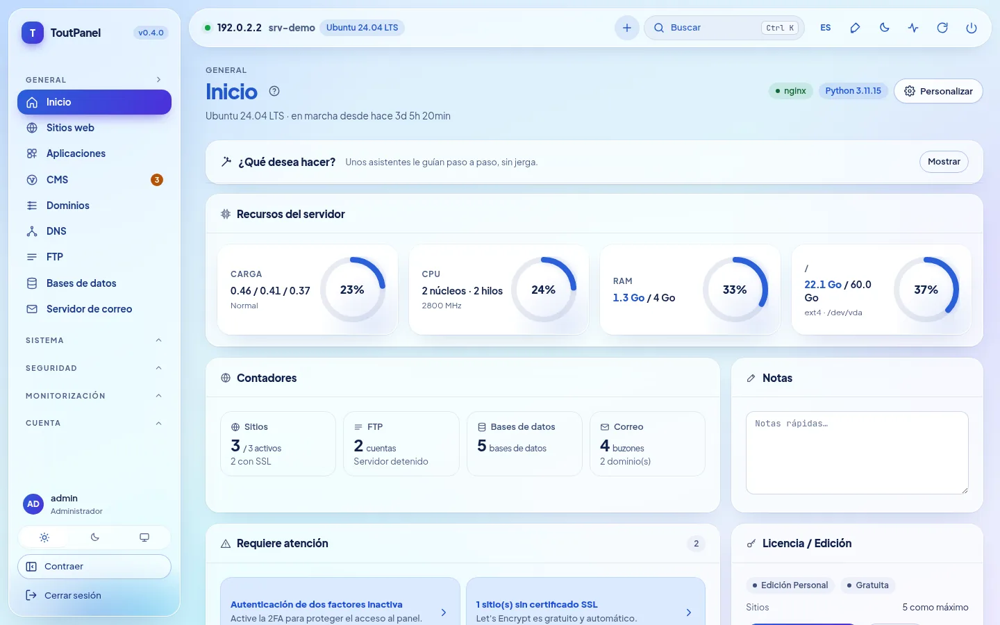

---

## ¿Qué es ToutPanel?

ToutPanel convierte un servidor recién instalado en una **plataforma de alojamiento web completa**, gestionada desde el navegador. Un solo comando instala la pila (por defecto Nginx, PHP-FPM, MariaDB, Redis o Valkey, Certbot, Fail2ban, o la pila que usted componga: perfiles, versiones, servidor web, FTP, correo, DNS, aceleradores), el panel y su servicio; después crea sus sitios, bases de datos, buzones de correo, zonas DNS y certificados en unos pocos clics, sin editar un solo archivo de configuración.

Está pensado tanto para quien aloja **sus propios sitios** (edición Personal gratuita, sin clave ni registro) como para las **agencias y proveedores de alojamiento** que revenden hosting: cuentas de revendedor y de cliente, planes y cuotas, facturación, marca blanca, multiservidor y alta disponibilidad (ediciones Profesional y Empresa).

Sus datos permanecen **en su servidor**: ninguna fuente tipográfica ni CDN externos en la interfaz, ninguna llamada al servidor de licencias mientras no se active ninguna licencia.

**Este README es deliberadamente completo y honesto.** Cada función está marcada como *(experimental)* cuando lo es, como **Pro** cuando requiere una edición de pago, y cada sección indica qué ha sido **realmente ejecutado** por las pruebas y qué solo se ha comprobado con simulaciones o no se ha comprobado en absoluto. La tabla [Qué se ha probado de verdad, simulado o sin probar](#qué-se-ha-probado-de-verdad-simulado-o-sin-probar) las reúne, y las [Limitaciones conocidas](#limitaciones-conocidas) enumeran las reservas. Si una función es crítica para usted, valídela en un servidor de pruebas antes de pasar a producción.

> **Este repositorio no contiene ningún código fuente.** Publica únicamente lo necesario para instalar el panel: los instaladores `install.sh` e `install.ps1`, el panel compilado (`dist/`, paquetes wheel de Python «solo bytecode»), las notas de versión, la licencia y `version.json`.

## Instalación rápida

**Linux** (como `root`, preferiblemente en un servidor recién instalado):

```bash
curl -sSL https://raw.githubusercontent.com/qu3ntin01/toutpanel/main/install.sh | sudo bash -s -- --lang es
```

La opción `--lang es` hace que el instalador (y el idioma inicial del panel) hable español.

**Windows** (PowerShell **como administrador**):

```powershell
Set-ExecutionPolicy Bypass -Scope Process -Force
iwr -useb https://raw.githubusercontent.com/qu3ntin01/toutpanel/main/install.ps1 | iex
```

Al final, el script muestra la URL del panel (con su **entrada secreta**), la cuenta de administrador y el enlace al **asistente de configuración**. Todo puede elegirse también mediante opciones: pila (`--profile`, `--web`, `--php`, `--db`, `--ftp`, `--mail`, `--dns`, `--accel`…), cortafuegos (`--firewall`), versión concreta (`--version`), idioma (`--lang`), carpeta (`--home`, `/var/toutpanel` por defecto) y contraseña sin mostrarla en la lista de procesos (`TOUTPANEL_PASSWORD`, `--password-file`, `--password-stdin`). El **[asistente de instalación](https://toutpanel.com/installation-assistant)** genera la línea de comandos con menús. Detalles, requisitos previos, puertos y solución de problemas: [Instalación completa](#instalación-completa).

## Vista general

| | |
|---|---|
| **Sistemas** | Linux: Debian 11+, Ubuntu 20.04+, AlmaLinux / Rocky Linux / RHEL / CentOS Stream / Oracle Linux 8+, Fedora, con otras familias en pila reducida (openSUSE, Arch, Alpine, Amazon Linux…) y un **nivel de soporte** visible (`toutpanel compat`); Windows 10 / 11, Windows Server 2016 → 2025 (menos probado que Linux) |
| **Servidores web** | Nginx, Apache, Nginx + Apache, **Caddy**\*, **OpenLiteSpeed**\* (LSPHP, LSCache), **LiteSpeed Enterprise**\* (producto comercial, nunca arrancado en nuestras pruebas: véanse las [limitaciones](#limitaciones-conocidas); `--web litespeed` exige `--accept-litespeed-license`), IIS (básico); Apache + mod_php *próximamente* |
| **Pila de software** | **compositor**: perfiles, versiones, esquema, instalación reanudable, estado real; aceleradores (OPcache, JIT, Redis / Valkey, Memcached, Varnish\*, Brotli, Zstandard\*, HTTP/3\*) |
| **PHP** | de 5.6 a 8.5 en paralelo, 138 extensiones en el catálogo, una versión por sitio, `php.ini` y pool FPM por sitio |
| **Aplicaciones** | runtimes Node.js, Python (WSGI / ASGI), Ruby, Go, Java, .NET con versión por sitio, systemd, PM2, Passenger; Docker y Compose; despliegue Git atómico |
| **Bases de datos** | MariaDB, MySQL (de la distribución, o 8.4 / 9.x de Oracle\*), Percona Server\*, PostgreSQL, MongoDB, SQLite, Redis / Memcached por cuenta |
| **FTP, DNS, correo** | FTP: integrado, Pure-FTPd\*, ProFTPD\*, vsftpd\*, solo SFTP\* · DNS: BIND, PowerDNS, Knot · correo: Postfix + Dovecot, Exim\* · un solo motor a la vez, cambio con vuelta atrás · webmail Roundcube, SnappyMail, SOGo\* |
| **Cortafuegos y seguridad** | cortafuegos gestionado (nftables, ufw, firewalld, CSF, iptables) **o externo**, salvaguarda contra bloqueos; Fail2ban; WAF integrado, ModSecurity, ToutWAF; antimalware; aislamiento de cuentas (**equivalente parcial** de CageFS) |
| **CMS** | 595 CMS y aplicaciones en el catálogo (582 verificados: 536 gratuitos, 46 comerciales), versión a elegir, instalaciones con seguimiento y actualizaciones |
| **Interfaz** | **interfaz en 10 idiomas**, 13 temas claro / oscuro (**Horizon** por defecto), color de acento libre, **16 asistentes** guiados, **Diagnóstico de 844 comprobaciones**, accesibilidad orientada a WCAG 2.1 AA (**sin auditar**) |
| **Documentación** | redactada en francés; traducida al inglés, alemán, español, italiano, neerlandés, portugués, ruso, chino y árabe al **79 % de las páginas** (75 de 94, para cada uno de estos 9 idiomas); las 19 páginas restantes (sección Referencia: API, códigos de error, plantillas…; páginas del Diagnóstico) permanecen en francés con un aviso; el catálogo del Diagnóstico y los mensajes de la API están traducidos a los 10 idiomas |
| **Instaladores** | `install.sh` e `install.ps1` en 10 idiomas (inglés por defecto, `--lang` / `--fr`…, `TOUTPANEL_LANG`, idioma del sistema), opciones de pila y de cortafuegos, versión concreta (`--version`), [asistente de instalación](https://toutpanel.com/installation-assistant) que genera el comando |
| **Automatización** | API REST (1016 operaciones OpenAPI), CLI `toutpanel`, webhooks firmados, scripts previos / posteriores a la acción, Ansible y Terraform, **Marketplace de 800 módulos** de integración (madurez visible) |

<sub>\* *experimental*: real, pero menos probado o con limitaciones declaradas en la interfaz y en las [limitaciones conocidas](#limitaciones-conocidas).</sub>

## Novedades de la 0.5

La **0.5.0** es la versión **estable** (rama [`main`](https://github.com/qu3ntin01/toutpanel/tree/main)); recoge las versiones preliminares **0.5.0b1** (sección **Analytics**) y **0.5.0b2** (**integración con ToutWAF**, SSL gestionado desde ToutWAF), y añade la **sección «Servidor web» de ToutWAF** y **correcciones de seguridad** derivadas de una revisión independiente. Cada fila indica lo que es real y lo que no: «nuevo en 0.5» significa real y probado, pero menos contrastado que las funciones de la 0.4.

| Novedad | Madurez y reservas |
|---|---|
| **Analytics** (Monitorización → Analytics): estadísticas de visitas **autoalojadas**, al estilo de Google Analytics — visitantes en línea, origen del tráfico, audiencia, páginas, eventos, objetivos y embudos, informes técnicos, comparación de periodos, filtros, exportaciones CSV / JSON, informes por correo electrónico, alertas, enlace para compartir en solo lectura; **sin cookies por defecto, dirección IP nunca conservada** | **nuevo en 0.5**: motor y API probados (≈ 560 pruebas); recorridos de extremo a extremo en un **Chromium real** contra un **panel real** (130 visitantes, 427 páginas vistas, 54 verificaciones iguales a la verdad de referencia); rastreador contrastado solo con Chromium (Safari y Firefox sin probar); la duración y el tiempo real exactos requieren el rastreador, los registros por sí solos dan páginas vistas; sin cookies, no hay visitantes recurrentes de un día a otro |
| **Mapa mundial**: 236 países, zoom, continentes, ciudades agrupadas, llegadas animadas en tiempo real, temas claro y oscuro | **nuevo en 0.5**: fluidez medida con renderizado por software, **no en una tarjeta gráfica real** |
| **Geolocalización DB-IP** instalada por el panel (países, ciudades, redes; CC BY 4.0, actualización mensual) | **nuevo en 0.5**: lector validado con la base de Países **real**; bases de **Ciudades y Redes** validadas solo con archivos sintéticos; sin base, los países son «desconocidos» |
| **Variante Proxy**: el rastreador lo sirve el propio sitio (contra los bloqueadores de publicidad) | Nginx y Apache validados con **servidores reales**; Caddy: solo renderizado y sintaxis; **OpenLiteSpeed, LiteSpeed Enterprise e IIS no admitidos** (código que se pega a mano) |
| **Integración con ToutWAF**: creación de sitios desde ToutWAF (token de API limitado entregado al enlazar, reenvío sin duplicados mediante `Idempotency-Key`, esquema publicado del formulario de creación), **SSL gestionado desde ToutWAF** (ToutWAF termina el HTTPS, la página SSL del panel gestiona los certificados en ToutWAF), interruptores global y por servidor del clúster, **sección «Servidor web» de ToutWAF** (token predefinido de alcance reducido, `GET /api/capabilities`, `GET /api/sites/{id}`, progreso de las tareas, `toutpanel waf connect --ssl toutwaf|panel`, `toutpanel waf status`) | **nuevo en 0.5**: probada contra un **ToutWAF simulado** que sigue el contrato descrito por sus desarrolladores (≈ 500 pruebas); **nada probado contra un ToutWAF real** (ni la sección «Servidor web», ni el SSL gestionado); rutas de renovación, de opciones HTTPS y de capacidades de la API de certificados de ToutWAF pendientes de confirmar; interfaz SSL no verificada en un navegador |
| **Correcciones de seguridad** (revisión independiente, dos pasadas): elevación de alcance de un token de API (presente desde la 0.4.0), token ToutWAF compuesto, registros y clave privada TLS de un sitio, datos de Analytics de un sitio eliminado, lectura de `X-Forwarded-For`, idempotencia por token, límites de ingesta de Analytics | **real**: una prueba de no regresión por corrección; detalle y gravedad en el [registro de cambios](CHANGELOG.md); revisión no exhaustiva (validación de las directivas de vhost y ReDoS de los analizadores sin examinar) |
| **Traducciones**: interfaz y mensajes del servidor en los 10 idiomas, página Analytics de la documentación en 9 idiomas | documentación traducida en el **79 % de las páginas** (75 de 94); las 19 páginas de referencia restantes (catálogos del Diagnóstico, códigos de error, API, ajustes, plantillas) siguen en francés |

## Novedades de la 0.4

La **0.4.0** es la versión **estable** anterior (las versiones 0.4.0b1 y 0.4.0b2 eran versiones preliminares del canal `dev`). Cada función indica su madurez: **estable**, **experimental** (real y probada, pero menos contrastada o con limitaciones declaradas) o **próximamente** (visible, atenuada, nunca simulada). La columna de la derecha indica lo que está reservado o limitado; el detalle honesto de cada punto está en la sección correspondiente de las [Funcionalidades](#funcionalidades).

| Novedad | Madurez y reservas |
|---|---|
| **Escucha HTTP y HTTPS simultánea** del panel (8888 / 8443, certificado autofirmado al principio); certificado Let's Encrypt del panel con la autoridad que elija, DNS-01, wildcard y **recarga en caliente** | estable; probado con Pebble (servidor ACME de pruebas), no con el Let's Encrypt real |
| **Instalación de una versión concreta**: `--version X.Y.Z`, `--list-versions`; **carpeta `/var/toutpanel` por defecto** | estable |
| **Cortafuegos gestionado por el panel o externo**, página dedicada, puertos que abrir, **salvaguarda contra bloqueos de 60 s** | estable; reglas probadas con nftables / iptables reales en un espacio de nombres de red privado |
| **Compositor de pila**: perfiles, versiones, esquema de arquitectura, estimación de memoria / disco, **asistente de primera configuración en 9 pasos**, página **Pila de software** | estable |
| **Motores DNS**: BIND, PowerDNS, Knot DNS (cambio con migración de las zonas y de las claves DNSSEC, vuelta atrás) | estable; probados con los demonios reales en Ubuntu 24.04 |
| **Motores de correo**: Postfix + Dovecot, relé externo, **Exim + Dovecot**; **motores FTP**: integrado, **Pure-FTPd, ProFTPD, vsftpd, solo SFTP** | Postfix y FTP integrado: estable; Exim y los demás motores FTP: **experimental** |
| **Servidores web**: **OpenLiteSpeed** (LSPHP, LSCache), **Caddy**, **LiteSpeed Enterprise** (cambio desde / hacia Nginx, Apache, «ambos» con vuelta atrás) | **experimental**; OpenLiteSpeed y Caddy probados de verdad en Ubuntu 24.04; **LiteSpeed Enterprise nunca llegó a arrancar** (licencia de prueba rechazada), solo su instalación oficial y la validación de su configuración se ejecutaron realmente |
| **Aceleradores**: OPcache, JIT, APCu, Redis / Valkey, Memcached, caché FastCGI, Brotli; **Varnish, Zstandard, HTTP/3** (incluido el Nginx de nginx.org instalable con salvaguardas) | Varnish, Zstandard, HTTP/3: **experimental**; los demás: estable |
| **Bases de datos**: MariaDB 10.6 → 11.8, **MySQL 8.4 / 9.x** (repositorio de Oracle), **Percona Server**, PostgreSQL 13 → 18; **contraseñas de bases de datos cifradas en reposo** | MySQL de Oracle y Percona: **experimental** (nunca instalados ni arrancados en nuestras pruebas) |
| **Aislamiento de cuentas**: servicio PHP-FPM por cuenta en su propia rebanada cgroup, endurecimiento systemd, **jaula del sistema de archivos** (bind mounts + bubblewrap) | opciones, **desactivadas por defecto**; **equivalente parcial de CageFS** (kernel y red compartidos); sin probar: SELinux enforcing con este aislamiento (SELinux Enforcing está validado sin él en AlmaLinux, véase [Seguridad](#section-12)), cgroup v2 con límites realmente aplicados, servidor completo bajo systemd |
| **Runtimes por sitio** (Node.js, Python, Go, Java, Ruby, .NET), **WSGI / ASGI**, **PM2**, **Passenger** | real: Node 20, Python 3.12, gunicorn, uvicorn, PM2, Nginx + Passenger; Go, Java, .NET simulados; Ruby sin compilar |
| **Estadísticas**: GoAccess, **AWStats**, Matomo; **preproducción** con base de datos y sincronización en ambos sentidos | GoAccess, AWStats y preproducción (MariaDB) probados de verdad; Matomo **nunca contrastado** con una instancia real |
| **Copias de seguridad**: cifrado AES-256-GCM, incrementales nativas, destinos **rsync** y **Borg**, perfil «servidor completo», copia parcial / modo estricto, prueba de restauración | rsync y Borg 1.2.8 probados de verdad; restic, S3, B2 y rclone **simulados**; rsync / Borg y restic: **Pro** |
| **Mensajería**: límite de envío del `mail()` de PHP, **DMARC por dominio**, **BIMI**, **DANE**, MTA-STS / TLS-RPT, **SpamAssassin**, **SOGo**, cola de correo y CalDAV / CardDAV probados | SOGo **experimental** (`sogod` nunca ejecutado); cadena VMC de BIMI y firma DNSSEC sin verificar |
| **Migración**: importación **ISPConfig** completa (SSH, archivo, volcado SQL), transferencia de un sitio o dominio entre clientes, **migración de cuentas entre servidores ampliada** (correo, FTP, cron, SSL, plan) | **Pro**; cPanel / Plesk / DirectAdmin probados con archivos **fabricados**; nunca probado en dos servidores físicos |
| **Alta disponibilidad**: IP flotante keepalived / VRRP, almacenamiento compartido NFS / GlusterFS, replicación Dovecot, historial por nodo, plantilla Zabbix, **autorreparación ampliada** | **Pro**; configuraciones validadas con las herramientas reales, **ninguna conmutación probada entre dos máquinas** |
| **Autenticación**: SSO SAML / OIDC / LDAP probados con proveedores de prueba, WebAuthn probado con un autenticador virtual, **TLS reforzado**, **alertas de inicio de sesión inusual** al titular | SSO: **Pro**; ningún proveedor de identidad de producción ni llave física probados |
| **Diagnóstico** (Sistema › Diagnóstico): **844 comprobaciones**, **90 correcciones automáticas** con vista previa, **16 asistentes** de configuración guiados con prueba real | programación del Diagnóstico: **Pro**; una parte de las comprobaciones se prueba con servicios simulados |
| **Mensajes del servidor traducidos** a los 10 idiomas; **ToutWAF remoto**; compatibilidad ampliada de distribuciones; **instalador multilingüe** con opciones de pila | estable; algunos mensajes compuestos dinámicamente siguen en francés |
| **Marketplace** de 800 módulos de integración (facturación, pasarelas, supervisión, CI/CD, IaC, SSO, DNS / CDN, copias de seguridad, temas…) | **5 estables**, 199 beta, 596 **generados** (nunca probados con el servicio real) |
| Apache + mod_php | **próximamente** (rechazado limpiamente, nunca simulado) |

Detalle y limitaciones: [Limitaciones conocidas](#limitaciones-conocidas) · [CHANGELOG.md](CHANGELOG.md).

## Funcionalidades

El esquema sigue las **20 secciones** de un referencial de panel de alojamiento completo (desde el nivel de cPanel / Plesk / ISPConfig / DirectAdmin hasta las funciones avanzadas), y después el ecosistema. En cada sección, la línea «**Real / límites**» indica con honestidad qué se ha ejecutado y qué no. Documentación detallada de cada página: **[toutpanel.com/docs](https://toutpanel.com/docs/)** (también servida por el panel bajo `/help/` cuando se construye durante la instalación, con ayuda contextual en cada página).

<a id="section-1"></a>

### 1. Cuentas, usuarios y multi-tenant

- Jerarquía **administrador → revendedor (Pro) → cliente → subusuario**; un revendedor solo ve y crea dentro de su ámbito.
- **RBAC detallado**: permisos por módulo y por acción, intersección del rol, del plan, del perfil de acceso y del padre; perfiles integrados **Completo, Desarrollador, Contable, Webmaster, Solo lectura** y perfiles personalizados.
- **Planes y cuotas**: disco, inodos, tráfico, sitios, dominios, bases de datos (y tamaño por base), dominios y buzones de correo, tareas programadas, cuentas FTP, zonas DNS, copias de seguridad, subusuarios; cuotas contabilizadas y bloqueantes en la creación. El tráfico mensual no corta el sitio: dispara una alerta, la facturación del exceso y la suspensión automática si usted la activa.
- **Límites de recursos por cuenta**: usuario del sistema dedicado, rebanada systemd (CPU, memoria, E/S, procesos) aplicada a las tareas programadas, despliegues Git, aplicaciones, terminal e instancias Redis / Memcached; **a las peticiones PHP solo con el aislamiento «servicio PHP-FPM por cuenta»** (opción, desactivada por defecto). Límite de conexiones simultáneas por sitio: **solo Nginx**.
- **Suspensión** y reactivación, manuales o automáticas (impago, exceso de cuota tras un plazo de gracia).
- **Inicio de sesión «como»** (suplantación) registrado en el registro de auditoría y limitado en el tiempo.
- **Transferencia** de un sitio o de un dominio de un cliente a otro: archivos, FTP, copias de seguridad, bases de datos, zonas DNS, dominios de correo, tareas programadas, preproducción, proyectos Compose; propiedad de los archivos, vhost y pool PHP-FPM regenerados, cuotas verificadas, vista previa antes de ejecutar.
- **Creación masiva** (hasta 500 cuentas), **importación / exportación CSV** (1 000 filas, protección contra la inyección de fórmulas, UTF-8 / UTF-16 / Windows-1252), **notas internas** y **etiquetas** (tags) filtrables.

> **Real / límites**: la jerarquía, los permisos, las cuotas, la suspensión y la transferencia están cubiertos por pruebas de API, y los perfiles se verifican ruta por ruta. `setquota` (cuotas de disco e inodos del sistema de archivos) solo se ha verificado con un ejecutor simulado y presupone un sistema de archivos montado con `usrquota`. Los cgroups v2 reales con límites aplicados no se han probado. La suspensión de una cuenta en el maestro no se propaga a sus cuentas espejo en los nodos; los sitios alojados en un nodo no se pueden transferir entre clientes.

<a id="section-2"></a>

### 2. Autenticación y acceso al panel

- **2FA TOTP** con códigos de recuperación, imponible por rol o por plan; **llaves de seguridad WebAuthn / FIDO2 y passkeys** (incluidas en la edición Personal).
- **SSO empresarial (Pro)**: **OpenID Connect** (descubrimiento, PKCE), **SAML** (metadatos, antirreproducción, grupo → rol), **LDAP / Active Directory** (LDAPS / StartTLS con **verificación del certificado por defecto**); un inicio de sesión SSO nunca concede por defecto el rol de administrador.
- **Restricción de acceso** al panel mediante lista blanca de direcciones IP / CIDR y por país (GeoIP, base de datos MaxMind que debe aportar usted) con **rechazo a guardar una regla que excluiría al administrador**.
- **Protección contra fuerza bruta**: bloqueo persistente por IP y por cuenta, tiempo de respuesta constante, **captcha ALTCHA** autoalojado tras N fallos, jail Fail2ban del panel, alerta de ráfaga de fallos.
- **Sesiones**: lista, revocación (también desde el lado del administrador), caducidad absoluta y por inactividad.
- **Política de contraseñas**: longitud, clases de caracteres, palabras comunes, nombre de usuario, **Have I Been Pwned** con k-anonimato (desactivable), historial, caducidad; **restablecimiento** mediante enlace firmado de un solo uso.
- **Registro de inicios de sesión** y **alertas de inicio de sesión inusual** (nueva dirección IP, nuevo país, nuevo dispositivo) enviadas al administrador **y al titular de la cuenta** (desactivable por cuenta, correo electrónico o SMS).
- **Panel en HTTPS**: escucha HTTP y HTTPS simultánea, certificado autofirmado con SAN al principio (regenerado si cambia la dirección), después **Let's Encrypt para el nombre de host del panel** (ZeroSSL, Buypass o ACME personalizado, DNS-01 y wildcard) con recarga en caliente; **entrada secreta** en la URL (sin ella, el panel responde 404).

> **Real / límites**: TOTP, bloqueo, sesiones, política de contraseñas: probados. **WebAuthn**: probado con un autenticador virtual de Chromium (registro e inicio de sesión reales), **no con una llave física**. **OIDC**: probado contra un servidor OIDC local real (PKCE verificado, tokens falsificados rechazados); **SAML**: probado con un proveedor de identidad de prueba (31 pruebas: aserción válida, caducada, reproducida, falsificada…); **LDAP**: probado contra un OpenLDAP real (`slapd`); **ningún proveedor de identidad real** (Keycloak, Entra ID, Okta…) se ha probado. El **nuevo país** se detecta con una base MaxMind de prueba real. Let's Encrypt del panel: probado con **Pebble** + certbot 5.8 + BIND, **no** con el servicio real. La biblioteca SAML (`python3-saml` + `xmlsec1`) es opcional; el panel arranca sin ella.

<a id="section-3"></a>

### 3. Web y alojamiento de sitios

- **Sitios en un clic**: multidominio, alias, **dominios aparcados**, dominios **redirigidos**, **wildcard** (`*.ejemplo.com`), PHP-FPM, estático, reverse proxy, aplicaciones. Un subdominio es un nombre de dominio del sitio o un sitio independiente.
- **Servidores web**: vhosts **Nginx, Apache, Nginx + Apache, Caddy\*, OpenLiteSpeed\*, LiteSpeed Enterprise\* o IIS** generados a partir de plantillas Jinja2 y **validados antes de recargar** (`nginx -t`, `apachectl -t`, `caddy validate`…), con vuelta a los últimos vhosts válidos en caso de fallo; **cambio** Nginx ↔ Apache ↔ «ambos» ↔ Caddy ↔ OpenLiteSpeed ↔ LiteSpeed con vuelta atrás; las funciones que un servidor no reproduce (WAF integrado, ModSecurity, filtrado por país, `.htaccess`…) se **señalan**, nunca se ignoran en silencio.
- **PHP multiversión** 5.6 → 8.5 en paralelo (Sury, PPA ondrej, Remi, windows.php.net), una versión y **un pool PHP-FPM por sitio**, bajo el usuario de la cuenta; **`php.ini` por sitio** (13 directivas permitidas, entre ellas `disable_functions` y `open_basedir`, validadas contra la inyección), **138 extensiones** en el catálogo (gestionadas por versión de PHP, administrador), ionCube, **parámetros FPM** (`pm`, `max_children`, `start_servers`, timeouts, `max_requests`…).
- **Runtimes de aplicaciones**: Node.js, Python (**WSGI / ASGI**: gunicorn, uvicorn, hypercorn, daphne, waitress), Ruby, Go, Java, .NET, con **versión de runtime por sitio** (descargas oficiales verificadas por SHA-256, `uv` para Python, nunca compilación; nvm, pyenv, etc. detectados), unidad **systemd**, **PM2**, **Phusion Passenger** (Nginx y Apache), proxy hacia un puerto o un socket Unix (WebSocket incluido), recarga sin corte, `toutpanel runtimes`.
- **Reverse proxy** hacia un puerto o un socket, **reparto de carga** (round robin, `least_conn`, `ip_hash`).
- **Redirecciones** 301 / 302 (con o sin query string, expresiones regulares), forzado de HTTPS, host canónico `www`.
- **Cabeceras HTTP** personalizadas (CSP, X-Frame-Options…) y **HSTS** (duración ajustable, `includeSubDomains`, `preload` con confirmación y comprobación previa).
- **Directivas Nginx / Apache / Caddy personalizadas por vhost** (administrador): escritura, regeneración, prueba del servidor, **restauración automática** si el servidor las rechaza.
- **Directorios protegidos** con contraseña (bcrypt) y reglas de acceso por IP, **páginas de error** personalizadas, **anti-hotlink**, **modo mantenimiento** (503 con `Retry-After`, IP autorizadas).
- **HTTP/2**, **HTTP/3 / QUIC\*** (nativo con Caddy y OpenLiteSpeed; con Nginx compilado con QUIC, o con el Nginx de nginx.org instalable desde la página Aceleradores con simulación, copia de seguridad y vuelta atrás; imposible solo con Apache), compresión **Brotli** (si el módulo existe), **Gzip**, **Zstandard\***.
- **Caché**: caché FastCGI (Nginx), **OPcache**, **Redis / Valkey**, **Memcached**, **Varnish\*** (solo HTTP), LSCache (OpenLiteSpeed y LiteSpeed Enterprise), con **purga desde el panel** (botón «Vaciar la caché» por sitio y por acelerador).
- **Preproducción (staging)**: clonación de un sitio (archivos + base de datos), sustitución de URL **sin wp-cli** (valores PHP serializados incluidos), tablas excluidas, sincronización **hacia producción, desde producción o en ambos sentidos** (archivos: prevalece el más reciente; base de datos fusionada fila a fila por clave primaria, regla de conflicto a elegir, **eliminaciones nunca propagadas**), copia de seguridad previa de ambos lados.
- **Raíz del sitio** configurable (`public/`, `web/`…), **registros de acceso y de errores por sitio** consultables en directo y descargables (rotación con logrotate).
- **Estadísticas de tráfico** con tres motores: **GoAccess**, **AWStats**, **Matomo** «para este sitio»; **seguimiento del ancho de banda** por sitio, mes a mes.

> **Real / límites**: Nginx: vhosts servidos por un **Nginx real** y consultados con curl (redirecciones, 401 / 403, anti-hotlink, mantenimiento, wildcard, páginas de error). Apache: vhost validado con `apache2 -t`, **nunca servido de verdad** en nuestras pruebas; Nginx delante de Apache: nunca lanzados juntos; el cambio Nginx / Apache se prueba con un ejecutor simulado y la sintaxis real de los vhosts. OpenLiteSpeed: OpenLiteSpeed real arrancado que sirve PHP, estático, redirección, autenticación, LSCache. **Caddy**: Caddy 2.11 real (HTTP, HTTPS, HTTP/2, HTTP/3, PHP-FPM, proxy, recarga sin corte) en Ubuntu 24.04; familia RHEL, ACME real sin ejecutar. **LiteSpeed Enterprise: nunca arrancado** (véanse las [limitaciones](#limitaciones-conocidas)). `disable_functions` / `open_basedir`: verificados con un PHP-FPM real. Instalación de las versiones de PHP desde los repositorios: no ejecutada en nuestras pruebas (Internet). **Runtimes**: real para Node 20, Python 3.12, gunicorn, uvicorn, PM2 y Nginx + Passenger; **Go, Java y .NET simulados**, Ruby sin compilar, unidad systemd de una aplicación no arrancada. **HTTP/3**: binario Nginx 1.31 real sirviendo HTTP/3 a un cliente QUIC; la instalación del paquete nginx.org en la máquina no se ha ejecutado. Brotli depende del módulo de Nginx. Memcached y Varnish (VCL compilada por `varnishd` 7.1): ejecutados de verdad, pero la puesta en servicio completa de Varnish delante de Nginx no. **GoAccess y AWStats**: ejecutados de verdad; **Matomo: nunca contrastado con una instancia real** (servidor de API falso). **Preproducción**: probada en una instancia MariaDB real; la fusión fila a fila solo vale para MySQL / MariaDB (PostgreSQL y SQLite se copian sin sustitución de URL). El HTTP/3 de Apache y la caché FastCGI de Apache no existen.

<a id="section-4"></a>

### 4. SSL / TLS

- **Let's Encrypt**, **ZeroSSL** (EAB), **Buypass**, servidor ACME personalizado; validación **HTTP-01** y **DNS-01** (escritura del TXT en BIND / PowerDNS o en Cloudflare, OVH, Route53), certificados **wildcard**, certificados **SAN / multidominio** (todos los nombres, alias y dominios aparcados del sitio).
- **Renovación automática** diaria con recarga de los servicios afectados (servidor web, correo, FTP, panel) y **alerta en caso de fallo**; **alertas antes de la caducidad** a 30 / 14 / 7 / 1 días (ajustables).
- **Importación** de certificados comerciales (CRT, clave, cadena, **PFX**) y **generación de CSR** (RSA / EC, SAN, clave privada conservada en el servidor); certificados autofirmados; página **Certificados** con validez, emisor y caducidad de todos los certificados.
- **SSL para los servicios**: correo (SNI Postfix / Dovecot), FTP / FTPS, panel, nombre de host.
- **TLS reforzado**: perfiles Mozilla (moderno = solo TLS 1.3, intermedio por defecto, antiguo), suites personalizadas validadas, **grapado OCSP** ajustable, curvas y DH ffdhe2048, `ssl_session_tickets off`, HSTS por sitio.

> **Real / límites**: probado con **Pebble** (servidor ACME de Let's Encrypt), el certbot 5.8 real y un BIND real: HTTP-01, DNS-01, wildcard, renovación, fallo, EAB. **No se ha ejecutado ninguna emisión ante el Let's Encrypt, ZeroSSL ni Buypass reales.** DNS-01 exige que la zona del dominio esté gestionada por el panel (o por un proveedor configurado). TLS: verificado con un Nginx real, `openssl s_client` (protocolos y suites realmente ofrecidos por perfil), un respondedor OCSP real y `apache2 -t`; la adaptación a OpenLiteSpeed y Caddy no está probada; sin criptografía poscuántica. Los certificados FTP no están vigilados por las alertas de caducidad.

<a id="section-5"></a>

### 5. DNS

- Zonas servidas por **BIND, PowerDNS o Knot DNS** (un solo servidor local a la vez; cambio con migración de las zonas y de las claves DNSSEC, vuelta atrás) o enviadas a un proveedor.
- **14 tipos de registros**: A, AAAA, CNAME, MX, TXT, SRV, NS, CAA, PTR, TLSA, DS, SSHFP, HTTPS, SVCB, con validación detallada; **plantillas de zona** aplicadas en la creación (variables `{domain}`, `{ip}`, `{mail}`…).
- **DNSSEC**: firma automática (BIND `dnssec-policy`, Knot KASP, PowerDNS), DS y DNSKEY mostrados para el registrador, rotación manual (BIND, Knot; **PowerDNS: rotación fuera del panel**).
- **Servidores secundarios** mediante TSIG (AXFR + NOTIFY), automáticos en los nodos del parque (**Pro**).
- **Proveedores externos** mediante API: **Cloudflare, OVH, Route 53, PowerDNS** (envío e importación de zonas); zonas externas: lista, exportación (BIND, CSV, JSON) y **verificación de propagación con `dig`**.
- **Importación / exportación BIND**, TTL por registro y por zona, **números de serie automáticos** (`AAAAMMDDnn`), **DNS inverso (PTR)** de las IP del servidor, **verificación de propagación** (1.1.1.1, 8.8.8.8, 9.9.9.9 y servidor local) y validación de la sintaxis (`named-checkzone` antes de recargar).
- **Registros de correo automáticos**: MX, SPF, DKIM, DMARC, SRV IMAP / SMTP / POP3, `autoconfig` / `autodiscover`, MTA-STS, TLS-RPT, CalDAV / CardDAV; IPv6, nombres internacionales (IDN), host de correo fuera de la zona.

> **Real / límites**: BIND, PowerDNS y Knot reales (`named-checkzone`, `dig`, ciclo de cambio BIND → PowerDNS → Knot que conserva el mismo DS). Las **API de Cloudflare, OVH, Route 53 y PowerDNS se han probado con un transporte simulado**, nunca con los servicios reales. El **clúster de servidores secundarios** nunca ha funcionado con dos servidores DNS reales. El PTR solo es efectivo si el bloque de direcciones le ha sido delegado: el panel no puede solicitarlo a su proveedor. La propagación no controla los tipos PTR, TLSA, DS, SSHFP, HTTPS y SVCB.

<a id="section-6"></a>

### 6. Mensajería

- **Postfix + Dovecot + OpenDKIM**, Rspamd o SpamAssassin, **Exim + Dovecot\*** a elegir (subconjunto de Postfix, limitaciones declaradas), relé externo; dominios, **buzones con cuotas**, **alias**, **redirecciones**, **dirección comodín (catch-all)**, **listas de distribución** (mlmmj), **respuesta automática con rango de fechas**, **filtros Sieve** (reglas guiadas o script, ManageSieve), IMAP / POP3 sobre TLS, envío 587 / 465.
- **Webmail** Roundcube, SnappyMail o **SOGo\*** instalado en un clic, con **inicio de sesión directo desde el panel**.
- **SPF, DKIM** (generación, **rotación con doble publicación**), **DMARC por dominio** (`none` / `quarantine` / `reject`, `pct`, `rua`, `ruf`, `sp`, `adkim`, `aspf`, `fo`, **aplicación progresiva guiada**), **MTA-STS** y **TLS-RPT**, **BIMI** (logotipo SVG alojado por el panel, publicado solo con un DMARC de aplicación al 100 %), **DANE** (TLSA `3 1 1` para los puertos de correo, **rotación en dos tiempos**).
- **Antispam** Rspamd (ajustes por dominio y por buzón, aprendizaje spam / ham) o **SpamAssassin** gestionado (spamd, `spamass-milter`, `user_prefs` por buzón; amavis experimental), **antivirus ClamAV**, **greylisting**, **RBL / DNSBL**, **listas blancas y negras** globales, por dominio o por buzón.
- **Limitación de la tasa de envío**: por buzón, por plan y por defecto (usuario SMTP autenticado, mediante Rspamd) **y límite del `mail()` de PHP por sitio y por cuenta** (envoltorio `sendmail` del panel: registro, topes a 1 h y 24 h, alerta, protección contra la inyección de cabeceras) para que un sitio pirateado no envíe spam.
- **Relé saliente / smarthost**, **cola de correo** (flush, suspensión, eliminación), **registro y seguimiento de un mensaje**, **autoconfiguración** de los clientes (Outlook, Thunderbird), **fetchmail**, **CalDAV / CardDAV** (Radicale), **vigilancia de la reputación de la IP** (listas negras, en todas las direcciones públicas del servidor y las IP de salida de los nodos).

> **Real / límites**: la cola de correo se prueba con un **Postfix real**; Dovecot: configuración validada con `doveconf`; CalDAV / CardDAV: **Radicale 3.8 real**; SpamAssassin: `spamassassin --lint`, `spamd` y `spamc` reales; el `mail()` de PHP: envoltorio ejecutado de verdad con el `mail()` real de PHP. **Simulados**: Rspamd, ClamAV, mlmmj, fetchmail, los montajes `spamass-milter` / amavis; **SOGo: experimental, `sogod` nunca ejecutado**. BIMI: la **cadena del certificado VMC no se verifica**; DANE: la firma DNSSEC no se verifica (DANE solo tiene sentido con DNSSEC). El límite del `mail()` de PHP **no ve** un script que llame directamente a `sendmail` o abra una conexión SMTP. Con Exim: sin seguimiento de mensajes ni listas de distribución; con SpamAssassin: sin límite de tasa por buzón ni greylisting. Los informes DMARC recibidos no se analizan. La publicación DNS automática presupone que la zona está gestionada por el panel. Un servidor de correo fiable requiere una IP pública fija, un DNS inverso correcto y los puertos 25 / 465 / 587 abiertos.

<a id="section-7"></a>

### 7. Bases de datos

- **MariaDB (10.6 → 11.8), MySQL, Percona Server\*, PostgreSQL (13 → 18), MongoDB, SQLite**: bases de datos, usuarios y **privilegios** (completos, solo lectura, personalizados), **acceso remoto autorizado por IP** (regla de cortafuegos, `bind-address`, `pg_hba.conf`; `0.0.0.0/0` rechazado).
- **Adminer** (MySQL y PostgreSQL) y **phpMyAdmin** (MySQL) instalables en las versiones que elija, con compatibilidad PHP verificada, **inicio de sesión único (SSO) desde el panel**; **pgAdmin no está integrado**.
- **Importación / exportación** (gzip al vuelo), **volcado programado** (tarea programada), **mantenimiento** (verificación, reparación, optimización, análisis), **cuotas de tamaño** por base (privilegios retirados y luego restablecidos, alerta).
- **Elección de la versión del SGBD** (repositorios oficiales de MariaDB y PostgreSQL, cambio de versión mayor con **copia de seguridad previa**, sin posibilidad de volver a una versión anterior); MySQL 8.4 / 9.x (repositorio de Oracle) y Percona\*: un solo motor de la familia MySQL a la vez.
- **Servidores adicionales** (Docker), **Redis / Memcached por cuenta** (instancia aislada, socket Unix, `maxmemory` del plan, rebanada cgroup de la cuenta).
- **Replicación (Pro)**: MariaDB / MySQL (GTID) y PostgreSQL (streaming), asistente de comandos **y** replicación ejecutada por el panel, promoción manual o **conmutación automática** con reescritura del host de las bases de datos.
- **Contraseñas de las bases de datos cifradas en reposo** (Fernet, clave del panel respaldada), listas sin contraseña, **revelación explícita y registrada**.

> **Real / límites**: SQLite: real. **MariaDB**: una instancia real sirve para las pruebas de preproducción y del Diagnóstico, pero la capa de administración SQL (usuarios, privilegios, cuotas) se prueba sobre todo con un **ejecutor SQL simulado**; **PostgreSQL: simulado**; MongoDB (módulo `pymongo` opcional): probado con un cliente falso y, cuando la imagen está presente, un `mongod` 7 real en Docker. MySQL de Oracle y Percona: paquetes y repositorios verificados, **nunca instalados ni arrancados**. La replicación **nunca se ha montado entre dos servidores reales**, y la conmutación automática no es un consenso. Las **credenciales root de los motores se guardan en claro en `settings.json`** (permisos 0600); `mongodump` expone la contraseña como argumento de comando.

<a id="section-8"></a>

### 8. Archivos y acceso

- **Gestor de archivos**: subida, **editor CodeMirror** con resaltado de sintaxis, permisos (`chmod`) y propietario (`chown`), archivos zip / tar, **búsqueda** por nombre y en el contenido, **papelera**, **ocupación del disco y de los inodos por carpeta**, arrastrar y soltar, **corrección de los permisos y del propietario en un clic**.
- **Servidor FTP / FTPS integrado** (varias cuentas, directorio restringido, permisos, cuotas, IP autorizadas, registro) o **Pure-FTPd\*, ProFTPD\*, vsftpd\*, solo SFTP\*** (cuentas del panel sincronizadas, cambio con vuelta atrás).
- **SFTP / SSH enjaulado por usuario** (drop-in de `sshd` validado con `sshd -t` con vuelta atrás, montajes bind), **shell restringido** con jailkit o `rbash`, **claves SSH** (ed25519, ECDSA, RSA ≥ 2048).
- **Terminal web** (bash en Linux, PowerShell en Windows; un cliente permanece bajo el usuario de su cuenta).
- **Cuotas de disco e inodos** por cuenta, **WebDAV** con las cuentas FTP.

> **Real / límites**: FTPS: **handshake real** con certificado validado; terminal: bash real en PTY; jailkit: `jk_init` / `jk_jailuser` reales y shell enjaulado real cuando jailkit está instalado; WebDAV: `wsgidav` real (módulos opcionales `wsgidav` + `a2wsgi`). Motores FTP alternativos: ejecutados de verdad en Ubuntu 24.04, **familia RHEL sin contrastar**. El `sshd` real nunca se reinicia durante las pruebas; `setquota`: véase la sección 1. El terminal de Windows es simplificado sin el módulo `pywinpty`.

<a id="section-9"></a>

### 9. Aplicaciones y despliegue

- **Instalador en un clic**: catálogo de **595 CMS y aplicaciones** (véase [CMS](#cms)), entre ellos WordPress, Joomla, Drupal, PrestaShop, Nextcloud, Laravel, Symfony, Matomo, Dolibarr, Moodle, phpBB, MediaWiki, Ghost.
- **WP Toolkit**: wp-cli, actualizaciones del núcleo, de los plugins y de los temas, endurecimiento, clonación, **detección de instalaciones vulnerables** (feed de Wordfence Intelligence), alerta crítica.
- **Despliegue Git**: clonación y actualización (HTTPS con token o SSH con clave de despliegue por sitio), rama, etiqueta o commit, **webhooks GitHub / GitLab firmados**, **scripts posteriores al despliegue**, actualización programada, **despliegue atómico** (`releases/`, `shared/`, enlace `current`, vuelta atrás).
- **Composer, npm, pip** lanzados desde un sitio (lista blanca `install` / `ci` / `update`, bajo el usuario de la cuenta).
- **Docker**: contenedores, imágenes, **redes, volúmenes**, espacio en disco y limpieza, `docker run` validado, proyectos **Docker Compose** por cuenta con sitio proxy y rechazo de los YAML peligrosos (privilegiado, socket, montajes sensibles).
- **Asistentes** «sitio web», «instalación de aplicación», «despliegue Git», «PHP» (véase la [sección 19](#section-19)).

> **Real / límites**: Git: `git` real sobre un repositorio local (clonación, actualización, webhook firmado, despliegue atómico en un sistema de archivos real); **GitHub y GitLab reales nunca contactados**. `npm` y `pip` reales bajo el usuario del sitio; Composer: no ejecutado (sin phar en el entorno de pruebas). Docker: contenedores, imágenes, redes y volúmenes probados con un ejecutor simulado y, cuando un demonio responde, un ciclo Docker real. **Instalaciones de CMS: descargas simuladas** (ninguna instalación real del catálogo ejecutada de principio a fin por la suite automática); WordPress / wp-cli reales no ejecutados por las pruebas, salvo Matomo instalado de principio a fin por el asistente «aplicación».

<a id="section-10"></a>

### 10. Tareas programadas

- **Editor visual** campo por campo y **sintaxis cron en bruto** sincronizados, vista previa de las 5 próximas ejecuciones, atajos (`@daily`…), tipos: visitar una dirección, ejecutar un comando, hacer copia de seguridad de un sitio o de una base de datos.
- **Ejecución bajo el usuario de la cuenta o del sitio, nunca como root** para un cliente: el comando se **rechaza** en lugar de ejecutarse como root; `root` está reservado al administrador, con confirmación y rastro en el registro de auditoría; límites cgroup de la cuenta aplicados.
- **Planificador** a elegir: interno (APScheduler, por defecto), **temporizadores systemd** (`OnCalendar`, `Persistent=true`) o `/etc/cron.d`, con vuelta atrás reversible.
- **Notificación por correo electrónico** (nunca / error / siempre), **historial de ejecución** (estado, duración, código, inicio de la salida), **frecuencia mínima impuesta por el plan**, ejecución inmediata, **asistente** con prueba en seco.

> **Real / límites**: la comparación con el `systemd-analyze calendar` real (18 expresiones) y `systemd-analyze verify` son reales; **un temporizador systemd nunca se ha disparado de verdad**. Con el planificador interno, **las tareas no se ejecutan cuando el panel está detenido** (recuperación de menos de 5 minutos al reiniciar); no hay importación de un crontab existente. En Windows, las tareas de los clientes se rechazan.

<a id="section-11"></a>

### 11. Copias de seguridad y restauración

- **Granularidad**: sitio, base de datos, carpeta o archivo, buzón de correo, dominio de correo, cuenta, **servidor completo**; copia a demanda y **programaciones** con retención **GFS** (diaria, semanal, mensual).
- **Motor nativo (zip), incluido en todas las ediciones**: archivos con suma SHA-256 y control CRC, **cifrado AES-256-GCM** opcional (frase de contraseña, por defecto, por destino, por programación o por copia), **copias incrementales** (una completa y después incrementales, restauración del estado de cada copia, retención que preserva las cadenas). Destino: carpeta local.
- **Destinos remotos (Pro)**: **rsync** (carpeta o SSH, enlaces duros `--link-dest` o archivos cifrables), **Borg** (cifrado, deduplicado, local o SSH), **restic** (cifrado, deduplicado: S3 y compatibles, SFTP, Backblaze B2, y mediante rclone FTP / Google Drive / OneDrive / Dropbox / WebDAV). Secretos cifrados en la base de datos, nunca devueltos por la API.
- **Perfil «Servidor completo (configuración incluida)»**: vhosts generados, pools PHP-FPM, certificados y claves, DKIM, correo, DNS, FTP, crontabs, reglas de cortafuegos y datos del panel; **archivo cifrado obligatorio**, **restauración guiada** en un servidor nuevo (simulación, archivos sustituidos conservados como `.pre-restore-…`, servicios recargados). **No** incluye **ni el sistema, ni los paquetes, ni los propietarios de los archivos**.
- **Restauración granular** (explorar el archivo, elegir archivos, en su sitio o en una carpeta) y **en autoservicio por el cliente**, con ámbito controlado; **copias de seguridad de seguridad automáticas** antes de una operación de riesgo (restauración, eliminación, instalación, actualización de un SGBD).
- **Un volcado de base de datos fallido no se ignora**: copia «parcial» señalada (insignia, alerta) o rechazada en **modo estricto**; **verificación de integridad** (SHA-256, CRC, `restic check`), **prueba de restauración** (volcados reimportados en una base de datos temporal, muestra de archivos controlada por suma) e **informe semanal** (desactivados por defecto), **alertas de fallo**.
- **Instantáneas** Btrfs, ZFS o LVM opcionales para congelar la lectura durante una copia.

> **Real / límites**: archivos nativos, cifrado, cadenas incrementales, perfil de servidor completo: ejecutados de verdad; **rsync** (carpeta local y SSH mediante un `sshd` efímero) y **Borg 1.2.8** (local y SSH): reales, **nunca hacia un servidor remoto real**; Borg 2.x sin probar. **restic, S3, Backblaze B2 y rclone: comandos generados y verificados con un ejecutor simulado, nunca ejecutados contra un repositorio o servicio real.** Snapshots ZFS / LVM / Btrfs y prueba de restauración MySQL / PostgreSQL: ejecutor o SGBD simulado; `zfs send` no está implementado. El **nombre del archivo cifrado está en claro** (destino y fecha); rsync «tree» deposita archivos **en claro**; una frase de contraseña perdida deja los archivos ilegibles. El servidor completo no vuelve a aplicar automáticamente el cortafuegos. Las copias remotas, restic, Borg y rsync requieren la edición **Pro**; no confundir con la sincronización rsync / lsyncd de la alta disponibilidad, que no es un destino de copia de seguridad.

<a id="section-12"></a>

### 12. Seguridad del servidor y aislamiento

- **Cortafuegos** nftables, firewalld, UFW, CSF o iptables (detección automática) **gestionado por ToutPanel o externo** (grupo de seguridad de la nube, cortafuegos del proveedor: el panel no toca entonces ninguna regla y enumera los **puertos que hay que abrir en el proveedor**); reglas, listas de IP, servicios predefinidos, puertos en escucha y exposición, **protección básica anti-DDoS** (SYN por IP, límite de conexiones, detección de escaneos), **salvaguarda de 60 s**: sin confirmación, el propio servidor anula el cambio.
- **Fail2ban**: jails SSH, Postfix, Dovecot, FTP, panel y WordPress (`wp-login.php`, `xmlrpc.php`), bloqueos listados, añadidos, retirados, prueba de filtro.
- **WAF integrado** (inyecciones SQL, XSS, RCE, salto de directorios, escáneres, bots, tasa de peticiones, bloqueo automático; bloqueo por país **Pro**) y **ModSecurity + OWASP CRS** por sitio, reglas desactivables por sitio (**Pro**); **ToutWAF**, el WAF / reverse proxy del editor, motor recomendado (**Pro**), local o **remoto** en otro servidor; **BunkerWeb** y **SafeLine** (Docker) siguen disponibles.
- **Antimalware**: ClamAV, Linux Malware Detect, YARA, y **ImunifyAV / Imunify360 si ya está instalado** (el panel nunca lo instala); cuarentena, restauración, análisis programado (Pro). **Detección de rootkits** (rkhunter, chkrootkit), **integridad** de los archivos del sistema (debsums, `rpm -Va`, AIDE) y de los archivos del panel.
- **Análisis de vulnerabilidades**: WordPress (feed de Wordfence) y, **más allá de WordPress**, base de datos **OSV** (Joomla, Drupal, PrestaShop, OpenCart, Laravel, Symfony, TYPO3, Craft CMS, Pimcore, Silverstripe, Grav, Matomo, Django, Flask, Ghost, Strapi…) más `composer audit`, `npm audit` y `pip-audit` bajo el usuario de la cuenta.
- **Aislamiento de cuentas**: un **usuario del sistema por cuenta**, pool PHP-FPM por sitio, **servicio PHP-FPM por cuenta en su rebanada cgroup** (opción `per-account`, **desactivada por defecto**), **endurecimiento systemd** (`PrivateTmp`, `ProtectSystem`, `NoNewPrivileges`, filtro de llamadas al sistema…), **jaula del sistema de archivos por cuenta** (bind mounts de solo lectura, `/etc` mínimo, `/tmp`, `/proc` y `/run` privados, bubblewrap para el shell, el terminal, las tareas y los despliegues; opción, desactivada por defecto). **Es un equivalente parcial de CageFS**: el kernel y la red siguen compartidos (véanse las limitaciones).
- **AppArmor** (perfiles locales Nginx, PHP-FPM, BIND) y **SELinux** (contextos y booleanos declarados automáticamente en la familia Red Hat; **validado en Enforcing en AlmaLinux 9.8 y 10.2**, véase más abajo); **bloqueo GeoIP** de los visitantes (Nginx, **Pro**); **actualizaciones de seguridad automáticas** (`unattended-upgrades`, `dnf-automatic`) y alerta de actualizaciones pendientes.
- **Laboratorio AlmaLinux (SELinux Enforcing)**: AlmaLinux 9.8 y 10.2 con SELinux Enforcing validados en un laboratorio QEMU real (4 de octubre de 2026: 69/69 y 68/68 comprobaciones, 0 denegaciones AVC, reinicio incluido; sin KVM, un solo nodo, recorrido limitado a Nginx + PHP-FPM + MariaDB + Pure-FTPd + Postfix / Dovecot / rspamd + fail2ban + firewalld); Rocky Linux, RHEL, Fedora sin ejecutar; Apache, OpenLiteSpeed, Exim, ProFTPD, vsftpd, PostgreSQL, multiservidor, ToutWAF, Docker y el aislamiento PHP-FPM por cuenta con SELinux no cubiertos. El laboratorio encontró, y se hicieron corregir, **13 defectos propios de la familia RHEL**, entre ellos: el contexto del archivo DH de Nginx (Nginx dejaba de recargarse en cuanto se instalaba un certificado); `/var/vmail`, creado tras la declaración del contexto sin `restorecon` (Dovecot no podía escribir, correo en cola); los registros del panel ilegibles para fail2ban (el servicio dejaba de arrancar tras un reinicio de la máquina); `semanage` que rechazaba `/run/toutpanel-fpm` (equivalencia `/run` = `/var/run`); una declaración de los contextos por patrón en lugar de **una única transacción `semanage import`** (cinco minutos en emulación); Dovecot y OpenDKIM no activados al arrancar; rspamd ausente de AlmaLinux y de EPEL (repositorio `rspamd.com` añadido); Postfix sin Berkeley DB en AlmaLinux 10 (tablas `lmdb` en lugar de `hash`); `firewalld` ausente de las imágenes cloud (instalado con `--firewall on`). Detalle: sección SELinux de la página [Instalación en Linux](https://toutpanel.com/docs/installation/linux/#selinux-alma-rocky-rhel-fedora) de la documentación.
- **Registro de auditoría sellado** (HMAC encadenado, anclajes diarios, exportación firmada) de todas las acciones: quién, qué, cuándo, desde qué dirección IP; tarjeta «Recomendaciones» en la página Seguridad.

> **Real / límites**: reglas y script anti-DDoS validados con `nft -c`, cortafuegos probado con nftables e iptables reales en un **espacio de nombres de red privado**; `apparmor_parser` real; **jaula** probada con procesos reales bajo usuarios del sistema creados para la prueba, un PHP-FPM real y una unidad generada arrancada por un **systemd real** (en un espacio de nombres); `disable_functions` / `open_basedir` verificados con un PHP-FPM real; WAF: prueba de configuración real (`nginx -t`, petición normal 200, cuatro ataques falsos bloqueados con 403). **Simulados**: Fail2ban, firewalld, CSF, ClamAV, rkhunter, actualizaciones automáticas, ImunifyAV (CLI simulada), comandos SELinux de las pruebas unitarias (ejecutor simulado; solo se ejecutan de verdad en el laboratorio AlmaLinux descrito arriba). **Sin probar**: **SELinux en modo enforcing con la jaula y el aislamiento PHP-FPM por cuenta**, Rocky Linux, RHEL y Fedora, **cgroups v2 reales con límites aplicados**, un servidor completo bajo un systemd real, ToutWAF (consola, remoto), BunkerWeb y SafeLine. **Límites del aislamiento**: kernel compartido (un fallo del kernel lo salta todo), red no filtrada por cuenta, `open_basedir` no restringe los comandos lanzados por PHP, bases de datos accesibles con las credenciales del sitio; sin servicio por cuenta ni jaula en Windows y OpenLiteSpeed. El **WAF integrado no analiza el cuerpo de las peticiones POST**; el bloqueo GeoIP exige el módulo `geoip2` y una base de datos MaxMind, y solo actúa a nivel HTTP. ModSecurity no se aplica en OpenLiteSpeed. Los análisis OSV dependen del acceso a `api.osv.dev` (desactivable).

<a id="section-13"></a>

### 13. Monitorización y alertas

- **Panel de control personalizable**: **23 widgets** (CPU, RAM, discos, E/S, carga, red, servicios, cuotas, nota, copias de seguridad, tickets…), disposición guardada por usuario; **monitorización histórica** del servidor (muestra cada 60 s, 7 días) y **por cuenta** (CPU, memoria, procesos), **historial por nodo** del parque, procesos consumidores agrupados por cuenta.
- **Estado de los servicios** con **reinicio automático** en caso de caída (salvaguarda antibucle, paradas voluntarias respetadas), arranque al iniciar el sistema.
- **Uptime**: sondas HTTP(S) con código esperado y **palabra clave**, estadísticas 24 h / 30 d, incidentes, alerta y luego restablecimiento; 3 sondas en la edición Personal.
- **Alertas**: disco lleno, cuota alcanzada, servicio detenido, certificado a punto de caducar, **IP en lista negra**, copia de seguridad fallida, despliegue fallido, inicio de sesión inusual, conmutación de alta disponibilidad, envíos PHP bloqueados…; **canales**: correo electrónico, **SMS** (Twilio, OVHcloud, Brevo), **Telegram** (Bot API oficial o autoalojada), webhooks **Slack, Discord, Microsoft Teams** o JSON genérico con filtro de eventos; copia de las alertas al titular de la cuenta.
- **Analytics**: estadísticas de visitas de los sitios (visitantes en línea, origen, audiencia, mapa mundial, páginas, eventos, objetivos, embudos, informes técnicos), sin cookies por defecto y sin conservar la dirección IP; fuentes: registros de acceso y rastreador JavaScript; geolocalización DB-IP; exportaciones, informes por correo electrónico, alertas, uso compartido (**nuevo en 0.5**, véase [Novedades de la 0.5](#novedades-de-la-05)).
- **Visor de registros** (panel, sitios, servidores web, MySQL, sistema, correo, Let's Encrypt, `journalctl -u`), seguimiento en directo y búsqueda.
- **Exportación Prometheus** `/metrics` (**Pro**), **panel de Grafana** y **plantilla de Zabbix** (6.0 y 7.0, YAML o JSON) descargables, archivo `UserParameter`.

> **Real / límites**: el envío de correo electrónico (SMTP, STARTTLS, autenticación) se prueba contra un **servidor SMTP local real**; Telegram, Slack, Discord, SMS: **endpoint HTTP simulado**, ningún mensaje real enviado. La **plantilla de Zabbix no se ha importado en un Zabbix real**; el panel de Grafana no se ha importado en un Grafana real. Las alertas solo salen si hay al menos un canal configurado. Uptime: solo HTTP (sin sonda TCP ni ping). La lista de servicios vigilados es fija.

<a id="section-14"></a>

### 14. Administración del servidor

- **Servicios**: iniciar, detener, reiniciar, recargar, activar al arrancar; **actualizaciones del sistema** (apt, dnf / yum, pacman, apk, zypper: seguridad, automáticas, reinicio requerido, historial); **actualización del panel** por canal estable / dev / personalizado con copia de seguridad previa, comprobación de salud y **vuelta atrás automática**.
- **Direcciones IP**: inventario IPv4 / IPv6, IP adicionales persistentes (netplan, NetworkManager, ifupdown), IP dedicadas por sitio o por cuenta, IP compartidas; **nombre de host, NTP, zona horaria, swap**.
- **Elección y cambio de componentes**: servidor web (Nginx, Apache, ambos, Caddy\*, OpenLiteSpeed\*, LiteSpeed Enterprise\*), versión de PHP, versión del SGBD, motores DNS, de correo y FTP, aceleradores: todos con vuelta atrás.
- **Cola de tareas** del panel (prioridad, concurrencia, cancelación, reintento, purga), **autorreparación** (vhosts y pools PHP-FPM no válidos, sockets ausentes, servicios detenidos, certificados caducados, raíces propiedad de root; salvaguarda de 3 intentos por hora), **Diagnóstico** (véase la [sección 19](#section-19)).
- **Multiservidor (Pro)**: un **panel maestro** gestiona **nodos** web, de correo, DNS y de bases de datos independientes (alta mediante token, certificado fijado, cuentas espejo, recursos enrutados por rol, operaciones retransmitidas).

> **Real / límites**: el cambio Nginx / Apache / «ambos» arranca y detiene realmente los servicios en el orden que libera los puertos, pero solo se prueba con un ejecutor simulado y la sintaxis real de los vhosts; las actualizaciones del sistema y del panel se prueban con `apt` en lectura, git / pip simulados, **ninguna actualización real desde el repositorio público**; los comandos de red (`ip addr add`) no se han ejecutado. El multiservidor se prueba con **nodos simulados en el mismo proceso**, **nunca entre dos máquinas reales**. El reintento de una tarea solo existe en memoria (se pierde al reiniciar el panel). La autorreparación no cubre las configuraciones de correo, DNS ni bases de datos.

<a id="section-15"></a>

### 15. Alta disponibilidad y escalabilidad *(Pro)*

- **Reparto de carga** entre nodos web: grupos web (sitio creado en cada miembro, frontal como sitio proxy, pesos, reserva, comprobación de salud y alerta).
- **IP flotante keepalived / VRRP**: instancias, prioridades, `track_script`, dirección virtual, seguimiento del portador y alerta de conmutación.
- **Almacenamiento compartido**: exportación **NFS** creada por el panel, asistente de cliente NFS / **GlusterFS** (volumen replicado, confirmación obligatoria), **CephFS** (solo montaje); **sincronización de archivos** rsync periódica o lsyncd en tiempo real.
- **Replicación de bases de datos** MariaDB / PostgreSQL con conmutación automática; **DNS secundarios** y **MX secundario** automáticos; **correo replicado** (replicación Dovecot).
- **Migración de cuentas en caliente** entre servidores (TTL reducido, copia, mantenimiento, resincronización, cambio de DNS, relé del sitio antiguo).

> **Real / límites**: solo `keepalived -t`, `exportfs`, `doveconf -n`, `nginx -t` y `apache2 -t` se ejecutan de verdad; **nodos, NFS, GlusterFS, VRRP, replicación Dovecot, replicación de bases de datos: simulados, nunca probados entre dos máquinas reales**. El grupo web tiene un **único frontal** (sin keepalived, punto único de fallo); el panel maestro sigue siendo **único**; el panel gestiona el **montaje** de Ceph pero no crea ningún clúster Ceph; la conmutación automática de las bases de datos no es un consenso (prefiera Patroni o MaxScale para requisitos exigentes); la migración en caliente copia mediante archivos (sin rsync diferencial) y solo abarca sitios, bases de datos y zonas.

<a id="section-16"></a>

### 16. Migración *(importación: Pro; exportación libre)*

- **Importadores**: **cPanel**, **Plesk**, **DirectAdmin**, **ISPConfig** (volcado SQL `dbispconfig`, archivo o **conexión SSH directa**, vista previa con tamaños, filtro por cliente), **alojamiento compartido** (FTP / FTPS / SFTP y `mysqldump` remoto), **buzones IMAP** (imapsync o alternativa integrada); inspección previa, informe JSON y **CSV** con errores e incompatibilidades, extracción segura de los archivos (anti zip-slip, bombas de descompresión).
- **Transferencia de cuenta entre servidores del mismo panel**: sitios, bases de datos, zonas DNS, **dominios de correo** (buzones, claves DKIM, mensajes), cuentas FTP, tareas programadas, certificados, ajustes de los sitios, plan y límites; tamaño estimado, **simulación en seco**, **reanudación** tras un fallo, **verificación de integridad SHA-256**, opción de actualización de los registros DNS.

> **Real / límites**: ISPConfig: probado con un volcado realista y con un `sshd` local real; **cPanel, Plesk y DirectAdmin: probados con archivos fabricados** de estructura completa, **no con copias de seguridad reales**; alojamiento compartido e IMAP: **simulados**; transferencia entre servidores: **nunca probada en dos servidores físicos**. Los mensajes pasan por un archivo HTTPS (sin rsync / SSH entre nodos), las contraseñas FTP importadas se regeneran y los cron importados se desactivan, las extensiones PHP y las aplicaciones «one-click» no se recuperan, fetchmail no se migra, las bases de datos PostgreSQL en formato `pg_dump -Ft` de cPanel se recuperan a mano. Los certificados Let's Encrypt se copian como certificados manuales: vuelva a emitirlos tras el cambio de DNS.

<a id="section-17"></a>

### 17. API y automatización

- **API REST** que cubre la interfaz (1016 operaciones OpenAPI medidas en esta versión): **toda la interfaz se apoya en ella**; **tokens con alcance** (scopes) y **restricción por dirección IP**; documentación **OpenAPI / Swagger** (`/api/docs`, `/api/redoc`, reservada al administrador).
- **CLI de administración** `toutpanel`: ciclo de vida del panel (puerto, entrada, contraseña, actualización, licencia, nodo) y comandos de negocio automatizables con `--json` (`site`, `account`, `db`, `mail`, `dns`, `backup`, `cron`, `ftp`, `task`, `stack`, `firewall`, `waf`, `runtimes`, `diag`, `isolation`, `caddy`, `litespeed`…). La CLI no cubre todo lo que hace la API.
- **Webhooks salientes firmados** (HMAC, reintentos, cuotas) y **eventos** (creación o eliminación de cuenta, de sitio, de dominio, de base de datos, de zona, factura…); **scripts previos / posteriores a la acción** (un script previo que falla bloquea la acción).
- **Ansible, Terraform, OpenTofu, Pulumi, Helm**: módulos de infraestructura del **Marketplace** (*beta*: probados contra un panel de demostración real, no contra una infraestructura de producción); sin proveedor Terraform dedicado (se usa el proveedor genérico REST o `http`).

> **Real / límites**: las operaciones de escritura en paralelo pueden chocar con un bloqueo de SQLite (use `-parallelism=1` con Terraform); algunas rutas no aceptan en la modificación los campos de creación. La referencia de la API está en francés.

<a id="section-18"></a>

### 18. Comercial, facturación y reventa *(Pro)*

- **Facturación nativa**: planes, facturas (IVA, prorrata, numeración, recordatorios, PDF), pagos **Stripe, PayPal, transferencia**, impagos y **suspensión automática**, **informes de uso** y facturación por consumo (CSV, líneas de exceso en la factura).
- **Aprovisionamiento automático al realizar el pedido** (`POST /api/billing/provision` y webhook de pedido firmado): cuenta, sitio, zona DNS, dominio de correo y base de datos en una sola operación; inicio de sesión directo (SSO) desde el área de cliente.
- **Integraciones**: módulos WHMCS, Blesta, HostBill, FOSSBilling, WooCommerce, PrestaShop, Easy Digital Downloads… del **Marketplace** (véase más abajo).
- **Marca blanca** de los revendedores: nombre, logotipo (por dirección o letra, **sin subida de archivos**), colores, pie de página, soporte, **dominio personalizado del panel** con Let's Encrypt; **correos transaccionales** personalizables (plantillas globales del administrador); **tickets de soporte** (archivos adjuntos, notas internas, SLA, ámbito de revendedor); **anuncios** dirigidos por rol, plan o cuenta.

> **Real / límites**: la facturación nativa está probada (prorrata, IVA, numeración, recordatorios, documentos). **Stripe y PayPal se han probado con transportes simulados, nunca contra los servicios reales**. **WHMCS: módulo probado contra un simulador de WHMCS escrito a partir de su documentación, nunca en un WHMCS real**; **Blesta y HostBill: módulos probados solo con clases falsas (beta), nunca en los productos reales**; ClientExec: solo estructural. **FOSSBilling, WooCommerce, PrestaShop 8.1.7 y Easy Digital Downloads 3.7.1: módulos instalados y ejecutados en la plataforma real.** Las **200 pasarelas de pago del Marketplace están «generadas»** a partir de la documentación pública de cada proveedor: **nunca probadas contra los servicios reales**. La emisión del certificado de un dominio personalizado no se ejercita en las pruebas; las plantillas de correo no son personalizables por revendedor.

<a id="section-19"></a>

### 19. Experiencia de usuario

- **Interfaz responsive** utilizable en móvil (menú plegable, objetivos táctiles); **modo oscuro** (claro, oscuro o del sistema); **13 temas** y color de acento libre ([Temas](#temas)).
- **Multilingüe**: **interfaz en 10 idiomas** (français, English, español, Deutsch, italiano, português, Nederlands, русский, 中文, العربية con escritura de derecha a izquierda; 7 614 textos de interfaz); **mensajes devueltos por el servidor traducidos** a los 10 idiomas (5 388 plantillas de mensajes, traducidas al 100 % en los otros 9 idiomas según la herramienta de control) así como el **catálogo del Diagnóstico**; instaladores en 10 idiomas; **documentación** traducida al 79 % de las páginas (75 de 94) en cada uno de los 9 idiomas distintos del francés, inglés incluido.
- **Búsqueda global** `Ctrl+K` (sitios, dominios, zonas, dominios de correo, buzones, alias, bases de datos, FTP, cuentas, tareas, copias de seguridad, aplicaciones) filtrada por sus permisos; **ayuda contextual** en cada página.
- **16 asistentes de configuración** paso a paso, para no expertos: sitio web (dominio + SSL + DNS + base de datos + FTP + copia de seguridad en un solo paso), base de datos, cuenta FTP, usuario / cliente, mensajería, copia de seguridad automática, tarea programada, despliegue Git, instalación de aplicación, PHP, endurecimiento de la seguridad, alertas, protección (WAF), HTTPS, zona DNS, cortafuegos. Cada uno explica, valida en directo, muestra **«Esto es lo que se va a hacer»**, aplica con **vuelta atrás** en caso de fallo, después **prueba de verdad** (conexión, entrega de un mensaje, certificado, ataques falsos…) y propone una corrección automática.
- **Diagnóstico** (Sistema › Diagnóstico): **844 comprobaciones** en **15 categorías** (red, DNS, web, sistema, panel, correo, copias de seguridad, bases de datos, seguridad, FTP / SFTP, Docker, tareas programadas, aplicaciones, rendimiento, servicios de terceros), **90 correcciones automáticas** con vista previa y confirmación, **7 perfiles** («Mi sitio no se muestra», «Mis correos no llegan», «El servidor va lento»…), historial con comparación, exportaciones JSON / CSV / Markdown / HTML; **programación con alerta: Pro**.
- **Herramientas**: verificación DNS, prueba HTTP y cabeceras, certificado SSL, ping, traceroute, prueba de puerto, prueba SMTP, WHOIS.
- **Accesibilidad**: teclado completo, enlace de salto al contenido, modales con trampa de foco, roles ARIA, anuncios para lectores de pantalla, alto contraste, `prefers-reduced-motion`. La interfaz **aspira** al nivel AA de las WCAG 2.1.

> **Real / límites**: **la conformidad WCAG AA no está demostrada**: no se ha realizado ninguna auditoría completa (axe, Lighthouse, lector de pantalla); las pruebas verifican la presencia de los atributos en el código fuente y el contraste de las insignias. Los asistentes se prueban con servicios reales cuando es posible (Postfix / Dovecot reales en pila privada, `named-checkzone` y `dig` reales, nftables real en un espacio de nombres privado, petición normal real y ataques falsos contra un WAF, `git` real sobre repositorio local); **simulados**: Fail2ban y cortafuegos reales, actualizaciones automáticas, instalación de extensiones PHP mediante `apt`, GitHub, certificado Let's Encrypt (CA de prueba local); SFTP / S3 de un asistente de copia de seguridad no probados de principio a fin. El botón «Asistente» no aparece en la cabecera de la página Sitios (que tiene su propio asistente de creación) ni en la de la Store; los asistentes de alertas, de seguridad, de WAF y de cortafuegos están reservados al administrador; la prueba SMTP, el ping y el traceroute del Diagnóstico se ejercitan poco en las pruebas; algunos mensajes compuestos dinámicamente siguen en francés; una parte del Diagnóstico se prueba con fail2ban, cortafuegos, `apt`, PostgreSQL, MongoDB y systemd simulados.

<a id="section-20"></a>

### 20. Cumplimiento y gobernanza

- **RGPD**: **exportación de los datos de un cliente** (ficha, sitios, volcados de bases de datos, Maildir, zonas DNS) en un archivo, **eliminación completa** (purga y anonimización de las facturas, registros de auditoría y de inicios de sesión), solicitud de eliminación por parte del cliente, **registro de actividades de tratamiento** (JSON o Markdown).
- **Retención y rotación de los registros** configurables (auditoría, inicios de sesión, tareas, uptime, monitorización, antimalware, webhooks, exportaciones, registros de los sitios, registro del panel).
- **Registro de auditoría sellado** (HMAC encadenado) exportable y verificable, con **anclaje externo** diario (archivo append-only, syslog, webhook: **Pro**); **trazabilidad de los accesos del proveedor de alojamiento** a los datos de los clientes (lecturas sensibles registradas, correo electrónico al cliente).
- **Política de contraseñas y de 2FA imponible**: reglas de complejidad, historial, caducidad; 2FA obligatorio por rol o por plan.

> **Real / límites**: la retención por defecto es de **90 días** para la auditoría y el registro de inicios de sesión: auméntela usted mismo si debe conservar 12 meses; solo cubre los registros del panel (no los registros del sistema FTP / SSH / correo fuera del logrotate de los sitios). **«Alojamiento de datos localizado»: ninguna función técnica**: el campo «región de los datos» es un texto informativo que se recoge en el registro; el panel es autoalojado, por lo que sus datos permanecen en su servidor, pero nada restringe, por ejemplo, la región de un destino de copia de seguridad remoto. «**A prueba de manipulación**» solo es cierto con un anclaje externo: un administrador de sistema local podría reescribir la cadena y los anclajes locales. No existe un ajuste «2FA obligatorio para todos» en un clic (marque los roles afectados).

---

### Más allá de las 20 secciones

#### Pila de software, instalador y asistente de configuración

- **Compositor de pila**: perfiles de partida (un solo sitio, varios sitios, proveedor de alojamiento, alto rendimiento, aplicación, solo correo, solo DNS, nodo, LAMP…) adaptados a la memoria detectada, elección del servidor web, de PHP, de las bases de datos, del FTP, del correo, del DNS, de la seguridad, de los runtimes y de las herramientas; **esquema de arquitectura** actualizado con cada elección (exportación SVG / PNG), memoria y disco estimados, ajustes automáticos proporcionales a la RAM.
- **Los mismos motores, tres puertas de entrada**: el **asistente de configuración** (9 pasos), la página **Ajustes › Pila de software** (estado real, adición, cambio de versión) y `toutpanel stack` (invocado también por el instalador). Instalación **reanudable e idempotente**: un paso fallido nunca se cuenta como correcto; los componentes «próximamente» son visibles pero se rechazan, sin simulación.
- **Aceleradores** (página dedicada): OPcache, JIT, APCu, Redis / Valkey, Memcached, caché FastCGI, Brotli; **Varnish\***, **Zstandard\***, **HTTP/3\*** con estado real, memoria, ajustes, «Vaciar la caché» y límites visibles.
- **Compatibilidad de las distribuciones** con niveles de soporte (`toutpanel compat`); **instalador multilingüe** `install.sh` / `install.ps1`.

#### CMS

- **Página CMS**: catálogo de **595 CMS y aplicaciones web**, de los cuales **582 verificados** (fuente de las versiones consultada, URL de descarga comprobada): **536 gratuitos** y **46 comerciales**; búsqueda, filtros por categoría, tipo (PHP, Node.js, Python, Go, Java, .NET, estático) y distribución, insignia «listo» o «faltan requisitos previos».
- **Elección de la versión**: última estable por defecto, todas las versiones publicadas (versiones preliminares opcionales); ficha con requisitos previos verificados, sitio existente o nuevo, subcarpeta, base de datos creada automáticamente, cuenta de administrador e idioma, seguimiento en directo.
- **Instalaciones centralizadas**: detección en todos los sitios (incluso fuera del panel), versión instalada y última versión, banner de actualizaciones; **copia de seguridad**, **actualización** con copia previa y vuelta atrás, **Actualizar todo**, **clonación**, reinstalación, eliminación, registro, actualizaciones menores automáticas por instalación.
- **Software comercial**: ficha con editor, precio orientativo y enlace de compra; instalación a partir del **paquete suministrado por el editor** (subida, ruta o URL privada) y de su clave de licencia.
- **Búsqueda local de versiones**: el propio panel consulta las fuentes oficiales (wordpress.org, GitHub, Packagist, npm, PyPI, sitios de los editores), caché de 6 h, **dos veces al día** (05:23 y 17:23, ajustables); alerta mediante los canales de notificación.

#### WAF, Store, Marketplace y personalización

- **WAF**: véase la [sección 12](#section-12). Motor **ToutWAF** instalable desde el panel mediante el instalador oficial (canal estable o dev, consola en `:9443`, sincronización de los sitios, actualización con vuelta atrás) o durante la instalación (`--waf toutwaf`); **ToutWAF remoto**: el panel se conecta a un ToutWAF de otro servidor (sitios declarados mediante la API REST, certificado de la consola fijado por huella, token cifrado, 80 / 443 restringidos únicamente a ToutWAF).
- **Store** conectada al catálogo de toutpanel.com: aplicaciones, software de servidor (apt, dnf, pacman, apk, zypper, winget), **módulos** (manifiesto validado, SHA-256 obligatorio, carga en caliente), temas; subida de un zip local, modo sin conexión.
- **Marketplace de integraciones**: **800 módulos** repartidos en 14 familias (pasarelas de pago 200, CI/CD 105, supervisión 104, plantillas Docker Compose 65, temas 63, notificaciones 61, copia de seguridad 43, infraestructura como código 41, SSO 30, automatización 25, DNS / CDN 24, extensiones de CMS 14, facturación / aprovisionamiento 13, registradores 12). **Madurez visible en cada ficha**: **5 estables**, **199 beta**, **596 generados** (escritos a partir de la documentación pública del proveedor, **nunca probados con el servicio real**); niveles de prueba: 187 probados en la plataforma real, 141 contra un simulador, 472 estructurales (solo comprobaciones de sintaxis y de estructura). 63 módulos son plugins de la Store del panel, los otros 737 son integraciones que se instalan en la plataforma de destino (WHMCS, Grafana, n8n, GitHub Actions, Keycloak…).
- **Personalización**: 13 temas, color de acento libre, densidad, logotipo, CSS, enlaces del menú, plantillas Jinja de los vhosts y de los correos, tema exportable.

## Qué se ha probado de verdad, simulado o sin probar

«Probado» significa aquí ejecutado por la suite de pruebas automáticas del proyecto (7 605 pruebas recopiladas para esta versión) o por una verificación manual descrita en el registro de cambios. Las pruebas se hicieron en **Ubuntu 24.04**, con una excepción: el laboratorio SELinux en **AlmaLinux 9.8 y 10.2** (véase la última fila). Esta tabla resume las secciones anteriores.

| Ámbito | Probado de verdad | Simulado (ejecutor simulado, servicio falso, transporte simulado) | Sin probar |
|---|---|---|---|
| **Servidores web** | Nginx real sirviendo sitios (curl); `nginx -t`, `apache2 -t`; OpenLiteSpeed real; Caddy 2.11 real; binario Nginx 1.31 real con HTTP/3 | cambio Nginx / Apache / «ambos» (ejecutor simulado); Nginx delante de Apache | **LiteSpeed Enterprise nunca arrancado**; Apache servido de verdad; Caddy / OpenLiteSpeed en Red Hat, Fedora, Arch, Alpine, SUSE; ACME real de Caddy |
| **PHP y aplicaciones** | php-fpm real (`-t`, `disable_functions`, `open_basedir`); Node 20, Python 3.12, gunicorn, uvicorn, PM2, Nginx + Passenger; `npm`, `pip` | Go, Java, .NET; instalación de las versiones de PHP desde los repositorios; instalaciones de CMS (descargas) | Ruby (sin compilar); unidad systemd de una aplicación arrancada; WordPress / wp-cli |
| **SSL / TLS** | Pebble + certbot 5.8 + BIND; OCSP real; `openssl s_client` | — | **Let's Encrypt, ZeroSSL, Buypass reales**; OpenLiteSpeed / Caddy con TLS reforzado |
| **DNS** | BIND, PowerDNS, Knot reales; `named-checkzone`, `dig`; ciclo de cambio con DNSSEC | API de Cloudflare, OVH, Route 53, PowerDNS; clúster de servidores secundarios | **dos servidores DNS reales**; API reales de los proveedores |
| **Correo** | Postfix real (cola de correo, pila privada del asistente); `doveconf`; Radicale 3.8; SpamAssassin / spamd / spamc; `mail()` de PHP | Rspamd, ClamAV, mlmmj, fetchmail; montajes milter / amavis; Exim | `sogod` (SOGo); cadena VMC de BIMI; firma DNSSEC para DANE |
| **Bases de datos** | SQLite; instancias MariaDB reales (preproducción, Diagnóstico); `mongod` 7 bajo Docker (si está presente); Adminer / phpMyAdmin con PHP real | usuarios y privilegios MariaDB / MySQL (SQL simulado); **PostgreSQL**; replicación | **MySQL de Oracle y Percona (nunca arrancados)**; replicación entre dos servidores reales |
| **Archivos y FTP** | handshake FTPS real; bash real en PTY; jailkit; `wsgidav`; motores FTP alternativos | `setquota`; recarga real de `sshd` | familia Red Hat para los motores FTP; terminal completo de Windows |
| **Copias de seguridad** | zip cifrado, incremental, servidor completo; **rsync** (SSH local); **Borg 1.2.8** | **restic, S3, Backblaze B2, rclone**; Btrfs / ZFS / LVM; prueba de restauración MySQL / PostgreSQL | **repositorio restic o S3 real**; Borg 2.x; rsync hacia un servidor remoto |
| **Seguridad y aislamiento** | `nft -c`; nftables / iptables en un espacio de nombres privado; `apparmor_parser`; **jaula** (procesos reales, PHP-FPM, systemd 255 en un espacio de nombres); WAF (petición normal + 4 ataques falsos); **SELinux Enforcing en AlmaLinux 9.8 y 10.2** (laboratorio QEMU, con fail2ban y firewalld reales) | Fail2ban, firewalld, CSF, ClamAV, rkhunter, actualizaciones automáticas; ImunifyAV (CLI simulada); comandos SELinux (pruebas unitarias) | **SELinux enforcing con la jaula y el aislamiento PHP-FPM por cuenta**; **cgroups v2 reales con límites aplicados**; servidor completo bajo systemd; ToutWAF, BunkerWeb, SafeLine |
| **Autenticación** | OIDC (servidor local); SAML (IdP de prueba, 31 pruebas); LDAP (`slapd` real); WebAuthn (autenticador virtual de Chromium); TOTP, bloqueo, sesiones | — | **llave de seguridad física**; proveedores de identidad reales |
| **Analytics** *(nuevo en 0.5)* | motor y API (≈ 560 pruebas); Chromium real contra un panel real (54 verificaciones); rastreador en una página real; Proxy con Nginx real y Apache real; lector MMDB con la base real DB-IP Países | bases DB-IP Ciudades y Redes (archivos sintéticos); Caddy (solo renderizado y sintaxis) | Safari y Firefox; tarjeta gráfica real (fluidez del mapa); OpenLiteSpeed, LiteSpeed Enterprise, IIS (Proxy no admitido) |
| **Monitorización** | SMTP local (STARTTLS); `/metrics` | Telegram, Slack, Discord, SMS (HTTP simulado) | importación de la plantilla de Zabbix; importación del panel de Grafana |
| **Alta disponibilidad y multiservidor** | `keepalived -t`, `exportfs`, `doveconf -n` | nodos, NFS, GlusterFS, VRRP, dsync, replicación de bases de datos | **dos máquinas reales** |
| **Migración** | ISPConfig (volcado + `sshd` local real); rsync | cPanel / Plesk / DirectAdmin (archivos fabricados); alojamiento compartido; IMAP | copias de seguridad reales de cPanel / Plesk / DirectAdmin; dos servidores físicos |
| **Facturación y Marketplace** | FOSSBilling, WooCommerce, PrestaShop 8.1.7, Easy Digital Downloads 3.7.1; módulos IaC contra un panel real | Stripe, PayPal; simulador de WHMCS; Blesta / HostBill (clases falsas) | **WHMCS, Blesta, HostBill, ClientExec reales**; **pasarelas de pago reales**; Matomo real |
| **Interfaz y accesibilidad** | navegador Chromium (WebAuthn, SAML, OIDC); pruebas node de los componentes | — | **auditoría WCAG completa** (axe, Lighthouse, lector de pantalla) |
| **Distribuciones y arquitecturas** | Ubuntu 24.04 (todas las pruebas anteriores, salvo el laboratorio); **AlmaLinux 9.8 y 10.2 con SELinux Enforcing** validados en un laboratorio QEMU real (4 de octubre de 2026: 69/69 y 68/68 comprobaciones, 0 denegaciones AVC, reinicio incluido; sin KVM, un solo nodo, recorrido limitado a Nginx + PHP-FPM + MariaDB + Pure-FTPd + Postfix / Dovecot / rspamd + fail2ban + firewalld) | — | **Rocky Linux, RHEL, Fedora** sin ejecutar; **Apache, OpenLiteSpeed, Exim, ProFTPD, vsftpd, PostgreSQL, multiservidor, ToutWAF, Docker y el aislamiento PHP-FPM por cuenta con SELinux** no cubiertos por el laboratorio; Debian 12 / 13, openSUSE, Arch, Alpine, Amazon Linux, `aarch64`, Windows (menos probado que Linux) |

La suite cuenta con 7 605 pruebas recopiladas en el momento de la redacción; algunas dependen del orden de ejecución (estado compartido). Los marcadores «simulado» no significan que la función sea inutilizable: la lógica y los comandos generados están verificados, pero **no su ejecución en el servicio real**.

## Capturas de pantalla

Las 14 capturas de las pantallas clave están en español (`screenshots/es/`); **todas las demás capturas están en francés**. El [README en inglés](README.en.md) utiliza las de `screenshots/en/` para las pantallas disponibles en ese idioma (14); los README traducidos (`README.<idioma>.md`, cuando están publicados) utilizan las capturas de su idioma (`screenshots/<código>/`).

| | |
|---|---|
| 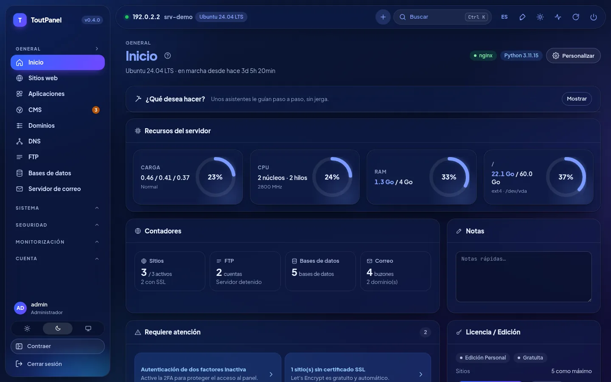<br>**Inicio, modo oscuro**: indicadores, contadores, puntos de atención, licencia | 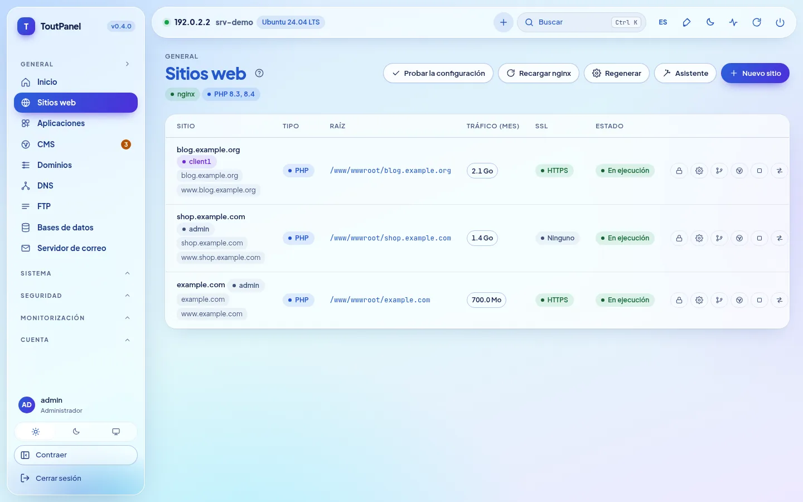<br>**Sitios web**: dominios, tipo, raíz, tráfico, SSL y acciones |
| <br>**PHP**: versiones 5.6 → 8.5 en paralelo, estado del soporte, pools FPM | <br>**Ajustes del sitio**: despliegue Git, SSL, redirecciones, seguridad |
| <br>**DNS**: zonas BIND o proveedores, plantillas, DNSSEC, clúster | <br>**Certificados**: validez, emisor, renovación, certificado del panel |
| 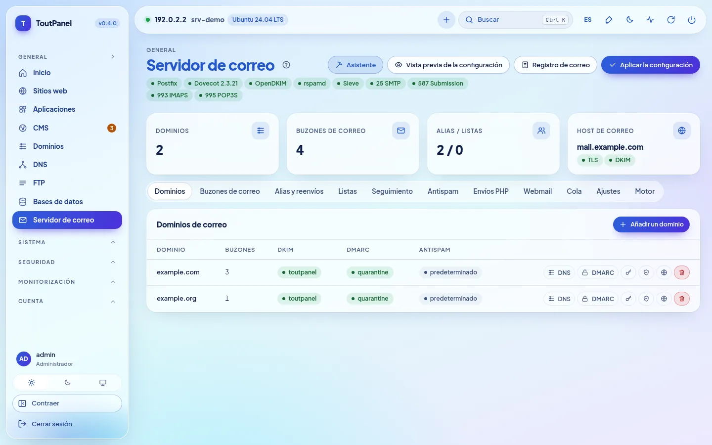<br>**Servidor de correo**: Postfix, Dovecot, OpenDKIM, puertos y pestañas | <br>**Webmail**: Roundcube o SnappyMail instalado en un clic |
| 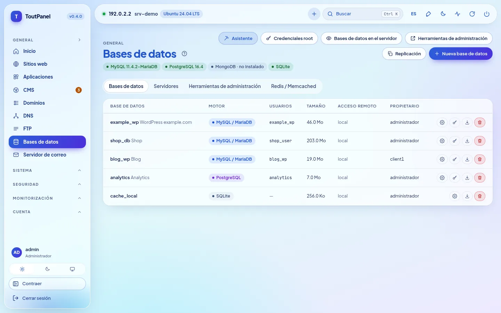<br>**Bases de datos**: MariaDB, PostgreSQL, MongoDB, SQLite, Redis | <br>**Archivos**: editor, archivos comprimidos, papelera, permisos, ocupación |
| <br>**CMS › Instalar**: 582 CMS y aplicaciones verificados, búsqueda, filtros, insignia «listo» | <br>**Ficha de un CMS**: requisitos previos verificados, elección de la versión, sitio de destino, base de datos |
| <br>**CMS › Instalaciones**: versiones, actualizaciones disponibles, copia de seguridad, clonación | <br>**WAF › Motor**: ToutWAF recomendado, WAF integrado, BunkerWeb, SafeLine |
| <br>**Terminal**: shell interactivo bash / PowerShell en el navegador | <br>**Aplicaciones**: WordPress, Joomla, Drupal, PrestaShop, Nextcloud… |
| <br>**Store**: software de servidor, módulos y temas en un clic | 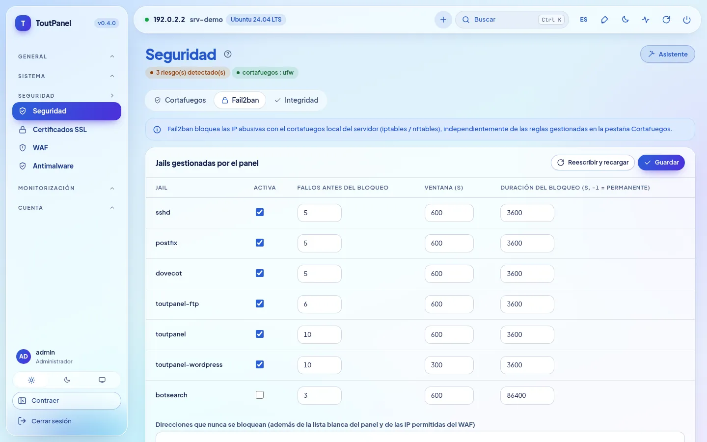<br>**Seguridad**: recomendaciones, cortafuegos, anti-DDoS, Fail2ban |
| 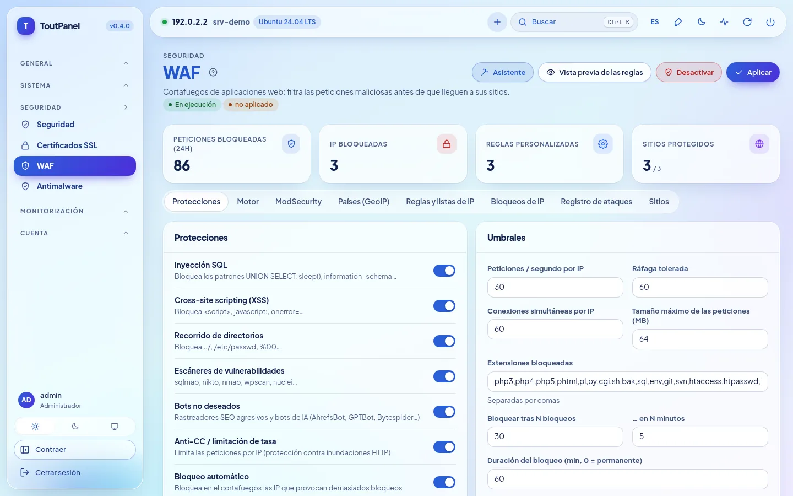<br>**WAF**: protecciones, umbrales, motores, GeoIP, registro de ataques | <br>**Monitorización**: CPU, memoria, red, carga y disco de 1 h → 7 d |
| <br>**Cuentas**: revendedores, clientes, planes, perfiles de acceso | <br>**Servidores**: panel maestro, nodos, enrutamiento, migración |
| <br>**Actualizaciones**: paquetes del sistema (seguridad) y del panel | <br>**Ajustes**: acceso, puerto, entrada secreta, HTTPS, interfaz |
| 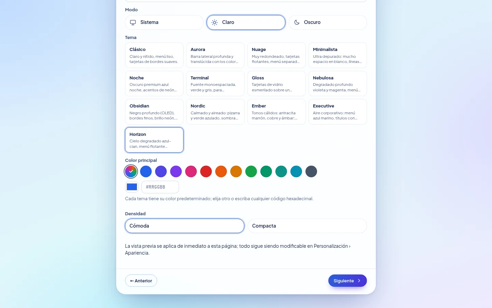<br>**Asistente de configuración**: tema, color principal, densidad, vista previa inmediata | <br>**Horizon**, tema por defecto: la misma pantalla en claro y en oscuro |

**Novedades de la 0.4**: capturas de un servidor de demostración (direcciones de documentación):

| | |
|---|---|
| <br>**Asistente de configuración, paso Perfil**: perfiles de partida, memoria detectada, perfil recomendado | 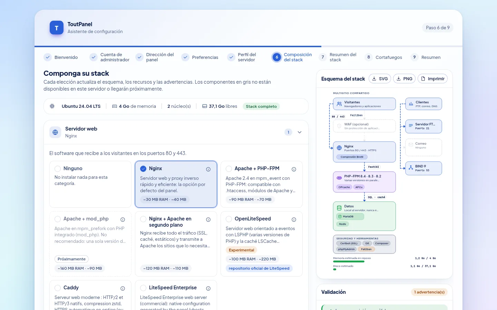<br>**Composición de la pila**: elección por categoría, esquema de arquitectura, validación y recursos estimados |
| <br>**Instalación de la pila**: progreso, pasos, reanudación tras un error | <br>**Asistente, paso Cortafuegos**: gestionado por ToutPanel o externo, puertos que se abrirán |
| <br>**Ajustes › Pila de software**: estado real, versiones instaladas, esquema de este servidor | <br>**Pila de software**, modo oscuro |
| <br>**Aceleradores**: OPcache, JIT, APCu, Redis, Memcached, FastCGI, Varnish… con estado, memoria y límites | <br>**OpenLiteSpeed** *(experimental)*: instalación, LSPHP, cambio del servidor web, WebAdmin |
| 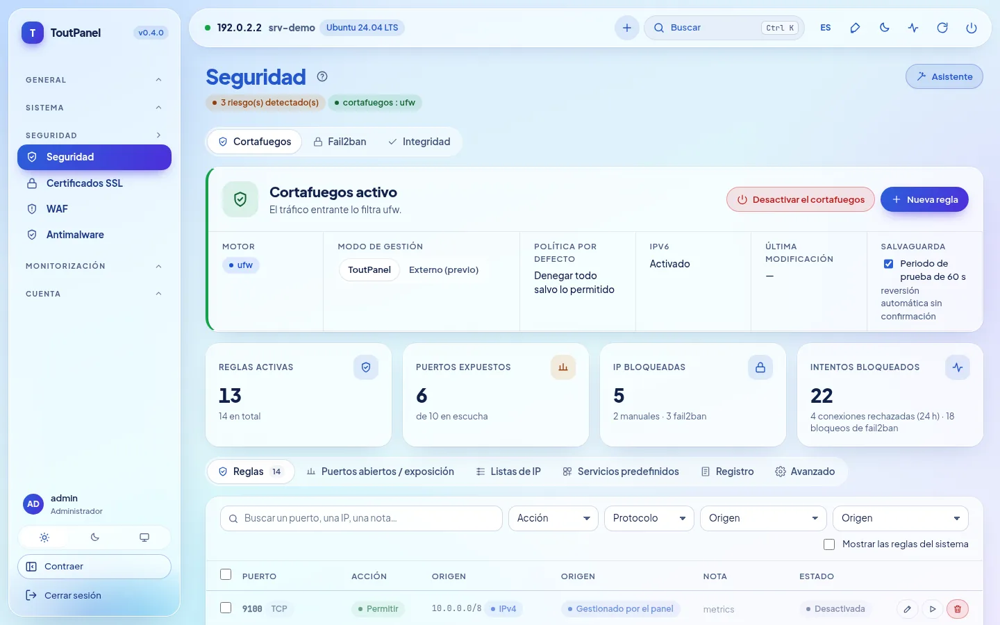<br>**Seguridad › Cortafuegos**: motor, modo de gestión, salvaguarda, reglas | <br>**Puertos en escucha y exposición**: expuesto, restringido, protegido |
| <br>**Cortafuegos externo**: puertos que abrir en el proveedor, para copiar o descargar | <br>**Cortafuegos**, modo oscuro |
| <br>**DNS › Motor**: BIND, PowerDNS, Knot DNS, proveedor externo | <br>**Servidor de correo › Motor**: Postfix, Exim *(experimental)*, relé externo |
| <br>**FTP › Motor**: integrado, Pure-FTPd, ProFTPD, vsftpd, SFTP *(experimentales)* | <br>**ToutWAF remoto**: panel conectado a un ToutWAF de otro servidor |
| <br>**Inicio**: banner «distribución en pila reducida» según el nivel de soporte | |

**Páginas añadidas en la 0.4.0**, con las mismas convenciones (servidor de demostración, direcciones de documentación):

| | |
|---|---|
| 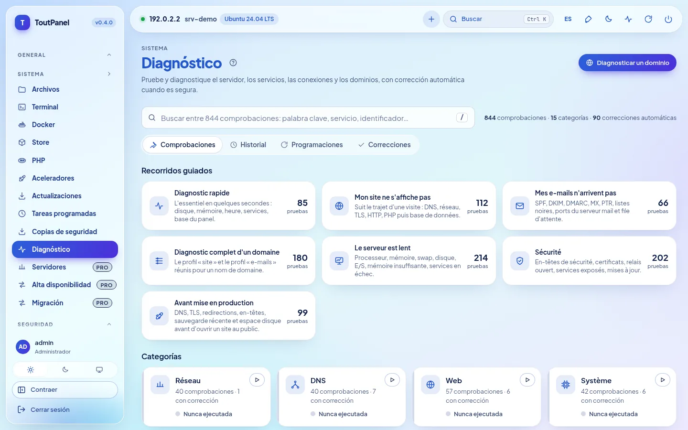<br>**Sistema › Diagnóstico**: 844 comprobaciones, recorridos guiados, categorías, búsqueda instantánea | <br>**Resultado de un diagnóstico**: causas probables, prueba técnica con los secretos ocultos, **corrección automática** |
| <br>**Corrección automática**: vista previa exacta de lo que se modificará, impacto, posibilidad de deshacer | <br>**Inicio › «¿Qué desea hacer?»**: asistentes guiados paso a paso |
| 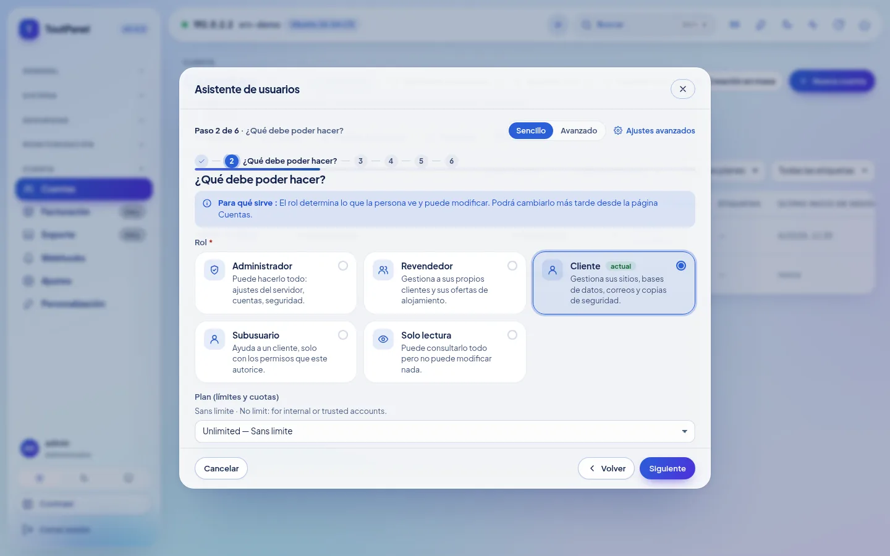<br>**Asistente guiado** (aquí: usuario): pasos, ayuda contextual, modo Simple o Avanzado | <br>**Prueba real tras aplicar**: resultado por comprobación, causa probable, corrección en un clic |
| <br>**Alta disponibilidad** *(Pro)*: IP flotante keepalived, servidores y prioridades, portador de la dirección | <br>**Monitorización › Parque de servidores** *(Pro)*: disponibilidad, CPU, memoria, disco y carga por servidor |
| <br>**Servidores** *(Pro)*: panel maestro, nodos web / correo / DNS, estado, huella TLS fijada | <br>**Cuentas › Ajustes › Aislamiento de cuentas** *(opción, desactivada por defecto)*: PHP-FPM por cuenta, endurecimiento systemd, jaula |
| <br>**Ajustes › Servidor web: Caddy** *(experimental)*: cambio con vuelta atrás, HTTPS, funciones no admitidas | <br>**LiteSpeed Enterprise** *(experimental; nunca arrancado en nuestras pruebas)*: licencia, instalación oficial, LSPHP |
| <br>**Store › Módulos**: Marketplace de integraciones (facturación, supervisión, SSO, CI/CD, DNS / CDN…) | 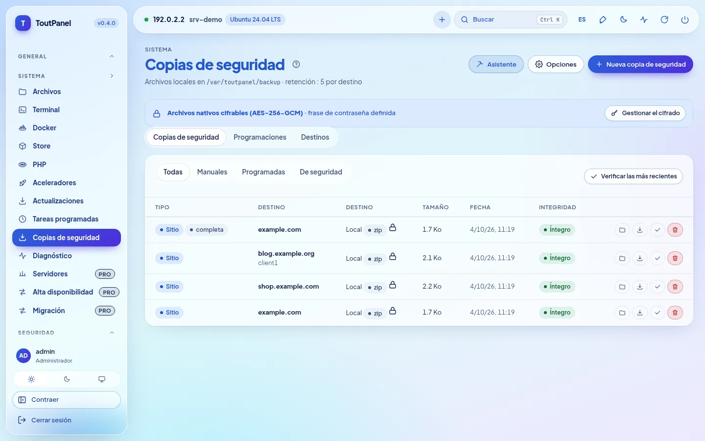<br>**Copias de seguridad**: archivos cifrados (AES-256-GCM), completos o incrementales |
| <br>**Cifrado de las copias de seguridad**: frase de contraseña conservada cifrada, aviso de pérdida, cifrado por defecto u obligatorio | <br>**Programaciones**: ámbito, retención, destino, incrementales |
| <br>**Ajustes › Seguridad**: alertas de inicio de sesión inusual, SSO OIDC / SAML | <br>**SSO** *(Pro)*: LDAP / Active Directory, OpenID Connect, SAML 2.0 |

**En móvil**, la interfaz se adapta (menú plegable, tablas desplazables):

<table>
<tr>
<td align="center"><br><b>Inicio</b></td>
<td align="center"><br><b>Sitios web</b></td>
</tr>
</table>

> Capturas realizadas en un servidor de demostración (Ubuntu 24.04, dirección de documentación 192.0.2.2, dominios de ejemplo). En este servidor de demostración, algunos estados están **simulados** (no se ejecuta ningún servicio real): aislamiento de cuentas (systemd, cgroups), Caddy, parque de servidores e IP flotante, bases de datos, correo, WAF y catálogo del Marketplace; los diagnósticos y los asistentes, en cambio, se ejecutan realmente. Hay capturas en otros idiomas en `screenshots/<idioma>/` (en, de, es, it, nl, pt, ru, zh, ar).

## Temas

### 13 temas, su color

Una instalación nueva usa **Horizon**: cielo degradado azul-cian, menú y barra superior flotantes translúcidos, píldora activa con degradado azul-violeta que sigue el color elegido, títulos azules muy en negrita. **Personalización › Apariencia**: elija otro diseño y después **cualquier color de acento** (12 preajustes, cuentagotas o código `#RRGGBB`). El panel deriva de él botones, enlaces, menú activo, insignias, degradados y gráficos, manteniendo un contraste de al menos 4,5:1. Cada tema existe en **claro y oscuro**, respeta el alto contraste y los idiomas de derecha a izquierda; la vista previa es inmediata, no se guarda nada antes de «Guardar el diseño». La densidad, las esquinas, la fuente, el ancho, la posición del menú, los iconos y las animaciones también se ajustan, por usuario o por defecto para todos; el tema se exporta y se importa.


| | | |
|---|---|---|
| <br>**Horizon** *(por defecto)* · `#2b5fd9` | <br>**Clásico** · `#2563eb` | <br>**Aurora** · `#2563eb` |
| <br>**Nube** · `#5b5bd6` | <br>**Minimal** · `#18181b` | <br>**Noche** · `#0369a1` |
| <br>**Terminal** · `#15803d` | <br>**Gloss** · `#7c3aed` | <br>**Nebulosa** · `#8b5cf6` |
| <br>**Obsidian** · `#22c55e` | <br>**Nordic** · `#14b8a6` | <br>**Ember** · `#f97316` |
| <br>**Executive** · `#10b981` | | |

<sub>Color indicado: acento por defecto del tema en modo claro, modificable libremente.</sub>

El tema, el modo, el **color principal** y la **densidad** también se eligen desde el **asistente de configuración** (paso Preferencias), con vista previa inmediata; son los valores por defecto de todas las cuentas, y cada una puede después elegir los suyos.

## Ediciones

El programa es el mismo para todas las ediciones: una **clave de licencia** activa las funciones avanzadas en un servidor determinado. Una instalación nueva funciona en la edición Personal, sin registro ni conexión a Internet.

| Edición | Precio | Clave | Para quién |
|---|---|---|---|
| **Personal** | gratuita, sin límite de duración | ninguna | uso personal: sus propios sitios, **hasta 5** |
| **Profesional** | de pago | obligatoria | proveedores de alojamiento, agencias, uso profesional: todo incluido, sitios ilimitados (o según el plan de licencia) |
| **Empresa** | de pago | obligatoria | Profesional + multiservidor ilimitado + soporte prioritario |

La edición Personal es **completa**: sitios, PHP multiversión, bases de datos, correo, DNS, SSL, WAF integrado, copias de seguridad locales (**cifrado AES-256-GCM e incrementales incluidos**), monitorización, Diagnóstico manual, asistentes guiados (los pasos que afectan a una función Pro siguen reservados), cuentas de cliente y subusuarios, WebAuthn, herramientas RGPD, API y CLI. Están reservados a las ediciones de pago:

<details>
<summary><b>Lista exacta de las funciones Profesional / Empresa</b></summary>

| Función | Personal | Profesional |
|---|---|---|
| Sitios | 5 como máximo | ilimitados (o según la licencia) |
| Sondas de uptime | 3 | ilimitadas |
| Webhooks salientes | 2 | ilimitados |
| Elección del motor WAF (ToutWAF, BunkerWeb, SafeLine) | WAF integrado | ✓ |
| ModSecurity + OWASP CRS | — | ✓ |
| Multiservidor: nodos, alta disponibilidad, migración en caliente | — | ✓ |
| Grupos web y clúster DNS | — | ✓ |
| Replicación de bases de datos | — | ✓ |
| Facturación, pasarelas, WHMCS, aprovisionamiento | — | ✓ |
| Marca blanca de los revendedores | — | ✓ |
| Dominio personalizado del panel | — | ✓ |
| Soporte (tickets) | — | ✓ |
| Anuncios | — | ✓ |
| Cuentas de revendedor | — (clientes y subusuarios: ✓) | ✓ |
| SSO LDAP / OpenID Connect / SAML | — (WebAuthn: ✓) | ✓ |
| Bloqueo por país (GeoIP) | — | ✓ |
| Antimalware programado | análisis manual | ✓ |
| Copias de seguridad remotas (S3, SFTP, B2, rsync SSH, rclone) | almacenamiento local (archivos cifrados e incrementales incluidos) | ✓ |
| Motores restic, Borg y rsync | — | ✓ |
| Exportación Prometheus `/metrics` | — | ✓ |
| Importación desde cPanel, Plesk, DirectAdmin, ISPConfig, alojamiento compartido, IMAP | — (exportación: ✓) | ✓ |
| Módulos premium de la store | — | ✓ |
| Anclaje externo del registro de auditoría | — (exportación y purga RGPD: ✓) | ✓ |
| Diagnósticos programados con alerta | diagnóstico manual | ✓ |

</details>

- Las entradas afectadas llevan una insignia **Pro**; las páginas siguen siendo consultables, solo se reservan la creación y la modificación.
- Activación: **Ajustes › Licencia › Activar una clave** (`TP-XXXXX-XXXXX-XXXXX-XXXXX`) o `toutpanel licence activate <clave>`. El token firmado se verifica localmente: la licencia funciona sin conexión (revalidación diaria, periodo de gracia de 15 días).
- Si la licencia caduca o deja de ser válida, el panel **vuelve a la edición Personal sin eliminar nada**.

Precios y compra: **[toutpanel.com/tarifs](https://toutpanel.com/tarifs)** · detalles: [Ediciones y licencia](https://toutpanel.com/docs/guide/editions/).

## Arquitectura

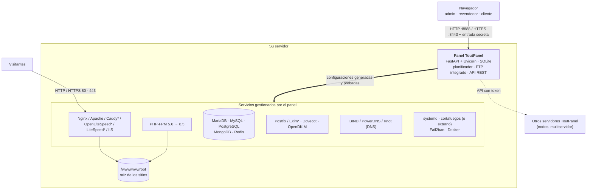

| Componente | Función |
|---|---|
| **Panel** | Aplicación FastAPI servida por Uvicorn (servicio systemd `toutpanel` en Linux, tarea programada `ToutPanel` en Windows). Interfaz web sin dependencias externas, API REST, planificador de tareas, servidor FTP integrado. |
| **Pila web** | Nginx y/o Apache (Caddy, OpenLiteSpeed con LSPHP, LiteSpeed Enterprise: experimentales; IIS en Windows) con PHP-FPM; el panel escribe los vhosts a partir de sus plantillas, los prueba y después recarga el servicio. El **compositor de pila** elige y hace evolucionar el software. |
| **Servicios** | MariaDB / MySQL / PostgreSQL / MongoDB, Postfix (o Exim*) / Dovecot / OpenDKIM, BIND (o PowerDNS, Knot), FTP (integrado o Pure-FTPd*, ProFTPD*, vsftpd*), Fail2ban, cortafuegos, Docker: gestionados por el panel mediante sus herramientas nativas. |
| **CLI `toutpanel`** | Administración del panel (puerto, entrada, contraseña, actualización, licencia…) y comandos de negocio automatizables (`--json`). |

<sub>\* experimental</sub>

```
<home>  (/var/toutpanel o C:\toutpanel)
├── data/      base de datos SQLite del panel, settings.json, claves, install-info.txt
├── logs/      panel.log y registros de los sitios
├── vhost/     vhosts generados (si falta la carpeta nativa del servidor web)
├── ssl/       certificados de los sitios y del panel
├── backup/    copias de seguridad locales
├── src/       clon de este repositorio (canales, etiquetas, toutpanel update)
└── venv/      entorno Python del panel
/www/wwwroot   raíz de los sitios (C:\toutpanel\wwwroot en Windows)
```

## Instalación completa

### Requisitos previos

| | Linux | Windows |
|---|---|---|
| **Sistemas** | nivel **completo**: Debian 11 y posteriores, Ubuntu 20.04 y posteriores, AlmaLinux / Rocky Linux / RHEL / CentOS Stream / Oracle Linux / CloudLinux 8 y posteriores, Fedora · nivel **reducido** (el panel funciona, faltan algunas funciones): Debian 10, Ubuntu 18.04, CentOS / RHEL 7, Amazon Linux, openSUSE / SLES, Arch, Alpine, Devuan · véase [Compatibilidad de las distribuciones](#compatibilidad-de-las-distribuciones) | Windows 10, 11 · Windows Server 2016, 2019, 2022, 2025 (build 14393 como mínimo) |
| **Permisos** | `root` (o `sudo`) y `bash` | PowerShell 5.1+ **como administrador** (winget no es necesario) |
| **Python** | 3.9 a 3.14 (instalado por el script si la distribución lo proporciona) | instalado por el script (3.12, python.org) si falta |
| **Memoria** | 1 GB como mínimo (solo el panel), 2 GB recomendados con MariaDB y PHP | ídem |
| **Disco** | 2 GB libres + sus sitios | ídem |
| **Red** | acceso saliente HTTPS (GitHub, PyPI, repositorios de la distribución, Let's Encrypt); IP pública fija y DNS inverso para el correo | ídem (python.org, nginx.org, windows.php.net, MariaDB) |

Arquitecturas: `x86_64` y `aarch64` (otras: nivel reducido). Instale preferiblemente en un servidor **recién instalado**. En un servidor donde Nginx, Apache o MariaDB ya estén configurados, use `--stack none`: el panel los detecta y escribe sus vhosts en su carpeta nativa sin tocar el resto.

### Compatibilidad de las distribuciones

El instalador y el panel detectan la distribución (`/etc/os-release`, arquitectura) y muestran un **nivel de soporte**: `toutpanel compat` enumera las distribuciones conocidas, `toutpanel check` da el de su servidor, y un banner de la página de inicio avisa cuando el nivel no es «completo». **Nunca hay un tope de versión**: una versión más reciente de una familia conocida se trata como la última conocida.

| Nivel | Significado | Ejemplos |
|---|---|---|
| **Completo** | está prevista la pila completa (servidor web, PHP multiversión, bases de datos en las versiones que elija, correo, cortafuegos, actualizaciones automáticas) | Debian 11+, Ubuntu 20.04+ (LTS e intermedias), AlmaLinux / Rocky / RHEL / CentOS Stream / Oracle Linux 8+, CloudLinux 8 y 9, Fedora, Raspberry Pi OS de 64 bits |
| **Reducido** | el panel funciona, pero faltan algunas funciones o requieren intervención (sistema al final de su vida útil, init sin systemd, repositorios de terceros ausentes, arquitectura de 32 bits); advertencia no bloqueante | Debian 10, Ubuntu 18.04, CentOS / RHEL 7, Amazon Linux 2 y 2023 (un solo PHP a la vez), openSUSE / SLES, Arch y derivadas, Alpine, Devuan, Kali |
| **No admitido** | sistema desconocido, demasiado antiguo o inmutable: el instalador lo indica y se detiene | Fedora CoreOS / Silverblue, MicroOS, Flatcar, Gentoo, NixOS, Void |

«Completo» describe el nivel **previsto** por el panel; **las pruebas se hicieron en Ubuntu 24.04**, con una excepción: **AlmaLinux 9.8 y 10.2 con SELinux Enforcing** (laboratorio QEMU del 4 de octubre de 2026); la validación de extremo a extremo no se ha hecho en las demás distribuciones, Rocky Linux, RHEL y Fedora incluidas (véanse las [Limitaciones conocidas](#limitaciones-conocidas)). Python 3.9+ se suministra si el sistema es demasiado antiguo (paquete reciente de la distribución o Python autónomo verificado por SHA-256, con su consentimiento).

### Linux

```bash
curl -sSL https://raw.githubusercontent.com/qu3ntin01/toutpanel/main/install.sh | sudo bash
```

Para leer el script antes de ejecutarlo:

```bash
curl -sSLO https://raw.githubusercontent.com/qu3ntin01/toutpanel/main/install.sh
less install.sh
sudo bash install.sh
```

La instalación dura de 3 a 6 minutos según la conexión.

**Asistente de instalación.** Todas las opciones (cuenta, puertos, carpeta, pila, cortafuegos, WAF, versión, idioma…) se eligen con menús en **[toutpanel.com/installation-assistant](https://toutpanel.com/installation-assistant)**, que genera la línea de comandos y la verifica en directo (los secretos nunca aparecen en claro).

**Instalar una versión concreta.** El comando estándar instala la última versión estable; `--version` elige otra (lista: `--list-versions`). Las versiones preliminares se publican en el canal `dev` y se instalan con `--channel dev`:

```bash
# la última versión estable
curl -sSL https://raw.githubusercontent.com/qu3ntin01/toutpanel/main/install.sh | sudo bash
# una versión concreta (lista: --list-versions)
curl -sSL https://raw.githubusercontent.com/qu3ntin01/toutpanel/main/install.sh | sudo bash -s -- --list-versions
curl -sSL https://raw.githubusercontent.com/qu3ntin01/toutpanel/main/install.sh | sudo bash -s -- --version 0.4.0
# la última versión preliminar (canal dev)
curl -sSL https://raw.githubusercontent.com/qu3ntin01/toutpanel/dev/install.sh | sudo bash -s -- --channel dev
```

**Menú interactivo.** Lanzado en un terminal sin opción de modo, el script presenta ToutPanel, detecta una instalación existente y propone: **instalar** (pila completa) o **instalar solo el panel**, opcionalmente en **modo nodo**; o, si el panel ya está presente, **actualizar**, **reinstalar por completo** o **desinstalar**. También pregunta por el **cortafuegos** (ToutPanel / externo / más tarde) y, tras el arranque del panel, por el **perfil de la pila**. Sin terminal (automatización, `--yes`), no pregunta: instala, o actualiza si el panel está presente (cortafuegos «más tarde», pila por defecto).

**Lo que hace el script:**

1. instala Python 3.9+ si es necesario y crea el entorno virtual `<home>/venv`;
2. instala la **pila web** (Nginx, PHP-FPM, MariaDB, Redis o Valkey, Certbot, Fail2ban) como antes, o la que usted componga (`--profile`, `--web`, `--php`, `--db`… transmitidas a `toutpanel stack apply`);
3. clona este repositorio en `<home>/src`, **verifica la suma SHA-256** del paquete wheel correspondiente al Python del sistema y lo instala;
4. crea una **cuenta de administrador** y una **URL de acceso secreta** aleatorias;
5. registra el **servicio systemd** `toutpanel`;
6. configura el **cortafuegos** según `--firewall`: `on` (ToutPanel lo gestiona y abre los puertos necesarios), `off` (cortafuegos externo: ninguna regla del sistema, lista de los puertos que abrir en el proveedor), pregunta en un terminal, y si no «más tarde» (no se toca nada);
7. configura **SELinux** (Alma, Rocky, RHEL, Fedora) o **AppArmor** (Debian, Ubuntu, SUSE);
8. muestra un resumen, guardado en `<home>/data/install-info.txt` (legible solo por root).

#### Opciones de `install.sh`

| Opción | Descripción | Por defecto |
|---|---|---|
| `--stack full` | **obsoleta** (véase `--profile`): Nginx + PHP-FPM + MariaDB + Redis/Valkey + Certbot + Fail2ban | ✓ |
| `--stack minimal` | **obsoleta**: Nginx + PHP-FPM + Certbot | |
| `--stack none` | **obsoleta**: únicamente el panel (servidor ya configurado) | |
| `--profile NOMBRE` | perfil del **compositor de pila**: `single-site`, `multi-site`, `hosting`, `performance`, `application`, `mail-only`, `dns-only`, `node`, `lamp`, `standard`, `custom` (valores de las demás opciones: véase la tabla siguiente) | pila por defecto |
| `--web`, `--php`, `--php-default`, `--php-ext`, `--db`, `--redis`, `--accel`, `--ftp`, `--mail MOTOR`, `--dns`, `--security`, `--runtime`, `--tools`, `--install-mode`, `--roles`, `--stack-file`, `--no-tuning` | opciones del compositor, transmitidas tal cual a `toutpanel stack apply … --yes` tras la instalación del panel (un fallo de la pila no hace fracasar la instalación: se muestra el comando para reanudar) | |
| `--accept-litespeed-license` | con `--web litespeed[:6.3]`: acepta el contrato de licencia de LiteSpeed Technologies; **obligatoria** (sin ella, el instalador se detiene antes de cualquier modificación), incompatible con `--stack`, rechazada en Windows. **LiteSpeed Enterprise es un producto comercial EXPERIMENTAL, nunca arrancado en el entorno de desarrollo**: prueba oficial de 15 días, después licencia de pago | no |
| `--mail` | (solo) añade Postfix, Dovecot, OpenDKIM y abre los puertos de correo | no |
| `--firewall on\|off\|ask` | quién gestiona el cortafuegos: ToutPanel (`on`), un cortafuegos externo sin regla del sistema (`off`), pregunta (`ask`); sin terminal ni valor: «más tarde»; nunca modificado por una actualización | pregunta en un terminal |
| `--firewall-engine nft\|ufw\|firewalld\|csf\|iptables` | motor del cortafuegos gestionado por ToutPanel | detectado |
| `--dry-run` | muestra la distribución detectada, el directorio y los comandos previstos, sin modificar nada (sin root) | no |
| `--postgres` | añade PostgreSQL (contraseña del rol `postgres` generada y guardada en el panel) | no |
| `--waf toutwaf` | despliega **ToutWAF**, el WAF del editor, delante de los sitios mediante su instalador oficial (servicios systemd, sin Docker; servidor web movido a 8080 / 8443, consola en 9443, resumen en `/etc/toutwaf/INSTALL-SUMMARY.txt`) | no |
| `--waf bunkerweb` / `--waf safeline` | instala Docker y despliega el WAF externo delante de los sitios (servidor web movido a 8080 / 8443, consola en 7000 o 9443) | no |
| `--waf toutwaf --waf-console URL` | **ToutWAF remoto**: conecta el panel a un ToutWAF instalado en otro servidor (ninguna instalación local), con `--waf-origin-ip`, `--waf-origin-addr`, `--waf-cert-mode import\|acme`, `--waf-server-id`, `--waf-fingerprint` o `--waf-trust-first-use`, `--waf-restrict` (80 / 443 limitados a ToutWAF); el token se da mediante `--waf-token-file ARCHIVO` o `--waf-token-stdin` (nunca como argumento) | no |
| `--node` | modo **nodo** multiservidor: panel solo en HTTPS, token de alta, URL de la API y huella TLS mostrados (para introducir en el maestro: Sistema › Servidores › Añadir) | no |
| `--master URL` | con `--node`: URL del panel maestro | — |
| `--port N` | puerto **HTTP** del panel | `8888` |
| `--https-port N` | puerto **HTTPS** del panel (el panel escucha en HTTP **y** en HTTPS; certificado autofirmado al principio) | `8443` |
| `--version X.Y.Z` | instala esta versión publicada (también `vX.Y.Z`, `0.4.0b1` o `0.4.0-beta.1`; variable `TOUTPANEL_VERSION`); una versión preliminar implica el canal `dev`; versión no encontrada o sin wheel para su Python: parada antes de cualquier modificación con la lista de versiones; un descenso de versión pide confirmación (salvo `--yes`) | última del canal |
| `--list-versions` | enumera las versiones publicadas (la más reciente primero) y sale, sin instalar nada | |
| `--random-port` | puerto aleatorio entre 20000 y 39999 | |
| `--username NOMBRE` | nombre de la cuenta de administrador | `admin_xxxxxx` aleatorio |
| `--password CONTRASEÑA` | contraseña de administrador (visible en `ps` y en el historial del shell: prefiera las tres opciones siguientes) | 16 caracteres aleatorios |
| `TOUTPANEL_PASSWORD` | variable de entorno que da la contraseña (conservada por `sudo -E`); una opción prevalece sobre la variable | — |
| `--password-file ARCHIVO` | lee la contraseña en la primera línea de un archivo (en Linux, reservado a su propietario: `chmod 600`) | — |
| `--password-stdin` | lee la contraseña en la entrada estándar (primera línea; inutilizable con `curl \| bash`) | — |
| `--entrance /ruta` | entrada segura de la URL | `/tp_xxxxxxxxxx` aleatorio |
| `--home DIR` | directorio del panel (una instalación existente en el antiguo valor por defecto `/www/toutpanel` se detecta y se conserva) | `/var/toutpanel` |
| `--source DIR` | instalar desde una carpeta local (copia de este repositorio con `dist/`) | clon de la rama |
| `--branch NOMBRE` | rama Git que descargar | `main` |
| `--channel stable\|dev` | canal de actualización, guardado en el panel | `stable` |
| `--update` | actualiza una instalación existente (detectado automáticamente): copia de los datos, código nuevo, migración de la base de datos, reinicio | auto |
| `--reinstall` | fuerza una instalación completa aunque el panel esté presente | no |
| `--uninstall` | desinstala el panel (sitios y bases de datos conservados, datos del panel archivados) | no |
| `--yes`, `-y` | ninguna pregunta (menú y confirmaciones) | no |
| `--lang xx` | idioma del instalador e idioma inicial del panel: `en`, `fr`, `de`, `es`, `it`, `pt`, `nl`, `ru`, `zh`, `ar` | idioma del sistema, si no `en` |
| `--en`, `--fr`, `--de`, `--es`, `--it`, `--pt`, `--nl`, `--ru`, `--zh`, `--ar` | atajos de `--lang` | |
| `-h`, `--help` | muestra la ayuda del script | |

Solo se admite una fuente de contraseña a la vez (dos opciones se rechazan antes de cualquier modificación). Sin ninguna, un terminal interactivo propone «generar automáticamente (recomendado)» o «introducir» (sin eco, con confirmación); sin terminal o con `--yes`, se genera una contraseña y se muestra al final. Una contraseña suministrada no se muestra ni se escribe en el resumen ni en `install-info.txt`, y una actualización nunca la modifica.

**Valores de las opciones de pila** (se comprueban antes de cualquier modificación; **\*** = experimental):

| Opción | Valores |
|---|---|
| `--web` | `nginx`, `apache`, `nginx-apache`, `caddy`\*, `openlitespeed`\* (`:1.9`, `:1.8`, `:1.7`), `litespeed`\* (`:6.3`, `:6.2`, `:6.1`, `:6.0`; LiteSpeed Enterprise, comercial, exige `--accept-litespeed-license`), `none`; `toutpanel stack apply` acepta los mismos valores |
| `--php` / `--php-default` / `--php-ext` | versiones separadas por comas (`8.3,8.4`, de 5.6 a 8.5) / versión por defecto / `minimal`, `standard`, `full` |
| `--db` | `mariadb` (`:10.6`, `:10.11`, `:11.4`, `:11.8`), `mysql`\* (`:8.4`, `:9.7`), `percona`\* (`:8.0`, `:8.4`), `postgresql` (`:13` a `:18`), `none` |
| `--accel` | `opcache`, `jit`, `apcu`, `redis`, `memcached`, `fastcgi-cache`, `varnish`\*, `brotli`, `zstd`\*, `http3`\*, `ioncube` |
| `--ftp` | `builtin`, `pureftpd`\*, `proftpd`\*, `vsftpd`\*, `sftp`\*, `none` |
| `--mail` | `postfix`, `postfix-clamav`, `postfix-light`, `exim`\*, `relay`, `none` |
| `--dns` | `bind`, `powerdns`, `knot`, `external`, `none` |
| `--security` | `firewall`, `fail2ban`, `modsecurity`, `clamav`, `toutwaf` |
| `--runtime` / `--tools` | `nodejs`, `python`, `go`, `ruby`, `java`, `docker` / `certbot`, `git`, `composer`, `phpmyadmin`, `adminer`, `restic`, `goaccess` |
| `--install-mode` / `--roles` | `single-server`, `single-site`, `multi-site`, `multi-server` / `web`, `db`, `mail`, `dns` |

Un componente «próximamente» (Apache + mod_php) es rechazado limpiamente por `toutpanel stack`, sin instalar nada.

Ejemplos:

```bash
sudo bash install.sh --stack minimal --port 7443
sudo bash install.sh --profile lamp --php 8.3,8.4 --db mariadb:11.4 --firewall on
sudo bash install.sh --profile hosting --mail postfix-clamav --dns bind --firewall off --yes
sudo bash install.sh --dry-run --profile lamp          # simulación
sudo bash install.sh --mail --postgres
sudo bash install.sh --mail --username yo --password-file /root/contrasena.txt --entrance /mi-acceso
sudo bash install.sh --profile performance --web openlitespeed --php 8.3 --accel opcache,redis --firewall off --yes   # OpenLiteSpeed: experimental
sudo bash install.sh --web litespeed:6.3 --php 8.3 --accept-litespeed-license --yes   # LiteSpeed Enterprise: comercial, experimental, licencia obligatoria (solo Linux)
sudo bash install.sh --waf toutwaf                 # WAF del editor delante de los sitios
sudo bash install.sh --stack minimal --node --master https://maitre.exemple.com:8888   # servidor gestionado por un maestro
curl -sSL https://raw.githubusercontent.com/qu3ntin01/toutpanel/main/install.sh | sudo bash -s -- --yes --random-port
curl -sSL https://raw.githubusercontent.com/qu3ntin01/toutpanel/main/install.sh | sudo bash -s -- --channel dev
curl -sSL https://raw.githubusercontent.com/qu3ntin01/toutpanel/main/install.sh | sudo bash -s -- --es   # instalador en español
```

#### Idioma del instalador

Los instaladores son **multilingües**: banner, menú y preguntas, pasos, advertencias, errores, ayuda, resumen e `install-info.txt` se muestran en uno de los **10 idiomas** siguientes, en **inglés por defecto**. El idioma elegido pasa a ser también el **idioma inicial del panel** (instalación y reinstalación); una línea bajo el banner indica el idioma elegido y su origen.

| Idioma | `--lang` | Atajo Linux | Windows |
|---|---|---|---|
| English *(por defecto)* | `en` | `--en` | `-Lang en` / `-En` |
| Français | `fr` | `--fr` | `-Lang fr` / `-Fr` |
| Deutsch | `de` | `--de` | `-Lang de` / `-De` |
| Español | `es` | `--es` | `-Lang es` / `-Es` |
| Italiano | `it` | `--it` | `-Lang it` / `-It` |
| Português | `pt` | `--pt` | `-Lang pt` / `-Pt` |
| Nederlands | `nl` | `--nl` | `-Lang nl` / `-Nl` |
| Русский | `ru` | `--ru` | `-Lang ru` / `-Ru` |
| 中文 | `zh` | `--zh` | `-Lang zh` / `-Zh` |
| العربية | `ar` | `--ar` | `-Lang ar` / `-Ar` |

Orden de prioridad, de mayor a menor:

| # | Fuente | Linux | Windows |
|---|---|---|---|
| 1 | opción de la línea de comandos | `--lang xx` o atajo (`--fr`…) | `-Lang xx` o atajo (`-Fr`…) |
| 2 | variable de entorno | `TOUTPANEL_LANG=fr` | `$env:TOUTPANEL_LANG = "fr"` |
| 3 | valor escrito en el script | `INSTALLER_LANG="fr"` al principio de `install.sh` | `$InstallerLang = "fr"` al principio de `install.ps1` |
| 4 | **detección** del idioma del sistema, si es uno de los 10 | `LC_ALL`, `LC_MESSAGES`, `LANG` | `Get-Culture` |
| 5 | inglés | | |

```bash
curl -sSL https://raw.githubusercontent.com/qu3ntin01/toutpanel/main/install.sh | sudo env TOUTPANEL_LANG=de bash
```

Variables de entorno reconocidas: `TOUTPANEL_LANG` (idioma del instalador), `TOUTPANEL_HOME` (directorio), `TOUTPANEL_REPO` (repositorio Git), `TOUTPANEL_BRANCH` (rama), `TOUTPANEL_CHANNEL` (`stable` o `dev`), `TOUTPANEL_VERSION` (versión concreta), `TOUTPANEL_PASSWORD` (contraseña de administrador), `TOUTPANEL_FIREWALL` / `TOUTPANEL_FIREWALL_ENGINE`, y una variable por opción de pila (`TOUTPANEL_PROFILE`, `TOUTPANEL_WEB`, `TOUTPANEL_PHP`, `TOUTPANEL_DB`, `TOUTPANEL_ACCEL`, `TOUTPANEL_FTP`, `TOUTPANEL_MAIL_ENGINE`, `TOUTPANEL_DNS`…).

<details>
<summary><b>Paquetes instalados según la distribución</b></summary>

- **Debian / Ubuntu**: `nginx`, `php8.x-fpm` (+ cli, mysql, curl, mbstring, xml, zip, gd, intl, bcmath, opcache), `certbot`, `composer`, `mariadb-server`, `redis-server`, `fail2ban`, `python3-venv`, `git`, `unzip`; PHP multiversión mediante packages.sury.org (Debian) o el PPA ondrej (Ubuntu).
- **AlmaLinux / Rocky / RHEL / Fedora**: `epel-release` (+ CRB), `remi-release`, `nginx`, `php83-php-fpm` (+ extensiones), `certbot`, `mariadb-server`, `redis` o `valkey` (Valkey en AlmaLinux 10), `fail2ban`, `policycoreutils-python-utils`, `dnf-plugins-core`, `rspamd` (desde el repositorio oficial `rspamd.com`, añadido por la pila: ausente de AlmaLinux y de EPEL), `firewalld` (instalado con `--firewall on`: las imágenes cloud no tienen ni `firewalld` ni `nft`); contextos SELinux declarados (`httpd_sys_rw_content_t` en `/www/wwwroot`, `httpd_log_t`, `var_log_t`, `cert_t`, `httpd_config_t`, `mail_spool_t`) y booleanos `httpd_can_network_connect`, `httpd_can_network_connect_db`, `httpd_can_sendmail`, `httpd_setrlimit` activados.
- **Módulos Python opcionales** (no instalados por defecto): `pymongo` (MongoDB), `wsgidav` + `a2wsgi` (WebDAV), `geoip2` (GeoIP), `python3-saml` (SAML) — `/var/toutpanel/venv/bin/pip install "pymongo>=4.6"` y después `systemctl restart toutpanel`.

</details>

### Windows

En PowerShell **como administrador**:

```powershell
Set-ExecutionPolicy Bypass -Scope Process -Force
iwr -useb https://raw.githubusercontent.com/qu3ntin01/toutpanel/main/install.ps1 | iex
```

El script comprueba la versión de Windows y los permisos, instala **Python 3.12** si no hay ningún Python 3.9+, crea `C:\toutpanel\venv` e instala en él el panel, crea la cuenta de administrador y la URL secreta, añade las reglas de cortafuegos (puerto del panel, 80, 443, 21), crea la tarea programada **ToutPanel** (inicio automático como SYSTEM) y añade `C:\toutpanel\bin` al PATH.

Para instalar también la pila web (**Nginx** en `C:\nginx`, **PHP 8.3** supervisado por el panel, **MariaDB** como servicio de Windows):

```powershell
iwr -useb https://raw.githubusercontent.com/qu3ntin01/toutpanel/main/install.ps1 -OutFile install.ps1
.\install.ps1 -Stack
```

| Opción | Descripción |
|---|---|
| `-Port 8888` | puerto **HTTP** del panel |
| `-HttpsPort 8443` | puerto **HTTPS** del panel |
| `-Version X.Y.Z` / `-ListVersions` | instalar una versión publicada concreta (variable `TOUTPANEL_VERSION`) / enumerar las versiones publicadas |
| `-Home C:\toutpanel` | directorio del panel |
| `-Stack` | instala Nginx, PHP 8.3, MariaDB |
| `-Username`, `-Password`, `-Entrance /x` | cuenta de administrador y URL secreta elegidas (`-Password` es visible en la lista de procesos: prefiera `$env:TOUTPANEL_PASSWORD`, `-PasswordFile ARCHIVO` o `-PasswordStdin`) |
| `-PythonVersion`, `-NginxVersion`, `-MariaDBVersion`, `-PhpVersion` | versiones descargadas |
| `-Source C:\ruta` / `-Branch main` | carpeta local (copia de este repositorio) / rama descargada |
| `-Update` / `-Reinstall` / `-Uninstall` | actualizar / reinstalarlo todo / desinstalar |
| `-Yes` | ninguna pregunta (automatización) |
| `-Lang xx` / `-En`, `-Fr`, `-De`, `-Es`, `-It`, `-Pt`, `-Nl`, `-Ru`, `-Zh`, `-Ar` | idioma del instalador e idioma inicial del panel (por defecto: idioma del sistema si es compatible, si no inglés; véase [Idioma del instalador](#idioma-del-instalador)); con `iwr … \| iex`: `$env:TOUTPANEL_LANG = "fr"` antes del comando |
| `-Help` | ayuda del script |

### Puertos que hay que abrir

| Puerto | Uso | Abierto por el instalador |
|---|---|---|
| **8888** (configurable) | interfaz del panel en **HTTP** | sí |
| **8443** (configurable) | interfaz del panel en **HTTPS** (certificado autofirmado al principio) | sí (vuelva a ejecutar el instalador o ábralo a mano en una instalación existente) |
| **80 / 443** | sitios web | sí |
| 21 + 60000-60100 | FTP (integrado, o el motor elegido: rango pasivo del motor) | solo el 21; abra el rango pasivo si activa el FTP |
| 25, 465, 587, 143, 993, 110, 995, 4190 | correo (SMTP, IMAP, POP3, ManageSieve) | con `--mail` (4190: que abrir para Sieve remoto) |
| 53 (UDP y TCP) | DNS (BIND, PowerDNS o Knot) si aloja sus zonas | no: Seguridad › Cortafuegos |
| 9443 / 7000 | consolas ToutWAF y SafeLine (9443), BunkerWeb (7000) | con `--waf` |
| 3306 / 5432 | acceso remoto a las bases de datos (opcional) | no: solo si lo activa |

No olvide el **cortafuegos de su proveedor de alojamiento** (grupo de seguridad): si bloquea los puertos del panel (8888 y 8443), el navegador no muestra nada. Con `--firewall off` (o el modo «Externo» de Seguridad › Cortafuegos), ToutPanel no toca ninguna regla del sistema y **enumera los puertos que hay que abrir** en el proveedor (`toutpanel firewall ports`, copia o descarga CSV en la interfaz); con `--firewall on`, los abre él mismo y una **salvaguarda de 60 s** anula cualquier cambio no confirmado que le cortaría el acceso.

## Primer arranque

Al final de la instalación, el script muestra un resumen (aquí tal como lo muestra el instalador en español):

```
╔══════════════════════════════════════════════════════════════════╗
║  ¡ToutPanel está instalado!                                      ║
╚══════════════════════════════════════════════════════════════════╝

  URL del panel (HTTP)      : http://203.0.113.10:8888/tp_dchwp7kmkf
  URL del panel (HTTPS)     : https://203.0.113.10:8443/tp_dchwp7kmkf   certificado autofirmado: la advertencia del navegador es normal
  Usuario                   : admin_gbhjkv
  Contraseña                : D9nYzTSKHbX8FTqC
  MariaDB root              : k3Jd82nLqP0sYt7wVb1c
  Asistente de configuración : https://203.0.113.10:8443/tp_dchwp7kmkf#/setup?token=npSj7xpVzJOI8weJl8R00AdQ18MHYn8YIJCbOYi43B8
  Este enlace (24 h, un solo uso) permite cambiar la dirección del panel, el usuario y la contraseña generados arriba.
  Nuevo enlace: toutpanel setup-link
  PHP                       : 8.3 (Nginx + PHP-FPM listos)

  Esta información se guarda en: /var/toutpanel/data/install-info.txt
  La URL contiene la entrada segura: sin ella, el panel responde 404.
```

1. **Anote la URL completa** (HTTP y HTTPS): contiene la **entrada segura** (`/tp_…`). Sin ella, el panel responde `404 Not Found`, lo que lo hace invisible a los barridos de puertos. `toutpanel info` la vuelve a mostrar. El certificado HTTPS es **autofirmado** al principio: la advertencia del navegador es normal; el asistente de configuración se abre en HTTPS para que su token no circule en claro.
2. **Abra el enlace «Asistente de configuración»** (`#/setup?token=…`, válido 24 h, un solo uso): en **nueve pasos** y sin iniciar sesión, sustituya los valores generados por los suyos (nombre de usuario, contraseña, puerto, entrada segura, nombre de host, idioma, modo, tema, color principal y densidad), después **elija el perfil de su servidor y componga su pila** (perfil, composición con esquema de arquitectura, resumen e instalación reanudable) y **quién gestiona el cortafuegos** (ToutPanel, externo o más tarde). ¿Enlace caducado? `toutpanel setup-link` genera uno nuevo. El asistente sigue accesible una vez iniciada la sesión (inicio › Accesos rápidos).
3. **Proteja la cuenta**: doble autenticación (TOTP) y, si es posible, una llave de seguridad WebAuthn; IP autorizadas si tiene una IP fija; certificado HTTPS reconocido (Ajustes › Acceso e interfaz, Let's Encrypt si un dominio apunta al servidor) y, si lo desea, redirección de HTTP a HTTPS.
4. **Cree un primer sitio**: Sitios web › Nuevo sitio (o el botón **Asistente** para sitio + base de datos + certificado + buzones de correo), apunte el DNS al servidor y después candado › Let's Encrypt y «Forzar HTTPS».
5. **Active las protecciones**: WAF › Aplicar (o WAF › Motor › Instalar ToutWAF en la edición Profesional), reglas del cortafuegos (Seguridad › Cortafuegos), copia de seguridad diaria programada, alertas (Ajustes › Alertas).
6. **Verifique el servidor**: Sistema › Diagnóstico (844 comprobaciones, correcciones automáticas con vista previa) y, en cada página, el botón **Asistente** para configurar paso a paso un sitio, una base de datos, un buzón de correo, una copia de seguridad o el cortafuegos con una prueba real al final.
7. **Haga evolucionar la pila** en cualquier momento: Ajustes › Pila de software (estado real, adición de un componente, de una versión de PHP, de un motor), página Aceleradores, pestañas Motor de las páginas FTP, DNS y Servidor de correo.

## Actualización

Todos los métodos conservan cuentas, ajustes, sitios, bases de datos y software.

- **Desde el panel**: **Actualizaciones › Panel** muestra la versión instalada, el canal seguido, las versiones disponibles y las notas de versión. **Actualizar** guarda primero `settings.json`, la base de datos del panel y la versión actual (`<home>/data/updates/<fecha>/`), instala el wheel de la nueva versión, migra la base de datos y reinicia; el panel comprueba después su salud y **vuelve solo a la versión anterior** si falla. **Volver a la versión anterior** sigue disponible en cualquier momento.
- **En línea de comandos**:

  ```bash
  toutpanel update --check              # versión instalada, versión disponible, notas de versión
  toutpanel update                      # instalar la versión del canal seguido
  toutpanel update --channel dev        # seguir la rama de desarrollo
  toutpanel update --rollback           # volver a la versión anterior (--restore-data: los datos también)
  ```

- **Con el script de instalación**: al ejecutarlo de nuevo en un servidor ya equipado, `install.sh` pasa al modo actualización (copia de `data/` en `<home>/backup/panel-update-<fecha>/`, nuevo wheel, `toutpanel migrate`, reinicio). La pila no se reinstala salvo que añada `--stack`, una opción del compositor (`--profile`…), `--mail` o `--waf`; el cortafuegos existente nunca se modifica. En Windows: `.\install.ps1 -Update`.

## Desinstalación

```bash
curl -sSL https://raw.githubusercontent.com/qu3ntin01/toutpanel/main/install.sh | sudo bash -s -- --uninstall
```

Elimina el servicio, `/var/toutpanel` (o la instalación detectada, p. ej. `/www/toutpanel`: panel, entorno Python, registros, certificados), `/usr/local/bin/toutpanel` y las configuraciones Nginx / Apache generadas por el panel. Los datos del panel se archivan primero en `/root/toutpanel-backup-<fecha>.tar.gz`. **Los sitios (`/www/wwwroot`), las bases de datos y el software de la pila permanecen en su sitio.** Añada `--yes` para no confirmar.

En Windows: `.\install.ps1 -Uninstall` (datos archivados en `C:\toutpanel-backup-<fecha>.zip`, sitios movidos a `C:\toutpanel-wwwroot-<fecha>`, Nginx, PHP y MariaDB conservados).

## Instalación manual desde un wheel

Para entornos particulares, sin el script. Elija el wheel que corresponda a su intérprete (`cp311` para Python 3.11, etc.):

```bash
git clone --depth 1 https://github.com/qu3ntin01/toutpanel.git /var/toutpanel/src
python3 -m venv /var/toutpanel/venv
. /var/toutpanel/venv/bin/activate          # Windows: venv\Scripts\activate
TAG=$(python -c 'import sys;print(f"cp{sys.version_info[0]}{sys.version_info[1]}")')
(cd /var/toutpanel/src/dist && sha256sum -c --ignore-missing SHA256SUMS)
pip install /var/toutpanel/src/dist/toutpanel-*-$TAG-none-any.whl
# o, para Python 3.12: pip install dist/toutpanel-0.5.1-cp312-none-any.whl
export TOUTPANEL_HOME=/var/toutpanel         # Windows: $env:TOUTPANEL_HOME="C:\toutpanel"
toutpanel setup --username admin --password 'MiContrasena' --entrance /mi-acceso
toutpanel run
```

Mantener el clon en `<home>/src` permite después `toutpanel update` (canales y vuelta atrás). `toutpanel service install` crea el servicio systemd (o la tarea programada de Windows).

## Solución de problemas

| Síntoma | Solución |
|---|---|
| `404 Not Found` al abrir el panel | la URL no contiene la entrada segura: `toutpanel info` muestra la URL completa; `toutpanel entrance /nueva-ruta` la cambia |
| el navegador no muestra nada en el puerto del panel | cortafuegos del proveedor cerrado, o puerto modificado: abra el puerto, compruébelo con `toutpanel info`; `toutpanel port N` para cambiarlo |
| contraseña perdida o 2FA inaccesible | `toutpanel passwd` (nueva contraseña generada) o `toutpanel passwd 'Nueva' --disable-2fa` |
| el panel no arranca | `systemctl status toutpanel`, `journalctl -u toutpanel -n 50` y `<home>/logs/panel.log`; `toutpanel check` para el diagnóstico de la máquina |
| `El panel no responde en el puerto … tras 30 s.` | arranque lento o fallido: mismos registros, después `systemctl restart toutpanel` |
| `[ToutPanel] Error en la línea N (código C): …` | un comando del instalador ha fallado (repositorio, paquete, servicio): corrija la causa y vuelva a ejecutar con `--update` |
| `Se requiere Python 3.9+.` o ningún wheel para este Python | instale `python3.11` o `python3.12` (paquete de la distribución) y vuelva a ejecutar |
| sitio o PHP rechazado en Alma / Rocky / RHEL / Fedora | SELinux: `toutpanel selinux` vuelve a declarar los contextos (sobre todo tras un cambio de directorio) |
| un servicio o un sitio falla sin mensaje claro con SELinux | `ausearch -m avc,user_avc -ts recent` enumera las denegaciones, y después `audit2why` las explica (`ausearch -m avc,user_avc -ts recent \| audit2why`); el laboratorio `scripts/lab/alma_selinux.sh` del repositorio de desarrollo reproduce el recorrido validado |
| un servicio no responde, un sitio no se muestra, los correos no llegan | Sistema › Diagnóstico: perfiles «Mi sitio no se muestra» y «Mis correos no llegan», o `toutpanel diag run --profile …` |
| Windows: «Ejecute PowerShell como administrador.» | clic derecho › Ejecutar como administrador; `Set-ExecutionPolicy Bypass -Scope Process -Force` antes del script |

### Comandos útiles

```
toutpanel info                      URL completa, usuario, contraseña inicial
toutpanel check                     diagnóstico: SO, Python, permisos, systemd, SELinux, cortafuegos, servidor web, PHP, MariaDB, puerto
toutpanel setup-link                nuevo enlace al asistente de configuración (24 h, un solo uso)
toutpanel passwd [CONTRASEÑA] [--disable-2fa]
toutpanel username NOMBRE           renombrar al administrador
toutpanel port N                    cambiar el puerto (requiere reinicio)
toutpanel entrance [/ruta]          definir o desactivar la entrada segura
toutpanel ssl on|off                HTTPS del panel (certificado autofirmado)
toutpanel start|stop|restart|status
toutpanel service install|uninstall
toutpanel selinux | apparmor        contextos SELinux / perfiles AppArmor
toutpanel php install|remove VERSION [--extensions a,b]
toutpanel waf status|install|remove|sync [toutwaf|bunkerweb|safeline]
toutpanel waf update|links|doctor toutwaf   actualización, enlaces de la consola, diagnóstico de ToutWAF
toutpanel waf connect|disconnect toutwaf    conectar / desconectar un ToutWAF remoto (token mediante TOUTPANEL_WAF_TOKEN o entrada estándar)
toutpanel stack profiles|plan|apply|status  compositor de pila (--profile, --web, --php, --db… ; plan y --dry-run no modifican nada)
toutpanel firewall status|mode|enable|ports cortafuegos: modo panel / externo, puertos que abrir en el proveedor
toutpanel compat [--json]           distribuciones admitidas y nivel de este servidor
toutpanel accel …                   aceleradores (Varnish, Memcached, JIT, Zstandard, HTTP/3)
toutpanel ols|caddy|litespeed …     servidores web experimentales: status, install, switch, test, reload, unsupported
toutpanel runtimes list|install|remove   versiones de Node.js, Python, Go, Java, Ruby, .NET
toutpanel isolation status|sync|restart  aislamiento de cuentas (PHP-FPM por cuenta, jaulas)
toutpanel diag list|run|fix|report|runs  Diagnóstico (--category, --profile, --json)
toutpanel cron list|add|del|run|backend  tareas programadas y planificador (interno, temporizadores systemd, cron)
toutpanel backup list|run|restore|encryption|decrypt|extract|restore-server
toutpanel dns engine [NOMBRE] | mail engine [NOMBRE]   motor DNS / de correo (con --dry-run y --rollback)
toutpanel update [--check] [--channel stable|dev|custom] [--rollback]
toutpanel node enroll [--master URL] | status
toutpanel licence status|activate CLAVE|deactivate|refresh
toutpanel site|account|db|mail|dns|ftp|task …   comandos de negocio (--json)
```

Referencia completa: [Línea de comandos](https://toutpanel.com/docs/reference/cli/) · [API REST](https://toutpanel.com/docs/reference/api/) · [Códigos de error](https://toutpanel.com/docs/reference/codes-erreur/).

## Canales

| Canal | Contenido | Instalación | Después |
|---|---|---|---|
| **stable** (por defecto) | última versión publicada, etiqueta `vX.Y.Z` en la rama [`main`](https://github.com/qu3ntin01/toutpanel/tree/main) | `install.sh` | Actualizaciones › Panel o `toutpanel update` |
| **dev** | rama [`dev`](https://github.com/qu3ntin01/toutpanel/tree/dev): novedades aún no publicadas, sin garantía | `install.sh --channel dev` | `toutpanel update --channel stable` para volver |
| **personalizado** | repositorio, rama o etiqueta de su elección | `TOUTPANEL_REPO=… install.sh --branch …` | `toutpanel update --channel custom --repo URL --branch NOMBRE` |

## Limitaciones conocidas

Para ser transparentes sobre lo que está menos cubierto. Los detalles por función figuran en las [secciones](#funcionalidades) y en la tabla [Qué se ha probado de verdad, simulado o sin probar](#qué-se-ha-probado-de-verdad-simulado-o-sin-probar).

**Plataformas y distribuciones**

- Todas las pruebas se han hecho en **Ubuntu 24.04**, con una excepción: **AlmaLinux 9.8 y 10.2 con SELinux Enforcing** se validaron en un laboratorio QEMU real (4 de octubre de 2026: 69/69 y 68/68 comprobaciones, 0 denegaciones AVC, reinicio incluido; sin KVM, un solo nodo, recorrido limitado a Nginx + PHP-FPM + MariaDB + Pure-FTPd + Postfix / Dovecot / rspamd + fail2ban + firewalld). Rocky Linux, RHEL y Fedora no se han ejecutado; Apache, OpenLiteSpeed, Exim, ProFTPD, vsftpd, PostgreSQL, multiservidor, ToutWAF, Docker y el aislamiento PHP-FPM por cuenta con SELinux no están cubiertos. El nivel «completo» de las distribuciones es el nivel **previsto**; las demás familias Red Hat (Rocky, RHEL, Fedora), SUSE, Arch, Alpine, Amazon Linux, Debian 12 / 13 y la arquitectura `aarch64` no se han validado de extremo a extremo en el marco de esta versión (los comandos SELinux de la suite de pruebas se prueban con un ejecutor simulado, las reglas AppArmor con el `apparmor_parser` real). Una máquina real, otra política SELinux (MLS, personalizada) o módulos de terceros pueden producir otras denegaciones (`ausearch -m avc,user_avc -ts recent` y después `audit2why`). Valide en un servidor de pruebas antes de pasar a producción. Arch, Alpine, openSUSE y Amazon Linux funcionan en **nivel reducido** (PHP del sistema, una sola versión, sin repositorios de terceros), **sin haber sido probados**.
- **ARM64**: el panel compilado es portable y sus dependencias existen para ARM64, pero no se ha validado ninguna instalación completa en esta arquitectura. Las arquitecturas de 32 bits están en nivel reducido.
- **Windows** está menos probado que Linux: sin servidor de correo, sin `chmod` en el gestor de archivos, PHP ejecutado como `php-cgi` por el panel, sin aislamiento por usuario del sistema, servicio PHP-FPM por cuenta ni jaula, sin límites cgroups, tareas programadas de los clientes rechazadas, IIS admitido de forma básica (prefiera Nginx), terminal simplificado sin el módulo `pywinpty`, compositor de pila reservado a Linux, **sin LiteSpeed Enterprise** (`-AcceptLitespeedLicense` se rechaza).

**Funciones experimentales** (reales, pero menos probadas; límites visibles en la interfaz)

- **OpenLiteSpeed**, **Caddy**, **LiteSpeed Enterprise**, Exim, Pure-FTPd, ProFTPD, vsftpd, solo SFTP, Varnish (solo HTTP; el HTTPS sigue sirviéndolo el servidor web), Zstandard y HTTP/3 (según el módulo o la compilación de su Nginx, si no, rechazo explicado), MySQL 8.4 / 9.x (repositorio de Oracle), Percona Server, SOGo. Apache + mod_php está **próximamente**: visible, nunca simulado.
- **LiteSpeed Enterprise**: producto comercial; el instalador oficial de la 6.3.7 se ejecutó de principio a fin y el validador de la WebAdmin de LiteSpeed acepta la configuración generada, pero **el propio LiteSpeed nunca llegó a arrancar** en nuestras pruebas (la licencia de prueba oficial fue rechazada por LiteSpeed Technologies desde el entorno de pruebas: «Failed to communicate with licensing server», causa no establecida): **LiteSpeed Enterprise no ha servido ninguna petición** a través de ToutPanel. El renderizado, el controlador y el cambio están simulados; el WAF integrado, ModSecurity, el filtrado por país y el límite de conexiones no se admiten; Red Hat, `aarch64`, systemd y HTTP/3 sin ejecutar; la actualización de una instalación LiteSpeed existente se rechaza. Licencia: prueba (duración estimada en 15 días) y después de pago, o clave suministrada por usted. Instalación: `install.sh --web litespeed[:6.3] --accept-litespeed-license` (opción **obligatoria**: sin ella, el instalador se detiene antes de cualquier modificación) o `toutpanel stack apply --web litespeed --accept-litespeed-license`; solo Linux, **Windows no admite LiteSpeed**.
- **Caddy**: probado de verdad con Caddy 2.11 en Ubuntu (HTTP, HTTPS, HTTP/2, HTTP/3, PHP-FPM, proxy, mantenimiento); **sin ejecutar** en Red Hat, Fedora, Arch, Alpine y SUSE, ni con una emisión ACME real; el WAF integrado, ModSecurity, el filtrado por país, el límite de conexiones, la caché FastCGI, Brotli, `.htaccess` y las directivas Nginx / Apache no se reproducen (lista que muestra `toutpanel caddy unsupported`).
- **OpenLiteSpeed**: el WAF integrado del panel, ModSecurity, el filtrado por país y el límite de conexiones por sitio no se aplican (lo señala la interfaz); coloque un WAF externo delante. Distribuciones: Debian / Ubuntu y familia Red Hat 8 a 10.

**Seguridad y aislamiento**

- **El aislamiento de cuentas es un equivalente PARCIAL de CageFS**: usuario del sistema por cuenta, servicio PHP-FPM por cuenta (opción), endurecimiento systemd y jaula del sistema de archivos (bind mounts + bubblewrap); el kernel y la red siguen compartidos. Los límites cgroup cubren las peticiones PHP **solo** con el servicio PHP-FPM por cuenta (opción, desactivada por defecto); el límite de conexiones simultáneas solo se aplica con Nginx. **Sin probar**: SELinux enforcing con la jaula, cgroups v2 reales con límites aplicados, un servidor completo bajo un systemd real.
- **WAF integrado**: se apoya en las directivas nativas de Nginx / Apache y **no analiza el cuerpo de las peticiones POST**; para una inspección completa, añada ToutWAF (recomendado), ModSecurity + OWASP CRS, BunkerWeb o SafeLine (edición Profesional). ToutWAF (consola, modo remoto), BunkerWeb y SafeLine no se han probado con servicios reales.
- **Antimalware**: ImunifyAV / Imunify360 nunca los instala el panel (productos de terceros con licencia) y su integración se probó con una CLI simulada; Linux Malware Detect se instala a mano.
- **Cortafuegos**: un cortafuegos externo no es visible para el panel (los bloqueos de Fail2ban siguen siendo locales); la salvaguarda protege de la pérdida de acceso de red pero no sustituye la consola de rescate de su proveedor de alojamiento.
- **Accesibilidad**: el panel **aspira** a las WCAG 2.1 AA pero **no se ha realizado ninguna auditoría completa**; la conformidad AA no está demostrada.

**Correo, DNS, SSL**

- **Correo**: un servidor de correo fiable requiere una IP pública fija, un DNS inverso correcto y los puertos 25 / 465 / 587 no bloqueados por el proveedor; Exim no tiene seguimiento de mensajes ni listas de distribución; el límite de envío del `mail()` de PHP no cubre un script que llame directamente a `sendmail` o abra una conexión SMTP; BIMI: cadena del VMC sin verificar; DANE: firma DNSSEC sin verificar; los informes DMARC recibidos no se analizan.
- **DNS**: las API de los proveedores (Cloudflare, OVH, Route 53, PowerDNS) y el clúster de servidores secundarios solo se han probado con simulaciones; la rotación de claves DNSSEC de PowerDNS se hace fuera del panel; el PTR en el proveedor de IP no se automatiza.
- **SSL**: no se ha ejecutado ninguna emisión real ante Let's Encrypt, ZeroSSL o Buypass (pruebas con Pebble); DNS-01 exige que la zona esté gestionada por el panel.

**Bases de datos, archivos, aplicaciones**

- **Bases de datos**: PostgreSQL y la capa de administración SQL de MariaDB / MySQL se prueban con un ejecutor simulado; MySQL de Oracle y Percona nunca se han instalado ni arrancado; las credenciales root de los motores se guardan en claro en `settings.json` (permisos 0600); `mongodump` expone la contraseña como argumento de comando; pgAdmin no está integrado (Adminer sirve PostgreSQL).
- **Módulos opcionales**: MongoDB (`pymongo`), WebDAV (`wsgidav` + `a2wsgi`), GeoIP (`geoip2` + base de datos MaxMind) y SAML (`python3-saml`) requieren instalar un módulo Python adicional (véase [Instalación completa](#instalación-completa)).
- **Runtimes**: Go, Java y .NET simulados, Ruby sin compilar, unidades systemd de aplicaciones no arrancadas de verdad; **Matomo** (estadísticas) nunca contrastado con una instancia real; instalaciones de CMS probadas con descargas simuladas; GitHub y GitLab reales nunca contactados.
- **Tareas programadas**: temporizadores systemd nunca disparados de verdad; con el planificador interno, no se ejecuta nada cuando el panel está detenido.

**Copias de seguridad, migración, alta disponibilidad**

- **Copias de seguridad**: restic, S3, Backblaze B2 y rclone nunca se han ejecutado contra servicios reales; rsync y Borg 1.2.8 probados en local y mediante un `sshd` efímero, nunca hacia un servidor remoto; el nombre de un archivo cifrado está en claro; rsync «tree» está en claro; el «servidor completo» no incluye ni el sistema, ni los paquetes, ni los propietarios de los archivos.
- **Migración**: los importadores cPanel, Plesk y DirectAdmin solo se han probado con archivos fabricados; la transferencia entre servidores nunca se ha probado en dos servidores físicos; Maildir mediante archivo HTTPS; modo en caliente limitado a sitios, bases de datos y zonas.
- **Multiservidor y alta disponibilidad**: probados con nodos y servicios simulados; **no se ha probado entre dos máquinas reales ninguna conmutación VRRP, ninguna replicación Dovecot o de bases de datos, ningún volumen GlusterFS ni montaje NFS**; el panel maestro y el frontal de un grupo web siguen siendo únicos; la suspensión de una cuenta en el maestro no se propaga a sus cuentas espejo; el WAF externo y las estadísticas se configuran en cada nodo.

**Comercial, idiomas, documentación**

- **Facturación y pasarelas**: Stripe y PayPal nunca probados contra los servicios reales; las 200 pasarelas del Marketplace están «generadas» (nunca probadas con el servicio real); el módulo WHMCS solo se ha ejecutado en un simulador; Blesta y HostBill solo mediante pruebas unitarias con clases falsas; solo FOSSBilling, WooCommerce, PrestaShop y Easy Digital Downloads se han ejecutado en la plataforma real.
- **Idiomas**: «10 idiomas» designa la **interfaz** (y los mensajes del servidor, los instaladores). La **documentación** está traducida al 79 % de las páginas (75 de 94) en cada uno de los 9 idiomas distintos del francés, inglés incluido; las 19 páginas restantes (sección Referencia: API, códigos de error, plantillas…; páginas del Diagnóstico) siguen en francés con un aviso. El catálogo del Diagnóstico y los mensajes de la API están traducidos a los 10 idiomas. Algunos mensajes compuestos dinámicamente en el servidor siguen en francés.
- **Cumplimiento**: «alojamiento de datos localizado» es un simple campo informativo, sin restricción técnica; la retención por defecto de los registros (90 días) debe ampliarse si tiene una obligación legal más larga.
- **API y CLI**: escrituras en paralelo posibles con bloqueos de SQLite (Terraform: `-parallelism=1`); la CLI no cubre toda la API.

## Versiones y descargas

**Version 0.5.1** (2026-10-06) — peticiones del equipo de ToutWAF tras pruebas reales de instalación: huella del certificado del panel en el latido, `--waf-strict`, `toutpanel uninstall`, `toutpanel waf connect --json` y `--lang`, errores de la API más claros (`Retry-After`, dirección rechazada), enlace directo a la pestaña SSL de un sitio, comprobación del proxy de confianza, opciones del instalador publicadas.

**Version 0.5.0** (2026-10-06) — sección **Analytics** (visitantes en línea, mapa mundial, geolocalización DB-IP), **integración con ToutWAF** (creación de sitios, SSL gestionado desde ToutWAF, sección «Servidor web», capacidades de la API, progreso de las tareas), correcciones de seguridad (tokens de API, registros, clave privada TLS, Analytics), traducciones a los 10 idiomas.

**Version 0.4.0** (2026-10-04) — escucha HTTP y HTTPS simultánea, instalación de una versión concreta, `/var/toutpanel` por defecto, **cortafuegos** gestionado por el panel o externo, **compositor de pila** y asistente de configuración en 9 pasos, motores **FTP, DNS y de correo**, servidores web **OpenLiteSpeed, Caddy y LiteSpeed Enterprise** y **aceleradores** (experimentales en parte), **ToutWAF remoto**, **aislamiento de cuentas** (equivalente parcial de CageFS), **runtimes por sitio**, **copias de seguridad cifradas, incrementales, rsync y Borg**, **mensajería** ampliada (DMARC, BIMI, DANE, `mail()` de PHP limitado, SpamAssassin, SOGo), **migración** ampliada, **alta disponibilidad** (IP flotante, almacenamiento compartido, correo replicado), **Diagnóstico de 844 comprobaciones**, **16 asistentes guiados**, mensajes del servidor traducidos, **Marketplace de 800 módulos**, compatibilidad ampliada de distribuciones, instalador multilingüe con opciones de pila. Versión estable anterior: 0.3.1 (CMS, ToutWAF, tema Horizon). Notas completas en [CHANGELOG.md](CHANGELOG.md), que el panel también muestra antes de una actualización.

| Archivo | Contenido |
|---|---|
| `install.sh`, `install.ps1` | instaladores de Linux y Windows |
| `dist/toutpanel-0.5.1-cp3XY-none-any.whl` | el panel, **un wheel por versión de CPython**: `cp39`, `cp310`, `cp311`, `cp312`, `cp313`, `cp314` (de 3 a 4,5 MB cada uno, solo bytecode, portables Linux / Windows) |
| `dist/manifest.json` | versión, fecha de construcción, versiones de Python admitidas, tamaño y SHA-256 de cada wheel |
| `dist/SHA256SUMS` | sumas de control de los wheels (verificadas automáticamente por el instalador y por `toutpanel update`) |
| `version.json` | versión publicada y fecha, Python mínimo, wheels disponibles: leído por la página Actualizaciones |
| `CHANGELOG.md`, `LICENSE` | notas de versión, licencia de uso |
| `screenshots/` | capturas de pantalla de este README |

Verificar los wheels a mano:

```bash
cd dist && sha256sum -c SHA256SUMS
```

Las versiones estables se etiquetan `vX.Y.Z` en `main`; las versiones preliminares no tienen etiqueta y se publican en `dev` (encuéntrelas con `install.sh --list-versions`); cada publicación es un único commit.

## Licencia

ToutPanel es un **software propietario**: véase [LICENSE](LICENSE) (francés, y después inglés). La **edición Personal** se concede gratuitamente para un uso personal y no comercial, hasta 5 sitios por instalación, sin clave. Las ediciones **Profesional** y **Empresa** están sujetas a una clave de licencia y a las condiciones publicadas en [toutpanel.com](https://toutpanel.com/tarifs). Los componentes de terceros que utiliza el panel (FastAPI, Starlette, SQLAlchemy, Uvicorn, httpx, Jinja2…) siguen bajo sus propias licencias, enumeradas en `LICENSE`.

---

<div align="center">

**[toutpanel.com](https://toutpanel.com)** · **[Documentación](https://toutpanel.com/docs/)** · **[Tarifas](https://toutpanel.com/tarifs)** · **[Versión en inglés](README.en.md)**

</div>
