<div align="center">

# ToutPanel

**Il pannello di hosting web per Linux e Windows: siti, PHP, database, posta, DNS, SSL, sicurezza e backup da un'unica interfaccia web, in 10 lingue.**

Nginx · Apache · Caddy *(sperimentale)* · OpenLiteSpeed *(sperimentale)* · LiteSpeed Enterprise *(sperimentale)* · IIS · PHP 5.6 → 8.5 · MariaDB · MySQL · PostgreSQL · MongoDB · Postfix / Dovecot · BIND / PowerDNS / Knot · Let's Encrypt · WAF / ToutWAF · firewall · Docker · multi-tenant · multi-server


[Français](README.md) · [English](README.en.md) · [Deutsch](README.de.md) · [Español](README.es.md) · **Italiano** · [Nederlands](README.nl.md) · [Português](README.pt.md) · [Русский](README.ru.md) · [中文](README.zh.md) · [العربية](README.ar.md)

[Installare](#installazione-completa) · [Novità della 0.5](#novità-della-05) · [Funzionalità](#funzionalità) · [Cosa è testato](#cosa-è-testato-davvero-simulato-o-non-testato) · [CMS](#cms) · [Schermate](#schermate) · [Temi](#temi) · [Edizioni](#edizioni) · [Architettura](#architettura) · [Primo avvio](#primo-avvio) · [Risoluzione dei problemi](#risoluzione-dei-problemi) · [Limiti noti](#limiti-noti)

**Version 0.5.3** · canale **stabile** · 2026-10-06

</div>

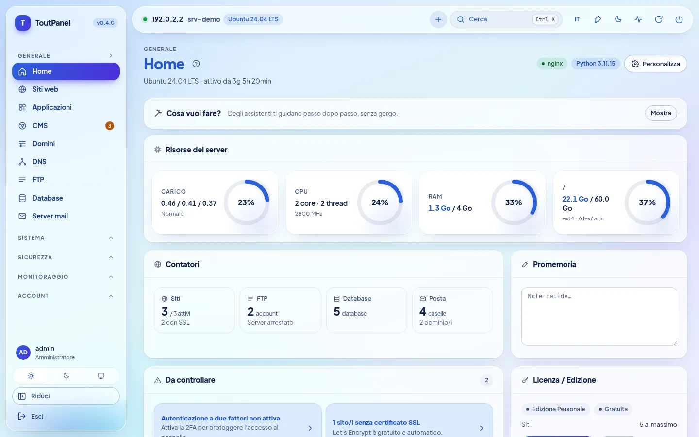

---

## Cos'è ToutPanel?

ToutPanel trasforma un server appena installato in una **piattaforma di hosting web completa**, gestita dal browser. Un solo comando installa lo stack (per impostazione predefinita Nginx, PHP-FPM, MariaDB, Redis o Valkey, Certbot, Fail2ban, oppure lo stack che componi tu: profili, versioni, server web, FTP, posta, DNS, acceleratori), il pannello e il suo servizio; poi crei siti, database, caselle di posta, zone DNS e certificati in pochi clic, senza modificare un solo file di configurazione.

È pensato tanto per chi ospita **i propri siti** (edizione Personale gratuita, senza chiave né registrazione) quanto per **agenzie e provider di hosting** che rivendono hosting: account rivenditore e cliente, piani e quote, fatturazione, white label, multi-server e alta disponibilità (edizioni Professionale ed Enterprise).

I tuoi dati restano **sul tuo server**: nessun font né CDN esterno nell'interfaccia, nessuna chiamata al server delle licenze finché non viene attivata una licenza.

**Questo README è volutamente completo e onesto.** Ogni funzione è contrassegnata *(sperimentale)* quando lo è, **Pro** quando richiede un'edizione a pagamento, e ogni sezione dice che cosa è stato **realmente eseguito** dai test e che cosa lo è stato solo con simulazioni o per niente. La tabella [Cosa è testato davvero, simulato o non testato](#cosa-è-testato-davvero-simulato-o-non-testato) le riunisce, e i [Limiti noti](#limiti-noti) elencano le riserve. Se una funzione è per te critica, convalidala su un server di prova prima della produzione.

> **Questo repository non contiene alcun codice sorgente.** Pubblica soltanto ciò che serve a installare il pannello: gli installer `install.sh` e `install.ps1`, il pannello compilato (`dist/`, wheel Python «solo bytecode»), le note di versione, la licenza e `version.json`.

## Installazione rapida

**Linux** (come `root`, di preferenza su un server appena installato). Il comando passa `--lang it`: l'installer parla italiano e l'italiano diventa anche la lingua iniziale del pannello.

```bash
curl -sSL https://raw.githubusercontent.com/qu3ntin01/toutpanel/main/install.sh | sudo bash -s -- --lang it
```

**Windows** (PowerShell **come amministratore**). La prima riga, `$env:TOUTPANEL_LANG`, fa parlare italiano l'installer:

```powershell
$env:TOUTPANEL_LANG = "it"
Set-ExecutionPolicy Bypass -Scope Process -Force
iwr -useb https://raw.githubusercontent.com/qu3ntin01/toutpanel/main/install.ps1 | iex
```

Al termine lo script mostra l'URL del pannello (con il suo **ingresso segreto**), l'account amministratore e il link della **procedura guidata di configurazione**. Tutto si sceglie anche con opzioni: stack (`--profile`, `--web`, `--php`, `--db`, `--ftp`, `--mail`, `--dns`, `--accel`…), firewall (`--firewall`), versione precisa (`--version`), lingua (`--lang`), cartella (`--home`, `/var/toutpanel` per impostazione predefinita) e password senza mostrarla nell'elenco dei processi (`TOUTPANEL_PASSWORD`, `--password-file`, `--password-stdin`). L'**[assistente di installazione](https://toutpanel.com/installation-assistant)** genera la riga di comando con dei menu. Dettagli, requisiti, porte e risoluzione dei problemi: [Installazione completa](#installazione-completa).

## Panoramica

| | |
|---|---|
| **Sistemi** | Linux: Debian 11+, Ubuntu 20.04+, AlmaLinux / Rocky Linux / RHEL / CentOS Stream / Oracle Linux 8+, Fedora, con altre famiglie in stack ridotto (openSUSE, Arch, Alpine, Amazon Linux…) e un **livello di supporto** visualizzato (`toutpanel compat`); Windows 10 / 11, Windows Server 2016 → 2025 (meno collaudato di Linux) |
| **Server web** | Nginx, Apache, Nginx + Apache, **Caddy**\*, **OpenLiteSpeed**\* (LSPHP, LSCache), **LiteSpeed Enterprise**\* (prodotto commerciale, mai avviato nei nostri test: vedi i [limiti](#limiti-noti); `--web litespeed` richiede `--accept-litespeed-license`), IIS (di base); Apache + mod_php *in arrivo* |
| **Stack software** | **compositore**: profili, versioni, schema, installazione riprendibile, stato reale; acceleratori (OPcache, JIT, Redis / Valkey, Memcached, Varnish\*, Brotli, Zstandard\*, HTTP/3\*) |
| **PHP** | da 5.6 a 8.5 affiancati, 138 estensioni a catalogo, una versione per sito, `php.ini` e pool FPM per sito |
| **Applicazioni** | runtime Node.js, Python (WSGI / ASGI), Ruby, Go, Java, .NET con versione per sito, systemd, PM2, Passenger; Docker e Compose; deploy Git atomico |
| **Database** | MariaDB, MySQL (della distribuzione, o 8.4 / 9.x Oracle\*), Percona Server\*, PostgreSQL, MongoDB, SQLite, Redis / Memcached per account |
| **FTP, DNS, posta** | FTP: integrato, Pure-FTPd\*, ProFTPD\*, vsftpd\*, solo SFTP\* · DNS: BIND, PowerDNS, Knot · posta: Postfix + Dovecot, Exim\* · un solo motore alla volta, passaggio con ripristino · webmail Roundcube, SnappyMail, SOGo\* |
| **Firewall e sicurezza** | firewall gestito (nftables, ufw, firewalld, CSF, iptables) **oppure a monte**, salvaguardia anti-blocco; Fail2ban; WAF integrato, ModSecurity, ToutWAF; antimalware; isolamento degli account (**equivalente parziale** di CageFS) |
| **CMS** | 595 CMS e applicazioni a catalogo (582 verificati: 536 gratuiti, 46 commerciali), versione a scelta, installazioni monitorate e aggiornamenti |
| **Interfaccia** | **interfaccia in 10 lingue**, 13 temi chiaro / scuro (**Horizon** per impostazione predefinita), colore di accento libero, **16 assistenti** guidati, **Diagnostica con 844 verifiche**, accessibilità che mira a WCAG 2.1 AA (**non sottoposta ad audit**) |
| **Documentazione** | scritta in francese; tradotta in inglese, tedesco, spagnolo, italiano, olandese, portoghese, russo, cinese e arabo per il **79% delle pagine** (75 su 94, per ciascuna di queste 9 lingue); le 19 pagine restanti (sezione Riferimento: API, codici di errore, modelli… ; pagine della Diagnostica) restano in francese con un banner; il catalogo della Diagnostica e i messaggi dell'API sono tradotti nelle 10 lingue |
| **Installer** | `install.sh` e `install.ps1` in 10 lingue (inglese per impostazione predefinita, `--lang` / `--fr`…, `TOUTPANEL_LANG`, lingua del sistema), opzioni di stack e di firewall, versione precisa (`--version`), [assistente di installazione](https://toutpanel.com/installation-assistant) che genera il comando |
| **Automazione** | API REST (1017 operazioni OpenAPI), CLI `toutpanel`, webhook firmati, script pre / post-azione, Ansible e Terraform, **Marketplace di 800 moduli** di integrazione (maturità indicata) |

<sub>\* *sperimentale*: reale, ma meno collaudato o con limiti dichiarati nell'interfaccia e nei [limiti noti](#limiti-noti).</sub>

## Novità della 0.5

La **0.5.0** è la versione **stabile** (ramo [`main`](https://github.com/qu3ntin01/toutpanel/tree/main)); riprende le anteprime **0.5.0b1** (sezione **Analytics**) e **0.5.0b2** (**integrazione ToutWAF**, SSL gestito in ToutWAF), vi aggiunge la **sezione «Server web» di ToutWAF** e dei **correttivi di sicurezza** emersi da una revisione indipendente. Ogni riga dice che cosa è reale e che cosa non lo è: «nuovo in 0.5» significa reale e testato, ma meno collaudato delle funzioni della 0.4.

| Novità | Maturità e riserve |
|---|---|
| **Analytics** (Monitoraggio → Analytics): statistiche di frequentazione **self-hosted**, in stile Google Analytics — visitatori online, provenienza del traffico, pubblico, pagine, eventi, obiettivi e funnel, report tecnici, confronto tra periodi, filtri, export CSV / JSON, report via e-mail, avvisi, link di condivisione in sola lettura; **senza cookie per impostazione predefinita, indirizzo IP mai conservato** | **nuovo in 0.5**: motore e API testati (≈ 560 test); percorsi end-to-end in un **vero Chromium** contro un **vero pannello** (130 visitatori, 427 visualizzazioni di pagina, 54 verifiche uguali al dato reale di riferimento); tracker collaudato solo con Chromium (Safari e Firefox non testati); durata e tempo reale esatti richiedono il tracker, i soli log danno visualizzazioni di pagina; senza cookie, nessun visitatore di ritorno da un giorno all'altro |
| **Mappa del mondo**: 236 paesi, zoom, continenti, città raggruppate, arrivi animati in tempo reale, temi chiaro e scuro | **nuovo in 0.5**: fluidità misurata con rendering software, **non su una vera scheda grafica** |
| **Geolocalizzazione DB-IP** installata dal pannello (paesi, città, reti; CC BY 4.0, aggiornamento mensile) | **nuovo in 0.5**: lettore convalidato sul **vero** database Paesi; database **Città e Reti** convalidati solo su file sintetici; senza database, i paesi sono «sconosciuti» |
| **Variante Proxy**: il tracker è servito dal sito stesso (contro i blocchi pubblicitari) | Nginx e Apache convalidati con **veri server**; Caddy: solo rendering e sintassi; **OpenLiteSpeed, LiteSpeed Enterprise, IIS non supportati** (codice da incollare a mano) |
| **Integrazione ToutWAF**: creazione di siti da ToutWAF (token API limitato consegnato al collegamento, ripetizione senza duplicati tramite `Idempotency-Key`, schema pubblicato del modulo di creazione), **SSL gestito in ToutWAF** (ToutWAF termina l'HTTPS, la pagina SSL del pannello gestisce i certificati in ToutWAF), interruttori globale e per server del cluster, **sezione «Server web» di ToutWAF** (token predefinito a portata ridotta, `GET /api/capabilities`, `GET /api/sites/{id}`, avanzamento delle attività, `toutpanel waf connect --ssl toutwaf|panel`, `toutpanel waf status`) | **nuovo in 0.5**: testata contro un **falso ToutWAF** che segue il contratto descritto dai suoi sviluppatori (≈ 500 test); **nulla provato contro un vero ToutWAF** (né la sezione «Server web», né l'SSL gestito); percorsi di rinnovo, di opzioni HTTPS e di capacità dell'API dei certificati di ToutWAF da confermare; interfaccia SSL non verificata in un browser |
| **Correttivi di sicurezza** (revisione indipendente, due passaggi): escalation di ambito di un token API (presente dalla 0.4.0), token ToutWAF composto, log e chiave privata TLS di un sito, dati Analytics di un sito eliminato, lettura di `X-Forwarded-For`, idempotenza per token, limiti di ingestione Analytics | **reale**: un test di non regressione per correttivo; dettaglio e gravità nel [registro delle modifiche](CHANGELOG.md); revisione non esaustiva (convalida delle direttive di vhost, ReDoS degli analizzatori non esaminati) |
| **Traduzioni**: interfaccia e messaggi del server nelle 10 lingue, pagina Analytics della documentazione in 9 lingue | documentazione tradotta per il **79% delle pagine** (75 su 94); le 19 pagine di riferimento restanti (cataloghi della Diagnostica, codici di errore, API, impostazioni, modelli) restano in francese |

## Novità della 0.4

La **0.4.0** è la versione **stabile** precedente (le versioni 0.4.0b1 e 0.4.0b2 erano anteprime del canale `dev`). Ogni funzione riporta la sua maturità: **stabile**, **sperimentale** (reale e testata, ma meno collaudata o con limiti dichiarati) o **in arrivo** (visibile, in grigio, mai simulata). La colonna di destra dice che cosa è riservato o limitato; il dettaglio onesto di ogni punto si trova nella sezione corrispondente delle [Funzionalità](#funzionalità).

| Novità | Maturità e riserve |
|---|---|
| **Ascolto HTTP e HTTPS simultaneo** del pannello (8888 / 8443, certificato autofirmato all'inizio); certificato Let's Encrypt del pannello con autorità a scelta, DNS-01, wildcard e **ricaricamento a caldo** | stabile; testato con Pebble (server ACME di prova), non con il vero Let's Encrypt |
| **Installazione di una versione precisa**: `--version X.Y.Z`, `--list-versions`; **cartella `/var/toutpanel` per impostazione predefinita** | stabile |
| **Firewall gestito dal pannello o a monte**, pagina dedicata, porte da aprire, **salvaguardia anti-blocco di 60 s** | stabile; regole testate con veri nftables / iptables in un namespace di rete privato |
| **Compositore di stack**: profili, versioni, schema di architettura, stima di memoria / disco, **procedura guidata di prima configurazione in 9 passaggi**, pagina **Stack software** | stabile |
| **Motori DNS**: BIND, PowerDNS, Knot DNS (passaggio con migrazione delle zone e delle chiavi DNSSEC, ripristino) | stabile; testati con i veri demoni su Ubuntu 24.04 |
| **Motori di posta**: Postfix + Dovecot, relay esterno, **Exim + Dovecot**; **motori FTP**: integrato, **Pure-FTPd, ProFTPD, vsftpd, solo SFTP** | Postfix e FTP integrato: stabile; Exim e altri motori FTP: **sperimentale** |
| **Server web**: **OpenLiteSpeed** (LSPHP, LSCache), **Caddy**, **LiteSpeed Enterprise** (passaggio da / verso Nginx, Apache, «entrambi» con ripristino) | **sperimentale**; OpenLiteSpeed e Caddy testati davvero su Ubuntu 24.04; **LiteSpeed Enterprise non è mai riuscito ad avviarsi** (licenza di prova rifiutata), solo la sua installazione ufficiale e la convalida della sua configurazione sono state realmente eseguite |
| **Acceleratori**: OPcache, JIT, APCu, Redis / Valkey, Memcached, cache FastCGI, Brotli; **Varnish, Zstandard, HTTP/3** (compreso Nginx di nginx.org installabile con salvaguardie) | Varnish, Zstandard, HTTP/3: **sperimentale**; altri: stabile |
| **Database**: MariaDB 10.6 → 11.8, **MySQL 8.4 / 9.x** (repository Oracle), **Percona Server**, PostgreSQL 13 → 18; **password dei database cifrate a riposo** | MySQL Oracle e Percona: **sperimentale** (mai installati né avviati nei nostri test) |
| **Isolamento degli account**: servizio PHP-FPM per account nella sua slice cgroup, hardening systemd, **gabbia del file system** (bind mount + bubblewrap) | opzioni, **disattivate per impostazione predefinita**; **equivalente parziale di CageFS** (kernel e rete condivisi); non testati: SELinux enforcing con questo isolamento (SELinux Enforcing è convalidato senza di esso su AlmaLinux, vedi [Sicurezza](#section-12)), cgroup v2 con limiti realmente applicati, server intero sotto systemd |
| **Runtime per sito** (Node.js, Python, Go, Java, Ruby, .NET), **WSGI / ASGI**, **PM2**, **Passenger** | reale: Node 20, Python 3.12, gunicorn, uvicorn, PM2, Nginx + Passenger; Go, Java, .NET simulati; Ruby non compilato |
| **Statistiche**: GoAccess, **AWStats**, Matomo; **preproduzione** (staging) con database e sincronizzazione in entrambe le direzioni | GoAccess, AWStats e preproduzione (MariaDB) testati davvero; Matomo **mai messo alla prova** con una vera istanza |
| **Backup**: cifratura AES-256-GCM, incrementali nativi, destinazioni **rsync** e **Borg**, profilo «server completo», backup parziale / modalità rigorosa, test di ripristino | rsync e Borg 1.2.8 testati davvero; restic, S3, B2 e rclone **simulati**; rsync / Borg e restic: **Pro** |
| **Posta**: limite di invio del `mail()` PHP, **DMARC per dominio**, **BIMI**, **DANE**, MTA-STS / TLS-RPT, **SpamAssassin**, **SOGo**, coda e CalDAV / CardDAV testati | SOGo **sperimentale** (`sogod` mai eseguito); catena VMC di BIMI e firma DNSSEC non verificate |
| **Migrazione**: import **ISPConfig** completo (SSH, archivio, dump SQL), trasferimento di sito o dominio tra clienti, **migrazione di account tra server estesa** (posta, FTP, cron, SSL, piano) | **Pro**; cPanel / Plesk / DirectAdmin testati su archivi **fabbricati**; mai testata su due server fisici |
| **Alta disponibilità**: IP flottante keepalived / VRRP, storage condiviso NFS / GlusterFS, replica Dovecot, storico per nodo, modello Zabbix, **riparazione automatica estesa** | **Pro**; configurazioni convalidate dagli strumenti reali, **nessun failover testato tra due macchine** |
| **Autenticazione**: SSO SAML / OIDC / LDAP testati contro provider di prova, WebAuthn testato con un autenticatore virtuale, **TLS rinforzato**, **avvisi di accesso insolito** al titolare | SSO: **Pro**; nessun provider di identità di produzione né chiave fisica testati |
| **Diagnostica** (Sistema › Diagnostica): **844 verifiche**, **90 correzioni automatiche** con anteprima, **16 assistenti** di configurazione guidati con test reale | pianificazione della Diagnostica: **Pro**; una parte delle verifiche è testata con servizi simulati |
| **Messaggi del server tradotti** nelle 10 lingue; **ToutWAF remoto**; compatibilità estesa delle distribuzioni; **installer multilingue** con opzioni di stack | stabile; alcuni messaggi composti dinamicamente restano in francese |
| **Marketplace** di 800 moduli di integrazione (fatturazione, gateway, monitoraggio, CI/CD, IaC, SSO, DNS / CDN, backup, temi…) | **5 stabili**, 199 beta, 596 **generati** (mai provati con il vero servizio) |
| Apache + mod_php | **in arrivo** (rifiutato in modo pulito, mai simulato) |

Dettagli e limiti: [Limiti noti](#limiti-noti) · [CHANGELOG.md](CHANGELOG.md).

## Funzionalità

Il piano segue le **20 sezioni** di un riferimento di pannello di hosting completo (dal livello cPanel / Plesk / ISPConfig / DirectAdmin alle funzioni avanzate), poi l'ecosistema. In ogni sezione, la riga «**Reale / limiti**» dice onestamente che cosa è stato eseguito e che cosa no. Documentazione dettagliata di ogni pagina: **[toutpanel.com/docs](https://toutpanel.com/docs/)** (servita anche dal pannello sotto `/help/` quando viene costruita durante l'installazione, con una guida contestuale su ogni pagina).

<a id="section-1"></a>

### 1. Account, utenti e multi-tenant

- Gerarchia **amministratore → rivenditore (Pro) → cliente → sotto-utente**; un rivenditore vede e crea solo nel proprio perimetro.
- **RBAC granulare**: permessi per modulo e per azione, intersezione di ruolo, piano, profilo di accesso e genitore; profili integrati **Completo, Sviluppatore, Contabile, Webmaster, Sola lettura** e profili personalizzati.
- **Piani e quote**: disco, inode, traffico, siti, domini, database (e dimensione per database), domini e caselle di posta, attività pianificate, account FTP, zone DNS, backup, sotto-utenti; quote conteggiate e bloccanti alla creazione. Il traffico mensile non interrompe il sito: fa scattare un avviso, la fatturazione dell'eccedenza e la sospensione automatica se la attivi.
- **Limiti di risorse per account**: utente di sistema dedicato, slice systemd (CPU, memoria, I/O, processi) applicata alle attività pianificate, ai deploy Git, alle applicazioni, al terminale e alle istanze Redis / Memcached; **alle sole richieste PHP con l'isolamento «servizio PHP-FPM per account»** (opzione, disattivata per impostazione predefinita). Limite di connessioni simultanee per sito: **solo Nginx**.
- **Sospensione** e riattivazione, manuali o automatiche (insoluto, superamento della quota dopo il periodo di tolleranza).
- **Accesso «come»** (impersonificazione) tracciato nel registro di audit e limitato nel tempo.
- **Trasferimento** di un sito o di un dominio da un cliente a un altro: file, FTP, backup, database, zone DNS, domini di posta, attività pianificate, preproduzione, progetti Compose; proprietà dei file, vhost e pool PHP-FPM rigenerati, quote verificate, anteprima prima dell'esecuzione.
- **Creazione in blocco** (fino a 500 account), **import / export CSV** (1 000 righe, protezione contro l'injection di formule, UTF-8 / UTF-16 / Windows-1252), **note interne** e **etichette** (tag) filtrabili.

> **Reale / limiti**: la gerarchia, i permessi, le quote, la sospensione e il trasferimento sono coperti da test dell'API, e i profili sono verificati route per route. `setquota` (quote di disco e inode del file system) è stato verificato solo con un esecutore fittizio e presuppone un file system montato con `usrquota`. I cgroup v2 reali con limiti applicati non sono stati testati. La sospensione di un account sul master non viene propagata ai suoi account speculari sui nodi; i siti ospitati su un nodo non sono trasferibili tra clienti.

<a id="section-2"></a>

### 2. Autenticazione e accesso al pannello

- **2FA TOTP** con codici di emergenza, imponibile per ruolo o per piano; **chiavi di sicurezza WebAuthn / FIDO2 e passkey** (incluse nell'edizione Personale).
- **SSO aziendale (Pro)**: **OpenID Connect** (discovery, PKCE), **SAML** (metadati, anti-replay, gruppo → ruolo), **LDAP / Active Directory** (LDAPS / StartTLS con **verifica del certificato attiva per impostazione predefinita**); un accesso SSO non concede mai per impostazione predefinita il ruolo di amministratore.
- **Restrizione di accesso** al pannello tramite whitelist di indirizzi IP / CIDR e per paese (GeoIP, database MaxMind da fornire) con **rifiuto di salvare una regola che escluderebbe l'amministratore**.
- **Anti-forza bruta**: blocco persistente per IP e per account, tempo di risposta costante, **captcha ALTCHA** self-hosted dopo N tentativi falliti, jail Fail2ban del pannello, avviso di raffica di fallimenti.
- **Sessioni**: elenco, revoca (anche lato amministratore), scadenza assoluta e per inattività.
- **Policy delle password**: lunghezza, classi di caratteri, parole comuni, nome utente, **Have I Been Pwned** in k-anonimato (disattivabile), cronologia, scadenza; **reimpostazione** tramite link firmato monouso.
- **Registro degli accessi** e **avvisi di accesso insolito** (nuovo indirizzo IP, nuovo paese, nuovo dispositivo) inviati all'amministratore **e al titolare dell'account** (disattivabili per account, e-mail o SMS).
- **Pannello in HTTPS**: ascolto HTTP e HTTPS simultaneo, certificato autofirmato con SAN all'inizio (rigenerato se l'indirizzo cambia), poi **Let's Encrypt per il nome host del pannello** (ZeroSSL, Buypass o ACME personalizzato, DNS-01 e wildcard) con ricaricamento a caldo; **ingresso segreto** nell'URL (senza di esso, il pannello risponde 404).

> **Reale / limiti**: TOTP, blocco, sessioni, policy delle password: testati. **WebAuthn**: testato con un autenticatore virtuale di Chromium (registrazione e accesso reali), **non con una chiave fisica**. **OIDC**: testato contro un vero server OIDC locale (PKCE verificato, token falsificati rifiutati); **SAML**: testato con un provider di identità di prova (31 test: asserzione valida, scaduta, riprodotta, falsificata…); **LDAP**: testato contro un vero OpenLDAP (`slapd`); **nessun provider di identità reale** (Keycloak, Entra ID, Okta…) è stato provato. Il **nuovo paese** viene rilevato con un vero database MaxMind di prova. Let's Encrypt del pannello: testato con **Pebble** + certbot 5.8 + BIND, **non** con il vero servizio. La libreria SAML (`python3-saml` + `xmlsec1`) è facoltativa; il pannello si avvia senza.

<a id="section-3"></a>

### 3. Web e hosting di siti

- **Siti con un clic**: multi-dominio, alias, **domini parcheggiati**, domini **reindirizzati**, **wildcard** (`*.esempio.com`), PHP-FPM, statico, reverse proxy, applicazioni. Un sottodominio è un nome di dominio del sito o un sito distinto.
- **Server web**: vhost **Nginx, Apache, Nginx + Apache, Caddy\*, OpenLiteSpeed\*, LiteSpeed Enterprise\* o IIS** generati da template Jinja2 e **convalidati prima del ricaricamento** (`nginx -t`, `apachectl -t`, `caddy validate`…), con ritorno agli ultimi vhost validi in caso di errore; **passaggio** Nginx ↔ Apache ↔ «entrambi» ↔ Caddy ↔ OpenLiteSpeed ↔ LiteSpeed con ripristino; le funzioni che un server non riproduce (WAF integrato, ModSecurity, filtro per paese, `.htaccess`…) sono **segnalate**, mai ignorate in silenzio.
- **PHP multi-versione** 5.6 → 8.5 affiancate (Sury, PPA ondrej, Remi, windows.php.net), una versione e **un pool PHP-FPM per sito**, sotto l'utente dell'account; **`php.ini` per sito** (13 direttive consentite tra cui `disable_functions` e `open_basedir`, convalidate contro l'injection), **138 estensioni** a catalogo (gestite per versione di PHP, amministratore), ionCube, **parametri FPM** (`pm`, `max_children`, `start_servers`, timeout, `max_requests`…).
- **Runtime applicativi**: Node.js, Python (**WSGI / ASGI**: gunicorn, uvicorn, hypercorn, daphne, waitress), Ruby, Go, Java, .NET, con **versione del runtime per sito** (download ufficiali verificati con SHA-256, `uv` per Python, mai compilazione; nvm, pyenv, ecc. rilevati), unità **systemd**, **PM2**, **Phusion Passenger** (Nginx e Apache), proxy verso una porta o un socket Unix (WebSocket incluso), ricaricamento senza interruzioni, `toutpanel runtimes`.
- **Reverse proxy** verso una porta o un socket, **bilanciamento del carico** (round robin, `least_conn`, `ip_hash`).
- **Reindirizzamenti** 301 / 302 (con o senza query, espressioni regolari), forzatura HTTPS, host canonico `www`.
- **Header HTTP** personalizzati (CSP, X-Frame-Options…) e **HSTS** (durata regolabile, `includeSubDomains`, `preload` con conferma e controllo preliminare).
- **Direttive Nginx / Apache / Caddy personalizzate per vhost** (amministratore): scrittura, rigenerazione, test del server, **ripristino automatico** se il server le rifiuta.
- **Directory protette** da password (bcrypt) e regole di accesso per IP, **pagine di errore** personalizzate, **anti-hotlink**, **modalità manutenzione** (503 con `Retry-After`, IP autorizzati).
- **HTTP/2**, **HTTP/3 / QUIC\*** (nativo con Caddy e OpenLiteSpeed; con Nginx compilato con QUIC, o Nginx di nginx.org installabile dalla pagina Acceleratori con simulazione, backup e ripristino; impossibile con il solo Apache), compressione **Brotli** (se il modulo esiste), **Gzip**, **Zstandard\***.
- **Cache**: FastCGI cache (Nginx), **OPcache**, **Redis / Valkey**, **Memcached**, **Varnish\*** (solo HTTP), LSCache (OpenLiteSpeed e LiteSpeed Enterprise), con **svuotamento dal pannello** (pulsante «Svuota la cache» per sito e per acceleratore).
- **Preproduzione (staging)**: clone di un sito (file + database), sostituzione degli URL **senza wp-cli** (compresi i valori PHP serializzati), tabelle escluse, sincronizzazione **verso la produzione, dalla produzione o in entrambe le direzioni** (file: vince il più recente; database unito riga per riga per chiave primaria, regola di conflitto a scelta, **eliminazioni mai propagate**), backup preventivo da entrambe le parti.
- **Root del sito** configurabile (`public/`, `web/`…), **log di accesso e di errore per sito** consultabili in diretta e scaricabili (rotazione logrotate).
- **Statistiche di traffico** con tre motori: **GoAccess**, **AWStats**, **Matomo** «per questo sito»; **monitoraggio della banda** per sito, mese per mese.

> **Reale / limiti**: Nginx: vhost serviti da un **vero Nginx** e interrogati con curl (reindirizzamenti, 401 / 403, anti-hotlink, manutenzione, wildcard, pagine di errore). Apache: vhost convalidato da `apache2 -t`, **mai servito davvero** nei nostri test; Nginx davanti ad Apache: mai avviati insieme; il passaggio Nginx / Apache è testato con un esecutore fittizio e la sintassi reale dei vhost. OpenLiteSpeed: vero OpenLiteSpeed avviato che serve PHP, statico, reindirizzamento, autenticazione, LSCache. **Caddy**: vero Caddy 2.11 (HTTP, HTTPS, HTTP/2, HTTP/3, PHP-FPM, proxy, ricaricamento senza interruzioni) su Ubuntu 24.04; famiglia RHEL, ACME reale non eseguiti. **LiteSpeed Enterprise: mai avviato** (vedi [limiti](#limiti-noti)). `disable_functions` / `open_basedir`: verificati con un vero PHP-FPM. Installazione delle versioni di PHP dai repository: non eseguita nei nostri test (Internet). **Runtime**: reale per Node 20, Python 3.12, gunicorn, uvicorn, PM2 e Nginx + Passenger; **Go, Java e .NET simulati**, Ruby non compilato, unità systemd di un'applicazione non avviata. **HTTP/3**: vero binario Nginx 1.31 che serve HTTP/3 a un client QUIC; l'installazione del pacchetto nginx.org sulla macchina non è stata eseguita. Brotli dipende dal modulo Nginx. Memcached e Varnish (VCL compilata da `varnishd` 7.1): eseguiti davvero, ma la messa in servizio completa di Varnish davanti a Nginx no. **GoAccess e AWStats**: eseguiti davvero; **Matomo: mai messo alla prova con una vera istanza** (falso server API). **Preproduzione**: testata su una vera istanza MariaDB, l'unione riga per riga vale solo per MySQL / MariaDB (PostgreSQL e SQLite vengono copiati senza sostituzione degli URL). L'HTTP/3 di Apache e la cache FastCGI di Apache non esistono.

<a id="section-4"></a>

### 4. SSL / TLS

- **Let's Encrypt**, **ZeroSSL** (EAB), **Buypass**, server ACME personalizzato; validazione **HTTP-01** e **DNS-01** (scrittura del TXT in BIND / PowerDNS o presso Cloudflare, OVH, Route53), certificati **wildcard**, certificati **SAN / multi-dominio** (tutti i nomi, alias e domini parcheggiati del sito).
- **Rinnovo automatico** quotidiano con ricaricamento dei servizi interessati (server web, posta, FTP, pannello) e **avviso in caso di errore**; **avvisi prima della scadenza** a 30 / 14 / 7 / 1 giorni (regolabili).
- **Import** di certificati commerciali (CRT, chiave, catena, **PFX**) e **generazione di CSR** (RSA / EC, SAN, chiave privata conservata sul server); certificati autofirmati; pagina **Certificati** con validità, emittente e scadenza di tutti i certificati.
- **SSL per i servizi**: posta (SNI Postfix / Dovecot), FTP / FTPS, pannello, nome host.
- **TLS rinforzato**: profili Mozilla (moderno = solo TLS 1.3, intermedio per impostazione predefinita, vecchio), suite personalizzate convalidate, **OCSP stapling** regolabile, curve e DH ffdhe2048, `ssl_session_tickets off`, HSTS per sito.

> **Reale / limiti**: testato con **Pebble** (server ACME di Let's Encrypt), il vero certbot 5.8 e un vero BIND: HTTP-01, DNS-01, wildcard, rinnovo, errore, EAB. **Nessuna emissione presso il vero Let's Encrypt, ZeroSSL o Buypass è stata eseguita.** DNS-01 richiede che la zona del dominio sia gestita dal pannello (o da un provider configurato). TLS: verificato con un vero Nginx, `openssl s_client` (protocolli e suite realmente offerti per profilo), un vero risponditore OCSP e `apache2 -t`; l'adattamento a OpenLiteSpeed e Caddy non è testato; nessuna crittografia post-quantistica. I certificati FTP non sono monitorati dagli avvisi di scadenza.

<a id="section-5"></a>

### 5. DNS

- Zone servite da **BIND, PowerDNS o Knot DNS** (un solo server locale alla volta; passaggio con migrazione delle zone e delle chiavi DNSSEC, ripristino) oppure inviate a un provider.
- **14 tipi di record**: A, AAAA, CNAME, MX, TXT, SRV, NS, CAA, PTR, TLSA, DS, SSHFP, HTTPS, SVCB, con validazione puntuale; **template di zona** applicati alla creazione (variabili `{domain}`, `{ip}`, `{mail}`…).
- **DNSSEC**: firma automatica (BIND `dnssec-policy`, Knot KASP, PowerDNS), DS e DNSKEY mostrati per il registrar, rotazione manuale (BIND, Knot; **PowerDNS: rotazione fuori dal pannello**).
- **Server secondari** tramite TSIG (AXFR + NOTIFY), automatici sui nodi del parco (**Pro**).
- **Provider esterni** via API: **Cloudflare, OVH, Route 53, PowerDNS** (invio e import di zone); zone esterne: elenco, export (BIND, CSV, JSON) e **verifica della propagazione con `dig`**.
- **Import / export BIND**, TTL per record e per zona, **numeri di serie automatici** (`AAAAMMGGnn`), **DNS inverso (PTR)** degli IP del server, **verifica della propagazione** (1.1.1.1, 8.8.8.8, 9.9.9.9 e server locale) e convalida della sintassi (`named-checkzone` prima del ricaricamento).
- **Record di posta automatici**: MX, SPF, DKIM, DMARC, SRV IMAP / SMTP / POP3, `autoconfig` / `autodiscover`, MTA-STS, TLS-RPT, CalDAV / CardDAV; IPv6, nomi internazionali (IDN), host di posta fuori dalla zona.

> **Reale / limiti**: BIND, PowerDNS e Knot reali (`named-checkzone`, `dig`, ciclo di passaggio BIND → PowerDNS → Knot che conserva lo stesso DS). Le **API Cloudflare, OVH, Route 53 e PowerDNS sono state testate con un trasporto simulato**, mai con i veri servizi. Il **cluster di server secondari** non ha mai girato con due veri server DNS. Il PTR è efficace solo se il blocco di indirizzi ti è delegato: il pannello non può chiederlo al tuo provider. La propagazione non controlla i tipi PTR, TLSA, DS, SSHFP, HTTPS e SVCB.

<a id="section-6"></a>

### 6. Posta

- **Postfix + Dovecot + OpenDKIM**, Rspamd o SpamAssassin, **Exim + Dovecot\*** a scelta (sottoinsieme di Postfix, limiti dichiarati), relay esterno; domini, **caselle con quote**, **alias**, **inoltri**, **indirizzo catch-all**, **liste di distribuzione** (mlmmj), **risponditore automatico con intervallo di date**, **filtri Sieve** (regole guidate o script, ManageSieve), IMAP / POP3 in TLS, invio 587 / 465.
- **Webmail** Roundcube, SnappyMail o **SOGo\*** installata con un clic, con **accesso diretto dal pannello**.
- **SPF, DKIM** (generazione, **rotazione con doppia pubblicazione**), **DMARC per dominio** (`none` / `quarantine` / `reject`, `pct`, `rua`, `ruf`, `sp`, `adkim`, `aspf`, `fo`, **aumento graduale guidato**), **MTA-STS** e **TLS-RPT**, **BIMI** (logo SVG ospitato dal pannello, pubblicato solo con un DMARC di applicazione al 100%), **DANE** (TLSA `3 1 1` per le porte di posta, **rotazione in due tempi**).
- **Antispam** Rspamd (impostazioni per dominio e per casella, apprendimento spam / ham) o **SpamAssassin** gestito (spamd, `spamass-milter`, `user_prefs` per casella; amavis sperimentale), **antivirus ClamAV**, **greylisting**, **RBL / DNSBL**, **whitelist e blacklist** globali, per dominio o per casella.
- **Limitazione della velocità di invio**: per casella, per piano e predefinita (utente SMTP autenticato, tramite Rspamd) **e limite del `mail()` PHP per sito e per account** (envelope `sendmail` del pannello: registro, tetti su 1 h e 24 h, avviso, protezione contro l'injection di header) perché un sito violato non faccia spam.
- **Relay in uscita / smarthost**, **coda** (flush, sospensione, eliminazione), **registro e tracciamento di un messaggio**, **autoconfigurazione** dei client (Outlook, Thunderbird), **fetchmail**, **CalDAV / CardDAV** (Radicale), **monitoraggio della reputazione dell'IP** (blacklist, su tutti gli indirizzi pubblici del server e gli IP di uscita dei nodi).

> **Reale / limiti**: la coda è testata con un **vero Postfix**; Dovecot: configurazione convalidata da `doveconf`; CalDAV / CardDAV: **vero Radicale 3.8**; SpamAssassin: `spamassassin --lint`, `spamd` e `spamc` reali; il `mail()` PHP: envelope eseguito davvero con il vero `mail()` di PHP. **Simulati**: Rspamd, ClamAV, mlmmj, fetchmail, i montaggi `spamass-milter` / amavis; **SOGo: sperimentale, `sogod` mai eseguito**. BIMI: la **catena del certificato VMC non è verificata**; DANE: la firma DNSSEC non è verificata (DANE ha senso solo con DNSSEC). Il limite del `mail()` PHP **non vede** uno script che chiama direttamente `sendmail` o apre una connessione SMTP. Con Exim: nessun tracciamento dei messaggi né liste di distribuzione; con SpamAssassin: nessun limite di velocità per casella né greylisting. I report DMARC ricevuti non vengono analizzati. La pubblicazione DNS automatica presuppone che la zona sia gestita dal pannello. Un server di posta affidabile richiede un IP pubblico fisso, un DNS inverso corretto e le porte 25 / 465 / 587 aperte.

<a id="section-7"></a>

### 7. Database

- **MariaDB (10.6 → 11.8), MySQL, Percona Server\*, PostgreSQL (13 → 18), MongoDB, SQLite**: database, utenti e **privilegi** (completi, sola lettura, personalizzati), **accesso remoto autorizzato per IP** (regola del firewall, `bind-address`, `pg_hba.conf`; `0.0.0.0/0` rifiutato).
- **Adminer** (MySQL e PostgreSQL) e **phpMyAdmin** (MySQL) installabili in versioni a scelta con compatibilità PHP verificata, **accesso unico (SSO) dal pannello**; **pgAdmin non è integrato**.
- **Import / export** (gzip al volo), **dump pianificato** (attività pianificata), **manutenzione** (verifica, riparazione, ottimizzazione, analisi), **quote di dimensione** per database (privilegi revocati poi ripristinati, avviso).
- **Scelta della versione del DBMS** (repository ufficiali MariaDB e PostgreSQL, cambio di versione maggiore con **backup preventivo**, nessun downgrade); MySQL 8.4 / 9.x (repository Oracle) e Percona\*: un solo motore della famiglia MySQL alla volta.
- **Server aggiuntivi** (Docker), **Redis / Memcached per account** (istanza isolata, socket Unix, `maxmemory` del piano, slice cgroup dell'account).
- **Replica (Pro)**: MariaDB / MySQL (GTID) e PostgreSQL (streaming), assistente di comandi **e** replica eseguita dal pannello, promozione manuale o **failover automatico** con riscrittura dell'host dei database.
- **Password dei database cifrate a riposo** (Fernet, chiave del pannello inclusa nel backup), elenchi senza password, **rivelazione esplicita e registrata**.

> **Reale / limiti**: SQLite: reale. **MariaDB**: un'istanza reale serve ai test di preproduzione e della Diagnostica, ma il livello di amministrazione SQL (utenti, privilegi, quote) è testato soprattutto con un **esecutore SQL simulato**; **PostgreSQL: simulato**; MongoDB (modulo `pymongo` facoltativo): testato con un falso client e, quando l'immagine è presente, con un vero `mongod` 7 in Docker. MySQL Oracle e Percona: pacchetti e repository verificati, **mai installati né avviati**. La replica **non è mai stata montata tra due server reali**, e il failover automatico non è un consenso. Le **credenziali root dei motori sono salvate in chiaro in `settings.json`** (permessi 0600); `mongodump` espone la password come argomento di comando.

<a id="section-8"></a>

### 8. File e accesso

- **Gestore di file**: upload, **editor CodeMirror** con evidenziazione della sintassi, permessi (`chmod`) e proprietario (`chown`), archivi zip / tar, **ricerca** per nome e nel contenuto, **cestino**, **occupazione di disco e inode per cartella**, trascinamento, **correzione di permessi e proprietario con un clic**.
- **Server FTP / FTPS integrato** (account multipli, directory limitata, diritti, quote, IP autorizzati, registro) oppure **Pure-FTPd\*, ProFTPD\*, vsftpd\*, solo SFTP\*** (account del pannello sincronizzati, passaggio con ripristino).
- **SFTP / SSH in chroot per utente** (drop-in `sshd` convalidato da `sshd -t` con ripristino, bind mount), **shell limitata** tramite jailkit o `rbash`, **chiavi SSH** (ed25519, ECDSA, RSA ≥ 2048).
- **Terminale web** (bash su Linux, PowerShell su Windows; un client resta sotto l'utente del proprio account).
- **Quote di disco e inode** per account, **WebDAV** con gli account FTP.

> **Reale / limiti**: FTPS: **vero handshake** con certificato convalidato; terminale: vero bash in PTY; jailkit: veri `jk_init` / `jk_jailuser` e vera shell confinata quando jailkit è installato; WebDAV: vero `wsgidav` (moduli facoltativi `wsgidav` + `a2wsgi`). Motori FTP alternativi: eseguiti davvero su Ubuntu 24.04, **famiglia RHEL non collaudata**. `sshd` reale mai riavviato dai test; `setquota`: vedi la sezione 1. Il terminale Windows è semplificato senza il modulo `pywinpty`.

<a id="section-9"></a>

### 9. Applicazioni e deploy

- **Installer con un clic**: catalogo di **595 CMS e applicazioni** (vedi [CMS](#cms)), tra cui WordPress, Joomla, Drupal, PrestaShop, Nextcloud, Laravel, Symfony, Matomo, Dolibarr, Moodle, phpBB, MediaWiki, Ghost.
- **WP Toolkit**: wp-cli, aggiornamenti di core, plugin e temi, hardening, clonazione, **rilevamento delle installazioni vulnerabili** (feed Wordfence Intelligence), avviso critico.
- **Deploy Git**: clone e aggiornamento (HTTPS con token o SSH con chiave di deploy per sito), ramo, tag o commit, **webhook GitHub / GitLab firmati**, **script post-deploy**, aggiornamento pianificato, **deploy atomico** (`releases/`, `shared/`, link `current`, ripristino).
- **Composer, npm, pip** lanciati da un sito (whitelist `install` / `ci` / `update`, sotto l'utente dell'account).
- **Docker**: container, immagini, **reti, volumi**, spazio su disco e pulizia, `docker run` convalidato, progetti **Docker Compose** per account con sito proxy e rifiuto degli YAML pericolosi (privilegiato, socket, mount sensibili).
- **Assistenti** «sito web», «installazione di applicazione», «deploy Git», «PHP» (vedi [sezione 19](#section-19)).

> **Reale / limiti**: Git: vero `git` su un repository locale (clone, aggiornamento, webhook firmato, deploy atomico su un vero file system); **GitHub e GitLab reali mai contattati**. `npm` e `pip` reali sotto l'utente del sito; Composer: non eseguito (nessun phar nell'ambiente di test). Docker: container, immagini, reti e volumi testati con un esecutore fittizio e, quando un demone risponde, un vero ciclo Docker. **Installazioni di CMS: download simulati** (nessuna installazione reale del catalogo eseguita end-to-end dalla suite automatica); WordPress / wp-cli reali non eseguiti dai test, a parte Matomo installato end-to-end dall'assistente «applicazione».

<a id="section-10"></a>

### 10. Attività pianificate

- **Editor visuale** campo per campo e **sintassi cron grezza** sincronizzati, anteprima delle prossime 5 esecuzioni, scorciatoie (`@daily`…), tipi: visitare un indirizzo, lanciare un comando, fare il backup di un sito o di un database.
- **Esecuzione sotto l'utente dell'account o del sito, mai come root** per un cliente: il comando viene **rifiutato** piuttosto che lanciato come root; `root` è riservato all'amministratore, con conferma e traccia nel registro di audit; limiti cgroup dell'account applicati.
- **Scheduler** a scelta: interno (APScheduler, predefinito), **timer systemd** (`OnCalendar`, `Persistent=true`) o `/etc/cron.d`, con ritorno reversibile.
- **Notifica via e-mail** (mai / errore / sempre), **cronologia di esecuzione** (stato, durata, codice, inizio dell'output), **frequenza minima imposta dal piano**, esecuzione immediata, **assistente** con test a vuoto.

> **Reale / limiti**: il confronto con il vero `systemd-analyze calendar` (18 espressioni) e `systemd-analyze verify` sono reali; **un timer systemd non è mai stato fatto scattare davvero**. Con lo scheduler interno, **le attività non girano quando il pannello è fermo** (recupero di meno di 5 minuti al riavvio); non c'è import di una crontab esistente. Su Windows, le attività dei clienti sono rifiutate.

<a id="section-11"></a>

### 11. Backup e ripristino

- **Granularità**: sito, database, cartella o file, casella di posta, dominio di posta, account, **server intero**; backup su richiesta e **pianificazioni** con retention **GFS** (giornaliera, settimanale, mensile).
- **Motore nativo (zip), incluso in tutte le edizioni**: archivi con somma SHA-256 e controllo CRC, **cifratura AES-256-GCM** opzionale (passphrase, predefinita, per destinazione, per pianificazione o per backup), **backup incrementali** (uno completo poi incrementali, ripristino dello stato di ciascun backup, retention che preserva le catene). Destinazione: cartella locale.
- **Destinazioni remote (Pro)**: **rsync** (cartella o SSH, hard link `--link-dest` o archivi cifrabili), **Borg** (cifrato, deduplicato, locale o SSH), **restic** (cifrato, deduplicato: S3 e compatibili, SFTP, Backblaze B2, e tramite rclone FTP / Google Drive / OneDrive / Dropbox / WebDAV). Segreti cifrati nel database, mai restituiti dall'API.
- **Profilo «Server completo (configurazione inclusa)»**: vhost generati, pool PHP-FPM, certificati e chiavi, DKIM, posta, DNS, FTP, crontab, regole del firewall e dati del pannello; **archivio cifrato obbligatorio**, **ripristino guidato** su un server nuovo (simulazione, file sostituiti conservati come `.pre-restore-…`, servizi ricaricati). **Non include né il sistema, né i pacchetti, né i proprietari dei file**.
- **Ripristino granulare** (sfogliare l'archivio, scegliere i file, sul posto o in una cartella) e **in self-service da parte del cliente**, con perimetro controllato; **backup di sicurezza automatici** prima di un'operazione rischiosa (ripristino, eliminazione, installazione, aggiornamento di un DBMS).
- **Un dump di database fallito non viene ignorato**: backup «parziale» segnalato (badge, avviso) o rifiutato in **modalità rigorosa**; **verifica di integrità** (SHA-256, CRC, `restic check`), **test di ripristino** (dump reimportati in un database temporaneo, campione di file controllato con somma) e **report settimanale** (disattivati per impostazione predefinita), **avvisi di errore**.
- **Snapshot** Btrfs, ZFS o LVM facoltativi per congelare la lettura durante un backup.

> **Reale / limiti**: archivi nativi, cifratura, catene incrementali, profilo server completo: eseguiti davvero; **rsync** (cartella locale e SSH tramite un `sshd` effimero) e **Borg 1.2.8** (locale e SSH): reali, **mai verso un server remoto reale**; Borg 2.x non testato. **restic, S3, Backblaze B2 e rclone: comandi generati e verificati con un esecutore fittizio, mai eseguiti contro un vero repository o servizio.** Snapshot ZFS / LVM / Btrfs e test di ripristino MySQL / PostgreSQL: esecutore o DBMS simulato; `zfs send` non è implementato. Il **nome del file di archivio cifrato è in chiaro** (destinazione e data); rsync «tree» deposita file **in chiaro**; una passphrase persa rende gli archivi illeggibili. Il server completo non riapplica automaticamente il firewall. I backup remoti, restic, Borg e rsync richiedono l'edizione **Pro**; da non confondere con la sincronizzazione rsync / lsyncd dell'alta disponibilità, che non è una destinazione di backup.

<a id="section-12"></a>

### 12. Sicurezza del server e isolamento

- **Firewall** nftables, firewalld, UFW, CSF o iptables (rilevamento automatico) **gestito da ToutPanel o a monte** (security group del cloud, firewall del provider: il pannello allora non tocca alcuna regola ed elenca le **porte da aprire presso il provider**); regole, liste di IP, servizi predefiniti, porte in ascolto ed esposizione, **protezione anti-DDoS di base** (SYN per IP, limite di connessioni, rilevamento di scansioni), **salvaguardia di 60 s**: senza conferma, la modifica viene annullata dal server stesso.
- **Fail2ban**: jail SSH, Postfix, Dovecot, FTP, pannello e WordPress (`wp-login.php`, `xmlrpc.php`), ban elencati, aggiunti, rimossi, test dei filtri.
- **WAF integrato** (injection SQL, XSS, RCE, directory traversal, scanner, bot, frequenza, ban automatico; blocco per paese **Pro**) e **ModSecurity + OWASP CRS** per sito, regole disattivabili per sito (**Pro**); **ToutWAF**, il WAF / reverse proxy dell'editore, motore consigliato (**Pro**), locale o **remoto** su un altro server; **BunkerWeb** e **SafeLine** (Docker) restano proposti.
- **Antimalware**: ClamAV, Linux Malware Detect, YARA, e **ImunifyAV / Imunify360 se già installato** (il pannello non lo installa mai); quarantena, ripristino, scansione pianificata (Pro). **Rilevamento di rootkit** (rkhunter, chkrootkit), **integrità** dei file di sistema (debsums, `rpm -Va`, AIDE) e dei file del pannello.
- **Scansione delle vulnerabilità**: WordPress (feed Wordfence) e, **oltre WordPress**, database **OSV** (Joomla, Drupal, PrestaShop, OpenCart, Laravel, Symfony, TYPO3, Craft CMS, Pimcore, Silverstripe, Grav, Matomo, Django, Flask, Ghost, Strapi…) più `composer audit`, `npm audit` e `pip-audit` sotto l'utente dell'account.
- **Isolamento degli account**: un **utente di sistema per account**, pool PHP-FPM per sito, **servizio PHP-FPM per account nella sua slice cgroup** (opzione `per-account`, **disattivata per impostazione predefinita**), **hardening systemd** (`PrivateTmp`, `ProtectSystem`, `NoNewPrivileges`, filtro delle chiamate di sistema…), **gabbia del file system per account** (bind mount in sola lettura, `/etc` minimo, `/tmp`, `/proc` e `/run` privati, bubblewrap per la shell, il terminale, le attività e i deploy; opzione, disattivata per impostazione predefinita). **È un equivalente parziale di CageFS**: kernel e rete restano condivisi (vedi i limiti).
- **AppArmor** (profili locali Nginx, PHP-FPM, BIND) e **SELinux** (contesti e booleani dichiarati automaticamente sulla famiglia Red Hat; **convalidato in Enforcing su AlmaLinux 9.8 e 10.2**, vedi sotto); **blocco GeoIP** dei visitatori (Nginx, **Pro**); **aggiornamenti di sicurezza automatici** (`unattended-upgrades`, `dnf-automatic`) e avviso di aggiornamenti in sospeso.
- **Laboratorio AlmaLinux (SELinux Enforcing)**: AlmaLinux 9.8 e 10.2 con SELinux Enforcing convalidati in un vero laboratorio QEMU (4 ottobre 2026: 69/69 e 68/68 controlli, 0 rifiuti AVC, riavvio incluso; senza KVM, un solo nodo, percorso limitato a Nginx + PHP-FPM + MariaDB + Pure-FTPd + Postfix / Dovecot / rspamd + fail2ban + firewalld); Rocky Linux, RHEL, Fedora non eseguiti; Apache, OpenLiteSpeed, Exim, ProFTPD, vsftpd, PostgreSQL, multi-server, ToutWAF, Docker e l'isolamento PHP-FPM per account con SELinux non coperti. Il laboratorio ha trovato, e fatto correggere, **13 difetti propri della famiglia RHEL**, tra cui: il contesto del file DH di Nginx (Nginx non si ricaricava più non appena veniva installato un certificato); `/var/vmail`, creata dopo la dichiarazione del contesto senza `restorecon` (Dovecot non poteva scrivere, posta in coda); i log del pannello illeggibili per fail2ban (il servizio non ripartiva più dopo un riavvio della macchina); `semanage` che rifiutava `/run/toutpanel-fpm` (equivalenza `/run` = `/var/run`); una dichiarazione dei contesti per pattern invece di **una sola transazione `semanage import`** (cinque minuti in emulazione); Dovecot e OpenDKIM non abilitati all'avvio; rspamd assente da AlmaLinux ed EPEL (repository `rspamd.com` aggiunto); Postfix senza Berkeley DB su AlmaLinux 10 (tabelle `lmdb` al posto di `hash`); `firewalld` assente dalle immagini cloud (installato con `--firewall on`). Dettaglio: sezione SELinux della pagina [Installazione su Linux](https://toutpanel.com/docs/installation/linux/#selinux-alma-rocky-rhel-fedora) della documentazione.
- **Registro di audit sigillato** (HMAC concatenato, ancore giornaliere, export firmato) di tutte le azioni: chi, che cosa, quando, da quale indirizzo IP; scheda «Raccomandazioni» nella pagina Sicurezza.

> **Reale / limiti**: regole e script anti-DDoS convalidati da `nft -c`, firewall testato con veri nftables e iptables in un **namespace di rete privato**; `apparmor_parser` reale; **gabbia** testata con veri processi sotto utenti di sistema creati per il test, un vero PHP-FPM e un'unità generata avviata da un **vero systemd** (in un namespace); `disable_functions` / `open_basedir` verificati con un vero PHP-FPM; WAF: test di configurazione reale (`nginx -t`, richiesta normale 200, quattro finti attacchi bloccati con 403). **Simulati**: Fail2ban, firewalld, CSF, ClamAV, rkhunter, aggiornamenti automatici, ImunifyAV (CLI simulata), comandi SELinux dei test unitari (esecutore fittizio; vengono eseguiti davvero solo nel laboratorio AlmaLinux qui sopra). **Non testati**: **SELinux in modalità enforcing con la gabbia e l'isolamento PHP-FPM per account**, Rocky Linux, RHEL e Fedora, **cgroup v2 reali con limiti applicati**, un server intero sotto un vero systemd, ToutWAF (console, remoto), BunkerWeb e SafeLine. **Limiti dell'isolamento**: kernel condiviso (una falla del kernel aggira tutto), rete non filtrata per account, `open_basedir` non vincola i comandi lanciati da PHP, database raggiungibili con le credenziali del sito; nessun servizio per account né gabbia su Windows e OpenLiteSpeed. Il **WAF integrato non analizza il corpo delle richieste POST**; il blocco GeoIP richiede il modulo `geoip2` e un database MaxMind, e agisce solo a livello HTTP. ModSecurity non è applicato su OpenLiteSpeed. Le scansioni OSV dipendono dall'accesso a `api.osv.dev` (disattivabile).

<a id="section-13"></a>

### 13. Monitoraggio e avvisi

- **Dashboard personalizzabile**: **23 widget** (CPU, RAM, dischi, I/O, carico, rete, servizi, quote, promemoria, backup, ticket…), disposizione salvata per utente; **monitoraggio storico** del server (campione ogni 60 s, 7 giorni) e **per account** (CPU, memoria, processi), **storico per nodo** del parco, processi che consumano raggruppati per account.
- **Stato dei servizi** con **riavvio automatico** in caso di crash (salvaguardia anti-loop, arresti volontari rispettati), avvio al boot.
- **Uptime**: sonde HTTP(S) con codice atteso e **parola chiave**, statistiche 24 h / 30 g, incidenti, avviso poi ripristino; 3 sonde nell'edizione Personale.
- **Avvisi**: disco pieno, quota raggiunta, servizio fermo, certificato in scadenza, **IP in blacklist**, backup fallito, deploy fallito, accesso insolito, failover di alta disponibilità, invii PHP bloccati…; **canali**: e-mail, **SMS** (Twilio, OVHcloud, Brevo), **Telegram** (Bot API ufficiale o self-hosted), webhook **Slack, Discord, Microsoft Teams** o JSON generico con filtro degli eventi; copia degli avvisi al titolare dell'account.
- **Analytics**: statistiche di frequentazione dei siti (visitatori online, provenienza, pubblico, mappa del mondo, pagine, eventi, obiettivi, funnel, report tecnici), senza cookie per impostazione predefinita e senza conservare indirizzi IP; fonti: log di accesso e tracker JavaScript; geolocalizzazione DB-IP; export, report via e-mail, avvisi, condivisione (**nuovo in 0.5**, vedi [Novità della 0.5](#novità-della-05)).
- **Visualizzatore di log** (pannello, siti, server web, MySQL, sistema, posta, Let's Encrypt, `journalctl -u`), seguito in diretta e ricerca.
- **Export Prometheus** `/metrics` (**Pro**), **dashboard Grafana** e **modello Zabbix** (6.0 e 7.0, YAML o JSON) scaricabili, file `UserParameter`.

> **Reale / limiti**: l'invio e-mail (SMTP, STARTTLS, autenticazione) è testato contro un **vero server SMTP locale**; Telegram, Slack, Discord, SMS: **endpoint HTTP simulato**, nessun messaggio reale inviato. Il **modello Zabbix non è stato importato in un vero Zabbix**; la dashboard Grafana non è stata importata in un vero Grafana. Gli avvisi partono solo se almeno un canale è configurato. Uptime: solo HTTP (nessuna sonda TCP né ping). L'elenco dei servizi monitorati è fisso.

<a id="section-14"></a>

### 14. Amministrazione del server

- **Servizi**: avviare, arrestare, riavviare, ricaricare, abilitare all'avvio; **aggiornamenti del sistema** (apt, dnf / yum, pacman, apk, zypper: sicurezza, automatici, riavvio richiesto, cronologia); **aggiornamento del pannello** per canale stabile / dev / personalizzato con backup preventivo, verifica dello stato di salute e **ripristino automatico**.
- **Indirizzi IP**: inventario IPv4 / IPv6, IP aggiuntivi persistenti (netplan, NetworkManager, ifupdown), IP dedicati per sito o per account, IP condivisi; **nome host, NTP, fuso orario, swap**.
- **Scelta e passaggio dei componenti**: server web (Nginx, Apache, entrambi, Caddy\*, OpenLiteSpeed\*, LiteSpeed Enterprise\*), versione di PHP, versione del DBMS, motori DNS, posta e FTP, acceleratori: tutti con ripristino.
- **Coda di attività** del pannello (priorità, concorrenza, annullamento, rilancio, pulizia), **riparazione automatica** (vhost e pool PHP-FPM non validi, socket mancanti, servizi fermi, certificati scaduti, root di proprietà di root; salvaguardia di 3 tentativi all'ora), **Diagnostica** (vedi [sezione 19](#section-19)).
- **Multi-server (Pro)**: un **pannello master** gestisce **nodi** web, posta, DNS e database separati (arruolamento tramite token, certificato fissato, account speculari, risorse instradate per ruolo, operazioni inoltrate).

> **Reale / limiti**: il passaggio Nginx / Apache / «entrambi» avvia e arresta realmente i servizi nell'ordine che libera le porte, ma è testato solo con un esecutore fittizio e la sintassi reale dei vhost; gli aggiornamenti del sistema e del pannello sono testati con `apt` in lettura, git / pip simulati, **nessun aggiornamento reale dal repository pubblico**; i comandi di rete (`ip addr add`) non sono stati eseguiti. Il multi-server è testato con **nodi simulati nello stesso processo**, **mai tra due macchine reali**. Il rilancio di un'attività esiste solo in memoria (perso al riavvio del pannello). La riparazione automatica non copre le configurazioni di posta, DNS e database.

<a id="section-15"></a>

### 15. Alta disponibilità e scalabilità *(Pro)*

- **Bilanciamento del carico** tra nodi web: gruppi web (sito creato su ogni membro, frontale come sito proxy, pesi, riserva, verifica dello stato di salute e avviso).
- **IP flottante keepalived / VRRP**: istanze, priorità, `track_script`, indirizzo virtuale, monitoraggio del detentore e avviso di failover.
- **Storage condiviso**: export **NFS** creato dal pannello, assistente client NFS / **GlusterFS** (volume replicato, conferma obbligatoria), **CephFS** (solo montaggio); **sincronizzazione dei file** rsync periodica o lsyncd in tempo reale.
- **Replica dei database** MariaDB / PostgreSQL con failover automatico; **DNS secondari** e **MX secondario** automatici; **posta replicata** (replica Dovecot).
- **Migrazione di account a caldo** tra server (TTL abbassato, copia, manutenzione, risincronizzazione, passaggio DNS, relay del vecchio sito).

> **Reale / limiti**: solo `keepalived -t`, `exportfs`, `doveconf -n`, `nginx -t` e `apache2 -t` sono eseguiti davvero; **nodi, NFS, GlusterFS, VRRP, replica Dovecot, replica dei database: simulati, mai testati tra due macchine reali**. Il gruppo web ha un **frontale unico** (senza keepalived, punto di singolo guasto); il pannello master resta **unico**; il pannello gestisce il **montaggio** di Ceph ma non crea alcun cluster Ceph; il failover automatico dei database non è un consenso (preferisci Patroni o MaxScale per esigenze forti); la migrazione a caldo copia tramite archivi (nessun rsync differenziale) e riguarda solo siti, database e zone.

<a id="section-16"></a>

### 16. Migrazione *(import: Pro; export libero)*

- **Importer**: **cPanel**, **Plesk**, **DirectAdmin**, **ISPConfig** (dump SQL `dbispconfig`, archivio o **connessione SSH diretta**, anteprima con dimensioni, filtro per cliente), **hosting condiviso** (FTP / FTPS / SFTP e `mysqldump` remoto), **caselle IMAP** (imapsync o ripiego integrato); ispezione preventiva, report JSON e **CSV** con errori e incompatibilità, estrazione sicura degli archivi (anti zip-slip, bombe di decompressione).
- **Trasferimento di account tra server dello stesso pannello**: siti, database, zone DNS, **domini di posta** (caselle, chiavi DKIM, messaggi), account FTP, attività pianificate, certificati, impostazioni dei siti, piano e limiti; dimensione stimata, **simulazione a vuoto**, **ripresa** dopo un errore, **verifica di integrità SHA-256**, opzione di aggiornamento dei record DNS.

> **Reale / limiti**: ISPConfig: testato su un dump realistico e con un vero `sshd` locale; **cPanel, Plesk e DirectAdmin: testati su archivi fabbricati** con struttura completa, **non su veri backup**; hosting condiviso e IMAP: **simulati**; trasferimento tra server: **mai testato su due server fisici**. I messaggi passano tramite un archivio HTTPS (nessun rsync / SSH tra nodi), le password FTP importate vengono rigenerate e i cron importati disattivati, le estensioni PHP e le applicazioni «one-click» non vengono riprese, fetchmail non viene migrato, i database PostgreSQL in formato `pg_dump -Ft` di cPanel si riprendono a mano. I certificati Let's Encrypt vengono copiati come certificati manuali: riemettili dopo il passaggio del DNS.

<a id="section-17"></a>

### 17. API e automazione

- **API REST** che copre l'interfaccia (1017 operazioni OpenAPI misurate su questa versione): **tutta l'interfaccia poggia su di essa**; **token con ambiti** (scope) e **restrizione per indirizzo IP**; documentazione **OpenAPI / Swagger** (`/api/docs`, `/api/redoc`, riservata all'amministratore).
- **CLI di amministrazione** `toutpanel`: ciclo di vita del pannello (porta, ingresso, password, aggiornamento, licenza, nodo) e comandi di gestione scriptabili con `--json` (`site`, `account`, `db`, `mail`, `dns`, `backup`, `cron`, `ftp`, `task`, `stack`, `firewall`, `waf`, `runtimes`, `diag`, `isolation`, `caddy`, `litespeed`…). La CLI non copre tutto ciò che fa l'API.
- **Webhook in uscita firmati** (HMAC, nuovi tentativi, quote) ed **eventi** (creazione o eliminazione di account, sito, dominio, database, zona, fattura…); **script pre / post-azione** (uno script pre che fallisce blocca l'azione).
- **Ansible, Terraform, OpenTofu, Pulumi, Helm**: moduli di infrastruttura del **Marketplace** (*beta*: testati contro un vero pannello di dimostrazione, non contro un'infrastruttura di produzione); nessun provider Terraform dedicato (si usa il provider generico REST o `http`).

> **Reale / limiti**: le operazioni di scrittura parallele possono scontrarsi con un lock SQLite (usa `-parallelism=1` con Terraform); alcune route non accettano in modifica i campi di creazione. Il riferimento dell'API è in francese.

<a id="section-18"></a>

### 18. Commerciale, fatturazione e rivendita *(Pro)*

- **Fatturazione nativa**: piani, fatture (IVA, pro rata, numerazione, solleciti, PDF), pagamenti **Stripe, PayPal, bonifico**, insoluti e **sospensione automatica**, **report di utilizzo** e fatturazione a consumo (CSV, righe di eccedenza in fattura).
- **Provisioning automatico all'ordine** (`POST /api/billing/provision` e webhook d'ordine firmato): account, sito, zona DNS, dominio di posta e database in una sola operazione; accesso diretto (SSO) dall'area clienti.
- **Integrazioni**: moduli WHMCS, Blesta, HostBill, FOSSBilling, WooCommerce, PrestaShop, Easy Digital Downloads… del **Marketplace** (vedi sotto).
- **White label** dei rivenditori: nome, logo (tramite indirizzo o lettera, **nessun caricamento di file**), colori, piè di pagina, supporto, **dominio personalizzato del pannello** con Let's Encrypt; **e-mail transazionali** personalizzabili (modelli globali dell'amministratore); **ticket di supporto** (allegati, note interne, SLA, perimetro rivenditore); **annunci** mirati per ruolo, piano o account.

> **Reale / limiti**: la fatturazione nativa è testata (pro rata, IVA, numerazione, solleciti, documenti). **Stripe e PayPal sono stati testati con trasporti simulati, mai contro i veri servizi**. **WHMCS: modulo testato contro un simulatore di WHMCS scritto sulla base della sua documentazione, mai in un vero WHMCS**; **Blesta e HostBill: moduli testati solo con false classi (beta), mai nei veri prodotti**; ClientExec: solo strutturale. **FOSSBilling, WooCommerce, PrestaShop 8.1.7 ed Easy Digital Downloads 3.7.1: moduli installati ed eseguiti nella vera piattaforma.** I **200 gateway di pagamento del Marketplace sono «generati»** a partire dalla documentazione pubblica di ciascun provider: **mai testati contro i veri servizi**. L'emissione del certificato di un dominio personalizzato non è esercitata dai test; i modelli di e-mail non sono personalizzabili per rivenditore.

<a id="section-19"></a>

### 19. Esperienza utente

- **Interfaccia responsive** utilizzabile da mobile (menu comprimibile, target touch); **modalità scura** (chiara, scura o di sistema); **13 temi** e colore di accento libero ([Temi](#temi)).
- **Multilingue**: **interfaccia in 10 lingue** (français, English, español, Deutsch, italiano, português, Nederlands, русский, 中文, العربية con scrittura da destra a sinistra; 7 614 testi dell'interfaccia); **messaggi restituiti dal server tradotti** nelle 10 lingue (5 402 modelli di messaggio, tradotti al 100% nelle altre 9 lingue secondo lo strumento di controllo) così come il **catalogo della Diagnostica**; installer in 10 lingue; **documentazione** tradotta al 79% delle pagine (75 su 94) in ciascuna delle 9 lingue diverse dal francese, inglese compreso.
- **Ricerca globale** `Ctrl+K` (siti, domini, zone, domini di posta, caselle, alias, database, FTP, account, attività, backup, applicazioni) filtrata dai tuoi diritti; **guida contestuale** su ogni pagina.
- **16 assistenti di configurazione** passo passo, per i non esperti: sito web (dominio + SSL + DNS + database + FTP + backup in un solo passaggio), database, account FTP, utente / cliente, posta, backup automatico, attività pianificata, deploy Git, installazione di applicazione, PHP, hardening della sicurezza, avvisi, protezione (WAF), HTTPS, zona DNS, firewall. Ciascuno spiega, convalida in diretta, mostra **«Ecco cosa verrà fatto»**, applica con **ripristino** in caso di errore, poi **testa davvero** (connessione, consegna di un messaggio, certificato, finti attacchi…) e propone una correzione automatica.
- **Diagnostica** (Sistema › Diagnostica): **844 verifiche** in **15 categorie** (rete, DNS, web, sistema, pannello, posta, backup, database, sicurezza, FTP / SFTP, Docker, attività pianificate, applicazioni, prestazioni, servizi di terze parti), **90 correzioni automatiche** con anteprima e conferma, **7 profili** («Il mio sito non si visualizza», «Le mie e-mail non arrivano», «Il server è lento»…), cronologia con confronto, export JSON / CSV / Markdown / HTML; **pianificazione con avviso: Pro**.
- **Strumenti**: verifica DNS, test HTTP e header, certificato SSL, ping, traceroute, test di porta, test SMTP, WHOIS.
- **Accessibilità**: tastiera completa, link di salto al contenuto, modali con focus trap, ruoli ARIA, annunci per screen reader, contrasto elevato, `prefers-reduced-motion`. L'interfaccia **mira** al livello AA delle WCAG 2.1.

> **Reale / limiti**: **la conformità WCAG AA non è dimostrata**: nessun audit completo (axe, Lighthouse, screen reader) è stato eseguito; i test verificano la presenza degli attributi nei sorgenti e il contrasto dei badge. Gli assistenti sono testati con veri servizi quando possibile (veri Postfix / Dovecot in stack privato, `named-checkzone` e `dig` reali, vero nftables in un namespace privato, vera richiesta normale e finti attacchi contro un WAF, vero `git` su repository locale); **simulati**: Fail2ban e firewall reali, aggiornamenti automatici, installazione di estensioni PHP tramite `apt`, GitHub, certificato Let's Encrypt (CA di prova locale); SFTP / S3 di un assistente di backup non testati end-to-end. Il pulsante «Assistente» non appare nell'intestazione della pagina Siti (che ha il proprio assistente di creazione) né in quella dello Store; gli assistenti di avvisi, sicurezza, WAF e firewall sono riservati all'amministratore; il test SMTP, ping e traceroute della Diagnostica sono poco esercitati dai test; alcuni messaggi composti dinamicamente restano in francese; una parte della Diagnostica è testata con fail2ban, firewall, `apt`, PostgreSQL, MongoDB e systemd simulati.

<a id="section-20"></a>

### 20. Conformità e governance

- **GDPR**: **export dei dati di un cliente** (scheda, siti, dump di database, Maildir, zone DNS) in archivio, **cancellazione completa** (eliminazione e anonimizzazione di fatture, registri di audit e accessi), richiesta di cancellazione da parte del cliente, **registro dei trattamenti** (JSON o Markdown).
- **Retention e rotazione dei log** configurabili (audit, accessi, attività, uptime, monitoraggio, antimalware, webhook, export, log dei siti, log del pannello).
- **Registro di audit sigillato** (HMAC concatenato) esportabile e verificabile, con **ancoraggio esterno** giornaliero (file append-only, syslog, webhook: **Pro**); **tracciabilità degli accessi del provider** ai dati dei clienti (letture sensibili registrate, e-mail al cliente).
- **Policy di password e 2FA imponibile**: regole di complessità, cronologia, scadenza; 2FA obbligatorio per ruolo o per piano.

> **Reale / limiti**: la retention predefinita è di **90 giorni** per l'audit e il registro degli accessi: alzala tu stesso se devi conservare 12 mesi; copre solo i log del pannello (non i log di sistema FTP / SSH / posta al di fuori di logrotate dei siti). **«Hosting dei dati localizzato»: nessuna funzione tecnica**: il campo «regione dei dati» è un testo informativo ripreso nel registro; il pannello è self-hosted, quindi i tuoi dati restano sul tuo server, ma nulla vincola per esempio la regione di una destinazione di backup remota. «**Infalsificabile**» è vero solo con un ancoraggio esterno: un amministratore di sistema locale potrebbe riscrivere la catena e le ancore locali. Non esiste un'impostazione «2FA obbligatorio per tutti» con un clic (spunta i ruoli interessati).

---

### Oltre le 20 sezioni

#### Stack software, installer e procedura guidata di configurazione

- **Compositore di stack**: profili di partenza (sito singolo, multi-sito, provider di hosting, alte prestazioni, applicazione, solo posta, solo DNS, nodo, LAMP…) adattati alla memoria rilevata, scelta di server web, PHP, database, FTP, posta, DNS, sicurezza, runtime e strumenti; **schema di architettura** aggiornato a ogni scelta (export SVG / PNG), memoria e disco stimati, regolazioni automatiche proporzionali alla RAM.
- **Stessi motori, tre ingressi**: la **procedura guidata di configurazione** (9 passaggi), la pagina **Impostazioni › Stack software** (stato reale, aggiunta, cambio di versione) e `toutpanel stack` (chiamato anche dall'installer). Installazione **riprendibile e idempotente**: un passaggio fallito non viene mai contato come riuscito; i componenti «in arrivo» sono visibili ma rifiutati, senza simulazione.
- **Acceleratori** (pagina dedicata): OPcache, JIT, APCu, Redis / Valkey, Memcached, cache FastCGI, Brotli; **Varnish\***, **Zstandard\***, **HTTP/3\*** con stato reale, memoria, impostazioni, «Svuota la cache» e limiti indicati.
- **Compatibilità delle distribuzioni** con livelli di supporto (`toutpanel compat`); **installer multilingue** `install.sh` / `install.ps1`.

#### CMS

- **Pagina CMS**: catalogo di **595 CMS e applicazioni web**, di cui **582 verificati** (sorgente delle versioni interrogata, URL di download controllato): **536 gratuiti** e **46 commerciali**; ricerca, filtri per categoria, tipo (PHP, Node.js, Python, Go, Java, .NET, statico) e distribuzione, indicatore «pronto» o «prerequisiti mancanti».
- **Scelta della versione**: ultima stabile per impostazione predefinita, tutte le versioni pubblicate (anteprime su richiesta); scheda con prerequisiti verificati, sito esistente o nuovo, sottocartella, database creato automaticamente, account amministratore e lingua, monitoraggio in diretta.
- **Installazioni centralizzate**: rilevamento su tutti i siti (anche al di fuori del pannello), versione installata e ultima versione, banner degli aggiornamenti; **backup**, **aggiornamento** con backup preventivo e ripristino, **Aggiorna tutto**, **clonazione**, reinstallazione, eliminazione, registro, aggiornamenti minori automatici per installazione.
- **Software commerciali**: scheda con editore, prezzo indicativo e link di acquisto; installazione a partire dal **pacchetto fornito dall'editore** (upload, percorso o URL privato) e dalla sua chiave di licenza.
- **Ricerca locale delle versioni**: il pannello interroga da sé le fonti ufficiali (wordpress.org, GitHub, Packagist, npm, PyPI, siti degli editori), cache di 6 h, **due volte al giorno** (05:23 e 17:23, regolabili); avviso tramite i canali di notifica.

#### WAF, Store, Marketplace e personalizzazione

- **WAF**: vedi [sezione 12](#section-12). Motore **ToutWAF** installabile dal pannello tramite l'installer ufficiale (canale stabile o dev, console su `:9443`, sincronizzazione dei siti, aggiornamento con ripristino) o all'installazione (`--waf toutwaf`); **ToutWAF remoto**: il pannello si collega a un ToutWAF di un altro server (siti dichiarati tramite l'API REST, certificato della console fissato per impronta, token cifrato, 80 / 443 limitati al solo ToutWAF).
- **Store** collegato al catalogo toutpanel.com: applicazioni, software server (apt, dnf, pacman, apk, zypper, winget), **moduli** (manifesto convalidato, SHA-256 obbligatorio, caricamento a caldo), temi; invio di uno zip locale, modalità offline.
- **Marketplace di integrazioni**: **800 moduli** suddivisi in 14 famiglie (gateway di pagamento 200, CI/CD 105, monitoraggio 104, modelli Docker Compose 65, temi 63, notifiche 61, backup 43, infrastructure as code 41, SSO 30, automazione 25, DNS / CDN 24, estensioni di CMS 14, fatturazione / provisioning 13, registrar 12). **Maturità indicata su ogni scheda**: **5 stabili**, **199 beta**, **596 generati** (scritti sulla base della documentazione pubblica del provider, **mai provati con il vero servizio**); livelli di test: 187 testati nella vera piattaforma, 141 contro un simulatore, 472 strutturali (solo controlli di sintassi e di struttura). 63 moduli sono plugin dello Store del pannello, gli altri 737 integrazioni da installare sulla piattaforma di destinazione (WHMCS, Grafana, n8n, GitHub Actions, Keycloak…).
- **Personalizzazione**: 13 temi, colore di accento libero, densità, logo, CSS, link del menu, template Jinja dei vhost e delle e-mail, tema esportabile.

## Cosa è testato davvero, simulato o non testato

«Testato» significa qui eseguito dalla suite di test automatici del progetto (7 709 test raccolti per questa versione) o da una verifica manuale descritta nel registro delle modifiche. I test sono stati fatti su **Ubuntu 24.04**, con una eccezione: il laboratorio SELinux su **AlmaLinux 9.8 e 10.2** (vedi l'ultima riga). Questa tabella riassume le sezioni qui sopra.

| Ambito | Testato davvero | Simulato (esecutore fittizio, falso servizio, trasporto simulato) | Non testato |
|---|---|---|---|
| **Server web** | vero Nginx che serve siti (curl); `nginx -t`, `apache2 -t`; vero OpenLiteSpeed; vero Caddy 2.11; vero binario Nginx 1.31 in HTTP/3 | passaggio Nginx / Apache / «entrambi» (esecutore fittizio); Nginx davanti ad Apache | **LiteSpeed Enterprise mai avviato**; Apache servito davvero; Caddy / OpenLiteSpeed su Red Hat, Fedora, Arch, Alpine, SUSE; ACME reale di Caddy |
| **PHP e applicazioni** | vero php-fpm (`-t`, `disable_functions`, `open_basedir`); Node 20, Python 3.12, gunicorn, uvicorn, PM2, Nginx + Passenger; `npm`, `pip` | Go, Java, .NET; installazione delle versioni PHP dai repository; installazioni di CMS (download) | Ruby (non compilato); unità systemd di un'applicazione avviata; WordPress / wp-cli |
| **SSL / TLS** | Pebble + certbot 5.8 + BIND; OCSP reale; `openssl s_client` | — | **vero Let's Encrypt, ZeroSSL, Buypass**; OpenLiteSpeed / Caddy con TLS rinforzato |
| **DNS** | BIND, PowerDNS, Knot reali; `named-checkzone`, `dig`; ciclo di passaggio con DNSSEC | API Cloudflare, OVH, Route 53, PowerDNS; cluster di server secondari | **due veri server DNS**; vere API dei provider |
| **Posta** | vero Postfix (coda, stack privato dell'assistente); `doveconf`; Radicale 3.8; SpamAssassin / spamd / spamc; `mail()` PHP | Rspamd, ClamAV, mlmmj, fetchmail; montaggi milter / amavis; Exim | `sogod` (SOGo); catena VMC di BIMI; firma DNSSEC per DANE |
| **Database** | SQLite; istanze MariaDB reali (preproduzione, Diagnostica); `mongod` 7 sotto Docker (se presente); Adminer / phpMyAdmin con vero PHP | utenti e privilegi MariaDB / MySQL (SQL simulato); **PostgreSQL**; replica | **MySQL Oracle e Percona (mai avviati)**; replica tra due server reali |
| **File e FTP** | handshake FTPS reale; vero bash in PTY; jailkit; `wsgidav`; motori FTP alternativi | `setquota`; ricaricamento reale di `sshd` | famiglia Red Hat per i motori FTP; terminale Windows completo |
| **Backup** | zip cifrato, incrementale, server completo; **rsync** (SSH locale); **Borg 1.2.8** | **restic, S3, Backblaze B2, rclone**; Btrfs / ZFS / LVM; test di ripristino MySQL / PostgreSQL | **vero repository restic o S3**; Borg 2.x; rsync verso un server remoto |
| **Sicurezza e isolamento** | `nft -c`; nftables / iptables in un namespace privato; `apparmor_parser`; **gabbia** (veri processi, PHP-FPM, systemd 255 in un namespace); WAF (richiesta normale + 4 finti attacchi); **SELinux Enforcing su AlmaLinux 9.8 e 10.2** (laboratorio QEMU, con fail2ban e firewalld reali) | Fail2ban, firewalld, CSF, ClamAV, rkhunter, aggiornamenti automatici; ImunifyAV (CLI simulata); comandi SELinux (test unitari) | **SELinux enforcing con la gabbia e l'isolamento PHP-FPM per account**; **cgroup v2 reali con limiti applicati**; server intero sotto systemd; ToutWAF, BunkerWeb, SafeLine |
| **Autenticazione** | OIDC (server locale); SAML (IdP di prova, 31 test); LDAP (vero `slapd`); WebAuthn (autenticatore virtuale Chromium); TOTP, blocco, sessioni | — | **chiave di sicurezza fisica**; provider di identità reali |
| **Analytics** *(nuovo in 0.5)* | motore e API (≈ 560 test); vero Chromium contro un vero pannello (54 verifiche); tracker su una vera pagina; Proxy con vero Nginx e vero Apache; lettore MMDB sul vero database DB-IP Paesi | database DB-IP Città e Reti (file sintetici); Caddy (solo rendering e sintassi) | Safari e Firefox; vera scheda grafica (fluidità della mappa); OpenLiteSpeed, LiteSpeed Enterprise, IIS (Proxy non supportato) |
| **Monitoraggio** | SMTP locale (STARTTLS); `/metrics` | Telegram, Slack, Discord, SMS (HTTP simulato) | import del modello Zabbix; import della dashboard Grafana |
| **Alta disponibilità e multi-server** | `keepalived -t`, `exportfs`, `doveconf -n` | nodi, NFS, GlusterFS, VRRP, dsync, replica dei database | **due macchine reali** |
| **Migrazione** | ISPConfig (dump + vero `sshd` locale); rsync | cPanel / Plesk / DirectAdmin (archivi fabbricati); hosting condiviso; IMAP | veri backup cPanel / Plesk / DirectAdmin; due server fisici |
| **Fatturazione e Marketplace** | FOSSBilling, WooCommerce, PrestaShop 8.1.7, Easy Digital Downloads 3.7.1; moduli IaC contro un vero pannello | Stripe, PayPal; simulatore WHMCS; Blesta / HostBill (false classi) | **vero WHMCS, Blesta, HostBill, ClientExec**; **veri gateway di pagamento**; Matomo reale |
| **Interfaccia e accessibilità** | browser Chromium (WebAuthn, SAML, OIDC); test node dei componenti | — | **audit WCAG completo** (axe, Lighthouse, screen reader) |
| **Distribuzioni e architetture** | Ubuntu 24.04 (tutti i test qui sopra, laboratorio escluso); **AlmaLinux 9.8 e 10.2 con SELinux Enforcing** convalidati in un vero laboratorio QEMU (4 ottobre 2026: 69/69 e 68/68 controlli, 0 rifiuti AVC, riavvio incluso; senza KVM, un solo nodo, percorso limitato a Nginx + PHP-FPM + MariaDB + Pure-FTPd + Postfix / Dovecot / rspamd + fail2ban + firewalld) | — | **Rocky Linux, RHEL, Fedora** non eseguiti; **Apache, OpenLiteSpeed, Exim, ProFTPD, vsftpd, PostgreSQL, multi-server, ToutWAF, Docker e l'isolamento PHP-FPM per account con SELinux** non coperti dal laboratorio; Debian 12 / 13, openSUSE, Arch, Alpine, Amazon Linux, `aarch64`, Windows (meno collaudato di Linux) |

La suite conta 7 709 test raccolti al momento della stesura; alcuni dipendono dall'ordine di esecuzione (stato condiviso). I marcatori «simulato» non significano che la funzione sia inutilizzabile: la logica e i comandi generati sono verificati, ma **non la loro esecuzione sul servizio reale**.

## Schermate

Le 14 schermate chiave disponibili in italiano (`screenshots/it/`) sono mostrate nella lingua dell'interfaccia italiana; **tutte le altre schermate sono in francese** (`screenshots/`). Il [README inglese](README.en.md) usa quelle di `screenshots/en/` per le schermate disponibili in quella lingua.

| | |
|---|---|
| 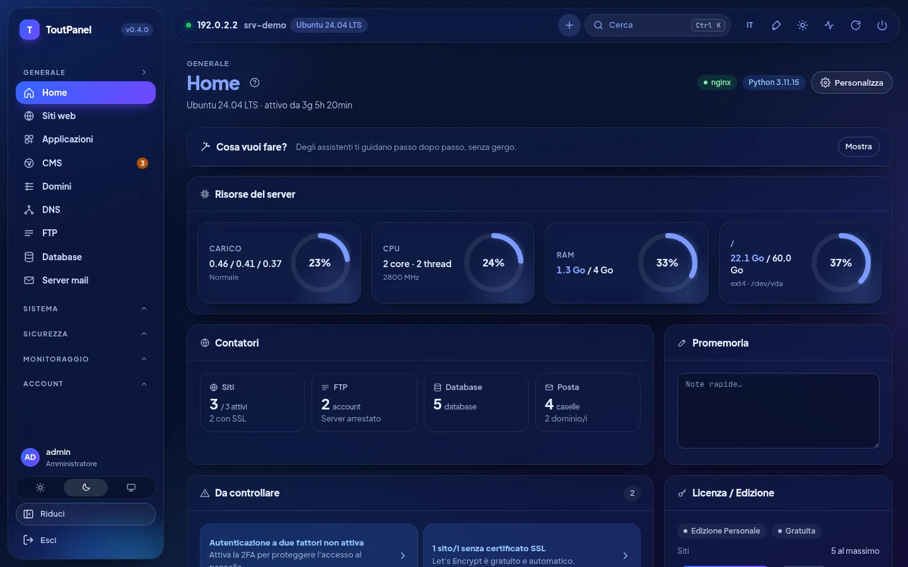<br>**Home, modalità scura**: indicatori, contatori, punti di attenzione, licenza | 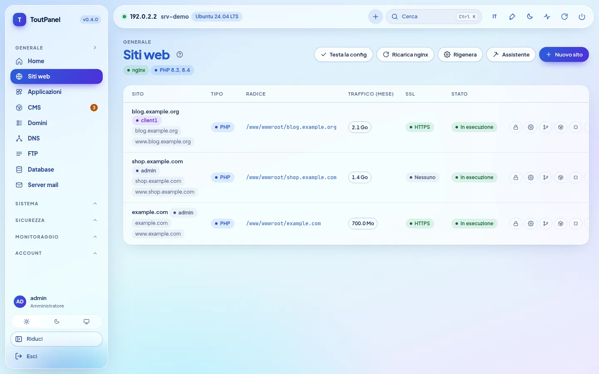<br>**Siti web**: domini, tipo, root, traffico, SSL e azioni |
| <br>**PHP**: versioni 5.6 → 8.5 affiancate, stato del supporto, pool FPM | <br>**Impostazioni del sito**: deploy Git, SSL, reindirizzamenti, sicurezza |
| <br>**DNS**: zone BIND o provider, template, DNSSEC, cluster | <br>**Certificati**: validità, emittente, rinnovo, certificato del pannello |
| 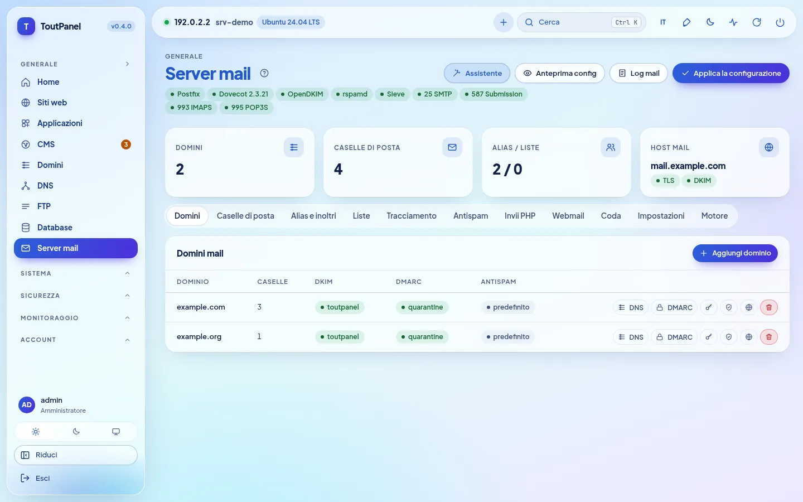<br>**Server di posta**: Postfix, Dovecot, OpenDKIM, porte e schede | <br>**Webmail**: Roundcube o SnappyMail installato con un clic |
| 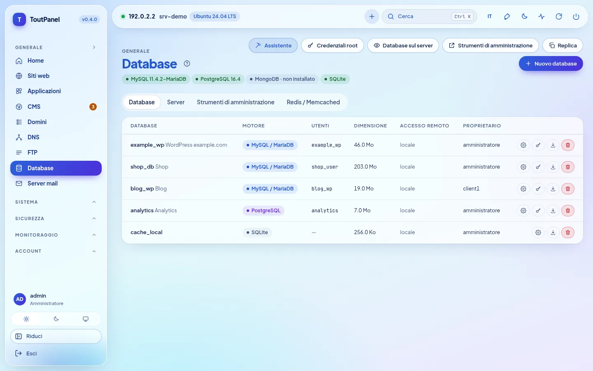<br>**Database**: MariaDB, PostgreSQL, MongoDB, SQLite, Redis | <br>**File**: editor, archivi, cestino, permessi, occupazione |
| <br>**CMS › Installa**: 582 CMS e applicazioni verificati, ricerca, filtri, indicatore «pronto» | <br>**Scheda di un CMS**: prerequisiti verificati, scelta della versione, sito di destinazione, database |
| <br>**CMS › Installazioni**: versioni, aggiornamenti disponibili, backup, clonazione | <br>**WAF › Motore**: ToutWAF consigliato, WAF integrato, BunkerWeb, SafeLine |
| <br>**Terminale**: shell interattiva bash / PowerShell nel browser | <br>**Applicazioni**: WordPress, Joomla, Drupal, PrestaShop, Nextcloud… |
| <br>**Store**: software server, moduli e temi con un clic | 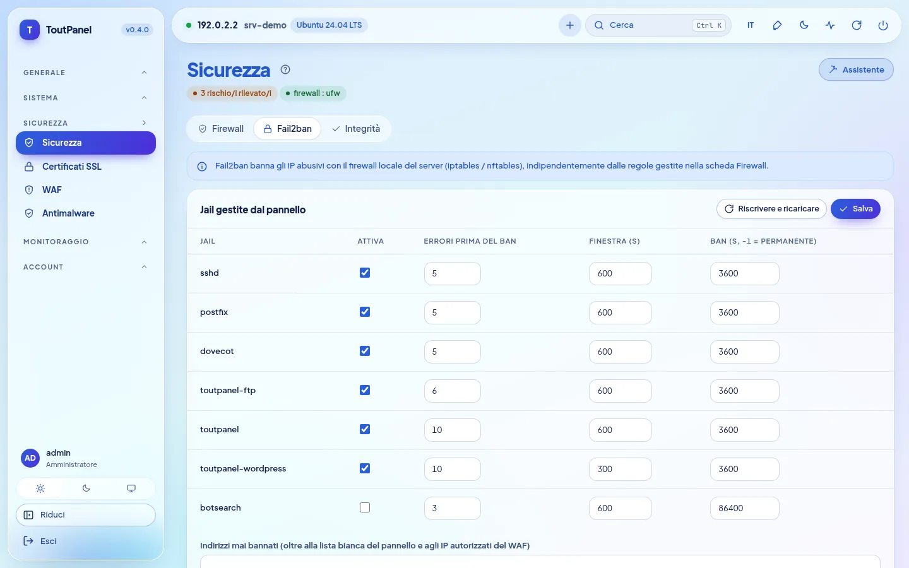<br>**Sicurezza**: raccomandazioni, firewall, anti-DDoS, Fail2ban |
| 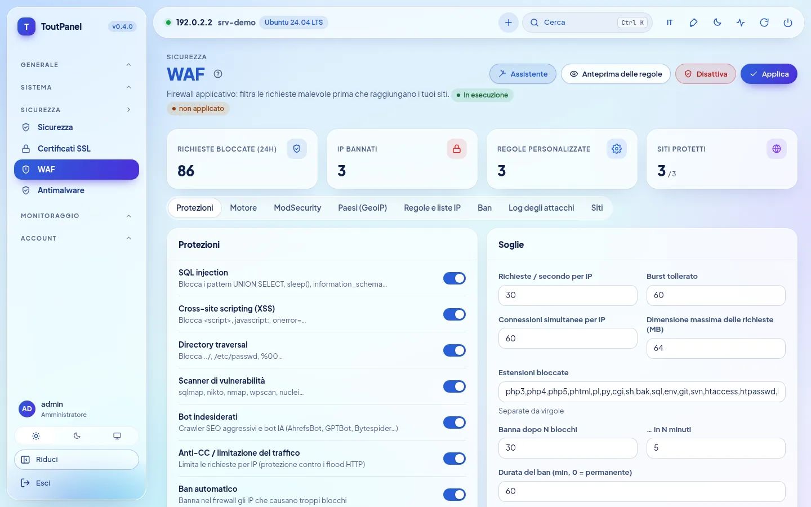<br>**WAF**: protezioni, soglie, motori, GeoIP, registro degli attacchi | <br>**Monitoraggio**: CPU, memoria, rete, carico e disco da 1 h a 7 g |
| <br>**Account**: rivenditori, clienti, piani, profili di accesso | <br>**Server**: pannello master, nodi, instradamento, migrazione |
| <br>**Aggiornamenti**: pacchetti del sistema (sicurezza) e del pannello | <br>**Impostazioni**: accesso, porta, ingresso segreto, HTTPS, interfaccia |
| 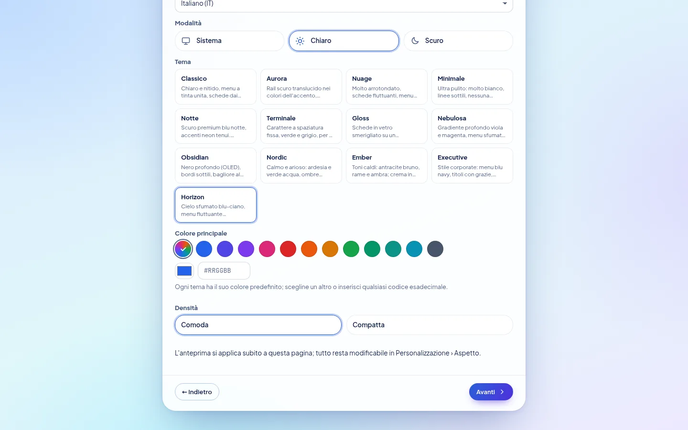<br>**Procedura guidata di configurazione**: tema, colore principale, densità, anteprima immediata | <br>**Horizon**, tema predefinito: la stessa schermata in chiaro e in scuro |

**Novità della 0.4** — schermate di un server di dimostrazione (indirizzi di documentazione):

| | |
|---|---|
| <br>**Procedura guidata di configurazione, passaggio Profilo**: profili di partenza, memoria rilevata, profilo consigliato | 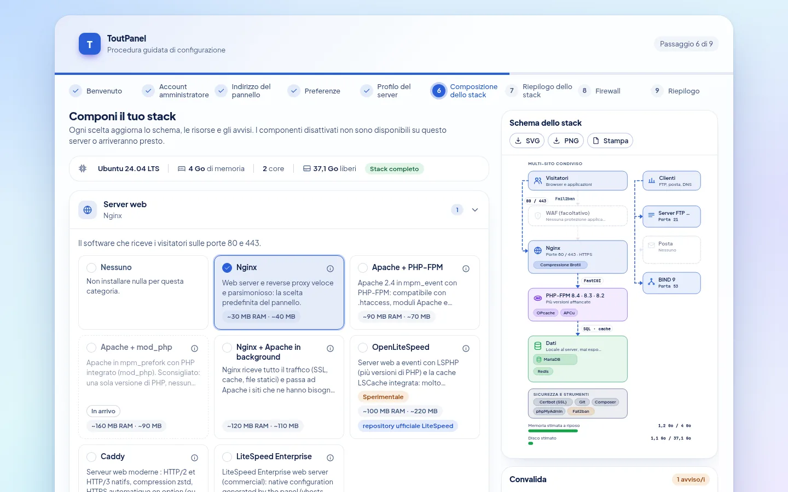<br>**Composizione dello stack**: scelta per categoria, schema di architettura, convalida e risorse stimate |
| <br>**Installazione dello stack**: avanzamento, passaggi, ripresa dopo un errore | <br>**Procedura guidata, passaggio Firewall**: gestito da ToutPanel o a monte, porte che verranno aperte |
| <br>**Impostazioni › Stack software**: stato reale, versioni installate, schema di questo server | <br>**Stack software**, modalità scura |
| <br>**Acceleratori**: OPcache, JIT, APCu, Redis, Memcached, FastCGI, Varnish… con stato, memoria e limiti | <br>**OpenLiteSpeed** *(sperimentale)*: installazione, LSPHP, passaggio del server web, WebAdmin |
| 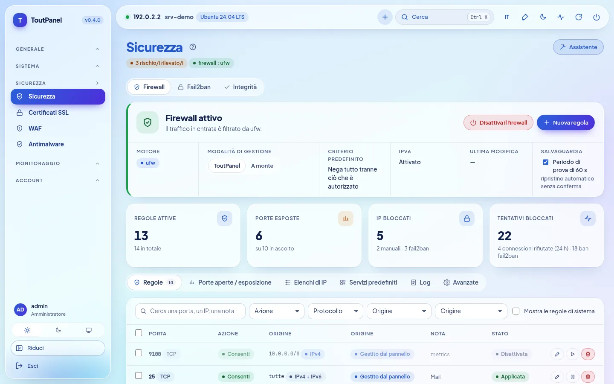<br>**Sicurezza › Firewall**: motore, modalità di gestione, salvaguardia, regole | <br>**Porte in ascolto ed esposizione**: esposta, limitata, protetta |
| <br>**Firewall a monte**: porte da aprire presso il provider, da copiare o scaricare | <br>**Firewall**, modalità scura |
| <br>**DNS › Motore**: BIND, PowerDNS, Knot DNS, provider esterno | <br>**Server di posta › Motore**: Postfix, Exim *(sperimentale)*, relay esterno |
| <br>**FTP › Motore**: integrato, Pure-FTPd, ProFTPD, vsftpd, SFTP *(sperimentali)* | <br>**ToutWAF remoto**: pannello collegato a un ToutWAF di un altro server |
| <br>**Home**: banner «distribuzione in stack ridotto» in base al livello di supporto | |

**Pagine aggiunte per la 0.4.0** — stesse convenzioni (server di dimostrazione, indirizzi di documentazione):

| | |
|---|---|
| 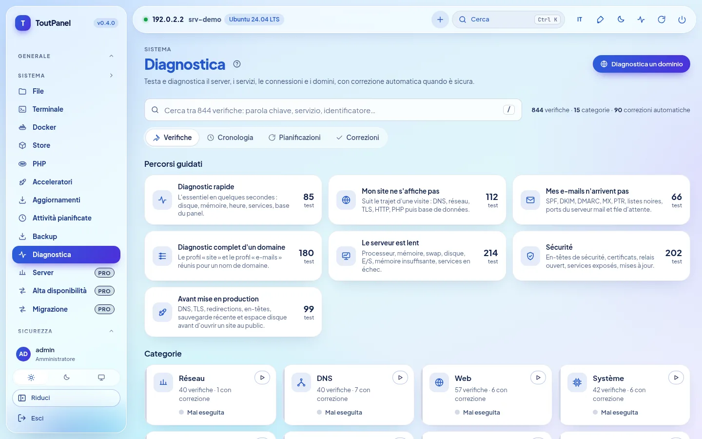<br>**Sistema › Diagnostica**: 844 verifiche, percorsi guidati, categorie, ricerca istantanea | <br>**Risultato di una diagnostica**: cause probabili, prova tecnica con segreti mascherati, **correzione automatica** |
| <br>**Correzione automatica**: anteprima esatta di ciò che verrà modificato, impatto, annullamento possibile | <br>**Home › «Cosa vuoi fare?»**: assistenti guidati passo passo |
| 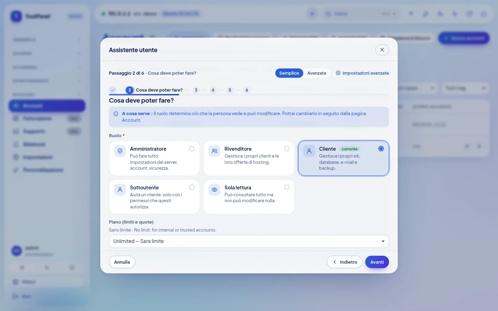<br>**Assistente guidato** (qui: utente): passaggi, guida contestuale, modalità Semplice o Avanzata | <br>**Test reale dopo l'applicazione**: risultato per verifica, causa probabile, correzione con un clic |
| <br>**Alta disponibilità** *(Pro)*: IP flottante keepalived, server e priorità, detentore dell'indirizzo | <br>**Monitoraggio › Parco server** *(Pro)*: disponibilità, CPU, memoria, disco e carico per server |
| <br>**Server** *(Pro)*: pannello master, nodi web / posta / DNS, stato, impronta TLS fissata | <br>**Account › Impostazioni › Isolamento degli account** *(opzione, disattivata per impostazione predefinita)*: PHP-FPM per account, hardening systemd, gabbia |
| <br>**Impostazioni › Server web: Caddy** *(sperimentale)*: passaggio con ripristino, HTTPS, funzioni non supportate | <br>**LiteSpeed Enterprise** *(sperimentale; mai avviato nei nostri test)*: licenza, installazione ufficiale, LSPHP |
| <br>**Store › Moduli**: Marketplace di integrazioni (fatturazione, monitoraggio, SSO, CI/CD, DNS / CDN…) | 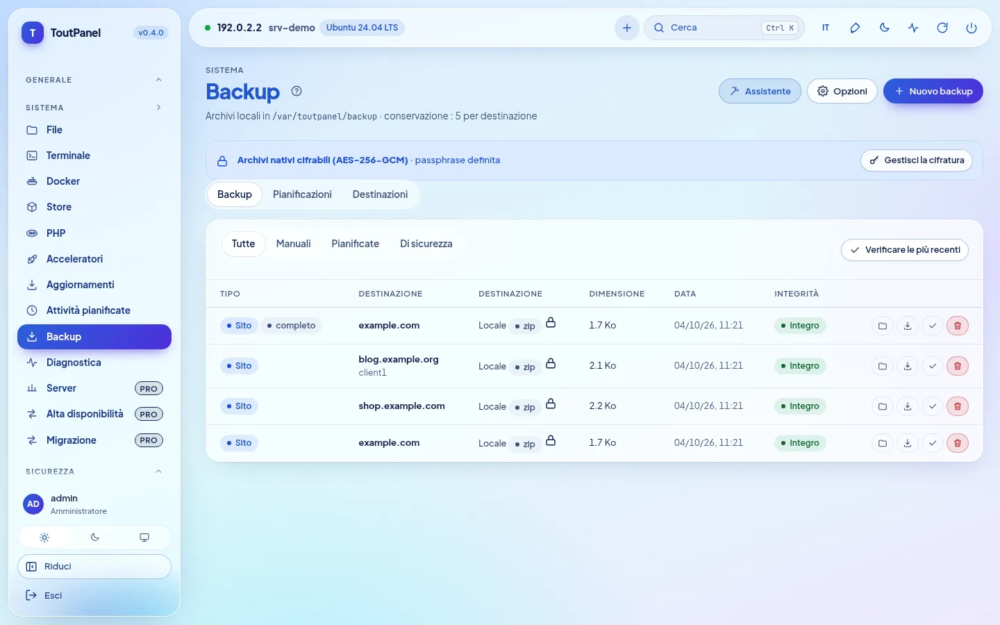<br>**Backup**: archivi cifrati (AES-256-GCM), completi o incrementali |
| <br>**Cifratura dei backup**: passphrase conservata cifrata, avviso di perdita, cifratura predefinita o obbligatoria | <br>**Pianificazioni**: perimetro, retention, destinazione, incrementali |
| <br>**Impostazioni › Sicurezza**: avvisi di accesso insolito, SSO OIDC / SAML | <br>**SSO** *(Pro)*: LDAP / Active Directory, OpenID Connect, SAML 2.0 |

**Da mobile**, l'interfaccia si adatta (menu comprimibile, tabelle scorrevoli):

<table>
<tr>
<td align="center"><br><b>Home</b></td>
<td align="center"><br><b>Siti web</b></td>
</tr>
</table>

> Schermate realizzate su un server di dimostrazione (Ubuntu 24.04, indirizzo di documentazione 192.0.2.2, domini di esempio). Su questo server di dimostrazione alcuni stati sono **simulati** (nessun servizio reale vi gira): isolamento degli account (systemd, cgroup), Caddy, parco server e IP flottante, database, posta, WAF e catalogo del Marketplace; le diagnostiche e gli assistenti, invece, vengono realmente eseguiti. Schermate in altre lingue si trovano in `screenshots/<lingua>/` (en, de, es, it, nl, pt, ru, zh, ar).

## Temi

### 13 temi, il tuo colore

Una nuova installazione usa **Horizon**: cielo sfumato blu-ciano, menu e barra superiore flottanti traslucidi, pillola attiva con sfumatura blu-viola che segue il colore scelto, titoli blu molto in grassetto. **Personalizzazione › Aspetto**: scegli un altro design, poi **un colore di accento qualsiasi** (12 preset, contagocce o codice `#RRGGBB`). Il pannello ne ricava pulsanti, link, menu attivo, badge, sfumature e grafici, mantenendo un contrasto di almeno 4,5:1. Ogni tema esiste in **chiaro e scuro**, rispetta l'alto contrasto e le lingue da destra a sinistra; l'anteprima è immediata, nulla viene salvato prima di «Salva il design». Densità, angoli, font, larghezza, posizione del menu, icone e animazioni si regolano anch'esse, per utente o come predefinito per tutti; il tema si esporta e si importa.


| | | |
|---|---|---|
| <br>**Horizon** *(predefinito)* · `#2b5fd9` | <br>**Classique** · `#2563eb` | <br>**Aurora** · `#2563eb` |
| <br>**Nuage** · `#5b5bd6` | <br>**Minimal** · `#18181b` | <br>**Nuit** · `#0369a1` |
| <br>**Terminal** · `#15803d` | <br>**Gloss** · `#7c3aed` | <br>**Nébuleuse** · `#8b5cf6` |
| <br>**Obsidian** · `#22c55e` | <br>**Nordic** · `#14b8a6` | <br>**Ember** · `#f97316` |
| <br>**Executive** · `#10b981` | | |

<sub>Colore indicato: accento predefinito del tema in modalità chiara, liberamente modificabile.</sub>

Il tema, la modalità, il **colore principale** e la **densità** si scelgono anche fin dalla **procedura guidata di configurazione** (passaggio Preferenze), con anteprima immediata; sono i valori predefiniti di tutti gli account, ciascuno potendo poi scegliere i propri.

## Edizioni

Il programma è lo stesso per tutte le edizioni: una **chiave di licenza** attiva le funzioni avanzate su un dato server. Un'installazione nuova funziona nell'edizione Personale, senza registrazione né connessione a Internet.

| Edizione | Prezzo | Chiave | Per chi |
|---|---|---|---|
| **Personale** | gratuita, senza limiti di durata | nessuna | uso personale: i tuoi siti, **fino a 5** |
| **Professionale** | a pagamento | obbligatoria | provider di hosting, agenzie, uso professionale: tutto incluso, siti illimitati (o secondo il piano di licenza) |
| **Enterprise** | a pagamento | obbligatoria | Professionale + multi-server illimitati + supporto prioritario |

L'edizione Personale è **completa**: siti, PHP multi-versione, database, posta, DNS, SSL, WAF integrato, backup locali (**cifratura AES-256-GCM e incrementali inclusi**), monitoraggio, Diagnostica manuale, assistenti guidati (i passaggi che toccano una funzione Pro restano riservati), account clienti e sotto-utenti, WebAuthn, strumenti GDPR, API e CLI. Sono riservati alle edizioni a pagamento:

<details>
<summary><b>Elenco esatto delle funzioni Professionale / Enterprise</b></summary>

| Funzione | Personale | Professionale |
|---|---|---|
| Siti | 5 al massimo | illimitati (o secondo la licenza) |
| Sonde di uptime | 3 | illimitate |
| Webhook in uscita | 2 | illimitati |
| Scelta del motore WAF (ToutWAF, BunkerWeb, SafeLine) | WAF integrato | ✓ |
| ModSecurity + OWASP CRS | — | ✓ |
| Multi-server: nodi, alta disponibilità, migrazione a caldo | — | ✓ |
| Gruppi web e cluster DNS | — | ✓ |
| Replica dei database | — | ✓ |
| Fatturazione, gateway, WHMCS, provisioning | — | ✓ |
| White label dei rivenditori | — | ✓ |
| Dominio personalizzato del pannello | — | ✓ |
| Supporto (ticket) | — | ✓ |
| Annunci | — | ✓ |
| Account rivenditore | — (clienti e sotto-utenti: ✓) | ✓ |
| SSO LDAP / OpenID Connect / SAML | — (WebAuthn: ✓) | ✓ |
| Blocco per paese (GeoIP) | — | ✓ |
| Antimalware pianificato | scansione manuale | ✓ |
| Backup remoti (S3, SFTP, B2, rsync SSH, rclone) | archiviazione locale (archivi cifrati e incrementali inclusi) | ✓ |
| Motori restic, Borg e rsync | — | ✓ |
| Export Prometheus `/metrics` | — | ✓ |
| Import da cPanel, Plesk, DirectAdmin, ISPConfig, hosting condiviso, IMAP | — (export: ✓) | ✓ |
| Moduli premium dello store | — | ✓ |
| Ancoraggio esterno del registro di audit | — (export ed eliminazione GDPR: ✓) | ✓ |
| Diagnostiche pianificate con avviso | diagnostica manuale | ✓ |

</details>

- Le voci interessate riportano un badge **Pro**; le pagine restano consultabili, sono riservate solo la creazione e la modifica.
- Attivazione: **Impostazioni › Licenza › Attiva una chiave** (`TP-XXXXX-XXXXX-XXXXX-XXXXX`) oppure `toutpanel licence activate <chiave>`. Il token firmato viene verificato localmente: la licenza funziona offline (riconvalida giornaliera, periodo di tolleranza di 15 giorni).
- Se la licenza scade o non è più valida, il pannello **torna all'edizione Personale senza eliminare nulla**.

Prezzi e acquisto: **[toutpanel.com/tarifs](https://toutpanel.com/tarifs)** · dettagli: [Edizioni e licenza](https://toutpanel.com/docs/guide/editions/).

## Architettura

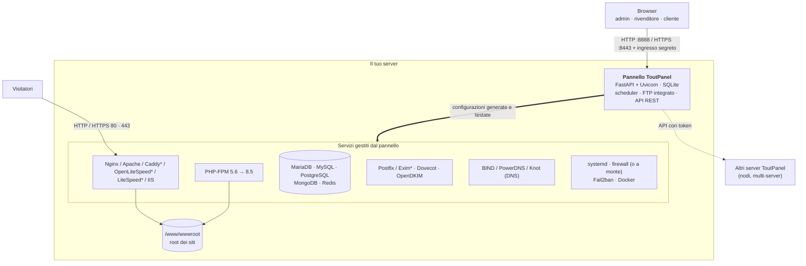

| Componente | Ruolo |
|---|---|
| **Pannello** | Applicazione FastAPI servita da Uvicorn (servizio systemd `toutpanel` su Linux, attività pianificata `ToutPanel` su Windows). Interfaccia web senza dipendenze esterne, API REST, scheduler di attività, server FTP integrato. |
| **Stack web** | Nginx e/o Apache (Caddy, OpenLiteSpeed con LSPHP, LiteSpeed Enterprise: sperimentali; IIS su Windows) con PHP-FPM; il pannello scrive i vhost a partire dai suoi template, li testa, poi ricarica il servizio. Il **compositore di stack** sceglie e fa evolvere i software. |
| **Servizi** | MariaDB / MySQL / PostgreSQL / MongoDB, Postfix (o Exim*) / Dovecot / OpenDKIM, BIND (o PowerDNS, Knot), FTP (integrato o Pure-FTPd*, ProFTPD*, vsftpd*), Fail2ban, firewall, Docker: gestiti dal pannello tramite i loro strumenti nativi. |
| **CLI `toutpanel`** | Amministrazione del pannello (porta, ingresso, password, aggiornamento, licenza…) e comandi di gestione scriptabili (`--json`). |

<sub>\* sperimentale</sub>

```
<home>  (/var/toutpanel o C:\toutpanel)
├── data/      database SQLite del pannello, settings.json, chiavi, install-info.txt
├── logs/      panel.log e log dei siti
├── vhost/     vhost generati (se la cartella nativa del server web è assente)
├── ssl/       certificati dei siti e del pannello
├── backup/    backup locali
├── src/       clone di questo repository (canali, tag, toutpanel update)
└── venv/      ambiente Python del pannello
/www/wwwroot   root dei siti (C:\toutpanel\wwwroot su Windows)
```

## Installazione completa

### Requisiti

| | Linux | Windows |
|---|---|---|
| **Sistemi** | livello **completo**: Debian 11 e successive, Ubuntu 20.04 e successive, AlmaLinux / Rocky Linux / RHEL / CentOS Stream / Oracle Linux / CloudLinux 8 e successive, Fedora · livello **ridotto** (il pannello funziona, alcune funzioni mancano): Debian 10, Ubuntu 18.04, CentOS / RHEL 7, Amazon Linux, openSUSE / SLES, Arch, Alpine, Devuan · vedi [Compatibilità delle distribuzioni](#compatibilità-delle-distribuzioni) | Windows 10, 11 · Windows Server 2016, 2019, 2022, 2025 (build 14393 minima) |
| **Diritti** | `root` (o `sudo`) e `bash` | PowerShell 5.1+ **come amministratore** (winget non necessario) |
| **Python** | da 3.9 a 3.14 (installato dallo script se la distribuzione lo fornisce) | installato dallo script (3.12, python.org) se assente |
| **Memoria** | 1 GB minimo (solo pannello), 2 GB consigliati con MariaDB e PHP | idem |
| **Disco** | 2 GB liberi + i tuoi siti | idem |
| **Rete** | accesso HTTPS in uscita (GitHub, PyPI, repository della distribuzione, Let's Encrypt); IP pubblico fisso e DNS inverso per la posta | idem (python.org, nginx.org, windows.php.net, MariaDB) |

Architetture: `x86_64` e `aarch64` (altre: livello ridotto). Installa di preferenza su un server **appena installato**. Su un server in cui Nginx, Apache o MariaDB sono già configurati, usa `--stack none`: il pannello li rileva e scrive i suoi vhost nella loro cartella nativa senza toccare il resto.

### Compatibilità delle distribuzioni

L'installer e il pannello rilevano la distribuzione (`/etc/os-release`, architettura) e mostrano un **livello di supporto**: `toutpanel compat` elenca le distribuzioni note, `toutpanel check` indica quello del tuo server, e un banner della home avvisa quando il livello non è «completo». Non esiste **mai un tetto di versione**: una versione più recente di una famiglia nota viene trattata come l'ultima nota.

| Livello | Significato | Esempi |
|---|---|---|
| **Completo** | è previsto lo stack completo (server web, PHP multi-versione, database con versioni a scelta, posta, firewall, aggiornamenti automatici) | Debian 11+, Ubuntu 20.04+ (LTS e intermedie), AlmaLinux / Rocky / RHEL / CentOS Stream / Oracle Linux 8+, CloudLinux 8 e 9, Fedora, Raspberry Pi OS 64 bit |
| **Ridotto** | il pannello funziona, ma alcune funzioni mancano o richiedono un intervento (sistema a fine vita, init senza systemd, repository di terze parti assenti, architettura a 32 bit); avviso non bloccante | Debian 10, Ubuntu 18.04, CentOS / RHEL 7, Amazon Linux 2 e 2023 (un solo PHP alla volta), openSUSE / SLES, Arch e derivate, Alpine, Devuan, Kali |
| **Non supportato** | sistema sconosciuto, troppo vecchio o immutabile: l'installer lo dice e si ferma | Fedora CoreOS / Silverblue, MicroOS, Flatcar, Gentoo, NixOS, Void |

«Completo» descrive il livello **previsto** dal pannello; **i test sono stati fatti su Ubuntu 24.04**, con una eccezione: **AlmaLinux 9.8 e 10.2 con SELinux Enforcing** (laboratorio QEMU del 4 ottobre 2026); la convalida end-to-end non è stata fatta sulle altre distribuzioni, Rocky Linux, RHEL e Fedora comprese (vedi [Limiti noti](#limiti-noti)). Python 3.9+ viene fornito se il sistema è troppo vecchio (pacchetto recente della distribuzione o Python standalone verificato con SHA-256, con il tuo consenso).

### Linux

Il comando passa `--lang it`: l'installer parla italiano (banner, domande, avvisi, riepilogo) e l'italiano diventa la lingua iniziale del pannello.

```bash
curl -sSL https://raw.githubusercontent.com/qu3ntin01/toutpanel/main/install.sh | sudo bash -s -- --lang it
```

Per leggere lo script prima di eseguirlo:

```bash
curl -sSLO https://raw.githubusercontent.com/qu3ntin01/toutpanel/main/install.sh
less install.sh
sudo bash install.sh --lang it
```

L'installazione dura da 3 a 6 minuti a seconda della connessione.

**Assistente di installazione.** Tutte le opzioni (account, porte, cartella, stack, firewall, WAF, versione, lingua…) si scelgono con dei menu su **[toutpanel.com/installation-assistant](https://toutpanel.com/installation-assistant)**, che genera la riga di comando e la verifica in diretta (i segreti non vi compaiono mai in chiaro).

**Installare una versione precisa.** Il comando standard installa l'ultima versione stabile; `--version` ne sceglie un'altra (elenco: `--list-versions`). Le anteprime sono pubblicate sul canale `dev` e si installano con `--channel dev`:

```bash
# l'ultima versione stabile
curl -sSL https://raw.githubusercontent.com/qu3ntin01/toutpanel/main/install.sh | sudo bash
# una versione precisa (elenco: --list-versions)
curl -sSL https://raw.githubusercontent.com/qu3ntin01/toutpanel/main/install.sh | sudo bash -s -- --list-versions
curl -sSL https://raw.githubusercontent.com/qu3ntin01/toutpanel/main/install.sh | sudo bash -s -- --version 0.4.0
# l'ultima anteprima (canale dev)
curl -sSL https://raw.githubusercontent.com/qu3ntin01/toutpanel/dev/install.sh | sudo bash -s -- --channel dev
```

**Menu interattivo.** Lanciato in un terminale senza opzione di modalità, lo script presenta ToutPanel, rileva un'installazione esistente e propone: **installare** (stack completo) oppure **installare solo il pannello**, eventualmente in **modalità nodo**; oppure, se il pannello è già presente, **aggiornare**, **reinstallare completamente** o **disinstallare**. Pone anche la domanda sul **firewall** (ToutPanel / a monte / più tardi) e, dopo l'avvio del pannello, quella sul **profilo dello stack**. Senza terminale (automazione, `--yes`), non pone domande: installa, o aggiorna se il pannello è presente (firewall «più tardi», stack predefinito).

**Che cosa fa lo script:**

1. installa Python 3.9+ se necessario e crea l'ambiente virtuale `<home>/venv`;
2. installa lo **stack web** (Nginx, PHP-FPM, MariaDB, Redis o Valkey, Certbot, Fail2ban) come prima, oppure quello che componi tu (`--profile`, `--web`, `--php`, `--db`… passati a `toutpanel stack apply`);
3. clona questo repository in `<home>/src`, **verifica la somma SHA-256** della wheel corrispondente al Python del sistema e la installa;
4. crea un **account amministratore** e un **URL di accesso segreto** casuali;
5. registra il **servizio systemd** `toutpanel`;
6. configura il **firewall** secondo `--firewall`: `on` (ToutPanel lo gestisce e apre le porte necessarie), `off` (firewall a monte: nessuna regola di sistema, elenco delle porte da aprire presso il provider), domanda in un terminale, altrimenti «più tardi» (non viene toccato nulla);
7. configura **SELinux** (Alma, Rocky, RHEL, Fedora) o **AppArmor** (Debian, Ubuntu, SUSE);
8. mostra un riepilogo, salvato in `<home>/data/install-info.txt` (leggibile solo da root).

#### Opzioni di `install.sh`

| Opzione | Descrizione | Predefinito |
|---|---|---|
| `--stack full` | **obsoleta** (vedi `--profile`): Nginx + PHP-FPM + MariaDB + Redis/Valkey + Certbot + Fail2ban | ✓ |
| `--stack minimal` | **obsoleta**: Nginx + PHP-FPM + Certbot | |
| `--stack none` | **obsoleta**: solo il pannello (server già configurato) | |
| `--profile NOME` | profilo del **compositore di stack**: `single-site`, `multi-site`, `hosting`, `performance`, `application`, `mail-only`, `dns-only`, `node`, `lamp`, `standard`, `custom` (valori delle altre opzioni: vedi la tabella qui sotto) | stack predefinito |
| `--web`, `--php`, `--php-default`, `--php-ext`, `--db`, `--redis`, `--accel`, `--ftp`, `--mail MOTORE`, `--dns`, `--security`, `--runtime`, `--tools`, `--install-mode`, `--roles`, `--stack-file`, `--no-tuning` | opzioni del compositore, passate così come sono a `toutpanel stack apply … --yes` dopo l'installazione del pannello (un errore dello stack non fa fallire l'installazione: viene mostrato il comando di ripresa) | |
| `--accept-litespeed-license` | con `--web litespeed[:6.3]`: accetta il contratto di licenza di LiteSpeed Technologies; **obbligatoria** (senza, l'installer si ferma prima di qualsiasi modifica), incompatibile con `--stack`, rifiutata su Windows. **LiteSpeed Enterprise è un prodotto commerciale SPERIMENTALE, mai avviato nell'ambiente di sviluppo**: prova ufficiale di 15 giorni, poi licenza a pagamento | no |
| `--mail` | (da solo) aggiunge Postfix, Dovecot, OpenDKIM e apre le porte di posta | no |
| `--firewall on\|off\|ask` | chi gestisce il firewall: ToutPanel (`on`), un firewall a monte senza regola di sistema (`off`), domanda (`ask`); senza terminale né valore: «più tardi»; mai modificato da un aggiornamento | domanda in un terminale |
| `--firewall-engine nft\|ufw\|firewalld\|csf\|iptables` | motore del firewall gestito da ToutPanel | rilevato |
| `--dry-run` | mostra la distribuzione rilevata, la directory e i comandi previsti, senza modificare nulla (senza root) | no |
| `--postgres` | aggiunge PostgreSQL (password del ruolo `postgres` generata e salvata nel pannello) | no |
| `--waf toutwaf` | distribuisce **ToutWAF**, il WAF dell'editore, davanti ai siti tramite il suo installer ufficiale (servizi systemd, senza Docker; server web spostato su 8080 / 8443, console su 9443, riepilogo in `/etc/toutwaf/INSTALL-SUMMARY.txt`) | no |
| `--waf bunkerweb` / `--waf safeline` | installa Docker e distribuisce il WAF esterno davanti ai siti (server web spostato su 8080 / 8443, console su 7000 o 9443) | no |
| `--waf toutwaf --waf-console URL` | **ToutWAF remoto**: collega il pannello a un ToutWAF installato su un altro server (nessuna installazione locale), con `--waf-origin-ip`, `--waf-origin-addr`, `--waf-cert-mode import\|acme`, `--waf-server-id`, `--waf-fingerprint` o `--waf-trust-first-use`, `--waf-restrict` (80 / 443 limitati a ToutWAF); il token si passa con `--waf-token-file FILE` o `--waf-token-stdin` (mai come argomento) | no |
| `--node` | modalità **nodo** multi-server: pannello solo in HTTPS, token di arruolamento, URL dell'API e impronta TLS mostrati (da inserire sul master: Sistema › Server › Aggiungi) | no |
| `--master URL` | con `--node`: URL del pannello master | — |
| `--port N` | porta **HTTP** del pannello | `8888` |
| `--https-port N` | porta **HTTPS** del pannello (il pannello ascolta in HTTP **e** in HTTPS; certificato autofirmato all'inizio) | `8443` |
| `--version X.Y.Z` | installa questa versione pubblicata (anche `vX.Y.Z`, `0.4.0b1` o `0.4.0-beta.1`; variabile `TOUTPANEL_VERSION`); un'anteprima implica il canale `dev`; versione non trovata o senza wheel per il tuo Python: arresto prima di qualsiasi modifica con l'elenco delle versioni; un downgrade chiede conferma (salvo `--yes`) | ultima del canale |
| `--list-versions` | elenca le versioni pubblicate (la più recente per prima) poi esce, senza installare nulla | |
| `--random-port` | porta casuale tra 20000 e 39999 | |
| `--username NOME` | nome dell'account amministratore | `admin_xxxxxx` casuale |
| `--password PWD` | password dell'amministratore (visibile in `ps` e nella cronologia della shell: preferisci le tre opzioni seguenti) | 16 caratteri casuali |
| `TOUTPANEL_PASSWORD` | variabile d'ambiente che fornisce la password (conservata da `sudo -E`); un'opzione prevale sulla variabile | — |
| `--password-file FILE` | legge la password dalla prima riga di un file (su Linux, riservato al suo proprietario: `chmod 600`) | — |
| `--password-stdin` | legge la password dallo standard input (prima riga; inutilizzabile con `curl \| bash`) | — |
| `--entrance /percorso` | ingresso sicuro dell'URL | `/tp_xxxxxxxxxx` casuale |
| `--home DIR` | directory del pannello (un'installazione esistente nel vecchio valore predefinito `/www/toutpanel` viene rilevata e conservata) | `/var/toutpanel` |
| `--source DIR` | installare da una cartella locale (copia di questo repository con `dist/`) | clone del ramo |
| `--branch NOME` | ramo Git da scaricare | `main` |
| `--channel stable\|dev` | canale di aggiornamento, salvato nel pannello | `stable` |
| `--update` | aggiorna un'installazione esistente (rilevato automaticamente): backup dei dati, nuovo codice, migrazione del database, riavvio | auto |
| `--reinstall` | forza un'installazione completa anche se il pannello è presente | no |
| `--uninstall` | disinstalla il pannello (siti e database conservati, dati del pannello archiviati) | no |
| `--yes`, `-y` | nessuna domanda (menu e conferme) | no |
| `--lang xx` | lingua dell'installer e lingua iniziale del pannello: `en`, `fr`, `de`, `es`, `it`, `pt`, `nl`, `ru`, `zh`, `ar` | lingua del sistema, altrimenti `en` |
| `--en`, `--fr`, `--de`, `--es`, `--it`, `--pt`, `--nl`, `--ru`, `--zh`, `--ar` | scorciatoie di `--lang` | |
| `-h`, `--help` | mostra la guida dello script | |

Una sola fonte di password alla volta (due opzioni vengono rifiutate prima di qualsiasi modifica). In assenza di qualsiasi opzione, un terminale interattivo propone «genera automaticamente (consigliato)» oppure «inserisci» (senza eco, con conferma); senza terminale o con `--yes`, una password viene generata e mostrata alla fine. Una password fornita non viene né mostrata né scritta nel riepilogo o in `install-info.txt`, e un aggiornamento non la modifica mai.

**Valori delle opzioni di stack** (vengono controllati prima di qualsiasi modifica; **\*** = sperimentale):

| Opzione | Valori |
|---|---|
| `--web` | `nginx`, `apache`, `nginx-apache`, `caddy`\*, `openlitespeed`\* (`:1.9`, `:1.8`, `:1.7`), `litespeed`\* (`:6.3`, `:6.2`, `:6.1`, `:6.0`; LiteSpeed Enterprise, commerciale, richiede `--accept-litespeed-license`), `none`; `toutpanel stack apply` accetta gli stessi valori |
| `--php` / `--php-default` / `--php-ext` | versioni separate da virgole (`8.3,8.4`, da 5.6 a 8.5) / versione predefinita / `minimal`, `standard`, `full` |
| `--db` | `mariadb` (`:10.6`, `:10.11`, `:11.4`, `:11.8`), `mysql`\* (`:8.4`, `:9.7`), `percona`\* (`:8.0`, `:8.4`), `postgresql` (da `:13` a `:18`), `none` |
| `--accel` | `opcache`, `jit`, `apcu`, `redis`, `memcached`, `fastcgi-cache`, `varnish`\*, `brotli`, `zstd`\*, `http3`\*, `ioncube` |
| `--ftp` | `builtin`, `pureftpd`\*, `proftpd`\*, `vsftpd`\*, `sftp`\*, `none` |
| `--mail` | `postfix`, `postfix-clamav`, `postfix-light`, `exim`\*, `relay`, `none` |
| `--dns` | `bind`, `powerdns`, `knot`, `external`, `none` |
| `--security` | `firewall`, `fail2ban`, `modsecurity`, `clamav`, `toutwaf` |
| `--runtime` / `--tools` | `nodejs`, `python`, `go`, `ruby`, `java`, `docker` / `certbot`, `git`, `composer`, `phpmyadmin`, `adminer`, `restic`, `goaccess` |
| `--install-mode` / `--roles` | `single-server`, `single-site`, `multi-site`, `multi-server` / `web`, `db`, `mail`, `dns` |

Un componente «in arrivo» (Apache + mod_php) viene rifiutato in modo pulito da `toutpanel stack`, senza installare nulla.

Esempi:

```bash
sudo bash install.sh --stack minimal --port 7443
sudo bash install.sh --profile lamp --php 8.3,8.4 --db mariadb:11.4 --firewall on
sudo bash install.sh --profile hosting --mail postfix-clamav --dns bind --firewall off --yes
sudo bash install.sh --dry-run --profile lamp          # simulazione
sudo bash install.sh --mail --postgres
sudo bash install.sh --mail --username moi --password-file /root/mot-de-passe.txt --entrance /mon-acces
sudo bash install.sh --profile performance --web openlitespeed --php 8.3 --accel opcache,redis --firewall off --yes   # OpenLiteSpeed: sperimentale
sudo bash install.sh --web litespeed:6.3 --php 8.3 --accept-litespeed-license --yes   # LiteSpeed Enterprise: commerciale, sperimentale, licenza obbligatoria (solo Linux)
sudo bash install.sh --waf toutwaf                 # WAF dell'editore davanti ai siti
sudo bash install.sh --stack minimal --node --master https://maitre.exemple.com:8888   # server gestito da un master
curl -sSL https://raw.githubusercontent.com/qu3ntin01/toutpanel/main/install.sh | sudo bash -s -- --yes --random-port
curl -sSL https://raw.githubusercontent.com/qu3ntin01/toutpanel/main/install.sh | sudo bash -s -- --channel dev
curl -sSL https://raw.githubusercontent.com/qu3ntin01/toutpanel/main/install.sh | sudo bash -s -- --it   # installer in italiano
```

#### Lingua dell'installer

Gli installer sono **multilingue**: banner, menu e domande, passaggi, avvisi, errori, guida, riepilogo e `install-info.txt` vengono mostrati in una delle **10 lingue** qui sotto, in **inglese per impostazione predefinita**. La lingua scelta diventa anche la **lingua iniziale del pannello** (installazione e reinstallazione); una riga sotto il banner indica la lingua scelta e la sua origine.

| Lingua | `--lang` | Scorciatoia Linux | Windows |
|---|---|---|---|
| English *(predefinita)* | `en` | `--en` | `-Lang en` / `-En` |
| Français | `fr` | `--fr` | `-Lang fr` / `-Fr` |
| Deutsch | `de` | `--de` | `-Lang de` / `-De` |
| Español | `es` | `--es` | `-Lang es` / `-Es` |
| Italiano | `it` | `--it` | `-Lang it` / `-It` |
| Português | `pt` | `--pt` | `-Lang pt` / `-Pt` |
| Nederlands | `nl` | `--nl` | `-Lang nl` / `-Nl` |
| Русский | `ru` | `--ru` | `-Lang ru` / `-Ru` |
| 中文 | `zh` | `--zh` | `-Lang zh` / `-Zh` |
| العربية | `ar` | `--ar` | `-Lang ar` / `-Ar` |

Ordine di priorità, dal più forte al più debole:

| # | Fonte | Linux | Windows |
|---|---|---|---|
| 1 | opzione della riga di comando | `--lang xx` o scorciatoia (`--fr`…) | `-Lang xx` o scorciatoia (`-Fr`…) |
| 2 | variabile d'ambiente | `TOUTPANEL_LANG=fr` | `$env:TOUTPANEL_LANG = "fr"` |
| 3 | valore scritto nello script | `INSTALLER_LANG="fr"` in testa a `install.sh` | `$InstallerLang = "fr"` in testa a `install.ps1` |
| 4 | **rilevamento** della lingua del sistema, se è tra le 10 | `LC_ALL`, `LC_MESSAGES`, `LANG` | `Get-Culture` |
| 5 | inglese | | |

```bash
curl -sSL https://raw.githubusercontent.com/qu3ntin01/toutpanel/main/install.sh | sudo env TOUTPANEL_LANG=de bash
```

Variabili d'ambiente riconosciute: `TOUTPANEL_LANG` (lingua dell'installer), `TOUTPANEL_HOME` (directory), `TOUTPANEL_REPO` (repository Git), `TOUTPANEL_BRANCH` (ramo), `TOUTPANEL_CHANNEL` (`stable` o `dev`), `TOUTPANEL_VERSION` (versione precisa), `TOUTPANEL_PASSWORD` (password dell'amministratore), `TOUTPANEL_FIREWALL` / `TOUTPANEL_FIREWALL_ENGINE`, e una variabile per ogni opzione di stack (`TOUTPANEL_PROFILE`, `TOUTPANEL_WEB`, `TOUTPANEL_PHP`, `TOUTPANEL_DB`, `TOUTPANEL_ACCEL`, `TOUTPANEL_FTP`, `TOUTPANEL_MAIL_ENGINE`, `TOUTPANEL_DNS`…).

<details>
<summary><b>Pacchetti installati in base alla distribuzione</b></summary>

- **Debian / Ubuntu**: `nginx`, `php8.x-fpm` (+ cli, mysql, curl, mbstring, xml, zip, gd, intl, bcmath, opcache), `certbot`, `composer`, `mariadb-server`, `redis-server`, `fail2ban`, `python3-venv`, `git`, `unzip`; PHP multi-versione tramite packages.sury.org (Debian) o il PPA ondrej (Ubuntu).
- **AlmaLinux / Rocky / RHEL / Fedora**: `epel-release` (+ CRB), `remi-release`, `nginx`, `php83-php-fpm` (+ estensioni), `certbot`, `mariadb-server`, `redis` o `valkey` (Valkey su AlmaLinux 10), `fail2ban`, `policycoreutils-python-utils`, `dnf-plugins-core`, `rspamd` (dal repository ufficiale `rspamd.com`, aggiunto dallo stack: assente da AlmaLinux ed EPEL), `firewalld` (installato con `--firewall on`: le immagini cloud non hanno né `firewalld` né `nft`); contesti SELinux dichiarati (`httpd_sys_rw_content_t` su `/www/wwwroot`, `httpd_log_t`, `var_log_t`, `cert_t`, `httpd_config_t`, `mail_spool_t`) e booleani `httpd_can_network_connect`, `httpd_can_network_connect_db`, `httpd_can_sendmail`, `httpd_setrlimit` attivati.
- **Moduli Python facoltativi** (non installati per impostazione predefinita): `pymongo` (MongoDB), `wsgidav` + `a2wsgi` (WebDAV), `geoip2` (GeoIP), `python3-saml` (SAML) — `/var/toutpanel/venv/bin/pip install "pymongo>=4.6"` poi `systemctl restart toutpanel`.

</details>

### Windows

In PowerShell **come amministratore** (la prima riga fa parlare italiano l'installer; vedi [Lingua dell'installer](#lingua-dellinstaller)):

```powershell
$env:TOUTPANEL_LANG = "it"
Set-ExecutionPolicy Bypass -Scope Process -Force
iwr -useb https://raw.githubusercontent.com/qu3ntin01/toutpanel/main/install.ps1 | iex
```

Lo script verifica la versione di Windows e i diritti, installa **Python 3.12** se non è presente alcun Python 3.9+, crea `C:\toutpanel\venv` e vi installa il pannello, crea l'account admin e l'URL segreto, aggiunge le regole del firewall (porta del pannello, 80, 443, 21), crea l'attività pianificata **ToutPanel** (avvio automatico come SYSTEM) e aggiunge `C:\toutpanel\bin` al PATH.

Per installare anche lo stack web (**Nginx** in `C:\nginx`, **PHP 8.5** supervisionato dal pannello, **MariaDB** come servizio Windows):

```powershell
iwr -useb https://raw.githubusercontent.com/qu3ntin01/toutpanel/main/install.ps1 -OutFile install.ps1
.\install.ps1 -Stack
```

| Opzione | Descrizione |
|---|---|
| `-Port 8888` | porta **HTTP** del pannello |
| `-HttpsPort 8443` | porta **HTTPS** del pannello |
| `-Version X.Y.Z` / `-ListVersions` | installare una versione pubblicata precisa (variabile `TOUTPANEL_VERSION`) / elencare le versioni pubblicate |
| `-Home C:\toutpanel` | directory del pannello |
| `-Stack` | installa Nginx, PHP 8.5, MariaDB |
| `-Username`, `-Password`, `-Entrance /x` | account admin e URL segreto scelti (`-Password` è visibile nell'elenco dei processi: preferisci `$env:TOUTPANEL_PASSWORD`, `-PasswordFile FILE` o `-PasswordStdin`) |
| `-PythonVersion`, `-NginxVersion`, `-MariaDBVersion`, `-PhpVersion` | versioni scaricate |
| `-Source C:\percorso` / `-Branch main` | cartella locale (copia di questo repository) / ramo scaricato |
| `-Update` / `-Reinstall` / `-Uninstall` | aggiornare / reinstallare tutto / disinstallare |
| `-Yes` | nessuna domanda (automazione) |
| `-Lang xx` / `-En`, `-Fr`, `-De`, `-Es`, `-It`, `-Pt`, `-Nl`, `-Ru`, `-Zh`, `-Ar` | lingua dell'installer e lingua iniziale del pannello (predefinita: lingua del sistema se supportata, altrimenti inglese; vedi [Lingua dell'installer](#lingua-dellinstaller)); con `iwr … \| iex`: `$env:TOUTPANEL_LANG = "fr"` prima del comando |
| `-Help` | guida dello script |

### Porte da aprire

| Porta | Uso | Aperta dall'installer |
|---|---|---|
| **8888** (configurabile) | interfaccia del pannello in **HTTP** | sì |
| **8443** (configurabile) | interfaccia del pannello in **HTTPS** (certificato autofirmato all'inizio) | sì (rilancia l'installer o aprila a mano su un'installazione esistente) |
| **80 / 443** | siti web | sì |
| 21 + 60000-60100 | FTP (integrato, o il motore scelto: intervallo passivo del motore) | solo la 21; apri l'intervallo passivo se attivi l'FTP |
| 25, 465, 587, 143, 993, 110, 995, 4190 | posta (SMTP, IMAP, POP3, ManageSieve) | con `--mail` (4190: da aprire per Sieve da remoto) |
| 53 (UDP e TCP) | DNS (BIND, PowerDNS o Knot) se ospiti le tue zone | no: Sicurezza › Firewall |
| 9443 / 7000 | console ToutWAF e SafeLine (9443), BunkerWeb (7000) | con `--waf` |
| 3306 / 5432 | accesso remoto ai database (facoltativo) | no: solo se lo attivi |

Non dimenticare il **firewall del tuo provider** (security group): se blocca le porte del pannello (8888 e 8443), il browser non mostra nulla. Con `--firewall off` (o la modalità «A monte» di Sicurezza › Firewall), ToutPanel non tocca alcuna regola di sistema ed **elenca le porte da aprire** presso il provider (`toutpanel firewall ports`, copia o download CSV nell'interfaccia); con `--firewall on`, le apre da sé e una **salvaguardia di 60 s** annulla qualsiasi modifica non confermata che ti taglierebbe fuori.

## Primo avvio

Al termine dell'installazione, lo script mostra un riepilogo (qui con l'installer in italiano):

```
╔══════════════════════════════════════════════════════════════════╗
║  ToutPanel è installato!                                         ║
╚══════════════════════════════════════════════════════════════════╝

  URL del pannello (HTTP)   : http://203.0.113.10:8888/tp_dchwp7kmkf
  URL del pannello (HTTPS)  : https://203.0.113.10:8443/tp_dchwp7kmkf   certificato autofirmato: l'avviso del browser è normale
  Nome utente               : admin_gbhjkv
  Password                  : D9nYzTSKHbX8FTqC
  MariaDB root              : k3Jd82nLqP0sYt7wVb1c
  Procedura guidata di configurazione : https://203.0.113.10:8443/tp_dchwp7kmkf#/setup?token=npSj7xpVzJOI8weJl8R00AdQ18MHYn8YIJCbOYi43B8
  Questo link (24 h, uso singolo) consente di modificare l'indirizzo del pannello, il nome utente e la password generati sopra.
  Nuovo link: toutpanel setup-link
  PHP                       : 8.5 (Nginx + PHP-FPM pronti)

  Queste informazioni sono salvate in: /var/toutpanel/data/install-info.txt
  L'URL contiene l'ingresso sicuro: senza di esso, il pannello risponde 404.
```

1. **Annota l'URL completo** (HTTP e HTTPS): contiene l'**ingresso sicuro** (`/tp_…`). Senza di esso, il pannello risponde `404 Not Found`, il che lo rende invisibile alle scansioni. `toutpanel info` lo mostra di nuovo. Il certificato HTTPS è **autofirmato** all'inizio: l'avviso del browser è normale; la procedura guidata di configurazione viene aperta in HTTPS perché il suo token non circoli in chiaro.
2. **Apri il link «Procedura guidata di configurazione»** (`#/setup?token=…`, valido 24 h, uso singolo): in **nove passaggi** e senza accedere, sostituisci i valori generati con i tuoi (nome utente, password, porta, ingresso sicuro, nome host, lingua, modalità, tema, colore principale e densità), poi **scegli il profilo del tuo server e componi il suo stack** (profilo, composizione con schema di architettura, riepilogo e installazione riprendibile) e **chi gestisce il firewall** (ToutPanel, a monte o più tardi). Link scaduto? `toutpanel setup-link` ne genera uno nuovo. La procedura guidata resta accessibile una volta effettuato l'accesso (Home › Scorciatoie rapide).
3. **Metti in sicurezza l'account**: autenticazione a due fattori (TOTP) e, se possibile, una chiave di sicurezza WebAuthn; IP autorizzati se hai un IP fisso; certificato HTTPS riconosciuto (Impostazioni › Accesso e interfaccia, Let's Encrypt se un dominio punta al server) e, se lo desideri, reindirizzamento da HTTP a HTTPS.
4. **Crea un primo sito**: Siti web › Nuovo sito (o il pulsante **Assistente** per sito + database + certificato + caselle di posta), punta il DNS verso il server, poi lucchetto › Let's Encrypt e «Forza HTTPS».
5. **Attiva le protezioni**: WAF › Applica (o WAF › Motore › Installa ToutWAF nell'edizione Professionale), regole del firewall (Sicurezza › Firewall), backup giornaliero pianificato, avvisi (Impostazioni › Avvisi).
6. **Verifica il server**: Sistema › Diagnostica (844 verifiche, correzioni automatiche con anteprima) e, in ogni pagina, il pulsante **Assistente** per configurare passo passo un sito, un database, una casella di posta, un backup o il firewall con un test reale alla fine.
7. **Fai evolvere lo stack** in qualsiasi momento: Impostazioni › Stack software (stato reale, aggiunta di un componente, di una versione di PHP, di un motore), pagina Acceleratori, schede Motore delle pagine FTP, DNS e Server di posta.

## Aggiornamento

Tutti i metodi conservano account, impostazioni, siti, database e software.

- **Dal pannello**: **Aggiornamenti › Pannello** mostra la versione installata, il canale seguito, le versioni disponibili e le note di versione. **Aggiorna** esegue prima il backup di `settings.json`, del database del pannello e della versione corrente (`<home>/data/updates/<data>/`), installa la wheel della nuova versione, migra il database e riavvia; il pannello verifica poi il proprio stato di salute e **torna da solo alla versione precedente** in caso di errore. **Torna alla versione precedente** resta disponibile in qualsiasi momento.
- **Da riga di comando**:

  ```bash
  toutpanel update --check              # versione installata, versione disponibile, note di versione
  toutpanel update                      # installare la versione del canale seguito
  toutpanel update --channel dev        # seguire il ramo di sviluppo
  toutpanel update --rollback           # tornare alla versione precedente (--restore-data: anche i dati)
  ```

- **Con lo script di installazione**: rilanciato su un server già attrezzato, `install.sh` passa in modalità aggiornamento (backup di `data/` in `<home>/backup/panel-update-<data>/`, nuova wheel, `toutpanel migrate`, riavvio). Lo stack non viene reinstallato a meno che tu non aggiunga `--stack`, un'opzione del compositore (`--profile`…), `--mail` o `--waf`; il firewall esistente non viene mai modificato. Su Windows: `.\install.ps1 -Update`.

## Disinstallazione

```bash
curl -sSL https://raw.githubusercontent.com/qu3ntin01/toutpanel/main/install.sh | sudo bash -s -- --uninstall
```

Rimuove il servizio, `/var/toutpanel` (o l'installazione rilevata, ad es. `/www/toutpanel`: pannello, ambiente Python, log, certificati), `/usr/local/bin/toutpanel` e le configurazioni Nginx / Apache generate dal pannello. I dati del pannello vengono prima archiviati in `/root/toutpanel-backup-<data>.tar.gz`. **I siti (`/www/wwwroot`), i database e i software dello stack restano al loro posto.** Aggiungi `--yes` per non confermare.

Su Windows: `.\install.ps1 -Uninstall` (dati archiviati in `C:\toutpanel-backup-<data>.zip`, siti spostati in `C:\toutpanel-wwwroot-<data>`, Nginx, PHP e MariaDB conservati).

## Installazione manuale da una wheel

Per ambienti particolari, senza lo script. Scegli la wheel che corrisponde al tuo interprete (`cp311` per Python 3.11, ecc.):

```bash
git clone --depth 1 https://github.com/qu3ntin01/toutpanel.git /var/toutpanel/src
python3 -m venv /var/toutpanel/venv
. /var/toutpanel/venv/bin/activate          # Windows: venv\Scripts\activate
TAG=$(python -c 'import sys;print(f"cp{sys.version_info[0]}{sys.version_info[1]}")')
(cd /var/toutpanel/src/dist && sha256sum -c --ignore-missing SHA256SUMS)
pip install /var/toutpanel/src/dist/toutpanel-*-$TAG-none-any.whl
# oppure, per Python 3.12: pip install dist/toutpanel-0.5.3-cp312-none-any.whl
export TOUTPANEL_HOME=/var/toutpanel         # Windows: $env:TOUTPANEL_HOME="C:\toutpanel"
toutpanel setup --username admin --password 'MonMotDePasse' --entrance /mon-acces
toutpanel run
```

Conservare il clone in `<home>/src` permette poi `toutpanel update` (canali e ripristino). `toutpanel service install` crea il servizio systemd (o l'attività pianificata di Windows).

## Risoluzione dei problemi

| Sintomo | Soluzione |
|---|---|
| `404 Not Found` all'apertura del pannello | l'URL non contiene l'ingresso sicuro: `toutpanel info` mostra l'URL completo; `toutpanel entrance /nuovo-percorso` lo cambia |
| il browser non mostra nulla sulla porta del pannello | firewall del provider chiuso, o porta modificata: apri la porta, verificala con `toutpanel info`; `toutpanel port N` per cambiarla |
| password persa o 2FA inaccessibile | `toutpanel passwd` (nuova password generata) oppure `toutpanel passwd 'Nuova' --disable-2fa` |
| il pannello non si avvia | `systemctl status toutpanel`, `journalctl -u toutpanel -n 50` e `<home>/logs/panel.log`; `toutpanel check` per la diagnostica della macchina |
| `Il pannello non risponde sulla porta … dopo 30 s.` | avvio lento o fallito: stessi log, poi `systemctl restart toutpanel` |
| `[ToutPanel] Errore alla riga N (codice C): …` | un comando dell'installer è fallito (repository, pacchetto, servizio): correggi la causa e rilancia con `--update` |
| `È richiesto Python 3.9+.` o nessuna wheel per questo Python | installa `python3.11` o `python3.12` (pacchetto della distribuzione), poi rilancia |
| sito o PHP rifiutato su Alma / Rocky / RHEL / Fedora | SELinux: `toutpanel selinux` dichiara di nuovo i contesti (in particolare dopo un cambio di directory) |
| un servizio o un sito fallisce senza un messaggio chiaro con SELinux | `ausearch -m avc,user_avc -ts recent` elenca i rifiuti, poi `audit2why` li spiega (`ausearch -m avc,user_avc -ts recent \| audit2why`); il laboratorio `scripts/lab/alma_selinux.sh` del repository di sviluppo rigioca il percorso convalidato |
| un servizio non risponde, un sito non si visualizza, le e-mail non arrivano | Sistema › Diagnostica: profili «Il mio sito non si visualizza» e «Le mie e-mail non arrivano», oppure `toutpanel diag run --profile …` |
| Windows: «Avviare PowerShell come amministratore.» | clic destro › Esegui come amministratore; `Set-ExecutionPolicy Bypass -Scope Process -Force` prima dello script |

### Comandi utili

```
toutpanel info                      URL completo, utente, password iniziale
toutpanel check                     diagnostica: OS, Python, diritti, systemd, SELinux, firewall, server web, PHP, MariaDB, porta
toutpanel setup-link                nuovo link alla procedura guidata di configurazione (24 h, uso singolo)
toutpanel passwd [PWD] [--disable-2fa]
toutpanel username NOME             rinominare l'amministratore
toutpanel port N                    cambiare la porta (riavvio necessario)
toutpanel entrance [/percorso]      definire o disattivare l'ingresso sicuro
toutpanel ssl on|off                HTTPS del pannello (certificato autofirmato)
toutpanel start|stop|restart|status
toutpanel service install|uninstall
toutpanel selinux | apparmor        contesti SELinux / profili AppArmor
toutpanel php install|remove VERSIONE [--extensions a,b]
toutpanel waf status|install|remove|sync [toutwaf|bunkerweb|safeline]
toutpanel waf update|links|doctor toutwaf   aggiornamento, link della console, diagnostica di ToutWAF
toutpanel waf connect|disconnect toutwaf    collegare / scollegare un ToutWAF remoto (token tramite TOUTPANEL_WAF_TOKEN o standard input)
toutpanel stack profiles|plan|apply|status  compositore di stack (--profile, --web, --php, --db… ; plan e --dry-run non modificano nulla)
toutpanel firewall status|mode|enable|ports firewall: modalità pannello / a monte, porte da aprire presso il provider
toutpanel compat [--json]           distribuzioni supportate e livello di questo server
toutpanel accel …                   acceleratori (Varnish, Memcached, JIT, Zstandard, HTTP/3)
toutpanel ols|caddy|litespeed …     server web sperimentali: status, install, switch, test, reload, unsupported
toutpanel runtimes list|install|remove   versioni di Node.js, Python, Go, Java, Ruby, .NET
toutpanel isolation status|sync|restart  isolamento degli account (PHP-FPM per account, gabbie)
toutpanel diag list|run|fix|report|runs  Diagnostica (--category, --profile, --json)
toutpanel cron list|add|del|run|backend  attività pianificate e scheduler (interno, timer systemd, cron)
toutpanel backup list|run|restore|encryption|decrypt|extract|restore-server
toutpanel dns engine [NOME] | mail engine [NOME]   motore DNS / di posta (con --dry-run e --rollback)
toutpanel update [--check] [--channel stable|dev|custom] [--rollback]
toutpanel node enroll [--master URL] | status
toutpanel licence status|activate CHIAVE|deactivate|refresh
toutpanel site|account|db|mail|dns|ftp|task …   comandi di gestione (--json)
```

Riferimento completo: [Riga di comando](https://toutpanel.com/docs/reference/cli/) · [API REST](https://toutpanel.com/docs/reference/api/) · [Codici di errore](https://toutpanel.com/docs/reference/codes-erreur/).

## Canali

| Canale | Contenuto | Installazione | Poi |
|---|---|---|---|
| **stable** (predefinito) | ultima versione pubblicata, tag `vX.Y.Z` sul ramo [`main`](https://github.com/qu3ntin01/toutpanel/tree/main) | `install.sh` | Aggiornamenti › Pannello o `toutpanel update` |
| **dev** | ramo [`dev`](https://github.com/qu3ntin01/toutpanel/tree/dev): novità non ancora pubblicate, non garantite | `install.sh --channel dev` | `toutpanel update --channel stable` per tornare indietro |
| **personalizzato** | repository, ramo o tag a tua scelta | `TOUTPANEL_REPO=… install.sh --branch …` | `toutpanel update --channel custom --repo URL --branch NOME` |

## Limiti noti

Per essere trasparenti su ciò che è meno coperto. I dettagli per funzione si trovano nelle [sezioni](#funzionalità) e nella tabella [Cosa è testato davvero, simulato o non testato](#cosa-è-testato-davvero-simulato-o-non-testato).

**Piattaforme e distribuzioni**

- Tutti i test sono stati fatti su **Ubuntu 24.04**, con una eccezione: **AlmaLinux 9.8 e 10.2 con SELinux Enforcing** sono stati convalidati in un vero laboratorio QEMU (4 ottobre 2026: 69/69 e 68/68 controlli, 0 rifiuti AVC, riavvio incluso; senza KVM, un solo nodo, percorso limitato a Nginx + PHP-FPM + MariaDB + Pure-FTPd + Postfix / Dovecot / rspamd + fail2ban + firewalld). Rocky Linux, RHEL e Fedora non sono stati eseguiti; Apache, OpenLiteSpeed, Exim, ProFTPD, vsftpd, PostgreSQL, multi-server, ToutWAF, Docker e l'isolamento PHP-FPM per account con SELinux non sono coperti. Il livello «completo» delle distribuzioni è il livello **previsto**; le altre famiglie Red Hat (Rocky, RHEL, Fedora), SUSE, Arch, Alpine, Amazon Linux, Debian 12 / 13 e l'architettura `aarch64` non sono state convalidate end-to-end nell'ambito di questa versione (i comandi SELinux della suite di test sono testati con un esecutore fittizio, le regole AppArmor con il vero `apparmor_parser`). Una macchina reale, un'altra policy SELinux (MLS, personalizzata) o moduli di terze parti possono produrre altri rifiuti (`ausearch -m avc,user_avc -ts recent` poi `audit2why`). Convalida su un server di prova prima della produzione. Arch, Alpine, openSUSE e Amazon Linux funzionano a **livello ridotto** (PHP del sistema, una sola versione, senza repository di terze parti), **senza essere stati testati**.
- **ARM64**: il pannello compilato è portabile e le sue dipendenze esistono per ARM64, ma nessuna installazione completa è stata convalidata su questa architettura. Le architetture a 32 bit sono a livello ridotto.
- **Windows** è meno collaudato di Linux: nessun server di posta, nessun `chmod` nel gestore di file, PHP eseguito come `php-cgi` dal pannello, nessun isolamento per utente di sistema, servizio PHP-FPM per account né gabbia, nessun limite cgroup, attività pianificate dei clienti rifiutate, IIS supportato in modo basilare (preferisci Nginx), terminale semplificato senza il modulo `pywinpty`, compositore di stack riservato a Linux, **nessun LiteSpeed Enterprise** (`-AcceptLitespeedLicense` viene rifiutata).

**Funzioni sperimentali** (reali, ma meno collaudate; limiti indicati nell'interfaccia)

- **OpenLiteSpeed**, **Caddy**, **LiteSpeed Enterprise**, Exim, Pure-FTPd, ProFTPD, vsftpd, solo SFTP, Varnish (solo HTTP; l'HTTPS resta servito dal server web), Zstandard e HTTP/3 (in base al modulo o alla compilazione del tuo Nginx, altrimenti rifiuto motivato), MySQL 8.4 / 9.x (repository Oracle), Percona Server, SOGo. Apache + mod_php è **in arrivo**: visibile, mai simulato.
- **LiteSpeed Enterprise**: prodotto commerciale; l'installer ufficiale della 6.3.7 è stato eseguito end-to-end e il validatore della WebAdmin di LiteSpeed accetta la configurazione generata, ma **LiteSpeed stesso non è mai riuscito ad avviarsi** nei nostri test (la licenza di prova ufficiale è stata rifiutata da LiteSpeed Technologies dall'ambiente di test: «Failed to communicate with licensing server», causa non accertata): **nessuna richiesta è stata servita** da LiteSpeed Enterprise tramite ToutPanel. Il rendering, il driver e il passaggio sono simulati; il WAF integrato, ModSecurity, il filtro per paese e il limite di connessioni non sono supportati; Red Hat, `aarch64`, systemd e HTTP/3 non eseguiti; l'aggiornamento di un'installazione LiteSpeed esistente viene rifiutato. Licenza: prova (durata stimata a 15 giorni) poi a pagamento, o chiave fornita da te. Installazione: `install.sh --web litespeed[:6.3] --accept-litespeed-license` (opzione **obbligatoria**: senza, l'installer si ferma prima di qualsiasi modifica) oppure `toutpanel stack apply --web litespeed --accept-litespeed-license`; solo Linux, **Windows non gestisce LiteSpeed**.
- **Caddy**: testato davvero con Caddy 2.11 su Ubuntu (HTTP, HTTPS, HTTP/2, HTTP/3, PHP-FPM, proxy, manutenzione); **non eseguito** su Red Hat, Fedora, Arch, Alpine e SUSE, né con una vera emissione ACME; WAF integrato, ModSecurity, filtro per paese, limite di connessioni, cache FastCGI, Brotli, `.htaccess` e direttive Nginx / Apache non sono riprodotti (elenco mostrato da `toutpanel caddy unsupported`).
- **OpenLiteSpeed**: il WAF integrato del pannello, ModSecurity, il filtro per paese e il limite di connessioni per sito non si applicano (segnalato dall'interfaccia); metti un WAF esterno davanti. Distribuzioni: Debian / Ubuntu e famiglia Red Hat da 8 a 10.

**Sicurezza e isolamento**

- **L'isolamento degli account è un equivalente PARZIALE di CageFS**: utente di sistema per account, servizio PHP-FPM per account (opzione), hardening systemd e gabbia del file system (bind mount + bubblewrap); kernel e rete restano condivisi. I limiti cgroup coprono le richieste PHP **solo** con il servizio PHP-FPM per account (opzione, disattivata per impostazione predefinita); il limite di connessioni simultanee si applica solo con Nginx. **Non testati**: SELinux enforcing con la gabbia, cgroup v2 reali con limiti applicati, un server intero sotto un vero systemd.
- **WAF integrato**: si appoggia alle direttive native di Nginx / Apache e **non analizza il corpo delle richieste POST**; per un'ispezione completa, aggiungi ToutWAF (consigliato), ModSecurity + OWASP CRS, BunkerWeb o SafeLine (edizione Professionale). ToutWAF (console, modalità remota), BunkerWeb e SafeLine non sono stati testati con veri servizi.
- **Antimalware**: ImunifyAV / Imunify360 non vengono mai installati dal pannello (prodotti di terze parti con licenza) e la loro integrazione è stata testata con una CLI simulata; Linux Malware Detect si installa a mano.
- **Firewall**: un firewall a monte non è visibile dal pannello (i ban Fail2ban restano locali); la salvaguardia protegge dalla perdita di accesso di rete ma non sostituisce la console di emergenza del tuo provider.
- **Accessibilità**: il pannello **mira** alle WCAG 2.1 AA ma **nessun audit completo è stato eseguito**; la conformità AA non è dimostrata.

**Posta, DNS, SSL**

- **Posta**: un server di posta affidabile richiede un IP pubblico fisso, un DNS inverso corretto e porte 25 / 465 / 587 non bloccate dal provider; Exim non ha né tracciamento dei messaggi né liste di distribuzione; il limite di invio del `mail()` PHP non copre uno script che chiama direttamente `sendmail` o apre una connessione SMTP; BIMI: catena del VMC non verificata; DANE: firma DNSSEC non verificata; i report DMARC ricevuti non vengono analizzati.
- **DNS**: le API dei provider (Cloudflare, OVH, Route 53, PowerDNS) e il cluster di server secondari sono stati testati solo con simulazioni; la rotazione delle chiavi DNSSEC di PowerDNS avviene fuori dal pannello; il PTR presso il provider di IP non si automatizza.
- **SSL**: nessuna emissione reale presso Let's Encrypt, ZeroSSL o Buypass è stata eseguita (test con Pebble); DNS-01 richiede che la zona sia gestita dal pannello.

**Database, file, applicazioni**

- **Database**: PostgreSQL e il livello di amministrazione SQL di MariaDB / MySQL sono testati con un esecutore simulato; MySQL Oracle e Percona non sono mai stati installati né avviati; le credenziali root dei motori sono salvate in chiaro in `settings.json` (permessi 0600); `mongodump` espone la password come argomento di comando; pgAdmin non è integrato (Adminer serve PostgreSQL).
- **Moduli facoltativi**: MongoDB (`pymongo`), WebDAV (`wsgidav` + `a2wsgi`), GeoIP (`geoip2` + database MaxMind) e SAML (`python3-saml`) richiedono l'installazione di un modulo Python aggiuntivo (vedi [Installazione completa](#installazione-completa)).
- **Runtime**: Go, Java e .NET simulati, Ruby non compilato, unità systemd di applicazioni non avviate davvero; **Matomo** (statistiche) mai messo alla prova con una vera istanza; installazioni di CMS testate con download simulati; GitHub e GitLab reali mai contattati.
- **Attività pianificate**: timer systemd mai fatti scattare davvero; con lo scheduler interno, nulla viene eseguito quando il pannello è fermo.

**Backup, migrazione, alta disponibilità**

- **Backup**: restic, S3, Backblaze B2 e rclone non sono mai stati eseguiti contro veri servizi; rsync e Borg 1.2.8 testati in locale e tramite un `sshd` effimero, mai verso un server remoto; il nome di un archivio cifrato è in chiaro; rsync «tree» è in chiaro; il «server completo» non include né il sistema, né i pacchetti, né i proprietari dei file.
- **Migrazione**: gli importer cPanel, Plesk e DirectAdmin sono stati testati solo su archivi fabbricati; il trasferimento tra server non è mai stato provato su due server fisici; Maildir tramite archivio HTTPS; modalità a caldo limitata a siti, database e zone.
- **Multi-server e alta disponibilità**: testati con nodi e servizi simulati; **nessun failover VRRP, nessuna replica Dovecot o di database, nessun volume GlusterFS né montaggio NFS è stato provato tra due macchine reali**; il pannello master e il frontale di un gruppo web restano unici; la sospensione di un account sul master non viene propagata ai suoi account speculari; il WAF esterno e le statistiche si configurano su ogni nodo.

**Commerciale, lingue, documentazione**

- **Fatturazione e gateway**: Stripe e PayPal mai testati contro i veri servizi; i 200 gateway del Marketplace sono «generati» (mai provati con il vero servizio); il modulo WHMCS è stato eseguito solo in un simulatore; Blesta e HostBill solo tramite test unitari con false classi; solo FOSSBilling, WooCommerce, PrestaShop ed Easy Digital Downloads sono stati eseguiti nella vera piattaforma.
- **Lingue**: «10 lingue» indica l'**interfaccia** (e i messaggi del server, gli installer). La **documentazione** è tradotta al 79% delle pagine (75 su 94) in ciascuna delle 9 lingue diverse dal francese, inglese compreso; le 19 pagine restanti (sezione Riferimento: API, codici di errore, modelli… ; pagine della Diagnostica) restano in francese con un banner. Il catalogo della Diagnostica e i messaggi dell'API sono tradotti nelle 10 lingue. Alcuni messaggi composti dinamicamente lato server restano in francese.
- **Conformità**: «hosting dei dati localizzato» è un semplice campo informativo, senza vincolo tecnico; la retention predefinita dei log (90 giorni) va alzata se hai un obbligo di legge più lungo.
- **API e CLI**: scritture parallele possibili con lock SQLite (Terraform: `-parallelism=1`); la CLI non copre tutta l'API.

## Versioni e download

**Version 0.5.3** (2026-10-06) — richieste del team ToutWAF dopo prove reali su AlmaLinux 10: applicazione di **una sola zona DNS** con il token ToutWAF (`dns.zone_apply`, solo le zone create dallo stesso token) e **versione di PHP deterministica** all'installazione (niente più ripiego silenzioso su 8.3 dopo un errore di rete; `--php-fallback` lo consente; `stack.php` in `--result-json`). Nulla è stato provato con un vero ToutWAF o un vero repository Remi: comportamento dimostrato per simulazione.

**Version 0.5.2** (2026-10-06) — **PHP 8.5** supportato nativamente e proposto di default nelle **nuove** installazioni (ripiega su 8.4 poi 8.3 se il repository della distribuzione non lo pubblica; nessun sito né stack esistente viene modificato), OPcache integrato gestito correttamente, catalogo delle estensioni e installer corretti in base ai repository. Un'installazione reale di PHP 8.5 non è stata provata: sono stati verificati solo i metadati dei repository.

**Version 0.5.1** (2026-10-06) — richieste del team ToutWAF dopo prove reali di installazione: impronta del certificato del pannello nell'heartbeat, `--waf-strict`, `toutpanel uninstall`, `toutpanel waf connect --json` e `--lang`, errori dell'API più chiari (`Retry-After`, indirizzo rifiutato), link diretto alla scheda SSL di un sito, verifica del proxy attendibile, opzioni dell'installer pubblicate.

**Version 0.5.0** (2026-10-06) — sezione **Analytics** (visitatori online, mappa del mondo, geolocalizzazione DB-IP), **integrazione ToutWAF** (creazione di siti, SSL gestito in ToutWAF, sezione «Server web», capacità dell'API, avanzamento delle attività), correttivi di sicurezza (token API, log, chiave privata TLS, Analytics), traduzioni nelle 10 lingue.

**Version 0.4.0** (2026-10-04) — ascolto HTTP e HTTPS simultaneo, installazione di una versione precisa, `/var/toutpanel` per impostazione predefinita, **firewall** gestito dal pannello o a monte, **compositore di stack** e procedura guidata di configurazione in 9 passaggi, motori **FTP, DNS e posta**, server web **OpenLiteSpeed, Caddy e LiteSpeed Enterprise** e **acceleratori** (in parte sperimentali), **ToutWAF remoto**, **isolamento degli account** (equivalente parziale di CageFS), **runtime per sito**, **backup cifrati, incrementali, rsync e Borg**, **posta** estesa (DMARC, BIMI, DANE, `mail()` PHP limitato, SpamAssassin, SOGo), **migrazione** estesa, **alta disponibilità** (IP flottante, storage condiviso, posta replicata), **Diagnostica con 844 verifiche**, **16 assistenti guidati**, messaggi del server tradotti, **Marketplace di 800 moduli**, compatibilità estesa delle distribuzioni, installer multilingue con opzioni di stack. Versione stabile precedente: 0.3.1 (CMS, ToutWAF, tema Horizon). Note complete in [CHANGELOG.md](CHANGELOG.md), mostrate anche dal pannello prima di un aggiornamento.

| File | Contenuto |
|---|---|
| `install.sh`, `install.ps1` | installer Linux e Windows |
| `dist/toutpanel-0.5.3-cp3XY-none-any.whl` | il pannello, **una wheel per versione di CPython**: `cp39`, `cp310`, `cp311`, `cp312`, `cp313`, `cp314` (da 3 a 4,5 MB ciascuna, solo bytecode, portabili Linux / Windows) |
| `dist/manifest.json` | versione, data di build, versioni di Python supportate, dimensione e SHA-256 di ogni wheel |
| `dist/SHA256SUMS` | checksum delle wheel (verificati automaticamente dall'installer e da `toutpanel update`) |
| `version.json` | versione pubblicata e data, Python minimo, wheel disponibili: letto dalla pagina Aggiornamenti |
| `CHANGELOG.md`, `LICENSE` | note di versione, licenza d'uso |
| `screenshots/` | schermate di questo README |

Verificare le wheel a mano:

```bash
cd dist && sha256sum -c SHA256SUMS
```

Le versioni stabili sono taggate `vX.Y.Z` su `main`; le anteprime non hanno tag e sono pubblicate su `dev` (ritrovale con `install.sh --list-versions`); ogni pubblicazione è un commit unico.

## Licenza

ToutPanel è un **software proprietario**: vedi [LICENSE](LICENSE) (francese, poi inglese). L'**edizione Personale** è concessa gratuitamente per uso personale e non commerciale, fino a 5 siti per installazione, senza chiave. Le edizioni **Professionale** ed **Enterprise** sono soggette a una chiave di licenza e alle condizioni pubblicate su [toutpanel.com](https://toutpanel.com/tarifs). I componenti di terze parti usati dal pannello (FastAPI, Starlette, SQLAlchemy, Uvicorn, httpx, Jinja2…) restano sotto le proprie licenze, elencate in `LICENSE`.

---

<div align="center">

**[toutpanel.com](https://toutpanel.com)** · **[Documentazione](https://toutpanel.com/docs/)** · **[Prezzi](https://toutpanel.com/tarifs)** · **[Versione inglese](README.en.md)** · **[Versione francese](README.md)**

</div>
