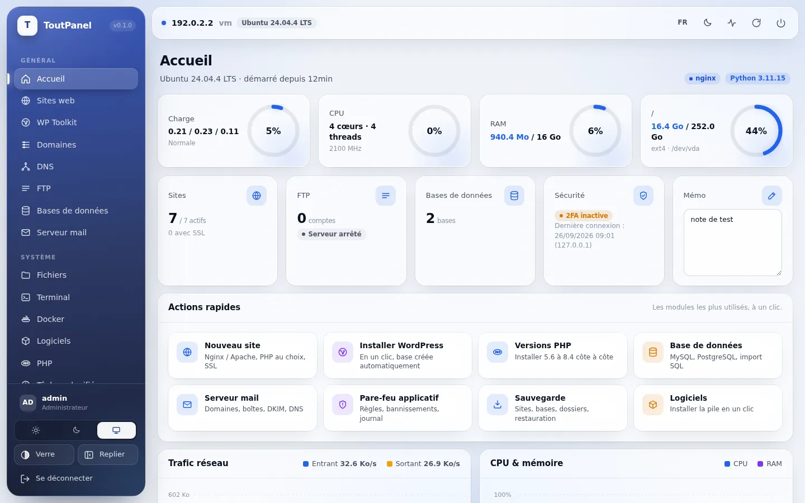
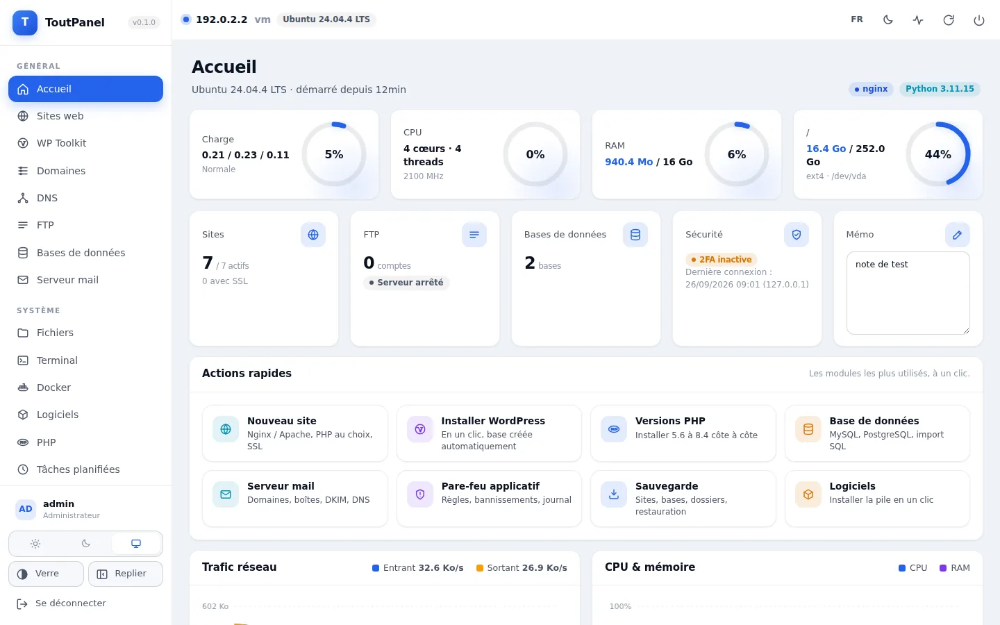
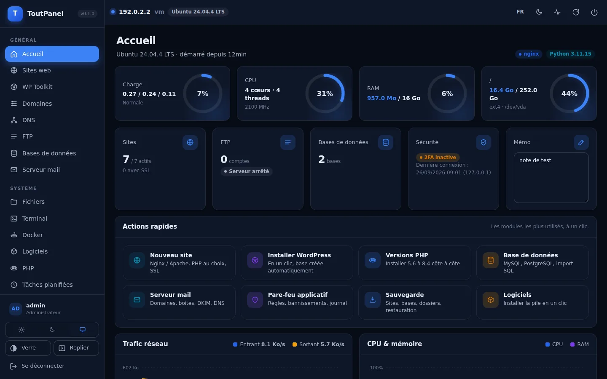

# ToutPanel

**Panel d'hébergement web multiplateforme (Linux & Windows), écrit en Python.**
Une interface moderne pour gérer sites, bases de données, FTP, SSL, Docker, sauvegardes, pare-feu et bien plus, depuis le navigateur.



## Deux styles d'interface

Le panel propose deux habillages, chacun avec un mode clair, un mode sombre et un mode « système » ; le choix se fait
dans Réglages → Apparence (ou Personnalisation), sans rechargement.

| Aurora (défaut) | Classique |
|---|---|
| Rail bleu profond translucide, surfaces en verre, fond ambiant. | Menu clair et plat, cartes opaques, accent bleu. Sobre et rapide. |
|  |  |
|  |  |

## Fonctionnalités

| Module | Détails |
|---|---|
| **Tableau de bord** | Jauges charge / CPU / RAM / disques, trafic réseau en direct, état des services, mémo |
| **Sites web** | Création en un clic, multi-domaines, PHP-FPM (multi-versions), statique, reverse proxy, config personnalisée, vhosts **Nginx / Apache / IIS** générés automatiquement |
| **SSL** | Let's Encrypt (certbot), auto-signé, import manuel, redirection HTTPS forcée, suivi des expirations |
| **WP Toolkit** | Installation de WordPress en un clic (téléchargement, base de données, `wp-config.php`) |
| **Domaines** | Vue consolidée de tous les domaines |
| **FTP** | Serveur FTP **intégré** (pyftpdlib), comptes, droits, ports passifs — aucune installation |
| **Bases de données** | MySQL/MariaDB, PostgreSQL, SQLite : création, utilisateurs, mots de passe, import, liste serveur |
| **Fichiers** | Explorateur complet : édition (Ctrl+S), upload glisser-déposer, téléchargement, copier/couper/coller, zip/tar, extraction, chmod, recherche |
| **Terminal** | Shell web interactif (bash sous Linux, PowerShell sous Windows) via WebSocket |
| **Docker** | Conteneurs (start/stop/restart/logs/rm), images, pull, création de conteneur, stats |
| **PHP multi-versions** | Installation de n'importe quelle version 5.6 → 8.4 côte à côte (dépôts Sury / PPA ondrej, Remi, Alpine, archives officielles sous Windows), extensions, éditeur php.ini (formulaire + brut), pools FPM, phpinfo, version CLI par défaut, affectation par site |
| **Personnalisation** | Modèles de vhost Nginx/Apache et page d'accueil des sites en Jinja2 éditables avec prévisualisation et restauration, couleur d'accent, logo, thème par défaut, CSS personnalisé, menu compact, liens de menu, répertoires (sites, sauvegardes) |
| **Logiciels** | Magasin : Nginx, Apache, PHP 8.1–8.3, MariaDB, MySQL, PostgreSQL, Redis, Memcached, Docker, Certbot, Node.js, Git, Composer, Fail2ban, UFW, phpMyAdmin — via apt/dnf/yum/pacman/apk/zypper/winget/choco |
| **Tâches planifiées** | Planificateur intégré (commande, URL, sauvegarde site / base / dossier), expressions cron, journal d'exécution |
| **Sauvegardes** | Sites, bases, dossiers, rotation automatique, téléchargement, restauration |
| **Monitoring** | Historique CPU / RAM / réseau / charge / disque (1h → 7j) |
| **Processus** | Liste triable, filtre, kill |
| **Journaux** | Panel, sites, système (journalctl / Event Log), historique des tâches |
| **Serveur mail** | Postfix + Dovecot + OpenDKIM pilotés par le panel : domaines, boîtes (quota), alias & catch-all, DKIM/SPF/DMARC (enregistrements DNS prêts à copier), TLS, file d'attente, journal, test d'envoi (Linux) |
| **Répartition de charge** | Sites reverse proxy vers plusieurs serveurs : round-robin pondéré, moins de connexions, IP hash (sessions collantes), serveurs de secours, seuils de panne, keepalive, bascule automatique, vérification de l'état et alertes |
| **Déploiement Git** | Sites déployés depuis GitHub / GitLab / Gitea : HTTPS + jeton ou SSH avec clé générée par le panel, actualisation automatique à intervalle, webhook signé, sous-dossier, commande de build, historique |
| **Alertes** | E-mail, webhook (Slack, Discord…) et Telegram : service arrêté, disque plein, certificat qui expire, nouvelle connexion, déploiement ou sauvegarde en échec ; renouvellement SSL automatique |
| **Webmail** | Roundcube installé et configuré en un clic (base MySQL ou SQLite, site PHP, règles de sécurité, plugins), mise à jour et désinstallation depuis le panel |
| **DNS** | Zones BIND générées depuis vos sites (A, CNAME, MX, SPF, DKIM, DMARC…), tous les types d'enregistrements, glue automatique, `named-checkzone`, vérification de propagation, import / push Cloudflare |
| **WAF** | Pare-feu applicatif Nginx/Apache généré : anti-SQLi, XSS, traversée de répertoires, scanners & mauvais robots, limitation de débit (anti-CC), extensions interdites, listes IP noire/blanche, règles regex personnalisées, journal des attaques, bannissement automatique au pare-feu |
| **Sécurité** | Pare-feu (ufw / firewalld / iptables / netsh), ports en écoute, journal des connexions, recommandations |
| **Compte & panel** | 2FA TOTP avec codes de secours, sessions révocables, jetons d'API, journal d'audit, anti-CSRF et CSP, entrée sécurisée, liste blanche d'IP, anti-bruteforce par IP et par compte, HTTPS du panel, port, 10 langues (FR, EN, ES, DE, IT, PT, NL, RU, ZH, AR), habillages Aurora (translucide) et Classique (plat) en bleu, clair / sombre |

## Mise à jour

Relancez le script d'installation : il détecte l'installation existante et passe en mode mise à jour (données sauvegardées, code mis à jour, base migrée, panel redémarré, comptes et réglages conservés). Ou depuis le panel : **Réglages → Système → Rechercher une mise à jour**.

## Systèmes pris en charge

| Plateforme | Versions | Notes |
|---|---|---|
| **Debian** | 11, 12, 13 | PHP multi-versions via packages.sury.org |
| **Ubuntu** | 20.04, 22.04, 24.04 | PHP multi-versions via PPA ondrej/php |
| **Fedora** | 40+ | PHP via Remi, Docker CE, Valkey — suite de tests validée sur Fedora 44 / Python 3.14 |
| **AlmaLinux / Rocky Linux** | 9, 10 | EPEL + CRB activés, PHP via Remi, SELinux configuré automatiquement, Valkey sur 10 — installation complète validée sur AlmaLinux 9.8 et 10.2 |
| **RHEL** | 9, 10 | idem (EPEL + CodeReady Builder via subscription-manager) |
| **Windows** | 10, 11 | PowerShell 5.1+, aucune dépendance à winget |
| **Windows Server** | 2016, 2019, 2022, 2025 | Python depuis python.org, Nginx (nginx.org), PHP (windows.php.net), MariaDB (MSI) |
| Arch, Alpine, openSUSE | — | panel fonctionnel, pile logicielle réduite, non testés |

`toutpanel check` affiche un diagnostic de compatibilité de la machine (OS, Python, droits, systemd, SELinux, pare-feu, serveur web, PHP, base de données, port).

Sur les distributions SELinux, le panel déclare au premier démarrage les contextes nécessaires (`httpd_sys_rw_content_t` sur la racine des sites, `httpd_log_t` sur les journaux, `cert_t` sur les certificats, `httpd_config_t` sur les vhosts, `mail_spool_t` sur les boîtes mail) et active les booléens `httpd_can_network_connect`, `httpd_can_network_connect_db`, `httpd_can_sendmail`. Relancez `toutpanel selinux` si vous changez de répertoires.

## Installation

### Linux (root)

```bash
curl -sSL https://raw.githubusercontent.com/qu3ntin01/toutpanel/main/install.sh | sudo bash
```

Le script installe **tout le serveur** en une commande :

- Python + environnement virtuel dans `/www/toutpanel/venv`
- **Nginx**, **PHP-FPM** (dernière version disponible + extensions), **MariaDB** (mot de passe root généré et enregistré dans le panel), **Redis**, **Certbot**, **Fail2ban**
- un **compte administrateur aléatoire** et une **URL sécurisée aléatoire** (entrée `/tp_xxxxxxxx` : sans elle le panel répond 404)
- le service **systemd** `toutpanel`, l'ouverture des ports dans le pare-feu (22, 80, 443, 21 et le port du panel)
- un récapitulatif à l'écran, enregistré dans `/www/toutpanel/data/install-info.txt` (lisible par root uniquement)

Options utiles :

```bash
sudo bash install.sh --stack minimal      # Nginx + PHP + Certbot seulement
sudo bash install.sh --stack none         # uniquement le panel
sudo bash install.sh --mail               # ajoute Postfix + Dovecot + OpenDKIM
sudo bash install.sh --random-port        # port du panel aléatoire (20000-40000)
sudo bash install.sh --username moi --password 'MonMotDePasse' --entrance /mon-acces
sudo bash install.sh --source /chemin/local --home /opt/toutpanel --port 7443
```

### Windows (PowerShell administrateur)

```powershell
Set-ExecutionPolicy Bypass -Scope Process -Force
iwr -useb https://raw.githubusercontent.com/qu3ntin01/toutpanel/main/install.ps1 | iex
# depuis les sources : .\install.ps1 -Port 8888 -Home C:\toutpanel [-Stack] [-Username x] [-Password y] [-Entrance /x]
```

Compatible PowerShell 5.1 (Windows Server 2016+) sans winget : le script installe Python depuis python.org si besoin, crée l'environnement dans `C:\toutpanel\venv`, génère le **compte admin et l'URL sécurisée**, crée une tâche planifiée `ToutPanel` (démarrage automatique en SYSTEM) et les règles de pare-feu. L'option `-Stack` installe **Nginx** (archive nginx.org dans `C:\nginx`, démarrage automatique), **PHP 8.3** (windows.php.net, `php-cgi` supervisé par le panel) et **MariaDB** (MSI officiel installé comme service, mot de passe root enregistré dans le panel).

### Manuel (développeurs)

```bash
git clone https://github.com/qu3ntin01/toutpanel.git && cd toutpanel
python3 -m venv .venv && . .venv/bin/activate      # Windows : .venv\Scripts\activate
pip install -e ".[dev]"
export TOUTPANEL_HOME=$PWD/data                     # Windows : $env:TOUTPANEL_HOME="$PWD\data"
toutpanel run
```

Puis ouvrez `http://IP:8888`. En mode manuel, l'utilisateur `admin` est créé avec un mot de passe aléatoire affiché dans la console (voir aussi `toutpanel setup` pour définir un compte et une entrée sécurisée).


Lancé dans un terminal, le script affiche un menu : installer, mettre à jour, réinstaller ou désinstaller (`--uninstall`) ; `--yes` pour une exécution sans question. À la fin, il affiche l'adresse publique et l'adresse locale du panel.

## Ligne de commande

```
toutpanel info                 URL, utilisateur, mot de passe initial
toutpanel setup [--username] [--password] [--entrance] [--port] [--json]
                               (ré)initialise le compte admin et l'entrée sécurisée (aléatoires si omis)
toutpanel dbroot mysql|postgres --password X [--host] [--port] [--user]
toutpanel check                diagnostic de compatibilité
toutpanel selinux              (re)déclarer les contextes SELinux
toutpanel php install|remove <version> [--extensions a,b]
toutpanel run | start | stop | restart | status
toutpanel passwd [motdepasse] [--disable-2fa]
toutpanel username <nom>
toutpanel port <port>
toutpanel entrance /mon-acces  entrée sécurisée (vide pour désactiver)
toutpanel ssl on|off           HTTPS du panel (certificat auto-signé)
toutpanel service install|uninstall
```

## Arborescence

```
/www/toutpanel            (Windows : C:\toutpanel)
├── data/                 base SQLite, settings.json, mot de passe initial
├── logs/                 panel.log + journaux des sites
├── vhost/                vhosts générés (si le dossier natif du serveur web est absent) + custom/
├── ssl/                  certificats par site + certificat du panel
├── backup/               archives de sauvegarde
└── venv/                 environnement Python
/www/wwwroot              racine des sites (Windows : C:\toutpanel\wwwroot)
```

## Architecture

- **Backend** : FastAPI + Uvicorn, SQLAlchemy (SQLite), APScheduler, pyftpdlib, psutil, cryptography, pyotp
- **Frontend** : SPA sans build (vanilla JS + CSS), graphiques canvas maison, xterm.js pour le terminal
- **Plateforme** : couche d'abstraction `toutpanel/platform/` (services, paquets, pare-feu) avec implémentations Linux et Windows
- **Serveur web** : adaptateurs `nginx`, `apache`, `iis` dans `toutpanel/services/webserver.py`
- **Mail** : `toutpanel/services/mail.py` génère les tables Postfix, `99-toutpanel.conf` Dovecot (auth passwd-file SSHA512, LMTP, quotas) et OpenDKIM, puis recharge les services
- **PHP** : `toutpanel/services/php.py` gère dépôts, paquets, php.ini et pools par version ; sous Windows le panel supervise lui-même `php-cgi` (un port FastCGI par version)
- **Modèles** : `toutpanel/templates/vhost/*.j2` (défaut) surchargés par `<home>/templates/vhost/*.j2`
- **WAF** : `toutpanel/services/waf.py` génère `conf.d/toutpanel_waf.conf` (zones, maps) et un snippet inclus dans chaque vhost ; un thread analyse les journaux d'accès pour le bannissement automatique

## Tests

```bash
pip install -e ".[dev]"
pytest
```

## Sécurité

- Exécutez le panel en root/administrateur (nécessaire pour gérer les services), mais protégez-le : 2FA, entrée sécurisée, liste blanche d'IP, port non standard, HTTPS.
- Les mots de passe de bases sont stockés en clair dans la base SQLite du panel : protégez le répertoire `data/`.

## Licence

MIT

## Dépôt

| Dossier | Contenu |
|---|---|
| `toutpanel/` | le panel (Python, FastAPI) — `pip install .` puis `toutpanel run` |
| `install.sh`, `install.ps1` | installateurs Linux / Windows du serveur complet |
| `site/` | site vitrine dynamique (PHP 8.1+, MySQL) avec installateur web, administration et export statique (`php build.php`), voir `site/README.md` — dépôt de développement |
| `docs/` | documentation utilisateur (MkDocs Material) : `cd docs && mkdocs serve` — dépôt de développement |
| `tests/` | tests automatisés (`pytest`) — dépôt de développement |

Le dépôt public `qu3ntin01/toutpanel` ne contient que ce qui sert à l'installation (le panel, les installateurs, cette page) : chaque version y est publiée depuis le dépôt de développement avec `scripts/publish-public.sh`.
