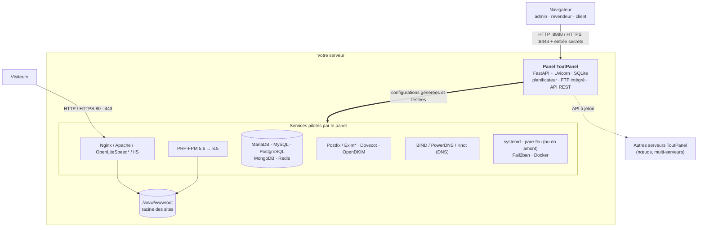

<div align="center">

# ToutPanel

**Le panel d'hébergement web pour Linux et Windows : sites, PHP, bases de données, mail, DNS, SSL, sécurité et sauvegardes depuis une seule interface web, en 10 langues.**

Nginx · Apache · OpenLiteSpeed *(expérimental)* · IIS · PHP 5.6 → 8.5 · MariaDB · MySQL · PostgreSQL · MongoDB · Postfix / Dovecot · BIND / PowerDNS / Knot · Let's Encrypt · WAF / ToutWAF · pare-feu · Docker · multi-tenant · multi-serveurs


-f59e0b?style=flat-square)


[Installer](#installation-complète) · [Nouveautés de la 0.4](#nouveautés-de-la-040-bêta) · [Fonctionnalités](#fonctionnalités) · [CMS](#cms) · [Captures d'écran](#captures-décran) · [Thèmes](#thèmes) · [Éditions](#éditions) · [Architecture](#architecture) · [Premier démarrage](#premier-démarrage) · [Dépannage](#dépannage) · [English](README.en.md)

**Version 0.4.0b2** · canal **développeur (bêta)** · 2026-10-04

</div>


> **Branche de développement (bêta).** Versions de test, non garanties : pour la version stable, utilisez la branche [`main`](https://github.com/qu3ntin01/toutpanel). Installation : `curl -sSL https://raw.githubusercontent.com/qu3ntin01/toutpanel/dev/install.sh | sudo bash -s -- --channel dev`.

---

## C'est quoi ToutPanel ?

ToutPanel transforme un serveur fraîchement installé en **plateforme d'hébergement web complète**, pilotée depuis le navigateur. Une commande installe la pile (par défaut Nginx, PHP-FPM, MariaDB, Redis ou Valkey, Certbot, Fail2ban, ou la pile que vous composez : profils, versions, serveur web, FTP, mail, DNS, accélérateurs), le panel et son service ; vous créez ensuite vos sites, bases, boîtes mail, zones DNS et certificats en quelques clics, sans éditer un seul fichier de configuration.

Il s'adresse autant à la personne qui héberge **ses propres sites** (édition Personnelle gratuite, sans clé ni inscription) qu'aux **agences et hébergeurs** qui revendent de l'hébergement : comptes revendeurs et clients, plans et quotas, facturation, marque blanche, multi-serveurs et haute disponibilité (éditions Professionnelle et Entreprise).

Vos données restent **sur votre serveur** : aucune police ni CDN externe dans l'interface, aucun appel au serveur de licences tant qu'aucune licence n'est activée.

> **Ce dépôt ne contient aucun code source.** Il publie uniquement ce qui sert à installer le panel : les installeurs `install.sh` et `install.ps1`, le panel compilé (`dist/`, roues Python « bytecode seulement »), les notes de version, la licence et `version.json`.

| | |
|---|---|
| **Systèmes** | Linux : Debian 11+, Ubuntu 20.04+, AlmaLinux / Rocky Linux / RHEL / CentOS Stream / Oracle Linux 8+, Fedora, avec d'autres familles en pile réduite (openSUSE, Arch, Alpine, Amazon Linux…) et un **niveau de support** affiché (`toutpanel compat`) ; Windows 10 / 11, Windows Server 2016 → 2025 |
| **Serveurs web** | Nginx, Apache, Nginx + Apache, **OpenLiteSpeed** *(expérimental, avec LSPHP et LSCache)*, IIS (basique) |
| **Pile logicielle** | **composeur** : profils, versions, schéma, installation reprenable, état réel ; accélérateurs (OPcache, JIT, Redis / Valkey, Memcached, Varnish*, Brotli, Zstandard*, HTTP/3*) |
| **PHP** | 5.6 à 8.5 côte à côte, 138 extensions au catalogue, une version par site |
| **Bases de données** | MariaDB, MySQL (distribution, ou 8.4 / 9.x Oracle*), Percona Server*, PostgreSQL, MongoDB, SQLite, Redis / Memcached par compte |
| **FTP, DNS, mail** | FTP : intégré, Pure-FTPd*, ProFTPD*, vsftpd*, SFTP seul* · DNS : BIND, PowerDNS, Knot · mail : Postfix + Dovecot, Exim* · un seul moteur à la fois, bascule avec retour arrière |
| **Pare-feu** | géré par le panel (nftables, ufw, firewalld, CSF, iptables) **ou en amont**, garde-fou anti-verrouillage |
| **CMS** | 595 CMS et applications au catalogue (582 vérifiés : 536 gratuits, 46 commerciaux), version au choix, installations suivies et mises à jour |
| **Interface** | 10 langues, 13 thèmes clair / sombre (**Horizon** par défaut), couleur d'accent libre, accessibilité WCAG AA |
| **Installeurs** | `install.sh` et `install.ps1` en 10 langues (anglais par défaut, `--lang` / `--fr`…, `TOUTPANEL_LANG`, langue du système), options de pile et de pare-feu, version précise (`--version`), [assistant d'installation](https://toutpanel.com/installation-assistant) qui génère la commande |
| **Automatisation** | API REST (OpenAPI), CLI de 76 commandes, webhooks signés, modules Ansible, exemples Terraform |

<sub>\* *expérimental* : réel et testé, mais moins éprouvé ou avec des limites déclarées dans l'interface et dans les [limites connues](#limites-connues).</sub>

## Nouveautés de la 0.4.0 (bêta)

La **0.4.0b2** est une **préversion** publiée sur la branche [`dev`](https://github.com/qu3ntin01/toutpanel/tree/dev) : non garantie, à tester sur un serveur de test avant tout usage en production. Chaque fonction porte sa maturité : **stable**, **expérimentale** (réelle et testée, mais moins éprouvée ou avec des limites déclarées) ou **à venir** (visible, grisée, jamais simulée).

| Nouveauté | Maturité |
|---|---|
| **Écoute HTTP et HTTPS simultanée** du panel (8888 / 8443, certificat auto-signé au départ) | stable |
| **Installation d'une version précise** : `--version X.Y.Z`, `--list-versions` | stable |
| **Répertoire `/var/toutpanel` par défaut** (une installation existante dans `/www/toutpanel` est détectée et conservée) | stable |
| **Pare-feu géré par le panel ou en amont** (groupe de sécurité, pare-feu de l'hébergeur), page dédiée, ports à ouvrir, **garde-fou anti-verrouillage de 60 s** | stable |
| **Composeur de pile** : profils, versions, schéma d'architecture, estimation mémoire / disque, **assistant de première configuration en 9 étapes**, page **Pile logicielle** (état réel) | stable |
| **Moteurs DNS** : BIND, PowerDNS, Knot DNS (un seul à la fois, bascule avec migration des zones et retour arrière) | stable |
| **Moteurs de courrier** : Postfix + Dovecot, relais externe ; **Exim + Dovecot** | stable ; Exim : **expérimental** |
| **Moteurs FTP** : serveur intégré, **Pure-FTPd, ProFTPD, vsftpd, SFTP seul** | intégré : stable ; autres moteurs : **expérimental** |
| **OpenLiteSpeed** avec LSPHP et LSCache (bascule depuis Nginx / Apache avec retour arrière) | **expérimental** |
| **Accélérateurs** : OPcache, JIT, APCu, Redis / Valkey, Memcached, cache FastCGI, Brotli ; **Varnish, Zstandard, HTTP/3** | Varnish, Zstandard, HTTP/3 : **expérimental** ; autres : stable |
| **Bases** : MariaDB 10.6 → 11.8, **MySQL 8.4 / 9.x** (dépôt Oracle), **Percona Server**, PostgreSQL 13 → 18 | MySQL Oracle et Percona : **expérimental** |
| **ToutWAF distant** : relier le panel à un ToutWAF installé sur un autre serveur | nouveau (édition Professionnelle) |
| **Compatibilité étendue des distributions** avec niveaux de support (`toutpanel compat`) | stable |
| **Installeur multilingue** avec options de pile (`--profile`, `--web`, `--php`, `--db`, `--ftp`, `--mail`, `--dns`, `--accel`…), `--firewall`, `--waf-*`, et un **[assistant d'installation](https://toutpanel.com/installation-assistant)** sur le site qui génère la ligne de commande | stable |
| Apache + mod_php, Caddy | **à venir** (refusés proprement, jamais simulés) |

Détail et limites : [Limites connues](#limites-connues) · [CHANGELOG.md](CHANGELOG.md).

## Fonctionnalités

### Hébergement web
- **Sites en un clic** : multi-domaines, PHP-FPM, statique, reverse proxy, applications ; vhosts **Nginx, Apache, Nginx + Apache, OpenLiteSpeed *(expérimental)* ou IIS** générés depuis des modèles Jinja2 et **testés avant rechargement** (`nginx -t` / `apachectl -t`, retour aux derniers vhosts valides en cas d'échec).
- **PHP multi-versions** : 5.6 → 8.5 côte à côte (Sury, PPA ondrej, Remi, windows.php.net), 138 extensions, ionCube, `php.ini` et pool FPM par site, version CLI par défaut.
- **Hébergement avancé** : redirections, hôte canonique, en-têtes, répertoires protégés, pages d'erreur, anti-hotlink, mode maintenance, cache FastCGI, préproduction (staging), statistiques GoAccess, répartition de charge (round robin, least_conn, ip_hash), compression, HTTP/2, HTTP/3, profils TLS.
- **Déploiement Git** atomique par site (HTTPS avec jeton ou SSH, branche, étiquette ou commit, actualisation automatique, retour arrière).
- **Domaines et adresses IP** : inventaire des IP, IP additionnelles persistantes, IP dédiées à un compte, adresse d'écoute par site.
- **OpenLiteSpeed** *(expérimental)* : installation par le dépôt officiel LiteSpeed (Debian / Ubuntu et famille Red Hat), **LSPHP** par version de PHP, un `vhconf` par site, **LSCache**, bascule depuis Nginx / Apache **avec retour arrière** ; les fonctions que ce serveur ne reproduit pas (WAF intégré, ModSecurity, filtrage par pays…) sont **signalées**, jamais ignorées en silence.

### Pile logicielle et accélérateurs
- **Composeur de pile** : profils de départ (mono-site, multi-sites, hébergeur, haute performance, application, mail seul, DNS seul, nœud, LAMP…) adaptés à la mémoire détectée, choix du serveur web, de PHP (5.6 → 8.5 côte à côte), des bases, du FTP, du mail, du DNS, de la sécurité, des runtimes et des outils ; **schéma d'architecture** mis à jour à chaque choix (export SVG / PNG), mémoire et disque estimés, réglages automatiques proportionnels à la RAM.
- **Mêmes moteurs, trois entrées** : l'**assistant de configuration** (9 étapes : bienvenue, compte, adresse, préférences, profil, composition, récapitulatif de la pile, pare-feu, récapitulatif), la page **Réglages › Pile logicielle** (état réel, ajout, changement de version) et la ligne de commande `toutpanel stack` (appelée aussi par l'installeur).
- Installation **reprenable et idempotente** : chaque étape vérifie si elle est déjà satisfaite, une étape en échec n'est jamais comptée comme réussie ; les composants « à venir » sont visibles mais refusés, sans simulation.
- **Accélérateurs** (page dédiée) : OPcache, JIT de PHP, APCu, Redis / Valkey, Memcached, cache FastCGI, Brotli ; **Varnish** *(expérimental : HTTP seulement)*, **Zstandard** et **HTTP/3** *(expérimentaux : selon le module ou la compilation de Nginx, sinon refus expliqué)*, avec état réel, mémoire, réglages, « Vider le cache » et limites affichées.

### SSL / TLS
- **Let's Encrypt** (HTTP-01, DNS-01, wildcard), ZeroSSL, Buypass, autorité ACME personnalisée, CSR, import PFX, auto-signé, HSTS, **renouvellement automatique**.
- Page **Certificats** : validité, émetteur et expiration de tous les certificats ; HTTPS du panel par Let's Encrypt ; certificats SNI du serveur mail.

### DNS
- Zones servies par **BIND, PowerDNS ou Knot DNS** (un seul serveur local à la fois ; bascule avec migration des zones et des clés DNSSEC, retour arrière), tous les types d'enregistrements, gabarits, **DNSSEC**, serveurs secondaires (TSIG), DNS inverse, import / export BIND.
- Zones poussées chez **Cloudflare, PowerDNS, OVH, Route53** ; vérification de propagation.

### Mail et webmail
- **Postfix, Dovecot, OpenDKIM** ou rspamd ; **Exim + Dovecot** au choix *(expérimental : sous-ensemble de Postfix, limites déclarées, bascule avec migration des domaines, boîtes et clés DKIM)* ; domaines, boîtes, alias, redirections, listes (mlmmj), filtres Sieve et répondeur.
- **Webmail Roundcube ou SnappyMail** installé en un clic avec connexion directe depuis le panel.
- Rotation DKIM, antispam, ClamAV, greylisting, RBL, débit d'envoi, relais sortant, suivi des messages, file d'attente, fetchmail, CalDAV / CardDAV, MTA-STS, autoconfiguration des clients.

### Bases de données
- **MariaDB (10.6 → 11.8), MySQL, Percona Server, PostgreSQL (13 → 18), MongoDB, SQLite** : bases, utilisateurs et privilèges, accès distant par IP, **Adminer et phpMyAdmin en SSO** (toutes les versions au choix, compatibilité PHP vérifiée), import / export, maintenance, quotas de taille.
- Serveurs supplémentaires (Docker), **Redis / Memcached par compte**, détection des versions, dépôts officiels MariaDB et PostgreSQL (PGDG), changement de version majeure avec sauvegarde préalable, réplication (Pro). **MySQL 8.4 LTS / 9.x** (dépôt Oracle) et **Percona Server** sont *expérimentaux* (un seul moteur de la famille MySQL à la fois, sauvegarde préalable obligatoire).

### Fichiers, FTP et accès
- **Gestionnaire de fichiers** complet : éditeur CodeMirror, archives, corbeille, permissions et propriétaire, recherche dans le contenu, occupation du disque, glisser-déposer.
- **Serveur FTP / FTPS intégré** (comptes, droits, quotas, journal) ou, au choix, **Pure-FTPd, ProFTPD, vsftpd ou SFTP seul** *(expérimentaux : comptes du panel synchronisés, tableau des capacités par moteur, bascule avec retour arrière)*, **SFTP chrooté**, shell restreint, clés SSH, **WebDAV** avec les comptes FTP.
- **Terminal web** : bash sous Linux, PowerShell sous Windows.

### CMS
- **Page CMS** : catalogue de **595 CMS et applications web**, dont **582 vérifiés** (source des versions interrogée, URL de téléchargement contrôlée) : **536 gratuits** et **46 commerciaux** ; recherche, filtres par catégorie, type (PHP, Node.js, Python, Go, Java, .NET, statique) et distribution, pastille « prêt » ou « prérequis manquants ».
- **Choix de la version** : dernière stable par défaut, toutes les versions publiées (préversions sur option) ; fiche avec prérequis vérifiés, site existant ou nouveau, sous-dossier, base créée automatiquement, compte administrateur et langue, suivi en direct.
- **Installations centralisées** : détection automatique sur tous les sites (y compris les installations faites hors du panel), version installée et dernière version, bandeau des mises à jour disponibles ; **sauvegarde** (fichiers et base), **mise à jour** avec sauvegarde préalable et retour arrière en cas d'échec, **Tout mettre à jour**, **clonage** vers un autre site ou sous-dossier, réinstallation, suppression, journal des opérations, mises à jour mineures automatiques par installation.
- **Logiciels commerciaux** : fiche avec éditeur, prix indicatif et lien d'achat ; installation à partir du **paquet fourni** par l'éditeur (envoi depuis la fiche, chemin sur le serveur ou URL privée) et de sa clé de licence ; mise à jour par paquet.
- **Recherche locale des versions** : le panel interroge lui-même les sources officielles (wordpress.org, GitHub, Packagist, npm, PyPI, sites des éditeurs), avec un cache local de 6 h, **deux fois par jour** (05:23 et 17:23, heures réglables) ou à la demande ; alerte par les canaux de notification, pastille du menu et widget d'accueil.

### Applications, WordPress et Docker
- **Installateur d'applications** : WordPress, Joomla, Drupal, Grav, PrestaShop, Nextcloud, Laravel, Symfony, Matomo, Dolibarr, Moodle, phpBB, MediaWiki, Ghost — téléchargement, base, configuration et post-installation automatiques.
- **WP Toolkit** (onglet WordPress de la page CMS) : wp-cli, mises à jour, durcissement, détection des vulnérabilités, clonage.
- Applications **Node.js, Python, Ruby, Go, Java, .NET** avec unité systemd et proxy.
- **Docker** : conteneurs, images, `docker run`, projets **Docker Compose** par compte avec site proxy.

### Sauvegardes
- Sauvegarde de site, base, dossier, boîte mail, compte ou **serveur entier** ; planifications GFS ; restauration granulaire ; sauvegardes de sécurité automatiques (avant une suppression, par exemple) ; vérification des sauvegardes.
- Moteur **restic** chiffré et dédupliqué, **destinations distantes** S3 et compatibles, SFTP, Backblaze B2, et via rclone FTP / Google Drive / OneDrive / Dropbox / WebDAV (Pro). Secrets chiffrés en base, jamais renvoyés par l'API.

### Sécurité
- **Pare-feu** nftables, firewalld, UFW, CSF ou iptables (détection automatique) **géré par ToutPanel ou en amont** (groupe de sécurité cloud, pare-feu matériel ou de l'hébergeur : le panel ne touche alors à aucune règle système et liste les **ports à ouvrir chez l'hébergeur**) ; règles, listes d'IP, services prédéfinis, ports en écoute et exposition, protection anti-DDoS, **garde-fou de 60 s** : sans confirmation, le changement est annulé par le serveur lui-même.
- **Fail2ban**, **WAF intégré** (SQLi, XSS, RCE, traversée, scanners, robots, débit, bannissement automatique ; blocage par pays en Pro) et **ModSecurity + OWASP CRS** par site (Pro).
- **ToutWAF**, le WAF / reverse proxy de l'éditeur, **moteur recommandé** dans WAF › Moteur (Pro) : installation depuis le panel par l'installeur officiel (canal stable ou dev, serveur web basculé sur les ports de repli), liens secrets de la **console** (:9443), version installée et disponible, mise à jour avec retour arrière, diagnostic, **synchronisation** des sites (politique locale ou API de la console) ; aussi à l'installation avec `install.sh --waf toutwaf`. **BunkerWeb** et **SafeLine** (Docker) restent proposés.
- **ToutWAF distant** : le panel peut se relier à un ToutWAF installé sur **un autre serveur** (WAF › Moteur › Mode « Distant », ou `toutpanel waf connect toutwaf`) : sites déclarés par l'API REST, certificat de la console épinglé par empreinte, jeton chiffré, restriction du pare-feu 80 / 443 au seul ToutWAF, surveillance et alertes.
- **Antimalware** ClamAV / maldet / YARA avec quarantaine, intégrité (rkhunter, chkrootkit, debsums, AIDE), AppArmor et **SELinux** configurés automatiquement.
- **Authentification** : 2FA TOTP et codes de secours, **clés de sécurité WebAuthn / passkeys**, entrée sécurisée secrète, liste blanche d'IP, captcha ALTCHA, verrouillage persistant, sessions révocables ; LDAP / Active Directory, OpenID Connect et SAML (Pro).
- **Journal d'audit scellé** (HMAC chaîné), carte « Recommandations » sur la page Sécurité.

### Supervision et alertes
- Accueil personnalisable : **23 widgets** (CPU, RAM, disques, I/O, réseau, services, quotas, mémo…), disposition enregistrée par utilisateur.
- **Monitoring** historique, sondes **d'uptime** HTTP(S), processus par compte, journaux en direct, services avec redémarrage automatique.
- **Alertes** par e-mail, webhook, Telegram ou SMS (service arrêté, disque plein, certificat qui expire…), export **Prometheus** `/metrics` (Pro).
- Administration de l'hôte : nom d'hôte, fuseau horaire, NTP, swap, mises à jour du système (sécurité, automatiques, redémarrage requis), file de tâches, **réparation automatique**.

### Multi-tenant, revendeurs et facturation
- Hiérarchie **administrateur → revendeurs → clients → sous-utilisateurs**, permissions par module et par action, profils d'accès.
- **Plans et quotas** (disque, inodes, trafic, sites, bases, boîtes…), limites CPU / RAM / E-S (cgroups), utilisateur système dédié, suspension automatique, connexion « en tant que », transfert, import / export CSV.
- **Facturation** (TVA, prorata, relances, PDF), Stripe, PayPal, virement, provisioning à la commande, WHMCS / Blesta / HostBill, **marque blanche**, e-mails transactionnels, tickets de support, annonces (Pro).

### Multi-serveurs et haute disponibilité
- **Panel maître et nœuds** enrôlés par jeton (web, mail, DNS, bases), ressources routées, comptes miroirs, **migration de comptes** entre serveurs (Pro).
- **Haute disponibilité** : groupes web (rsync, lsyncd, NFS), réplication MariaDB / PostgreSQL avec bascule, DNS secondaires et MX secondaire automatiques, migration à chaud (Pro).
- **Migration** depuis cPanel, Plesk, DirectAdmin, ISPConfig, un hébergement mutualisé ou des boîtes IMAP, avec rapport (Pro ; l'export reste libre).

### API, CLI et automatisation
- **API REST** complète avec jetons à portée et IP restreintes, documentation **OpenAPI / Swagger**.
- **Webhooks sortants signés**, scripts pré / post-action, **CLI** `toutpanel` (site, account, db, mail, dns, backup, cron, ftp, task… avec sortie `--json`), modules Ansible et exemples Terraform.

### Store, personnalisation et confort
- **Store** relié au catalogue toutpanel.com : applications, logiciels serveur, **modules** (manifeste validé, sha256 obligatoire, chargement à chaud), thèmes ; envoi d'un zip local, mode hors ligne.
- **Assistant de configuration** à la fin de l'installation (compte, adresse du panel, langue, mode, thème, **couleur principale** et **densité** avec aperçu immédiat), **assistant de création** (site + base + certificat + boîtes mail en une fois), **recherche globale Ctrl+K**, aide contextuelle sur chaque page, outils de diagnostic (DNS, HTTP, SSL, ping, traceroute, port, SMTP, WHOIS).
- **13 thèmes**, dont **Horizon** par défaut, couleur d'accent libre, logo, CSS, liens du menu, modèles des vhosts et des e-mails ; **10 langues** : français, English, español, Deutsch, italiano, português, Nederlands, русский, 中文, العربية (écriture de droite à gauche).

### Conformité (RGPD)
- Export et suppression des données personnelles, registre des traitements, rétention des journaux, historique des mots de passe, traçabilité des accès de l'hébergeur, ancrage externe du journal d'audit (Pro).

## Captures d'écran

| | |
|---|---|
| <br>**Accueil, mode sombre** : jauges, compteurs, points d'attention, licence | <br>**Sites web** : domaines, type, racine, trafic, SSL et actions |
| <br>**PHP** : versions 5.6 → 8.5 côte à côte, état du support, pools FPM | <br>**Paramètres du site** : déploiement Git, SSL, redirections, sécurité |
| <br>**DNS** : zones BIND ou fournisseurs, gabarits, DNSSEC, cluster | <br>**Certificats** : validité, émetteur, renouvellement, certificat du panel |
| <br>**Serveur mail** : Postfix, Dovecot, OpenDKIM, ports et onglets | <br>**Webmail** : Roundcube ou SnappyMail installé en un clic |
| <br>**Bases de données** : MariaDB, PostgreSQL, MongoDB, SQLite, Redis | <br>**Fichiers** : éditeur, archives, corbeille, permissions, occupation |
| <br>**CMS › Installer** : 582 CMS et applications vérifiés, recherche, filtres, pastille « prêt » | <br>**Fiche d'un CMS** : prérequis vérifiés, choix de la version, site cible, base |
| <br>**CMS › Installations** : versions, mises à jour disponibles, sauvegarde, clonage | <br>**WAF › Moteur** : ToutWAF recommandé, WAF intégré, BunkerWeb, SafeLine |
| <br>**Terminal** : shell interactif bash / PowerShell dans le navigateur | <br>**Applications** : WordPress, Joomla, Drupal, PrestaShop, Nextcloud… |
| <br>**Store** : logiciels serveur, modules et thèmes en un clic | <br>**Sécurité** : recommandations, pare-feu, anti-DDoS, Fail2ban |
| <br>**WAF** : protections, seuils, moteurs, GeoIP, journal des attaques | <br>**Monitoring** : CPU, mémoire, réseau, charge et disque sur 1 h → 7 j |
| <br>**Comptes** : revendeurs, clients, plans, profils d'accès | <br>**Serveurs** : panel maître, nœuds, routage, migration |
| <br>**Mises à jour** : paquets du système (sécurité) et du panel | <br>**Réglages** : accès, port, entrée secrète, HTTPS, interface |
| <br>**Assistant de configuration** : thème, couleur principale, densité, aperçu immédiat | <br>**Horizon**, thème par défaut : le même écran en clair et en sombre |

**Nouveautés de la 0.4.0 (bêta)** — captures d'un serveur de démonstration (adresses de documentation) :

| | |
|---|---|
| <br>**Assistant de configuration, étape Profil** : profils de départ, mémoire détectée, profil recommandé | <br>**Composition de la pile** : choix par catégorie, schéma d'architecture, validation et ressources estimées |
| <br>**Installation de la pile** : progression, étapes, reprise après erreur | <br>**Assistant, étape Pare-feu** : géré par ToutPanel ou en amont, ports qui seront ouverts |
| <br>**Réglages › Pile logicielle** : état réel, versions installées, schéma de ce serveur | <br>**Pile logicielle**, mode sombre |
| <br>**Accélérateurs** : OPcache, JIT, APCu, Redis, Memcached, FastCGI, Varnish… avec état, mémoire et limites | <br>**OpenLiteSpeed** *(expérimental)* : installation, LSPHP, bascule du serveur web, WebAdmin |
| <br>**Sécurité › Pare-feu** : moteur, mode de gestion, garde-fou, règles | <br>**Ports en écoute et exposition** : exposé, restreint, protégé |
| <br>**Pare-feu en amont** : ports à ouvrir chez l'hébergeur, à copier ou télécharger | <br>**Pare-feu**, mode sombre |
| <br>**DNS › Moteur** : BIND, PowerDNS, Knot DNS, fournisseur externe | <br>**Serveur mail › Moteur** : Postfix, Exim *(expérimental)*, relais externe |
| <br>**FTP › Moteur** : intégré, Pure-FTPd, ProFTPD, vsftpd, SFTP *(expérimentaux)* | <br>**ToutWAF distant** : panel relié à un ToutWAF d'un autre serveur |
| <br>**Accueil** : bandeau « distribution en pile réduite » selon le niveau de support | |

**Sur mobile**, l'interface s'adapte (menu repliable, tableaux défilants) :

<table>
<tr>
<td align="center"><br><b>Accueil</b></td>
<td align="center"><br><b>Sites web</b></td>
</tr>
</table>

> Captures réalisées sur un serveur de démonstration (Ubuntu 24.04, adresse de documentation 192.0.2.2, domaines d'exemple).

## Thèmes

### 13 thèmes, votre couleur

Une nouvelle installation utilise **Horizon** : ciel dégradé bleu-cyan, menu et barre du haut flottants translucides, pilule active en dégradé bleu-violet qui suit la couleur choisie, titres bleus très gras. **Personnalisation › Apparence** : choisissez un autre design, puis **n'importe quelle couleur d'accent** (12 préréglages, pipette ou code `#RRGGBB`). Le panel en dérive boutons, liens, menu actif, badges, dégradés et graphiques, en gardant un contraste d'au moins 4,5:1. Chaque thème existe en **clair et en sombre**, respecte le contraste élevé et les langues de droite à gauche ; l'aperçu est immédiat, rien n'est enregistré avant « Enregistrer le design ». Densité, coins, police, largeur, position du menu, icônes et animations se règlent aussi, par utilisateur ou par défaut pour tous ; le thème s'exporte et s'importe.


| | | |
|---|---|---|
| <br>**Horizon** *(par défaut)* · `#2b5fd9` | <br>**Classique** · `#2563eb` | <br>**Aurora** · `#2563eb` |
| <br>**Nuage** · `#5b5bd6` | <br>**Minimal** · `#18181b` | <br>**Nuit** · `#0369a1` |
| <br>**Terminal** · `#15803d` | <br>**Gloss** · `#7c3aed` | <br>**Nébuleuse** · `#8b5cf6` |
| <br>**Obsidian** · `#22c55e` | <br>**Nordic** · `#14b8a6` | <br>**Ember** · `#f97316` |
| <br>**Executive** · `#10b981` | | |

<sub>Couleur indiquée : accent par défaut du thème en mode clair, librement modifiable.</sub>

Le thème, le mode, la **couleur principale** et la **densité** se choisissent aussi dès l'**assistant de configuration** (étape Préférences), avec aperçu immédiat ; ce sont les valeurs par défaut de tous les comptes, chacun pouvant ensuite choisir les siennes.

## Éditions

Le programme est le même pour toutes les éditions : une **clé de licence** active les fonctions avancées sur un serveur donné. Une installation neuve fonctionne en édition Personnelle, sans inscription ni connexion à Internet.

| Édition | Prix | Clé | Pour qui |
|---|---|---|---|
| **Personnelle** | gratuite, sans limite de durée | aucune | usage personnel : vos propres sites, **jusqu'à 5** |
| **Professionnelle** | payante | obligatoire | hébergeurs, agences, usage professionnel : tout est inclus, sites illimités (ou selon le plan de licence) |
| **Entreprise** | payante | obligatoire | Professionnelle + multi-serveurs illimités + support prioritaire |

L'édition Personnelle est **complète** : sites, PHP multi-versions, bases de données, mail, DNS, SSL, WAF intégré, sauvegardes locales, monitoring, comptes clients et sous-utilisateurs, WebAuthn, outils RGPD, API et CLI. Sont réservés aux éditions payantes :

<details>
<summary><b>Liste exacte des fonctions Professionnelle / Entreprise</b></summary>

| Fonction | Personnelle | Professionnelle |
|---|---|---|
| Sites | 5 au maximum | illimités (ou selon la licence) |
| Sondes d'uptime | 3 | illimitées |
| Webhooks sortants | 2 | illimités |
| Choix du moteur WAF (ToutWAF, BunkerWeb, SafeLine) | WAF intégré | ✓ |
| ModSecurity + OWASP CRS | — | ✓ |
| Multi-serveurs : nœuds, haute disponibilité, migration à chaud | — | ✓ |
| Groupes web et cluster DNS | — | ✓ |
| Réplication des bases | — | ✓ |
| Facturation, passerelles, WHMCS, provisioning | — | ✓ |
| Marque blanche des revendeurs | — | ✓ |
| Domaine personnalisé du panel | — | ✓ |
| Support (tickets) | — | ✓ |
| Annonces | — | ✓ |
| Comptes revendeurs | — (clients et sous-utilisateurs : ✓) | ✓ |
| SSO LDAP / OpenID Connect / SAML | — (WebAuthn : ✓) | ✓ |
| Blocage par pays (GeoIP) | — | ✓ |
| Antimalware planifié | analyse manuelle | ✓ |
| Sauvegardes distantes (S3, SFTP, B2, rclone) | stockage local | ✓ |
| Moteur restic | — | ✓ |
| Export Prometheus `/metrics` | — | ✓ |
| Import depuis cPanel, Plesk, DirectAdmin, ISPConfig, mutualisé, IMAP | — (export : ✓) | ✓ |
| Modules premium du store | — | ✓ |
| Ancrage externe du journal d'audit | — (export et purge RGPD : ✓) | ✓ |

</details>

- Les entrées concernées portent un badge **Pro** ; les pages restent consultables, seules la création et la modification sont réservées.
- Activation : **Réglages › Licence › Activer une clé** (`TP-XXXXX-XXXXX-XXXXX-XXXXX`) ou `toutpanel licence activate <clé>`. Le jeton signé est vérifié localement : la licence fonctionne hors ligne (revalidation quotidienne, période de grâce de 15 jours).
- Si la licence expire ou n'est plus valide, le panel **repasse en édition Personnelle sans rien supprimer**.

Tarifs et achat : **[toutpanel.com/tarifs](https://toutpanel.com/tarifs)** · détails : [Éditions et licence](https://toutpanel.com/docs/guide/editions/).

## Architecture


```mermaid
flowchart TB
    U["Navigateur<br/>admin · revendeur · client"] -->|"HTTP :8888 / HTTPS :8443 + entrée secrète"| P
    V["Visiteurs"] -->|"HTTP / HTTPS 80 · 443"| W
    subgraph S["Votre serveur"]
        P["<b>Panel ToutPanel</b><br/>FastAPI + Uvicorn · SQLite<br/>planificateur · FTP intégré · API REST"]
        subgraph PILE["Services pilotés par le panel"]
            W["Nginx / Apache / OpenLiteSpeed* / IIS"]
            F["PHP-FPM 5.6 → 8.5"]
            D[("MariaDB · MySQL · PostgreSQL<br/>MongoDB · Redis")]
            M["Postfix / Exim* · Dovecot · OpenDKIM"]
            B["BIND / PowerDNS / Knot (DNS)"]
            X["systemd · pare-feu (ou en amont)<br/>Fail2ban · Docker"]
        end
        R[("/www/wwwroot<br/>racine des sites")]
        P ==>|"configurations générées et testées"| PILE
        W --> R
        F --> R
    end
    P -. "API à jeton" .-> N["Autres serveurs ToutPanel<br/>(nœuds, multi-serveurs)"]
```

| Composant | Rôle |
|---|---|
| **Panel** | Application FastAPI servie par Uvicorn (service systemd `toutpanel` sous Linux, tâche planifiée `ToutPanel` sous Windows). Interface web sans dépendance externe, API REST, planificateur de tâches, serveur FTP intégré. |
| **Pile web** | Nginx et/ou Apache (OpenLiteSpeed avec LSPHP : expérimental ; IIS sous Windows) avec PHP-FPM ; le panel écrit les vhosts depuis ses modèles, les teste puis recharge le service. Le **composeur de pile** choisit et fait évoluer les logiciels. |
| **Services** | MariaDB / MySQL / PostgreSQL / MongoDB, Postfix (ou Exim*) / Dovecot / OpenDKIM, BIND (ou PowerDNS, Knot), FTP (intégré ou Pure-FTPd*, ProFTPD*, vsftpd*), Fail2ban, pare-feu, Docker : pilotés par le panel via leurs outils natifs. |
| **CLI `toutpanel`** | Administration du panel (port, entrée, mot de passe, mise à jour, licence…) et commandes métier scriptables (`--json`). |

<sub>\* expérimental</sub>

```
<home>  (/var/toutpanel ou C:\toutpanel)
├── data/      base SQLite du panel, settings.json, clés, install-info.txt
├── logs/      panel.log et journaux des sites
├── vhost/     vhosts générés (si le dossier natif du serveur web est absent)
├── ssl/       certificats des sites et du panel
├── backup/    sauvegardes locales
├── src/       clone de ce dépôt (canaux, étiquettes, toutpanel update)
└── venv/      environnement Python du panel
/www/wwwroot   racine des sites (C:\toutpanel\wwwroot sous Windows)
```

## Installation complète

### Prérequis

| | Linux | Windows |
|---|---|---|
| **Systèmes** | niveau **complet** : Debian 11 et suivantes, Ubuntu 20.04 et suivantes, AlmaLinux / Rocky Linux / RHEL / CentOS Stream / Oracle Linux / CloudLinux 8 et suivantes, Fedora · niveau **réduit** (le panel fonctionne, certaines fonctions manquent) : Debian 10, Ubuntu 18.04, CentOS / RHEL 7, Amazon Linux, openSUSE / SLES, Arch, Alpine, Devuan · voir [Compatibilité des distributions](#compatibilité-des-distributions) | Windows 10, 11 · Windows Server 2016, 2019, 2022, 2025 (build 14393 minimum) |
| **Droits** | `root` (ou `sudo`) et `bash` | PowerShell 5.1+ **en administrateur** (winget non nécessaire) |
| **Python** | 3.9 à 3.14 (installé par le script si la distribution le fournit) | installé par le script (3.12, python.org) si absent |
| **Mémoire** | 1 Go minimum (panel seul), 2 Go recommandés avec MariaDB et PHP | idem |
| **Disque** | 2 Go libres + vos sites | idem |
| **Réseau** | accès sortant HTTPS (GitHub, PyPI, dépôts de la distribution, Let's Encrypt) ; IP publique fixe et DNS inverse pour le mail | idem (python.org, nginx.org, windows.php.net, MariaDB) |

Architectures : `x86_64` et `aarch64` (autres : niveau réduit). Installez de préférence sur un serveur **fraîchement installé**. Sur un serveur où Nginx, Apache ou MariaDB sont déjà configurés, utilisez `--stack none` : le panel les détecte et écrit ses vhosts dans leur dossier natif sans toucher au reste.

### Compatibilité des distributions

L'installeur et le panel détectent la distribution (`/etc/os-release`, architecture) et affichent un **niveau de support** : `toutpanel compat` liste les distributions connues, `toutpanel check` donne celui de votre serveur, et un bandeau de l'accueil prévient quand le niveau n'est pas « complet ». Il n'y a **jamais de plafond de version** : une version plus récente d'une famille connue est traitée comme la dernière connue.

| Niveau | Signification | Exemples |
|---|---|---|
| **Complet** | la pile complète est prévue (serveur web, PHP multi-versions, bases aux versions au choix, mail, pare-feu, mises à jour automatiques) | Debian 11+, Ubuntu 20.04+ (LTS et intermédiaires), AlmaLinux / Rocky / RHEL / CentOS Stream / Oracle Linux 8+, CloudLinux 8 et 9, Fedora, Raspberry Pi OS 64 bits |
| **Réduit** | le panel fonctionne, mais certaines fonctions manquent ou demandent une intervention (système en fin de vie, init sans systemd, dépôts tiers absents, architecture 32 bits) ; avertissement non bloquant | Debian 10, Ubuntu 18.04, CentOS / RHEL 7, Amazon Linux 2 et 2023 (un seul PHP à la fois), openSUSE / SLES, Arch et dérivés, Alpine, Devuan, Kali |
| **Non pris en charge** | système inconnu, trop ancien ou immuable : l'installeur le dit et s'arrête | Fedora CoreOS / Silverblue, MicroOS, Flatcar, Gentoo, NixOS, Void |

« Complet » décrit le niveau **prévu** par le panel ; la validation de bout en bout n'a pas encore été faite partout (voir [Limites connues](#limites-connues)). Python 3.9+ est fourni si le système est trop ancien (paquet récent de la distribution ou Python autonome vérifié par SHA-256, avec votre accord).

### Linux

```bash
curl -sSL https://raw.githubusercontent.com/qu3ntin01/toutpanel/main/install.sh | sudo bash
```

Pour lire le script avant de l'exécuter :

```bash
curl -sSLO https://raw.githubusercontent.com/qu3ntin01/toutpanel/main/install.sh
less install.sh
sudo bash install.sh
```

L'installation dure de 3 à 6 minutes selon la connexion.

**Assistant d'installation.** Toutes les options (compte, ports, dossier, pile, pare-feu, WAF, version, langue…) se choisissent avec des menus sur **[toutpanel.com/installation-assistant](https://toutpanel.com/installation-assistant)**, qui génère la ligne de commande et la vérifie en direct (les secrets n'y figurent jamais en clair).

**Installer cette bêta ou une version précise.** La 0.4.0b2 est une préversion du canal `dev` :

```bash
# la dernière préversion du canal dev
curl -sSL https://raw.githubusercontent.com/qu3ntin01/toutpanel/dev/install.sh | sudo bash -s -- --channel dev
# une version précise (liste : --list-versions)
curl -sSL https://raw.githubusercontent.com/qu3ntin01/toutpanel/dev/install.sh | sudo bash -s -- --list-versions
curl -sSL https://raw.githubusercontent.com/qu3ntin01/toutpanel/dev/install.sh | sudo bash -s -- --version 0.4.0b2
```

**Menu interactif.** Lancé dans un terminal sans option de mode, le script présente ToutPanel, détecte une installation existante et propose : **installer** (pile complète) ou **installer le panel seul**, éventuellement en **mode nœud** ; ou, si le panel est déjà là, **mettre à jour**, **réinstaller complètement** ou **désinstaller**. Il pose aussi la question du **pare-feu** (ToutPanel / en amont / plus tard) et, après le démarrage du panel, celle du **profil de la pile**. Sans terminal (automatisation, `--yes`), il n'interroge pas : il installe, ou met à jour si le panel est présent (pare-feu « plus tard », pile par défaut).

**Ce que fait le script :**

1. installe Python 3.9+ si nécessaire et crée l'environnement virtuel `<home>/venv` ;
2. installe la **pile web** (Nginx, PHP-FPM, MariaDB, Redis ou Valkey, Certbot, Fail2ban) comme avant, ou celle que vous composez (`--profile`, `--web`, `--php`, `--db`… transmis à `toutpanel stack apply`) ;
3. clone ce dépôt dans `<home>/src`, **vérifie la somme SHA-256** de la roue correspondant au Python du système et l'installe ;
4. crée un **compte administrateur** et une **URL d'accès secrète** aléatoires ;
5. enregistre le **service systemd** `toutpanel` ;
6. règle le **pare-feu** selon `--firewall` : `on` (ToutPanel le gère et ouvre les ports nécessaires), `off` (pare-feu en amont : aucune règle système, liste des ports à ouvrir chez l'hébergeur), question dans un terminal, sinon « plus tard » (rien n'est touché) ;
7. configure **SELinux** (Alma, Rocky, RHEL, Fedora) ou **AppArmor** (Debian, Ubuntu, SUSE) ;
8. affiche un récapitulatif, enregistré dans `<home>/data/install-info.txt` (lisible par root uniquement).

#### Options de `install.sh`

| Option | Description | Défaut |
|---|---|---|
| `--stack full` | **obsolète** (voir `--profile`) : Nginx + PHP-FPM + MariaDB + Redis/Valkey + Certbot + Fail2ban | ✓ |
| `--stack minimal` | **obsolète** : Nginx + PHP-FPM + Certbot | |
| `--stack none` | **obsolète** : uniquement le panel (serveur déjà configuré) | |
| `--profile NOM` | profil du **composeur de pile** : `single-site`, `multi-site`, `hosting`, `performance`, `application`, `mail-only`, `dns-only`, `node`, `lamp`, `standard`, `custom` (valeurs des autres options : voir le tableau ci-dessous) | pile par défaut |
| `--web`, `--php`, `--php-default`, `--php-ext`, `--db`, `--redis`, `--accel`, `--ftp`, `--mail MOTEUR`, `--dns`, `--security`, `--runtime`, `--tools`, `--install-mode`, `--roles`, `--stack-file`, `--no-tuning` | options du composeur, transmises telles quelles à `toutpanel stack apply … --yes` après l'installation du panel (un échec de la pile ne fait pas échouer l'installation : commande de reprise affichée) | |
| `--mail` | (seul) ajoute Postfix, Dovecot, OpenDKIM et ouvre les ports mail | non |
| `--firewall on\|off\|ask` | qui gère le pare-feu : ToutPanel (`on`), un pare-feu en amont sans règle système (`off`), question (`ask`) ; sans terminal ni valeur : « plus tard » ; jamais modifié par une mise à jour | question dans un terminal |
| `--firewall-engine nft\|ufw\|firewalld\|csf\|iptables` | moteur du pare-feu géré par ToutPanel | détecté |
| `--dry-run` | affiche la distribution détectée, le répertoire et les commandes prévues, sans rien modifier (sans root) | non |
| `--postgres` | ajoute PostgreSQL (mot de passe du rôle `postgres` généré et enregistré dans le panel) | non |
| `--waf toutwaf` | déploie **ToutWAF**, le WAF de l'éditeur, devant les sites par son installeur officiel (services systemd, sans Docker ; serveur web déplacé sur 8080 / 8443, console sur 9443, récapitulatif dans `/etc/toutwaf/INSTALL-SUMMARY.txt`) | non |
| `--waf bunkerweb` / `--waf safeline` | installe Docker et déploie le WAF externe devant les sites (serveur web déplacé sur 8080 / 8443, console sur 7000 ou 9443) | non |
| `--waf toutwaf --waf-console URL` | **ToutWAF distant** : relie le panel à un ToutWAF installé sur un autre serveur (aucune installation locale), avec `--waf-origin-ip`, `--waf-origin-addr`, `--waf-cert-mode import\|acme`, `--waf-server-id`, `--waf-fingerprint` ou `--waf-trust-first-use`, `--waf-restrict` (80 / 443 limités à ToutWAF) ; le jeton se donne par `--waf-token-file FICHIER` ou `--waf-token-stdin` (jamais en argument) | non |
| `--node` | mode **nœud** multi-serveurs : panel en HTTPS seul, jeton d'enrôlement, URL de l'API et empreinte TLS affichés (à saisir sur le maître : Système › Serveurs › Ajouter) | non |
| `--master URL` | avec `--node` : URL du panel maître | — |
| `--port N` | port **HTTP** du panel | `8888` |
| `--https-port N` | port **HTTPS** du panel (le panel écoute en HTTP **et** en HTTPS ; certificat auto-signé au départ) | `8443` |
| `--version X.Y.Z` | installe cette version publiée (aussi `vX.Y.Z`, `0.4.0b1` ou `0.4.0-beta.1` ; variable `TOUTPANEL_VERSION`) ; une préversion implique le canal `dev` ; version introuvable ou sans roue pour votre Python : arrêt avant toute modification avec la liste des versions ; une descente de version demande confirmation (sauf `--yes`) | dernière du canal |
| `--list-versions` | liste les versions publiées (la plus récente d'abord) puis quitte, sans rien installer | |
| `--random-port` | port aléatoire entre 20000 et 40000 | |
| `--username NOM` | nom du compte administrateur | `admin_xxxxxx` aléatoire |
| `--password MDP` | mot de passe administrateur (visible dans `ps` et l'historique du shell : préférez les trois options suivantes) | 16 caractères aléatoires |
| `TOUTPANEL_PASSWORD` | variable d'environnement donnant le mot de passe (conservée par `sudo -E`) ; une option l'emporte sur la variable | — |
| `--password-file FICHIER` | lit le mot de passe dans un fichier (lisible par root seulement) | — |
| `--password-stdin` | lit le mot de passe sur l'entrée standard | — |
| `--entrance /chemin` | entrée sécurisée de l'URL | `/tp_xxxxxxxxxx` aléatoire |
| `--home DIR` | répertoire du panel (une installation existante dans l'ancien défaut `/www/toutpanel` est détectée et conservée) | `/var/toutpanel` |
| `--source DIR` | installer depuis un dossier local (copie de ce dépôt avec `dist/`) | clone de la branche |
| `--branch NOM` | branche Git à télécharger | `main` |
| `--channel stable\|dev` | canal de mise à jour, enregistré dans le panel | `stable` |
| `--update` | met à jour une installation existante (détecté automatiquement) : sauvegarde des données, nouveau code, migration de la base, redémarrage | auto |
| `--reinstall` | force une installation complète même si le panel est présent | non |
| `--uninstall` | désinstalle le panel (sites et bases conservés, données du panel archivées) | non |
| `--yes`, `-y` | aucune question (menu et confirmations) | non |
| `--lang xx` | langue de l'installeur et langue initiale du panel : `en`, `fr`, `de`, `es`, `it`, `pt`, `nl`, `ru`, `zh`, `ar` | langue du système, sinon `en` |
| `--en`, `--fr`, `--de`, `--es`, `--it`, `--pt`, `--nl`, `--ru`, `--zh`, `--ar` | raccourcis de `--lang` | |
| `-h`, `--help` | affiche l'aide du script | |

Une seule source de mot de passe à la fois (deux options sont refusées avant toute modification). Sans aucune, un terminal interactif propose « générer automatiquement (recommandé) » ou « saisir » (sans écho, avec confirmation) ; sans terminal ou avec `--yes`, un mot de passe est généré et affiché à la fin. Un mot de passe fourni n'est ni affiché ni écrit dans le récapitulatif ou `install-info.txt`, et une mise à jour ne le modifie jamais.

**Valeurs des options de pile** (elles sont contrôlées avant toute modification ; **\*** = expérimental) :

| Option | Valeurs |
|---|---|
| `--web` | `nginx`, `apache`, `nginx-apache`, `openlitespeed`\* (`:1.9`, `:1.8`, `:1.7`), `none` |
| `--php` / `--php-default` / `--php-ext` | versions séparées par des virgules (`8.3,8.4`, de 5.6 à 8.5) / version par défaut / `minimal`, `standard`, `full` |
| `--db` | `mariadb` (`:10.6`, `:10.11`, `:11.4`, `:11.8`), `mysql`\* (`:8.4`, `:9.7`), `percona`\* (`:8.0`, `:8.4`), `postgresql` (`:13` à `:18`), `none` |
| `--accel` | `opcache`, `jit`, `apcu`, `redis`, `memcached`, `fastcgi-cache`, `varnish`\*, `brotli`, `zstd`\*, `http3`\*, `ioncube` |
| `--ftp` | `builtin`, `pureftpd`\*, `proftpd`\*, `vsftpd`\*, `sftp`\*, `none` |
| `--mail` | `postfix`, `postfix-clamav`, `postfix-light`, `exim`\*, `relay`, `none` |
| `--dns` | `bind`, `powerdns`, `knot`, `external`, `none` |
| `--security` | `firewall`, `fail2ban`, `modsecurity`, `clamav`, `toutwaf` |
| `--runtime` / `--tools` | `nodejs`, `python`, `go`, `ruby`, `java`, `docker` / `certbot`, `git`, `composer`, `phpmyadmin`, `adminer`, `restic`, `goaccess` |
| `--install-mode` / `--roles` | `single-server`, `single-site`, `multi-site`, `multi-server` / `web`, `db`, `mail`, `dns` |

Un composant « à venir » (Apache + mod_php, Caddy) est refusé proprement par `toutpanel stack`, sans rien installer.

Exemples :

```bash
sudo bash install.sh --stack minimal --port 7443
sudo bash install.sh --profile lamp --php 8.3,8.4 --db mariadb:11.4 --firewall on
sudo bash install.sh --profile hosting --mail postfix-clamav --dns bind --firewall off --yes
sudo bash install.sh --dry-run --profile lamp          # simulation
sudo bash install.sh --mail --postgres
sudo bash install.sh --mail --username moi --password-file /root/mot-de-passe.txt --entrance /mon-acces
sudo bash install.sh --profile performance --web openlitespeed --php 8.3 --accel opcache,redis --firewall off --yes   # OpenLiteSpeed : expérimental
sudo bash install.sh --waf toutwaf                 # WAF de l'éditeur devant les sites
sudo bash install.sh --stack minimal --node --master https://maitre.exemple.com:8888   # serveur piloté par un maître
curl -sSL https://raw.githubusercontent.com/qu3ntin01/toutpanel/main/install.sh | sudo bash -s -- --yes --random-port
curl -sSL https://raw.githubusercontent.com/qu3ntin01/toutpanel/main/install.sh | sudo bash -s -- --channel dev
curl -sSL https://raw.githubusercontent.com/qu3ntin01/toutpanel/main/install.sh | sudo bash -s -- --fr   # installeur en français
```

#### Langue de l'installeur

Les installeurs sont **multilingues** : bannière, menu et questions, étapes, avertissements, erreurs, aide, récapitulatif et `install-info.txt` s'affichent dans l'une des **10 langues** ci-dessous, en **anglais par défaut**. La langue retenue devient aussi la **langue initiale du panel** (installation et réinstallation) ; une ligne sous la bannière indique la langue choisie et son origine.

| Langue | `--lang` | Raccourci Linux | Windows |
|---|---|---|---|
| English *(défaut)* | `en` | `--en` | `-Lang en` / `-En` |
| Français | `fr` | `--fr` | `-Lang fr` / `-Fr` |
| Deutsch | `de` | `--de` | `-Lang de` / `-De` |
| Español | `es` | `--es` | `-Lang es` / `-Es` |
| Italiano | `it` | `--it` | `-Lang it` / `-It` |
| Português | `pt` | `--pt` | `-Lang pt` / `-Pt` |
| Nederlands | `nl` | `--nl` | `-Lang nl` / `-Nl` |
| Русский | `ru` | `--ru` | `-Lang ru` / `-Ru` |
| 中文 | `zh` | `--zh` | `-Lang zh` / `-Zh` |
| العربية | `ar` | `--ar` | `-Lang ar` / `-Ar` |

Ordre de priorité, du plus fort au plus faible :

| # | Source | Linux | Windows |
|---|---|---|---|
| 1 | option de la ligne de commande | `--lang xx` ou raccourci (`--fr`…) | `-Lang xx` ou raccourci (`-Fr`…) |
| 2 | variable d'environnement | `TOUTPANEL_LANG=fr` | `$env:TOUTPANEL_LANG = "fr"` |
| 3 | valeur écrite dans le script | `INSTALLER_LANG="fr"` en tête de `install.sh` | `$InstallerLang = "fr"` en tête de `install.ps1` |
| 4 | **détection** de la langue du système, si elle fait partie des 10 | `LC_ALL`, `LC_MESSAGES`, `LANG` | `Get-Culture` |
| 5 | anglais | | |

```bash
curl -sSL https://raw.githubusercontent.com/qu3ntin01/toutpanel/main/install.sh | sudo env TOUTPANEL_LANG=de bash
```

Variables d'environnement reconnues : `TOUTPANEL_LANG` (langue de l'installeur), `TOUTPANEL_HOME` (répertoire), `TOUTPANEL_REPO` (dépôt Git), `TOUTPANEL_BRANCH` (branche), `TOUTPANEL_CHANNEL` (`stable` ou `dev`), `TOUTPANEL_VERSION` (version précise), `TOUTPANEL_PASSWORD` (mot de passe administrateur), `TOUTPANEL_FIREWALL` / `TOUTPANEL_FIREWALL_ENGINE`, et une variable par option de pile (`TOUTPANEL_PROFILE`, `TOUTPANEL_WEB`, `TOUTPANEL_PHP`, `TOUTPANEL_DB`, `TOUTPANEL_ACCEL`, `TOUTPANEL_FTP`, `TOUTPANEL_MAIL_ENGINE`, `TOUTPANEL_DNS`…).

<details>
<summary><b>Paquets installés selon la distribution</b></summary>

- **Debian / Ubuntu** : `nginx`, `php8.x-fpm` (+ cli, mysql, curl, mbstring, xml, zip, gd, intl, bcmath, opcache), `certbot`, `composer`, `mariadb-server`, `redis-server`, `fail2ban`, `python3-venv`, `git`, `unzip` ; PHP multi-versions via packages.sury.org (Debian) ou le PPA ondrej (Ubuntu).
- **AlmaLinux / Rocky / RHEL / Fedora** : `epel-release` (+ CRB), `remi-release`, `nginx`, `php83-php-fpm` (+ extensions), `certbot`, `mariadb-server`, `redis` ou `valkey`, `fail2ban`, `policycoreutils-python-utils`, `dnf-plugins-core` ; contextes SELinux déclarés (`httpd_sys_rw_content_t` sur `/www/wwwroot`, `httpd_log_t`, `cert_t`, `httpd_config_t`, `mail_spool_t`) et booléens `httpd_can_network_connect`, `httpd_can_network_connect_db`, `httpd_can_sendmail`, `httpd_setrlimit` activés.
- **Modules Python facultatifs** (non installés par défaut) : `pymongo` (MongoDB), `wsgidav` (WebDAV), `geoip2` (GeoIP), `python3-saml` (SAML) — `/var/toutpanel/venv/bin/pip install "pymongo>=4.6"` puis `systemctl restart toutpanel`.

</details>

### Windows

Dans PowerShell **en tant qu'administrateur** :

```powershell
Set-ExecutionPolicy Bypass -Scope Process -Force
iwr -useb https://raw.githubusercontent.com/qu3ntin01/toutpanel/main/install.ps1 | iex
```

Le script vérifie la version de Windows et les droits, installe **Python 3.12** si aucun Python 3.9+ n'est présent, crée `C:\toutpanel\venv` et y installe le panel, crée le compte admin et l'URL secrète, ajoute les règles de pare-feu (port du panel, 80, 443, 21), crée la tâche planifiée **ToutPanel** (démarrage automatique en SYSTEM) et ajoute `C:\toutpanel\bin` au PATH.

Pour installer aussi la pile web (**Nginx** dans `C:\nginx`, **PHP 8.3** supervisé par le panel, **MariaDB** en service Windows) :

```powershell
iwr -useb https://raw.githubusercontent.com/qu3ntin01/toutpanel/main/install.ps1 -OutFile install.ps1
.\install.ps1 -Stack
```

| Option | Description |
|---|---|
| `-Port 8888` | port **HTTP** du panel |
| `-HttpsPort 8443` | port **HTTPS** du panel |
| `-Version X.Y.Z` / `-ListVersions` | installer une version publiée précise (variable `TOUTPANEL_VERSION`) / lister les versions publiées |
| `-Home C:\toutpanel` | répertoire du panel |
| `-Stack` | installe Nginx, PHP 8.3, MariaDB |
| `-Username`, `-Password`, `-Entrance /x` | compte admin et URL secrète choisis (`-Password` est visible dans la liste des processus : préférez `$env:TOUTPANEL_PASSWORD`, `-PasswordFile FICHIER` ou `-PasswordStdin`) |
| `-PythonVersion`, `-NginxVersion`, `-MariaDBVersion`, `-PhpVersion` | versions téléchargées |
| `-Source C:\chemin` / `-Branch main` | dossier local (copie de ce dépôt) / branche téléchargée |
| `-Update` / `-Reinstall` / `-Uninstall` | mettre à jour / tout réinstaller / désinstaller |
| `-Yes` | aucune question (automatisation) |
| `-Lang xx` / `-En`, `-Fr`, `-De`, `-Es`, `-It`, `-Pt`, `-Nl`, `-Ru`, `-Zh`, `-Ar` | langue de l'installeur et langue initiale du panel (défaut : langue du système si prise en charge, sinon anglais ; voir [Langue de l'installeur](#langue-de-linstalleur)) ; avec `iwr … \| iex` : `$env:TOUTPANEL_LANG = "fr"` avant la commande |
| `-Help` | aide du script |

### Ports à ouvrir

| Port | Usage | Ouvert par l'installeur |
|---|---|---|
| **8888** (configurable) | interface du panel en **HTTP** | oui |
| **8443** (configurable) | interface du panel en **HTTPS** (certificat auto-signé au départ) | oui (relancez l'installeur ou ouvrez-le à la main sur une installation existante) |
| **80 / 443** | sites web | oui |
| 21 + 60000-60100 | FTP (intégré, ou le moteur choisi : plage passive du moteur) | 21 seulement ; ouvrez la plage passive si vous activez le FTP |
| 25, 465, 587, 143, 993, 110, 995, 4190 | mail (SMTP, IMAP, POP3, ManageSieve) | avec `--mail` (4190 : à ouvrir pour Sieve à distance) |
| 53 (UDP et TCP) | DNS (BIND, PowerDNS ou Knot) si vous hébergez vos zones | non : Sécurité › Pare-feu |
| 9443 / 7000 | consoles ToutWAF et SafeLine (9443), BunkerWeb (7000) | avec `--waf` |
| 3306 / 5432 | accès distant aux bases (facultatif) | non : seulement si vous l'activez |

N'oubliez pas le **pare-feu de votre hébergeur** (groupe de sécurité) : s'il bloque les ports du panel (8888 et 8443), le navigateur n'affiche rien. Avec `--firewall off` (ou le mode « En amont » de Sécurité › Pare-feu), ToutPanel ne touche à aucune règle système et **liste les ports à ouvrir** chez l'hébergeur (`toutpanel firewall ports`, copie ou téléchargement CSV dans l'interface) ; avec `--firewall on`, il les ouvre lui-même et un **garde-fou de 60 s** annule tout changement non confirmé qui vous couperait l'accès.

## Premier démarrage

À la fin de l'installation, le script affiche un récapitulatif :

```
╔══════════════════════════════════════════════════════════════════╗
║  ToutPanel est installé !                                        ║
╚══════════════════════════════════════════════════════════════════╝

  URL du panel (HTTP)       : http://203.0.113.10:8888/tp_dchwp7kmkf
  URL du panel (HTTPS)      : https://203.0.113.10:8443/tp_dchwp7kmkf   certificat auto-signé : avertissement du navigateur normal
  Utilisateur               : admin_gbhjkv
  Mot de passe              : D9nYzTSKHbX8FTqC
  MariaDB root              : k3Jd82nLqP0sYt7wVb1c
  Assistant de configuration : https://203.0.113.10:8443/tp_dchwp7kmkf#/setup?token=npSj7xpVzJOI8weJl8R00AdQ18MHYn8YIJCbOYi43B8
  Ce lien (24 h, une seule utilisation) permet de changer l'adresse du panel, l'utilisateur et le mot de passe générés ci-dessus.
  Nouveau lien : toutpanel setup-link
  PHP                       : 8.3 (Nginx + PHP-FPM prêts)

  Ces informations sont enregistrées dans : /var/toutpanel/data/install-info.txt
  L'URL contient l'entrée sécurisée : sans elle, le panel répond 404.
```

1. **Notez l'URL complète** (HTTP et HTTPS) : elle contient l'**entrée sécurisée** (`/tp_…`). Sans elle, le panel répond `404 Not Found`, ce qui le rend invisible aux balayages. `toutpanel info` la réaffiche. Le certificat HTTPS est **auto-signé** au départ : l'avertissement du navigateur est normal ; l'assistant de configuration est ouvert en HTTPS pour que son jeton ne circule pas en clair.
2. **Ouvrez le lien « Assistant de configuration »** (`#/setup?token=…`, valable 24 h, une seule utilisation) : en **neuf étapes** et sans connexion, remplacez les valeurs générées par les vôtres (nom d'utilisateur, mot de passe, port, entrée sécurisée, nom d'hôte, langue, mode, thème, couleur principale et densité), puis **choisissez le profil de votre serveur et composez sa pile** (profil, composition avec schéma d'architecture, récapitulatif et installation reprenable) et **qui gère le pare-feu** (ToutPanel, en amont ou plus tard). Lien expiré ? `toutpanel setup-link` en génère un nouveau. L'assistant reste accessible une fois connecté (accueil › Raccourcis rapides).
3. **Sécurisez le compte** : double authentification (TOTP) et, si possible, une clé de sécurité WebAuthn ; IP autorisées si vous avez une IP fixe ; certificat HTTPS reconnu (Réglages › Accès & interface, Let's Encrypt si un domaine pointe vers le serveur) et, si vous le souhaitez, redirection HTTP vers HTTPS.
4. **Créez un premier site** : Sites web › Nouveau site (ou bouton **Assistant** pour site + base + certificat + boîtes mail), pointez le DNS vers le serveur, puis cadenas › Let's Encrypt et « Forcer HTTPS ».
5. **Activez les protections** : WAF › Appliquer (ou WAF › Moteur › Installer ToutWAF en édition Professionnelle), règles du pare-feu (Sécurité › Pare-feu), sauvegarde quotidienne planifiée, alertes (Réglages › Alertes).
6. **Faites évoluer la pile** à tout moment : Réglages › Pile logicielle (état réel, ajout d'un composant, d'une version de PHP, d'un moteur), page Accélérateurs, onglets Moteur des pages FTP, DNS et Serveur mail.

## Mise à jour

Toutes les méthodes conservent comptes, réglages, sites, bases et logiciels.

- **Depuis le panel** : **Mises à jour › Panel** affiche la version installée, le canal suivi, les versions disponibles et les notes de version. **Mettre à jour** sauvegarde d'abord `settings.json`, la base du panel et la version courante (`<home>/data/updates/<date>/`), installe la roue de la nouvelle version, migre la base et redémarre ; le panel vérifie ensuite sa santé et **revient seul à la version précédente** en cas d'échec. **Revenir à la version précédente** reste disponible à tout moment.
- **En ligne de commande** :

  ```bash
  toutpanel update --check              # version installée, version disponible, notes de version
  toutpanel update                      # installer la version du canal suivi
  toutpanel update --channel dev        # suivre la branche de développement
  toutpanel update --rollback           # revenir à la version précédente (--restore-data : données aussi)
  ```

- **Avec le script d'installation** : relancé sur un serveur déjà équipé, `install.sh` passe en mode mise à jour (sauvegarde de `data/` dans `<home>/backup/panel-update-<date>/`, nouvelle roue, `toutpanel migrate`, redémarrage). La pile n'est pas réinstallée sauf si vous ajoutez `--stack`, une option du composeur (`--profile`…), `--mail` ou `--waf` ; le pare-feu existant n'est jamais modifié. Sous Windows : `.\install.ps1 -Update`.

## Désinstallation

```bash
curl -sSL https://raw.githubusercontent.com/qu3ntin01/toutpanel/main/install.sh | sudo bash -s -- --uninstall
```

Supprime le service, `/var/toutpanel` (ou l'installation détectée, par ex. `/www/toutpanel` : panel, environnement Python, journaux, certificats), `/usr/local/bin/toutpanel` et les configurations Nginx / Apache générées par le panel. Les données du panel sont d'abord archivées dans `/root/toutpanel-backup-<date>.tar.gz`. **Les sites (`/www/wwwroot`), les bases de données et les logiciels de la pile restent en place.** Ajoutez `--yes` pour ne pas confirmer.

Sous Windows : `.\install.ps1 -Uninstall` (données archivées dans `C:\toutpanel-backup-<date>.zip`, sites déplacés dans `C:\toutpanel-wwwroot-<date>`, Nginx, PHP et MariaDB conservés).

## Installation manuelle depuis une roue

Pour les environnements particuliers, sans le script. Choisissez la roue qui correspond à votre interpréteur (`cp311` pour Python 3.11, etc.) :

```bash
git clone --depth 1 https://github.com/qu3ntin01/toutpanel.git /var/toutpanel/src
python3 -m venv /var/toutpanel/venv
. /var/toutpanel/venv/bin/activate          # Windows : venv\Scripts\activate
TAG=$(python -c 'import sys;print(f"cp{sys.version_info[0]}{sys.version_info[1]}")')
(cd /var/toutpanel/src/dist && sha256sum -c --ignore-missing SHA256SUMS)
pip install /var/toutpanel/src/dist/toutpanel-*-$TAG-none-any.whl
# soit, pour Python 3.12 : pip install dist/toutpanel-0.4.0b2-cp312-none-any.whl
export TOUTPANEL_HOME=/var/toutpanel         # Windows : $env:TOUTPANEL_HOME="C:\toutpanel"
toutpanel setup --username admin --password 'MonMotDePasse' --entrance /mon-acces
toutpanel run
```

Garder le clone dans `<home>/src` permet ensuite `toutpanel update` (canaux et retour arrière). `toutpanel service install` crée le service systemd (ou la tâche planifiée Windows).

## Dépannage

| Symptôme | Solution |
|---|---|
| `404 Not Found` à l'ouverture du panel | l'URL ne contient pas l'entrée sécurisée : `toutpanel info` affiche l'URL complète ; `toutpanel entrance /nouveau-chemin` la change |
| le navigateur n'affiche rien sur le port du panel | pare-feu de l'hébergeur fermé, ou port modifié : ouvrez le port, vérifiez-le avec `toutpanel info` ; `toutpanel port N` pour le changer |
| mot de passe perdu ou 2FA inaccessible | `toutpanel passwd` (nouveau mot de passe généré) ou `toutpanel passwd 'Nouveau' --disable-2fa` |
| le panel ne démarre pas | `systemctl status toutpanel`, `journalctl -u toutpanel -n 50` et `<home>/logs/panel.log` ; `toutpanel check` pour le diagnostic de la machine |
| `Le panel ne répond pas sur le port … après 30 s.` | démarrage lent ou en échec : mêmes journaux, puis `systemctl restart toutpanel` |
| `[ToutPanel] Échec à la ligne N (code C) : …` | une commande de l'installeur a échoué (dépôt, paquet, service) : corrigez la cause et relancez avec `--update` |
| `Python 3.9+ requis.` ou aucune roue pour ce Python | installez `python3.11` ou `python3.12` (paquet de la distribution), puis relancez |
| site ou PHP refusé sous Alma / Rocky / RHEL / Fedora | SELinux : `toutpanel selinux` redéclare les contextes (après un changement de répertoire notamment) |
| Windows : « Lancez PowerShell en tant qu'administrateur. » | clic droit › Exécuter en tant qu'administrateur ; `Set-ExecutionPolicy Bypass -Scope Process -Force` avant le script |

### Commandes utiles

```
toutpanel info                      URL complète, utilisateur, mot de passe initial
toutpanel check                     diagnostic : OS, Python, droits, systemd, SELinux, pare-feu, serveur web, PHP, MariaDB, port
toutpanel setup-link                nouveau lien vers l'assistant de configuration (24 h, usage unique)
toutpanel passwd [MDP] [--disable-2fa]
toutpanel username NOM              renommer l'administrateur
toutpanel port N                    changer le port (redémarrage nécessaire)
toutpanel entrance [/chemin]        définir ou désactiver l'entrée sécurisée
toutpanel ssl on|off                HTTPS du panel (certificat auto-signé)
toutpanel start|stop|restart|status
toutpanel service install|uninstall
toutpanel selinux | apparmor        contextes SELinux / profils AppArmor
toutpanel php install|remove VERSION [--extensions a,b]
toutpanel waf status|install|remove|sync [toutwaf|bunkerweb|safeline]
toutpanel waf update|links|doctor toutwaf   mise à jour, liens de la console, diagnostic de ToutWAF
toutpanel waf connect|disconnect toutwaf    relier / délier un ToutWAF distant (jeton par TOUTPANEL_WAF_TOKEN ou entrée standard)
toutpanel stack profiles|plan|apply|status  composeur de pile (--profile, --web, --php, --db… ; plan et --dry-run ne modifient rien)
toutpanel firewall status|mode|enable|ports pare-feu : mode panel / en amont, ports à ouvrir chez l'hébergeur
toutpanel compat [--json]           distributions prises en charge et niveau de ce serveur
toutpanel accel …                   accélérateurs (Varnish, Memcached, JIT, Zstandard, HTTP/3)
toutpanel ols install|switch|status OpenLiteSpeed (expérimental)
toutpanel dns engine [NOM] | mail engine [NOM]   moteur DNS / de courrier (avec --dry-run et --rollback)
toutpanel update [--check] [--channel stable|dev|custom] [--rollback]
toutpanel node enroll [--master URL] | status
toutpanel licence status|activate CLÉ|deactivate|refresh
toutpanel site|account|db|mail|dns|backup|cron|ftp|task …   commandes métier (--json)
```

Référence complète : [Ligne de commande](https://toutpanel.com/docs/reference/cli/) · [API REST](https://toutpanel.com/docs/reference/api/) · [Codes d'erreur](https://toutpanel.com/docs/reference/codes-erreur/).

## Canaux

| Canal | Contenu | Installation | Ensuite |
|---|---|---|---|
| **stable** (défaut) | dernière version publiée, étiquette `vX.Y.Z` sur la branche [`main`](https://github.com/qu3ntin01/toutpanel/tree/main) | `install.sh` | Mises à jour › Panel ou `toutpanel update` |
| **dev** | branche [`dev`](https://github.com/qu3ntin01/toutpanel/tree/dev) : nouveautés non encore publiées, non garanties | `install.sh --channel dev` | `toutpanel update --channel stable` pour revenir |
| **personnalisé** | dépôt, branche ou étiquette de votre choix | `TOUTPANEL_REPO=… install.sh --branch …` | `toutpanel update --channel custom --repo URL --branch NOM` |

## Limites connues

Pour être transparent sur ce qui est moins couvert :

- **Windows** est moins éprouvé que Linux : pas de serveur mail, pas de `chmod` dans le gestionnaire de fichiers, PHP exécuté en `php-cgi` par le panel, pas d'isolation par utilisateur système ni de limites cgroups, IIS pris en charge de façon basique (préférez Nginx), terminal simplifié sans le module `pywinpty`.
- **Bêta** : la 0.4.0b2 est une préversion. Les nouveautés (composeur de pile, moteurs, pare-feu en amont, OpenLiteSpeed…) ont été testées sous Ubuntu 24.04 ; certaines familles (Red Hat, Debian 12 / 13) et l'architecture `aarch64` n'ont pas été exécutées pour chacune d'elles. Essayez-la sur un serveur de test.
- **Fonctions expérimentales** : OpenLiteSpeed (LSPHP, LSCache), Exim, Pure-FTPd, ProFTPD, vsftpd et SFTP seul, Varnish (HTTP seulement ; le HTTPS reste servi par le serveur web), Zstandard et HTTP/3 (selon le module ou la compilation de votre Nginx, sinon refus expliqué), MySQL 8.4 / 9.x (dépôt Oracle) et Percona Server. Elles fonctionnent et leurs limites sont affichées dans l'interface, mais elles sont moins éprouvées que le reste. Apache + mod_php et Caddy sont **à venir** : visibles, jamais simulés.
- **OpenLiteSpeed** : le WAF intégré du panel, ModSecurity, le filtrage par pays et la limite de connexions par site ne s'appliquent pas (signalé par l'interface) ; placez un WAF externe devant. Distributions : Debian / Ubuntu et famille Red Hat 8 à 10.
- **Distributions** : le niveau « complet » est le niveau **prévu** par le panel. L'installation complète a été validée de bout en bout sur AlmaLinux 9 et 10, et la suite de tests sur Fedora (Python 3.14) ; les autres distributions prises en charge sont gérées par l'installeur mais moins éprouvées. Arch, Alpine, openSUSE et Amazon Linux fonctionnent en **niveau réduit** (PHP du système, une seule version, sans dépôts tiers), **sans avoir été testés**.
- **ARM64** : le panel compilé est portable et ses dépendances existent pour ARM64 (niveau complet), mais aucune installation complète n'a encore été validée sur cette architecture. Les architectures 32 bits sont en niveau réduit.
- **WAF intégré** : il s'appuie sur les directives natives de Nginx / Apache et **n'analyse pas le corps des requêtes POST** ; pour une inspection complète, ajoutez ToutWAF (recommandé), ModSecurity + OWASP CRS, BunkerWeb ou SafeLine (édition Professionnelle).
- **Multi-serveurs** : la suspension d'un compte sur le maître n'est pas encore répercutée sur ses comptes miroirs des nœuds ; le WAF externe et les statistiques se configurent sur chaque nœud.
- **Modules facultatifs** : MongoDB, WebDAV, GeoIP et SAML demandent l'installation d'un module Python supplémentaire (voir [Installation complète](#installation-complète)) ; BorgBackup est installable mais n'est pas piloté par le panel.
- **Pare-feu** : un pare-feu en amont n'est pas visible du panel (les bannissements Fail2ban restent locaux) ; le garde-fou protège de la perte d'accès réseau mais ne remplace pas la console de secours de votre hébergeur.
- **Mail** : un serveur mail fiable suppose une IP publique fixe, un DNS inverse correct et des ports 25 / 465 / 587 non bloqués par l'hébergeur.

## Versions et téléchargements

**Version 0.4.0b2** (2026-10-04, **préversion**) — écoute HTTP et HTTPS simultanée, installation d'une version précise, `/var/toutpanel` par défaut, **pare-feu** géré par le panel ou en amont, **composeur de pile** et assistant de configuration en 9 étapes, moteurs **FTP, DNS et mail**, **OpenLiteSpeed** et **accélérateurs** (expérimentaux pour une partie), **ToutWAF distant**, compatibilité étendue des distributions, installeur multilingue avec options de pile. Précédente version stable : 0.3.1 (CMS, ToutWAF, thème Horizon). Notes complètes dans [CHANGELOG.md](CHANGELOG.md), aussi affichées par le panel avant une mise à jour.

| Fichier | Contenu |
|---|---|
| `install.sh`, `install.ps1` | installeurs Linux et Windows |
| `dist/toutpanel-0.4.0b2-cp3XY-none-any.whl` | le panel, **une roue par version de CPython** : `cp39`, `cp310`, `cp311`, `cp312`, `cp313`, `cp314` (3 à 4,5 Mo chacune, bytecode uniquement, portables Linux / Windows) |
| `dist/manifest.json` | version, date de construction, versions de Python prises en charge, taille et SHA-256 de chaque roue |
| `dist/SHA256SUMS` | sommes de contrôle des roues (vérifiées automatiquement par l'installeur et par `toutpanel update`) |
| `version.json` | version publiée et date, Python minimum, roues disponibles : lu par la page Mises à jour |
| `CHANGELOG.md`, `LICENSE` | notes de version, licence d'utilisation |
| `screenshots/` | captures d'écran de ce README |

Vérifier les roues à la main :

```bash
cd dist && sha256sum -c SHA256SUMS
```

Les versions stables sont étiquetées `vX.Y.Z` sur `main` ; les préversions n'ont pas d'étiquette et sont publiées sur `dev` (retrouvez-les avec `install.sh --list-versions`) ; chaque publication est un commit unique.

## Licence

ToutPanel est un **logiciel propriétaire** : voir [LICENSE](LICENSE) (français, puis anglais). L'**édition Personnelle** est concédée gratuitement pour un usage personnel et non commercial, jusqu'à 5 sites par installation, sans clé. Les éditions **Professionnelle** et **Entreprise** sont soumises à une clé de licence et aux conditions publiées sur [toutpanel.com](https://toutpanel.com/tarifs). Les composants tiers utilisés par le panel (FastAPI, Starlette, SQLAlchemy, Uvicorn, httpx, Jinja2…) restent sous leurs propres licences, listées dans `LICENSE`.

---

<div align="center">

**[toutpanel.com](https://toutpanel.com)** · **[Documentation](https://toutpanel.com/docs/)** · **[Tarifs](https://toutpanel.com/tarifs)** · **[English version](README.en.md)**

</div>
