<div align="center">

# ToutPanel

**Le panel d'hébergement web pour Linux et Windows : sites, PHP, bases de données, mail, DNS, SSL, sécurité et sauvegardes depuis une seule interface web, en 10 langues.**

Nginx · Apache · Caddy *(expérimental)* · OpenLiteSpeed *(expérimental)* · LiteSpeed Enterprise *(expérimental)* · IIS · PHP 5.6 → 8.5 · MariaDB · MySQL · PostgreSQL · MongoDB · Postfix / Dovecot · BIND / PowerDNS / Knot · Let's Encrypt · WAF / ToutWAF · pare-feu · Docker · multi-tenant · multi-serveurs


[Installer](#installation-complète) · [Nouveautés de la 0.5](#nouveautés-de-la-05) · [Fonctionnalités](#fonctionnalités) · [Ce qui est testé](#ce-qui-est-testé-réellement-simulé-ou-non-testé) · [CMS](#cms) · [Captures d'écran](#captures-décran) · [Thèmes](#thèmes) · [Éditions](#éditions) · [Architecture](#architecture) · [Premier démarrage](#premier-démarrage) · [Dépannage](#dépannage) · [Limites connues](#limites-connues) · [English](README.en.md)

**Version 0.5.5** · canal **stable** · 2026-10-09

</div>

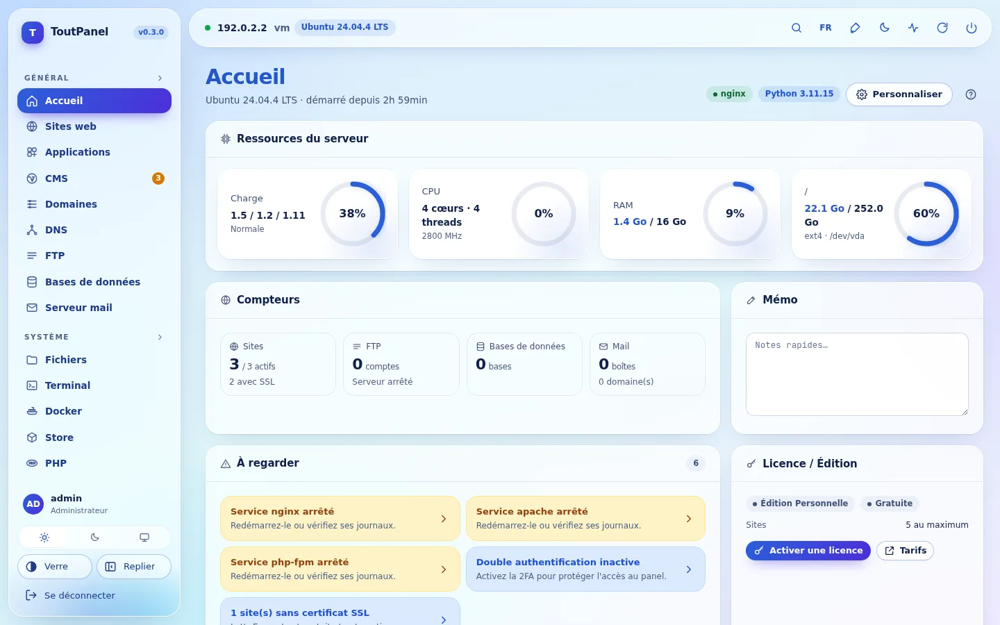

---

## C'est quoi ToutPanel ?

ToutPanel transforme un serveur fraîchement installé en **plateforme d'hébergement web complète**, pilotée depuis le navigateur. Une commande installe la pile (par défaut Nginx, PHP-FPM, MariaDB, Redis ou Valkey, Certbot, Fail2ban, ou la pile que vous composez : profils, versions, serveur web, FTP, mail, DNS, accélérateurs), le panel et son service ; vous créez ensuite vos sites, bases, boîtes mail, zones DNS et certificats en quelques clics, sans éditer un seul fichier de configuration.

Il s'adresse autant à la personne qui héberge **ses propres sites** (édition Personnelle gratuite, sans clé ni inscription) qu'aux **agences et hébergeurs** qui revendent de l'hébergement : comptes revendeurs et clients, plans et quotas, facturation, marque blanche, multi-serveurs et haute disponibilité (éditions Professionnelle et Entreprise).

Vos données restent **sur votre serveur** : aucune police ni CDN externe dans l'interface, aucun appel au serveur de licences tant qu'aucune licence n'est activée.

**Ce README est volontairement complet et honnête.** Chaque fonction est marquée *(expérimental)* quand elle l'est, **Pro** quand elle demande une édition payante, et chaque section dit ce qui a été **réellement exécuté** par les tests et ce qui ne l'a été qu'avec des simulations ou pas du tout. Le tableau [Ce qui est testé réellement, simulé ou non testé](#ce-qui-est-testé-réellement-simulé-ou-non-testé) les rassemble, et les [Limites connues](#limites-connues) listent les réserves. Si une fonction vous est critique, validez-la sur un serveur de test avant la production.

> **Ce dépôt ne contient aucun code source.** Il publie uniquement ce qui sert à installer le panel : les installeurs `install.sh` et `install.ps1`, le panel compilé (`dist/`, roues Python « bytecode seulement »), les notes de version, la licence et `version.json`.

## Installation rapide

**Linux** (en `root`, sur un serveur de préférence fraîchement installé) :

```bash
curl -sSL https://raw.githubusercontent.com/qu3ntin01/toutpanel/main/install.sh | sudo bash
```

**Windows** (PowerShell **en administrateur**) :

```powershell
Set-ExecutionPolicy Bypass -Scope Process -Force
iwr -useb https://raw.githubusercontent.com/qu3ntin01/toutpanel/main/install.ps1 | iex
```

Le script affiche à la fin l'URL du panel (avec son **entrée secrète**), le compte administrateur et le lien de l'**assistant de configuration**. Tout se choisit aussi avec des options : pile (`--profile`, `--web`, `--php`, `--db`, `--ftp`, `--mail`, `--dns`, `--accel`…), pare-feu (`--firewall`), version précise (`--version`), langue (`--lang`), dossier (`--home`, `/var/toutpanel` par défaut) et mot de passe sans le montrer dans la liste des processus (`TOUTPANEL_PASSWORD`, `--password-file`, `--password-stdin`). L'**[assistant d'installation](https://toutpanel.com/installation-assistant)** génère la ligne de commande avec des menus. Détails, prérequis, ports et dépannage : [Installation complète](#installation-complète).

## Vue d'ensemble

| | |
|---|---|
| **Systèmes** | Linux : Debian 11+, Ubuntu 20.04+, AlmaLinux / Rocky Linux / RHEL / CentOS Stream / Oracle Linux 8+, Fedora, avec d'autres familles en pile réduite (openSUSE, Arch, Alpine, Amazon Linux…) et un **niveau de support** affiché (`toutpanel compat`) ; Windows 10 / 11, Windows Server 2016 → 2025 (moins éprouvé que Linux) |
| **Serveurs web** | Nginx, Apache, Nginx + Apache, **Caddy**\*, **OpenLiteSpeed**\* (LSPHP, LSCache), **LiteSpeed Enterprise**\* (produit commercial, jamais démarré lors de nos essais : voir les [limites](#limites-connues) ; `--web litespeed` exige `--accept-litespeed-license`), IIS (basique) ; Apache + mod_php *à venir* |
| **Pile logicielle** | **composeur** : profils, versions, schéma, installation reprenable, état réel ; accélérateurs (OPcache, JIT, Redis / Valkey, Memcached, Varnish\*, Brotli, Zstandard\*, HTTP/3\*) |
| **PHP** | 5.6 à 8.5 côte à côte, 138 extensions au catalogue, une version par site, `php.ini` et pool FPM par site |
| **Applications** | runtimes Node.js, Python (WSGI / ASGI), Ruby, Go, Java, .NET avec version par site, systemd, PM2, Passenger ; Docker et Compose ; déploiement Git atomique |
| **Bases de données** | MariaDB, MySQL (distribution, ou 8.4 / 9.x Oracle\*), Percona Server\*, PostgreSQL, MongoDB, SQLite, Redis / Memcached par compte |
| **FTP, DNS, mail** | FTP : intégré, Pure-FTPd\*, ProFTPD\*, vsftpd\*, SFTP seul\* · DNS : BIND, PowerDNS, Knot · mail : Postfix + Dovecot, Exim\* · un seul moteur à la fois, bascule avec retour arrière · webmail Roundcube, SnappyMail, SOGo\* |
| **Pare-feu et sécurité** | pare-feu géré (nftables, ufw, firewalld, CSF, iptables) **ou en amont**, garde-fou anti-verrouillage ; Fail2ban ; WAF intégré, ModSecurity, ToutWAF ; antimalware ; isolation des comptes (**équivalent partiel** de CageFS) |
| **CMS** | 595 CMS et applications au catalogue (582 vérifiés : 536 gratuits, 46 commerciaux), version au choix, installations suivies et mises à jour |
| **Interface** | **interface en 10 langues**, 13 thèmes clair / sombre (**Horizon** par défaut), couleur d'accent libre, **16 assistants** guidés, **Diagnostic de 844 vérifications**, accessibilité visant WCAG 2.1 AA (**non auditée**) |
| **Documentation** | rédigée en français ; traduite en anglais, allemand, espagnol, italien, néerlandais, portugais, russe, chinois et arabe à **79 % des pages** (75 sur 94, pour chacune de ces 9 langues) ; les 19 pages restantes (section Référence : API, codes d'erreur, modèles… ; pages du Diagnostic) restent en français avec un bandeau ; le catalogue du Diagnostic et les messages d'API sont traduits dans les 10 langues |
| **Installeurs** | `install.sh` et `install.ps1` en 10 langues (anglais par défaut, `--lang` / `--fr`…, `TOUTPANEL_LANG`, langue du système), options de pile et de pare-feu, version précise (`--version`), [assistant d'installation](https://toutpanel.com/installation-assistant) qui génère la commande |
| **Automatisation** | API REST (1017 opérations OpenAPI), CLI `toutpanel`, webhooks signés, scripts pré / post-action, Ansible et Terraform, **Marketplace de 800 modules** d'intégration (maturité affichée) |

<sub>\* *expérimental* : réel, mais moins éprouvé ou avec des limites déclarées dans l'interface et dans les [limites connues](#limites-connues).</sub>

## Nouveautés de la 0.5

La **0.5.0** est la version **stable** (branche [`main`](https://github.com/qu3ntin01/toutpanel/tree/main)) ; elle reprend les préversions **0.5.0b1** (section **Analytics**) et **0.5.0b2** (**intégration ToutWAF**, SSL piloté dans ToutWAF), y ajoute la **section « Serveur web » de ToutWAF** et des **correctifs de sécurité** issus d'une relecture indépendante. Chaque ligne dit ce qui est réel et ce qui ne l'est pas : « nouveau en 0.5 » signifie réel et testé, mais moins éprouvé que les fonctions de la 0.4.

| Nouveauté | Maturité et réserves |
|---|---|
| **Analytics** (Supervision → Analytics) : statistiques de fréquentation **auto-hébergées**, façon Google Analytics — visiteurs en ligne, provenance du trafic, audience, pages, événements, objectifs et entonnoirs, rapports techniques, comparaison de périodes, filtres, exports CSV / JSON, rapports e-mail, alertes, lien de partage en lecture seule ; **sans cookie par défaut, adresse IP jamais conservée** | **nouveau en 0.5** : moteur et API testés (≈ 560 tests) ; parcours de bout en bout dans un **vrai Chromium** contre un **vrai panel** (130 visiteurs, 427 pages vues, 54 vérifications égales à la vérité terrain) ; traceur éprouvé sous Chromium seulement (Safari et Firefox non testés) ; durée et temps réel exacts demandent le traceur, les journaux seuls donnent des pages vues ; sans cookie, pas de visiteurs récurrents d'un jour à l'autre |
| **Carte du monde** : 236 pays, zoom, continents, villes regroupées, arrivées animées en temps réel, thèmes clair et sombre | **nouveau en 0.5** : fluidité mesurée en rendu logiciel, **pas sur une vraie carte graphique** |
| **Géolocalisation DB-IP** installée par le panel (pays, villes, réseaux ; CC BY 4.0, mise à jour mensuelle) | **nouveau en 0.5** : lecteur validé sur la **vraie** base Pays ; bases **Villes et Réseaux** validées seulement sur fichiers synthétiques ; sans base, les pays sont « inconnus » |
| **Variante Proxy** : le traceur est servi par le site lui-même (contre les bloqueurs de publicité) | nginx et Apache validés avec de **vrais serveurs** ; Caddy : rendu et syntaxe seulement ; **OpenLiteSpeed, LiteSpeed Enterprise, IIS non pris en charge** (code à coller à la main) |
| **Intégration ToutWAF** : création de sites depuis ToutWAF (jeton d'API limité remis à la liaison, rejeu sans doublon par `Idempotency-Key`, schéma publié du formulaire de création), **SSL piloté dans ToutWAF** (ToutWAF termine le HTTPS, la page SSL du panel gère les certificats dans ToutWAF), interrupteurs global et par serveur du cluster, **section « Serveur web » de ToutWAF** (jeton prédéfini à portée réduite, `GET /api/capabilities`, `GET /api/sites/{id}`, progression des tâches, `toutpanel waf connect --ssl toutwaf|panel`, `toutpanel waf status`) | **nouveau en 0.5** : testée contre un **faux ToutWAF** qui suit le contrat décrit par ses développeurs (≈ 500 tests) ; **rien essayé contre un vrai ToutWAF** (ni la section « Serveur web », ni le SSL piloté) ; routes de renouvellement, d'options HTTPS et de capacités de l'API de certificats de ToutWAF à confirmer ; interface SSL non vérifiée dans un navigateur |
| **Correctifs de sécurité** (relecture indépendante, deux passes) : élévation de portée d'un jeton d'API (présente depuis la 0.4.0), jeton ToutWAF composé, journaux et clé privée TLS d'un site, données Analytics d'un site supprimé, lecture de `X-Forwarded-For`, idempotence par jeton, plafonds d'ingestion Analytics | **réel** : un test de non-régression par correctif ; détail et gravité dans le [journal des modifications](CHANGELOG.md) ; relecture non exhaustive (validation des directives de vhost, ReDoS des analyseurs non examinés) |
| **Traductions** : interface et messages du serveur dans les 10 langues, page Analytics de la documentation en 9 langues | documentation traduite à **79 % des pages** (75 sur 94) ; les 19 pages de référence restantes (catalogues du Diagnostic, codes d'erreur, API, réglages, modèles) restent en français |

## Nouveautés de la 0.4

La **0.4.0** est la version **stable** précédente (les versions 0.4.0b1 et 0.4.0b2 étaient des préversions du canal `dev`). Chaque fonction porte sa maturité : **stable**, **expérimentale** (réelle et testée, mais moins éprouvée ou avec des limites déclarées) ou **à venir** (visible, grisée, jamais simulée). La colonne de droite dit ce qui est réservé ou limité ; le détail honnête de chaque point est dans la section correspondante des [Fonctionnalités](#fonctionnalités).

| Nouveauté | Maturité et réserves |
|---|---|
| **Écoute HTTP et HTTPS simultanée** du panel (8888 / 8443, certificat auto-signé au départ) ; certificat Let's Encrypt du panel avec autorité au choix, DNS-01, wildcard et **rechargement à chaud** | stable ; testé avec Pebble (serveur ACME de test), pas avec le vrai Let's Encrypt |
| **Installation d'une version précise** : `--version X.Y.Z`, `--list-versions` ; **dossier `/var/toutpanel` par défaut** | stable |
| **Pare-feu géré par le panel ou en amont**, page dédiée, ports à ouvrir, **garde-fou anti-verrouillage de 60 s** | stable ; règles testées avec de vrais nftables / iptables dans un espace de noms réseau privé |
| **Composeur de pile** : profils, versions, schéma d'architecture, estimation mémoire / disque, **assistant de première configuration en 9 étapes**, page **Pile logicielle** | stable |
| **Moteurs DNS** : BIND, PowerDNS, Knot DNS (bascule avec migration des zones et des clés DNSSEC, retour arrière) | stable ; testés avec les vrais démons sous Ubuntu 24.04 |
| **Moteurs de courrier** : Postfix + Dovecot, relais externe, **Exim + Dovecot** ; **moteurs FTP** : intégré, **Pure-FTPd, ProFTPD, vsftpd, SFTP seul** | Postfix et FTP intégré : stable ; Exim et autres moteurs FTP : **expérimental** |
| **Serveurs web** : **OpenLiteSpeed** (LSPHP, LSCache), **Caddy**, **LiteSpeed Enterprise** (bascule depuis / vers Nginx, Apache, « les deux » avec retour arrière) | **expérimental** ; OpenLiteSpeed et Caddy testés pour de vrai sous Ubuntu 24.04 ; **LiteSpeed Enterprise n'a jamais pu démarrer** (licence d'essai refusée), seule son installation officielle et la validation de sa configuration ont réellement tourné |
| **Accélérateurs** : OPcache, JIT, APCu, Redis / Valkey, Memcached, cache FastCGI, Brotli ; **Varnish, Zstandard, HTTP/3** (dont Nginx de nginx.org installable avec garde-fous) | Varnish, Zstandard, HTTP/3 : **expérimental** ; autres : stable |
| **Bases** : MariaDB 10.6 → 11.8, **MySQL 8.4 / 9.x** (dépôt Oracle), **Percona Server**, PostgreSQL 13 → 18 ; **mots de passe de bases chiffrés au repos** | MySQL Oracle et Percona : **expérimental** (jamais installés ni démarrés lors de nos essais) |
| **Isolation des comptes** : service PHP-FPM par compte dans sa tranche cgroup, durcissement systemd, **cage du système de fichiers** (bind mounts + bubblewrap) | options, **désactivées par défaut** ; **équivalent partiel de CageFS** (noyau et réseau partagés) ; non testé : SELinux enforcing avec cette isolation (SELinux Enforcing est validé sans elle sur AlmaLinux, voir [Sécurité](#section-12)), cgroup v2 avec limites réellement appliquées, serveur entier sous systemd |
| **Runtimes par site** (Node.js, Python, Go, Java, Ruby, .NET), **WSGI / ASGI**, **PM2**, **Passenger** | réel : Node 20, Python 3.12, gunicorn, uvicorn, PM2, Nginx + Passenger ; Go, Java, .NET simulés ; Ruby non compilé |
| **Statistiques** : GoAccess, **AWStats**, Matomo ; **préproduction** avec base de données et synchronisation dans les deux sens | GoAccess, AWStats et préproduction (MariaDB) testés pour de vrai ; Matomo **jamais éprouvé** contre une vraie instance |
| **Sauvegardes** : chiffrement AES-256-GCM, incrémentales natives, destinations **rsync** et **Borg**, profil « serveur complet », sauvegarde partielle / mode strict, test de restauration | rsync et Borg 1.2.8 testés pour de vrai ; restic, S3, B2 et rclone **simulés** ; rsync / Borg et restic : **Pro** |
| **Messagerie** : limite d'envoi du `mail()` PHP, **DMARC par domaine**, **BIMI**, **DANE**, MTA-STS / TLS-RPT, **SpamAssassin**, **SOGo**, file d'attente et CalDAV / CardDAV testés | SOGo **expérimental** (`sogod` jamais exécuté) ; chaîne VMC de BIMI et signature DNSSEC non vérifiées |
| **Migration** : import **ISPConfig** complet (SSH, archive, dump SQL), transfert de site ou de domaine entre clients, **migration de comptes entre serveurs étendue** (mail, FTP, cron, SSL, plan) | **Pro** ; cPanel / Plesk / DirectAdmin testés sur des archives **fabriquées** ; jamais testé sur deux serveurs physiques |
| **Haute disponibilité** : IP flottante keepalived / VRRP, stockage partagé NFS / GlusterFS, réplication Dovecot, historique par nœud, modèle Zabbix, **réparation automatique étendue** | **Pro** ; configurations validées par les outils réels, **aucune bascule testée entre deux machines** |
| **Authentification** : SSO SAML / OIDC / LDAP testés contre des fournisseurs de test, WebAuthn testé avec un authentificateur virtuel, **TLS durci**, **alertes de connexion inhabituelle** au titulaire | SSO : **Pro** ; aucun fournisseur d'identité de production ni clé physique testés |
| **Diagnostic** (Système › Diagnostic) : **844 vérifications**, **90 corrections automatiques** avec aperçu, **16 assistants** de configuration guidés avec test réel | planification du Diagnostic : **Pro** ; une partie des vérifications est testée avec des services simulés |
| **Messages du serveur traduits** dans les 10 langues ; **ToutWAF distant** ; compatibilité étendue des distributions ; **installeur multilingue** avec options de pile | stable ; quelques messages composés dynamiquement restent en français |
| **Marketplace** de 800 modules d'intégration (facturation, passerelles, supervision, CI/CD, IaC, SSO, DNS / CDN, sauvegarde, thèmes…) | **5 stables**, 199 bêta, 596 **générés** (jamais essayés avec le vrai service) |
| Apache + mod_php | **à venir** (refusé proprement, jamais simulé) |

Détail et limites : [Limites connues](#limites-connues) · [CHANGELOG.md](CHANGELOG.md).

## Fonctionnalités

Le plan suit les **20 sections** d'un référentiel de panel d'hébergement complet (du niveau cPanel / Plesk / ISPConfig / DirectAdmin aux fonctions avancées), puis l'écosystème. Dans chaque section, la ligne « **Réel / limites** » dit honnêtement ce qui a été exécuté et ce qui ne l'a pas été. Documentation détaillée de chaque page : **[toutpanel.com/docs](https://toutpanel.com/docs/)** (aussi servie par le panel sous `/help/` quand elle est construite à l'installation, avec une aide contextuelle sur chaque page).

<a id="section-1"></a>

### 1. Comptes, utilisateurs et multi-tenant

- Hiérarchie **administrateur → revendeur (Pro) → client → sous-utilisateur** ; un revendeur ne voit et ne crée que son périmètre.
- **RBAC fin** : permissions par module et par action, intersection du rôle, du plan, du profil d'accès et du parent ; profils intégrés **Complet, Développeur, Comptable, Webmaster, Lecture seule** et profils personnalisés.
- **Plans et quotas** : disque, inodes, trafic, sites, domaines, bases (et taille par base), domaines et boîtes mail, tâches planifiées, comptes FTP, zones DNS, sauvegardes, sous-utilisateurs ; quotas comptés et bloquants à la création. Le trafic mensuel ne coupe pas le site : il déclenche une alerte, la facturation du dépassement et la suspension automatique si vous l'activez.
- **Limites de ressources par compte** : utilisateur système dédié, tranche systemd (CPU, mémoire, E/S, processus) appliquée aux tâches planifiées, déploiements Git, applications, terminal et instances Redis / Memcached ; **aux requêtes PHP seulement avec l'isolation « service PHP-FPM par compte »** (option, désactivée par défaut). Limite de connexions simultanées par site : **Nginx seulement**.
- **Suspension** et réactivation, manuelles ou automatiques (impayé, dépassement de quota après délai de grâce).
- **Connexion « en tant que »** (impersonation) tracée dans le journal d'audit et limitée dans le temps.
- **Transfert** d'un site ou d'un domaine d'un client à un autre : fichiers, FTP, sauvegardes, bases, zones DNS, domaines mail, tâches planifiées, préproduction, projets Compose ; propriété des fichiers, vhost et pool PHP-FPM régénérés, quotas vérifiés, aperçu avant exécution.
- **Création en masse** (jusqu'à 500 comptes), **import / export CSV** (1 000 lignes, protection contre l'injection de formules, UTF-8 / UTF-16 / Windows-1252), **notes internes** et **étiquettes** (tags) filtrables.

> **Réel / limites** : la hiérarchie, les permissions, les quotas, la suspension et le transfert sont couverts par des tests d'API, et les profils sont vérifiés route par route. `setquota` (quotas disque et inodes du système de fichiers) n'a été vérifié qu'avec un exécuteur factice et suppose un système de fichiers monté avec `usrquota`. Les cgroups v2 réels avec limites appliquées n'ont pas été testés. La suspension d'un compte sur le maître n'est pas répercutée sur ses comptes miroirs des nœuds ; les sites hébergés sur un nœud ne sont pas transférables entre clients.

<a id="section-2"></a>

### 2. Authentification et accès au panel

- **2FA TOTP** avec codes de secours, imposable par rôle ou par plan ; **clés de sécurité WebAuthn / FIDO2 et passkeys** (incluses dans l'édition Personnelle).
- **SSO d'entreprise (Pro)** : **OpenID Connect** (découverte, PKCE), **SAML** (métadonnées, anti-rejeu, groupe → rôle), **LDAP / Active Directory** (LDAPS / StartTLS avec **vérification du certificat par défaut**) ; une connexion SSO n'accorde jamais le rôle administrateur par défaut.
- **Restriction d'accès** du panel par liste blanche d'adresses IP / CIDR et par pays (GeoIP, base MaxMind à fournir) avec **refus d'enregistrer une règle qui exclurait l'administrateur**.
- **Anti-force brute** : verrouillage persistant par IP et par compte, temps de réponse constant, **captcha ALTCHA** auto-hébergé après N échecs, jail Fail2ban du panel, alerte de rafale d'échecs.
- **Sessions** : liste, révocation (aussi côté administrateur), expiration absolue et par inactivité.
- **Politique de mots de passe** : longueur, classes de caractères, mots courants, nom d'utilisateur, **Have I Been Pwned** en k-anonymat (désactivable), historique, expiration ; **réinitialisation** par lien signé à usage unique.
- **Journal des connexions** et **alertes de connexion inhabituelle** (nouvelle adresse IP, nouveau pays, nouvel appareil) envoyées à l'administrateur **et au titulaire du compte** (désactivable par compte, e-mail ou SMS).
- **Panel en HTTPS** : écoute HTTP et HTTPS simultanée, certificat auto-signé avec SAN au départ (régénéré si l'adresse change), puis **Let's Encrypt pour le nom d'hôte du panel** (ZeroSSL, Buypass ou ACME personnalisé, DNS-01 et wildcard) avec rechargement à chaud ; **entrée secrète** dans l'URL (sans elle, le panel répond 404).

> **Réel / limites** : TOTP, verrouillage, sessions, politique de mots de passe : testés. **WebAuthn** : testé avec un authentificateur virtuel de Chromium (enregistrement et connexion réels), **pas avec une clé physique**. **OIDC** : testé contre un serveur OIDC local réel (PKCE vérifié, jetons forgés refusés) ; **SAML** : testé avec un fournisseur d'identité de test (31 tests : assertion valide, expirée, rejouée, falsifiée…) ; **LDAP** : testé contre un vrai OpenLDAP (`slapd`) ; **aucun fournisseur d'identité réel** (Keycloak, Entra ID, Okta…) n'a été essayé. Le **nouveau pays** est détecté avec une vraie base MaxMind de test. Let's Encrypt du panel : testé avec **Pebble** + certbot 5.8 + BIND, **pas** avec le vrai service. La bibliothèque SAML (`python3-saml` + `xmlsec1`) est facultative ; le panel démarre sans elle.

<a id="section-3"></a>

### 3. Web et hébergement de sites

- **Sites en un clic** : multi-domaines, alias, **domaines parqués**, domaines **redirigés**, **wildcard** (`*.exemple.com`), PHP-FPM, statique, reverse proxy, applications. Un sous-domaine est un nom de domaine du site ou un site distinct.
- **Serveurs web** : vhosts **Nginx, Apache, Nginx + Apache, Caddy\*, OpenLiteSpeed\*, LiteSpeed Enterprise\* ou IIS** générés depuis des modèles Jinja2 et **validés avant rechargement** (`nginx -t`, `apachectl -t`, `caddy validate`…), avec retour aux derniers vhosts valides en cas d'échec ; **bascule** Nginx ↔ Apache ↔ « les deux » ↔ Caddy ↔ OpenLiteSpeed ↔ LiteSpeed avec retour arrière ; les fonctions qu'un serveur ne reproduit pas (WAF intégré, ModSecurity, filtrage par pays, `.htaccess`…) sont **signalées**, jamais ignorées en silence.
- **PHP multi-versions** 5.6 → 8.5 côte à côte (Sury, PPA ondrej, Remi, windows.php.net), une version et **un pool PHP-FPM par site**, sous l'utilisateur du compte ; **`php.ini` par site** (13 directives autorisées dont `disable_functions` et `open_basedir`, validées contre l'injection), **138 extensions** au catalogue (gérées par version de PHP, administrateur), ionCube, **paramètres FPM** (`pm`, `max_children`, `start_servers`, timeouts, `max_requests`…).
- **Runtimes applicatifs** : Node.js, Python (**WSGI / ASGI** : gunicorn, uvicorn, hypercorn, daphne, waitress), Ruby, Go, Java, .NET, avec **version de runtime par site** (téléchargements officiels vérifiés par SHA-256, `uv` pour Python, jamais de compilation ; nvm, pyenv, etc. détectés), unité **systemd**, **PM2**, **Phusion Passenger** (Nginx et Apache), proxy vers un port ou un socket Unix (WebSocket compris), rechargement sans coupure, `toutpanel runtimes`.
- **Reverse proxy** vers un port ou un socket, **répartition de charge** (round robin, `least_conn`, `ip_hash`).
- **Redirections** 301 / 302 (avec ou sans requête, expressions régulières), forçage HTTPS, hôte canonique `www`.
- **En-têtes HTTP** personnalisés (CSP, X-Frame-Options…) et **HSTS** (durée réglable, `includeSubDomains`, `preload` avec confirmation et contrôle préalable).
- **Directives Nginx / Apache / Caddy personnalisées par vhost** (administrateur) : écriture, régénération, test du serveur, **restauration automatique** si le serveur refuse.
- **Répertoires protégés** par mot de passe (bcrypt) et règles d'accès par IP, **pages d'erreur** personnalisées, **anti-hotlink**, **mode maintenance** (503 avec `Retry-After`, IP autorisées).
- **HTTP/2**, **HTTP/3 / QUIC\*** (natif avec Caddy et OpenLiteSpeed ; avec Nginx compilé QUIC, ou Nginx de nginx.org installable depuis la page Accélérateurs avec simulation, sauvegarde et retour arrière ; impossible avec Apache seul), compression **Brotli** (si le module existe), **Gzip**, **Zstandard\***.
- **Cache** : FastCGI cache (Nginx), **OPcache**, **Redis / Valkey**, **Memcached**, **Varnish\*** (HTTP seulement), LSCache (OpenLiteSpeed et LiteSpeed Enterprise), avec **purge depuis le panel** (bouton « Vider le cache » par site et par accélérateur).
- **Préproduction (staging)** : clone d'un site (fichiers + base de données), remplacement d'URL **sans wp-cli** (valeurs PHP sérialisées comprises), tables exclues, synchronisation **vers la production, depuis la production ou dans les deux sens** (fichiers : le plus récent l'emporte ; base fusionnée ligne par ligne par clé primaire, règle de conflit au choix, **suppressions jamais propagées**), sauvegarde préalable des deux côtés.
- **Racine du site** configurable (`public/`, `web/`…), **journaux d'accès et d'erreurs par site** consultables en direct et téléchargeables (rotation logrotate).
- **Statistiques de trafic** à trois moteurs : **GoAccess**, **AWStats**, **Matomo** « pour ce site » ; **suivi de la bande passante** par site, mois par mois.

> **Réel / limites** : Nginx : vhosts servis par un **vrai Nginx** et interrogés avec curl (redirections, 401 / 403, anti-hotlink, maintenance, wildcard, pages d'erreur). Apache : vhost validé par `apache2 -t`, **jamais servi en vrai** dans nos essais ; Nginx devant Apache : jamais lancés ensemble ; la bascule Nginx / Apache est testée avec un exécuteur factice et la syntaxe réelle des vhosts. OpenLiteSpeed : vrai OpenLiteSpeed démarré qui sert PHP, statique, redirection, authentification, LSCache. **Caddy** : vrai Caddy 2.11 (HTTP, HTTPS, HTTP/2, HTTP/3, PHP-FPM, proxy, rechargement sans coupure) sous Ubuntu 24.04 ; famille RHEL, ACME réel non exécutés. **LiteSpeed Enterprise : jamais démarré** (voir [limites](#limites-connues)). `disable_functions` / `open_basedir` : vérifiés avec un vrai PHP-FPM. Installation des versions de PHP depuis les dépôts : non exécutée dans nos essais (Internet). **Runtimes** : réel pour Node 20, Python 3.12, gunicorn, uvicorn, PM2 et Nginx + Passenger ; **Go, Java et .NET simulés**, Ruby non compilé, unité systemd d'une application non démarrée. **HTTP/3** : vrai binaire Nginx 1.31 servant du HTTP/3 à un client QUIC ; l'installation du paquet nginx.org sur la machine n'a pas été exécutée. Brotli dépend du module Nginx. Memcached et Varnish (VCL compilée par `varnishd` 7.1) : exécutés pour de vrai, mais la mise en service complète de Varnish devant Nginx ne l'a pas été. **GoAccess et AWStats** : exécutés pour de vrai ; **Matomo : jamais éprouvé contre une vraie instance** (faux serveur d'API). **Préproduction** : testée sur une vraie instance MariaDB, la fusion ligne par ligne ne vaut que pour MySQL / MariaDB (PostgreSQL et SQLite sont copiés sans remplacement d'URL). Le HTTP/3 d'Apache et le cache FastCGI d'Apache n'existent pas.

<a id="section-4"></a>

### 4. SSL / TLS

- **Let's Encrypt**, **ZeroSSL** (EAB), **Buypass**, serveur ACME personnalisé ; validation **HTTP-01** et **DNS-01** (écriture du TXT dans BIND / PowerDNS ou chez Cloudflare, OVH, Route53), certificats **wildcard**, certificats **SAN / multi-domaines** (tous les noms, alias et domaines parqués du site).
- **Renouvellement automatique** quotidien avec rechargement des services concernés (serveur web, mail, FTP, panel) et **alerte en cas d'échec** ; **alertes avant expiration** à 30 / 14 / 7 / 1 jours (réglables).
- **Import** de certificats commerciaux (CRT, clé, chaîne, **PFX**) et **génération de CSR** (RSA / EC, SAN, clé privée conservée sur le serveur) ; certificats auto-signés ; page **Certificats** avec validité, émetteur et expiration de tous les certificats.
- **SSL pour les services** : mail (SNI Postfix / Dovecot), FTP / FTPS, panel, nom d'hôte.
- **TLS durci** : profils Mozilla (moderne = TLS 1.3 seul, intermédiaire par défaut, ancien), suites personnalisées validées, **agrafage OCSP** réglable, courbes et DH ffdhe2048, `ssl_session_tickets off`, HSTS par site.

> **Réel / limites** : testé avec **Pebble** (serveur ACME de Let's Encrypt), le vrai certbot 5.8 et un vrai BIND : HTTP-01, DNS-01, wildcard, renouvellement, échec, EAB. **Aucune émission auprès du vrai Let's Encrypt, de ZeroSSL ou de Buypass n'a été exécutée.** DNS-01 exige que la zone du domaine soit gérée par le panel (ou un fournisseur configuré). TLS : vérifié avec un vrai Nginx, `openssl s_client` (protocoles et suites réellement offerts par profil), un répondeur OCSP réel et `apache2 -t` ; l'adaptation à OpenLiteSpeed et Caddy n'est pas testée ; pas de cryptographie post-quantique. Les certificats FTP ne sont pas surveillés par les alertes d'expiration.

<a id="section-5"></a>

### 5. DNS

- Zones servies par **BIND, PowerDNS ou Knot DNS** (un seul serveur local à la fois ; bascule avec migration des zones et des clés DNSSEC, retour arrière) ou poussées chez un fournisseur.
- **14 types d'enregistrements** : A, AAAA, CNAME, MX, TXT, SRV, NS, CAA, PTR, TLSA, DS, SSHFP, HTTPS, SVCB, avec validation fine ; **gabarits de zone** appliqués à la création (variables `{domain}`, `{ip}`, `{mail}`…).
- **DNSSEC** : signature automatique (BIND `dnssec-policy`, Knot KASP, PowerDNS), DS et DNSKEY affichés pour le registrar, rotation manuelle (BIND, Knot ; **PowerDNS : rotation hors du panel**).
- **Serveurs secondaires** par TSIG (AXFR + NOTIFY), automatiques sur les nœuds du parc (**Pro**).
- **Fournisseurs externes** par API : **Cloudflare, OVH, Route 53, PowerDNS** (poussée et import de zones) ; zones externes : liste, export (BIND, CSV, JSON) et **vérification de propagation par `dig`**.
- **Import / export BIND**, TTL par enregistrement et par zone, **numéros de série automatiques** (`AAAAMMJJnn`), **DNS inverse (PTR)** des IP du serveur, **vérification de propagation** (1.1.1.1, 8.8.8.8, 9.9.9.9 et serveur local) et validation de la syntaxe (`named-checkzone` avant rechargement).
- **Enregistrements mail automatiques** : MX, SPF, DKIM, DMARC, SRV IMAP / SMTP / POP3, `autoconfig` / `autodiscover`, MTA-STS, TLS-RPT, CalDAV / CardDAV ; IPv6, noms internationaux (IDN), hôte mail hors de la zone.

> **Réel / limites** : BIND, PowerDNS et Knot réels (`named-checkzone`, `dig`, cycle de bascule BIND → PowerDNS → Knot qui conserve le même DS). Les **API Cloudflare, OVH, Route 53 et PowerDNS ont été testées avec un transport simulé**, jamais avec les vrais services. Le **cluster de serveurs secondaires** n'a jamais tourné avec deux serveurs DNS réels. Le PTR n'est effectif que si le bloc d'adresses vous est délégué : le panel ne peut pas le demander à votre fournisseur. La propagation ne contrôle pas les types PTR, TLSA, DS, SSHFP, HTTPS et SVCB.

<a id="section-6"></a>

### 6. Messagerie

- **Postfix + Dovecot + OpenDKIM**, Rspamd ou SpamAssassin, **Exim + Dovecot\*** au choix (sous-ensemble de Postfix, limites déclarées), relais externe ; domaines, **boîtes avec quotas**, **alias**, **redirections**, **adresse fourre-tout (catch-all)**, **listes de diffusion** (mlmmj), **répondeur avec plage de dates**, **filtres Sieve** (règles guidées ou script, ManageSieve), IMAP / POP3 en TLS, soumission 587 / 465.
- **Webmail** Roundcube, SnappyMail ou **SOGo\*** installé en un clic, avec **connexion directe depuis le panel**.
- **SPF, DKIM** (génération, **rotation avec double publication**), **DMARC par domaine** (`none` / `quarantine` / `reject`, `pct`, `rua`, `ruf`, `sp`, `adkim`, `aspf`, `fo`, **montée en charge guidée**), **MTA-STS** et **TLS-RPT**, **BIMI** (logo SVG hébergé par le panel, publié seulement avec un DMARC d'application à 100 %), **DANE** (TLSA `3 1 1` pour les ports mail, **rotation en deux temps**).
- **Antispam** Rspamd (réglages par domaine et par boîte, apprentissage spam / ham) ou **SpamAssassin** piloté (spamd, `spamass-milter`, `user_prefs` par boîte ; amavis expérimental), **antivirus ClamAV**, **greylisting**, **RBL / DNSBL**, **listes blanches et noires** globales, par domaine ou par boîte.
- **Limitation du débit d'envoi** : par boîte, par plan et par défaut (utilisateur SMTP authentifié, via Rspamd) **et limite du `mail()` PHP par site et par compte** (enveloppe `sendmail` du panel : journal, plafonds sur 1 h et 24 h, alerte, protection contre l'injection d'en-têtes) pour qu'un site piraté ne spamme pas.
- **Relais sortant / smarthost**, **file d'attente** (flush, suspension, suppression), **journal et suivi d'un message**, **autoconfiguration** des clients (Outlook, Thunderbird), **fetchmail**, **CalDAV / CardDAV** (Radicale), **surveillance de la réputation de l'IP** (blacklists, sur toutes les adresses publiques du serveur et les IP de sortie des nœuds).

> **Réel / limites** : la file d'attente est testée avec un **vrai Postfix** ; Dovecot : configuration validée par `doveconf` ; CalDAV / CardDAV : **vrai Radicale 3.8** ; SpamAssassin : `spamassassin --lint`, `spamd` et `spamc` réels ; le `mail()` PHP : enveloppe exécutée pour de vrai avec le vrai `mail()` de PHP. **Simulés** : Rspamd, ClamAV, mlmmj, fetchmail, les montages `spamass-milter` / amavis ; **SOGo : expérimental, `sogod` jamais exécuté**. BIMI : la **chaîne du certificat VMC n'est pas vérifiée** ; DANE : la signature DNSSEC n'est pas vérifiée (DANE n'a de sens qu'avec DNSSEC). La limite du `mail()` PHP **ne voit pas** un script qui appelle directement `sendmail` ou ouvre une connexion SMTP. Avec Exim : pas de suivi de message ni de listes de diffusion ; avec SpamAssassin : pas de limite de débit par boîte ni de greylisting. Les rapports DMARC reçus ne sont pas analysés. La publication DNS automatique suppose que la zone est gérée par le panel. Un serveur mail fiable suppose une IP publique fixe, un DNS inverse correct et les ports 25 / 465 / 587 ouverts.

<a id="section-7"></a>

### 7. Bases de données

- **MariaDB (10.6 → 11.8), MySQL, Percona Server\*, PostgreSQL (13 → 18), MongoDB, SQLite** : bases, utilisateurs et **privilèges** (complets, lecture seule, personnalisés), **accès distant autorisé par IP** (règle de pare-feu, `bind-address`, `pg_hba.conf` ; `0.0.0.0/0` refusé).
- **Adminer** (MySQL et PostgreSQL) et **phpMyAdmin** (MySQL) installables en versions au choix avec compatibilité PHP vérifiée, **connexion unique (SSO) depuis le panel** ; **pgAdmin n'est pas intégré**.
- **Import / export** (gzip à la volée), **dump planifié** (tâche planifiée), **maintenance** (vérification, réparation, optimisation, analyse), **quotas de taille** par base (privilèges retirés puis rétablis, alerte).
- **Choix de la version du SGBD** (dépôts officiels MariaDB et PostgreSQL, changement de version majeure avec **sauvegarde préalable**, pas de rétrogradation) ; MySQL 8.4 / 9.x (dépôt Oracle) et Percona\* : un seul moteur de la famille MySQL à la fois.
- **Serveurs supplémentaires** (Docker), **Redis / Memcached par compte** (instance isolée, socket Unix, `maxmemory` du plan, tranche cgroup du compte).
- **Réplication (Pro)** : MariaDB / MySQL (GTID) et PostgreSQL (streaming), assistant de commandes **et** réplication exécutée par le panel, promotion manuelle ou **bascule automatique** avec réécriture de l'hôte des bases.
- **Mots de passe des bases chiffrés au repos** (Fernet, clé du panel sauvegardée), listes sans mot de passe, **révélation explicite et journalisée**.

> **Réel / limites** : SQLite : réel. **MariaDB** : une instance réelle sert aux tests de préproduction et du Diagnostic, mais la couche d'administration SQL (utilisateurs, privilèges, quotas) est testée surtout avec un **exécuteur SQL simulé** ; **PostgreSQL : simulé** ; MongoDB (module `pymongo` facultatif) : testé avec un faux client et, quand l'image est présente, un vrai `mongod` 7 dans Docker. MySQL Oracle et Percona : paquets et dépôts vérifiés, **jamais installés ni démarrés**. La réplication n'a **jamais été montée entre deux serveurs réels**, et la bascule automatique n'est pas un consensus. Les **identifiants root des moteurs sont enregistrés en clair dans `settings.json`** (droits 0600) ; `mongodump` expose le mot de passe en argument de commande.

<a id="section-8"></a>

### 8. Fichiers et accès

- **Gestionnaire de fichiers** : upload, **éditeur CodeMirror** avec coloration syntaxique, permissions (`chmod`) et propriétaire (`chown`), archives zip / tar, **recherche** par nom et dans le contenu, **corbeille**, **occupation du disque et des inodes par dossier**, glisser-déposer, **correction des permissions et du propriétaire en un clic**.
- **Serveur FTP / FTPS intégré** (comptes multiples, répertoire restreint, droits, quotas, IP autorisées, journal) ou **Pure-FTPd\*, ProFTPD\*, vsftpd\*, SFTP seul\*** (comptes du panel synchronisés, bascule avec retour arrière).
- **SFTP / SSH chrooté par utilisateur** (drop-in `sshd` validé par `sshd -t` avec retour arrière, montages bind), **shell restreint** par jailkit ou `rbash`, **clés SSH** (ed25519, ECDSA, RSA ≥ 2048).
- **Terminal web** (bash sous Linux, PowerShell sous Windows ; un client reste sous l'utilisateur de son compte).
- **Quotas disque et inodes** par compte, **WebDAV** avec les comptes FTP.

> **Réel / limites** : FTPS : **vrai handshake** avec certificat validé ; terminal : vrai bash en PTY ; jailkit : vrai `jk_init` / `jk_jailuser` et vrai shell enfermé quand jailkit est installé ; WebDAV : vrai `wsgidav` (modules facultatifs `wsgidav` + `a2wsgi`). Moteurs FTP alternatifs : exécutés pour de vrai sous Ubuntu 24.04, **famille RHEL non éprouvée**. `sshd` réel jamais relancé par les tests ; `setquota` : voir section 1. Le terminal Windows est simplifié sans le module `pywinpty`.

<a id="section-9"></a>

### 9. Applications et déploiement

- **Installeur en un clic** : catalogue de **595 CMS et applications** (voir [CMS](#cms)), dont WordPress, Joomla, Drupal, PrestaShop, Nextcloud, Laravel, Symfony, Matomo, Dolibarr, Moodle, phpBB, MediaWiki, Ghost.
- **WP Toolkit** : wp-cli, mises à jour du cœur, des extensions et des thèmes, durcissement, clonage, **détection des installations vulnérables** (flux Wordfence Intelligence), alerte critique.
- **Déploiement Git** : clone et mise à jour (HTTPS avec jeton ou SSH avec clé de déploiement par site), branche, étiquette ou commit, **webhooks GitHub / GitLab signés**, **scripts post-déploiement**, actualisation planifiée, **déploiement atomique** (`releases/`, `shared/`, lien `current`, retour arrière).
- **Composer, npm, pip** lancés depuis un site (liste blanche `install` / `ci` / `update`, sous l'utilisateur du compte).
- **Docker** : conteneurs, images, **réseaux, volumes**, espace disque et nettoyage, `docker run` validé, projets **Docker Compose** par compte avec site proxy et refus des YAML dangereux (privilégié, socket, montages sensibles).
- **Assistants** « site web », « installation d'application », « déploiement Git », « PHP » (voir [section 19](#section-19)).

> **Réel / limites** : Git : vrai `git` sur un dépôt local (clone, mise à jour, webhook signé, déploiement atomique en vrai système de fichiers) ; **GitHub et GitLab réels jamais contactés**. `npm` et `pip` réels sous l'utilisateur du site ; Composer : non exécuté (pas de phar dans l'environnement de test). Docker : conteneurs, images, réseaux et volumes testés avec un exécuteur factice et, quand un démon répond, un vrai cycle Docker. **Installations de CMS : téléchargements simulés** (aucune installation réelle de catalogue exécutée de bout en bout par la suite automatique) ; WordPress / wp-cli réels non exécutés par les tests, hormis Matomo installé de bout en bout par l'assistant « application ».

<a id="section-10"></a>

### 10. Tâches planifiées

- **Éditeur visuel** champ par champ et **syntaxe cron brute** synchronisés, aperçu des 5 prochaines exécutions, raccourcis (`@daily`…), types : visiter une adresse, lancer une commande, sauvegarder un site ou une base.
- **Exécution sous l'utilisateur du compte ou du site, jamais en root** pour un client : la commande est **refusée** plutôt que lancée en root ; `root` est réservé à l'administrateur, avec confirmation et trace dans le journal d'audit ; limites cgroup du compte appliquées.
- **Planificateur** au choix : interne (APScheduler, par défaut), **minuteurs systemd** (`OnCalendar`, `Persistent=true`) ou `/etc/cron.d`, avec retour réversible.
- **Notification par e-mail** (jamais / erreur / toujours), **historique d'exécution** (statut, durée, code, début de sortie), **fréquence minimale imposée par le plan**, exécution immédiate, **assistant** avec test à blanc.

> **Réel / limites** : la comparaison avec le vrai `systemd-analyze calendar` (18 expressions) et `systemd-analyze verify` sont réelles ; **un minuteur systemd n'a jamais été déclenché pour de vrai**. Avec le planificateur interne, **les tâches ne tournent pas quand le panel est arrêté** (rattrapage de moins de 5 minutes au redémarrage) ; il n'y a pas d'import d'une crontab existante. Sous Windows, les tâches des clients sont refusées.

<a id="section-11"></a>

### 11. Sauvegardes et restauration

- **Granularité** : site, base de données, dossier ou fichier, boîte mail, domaine mail, compte, **serveur entier** ; sauvegarde à la demande et **planifications** avec rétention **GFS** (quotidienne, hebdomadaire, mensuelle).
- **Moteur natif (zip), inclus dans toutes les éditions** : archives avec somme SHA-256 et contrôle CRC, **chiffrement AES-256-GCM** optionnel (phrase secrète, par défaut, par destination, par planification ou par sauvegarde), **sauvegardes incrémentales** (une complète puis des incrémentales, restauration de l'état de chaque sauvegarde, rétention qui préserve les chaînes). Destination : dossier local.
- **Destinations distantes (Pro)** : **rsync** (dossier ou SSH, liens physiques `--link-dest` ou archives chiffrables), **Borg** (chiffré, dédupliqué, local ou SSH), **restic** (chiffré, dédupliqué : S3 et compatibles, SFTP, Backblaze B2, et via rclone FTP / Google Drive / OneDrive / Dropbox / WebDAV). Secrets chiffrés en base, jamais renvoyés par l'API.
- **Profil « Serveur complet (configuration comprise) »** : vhosts générés, pools PHP-FPM, certificats et clés, DKIM, mail, DNS, FTP, crontabs, règles de pare-feu et données du panel ; **archive chiffrée obligatoire**, **restauration guidée** sur un serveur neuf (simulation, fichiers remplacés conservés en `.pre-restore-…`, services rechargés). N'inclut **ni le système, ni les paquets, ni les propriétaires de fichiers**.
- **Restauration granulaire** (parcourir l'archive, choisir des fichiers, en place ou dans un dossier) et **en libre-service par le client**, avec périmètre contrôlé ; **sauvegardes de sécurité automatiques** avant une opération risquée (restauration, suppression, installation, mise à jour d'un SGBD).
- **Un dump de base en échec n'est pas ignoré** : sauvegarde « partielle » signalée (badge, alerte) ou refusée en **mode strict** ; **vérification d'intégrité** (SHA-256, CRC, `restic check`), **test de restauration** (dumps réimportés dans une base temporaire, échantillon de fichiers contrôlé par somme) et **rapport hebdomadaire** (désactivés par défaut), **alertes d'échec**.
- **Instantanés** Btrfs, ZFS ou LVM facultatifs pour geler la lecture pendant une sauvegarde.

> **Réel / limites** : archives natives, chiffrement, chaînes incrémentales, profil serveur complet : exécutés pour de vrai ; **rsync** (dossier local et SSH par un `sshd` éphémère) et **Borg 1.2.8** (local et SSH) : réels, **jamais vers un serveur distant réel** ; Borg 2.x non testé. **restic, S3, Backblaze B2 et rclone : commandes générées et vérifiées avec un exécuteur factice, jamais exécutées contre un vrai dépôt ou service.** Snapshots ZFS / LVM / Btrfs et test de restauration MySQL / PostgreSQL : exécuteur ou SGBD simulé ; `zfs send` n'est pas implémenté. Le **nom du fichier d'archive chiffrée est en clair** (cible et date) ; rsync « tree » dépose des fichiers **en clair** ; une phrase secrète perdue rend les archives illisibles. Le serveur complet ne réapplique pas automatiquement le pare-feu. Les sauvegardes distantes, restic, Borg et rsync demandent l'édition **Pro** ; ne pas confondre avec la synchronisation rsync / lsyncd de la haute disponibilité, qui n'est pas une destination de sauvegarde.

<a id="section-12"></a>

### 12. Sécurité du serveur et isolation

- **Pare-feu** nftables, firewalld, UFW, CSF ou iptables (détection automatique) **géré par ToutPanel ou en amont** (groupe de sécurité cloud, pare-feu de l'hébergeur : le panel ne touche alors à aucune règle et liste les **ports à ouvrir chez l'hébergeur**) ; règles, listes d'IP, services prédéfinis, ports en écoute et exposition, **protection anti-DDoS de base** (SYN par IP, limite de connexions, détection de scans), **garde-fou de 60 s** : sans confirmation, le changement est annulé par le serveur lui-même.
- **Fail2ban** : jails SSH, Postfix, Dovecot, FTP, panel et WordPress (`wp-login.php`, `xmlrpc.php`), bannissements listés, ajoutés, retirés, test de filtre.
- **WAF intégré** (injections SQL, XSS, RCE, traversée de répertoires, scanners, robots, débit, bannissement automatique ; blocage par pays **Pro**) et **ModSecurity + OWASP CRS** par site, règles désactivables par site (**Pro**) ; **ToutWAF**, le WAF / reverse proxy de l'éditeur, moteur recommandé (**Pro**), local ou **distant** sur un autre serveur ; **BunkerWeb** et **SafeLine** (Docker) restent proposés.
- **Antimalware** : ClamAV, Linux Malware Detect, YARA, et **ImunifyAV / Imunify360 s'il est déjà installé** (le panel ne l'installe jamais) ; quarantaine, restauration, analyse planifiée (Pro). **Détection de rootkits** (rkhunter, chkrootkit), **intégrité** des fichiers système (debsums, `rpm -Va`, AIDE) et des fichiers du panel.
- **Scan de vulnérabilités** : WordPress (flux Wordfence) et, **au-delà de WordPress**, base **OSV** (Joomla, Drupal, PrestaShop, OpenCart, Laravel, Symfony, TYPO3, Craft CMS, Pimcore, Silverstripe, Grav, Matomo, Django, Flask, Ghost, Strapi…) plus `composer audit`, `npm audit` et `pip-audit` sous l'utilisateur du compte.
- **Isolation des comptes** : un **utilisateur système par compte**, pool PHP-FPM par site, **service PHP-FPM par compte dans sa tranche cgroup** (option `per-account`, **désactivée par défaut**), **durcissement systemd** (`PrivateTmp`, `ProtectSystem`, `NoNewPrivileges`, filtre d'appels système…), **cage du système de fichiers par compte** (bind mounts en lecture seule, `/etc` minimal, `/tmp`, `/proc` et `/run` privés, bubblewrap pour le shell, le terminal, les tâches et les déploiements ; option, désactivée par défaut). **C'est un équivalent partiel de CageFS** : le noyau et le réseau restent partagés (voir les limites).
- **AppArmor** (profils locaux Nginx, PHP-FPM, BIND) et **SELinux** (contextes et booléens déclarés automatiquement sur la famille Red Hat ; **validé en Enforcing sur AlmaLinux 9.8 et 10.2**, voir ci-dessous) ; **blocage GeoIP** des visiteurs (Nginx, **Pro**) ; **mises à jour de sécurité automatiques** (`unattended-upgrades`, `dnf-automatic`) et alerte de mises à jour en attente.
- **Laboratoire AlmaLinux (SELinux Enforcing)** : AlmaLinux 9.8 et 10.2 avec SELinux Enforcing validés dans un laboratoire QEMU réel (4 octobre 2026 : 69/69 et 68/68 contrôles, 0 refus AVC, redémarrage compris ; sans KVM, un seul nœud, parcours limité à Nginx + PHP-FPM + MariaDB + Pure-FTPd + Postfix / Dovecot / rspamd + fail2ban + firewalld) ; Rocky Linux, RHEL, Fedora non exécutés ; Apache, OpenLiteSpeed, Exim, ProFTPD, vsftpd, PostgreSQL, multi-serveurs, ToutWAF, Docker et l'isolation PHP-FPM par compte avec SELinux non couverts. Le laboratoire a trouvé, et fait corriger, **13 défauts propres à la famille RHEL**, dont : le contexte du fichier DH de Nginx (Nginx ne se rechargeait plus dès qu'un certificat était posé) ; `/var/vmail`, créé après la déclaration du contexte sans `restorecon` (Dovecot ne pouvait pas écrire, courrier en file d'attente) ; les journaux du panel illisibles pour fail2ban (le service ne redémarrait plus après un redémarrage de la machine) ; `semanage` qui refusait `/run/toutpanel-fpm` (équivalence `/run` = `/var/run`) ; une déclaration des contextes par motif au lieu d'**une seule transaction `semanage import`** (cinq minutes en émulation) ; Dovecot et OpenDKIM non activés au démarrage ; rspamd absent d'AlmaLinux et d'EPEL (dépôt `rspamd.com` ajouté) ; Postfix sans Berkeley DB sur AlmaLinux 10 (tables `lmdb` à la place de `hash`) ; `firewalld` absent des images cloud (installé avec `--firewall on`). Détail : section SELinux de la page [Installation sous Linux](https://toutpanel.com/docs/installation/linux/#selinux-alma-rocky-rhel-fedora) de la documentation.
- **Journal d'audit scellé** (HMAC chaîné, ancres quotidiennes, export signé) de toutes les actions : qui, quoi, quand, depuis quelle adresse IP ; carte « Recommandations » sur la page Sécurité.

> **Réel / limites** : règles et script anti-DDoS validés par `nft -c`, pare-feu testé avec de vrais nftables et iptables dans un **espace de noms réseau privé** ; `apparmor_parser` réel ; **cage** testée avec de vrais processus sous des utilisateurs système créés pour le test, un vrai PHP-FPM et une unité générée démarrée par un **vrai systemd** (dans un espace de noms) ; `disable_functions` / `open_basedir` vérifiés avec un vrai PHP-FPM ; WAF : test de configuration réel (`nginx -t`, requête normale 200, quatre fausses attaques bloquées en 403). **Simulés** : Fail2ban, firewalld, CSF, ClamAV, rkhunter, mises à jour automatiques, ImunifyAV (CLI simulée), commandes SELinux des tests unitaires (exécuteur factice ; elles ne sont exécutées pour de vrai que dans le laboratoire AlmaLinux ci-dessus). **Non testés** : **SELinux en mode enforcing avec la cage et l'isolation PHP-FPM par compte**, Rocky Linux, RHEL et Fedora, **cgroups v2 réels avec limites appliquées**, un serveur entier sous systemd réel, ToutWAF (console, distant), BunkerWeb et SafeLine. **Limites de l'isolation** : noyau partagé (une faille du noyau contourne tout), réseau non filtré par compte, `open_basedir` ne contraint pas les commandes lancées par PHP, bases de données atteignables avec les identifiants du site ; pas de service par compte ni de cage sous Windows et OpenLiteSpeed. Le **WAF intégré n'analyse pas le corps des requêtes POST** ; le blocage GeoIP exige le module `geoip2` et une base MaxMind, et n'agit qu'au niveau HTTP. ModSecurity n'est pas appliqué sous OpenLiteSpeed. Les scans OSV dépendent de l'accès à `api.osv.dev` (désactivable).

<a id="section-13"></a>

### 13. Monitoring et alertes

- **Tableau de bord personnalisable** : **23 widgets** (CPU, RAM, disques, I/O, charge, réseau, services, quotas, mémo, sauvegardes, tickets…), disposition enregistrée par utilisateur ; **monitoring historique** du serveur (échantillon toutes les 60 s, 7 jours) et **par compte** (CPU, mémoire, processus), **historique par nœud** du parc, processus consommateurs regroupés par compte.
- **État des services** avec **redémarrage automatique** en cas de crash (garde-fou anti-boucle, arrêts volontaires respectés), démarrage au boot.
- **Uptime** : sondes HTTP(S) avec code attendu et **mot-clé**, statistiques 24 h / 30 j, incidents, alerte puis rétablissement ; 3 sondes en édition Personnelle.
- **Alertes** : disque plein, quota atteint, service arrêté, certificat qui expire, **IP blacklistée**, sauvegarde échouée, déploiement échoué, connexion inhabituelle, bascule de haute disponibilité, envois PHP bloqués… ; **canaux** : e-mail, **SMS** (Twilio, OVHcloud, Brevo), **Telegram** (Bot API officielle ou auto-hébergée), webhooks **Slack, Discord, Microsoft Teams** ou JSON générique avec filtre d'événements ; copie des alertes au titulaire du compte.
- **Analytics** : statistiques de fréquentation des sites (visiteurs en ligne, provenance, audience, carte du monde, pages, événements, objectifs, entonnoirs, rapports techniques), sans cookie par défaut et sans conserver d'adresse IP ; sources : journaux d'accès et traceur JavaScript ; géolocalisation DB-IP ; exports, rapports e-mail, alertes, partage (**nouveau en 0.5**, voir [Nouveautés de la 0.5](#nouveautés-de-la-05)).
- **Visionneuse de logs** (panel, sites, serveurs web, MySQL, système, mail, Let's Encrypt, `journalctl -u`), suivi en direct et recherche.
- **Export Prometheus** `/metrics` (**Pro**), **tableau de bord Grafana** et **modèle Zabbix** (6.0 et 7.0, YAML ou JSON) téléchargeables, fichier `UserParameter`.

> **Réel / limites** : l'envoi e-mail (SMTP, STARTTLS, authentification) est testé contre un **vrai serveur SMTP local** ; Telegram, Slack, Discord, SMS : **endpoint HTTP simulé**, aucun message réel envoyé. Le **modèle Zabbix n'a pas été importé dans un Zabbix réel** ; le tableau de bord Grafana n'a pas été importé dans un Grafana réel. Les alertes ne partent que si au moins un canal est configuré. Uptime : HTTP seulement (pas de sonde TCP ni ping). La liste des services surveillés est fixe.

<a id="section-14"></a>

### 14. Administration du serveur

- **Services** : démarrer, arrêter, redémarrer, recharger, activer au démarrage ; **mises à jour du système** (apt, dnf / yum, pacman, apk, zypper : sécurité, automatiques, redémarrage requis, historique) ; **mise à jour du panel** par canal stable / dev / personnalisé avec sauvegarde préalable, vérification de santé et **retour arrière automatique**.
- **Adresses IP** : inventaire IPv4 / IPv6, IP additionnelles persistantes (netplan, NetworkManager, ifupdown), IP dédiées par site ou par compte, IP partagées ; **nom d'hôte, NTP, fuseau horaire, swap**.
- **Choix et bascule des composants** : serveur web (Nginx, Apache, les deux, Caddy\*, OpenLiteSpeed\*, LiteSpeed Enterprise\*), version de PHP, version du SGBD, moteurs DNS, mail et FTP, accélérateurs : tous avec retour arrière.
- **File de tâches** du panel (priorité, concurrence, annulation, relance, purge), **réparation automatique** (vhosts et pools PHP-FPM invalides, sockets manquants, services arrêtés, certificats expirés, racines possédées par root ; garde-fou de 3 tentatives par heure), **Diagnostic** (voir [section 19](#section-19)).
- **Multi-serveurs (Pro)** : un **panel maître** pilote des **nœuds** web, mail, DNS et bases séparés (enrôlement par jeton, certificat épinglé, comptes miroirs, ressources routées par rôle, opérations relayées).

> **Réel / limites** : la bascule Nginx / Apache / « les deux » démarre et arrête réellement les services dans l'ordre qui libère les ports, mais n'est testée qu'avec un exécuteur factice et la syntaxe réelle des vhosts ; les mises à jour du système et du panel sont testées avec `apt` en lecture, git / pip simulés, **aucune mise à jour réelle depuis le dépôt public** ; les commandes réseau (`ip addr add`) n'ont pas été exécutées. Le multi-serveurs est testé avec des **nœuds simulés dans le même processus**, **jamais entre deux machines réelles**. La relance d'une tâche n'existe qu'en mémoire (perdue au redémarrage du panel). La réparation automatique ne couvre pas les configurations mail, DNS et bases.

<a id="section-15"></a>

### 15. Haute disponibilité et scalabilité *(Pro)*

- **Répartition de charge** entre nœuds web : groupes web (site créé sur chaque membre, frontal en site proxy, poids, secours, vérification de santé et alerte).
- **IP flottante keepalived / VRRP** : instances, priorités, `track_script`, adresse virtuelle, suivi du porteur et alerte de bascule.
- **Stockage partagé** : export **NFS** créé par le panel, assistant client NFS / **GlusterFS** (volume répliqué, confirmation obligatoire), **CephFS** (montage seul) ; **synchronisation de fichiers** rsync périodique ou lsyncd en temps réel.
- **Réplication des bases** MariaDB / PostgreSQL avec bascule automatique ; **DNS secondaires** et **MX secondaire** automatiques ; **courrier répliqué** (réplication Dovecot).
- **Migration de comptes à chaud** entre serveurs (TTL abaissé, copie, maintenance, resynchronisation, bascule DNS, relais de l'ancien site).

> **Réel / limites** : seuls `keepalived -t`, `exportfs`, `doveconf -n`, `nginx -t` et `apache2 -t` sont exécutés pour de vrai ; **nœuds, NFS, GlusterFS, VRRP, réplication Dovecot, réplication de bases : simulés, jamais testés entre deux machines réelles**. Le groupe web a un **frontal unique** (sans keepalived, point de défaillance) ; le panel maître reste **unique** ; le panel gère le **montage** de Ceph mais ne crée ni cluster Ceph ; la bascule automatique des bases n'est pas un consensus (préférez Patroni ou MaxScale pour des exigences fortes) ; la migration à chaud copie par archives (pas de rsync différentiel) et ne porte que sur les sites, bases et zones.

<a id="section-16"></a>

### 16. Migration *(import : Pro ; export libre)*

- **Importers** : **cPanel**, **Plesk**, **DirectAdmin**, **ISPConfig** (dump SQL `dbispconfig`, archive ou **connexion SSH directe**, aperçu avec tailles, filtre par client), **hébergement mutualisé** (FTP / FTPS / SFTP et `mysqldump` distant), **boîtes IMAP** (imapsync ou repli intégré) ; inspection préalable, rapport JSON et **CSV** avec erreurs et incompatibilités, extraction sécurisée des archives (anti zip-slip, bombes de décompression).
- **Transfert de compte entre serveurs du même panel** : sites, bases, zones DNS, **domaines mail** (boîtes, clés DKIM, messages), comptes FTP, tâches planifiées, certificats, réglages des sites, plan et limites ; taille estimée, **simulation à blanc**, **reprise** après échec, **vérification d'intégrité SHA-256**, option de mise à jour des enregistrements DNS.

> **Réel / limites** : ISPConfig : testé sur un dump réaliste et avec un vrai `sshd` local ; **cPanel, Plesk et DirectAdmin : testés sur des archives fabriquées** à la structure complète, **pas sur de vraies sauvegardes** ; hébergement mutualisé et IMAP : **simulés** ; transfert entre serveurs : **jamais testé sur deux serveurs physiques**. Les messages passent par une archive HTTPS (pas de rsync / SSH entre nœuds), les mots de passe FTP importés sont régénérés et les cron importés désactivés, les extensions PHP et applications « one-click » ne sont pas reprises, fetchmail n'est pas migré, les bases PostgreSQL au format `pg_dump -Ft` de cPanel se reprennent à la main. Les certificats Let's Encrypt sont copiés comme des certificats manuels : réémettez-les après la bascule du DNS.

<a id="section-17"></a>

### 17. API et automatisation

- **API REST** couvrant l'interface (1017 opérations OpenAPI mesurées sur cette version) : **toute l'interface repose sur elle** ; **jetons à portée** (scopes) et **restriction par adresse IP** ; documentation **OpenAPI / Swagger** (`/api/docs`, `/api/redoc`, réservée à l'administrateur).
- **CLI d'administration** `toutpanel` : cycle de vie du panel (port, entrée, mot de passe, mise à jour, licence, nœud) et commandes métier scriptables avec `--json` (`site`, `account`, `db`, `mail`, `dns`, `backup`, `cron`, `ftp`, `task`, `stack`, `firewall`, `waf`, `runtimes`, `diag`, `isolation`, `caddy`, `litespeed`…). La CLI ne couvre pas tout ce que fait l'API.
- **Webhooks sortants signés** (HMAC, relances, quotas) et **événements** (création ou suppression de compte, de site, de domaine, de base, de zone, facture…) ; **scripts pré / post-action** (un pré-script qui échoue bloque l'action).
- **Ansible, Terraform, OpenTofu, Pulumi, Helm** : modules d'infrastructure du **Marketplace** (*bêta* : testés contre un vrai panel de démonstration, pas contre une infrastructure de production) ; pas de fournisseur Terraform dédié (le fournisseur générique REST ou `http` est utilisé).

> **Réel / limites** : les opérations parallèles d'écriture peuvent se heurter à un verrou SQLite (utilisez `-parallelism=1` avec Terraform) ; quelques routes ne prennent pas les champs de création en modification. La référence d'API est en français.

<a id="section-18"></a>

### 18. Commercial, facturation et revente *(Pro)*

- **Facturation native** : plans, factures (TVA, prorata, numérotation, relances, PDF), paiements **Stripe, PayPal, virement**, impayés et **suspension automatique**, **rapports d'usage** et facturation à la consommation (CSV, lignes de dépassement sur facture).
- **Provisioning automatique à la commande** (`POST /api/billing/provision` et webhook de commande signé) : compte, site, zone DNS, domaine mail et base en une opération ; connexion directe (SSO) depuis l'espace client.
- **Intégrations** : modules WHMCS, Blesta, HostBill, FOSSBilling, WooCommerce, PrestaShop, Easy Digital Downloads… du **Marketplace** (voir ci-dessous).
- **Marque blanche** des revendeurs : nom, logo (par adresse ou lettre, **pas d'envoi de fichier**), couleurs, pied de page, support, **domaine personnalisé du panel** avec Let's Encrypt ; **e-mails transactionnels** personnalisables (modèles globaux de l'administrateur) ; **tickets de support** (pièces jointes, notes internes, SLA, périmètre revendeur) ; **annonces** ciblées par rôle, plan ou compte.

> **Réel / limites** : la facturation native est testée (prorata, TVA, numérotation, relances, documents). **Stripe et PayPal ont été testés avec des transports simulés, jamais contre les vrais services**. **WHMCS : module testé contre un simulateur de WHMCS écrit d'après sa documentation, jamais dans un vrai WHMCS** ; **Blesta et HostBill : modules testés avec de fausses classes seulement (bêta), jamais dans les vrais produits** ; ClientExec : structurel seulement. **FOSSBilling, WooCommerce, PrestaShop 8.1.7 et Easy Digital Downloads 3.7.1 : modules installés et exécutés dans la vraie plateforme.** Les **200 passerelles de paiement du Marketplace sont « générées »** à partir de la documentation publique de chaque fournisseur : **jamais testées contre les vrais services**. L'émission du certificat d'un domaine personnalisé n'est pas exercée par les tests ; les modèles d'e-mails ne sont pas personnalisables par revendeur.

<a id="section-19"></a>

### 19. Expérience utilisateur

- **Interface responsive** utilisable sur mobile (menu repliable, cibles tactiles) ; **mode sombre** (clair, sombre ou système) ; **13 thèmes** et couleur d'accent libre ([Thèmes](#thèmes)).
- **Multilingue** : **interface en 10 langues** (français, English, español, Deutsch, italiano, português, Nederlands, русский, 中文, العربية avec écriture de droite à gauche ; 7 614 textes d'interface) ; **messages renvoyés par le serveur traduits** dans les 10 langues (5 402 modèles de messages, traduits à 100 % dans les 9 autres langues selon l'outil de contrôle) ainsi que le **catalogue du Diagnostic** ; installeurs en 10 langues ; **documentation** traduite à 79 % des pages (75 sur 94) dans chacune des 9 langues autres que le français, anglais compris.
- **Recherche globale** `Ctrl+K` (sites, domaines, zones, domaines mail, boîtes, alias, bases, FTP, comptes, tâches, sauvegardes, applications) filtrée par vos droits ; **aide contextuelle** sur chaque page.
- **16 assistants de configuration** pas à pas, pour les non-experts : site web (domaine + SSL + DNS + base + FTP + sauvegarde en une étape), base de données, compte FTP, utilisateur / client, messagerie, sauvegarde automatique, tâche planifiée, déploiement Git, installation d'application, PHP, durcissement de la sécurité, alertes, protection (WAF), HTTPS, zone DNS, pare-feu. Chacun explique, valide en direct, affiche **« Voici ce qui va être fait »**, applique avec **retour arrière** en cas d'échec, puis **teste pour de vrai** (connexion, remise d'un message, certificat, fausses attaques…) et propose une correction automatique.
- **Diagnostic** (Système › Diagnostic) : **844 vérifications** en **15 catégories** (réseau, DNS, web, système, panel, courrier, sauvegardes, bases de données, sécurité, FTP / SFTP, Docker, tâches planifiées, applications, performance, services tiers), **90 corrections automatiques** avec aperçu et confirmation, **7 profils** (« Mon site ne s'affiche pas », « Mes e-mails n'arrivent pas », « Le serveur est lent »…), historique avec comparaison, exports JSON / CSV / Markdown / HTML ; **planification avec alerte : Pro**.
- **Outils** : vérification DNS, test HTTP et en-têtes, certificat SSL, ping, traceroute, test de port, test SMTP, WHOIS.
- **Accessibilité** : clavier complet, lien d'accès au contenu, modales avec piège de focus, rôles ARIA, annonces pour lecteurs d'écran, contraste élevé, `prefers-reduced-motion`. L'interface **vise** le niveau AA des WCAG 2.1.

> **Réel / limites** : **la conformité WCAG AA n'est pas démontrée** : aucun audit complet (axe, Lighthouse, lecteur d'écran) n'a été réalisé ; les tests vérifient la présence des attributs dans les sources et le contraste des badges. Les assistants sont testés avec de vrais services quand c'est possible (vrais Postfix / Dovecot en pile privée, `named-checkzone` et `dig` réels, vrai nftables dans un espace de noms privé, vraie requête normale et fausses attaques contre un WAF, vrai `git` sur dépôt local) ; **simulés** : Fail2ban et pare-feu réels, mises à jour automatiques, installation d'extensions PHP par `apt`, GitHub, certificat Let's Encrypt (CA de test locale) ; SFTP / S3 d'un assistant de sauvegarde non testés de bout en bout. Le bouton « Assistant » n'apparaît pas dans l'en-tête de la page Sites (qui a son propre assistant de création) ni dans celle du Store ; les assistants d'alertes, de sécurité, de WAF et de pare-feu sont réservés à l'administrateur ; le test SMTP, ping et traceroute du Diagnostic sont peu exercés par les tests ; quelques messages composés dynamiquement restent en français ; une partie du Diagnostic est testée avec fail2ban, pare-feu, `apt`, PostgreSQL, MongoDB et systemd simulés.

<a id="section-20"></a>

### 20. Conformité et gouvernance

- **RGPD** : **export des données d'un client** (fiche, sites, dumps de bases, Maildir, zones DNS) en archive, **suppression complète** (purge et anonymisation des factures, journaux d'audit et connexions), demande de suppression par le client, **registre des traitements** (JSON ou Markdown).
- **Rétention et rotation des journaux** configurables (audit, connexions, tâches, uptime, monitoring, antimalware, webhooks, exports, journaux des sites, journal du panel).
- **Journal d'audit scellé** (HMAC chaîné) exportable et vérifiable, avec **ancrage externe** quotidien (fichier append-only, syslog, webhook : **Pro**) ; **traçabilité des accès de l'hébergeur** aux données des clients (lectures sensibles journalisées, e-mail au client).
- **Politique de mots de passe et de 2FA imposable** : règles de complexité, historique, expiration ; 2FA obligatoire par rôle ou par plan.

> **Réel / limites** : la rétention par défaut est de **90 jours** pour l'audit et le journal des connexions : relevez-la vous-même si vous devez conserver 12 mois ; elle ne couvre que les journaux du panel (pas les journaux système FTP / SSH / mail hors logrotate des sites). **« Hébergement des données localisé » : aucune fonction technique** : le champ « région des données » est un texte informatif repris dans le registre ; le panel est auto-hébergé, donc vos données restent sur votre serveur, mais rien ne contraint par exemple la région d'une destination de sauvegarde distante. « **Infalsifiable** » n'est vrai qu'avec un ancrage externe : un administrateur système local pourrait réécrire la chaîne et les ancres locales. Il n'y a pas de réglage « 2FA obligatoire pour tous » en un clic (cochez les rôles concernés).

---

### Au-delà des 20 sections

#### Pile logicielle, installeur et assistant de configuration

- **Composeur de pile** : profils de départ (mono-site, multi-sites, hébergeur, haute performance, application, mail seul, DNS seul, nœud, LAMP…) adaptés à la mémoire détectée, choix du serveur web, de PHP, des bases, du FTP, du mail, du DNS, de la sécurité, des runtimes et des outils ; **schéma d'architecture** mis à jour à chaque choix (export SVG / PNG), mémoire et disque estimés, réglages automatiques proportionnels à la RAM.
- **Mêmes moteurs, trois entrées** : l'**assistant de configuration** (9 étapes), la page **Réglages › Pile logicielle** (état réel, ajout, changement de version) et `toutpanel stack` (appelé aussi par l'installeur). Installation **reprenable et idempotente** : une étape en échec n'est jamais comptée comme réussie ; les composants « à venir » sont visibles mais refusés, sans simulation.
- **Accélérateurs** (page dédiée) : OPcache, JIT, APCu, Redis / Valkey, Memcached, cache FastCGI, Brotli ; **Varnish\***, **Zstandard\***, **HTTP/3\*** avec état réel, mémoire, réglages, « Vider le cache » et limites affichées.
- **Compatibilité des distributions** avec niveaux de support (`toutpanel compat`) ; **installeur multilingue** `install.sh` / `install.ps1`.

#### CMS

- **Page CMS** : catalogue de **595 CMS et applications web**, dont **582 vérifiés** (source des versions interrogée, URL de téléchargement contrôlée) : **536 gratuits** et **46 commerciaux** ; recherche, filtres par catégorie, type (PHP, Node.js, Python, Go, Java, .NET, statique) et distribution, pastille « prêt » ou « prérequis manquants ».
- **Choix de la version** : dernière stable par défaut, toutes les versions publiées (préversions sur option) ; fiche avec prérequis vérifiés, site existant ou nouveau, sous-dossier, base créée automatiquement, compte administrateur et langue, suivi en direct.
- **Installations centralisées** : détection sur tous les sites (y compris hors du panel), version installée et dernière version, bandeau des mises à jour ; **sauvegarde**, **mise à jour** avec sauvegarde préalable et retour arrière, **Tout mettre à jour**, **clonage**, réinstallation, suppression, journal, mises à jour mineures automatiques par installation.
- **Logiciels commerciaux** : fiche avec éditeur, prix indicatif et lien d'achat ; installation à partir du **paquet fourni par l'éditeur** (envoi, chemin ou URL privée) et de sa clé de licence.
- **Recherche locale des versions** : le panel interroge lui-même les sources officielles (wordpress.org, GitHub, Packagist, npm, PyPI, sites des éditeurs), cache de 6 h, **deux fois par jour** (05:23 et 17:23, réglables) ; alerte par les canaux de notification.

#### WAF, Store, Marketplace et personnalisation

- **WAF** : voir [section 12](#section-12). Moteur **ToutWAF** installable depuis le panel par l'installeur officiel (canal stable ou dev, console sur `:9443`, synchronisation des sites, mise à jour avec retour arrière) ou à l'installation (`--waf toutwaf`) ; **ToutWAF distant** : le panel se relie à un ToutWAF d'un autre serveur (sites déclarés par l'API REST, certificat de la console épinglé par empreinte, jeton chiffré, 80 / 443 restreints au seul ToutWAF).
- **Store** relié au catalogue toutpanel.com : applications, logiciels serveur (apt, dnf, pacman, apk, zypper, winget), **modules** (manifeste validé, SHA-256 obligatoire, chargement à chaud), thèmes ; envoi d'un zip local, mode hors ligne.
- **Marketplace d'intégrations** : **800 modules** répartis en 14 familles (passerelles de paiement 200, CI/CD 105, supervision 104, modèles Docker Compose 65, thèmes 63, notifications 61, sauvegarde 43, infrastructure as code 41, SSO 30, automatisation 25, DNS / CDN 24, extensions de CMS 14, facturation / provisioning 13, registraires 12). **Maturité affichée sur chaque fiche** : **5 stables**, **199 bêta**, **596 générés** (écrits d'après la documentation publique du fournisseur, **jamais essayés avec le vrai service**) ; niveaux de test : 187 testés dans la vraie plateforme, 141 contre un simulateur, 472 structurels (contrôles de syntaxe et de structure seulement). 63 modules sont des plugins du Store du panel, les 737 autres des intégrations à installer sur la plateforme visée (WHMCS, Grafana, n8n, GitHub Actions, Keycloak…).
- **Personnalisation** : 13 thèmes, couleur d'accent libre, densité, logo, CSS, liens du menu, modèles Jinja des vhosts et des e-mails, thème exportable.

## Ce qui est testé réellement, simulé ou non testé

« Testé » signifie ici exécuté par la suite de tests automatiques du projet (7 709 tests collectés pour cette version) ou par une vérification manuelle décrite dans le journal des modifications. Les essais ont été faits sous **Ubuntu 24.04**, à une exception : le laboratoire SELinux sous **AlmaLinux 9.8 et 10.2** (voir la dernière ligne). Ce tableau résume les sections ci-dessus.

| Domaine | Testé pour de vrai | Simulé (exécuteur factice, faux service, transport simulé) | Non testé |
|---|---|---|---|
| **Serveurs web** | vrai Nginx servant des sites (curl) ; `nginx -t`, `apache2 -t` ; vrai OpenLiteSpeed ; vrai Caddy 2.11 ; vrai binaire Nginx 1.31 en HTTP/3 | bascule Nginx / Apache / « les deux » (exécuteur factice) ; Nginx devant Apache | **LiteSpeed Enterprise jamais démarré** ; Apache servi en vrai ; Caddy / OpenLiteSpeed sur Red Hat, Fedora, Arch, Alpine, SUSE ; ACME réel de Caddy |
| **PHP et applications** | vrai php-fpm (`-t`, `disable_functions`, `open_basedir`) ; Node 20, Python 3.12, gunicorn, uvicorn, PM2, Nginx + Passenger ; `npm`, `pip` | Go, Java, .NET ; installation des versions PHP depuis les dépôts ; installations de CMS (téléchargements) | Ruby (non compilé) ; unité systemd d'une application démarrée ; WordPress / wp-cli |
| **SSL / TLS** | Pebble + certbot 5.8 + BIND ; OCSP réel ; `openssl s_client` | — | **vrai Let's Encrypt, ZeroSSL, Buypass** ; OpenLiteSpeed / Caddy avec TLS durci |
| **DNS** | BIND, PowerDNS, Knot réels ; `named-checkzone`, `dig` ; cycle de bascule avec DNSSEC | API Cloudflare, OVH, Route 53, PowerDNS ; cluster de serveurs secondaires | **deux serveurs DNS réels** ; vraies API des fournisseurs |
| **Mail** | vrai Postfix (file d'attente, pile privée de l'assistant) ; `doveconf` ; Radicale 3.8 ; SpamAssassin / spamd / spamc ; `mail()` PHP | Rspamd, ClamAV, mlmmj, fetchmail ; montages milter / amavis ; Exim | `sogod` (SOGo) ; chaîne VMC de BIMI ; signature DNSSEC pour DANE |
| **Bases de données** | SQLite ; instances MariaDB réelles (préproduction, Diagnostic) ; `mongod` 7 sous Docker (si présent) ; Adminer / phpMyAdmin avec vrai PHP | utilisateurs et privilèges MariaDB / MySQL (SQL simulé) ; **PostgreSQL** ; réplication | **MySQL Oracle et Percona (jamais démarrés)** ; réplication entre deux serveurs réels |
| **Fichiers et FTP** | handshake FTPS réel ; vrai bash en PTY ; jailkit ; `wsgidav` ; moteurs FTP alternatifs | `setquota` ; rechargement réel de `sshd` | famille Red Hat pour les moteurs FTP ; terminal Windows complet |
| **Sauvegardes** | zip chiffré, incrémental, serveur complet ; **rsync** (SSH local) ; **Borg 1.2.8** | **restic, S3, Backblaze B2, rclone** ; Btrfs / ZFS / LVM ; test de restauration MySQL / PostgreSQL | **vrai dépôt restic ou S3** ; Borg 2.x ; rsync vers un serveur distant |
| **Sécurité et isolation** | `nft -c` ; nftables / iptables dans un espace de noms privé ; `apparmor_parser` ; **cage** (vrais processus, PHP-FPM, systemd 255 dans un espace de noms) ; WAF (requête normale + 4 fausses attaques) ; **SELinux Enforcing sur AlmaLinux 9.8 et 10.2** (laboratoire QEMU, avec fail2ban et firewalld réels) | Fail2ban, firewalld, CSF, ClamAV, rkhunter, mises à jour automatiques ; ImunifyAV (CLI simulée) ; commandes SELinux (tests unitaires) | **SELinux enforcing avec la cage et l'isolation PHP-FPM par compte** ; **cgroups v2 réels avec limites appliquées** ; serveur entier sous systemd ; ToutWAF, BunkerWeb, SafeLine |
| **Authentification** | OIDC (serveur local) ; SAML (IdP de test, 31 tests) ; LDAP (vrai `slapd`) ; WebAuthn (authentificateur virtuel Chromium) ; TOTP, verrouillage, sessions | — | **clé de sécurité physique** ; fournisseurs d'identité réels |
| **Analytics** *(nouveau en 0.5)* | moteur et API (≈ 560 tests) ; vrai Chromium contre un vrai panel (54 vérifications) ; traceur sur une vraie page ; Proxy avec vrai nginx et vrai Apache ; lecteur MMDB sur la vraie base DB-IP Pays | bases DB-IP Villes et Réseaux (fichiers synthétiques) ; Caddy (rendu et syntaxe seulement) | Safari et Firefox ; vraie carte graphique (fluidité de la carte) ; OpenLiteSpeed, LiteSpeed Enterprise, IIS (Proxy non pris en charge) |
| **Monitoring** | SMTP local (STARTTLS) ; `/metrics` | Telegram, Slack, Discord, SMS (HTTP simulé) | import du modèle Zabbix ; import du tableau Grafana |
| **Haute disponibilité et multi-serveurs** | `keepalived -t`, `exportfs`, `doveconf -n` | nœuds, NFS, GlusterFS, VRRP, dsync, réplication de bases | **deux machines réelles** |
| **Migration** | ISPConfig (dump + vrai `sshd` local) ; rsync | cPanel / Plesk / DirectAdmin (archives fabriquées) ; hébergeur mutualisé ; IMAP | vraies sauvegardes cPanel / Plesk / DirectAdmin ; deux serveurs physiques |
| **Facturation et Marketplace** | FOSSBilling, WooCommerce, PrestaShop 8.1.7, Easy Digital Downloads 3.7.1 ; modules IaC contre un vrai panel | Stripe, PayPal ; simulateur WHMCS ; Blesta / HostBill (fausses classes) | **vrai WHMCS, Blesta, HostBill, ClientExec** ; **passerelles de paiement réelles** ; Matomo réel |
| **Interface et accessibilité** | navigateur Chromium (WebAuthn, SAML, OIDC) ; tests node des composants | — | **audit WCAG complet** (axe, Lighthouse, lecteur d'écran) |
| **Distributions et architectures** | Ubuntu 24.04 (tous les essais ci-dessus, hors laboratoire) ; **AlmaLinux 9.8 et 10.2 avec SELinux Enforcing** validés dans un laboratoire QEMU réel (4 octobre 2026 : 69/69 et 68/68 contrôles, 0 refus AVC, redémarrage compris ; sans KVM, un seul nœud, parcours limité à Nginx + PHP-FPM + MariaDB + Pure-FTPd + Postfix / Dovecot / rspamd + fail2ban + firewalld) | — | **Rocky Linux, RHEL, Fedora** non exécutés ; **Apache, OpenLiteSpeed, Exim, ProFTPD, vsftpd, PostgreSQL, multi-serveurs, ToutWAF, Docker et l'isolation PHP-FPM par compte avec SELinux** non couverts par le laboratoire ; Debian 12 / 13, openSUSE, Arch, Alpine, Amazon Linux, `aarch64`, Windows (moins éprouvé que Linux) |

La suite compte 7 709 tests collectés au moment de la rédaction ; quelques-uns dépendent de l'ordre d'exécution (état partagé). Les marqueurs « simulé » ne signifient pas que la fonction est inutilisable : la logique et les commandes générées sont vérifiées, mais **pas leur exécution sur le service réel**.

## Captures d'écran

Ces captures sont en français. Le [README anglais](README.en.md) utilise celles de `screenshots/en/` pour les écrans disponibles dans cette langue (14) ; les README traduits (`README.<langue>.md`, quand ils sont publiés) utilisent les captures de leur langue (`screenshots/<code>/`).

| | |
|---|---|
| 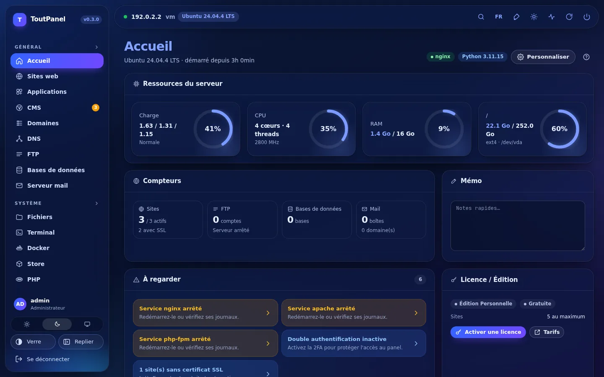<br>**Accueil, mode sombre** : jauges, compteurs, points d'attention, licence | 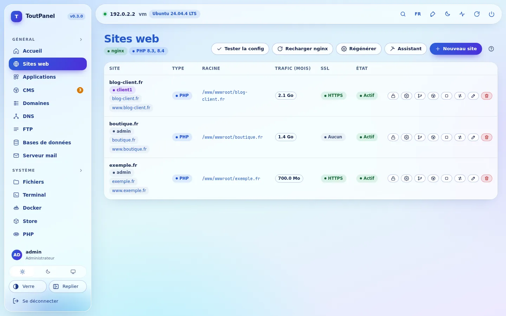<br>**Sites web** : domaines, type, racine, trafic, SSL et actions |
| <br>**PHP** : versions 5.6 → 8.5 côte à côte, état du support, pools FPM | <br>**Paramètres du site** : déploiement Git, SSL, redirections, sécurité |
| <br>**DNS** : zones BIND ou fournisseurs, gabarits, DNSSEC, cluster | <br>**Certificats** : validité, émetteur, renouvellement, certificat du panel |
| 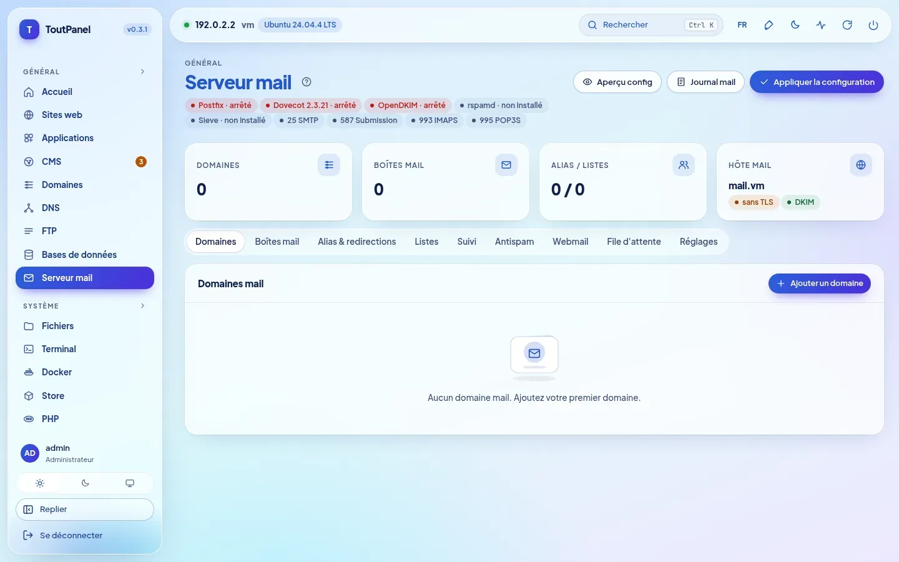<br>**Serveur mail** : Postfix, Dovecot, OpenDKIM, ports et onglets | <br>**Webmail** : Roundcube ou SnappyMail installé en un clic |
| 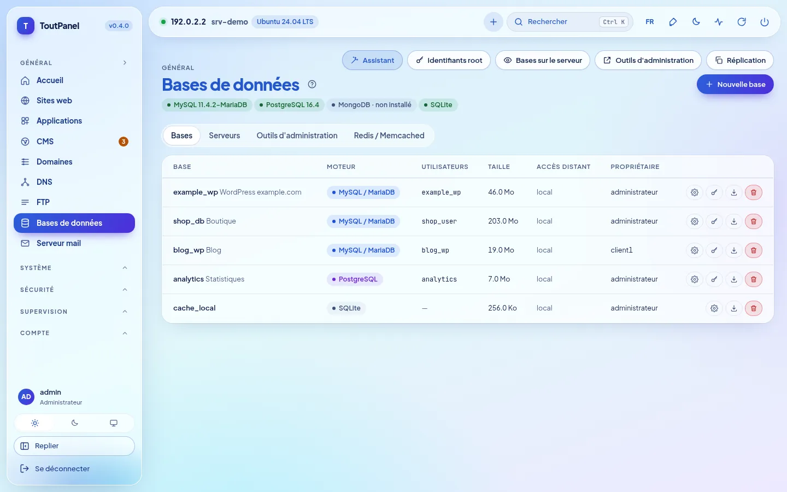<br>**Bases de données** : MariaDB, PostgreSQL, MongoDB, SQLite, Redis | <br>**Fichiers** : éditeur, archives, corbeille, permissions, occupation |
| <br>**CMS › Installer** : 582 CMS et applications vérifiés, recherche, filtres, pastille « prêt » | <br>**Fiche d'un CMS** : prérequis vérifiés, choix de la version, site cible, base |
| <br>**CMS › Installations** : versions, mises à jour disponibles, sauvegarde, clonage | <br>**WAF › Moteur** : ToutWAF recommandé, WAF intégré, BunkerWeb, SafeLine |
| <br>**Terminal** : shell interactif bash / PowerShell dans le navigateur | <br>**Applications** : WordPress, Joomla, Drupal, PrestaShop, Nextcloud… |
| <br>**Store** : logiciels serveur, modules et thèmes en un clic | 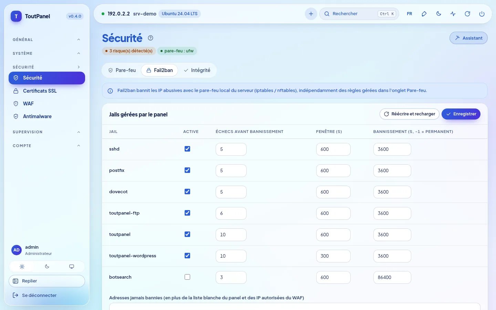<br>**Sécurité** : recommandations, pare-feu, anti-DDoS, Fail2ban |
| 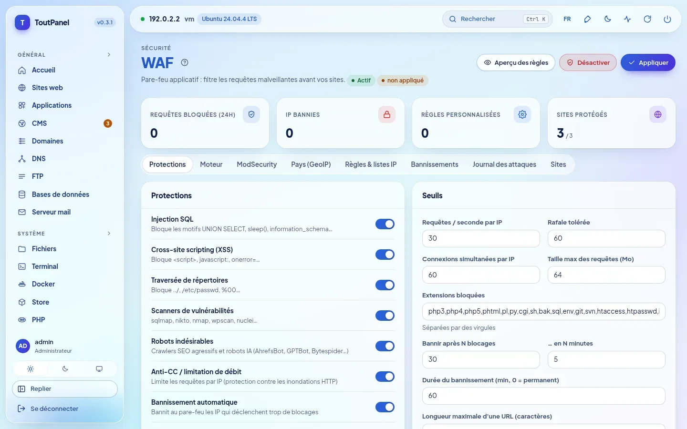<br>**WAF** : protections, seuils, moteurs, GeoIP, journal des attaques | <br>**Monitoring** : CPU, mémoire, réseau, charge et disque sur 1 h → 7 j |
| <br>**Comptes** : revendeurs, clients, plans, profils d'accès | <br>**Serveurs** : panel maître, nœuds, routage, migration |
| <br>**Mises à jour** : paquets du système (sécurité) et du panel | <br>**Réglages** : accès, port, entrée secrète, HTTPS, interface |
| 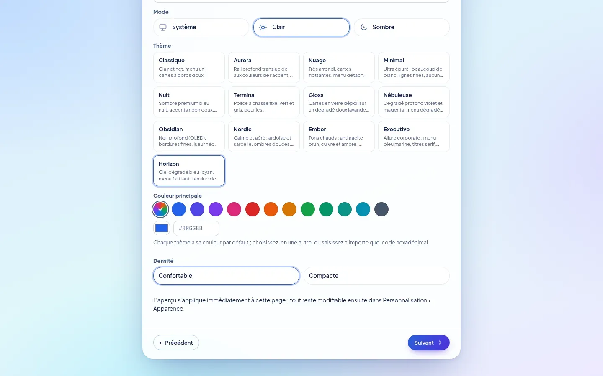<br>**Assistant de configuration** : thème, couleur principale, densité, aperçu immédiat | <br>**Horizon**, thème par défaut : le même écran en clair et en sombre |

**Nouveautés de la 0.4** — captures d'un serveur de démonstration (adresses de documentation) :

| | |
|---|---|
| <br>**Assistant de configuration, étape Profil** : profils de départ, mémoire détectée, profil recommandé | 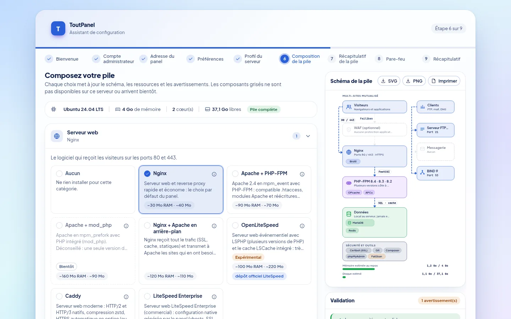<br>**Composition de la pile** : choix par catégorie, schéma d'architecture, validation et ressources estimées |
| <br>**Installation de la pile** : progression, étapes, reprise après erreur | <br>**Assistant, étape Pare-feu** : géré par ToutPanel ou en amont, ports qui seront ouverts |
| <br>**Réglages › Pile logicielle** : état réel, versions installées, schéma de ce serveur | <br>**Pile logicielle**, mode sombre |
| <br>**Accélérateurs** : OPcache, JIT, APCu, Redis, Memcached, FastCGI, Varnish… avec état, mémoire et limites | <br>**OpenLiteSpeed** *(expérimental)* : installation, LSPHP, bascule du serveur web, WebAdmin |
| 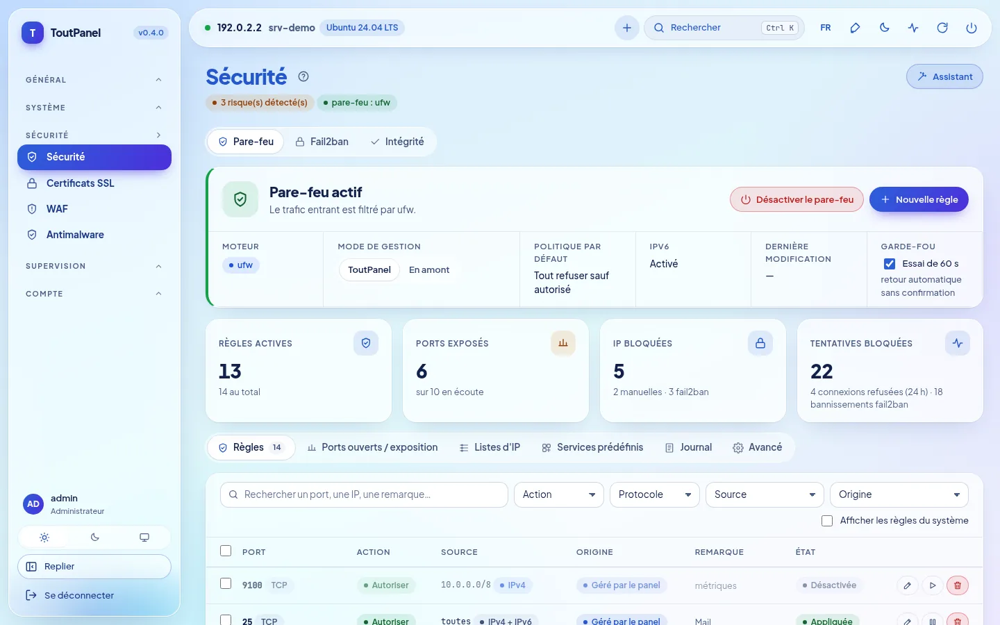<br>**Sécurité › Pare-feu** : moteur, mode de gestion, garde-fou, règles | <br>**Ports en écoute et exposition** : exposé, restreint, protégé |
| <br>**Pare-feu en amont** : ports à ouvrir chez l'hébergeur, à copier ou télécharger | <br>**Pare-feu**, mode sombre |
| <br>**DNS › Moteur** : BIND, PowerDNS, Knot DNS, fournisseur externe | <br>**Serveur mail › Moteur** : Postfix, Exim *(expérimental)*, relais externe |
| <br>**FTP › Moteur** : intégré, Pure-FTPd, ProFTPD, vsftpd, SFTP *(expérimentaux)* | <br>**ToutWAF distant** : panel relié à un ToutWAF d'un autre serveur |
| <br>**Accueil** : bandeau « distribution en pile réduite » selon le niveau de support | |

**Pages ajoutées pour la 0.4.0** — mêmes conventions (serveur de démonstration, adresses de documentation) :

| | |
|---|---|
| 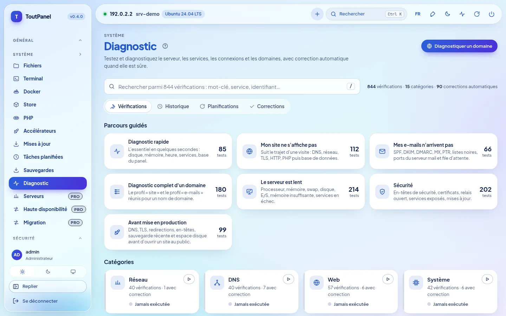<br>**Système › Diagnostic** : 844 vérifications, parcours guidés, catégories, recherche instantanée | <br>**Résultat d'un diagnostic** : causes probables, preuve technique aux secrets masqués, **correction automatique** |
| <br>**Correction automatique** : aperçu exact de ce qui sera modifié, impact, annulation possible | <br>**Accueil › « Que voulez-vous faire ? »** : assistants guidés pas à pas |
| <br>**Assistant guidé** (ici : utilisateur) : étapes, aide contextuelle, mode Simple ou Avancé | <br>**Test réel après application** : résultat par vérification, cause probable, correction en un clic |
| <br>**Haute disponibilité** *(Pro)* : IP flottante keepalived, serveurs et priorités, porteur de l'adresse | <br>**Monitoring › Parc de serveurs** *(Pro)* : disponibilité, CPU, mémoire, disque et charge par serveur |
| <br>**Serveurs** *(Pro)* : panel maître, nœuds web / mail / DNS, état, empreinte TLS épinglée | <br>**Comptes › Réglages › Isolation des comptes** *(option, désactivée par défaut)* : PHP-FPM par compte, durcissement systemd, cage |
| <br>**Réglages › Serveur web : Caddy** *(expérimental)* : bascule avec retour arrière, HTTPS, fonctions non prises en charge | <br>**LiteSpeed Enterprise** *(expérimental ; jamais démarré lors de nos essais)* : licence, installation officielle, LSPHP |
| <br>**Store › Modules** : Marketplace d'intégrations (facturation, supervision, SSO, CI/CD, DNS / CDN…) | 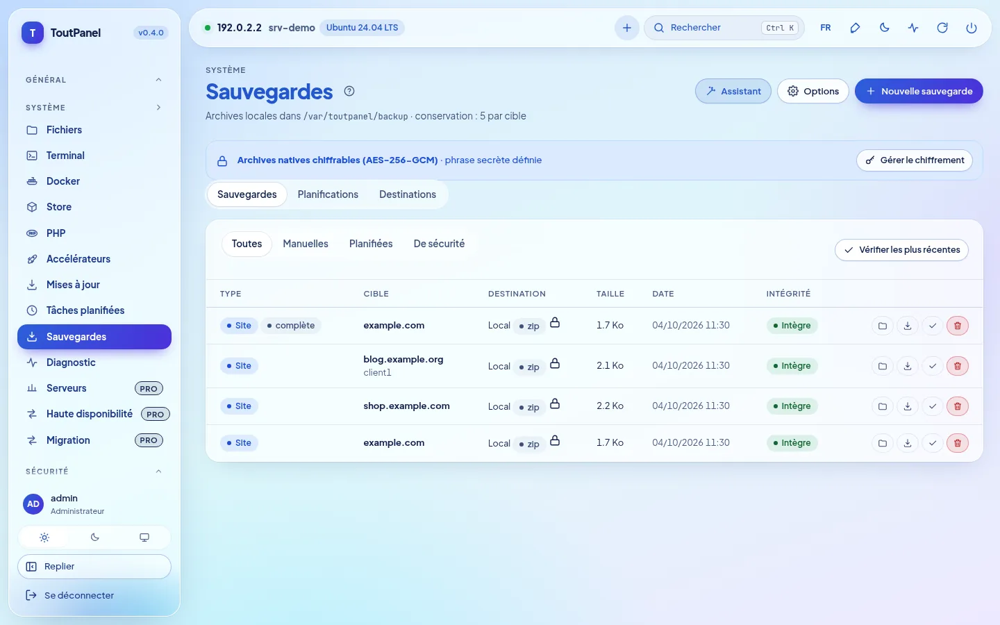<br>**Sauvegardes** : archives chiffrées (AES-256-GCM), complètes ou incrémentales |
| <br>**Chiffrement des sauvegardes** : phrase secrète conservée chiffrée, avertissement de perte, chiffrement par défaut ou obligatoire | <br>**Planifications** : périmètre, rétention, destination, incrémentales |
| <br>**Réglages › Sécurité** : alertes de connexion inhabituelle, SSO OIDC / SAML | <br>**SSO** *(Pro)* : LDAP / Active Directory, OpenID Connect, SAML 2.0 |

**Sur mobile**, l'interface s'adapte (menu repliable, tableaux défilants) :

<table>
<tr>
<td align="center"><br><b>Accueil</b></td>
<td align="center"><br><b>Sites web</b></td>
</tr>
</table>

> Captures réalisées sur un serveur de démonstration (Ubuntu 24.04, adresse de documentation 192.0.2.2, domaines d'exemple). Sur ce serveur de démonstration, certains états sont **simulés** (aucun service réel n'y tourne) : isolation des comptes (systemd, cgroups), Caddy, parc de serveurs et IP flottante, bases de données, courrier, WAF et catalogue du Marketplace ; les diagnostics et les assistants, eux, s'exécutent réellement. Des captures dans d'autres langues sont dans `screenshots/<langue>/` (en, de, es, it, nl, pt, ru, zh, ar).

## Thèmes

### 13 thèmes, votre couleur

Une nouvelle installation utilise **Horizon** : ciel dégradé bleu-cyan, menu et barre du haut flottants translucides, pilule active en dégradé bleu-violet qui suit la couleur choisie, titres bleus très gras. **Personnalisation › Apparence** : choisissez un autre design, puis **n'importe quelle couleur d'accent** (12 préréglages, pipette ou code `#RRGGBB`). Le panel en dérive boutons, liens, menu actif, badges, dégradés et graphiques, en gardant un contraste d'au moins 4,5:1. Chaque thème existe en **clair et en sombre**, respecte le contraste élevé et les langues de droite à gauche ; l'aperçu est immédiat, rien n'est enregistré avant « Enregistrer le design ». Densité, coins, police, largeur, position du menu, icônes et animations se règlent aussi, par utilisateur ou par défaut pour tous ; le thème s'exporte et s'importe.


| | | |
|---|---|---|
| <br>**Horizon** *(par défaut)* · `#2b5fd9` | <br>**Classique** · `#2563eb` | <br>**Aurora** · `#2563eb` |
| <br>**Nuage** · `#5b5bd6` | <br>**Minimal** · `#18181b` | <br>**Nuit** · `#0369a1` |
| <br>**Terminal** · `#15803d` | <br>**Gloss** · `#7c3aed` | <br>**Nébuleuse** · `#8b5cf6` |
| <br>**Obsidian** · `#22c55e` | <br>**Nordic** · `#14b8a6` | <br>**Ember** · `#f97316` |
| <br>**Executive** · `#10b981` | | |

<sub>Couleur indiquée : accent par défaut du thème en mode clair, librement modifiable.</sub>

Le thème, le mode, la **couleur principale** et la **densité** se choisissent aussi dès l'**assistant de configuration** (étape Préférences), avec aperçu immédiat ; ce sont les valeurs par défaut de tous les comptes, chacun pouvant ensuite choisir les siennes.

## Éditions

Le programme est le même pour toutes les éditions : une **clé de licence** active les fonctions avancées sur un serveur donné. Une installation neuve fonctionne en édition Personnelle, sans inscription ni connexion à Internet.

| Édition | Prix | Clé | Pour qui |
|---|---|---|---|
| **Personnelle** | gratuite, sans limite de durée | aucune | usage personnel : vos propres sites, **jusqu'à 5** |
| **Professionnelle** | payante | obligatoire | hébergeurs, agences, usage professionnel : tout est inclus, sites illimités (ou selon le plan de licence) |
| **Entreprise** | payante | obligatoire | Professionnelle + multi-serveurs illimités + support prioritaire |

L'édition Personnelle est **complète** : sites, PHP multi-versions, bases de données, mail, DNS, SSL, WAF intégré, sauvegardes locales (**chiffrement AES-256-GCM et incrémentales comprises**), monitoring, Diagnostic manuel, assistants guidés (les étapes qui touchent une fonction Pro restent réservées), comptes clients et sous-utilisateurs, WebAuthn, outils RGPD, API et CLI. Sont réservés aux éditions payantes :

<details>
<summary><b>Liste exacte des fonctions Professionnelle / Entreprise</b></summary>

| Fonction | Personnelle | Professionnelle |
|---|---|---|
| Sites | 5 au maximum | illimités (ou selon la licence) |
| Sondes d'uptime | 3 | illimitées |
| Webhooks sortants | 2 | illimités |
| Choix du moteur WAF (ToutWAF, BunkerWeb, SafeLine) | WAF intégré | ✓ |
| ModSecurity + OWASP CRS | — | ✓ |
| Multi-serveurs : nœuds, haute disponibilité, migration à chaud | — | ✓ |
| Groupes web et cluster DNS | — | ✓ |
| Réplication des bases | — | ✓ |
| Facturation, passerelles, WHMCS, provisioning | — | ✓ |
| Marque blanche des revendeurs | — | ✓ |
| Domaine personnalisé du panel | — | ✓ |
| Support (tickets) | — | ✓ |
| Annonces | — | ✓ |
| Comptes revendeurs | — (clients et sous-utilisateurs : ✓) | ✓ |
| SSO LDAP / OpenID Connect / SAML | — (WebAuthn : ✓) | ✓ |
| Blocage par pays (GeoIP) | — | ✓ |
| Antimalware planifié | analyse manuelle | ✓ |
| Sauvegardes distantes (S3, SFTP, B2, rsync SSH, rclone) | stockage local (archives chiffrées et incrémentales comprises) | ✓ |
| Moteurs restic, Borg et rsync | — | ✓ |
| Export Prometheus `/metrics` | — | ✓ |
| Import depuis cPanel, Plesk, DirectAdmin, ISPConfig, mutualisé, IMAP | — (export : ✓) | ✓ |
| Modules premium du store | — | ✓ |
| Ancrage externe du journal d'audit | — (export et purge RGPD : ✓) | ✓ |
| Diagnostics planifiés avec alerte | diagnostic manuel | ✓ |

</details>

- Les entrées concernées portent un badge **Pro** ; les pages restent consultables, seules la création et la modification sont réservées.
- Activation : **Réglages › Licence › Activer une clé** (`TP-XXXXX-XXXXX-XXXXX-XXXXX`) ou `toutpanel licence activate <clé>`. Le jeton signé est vérifié localement : la licence fonctionne hors ligne (revalidation quotidienne, période de grâce de 15 jours).
- Si la licence expire ou n'est plus valide, le panel **repasse en édition Personnelle sans rien supprimer**.

Tarifs et achat : **[toutpanel.com/tarifs](https://toutpanel.com/tarifs)** · détails : [Éditions et licence](https://toutpanel.com/docs/guide/editions/).

## Architecture

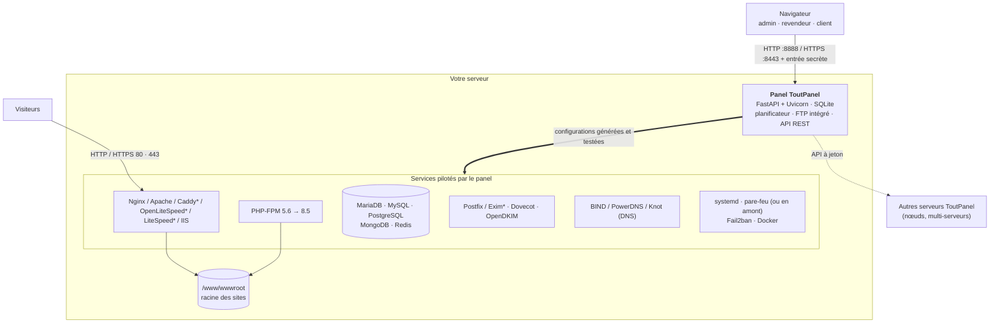
```mermaid
flowchart TB
    U["Navigateur<br/>admin · revendeur · client"] -->|"HTTP :8888 / HTTPS :8443 + entrée secrète"| P
    V["Visiteurs"] -->|"HTTP / HTTPS 80 · 443"| W
    subgraph S["Votre serveur"]
        P["<b>Panel ToutPanel</b><br/>FastAPI + Uvicorn · SQLite<br/>planificateur · FTP intégré · API REST"]
        subgraph PILE["Services pilotés par le panel"]
            W["Nginx / Apache / Caddy* / OpenLiteSpeed* / LiteSpeed* / IIS"]
            F["PHP-FPM 5.6 → 8.5"]
            D[("MariaDB · MySQL · PostgreSQL<br/>MongoDB · Redis")]
            M["Postfix / Exim* · Dovecot · OpenDKIM"]
            B["BIND / PowerDNS / Knot (DNS)"]
            X["systemd · pare-feu (ou en amont)<br/>Fail2ban · Docker"]
        end
        R[("/www/wwwroot<br/>racine des sites")]
        P ==>|"configurations générées et testées"| PILE
        W --> R
        F --> R
    end
    P -. "API à jeton" .-> N["Autres serveurs ToutPanel<br/>(nœuds, multi-serveurs)"]
```

| Composant | Rôle |
|---|---|
| **Panel** | Application FastAPI servie par Uvicorn (service systemd `toutpanel` sous Linux, tâche planifiée `ToutPanel` sous Windows). Interface web sans dépendance externe, API REST, planificateur de tâches, serveur FTP intégré. |
| **Pile web** | Nginx et/ou Apache (Caddy, OpenLiteSpeed avec LSPHP, LiteSpeed Enterprise : expérimentaux ; IIS sous Windows) avec PHP-FPM ; le panel écrit les vhosts depuis ses modèles, les teste puis recharge le service. Le **composeur de pile** choisit et fait évoluer les logiciels. |
| **Services** | MariaDB / MySQL / PostgreSQL / MongoDB, Postfix (ou Exim*) / Dovecot / OpenDKIM, BIND (ou PowerDNS, Knot), FTP (intégré ou Pure-FTPd*, ProFTPD*, vsftpd*), Fail2ban, pare-feu, Docker : pilotés par le panel via leurs outils natifs. |
| **CLI `toutpanel`** | Administration du panel (port, entrée, mot de passe, mise à jour, licence…) et commandes métier scriptables (`--json`). |

<sub>\* expérimental</sub>

```
<home>  (/var/toutpanel ou C:\toutpanel)
├── data/      base SQLite du panel, settings.json, clés, install-info.txt
├── logs/      panel.log et journaux des sites
├── vhost/     vhosts générés (si le dossier natif du serveur web est absent)
├── ssl/       certificats des sites et du panel
├── backup/    sauvegardes locales
├── src/       clone de ce dépôt (canaux, étiquettes, toutpanel update)
└── venv/      environnement Python du panel
/www/wwwroot   racine des sites (C:\toutpanel\wwwroot sous Windows)
```
## Installation complète

### Prérequis

| | Linux | Windows |
|---|---|---|
| **Systèmes** | niveau **complet** : Debian 11 et suivantes, Ubuntu 20.04 et suivantes, AlmaLinux / Rocky Linux / RHEL / CentOS Stream / Oracle Linux / CloudLinux 8 et suivantes, Fedora · niveau **réduit** (le panel fonctionne, certaines fonctions manquent) : Debian 10, Ubuntu 18.04, CentOS / RHEL 7, Amazon Linux, openSUSE / SLES, Arch, Alpine, Devuan · voir [Compatibilité des distributions](#compatibilité-des-distributions) | Windows 10, 11 · Windows Server 2016, 2019, 2022, 2025 (build 14393 minimum) |
| **Droits** | `root` (ou `sudo`) et `bash` | PowerShell 5.1+ **en administrateur** (winget non nécessaire) |
| **Python** | 3.9 à 3.14 (installé par le script si la distribution le fournit) | installé par le script (3.12, python.org) si absent |
| **Mémoire** | 1 Go minimum (panel seul), 2 Go recommandés avec MariaDB et PHP | idem |
| **Disque** | 2 Go libres + vos sites | idem |
| **Réseau** | accès sortant HTTPS (GitHub, PyPI, dépôts de la distribution, Let's Encrypt) ; IP publique fixe et DNS inverse pour le mail | idem (python.org, nginx.org, windows.php.net, MariaDB) |

Architectures : `x86_64` et `aarch64` (autres : niveau réduit). Installez de préférence sur un serveur **fraîchement installé**. Sur un serveur où Nginx, Apache ou MariaDB sont déjà configurés, utilisez `--stack none` : le panel les détecte et écrit ses vhosts dans leur dossier natif sans toucher au reste.

### Compatibilité des distributions

L'installeur et le panel détectent la distribution (`/etc/os-release`, architecture) et affichent un **niveau de support** : `toutpanel compat` liste les distributions connues, `toutpanel check` donne celui de votre serveur, et un bandeau de l'accueil prévient quand le niveau n'est pas « complet ». Il n'y a **jamais de plafond de version** : une version plus récente d'une famille connue est traitée comme la dernière connue.

| Niveau | Signification | Exemples |
|---|---|---|
| **Complet** | la pile complète est prévue (serveur web, PHP multi-versions, bases aux versions au choix, mail, pare-feu, mises à jour automatiques) | Debian 11+, Ubuntu 20.04+ (LTS et intermédiaires), AlmaLinux / Rocky / RHEL / CentOS Stream / Oracle Linux 8+, CloudLinux 8 et 9, Fedora, Raspberry Pi OS 64 bits |
| **Réduit** | le panel fonctionne, mais certaines fonctions manquent ou demandent une intervention (système en fin de vie, init sans systemd, dépôts tiers absents, architecture 32 bits) ; avertissement non bloquant | Debian 10, Ubuntu 18.04, CentOS / RHEL 7, Amazon Linux 2 et 2023 (un seul PHP à la fois), openSUSE / SLES, Arch et dérivés, Alpine, Devuan, Kali |
| **Non pris en charge** | système inconnu, trop ancien ou immuable : l'installeur le dit et s'arrête | Fedora CoreOS / Silverblue, MicroOS, Flatcar, Gentoo, NixOS, Void |

« Complet » décrit le niveau **prévu** par le panel ; **les essais ont été faits sous Ubuntu 24.04**, avec une exception : **AlmaLinux 9.8 et 10.2 avec SELinux Enforcing** (laboratoire QEMU du 4 octobre 2026) ; la validation de bout en bout n'a pas été faite sur les autres distributions, Rocky Linux, RHEL et Fedora comprises (voir [Limites connues](#limites-connues)). Python 3.9+ est fourni si le système est trop ancien (paquet récent de la distribution ou Python autonome vérifié par SHA-256, avec votre accord).

### Linux

```bash
curl -sSL https://raw.githubusercontent.com/qu3ntin01/toutpanel/main/install.sh | sudo bash
```

Pour lire le script avant de l'exécuter :

```bash
curl -sSLO https://raw.githubusercontent.com/qu3ntin01/toutpanel/main/install.sh
less install.sh
sudo bash install.sh
```

L'installation dure de 3 à 6 minutes selon la connexion.

**Assistant d'installation.** Toutes les options (compte, ports, dossier, pile, pare-feu, WAF, version, langue…) se choisissent avec des menus sur **[toutpanel.com/installation-assistant](https://toutpanel.com/installation-assistant)**, qui génère la ligne de commande et la vérifie en direct (les secrets n'y figurent jamais en clair).

**Installer une version précise.** La commande standard installe la dernière version stable ; `--version` en choisit une autre (liste : `--list-versions`). Les préversions sont publiées sur le canal `dev` et s'installent avec `--channel dev` :

```bash
# la dernière version stable
curl -sSL https://raw.githubusercontent.com/qu3ntin01/toutpanel/main/install.sh | sudo bash
# une version précise (liste : --list-versions)
curl -sSL https://raw.githubusercontent.com/qu3ntin01/toutpanel/main/install.sh | sudo bash -s -- --list-versions
curl -sSL https://raw.githubusercontent.com/qu3ntin01/toutpanel/main/install.sh | sudo bash -s -- --version 0.4.0
# la dernière préversion (canal dev)
curl -sSL https://raw.githubusercontent.com/qu3ntin01/toutpanel/dev/install.sh | sudo bash -s -- --channel dev
```

**Menu interactif.** Lancé dans un terminal sans option de mode, le script présente ToutPanel, détecte une installation existante et propose : **installer** (pile complète) ou **installer le panel seul**, éventuellement en **mode nœud** ; ou, si le panel est déjà là, **mettre à jour**, **réinstaller complètement** ou **désinstaller**. Il pose aussi la question du **pare-feu** (ToutPanel / en amont / plus tard) et, après le démarrage du panel, celle du **profil de la pile**. Sans terminal (automatisation, `--yes`), il n'interroge pas : il installe, ou met à jour si le panel est présent (pare-feu « plus tard », pile par défaut).

**Ce que fait le script :**

1. installe Python 3.9+ si nécessaire et crée l'environnement virtuel `<home>/venv` ;
2. installe la **pile web** (Nginx, PHP-FPM, MariaDB, Redis ou Valkey, Certbot, Fail2ban) comme avant, ou celle que vous composez (`--profile`, `--web`, `--php`, `--db`… transmis à `toutpanel stack apply`) ;
3. clone ce dépôt dans `<home>/src`, **vérifie la somme SHA-256** de la roue correspondant au Python du système et l'installe ;
4. crée un **compte administrateur** et une **URL d'accès secrète** aléatoires ;
5. enregistre le **service systemd** `toutpanel` ;
6. règle le **pare-feu** selon `--firewall` : `on` (ToutPanel le gère et ouvre les ports nécessaires), `off` (pare-feu en amont : aucune règle système, liste des ports à ouvrir chez l'hébergeur), question dans un terminal, sinon « plus tard » (rien n'est touché) ;
7. configure **SELinux** (Alma, Rocky, RHEL, Fedora) ou **AppArmor** (Debian, Ubuntu, SUSE) ;
8. affiche un récapitulatif, enregistré dans `<home>/data/install-info.txt` (lisible par root uniquement).

#### Options de `install.sh`

| Option | Description | Défaut |
|---|---|---|
| `--stack full` | **obsolète** (voir `--profile`) : Nginx + PHP-FPM + MariaDB + Redis/Valkey + Certbot + Fail2ban | ✓ |
| `--stack minimal` | **obsolète** : Nginx + PHP-FPM + Certbot | |
| `--stack none` | **obsolète** : uniquement le panel (serveur déjà configuré) | |
| `--profile NOM` | profil du **composeur de pile** : `single-site`, `multi-site`, `hosting`, `performance`, `application`, `mail-only`, `dns-only`, `node`, `lamp`, `standard`, `custom` (valeurs des autres options : voir le tableau ci-dessous) | pile par défaut |
| `--web`, `--php`, `--php-default`, `--php-ext`, `--db`, `--redis`, `--accel`, `--ftp`, `--mail MOTEUR`, `--dns`, `--security`, `--runtime`, `--tools`, `--install-mode`, `--roles`, `--stack-file`, `--no-tuning` | options du composeur, transmises telles quelles à `toutpanel stack apply … --yes` après l'installation du panel (un échec de la pile ne fait pas échouer l'installation : commande de reprise affichée) | |
| `--accept-litespeed-license` | avec `--web litespeed[:6.3]` : accepte le contrat de licence de LiteSpeed Technologies ; **obligatoire** (sans elle, l'installeur s'arrête avant toute modification), incompatible avec `--stack`, refusée sous Windows. **LiteSpeed Enterprise est un produit commercial EXPÉRIMENTAL, jamais démarré dans l'environnement de développement** : essai officiel de 15 jours, puis licence payante | non |
| `--mail` | (seul) ajoute Postfix, Dovecot, OpenDKIM et ouvre les ports mail | non |
| `--firewall on\|off\|ask` | qui gère le pare-feu : ToutPanel (`on`), un pare-feu en amont sans règle système (`off`), question (`ask`) ; sans terminal ni valeur : « plus tard » ; jamais modifié par une mise à jour | question dans un terminal |
| `--firewall-engine nft\|ufw\|firewalld\|csf\|iptables` | moteur du pare-feu géré par ToutPanel | détecté |
| `--dry-run` | affiche la distribution détectée, le répertoire et les commandes prévues, sans rien modifier (sans root) | non |
| `--postgres` | ajoute PostgreSQL (mot de passe du rôle `postgres` généré et enregistré dans le panel) | non |
| `--waf toutwaf` | déploie **ToutWAF**, le WAF de l'éditeur, devant les sites par son installeur officiel (services systemd, sans Docker ; serveur web déplacé sur 8080 / 8443, console sur 9443, récapitulatif dans `/etc/toutwaf/INSTALL-SUMMARY.txt`) | non |
| `--waf bunkerweb` / `--waf safeline` | installe Docker et déploie le WAF externe devant les sites (serveur web déplacé sur 8080 / 8443, console sur 7000 ou 9443) | non |
| `--waf toutwaf --waf-console URL` | **ToutWAF distant** : relie le panel à un ToutWAF installé sur un autre serveur (aucune installation locale), avec `--waf-origin-ip`, `--waf-origin-addr`, `--waf-cert-mode import\|acme`, `--waf-server-id`, `--waf-fingerprint` ou `--waf-trust-first-use`, `--waf-restrict` (80 / 443 limités à ToutWAF) ; le jeton se donne par `--waf-token-file FICHIER` ou `--waf-token-stdin` (jamais en argument) | non |
| `--node` | mode **nœud** multi-serveurs : panel en HTTPS seul, jeton d'enrôlement, URL de l'API et empreinte TLS affichés (à saisir sur le maître : Système › Serveurs › Ajouter) | non |
| `--master URL` | avec `--node` : URL du panel maître | — |
| `--port N` | port **HTTP** du panel | `8888` |
| `--https-port N` | port **HTTPS** du panel (le panel écoute en HTTP **et** en HTTPS ; certificat auto-signé au départ) | `8443` |
| `--version X.Y.Z` | installe cette version publiée (aussi `vX.Y.Z`, `0.4.0b1` ou `0.4.0-beta.1` ; variable `TOUTPANEL_VERSION`) ; une préversion implique le canal `dev` ; version introuvable ou sans roue pour votre Python : arrêt avant toute modification avec la liste des versions ; une descente de version demande confirmation (sauf `--yes`) | dernière du canal |
| `--list-versions` | liste les versions publiées (la plus récente d'abord) puis quitte, sans rien installer | |
| `--random-port` | port aléatoire entre 20000 et 39999 | |
| `--username NOM` | nom du compte administrateur | `admin_xxxxxx` aléatoire |
| `--password MDP` | mot de passe administrateur (visible dans `ps` et l'historique du shell : préférez les trois options suivantes) | 16 caractères aléatoires |
| `TOUTPANEL_PASSWORD` | variable d'environnement donnant le mot de passe (conservée par `sudo -E`) ; une option l'emporte sur la variable | — |
| `--password-file FICHIER` | lit le mot de passe sur la première ligne d'un fichier (sous Linux, réservé à son propriétaire : `chmod 600`) | — |
| `--password-stdin` | lit le mot de passe sur l'entrée standard (première ligne ; inutilisable avec `curl \| bash`) | — |
| `--entrance /chemin` | entrée sécurisée de l'URL | `/tp_xxxxxxxxxx` aléatoire |
| `--home DIR` | répertoire du panel (une installation existante dans l'ancien défaut `/www/toutpanel` est détectée et conservée) | `/var/toutpanel` |
| `--source DIR` | installer depuis un dossier local (copie de ce dépôt avec `dist/`) | clone de la branche |
| `--branch NOM` | branche Git à télécharger | `main` |
| `--channel stable\|dev` | canal de mise à jour, enregistré dans le panel | `stable` |
| `--update` | met à jour une installation existante (détecté automatiquement) : sauvegarde des données, nouveau code, migration de la base, redémarrage | auto |
| `--reinstall` | force une installation complète même si le panel est présent | non |
| `--uninstall` | désinstalle le panel (sites et bases conservés, données du panel archivées) | non |
| `--yes`, `-y` | aucune question (menu et confirmations) | non |
| `--lang xx` | langue de l'installeur et langue initiale du panel : `en`, `fr`, `de`, `es`, `it`, `pt`, `nl`, `ru`, `zh`, `ar` | langue du système, sinon `en` |
| `--en`, `--fr`, `--de`, `--es`, `--it`, `--pt`, `--nl`, `--ru`, `--zh`, `--ar` | raccourcis de `--lang` | |
| `-h`, `--help` | affiche l'aide du script | |

Une seule source de mot de passe à la fois (deux options sont refusées avant toute modification). Sans aucune, un terminal interactif propose « générer automatiquement (recommandé) » ou « saisir » (sans écho, avec confirmation) ; sans terminal ou avec `--yes`, un mot de passe est généré et affiché à la fin. Un mot de passe fourni n'est ni affiché ni écrit dans le récapitulatif ou `install-info.txt`, et une mise à jour ne le modifie jamais.

**Valeurs des options de pile** (elles sont contrôlées avant toute modification ; **\*** = expérimental) :

| Option | Valeurs |
|---|---|
| `--web` | `nginx`, `apache`, `nginx-apache`, `caddy`\*, `openlitespeed`\* (`:1.9`, `:1.8`, `:1.7`), `litespeed`\* (`:6.3`, `:6.2`, `:6.1`, `:6.0` ; LiteSpeed Enterprise, commercial, exige `--accept-litespeed-license`), `none` ; `toutpanel stack apply` accepte les mêmes valeurs |
| `--php` / `--php-default` / `--php-ext` | versions séparées par des virgules (`8.3,8.4`, de 5.6 à 8.5) / version par défaut / `minimal`, `standard`, `full` |
| `--db` | `mariadb` (`:10.6`, `:10.11`, `:11.4`, `:11.8`), `mysql`\* (`:8.4`, `:9.7`), `percona`\* (`:8.0`, `:8.4`), `postgresql` (`:13` à `:18`), `none` |
| `--accel` | `opcache`, `jit`, `apcu`, `redis`, `memcached`, `fastcgi-cache`, `varnish`\*, `brotli`, `zstd`\*, `http3`\*, `ioncube` |
| `--ftp` | `builtin`, `pureftpd`\*, `proftpd`\*, `vsftpd`\*, `sftp`\*, `none` |
| `--mail` | `postfix`, `postfix-clamav`, `postfix-light`, `exim`\*, `relay`, `none` |
| `--dns` | `bind`, `powerdns`, `knot`, `external`, `none` |
| `--security` | `firewall`, `fail2ban`, `modsecurity`, `clamav`, `toutwaf` |
| `--runtime` / `--tools` | `nodejs`, `python`, `go`, `ruby`, `java`, `docker` / `certbot`, `git`, `composer`, `phpmyadmin`, `adminer`, `restic`, `goaccess` |
| `--install-mode` / `--roles` | `single-server`, `single-site`, `multi-site`, `multi-server` / `web`, `db`, `mail`, `dns` |

Un composant « à venir » (Apache + mod_php) est refusé proprement par `toutpanel stack`, sans rien installer.

Exemples :

```bash
sudo bash install.sh --stack minimal --port 7443
sudo bash install.sh --profile lamp --php 8.3,8.4 --db mariadb:11.4 --firewall on
sudo bash install.sh --profile hosting --mail postfix-clamav --dns bind --firewall off --yes
sudo bash install.sh --dry-run --profile lamp          # simulation
sudo bash install.sh --mail --postgres
sudo bash install.sh --mail --username moi --password-file /root/mot-de-passe.txt --entrance /mon-acces
sudo bash install.sh --profile performance --web openlitespeed --php 8.3 --accel opcache,redis --firewall off --yes   # OpenLiteSpeed : expérimental
sudo bash install.sh --web litespeed:6.3 --php 8.3 --accept-litespeed-license --yes   # LiteSpeed Enterprise : commercial, expérimental, licence obligatoire (Linux seulement)
sudo bash install.sh --waf toutwaf                 # WAF de l'éditeur devant les sites
sudo bash install.sh --stack minimal --node --master https://maitre.exemple.com:8888   # serveur piloté par un maître
curl -sSL https://raw.githubusercontent.com/qu3ntin01/toutpanel/main/install.sh | sudo bash -s -- --yes --random-port
curl -sSL https://raw.githubusercontent.com/qu3ntin01/toutpanel/main/install.sh | sudo bash -s -- --channel dev
curl -sSL https://raw.githubusercontent.com/qu3ntin01/toutpanel/main/install.sh | sudo bash -s -- --fr   # installeur en français
```

#### Langue de l'installeur

Les installeurs sont **multilingues** : bannière, menu et questions, étapes, avertissements, erreurs, aide, récapitulatif et `install-info.txt` s'affichent dans l'une des **10 langues** ci-dessous, en **anglais par défaut**. La langue retenue devient aussi la **langue initiale du panel** (installation et réinstallation) ; une ligne sous la bannière indique la langue choisie et son origine.

| Langue | `--lang` | Raccourci Linux | Windows |
|---|---|---|---|
| English *(défaut)* | `en` | `--en` | `-Lang en` / `-En` |
| Français | `fr` | `--fr` | `-Lang fr` / `-Fr` |
| Deutsch | `de` | `--de` | `-Lang de` / `-De` |
| Español | `es` | `--es` | `-Lang es` / `-Es` |
| Italiano | `it` | `--it` | `-Lang it` / `-It` |
| Português | `pt` | `--pt` | `-Lang pt` / `-Pt` |
| Nederlands | `nl` | `--nl` | `-Lang nl` / `-Nl` |
| Русский | `ru` | `--ru` | `-Lang ru` / `-Ru` |
| 中文 | `zh` | `--zh` | `-Lang zh` / `-Zh` |
| العربية | `ar` | `--ar` | `-Lang ar` / `-Ar` |

Ordre de priorité, du plus fort au plus faible :

| # | Source | Linux | Windows |
|---|---|---|---|
| 1 | option de la ligne de commande | `--lang xx` ou raccourci (`--fr`…) | `-Lang xx` ou raccourci (`-Fr`…) |
| 2 | variable d'environnement | `TOUTPANEL_LANG=fr` | `$env:TOUTPANEL_LANG = "fr"` |
| 3 | valeur écrite dans le script | `INSTALLER_LANG="fr"` en tête de `install.sh` | `$InstallerLang = "fr"` en tête de `install.ps1` |
| 4 | **détection** de la langue du système, si elle fait partie des 10 | `LC_ALL`, `LC_MESSAGES`, `LANG` | `Get-Culture` |
| 5 | anglais | | |

```bash
curl -sSL https://raw.githubusercontent.com/qu3ntin01/toutpanel/main/install.sh | sudo env TOUTPANEL_LANG=de bash
```

Variables d'environnement reconnues : `TOUTPANEL_LANG` (langue de l'installeur), `TOUTPANEL_HOME` (répertoire), `TOUTPANEL_REPO` (dépôt Git), `TOUTPANEL_BRANCH` (branche), `TOUTPANEL_CHANNEL` (`stable` ou `dev`), `TOUTPANEL_VERSION` (version précise), `TOUTPANEL_PASSWORD` (mot de passe administrateur), `TOUTPANEL_FIREWALL` / `TOUTPANEL_FIREWALL_ENGINE`, et une variable par option de pile (`TOUTPANEL_PROFILE`, `TOUTPANEL_WEB`, `TOUTPANEL_PHP`, `TOUTPANEL_DB`, `TOUTPANEL_ACCEL`, `TOUTPANEL_FTP`, `TOUTPANEL_MAIL_ENGINE`, `TOUTPANEL_DNS`…).

<details>
<summary><b>Paquets installés selon la distribution</b></summary>

- **Debian / Ubuntu** : `nginx`, `php8.x-fpm` (+ cli, mysql, curl, mbstring, xml, zip, gd, intl, bcmath, opcache), `certbot`, `composer`, `mariadb-server`, `redis-server`, `fail2ban`, `python3-venv`, `git`, `unzip` ; PHP multi-versions via packages.sury.org (Debian) ou le PPA ondrej (Ubuntu).
- **AlmaLinux / Rocky / RHEL / Fedora** : `epel-release` (+ CRB), `remi-release`, `nginx`, `php83-php-fpm` (+ extensions), `certbot`, `mariadb-server`, `redis` ou `valkey` (Valkey sur AlmaLinux 10), `fail2ban`, `policycoreutils-python-utils`, `dnf-plugins-core`, `rspamd` (depuis le dépôt officiel `rspamd.com`, ajouté par la pile : absent d'AlmaLinux et d'EPEL), `firewalld` (installé avec `--firewall on` : les images cloud n'ont ni `firewalld` ni `nft`) ; contextes SELinux déclarés (`httpd_sys_rw_content_t` sur `/www/wwwroot`, `httpd_log_t`, `var_log_t`, `cert_t`, `httpd_config_t`, `mail_spool_t`) et booléens `httpd_can_network_connect`, `httpd_can_network_connect_db`, `httpd_can_sendmail`, `httpd_setrlimit` activés.
- **Modules Python facultatifs** (non installés par défaut) : `pymongo` (MongoDB), `wsgidav` + `a2wsgi` (WebDAV), `geoip2` (GeoIP), `python3-saml` (SAML) — `/var/toutpanel/venv/bin/pip install "pymongo>=4.6"` puis `systemctl restart toutpanel`.

</details>

### Windows

Dans PowerShell **en tant qu'administrateur** :

```powershell
Set-ExecutionPolicy Bypass -Scope Process -Force
iwr -useb https://raw.githubusercontent.com/qu3ntin01/toutpanel/main/install.ps1 | iex
```

Le script vérifie la version de Windows et les droits, installe **Python 3.12** si aucun Python 3.9+ n'est présent, crée `C:\toutpanel\venv` et y installe le panel, crée le compte admin et l'URL secrète, ajoute les règles de pare-feu (port du panel, 80, 443, 21), crée la tâche planifiée **ToutPanel** (démarrage automatique en SYSTEM) et ajoute `C:\toutpanel\bin` au PATH.

Pour installer aussi la pile web (**Nginx** dans `C:\nginx`, **PHP 8.5** supervisé par le panel, **MariaDB** en service Windows) :

```powershell
iwr -useb https://raw.githubusercontent.com/qu3ntin01/toutpanel/main/install.ps1 -OutFile install.ps1
.\install.ps1 -Stack
```

| Option | Description |
|---|---|
| `-Port 8888` | port **HTTP** du panel |
| `-HttpsPort 8443` | port **HTTPS** du panel |
| `-Version X.Y.Z` / `-ListVersions` | installer une version publiée précise (variable `TOUTPANEL_VERSION`) / lister les versions publiées |
| `-Home C:\toutpanel` | répertoire du panel |
| `-Stack` | installe Nginx, PHP 8.5, MariaDB |
| `-Username`, `-Password`, `-Entrance /x` | compte admin et URL secrète choisis (`-Password` est visible dans la liste des processus : préférez `$env:TOUTPANEL_PASSWORD`, `-PasswordFile FICHIER` ou `-PasswordStdin`) |
| `-PythonVersion`, `-NginxVersion`, `-MariaDBVersion`, `-PhpVersion` | versions téléchargées |
| `-Source C:\chemin` / `-Branch main` | dossier local (copie de ce dépôt) / branche téléchargée |
| `-Update` / `-Reinstall` / `-Uninstall` | mettre à jour / tout réinstaller / désinstaller |
| `-Yes` | aucune question (automatisation) |
| `-Lang xx` / `-En`, `-Fr`, `-De`, `-Es`, `-It`, `-Pt`, `-Nl`, `-Ru`, `-Zh`, `-Ar` | langue de l'installeur et langue initiale du panel (défaut : langue du système si prise en charge, sinon anglais ; voir [Langue de l'installeur](#langue-de-linstalleur)) ; avec `iwr … \| iex` : `$env:TOUTPANEL_LANG = "fr"` avant la commande |
| `-Help` | aide du script |

### Ports à ouvrir

| Port | Usage | Ouvert par l'installeur |
|---|---|---|
| **8888** (configurable) | interface du panel en **HTTP** | oui |
| **8443** (configurable) | interface du panel en **HTTPS** (certificat auto-signé au départ) | oui (relancez l'installeur ou ouvrez-le à la main sur une installation existante) |
| **80 / 443** | sites web | oui |
| 21 + 60000-60100 | FTP (intégré, ou le moteur choisi : plage passive du moteur) | 21 seulement ; ouvrez la plage passive si vous activez le FTP |
| 25, 465, 587, 143, 993, 110, 995, 4190 | mail (SMTP, IMAP, POP3, ManageSieve) | avec `--mail` (4190 : à ouvrir pour Sieve à distance) |
| 53 (UDP et TCP) | DNS (BIND, PowerDNS ou Knot) si vous hébergez vos zones | non : Sécurité › Pare-feu |
| 9443 / 7000 | consoles ToutWAF et SafeLine (9443), BunkerWeb (7000) | avec `--waf` |
| 3306 / 5432 | accès distant aux bases (facultatif) | non : seulement si vous l'activez |

N'oubliez pas le **pare-feu de votre hébergeur** (groupe de sécurité) : s'il bloque les ports du panel (8888 et 8443), le navigateur n'affiche rien. Avec `--firewall off` (ou le mode « En amont » de Sécurité › Pare-feu), ToutPanel ne touche à aucune règle système et **liste les ports à ouvrir** chez l'hébergeur (`toutpanel firewall ports`, copie ou téléchargement CSV dans l'interface) ; avec `--firewall on`, il les ouvre lui-même et un **garde-fou de 60 s** annule tout changement non confirmé qui vous couperait l'accès.

## Premier démarrage

À la fin de l'installation, le script affiche un récapitulatif :

```
╔══════════════════════════════════════════════════════════════════╗
║  ToutPanel est installé !                                        ║
╚══════════════════════════════════════════════════════════════════╝

  URL du panel (HTTP)       : http://203.0.113.10:8888/tp_dchwp7kmkf
  URL du panel (HTTPS)      : https://203.0.113.10:8443/tp_dchwp7kmkf   certificat auto-signé : avertissement du navigateur normal
  Utilisateur               : admin_gbhjkv
  Mot de passe              : D9nYzTSKHbX8FTqC
  MariaDB root              : k3Jd82nLqP0sYt7wVb1c
  Assistant de configuration : https://203.0.113.10:8443/tp_dchwp7kmkf#/setup?token=npSj7xpVzJOI8weJl8R00AdQ18MHYn8YIJCbOYi43B8
  Ce lien (24 h, une seule utilisation) permet de changer l'adresse du panel, l'utilisateur et le mot de passe générés ci-dessus.
  Nouveau lien : toutpanel setup-link
  PHP                       : 8.5 (Nginx + PHP-FPM prêts)

  Ces informations sont enregistrées dans : /var/toutpanel/data/install-info.txt
  L'URL contient l'entrée sécurisée : sans elle, le panel répond 404.
```

1. **Notez l'URL complète** (HTTP et HTTPS) : elle contient l'**entrée sécurisée** (`/tp_…`). Sans elle, le panel répond `404 Not Found`, ce qui le rend invisible aux balayages. `toutpanel info` la réaffiche. Le certificat HTTPS est **auto-signé** au départ : l'avertissement du navigateur est normal ; l'assistant de configuration est ouvert en HTTPS pour que son jeton ne circule pas en clair.
2. **Ouvrez le lien « Assistant de configuration »** (`#/setup?token=…`, valable 24 h, une seule utilisation) : en **neuf étapes** et sans connexion, remplacez les valeurs générées par les vôtres (nom d'utilisateur, mot de passe, port, entrée sécurisée, nom d'hôte, langue, mode, thème, couleur principale et densité), puis **choisissez le profil de votre serveur et composez sa pile** (profil, composition avec schéma d'architecture, récapitulatif et installation reprenable) et **qui gère le pare-feu** (ToutPanel, en amont ou plus tard). Lien expiré ? `toutpanel setup-link` en génère un nouveau. L'assistant reste accessible une fois connecté (accueil › Raccourcis rapides).
3. **Sécurisez le compte** : double authentification (TOTP) et, si possible, une clé de sécurité WebAuthn ; IP autorisées si vous avez une IP fixe ; certificat HTTPS reconnu (Réglages › Accès & interface, Let's Encrypt si un domaine pointe vers le serveur) et, si vous le souhaitez, redirection HTTP vers HTTPS.
4. **Créez un premier site** : Sites web › Nouveau site (ou bouton **Assistant** pour site + base + certificat + boîtes mail), pointez le DNS vers le serveur, puis cadenas › Let's Encrypt et « Forcer HTTPS ».
5. **Activez les protections** : WAF › Appliquer (ou WAF › Moteur › Installer ToutWAF en édition Professionnelle), règles du pare-feu (Sécurité › Pare-feu), sauvegarde quotidienne planifiée, alertes (Réglages › Alertes).
6. **Vérifiez le serveur** : Système › Diagnostic (844 vérifications, corrections automatiques avec aperçu) et, sur chaque page, le bouton **Assistant** pour configurer pas à pas un site, une base, une boîte mail, une sauvegarde ou le pare-feu avec un test réel à la fin.
7. **Faites évoluer la pile** à tout moment : Réglages › Pile logicielle (état réel, ajout d'un composant, d'une version de PHP, d'un moteur), page Accélérateurs, onglets Moteur des pages FTP, DNS et Serveur mail.

## Mise à jour

Toutes les méthodes conservent comptes, réglages, sites, bases et logiciels.

- **Depuis le panel** : **Mises à jour › Panel** affiche la version installée, le canal suivi, les versions disponibles et les notes de version. **Mettre à jour** sauvegarde d'abord `settings.json`, la base du panel et la version courante (`<home>/data/updates/<date>/`), installe la roue de la nouvelle version, migre la base et redémarre ; le panel vérifie ensuite sa santé et **revient seul à la version précédente** en cas d'échec. **Revenir à la version précédente** reste disponible à tout moment.
- **En ligne de commande** :

  ```bash
  toutpanel update --check              # version installée, version disponible, notes de version
  toutpanel update                      # installer la version du canal suivi
  toutpanel update --channel dev        # suivre la branche de développement
  toutpanel update --rollback           # revenir à la version précédente (--restore-data : données aussi)
  ```

- **Avec le script d'installation** : relancé sur un serveur déjà équipé, `install.sh` passe en mode mise à jour (sauvegarde de `data/` dans `<home>/backup/panel-update-<date>/`, nouvelle roue, `toutpanel migrate`, redémarrage). La pile n'est pas réinstallée sauf si vous ajoutez `--stack`, une option du composeur (`--profile`…), `--mail` ou `--waf` ; le pare-feu existant n'est jamais modifié. Sous Windows : `.\install.ps1 -Update`.

## Désinstallation

```bash
curl -sSL https://raw.githubusercontent.com/qu3ntin01/toutpanel/main/install.sh | sudo bash -s -- --uninstall
```

Supprime le service, `/var/toutpanel` (ou l'installation détectée, par ex. `/www/toutpanel` : panel, environnement Python, journaux, certificats), `/usr/local/bin/toutpanel` et les configurations Nginx / Apache générées par le panel. Les données du panel sont d'abord archivées dans `/root/toutpanel-backup-<date>.tar.gz`. **Les sites (`/www/wwwroot`), les bases de données et les logiciels de la pile restent en place.** Ajoutez `--yes` pour ne pas confirmer.

Sous Windows : `.\install.ps1 -Uninstall` (données archivées dans `C:\toutpanel-backup-<date>.zip`, sites déplacés dans `C:\toutpanel-wwwroot-<date>`, Nginx, PHP et MariaDB conservés).

## Installation manuelle depuis une roue

Pour les environnements particuliers, sans le script. Choisissez la roue qui correspond à votre interpréteur (`cp311` pour Python 3.11, etc.) :

```bash
git clone --depth 1 https://github.com/qu3ntin01/toutpanel.git /var/toutpanel/src
python3 -m venv /var/toutpanel/venv
. /var/toutpanel/venv/bin/activate          # Windows : venv\Scripts\activate
TAG=$(python -c 'import sys;print(f"cp{sys.version_info[0]}{sys.version_info[1]}")')
(cd /var/toutpanel/src/dist && sha256sum -c --ignore-missing SHA256SUMS)
pip install /var/toutpanel/src/dist/toutpanel-*-$TAG-none-any.whl
# soit, pour Python 3.12 : pip install dist/toutpanel-0.5.5-cp312-none-any.whl
export TOUTPANEL_HOME=/var/toutpanel         # Windows : $env:TOUTPANEL_HOME="C:\toutpanel"
toutpanel setup --username admin --password 'MonMotDePasse' --entrance /mon-acces
toutpanel run
```

Garder le clone dans `<home>/src` permet ensuite `toutpanel update` (canaux et retour arrière). `toutpanel service install` crée le service systemd (ou la tâche planifiée Windows).

## Dépannage

| Symptôme | Solution |
|---|---|
| `404 Not Found` à l'ouverture du panel | l'URL ne contient pas l'entrée sécurisée : `toutpanel info` affiche l'URL complète ; `toutpanel entrance /nouveau-chemin` la change |
| le navigateur n'affiche rien sur le port du panel | pare-feu de l'hébergeur fermé, ou port modifié : ouvrez le port, vérifiez-le avec `toutpanel info` ; `toutpanel port N` pour le changer |
| mot de passe perdu ou 2FA inaccessible | `toutpanel passwd` (nouveau mot de passe généré) ou `toutpanel passwd 'Nouveau' --disable-2fa` |
| le panel ne démarre pas | `systemctl status toutpanel`, `journalctl -u toutpanel -n 50` et `<home>/logs/panel.log` ; `toutpanel check` pour le diagnostic de la machine |
| `Le panel ne répond pas sur le port … après 30 s.` | démarrage lent ou en échec : mêmes journaux, puis `systemctl restart toutpanel` |
| `[ToutPanel] Échec à la ligne N (code C) : …` | une commande de l'installeur a échoué (dépôt, paquet, service) : corrigez la cause et relancez avec `--update` |
| `Python 3.9+ requis.` ou aucune roue pour ce Python | installez `python3.11` ou `python3.12` (paquet de la distribution), puis relancez |
| site ou PHP refusé sous Alma / Rocky / RHEL / Fedora | SELinux : `toutpanel selinux` redéclare les contextes (après un changement de répertoire notamment) |
| un service ou un site échoue sans message clair sous SELinux | `ausearch -m avc,user_avc -ts recent` liste les refus, puis `audit2why` les explique (`ausearch -m avc,user_avc -ts recent \| audit2why`) ; le laboratoire `scripts/lab/alma_selinux.sh` du dépôt de développement rejoue le parcours validé |
| un service ne répond pas, un site ne s'affiche pas, des e-mails n'arrivent pas | Système › Diagnostic : profils « Mon site ne s'affiche pas » et « Mes e-mails n'arrivent pas », ou `toutpanel diag run --profile …` |
| Windows : « Lancez PowerShell en tant qu'administrateur. » | clic droit › Exécuter en tant qu'administrateur ; `Set-ExecutionPolicy Bypass -Scope Process -Force` avant le script |

### Commandes utiles

```
toutpanel info                      URL complète, utilisateur, mot de passe initial
toutpanel check                     diagnostic : OS, Python, droits, systemd, SELinux, pare-feu, serveur web, PHP, MariaDB, port
toutpanel setup-link                nouveau lien vers l'assistant de configuration (24 h, usage unique)
toutpanel passwd [MDP] [--disable-2fa]
toutpanel username NOM              renommer l'administrateur
toutpanel port N                    changer le port (redémarrage nécessaire)
toutpanel entrance [/chemin]        définir ou désactiver l'entrée sécurisée
toutpanel ssl on|off                HTTPS du panel (certificat auto-signé)
toutpanel start|stop|restart|status
toutpanel service install|uninstall
toutpanel selinux | apparmor        contextes SELinux / profils AppArmor
toutpanel php install|remove VERSION [--extensions a,b]
toutpanel waf status|install|remove|sync [toutwaf|bunkerweb|safeline]
toutpanel waf update|links|doctor toutwaf   mise à jour, liens de la console, diagnostic de ToutWAF
toutpanel waf connect|disconnect toutwaf    relier / délier un ToutWAF distant (jeton par TOUTPANEL_WAF_TOKEN ou entrée standard)
toutpanel stack profiles|plan|apply|status  composeur de pile (--profile, --web, --php, --db… ; plan et --dry-run ne modifient rien)
toutpanel firewall status|mode|enable|ports pare-feu : mode panel / en amont, ports à ouvrir chez l'hébergeur
toutpanel compat [--json]           distributions prises en charge et niveau de ce serveur
toutpanel accel …                   accélérateurs (Varnish, Memcached, JIT, Zstandard, HTTP/3)
toutpanel ols|caddy|litespeed …     serveurs web expérimentaux : status, install, switch, test, reload, unsupported
toutpanel runtimes list|install|remove   versions de Node.js, Python, Go, Java, Ruby, .NET
toutpanel isolation status|sync|restart  isolation des comptes (PHP-FPM par compte, cages)
toutpanel diag list|run|fix|report|runs  Diagnostic (--category, --profile, --json)
toutpanel cron list|add|del|run|backend  tâches planifiées et planificateur (interne, minuteurs systemd, cron)
toutpanel backup list|run|restore|encryption|decrypt|extract|restore-server
toutpanel dns engine [NOM] | mail engine [NOM]   moteur DNS / de courrier (avec --dry-run et --rollback)
toutpanel update [--check] [--channel stable|dev|custom] [--rollback]
toutpanel node enroll [--master URL] | status
toutpanel licence status|activate CLÉ|deactivate|refresh
toutpanel site|account|db|mail|dns|ftp|task …   commandes métier (--json)
```

Référence complète : [Ligne de commande](https://toutpanel.com/docs/reference/cli/) · [API REST](https://toutpanel.com/docs/reference/api/) · [Codes d'erreur](https://toutpanel.com/docs/reference/codes-erreur/).

## Canaux

| Canal | Contenu | Installation | Ensuite |
|---|---|---|---|
| **stable** (défaut) | dernière version publiée, étiquette `vX.Y.Z` sur la branche [`main`](https://github.com/qu3ntin01/toutpanel/tree/main) | `install.sh` | Mises à jour › Panel ou `toutpanel update` |
| **dev** | branche [`dev`](https://github.com/qu3ntin01/toutpanel/tree/dev) : nouveautés non encore publiées, non garanties | `install.sh --channel dev` | `toutpanel update --channel stable` pour revenir |
| **personnalisé** | dépôt, branche ou étiquette de votre choix | `TOUTPANEL_REPO=… install.sh --branch …` | `toutpanel update --channel custom --repo URL --branch NOM` |
## Limites connues

Pour être transparent sur ce qui est moins couvert. Les détails par fonction figurent dans les [sections](#fonctionnalités) et dans le tableau [Ce qui est testé réellement, simulé ou non testé](#ce-qui-est-testé-réellement-simulé-ou-non-testé).

**Plateformes et distributions**

- Tous les essais ont été faits sous **Ubuntu 24.04**, à une exception : **AlmaLinux 9.8 et 10.2 avec SELinux Enforcing** ont été validés dans un laboratoire QEMU réel (4 octobre 2026 : 69/69 et 68/68 contrôles, 0 refus AVC, redémarrage compris ; sans KVM, un seul nœud, parcours limité à Nginx + PHP-FPM + MariaDB + Pure-FTPd + Postfix / Dovecot / rspamd + fail2ban + firewalld). Rocky Linux, RHEL et Fedora n'ont pas été exécutés ; Apache, OpenLiteSpeed, Exim, ProFTPD, vsftpd, PostgreSQL, multi-serveurs, ToutWAF, Docker et l'isolation PHP-FPM par compte avec SELinux ne sont pas couverts. Le niveau « complet » des distributions est le niveau **prévu** ; les autres familles Red Hat (Rocky, RHEL, Fedora), SUSE, Arch, Alpine, Amazon Linux, Debian 12 / 13 et l'architecture `aarch64` n'ont pas été validées de bout en bout dans le cadre de cette version (les commandes SELinux de la suite de tests sont testées avec un exécuteur factice, les règles AppArmor avec le vrai `apparmor_parser`). Une machine réelle, une autre politique SELinux (MLS, personnalisée) ou des modules tiers peuvent produire d'autres refus (`ausearch -m avc,user_avc -ts recent` puis `audit2why`). Validez sur un serveur de test avant la production. Arch, Alpine, openSUSE et Amazon Linux fonctionnent en **niveau réduit** (PHP du système, une seule version, sans dépôts tiers), **sans avoir été testés**.
- **ARM64** : le panel compilé est portable et ses dépendances existent pour ARM64, mais aucune installation complète n'a été validée sur cette architecture. Les architectures 32 bits sont en niveau réduit.
- **Windows** est moins éprouvé que Linux : pas de serveur mail, pas de `chmod` dans le gestionnaire de fichiers, PHP exécuté en `php-cgi` par le panel, pas d'isolation par utilisateur système, de service PHP-FPM par compte ni de cage, pas de limites cgroups, tâches planifiées des clients refusées, IIS pris en charge de façon basique (préférez Nginx), terminal simplifié sans le module `pywinpty`, composeur de pile réservé à Linux, **pas de LiteSpeed Enterprise** (`-AcceptLitespeedLicense` est refusée).

**Fonctions expérimentales** (réelles, mais moins éprouvées ; limites affichées dans l'interface)

- **OpenLiteSpeed**, **Caddy**, **LiteSpeed Enterprise**, Exim, Pure-FTPd, ProFTPD, vsftpd, SFTP seul, Varnish (HTTP seulement ; le HTTPS reste servi par le serveur web), Zstandard et HTTP/3 (selon le module ou la compilation de votre Nginx, sinon refus expliqué), MySQL 8.4 / 9.x (dépôt Oracle), Percona Server, SOGo. Apache + mod_php est **à venir** : visible, jamais simulé.
- **LiteSpeed Enterprise** : produit commercial ; l'installeur officiel de la 6.3.7 a été exécuté de bout en bout et le validateur de la WebAdmin de LiteSpeed accepte la configuration générée, mais **LiteSpeed lui-même n'a jamais pu démarrer** dans nos essais (la licence d'essai officielle a été refusée par LiteSpeed Technologies depuis l'environnement de test : « Failed to communicate with licensing server », cause non établie) : **aucune requête n'a été servie** par LiteSpeed Enterprise via ToutPanel. Le rendu, le pilote et la bascule sont simulés ; le WAF intégré, ModSecurity, le filtrage par pays et la limite de connexions ne sont pas pris en charge ; Red Hat, `aarch64`, systemd et HTTP/3 non exécutés ; la mise à jour d'une installation LiteSpeed existante est refusée. Licence : essai (durée estimée à 15 jours) puis payante, ou clé fournie par vos soins. Installation : `install.sh --web litespeed[:6.3] --accept-litespeed-license` (option **obligatoire** : sans elle, l'installeur s'arrête avant toute modification) ou `toutpanel stack apply --web litespeed --accept-litespeed-license` ; Linux seulement, **Windows ne gère pas LiteSpeed**.
- **Caddy** : testé pour de vrai avec Caddy 2.11 sous Ubuntu (HTTP, HTTPS, HTTP/2, HTTP/3, PHP-FPM, proxy, maintenance) ; **non exécuté** sur Red Hat, Fedora, Arch, Alpine et SUSE, ni avec une vraie émission ACME ; WAF intégré, ModSecurity, filtrage par pays, limite de connexions, cache FastCGI, Brotli, `.htaccess` et directives Nginx / Apache ne sont pas reproduits (liste affichée par `toutpanel caddy unsupported`).
- **OpenLiteSpeed** : le WAF intégré du panel, ModSecurity, le filtrage par pays et la limite de connexions par site ne s'appliquent pas (signalé par l'interface) ; placez un WAF externe devant. Distributions : Debian / Ubuntu et famille Red Hat 8 à 10.

**Sécurité et isolation**

- **L'isolation des comptes est un équivalent PARTIEL de CageFS** : utilisateur système par compte, service PHP-FPM par compte (option), durcissement systemd et cage du système de fichiers (bind mounts + bubblewrap) ; le noyau et le réseau restent partagés. Les limites cgroup couvrent les requêtes PHP **seulement** avec le service PHP-FPM par compte (option, désactivée par défaut) ; la limite de connexions simultanées ne s'applique qu'avec Nginx. **Non testés** : SELinux enforcing avec la cage, cgroups v2 réels avec limites appliquées, un serveur entier sous systemd réel.
- **WAF intégré** : il s'appuie sur les directives natives de Nginx / Apache et **n'analyse pas le corps des requêtes POST** ; pour une inspection complète, ajoutez ToutWAF (recommandé), ModSecurity + OWASP CRS, BunkerWeb ou SafeLine (édition Professionnelle). ToutWAF (console, mode distant), BunkerWeb et SafeLine n'ont pas été testés avec de vrais services.
- **Antimalware** : ImunifyAV / Imunify360 ne sont jamais installés par le panel (produits tiers sous licence) et leur intégration a été testée avec une CLI simulée ; Linux Malware Detect s'installe à la main.
- **Pare-feu** : un pare-feu en amont n'est pas visible du panel (les bannissements Fail2ban restent locaux) ; le garde-fou protège de la perte d'accès réseau mais ne remplace pas la console de secours de votre hébergeur.
- **Accessibilité** : le panel **vise** les WCAG 2.1 AA mais **aucun audit complet n'a été réalisé** ; la conformité AA n'est pas démontrée.

**Mail, DNS, SSL**

- **Mail** : un serveur mail fiable suppose une IP publique fixe, un DNS inverse correct et des ports 25 / 465 / 587 non bloqués par l'hébergeur ; Exim n'a ni suivi de message ni listes de diffusion ; la limite d'envoi du `mail()` PHP ne couvre pas un script qui appelle directement `sendmail` ou ouvre une connexion SMTP ; BIMI : chaîne du VMC non vérifiée ; DANE : signature DNSSEC non vérifiée ; les rapports DMARC reçus ne sont pas analysés.
- **DNS** : les API des fournisseurs (Cloudflare, OVH, Route 53, PowerDNS) et le cluster de serveurs secondaires n'ont été testés qu'avec des simulations ; la rotation des clés DNSSEC de PowerDNS se fait hors du panel ; le PTR chez le fournisseur d'IP ne s'automatise pas.
- **SSL** : aucune émission réelle auprès de Let's Encrypt, ZeroSSL ou Buypass n'a été exécutée (essais avec Pebble) ; DNS-01 exige que la zone soit gérée par le panel.

**Bases de données, fichiers, applications**

- **Bases** : PostgreSQL et la couche d'administration SQL de MariaDB / MySQL sont testées avec un exécuteur simulé ; MySQL Oracle et Percona n'ont jamais été installés ni démarrés ; les identifiants root des moteurs sont enregistrés en clair dans `settings.json` (droits 0600) ; `mongodump` expose le mot de passe en argument de commande ; pgAdmin n'est pas intégré (Adminer sert PostgreSQL).
- **Modules facultatifs** : MongoDB (`pymongo`), WebDAV (`wsgidav` + `a2wsgi`), GeoIP (`geoip2` + base MaxMind) et SAML (`python3-saml`) demandent l'installation d'un module Python supplémentaire (voir [Installation complète](#installation-complète)).
- **Runtimes** : Go, Java et .NET simulés, Ruby non compilé, unités systemd d'applications non démarrées pour de vrai ; **Matomo** (statistiques) jamais éprouvé contre une vraie instance ; installations de CMS testées avec des téléchargements simulés ; GitHub et GitLab réels jamais contactés.
- **Tâches planifiées** : minuteurs systemd jamais déclenchés pour de vrai ; avec le planificateur interne, rien ne s'exécute quand le panel est arrêté.

**Sauvegardes, migration, haute disponibilité**

- **Sauvegardes** : restic, S3, Backblaze B2 et rclone n'ont jamais été exécutés contre de vrais services ; rsync et Borg 1.2.8 testés en local et par un `sshd` éphémère, jamais vers un serveur distant ; le nom d'une archive chiffrée est en clair ; rsync « tree » est en clair ; le « serveur complet » n'inclut ni le système, ni les paquets, ni les propriétaires de fichiers.
- **Migration** : les importeurs cPanel, Plesk et DirectAdmin n'ont été testés que sur des archives fabriquées ; le transfert entre serveurs n'a jamais été essayé sur deux serveurs physiques ; Maildir par archive HTTPS ; mode à chaud limité aux sites, bases et zones.
- **Multi-serveurs et haute disponibilité** : testés avec des nœuds et services simulés ; **aucune bascule VRRP, aucune réplication Dovecot ou de base, aucun volume GlusterFS ni montage NFS n'a été essayé entre deux machines réelles** ; le panel maître et le frontal d'un groupe web restent uniques ; la suspension d'un compte sur le maître n'est pas répercutée sur ses comptes miroirs ; le WAF externe et les statistiques se configurent sur chaque nœud.

**Commercial, langues, documentation**

- **Facturation et passerelles** : Stripe et PayPal jamais testés contre les vrais services ; les 200 passerelles du Marketplace sont « générées » (jamais essayées avec le vrai service) ; le module WHMCS n'a été exécuté que dans un simulateur ; Blesta et HostBill que par des tests unitaires avec de fausses classes ; seuls FOSSBilling, WooCommerce, PrestaShop et Easy Digital Downloads ont été exécutés dans la vraie plateforme.
- **Langues** : « 10 langues » désigne l'**interface** (et les messages du serveur, les installeurs). La **documentation** est traduite à 79 % des pages (75 sur 94) dans chacune des 9 langues autres que le français, anglais compris ; les 19 pages restantes (section Référence : API, codes d'erreur, modèles… ; pages du Diagnostic) restent en français avec un bandeau. Le catalogue du Diagnostic et les messages d'API sont traduits dans les 10 langues. Quelques messages composés dynamiquement côté serveur restent en français.
- **Conformité** : « hébergement des données localisé » est un simple champ d'information, sans contrainte technique ; la rétention par défaut des journaux (90 jours) est à relever si vous avez une obligation légale plus longue.
- **API et CLI** : écritures parallèles possibles avec verrous SQLite (Terraform : `-parallelism=1`) ; la CLI ne couvre pas toute l'API.

## Versions et téléchargements

**Version 0.5.5** (2026-10-09) — **les mises à jour système lancées depuis le panel ne sont plus bloquées** par l'unité systemd (`RestrictSUIDSGID`, `ProtectClock`, `ProtectKernelTunables` retirées) : cas constaté, `dnf upgrade sudo` en échec sur AlmaLinux 10. Les installations existantes sont réparées sans réinstallation (fichier complémentaire écrit par le panel), les commandes de paquets passent par `systemd-run` quand le panel est restreint, et l'échec est expliqué. Prouvé avec un vrai systemd et dpkg ; rpm, dnf et AlmaLinux réels non essayés ici.

**Version 0.5.4** (2026-10-06) — **le port HTTPS du panel est ouvert automatiquement** dans un pare-feu déjà actif (cas constaté : AlmaLinux 10 avec `firewalld`, installation pilotée par ToutWAF, panel injoignable) ; nouvelle commande `toutpanel firewall open-panel`, état du port dans `firewall status` et `waf status`, bloc `firewall` dans `--result-json`. `--firewall off` et `--firewall later` explicites restent respectés, avec un avertissement. Prouvé par simulation : aucun vrai AlmaLinux, Debian ou Ubuntu essayé ici.

**Version 0.5.3** (2026-10-06) — demandes de l'équipe ToutWAF après des essais réels sur AlmaLinux 10 : application d'**une seule zone DNS** avec le jeton ToutWAF (`dns.zone_apply`, uniquement les zones créées par le même jeton) et **version de PHP déterministe** à l'installation (plus de repli silencieux sur 8.3 après une erreur réseau ; `--php-fallback` pour l'autoriser ; `stack.php` dans `--result-json`). Rien n'a été essayé contre un vrai ToutWAF ni sur un vrai dépôt Remi : comportement prouvé par simulation.

**Version 0.5.2** (2026-10-06) — **PHP 8.5** pris en charge nativement et proposé par défaut aux **nouvelles** installations (repli 8.4 puis 8.3 si le dépôt de la distribution ne le publie pas ; aucun site ni aucune pile existants ne sont modifiés), OPcache intégré géré correctement, catalogue d'extensions et installeurs corrigés d'après les dépôts. Installation réelle de PHP 8.5 non essayée ici : seules les métadonnées des dépôts ont été vérifiées.

**Version 0.5.1** (2026-10-06) — demandes de l'équipe ToutWAF après des essais réels d'installation : empreinte du certificat du panel dans le signal de vie, `--waf-strict`, `toutpanel uninstall`, `toutpanel waf connect --json` et `--lang`, erreurs d'API plus parlantes (`Retry-After`, adresse refusée), lien profond vers l'onglet SSL d'un site, contrôle du proxy de confiance, publication des options de l'installateur.

**Version 0.5.0** (2026-10-06) — section **Analytics** (visiteurs en ligne, carte du monde, géolocalisation DB-IP), **intégration ToutWAF** (création de sites, SSL piloté dans ToutWAF, section « Serveur web », capacités de l'API, progression des tâches), correctifs de sécurité (jetons d'API, journaux, clé privée TLS, Analytics), traductions dans les 10 langues.

**Version 0.4.0** (2026-10-04) — écoute HTTP et HTTPS simultanée, installation d'une version précise, `/var/toutpanel` par défaut, **pare-feu** géré par le panel ou en amont, **composeur de pile** et assistant de configuration en 9 étapes, moteurs **FTP, DNS et mail**, serveurs web **OpenLiteSpeed, Caddy et LiteSpeed Enterprise** et **accélérateurs** (expérimentaux pour une partie), **ToutWAF distant**, **isolation des comptes** (équivalent partiel de CageFS), **runtimes par site**, **sauvegardes chiffrées, incrémentales, rsync et Borg**, **messagerie** étendue (DMARC, BIMI, DANE, `mail()` PHP limité, SpamAssassin, SOGo), **migration** étendue, **haute disponibilité** (IP flottante, stockage partagé, courrier répliqué), **Diagnostic de 844 vérifications**, **16 assistants guidés**, messages du serveur traduits, **Marketplace de 800 modules**, compatibilité étendue des distributions, installeur multilingue avec options de pile. Version stable précédente : 0.3.1 (CMS, ToutWAF, thème Horizon). Notes complètes dans [CHANGELOG.md](CHANGELOG.md), aussi affichées par le panel avant une mise à jour.

| Fichier | Contenu |
|---|---|
| `install.sh`, `install.ps1` | installeurs Linux et Windows |
| `dist/toutpanel-0.5.5-cp3XY-none-any.whl` | le panel, **une roue par version de CPython** : `cp39`, `cp310`, `cp311`, `cp312`, `cp313`, `cp314` (3 à 4,5 Mo chacune, bytecode uniquement, portables Linux / Windows) |
| `dist/manifest.json` | version, date de construction, versions de Python prises en charge, taille et SHA-256 de chaque roue |
| `dist/SHA256SUMS` | sommes de contrôle des roues (vérifiées automatiquement par l'installeur et par `toutpanel update`) |
| `version.json` | version publiée et date, Python minimum, roues disponibles : lu par la page Mises à jour |
| `CHANGELOG.md`, `LICENSE` | notes de version, licence d'utilisation |
| `screenshots/` | captures d'écran de ce README |

Vérifier les roues à la main :

```bash
cd dist && sha256sum -c SHA256SUMS
```

Les versions stables sont étiquetées `vX.Y.Z` sur `main` ; les préversions n'ont pas d'étiquette et sont publiées sur `dev` (retrouvez-les avec `install.sh --list-versions`) ; chaque publication est un commit unique.

## Licence

ToutPanel est un **logiciel propriétaire** : voir [LICENSE](LICENSE) (français, puis anglais). L'**édition Personnelle** est concédée gratuitement pour un usage personnel et non commercial, jusqu'à 5 sites par installation, sans clé. Les éditions **Professionnelle** et **Entreprise** sont soumises à une clé de licence et aux conditions publiées sur [toutpanel.com](https://toutpanel.com/tarifs). Les composants tiers utilisés par le panel (FastAPI, Starlette, SQLAlchemy, Uvicorn, httpx, Jinja2…) restent sous leurs propres licences, listées dans `LICENSE`.

---

<div align="center">

**[toutpanel.com](https://toutpanel.com)** · **[Documentation](https://toutpanel.com/docs/)** · **[Tarifs](https://toutpanel.com/tarifs)** · **[English version](README.en.md)**

</div>
