<div align="center">

# ToutPanel

**Het webhostingpaneel voor Linux en Windows: sites, PHP, databases, e-mail, DNS, SSL, beveiliging en back-ups vanuit één webinterface, in 10 talen.**

Nginx · Apache · Caddy *(experimenteel)* · OpenLiteSpeed *(experimenteel)* · LiteSpeed Enterprise *(experimenteel)* · IIS · PHP 5.6 → 8.5 · MariaDB · MySQL · PostgreSQL · MongoDB · Postfix / Dovecot · BIND / PowerDNS / Knot · Let's Encrypt · WAF / ToutWAF · firewall · Docker · multi-tenant · multi-server


[Français](README.md) · [English](README.en.md) · [Deutsch](README.de.md) · [Español](README.es.md) · [Italiano](README.it.md) · **Nederlands** · [Português](README.pt.md) · [Русский](README.ru.md) · [中文](README.zh.md) · [العربية](README.ar.md)

[Installeren](#volledige-installatie) · [Nieuw in 0.5](#nieuw-in-05) · [Functies](#functies) · [Wat is getest](#wat-echt-getest-gesimuleerd-of-niet-getest-is) · [CMS](#cms) · [Schermafbeeldingen](#schermafbeeldingen) · [Thema's](#themas) · [Edities](#edities) · [Architectuur](#architectuur) · [Eerste start](#eerste-start) · [Probleemoplossing](#probleemoplossing) · [Bekende beperkingen](#bekende-beperkingen)

**Version 0.5.0** · kanaal **stabiel** · 2026-10-06

</div>

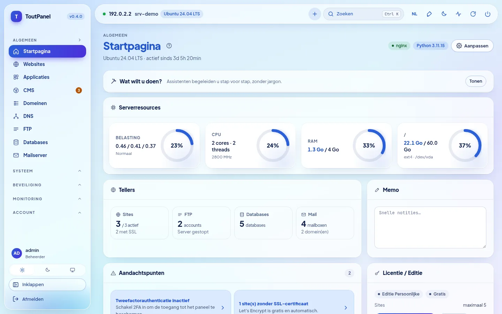

---

## Wat is ToutPanel?

ToutPanel verandert een vers geïnstalleerde server in een **complete webhostingplatform**, bediend vanuit de browser. Eén opdracht installeert de stack (standaard Nginx, PHP-FPM, MariaDB, Redis of Valkey, Certbot, Fail2ban, of de stack die u zelf samenstelt: profielen, versies, webserver, FTP, mail, DNS, versnellers), het paneel en de bijbehorende service; daarna maakt u met een paar klikken uw sites, databases, mailboxen, DNS-zones en certificaten aan, zonder één configuratiebestand te bewerken.

Het is bedoeld voor wie **zijn eigen sites** host (gratis Persoonlijke editie, zonder sleutel of registratie) en voor **bureaus en hostingproviders** die hosting doorverkopen: reseller- en klantaccounts, plannen en quota, facturatie, white label, multi-server en hoge beschikbaarheid (edities Professioneel en Enterprise).

Uw gegevens blijven **op uw server**: geen externe lettertypen of CDN in de interface, geen enkele aanroep naar de licentieserver zolang er geen licentie is geactiveerd.

**Deze README is bewust volledig en eerlijk.** Elke functie is gemarkeerd als *(experimenteel)* wanneer ze dat is, als **Pro** wanneer ze een betaalde editie vereist, en elke sectie vermeldt wat door de tests **echt is uitgevoerd** en wat alleen met simulaties of helemaal niet is getest. De tabel [Wat echt getest, gesimuleerd of niet getest is](#wat-echt-getest-gesimuleerd-of-niet-getest-is) zet dit samen, en de [Bekende beperkingen](#bekende-beperkingen) noemen de voorbehouden. Is een functie voor u cruciaal, valideer ze dan op een testserver vóór productie.

> **Deze repository bevat geen broncode.** Ze publiceert alleen wat nodig is om het paneel te installeren: de installatieprogramma's `install.sh` en `install.ps1`, het gecompileerde paneel (`dist/`, Python-wheels met alleen bytecode), de release-notities, de licentie en `version.json`.

## Snelle installatie

**Linux** (als `root`, bij voorkeur op een vers geïnstalleerde server). De opdracht bevat `--lang nl`: het installatieprogramma spreekt dan Nederlands (en het paneel start in het Nederlands).

```bash
curl -sSL https://raw.githubusercontent.com/qu3ntin01/toutpanel/main/install.sh | sudo bash -s -- --lang nl
```

**Windows** (PowerShell **als beheerder**; via `iwr | iex` wordt de taal gekozen met de variabele `TOUTPANEL_LANG`):

```powershell
$env:TOUTPANEL_LANG = "nl"
Set-ExecutionPolicy Bypass -Scope Process -Force
iwr -useb https://raw.githubusercontent.com/qu3ntin01/toutpanel/main/install.ps1 | iex
```

Aan het einde toont het script de URL van het paneel (met de **geheime ingang**), het beheerdersaccount en de link naar de **configuratieassistent**. Alles kan ook met opties worden gekozen: stack (`--profile`, `--web`, `--php`, `--db`, `--ftp`, `--mail`, `--dns`, `--accel`…), firewall (`--firewall`), een specifieke versie (`--version`), taal (`--lang`), map (`--home`, standaard `/var/toutpanel`) en een wachtwoord dat niet in de proceslijst verschijnt (`TOUTPANEL_PASSWORD`, `--password-file`, `--password-stdin`). De **[installatieassistent](https://toutpanel.com/installation-assistant)** genereert de opdrachtregel met keuzemenu's. Details, vereisten, poorten en probleemoplossing: [Volledige installatie](#volledige-installatie).

## Overzicht

| | |
|---|---|
| **Systemen** | Linux: Debian 11+, Ubuntu 20.04+, AlmaLinux / Rocky Linux / RHEL / CentOS Stream / Oracle Linux 8+, Fedora, met andere families in een beperkte stack (openSUSE, Arch, Alpine, Amazon Linux…) en een getoond **ondersteuningsniveau** (`toutpanel compat`); Windows 10 / 11, Windows Server 2016 → 2025 (minder beproefd dan Linux) |
| **Webservers** | Nginx, Apache, Nginx + Apache, **Caddy**\*, **OpenLiteSpeed**\* (LSPHP, LSCache), **LiteSpeed Enterprise**\* (commercieel product, tijdens onze tests nooit gestart: zie de [beperkingen](#bekende-beperkingen); `--web litespeed` vereist `--accept-litespeed-license`), IIS (basis); Apache + mod_php *binnenkort* |
| **Softwarestack** | **samensteller**: profielen, versies, schema, hervatbare installatie, werkelijke status; versnellers (OPcache, JIT, Redis / Valkey, Memcached, Varnish\*, Brotli, Zstandard\*, HTTP/3\*) |
| **PHP** | 5.6 tot 8.5 naast elkaar, 138 extensies in de catalogus, één versie per site, `php.ini` en FPM-pool per site |
| **Applicaties** | runtimes Node.js, Python (WSGI / ASGI), Ruby, Go, Java, .NET met versie per site, systemd, PM2, Passenger; Docker en Compose; atomaire Git-deployment |
| **Databases** | MariaDB, MySQL (distributie, of 8.4 / 9.x van Oracle\*), Percona Server\*, PostgreSQL, MongoDB, SQLite, Redis / Memcached per account |
| **FTP, DNS, mail** | FTP: ingebouwd, Pure-FTPd\*, ProFTPD\*, vsftpd\*, alleen SFTP\* · DNS: BIND, PowerDNS, Knot · mail: Postfix + Dovecot, Exim\* · telkens één engine tegelijk, omschakelen met terugdraaien · webmail Roundcube, SnappyMail, SOGo\* |
| **Firewall en beveiliging** | beheerde firewall (nftables, ufw, firewalld, CSF, iptables) **of upstream**, vergrendelingsbeveiliging; Fail2ban; ingebouwde WAF, ModSecurity, ToutWAF; antimalware; isolatie van accounts (**gedeeltelijk equivalent** van CageFS) |
| **CMS** | 595 CMS'en en applicaties in de catalogus (582 geverifieerd: 536 gratis, 46 commercieel), versie naar keuze, gevolgde installaties en updates |
| **Interface** | **interface in 10 talen**, 13 lichte / donkere thema's (**Horizon** standaard), vrije accentkleur, **16 begeleide assistenten**, **Diagnose met 844 controles**, toegankelijkheid gericht op WCAG 2.1 AA (**niet geaudit**) |
| **Documentatie** | geschreven in het Frans; vertaald naar het Engels, Duits, Spaans, Italiaans, Nederlands, Portugees, Russisch, Chinees en Arabisch voor **79 % van de pagina's** (75 van de 94, voor elk van deze 9 talen); de resterende 19 pagina's (sectie Referentie: API, foutcodes, sjablonen… ; pagina's van de Diagnose) blijven in het Frans met een banner; de catalogus van de Diagnose en de API-berichten zijn in alle 10 talen vertaald |
| **Installatieprogramma's** | `install.sh` en `install.ps1` in 10 talen (standaard Engels, `--lang` / `--fr`…, `TOUTPANEL_LANG`, taal van het systeem), stack- en firewallopties, specifieke versie (`--version`), [installatieassistent](https://toutpanel.com/installation-assistant) die de opdracht genereert |
| **Automatisering** | REST-API (1015 OpenAPI-operaties), CLI `toutpanel`, ondertekende webhooks, scripts vóór / na acties, Ansible en Terraform, **Marketplace met 800 integratiemodules** (volwassenheid getoond) |

<sub>\* *experimenteel*: echt, maar minder beproefd of met beperkingen die in de interface en in de [bekende beperkingen](#bekende-beperkingen) worden vermeld.</sub>

## Nieuw in 0.5

**0.5.0** is de **stabiele** versie (branch [`main`](https://github.com/qu3ntin01/toutpanel/tree/main)); ze neemt de pre-releases **0.5.0b1** (sectie **Analytics**) en **0.5.0b2** (**ToutWAF-integratie**, SSL aangestuurd vanuit ToutWAF) over en voegt de **sectie "Webserver" van ToutWAF** en **beveiligingsfixes** na een onafhankelijke review toe. Elke regel zegt wat echt is en wat niet: "nieuw in 0.5" betekent echt en getest, maar minder beproefd dan de functies van 0.4.

| Nieuw | Volwassenheid en voorbehouden |
|---|---|
| **Analytics** (Monitoring › Analytics): **zelf gehoste** bezoekersstatistieken, naar het voorbeeld van Google Analytics — bezoekers online, herkomst van het verkeer, publiek, pagina's, gebeurtenissen, doelen en trechters, technische rapporten, vergelijking van periodes, filters, CSV- / JSON-exports, e-mailrapporten, waarschuwingen, deelbare link met alleen-lezentoegang; **standaard zonder cookies, IP-adres nooit bewaard** | **nieuw in 0.5**: engine en API getest (≈ 560 tests); volledige scenario's in een **echte Chromium** tegen een **echt paneel** (130 bezoekers, 427 paginaweergaven, 54 controles gelijk aan de grondwaarheid); tracker alleen beproefd onder Chromium (Safari en Firefox niet getest); exacte duur en realtime vereisen de tracker, met alleen logboeken krijgt u paginaweergaven; zonder cookies geen terugkerende bezoekers van dag tot dag |
| **Wereldkaart**: 236 landen, zoom, continenten, gegroepeerde steden, geanimeerde aankomsten in realtime, lichte en donkere thema's | **nieuw in 0.5**: vloeiendheid gemeten met softwarematige rendering, **niet op een echte grafische kaart** |
| **DB-IP-geolocatie** geïnstalleerd door het paneel (landen, steden, netwerken; CC BY 4.0, maandelijkse update) | **nieuw in 0.5**: lezer gevalideerd op de **echte** database Landen; databases **Steden en Netwerken** alleen gevalideerd op synthetische bestanden; zonder database zijn de landen "onbekend" |
| **Proxy-variant**: de tracker wordt door de site zelf geserveerd (tegen adblockers) | Nginx en Apache gevalideerd met **echte servers**; Caddy: alleen rendering en syntaxis; **OpenLiteSpeed, LiteSpeed Enterprise, IIS niet ondersteund** (code met de hand te plakken) |
| **ToutWAF-integratie**: aanmaken van sites vanuit ToutWAF (beperkt API-token dat bij het koppelen wordt overhandigd, herhaling zonder dubbelen via `Idempotency-Key`, gepubliceerd schema van het aanmaakformulier), **SSL aangestuurd vanuit ToutWAF** (ToutWAF beëindigt de HTTPS, de SSL-pagina van het paneel beheert de certificaten in ToutWAF), globale schakelaar en schakelaar per server van het cluster, **sectie "Webserver" van ToutWAF** (vooraf gedefinieerd token met beperkt bereik, `GET /api/capabilities`, `GET /api/sites/{id}`, voortgang van taken, `toutpanel waf connect --ssl toutwaf|panel`, `toutpanel waf status`) | **nieuw in 0.5**: getest tegen een **gesimuleerde ToutWAF** die het contract volgt zoals beschreven door de ontwikkelaars (≈ 500 tests); **niets beproefd tegen een echte ToutWAF** (noch de sectie "Webserver", noch het aangestuurde SSL); routes voor vernieuwing, HTTPS-opties en mogelijkheden van de certificaten-API van ToutWAF nog te bevestigen; SSL-interface niet geverifieerd in een browser |
| **Beveiligingsfixes** (onafhankelijke review, twee rondes): uitbreiding van het bereik van een API-token (aanwezig sinds 0.4.0), samengesteld ToutWAF-token, logboeken en TLS-privésleutel van een site, Analytics-gegevens van een verwijderde site, lezen van `X-Forwarded-For`, idempotentie per token, ingestielimieten van Analytics | **echt**: één regressietest per fix; detail en ernst in het [wijzigingslogboek](CHANGELOG.md); review niet uitputtend (validatie van vhost-directives, ReDoS van de parsers niet onderzocht) |
| **Vertalingen**: interface en servermeldingen in de 10 talen, Analytics-pagina van de documentatie in 9 talen | documentatie vertaald voor **79 % van de pagina's** (75 van de 94); de resterende 19 referentiepagina's (catalogi van de Diagnose, foutcodes, API, instellingen, sjablonen) blijven in het Frans |

## Nieuw in 0.4

**0.4.0** is de **vorige stabiele** versie (de versies 0.4.0b1 en 0.4.0b2 waren pre-releases van het kanaal `dev`). Elke functie draagt haar volwassenheid: **stabiel**, **experimenteel** (echt en getest, maar minder beproefd of met aangegeven beperkingen) of **binnenkort** (zichtbaar, grijs weergegeven, nooit gesimuleerd). De rechterkolom zegt wat gereserveerd of beperkt is; het eerlijke detail van elk punt staat in de bijbehorende sectie van de [Functies](#functies).

| Nieuw | Volwassenheid en voorbehouden |
|---|---|
| **Gelijktijdig HTTP en HTTPS** voor het paneel (8888 / 8443, in het begin een zelfondertekend certificaat); Let's Encrypt-certificaat voor het paneel met autoriteit naar keuze, DNS-01, wildcard en **hot reload** | stabiel; getest met Pebble (ACME-testserver), niet met het echte Let's Encrypt |
| **Installatie van een specifieke versie**: `--version X.Y.Z`, `--list-versions`; **map `/var/toutpanel` standaard** | stabiel |
| **Firewall beheerd door het paneel of upstream**, eigen pagina, te openen poorten, **vergrendelingsbeveiliging van 60 s** | stabiel; regels getest met echte nftables / iptables in een privé-netwerknaamruimte |
| **Stack-samensteller**: profielen, versies, architectuurschema, schatting van geheugen / schijfruimte, **eerste-configuratieassistent in 9 stappen**, pagina **Softwarestack** | stabiel |
| **DNS-engines**: BIND, PowerDNS, Knot DNS (omschakelen met migratie van zones en DNSSEC-sleutels, terugdraaien) | stabiel; getest met de echte daemons onder Ubuntu 24.04 |
| **Mail-engines**: Postfix + Dovecot, externe relay, **Exim + Dovecot**; **FTP-engines**: ingebouwd, **Pure-FTPd, ProFTPD, vsftpd, alleen SFTP** | Postfix en ingebouwde FTP: stabiel; Exim en de andere FTP-engines: **experimenteel** |
| **Webservers**: **OpenLiteSpeed** (LSPHP, LSCache), **Caddy**, **LiteSpeed Enterprise** (omschakelen van / naar Nginx, Apache, "beide" met terugdraaien) | **experimenteel**; OpenLiteSpeed en Caddy echt getest onder Ubuntu 24.04; **LiteSpeed Enterprise heeft nooit kunnen starten** (proeflicentie geweigerd), alleen de officiële installatie en de validatie van de configuratie zijn echt uitgevoerd |
| **Versnellers**: OPcache, JIT, APCu, Redis / Valkey, Memcached, FastCGI-cache, Brotli; **Varnish, Zstandard, HTTP/3** (waaronder Nginx van nginx.org, installeerbaar met vangrails) | Varnish, Zstandard, HTTP/3: **experimenteel**; overige: stabiel |
| **Databases**: MariaDB 10.6 → 11.8, **MySQL 8.4 / 9.x** (Oracle-repository), **Percona Server**, PostgreSQL 13 → 18; **databasewachtwoorden versleuteld in rust** | MySQL van Oracle en Percona: **experimenteel** (tijdens onze tests nooit geïnstalleerd of gestart) |
| **Isolatie van accounts**: PHP-FPM-service per account in een eigen cgroup-slice, systemd-hardening, **isolatie van het bestandssysteem** (bind mounts + bubblewrap) | opties, **standaard uitgeschakeld**; **gedeeltelijk equivalent van CageFS** (gedeelde kernel en netwerk); niet getest: SELinux enforcing met deze isolatie (SELinux Enforcing is zonder deze isolatie gevalideerd op AlmaLinux, zie [Beveiliging](#section-12)), cgroup v2 met werkelijk toegepaste limieten, volledige server onder systemd |
| **Runtimes per site** (Node.js, Python, Go, Java, Ruby, .NET), **WSGI / ASGI**, **PM2**, **Passenger** | echt: Node 20, Python 3.12, gunicorn, uvicorn, PM2, Nginx + Passenger; Go, Java, .NET gesimuleerd; Ruby niet gecompileerd |
| **Statistieken**: GoAccess, **AWStats**, Matomo; **staging** met database en synchronisatie in beide richtingen | GoAccess, AWStats en staging (MariaDB) echt getest; Matomo **nooit beproefd** tegen een echte instantie |
| **Back-ups**: AES-256-GCM-versleuteling, native incrementele back-ups, bestemmingen **rsync** en **Borg**, profiel "volledige server", gedeeltelijke back-up / strikte modus, herstelproef | rsync en Borg 1.2.8 echt getest; restic, S3, B2 en rclone **gesimuleerd**; rsync / Borg en restic: **Pro** |
| **Berichtenverkeer**: verzendlimiet van PHP-`mail()`, **DMARC per domein**, **BIMI**, **DANE**, MTA-STS / TLS-RPT, **SpamAssassin**, **SOGo**, wachtrij en CalDAV / CardDAV getest | SOGo **experimenteel** (`sogod` nooit uitgevoerd); VMC-keten van BIMI en DNSSEC-ondertekening niet geverifieerd |
| **Migratie**: volledige **ISPConfig**-import (SSH, archief, SQL-dump), overdracht van een site of domein tussen klanten, **uitgebreide migratie van accounts tussen servers** (mail, FTP, cron, SSL, plan) | **Pro**; cPanel / Plesk / DirectAdmin getest op **nagemaakte** archieven; nooit getest op twee fysieke servers |
| **Hoge beschikbaarheid**: zwevend IP keepalived / VRRP, gedeelde opslag NFS / GlusterFS, Dovecot-replicatie, geschiedenis per node, Zabbix-sjabloon, **uitgebreide automatische reparatie** | **Pro**; configuraties gevalideerd door de echte tools, **geen enkele failover tussen twee machines getest** |
| **Authenticatie**: SSO SAML / OIDC / LDAP getest tegen testproviders, WebAuthn getest met een virtuele authenticator, **verhard TLS**, **waarschuwingen bij ongebruikelijke aanmelding** aan de accounthouder | SSO: **Pro**; geen enkele productie-identiteitsprovider of fysieke sleutel getest |
| **Diagnose** (Systeem › Diagnose): **844 controles**, **90 automatische reparaties** met voorbeeldweergave, **16 begeleide** configuratieassistenten met echte test | planning van de Diagnose: **Pro**; een deel van de controles is getest met gesimuleerde services |
| **Servermeldingen vertaald** in alle 10 talen; **externe ToutWAF**; uitgebreide compatibiliteit met distributies; **meertalig installatieprogramma** met stackopties | stabiel; enkele dynamisch samengestelde berichten blijven in het Frans |
| **Marketplace** met 800 integratiemodules (facturatie, gateways, monitoring, CI/CD, IaC, SSO, DNS / CDN, back-up, thema's…) | **5 stabiel**, 199 bèta, 596 **gegenereerd** (nooit uitgeprobeerd met de echte service) |
| Apache + mod_php | **binnenkort** (netjes geweigerd, nooit gesimuleerd) |

Details en beperkingen: [Bekende beperkingen](#bekende-beperkingen) · [CHANGELOG.md](CHANGELOG.md).

## Functies

Het plan volgt de **20 secties** van een referentiekader voor een compleet hostingpaneel (van het niveau van cPanel / Plesk / ISPConfig / DirectAdmin tot geavanceerde functies), daarna het ecosysteem. In elke sectie zegt de regel "**Echt / beperkingen**" eerlijk wat is uitgevoerd en wat niet. Gedetailleerde documentatie van elke pagina: **[toutpanel.com/docs](https://toutpanel.com/docs/)** (ook door het paneel aangeboden onder `/help/` wanneer ze tijdens de installatie is gebouwd, met contextuele hulp op elke pagina).

<a id="section-1"></a>

### 1. Accounts, gebruikers en multi-tenant

- Hiërarchie **beheerder → reseller (Pro) → klant → subgebruiker**; een reseller ziet en maakt alleen aan wat binnen zijn eigen bereik valt.
- **Fijnmazige RBAC**: rechten per module en per actie, doorsnede van rol, plan, toegangsprofiel en bovenliggende account; ingebouwde profielen **Volledig, Ontwikkelaar, Boekhouder, Webmaster, Alleen-lezen** en aangepaste profielen.
- **Plannen en quota**: schijfruimte, inodes, verkeer, sites, domeinen, databases (en grootte per database), maildomeinen en mailboxen, geplande taken, FTP-accounts, DNS-zones, back-ups, subgebruikers; quota worden geteld en blokkeren bij het aanmaken. Het maandelijkse verkeer schakelt de site niet uit: het zorgt voor een waarschuwing, facturatie van de overschrijding en automatische opschorting als u dat inschakelt.
- **Resourcelimieten per account**: eigen systeemgebruiker, systemd-slice (CPU, geheugen, I/O, processen) toegepast op geplande taken, Git-deployments, applicaties, terminal en Redis- / Memcached-instanties; **alleen op PHP-verzoeken met de isolatie "PHP-FPM-service per account"** (optie, standaard uitgeschakeld). Limiet van gelijktijdige verbindingen per site: **alleen Nginx**.
- **Opschorting** en heractivering, handmatig of automatisch (onbetaald, quota-overschrijding na een respijtperiode).
- **Aanmelden "als"** (impersonatie), vastgelegd in het auditlogboek en beperkt in de tijd.
- **Overdracht** van een site of een domein van de ene klant naar de andere: bestanden, FTP, back-ups, databases, DNS-zones, maildomeinen, geplande taken, staging, Compose-projecten; bestandseigendom, vhost en PHP-FPM-pool opnieuw gegenereerd, quota gecontroleerd, voorbeeldweergave vóór uitvoering.
- **Massaal aanmaken** (tot 500 accounts), **CSV-import / -export** (1.000 regels, bescherming tegen formule-injectie, UTF-8 / UTF-16 / Windows-1252), **interne notities** en filterbare **labels** (tags).

> **Echt / beperkingen**: de hiërarchie, de rechten, de quota, de opschorting en de overdracht worden gedekt door API-tests, en de profielen worden route voor route gecontroleerd. `setquota` (schijf- en inodequota van het bestandssysteem) is alleen met een mock-uitvoerder geverifieerd en veronderstelt een bestandssysteem dat met `usrquota` is gemount. Echte cgroups v2 met toegepaste limieten zijn niet getest. De opschorting van een account op de master wordt niet doorgevoerd naar de spiegelaccounts op de nodes; sites die op een node worden gehost, kunnen niet tussen klanten worden overgedragen.

<a id="section-2"></a>

### 2. Authenticatie en toegang tot het paneel

- **2FA TOTP** met back-upcodes, afdwingbaar per rol of per plan; **WebAuthn- / FIDO2-beveiligingssleutels en passkeys** (inbegrepen in de Persoonlijke editie).
- **Enterprise-SSO (Pro)**: **OpenID Connect** (discovery, PKCE), **SAML** (metadata, replay-bescherming, groep → rol), **LDAP / Active Directory** (LDAPS / StartTLS met **certificaatverificatie standaard**); een SSO-aanmelding kent nooit standaard de beheerdersrol toe.
- **Toegangsbeperking** van het paneel via een whitelist van IP-adressen / CIDR en per land (GeoIP, MaxMind-database zelf aan te leveren), met **weigering om een regel op te slaan die de beheerder zou buitensluiten**.
- **Bescherming tegen brute force**: blijvende blokkering per IP en per account, constante responstijd, zelfgehoste **ALTCHA-captcha** na N mislukte pogingen, Fail2ban-jail van het paneel, waarschuwing bij een reeks mislukte pogingen.
- **Sessies**: lijst, intrekking (ook door de beheerder), absolute vervaltijd en vervaltijd bij inactiviteit.
- **Wachtwoordbeleid**: lengte, tekenklassen, veelvoorkomende woorden, gebruikersnaam, **Have I Been Pwned** met k-anonimiteit (uitschakelbaar), geschiedenis, verloop; **herstel** via een ondertekende link voor eenmalig gebruik.
- **Aanmeldlogboek** en **waarschuwingen bij ongebruikelijke aanmelding** (nieuw IP-adres, nieuw land, nieuw apparaat) naar de beheerder **en de accounthouder** (per account uitschakelbaar, e-mail of sms).
- **Paneel via HTTPS**: gelijktijdig HTTP en HTTPS, in het begin een zelfondertekend certificaat met SAN (opnieuw gegenereerd als het adres verandert), daarna **Let's Encrypt voor de hostnaam van het paneel** (ZeroSSL, Buypass of aangepaste ACME, DNS-01 en wildcard) met hot reload; **geheime ingang** in de URL (zonder die antwoordt het paneel met 404).

> **Echt / beperkingen**: TOTP, blokkering, sessies, wachtwoordbeleid: getest. **WebAuthn**: getest met een virtuele authenticator van Chromium (echte registratie en aanmelding), **niet met een fysieke sleutel**. **OIDC**: getest tegen een echte lokale OIDC-server (PKCE geverifieerd, vervalste tokens geweigerd); **SAML**: getest met een test-identiteitsprovider (31 tests: geldige, verlopen, opnieuw afgespeelde, vervalste assertie…); **LDAP**: getest tegen een echte OpenLDAP (`slapd`); **geen enkele echte identiteitsprovider** (Keycloak, Entra ID, Okta…) is uitgeprobeerd. Het **nieuwe land** wordt gedetecteerd met een echte MaxMind-testdatabase. Let's Encrypt voor het paneel: getest met **Pebble** + certbot 5.8 + BIND, **niet** met de echte dienst. De SAML-bibliotheek (`python3-saml` + `xmlsec1`) is optioneel; het paneel start zonder.

<a id="section-3"></a>

### 3. Web en sitehosting

- **Sites met één klik**: multi-domein, aliassen, **geparkeerde domeinen**, **doorgestuurde** domeinen, **wildcard** (`*.voorbeeld.nl`), PHP-FPM, statisch, reverse proxy, applicaties. Een subdomein is een domeinnaam van de site of een aparte site.
- **Webservers**: vhosts voor **Nginx, Apache, Nginx + Apache, Caddy\*, OpenLiteSpeed\*, LiteSpeed Enterprise\* of IIS**, gegenereerd uit Jinja2-sjablonen en **gevalideerd vóór het herladen** (`nginx -t`, `apachectl -t`, `caddy validate`…), met terugkeer naar de laatste geldige vhosts bij een fout; **omschakelen** Nginx ↔ Apache ↔ "beide" ↔ Caddy ↔ OpenLiteSpeed ↔ LiteSpeed met terugdraaien; functies die een server niet nabootst (ingebouwde WAF, ModSecurity, landfiltering, `.htaccess`…) worden **gemeld**, nooit stilzwijgend genegeerd.
- **PHP met meerdere versies** 5.6 → 8.5 naast elkaar (Sury, PPA ondrej, Remi, windows.php.net), één versie en **één PHP-FPM-pool per site**, onder de gebruiker van het account; **`php.ini` per site** (13 toegestane directives waaronder `disable_functions` en `open_basedir`, gevalideerd tegen injectie), **138 extensies** in de catalogus (beheerd per PHP-versie, beheerder), ionCube, **FPM-parameters** (`pm`, `max_children`, `start_servers`, timeouts, `max_requests`…).
- **Applicatieruntimes**: Node.js, Python (**WSGI / ASGI**: gunicorn, uvicorn, hypercorn, daphne, waitress), Ruby, Go, Java, .NET, met **runtimeversie per site** (officiële downloads geverifieerd met SHA-256, `uv` voor Python, nooit compileren; nvm, pyenv, enz. gedetecteerd), **systemd**-unit, **PM2**, **Phusion Passenger** (Nginx en Apache), proxy naar een poort of een Unix-socket (WebSocket inbegrepen), herladen zonder onderbreking, `toutpanel runtimes`.
- **Reverse proxy** naar een poort of een socket, **load balancing** (round robin, `least_conn`, `ip_hash`).
- **Redirects** 301 / 302 (met of zonder query, reguliere expressies), HTTPS afdwingen, canonieke `www`-host.
- Aangepaste **HTTP-headers** (CSP, X-Frame-Options…) en **HSTS** (instelbare duur, `includeSubDomains`, `preload` met bevestiging en voorafgaande controle).
- **Aangepaste Nginx- / Apache- / Caddy-directives per vhost** (beheerder): schrijven, opnieuw genereren, de server testen, **automatisch herstel** als de server ze weigert.
- Met wachtwoord **beveiligde mappen** (bcrypt) en toegangsregels per IP, aangepaste **foutpagina's**, **hotlink-bescherming**, **onderhoudsmodus** (503 met `Retry-After`, toegestane IP's).
- **HTTP/2**, **HTTP/3 / QUIC\*** (native met Caddy en OpenLiteSpeed; met een voor QUIC gecompileerde Nginx, of Nginx van nginx.org installeerbaar vanaf de pagina Versnellers met simulatie, back-up en terugdraaien; onmogelijk met Apache alleen), **Brotli**-compressie (als de module bestaat), **Gzip**, **Zstandard\***.
- **Cache**: FastCGI-cache (Nginx), **OPcache**, **Redis / Valkey**, **Memcached**, **Varnish\*** (alleen HTTP), LSCache (OpenLiteSpeed en LiteSpeed Enterprise), met **legen vanuit het paneel** (knop "Cache legen" per site en per versneller).
- **Staging (preproductie)**: kloon van een site (bestanden + database), URL-vervanging **zonder wp-cli** (inclusief geserialiseerde PHP-waarden), uitgesloten tabellen, synchronisatie **naar productie, vanuit productie of in beide richtingen** (bestanden: de nieuwste wint; database regel voor regel samengevoegd op primaire sleutel, conflictregel naar keuze, **verwijderingen worden nooit doorgevoerd**), voorafgaande back-up aan beide kanten.
- Configureerbare **hoofdmap van de site** (`public/`, `web/`…), **toegangs- en foutlogboeken per site** live raadpleegbaar en downloadbaar (logrotate-rotatie).
- **Verkeersstatistieken** met drie engines: **GoAccess**, **AWStats**, **Matomo** "voor deze site"; **bandbreedtebewaking** per site, maand per maand.

> **Echt / beperkingen**: Nginx: vhosts geserveerd door een **echte Nginx** en bevraagd met curl (redirects, 401 / 403, hotlink-bescherming, onderhoud, wildcard, foutpagina's). Apache: vhost gevalideerd met `apache2 -t`, **tijdens onze tests nooit echt geserveerd**; Nginx vóór Apache: nooit samen gestart; het omschakelen Nginx / Apache is getest met een mock-uitvoerder en de echte syntaxis van de vhosts. OpenLiteSpeed: een echte OpenLiteSpeed gestart die PHP, statische bestanden, redirects, authenticatie en LSCache serveert. **Caddy**: echte Caddy 2.11 (HTTP, HTTPS, HTTP/2, HTTP/3, PHP-FPM, proxy, herladen zonder onderbreking) onder Ubuntu 24.04; RHEL-familie, echte ACME niet uitgevoerd. **LiteSpeed Enterprise: nooit gestart** (zie [beperkingen](#bekende-beperkingen)). `disable_functions` / `open_basedir`: geverifieerd met een echte PHP-FPM. Installatie van PHP-versies vanuit de repositories: tijdens onze tests niet uitgevoerd (internet). **Runtimes**: echt voor Node 20, Python 3.12, gunicorn, uvicorn, PM2 en Nginx + Passenger; **Go, Java en .NET gesimuleerd**, Ruby niet gecompileerd, systemd-unit van een applicatie niet gestart. **HTTP/3**: echte Nginx 1.31-binary die HTTP/3 serveert aan een QUIC-client; de installatie van het nginx.org-pakket op de machine is niet uitgevoerd. Brotli hangt af van de Nginx-module. Memcached en Varnish (VCL gecompileerd door `varnishd` 7.1): echt uitgevoerd, maar de volledige ingebruikname van Varnish vóór Nginx niet. **GoAccess en AWStats**: echt uitgevoerd; **Matomo: nooit beproefd tegen een echte instantie** (nep-API-server). **Staging**: getest op een echte MariaDB-instantie, het samenvoegen regel voor regel geldt alleen voor MySQL / MariaDB (PostgreSQL en SQLite worden gekopieerd zonder URL-vervanging). HTTP/3 van Apache en de FastCGI-cache van Apache bestaan niet.

<a id="section-4"></a>

### 4. SSL / TLS

- **Let's Encrypt**, **ZeroSSL** (EAB), **Buypass**, aangepaste ACME-server; validatie via **HTTP-01** en **DNS-01** (schrijven van de TXT in BIND / PowerDNS of bij Cloudflare, OVH, Route53), **wildcard**-certificaten, **SAN- / multidomein**-certificaten (alle namen, aliassen en geparkeerde domeinen van de site).
- Dagelijkse **automatische verlenging** met herladen van de betrokken services (webserver, mail, FTP, paneel) en **waarschuwing bij mislukken**; **waarschuwingen vóór het verlopen** na 30 / 14 / 7 / 1 dagen (instelbaar).
- **Import** van commerciële certificaten (CRT, sleutel, keten, **PFX**) en **genereren van een CSR** (RSA / EC, SAN, privésleutel blijft op de server); zelfondertekende certificaten; pagina **Certificaten** met geldigheid, uitgever en vervaldatum van alle certificaten.
- **SSL voor services**: mail (SNI Postfix / Dovecot), FTP / FTPS, paneel, hostnaam.
- **Verhard TLS**: Mozilla-profielen (modern = alleen TLS 1.3, intermediate standaard, oud), gevalideerde aangepaste cipher suites, instelbare **OCSP stapling**, curves en DH ffdhe2048, `ssl_session_tickets off`, HSTS per site.

> **Echt / beperkingen**: getest met **Pebble** (ACME-server van Let's Encrypt), de echte certbot 5.8 en een echte BIND: HTTP-01, DNS-01, wildcard, verlenging, mislukking, EAB. **Er is geen enkele uitgifte bij het echte Let's Encrypt, ZeroSSL of Buypass uitgevoerd.** DNS-01 vereist dat de zone van het domein door het paneel (of een geconfigureerde provider) wordt beheerd. TLS: geverifieerd met een echte Nginx, `openssl s_client` (werkelijk aangeboden protocollen en suites per profiel), een echte OCSP-responder en `apache2 -t`; de aanpassing aan OpenLiteSpeed en Caddy is niet getest; geen post-quantumcryptografie. FTP-certificaten worden niet bewaakt door de vervalwaarschuwingen.

<a id="section-5"></a>

### 5. DNS

- Zones geserveerd door **BIND, PowerDNS of Knot DNS** (telkens één lokale server tegelijk; omschakelen met migratie van zones en DNSSEC-sleutels, terugdraaien) of doorgezet naar een provider.
- **14 recordtypen**: A, AAAA, CNAME, MX, TXT, SRV, NS, CAA, PTR, TLSA, DS, SSHFP, HTTPS, SVCB, met fijnmazige validatie; **zonesjablonen** toegepast bij het aanmaken (variabelen `{domain}`, `{ip}`, `{mail}`…).
- **DNSSEC**: automatische ondertekening (BIND `dnssec-policy`, Knot KASP, PowerDNS), DS en DNSKEY getoond voor de registrar, handmatige rotatie (BIND, Knot; **PowerDNS: rotatie buiten het paneel**).
- **Secundaire servers** via TSIG (AXFR + NOTIFY), automatisch op de nodes van het park (**Pro**).
- **Externe providers** via API: **Cloudflare, OVH, Route 53, PowerDNS** (zones doorzetten en importeren); externe zones: lijst, export (BIND, CSV, JSON) en **propagatiecontrole met `dig`**.
- **BIND-import / -export**, TTL per record en per zone, **automatische serienummers** (`JJJJMMDDnn`), **reverse DNS (PTR)** van de IP's van de server, **propagatiecontrole** (1.1.1.1, 8.8.8.8, 9.9.9.9 en lokale server) en validatie van de syntaxis (`named-checkzone` vóór het herladen).
- **Automatische mailrecords**: MX, SPF, DKIM, DMARC, SRV IMAP / SMTP / POP3, `autoconfig` / `autodiscover`, MTA-STS, TLS-RPT, CalDAV / CardDAV; IPv6, internationale namen (IDN), mailhost buiten de zone.

> **Echt / beperkingen**: echte BIND, PowerDNS en Knot (`named-checkzone`, `dig`, omschakelcyclus BIND → PowerDNS → Knot die dezelfde DS behoudt). De **API's van Cloudflare, OVH, Route 53 en PowerDNS zijn met een gesimuleerd transport getest**, nooit met de echte diensten. Het **cluster van secundaire servers** heeft nooit met twee echte DNS-servers gedraaid. De PTR is alleen effectief als het adresblok aan u is gedelegeerd: het paneel kan dit niet bij uw provider aanvragen. De propagatiecontrole controleert de typen PTR, TLSA, DS, SSHFP, HTTPS en SVCB niet.

<a id="section-6"></a>

### 6. E-mail

- **Postfix + Dovecot + OpenDKIM**, Rspamd of SpamAssassin, **Exim + Dovecot\*** naar keuze (subset van Postfix, aangegeven beperkingen), externe relay; domeinen, **mailboxen met quota**, **aliassen**, **doorsturingen**, **catch-all-adres**, **mailinglijsten** (mlmmj), **autoresponder met datumbereik**, **Sieve-filters** (begeleide regels of script, ManageSieve), IMAP / POP3 via TLS, submission 587 / 465.
- **Webmail** Roundcube, SnappyMail of **SOGo\*** met één klik geïnstalleerd, met **rechtstreekse aanmelding vanuit het paneel**.
- **SPF, DKIM** (genereren, **rotatie met dubbele publicatie**), **DMARC per domein** (`none` / `quarantine` / `reject`, `pct`, `rua`, `ruf`, `sp`, `adkim`, `aspf`, `fo`, **begeleide opbouw**), **MTA-STS** en **TLS-RPT**, **BIMI** (SVG-logo gehost door het paneel, alleen gepubliceerd met een afdwingend DMARC op 100 %), **DANE** (TLSA `3 1 1` voor de mailpoorten, **rotatie in twee stappen**).
- **Antispam** Rspamd (instellingen per domein en per mailbox, leren van spam / ham) of aangestuurde **SpamAssassin** (spamd, `spamass-milter`, `user_prefs` per mailbox; amavis experimenteel), **ClamAV-antivirus**, **greylisting**, **RBL / DNSBL**, globale **whitelists en blacklists**, per domein of per mailbox.
- **Beperking van het verzendvolume**: per mailbox, per plan en standaard (geauthenticeerde SMTP-gebruiker, via Rspamd) **en limiet van PHP-`mail()` per site en per account** (`sendmail`-envelop van het paneel: logboek, plafonds over 1 u en 24 u, waarschuwing, bescherming tegen header-injectie) zodat een gehackte site niet spamt.
- **Uitgaande relay / smarthost**, **wachtrij** (flush, opschorten, verwijderen), **logboek en tracering van een bericht**, **autoconfiguratie** van clients (Outlook, Thunderbird), **fetchmail**, **CalDAV / CardDAV** (Radicale), **bewaking van de IP-reputatie** (blacklists, op alle publieke adressen van de server en de uitgaande IP's van de nodes).

> **Echt / beperkingen**: de wachtrij is getest met een **echte Postfix**; Dovecot: configuratie gevalideerd met `doveconf`; CalDAV / CardDAV: **echte Radicale 3.8**; SpamAssassin: echte `spamassassin --lint`, `spamd` en `spamc`; PHP-`mail()`: envelop echt uitgevoerd met de echte `mail()` van PHP. **Gesimuleerd**: Rspamd, ClamAV, mlmmj, fetchmail, de koppelingen `spamass-milter` / amavis; **SOGo: experimenteel, `sogod` nooit uitgevoerd**. BIMI: de **keten van het VMC-certificaat wordt niet geverifieerd**; DANE: de DNSSEC-ondertekening wordt niet geverifieerd (DANE heeft alleen zin met DNSSEC). De limiet van PHP-`mail()` **ziet geen** script dat rechtstreeks `sendmail` aanroept of een SMTP-verbinding opent. Met Exim: geen berichttracering en geen mailinglijsten; met SpamAssassin: geen verzendlimiet per mailbox en geen greylisting. Ontvangen DMARC-rapporten worden niet geanalyseerd. De automatische DNS-publicatie veronderstelt dat de zone door het paneel wordt beheerd. Een betrouwbare mailserver veronderstelt een vast publiek IP, een correct reverse DNS en geopende poorten 25 / 465 / 587.

<a id="section-7"></a>

### 7. Databases

- **MariaDB (10.6 → 11.8), MySQL, Percona Server\*, PostgreSQL (13 → 18), MongoDB, SQLite**: databases, gebruikers en **privileges** (volledig, alleen-lezen, aangepast), **externe toegang toegestaan per IP** (firewallregel, `bind-address`, `pg_hba.conf`; `0.0.0.0/0` geweigerd).
- **Adminer** (MySQL en PostgreSQL) en **phpMyAdmin** (MySQL) installeerbaar in versies naar keuze met gecontroleerde PHP-compatibiliteit, **eenmalige aanmelding (SSO) vanuit het paneel**; **pgAdmin is niet geïntegreerd**.
- **Import / export** (gzip on-the-fly), **geplande dump** (geplande taak), **onderhoud** (controle, reparatie, optimalisatie, analyse), **groottequota** per database (privileges ingetrokken en daarna hersteld, waarschuwing).
- **Keuze van de DBMS-versie** (officiële repositories van MariaDB en PostgreSQL, wijziging van de hoofdversie met **voorafgaande back-up**, geen downgrade); MySQL 8.4 / 9.x (Oracle-repository) en Percona\*: telkens één engine van de MySQL-familie tegelijk.
- **Extra servers** (Docker), **Redis / Memcached per account** (geïsoleerde instantie, Unix-socket, `maxmemory` van het plan, cgroup-slice van het account).
- **Replicatie (Pro)**: MariaDB / MySQL (GTID) en PostgreSQL (streaming), opdrachtenassistent **en** door het paneel uitgevoerde replicatie, handmatige promotie of **automatische failover** met herschrijven van de host van de databases.
- **Databasewachtwoorden versleuteld in rust** (Fernet, sleutel van het paneel meegenomen in de back-up), lijsten zonder wachtwoord, **expliciete en gelogde onthulling**.

> **Echt / beperkingen**: SQLite: echt. **MariaDB**: een echte instantie dient voor de tests van staging en van de Diagnose, maar de SQL-beheerlaag (gebruikers, privileges, quota) is vooral getest met een **gesimuleerde SQL-uitvoerder**; **PostgreSQL: gesimuleerd**; MongoDB (optionele module `pymongo`): getest met een nepclient en, als het image aanwezig is, een echte `mongod` 7 in Docker. MySQL van Oracle en Percona: pakketten en repositories geverifieerd, **nooit geïnstalleerd of gestart**. De replicatie is **nooit tussen twee echte servers opgezet**, en de automatische failover is geen consensus. De **root-inloggegevens van de engines worden onversleuteld opgeslagen in `settings.json`** (rechten 0600); `mongodump` toont het wachtwoord als opdrachtargument.

<a id="section-8"></a>

### 8. Bestanden en toegang

- **Bestandsbeheer**: upload, **CodeMirror-editor** met syntaxiskleuring, rechten (`chmod`) en eigenaar (`chown`), zip- / tar-archieven, **zoeken** op naam en in de inhoud, **prullenbak**, **schijf- en inodegebruik per map**, slepen en neerzetten, **rechten en eigenaar met één klik herstellen**.
- **Ingebouwde FTP- / FTPS-server** (meerdere accounts, beperkte map, rechten, quota, toegestane IP's, logboek) of **Pure-FTPd\*, ProFTPD\*, vsftpd\*, alleen SFTP\*** (accounts van het paneel gesynchroniseerd, omschakelen met terugdraaien).
- **SFTP / SSH in een chroot per gebruiker** (`sshd`-drop-in gevalideerd met `sshd -t` met terugdraaien, bind mounts), **beperkte shell** via jailkit of `rbash`, **SSH-sleutels** (ed25519, ECDSA, RSA ≥ 2048).
- **Webterminal** (bash onder Linux, PowerShell onder Windows; een klant blijft onder de gebruiker van zijn account).
- **Schijf- en inodequota** per account, **WebDAV** met de FTP-accounts.

> **Echt / beperkingen**: FTPS: **echte handshake** met gevalideerd certificaat; terminal: echte bash in PTY; jailkit: echte `jk_init` / `jk_jailuser` en echte opgesloten shell wanneer jailkit is geïnstalleerd; WebDAV: echte `wsgidav` (optionele modules `wsgidav` + `a2wsgi`). Alternatieve FTP-engines: echt uitgevoerd onder Ubuntu 24.04, **RHEL-familie niet beproefd**. Echte `sshd` nooit opnieuw gestart door de tests; `setquota`: zie sectie 1. De Windows-terminal is vereenvoudigd zonder de module `pywinpty`.

<a id="section-9"></a>

### 9. Applicaties en deployment

- **Installatieprogramma met één klik**: catalogus van **595 CMS'en en applicaties** (zie [CMS](#cms)), waaronder WordPress, Joomla, Drupal, PrestaShop, Nextcloud, Laravel, Symfony, Matomo, Dolibarr, Moodle, phpBB, MediaWiki, Ghost.
- **WP Toolkit**: wp-cli, updates van de core, van plug-ins en van thema's, hardening, klonen, **detectie van kwetsbare installaties** (Wordfence Intelligence-feed), kritieke waarschuwing.
- **Git-deployment**: clone en update (HTTPS met token of SSH met deploy key per site), branch, tag of commit, **ondertekende GitHub- / GitLab-webhooks**, **post-deploymentscripts**, geplande verversing, **atomaire deployment** (`releases/`, `shared/`, link `current`, terugdraaien).
- **Composer, npm, pip** gestart vanuit een site (whitelist `install` / `ci` / `update`, onder de gebruiker van het account).
- **Docker**: containers, images, **netwerken, volumes**, schijfruimte en opruimen, gevalideerde `docker run`, **Docker Compose**-projecten per account met proxysite en weigering van gevaarlijke YAML (privileged, socket, gevoelige mounts).
- **Assistenten** "website", "applicatie-installatie", "Git-deployment", "PHP" (zie [sectie 19](#section-19)).

> **Echt / beperkingen**: Git: echte `git` op een lokale repository (clone, update, ondertekende webhook, atomaire deployment op een echt bestandssysteem); **echte GitHub en GitLab nooit benaderd**. Echte `npm` en `pip` onder de gebruiker van de site; Composer: niet uitgevoerd (geen phar in de testomgeving). Docker: containers, images, netwerken en volumes getest met een mock-uitvoerder en, wanneer een daemon antwoordt, een echte Docker-cyclus. **CMS-installaties: gesimuleerde downloads** (geen enkele echte catalogusinstallatie van begin tot eind uitgevoerd door de automatische suite); echte WordPress / wp-cli niet uitgevoerd door de tests, behalve Matomo dat van begin tot eind door de assistent "applicatie" is geïnstalleerd.

<a id="section-10"></a>

### 10. Geplande taken

- **Visuele editor** veld voor veld en **ruwe cron-syntaxis** gesynchroniseerd, voorbeeld van de volgende 5 uitvoeringen, snelkoppelingen (`@daily`…), typen: een adres bezoeken, een opdracht uitvoeren, een site of een database back-uppen.
- **Uitvoering onder de gebruiker van het account of van de site, nooit als root** voor een klant: de opdracht wordt **geweigerd** in plaats van als root uitgevoerd; `root` is voorbehouden aan de beheerder, met bevestiging en vermelding in het auditlogboek; cgroup-limieten van het account toegepast.
- **Planner** naar keuze: intern (APScheduler, standaard), **systemd-timers** (`OnCalendar`, `Persistent=true`) of `/etc/cron.d`, met omkeerbaar terugdraaien.
- **E-mailmelding** (nooit / bij fout / altijd), **uitvoeringsgeschiedenis** (status, duur, code, begin van de uitvoer), **door het plan afgedwongen minimale frequentie**, onmiddellijke uitvoering, **assistent** met proefrun.

> **Echt / beperkingen**: de vergelijking met de echte `systemd-analyze calendar` (18 expressies) en `systemd-analyze verify` zijn echt; **een systemd-timer is nooit echt afgegaan**. Met de interne planner **draaien de taken niet wanneer het paneel is gestopt** (inhalen van minder dan 5 minuten bij het herstarten); er is geen import van een bestaande crontab. Onder Windows worden taken van klanten geweigerd.

<a id="section-11"></a>

### 11. Back-ups en herstel

- **Granulariteit**: site, database, map of bestand, mailbox, maildomein, account, **hele server**; back-up op verzoek en **planningen** met **GFS**-retentie (dagelijks, wekelijks, maandelijks).
- **Native engine (zip), inbegrepen in alle edities**: archieven met SHA-256-som en CRC-controle, optionele **AES-256-GCM-versleuteling** (wachtzin, standaard, per bestemming, per planning of per back-up), **incrementele back-ups** (een volledige en daarna incrementele, herstel van de staat van elke back-up, retentie die ketens behoudt). Bestemming: lokale map.
- **Externe bestemmingen (Pro)**: **rsync** (map of SSH, harde links `--link-dest` of versleutelbare archieven), **Borg** (versleuteld, gededupliceerd, lokaal of SSH), **restic** (versleuteld, gededupliceerd: S3 en compatibele, SFTP, Backblaze B2, en via rclone FTP / Google Drive / OneDrive / Dropbox / WebDAV). Geheimen versleuteld in de database, nooit teruggegeven door de API.
- **Profiel "Volledige server (inclusief configuratie)"**: gegenereerde vhosts, PHP-FPM-pools, certificaten en sleutels, DKIM, mail, DNS, FTP, crontabs, firewallregels en gegevens van het paneel; **versleuteld archief verplicht**, **begeleid herstel** op een nieuwe server (simulatie, vervangen bestanden bewaard als `.pre-restore-…`, services herladen). Bevat **noch het systeem, noch de pakketten, noch de bestandseigenaren**.
- **Granulair herstel** (het archief doorbladeren, bestanden kiezen, ter plaatse of in een map) en **self-service door de klant**, met gecontroleerd bereik; **automatische veiligheidsback-ups** vóór een risicovolle bewerking (herstel, verwijdering, installatie, update van een DBMS).
- **Een mislukte database-dump wordt niet genegeerd**: "gedeeltelijke" back-up gemeld (badge, waarschuwing) of geweigerd in **strikte modus**; **integriteitscontrole** (SHA-256, CRC, `restic check`), **herstelproef** (dumps opnieuw geïmporteerd in een tijdelijke database, steekproef van bestanden gecontroleerd met een som) en **wekelijks rapport** (standaard uitgeschakeld), **waarschuwingen bij mislukken**.
- Optionele **snapshots** van Btrfs, ZFS of LVM om het lezen tijdens een back-up te bevriezen.

> **Echt / beperkingen**: native archieven, versleuteling, incrementele ketens, profiel volledige server: echt uitgevoerd; **rsync** (lokale map en SSH via een tijdelijke `sshd`) en **Borg 1.2.8** (lokaal en SSH): echt, **nooit naar een echte externe server**; Borg 2.x niet getest. **restic, S3, Backblaze B2 en rclone: opdrachten gegenereerd en geverifieerd met een mock-uitvoerder, nooit uitgevoerd tegen een echte repository of dienst.** Snapshots ZFS / LVM / Btrfs en herstelproef MySQL / PostgreSQL: gesimuleerde uitvoerder of DBMS; `zfs send` is niet geïmplementeerd. De **bestandsnaam van het versleutelde archief is onversleuteld** (doel en datum); rsync "tree" plaatst **onversleutelde** bestanden; een verloren wachtzin maakt de archieven onleesbaar. De volledige server past de firewall niet automatisch opnieuw toe. Externe back-ups, restic, Borg en rsync vereisen de editie **Pro**; niet te verwarren met de rsync- / lsyncd-synchronisatie van de hoge beschikbaarheid, die geen back-upbestemming is.

<a id="section-12"></a>

### 12. Serverbeveiliging en isolatie

- **Firewall** nftables, firewalld, UFW, CSF of iptables (automatische detectie) **beheerd door ToutPanel of upstream** (cloud-beveiligingsgroep, firewall van de hostingprovider: het paneel raakt dan geen enkele regel aan en toont de **bij de provider te openen poorten**); regels, IP-lijsten, vooraf gedefinieerde services, luisterende poorten en blootstelling, **basisbescherming tegen DDoS** (SYN per IP, verbindingslimiet, detectie van scans), **vergrendelingsbeveiliging van 60 s**: zonder bevestiging wordt de wijziging door de server zelf ongedaan gemaakt.
- **Fail2ban**: jails SSH, Postfix, Dovecot, FTP, paneel en WordPress (`wp-login.php`, `xmlrpc.php`), bans weergegeven, toegevoegd, verwijderd, filtertest.
- **Ingebouwde WAF** (SQL-injecties, XSS, RCE, directory traversal, scanners, bots, snelheid, automatische ban; blokkering per land **Pro**) en **ModSecurity + OWASP CRS** per site, regels per site uitschakelbaar (**Pro**); **ToutWAF**, de WAF / reverse proxy van de ontwikkelaar, aanbevolen engine (**Pro**), lokaal of **extern** op een andere server; **BunkerWeb** en **SafeLine** (Docker) blijven beschikbaar.
- **Antimalware**: ClamAV, Linux Malware Detect, YARA, en **ImunifyAV / Imunify360 als het al is geïnstalleerd** (het paneel installeert het nooit); quarantaine, herstel, geplande scan (Pro). **Rootkitdetectie** (rkhunter, chkrootkit), **integriteit** van systeembestanden (debsums, `rpm -Va`, AIDE) en van bestanden van het paneel.
- **Kwetsbaarheidsscan**: WordPress (Wordfence-feed) en, **buiten WordPress**, de **OSV**-database (Joomla, Drupal, PrestaShop, OpenCart, Laravel, Symfony, TYPO3, Craft CMS, Pimcore, Silverstripe, Grav, Matomo, Django, Flask, Ghost, Strapi…) plus `composer audit`, `npm audit` en `pip-audit` onder de gebruiker van het account.
- **Isolatie van accounts**: een **systeemgebruiker per account**, PHP-FPM-pool per site, **PHP-FPM-service per account in een eigen cgroup-slice** (optie `per-account`, **standaard uitgeschakeld**), **systemd-hardening** (`PrivateTmp`, `ProtectSystem`, `NoNewPrivileges`, systeemaanroepfilter…), **isolatie van het bestandssysteem per account** (bind mounts alleen-lezen, minimale `/etc`, privé `/tmp`, `/proc` en `/run`, bubblewrap voor de shell, de terminal, de taken en de deployments; optie, standaard uitgeschakeld). **Dit is een gedeeltelijk equivalent van CageFS**: de kernel en het netwerk blijven gedeeld (zie de beperkingen).
- **AppArmor** (lokale profielen Nginx, PHP-FPM, BIND) en **SELinux** (contexten en booleans automatisch gedeclareerd op de Red Hat-familie; **gevalideerd in Enforcing op AlmaLinux 9.8 en 10.2**, zie hieronder); **GeoIP-blokkering** van bezoekers (Nginx, **Pro**); **automatische beveiligingsupdates** (`unattended-upgrades`, `dnf-automatic`) en waarschuwing voor openstaande updates.
- **AlmaLinux-laboratorium (SELinux Enforcing)**: AlmaLinux 9.8 en 10.2 met SELinux Enforcing gevalideerd in een echt QEMU-laboratorium (4 oktober 2026: 69/69 en 68/68 controles, 0 AVC-weigeringen, inclusief herstart; zonder KVM, één enkele node, parcours beperkt tot Nginx + PHP-FPM + MariaDB + Pure-FTPd + Postfix / Dovecot / rspamd + fail2ban + firewalld); Rocky Linux, RHEL, Fedora niet uitgevoerd; Apache, OpenLiteSpeed, Exim, ProFTPD, vsftpd, PostgreSQL, multi-server, ToutWAF, Docker en de PHP-FPM-isolatie per account met SELinux niet gedekt. Het laboratorium vond, en liet herstellen, **13 defecten specifiek voor de RHEL-familie**, waaronder: de context van het DH-bestand van Nginx (Nginx werd niet meer herladen zodra een certificaat was geplaatst); `/var/vmail`, aangemaakt na de declaratie van de context zonder `restorecon` (Dovecot kon niet schrijven, mail bleef in de wachtrij); de logboeken van het paneel onleesbaar voor fail2ban (de service startte niet meer na een herstart van de machine); `semanage` dat `/run/toutpanel-fpm` weigerde (equivalentie `/run` = `/var/run`); een declaratie van de contexten per patroon in plaats van **één enkele `semanage import`-transactie** (vijf minuten in emulatie); Dovecot en OpenDKIM niet geactiveerd bij het opstarten; rspamd ontbrak in AlmaLinux en EPEL (repository `rspamd.com` toegevoegd); Postfix zonder Berkeley DB op AlmaLinux 10 (`lmdb`-tabellen in plaats van `hash`); `firewalld` ontbrak in cloud-images (geïnstalleerd met `--firewall on`). Detail: sectie SELinux van de pagina [Installatie onder Linux](https://toutpanel.com/docs/installation/linux/#selinux-alma-rocky-rhel-fedora) van de documentatie.
- **Verzegeld auditlogboek** (geketende HMAC, dagelijkse ankers, ondertekende export) van alle acties: wie, wat, wanneer, vanaf welk IP-adres; kaart "Aanbevelingen" op de pagina Beveiliging.

> **Echt / beperkingen**: regels en anti-DDoS-script gevalideerd met `nft -c`, firewall getest met echte nftables en iptables in een **privé-netwerknaamruimte**; echte `apparmor_parser`; **isolatie** getest met echte processen onder voor de test aangemaakte systeemgebruikers, een echte PHP-FPM en een gegenereerde unit gestart door een **echte systemd** (in een naamruimte); `disable_functions` / `open_basedir` geverifieerd met een echte PHP-FPM; WAF: echte configuratietest (`nginx -t`, normaal verzoek 200, vier nepaanvallen geblokkeerd met 403). **Gesimuleerd**: Fail2ban, firewalld, CSF, ClamAV, rkhunter, automatische updates, ImunifyAV (gesimuleerde CLI), SELinux-opdrachten van de unittests (mock-uitvoerder; ze worden alleen in het AlmaLinux-laboratorium hierboven echt uitgevoerd). **Niet getest**: **SELinux in enforcing-modus met de isolatie en de PHP-FPM-isolatie per account**, Rocky Linux, RHEL en Fedora, **echte cgroups v2 met toegepaste limieten**, een hele server onder echte systemd, ToutWAF (console, extern), BunkerWeb en SafeLine. **Grenzen van de isolatie**: gedeelde kernel (een kernelkwetsbaarheid omzeilt alles), netwerk niet per account gefilterd, `open_basedir` beperkt de door PHP gestarte opdrachten niet, databases bereikbaar met de inloggegevens van de site; geen service per account en geen isolatie onder Windows en OpenLiteSpeed. De **ingebouwde WAF analyseert de body van POST-verzoeken niet**; GeoIP-blokkering vereist de module `geoip2` en een MaxMind-database, en werkt alleen op HTTP-niveau. ModSecurity wordt onder OpenLiteSpeed niet toegepast. De OSV-scans hangen af van toegang tot `api.osv.dev` (uitschakelbaar).

<a id="section-13"></a>

### 13. Monitoring en waarschuwingen

- **Aanpasbaar dashboard**: **23 widgets** (CPU, RAM, schijven, I/O, load, netwerk, services, quota, memo, back-ups, tickets…), indeling opgeslagen per gebruiker; **historische monitoring** van de server (meting elke 60 s, 7 dagen) en **per account** (CPU, geheugen, processen), **geschiedenis per node** van het park, verbruikende processen gegroepeerd per account.
- **Status van de services** met **automatische herstart** bij een crash (beveiliging tegen lussen, opzettelijke stops gerespecteerd), start bij het opstarten.
- **Uptime**: HTTP(S)-probes met verwachte code en **trefwoord**, statistieken 24 u / 30 d, incidenten, waarschuwing en daarna herstel; 3 probes in de Persoonlijke editie.
- **Waarschuwingen**: schijf vol, quota bereikt, service gestopt, certificaat dat verloopt, **IP op blacklist**, back-up mislukt, deployment mislukt, ongebruikelijke aanmelding, failover van hoge beschikbaarheid, geblokkeerde PHP-verzendingen…; **kanalen**: e-mail, **sms** (Twilio, OVHcloud, Brevo), **Telegram** (officiële of zelfgehoste Bot API), webhooks **Slack, Discord, Microsoft Teams** of generiek JSON met gebeurtenisfilter; kopie van de waarschuwingen aan de accounthouder.
- **Analytics**: bezoekersstatistieken van sites (bezoekers online, herkomst, publiek, wereldkaart, pagina's, gebeurtenissen, doelen, trechters, technische rapporten), standaard zonder cookies en zonder IP-adres te bewaren; bronnen: toegangslogboeken en JavaScript-tracker; DB-IP-geolocatie; exports, e-mailrapporten, waarschuwingen, delen (**nieuw in 0.5**, zie [Nieuw in 0.5](#nieuw-in-05)).
- **Logviewer** (paneel, sites, webservers, MySQL, systeem, mail, Let's Encrypt, `journalctl -u`), live volgen en zoeken.
- **Prometheus-export** `/metrics` (**Pro**), downloadbaar **Grafana-dashboard** en **Zabbix-sjabloon** (6.0 en 7.0, YAML of JSON), `UserParameter`-bestand.

> **Echt / beperkingen**: het verzenden van e-mail (SMTP, STARTTLS, authenticatie) is getest tegen een **echte lokale SMTP-server**; Telegram, Slack, Discord, sms: **gesimuleerd HTTP-endpoint**, geen enkel echt bericht verzonden. Het **Zabbix-sjabloon is niet in een echte Zabbix geïmporteerd**; het Grafana-dashboard is niet in een echte Grafana geïmporteerd. Waarschuwingen worden alleen verzonden als ten minste één kanaal is geconfigureerd. Uptime: alleen HTTP (geen TCP- of ping-probe). De lijst van bewaakte services is vast.

<a id="section-14"></a>

### 14. Serverbeheer

- **Services**: starten, stoppen, herstarten, herladen, activeren bij het opstarten; **systeemupdates** (apt, dnf / yum, pacman, apk, zypper: beveiliging, automatisch, herstart vereist, geschiedenis); **update van het paneel** per kanaal stabiel / dev / aangepast met voorafgaande back-up, gezondheidscontrole en **automatisch terugdraaien**.
- **IP-adressen**: inventaris IPv4 / IPv6, blijvende extra IP's (netplan, NetworkManager, ifupdown), dedicated IP's per site of per account, gedeelde IP's; **hostnaam, NTP, tijdzone, swap**.
- **Keuze en omschakeling van componenten**: webserver (Nginx, Apache, beide, Caddy\*, OpenLiteSpeed\*, LiteSpeed Enterprise\*), PHP-versie, DBMS-versie, DNS-, mail- en FTP-engines, versnellers: allemaal met terugdraaien.
- **Taakwachtrij** van het paneel (prioriteit, gelijktijdigheid, annuleren, opnieuw starten, opschonen), **automatische reparatie** (ongeldige vhosts en PHP-FPM-pools, ontbrekende sockets, gestopte services, verlopen certificaten, hoofdmappen met root als eigenaar; beveiliging van 3 pogingen per uur), **Diagnose** (zie [sectie 19](#section-19)).
- **Multi-server (Pro)**: een **hoofdpaneel (master)** stuurt aparte web-, mail-, DNS- en database-**nodes** aan (inschrijving via token, vastgepind certificaat, spiegelaccounts, per rol gerouteerde resources, doorgegeven bewerkingen).

> **Echt / beperkingen**: het omschakelen Nginx / Apache / "beide" start en stopt de services echt in de volgorde die de poorten vrijgeeft, maar is alleen getest met een mock-uitvoerder en de echte syntaxis van de vhosts; de updates van het systeem en van het paneel zijn getest met `apt` in leesmodus, gesimuleerde git / pip, **geen enkele echte update vanuit de publieke repository**; de netwerkopdrachten (`ip addr add`) zijn niet uitgevoerd. Multi-server is getest met **gesimuleerde nodes in hetzelfde proces**, **nooit tussen twee echte machines**. Het opnieuw starten van een taak bestaat alleen in het geheugen (verloren bij een herstart van het paneel). De automatische reparatie dekt de mail-, DNS- en databaseconfiguraties niet.

<a id="section-15"></a>

### 15. Hoge beschikbaarheid en schaalbaarheid *(Pro)*

- **Load balancing** tussen webnodes: webgroepen (site aangemaakt op elk lid, frontend als proxysite, gewichten, standby, gezondheidscontrole en waarschuwing).
- **Zwevend IP keepalived / VRRP**: instanties, prioriteiten, `track_script`, virtueel adres, bewaking van de houder en waarschuwing bij failover.
- **Gedeelde opslag**: door het paneel aangemaakte **NFS**-export, client-assistent NFS / **GlusterFS** (gerepliceerd volume, verplichte bevestiging), **CephFS** (alleen mounten); periodieke rsync- of realtime lsyncd-**bestandssynchronisatie**.
- **Databasereplicatie** MariaDB / PostgreSQL met automatische failover; automatische **secundaire DNS** en **secundaire MX**; **gerepliceerde mail** (Dovecot-replicatie).
- **Live accountmigratie** tussen servers (TTL verlaagd, kopie, onderhoud, hersynchronisatie, DNS-omschakeling, relay van de oude site).

> **Echt / beperkingen**: alleen `keepalived -t`, `exportfs`, `doveconf -n`, `nginx -t` en `apache2 -t` worden echt uitgevoerd; **nodes, NFS, GlusterFS, VRRP, Dovecot-replicatie, databasereplicatie: gesimuleerd, nooit getest tussen twee echte machines**. De webgroep heeft een **enkele frontend** (zonder keepalived een single point of failure); het hoofdpaneel (master) blijft **enkelvoudig**; het paneel beheert het **mounten** van Ceph maar maakt geen Ceph-cluster aan; de automatische databasefailover is geen consensus (geef de voorkeur aan Patroni of MaxScale bij hoge eisen); de live migratie kopieert via archieven (geen differentiële rsync) en betreft alleen sites, databases en zones.

<a id="section-16"></a>

### 16. Migratie *(import: Pro; export vrij)*

- **Importers**: **cPanel**, **Plesk**, **DirectAdmin**, **ISPConfig** (SQL-dump `dbispconfig`, archief of **directe SSH-verbinding**, voorbeeld met groottes, filter per klant), **shared hosting** (FTP / FTPS / SFTP en externe `mysqldump`), **IMAP-mailboxen** (imapsync of ingebouwde terugval); voorafgaande inspectie, JSON- en **CSV**-rapport met fouten en incompatibiliteiten, veilige extractie van archieven (anti zip-slip, decompressiebommen).
- **Accountoverdracht tussen servers van hetzelfde paneel**: sites, databases, DNS-zones, **maildomeinen** (mailboxen, DKIM-sleutels, berichten), FTP-accounts, geplande taken, certificaten, siteinstellingen, plan en limieten; geschatte grootte, **proefrun**, **hervatten** na mislukking, **SHA-256-integriteitscontrole**, optie om DNS-records bij te werken.

> **Echt / beperkingen**: ISPConfig: getest op een realistische dump en met een echte lokale `sshd`; **cPanel, Plesk en DirectAdmin: getest op nagemaakte archieven** met de volledige structuur, **niet op echte back-ups**; shared hosting en IMAP: **gesimuleerd**; overdracht tussen servers: **nooit getest op twee fysieke servers**. De berichten gaan via een HTTPS-archief (geen rsync / SSH tussen nodes), geïmporteerde FTP-wachtwoorden worden opnieuw gegenereerd en geïmporteerde cron-taken uitgeschakeld, PHP-extensies en "one-click"-applicaties worden niet overgenomen, fetchmail wordt niet gemigreerd, PostgreSQL-databases in het `pg_dump -Ft`-formaat van cPanel worden handmatig overgenomen. Let's Encrypt-certificaten worden gekopieerd als handmatige certificaten: geef ze opnieuw uit na het omschakelen van de DNS.

<a id="section-17"></a>

### 17. API en automatisering

- **REST-API** die de interface dekt (1015 OpenAPI-operaties gemeten op deze versie): **de hele interface steunt erop**; **tokens met scope** (scopes) en **beperking per IP-adres**; **OpenAPI- / Swagger**-documentatie (`/api/docs`, `/api/redoc`, voorbehouden aan de beheerder).
- **Beheer-CLI** `toutpanel`: levenscyclus van het paneel (poort, ingang, wachtwoord, update, licentie, node) en scriptbare bedrijfsopdrachten met `--json` (`site`, `account`, `db`, `mail`, `dns`, `backup`, `cron`, `ftp`, `task`, `stack`, `firewall`, `waf`, `runtimes`, `diag`, `isolation`, `caddy`, `litespeed`…). De CLI dekt niet alles wat de API doet.
- **Ondertekende uitgaande webhooks** (HMAC, nieuwe pogingen, quota) en **gebeurtenissen** (aanmaken of verwijderen van account, site, domein, database, zone, factuur…); **scripts vóór / na acties** (een mislukkend pre-script blokkeert de actie).
- **Ansible, Terraform, OpenTofu, Pulumi, Helm**: infrastructuurmodules van de **Marketplace** (*bèta*: getest tegen een echt demopaneel, niet tegen een productie-infrastructuur); geen eigen Terraform-provider (de generieke REST- of `http`-provider wordt gebruikt).

> **Echt / beperkingen**: parallelle schrijfbewerkingen kunnen op een SQLite-vergrendeling botsen (gebruik `-parallelism=1` met Terraform); enkele routes nemen de aanmaakvelden niet over bij wijzigen. De API-referentie is in het Frans.

<a id="section-18"></a>

### 18. Commercieel, facturatie en doorverkoop *(Pro)*

- **Native facturatie**: plannen, facturen (btw, pro rata, nummering, herinneringen, PDF), betalingen via **Stripe, PayPal, overschrijving**, onbetaalde facturen en **automatische opschorting**, **gebruiksrapporten** en verbruiksgebaseerde facturatie (CSV, overschrijdingsregels op de factuur).
- **Automatische provisioning bij bestelling** (`POST /api/billing/provision` en ondertekende bestelwebhook): account, site, DNS-zone, maildomein en database in één bewerking; rechtstreekse aanmelding (SSO) vanuit het klantenportaal.
- **Integraties**: modules WHMCS, Blesta, HostBill, FOSSBilling, WooCommerce, PrestaShop, Easy Digital Downloads… van de **Marketplace** (zie hieronder).
- **White label** voor resellers: naam, logo (via adres of letter, **geen bestandsupload**), kleuren, voettekst, support, **aangepast domein van het paneel** met Let's Encrypt; aanpasbare **transactionele e-mails** (globale sjablonen van de beheerder); **supporttickets** (bijlagen, interne notities, SLA, resellerbereik); **mededelingen** gericht op rol, plan of account.

> **Echt / beperkingen**: de native facturatie is getest (pro rata, btw, nummering, herinneringen, documenten). **Stripe en PayPal zijn getest met gesimuleerde transporten, nooit tegen de echte diensten**. **WHMCS: module getest tegen een WHMCS-simulator geschreven op basis van de documentatie, nooit in een echte WHMCS**; **Blesta en HostBill: modules alleen getest met nepklassen (bèta), nooit in de echte producten**; ClientExec: alleen structureel. **FOSSBilling, WooCommerce, PrestaShop 8.1.7 en Easy Digital Downloads 3.7.1: modules geïnstalleerd en uitgevoerd in het echte platform.** De **200 betalingsgateways van de Marketplace zijn "gegenereerd"** op basis van de publieke documentatie van elke leverancier: **nooit getest tegen de echte diensten**. De uitgifte van het certificaat van een aangepast domein wordt door de tests niet uitgeoefend; e-mailsjablonen zijn niet per reseller aanpasbaar.

<a id="section-19"></a>

### 19. Gebruikerservaring

- **Responsieve interface** bruikbaar op mobiel (inklapbaar menu, aanraakdoelen); **donkere modus** (licht, donker of systeem); **13 thema's** en vrije accentkleur ([Thema's](#themas)).
- **Meertalig**: **interface in 10 talen** (français, English, español, Deutsch, italiano, português, Nederlands, русский, 中文, العربية met schrift van rechts naar links; 7.614 interfaceteksten); **door de server teruggegeven berichten vertaald** in alle 10 talen (5.372 berichtsjablonen, voor 100 % vertaald in de 9 andere talen volgens de controletool) evenals de **catalogus van de Diagnose**; installatieprogramma's in 10 talen; **documentatie** vertaald voor 79 % van de pagina's (75 van de 94) in elk van de 9 andere talen dan het Frans, Engels inbegrepen.
- **Globaal zoeken** `Ctrl+K` (sites, domeinen, zones, maildomeinen, mailboxen, aliassen, databases, FTP, accounts, taken, back-ups, applicaties) gefilterd op uw rechten; **contextuele hulp** op elke pagina.
- **16 configuratieassistenten** stap voor stap, voor niet-experts: website (domein + SSL + DNS + database + FTP + back-up in één stap), database, FTP-account, gebruiker / klant, e-mail, automatische back-up, geplande taak, Git-deployment, applicatie-installatie, PHP, beveiligingshardening, waarschuwingen, bescherming (WAF), HTTPS, DNS-zone, firewall. Elke assistent legt uit, valideert live, toont **"Dit gaat er gebeurd worden"**, past toe met **terugdraaien** bij mislukken, **test daarna echt** (verbinding, aflevering van een bericht, certificaat, nepaanvallen…) en stelt een automatische reparatie voor.
- **Diagnose** (Systeem › Diagnose): **844 controles** in **15 categorieën** (netwerk, DNS, web, systeem, paneel, mail, back-ups, databases, beveiliging, FTP / SFTP, Docker, geplande taken, applicaties, prestaties, diensten van derden), **90 automatische reparaties** met voorbeeldweergave en bevestiging, **7 profielen** ("Mijn site wordt niet weergegeven", "Mijn e-mails komen niet aan", "De server is traag"…), geschiedenis met vergelijking, export in JSON / CSV / Markdown / HTML; **planning met waarschuwing: Pro**.
- **Hulpmiddelen**: DNS-controle, HTTP-test en headers, SSL-certificaat, ping, traceroute, poorttest, SMTP-test, WHOIS.
- **Toegankelijkheid**: volledig toetsenbord, link naar de inhoud, modale vensters met focusval, ARIA-rollen, aankondigingen voor schermlezers, hoog contrast, `prefers-reduced-motion`. De interface **streeft naar** niveau AA van WCAG 2.1.

> **Echt / beperkingen**: **de WCAG AA-conformiteit is niet aangetoond**: er is geen volledige audit (axe, Lighthouse, schermlezer) uitgevoerd; de tests controleren de aanwezigheid van de attributen in de bronnen en het contrast van de badges. De assistenten worden waar mogelijk met echte diensten getest (echte Postfix / Dovecot in een privéstack, echte `named-checkzone` en `dig`, echte nftables in een privénaamruimte, echt normaal verzoek en nepaanvallen tegen een WAF, echte `git` op een lokale repository); **gesimuleerd**: echte Fail2ban en firewall, automatische updates, installatie van PHP-extensies met `apt`, GitHub, Let's Encrypt-certificaat (lokale test-CA); SFTP / S3 van een back-upassistent niet van begin tot eind getest. De knop "Assistent" verschijnt niet in de koptekst van de pagina Sites (die een eigen aanmaakassistent heeft) noch in die van de Store; de assistenten voor waarschuwingen, beveiliging, WAF en firewall zijn voorbehouden aan de beheerder; de SMTP-test, ping en traceroute van de Diagnose worden weinig door de tests uitgeoefend; enkele dynamisch samengestelde berichten blijven in het Frans; een deel van de Diagnose is getest met gesimuleerde fail2ban, firewall, `apt`, PostgreSQL, MongoDB en systemd.

<a id="section-20"></a>

### 20. Compliance en governance

- **AVG**: **export van de gegevens van een klant** (dossier, sites, database-dumps, Maildir, DNS-zones) als archief, **volledige verwijdering** (opschonen en anonimiseren van facturen, auditlogboeken en aanmeldingen), verwijderverzoek door de klant, **register van verwerkingen** (JSON of Markdown).
- Configureerbare **retentie en rotatie van logboeken** (audit, aanmeldingen, taken, uptime, monitoring, antimalware, webhooks, exports, sitelogboeken, logboek van het paneel).
- **Verzegeld auditlogboek** (geketende HMAC) exporteerbaar en verifieerbaar, met dagelijkse **externe verankering** (append-only-bestand, syslog, webhook: **Pro**); **traceerbaarheid van de toegang van de hostingprovider** tot de gegevens van klanten (gevoelige leesacties gelogd, e-mail aan de klant).
- **Afdwingbaar wachtwoord- en 2FA-beleid**: complexiteitsregels, geschiedenis, verloop; 2FA verplicht per rol of per plan.

> **Echt / beperkingen**: de standaardretentie is **90 dagen** voor audit en aanmeldlogboek: verhoog ze zelf als u 12 maanden moet bewaren; ze dekt alleen de logboeken van het paneel (niet de systeemlogboeken FTP / SSH / mail buiten de logrotate van de sites). **"Gelokaliseerde gegevenshosting": geen technische functie**: het veld "gegevensregio" is een informatieve tekst die in het register wordt overgenomen; het paneel is zelfgehost, dus uw gegevens blijven op uw server, maar niets legt bijvoorbeeld de regio van een externe back-upbestemming vast. "**Onvervalsbaar**" is alleen waar met een externe verankering: een lokale systeembeheerder zou de keten en de lokale ankers kunnen herschrijven. Er is geen instelling "2FA verplicht voor iedereen" met één klik (vink de betrokken rollen aan).

---

### Voorbij de 20 secties

#### Softwarestack, installatieprogramma en configuratieassistent

- **Stack-samensteller**: startprofielen (enkele site, meerdere sites, hostingprovider, hoge prestaties, applicatie, alleen mail, alleen DNS, node, LAMP…) aangepast aan het gedetecteerde geheugen, keuze van webserver, PHP, databases, FTP, mail, DNS, beveiliging, runtimes en tools; **architectuurschema** bij elke keuze bijgewerkt (export SVG / PNG), geheugen en schijfruimte geschat, automatische instellingen evenredig aan het RAM.
- **Dezelfde engines, drie ingangen**: de **configuratieassistent** (9 stappen), de pagina **Instellingen › Softwarestack** (werkelijke status, toevoegen, versie wijzigen) en `toutpanel stack` (ook aangeroepen door het installatieprogramma). **Hervatbare en idempotente** installatie: een mislukte stap wordt nooit als geslaagd geteld; componenten "binnenkort" zijn zichtbaar maar worden geweigerd, zonder simulatie.
- **Versnellers** (eigen pagina): OPcache, JIT, APCu, Redis / Valkey, Memcached, FastCGI-cache, Brotli; **Varnish\***, **Zstandard\***, **HTTP/3\*** met werkelijke status, geheugen, instellingen, "Cache legen" en getoonde beperkingen.
- **Compatibiliteit van distributies** met ondersteuningsniveaus (`toutpanel compat`); **meertalig installatieprogramma** `install.sh` / `install.ps1`.

#### CMS

- **CMS-pagina**: catalogus van **595 CMS'en en webapplicaties**, waarvan **582 geverifieerd** (bron van de versies bevraagd, downloadURL gecontroleerd): **536 gratis** en **46 commercieel**; zoeken, filters per categorie, type (PHP, Node.js, Python, Go, Java, .NET, statisch) en distributie, label "gereed" of "ontbrekende vereisten".
- **Keuze van de versie**: standaard de laatste stabiele, alle gepubliceerde versies (pre-releases op verzoek); fiche met geverifieerde vereisten, bestaande of nieuwe site, submap, automatisch aangemaakte database, beheerdersaccount en taal, live opvolging.
- **Gecentraliseerde installaties**: detectie op alle sites (ook buiten het paneel), geïnstalleerde versie en laatste versie, banner met updates; **back-up**, **update** met voorafgaande back-up en terugdraaien, **Alles bijwerken**, **klonen**, opnieuw installeren, verwijderen, logboek, automatische minor-updates per installatie.
- **Commerciële software**: fiche met uitgever, richtprijs en aankoopinks; installatie vanuit het **door de uitgever geleverde pakket** (upload, pad of privé-URL) en zijn licentiesleutel.
- **Lokaal opzoeken van versies**: het paneel bevraagt zelf de officiële bronnen (wordpress.org, GitHub, Packagist, npm, PyPI, sites van de uitgevers), cache van 6 u, **twee keer per dag** (05:23 en 17:23, instelbaar); waarschuwing via de meldingskanalen.

#### WAF, Store, Marketplace en personalisatie

- **WAF**: zie [sectie 12](#section-12). Engine **ToutWAF** installeerbaar vanuit het paneel met het officiële installatieprogramma (kanaal stabiel of dev, console op `:9443`, synchronisatie van de sites, update met terugdraaien) of bij de installatie (`--waf toutwaf`); **externe ToutWAF**: het paneel verbindt zich met een ToutWAF op een andere server (sites aangemeld via de REST-API, certificaat van de console vastgepind met vingerafdruk, versleuteld token, 80 / 443 beperkt tot alleen ToutWAF).
- **Store** gekoppeld aan de catalogus van toutpanel.com: applicaties, serversoftware (apt, dnf, pacman, apk, zypper, winget), **modules** (gevalideerd manifest, SHA-256 verplicht, hot loading), thema's; upload van een lokale zip, offlinemodus.
- **Marketplace van integraties**: **800 modules** verdeeld over 14 families (betalingsgateways 200, CI/CD 105, monitoring 104, Docker Compose-sjablonen 65, thema's 63, meldingen 61, back-up 43, infrastructure as code 41, SSO 30, automatisering 25, DNS / CDN 24, CMS-extensies 14, facturatie / provisioning 13, registrars 12). **Volwassenheid getoond op elke fiche**: **5 stabiel**, **199 bèta**, **596 gegenereerd** (geschreven op basis van de publieke documentatie van de leverancier, **nooit uitgeprobeerd met de echte dienst**); testniveaus: 187 getest in het echte platform, 141 tegen een simulator, 472 structureel (alleen controles van syntaxis en structuur). 63 modules zijn plug-ins van de Store van het paneel, de overige 737 zijn integraties die op het beoogde platform moeten worden geïnstalleerd (WHMCS, Grafana, n8n, GitHub Actions, Keycloak…).
- **Aanpassing**: 13 thema's, vrije accentkleur, dichtheid, logo, CSS, menulinks, Jinja-sjablonen van de vhosts en van de e-mails, exporteerbaar thema.

## Wat echt getest, gesimuleerd of niet getest is

"Getest" betekent hier uitgevoerd door de automatische testsuite van het project (7.507 verzamelde tests voor deze versie) of door een handmatige controle die in het wijzigingslogboek is beschreven. De tests zijn uitgevoerd onder **Ubuntu 24.04**, op één uitzondering na: het SELinux-laboratorium onder **AlmaLinux 9.8 en 10.2** (zie de laatste regel). Deze tabel vat de bovenstaande secties samen.

| Domein | Echt getest | Gesimuleerd (mock-uitvoerder, nepdienst, gesimuleerd transport) | Niet getest |
|---|---|---|---|
| **Webservers** | echte Nginx die sites serveert (curl); `nginx -t`, `apache2 -t`; echte OpenLiteSpeed; echte Caddy 2.11; echte Nginx 1.31-binary met HTTP/3 | omschakelen Nginx / Apache / "beide" (mock-uitvoerder); Nginx vóór Apache | **LiteSpeed Enterprise nooit gestart**; Apache echt geserveerd; Caddy / OpenLiteSpeed op Red Hat, Fedora, Arch, Alpine, SUSE; echte ACME van Caddy |
| **PHP en applicaties** | echte php-fpm (`-t`, `disable_functions`, `open_basedir`); Node 20, Python 3.12, gunicorn, uvicorn, PM2, Nginx + Passenger; `npm`, `pip` | Go, Java, .NET; installatie van PHP-versies vanuit de repositories; CMS-installaties (downloads) | Ruby (niet gecompileerd); systemd-unit van een gestarte applicatie; WordPress / wp-cli |
| **SSL / TLS** | Pebble + certbot 5.8 + BIND; echte OCSP; `openssl s_client` | — | **echt Let's Encrypt, ZeroSSL, Buypass**; OpenLiteSpeed / Caddy met verhard TLS |
| **DNS** | echte BIND, PowerDNS, Knot; `named-checkzone`, `dig`; omschakelcyclus met DNSSEC | API's van Cloudflare, OVH, Route 53, PowerDNS; cluster van secundaire servers | **twee echte DNS-servers**; echte API's van de providers |
| **Mail** | echte Postfix (wachtrij, privéstack van de assistent); `doveconf`; Radicale 3.8; SpamAssassin / spamd / spamc; PHP-`mail()` | Rspamd, ClamAV, mlmmj, fetchmail; milter- / amavis-koppelingen; Exim | `sogod` (SOGo); VMC-keten van BIMI; DNSSEC-ondertekening voor DANE |
| **Databases** | SQLite; echte MariaDB-instanties (staging, Diagnose); `mongod` 7 onder Docker (indien aanwezig); Adminer / phpMyAdmin met echte PHP | MariaDB- / MySQL-gebruikers en -privileges (gesimuleerde SQL); **PostgreSQL**; replicatie | **MySQL van Oracle en Percona (nooit gestart)**; replicatie tussen twee echte servers |
| **Bestanden en FTP** | echte FTPS-handshake; echte bash in PTY; jailkit; `wsgidav`; alternatieve FTP-engines | `setquota`; echt herladen van `sshd` | Red Hat-familie voor de FTP-engines; volledige Windows-terminal |
| **Back-ups** | versleutelde, incrementele zip, volledige server; **rsync** (lokale SSH); **Borg 1.2.8** | **restic, S3, Backblaze B2, rclone**; Btrfs / ZFS / LVM; herstelproef MySQL / PostgreSQL | **echte restic- of S3-repository**; Borg 2.x; rsync naar een externe server |
| **Beveiliging en isolatie** | `nft -c`; nftables / iptables in een privénaamruimte; `apparmor_parser`; **isolatie** (echte processen, PHP-FPM, systemd 255 in een naamruimte); WAF (normaal verzoek + 4 nepaanvallen); **SELinux Enforcing op AlmaLinux 9.8 en 10.2** (QEMU-laboratorium, met echte fail2ban en firewalld) | Fail2ban, firewalld, CSF, ClamAV, rkhunter, automatische updates; ImunifyAV (gesimuleerde CLI); SELinux-opdrachten (unittests) | **SELinux enforcing met de isolatie en de PHP-FPM-isolatie per account**; **echte cgroups v2 met toegepaste limieten**; hele server onder systemd; ToutWAF, BunkerWeb, SafeLine |
| **Authenticatie** | OIDC (lokale server); SAML (test-IdP, 31 tests); LDAP (echte `slapd`); WebAuthn (virtuele Chromium-authenticator); TOTP, blokkering, sessies | — | **fysieke beveiligingssleutel**; echte identiteitsproviders |
| **Analytics** *(nieuw in 0.5)* | engine en API (≈ 560 tests); echte Chromium tegen een echt paneel (54 controles); tracker op een echte pagina; Proxy met echte Nginx en echte Apache; MMDB-lezer op de echte DB-IP-database Landen | DB-IP-databases Steden en Netwerken (synthetische bestanden); Caddy (alleen rendering en syntaxis) | Safari en Firefox; echte grafische kaart (vloeiendheid van de kaart); OpenLiteSpeed, LiteSpeed Enterprise, IIS (Proxy niet ondersteund) |
| **Monitoring** | lokale SMTP (STARTTLS); `/metrics` | Telegram, Slack, Discord, sms (gesimuleerde HTTP) | import van het Zabbix-sjabloon; import van het Grafana-dashboard |
| **Hoge beschikbaarheid en multi-server** | `keepalived -t`, `exportfs`, `doveconf -n` | nodes, NFS, GlusterFS, VRRP, dsync, databasereplicatie | **twee echte machines** |
| **Migratie** | ISPConfig (dump + echte lokale `sshd`); rsync | cPanel / Plesk / DirectAdmin (nagemaakte archieven); shared hosting; IMAP | echte back-ups van cPanel / Plesk / DirectAdmin; twee fysieke servers |
| **Facturatie en Marketplace** | FOSSBilling, WooCommerce, PrestaShop 8.1.7, Easy Digital Downloads 3.7.1; IaC-modules tegen een echt paneel | Stripe, PayPal; WHMCS-simulator; Blesta / HostBill (nepklassen) | **echte WHMCS, Blesta, HostBill, ClientExec**; **echte betalingsgateways**; echte Matomo |
| **Interface en toegankelijkheid** | Chromium-browser (WebAuthn, SAML, OIDC); node-tests van de componenten | — | **volledige WCAG-audit** (axe, Lighthouse, schermlezer) |
| **Distributies en architecturen** | Ubuntu 24.04 (alle bovenstaande tests, buiten het laboratorium); **AlmaLinux 9.8 en 10.2 met SELinux Enforcing** gevalideerd in een echt QEMU-laboratorium (4 oktober 2026: 69/69 en 68/68 controles, 0 AVC-weigeringen, inclusief herstart; zonder KVM, één enkele node, parcours beperkt tot Nginx + PHP-FPM + MariaDB + Pure-FTPd + Postfix / Dovecot / rspamd + fail2ban + firewalld) | — | **Rocky Linux, RHEL, Fedora** niet uitgevoerd; **Apache, OpenLiteSpeed, Exim, ProFTPD, vsftpd, PostgreSQL, multi-server, ToutWAF, Docker en de PHP-FPM-isolatie per account met SELinux** niet gedekt door het laboratorium; Debian 12 / 13, openSUSE, Arch, Alpine, Amazon Linux, `aarch64`, Windows (minder beproefd dan Linux) |

De suite telt 7.507 verzamelde tests op het moment van schrijven; enkele hangen af van de uitvoeringsvolgorde (gedeelde staat). De markeringen "gesimuleerd" betekenen niet dat de functie onbruikbaar is: de logica en de gegenereerde opdrachten zijn geverifieerd, maar **niet hun uitvoering op de echte dienst**.

## Schermafbeeldingen

De 14 belangrijkste schermen staan hieronder in het Nederlands (`screenshots/nl/`); **de overige schermafbeeldingen zijn in het Frans**. Het [Franse README](README.md) gebruikt overal de Franse, het [Engelse README](README.en.md) die van `screenshots/en/`; de andere vertaalde README's (`README.<taal>.md`, wanneer ze zijn gepubliceerd) gebruiken die van hun eigen taal (`screenshots/<code>/`).

| | |
|---|---|
| 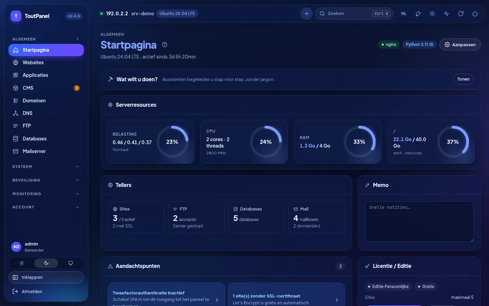<br>**Startpagina, donkere modus**: meters, tellers, aandachtspunten, licentie | 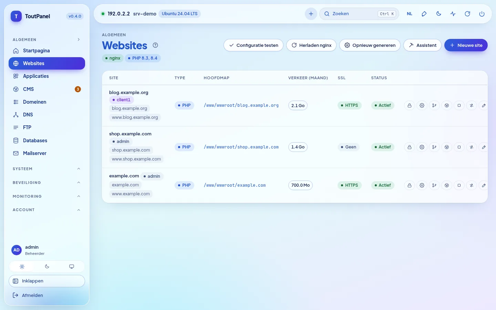<br>**Websites**: domeinen, type, hoofdmap, verkeer, SSL en acties |
| <br>**PHP**: versies 5.6 → 8.5 naast elkaar, ondersteuningsstatus, FPM-pools | <br>**Siteinstellingen**: Git-deployment, SSL, redirects, beveiliging |
| <br>**DNS**: BIND-zones of providers, sjablonen, DNSSEC, cluster | <br>**Certificaten**: geldigheid, uitgever, verlenging, certificaat van het paneel |
| 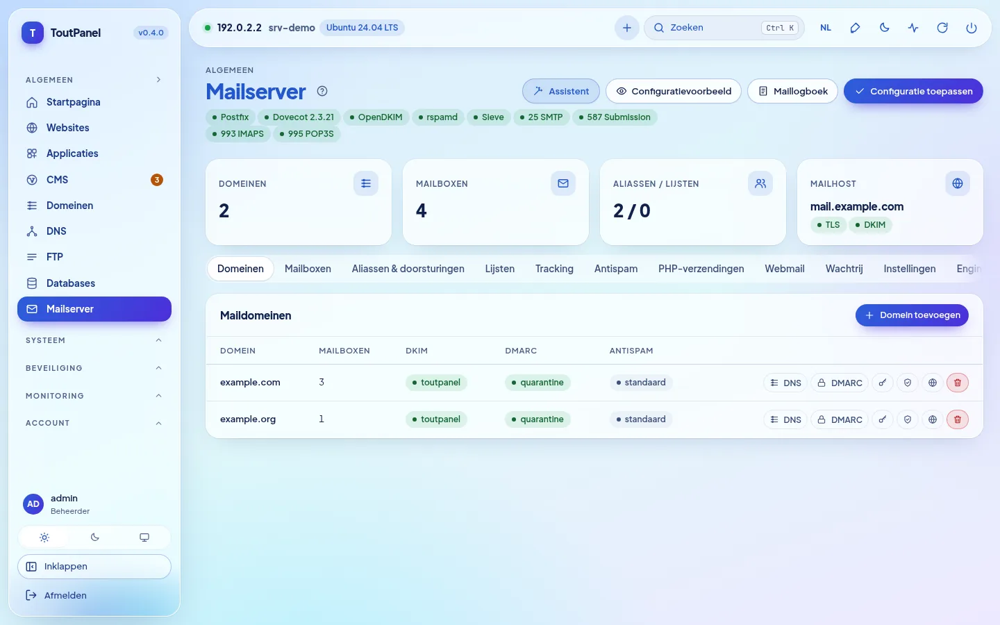<br>**Mailserver**: Postfix, Dovecot, OpenDKIM, poorten en tabbladen | <br>**Webmail**: Roundcube of SnappyMail met één klik geïnstalleerd |
| 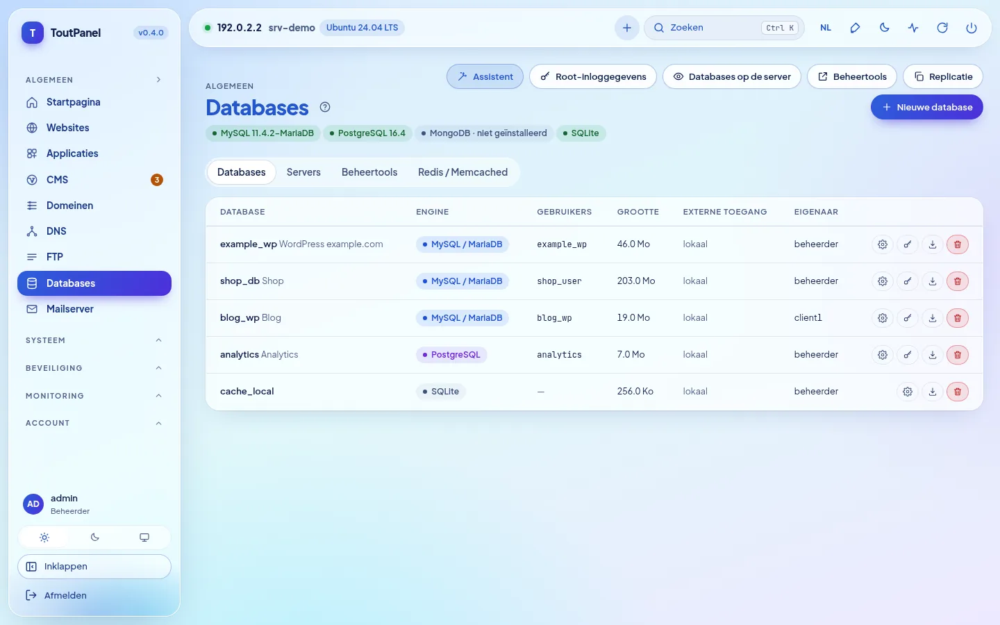<br>**Databases**: MariaDB, PostgreSQL, MongoDB, SQLite, Redis | <br>**Bestanden**: editor, archieven, prullenbak, rechten, gebruik |
| <br>**CMS › Installeren**: 582 geverifieerde CMS'en en applicaties, zoeken, filters, label "gereed" | <br>**Fiche van een CMS**: geverifieerde vereisten, keuze van de versie, doelsite, database |
| <br>**CMS › Installaties**: versies, beschikbare updates, back-up, klonen | <br>**WAF › Engine**: ToutWAF aanbevolen, ingebouwde WAF, BunkerWeb, SafeLine |
| <br>**Terminal**: interactieve bash- / PowerShell-shell in de browser | <br>**Applicaties**: WordPress, Joomla, Drupal, PrestaShop, Nextcloud… |
| <br>**Store**: serversoftware, modules en thema's met één klik | 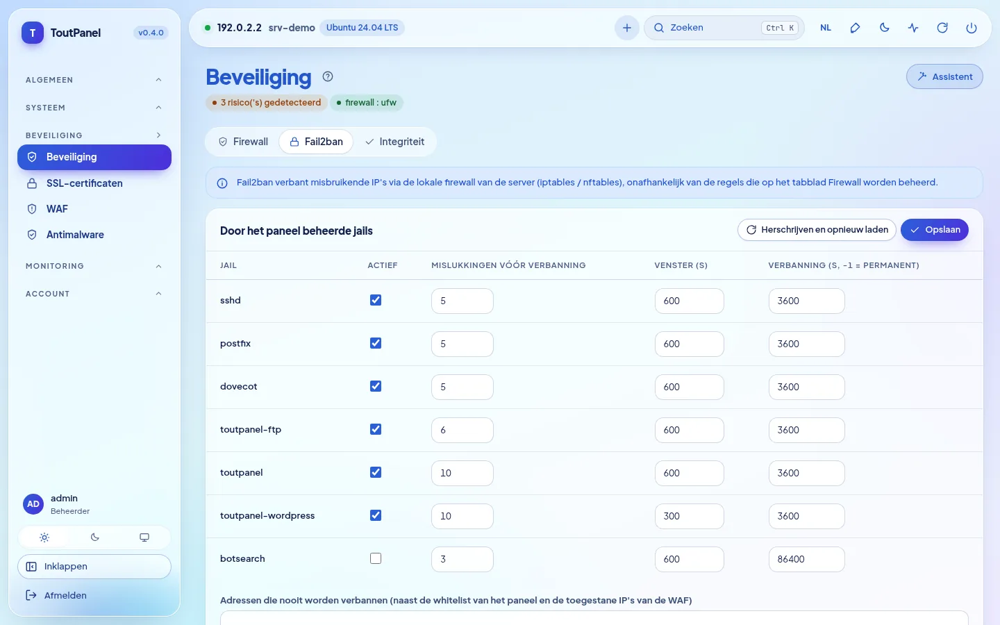<br>**Beveiliging**: aanbevelingen, firewall, anti-DDoS, Fail2ban |
| 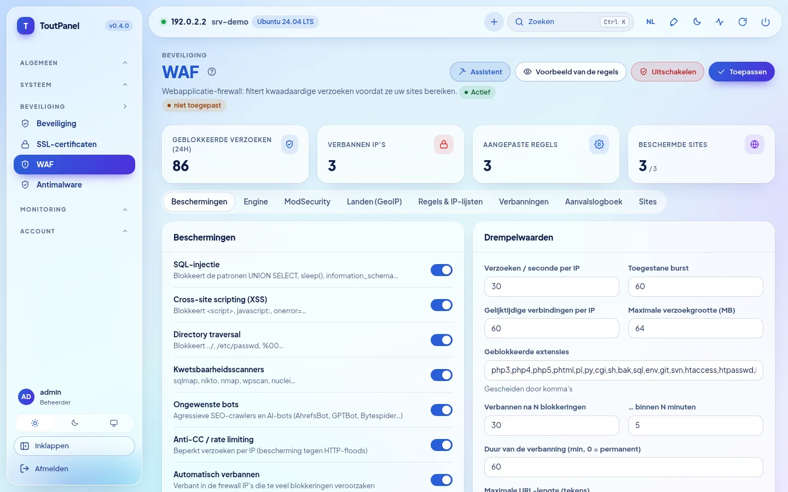<br>**WAF**: beschermingen, drempels, engines, GeoIP, aanvalslogboek | <br>**Monitoring**: CPU, geheugen, netwerk, load en schijf over 1 u → 7 d |
| <br>**Accounts**: resellers, klanten, plannen, toegangsprofielen | <br>**Servers**: hoofdpaneel (master), nodes, routering, migratie |
| <br>**Updates**: pakketten van het systeem (beveiliging) en van het paneel | <br>**Instellingen**: toegang, poort, geheime ingang, HTTPS, interface |
| 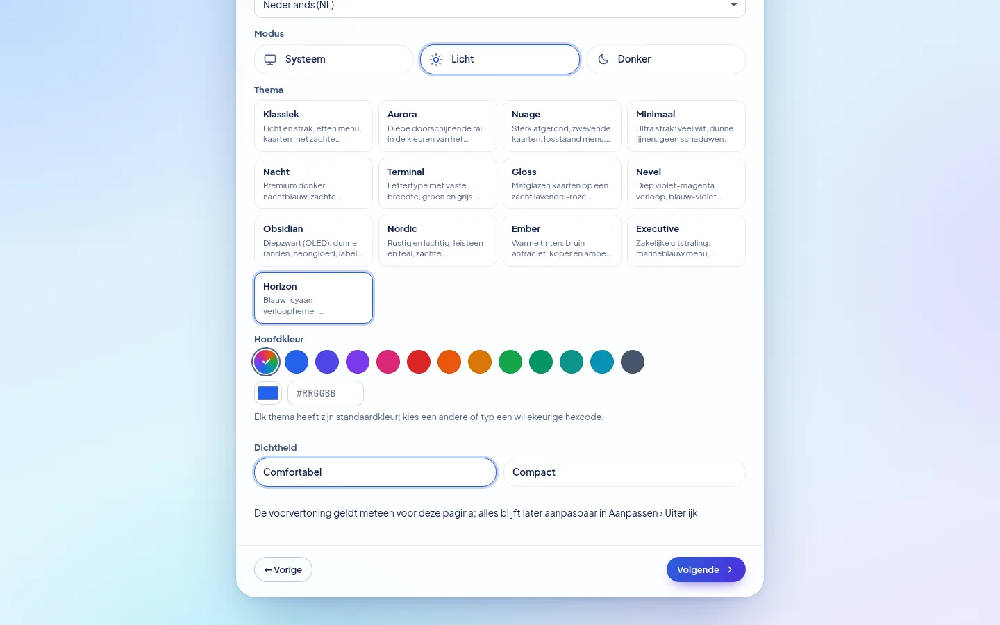<br>**Configuratieassistent**: thema, hoofdkleur, dichtheid, direct voorbeeld | <br>**Horizon**, standaardthema: hetzelfde scherm in licht en donker |

**Nieuw in 0.4**: schermafbeeldingen van een demoserver (documentatieadressen):

| | |
|---|---|
| <br>**Configuratieassistent, stap Profiel**: startprofielen, gedetecteerd geheugen, aanbevolen profiel | 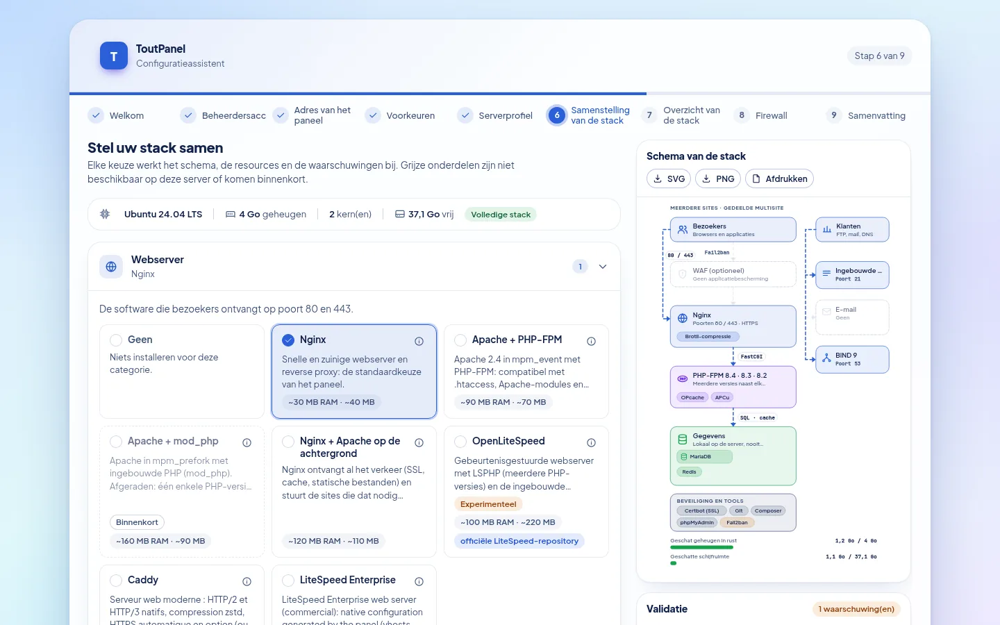<br>**Samenstelling van de stack**: keuze per categorie, architectuurschema, validatie en geschatte resources |
| <br>**Installatie van de stack**: voortgang, stappen, hervatten na een fout | <br>**Assistent, stap Firewall**: beheerd door ToutPanel of upstream, poorten die worden geopend |
| <br>**Instellingen › Softwarestack**: werkelijke status, geïnstalleerde versies, schema van deze server | <br>**Softwarestack**, donkere modus |
| <br>**Versnellers**: OPcache, JIT, APCu, Redis, Memcached, FastCGI, Varnish… met status, geheugen en beperkingen | <br>**OpenLiteSpeed** *(experimenteel)*: installatie, LSPHP, omschakelen van de webserver, WebAdmin |
| 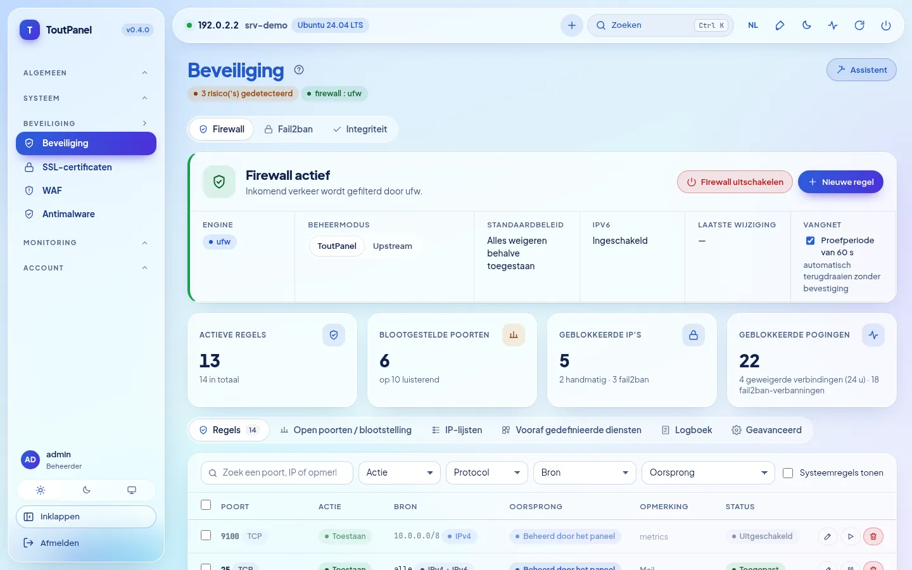<br>**Beveiliging › Firewall**: engine, beheermodus, vergrendelingsbeveiliging, regels | <br>**Luisterende poorten en blootstelling**: blootgesteld, beperkt, beschermd |
| <br>**Upstream firewall**: bij de provider te openen poorten, om te kopiëren of te downloaden | <br>**Firewall**, donkere modus |
| <br>**DNS › Engine**: BIND, PowerDNS, Knot DNS, externe provider | <br>**Mailserver › Engine**: Postfix, Exim *(experimenteel)*, externe relay |
| <br>**FTP › Engine**: ingebouwd, Pure-FTPd, ProFTPD, vsftpd, SFTP *(experimenteel)* | <br>**Externe ToutWAF**: paneel gekoppeld aan een ToutWAF op een andere server |
| <br>**Startpagina**: banner "distributie met beperkte stack" volgens het ondersteuningsniveau | |

**Pagina's toegevoegd voor 0.4.0**: dezelfde conventies (demoserver, documentatieadressen):

| | |
|---|---|
| 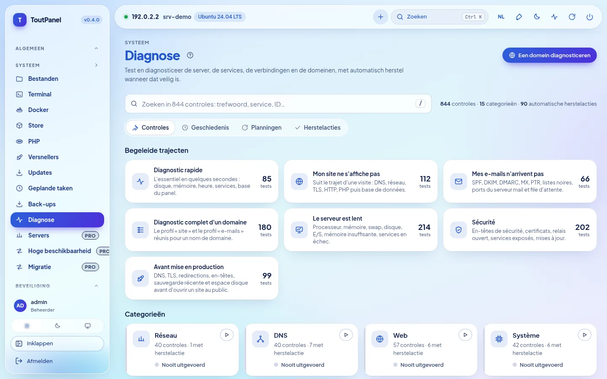<br>**Systeem › Diagnose**: 844 controles, begeleide trajecten, categorieën, direct zoeken | <br>**Resultaat van een diagnose**: waarschijnlijke oorzaken, technisch bewijs met gemaskeerde geheimen, **automatische reparatie** |
| <br>**Automatische reparatie**: exact voorbeeld van wat wordt gewijzigd, impact, ongedaan maken mogelijk | <br>**Startpagina › "Wat wilt u doen?"**: stap voor stap begeleide assistenten |
| <br>**Begeleide assistent** (hier: gebruiker): stappen, contextuele hulp, modus Eenvoudig of Geavanceerd | <br>**Echte test na toepassing**: resultaat per controle, waarschijnlijke oorzaak, reparatie met één klik |
| <br>**Hoge beschikbaarheid** *(Pro)*: zwevend IP keepalived, servers en prioriteiten, houder van het adres | <br>**Monitoring › Serverpark** *(Pro)*: beschikbaarheid, CPU, geheugen, schijf en load per server |
| <br>**Servers** *(Pro)*: hoofdpaneel (master), web- / mail- / DNS-nodes, status, vastgepinde TLS-vingerafdruk | <br>**Accounts › Instellingen › Accountisolatie** *(optie, standaard uitgeschakeld)*: PHP-FPM per account, systemd-hardening, isolatie |
| <br>**Instellingen › Webserver: Caddy** *(experimenteel)*: omschakelen met terugdraaien, HTTPS, niet-ondersteunde functies | <br>**LiteSpeed Enterprise** *(experimenteel; tijdens onze tests nooit gestart)*: licentie, officiële installatie, LSPHP |
| <br>**Store › Modules**: Marketplace van integraties (facturatie, monitoring, SSO, CI/CD, DNS / CDN…) | 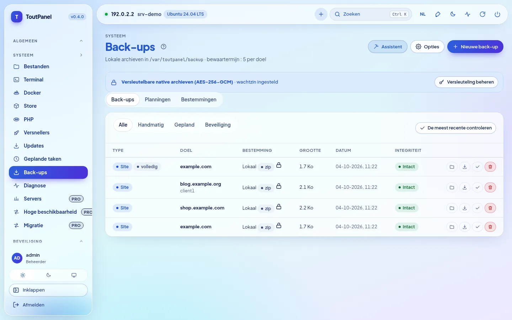<br>**Back-ups**: versleutelde archieven (AES-256-GCM), volledig of incrementeel |
| <br>**Versleuteling van back-ups**: wachtzin versleuteld bewaard, waarschuwing bij verlies, versleuteling standaard of verplicht | <br>**Planningen**: bereik, retentie, bestemming, incrementeel |
| <br>**Instellingen › Beveiliging**: waarschuwingen bij ongebruikelijke aanmelding, SSO OIDC / SAML | <br>**SSO** *(Pro)*: LDAP / Active Directory, OpenID Connect, SAML 2.0 |

**Op mobiel** past de interface zich aan (inklapbaar menu, scrollbare tabellen):

<table>
<tr>
<td align="center"><br><b>Startpagina</b></td>
<td align="center"><br><b>Websites</b></td>
</tr>
</table>

> Schermafbeeldingen gemaakt op een demoserver (Ubuntu 24.04, documentatieadres 192.0.2.2, voorbeelddomeinen). Op deze demoserver zijn bepaalde statussen **gesimuleerd** (er draait geen enkele echte service): isolatie van accounts (systemd, cgroups), Caddy, serverpark en zwevend IP, databases, mail, WAF en catalogus van de Marketplace; de diagnoses en de assistenten worden daarentegen echt uitgevoerd. Schermafbeeldingen in andere talen staan in `screenshots/<taal>/` (en, de, es, it, nl, pt, ru, zh, ar).

## Thema's

### 13 thema's, uw kleur

Een nieuwe installatie gebruikt **Horizon**: hemel met blauw-cyaan verloop, zwevende doorschijnende menu- en bovenbalk, actieve pil met blauw-paars verloop die de gekozen kleur volgt, zeer vette blauwe titels. **Aanpassing › Uiterlijk**: kies een ander ontwerp, daarna **elke accentkleur** (12 voorinstellingen, pipet of code `#RRGGBB`). Het paneel leidt hieruit knoppen, links, actief menu, badges, verlopen en grafieken af, met behoud van een contrast van minstens 4,5:1. Elk thema bestaat in **licht en donker**, respecteert hoog contrast en talen van rechts naar links; het voorbeeld is direct, er wordt niets opgeslagen vóór "Ontwerp opslaan". Dichtheid, hoeken, lettertype, breedte, positie van het menu, pictogrammen en animaties zijn ook instelbaar, per gebruiker of standaard voor iedereen; het thema kan worden geëxporteerd en geïmporteerd.


| | | |
|---|---|---|
| <br>**Horizon** *(standaard)* · `#2b5fd9` | <br>**Klassiek** · `#2563eb` | <br>**Aurora** · `#2563eb` |
| <br>**Wolk** · `#5b5bd6` | <br>**Minimal** · `#18181b` | <br>**Nacht** · `#0369a1` |
| <br>**Terminal** · `#15803d` | <br>**Gloss** · `#7c3aed` | <br>**Nevel** · `#8b5cf6` |
| <br>**Obsidian** · `#22c55e` | <br>**Nordic** · `#14b8a6` | <br>**Ember** · `#f97316` |
| <br>**Executive** · `#10b981` | | |

<sub>Vermelde kleur: standaardaccent van het thema in lichte modus, vrij aanpasbaar.</sub>

Het thema, de modus, de **hoofdkleur** en de **dichtheid** worden ook al in de **configuratieassistent** gekozen (stap Voorkeuren), met direct voorbeeld; dit zijn de standaardwaarden van alle accounts, waarna ieder zijn eigen keuzes kan maken.

## Edities

Het programma is voor alle edities hetzelfde: een **licentiesleutel** activeert de geavanceerde functies op een bepaalde server. Een nieuwe installatie werkt in de Persoonlijke editie, zonder registratie of internetverbinding.

| Editie | Prijs | Sleutel | Voor wie |
|---|---|---|---|
| **Persoonlijk** | gratis, zonder tijdslimiet | geen | persoonlijk gebruik: uw eigen sites, **maximaal 5** |
| **Professioneel** | betaald | verplicht | hostingproviders, bureaus, zakelijk gebruik: alles inbegrepen, onbeperkt aantal sites (of volgens het licentieplan) |
| **Enterprise** | betaald | verplicht | Professioneel + onbeperkt multi-server + prioritaire support |

De Persoonlijke editie is **compleet**: sites, PHP met meerdere versies, databases, mail, DNS, SSL, ingebouwde WAF, lokale back-ups (**AES-256-GCM-versleuteling en incrementele back-ups inbegrepen**), monitoring, handmatige Diagnose, begeleide assistenten (stappen die een Pro-functie raken blijven voorbehouden), klantaccounts en subgebruikers, WebAuthn, AVG-tools, API en CLI. Voorbehouden aan de betaalde edities zijn:

<details>
<summary><b>Exacte lijst van de functies Professioneel / Enterprise</b></summary>

| Functie | Persoonlijk | Professioneel |
|---|---|---|
| Sites | maximaal 5 | onbeperkt (of volgens de licentie) |
| Uptime-probes | 3 | onbeperkt |
| Uitgaande webhooks | 2 | onbeperkt |
| Keuze van de WAF-engine (ToutWAF, BunkerWeb, SafeLine) | ingebouwde WAF | ✓ |
| ModSecurity + OWASP CRS | — | ✓ |
| Multi-server: nodes, hoge beschikbaarheid, live migratie | — | ✓ |
| Webgroepen en DNS-cluster | — | ✓ |
| Databasereplicatie | — | ✓ |
| Facturatie, gateways, WHMCS, provisioning | — | ✓ |
| White label voor resellers | — | ✓ |
| Aangepast domein van het paneel | — | ✓ |
| Support (tickets) | — | ✓ |
| Mededelingen | — | ✓ |
| Reselleraccounts | — (klanten en subgebruikers: ✓) | ✓ |
| SSO LDAP / OpenID Connect / SAML | — (WebAuthn: ✓) | ✓ |
| Blokkering per land (GeoIP) | — | ✓ |
| Geplande antimalware | handmatige scan | ✓ |
| Externe back-ups (S3, SFTP, B2, rsync SSH, rclone) | lokale opslag (versleutelde en incrementele archieven inbegrepen) | ✓ |
| Engines restic, Borg en rsync | — | ✓ |
| Prometheus-export `/metrics` | — | ✓ |
| Import vanuit cPanel, Plesk, DirectAdmin, ISPConfig, shared hosting, IMAP | — (export: ✓) | ✓ |
| Premiummodules van de store | — | ✓ |
| Externe verankering van het auditlogboek | — (AVG-export en -opschoning: ✓) | ✓ |
| Geplande diagnoses met waarschuwing | handmatige diagnose | ✓ |

</details>

- De betrokken onderdelen dragen een badge **Pro**; de pagina's blijven raadpleegbaar, alleen aanmaken en wijzigen zijn voorbehouden.
- Activering: **Instellingen › Licentie › Een sleutel activeren** (`TP-XXXXX-XXXXX-XXXXX-XXXXX`) of `toutpanel licence activate <sleutel>`. Het ondertekende token wordt lokaal geverifieerd: de licentie werkt offline (dagelijkse hervalidatie, respijtperiode van 15 dagen).
- Als de licentie verloopt of niet meer geldig is, **valt het paneel terug op de Persoonlijke editie zonder iets te verwijderen**.

Prijzen en aankoop: **[toutpanel.com/tarifs](https://toutpanel.com/tarifs)** · details: [Edities en licentie](https://toutpanel.com/docs/guide/editions/).

## Architectuur

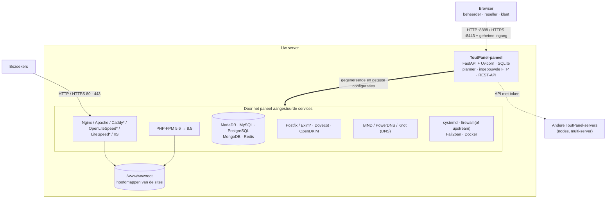

| Component | Rol |
|---|---|
| **Paneel** | FastAPI-applicatie geserveerd door Uvicorn (systemd-service `toutpanel` onder Linux, geplande taak `ToutPanel` onder Windows). Webinterface zonder externe afhankelijkheden, REST-API, taakplanner, ingebouwde FTP-server. |
| **Webstack** | Nginx en/of Apache (Caddy, OpenLiteSpeed met LSPHP, LiteSpeed Enterprise: experimenteel; IIS onder Windows) met PHP-FPM; het paneel schrijft de vhosts vanuit zijn sjablonen, test ze en herlaadt daarna de service. De **stack-samensteller** kiest de software en laat die evolueren. |
| **Services** | MariaDB / MySQL / PostgreSQL / MongoDB, Postfix (of Exim*) / Dovecot / OpenDKIM, BIND (of PowerDNS, Knot), FTP (ingebouwd of Pure-FTPd*, ProFTPD*, vsftpd*), Fail2ban, firewall, Docker: door het paneel aangestuurd via hun eigen native tools. |
| **CLI `toutpanel`** | Beheer van het paneel (poort, ingang, wachtwoord, update, licentie…) en scriptbare bedrijfsopdrachten (`--json`). |

<sub>\* experimenteel</sub>

```
<home>  (/var/toutpanel of C:\toutpanel)
├── data/      SQLite-database van het paneel, settings.json, sleutels, install-info.txt
├── logs/      panel.log en logboeken van de sites
├── vhost/     gegenereerde vhosts (als de native map van de webserver ontbreekt)
├── ssl/       certificaten van de sites en van het paneel
├── backup/    lokale back-ups
├── src/       kloon van deze repository (kanalen, tags, toutpanel update)
└── venv/      Python-omgeving van het paneel
/www/wwwroot   hoofdmap van de sites (C:\toutpanel\wwwroot onder Windows)
```

## Volledige installatie

### Vereisten

| | Linux | Windows |
|---|---|---|
| **Systemen** | **volledig** niveau: Debian 11 en hoger, Ubuntu 20.04 en hoger, AlmaLinux / Rocky Linux / RHEL / CentOS Stream / Oracle Linux / CloudLinux 8 en hoger, Fedora · **beperkt** niveau (het paneel werkt, sommige functies ontbreken): Debian 10, Ubuntu 18.04, CentOS / RHEL 7, Amazon Linux, openSUSE / SLES, Arch, Alpine, Devuan · zie [Compatibiliteit van distributies](#compatibiliteit-van-distributies) | Windows 10, 11 · Windows Server 2016, 2019, 2022, 2025 (minimaal build 14393) |
| **Rechten** | `root` (of `sudo`) en `bash` | PowerShell 5.1+ **als beheerder** (winget niet nodig) |
| **Python** | 3.9 tot 3.14 (door het script geïnstalleerd als de distributie het levert) | door het script geïnstalleerd (3.12, python.org) als het ontbreekt |
| **Geheugen** | minimaal 1 GB (alleen paneel), 2 GB aanbevolen met MariaDB en PHP | idem |
| **Schijf** | 2 GB vrij + uw sites | idem |
| **Netwerk** | uitgaande HTTPS-toegang (GitHub, PyPI, repositories van de distributie, Let's Encrypt); vast publiek IP en reverse DNS voor mail | idem (python.org, nginx.org, windows.php.net, MariaDB) |

Architecturen: `x86_64` en `aarch64` (andere: beperkt niveau). Installeer bij voorkeur op een **vers geïnstalleerde** server. Op een server waar Nginx, Apache of MariaDB al zijn geconfigureerd, gebruikt u `--stack none`: het paneel detecteert ze en schrijft zijn vhosts in hun native map zonder de rest aan te raken.

### Compatibiliteit van distributies

Het installatieprogramma en het paneel detecteren de distributie (`/etc/os-release`, architectuur) en tonen een **ondersteuningsniveau**: `toutpanel compat` geeft de bekende distributies weer, `toutpanel check` geeft dat van uw server, en een banner op de startpagina waarschuwt wanneer het niveau niet "volledig" is. Er is **nooit een versieplafond**: een nieuwere versie van een bekende familie wordt behandeld als de laatst bekende.

| Niveau | Betekenis | Voorbeelden |
|---|---|---|
| **Volledig** | de complete stack is voorzien (webserver, PHP met meerdere versies, databases in versies naar keuze, mail, firewall, automatische updates) | Debian 11+, Ubuntu 20.04+ (LTS en tussenversies), AlmaLinux / Rocky / RHEL / CentOS Stream / Oracle Linux 8+, CloudLinux 8 en 9, Fedora, Raspberry Pi OS 64-bit |
| **Beperkt** | het paneel werkt, maar sommige functies ontbreken of vragen ingrijpen (systeem aan het einde van zijn levensduur, init zonder systemd, ontbrekende repositories van derden, 32-bitsarchitectuur); niet-blokkerende waarschuwing | Debian 10, Ubuntu 18.04, CentOS / RHEL 7, Amazon Linux 2 en 2023 (telkens één PHP), openSUSE / SLES, Arch en afgeleiden, Alpine, Devuan, Kali |
| **Niet ondersteund** | onbekend, te oud of onveranderlijk (immutable) systeem: het installatieprogramma meldt het en stopt | Fedora CoreOS / Silverblue, MicroOS, Flatcar, Gentoo, NixOS, Void |

"Volledig" beschrijft het door het paneel **voorziene** niveau; **de tests zijn uitgevoerd onder Ubuntu 24.04**, met één uitzondering: **AlmaLinux 9.8 en 10.2 met SELinux Enforcing** (QEMU-laboratorium van 4 oktober 2026); de validatie van begin tot eind is op de andere distributies niet gedaan, Rocky Linux, RHEL en Fedora inbegrepen (zie [Bekende beperkingen](#bekende-beperkingen)). Python 3.9+ wordt geleverd als het systeem te oud is (recent pakket van de distributie of autonome Python geverifieerd met SHA-256, met uw toestemming).

### Linux

```bash
curl -sSL https://raw.githubusercontent.com/qu3ntin01/toutpanel/main/install.sh | sudo bash
```

Om het script te lezen voordat u het uitvoert:

```bash
curl -sSLO https://raw.githubusercontent.com/qu3ntin01/toutpanel/main/install.sh
less install.sh
sudo bash install.sh
```

De installatie duurt 3 tot 6 minuten, afhankelijk van de verbinding.

**Installatieassistent.** Alle opties (account, poorten, map, stack, firewall, WAF, versie, taal…) worden met keuzemenu's gekozen op **[toutpanel.com/installation-assistant](https://toutpanel.com/installation-assistant)**, dat de opdrachtregel genereert en live controleert (geheimen verschijnen er nooit in leesbare tekst in).

**Een specifieke versie installeren.** De standaardopdracht installeert de laatste stabiele versie; met `--version` kiest u een andere (lijst: `--list-versions`). Pre-releases worden op het kanaal `dev` gepubliceerd en worden geïnstalleerd met `--channel dev`:

```bash
# de laatste stabiele versie
curl -sSL https://raw.githubusercontent.com/qu3ntin01/toutpanel/main/install.sh | sudo bash
# een specifieke versie (lijst: --list-versions)
curl -sSL https://raw.githubusercontent.com/qu3ntin01/toutpanel/main/install.sh | sudo bash -s -- --list-versions
curl -sSL https://raw.githubusercontent.com/qu3ntin01/toutpanel/main/install.sh | sudo bash -s -- --version 0.4.0
# de laatste pre-release (kanaal dev)
curl -sSL https://raw.githubusercontent.com/qu3ntin01/toutpanel/dev/install.sh | sudo bash -s -- --channel dev
```

**Interactief menu.** Gestart in een terminal zonder modusoptie presenteert het script ToutPanel, detecteert een bestaande installatie en biedt aan: **installeren** (volledige stack) of **alleen het paneel installeren**, eventueel in **nodemodus**; of, als het paneel er al is, **bijwerken**, **volledig opnieuw installeren** of **verwijderen**. Het stelt ook de vraag over de **firewall** (ToutPanel / upstream / later) en, nadat het paneel is gestart, die over het **profiel van de stack**. Zonder terminal (automatisering, `--yes`) stelt het geen vragen: het installeert, of werkt bij als het paneel aanwezig is (firewall "later", standaardstack).

**Wat het script doet:**

1. installeert zo nodig Python 3.9+ en maakt de virtuele omgeving `<home>/venv` aan;
2. installeert de **webstack** (Nginx, PHP-FPM, MariaDB, Redis of Valkey, Certbot, Fail2ban) zoals voorheen, of die u samenstelt (`--profile`, `--web`, `--php`, `--db`… doorgegeven aan `toutpanel stack apply`);
3. kloont deze repository naar `<home>/src`, **verifieert de SHA-256-som** van de wheel die bij de Python van het systeem past en installeert die;
4. maakt een willekeurig **beheerdersaccount** en een geheime **toegangs-URL** aan;
5. registreert de **systemd-service** `toutpanel`;
6. stelt de **firewall** in volgens `--firewall`: `on` (ToutPanel beheert hem en opent de nodige poorten), `off` (upstream firewall: geen systeemregels, lijst van de bij de provider te openen poorten), vraag in een terminal, anders "later" (er wordt niets aangeraakt);
7. configureert **SELinux** (Alma, Rocky, RHEL, Fedora) of **AppArmor** (Debian, Ubuntu, SUSE);
8. toont een samenvatting, opgeslagen in `<home>/data/install-info.txt` (alleen leesbaar voor root).

#### Opties van `install.sh`

| Optie | Beschrijving | Standaard |
|---|---|---|
| `--stack full` | **verouderd** (zie `--profile`): Nginx + PHP-FPM + MariaDB + Redis/Valkey + Certbot + Fail2ban | ✓ |
| `--stack minimal` | **verouderd**: Nginx + PHP-FPM + Certbot | |
| `--stack none` | **verouderd**: alleen het paneel (reeds geconfigureerde server) | |
| `--profile NAAM` | profiel van de **stack-samensteller**: `single-site`, `multi-site`, `hosting`, `performance`, `application`, `mail-only`, `dns-only`, `node`, `lamp`, `standard`, `custom` (waarden van de andere opties: zie de tabel hieronder) | standaardstack |
| `--web`, `--php`, `--php-default`, `--php-ext`, `--db`, `--redis`, `--accel`, `--ftp`, `--mail ENGINE`, `--dns`, `--security`, `--runtime`, `--tools`, `--install-mode`, `--roles`, `--stack-file`, `--no-tuning` | opties van de samensteller, ongewijzigd doorgegeven aan `toutpanel stack apply … --yes` na de installatie van het paneel (een fout in de stack laat de installatie niet mislukken: hervatopdracht getoond) | |
| `--accept-litespeed-license` | met `--web litespeed[:6.3]`: aanvaardt de licentieovereenkomst van LiteSpeed Technologies; **verplicht** (zonder deze stopt het installatieprogramma vóór elke wijziging), onverenigbaar met `--stack`, geweigerd onder Windows. **LiteSpeed Enterprise is een EXPERIMENTEEL commercieel product, nooit gestart in de ontwikkelomgeving**: officiële proefperiode van 15 dagen, daarna betaalde licentie | nee |
| `--mail` | (alleen) voegt Postfix, Dovecot, OpenDKIM toe en opent de mailpoorten | nee |
| `--firewall on\|off\|ask` | wie de firewall beheert: ToutPanel (`on`), een upstream firewall zonder systeemregels (`off`), vraag (`ask`); zonder terminal of waarde: "later"; nooit gewijzigd door een update | vraag in een terminal |
| `--firewall-engine nft\|ufw\|firewalld\|csf\|iptables` | engine van de door ToutPanel beheerde firewall | gedetecteerd |
| `--dry-run` | toont de gedetecteerde distributie, de map en de geplande opdrachten, zonder iets te wijzigen (zonder root) | nee |
| `--postgres` | voegt PostgreSQL toe (wachtwoord van de rol `postgres` gegenereerd en opgeslagen in het paneel) | nee |
| `--waf toutwaf` | implementeert **ToutWAF**, de WAF van de ontwikkelaar, vóór de sites met zijn officiële installatieprogramma (systemd-services, zonder Docker; webserver verplaatst naar 8080 / 8443, console op 9443, samenvatting in `/etc/toutwaf/INSTALL-SUMMARY.txt`) | nee |
| `--waf bunkerweb` / `--waf safeline` | installeert Docker en implementeert de externe WAF vóór de sites (webserver verplaatst naar 8080 / 8443, console op 7000 of 9443) | nee |
| `--waf toutwaf --waf-console URL` | **externe ToutWAF**: koppelt het paneel aan een ToutWAF die op een andere server is geïnstalleerd (geen lokale installatie), met `--waf-origin-ip`, `--waf-origin-addr`, `--waf-cert-mode import\|acme`, `--waf-server-id`, `--waf-fingerprint` of `--waf-trust-first-use`, `--waf-restrict` (80 / 443 beperkt tot ToutWAF); het token wordt gegeven via `--waf-token-file BESTAND` of `--waf-token-stdin` (nooit als argument) | nee |
| `--node` | **node**modus voor multi-server: paneel alleen via HTTPS, inschrijvingstoken, API-URL en TLS-vingerafdruk getoond (in te voeren op de master: Systeem › Servers › Toevoegen) | nee |
| `--master URL` | met `--node`: URL van het hoofdpaneel (master) | — |
| `--port N` | **HTTP**-poort van het paneel | `8888` |
| `--https-port N` | **HTTPS**-poort van het paneel (het paneel luistert op HTTP **en** HTTPS; in het begin zelfondertekend certificaat) | `8443` |
| `--version X.Y.Z` | installeert deze gepubliceerde versie (ook `vX.Y.Z`, `0.4.0b1` of `0.4.0-beta.1`; variabele `TOUTPANEL_VERSION`); een pre-release impliceert het kanaal `dev`; versie niet gevonden of zonder wheel voor uw Python: stop vóór elke wijziging met de lijst van versies; een downgrade vraagt om bevestiging (behalve `--yes`) | laatste van het kanaal |
| `--list-versions` | toont de gepubliceerde versies (nieuwste eerst) en sluit af, zonder iets te installeren | |
| `--random-port` | willekeurige poort tussen 20000 en 39999 | |
| `--username NAAM` | naam van het beheerdersaccount | willekeurig `admin_xxxxxx` |
| `--password WW` | beheerderswachtwoord (zichtbaar in `ps` en de shellgeschiedenis: geef de voorkeur aan de drie volgende opties) | 16 willekeurige tekens |
| `TOUTPANEL_PASSWORD` | omgevingsvariabele die het wachtwoord geeft (behouden door `sudo -E`); een optie gaat voor op de variabele | — |
| `--password-file BESTAND` | leest het wachtwoord op de eerste regel van een bestand (onder Linux voorbehouden aan de eigenaar: `chmod 600`) | — |
| `--password-stdin` | leest het wachtwoord van de standaardinvoer (eerste regel; onbruikbaar met `curl \| bash`) | — |
| `--entrance /pad` | beveiligde ingang van de URL | willekeurig `/tp_xxxxxxxxxx` |
| `--home DIR` | map van het paneel (een bestaande installatie in de oude standaard `/www/toutpanel` wordt gedetecteerd en behouden) | `/var/toutpanel` |
| `--source DIR` | installeren vanuit een lokale map (kopie van deze repository met `dist/`) | kloon van de branch |
| `--branch NAAM` | te downloaden Git-branch | `main` |
| `--channel stable\|dev` | updatekanaal, opgeslagen in het paneel | `stable` |
| `--update` | werkt een bestaande installatie bij (automatisch gedetecteerd): back-up van de gegevens, nieuwe code, databasemigratie, herstart | auto |
| `--reinstall` | forceert een volledige installatie, ook als het paneel aanwezig is | nee |
| `--uninstall` | verwijdert het paneel (sites en databases behouden, paneelgegevens gearchiveerd) | nee |
| `--yes`, `-y` | geen vragen (menu en bevestigingen) | nee |
| `--lang xx` | taal van het installatieprogramma en beginstaal van het paneel: `en`, `fr`, `de`, `es`, `it`, `pt`, `nl`, `ru`, `zh`, `ar` | taal van het systeem, anders `en` |
| `--en`, `--fr`, `--de`, `--es`, `--it`, `--pt`, `--nl`, `--ru`, `--zh`, `--ar` | snelkoppelingen voor `--lang` | |
| `-h`, `--help` | toont de hulp van het script | |

Er geldt telkens één wachtwoordbron (twee opties worden vóór elke wijziging geweigerd). Zonder enige bron biedt een interactieve terminal "automatisch genereren (aanbevolen)" of "invoeren" (zonder echo, met bevestiging); zonder terminal of met `--yes` wordt een wachtwoord gegenereerd en aan het einde getoond. Een opgegeven wachtwoord wordt niet getoond en niet in de samenvatting of `install-info.txt` geschreven, en een update wijzigt het nooit.

**Waarden van de stackopties** (ze worden vóór elke wijziging gecontroleerd; **\*** = experimenteel):

| Optie | Waarden |
|---|---|
| `--web` | `nginx`, `apache`, `nginx-apache`, `caddy`\*, `openlitespeed`\* (`:1.9`, `:1.8`, `:1.7`), `litespeed`\* (`:6.3`, `:6.2`, `:6.1`, `:6.0`; LiteSpeed Enterprise, commercieel, vereist `--accept-litespeed-license`), `none`; `toutpanel stack apply` accepteert dezelfde waarden |
| `--php` / `--php-default` / `--php-ext` | versies gescheiden door komma's (`8.3,8.4`, van 5.6 tot 8.5) / standaardversie / `minimal`, `standard`, `full` |
| `--db` | `mariadb` (`:10.6`, `:10.11`, `:11.4`, `:11.8`), `mysql`\* (`:8.4`, `:9.7`), `percona`\* (`:8.0`, `:8.4`), `postgresql` (`:13` tot `:18`), `none` |
| `--accel` | `opcache`, `jit`, `apcu`, `redis`, `memcached`, `fastcgi-cache`, `varnish`\*, `brotli`, `zstd`\*, `http3`\*, `ioncube` |
| `--ftp` | `builtin`, `pureftpd`\*, `proftpd`\*, `vsftpd`\*, `sftp`\*, `none` |
| `--mail` | `postfix`, `postfix-clamav`, `postfix-light`, `exim`\*, `relay`, `none` |
| `--dns` | `bind`, `powerdns`, `knot`, `external`, `none` |
| `--security` | `firewall`, `fail2ban`, `modsecurity`, `clamav`, `toutwaf` |
| `--runtime` / `--tools` | `nodejs`, `python`, `go`, `ruby`, `java`, `docker` / `certbot`, `git`, `composer`, `phpmyadmin`, `adminer`, `restic`, `goaccess` |
| `--install-mode` / `--roles` | `single-server`, `single-site`, `multi-site`, `multi-server` / `web`, `db`, `mail`, `dns` |

Een component "binnenkort" (Apache + mod_php) wordt netjes geweigerd door `toutpanel stack`, zonder iets te installeren.

Voorbeelden:

```bash
sudo bash install.sh --stack minimal --port 7443
sudo bash install.sh --profile lamp --php 8.3,8.4 --db mariadb:11.4 --firewall on
sudo bash install.sh --profile hosting --mail postfix-clamav --dns bind --firewall off --yes
sudo bash install.sh --dry-run --profile lamp          # simulatie
sudo bash install.sh --mail --postgres
sudo bash install.sh --mail --username ik --password-file /root/wachtwoord.txt --entrance /mijn-toegang
sudo bash install.sh --profile performance --web openlitespeed --php 8.3 --accel opcache,redis --firewall off --yes   # OpenLiteSpeed: experimenteel
sudo bash install.sh --web litespeed:6.3 --php 8.3 --accept-litespeed-license --yes   # LiteSpeed Enterprise: commercieel, experimenteel, licentie verplicht (alleen Linux)
sudo bash install.sh --waf toutwaf                 # WAF van de ontwikkelaar vóór de sites
sudo bash install.sh --stack minimal --node --master https://master.voorbeeld.nl:8888   # server aangestuurd door een master
curl -sSL https://raw.githubusercontent.com/qu3ntin01/toutpanel/main/install.sh | sudo bash -s -- --yes --random-port
curl -sSL https://raw.githubusercontent.com/qu3ntin01/toutpanel/main/install.sh | sudo bash -s -- --channel dev
curl -sSL https://raw.githubusercontent.com/qu3ntin01/toutpanel/main/install.sh | sudo bash -s -- --nl   # installatieprogramma in het Nederlands
```

#### Taal van het installatieprogramma

De installatieprogramma's zijn **meertalig**: banner, menu en vragen, stappen, waarschuwingen, fouten, hulp, samenvatting en `install-info.txt` verschijnen in een van de **10 talen** hieronder, **standaard in het Engels**. De gekozen taal wordt ook de **beginstaal van het paneel** (installatie en herinstallatie); een regel onder de banner toont de gekozen taal en de herkomst ervan.

| Taal | `--lang` | Snelkoppeling Linux | Windows |
|---|---|---|---|
| English *(standaard)* | `en` | `--en` | `-Lang en` / `-En` |
| Français | `fr` | `--fr` | `-Lang fr` / `-Fr` |
| Deutsch | `de` | `--de` | `-Lang de` / `-De` |
| Español | `es` | `--es` | `-Lang es` / `-Es` |
| Italiano | `it` | `--it` | `-Lang it` / `-It` |
| Português | `pt` | `--pt` | `-Lang pt` / `-Pt` |
| Nederlands | `nl` | `--nl` | `-Lang nl` / `-Nl` |
| Русский | `ru` | `--ru` | `-Lang ru` / `-Ru` |
| 中文 | `zh` | `--zh` | `-Lang zh` / `-Zh` |
| العربية | `ar` | `--ar` | `-Lang ar` / `-Ar` |

Volgorde van prioriteit, van sterkst naar zwakst:

| # | Bron | Linux | Windows |
|---|---|---|---|
| 1 | optie van de opdrachtregel | `--lang xx` of snelkoppeling (`--nl`…) | `-Lang xx` of snelkoppeling (`-Nl`…) |
| 2 | omgevingsvariabele | `TOUTPANEL_LANG=nl` | `$env:TOUTPANEL_LANG = "nl"` |
| 3 | in het script geschreven waarde | `INSTALLER_LANG="nl"` bovenaan `install.sh` | `$InstallerLang = "nl"` bovenaan `install.ps1` |
| 4 | **detectie** van de taal van het systeem, als die een van de 10 is | `LC_ALL`, `LC_MESSAGES`, `LANG` | `Get-Culture` |
| 5 | Engels | | |

```bash
curl -sSL https://raw.githubusercontent.com/qu3ntin01/toutpanel/main/install.sh | sudo env TOUTPANEL_LANG=de bash
```

Herkende omgevingsvariabelen: `TOUTPANEL_LANG` (taal van het installatieprogramma), `TOUTPANEL_HOME` (map), `TOUTPANEL_REPO` (Git-repository), `TOUTPANEL_BRANCH` (branch), `TOUTPANEL_CHANNEL` (`stable` of `dev`), `TOUTPANEL_VERSION` (specifieke versie), `TOUTPANEL_PASSWORD` (beheerderswachtwoord), `TOUTPANEL_FIREWALL` / `TOUTPANEL_FIREWALL_ENGINE`, en een variabele per stackoptie (`TOUTPANEL_PROFILE`, `TOUTPANEL_WEB`, `TOUTPANEL_PHP`, `TOUTPANEL_DB`, `TOUTPANEL_ACCEL`, `TOUTPANEL_FTP`, `TOUTPANEL_MAIL_ENGINE`, `TOUTPANEL_DNS`…).

<details>
<summary><b>Geïnstalleerde pakketten per distributie</b></summary>

- **Debian / Ubuntu**: `nginx`, `php8.x-fpm` (+ cli, mysql, curl, mbstring, xml, zip, gd, intl, bcmath, opcache), `certbot`, `composer`, `mariadb-server`, `redis-server`, `fail2ban`, `python3-venv`, `git`, `unzip`; PHP met meerdere versies via packages.sury.org (Debian) of de PPA ondrej (Ubuntu).
- **AlmaLinux / Rocky / RHEL / Fedora**: `epel-release` (+ CRB), `remi-release`, `nginx`, `php83-php-fpm` (+ extensies), `certbot`, `mariadb-server`, `redis` of `valkey` (Valkey op AlmaLinux 10), `fail2ban`, `policycoreutils-python-utils`, `dnf-plugins-core`, `rspamd` (uit de officiële repository `rspamd.com`, door de stack toegevoegd: ontbreekt in AlmaLinux en EPEL), `firewalld` (geïnstalleerd met `--firewall on`: cloud-images hebben noch `firewalld` noch `nft`); SELinux-contexten gedeclareerd (`httpd_sys_rw_content_t` op `/www/wwwroot`, `httpd_log_t`, `var_log_t`, `cert_t`, `httpd_config_t`, `mail_spool_t`) en booleans `httpd_can_network_connect`, `httpd_can_network_connect_db`, `httpd_can_sendmail`, `httpd_setrlimit` geactiveerd.
- **Optionele Python-modules** (standaard niet geïnstalleerd): `pymongo` (MongoDB), `wsgidav` + `a2wsgi` (WebDAV), `geoip2` (GeoIP), `python3-saml` (SAML) — `/var/toutpanel/venv/bin/pip install "pymongo>=4.6"` en daarna `systemctl restart toutpanel`.

</details>

### Windows

In PowerShell **als beheerder**:

```powershell
Set-ExecutionPolicy Bypass -Scope Process -Force
iwr -useb https://raw.githubusercontent.com/qu3ntin01/toutpanel/main/install.ps1 | iex
```

Het script controleert de Windows-versie en de rechten, installeert **Python 3.12** als er geen Python 3.9+ aanwezig is, maakt `C:\toutpanel\venv` aan en installeert daar het paneel, maakt het beheerdersaccount en de geheime URL aan, voegt de firewallregels toe (poort van het paneel, 80, 443, 21), maakt de geplande taak **ToutPanel** aan (automatische start als SYSTEM) en voegt `C:\toutpanel\bin` toe aan het PATH.

Om ook de webstack te installeren (**Nginx** in `C:\nginx`, **PHP 8.3** onder toezicht van het paneel, **MariaDB** als Windows-service):

```powershell
iwr -useb https://raw.githubusercontent.com/qu3ntin01/toutpanel/main/install.ps1 -OutFile install.ps1
.\install.ps1 -Stack
```

| Optie | Beschrijving |
|---|---|
| `-Port 8888` | **HTTP**-poort van het paneel |
| `-HttpsPort 8443` | **HTTPS**-poort van het paneel |
| `-Version X.Y.Z` / `-ListVersions` | een specifieke gepubliceerde versie installeren (variabele `TOUTPANEL_VERSION`) / de gepubliceerde versies tonen |
| `-Home C:\toutpanel` | map van het paneel |
| `-Stack` | installeert Nginx, PHP 8.3, MariaDB |
| `-Username`, `-Password`, `-Entrance /x` | gekozen beheerdersaccount en geheime URL (`-Password` is zichtbaar in de proceslijst: geef de voorkeur aan `$env:TOUTPANEL_PASSWORD`, `-PasswordFile BESTAND` of `-PasswordStdin`) |
| `-PythonVersion`, `-NginxVersion`, `-MariaDBVersion`, `-PhpVersion` | gedownloade versies |
| `-Source C:\pad` / `-Branch main` | lokale map (kopie van deze repository) / gedownloade branch |
| `-Update` / `-Reinstall` / `-Uninstall` | bijwerken / alles opnieuw installeren / verwijderen |
| `-Yes` | geen vragen (automatisering) |
| `-Lang xx` / `-En`, `-Fr`, `-De`, `-Es`, `-It`, `-Pt`, `-Nl`, `-Ru`, `-Zh`, `-Ar` | taal van het installatieprogramma en beginstaal van het paneel (standaard: taal van het systeem indien ondersteund, anders Engels; zie [Taal van het installatieprogramma](#taal-van-het-installatieprogramma)); met `iwr … \| iex`: `$env:TOUTPANEL_LANG = "nl"` vóór de opdracht |
| `-Help` | hulp van het script |

### Te openen poorten

| Poort | Gebruik | Door het installatieprogramma geopend |
|---|---|---|
| **8888** (configureerbaar) | interface van het paneel via **HTTP** | ja |
| **8443** (configureerbaar) | interface van het paneel via **HTTPS** (in het begin zelfondertekend certificaat) | ja (start het installatieprogramma opnieuw of open hem handmatig op een bestaande installatie) |
| **80 / 443** | websites | ja |
| 21 + 60000-60100 | FTP (ingebouwd, of de gekozen engine: passief bereik van de engine) | alleen 21; open het passieve bereik als u FTP activeert |
| 25, 465, 587, 143, 993, 110, 995, 4190 | mail (SMTP, IMAP, POP3, ManageSieve) | met `--mail` (4190: te openen voor Sieve op afstand) |
| 53 (UDP en TCP) | DNS (BIND, PowerDNS of Knot) als u uw zones host | nee: Beveiliging › Firewall |
| 9443 / 7000 | consoles ToutWAF en SafeLine (9443), BunkerWeb (7000) | met `--waf` |
| 3306 / 5432 | externe toegang tot de databases (optioneel) | nee: alleen als u dit activeert |

Vergeet de **firewall van uw hostingprovider** (beveiligingsgroep) niet: als die de poorten van het paneel (8888 en 8443) blokkeert, toont de browser niets. Met `--firewall off` (of de modus "Upstream" van Beveiliging › Firewall) raakt ToutPanel geen enkele systeemregel aan en **toont de te openen poorten** bij de provider (`toutpanel firewall ports`, kopiëren of CSV-download in de interface); met `--firewall on` opent het ze zelf en maakt een **vergrendelingsbeveiliging van 60 s** elke niet-bevestigde wijziging ongedaan die u de toegang zou ontnemen.

## Eerste start

Aan het einde van de installatie toont het script een samenvatting (hier zoals weergegeven met `--lang nl`):

```
╔══════════════════════════════════════════════════════════════════╗
║  ToutPanel is geïnstalleerd!                                     ║
╚══════════════════════════════════════════════════════════════════╝

  Paneel-URL (HTTP)         : http://203.0.113.10:8888/tp_dchwp7kmkf
  Paneel-URL (HTTPS)        : https://203.0.113.10:8443/tp_dchwp7kmkf   zelfondertekend certificaat: de browserwaarschuwing is normaal
  Gebruikersnaam            : admin_gbhjkv
  Wachtwoord                : D9nYzTSKHbX8FTqC
  MariaDB root              : k3Jd82nLqP0sYt7wVb1c
  Configuratieassistent     : https://203.0.113.10:8443/tp_dchwp7kmkf#/setup?token=npSj7xpVzJOI8weJl8R00AdQ18MHYn8YIJCbOYi43B8
  Met deze link (24 u, eenmalig) kunt u het adres van het paneel en de hierboven gegenereerde gebruikersnaam en het wachtwoord wijzigen.
  Nieuwe link: toutpanel setup-link
  PHP                       : 8.3 (Nginx + PHP-FPM gereed)

  Deze gegevens zijn opgeslagen in: /var/toutpanel/data/install-info.txt
  De URL bevat de beveiligde toegang: zonder deze antwoordt het paneel met 404.
```

1. **Noteer de volledige URL** (HTTP en HTTPS): die bevat de **beveiligde toegang** (`/tp_…`). Zonder die antwoordt het paneel `404 Not Found`, waardoor het onzichtbaar blijft voor scans. `toutpanel info` toont ze opnieuw. Het HTTPS-certificaat is in het begin **zelfondertekend**: de browserwaarschuwing is normaal; de configuratieassistent wordt via HTTPS geopend zodat zijn token niet onversleuteld over het netwerk gaat.
2. **Open de link "Configuratieassistent"** (`#/setup?token=…`, 24 u geldig, eenmalig te gebruiken): in **negen stappen** en zonder aan te melden vervangt u de gegenereerde waarden door de uwe (gebruikersnaam, wachtwoord, poort, beveiligde toegang, hostnaam, taal, modus, thema, hoofdkleur en dichtheid), en **kiest u daarna het profiel van uw server en stelt u de stack samen** (profiel, samenstelling met architectuurschema, samenvatting en hervatbare installatie) en **wie de firewall beheert** (ToutPanel, upstream of later). Link verlopen? `toutpanel setup-link` maakt een nieuwe aan. De assistent blijft bereikbaar na het aanmelden (startpagina › Snelkoppelingen).
3. **Beveilig het account**: tweestapsverificatie (TOTP) en, indien mogelijk, een WebAuthn-beveiligingssleutel; toegestane IP's als u een vast IP hebt; erkend HTTPS-certificaat (Instellingen › Toegang & interface, Let's Encrypt als een domein naar de server verwijst) en, als u wilt, doorverwijzing van HTTP naar HTTPS.
4. **Maak een eerste site aan**: Websites › Nieuwe site (of de knop **Assistent** voor site + database + certificaat + mailboxen), laat de DNS naar de server verwijzen, en kies daarna het slotje › Let's Encrypt en "HTTPS afdwingen".
5. **Activeer de beschermingen**: WAF › Toepassen (of WAF › Engine › ToutWAF installeren in de editie Professioneel), firewallregels (Beveiliging › Firewall), geplande dagelijkse back-up, waarschuwingen (Instellingen › Waarschuwingen).
6. **Controleer de server**: Systeem › Diagnose (844 controles, automatische reparaties met voorbeeldweergave) en, op elke pagina, de knop **Assistent** om stap voor stap een site, een database, een mailbox, een back-up of de firewall te configureren met een echte test aan het einde.
7. **Laat de stack op elk moment evolueren**: Instellingen › Softwarestack (werkelijke status, een component toevoegen, een PHP-versie, een engine), pagina Versnellers, tabbladen Engine van de pagina's FTP, DNS en Mailserver.

## Bijwerken

Alle methoden behouden accounts, instellingen, sites, databases en software.

- **Vanuit het paneel**: **Updates › Paneel** toont de geïnstalleerde versie, het gevolgde kanaal, de beschikbare versies en de release-notities. **Bijwerken** maakt eerst een back-up van `settings.json`, de database van het paneel en de huidige versie (`<home>/data/updates/<datum>/`), installeert de wheel van de nieuwe versie, migreert de database en herstart; het paneel controleert daarna zijn gezondheid en **keert zelf terug naar de vorige versie** bij een mislukking. **Terug naar de vorige versie** blijft op elk moment beschikbaar.
- **Via de opdrachtregel**:

  ```bash
  toutpanel update --check              # geïnstalleerde versie, beschikbare versie, release-notities
  toutpanel update                      # de versie van het gevolgde kanaal installeren
  toutpanel update --channel dev        # de ontwikkelbranch volgen
  toutpanel update --rollback           # terug naar de vorige versie (--restore-data: ook de gegevens)
  ```

- **Met het installatiescript**: opnieuw gestart op een reeds ingerichte server schakelt `install.sh` over op updatemodus (back-up van `data/` in `<home>/backup/panel-update-<datum>/`, nieuwe wheel, `toutpanel migrate`, herstart). De stack wordt niet opnieuw geïnstalleerd, tenzij u `--stack`, een optie van de samensteller (`--profile`…), `--mail` of `--waf` toevoegt; de bestaande firewall wordt nooit gewijzigd. Onder Windows: `.\install.ps1 -Update`.

## Verwijderen

```bash
curl -sSL https://raw.githubusercontent.com/qu3ntin01/toutpanel/main/install.sh | sudo bash -s -- --uninstall
```

Verwijdert de service, `/var/toutpanel` (of de gedetecteerde installatie, bijv. `/www/toutpanel`: paneel, Python-omgeving, logboeken, certificaten), `/usr/local/bin/toutpanel` en de door het paneel gegenereerde Nginx- / Apache-configuraties. De gegevens van het paneel worden eerst gearchiveerd in `/root/toutpanel-backup-<datum>.tar.gz`. **De sites (`/www/wwwroot`), de databases en de software van de stack blijven staan.** Voeg `--yes` toe om niet te hoeven bevestigen.

Onder Windows: `.\install.ps1 -Uninstall` (gegevens gearchiveerd in `C:\toutpanel-backup-<datum>.zip`, sites verplaatst naar `C:\toutpanel-wwwroot-<datum>`, Nginx, PHP en MariaDB behouden).

## Handmatige installatie vanuit een wheel

Voor bijzondere omgevingen, zonder het script. Kies de wheel die bij uw interpreter past (`cp311` voor Python 3.11, enz.):

```bash
git clone --depth 1 https://github.com/qu3ntin01/toutpanel.git /var/toutpanel/src
python3 -m venv /var/toutpanel/venv
. /var/toutpanel/venv/bin/activate          # Windows: venv\Scripts\activate
TAG=$(python -c 'import sys;print(f"cp{sys.version_info[0]}{sys.version_info[1]}")')
(cd /var/toutpanel/src/dist && sha256sum -c --ignore-missing SHA256SUMS)
pip install /var/toutpanel/src/dist/toutpanel-*-$TAG-none-any.whl
# of, voor Python 3.12: pip install dist/toutpanel-0.5.0-cp312-none-any.whl
export TOUTPANEL_HOME=/var/toutpanel         # Windows: $env:TOUTPANEL_HOME="C:\toutpanel"
toutpanel setup --username admin --password 'MijnWachtwoord' --entrance /mijn-toegang
toutpanel run
```

Door de kloon in `<home>/src` te bewaren, werkt daarna `toutpanel update` (kanalen en terugdraaien). `toutpanel service install` maakt de systemd-service (of de geplande taak van Windows) aan.

## Probleemoplossing

| Symptoom | Oplossing |
|---|---|
| `404 Not Found` bij het openen van het paneel | de URL bevat de beveiligde toegang niet: `toutpanel info` toont de volledige URL; `toutpanel entrance /nieuw-pad` wijzigt die |
| de browser toont niets op de poort van het paneel | firewall van de hostingprovider dicht, of poort gewijzigd: open de poort, controleer hem met `toutpanel info`; `toutpanel port N` om hem te wijzigen |
| wachtwoord kwijt of 2FA onbereikbaar | `toutpanel passwd` (nieuw wachtwoord gegenereerd) of `toutpanel passwd 'Nieuw' --disable-2fa` |
| het paneel start niet | `systemctl status toutpanel`, `journalctl -u toutpanel -n 50` en `<home>/logs/panel.log`; `toutpanel check` voor de diagnose van de machine |
| `Het paneel reageert na 30 s niet op poort …` | trage of mislukte start: dezelfde logboeken, daarna `systemctl restart toutpanel` |
| `[ToutPanel] Fout op regel N (code C): …` | een opdracht van het installatieprogramma is mislukt (repository, pakket, service): herstel de oorzaak en start opnieuw met `--update` |
| `Python 3.9+ vereist.` of geen wheel voor deze Python | installeer `python3.11` of `python3.12` (pakket van de distributie) en start opnieuw |
| site of PHP geweigerd onder Alma / Rocky / RHEL / Fedora | SELinux: `toutpanel selinux` declareert de contexten opnieuw (met name na een wijziging van map) |
| een service of site faalt zonder duidelijke melding onder SELinux | `ausearch -m avc,user_avc -ts recent` toont de weigeringen, waarna `audit2why` ze uitlegt (`ausearch -m avc,user_avc -ts recent \| audit2why`); het laboratorium `scripts/lab/alma_selinux.sh` van de ontwikkelrepository speelt het gevalideerde parcours opnieuw af |
| een service antwoordt niet, een site wordt niet weergegeven, e-mails komen niet aan | Systeem › Diagnose: profielen "Mijn site wordt niet weergegeven" en "Mijn e-mails komen niet aan", of `toutpanel diag run --profile …` |
| Windows: "Start PowerShell als administrator." | rechtsklik › Als administrator uitvoeren; `Set-ExecutionPolicy Bypass -Scope Process -Force` vóór het script |

### Handige opdrachten

```
toutpanel info                      volledige URL, gebruikersnaam, oorspronkelijk wachtwoord
toutpanel check                     diagnose: OS, Python, rechten, systemd, SELinux, firewall, webserver, PHP, MariaDB, poort
toutpanel setup-link                nieuwe link naar de configuratieassistent (24 u, eenmalig)
toutpanel passwd [WW] [--disable-2fa]
toutpanel username NAAM             de beheerder hernoemen
toutpanel port N                    de poort wijzigen (herstart nodig)
toutpanel entrance [/pad]           de beveiligde toegang instellen of uitschakelen
toutpanel ssl on|off                HTTPS van het paneel (zelfondertekend certificaat)
toutpanel start|stop|restart|status
toutpanel service install|uninstall
toutpanel selinux | apparmor        SELinux-contexten / AppArmor-profielen
toutpanel php install|remove VERSIE [--extensions a,b]
toutpanel waf status|install|remove|sync [toutwaf|bunkerweb|safeline]
toutpanel waf update|links|doctor toutwaf   update, links van de console, diagnose van ToutWAF
toutpanel waf connect|disconnect toutwaf    een externe ToutWAF koppelen / ontkoppelen (token via TOUTPANEL_WAF_TOKEN of standaardinvoer)
toutpanel stack profiles|plan|apply|status  stack-samensteller (--profile, --web, --php, --db… ; plan en --dry-run wijzigen niets)
toutpanel firewall status|mode|enable|ports firewall: modus paneel / upstream, bij de provider te openen poorten
toutpanel compat [--json]           ondersteunde distributies en niveau van deze server
toutpanel accel …                   versnellers (Varnish, Memcached, JIT, Zstandard, HTTP/3)
toutpanel ols|caddy|litespeed …     experimentele webservers: status, install, switch, test, reload, unsupported
toutpanel runtimes list|install|remove   versies van Node.js, Python, Go, Java, Ruby, .NET
toutpanel isolation status|sync|restart  isolatie van accounts (PHP-FPM per account, isolatie)
toutpanel diag list|run|fix|report|runs  Diagnose (--category, --profile, --json)
toutpanel cron list|add|del|run|backend  geplande taken en planner (intern, systemd-timers, cron)
toutpanel backup list|run|restore|encryption|decrypt|extract|restore-server
toutpanel dns engine [NAAM] | mail engine [NAAM]   DNS- / mail-engine (met --dry-run en --rollback)
toutpanel update [--check] [--channel stable|dev|custom] [--rollback]
toutpanel node enroll [--master URL] | status
toutpanel licence status|activate SLEUTEL|deactivate|refresh
toutpanel site|account|db|mail|dns|ftp|task …   bedrijfsopdrachten (--json)
```

Volledige referentie: [Opdrachtregel](https://toutpanel.com/docs/reference/cli/) · [REST-API](https://toutpanel.com/docs/reference/api/) · [Foutcodes](https://toutpanel.com/docs/reference/codes-erreur/).

## Kanalen

| Kanaal | Inhoud | Installatie | Daarna |
|---|---|---|---|
| **stable** (standaard) | laatst gepubliceerde versie, tag `vX.Y.Z` op de branch [`main`](https://github.com/qu3ntin01/toutpanel/tree/main) | `install.sh` | Updates › Paneel of `toutpanel update` |
| **dev** | branch [`dev`](https://github.com/qu3ntin01/toutpanel/tree/dev): nog niet gepubliceerde nieuwigheden, niet gegarandeerd | `install.sh --channel dev` | `toutpanel update --channel stable` om terug te keren |
| **aangepast** | repository, branch of tag naar keuze | `TOUTPANEL_REPO=… install.sh --branch …` | `toutpanel update --channel custom --repo URL --branch NAAM` |

## Bekende beperkingen

Om transparant te zijn over wat minder goed gedekt is. De details per functie staan in de [secties](#functies) en in de tabel [Wat echt getest, gesimuleerd of niet getest is](#wat-echt-getest-gesimuleerd-of-niet-getest-is).

**Platformen en distributies**

- Alle tests zijn uitgevoerd onder **Ubuntu 24.04**, op één uitzondering na: **AlmaLinux 9.8 en 10.2 met SELinux Enforcing** zijn gevalideerd in een echt QEMU-laboratorium (4 oktober 2026: 69/69 en 68/68 controles, 0 AVC-weigeringen, inclusief herstart; zonder KVM, één enkele node, parcours beperkt tot Nginx + PHP-FPM + MariaDB + Pure-FTPd + Postfix / Dovecot / rspamd + fail2ban + firewalld). Rocky Linux, RHEL en Fedora zijn niet uitgevoerd; Apache, OpenLiteSpeed, Exim, ProFTPD, vsftpd, PostgreSQL, multi-server, ToutWAF, Docker en de PHP-FPM-isolatie per account met SELinux zijn niet gedekt. Het niveau "volledig" van de distributies is het **voorziene** niveau; de andere Red Hat-families (Rocky, RHEL, Fedora), SUSE, Arch, Alpine, Amazon Linux, Debian 12 / 13 en de architectuur `aarch64` zijn in het kader van deze versie niet van begin tot eind gevalideerd (de SELinux-opdrachten van de testsuite zijn getest met een mock-uitvoerder, de AppArmor-regels met de echte `apparmor_parser`). Een echte machine, een ander SELinux-beleid (MLS, aangepast) of modules van derden kunnen andere weigeringen veroorzaken (`ausearch -m avc,user_avc -ts recent` en daarna `audit2why`). Valideer op een testserver vóór productie. Arch, Alpine, openSUSE en Amazon Linux werken op **beperkt niveau** (PHP van het systeem, één enkele versie, zonder repositories van derden), **zonder te zijn getest**.
- **ARM64**: het gecompileerde paneel is portabel en zijn afhankelijkheden bestaan voor ARM64, maar er is geen enkele volledige installatie op deze architectuur gevalideerd. 32-bitsarchitecturen zijn op beperkt niveau.
- **Windows** is minder beproefd dan Linux: geen mailserver, geen `chmod` in het bestandsbeheer, PHP door het paneel uitgevoerd als `php-cgi`, geen isolatie per systeemgebruiker, geen PHP-FPM-service per account en geen isolatie, geen cgroup-limieten, taken van klanten geweigerd, IIS slechts basaal ondersteund (geef de voorkeur aan Nginx), vereenvoudigde terminal zonder de module `pywinpty`, stack-samensteller voorbehouden aan Linux, **geen LiteSpeed Enterprise** (`-AcceptLitespeedLicense` wordt geweigerd).

**Experimentele functies** (echt, maar minder beproefd; beperkingen getoond in de interface)

- **OpenLiteSpeed**, **Caddy**, **LiteSpeed Enterprise**, Exim, Pure-FTPd, ProFTPD, vsftpd, alleen SFTP, Varnish (alleen HTTP; HTTPS blijft door de webserver geserveerd), Zstandard en HTTP/3 (afhankelijk van de module of de compilatie van uw Nginx, anders uitgelegde weigering), MySQL 8.4 / 9.x (Oracle-repository), Percona Server, SOGo. Apache + mod_php is **binnenkort**: zichtbaar, nooit gesimuleerd.
- **LiteSpeed Enterprise**: commercieel product; het officiële installatieprogramma van 6.3.7 is van begin tot eind uitgevoerd en de validator van de WebAdmin van LiteSpeed accepteert de gegenereerde configuratie, maar **LiteSpeed zelf heeft in onze tests nooit kunnen starten** (de officiële proeflicentie is door LiteSpeed Technologies vanuit de testomgeving geweigerd: "Failed to communicate with licensing server", oorzaak niet vastgesteld): **er is geen enkel verzoek geserveerd** door LiteSpeed Enterprise via ToutPanel. De rendering, de driver en het omschakelen zijn gesimuleerd; de ingebouwde WAF, ModSecurity, landfiltering en de verbindingslimiet worden niet ondersteund; Red Hat, `aarch64`, systemd en HTTP/3 niet uitgevoerd; het bijwerken van een bestaande LiteSpeed-installatie wordt geweigerd. Licentie: proefperiode (geschatte duur 15 dagen) daarna betaald, of een door uzelf geleverde sleutel. Installatie: `install.sh --web litespeed[:6.3] --accept-litespeed-license` (**verplichte** optie: zonder die stopt het installatieprogramma vóór elke wijziging) of `toutpanel stack apply --web litespeed --accept-litespeed-license`; alleen Linux, **Windows ondersteunt LiteSpeed niet**.
- **Caddy**: echt getest met Caddy 2.11 onder Ubuntu (HTTP, HTTPS, HTTP/2, HTTP/3, PHP-FPM, proxy, onderhoud); **niet uitgevoerd** op Red Hat, Fedora, Arch, Alpine en SUSE, noch met een echte ACME-uitgifte; ingebouwde WAF, ModSecurity, landfiltering, verbindingslimiet, FastCGI-cache, Brotli, `.htaccess` en Nginx- / Apache-directives worden niet nagebootst (lijst getoond door `toutpanel caddy unsupported`).
- **OpenLiteSpeed**: de ingebouwde WAF van het paneel, ModSecurity, landfiltering en de verbindingslimiet per site zijn niet van toepassing (gemeld door de interface); plaats een externe WAF ervoor. Distributies: Debian / Ubuntu en Red Hat-familie 8 tot 10.

**Beveiliging en isolatie**

- **De isolatie van accounts is een GEDEELTELIJK equivalent van CageFS**: systeemgebruiker per account, PHP-FPM-service per account (optie), systemd-hardening en isolatie van het bestandssysteem (bind mounts + bubblewrap); de kernel en het netwerk blijven gedeeld. De cgroup-limieten dekken PHP-verzoeken **alleen** met de PHP-FPM-service per account (optie, standaard uitgeschakeld); de limiet van gelijktijdige verbindingen geldt alleen met Nginx. **Niet getest**: SELinux enforcing met de isolatie, echte cgroups v2 met toegepaste limieten, een hele server onder echte systemd.
- **Ingebouwde WAF**: steunt op de native directives van Nginx / Apache en **analyseert de body van POST-verzoeken niet**; voor een volledige inspectie voegt u ToutWAF toe (aanbevolen), ModSecurity + OWASP CRS, BunkerWeb of SafeLine (editie Professioneel). ToutWAF (console, externe modus), BunkerWeb en SafeLine zijn niet met echte diensten getest.
- **Antimalware**: ImunifyAV / Imunify360 worden nooit door het paneel geïnstalleerd (producten van derden onder licentie) en hun integratie is getest met een gesimuleerde CLI; Linux Malware Detect wordt handmatig geïnstalleerd.
- **Firewall**: een upstream firewall is niet zichtbaar voor het paneel (Fail2ban-bans blijven lokaal); de vergrendelingsbeveiliging beschermt tegen verlies van netwerktoegang maar vervangt de noodconsole van uw hostingprovider niet.
- **Toegankelijkheid**: het paneel **streeft naar** WCAG 2.1 AA maar **er is geen volledige audit uitgevoerd**; de AA-conformiteit is niet aangetoond.

**E-mail, DNS, SSL**

- **Mail**: een betrouwbare mailserver veronderstelt een vast publiek IP, een correct reverse DNS en poorten 25 / 465 / 587 die niet door de provider worden geblokkeerd; Exim heeft geen berichttracering en geen mailinglijsten; de verzendlimiet van PHP-`mail()` dekt geen script dat rechtstreeks `sendmail` aanroept of een SMTP-verbinding opent; BIMI: keten van het VMC niet geverifieerd; DANE: DNSSEC-ondertekening niet geverifieerd; ontvangen DMARC-rapporten worden niet geanalyseerd.
- **DNS**: de API's van de providers (Cloudflare, OVH, Route 53, PowerDNS) en het cluster van secundaire servers zijn alleen met simulaties getest; de rotatie van de DNSSEC-sleutels van PowerDNS gebeurt buiten het paneel; de PTR bij de IP-provider is niet te automatiseren.
- **SSL**: er is geen enkele echte uitgifte bij Let's Encrypt, ZeroSSL of Buypass uitgevoerd (tests met Pebble); DNS-01 vereist dat de zone door het paneel wordt beheerd.

**Databases, bestanden, applicaties**

- **Databases**: PostgreSQL en de SQL-beheerlaag van MariaDB / MySQL zijn getest met een gesimuleerde uitvoerder; MySQL van Oracle en Percona zijn nooit geïnstalleerd of gestart; de root-inloggegevens van de engines worden onversleuteld opgeslagen in `settings.json` (rechten 0600); `mongodump` toont het wachtwoord als opdrachtargument; pgAdmin is niet geïntegreerd (Adminer bedient PostgreSQL).
- **Optionele modules**: MongoDB (`pymongo`), WebDAV (`wsgidav` + `a2wsgi`), GeoIP (`geoip2` + MaxMind-database) en SAML (`python3-saml`) vereisen de installatie van een extra Python-module (zie [Volledige installatie](#volledige-installatie)).
- **Runtimes**: Go, Java en .NET gesimuleerd, Ruby niet gecompileerd, systemd-units van applicaties niet echt gestart; **Matomo** (statistieken) nooit beproefd tegen een echte instantie; CMS-installaties getest met gesimuleerde downloads; echte GitHub en GitLab nooit benaderd.
- **Geplande taken**: systemd-timers nooit echt afgegaan; met de interne planner wordt niets uitgevoerd wanneer het paneel is gestopt.

**Back-ups, migratie, hoge beschikbaarheid**

- **Back-ups**: restic, S3, Backblaze B2 en rclone zijn nooit uitgevoerd tegen echte diensten; rsync en Borg 1.2.8 getest lokaal en via een tijdelijke `sshd`, nooit naar een externe server; de naam van een versleuteld archief is onversleuteld; rsync "tree" is onversleuteld; de "volledige server" bevat noch het systeem, noch de pakketten, noch de bestandseigenaren.
- **Migratie**: de importers van cPanel, Plesk en DirectAdmin zijn alleen getest op nagemaakte archieven; de overdracht tussen servers is nooit op twee fysieke servers geprobeerd; Maildir via HTTPS-archief; live modus beperkt tot sites, databases en zones.
- **Multi-server en hoge beschikbaarheid**: getest met gesimuleerde nodes en services; **geen enkele VRRP-failover, geen enkele Dovecot- of databasereplicatie, geen enkel GlusterFS-volume en geen enkele NFS-mount is tussen twee echte machines geprobeerd**; het hoofdpaneel (master) en de frontend van een webgroep blijven enkelvoudig; de opschorting van een account op de master wordt niet doorgevoerd naar zijn spiegelaccounts; de externe WAF en de statistieken worden op elke node geconfigureerd.

**Commercieel, talen, documentatie**

- **Facturatie en gateways**: Stripe en PayPal nooit getest tegen de echte diensten; de 200 gateways van de Marketplace zijn "gegenereerd" (nooit uitgeprobeerd met de echte dienst); de WHMCS-module is alleen in een simulator uitgevoerd; Blesta en HostBill alleen via unittests met nepklassen; alleen FOSSBilling, WooCommerce, PrestaShop en Easy Digital Downloads zijn in het echte platform uitgevoerd.
- **Talen**: "10 talen" duidt de **interface** aan (en de berichten van de server, de installatieprogramma's). De **documentatie** is voor 79 % van de pagina's (75 van de 94) vertaald in elk van de 9 andere talen dan het Frans, Engels inbegrepen; de resterende 19 pagina's (sectie Referentie: API, foutcodes, sjablonen… ; pagina's van de Diagnose) blijven in het Frans met een banner. De catalogus van de Diagnose en de API-berichten zijn in alle 10 talen vertaald. Enkele aan serverzijde dynamisch samengestelde berichten blijven in het Frans.
- **Compliance**: "gelokaliseerde gegevenshosting" is slechts een informatief veld, zonder technische beperking; de standaardretentie van logboeken (90 dagen) moet worden verhoogd als u een langere wettelijke verplichting hebt.
- **API en CLI**: parallelle schrijfbewerkingen mogelijk met SQLite-vergrendelingen (Terraform: `-parallelism=1`); de CLI dekt niet de hele API.

## Versies en downloads

**Version 0.5.0** (2026-10-06) — sectie **Analytics** (bezoekers online, wereldkaart, DB-IP-geolocatie), **ToutWAF-integratie** (aanmaken van sites, SSL aangestuurd vanuit ToutWAF, sectie "Webserver", API-mogelijkheden, voortgang van taken), beveiligingsfixes (API-tokens, logboeken, TLS-privésleutel, Analytics), vertalingen in de 10 talen.

**Version 0.4.0** (2026-10-04) — gelijktijdig HTTP en HTTPS, installatie van een specifieke versie, `/var/toutpanel` standaard, door het paneel of upstream beheerde **firewall**, **stack-samensteller** en configuratieassistent in 9 stappen, **FTP-, DNS- en mail**-engines, webservers **OpenLiteSpeed, Caddy en LiteSpeed Enterprise** en **versnellers** (deels experimenteel), **externe ToutWAF**, **isolatie van accounts** (gedeeltelijk equivalent van CageFS), **runtimes per site**, **versleutelde en incrementele back-ups, rsync en Borg**, uitgebreid **berichtenverkeer** (DMARC, BIMI, DANE, beperkte PHP-`mail()`, SpamAssassin, SOGo), uitgebreide **migratie**, **hoge beschikbaarheid** (zwevend IP, gedeelde opslag, gerepliceerde mail), **Diagnose met 844 controles**, **16 begeleide assistenten**, vertaalde servermeldingen, **Marketplace met 800 modules**, uitgebreide compatibiliteit met distributies, meertalig installatieprogramma met stackopties. Vorige stabiele versie: 0.3.1 (CMS, ToutWAF, thema Horizon). Volledige notities in [CHANGELOG.md](CHANGELOG.md), ook getoond door het paneel vóór een update.

| Bestand | Inhoud |
|---|---|
| `install.sh`, `install.ps1` | installatieprogramma's voor Linux en Windows |
| `dist/toutpanel-0.5.0-cp3XY-none-any.whl` | het paneel, **één wheel per CPython-versie**: `cp39`, `cp310`, `cp311`, `cp312`, `cp313`, `cp314` (elk 3 tot 4,5 MB, alleen bytecode, portabel tussen Linux / Windows) |
| `dist/manifest.json` | versie, bouwdatum, ondersteunde Python-versies, grootte en SHA-256 van elke wheel |
| `dist/SHA256SUMS` | controlesommen van de wheels (automatisch geverifieerd door het installatieprogramma en door `toutpanel update`) |
| `version.json` | gepubliceerde versie en datum, minimale Python, beschikbare wheels: gelezen door de pagina Updates |
| `CHANGELOG.md`, `LICENSE` | release-notities, gebruikslicentie |
| `screenshots/` | schermafbeeldingen van deze README |

De wheels handmatig verifiëren:

```bash
cd dist && sha256sum -c SHA256SUMS
```

Stabiele versies krijgen de tag `vX.Y.Z` op `main`; pre-releases hebben geen tag en worden op `dev` gepubliceerd (vind ze terug met `install.sh --list-versions`); elke publicatie is één enkele commit.

## Licentie

ToutPanel is **propriëtaire software**: zie [LICENSE](LICENSE) (eerst Frans, daarna Engels). De **Persoonlijke editie** wordt gratis verleend voor persoonlijk, niet-commercieel gebruik, tot 5 sites per installatie, zonder sleutel. De edities **Professioneel** en **Enterprise** vereisen een licentiesleutel en de voorwaarden die op [toutpanel.com](https://toutpanel.com/tarifs) zijn gepubliceerd. De door het paneel gebruikte componenten van derden (FastAPI, Starlette, SQLAlchemy, Uvicorn, httpx, Jinja2…) blijven onder hun eigen licenties, vermeld in `LICENSE`.

---

<div align="center">

**[toutpanel.com](https://toutpanel.com)** · **[Documentatie](https://toutpanel.com/docs/)** · **[Tarieven](https://toutpanel.com/tarifs)** · **[Engelse versie](README.en.md)**

</div>
