<div align="center">

# ToutPanel

**O painel de alojamento web para Linux e Windows: sites, PHP, bases de dados, correio eletrónico, DNS, SSL, segurança e cópias de segurança a partir de uma única interface web, em 10 idiomas.**

Nginx · Apache · Caddy *(experimental)* · OpenLiteSpeed *(experimental)* · LiteSpeed Enterprise *(experimental)* · IIS · PHP 5.6 → 8.5 · MariaDB · MySQL · PostgreSQL · MongoDB · Postfix / Dovecot · BIND / PowerDNS / Knot · Let's Encrypt · WAF / ToutWAF · firewall · Docker · multi-tenant · multisservidor


[Français](README.md) · [English](README.en.md) · [Deutsch](README.de.md) · [Español](README.es.md) · [Italiano](README.it.md) · [Nederlands](README.nl.md) · **Português** · [Русский](README.ru.md) · [中文](README.zh.md) · [العربية](README.ar.md)

[Instalar](#instalação-completa) · [Novidades da 0.5](#novidades-da-05) · [Funcionalidades](#funcionalidades) · [O que foi testado](#o-que-foi-realmente-testado-simulado-ou-não-testado) · [CMS](#cms) · [Capturas de ecrã](#capturas-de-ecrã) · [Temas](#temas) · [Edições](#edições) · [Arquitetura](#arquitetura) · [Primeiro arranque](#primeiro-arranque) · [Resolução de problemas](#resolução-de-problemas) · [Limitações conhecidas](#limitações-conhecidas)

**Version 0.5.1** · canal **estável** · 2026-10-06

</div>

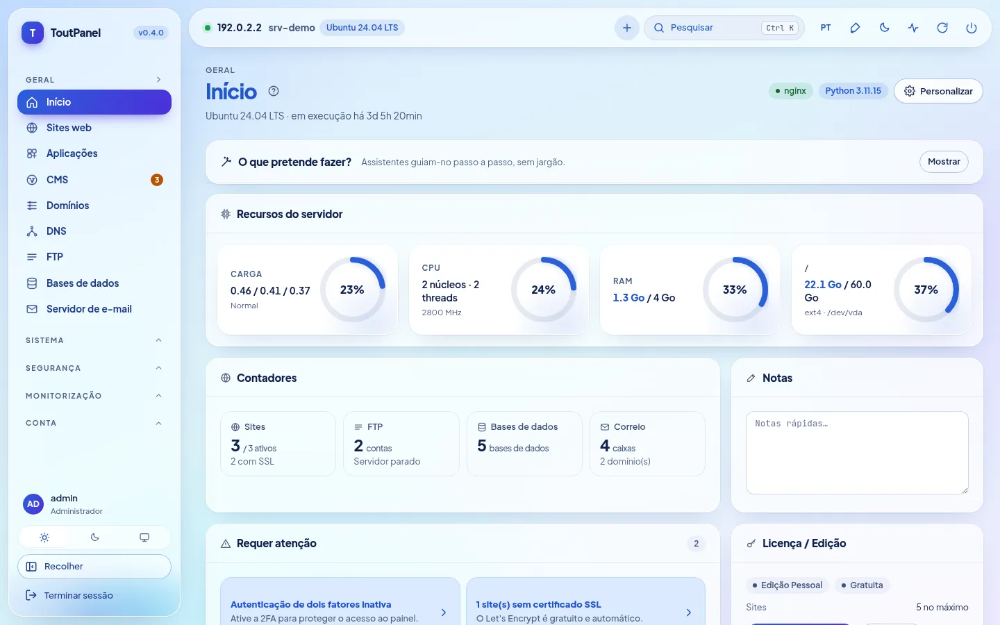

---

## O que é o ToutPanel?

O ToutPanel transforma um servidor acabado de instalar numa **plataforma de alojamento web completa**, controlada a partir do navegador. Um único comando instala a pilha (por predefinição Nginx, PHP-FPM, MariaDB, Redis ou Valkey, Certbot, Fail2ban, ou a pilha que compuser: perfis, versões, servidor web, FTP, correio, DNS, aceleradores), o painel e o respetivo serviço; depois, cria os seus sites, bases de dados, caixas de correio, zonas DNS e certificados com alguns cliques, sem editar um único ficheiro de configuração.

Destina-se tanto a quem aloja **os seus próprios sites** (edição Pessoal gratuita, sem chave nem registo) como a **agências e empresas de alojamento** que revendem alojamento: contas de revendedor e de cliente, planos e quotas, faturação, marca branca, multisservidor e alta disponibilidade (edições Profissional e Empresarial).

Os seus dados ficam **no seu servidor**: nenhum tipo de letra nem CDN externo na interface, nenhuma chamada ao servidor de licenças enquanto não houver uma licença ativada.

**Este README é deliberadamente completo e honesto.** Cada funcionalidade está marcada como *(experimental)* quando o é, **Pro** quando exige uma edição paga, e cada secção indica o que foi **realmente executado** pelos testes e o que só o foi com simulações ou nunca o foi. O quadro [O que foi realmente testado, simulado ou não testado](#o-que-foi-realmente-testado-simulado-ou-não-testado) reúne tudo isto, e as [Limitações conhecidas](#limitações-conhecidas) enumeram as reservas. Se uma funcionalidade for crítica para si, valide-a num servidor de teste antes de a levar para produção.

> **Este repositório não contém qualquer código-fonte.** Publica apenas o que serve para instalar o painel: os instaladores `install.sh` e `install.ps1`, o painel compilado (`dist/`, pacotes Python «apenas bytecode»), as notas de versão, a licença e `version.json`.

## Instalação rápida

**Linux** (como `root`, de preferência num servidor acabado de instalar):

```bash
curl -sSL https://raw.githubusercontent.com/qu3ntin01/toutpanel/main/install.sh | sudo bash -s -- --lang pt
```

A opção `--lang pt` faz com que o instalador fale português (de Portugal) e defina o português como idioma inicial do painel.

**Windows** (PowerShell **como administrador**):

```powershell
$env:TOUTPANEL_LANG = "pt"
Set-ExecutionPolicy Bypass -Scope Process -Force
iwr -useb https://raw.githubusercontent.com/qu3ntin01/toutpanel/main/install.ps1 | iex
```

No fim, o script mostra o URL do painel (com a respetiva **entrada secreta**), a conta de administrador e a ligação para o **assistente de configuração**. Tudo se pode escolher também com opções: pilha (`--profile`, `--web`, `--php`, `--db`, `--ftp`, `--mail`, `--dns`, `--accel`…), firewall (`--firewall`), versão exata (`--version`), idioma (`--lang`), pasta (`--home`, `/var/toutpanel` por predefinição) e palavra-passe sem a mostrar na lista de processos (`TOUTPANEL_PASSWORD`, `--password-file`, `--password-stdin`). O **[assistente de instalação](https://toutpanel.com/installation-assistant)** gera a linha de comandos com menus. Detalhes, pré-requisitos, portas e resolução de problemas: [Instalação completa](#instalação-completa).

## Visão geral

| | |
|---|---|
| **Sistemas** | Linux: Debian 11+, Ubuntu 20.04+, AlmaLinux / Rocky Linux / RHEL / CentOS Stream / Oracle Linux 8+, Fedora, com outras famílias numa pilha reduzida (openSUSE, Arch, Alpine, Amazon Linux…) e um **nível de suporte** apresentado (`toutpanel compat`); Windows 10 / 11, Windows Server 2016 → 2025 (menos testado do que o Linux) |
| **Servidores web** | Nginx, Apache, Nginx + Apache, **Caddy**\*, **OpenLiteSpeed**\* (LSPHP, LSCache), **LiteSpeed Enterprise**\* (produto comercial, nunca arrancado nos nossos testes: ver as [limitações](#limitações-conhecidas); `--web litespeed` exige `--accept-litespeed-license`), IIS (básico); Apache + mod_php *em breve* |
| **Pilha de software** | **compositor**: perfis, versões, esquema, instalação retomável, estado real; aceleradores (OPcache, JIT, Redis / Valkey, Memcached, Varnish\*, Brotli, Zstandard\*, HTTP/3\*) |
| **PHP** | 5.6 a 8.5 lado a lado, 138 extensões no catálogo, uma versão por site, `php.ini` e pool FPM por site |
| **Aplicações** | runtimes Node.js, Python (WSGI / ASGI), Ruby, Go, Java, .NET com versão por site, systemd, PM2, Passenger; Docker e Compose; implementação Git atómica |
| **Bases de dados** | MariaDB, MySQL (distribuição, ou 8.4 / 9.x Oracle\*), Percona Server\*, PostgreSQL, MongoDB, SQLite, Redis / Memcached por conta |
| **FTP, DNS, correio** | FTP: integrado, Pure-FTPd\*, ProFTPD\*, vsftpd\*, apenas SFTP\* · DNS: BIND, PowerDNS, Knot · correio: Postfix + Dovecot, Exim\* · um único motor de cada vez, com mudança e reversão · webmail Roundcube, SnappyMail, SOGo\* |
| **Firewall e segurança** | firewall gerida (nftables, ufw, firewalld, CSF, iptables) **ou a montante**, salvaguarda contra bloqueio de acesso; Fail2ban; WAF integrado, ModSecurity, ToutWAF; antimalware; isolamento de contas (**equivalente parcial** do CageFS) |
| **CMS** | 595 CMS e aplicações no catálogo (582 verificados: 536 gratuitos, 46 comerciais), versão à escolha, instalações acompanhadas e atualizações |
| **Interface** | **interface em 10 idiomas**, 13 temas claro / escuro (**Horizon** por predefinição), cor de destaque livre, **16 assistentes** guiados, **Diagnóstico com 844 verificações**, acessibilidade a visar a WCAG 2.1 AA (**não auditada**) |
| **Documentação** | redigida em francês; traduzida para inglês, alemão, espanhol, italiano, neerlandês, português, russo, chinês e árabe em **79 % das páginas** (75 em 94, para cada um destes 9 idiomas); as 19 páginas restantes (secção Referência: API, códigos de erro, modelos… ; páginas do Diagnóstico) permanecem em francês com uma faixa de aviso; o catálogo do Diagnóstico e as mensagens da API estão traduzidos nos 10 idiomas |
| **Instaladores** | `install.sh` e `install.ps1` em 10 idiomas (inglês por predefinição, `--lang` / `--fr`…, `TOUTPANEL_LANG`, idioma do sistema), opções de pilha e de firewall, versão exata (`--version`), [assistente de instalação](https://toutpanel.com/installation-assistant) que gera o comando |
| **Automatização** | API REST (1016 operações OpenAPI), CLI `toutpanel`, webhooks assinados, scripts pré / pós-ação, Ansible e Terraform, **Marketplace de 800 módulos** de integração (maturidade apresentada) |

<sub>\* *experimental*: real, mas menos testado ou com limitações declaradas na interface e nas [limitações conhecidas](#limitações-conhecidas).</sub>

## Novidades da 0.5

A **0.5.0** é a versão **estável** (ramo [`main`](https://github.com/qu3ntin01/toutpanel/tree/main)); retoma as pré-versões **0.5.0b1** (secção **Analytics**) e **0.5.0b2** (**integração com o ToutWAF**, SSL gerido no ToutWAF), acrescenta-lhes a **secção «Servidor web» do ToutWAF** e **correções de segurança** resultantes de uma revisão independente. Cada linha indica o que é real e o que não é: «novo na 0.5» significa real e testado, mas menos comprovado do que as funcionalidades da 0.4.

| Novidade | Maturidade e reservas |
|---|---|
| **Analytics** (Monitorização → Analytics): estatísticas de afluência **autoalojadas**, ao estilo do Google Analytics — visitantes em linha, origem do tráfego, audiência, páginas, eventos, objetivos e funis, relatórios técnicos, comparação de períodos, filtros, exportações CSV / JSON, relatórios por e-mail, alertas, ligação de partilha só de leitura; **sem cookies por predefinição, endereço IP nunca conservado** | **novo na 0.5**: motor e API testados (≈ 560 testes); percursos de ponta a ponta num **verdadeiro Chromium** contra um **verdadeiro painel** (130 visitantes, 427 visualizações de página, 54 verificações iguais à verdade de referência); rastreador validado apenas no Chromium (Safari e Firefox não testados); a duração e o tempo real exatos exigem o rastreador, os registos sozinhos dão visualizações de página; sem cookies, não há visitantes recorrentes de um dia para o outro |
| **Mapa-múndi**: 236 países, zoom, continentes, cidades agrupadas, chegadas animadas em tempo real, temas claro e escuro | **novo na 0.5**: fluidez medida com renderização por software, **não numa verdadeira placa gráfica** |
| **Geolocalização DB-IP** instalada pelo painel (países, cidades, redes; CC BY 4.0, atualização mensal) | **novo na 0.5**: leitor validado na **verdadeira** base Países; bases **Cidades e Redes** validadas apenas com ficheiros sintéticos; sem base, os países são «desconhecidos» |
| **Variante Proxy**: o rastreador é servido pelo próprio site (contra os bloqueadores de publicidade) | Nginx e Apache validados com **verdadeiros servidores**; Caddy: renderização e sintaxe apenas; **OpenLiteSpeed, LiteSpeed Enterprise, IIS não suportados** (código a colar à mão) |
| **Integração com o ToutWAF**: criação de sites a partir do ToutWAF (token de API limitado entregue na ligação, repetição sem duplicados por `Idempotency-Key`, esquema publicado do formulário de criação), **SSL gerido no ToutWAF** (o ToutWAF termina o HTTPS, a página SSL do painel gere os certificados no ToutWAF), interruptores global e por servidor do cluster, **secção «Servidor web» do ToutWAF** (token predefinido de âmbito reduzido, `GET /api/capabilities`, `GET /api/sites/{id}`, progresso das tarefas, `toutpanel waf connect --ssl toutwaf|panel`, `toutpanel waf status`) | **novo na 0.5**: testada contra um **falso ToutWAF** que segue o contrato descrito pelos seus programadores (≈ 500 testes); **nada experimentado contra um verdadeiro ToutWAF** (nem a secção «Servidor web», nem o SSL gerido); rotas de renovação, de opções HTTPS e de capacidades da API de certificados do ToutWAF por confirmar; interface SSL não verificada num navegador |
| **Correções de segurança** (revisão independente, duas passagens): elevação de âmbito de um token de API (presente desde a 0.4.0), token ToutWAF composto, registos e chave privada TLS de um site, dados Analytics de um site eliminado, leitura de `X-Forwarded-For`, idempotência por token, limites de ingestão do Analytics | **real**: um teste de não regressão por correção; detalhe e gravidade no [registo de alterações](CHANGELOG.md); revisão não exaustiva (validação das diretivas de vhost, ReDoS dos analisadores não examinados) |
| **Traduções**: interface e mensagens do servidor nos 10 idiomas, página Analytics da documentação em 9 idiomas | documentação traduzida em **79 % das páginas** (75 em 94); as 19 páginas de referência restantes (catálogos do Diagnóstico, códigos de erro, API, definições, modelos) continuam em francês |

## Novidades da 0.4

A **0.4.0** é a versão **estável** anterior (as versões 0.4.0b1 e 0.4.0b2 eram pré-versões do canal `dev`). Cada funcionalidade indica a sua maturidade: **estável**, **experimental** (real e testada, mas menos comprovada ou com limitações declaradas) ou **em breve** (visível, esbatida, nunca simulada). A coluna da direita indica o que está reservado ou limitado; o detalhe honesto de cada ponto encontra-se na secção correspondente das [Funcionalidades](#funcionalidades).

| Novidade | Maturidade e reservas |
|---|---|
| **Escuta HTTP e HTTPS em simultâneo** do painel (8888 / 8443, certificado autoassinado no início); certificado Let's Encrypt do painel com a autoridade à escolha, DNS-01, wildcard e **recarregamento a quente** | estável; testado com o Pebble (servidor ACME de teste), não com o verdadeiro Let's Encrypt |
| **Instalação de uma versão exata**: `--version X.Y.Z`, `--list-versions`; **pasta `/var/toutpanel` por predefinição** | estável |
| **Firewall gerida pelo painel ou a montante**, página dedicada, portas a abrir, **salvaguarda anti-bloqueio de 60 s** | estável; regras testadas com verdadeiros nftables / iptables num espaço de nomes de rede privado |
| **Compositor de pilha**: perfis, versões, esquema de arquitetura, estimativa de memória / disco, **assistente de primeira configuração em 9 passos**, página **Pilha de software** | estável |
| **Motores DNS**: BIND, PowerDNS, Knot DNS (mudança com migração das zonas e das chaves DNSSEC, reversão) | estável; testados com os verdadeiros daemons no Ubuntu 24.04 |
| **Motores de correio**: Postfix + Dovecot, relay externo, **Exim + Dovecot**; **motores FTP**: integrado, **Pure-FTPd, ProFTPD, vsftpd, apenas SFTP** | Postfix e FTP integrado: estável; Exim e outros motores FTP: **experimental** |
| **Servidores web**: **OpenLiteSpeed** (LSPHP, LSCache), **Caddy**, **LiteSpeed Enterprise** (mudança a partir de / para Nginx, Apache, «ambos» com reversão) | **experimental**; OpenLiteSpeed e Caddy realmente testados no Ubuntu 24.04; **o LiteSpeed Enterprise nunca conseguiu arrancar** (licença de avaliação recusada), apenas a sua instalação oficial e a validação da sua configuração foram realmente executadas |
| **Aceleradores**: OPcache, JIT, APCu, Redis / Valkey, Memcached, cache FastCGI, Brotli; **Varnish, Zstandard, HTTP/3** (incluindo o Nginx de nginx.org instalável com salvaguardas) | Varnish, Zstandard, HTTP/3: **experimental**; restantes: estável |
| **Bases de dados**: MariaDB 10.6 → 11.8, **MySQL 8.4 / 9.x** (repositório Oracle), **Percona Server**, PostgreSQL 13 → 18; **palavras-passe das bases de dados cifradas em repouso** | MySQL Oracle e Percona: **experimental** (nunca instalados nem arrancados nos nossos testes) |
| **Isolamento de contas**: serviço PHP-FPM por conta na sua fatia cgroup, reforço systemd, **jaula do sistema de ficheiros** (bind mounts + bubblewrap) | opções, **desativadas por predefinição**; **equivalente parcial do CageFS** (kernel e rede partilhados); não testado: SELinux enforcing com este isolamento (o SELinux Enforcing está validado sem ele no AlmaLinux, ver [Segurança](#section-12)), cgroup v2 com limites realmente aplicados, servidor inteiro sob systemd |
| **Runtimes por site** (Node.js, Python, Go, Java, Ruby, .NET), **WSGI / ASGI**, **PM2**, **Passenger** | real: Node 20, Python 3.12, gunicorn, uvicorn, PM2, Nginx + Passenger; Go, Java, .NET simulados; Ruby não compilado |
| **Estatísticas**: GoAccess, **AWStats**, Matomo; **pré-produção** com base de dados e sincronização nos dois sentidos | GoAccess, AWStats e pré-produção (MariaDB) realmente testados; Matomo **nunca testado** contra uma instância real |
| **Cópias de segurança**: cifragem AES-256-GCM, incrementais nativas, destinos **rsync** e **Borg**, perfil «servidor completo», cópia parcial / modo estrito, teste de restauro | rsync e Borg 1.2.8 realmente testados; restic, S3, B2 e rclone **simulados**; rsync / Borg e restic: **Pro** |
| **Mensagens**: limite de envio do `mail()` do PHP, **DMARC por domínio**, **BIMI**, **DANE**, MTA-STS / TLS-RPT, **SpamAssassin**, **SOGo**, fila de espera e CalDAV / CardDAV testados | SOGo **experimental** (`sogod` nunca executado); cadeia VMC do BIMI e assinatura DNSSEC não verificadas |
| **Migração**: importação **ISPConfig** completa (SSH, arquivo, dump SQL), transferência de site ou de domínio entre clientes, **migração de contas entre servidores alargada** (correio, FTP, cron, SSL, plano) | **Pro**; cPanel / Plesk / DirectAdmin testados com arquivos **fabricados**; nunca testado em dois servidores físicos |
| **Alta disponibilidade**: IP flutuante keepalived / VRRP, armazenamento partilhado NFS / GlusterFS, replicação Dovecot, histórico por nó, modelo Zabbix, **reparação automática alargada** | **Pro**; configurações validadas pelas ferramentas reais, **nenhuma comutação testada entre duas máquinas** |
| **Autenticação**: SSO SAML / OIDC / LDAP testados contra fornecedores de teste, WebAuthn testado com um autenticador virtual, **TLS reforçado**, **alertas de início de sessão invulgar** ao titular | SSO: **Pro**; nenhum fornecedor de identidade de produção nem chave física testados |
| **Diagnóstico** (Sistema › Diagnóstico): **844 verificações**, **90 correções automáticas** com pré-visualização, **16 assistentes** de configuração guiados com teste real | agendamento do Diagnóstico: **Pro**; parte das verificações é testada com serviços simulados |
| **Mensagens do servidor traduzidas** nos 10 idiomas; **ToutWAF remoto**; compatibilidade alargada das distribuições; **instalador multilingue** com opções de pilha | estável; algumas mensagens compostas dinamicamente permanecem em francês |
| **Marketplace** de 800 módulos de integração (faturação, gateways, monitorização, CI/CD, IaC, SSO, DNS / CDN, cópias de segurança, temas…) | **5 estáveis**, 199 beta, 596 **gerados** (nunca experimentados com o serviço real) |
| Apache + mod_php | **em breve** (recusado de forma limpa, nunca simulado) |

Detalhe e limitações: [Limitações conhecidas](#limitações-conhecidas) · [CHANGELOG.md](CHANGELOG.md).

## Funcionalidades

O plano segue as **20 secções** de um referencial de painel de alojamento completo (do nível cPanel / Plesk / ISPConfig / DirectAdmin às funcionalidades avançadas), seguindo-se o ecossistema. Em cada secção, a linha «**Real / limitações**» indica com honestidade o que foi executado e o que não foi. Documentação detalhada de cada página: **[toutpanel.com/docs](https://toutpanel.com/docs/)** (também servida pelo painel em `/help/` quando é construída durante a instalação, com ajuda contextual em cada página).

<a id="section-1"></a>

### 1. Contas, utilizadores e multi-tenant

- Hierarquia **administrador → revendedor (Pro) → cliente → subutilizador**; um revendedor só vê e só cria dentro do seu perímetro.
- **RBAC fino**: permissões por módulo e por ação, intersecção do papel, do plano, do perfil de acesso e do pai; perfis integrados **Completo, Programador, Contabilista, Webmaster, Só de leitura** e perfis personalizados.
- **Planos e quotas**: disco, inodes, tráfego, sites, domínios, bases de dados (e tamanho por base), domínios e caixas de correio, tarefas agendadas, contas FTP, zonas DNS, cópias de segurança, subutilizadores; quotas contabilizadas e bloqueantes na criação. O tráfego mensal não corta o site: desencadeia um alerta, a faturação do excesso e a suspensão automática se a ativar.
- **Limites de recursos por conta**: utilizador de sistema dedicado, fatia systemd (CPU, memória, E/S, processos) aplicada às tarefas agendadas, implementações Git, aplicações, terminal e instâncias Redis / Memcached; **aos pedidos PHP apenas com o isolamento «serviço PHP-FPM por conta»** (opção, desativada por predefinição). Limite de ligações simultâneas por site: **apenas Nginx**.
- **Suspensão** e reativação, manuais ou automáticas (falta de pagamento, excesso de quota após período de tolerância).
- **Início de sessão «como»** (impersonação) registado no registo de auditoria e limitado no tempo.
- **Transferência** de um site ou de um domínio de um cliente para outro: ficheiros, FTP, cópias de segurança, bases de dados, zonas DNS, domínios de correio, tarefas agendadas, pré-produção, projetos Compose; propriedade dos ficheiros, vhost e pool PHP-FPM regenerados, quotas verificadas, pré-visualização antes da execução.
- **Criação em massa** (até 500 contas), **importação / exportação CSV** (1 000 linhas, proteção contra injeção de fórmulas, UTF-8 / UTF-16 / Windows-1252), **notas internas** e **etiquetas** (tags) filtráveis.

> **Real / limitações**: a hierarquia, as permissões, as quotas, a suspensão e a transferência são cobertas por testes de API, e os perfis são verificados rota a rota. O `setquota` (quotas de disco e de inodes do sistema de ficheiros) só foi verificado com um executor fictício e pressupõe um sistema de ficheiros montado com `usrquota`. Os cgroups v2 reais com limites aplicados não foram testados. A suspensão de uma conta no mestre não é repercutida nas suas contas espelho dos nós; os sites alojados num nó não são transferíveis entre clientes.

<a id="section-2"></a>

### 2. Autenticação e acesso ao painel

- **2FA TOTP** com códigos de recuperação, imposta por papel ou por plano; **chaves de segurança WebAuthn / FIDO2 e passkeys** (incluídas na edição Pessoal).
- **SSO empresarial (Pro)**: **OpenID Connect** (descoberta, PKCE), **SAML** (metadados, anti-repetição, grupo → papel), **LDAP / Active Directory** (LDAPS / StartTLS com **verificação do certificado por predefinição**); um início de sessão SSO nunca concede por predefinição o papel de administrador.
- **Restrição de acesso** ao painel por lista de permissões de endereços IP / CIDR e por país (GeoIP, base MaxMind a fornecer) com **recusa de guardar uma regra que excluiria o administrador**.
- **Anti-força bruta**: bloqueio persistente por IP e por conta, tempo de resposta constante, **captcha ALTCHA** autoalojado após N falhas, jail Fail2ban do painel, alerta de rajada de falhas.
- **Sessões**: lista, revogação (também do lado do administrador), expiração absoluta e por inatividade.
- **Política de palavras-passe**: comprimento, classes de carateres, palavras comuns, nome de utilizador, **Have I Been Pwned** em k-anonimato (desativável), histórico, expiração; **reposição** por ligação assinada de utilização única.
- **Registo de inícios de sessão** e **alertas de início de sessão invulgar** (novo endereço IP, novo país, novo dispositivo) enviados ao administrador **e ao titular da conta** (desativável por conta, e-mail ou SMS).
- **Painel em HTTPS**: escuta HTTP e HTTPS em simultâneo, certificado autoassinado com SAN no início (regenerado se o endereço mudar), depois **Let's Encrypt para o nome de anfitrião do painel** (ZeroSSL, Buypass ou ACME personalizado, DNS-01 e wildcard) com recarregamento a quente; **entrada secreta** no URL (sem ela, o painel responde 404).

> **Real / limitações**: TOTP, bloqueio, sessões, política de palavras-passe: testados. **WebAuthn**: testado com um autenticador virtual do Chromium (registo e início de sessão reais), **não com uma chave física**. **OIDC**: testado contra um servidor OIDC local real (PKCE verificado, tokens forjados recusados); **SAML**: testado com um fornecedor de identidade de teste (31 testes: asserção válida, expirada, repetida, falsificada…); **LDAP**: testado contra um verdadeiro OpenLDAP (`slapd`); **nenhum fornecedor de identidade real** (Keycloak, Entra ID, Okta…) foi experimentado. O **novo país** é detetado com uma verdadeira base MaxMind de teste. Let's Encrypt do painel: testado com **Pebble** + certbot 5.8 + BIND, **não** com o serviço real. A biblioteca SAML (`python3-saml` + `xmlsec1`) é facultativa; o painel arranca sem ela.

<a id="section-3"></a>

### 3. Web e alojamento de sites

- **Sites com um clique**: multidomínio, alias, **domínios estacionados**, domínios **redirecionados**, **wildcard** (`*.exemplo.com`), PHP-FPM, estático, reverse proxy, aplicações. Um subdomínio é um nome de domínio do site ou um site à parte.
- **Servidores web**: vhosts **Nginx, Apache, Nginx + Apache, Caddy\*, OpenLiteSpeed\*, LiteSpeed Enterprise\* ou IIS** gerados a partir de modelos Jinja2 e **validados antes do recarregamento** (`nginx -t`, `apachectl -t`, `caddy validate`…), com regresso aos últimos vhosts válidos em caso de falha; **mudança** Nginx ↔ Apache ↔ «ambos» ↔ Caddy ↔ OpenLiteSpeed ↔ LiteSpeed com reversão; as funcionalidades que um servidor não reproduz (WAF integrado, ModSecurity, filtragem por país, `.htaccess`…) são **assinaladas**, nunca ignoradas em silêncio.
- **PHP multiversão** 5.6 → 8.5 lado a lado (Sury, PPA ondrej, Remi, windows.php.net), uma versão e **um pool PHP-FPM por site**, sob o utilizador da conta; **`php.ini` por site** (13 diretivas permitidas, incluindo `disable_functions` e `open_basedir`, validadas contra injeção), **138 extensões** no catálogo (geridas por versão de PHP, administrador), ionCube, **parâmetros FPM** (`pm`, `max_children`, `start_servers`, timeouts, `max_requests`…).
- **Runtimes aplicacionais**: Node.js, Python (**WSGI / ASGI**: gunicorn, uvicorn, hypercorn, daphne, waitress), Ruby, Go, Java, .NET, com **versão de runtime por site** (transferências oficiais verificadas por SHA-256, `uv` para Python, nunca compilação; nvm, pyenv, etc. detetados), unidade **systemd**, **PM2**, **Phusion Passenger** (Nginx e Apache), proxy para uma porta ou um socket Unix (WebSocket incluído), recarregamento sem corte, `toutpanel runtimes`.
- **Reverse proxy** para uma porta ou um socket, **repartição de carga** (round robin, `least_conn`, `ip_hash`).
- **Redirecionamentos** 301 / 302 (com ou sem query string, expressões regulares), forçar HTTPS, anfitrião canónico `www`.
- **Cabeçalhos HTTP** personalizados (CSP, X-Frame-Options…) e **HSTS** (duração ajustável, `includeSubDomains`, `preload` com confirmação e verificação prévia).
- **Diretivas Nginx / Apache / Caddy personalizadas por vhost** (administrador): escrita, regeneração, teste do servidor, **restauro automático** se o servidor as recusar.
- **Diretórios protegidos** por palavra-passe (bcrypt) e regras de acesso por IP, **páginas de erro** personalizadas, **anti-hotlink**, **modo de manutenção** (503 com `Retry-After`, IP autorizados).
- **HTTP/2**, **HTTP/3 / QUIC\*** (nativo com Caddy e OpenLiteSpeed; com Nginx compilado com QUIC, ou Nginx de nginx.org instalável a partir da página Aceleradores com simulação, cópia de segurança e reversão; impossível apenas com Apache), compressão **Brotli** (se o módulo existir), **Gzip**, **Zstandard\***.
- **Cache**: cache FastCGI (Nginx), **OPcache**, **Redis / Valkey**, **Memcached**, **Varnish\*** (apenas HTTP), LSCache (OpenLiteSpeed e LiteSpeed Enterprise), com **purga a partir do painel** (botão «Limpar a cache» por site e por acelerador).
- **Pré-produção (staging)**: clone de um site (ficheiros + base de dados), substituição de URL **sem wp-cli** (valores PHP serializados incluídos), tabelas excluídas, sincronização **para a produção, a partir da produção ou nos dois sentidos** (ficheiros: o mais recente prevalece; base de dados fundida linha a linha por chave primária, regra de conflito à escolha, **eliminações nunca propagadas**), cópia de segurança prévia dos dois lados.
- **Raiz do site** configurável (`public/`, `web/`…), **registos de acesso e de erros por site** consultáveis em direto e transferíveis (rotação logrotate).
- **Estatísticas de tráfego** com três motores: **GoAccess**, **AWStats**, **Matomo** «para este site»; **acompanhamento da largura de banda** por site, mês a mês.

> **Real / limitações**: Nginx: vhosts servidos por um **verdadeiro Nginx** e interrogados com curl (redirecionamentos, 401 / 403, anti-hotlink, manutenção, wildcard, páginas de erro). Apache: vhost validado por `apache2 -t`, **nunca servido a sério** nos nossos testes; Nginx à frente do Apache: nunca arrancados em conjunto; a mudança Nginx / Apache é testada com um executor fictício e a sintaxe real dos vhosts. OpenLiteSpeed: verdadeiro OpenLiteSpeed arrancado que serve PHP, estático, redirecionamento, autenticação, LSCache. **Caddy**: verdadeiro Caddy 2.11 (HTTP, HTTPS, HTTP/2, HTTP/3, PHP-FPM, proxy, recarregamento sem corte) no Ubuntu 24.04; família RHEL, ACME real não executados. **LiteSpeed Enterprise: nunca arrancado** (ver as [limitações](#limitações-conhecidas)). `disable_functions` / `open_basedir`: verificados com um verdadeiro PHP-FPM. Instalação das versões de PHP a partir dos repositórios: não executada nos nossos testes (Internet). **Runtimes**: real para Node 20, Python 3.12, gunicorn, uvicorn, PM2 e Nginx + Passenger; **Go, Java e .NET simulados**, Ruby não compilado, unidade systemd de uma aplicação não arrancada. **HTTP/3**: verdadeiro binário Nginx 1.31 a servir HTTP/3 a um cliente QUIC; a instalação do pacote nginx.org na máquina não foi executada. O Brotli depende do módulo Nginx. Memcached e Varnish (VCL compilada pelo `varnishd` 7.1): executados a sério, mas a colocação em serviço completa do Varnish à frente do Nginx não o foi. **GoAccess e AWStats**: executados a sério; **Matomo: nunca testado contra uma instância real** (falso servidor de API). **Pré-produção**: testada numa verdadeira instância MariaDB, a fusão linha a linha só é válida para MySQL / MariaDB (PostgreSQL e SQLite são copiados sem substituição de URL). O HTTP/3 do Apache e a cache FastCGI do Apache não existem.

<a id="section-4"></a>

### 4. SSL / TLS

- **Let's Encrypt**, **ZeroSSL** (EAB), **Buypass**, servidor ACME personalizado; validação **HTTP-01** e **DNS-01** (escrita do TXT em BIND / PowerDNS ou na Cloudflare, OVH, Route53), certificados **wildcard**, certificados **SAN / multidomínio** (todos os nomes, alias e domínios estacionados do site).
- **Renovação automática** diária com recarregamento dos serviços em causa (servidor web, correio, FTP, painel) e **alerta em caso de falha**; **alertas antes da expiração** aos 30 / 14 / 7 / 1 dias (ajustáveis).
- **Importação** de certificados comerciais (CRT, chave, cadeia, **PFX**) e **geração de CSR** (RSA / EC, SAN, chave privada mantida no servidor); certificados autoassinados; página **Certificados** com validade, emissor e expiração de todos os certificados.
- **SSL para os serviços**: correio (SNI Postfix / Dovecot), FTP / FTPS, painel, nome de anfitrião.
- **TLS reforçado**: perfis Mozilla (moderno = apenas TLS 1.3, intermédio por predefinição, antigo), suites personalizadas validadas, **OCSP stapling** ajustável, curvas e DH ffdhe2048, `ssl_session_tickets off`, HSTS por site.

> **Real / limitações**: testado com o **Pebble** (servidor ACME do Let's Encrypt), o verdadeiro certbot 5.8 e um verdadeiro BIND: HTTP-01, DNS-01, wildcard, renovação, falha, EAB. **Nenhuma emissão junto do verdadeiro Let's Encrypt, da ZeroSSL ou da Buypass foi executada.** O DNS-01 exige que a zona do domínio seja gerida pelo painel (ou por um fornecedor configurado). TLS: verificado com um verdadeiro Nginx, `openssl s_client` (protocolos e suites realmente oferecidos por perfil), um respondedor OCSP real e `apache2 -t`; a adaptação ao OpenLiteSpeed e ao Caddy não é testada; sem criptografia pós-quântica. Os certificados FTP não são vigiados pelos alertas de expiração.

<a id="section-5"></a>

### 5. DNS

- Zonas servidas por **BIND, PowerDNS ou Knot DNS** (um único servidor local de cada vez; mudança com migração das zonas e das chaves DNSSEC, reversão) ou enviadas para um fornecedor.
- **14 tipos de registos**: A, AAAA, CNAME, MX, TXT, SRV, NS, CAA, PTR, TLSA, DS, SSHFP, HTTPS, SVCB, com validação fina; **modelos de zona** aplicados na criação (variáveis `{domain}`, `{ip}`, `{mail}`…).
- **DNSSEC**: assinatura automática (BIND `dnssec-policy`, Knot KASP, PowerDNS), DS e DNSKEY apresentados para o registrador, rotação manual (BIND, Knot; **PowerDNS: rotação fora do painel**).
- **Servidores secundários** por TSIG (AXFR + NOTIFY), automáticos nos nós do parque (**Pro**).
- **Fornecedores externos** por API: **Cloudflare, OVH, Route 53, PowerDNS** (envio e importação de zonas); zonas externas: lista, exportação (BIND, CSV, JSON) e **verificação de propagação por `dig`**.
- **Importação / exportação BIND**, TTL por registo e por zona, **números de série automáticos** (`AAAAMMDDnn`), **DNS inverso (PTR)** dos IP do servidor, **verificação de propagação** (1.1.1.1, 8.8.8.8, 9.9.9.9 e servidor local) e validação da sintaxe (`named-checkzone` antes do recarregamento).
- **Registos de correio automáticos**: MX, SPF, DKIM, DMARC, SRV IMAP / SMTP / POP3, `autoconfig` / `autodiscover`, MTA-STS, TLS-RPT, CalDAV / CardDAV; IPv6, nomes internacionais (IDN), anfitrião de correio fora da zona.

> **Real / limitações**: BIND, PowerDNS e Knot reais (`named-checkzone`, `dig`, ciclo de mudança BIND → PowerDNS → Knot que conserva o mesmo DS). As **API da Cloudflare, OVH, Route 53 e PowerDNS foram testadas com um transporte simulado**, nunca com os serviços reais. O **cluster de servidores secundários** nunca funcionou com dois servidores DNS reais. O PTR só é efetivo se o bloco de endereços lhe for delegado: o painel não pode pedi-lo ao seu fornecedor. A propagação não verifica os tipos PTR, TLSA, DS, SSHFP, HTTPS e SVCB.

<a id="section-6"></a>

### 6. Correio eletrónico

- **Postfix + Dovecot + OpenDKIM**, Rspamd ou SpamAssassin, **Exim + Dovecot\*** à escolha (subconjunto do Postfix, limitações declaradas), relay externo; domínios, **caixas com quotas**, **alias**, **reencaminhamentos**, **endereço catch-all**, **listas de distribuição** (mlmmj), **resposta automática com intervalo de datas**, **filtros Sieve** (regras guiadas ou script, ManageSieve), IMAP / POP3 em TLS, submissão 587 / 465.
- **Webmail** Roundcube, SnappyMail ou **SOGo\*** instalado com um clique, com **início de sessão direto a partir do painel**.
- **SPF, DKIM** (geração, **rotação com dupla publicação**), **DMARC por domínio** (`none` / `quarantine` / `reject`, `pct`, `rua`, `ruf`, `sp`, `adkim`, `aspf`, `fo`, **aumento gradual guiado**), **MTA-STS** e **TLS-RPT**, **BIMI** (logótipo SVG alojado pelo painel, publicado apenas com um DMARC de aplicação a 100 %), **DANE** (TLSA `3 1 1` para as portas de correio, **rotação em dois tempos**).
- **Antispam** Rspamd (definições por domínio e por caixa, aprendizagem spam / ham) ou **SpamAssassin** gerido (spamd, `spamass-milter`, `user_prefs` por caixa; amavis experimental), **antivírus ClamAV**, **greylisting**, **RBL / DNSBL**, **listas de permissão e de bloqueio** globais, por domínio ou por caixa.
- **Limitação do ritmo de envio**: por caixa, por plano e por predefinição (utilizador SMTP autenticado, via Rspamd) **e limite do `mail()` do PHP por site e por conta** (envelope `sendmail` do painel: registo, tetos em 1 h e 24 h, alerta, proteção contra injeção de cabeçalhos) para que um site pirateado não envie spam.
- **Relay de saída / smarthost**, **fila de espera** (flush, suspensão, eliminação), **registo e seguimento de uma mensagem**, **autoconfiguração** dos clientes (Outlook, Thunderbird), **fetchmail**, **CalDAV / CardDAV** (Radicale), **vigilância da reputação do IP** (blacklists, em todos os endereços públicos do servidor e nos IP de saída dos nós).

> **Real / limitações**: a fila de espera é testada com um **verdadeiro Postfix**; Dovecot: configuração validada por `doveconf`; CalDAV / CardDAV: **verdadeiro Radicale 3.8**; SpamAssassin: `spamassassin --lint`, `spamd` e `spamc` reais; o `mail()` do PHP: envelope executado a sério com o verdadeiro `mail()` do PHP. **Simulados**: Rspamd, ClamAV, mlmmj, fetchmail, as integrações `spamass-milter` / amavis; **SOGo: experimental, `sogod` nunca executado**. BIMI: a **cadeia do certificado VMC não é verificada**; DANE: a assinatura DNSSEC não é verificada (o DANE só faz sentido com DNSSEC). O limite do `mail()` do PHP **não vê** um script que chame diretamente o `sendmail` ou abra uma ligação SMTP. Com o Exim: sem seguimento de mensagens nem listas de distribuição; com o SpamAssassin: sem limite de ritmo por caixa nem greylisting. Os relatórios DMARC recebidos não são analisados. A publicação DNS automática pressupõe que a zona é gerida pelo painel. Um servidor de correio fiável pressupõe um IP público fixo, um DNS inverso correto e as portas 25 / 465 / 587 abertas.

<a id="section-7"></a>

### 7. Bases de dados

- **MariaDB (10.6 → 11.8), MySQL, Percona Server\*, PostgreSQL (13 → 18), MongoDB, SQLite**: bases de dados, utilizadores e **privilégios** (completos, só de leitura, personalizados), **acesso remoto autorizado por IP** (regra de firewall, `bind-address`, `pg_hba.conf`; `0.0.0.0/0` recusado).
- **Adminer** (MySQL e PostgreSQL) e **phpMyAdmin** (MySQL) instaláveis em versões à escolha com compatibilidade PHP verificada, **início de sessão único (SSO) a partir do painel**; **o pgAdmin não está integrado**.
- **Importação / exportação** (gzip em tempo real), **dump agendado** (tarefa agendada), **manutenção** (verificação, reparação, otimização, análise), **quotas de tamanho** por base (privilégios retirados e depois restabelecidos, alerta).
- **Escolha da versão do SGBD** (repositórios oficiais MariaDB e PostgreSQL, mudança de versão principal com **cópia de segurança prévia**, sem regressão de versão); MySQL 8.4 / 9.x (repositório Oracle) e Percona\*: um único motor da família MySQL de cada vez.
- **Servidores adicionais** (Docker), **Redis / Memcached por conta** (instância isolada, socket Unix, `maxmemory` do plano, fatia cgroup da conta).
- **Replicação (Pro)**: MariaDB / MySQL (GTID) e PostgreSQL (streaming), assistente de comandos **e** replicação executada pelo painel, promoção manual ou **comutação automática** com reescrita do anfitrião das bases de dados.
- **Palavras-passe das bases de dados cifradas em repouso** (Fernet, chave do painel guardada em cópia de segurança), listas sem palavra-passe, **revelação explícita e registada**.

> **Real / limitações**: SQLite: real. **MariaDB**: uma instância real serve para os testes de pré-produção e do Diagnóstico, mas a camada de administração SQL (utilizadores, privilégios, quotas) é testada sobretudo com um **executor SQL simulado**; **PostgreSQL: simulado**; MongoDB (módulo `pymongo` facultativo): testado com um falso cliente e, quando a imagem está presente, um verdadeiro `mongod` 7 no Docker. MySQL Oracle e Percona: pacotes e repositórios verificados, **nunca instalados nem arrancados**. A replicação **nunca foi montada entre dois servidores reais**, e a comutação automática não é um consenso. As **credenciais root dos motores são guardadas em claro em `settings.json`** (permissões 0600); o `mongodump` expõe a palavra-passe como argumento de comando.

<a id="section-8"></a>

### 8. Ficheiros e acesso

- **Gestor de ficheiros**: upload, **editor CodeMirror** com realce de sintaxe, permissões (`chmod`) e proprietário (`chown`), arquivos zip / tar, **pesquisa** por nome e no conteúdo, **reciclagem**, **ocupação do disco e dos inodes por pasta**, arrastar e largar, **correção das permissões e do proprietário com um clique**.
- **Servidor FTP / FTPS integrado** (várias contas, diretório restrito, direitos, quotas, IP autorizados, registo) ou **Pure-FTPd\*, ProFTPD\*, vsftpd\*, apenas SFTP\*** (contas do painel sincronizadas, mudança com reversão).
- **SFTP / SSH em chroot por utilizador** (drop-in `sshd` validado por `sshd -t` com reversão, bind mounts), **shell restrita** por jailkit ou `rbash`, **chaves SSH** (ed25519, ECDSA, RSA ≥ 2048).
- **Terminal web** (bash no Linux, PowerShell no Windows; um cliente permanece sob o utilizador da sua conta).
- **Quotas de disco e de inodes** por conta, **WebDAV** com as contas FTP.

> **Real / limitações**: FTPS: **verdadeiro handshake** com certificado validado; terminal: verdadeiro bash em PTY; jailkit: verdadeiros `jk_init` / `jk_jailuser` e verdadeira shell enjaulada quando o jailkit está instalado; WebDAV: verdadeiro `wsgidav` (módulos facultativos `wsgidav` + `a2wsgi`). Motores FTP alternativos: executados a sério no Ubuntu 24.04, **família RHEL não testada**. O `sshd` real nunca é reiniciado pelos testes; `setquota`: ver a secção 1. O terminal Windows é simplificado sem o módulo `pywinpty`.

<a id="section-9"></a>

### 9. Aplicações e implementação

- **Instalador com um clique**: catálogo de **595 CMS e aplicações** (ver [CMS](#cms)), incluindo WordPress, Joomla, Drupal, PrestaShop, Nextcloud, Laravel, Symfony, Matomo, Dolibarr, Moodle, phpBB, MediaWiki, Ghost.
- **WP Toolkit**: wp-cli, atualizações do núcleo, dos plugins e dos temas, reforço, clonagem, **deteção de instalações vulneráveis** (feed Wordfence Intelligence), alerta crítico.
- **Implementação Git**: clone e atualização (HTTPS com token ou SSH com chave de implementação por site), ramo, etiqueta ou commit, **webhooks GitHub / GitLab assinados**, **scripts pós-implementação**, atualização agendada, **implementação atómica** (`releases/`, `shared/`, ligação `current`, reversão).
- **Composer, npm, pip** executados a partir de um site (lista de permissões `install` / `ci` / `update`, sob o utilizador da conta).
- **Docker**: contentores, imagens, **redes, volumes**, espaço em disco e limpeza, `docker run` validado, projetos **Docker Compose** por conta com site proxy e recusa de YAML perigosos (privilegiado, socket, montagens sensíveis).
- **Assistentes** «site web», «instalação de aplicação», «implementação Git», «PHP» (ver a [secção 19](#section-19)).

> **Real / limitações**: Git: verdadeiro `git` num repositório local (clone, atualização, webhook assinado, implementação atómica num verdadeiro sistema de ficheiros); **GitHub e GitLab reais nunca contactados**. `npm` e `pip` reais sob o utilizador do site; Composer: não executado (sem phar no ambiente de teste). Docker: contentores, imagens, redes e volumes testados com um executor fictício e, quando um daemon responde, um verdadeiro ciclo Docker. **Instalações de CMS: transferências simuladas** (nenhuma instalação real do catálogo foi executada de ponta a ponta pela suite automática); WordPress / wp-cli reais não executados pelos testes, exceto o Matomo instalado de ponta a ponta pelo assistente «aplicação».

<a id="section-10"></a>

### 10. Tarefas agendadas

- **Editor visual** campo a campo e **sintaxe cron em bruto** sincronizados, pré-visualização das 5 próximas execuções, atalhos (`@daily`…), tipos: visitar um endereço, executar um comando, fazer cópia de segurança de um site ou de uma base de dados.
- **Execução sob o utilizador da conta ou do site, nunca como root** para um cliente: o comando é **recusado** em vez de ser executado como root; `root` está reservado ao administrador, com confirmação e registo no registo de auditoria; limites cgroup da conta aplicados.
- **Agendador** à escolha: interno (APScheduler, por predefinição), **temporizadores systemd** (`OnCalendar`, `Persistent=true`) ou `/etc/cron.d`, com regresso reversível.
- **Notificação por e-mail** (nunca / erro / sempre), **histórico de execução** (estado, duração, código, início da saída), **frequência mínima imposta pelo plano**, execução imediata, **assistente** com teste a seco.

> **Real / limitações**: a comparação com o verdadeiro `systemd-analyze calendar` (18 expressões) e o `systemd-analyze verify` são reais; **um temporizador systemd nunca foi desencadeado a sério**. Com o agendador interno, **as tarefas não são executadas quando o painel está parado** (recuperação de menos de 5 minutos no reinício); não existe importação de um crontab existente. No Windows, as tarefas dos clientes são recusadas.

<a id="section-11"></a>

### 11. Cópias de segurança e restauro

- **Granularidade**: site, base de dados, pasta ou ficheiro, caixa de correio, domínio de correio, conta, **servidor inteiro**; cópia de segurança a pedido e **agendamentos** com retenção **GFS** (diária, semanal, mensal).
- **Motor nativo (zip), incluído em todas as edições**: arquivos com soma SHA-256 e verificação CRC, **cifragem AES-256-GCM** opcional (frase-passe, por predefinição, por destino, por agendamento ou por cópia de segurança), **cópias de segurança incrementais** (uma completa e depois incrementais, restauro do estado de cada cópia de segurança, retenção que preserva as cadeias). Destino: pasta local.
- **Destinos remotos (Pro)**: **rsync** (pasta ou SSH, hard links `--link-dest` ou arquivos cifráveis), **Borg** (cifrado, desduplicado, local ou SSH), **restic** (cifrado, desduplicado: S3 e compatíveis, SFTP, Backblaze B2, e via rclone FTP / Google Drive / OneDrive / Dropbox / WebDAV). Segredos cifrados na base de dados, nunca devolvidos pela API.
- **Perfil «Servidor completo (configuração incluída)»**: vhosts gerados, pools PHP-FPM, certificados e chaves, DKIM, correio, DNS, FTP, crontabs, regras de firewall e dados do painel; **arquivo cifrado obrigatório**, **restauro guiado** num servidor novo (simulação, ficheiros substituídos conservados em `.pre-restore-…`, serviços recarregados). Não inclui **nem o sistema, nem os pacotes, nem os proprietários dos ficheiros**.
- **Restauro granular** (explorar o arquivo, escolher ficheiros, no local ou numa pasta) e **em autosserviço pelo cliente**, com perímetro controlado; **cópias de segurança de segurança automáticas** antes de uma operação arriscada (restauro, eliminação, instalação, atualização de um SGBD).
- **Um dump de base de dados falhado não é ignorado**: cópia de segurança «parcial» assinalada (distintivo, alerta) ou recusada em **modo estrito**; **verificação de integridade** (SHA-256, CRC, `restic check`), **teste de restauro** (dumps reimportados numa base de dados temporária, amostra de ficheiros verificada por soma) e **relatório semanal** (desativados por predefinição), **alertas de falha**.
- **Instantâneos** Btrfs, ZFS ou LVM facultativos para congelar a leitura durante uma cópia de segurança.

> **Real / limitações**: arquivos nativos, cifragem, cadeias incrementais, perfil servidor completo: executados a sério; **rsync** (pasta local e SSH por um `sshd` efémero) e **Borg 1.2.8** (local e SSH): reais, **nunca para um servidor remoto real**; Borg 2.x não testado. **restic, S3, Backblaze B2 e rclone: comandos gerados e verificados com um executor fictício, nunca executados contra um repositório ou serviço real.** Snapshots ZFS / LVM / Btrfs e teste de restauro MySQL / PostgreSQL: executor ou SGBD simulado; o `zfs send` não está implementado. O **nome do ficheiro de arquivo cifrado está em claro** (alvo e data); o rsync «tree» deposita ficheiros **em claro**; uma frase-passe perdida torna os arquivos ilegíveis. O servidor completo não reaplica automaticamente a firewall. As cópias de segurança remotas, restic, Borg e rsync exigem a edição **Pro**; não confundir com a sincronização rsync / lsyncd da alta disponibilidade, que não é um destino de cópia de segurança.

<a id="section-12"></a>

### 12. Segurança do servidor e isolamento

- **Firewall** nftables, firewalld, UFW, CSF ou iptables (deteção automática) **gerida pelo ToutPanel ou a montante** (grupo de segurança cloud, firewall do fornecedor de alojamento: o painel não toca então em nenhuma regra e lista as **portas a abrir no fornecedor**); regras, listas de IP, serviços predefinidos, portas em escuta e exposição, **proteção anti-DDoS básica** (SYN por IP, limite de ligações, deteção de scans), **salvaguarda de 60 s**: sem confirmação, a alteração é anulada pelo próprio servidor.
- **Fail2ban**: jails SSH, Postfix, Dovecot, FTP, painel e WordPress (`wp-login.php`, `xmlrpc.php`), banimentos listados, adicionados, retirados, teste de filtro.
- **WAF integrado** (injeções SQL, XSS, RCE, travessia de diretórios, scanners, robots, ritmo, banimento automático; bloqueio por país **Pro**) e **ModSecurity + OWASP CRS** por site, regras desativáveis por site (**Pro**); **ToutWAF**, o WAF / reverse proxy do fabricante, motor recomendado (**Pro**), local ou **remoto** noutro servidor; **BunkerWeb** e **SafeLine** (Docker) continuam disponíveis.
- **Antimalware**: ClamAV, Linux Malware Detect, YARA, e **ImunifyAV / Imunify360 se já estiver instalado** (o painel nunca o instala); quarentena, restauro, análise agendada (Pro). **Deteção de rootkits** (rkhunter, chkrootkit), **integridade** dos ficheiros do sistema (debsums, `rpm -Va`, AIDE) e dos ficheiros do painel.
- **Análise de vulnerabilidades**: WordPress (feed Wordfence) e, **para além do WordPress**, base **OSV** (Joomla, Drupal, PrestaShop, OpenCart, Laravel, Symfony, TYPO3, Craft CMS, Pimcore, Silverstripe, Grav, Matomo, Django, Flask, Ghost, Strapi…) mais `composer audit`, `npm audit` e `pip-audit` sob o utilizador da conta.
- **Isolamento de contas**: um **utilizador de sistema por conta**, pool PHP-FPM por site, **serviço PHP-FPM por conta na sua fatia cgroup** (opção `per-account`, **desativada por predefinição**), **reforço systemd** (`PrivateTmp`, `ProtectSystem`, `NoNewPrivileges`, filtro de chamadas de sistema…), **jaula do sistema de ficheiros por conta** (bind mounts só de leitura, `/etc` mínimo, `/tmp`, `/proc` e `/run` privados, bubblewrap para a shell, o terminal, as tarefas e as implementações; opção, desativada por predefinição). **É um equivalente parcial do CageFS**: o kernel e a rede continuam partilhados (ver as limitações).
- **AppArmor** (perfis locais Nginx, PHP-FPM, BIND) e **SELinux** (contextos e booleanos declarados automaticamente na família Red Hat; **validado em Enforcing no AlmaLinux 9.8 e 10.2**, ver abaixo); **bloqueio GeoIP** dos visitantes (Nginx, **Pro**); **atualizações de segurança automáticas** (`unattended-upgrades`, `dnf-automatic`) e alerta de atualizações pendentes.
- **Laboratório AlmaLinux (SELinux Enforcing)**: AlmaLinux 9.8 e 10.2 com SELinux Enforcing validados num verdadeiro laboratório QEMU (4 de outubro de 2026: 69/69 e 68/68 verificações, 0 recusas AVC, reinício incluído; sem KVM, um único nó, percurso limitado a Nginx + PHP-FPM + MariaDB + Pure-FTPd + Postfix / Dovecot / rspamd + fail2ban + firewalld); Rocky Linux, RHEL, Fedora não executados; Apache, OpenLiteSpeed, Exim, ProFTPD, vsftpd, PostgreSQL, multisservidor, ToutWAF, Docker e o isolamento PHP-FPM por conta com SELinux não cobertos. O laboratório encontrou, e fez corrigir, **13 defeitos específicos da família RHEL**, entre os quais: o contexto do ficheiro DH do Nginx (o Nginx deixava de recarregar assim que um certificado era colocado); `/var/vmail`, criado depois da declaração do contexto sem `restorecon` (o Dovecot não conseguia escrever, correio em fila de espera); os registos do painel ilegíveis para o fail2ban (o serviço deixava de arrancar após um reinício da máquina); o `semanage` que recusava `/run/toutpanel-fpm` (equivalência `/run` = `/var/run`); uma declaração dos contextos por padrão em vez de **uma única transação `semanage import`** (cinco minutos em emulação); Dovecot e OpenDKIM não ativados no arranque; rspamd ausente do AlmaLinux e do EPEL (repositório `rspamd.com` adicionado); Postfix sem Berkeley DB no AlmaLinux 10 (tabelas `lmdb` em vez de `hash`); `firewalld` ausente das imagens cloud (instalado com `--firewall on`). Detalhe: secção SELinux da página [Instalação em Linux](https://toutpanel.com/docs/installation/linux/#selinux-alma-rocky-rhel-fedora) da documentação.
- **Registo de auditoria selado** (HMAC encadeado, âncoras diárias, exportação assinada) de todas as ações: quem, o quê, quando, a partir de que endereço IP; cartão «Recomendações» na página Segurança.

> **Real / limitações**: regras e script anti-DDoS validados por `nft -c`, firewall testada com verdadeiros nftables e iptables num **espaço de nomes de rede privado**; `apparmor_parser` real; **jaula** testada com verdadeiros processos sob utilizadores de sistema criados para o teste, um verdadeiro PHP-FPM e uma unidade gerada arrancada por um **verdadeiro systemd** (num espaço de nomes); `disable_functions` / `open_basedir` verificados com um verdadeiro PHP-FPM; WAF: teste de configuração real (`nginx -t`, pedido normal 200, quatro falsos ataques bloqueados em 403). **Simulados**: Fail2ban, firewalld, CSF, ClamAV, rkhunter, atualizações automáticas, ImunifyAV (CLI simulada), comandos SELinux dos testes unitários (executor fictício; só são executados a sério no laboratório AlmaLinux acima). **Não testados**: **SELinux em modo enforcing com a jaula e o isolamento PHP-FPM por conta**, Rocky Linux, RHEL e Fedora, **cgroups v2 reais com limites aplicados**, um servidor inteiro sob um systemd real, ToutWAF (consola, remoto), BunkerWeb e SafeLine. **Limitações do isolamento**: kernel partilhado (uma falha do kernel contorna tudo), rede não filtrada por conta, `open_basedir` não restringe os comandos lançados pelo PHP, bases de dados acessíveis com as credenciais do site; sem serviço por conta nem jaula no Windows e no OpenLiteSpeed. O **WAF integrado não analisa o corpo dos pedidos POST**; o bloqueio GeoIP exige o módulo `geoip2` e uma base MaxMind, e só atua ao nível HTTP. O ModSecurity não é aplicado no OpenLiteSpeed. As análises OSV dependem do acesso a `api.osv.dev` (desativável).

<a id="section-13"></a>

### 13. Monitorização e alertas

- **Painel de controlo personalizável**: **23 widgets** (CPU, RAM, discos, E/S, carga, rede, serviços, quotas, memo, cópias de segurança, tickets…), disposição guardada por utilizador; **monitorização histórica** do servidor (amostra a cada 60 s, 7 dias) e **por conta** (CPU, memória, processos), **histórico por nó** do parque, processos consumidores agrupados por conta.
- **Estado dos serviços** com **reinício automático** em caso de falha (salvaguarda anti-ciclo, paragens voluntárias respeitadas), arranque no boot.
- **Uptime**: sondas HTTP(S) com código esperado e **palavra-chave**, estatísticas de 24 h / 30 d, incidentes, alerta e depois restabelecimento; 3 sondas na edição Pessoal.
- **Alertas**: disco cheio, quota atingida, serviço parado, certificado a expirar, **IP em blacklist**, cópia de segurança falhada, implementação falhada, início de sessão invulgar, comutação de alta disponibilidade, envios PHP bloqueados… ; **canais**: e-mail, **SMS** (Twilio, OVHcloud, Brevo), **Telegram** (Bot API oficial ou autoalojada), webhooks **Slack, Discord, Microsoft Teams** ou JSON genérico com filtro de eventos; cópia dos alertas ao titular da conta.
- **Analytics**: estatísticas de afluência dos sites (visitantes em linha, origem, audiência, mapa-múndi, páginas, eventos, objetivos, funis, relatórios técnicos), sem cookies por predefinição e sem conservar o endereço IP; fontes: registos de acesso e rastreador JavaScript; geolocalização DB-IP; exportações, relatórios por e-mail, alertas, partilha (**novo na 0.5**, ver [Novidades da 0.5](#novidades-da-05)).
- **Visualizador de registos** (painel, sites, servidores web, MySQL, sistema, correio, Let's Encrypt, `journalctl -u`), acompanhamento em direto e pesquisa.
- **Exportação Prometheus** `/metrics` (**Pro**), **painel Grafana** e **modelo Zabbix** (6.0 e 7.0, YAML ou JSON) transferíveis, ficheiro `UserParameter`.

> **Real / limitações**: o envio de e-mail (SMTP, STARTTLS, autenticação) é testado contra um **verdadeiro servidor SMTP local**; Telegram, Slack, Discord, SMS: **endpoint HTTP simulado**, nenhuma mensagem real enviada. O **modelo Zabbix não foi importado para um Zabbix real**; o painel Grafana não foi importado para um Grafana real. Os alertas só saem se pelo menos um canal estiver configurado. Uptime: apenas HTTP (sem sonda TCP nem ping). A lista dos serviços vigiados é fixa.

<a id="section-14"></a>

### 14. Administração do servidor

- **Serviços**: iniciar, parar, reiniciar, recarregar, ativar no arranque; **atualizações do sistema** (apt, dnf / yum, pacman, apk, zypper: segurança, automáticas, reinício necessário, histórico); **atualização do painel** por canal estável / dev / personalizado com cópia de segurança prévia, verificação de saúde e **reversão automática**.
- **Endereços IP**: inventário IPv4 / IPv6, IP adicionais persistentes (netplan, NetworkManager, ifupdown), IP dedicados por site ou por conta, IP partilhados; **nome de anfitrião, NTP, fuso horário, swap**.
- **Escolha e mudança de componentes**: servidor web (Nginx, Apache, ambos, Caddy\*, OpenLiteSpeed\*, LiteSpeed Enterprise\*), versão de PHP, versão do SGBD, motores DNS, correio e FTP, aceleradores: todos com reversão.
- **Fila de tarefas** do painel (prioridade, concorrência, cancelamento, repetição, purga), **reparação automática** (vhosts e pools PHP-FPM inválidos, sockets em falta, serviços parados, certificados expirados, raízes pertencentes ao root; salvaguarda de 3 tentativas por hora), **Diagnóstico** (ver a [secção 19](#section-19)).
- **Multisservidor (Pro)**: um **painel mestre** controla **nós** web, correio, DNS e bases de dados separados (inscrição por token, certificado fixado, contas espelho, recursos encaminhados por papel, operações retransmitidas).

> **Real / limitações**: a mudança Nginx / Apache / «ambos» arranca e pára realmente os serviços pela ordem que liberta as portas, mas só é testada com um executor fictício e a sintaxe real dos vhosts; as atualizações do sistema e do painel são testadas com `apt` em leitura, git / pip simulados, **nenhuma atualização real a partir do repositório público**; os comandos de rede (`ip addr add`) não foram executados. O multisservidor é testado com **nós simulados no mesmo processo**, **nunca entre duas máquinas reais**. A repetição de uma tarefa só existe em memória (perdida no reinício do painel). A reparação automática não cobre as configurações de correio, DNS e bases de dados.

<a id="section-15"></a>

### 15. Alta disponibilidade e escalabilidade *(Pro)*

- **Repartição de carga** entre nós web: grupos web (site criado em cada membro, frontal em site proxy, pesos, reserva, verificação de saúde e alerta).
- **IP flutuante keepalived / VRRP**: instâncias, prioridades, `track_script`, endereço virtual, acompanhamento do titular e alerta de comutação.
- **Armazenamento partilhado**: exportação **NFS** criada pelo painel, assistente de cliente NFS / **GlusterFS** (volume replicado, confirmação obrigatória), **CephFS** (apenas montagem); **sincronização de ficheiros** rsync periódica ou lsyncd em tempo real.
- **Replicação das bases de dados** MariaDB / PostgreSQL com comutação automática; **DNS secundários** e **MX secundário** automáticos; **correio replicado** (replicação Dovecot).
- **Migração de contas a quente** entre servidores (TTL reduzido, cópia, manutenção, ressincronização, mudança de DNS, relay do site antigo).

> **Real / limitações**: apenas `keepalived -t`, `exportfs`, `doveconf -n`, `nginx -t` e `apache2 -t` são executados a sério; **nós, NFS, GlusterFS, VRRP, replicação Dovecot, replicação de bases de dados: simulados, nunca testados entre duas máquinas reais**. O grupo web tem um **frontal único** (sem keepalived, ponto de falha); o painel mestre continua a ser **único**; o painel gere a **montagem** do Ceph mas não cria nenhum cluster Ceph; a comutação automática das bases de dados não é um consenso (prefira Patroni ou MaxScale para exigências fortes); a migração a quente copia por arquivos (sem rsync diferencial) e só incide sobre sites, bases de dados e zonas.

<a id="section-16"></a>

### 16. Migração *(importação: Pro; exportação livre)*

- **Importadores**: **cPanel**, **Plesk**, **DirectAdmin**, **ISPConfig** (dump SQL `dbispconfig`, arquivo ou **ligação SSH direta**, pré-visualização com tamanhos, filtro por cliente), **alojamento partilhado** (FTP / FTPS / SFTP e `mysqldump` remoto), **caixas IMAP** (imapsync ou alternativa integrada); inspeção prévia, relatório JSON e **CSV** com erros e incompatibilidades, extração segura dos arquivos (anti zip-slip, bombas de descompressão).
- **Transferência de conta entre servidores do mesmo painel**: sites, bases de dados, zonas DNS, **domínios de correio** (caixas, chaves DKIM, mensagens), contas FTP, tarefas agendadas, certificados, definições dos sites, plano e limites; tamanho estimado, **simulação a seco**, **retoma** após falha, **verificação de integridade SHA-256**, opção de atualização dos registos DNS.

> **Real / limitações**: ISPConfig: testado com um dump realista e com um verdadeiro `sshd` local; **cPanel, Plesk e DirectAdmin: testados com arquivos fabricados** com a estrutura completa, **não com cópias de segurança reais**; alojamento partilhado e IMAP: **simulados**; transferência entre servidores: **nunca testada em dois servidores físicos**. As mensagens passam por um arquivo HTTPS (sem rsync / SSH entre nós), as palavras-passe FTP importadas são regeneradas e os cron importados desativados, as extensões PHP e as aplicações «one-click» não são retomadas, o fetchmail não é migrado, as bases de dados PostgreSQL no formato `pg_dump -Ft` do cPanel são retomadas à mão. Os certificados Let's Encrypt são copiados como certificados manuais: reemita-os após a mudança do DNS.

<a id="section-17"></a>

### 17. API e automatização

- **API REST** que cobre a interface (1016 operações OpenAPI medidas nesta versão): **toda a interface assenta nela**; **tokens com âmbito** (scopes) e **restrição por endereço IP**; documentação **OpenAPI / Swagger** (`/api/docs`, `/api/redoc`, reservada ao administrador).
- **CLI de administração** `toutpanel`: ciclo de vida do painel (porta, entrada, palavra-passe, atualização, licença, nó) e comandos de negócio programáveis com `--json` (`site`, `account`, `db`, `mail`, `dns`, `backup`, `cron`, `ftp`, `task`, `stack`, `firewall`, `waf`, `runtimes`, `diag`, `isolation`, `caddy`, `litespeed`…). A CLI não cobre tudo o que a API faz.
- **Webhooks de saída assinados** (HMAC, novas tentativas, quotas) e **eventos** (criação ou eliminação de conta, de site, de domínio, de base de dados, de zona, fatura…); **scripts pré / pós-ação** (um pré-script que falha bloqueia a ação).
- **Ansible, Terraform, OpenTofu, Pulumi, Helm**: módulos de infraestrutura do **Marketplace** (*beta*: testados contra um verdadeiro painel de demonstração, não contra uma infraestrutura de produção); sem fornecedor Terraform dedicado (é utilizado o fornecedor genérico REST ou `http`).

> **Real / limitações**: as operações de escrita em paralelo podem chocar com um bloqueio SQLite (use `-parallelism=1` com o Terraform); algumas rotas não aceitam os campos de criação em modificação. A referência da API está em francês.

<a id="section-18"></a>

### 18. Comercial, faturação e revenda *(Pro)*

- **Faturação nativa**: planos, faturas (IVA, proporcional, numeração, lembretes, PDF), pagamentos **Stripe, PayPal, transferência**, faltas de pagamento e **suspensão automática**, **relatórios de utilização** e faturação por consumo (CSV, linhas de excesso na fatura).
- **Provisionamento automático na encomenda** (`POST /api/billing/provision` e webhook de encomenda assinado): conta, site, zona DNS, domínio de correio e base de dados numa só operação; início de sessão direto (SSO) a partir da área de cliente.
- **Integrações**: módulos WHMCS, Blesta, HostBill, FOSSBilling, WooCommerce, PrestaShop, Easy Digital Downloads… do **Marketplace** (ver abaixo).
- **Marca branca** dos revendedores: nome, logótipo (por endereço ou letra, **sem envio de ficheiro**), cores, rodapé, suporte, **domínio personalizado do painel** com Let's Encrypt; **e-mails transacionais** personalizáveis (modelos globais do administrador); **tickets de suporte** (anexos, notas internas, SLA, perímetro de revendedor); **anúncios** direcionados por papel, plano ou conta.

> **Real / limitações**: a faturação nativa é testada (proporcional, IVA, numeração, lembretes, documentos). **Stripe e PayPal foram testados com transportes simulados, nunca contra os serviços reais**. **WHMCS: módulo testado contra um simulador de WHMCS escrito a partir da sua documentação, nunca num verdadeiro WHMCS**; **Blesta e HostBill: módulos testados apenas com falsas classes (beta), nunca nos produtos reais**; ClientExec: apenas estrutural. **FOSSBilling, WooCommerce, PrestaShop 8.1.7 e Easy Digital Downloads 3.7.1: módulos instalados e executados na verdadeira plataforma.** As **200 gateways de pagamento do Marketplace são «geradas»** a partir da documentação pública de cada fornecedor: **nunca testadas contra os serviços reais**. A emissão do certificado de um domínio personalizado não é exercitada pelos testes; os modelos de e-mail não são personalizáveis por revendedor.

<a id="section-19"></a>

### 19. Experiência do utilizador

- **Interface responsiva** utilizável em telemóvel (menu recolhível, alvos táteis); **modo escuro** (claro, escuro ou do sistema); **13 temas** e cor de destaque livre ([Temas](#temas)).
- **Multilingue**: **interface em 10 idiomas** (français, English, español, Deutsch, italiano, português, Nederlands, русский, 中文, العربية com escrita da direita para a esquerda; 7 614 textos de interface); **mensagens devolvidas pelo servidor traduzidas** nos 10 idiomas (5 388 modelos de mensagens, traduzidos a 100 % nos outros 9 idiomas segundo a ferramenta de controlo), bem como o **catálogo do Diagnóstico**; instaladores em 10 idiomas; **documentação** traduzida em 79 % das páginas (75 em 94) em cada um dos 9 idiomas que não o francês, inglês incluído.
- **Pesquisa global** `Ctrl+K` (sites, domínios, zonas, domínios de correio, caixas, alias, bases de dados, FTP, contas, tarefas, cópias de segurança, aplicações) filtrada pelas suas permissões; **ajuda contextual** em cada página.
- **16 assistentes de configuração** passo a passo, para não especialistas: site web (domínio + SSL + DNS + base de dados + FTP + cópia de segurança num só passo), base de dados, conta FTP, utilizador / cliente, mensagens, cópia de segurança automática, tarefa agendada, implementação Git, instalação de aplicação, PHP, reforço da segurança, alertas, proteção (WAF), HTTPS, zona DNS, firewall. Cada um explica, valida em direto, apresenta **«Eis o que vai ser feito»**, aplica com **reversão** em caso de falha, depois **testa a sério** (ligação, entrega de uma mensagem, certificado, falsos ataques…) e propõe uma correção automática.
- **Diagnóstico** (Sistema › Diagnóstico): **844 verificações** em **15 categorias** (rede, DNS, web, sistema, painel, correio, cópias de segurança, bases de dados, segurança, FTP / SFTP, Docker, tarefas agendadas, aplicações, desempenho, serviços de terceiros), **90 correções automáticas** com pré-visualização e confirmação, **7 perfis** («O meu site não aparece», «Os meus e-mails não chegam», «O servidor está lento»…), histórico com comparação, exportações JSON / CSV / Markdown / HTML; **agendamento com alerta: Pro**.
- **Ferramentas**: verificação DNS, teste HTTP e cabeçalhos, certificado SSL, ping, traceroute, teste de porta, teste SMTP, WHOIS.
- **Acessibilidade**: teclado completo, ligação de acesso ao conteúdo, modais com armadilha de foco, funções ARIA, anúncios para leitores de ecrã, contraste elevado, `prefers-reduced-motion`. A interface **visa** o nível AA das WCAG 2.1.

> **Real / limitações**: **a conformidade WCAG AA não está demonstrada**: nenhuma auditoria completa (axe, Lighthouse, leitor de ecrã) foi realizada; os testes verificam a presença dos atributos nas fontes e o contraste dos distintivos. Os assistentes são testados com serviços reais sempre que possível (verdadeiros Postfix / Dovecot em pilha privada, `named-checkzone` e `dig` reais, verdadeiro nftables num espaço de nomes privado, verdadeiro pedido normal e falsos ataques contra um WAF, verdadeiro `git` em repositório local); **simulados**: Fail2ban e firewall reais, atualizações automáticas, instalação de extensões PHP por `apt`, GitHub, certificado Let's Encrypt (CA de teste local); SFTP / S3 de um assistente de cópia de segurança não testados de ponta a ponta. O botão «Assistente» não aparece no cabeçalho da página Sites (que tem o seu próprio assistente de criação) nem no da Store; os assistentes de alertas, de segurança, de WAF e de firewall são reservados ao administrador; o teste SMTP, ping e traceroute do Diagnóstico são pouco exercitados pelos testes; algumas mensagens compostas dinamicamente permanecem em francês; parte do Diagnóstico é testada com fail2ban, firewall, `apt`, PostgreSQL, MongoDB e systemd simulados.

<a id="section-20"></a>

### 20. Conformidade e governação

- **RGPD**: **exportação dos dados de um cliente** (ficha, sites, dumps de bases de dados, Maildir, zonas DNS) em arquivo, **eliminação completa** (purga e anonimização das faturas, registos de auditoria e de inícios de sessão), pedido de eliminação pelo cliente, **registo das atividades de tratamento** (JSON ou Markdown).
- **Retenção e rotação dos registos** configuráveis (auditoria, inícios de sessão, tarefas, uptime, monitorização, antimalware, webhooks, exportações, registos dos sites, registo do painel).
- **Registo de auditoria selado** (HMAC encadeado) exportável e verificável, com **ancoragem externa** diária (ficheiro append-only, syslog, webhook: **Pro**); **rastreabilidade dos acessos do alojador** aos dados dos clientes (leituras sensíveis registadas, e-mail ao cliente).
- **Política de palavras-passe e de 2FA imponível**: regras de complexidade, histórico, expiração; 2FA obrigatória por papel ou por plano.

> **Real / limitações**: a retenção predefinida é de **90 dias** para a auditoria e o registo de inícios de sessão: aumente-a você mesmo se precisar de conservar 12 meses; cobre apenas os registos do painel (não os registos de sistema FTP / SSH / correio fora do logrotate dos sites). **«Alojamento de dados localizado»: nenhuma funcionalidade técnica**: o campo «região dos dados» é um texto informativo retomado no registo; o painel é autoalojado, pelo que os seus dados ficam no seu servidor, mas nada restringe, por exemplo, a região de um destino de cópia de segurança remoto. «**Inviolável**» só é verdade com uma ancoragem externa: um administrador de sistema local poderia reescrever a cadeia e as âncoras locais. Não existe uma definição «2FA obrigatória para todos» com um clique (marque os papéis em causa).

---

### Para além das 20 secções

#### Pilha de software, instalador e assistente de configuração

- **Compositor de pilha**: perfis de partida (site único, vários sites, alojador, alto desempenho, aplicação, só correio, só DNS, nó, LAMP…) adaptados à memória detetada, escolha do servidor web, do PHP, das bases de dados, do FTP, do correio, do DNS, da segurança, dos runtimes e das ferramentas; **esquema de arquitetura** atualizado a cada escolha (exportação SVG / PNG), memória e disco estimados, ajustes automáticos proporcionais à RAM.
- **Mesmos motores, três entradas**: o **assistente de configuração** (9 passos), a página **Definições › Pilha de software** (estado real, adição, mudança de versão) e `toutpanel stack` (chamado também pelo instalador). Instalação **retomável e idempotente**: um passo falhado nunca é contado como bem-sucedido; os componentes «em breve» são visíveis mas recusados, sem simulação.
- **Aceleradores** (página dedicada): OPcache, JIT, APCu, Redis / Valkey, Memcached, cache FastCGI, Brotli; **Varnish\***, **Zstandard\***, **HTTP/3\*** com estado real, memória, definições, «Limpar a cache» e limitações apresentadas.
- **Compatibilidade das distribuições** com níveis de suporte (`toutpanel compat`); **instalador multilingue** `install.sh` / `install.ps1`.

#### CMS

- **Página CMS**: catálogo de **595 CMS e aplicações web**, dos quais **582 verificados** (fonte das versões consultada, URL de transferência verificado): **536 gratuitos** e **46 comerciais**; pesquisa, filtros por categoria, tipo (PHP, Node.js, Python, Go, Java, .NET, estático) e distribuição, indicador «pronto» ou «pré-requisitos em falta».
- **Escolha da versão**: última estável por predefinição, todas as versões publicadas (pré-versões opcionais); ficha com pré-requisitos verificados, site existente ou novo, subpasta, base de dados criada automaticamente, conta de administrador e idioma, acompanhamento em direto.
- **Instalações centralizadas**: deteção em todos os sites (incluindo fora do painel), versão instalada e última versão, faixa das atualizações; **cópia de segurança**, **atualização** com cópia de segurança prévia e reversão, **Atualizar tudo**, **clonagem**, reinstalação, eliminação, registo, atualizações menores automáticas por instalação.
- **Software comercial**: ficha com fabricante, preço indicativo e ligação de compra; instalação a partir do **pacote fornecido pelo fabricante** (envio, caminho ou URL privado) e da sua chave de licença.
- **Pesquisa local das versões**: o próprio painel consulta as fontes oficiais (wordpress.org, GitHub, Packagist, npm, PyPI, sites dos fabricantes), cache de 6 h, **duas vezes por dia** (05:23 e 17:23, ajustáveis); alerta pelos canais de notificação.

#### WAF, Store, Marketplace e personalização

- **WAF**: ver a [secção 12](#section-12). Motor **ToutWAF** instalável a partir do painel pelo instalador oficial (canal estável ou dev, consola em `:9443`, sincronização dos sites, atualização com reversão) ou na instalação (`--waf toutwaf`); **ToutWAF remoto**: o painel liga-se a um ToutWAF de outro servidor (sites declarados pela API REST, certificado da consola fixado por impressão digital, token cifrado, 80 / 443 restritos ao ToutWAF apenas).
- **Store** ligada ao catálogo toutpanel.com: aplicações, software de servidor (apt, dnf, pacman, apk, zypper, winget), **módulos** (manifesto validado, SHA-256 obrigatório, carregamento a quente), temas; envio de um zip local, modo offline.
- **Marketplace de integrações**: **800 módulos** repartidos por 14 famílias (gateways de pagamento 200, CI/CD 105, monitorização 104, modelos Docker Compose 65, temas 63, notificações 61, cópia de segurança 43, infrastructure as code 41, SSO 30, automatização 25, DNS / CDN 24, extensões de CMS 14, faturação / provisionamento 13, registradores 12). **Maturidade apresentada em cada ficha**: **5 estáveis**, **199 beta**, **596 gerados** (escritos a partir da documentação pública do fornecedor, **nunca experimentados com o serviço real**); níveis de teste: 187 testados na verdadeira plataforma, 141 contra um simulador, 472 estruturais (apenas verificações de sintaxe e de estrutura). 63 módulos são plugins da Store do painel, os outros 737 são integrações a instalar na plataforma visada (WHMCS, Grafana, n8n, GitHub Actions, Keycloak…).
- **Personalização**: 13 temas, cor de destaque livre, densidade, logótipo, CSS, ligações do menu, modelos Jinja dos vhosts e dos e-mails, tema exportável.

## O que foi realmente testado, simulado ou não testado

«Testado» significa aqui executado pela suite de testes automáticos do projeto (7 605 testes recolhidos para esta versão) ou por uma verificação manual descrita no registo de alterações. Os ensaios foram feitos no **Ubuntu 24.04**, com uma exceção: o laboratório SELinux no **AlmaLinux 9.8 e 10.2** (ver a última linha). Este quadro resume as secções acima.

| Domínio | Realmente testado | Simulado (executor fictício, falso serviço, transporte simulado) | Não testado |
|---|---|---|---|
| **Servidores web** | verdadeiro Nginx a servir sites (curl); `nginx -t`, `apache2 -t`; verdadeiro OpenLiteSpeed; verdadeiro Caddy 2.11; verdadeiro binário Nginx 1.31 em HTTP/3 | mudança Nginx / Apache / «ambos» (executor fictício); Nginx à frente do Apache | **LiteSpeed Enterprise nunca arrancado**; Apache servido a sério; Caddy / OpenLiteSpeed em Red Hat, Fedora, Arch, Alpine, SUSE; ACME real do Caddy |
| **PHP e aplicações** | verdadeiro php-fpm (`-t`, `disable_functions`, `open_basedir`); Node 20, Python 3.12, gunicorn, uvicorn, PM2, Nginx + Passenger; `npm`, `pip` | Go, Java, .NET; instalação das versões PHP a partir dos repositórios; instalações de CMS (transferências) | Ruby (não compilado); unidade systemd de uma aplicação arrancada; WordPress / wp-cli |
| **SSL / TLS** | Pebble + certbot 5.8 + BIND; OCSP real; `openssl s_client` | — | **verdadeiro Let's Encrypt, ZeroSSL, Buypass**; OpenLiteSpeed / Caddy com TLS reforçado |
| **DNS** | BIND, PowerDNS, Knot reais; `named-checkzone`, `dig`; ciclo de mudança com DNSSEC | API Cloudflare, OVH, Route 53, PowerDNS; cluster de servidores secundários | **dois servidores DNS reais**; verdadeiras API dos fornecedores |
| **Correio** | verdadeiro Postfix (fila de espera, pilha privada do assistente); `doveconf`; Radicale 3.8; SpamAssassin / spamd / spamc; `mail()` PHP | Rspamd, ClamAV, mlmmj, fetchmail; integrações milter / amavis; Exim | `sogod` (SOGo); cadeia VMC do BIMI; assinatura DNSSEC para o DANE |
| **Bases de dados** | SQLite; instâncias MariaDB reais (pré-produção, Diagnóstico); `mongod` 7 sob Docker (se presente); Adminer / phpMyAdmin com verdadeiro PHP | utilizadores e privilégios MariaDB / MySQL (SQL simulado); **PostgreSQL**; replicação | **MySQL Oracle e Percona (nunca arrancados)**; replicação entre dois servidores reais |
| **Ficheiros e FTP** | handshake FTPS real; verdadeiro bash em PTY; jailkit; `wsgidav`; motores FTP alternativos | `setquota`; recarregamento real do `sshd` | família Red Hat para os motores FTP; terminal Windows completo |
| **Cópias de segurança** | zip cifrado, incremental, servidor completo; **rsync** (SSH local); **Borg 1.2.8** | **restic, S3, Backblaze B2, rclone**; Btrfs / ZFS / LVM; teste de restauro MySQL / PostgreSQL | **verdadeiro repositório restic ou S3**; Borg 2.x; rsync para um servidor remoto |
| **Segurança e isolamento** | `nft -c`; nftables / iptables num espaço de nomes privado; `apparmor_parser`; **jaula** (verdadeiros processos, PHP-FPM, systemd 255 num espaço de nomes); WAF (pedido normal + 4 falsos ataques); **SELinux Enforcing no AlmaLinux 9.8 e 10.2** (laboratório QEMU, com fail2ban e firewalld reais) | Fail2ban, firewalld, CSF, ClamAV, rkhunter, atualizações automáticas; ImunifyAV (CLI simulada); comandos SELinux (testes unitários) | **SELinux enforcing com a jaula e o isolamento PHP-FPM por conta**; **cgroups v2 reais com limites aplicados**; servidor inteiro sob systemd; ToutWAF, BunkerWeb, SafeLine |
| **Autenticação** | OIDC (servidor local); SAML (IdP de teste, 31 testes); LDAP (verdadeiro `slapd`); WebAuthn (autenticador virtual Chromium); TOTP, bloqueio, sessões | — | **chave de segurança física**; fornecedores de identidade reais |
| **Analytics** *(novo na 0.5)* | motor e API (≈ 560 testes); verdadeiro Chromium contra um verdadeiro painel (54 verificações); rastreador numa verdadeira página; Proxy com verdadeiro Nginx e verdadeiro Apache; leitor MMDB na verdadeira base DB-IP Países | bases DB-IP Cidades e Redes (ficheiros sintéticos); Caddy (renderização e sintaxe apenas) | Safari e Firefox; verdadeira placa gráfica (fluidez do mapa); OpenLiteSpeed, LiteSpeed Enterprise, IIS (Proxy não suportado) |
| **Monitorização** | SMTP local (STARTTLS); `/metrics` | Telegram, Slack, Discord, SMS (HTTP simulado) | importação do modelo Zabbix; importação do painel Grafana |
| **Alta disponibilidade e multisservidor** | `keepalived -t`, `exportfs`, `doveconf -n` | nós, NFS, GlusterFS, VRRP, dsync, replicação de bases de dados | **duas máquinas reais** |
| **Migração** | ISPConfig (dump + verdadeiro `sshd` local); rsync | cPanel / Plesk / DirectAdmin (arquivos fabricados); alojamento partilhado; IMAP | verdadeiras cópias de segurança cPanel / Plesk / DirectAdmin; dois servidores físicos |
| **Faturação e Marketplace** | FOSSBilling, WooCommerce, PrestaShop 8.1.7, Easy Digital Downloads 3.7.1; módulos IaC contra um verdadeiro painel | Stripe, PayPal; simulador WHMCS; Blesta / HostBill (falsas classes) | **verdadeiros WHMCS, Blesta, HostBill, ClientExec**; **gateways de pagamento reais**; Matomo real |
| **Interface e acessibilidade** | navegador Chromium (WebAuthn, SAML, OIDC); testes node dos componentes | — | **auditoria WCAG completa** (axe, Lighthouse, leitor de ecrã) |
| **Distribuições e arquiteturas** | Ubuntu 24.04 (todos os ensaios acima, exceto o laboratório); **AlmaLinux 9.8 e 10.2 com SELinux Enforcing** validados num verdadeiro laboratório QEMU (4 de outubro de 2026: 69/69 e 68/68 verificações, 0 recusas AVC, reinício incluído; sem KVM, um único nó, percurso limitado a Nginx + PHP-FPM + MariaDB + Pure-FTPd + Postfix / Dovecot / rspamd + fail2ban + firewalld) | — | **Rocky Linux, RHEL, Fedora** não executados; **Apache, OpenLiteSpeed, Exim, ProFTPD, vsftpd, PostgreSQL, multisservidor, ToutWAF, Docker e o isolamento PHP-FPM por conta com SELinux** não cobertos pelo laboratório; Debian 12 / 13, openSUSE, Arch, Alpine, Amazon Linux, `aarch64`, Windows (menos testado do que o Linux) |

A suite conta 7 605 testes recolhidos no momento da redação; alguns dependem da ordem de execução (estado partilhado). Os marcadores «simulado» não significam que a funcionalidade seja inutilizável: a lógica e os comandos gerados são verificados, mas **não a sua execução no serviço real**.

## Capturas de ecrã

As 14 capturas principais (painel de controlo, sites, correio, bases de dados, assistente de configuração, firewall, WAF, Diagnóstico, assistentes guiados, cópias de segurança, segurança, temas…) estão em português de Portugal (`screenshots/pt/`); **todas as outras capturas estão em francês**. O [README em inglês](README.en.md) utiliza as de `screenshots/en/` para os ecrãs disponíveis nesse idioma (14); os README traduzidos (`README.<idioma>.md`, quando publicados) utilizam as capturas do seu idioma (`screenshots/<código>/`).

| | |
|---|---|
| 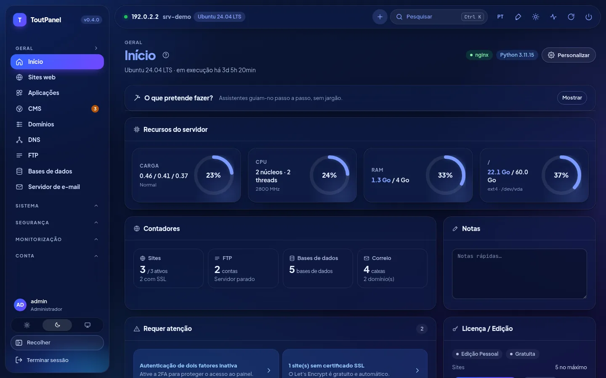<br>**Início, modo escuro**: indicadores, contadores, pontos de atenção, licença | 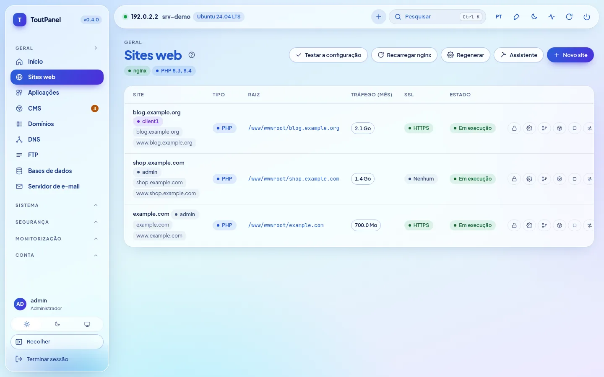<br>**Sites web**: domínios, tipo, raiz, tráfego, SSL e ações |
| <br>**PHP**: versões 5.6 → 8.5 lado a lado, estado do suporte, pools FPM | <br>**Definições do site**: implementação Git, SSL, redirecionamentos, segurança |
| <br>**DNS**: zonas BIND ou fornecedores, modelos, DNSSEC, cluster | <br>**Certificados**: validade, emissor, renovação, certificado do painel |
| 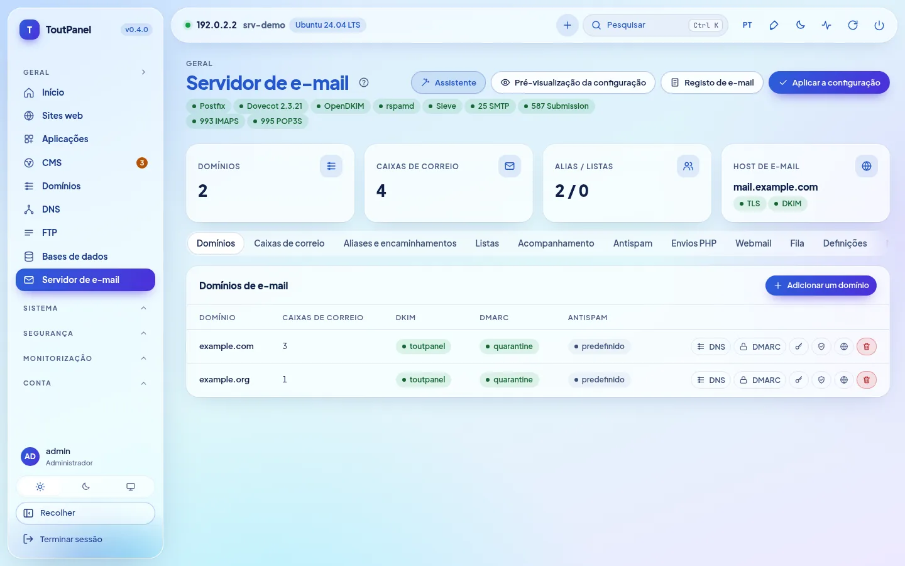<br>**Servidor de correio**: Postfix, Dovecot, OpenDKIM, portas e separadores | <br>**Webmail**: Roundcube ou SnappyMail instalado com um clique |
| 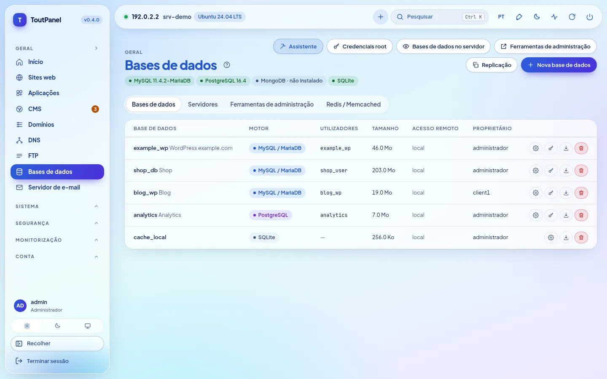<br>**Bases de dados**: MariaDB, PostgreSQL, MongoDB, SQLite, Redis | <br>**Ficheiros**: editor, arquivos, reciclagem, permissões, ocupação |
| <br>**CMS › Instalar**: 582 CMS e aplicações verificados, pesquisa, filtros, indicador «pronto» | <br>**Ficha de um CMS**: pré-requisitos verificados, escolha da versão, site de destino, base de dados |
| <br>**CMS › Instalações**: versões, atualizações disponíveis, cópia de segurança, clonagem | <br>**WAF › Motor**: ToutWAF recomendado, WAF integrado, BunkerWeb, SafeLine |
| <br>**Terminal**: shell interativa bash / PowerShell no navegador | <br>**Aplicações**: WordPress, Joomla, Drupal, PrestaShop, Nextcloud… |
| <br>**Store**: software de servidor, módulos e temas com um clique | 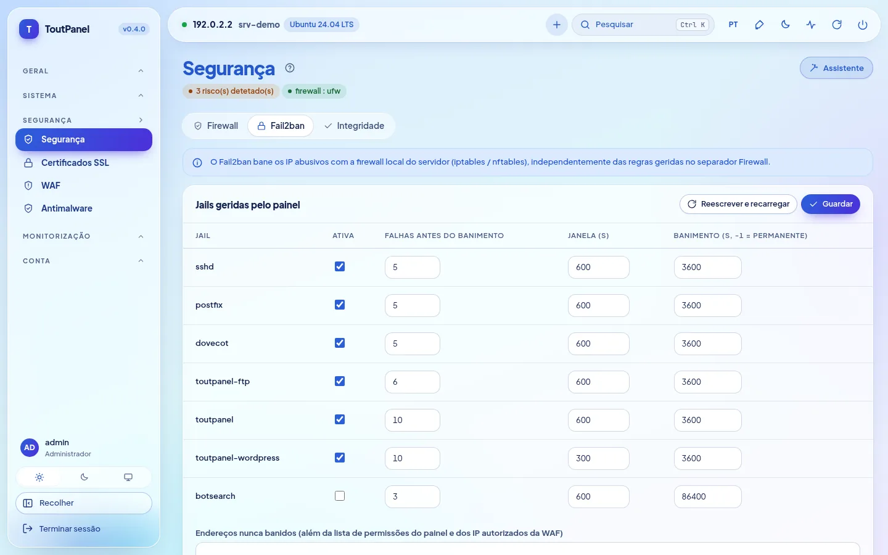<br>**Segurança**: recomendações, firewall, anti-DDoS, Fail2ban |
| 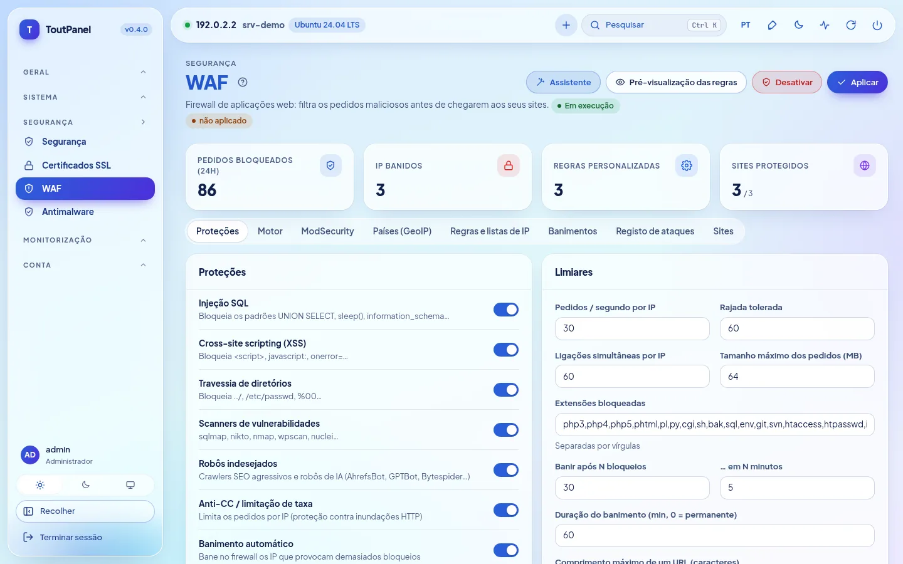<br>**WAF**: proteções, limiares, motores, GeoIP, registo de ataques | <br>**Monitorização**: CPU, memória, rede, carga e disco de 1 h → 7 d |
| <br>**Contas**: revendedores, clientes, planos, perfis de acesso | <br>**Servidores**: painel mestre, nós, encaminhamento, migração |
| <br>**Atualizações**: pacotes do sistema (segurança) e do painel | <br>**Definições**: acesso, porta, entrada secreta, HTTPS, interface |
| 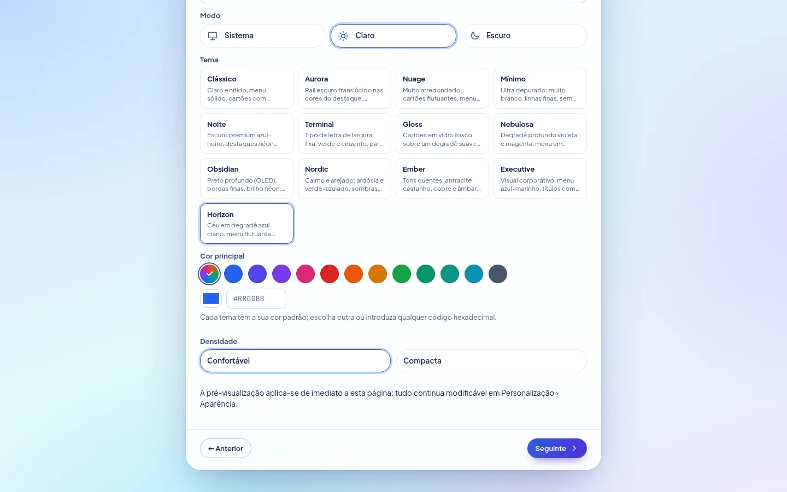<br>**Assistente de configuração**: tema, cor principal, densidade, pré-visualização imediata | <br>**Horizon**, tema predefinido: o mesmo ecrã em claro e em escuro |

**Novidades da 0.4** — capturas de um servidor de demonstração (endereços de documentação):

| | |
|---|---|
| <br>**Assistente de configuração, passo Perfil**: perfis de partida, memória detetada, perfil recomendado | 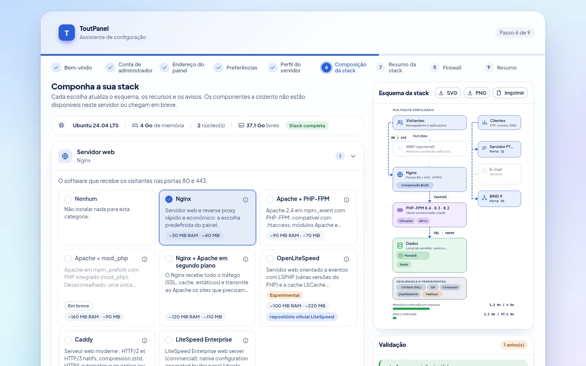<br>**Composição da pilha**: escolha por categoria, esquema de arquitetura, validação e recursos estimados |
| <br>**Instalação da pilha**: progresso, passos, retoma após erro | <br>**Assistente, passo Firewall**: gerida pelo ToutPanel ou a montante, portas que serão abertas |
| <br>**Definições › Pilha de software**: estado real, versões instaladas, esquema deste servidor | <br>**Pilha de software**, modo escuro |
| <br>**Aceleradores**: OPcache, JIT, APCu, Redis, Memcached, FastCGI, Varnish… com estado, memória e limitações | <br>**OpenLiteSpeed** *(experimental)*: instalação, LSPHP, mudança do servidor web, WebAdmin |
| 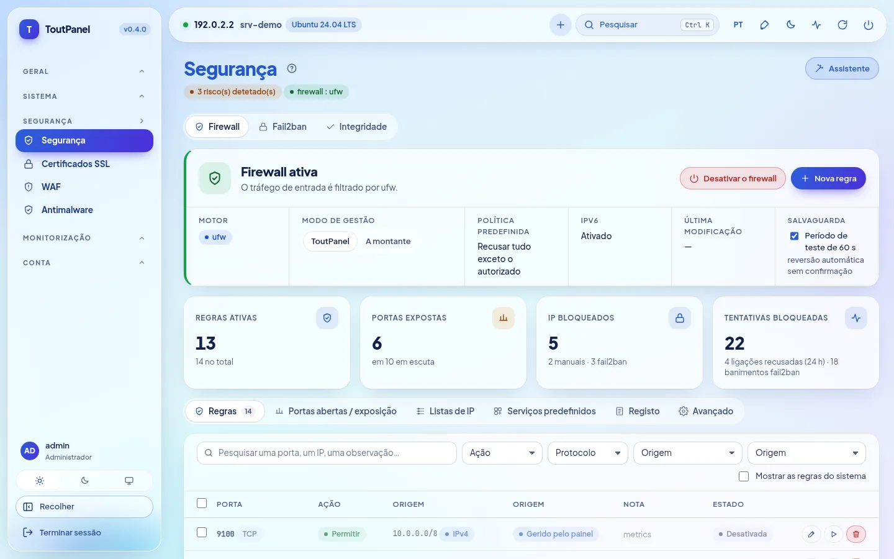<br>**Segurança › Firewall**: motor, modo de gestão, salvaguarda, regras | <br>**Portas em escuta e exposição**: exposta, restrita, protegida |
| <br>**Firewall a montante**: portas a abrir no fornecedor de alojamento, a copiar ou transferir | <br>**Firewall**, modo escuro |
| <br>**DNS › Motor**: BIND, PowerDNS, Knot DNS, fornecedor externo | <br>**Servidor de correio › Motor**: Postfix, Exim *(experimental)*, relay externo |
| <br>**FTP › Motor**: integrado, Pure-FTPd, ProFTPD, vsftpd, SFTP *(experimentais)* | <br>**ToutWAF remoto**: painel ligado a um ToutWAF de outro servidor |
| <br>**Início**: faixa «distribuição em pilha reduzida» consoante o nível de suporte | |

**Páginas adicionadas na 0.4.0** — mesmas convenções (servidor de demonstração, endereços de documentação):

| | |
|---|---|
| 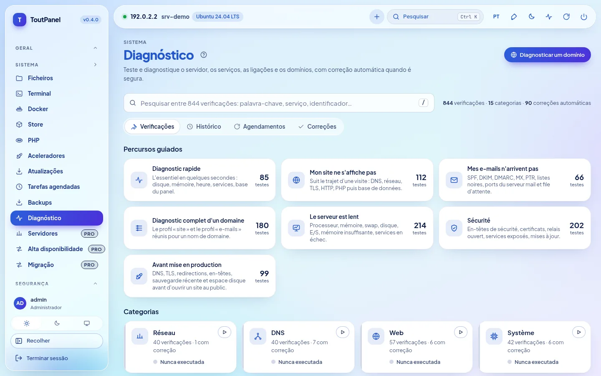<br>**Sistema › Diagnóstico**: 844 verificações, percursos guiados, categorias, pesquisa instantânea | <br>**Resultado de um diagnóstico**: causas prováveis, prova técnica com segredos ocultados, **correção automática** |
| <br>**Correção automática**: pré-visualização exata do que será alterado, impacto, anulação possível | <br>**Início › «O que quer fazer?»**: assistentes guiados passo a passo |
| <br>**Assistente guiado** (aqui: utilizador): passos, ajuda contextual, modo Simples ou Avançado | <br>**Teste real após aplicação**: resultado por verificação, causa provável, correção com um clique |
| <br>**Alta disponibilidade** *(Pro)*: IP flutuante keepalived, servidores e prioridades, titular do endereço | <br>**Monitorização › Parque de servidores** *(Pro)*: disponibilidade, CPU, memória, disco e carga por servidor |
| <br>**Servidores** *(Pro)*: painel mestre, nós web / correio / DNS, estado, impressão digital TLS fixada | <br>**Contas › Definições › Isolamento de contas** *(opção, desativada por predefinição)*: PHP-FPM por conta, reforço systemd, jaula |
| <br>**Definições › Servidor web: Caddy** *(experimental)*: mudança com reversão, HTTPS, funcionalidades não suportadas | <br>**LiteSpeed Enterprise** *(experimental; nunca arrancado nos nossos testes)*: licença, instalação oficial, LSPHP |
| <br>**Store › Módulos**: Marketplace de integrações (faturação, monitorização, SSO, CI/CD, DNS / CDN…) | 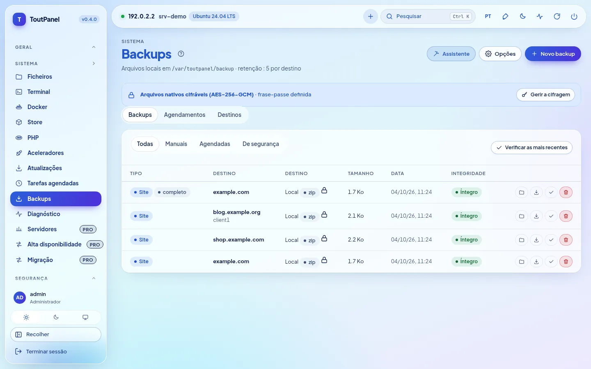<br>**Cópias de segurança**: arquivos cifrados (AES-256-GCM), completos ou incrementais |
| <br>**Cifragem das cópias de segurança**: frase-passe guardada cifrada, aviso de perda, cifragem por predefinição ou obrigatória | <br>**Agendamentos**: perímetro, retenção, destino, incrementais |
| <br>**Definições › Segurança**: alertas de início de sessão invulgar, SSO OIDC / SAML | <br>**SSO** *(Pro)*: LDAP / Active Directory, OpenID Connect, SAML 2.0 |

**Em telemóvel**, a interface adapta-se (menu recolhível, tabelas deslizantes):

<table>
<tr>
<td align="center"><br><b>Início</b></td>
<td align="center"><br><b>Sites web</b></td>
</tr>
</table>

> Capturas realizadas num servidor de demonstração (Ubuntu 24.04, endereço de documentação 192.0.2.2, domínios de exemplo). Neste servidor de demonstração, alguns estados são **simulados** (nenhum serviço real corre nele): isolamento de contas (systemd, cgroups), Caddy, parque de servidores e IP flutuante, bases de dados, correio, WAF e catálogo do Marketplace; os diagnósticos e os assistentes, esses, executam-se realmente. Capturas noutros idiomas encontram-se em `screenshots/<idioma>/` (en, de, es, it, nl, pt, ru, zh, ar).

## Temas

### 13 temas, a sua cor

Uma instalação nova utiliza o **Horizon**: céu em gradiente azul-ciano, menu e barra superior flutuantes translúcidos, pílula ativa em gradiente azul-violeta que segue a cor escolhida, títulos azuis muito carregados. **Personalização › Aparência**: escolha outro design e depois **qualquer cor de destaque** (12 predefinições, conta-gotas ou código `#RRGGBB`). O painel deriva dela botões, ligações, menu ativo, distintivos, gradientes e gráficos, mantendo um contraste de pelo menos 4,5:1. Cada tema existe em **claro e em escuro**, respeita o contraste elevado e os idiomas da direita para a esquerda; a pré-visualização é imediata, nada é guardado antes de «Guardar o design». Densidade, cantos, tipo de letra, largura, posição do menu, ícones e animações também se ajustam, por utilizador ou por predefinição para todos; o tema exporta-se e importa-se.


| | | |
|---|---|---|
| <br>**Horizon** *(predefinido)* · `#2b5fd9` | <br>**Clássico** · `#2563eb` | <br>**Aurora** · `#2563eb` |
| <br>**Nuage** · `#5b5bd6` | <br>**Mínimo** · `#18181b` | <br>**Noite** · `#0369a1` |
| <br>**Terminal** · `#15803d` | <br>**Gloss** · `#7c3aed` | <br>**Nebulosa** · `#8b5cf6` |
| <br>**Obsidian** · `#22c55e` | <br>**Nordic** · `#14b8a6` | <br>**Ember** · `#f97316` |
| <br>**Executive** · `#10b981` | | |

<sub>Cor indicada: destaque predefinido do tema em modo claro, livremente modificável.</sub>

O tema, o modo, a **cor principal** e a **densidade** também se escolhem logo no **assistente de configuração** (passo Preferências), com pré-visualização imediata; são os valores predefinidos de todas as contas, podendo cada utilizador escolher depois os seus.

## Edições

O programa é o mesmo para todas as edições: uma **chave de licença** ativa as funcionalidades avançadas num determinado servidor. Uma instalação nova funciona na edição Pessoal, sem registo nem ligação à Internet.

| Edição | Preço | Chave | Para quem |
|---|---|---|---|
| **Pessoal** | gratuita, sem limite de duração | nenhuma | uso pessoal: os seus próprios sites, **até 5** |
| **Profissional** | paga | obrigatória | alojadores, agências, uso profissional: tudo incluído, sites ilimitados (ou segundo o plano de licença) |
| **Empresarial** | paga | obrigatória | Profissional + multisservidor ilimitado + suporte prioritário |

A edição Pessoal é **completa**: sites, PHP multiversão, bases de dados, correio, DNS, SSL, WAF integrado, cópias de segurança locais (**cifragem AES-256-GCM e incrementais incluídas**), monitorização, Diagnóstico manual, assistentes guiados (os passos que tocam numa funcionalidade Pro permanecem reservados), contas de clientes e subutilizadores, WebAuthn, ferramentas RGPD, API e CLI. Estão reservados às edições pagas:

<details>
<summary><b>Lista exata das funcionalidades Profissional / Empresarial</b></summary>

| Funcionalidade | Pessoal | Profissional |
|---|---|---|
| Sites | 5 no máximo | ilimitados (ou segundo a licença) |
| Sondas de uptime | 3 | ilimitadas |
| Webhooks de saída | 2 | ilimitados |
| Escolha do motor WAF (ToutWAF, BunkerWeb, SafeLine) | WAF integrado | ✓ |
| ModSecurity + OWASP CRS | — | ✓ |
| Multisservidor: nós, alta disponibilidade, migração a quente | — | ✓ |
| Grupos web e cluster DNS | — | ✓ |
| Replicação das bases de dados | — | ✓ |
| Faturação, gateways, WHMCS, provisionamento | — | ✓ |
| Marca branca dos revendedores | — | ✓ |
| Domínio personalizado do painel | — | ✓ |
| Suporte (tickets) | — | ✓ |
| Anúncios | — | ✓ |
| Contas de revendedor | — (clientes e subutilizadores: ✓) | ✓ |
| SSO LDAP / OpenID Connect / SAML | — (WebAuthn: ✓) | ✓ |
| Bloqueio por país (GeoIP) | — | ✓ |
| Antimalware agendado | análise manual | ✓ |
| Cópias de segurança remotas (S3, SFTP, B2, rsync SSH, rclone) | armazenamento local (arquivos cifrados e incrementais incluídos) | ✓ |
| Motores restic, Borg e rsync | — | ✓ |
| Exportação Prometheus `/metrics` | — | ✓ |
| Importação a partir de cPanel, Plesk, DirectAdmin, ISPConfig, alojamento partilhado, IMAP | — (exportação: ✓) | ✓ |
| Módulos premium da store | — | ✓ |
| Ancoragem externa do registo de auditoria | — (exportação e purga RGPD: ✓) | ✓ |
| Diagnósticos agendados com alerta | diagnóstico manual | ✓ |

</details>

- As entradas em causa têm um distintivo **Pro**; as páginas continuam consultáveis, apenas a criação e a modificação estão reservadas.
- Ativação: **Definições › Licença › Ativar uma chave** (`TP-XXXXX-XXXXX-XXXXX-XXXXX`) ou `toutpanel licence activate <chave>`. O token assinado é verificado localmente: a licença funciona offline (revalidação diária, período de tolerância de 15 dias).
- Se a licença expirar ou deixar de ser válida, o painel **volta à edição Pessoal sem apagar nada**.

Preços e compra: **[toutpanel.com/tarifs](https://toutpanel.com/tarifs)** · detalhes: [Edições e licença](https://toutpanel.com/docs/guide/editions/).

## Arquitetura

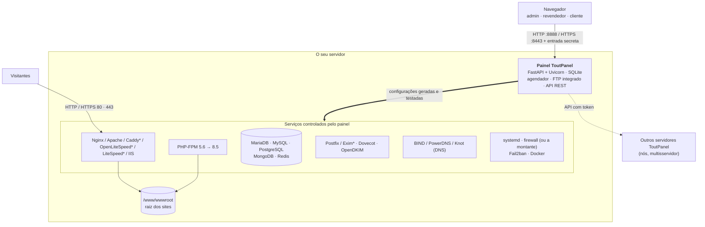

| Componente | Função |
|---|---|
| **Painel** | Aplicação FastAPI servida pelo Uvicorn (serviço systemd `toutpanel` no Linux, tarefa agendada `ToutPanel` no Windows). Interface web sem dependências externas, API REST, agendador de tarefas, servidor FTP integrado. |
| **Pilha web** | Nginx e/ou Apache (Caddy, OpenLiteSpeed com LSPHP, LiteSpeed Enterprise: experimentais; IIS no Windows) com PHP-FPM; o painel escreve os vhosts a partir dos seus modelos, testa-os e depois recarrega o serviço. O **compositor de pilha** escolhe e faz evoluir o software. |
| **Serviços** | MariaDB / MySQL / PostgreSQL / MongoDB, Postfix (ou Exim*) / Dovecot / OpenDKIM, BIND (ou PowerDNS, Knot), FTP (integrado ou Pure-FTPd*, ProFTPD*, vsftpd*), Fail2ban, firewall, Docker: controlados pelo painel através das suas ferramentas nativas. |
| **CLI `toutpanel`** | Administração do painel (porta, entrada, palavra-passe, atualização, licença…) e comandos de negócio programáveis (`--json`). |

<sub>\* experimental</sub>

```
<home>  (/var/toutpanel ou C:\toutpanel)
├── data/      base de dados SQLite do painel, settings.json, chaves, install-info.txt
├── logs/      panel.log e registos dos sites
├── vhost/     vhosts gerados (se a pasta nativa do servidor web estiver ausente)
├── ssl/       certificados dos sites e do painel
├── backup/    cópias de segurança locais
├── src/       clone deste repositório (canais, etiquetas, toutpanel update)
└── venv/      ambiente Python do painel
/www/wwwroot   raiz dos sites (C:\toutpanel\wwwroot no Windows)
```
## Instalação completa

### Pré-requisitos

| | Linux | Windows |
|---|---|---|
| **Sistemas** | nível **completo**: Debian 11 e seguintes, Ubuntu 20.04 e seguintes, AlmaLinux / Rocky Linux / RHEL / CentOS Stream / Oracle Linux / CloudLinux 8 e seguintes, Fedora · nível **reduzido** (o painel funciona, faltam algumas funcionalidades): Debian 10, Ubuntu 18.04, CentOS / RHEL 7, Amazon Linux, openSUSE / SLES, Arch, Alpine, Devuan · ver [Compatibilidade das distribuições](#compatibilidade-das-distribuições) | Windows 10, 11 · Windows Server 2016, 2019, 2022, 2025 (build 14393 mínima) |
| **Permissões** | `root` (ou `sudo`) e `bash` | PowerShell 5.1+ **como administrador** (winget não necessário) |
| **Python** | 3.9 a 3.14 (instalado pelo script se a distribuição o fornecer) | instalado pelo script (3.12, python.org) se ausente |
| **Memória** | 1 GB mínimo (só o painel), 2 GB recomendados com MariaDB e PHP | idem |
| **Disco** | 2 GB livres + os seus sites | idem |
| **Rede** | acesso de saída HTTPS (GitHub, PyPI, repositórios da distribuição, Let's Encrypt); IP público fixo e DNS inverso para o correio | idem (python.org, nginx.org, windows.php.net, MariaDB) |

Arquiteturas: `x86_64` e `aarch64` (outras: nível reduzido). Instale de preferência num servidor **acabado de instalar**. Num servidor onde Nginx, Apache ou MariaDB já estejam configurados, utilize `--stack none`: o painel deteta-os e escreve os seus vhosts na respetiva pasta nativa sem tocar no resto.

### Compatibilidade das distribuições

O instalador e o painel detetam a distribuição (`/etc/os-release`, arquitetura) e apresentam um **nível de suporte**: `toutpanel compat` lista as distribuições conhecidas, `toutpanel check` indica o do seu servidor, e uma faixa na página inicial avisa quando o nível não é «completo». Nunca há **limite máximo de versão**: uma versão mais recente de uma família conhecida é tratada como a última conhecida.

| Nível | Significado | Exemplos |
|---|---|---|
| **Completo** | a pilha completa está prevista (servidor web, PHP multiversão, bases de dados nas versões à escolha, correio, firewall, atualizações automáticas) | Debian 11+, Ubuntu 20.04+ (LTS e intermédias), AlmaLinux / Rocky / RHEL / CentOS Stream / Oracle Linux 8+, CloudLinux 8 e 9, Fedora, Raspberry Pi OS 64 bits |
| **Reduzido** | o painel funciona, mas faltam algumas funcionalidades ou exigem intervenção (sistema em fim de vida, init sem systemd, repositórios de terceiros ausentes, arquitetura de 32 bits); aviso não bloqueante | Debian 10, Ubuntu 18.04, CentOS / RHEL 7, Amazon Linux 2 e 2023 (um único PHP de cada vez), openSUSE / SLES, Arch e derivadas, Alpine, Devuan, Kali |
| **Não suportado** | sistema desconhecido, demasiado antigo ou imutável: o instalador di-lo e pára | Fedora CoreOS / Silverblue, MicroOS, Flatcar, Gentoo, NixOS, Void |

«Completo» descreve o nível **previsto** pelo painel; **os ensaios foram feitos no Ubuntu 24.04**, com uma exceção: **AlmaLinux 9.8 e 10.2 com SELinux Enforcing** (laboratório QEMU de 4 de outubro de 2026); a validação de ponta a ponta não foi feita nas outras distribuições, incluindo Rocky Linux, RHEL e Fedora (ver [Limitações conhecidas](#limitações-conhecidas)). O Python 3.9+ é fornecido se o sistema for demasiado antigo (pacote recente da distribuição ou Python autónomo verificado por SHA-256, com a sua autorização).

### Linux

```bash
curl -sSL https://raw.githubusercontent.com/qu3ntin01/toutpanel/main/install.sh | sudo bash -s -- --lang pt
```

Para ler o script antes de o executar:

```bash
curl -sSLO https://raw.githubusercontent.com/qu3ntin01/toutpanel/main/install.sh
less install.sh
sudo bash install.sh --lang pt
```

A instalação demora entre 3 e 6 minutos consoante a ligação.

**Assistente de instalação.** Todas as opções (conta, portas, pasta, pilha, firewall, WAF, versão, idioma…) escolhem-se com menus em **[toutpanel.com/installation-assistant](https://toutpanel.com/installation-assistant)**, que gera a linha de comandos e a verifica em direto (os segredos nunca aparecem aí em claro).

**Instalar uma versão exata.** O comando standard instala a última versão estável; `--version` escolhe outra (lista: `--list-versions`). As pré-versões são publicadas no canal `dev` e instalam-se com `--channel dev`:

```bash
# a última versão estável
curl -sSL https://raw.githubusercontent.com/qu3ntin01/toutpanel/main/install.sh | sudo bash
# uma versão exata (lista: --list-versions)
curl -sSL https://raw.githubusercontent.com/qu3ntin01/toutpanel/main/install.sh | sudo bash -s -- --list-versions
curl -sSL https://raw.githubusercontent.com/qu3ntin01/toutpanel/main/install.sh | sudo bash -s -- --version 0.4.0
# a última pré-versão (canal dev)
curl -sSL https://raw.githubusercontent.com/qu3ntin01/toutpanel/dev/install.sh | sudo bash -s -- --channel dev
```

**Menu interativo.** Lançado num terminal sem opção de modo, o script apresenta o ToutPanel, deteta uma instalação existente e propõe: **instalar** (pilha completa) ou **instalar apenas o painel**, eventualmente em **modo nó**; ou, se o painel já lá estiver, **atualizar**, **reinstalar completamente** ou **desinstalar**. Faz também a pergunta sobre a **firewall** (ToutPanel / a montante / mais tarde) e, depois de o painel arrancar, a sobre o **perfil da pilha**. Sem terminal (automatização, `--yes`), não faz perguntas: instala, ou atualiza se o painel estiver presente (firewall «mais tarde», pilha predefinida).

**O que o script faz:**

1. instala o Python 3.9+ se necessário e cria o ambiente virtual `<home>/venv`;
2. instala a **pilha web** (Nginx, PHP-FPM, MariaDB, Redis ou Valkey, Certbot, Fail2ban) como anteriormente, ou a que compuser (`--profile`, `--web`, `--php`, `--db`… transmitidos a `toutpanel stack apply`);
3. clona este repositório para `<home>/src`, **verifica a soma SHA-256** do pacote (wheel) correspondente ao Python do sistema e instala-o;
4. cria uma **conta de administrador** e um **URL de acesso secreto** aleatórios;
5. regista o **serviço systemd** `toutpanel`;
6. configura a **firewall** segundo `--firewall`: `on` (o ToutPanel gere-a e abre as portas necessárias), `off` (firewall a montante: nenhuma regra de sistema, lista das portas a abrir no fornecedor de alojamento), pergunta num terminal, caso contrário «mais tarde» (nada é tocado);
7. configura o **SELinux** (Alma, Rocky, RHEL, Fedora) ou o **AppArmor** (Debian, Ubuntu, SUSE);
8. apresenta um resumo, guardado em `<home>/data/install-info.txt` (legível apenas pelo root).

#### Opções do `install.sh`

| Opção | Descrição | Predefinição |
|---|---|---|
| `--stack full` | **obsoleta** (ver `--profile`): Nginx + PHP-FPM + MariaDB + Redis/Valkey + Certbot + Fail2ban | ✓ |
| `--stack minimal` | **obsoleta**: Nginx + PHP-FPM + Certbot | |
| `--stack none` | **obsoleta**: apenas o painel (servidor já configurado) | |
| `--profile NOME` | perfil do **compositor de pilha**: `single-site`, `multi-site`, `hosting`, `performance`, `application`, `mail-only`, `dns-only`, `node`, `lamp`, `standard`, `custom` (valores das outras opções: ver o quadro abaixo) | pilha predefinida |
| `--web`, `--php`, `--php-default`, `--php-ext`, `--db`, `--redis`, `--accel`, `--ftp`, `--mail MOTOR`, `--dns`, `--security`, `--runtime`, `--tools`, `--install-mode`, `--roles`, `--stack-file`, `--no-tuning` | opções do compositor, transmitidas tal e qual a `toutpanel stack apply … --yes` após a instalação do painel (uma falha da pilha não faz falhar a instalação: comando de retoma apresentado) | |
| `--accept-litespeed-license` | com `--web litespeed[:6.3]`: aceita o contrato de licença da LiteSpeed Technologies; **obrigatória** (sem ela, o instalador pára antes de qualquer modificação), incompatível com `--stack`, recusada no Windows. **O LiteSpeed Enterprise é um produto comercial EXPERIMENTAL, nunca arrancado no ambiente de desenvolvimento**: avaliação oficial de 15 dias, depois licença paga | não |
| `--mail` | (isolada) adiciona Postfix, Dovecot, OpenDKIM e abre as portas de correio | não |
| `--firewall on\|off\|ask` | quem gere a firewall: o ToutPanel (`on`), uma firewall a montante sem regra de sistema (`off`), pergunta (`ask`); sem terminal nem valor: «mais tarde»; nunca modificada por uma atualização | pergunta num terminal |
| `--firewall-engine nft\|ufw\|firewalld\|csf\|iptables` | motor da firewall gerida pelo ToutPanel | detetado |
| `--dry-run` | apresenta a distribuição detetada, o diretório e os comandos previstos, sem modificar nada (sem root) | não |
| `--postgres` | adiciona o PostgreSQL (palavra-passe do papel `postgres` gerada e guardada no painel) | não |
| `--waf toutwaf` | implementa o **ToutWAF**, o WAF do fabricante, à frente dos sites através do seu instalador oficial (serviços systemd, sem Docker; servidor web deslocado para 8080 / 8443, consola em 9443, resumo em `/etc/toutwaf/INSTALL-SUMMARY.txt`) | não |
| `--waf bunkerweb` / `--waf safeline` | instala o Docker e implementa o WAF externo à frente dos sites (servidor web deslocado para 8080 / 8443, consola em 7000 ou 9443) | não |
| `--waf toutwaf --waf-console URL` | **ToutWAF remoto**: liga o painel a um ToutWAF instalado noutro servidor (nenhuma instalação local), com `--waf-origin-ip`, `--waf-origin-addr`, `--waf-cert-mode import\|acme`, `--waf-server-id`, `--waf-fingerprint` ou `--waf-trust-first-use`, `--waf-restrict` (80 / 443 limitados ao ToutWAF); o token fornece-se por `--waf-token-file FICHEIRO` ou `--waf-token-stdin` (nunca como argumento) | não |
| `--node` | modo **nó** multisservidor: painel apenas em HTTPS, token de inscrição, URL da API e impressão digital TLS apresentados (a introduzir no mestre: Sistema › Servidores › Adicionar) | não |
| `--master URL` | com `--node`: URL do painel mestre | — |
| `--port N` | porta **HTTP** do painel | `8888` |
| `--https-port N` | porta **HTTPS** do painel (o painel escuta em HTTP **e** em HTTPS; certificado autoassinado no início) | `8443` |
| `--version X.Y.Z` | instala esta versão publicada (também `vX.Y.Z`, `0.4.0b1` ou `0.4.0-beta.1`; variável `TOUTPANEL_VERSION`); uma pré-versão implica o canal `dev`; versão não encontrada ou sem wheel para o seu Python: paragem antes de qualquer modificação com a lista das versões; um retrocesso de versão pede confirmação (exceto com `--yes`) | última do canal |
| `--list-versions` | lista as versões publicadas (a mais recente primeiro) e sai, sem instalar nada | |
| `--random-port` | porta aleatória entre 20000 e 39999 | |
| `--username NOME` | nome da conta de administrador | `admin_xxxxxx` aleatório |
| `--password PASS` | palavra-passe do administrador (visível em `ps` e no histórico da shell: prefira as três opções seguintes) | 16 carateres aleatórios |
| `TOUTPANEL_PASSWORD` | variável de ambiente que fornece a palavra-passe (conservada por `sudo -E`); uma opção prevalece sobre a variável | — |
| `--password-file FICHEIRO` | lê a palavra-passe na primeira linha de um ficheiro (no Linux, reservado ao seu proprietário: `chmod 600`) | — |
| `--password-stdin` | lê a palavra-passe na entrada padrão (primeira linha; inutilizável com `curl \| bash`) | — |
| `--entrance /caminho` | entrada segura do URL | `/tp_xxxxxxxxxx` aleatório |
| `--home DIR` | diretório do painel (uma instalação existente na antiga predefinição `/www/toutpanel` é detetada e mantida) | `/var/toutpanel` |
| `--source DIR` | instalar a partir de uma pasta local (cópia deste repositório com `dist/`) | clone do ramo |
| `--branch NOME` | ramo Git a transferir | `main` |
| `--channel stable\|dev` | canal de atualização, guardado no painel | `stable` |
| `--update` | atualiza uma instalação existente (detetado automaticamente): cópia de segurança dos dados, novo código, migração da base de dados, reinício | auto |
| `--reinstall` | força uma instalação completa mesmo que o painel esteja presente | não |
| `--uninstall` | desinstala o painel (sites e bases de dados conservados, dados do painel arquivados) | não |
| `--yes`, `-y` | nenhuma pergunta (menu e confirmações) | não |
| `--lang xx` | idioma do instalador e idioma inicial do painel: `en`, `fr`, `de`, `es`, `it`, `pt`, `nl`, `ru`, `zh`, `ar` | idioma do sistema, caso contrário `en` |
| `--en`, `--fr`, `--de`, `--es`, `--it`, `--pt`, `--nl`, `--ru`, `--zh`, `--ar` | atalhos de `--lang` | |
| `-h`, `--help` | apresenta a ajuda do script | |

Uma única fonte de palavra-passe de cada vez (duas opções são recusadas antes de qualquer modificação). Sem nenhuma, um terminal interativo propõe «gerar automaticamente (recomendado)» ou «introduzir» (sem eco, com confirmação); sem terminal ou com `--yes`, é gerada uma palavra-passe e apresentada no fim. Uma palavra-passe fornecida não é apresentada nem escrita no resumo ou em `install-info.txt`, e uma atualização nunca a modifica.

**Valores das opções de pilha** (são verificados antes de qualquer modificação; **\*** = experimental):

| Opção | Valores |
|---|---|
| `--web` | `nginx`, `apache`, `nginx-apache`, `caddy`\*, `openlitespeed`\* (`:1.9`, `:1.8`, `:1.7`), `litespeed`\* (`:6.3`, `:6.2`, `:6.1`, `:6.0`; LiteSpeed Enterprise, comercial, exige `--accept-litespeed-license`), `none`; `toutpanel stack apply` aceita os mesmos valores |
| `--php` / `--php-default` / `--php-ext` | versões separadas por vírgulas (`8.3,8.4`, de 5.6 a 8.5) / versão predefinida / `minimal`, `standard`, `full` |
| `--db` | `mariadb` (`:10.6`, `:10.11`, `:11.4`, `:11.8`), `mysql`\* (`:8.4`, `:9.7`), `percona`\* (`:8.0`, `:8.4`), `postgresql` (`:13` a `:18`), `none` |
| `--accel` | `opcache`, `jit`, `apcu`, `redis`, `memcached`, `fastcgi-cache`, `varnish`\*, `brotli`, `zstd`\*, `http3`\*, `ioncube` |
| `--ftp` | `builtin`, `pureftpd`\*, `proftpd`\*, `vsftpd`\*, `sftp`\*, `none` |
| `--mail` | `postfix`, `postfix-clamav`, `postfix-light`, `exim`\*, `relay`, `none` |
| `--dns` | `bind`, `powerdns`, `knot`, `external`, `none` |
| `--security` | `firewall`, `fail2ban`, `modsecurity`, `clamav`, `toutwaf` |
| `--runtime` / `--tools` | `nodejs`, `python`, `go`, `ruby`, `java`, `docker` / `certbot`, `git`, `composer`, `phpmyadmin`, `adminer`, `restic`, `goaccess` |
| `--install-mode` / `--roles` | `single-server`, `single-site`, `multi-site`, `multi-server` / `web`, `db`, `mail`, `dns` |

Um componente «em breve» (Apache + mod_php) é recusado de forma limpa pelo `toutpanel stack`, sem instalar nada.

Exemplos:

```bash
sudo bash install.sh --stack minimal --port 7443
sudo bash install.sh --profile lamp --php 8.3,8.4 --db mariadb:11.4 --firewall on
sudo bash install.sh --profile hosting --mail postfix-clamav --dns bind --firewall off --yes
sudo bash install.sh --dry-run --profile lamp          # simulação
sudo bash install.sh --mail --postgres
sudo bash install.sh --mail --username eu --password-file /root/palavra-passe.txt --entrance /o-meu-acesso
sudo bash install.sh --profile performance --web openlitespeed --php 8.3 --accel opcache,redis --firewall off --yes   # OpenLiteSpeed: experimental
sudo bash install.sh --web litespeed:6.3 --php 8.3 --accept-litespeed-license --yes   # LiteSpeed Enterprise: comercial, experimental, licença obrigatória (apenas Linux)
sudo bash install.sh --waf toutwaf                 # WAF do fabricante à frente dos sites
sudo bash install.sh --stack minimal --node --master https://mestre.exemplo.com:8888   # servidor controlado por um mestre
curl -sSL https://raw.githubusercontent.com/qu3ntin01/toutpanel/main/install.sh | sudo bash -s -- --yes --random-port
curl -sSL https://raw.githubusercontent.com/qu3ntin01/toutpanel/main/install.sh | sudo bash -s -- --channel dev
curl -sSL https://raw.githubusercontent.com/qu3ntin01/toutpanel/main/install.sh | sudo bash -s -- --pt   # instalador em português
```

#### Idioma do instalador

Os instaladores são **multilingues**: faixa, menu e perguntas, passos, avisos, erros, ajuda, resumo e `install-info.txt` apresentam-se num dos **10 idiomas** abaixo, em **inglês por predefinição**. O idioma escolhido torna-se também o **idioma inicial do painel** (instalação e reinstalação); uma linha sob a faixa indica o idioma escolhido e a sua origem.

| Idioma | `--lang` | Atalho Linux | Windows |
|---|---|---|---|
| English *(predefinição)* | `en` | `--en` | `-Lang en` / `-En` |
| Français | `fr` | `--fr` | `-Lang fr` / `-Fr` |
| Deutsch | `de` | `--de` | `-Lang de` / `-De` |
| Español | `es` | `--es` | `-Lang es` / `-Es` |
| Italiano | `it` | `--it` | `-Lang it` / `-It` |
| Português | `pt` | `--pt` | `-Lang pt` / `-Pt` |
| Nederlands | `nl` | `--nl` | `-Lang nl` / `-Nl` |
| Русский | `ru` | `--ru` | `-Lang ru` / `-Ru` |
| 中文 | `zh` | `--zh` | `-Lang zh` / `-Zh` |
| العربية | `ar` | `--ar` | `-Lang ar` / `-Ar` |

Ordem de prioridade, da mais forte à mais fraca:

| # | Fonte | Linux | Windows |
|---|---|---|---|
| 1 | opção da linha de comandos | `--lang xx` ou atalho (`--fr`…) | `-Lang xx` ou atalho (`-Fr`…) |
| 2 | variável de ambiente | `TOUTPANEL_LANG=fr` | `$env:TOUTPANEL_LANG = "fr"` |
| 3 | valor escrito no script | `INSTALLER_LANG="fr"` no topo do `install.sh` | `$InstallerLang = "fr"` no topo do `install.ps1` |
| 4 | **deteção** do idioma do sistema, se fizer parte dos 10 | `LC_ALL`, `LC_MESSAGES`, `LANG` | `Get-Culture` |
| 5 | inglês | | |

```bash
curl -sSL https://raw.githubusercontent.com/qu3ntin01/toutpanel/main/install.sh | sudo env TOUTPANEL_LANG=de bash
```

Variáveis de ambiente reconhecidas: `TOUTPANEL_LANG` (idioma do instalador), `TOUTPANEL_HOME` (diretório), `TOUTPANEL_REPO` (repositório Git), `TOUTPANEL_BRANCH` (ramo), `TOUTPANEL_CHANNEL` (`stable` ou `dev`), `TOUTPANEL_VERSION` (versão exata), `TOUTPANEL_PASSWORD` (palavra-passe do administrador), `TOUTPANEL_FIREWALL` / `TOUTPANEL_FIREWALL_ENGINE`, e uma variável por opção de pilha (`TOUTPANEL_PROFILE`, `TOUTPANEL_WEB`, `TOUTPANEL_PHP`, `TOUTPANEL_DB`, `TOUTPANEL_ACCEL`, `TOUTPANEL_FTP`, `TOUTPANEL_MAIL_ENGINE`, `TOUTPANEL_DNS`…).

<details>
<summary><b>Pacotes instalados consoante a distribuição</b></summary>

- **Debian / Ubuntu**: `nginx`, `php8.x-fpm` (+ cli, mysql, curl, mbstring, xml, zip, gd, intl, bcmath, opcache), `certbot`, `composer`, `mariadb-server`, `redis-server`, `fail2ban`, `python3-venv`, `git`, `unzip`; PHP multiversão via packages.sury.org (Debian) ou o PPA ondrej (Ubuntu).
- **AlmaLinux / Rocky / RHEL / Fedora**: `epel-release` (+ CRB), `remi-release`, `nginx`, `php83-php-fpm` (+ extensões), `certbot`, `mariadb-server`, `redis` ou `valkey` (Valkey no AlmaLinux 10), `fail2ban`, `policycoreutils-python-utils`, `dnf-plugins-core`, `rspamd` (a partir do repositório oficial `rspamd.com`, adicionado pela pilha: ausente do AlmaLinux e do EPEL), `firewalld` (instalado com `--firewall on`: as imagens cloud não têm `firewalld` nem `nft`); contextos SELinux declarados (`httpd_sys_rw_content_t` em `/www/wwwroot`, `httpd_log_t`, `var_log_t`, `cert_t`, `httpd_config_t`, `mail_spool_t`) e booleanos `httpd_can_network_connect`, `httpd_can_network_connect_db`, `httpd_can_sendmail`, `httpd_setrlimit` ativados.
- **Módulos Python facultativos** (não instalados por predefinição): `pymongo` (MongoDB), `wsgidav` + `a2wsgi` (WebDAV), `geoip2` (GeoIP), `python3-saml` (SAML) — `/var/toutpanel/venv/bin/pip install "pymongo>=4.6"` e depois `systemctl restart toutpanel`.

</details>

### Windows

No PowerShell **como administrador**:

```powershell
$env:TOUTPANEL_LANG = "pt"
Set-ExecutionPolicy Bypass -Scope Process -Force
iwr -useb https://raw.githubusercontent.com/qu3ntin01/toutpanel/main/install.ps1 | iex
```

O script verifica a versão do Windows e as permissões, instala o **Python 3.12** se não existir nenhum Python 3.9+, cria `C:\toutpanel\venv` e instala lá o painel, cria a conta de administrador e o URL secreto, adiciona as regras de firewall (porta do painel, 80, 443, 21), cria a tarefa agendada **ToutPanel** (arranque automático como SYSTEM) e adiciona `C:\toutpanel\bin` ao PATH.

Para instalar também a pilha web (**Nginx** em `C:\nginx`, **PHP 8.3** supervisionado pelo painel, **MariaDB** como serviço Windows):

```powershell
iwr -useb https://raw.githubusercontent.com/qu3ntin01/toutpanel/main/install.ps1 -OutFile install.ps1
.\install.ps1 -Stack -Lang pt
```

| Opção | Descrição |
|---|---|
| `-Port 8888` | porta **HTTP** do painel |
| `-HttpsPort 8443` | porta **HTTPS** do painel |
| `-Version X.Y.Z` / `-ListVersions` | instalar uma versão publicada exata (variável `TOUTPANEL_VERSION`) / listar as versões publicadas |
| `-Home C:\toutpanel` | diretório do painel |
| `-Stack` | instala Nginx, PHP 8.3, MariaDB |
| `-Username`, `-Password`, `-Entrance /x` | conta de administrador e URL secreto à escolha (`-Password` é visível na lista de processos: prefira `$env:TOUTPANEL_PASSWORD`, `-PasswordFile FICHEIRO` ou `-PasswordStdin`) |
| `-PythonVersion`, `-NginxVersion`, `-MariaDBVersion`, `-PhpVersion` | versões transferidas |
| `-Source C:\caminho` / `-Branch main` | pasta local (cópia deste repositório) / ramo transferido |
| `-Update` / `-Reinstall` / `-Uninstall` | atualizar / reinstalar tudo / desinstalar |
| `-Yes` | nenhuma pergunta (automatização) |
| `-Lang xx` / `-En`, `-Fr`, `-De`, `-Es`, `-It`, `-Pt`, `-Nl`, `-Ru`, `-Zh`, `-Ar` | idioma do instalador e idioma inicial do painel (predefinição: idioma do sistema se suportado, caso contrário inglês; ver [Idioma do instalador](#idioma-do-instalador)); com `iwr … \| iex`: `$env:TOUTPANEL_LANG = "pt"` antes do comando |
| `-Help` | ajuda do script |

### Portas a abrir

| Porta | Utilização | Aberta pelo instalador |
|---|---|---|
| **8888** (configurável) | interface do painel em **HTTP** | sim |
| **8443** (configurável) | interface do painel em **HTTPS** (certificado autoassinado no início) | sim (volte a executar o instalador ou abra-a à mão numa instalação existente) |
| **80 / 443** | sites web | sim |
| 21 + 60000-60100 | FTP (integrado, ou o motor escolhido: intervalo passivo do motor) | apenas a 21; abra o intervalo passivo se ativar o FTP |
| 25, 465, 587, 143, 993, 110, 995, 4190 | correio (SMTP, IMAP, POP3, ManageSieve) | com `--mail` (4190: a abrir para o Sieve remoto) |
| 53 (UDP e TCP) | DNS (BIND, PowerDNS ou Knot) se alojar as suas zonas | não: Segurança › Firewall |
| 9443 / 7000 | consolas ToutWAF e SafeLine (9443), BunkerWeb (7000) | com `--waf` |
| 3306 / 5432 | acesso remoto às bases de dados (facultativo) | não: apenas se o ativar |

Não se esqueça da **firewall do seu fornecedor de alojamento** (grupo de segurança): se bloquear as portas do painel (8888 e 8443), o navegador não mostra nada. Com `--firewall off` (ou o modo «A montante» de Segurança › Firewall), o ToutPanel não toca em nenhuma regra de sistema e **lista as portas a abrir** no fornecedor (`toutpanel firewall ports`, cópia ou transferência CSV na interface); com `--firewall on`, abre-as ele próprio e uma **salvaguarda de 60 s** anula qualquer alteração não confirmada que o deixasse sem acesso.

## Primeiro arranque

No fim da instalação, o script apresenta um resumo:

```
╔══════════════════════════════════════════════════════════════════╗
║  O ToutPanel está instalado!                                     ║
╚══════════════════════════════════════════════════════════════════╝

  URL do painel (HTTP)      : http://203.0.113.10:8888/tp_dchwp7kmkf
  URL do painel (HTTPS)     : https://203.0.113.10:8443/tp_dchwp7kmkf   certificado autoassinado: aviso do navegador normal
  Utilizador                : admin_gbhjkv
  Palavra-passe             : D9nYzTSKHbX8FTqC
  MariaDB root              : k3Jd82nLqP0sYt7wVb1c
  Assistente de configuração : https://203.0.113.10:8443/tp_dchwp7kmkf#/setup?token=npSj7xpVzJOI8weJl8R00AdQ18MHYn8YIJCbOYi43B8
  Esta ligação (24 h, uma única utilização) permite alterar o endereço do painel, o utilizador e a palavra-passe gerados acima.
  Nova ligação : toutpanel setup-link
  PHP                       : 8.3 (Nginx + PHP-FPM prontos)

  Estas informações estão guardadas em: /var/toutpanel/data/install-info.txt
  O URL contém a entrada segura: sem ela, o painel responde 404.
```

1. **Anote o URL completo** (HTTP e HTTPS): contém a **entrada segura** (`/tp_…`). Sem ela, o painel responde `404 Not Found`, o que o torna invisível às varreduras. `toutpanel info` volta a apresentá-lo. O certificado HTTPS é **autoassinado** no início: o aviso do navegador é normal; o assistente de configuração é aberto em HTTPS para que o seu token não circule em claro.
2. **Abra a ligação «Assistente de configuração»** (`#/setup?token=…`, válida 24 h, uma única utilização): em **nove passos** e sem iniciar sessão, substitua os valores gerados pelos seus (nome de utilizador, palavra-passe, porta, entrada segura, nome de anfitrião, idioma, modo, tema, cor principal e densidade), depois **escolha o perfil do seu servidor e componha a respetiva pilha** (perfil, composição com esquema de arquitetura, resumo e instalação retomável) e **quem gere a firewall** (ToutPanel, a montante ou mais tarde). Ligação expirada? `toutpanel setup-link` gera uma nova. O assistente continua acessível depois de ter iniciado sessão (início › Atalhos rápidos).
3. **Proteja a conta**: autenticação de dois fatores (TOTP) e, se possível, uma chave de segurança WebAuthn; IP autorizados se tiver um IP fixo; certificado HTTPS reconhecido (Definições › Acesso e interface, Let's Encrypt se um domínio apontar para o servidor) e, se quiser, redirecionamento de HTTP para HTTPS.
4. **Crie um primeiro site**: Sites web › Novo site (ou botão **Assistente** para site + base de dados + certificado + caixas de correio), aponte o DNS para o servidor, depois cadeado › Let's Encrypt e «Forçar HTTPS».
5. **Ative as proteções**: WAF › Aplicar (ou WAF › Motor › Instalar o ToutWAF na edição Profissional), regras da firewall (Segurança › Firewall), cópia de segurança diária agendada, alertas (Definições › Alertas).
6. **Verifique o servidor**: Sistema › Diagnóstico (844 verificações, correções automáticas com pré-visualização) e, em cada página, o botão **Assistente** para configurar passo a passo um site, uma base de dados, uma caixa de correio, uma cópia de segurança ou a firewall com um teste real no fim.
7. **Faça evoluir a pilha** em qualquer altura: Definições › Pilha de software (estado real, adição de um componente, de uma versão de PHP, de um motor), página Aceleradores, separadores Motor das páginas FTP, DNS e Servidor de correio.

## Atualização

Todos os métodos conservam contas, definições, sites, bases de dados e software.

- **A partir do painel**: **Atualizações › Painel** apresenta a versão instalada, o canal seguido, as versões disponíveis e as notas de versão. **Atualizar** guarda primeiro uma cópia de `settings.json`, da base de dados do painel e da versão atual (`<home>/data/updates/<data>/`), instala o wheel da nova versão, migra a base de dados e reinicia; o painel verifica depois a sua saúde e **regressa sozinho à versão anterior** em caso de falha. **Regressar à versão anterior** continua disponível em qualquer altura.
- **Na linha de comandos**:

  ```bash
  toutpanel update --check              # versão instalada, versão disponível, notas de versão
  toutpanel update                      # instalar a versão do canal seguido
  toutpanel update --channel dev        # seguir o ramo de desenvolvimento
  toutpanel update --rollback           # regressar à versão anterior (--restore-data: dados também)
  ```

- **Com o script de instalação**: executado de novo num servidor já equipado, o `install.sh` passa para o modo de atualização (cópia de segurança de `data/` em `<home>/backup/panel-update-<data>/`, novo wheel, `toutpanel migrate`, reinício). A pilha não é reinstalada, a menos que adicione `--stack`, uma opção do compositor (`--profile`…), `--mail` ou `--waf`; a firewall existente nunca é modificada. No Windows: `.\install.ps1 -Update`.

## Desinstalação

```bash
curl -sSL https://raw.githubusercontent.com/qu3ntin01/toutpanel/main/install.sh | sudo bash -s -- --uninstall
```

Remove o serviço, `/var/toutpanel` (ou a instalação detetada, por ex. `/www/toutpanel`: painel, ambiente Python, registos, certificados), `/usr/local/bin/toutpanel` e as configurações Nginx / Apache geradas pelo painel. Os dados do painel são primeiro arquivados em `/root/toutpanel-backup-<data>.tar.gz`. **Os sites (`/www/wwwroot`), as bases de dados e o software da pilha permanecem no lugar.** Adicione `--yes` para não pedir confirmação.

No Windows: `.\install.ps1 -Uninstall` (dados arquivados em `C:\toutpanel-backup-<data>.zip`, sites movidos para `C:\toutpanel-wwwroot-<data>`, Nginx, PHP e MariaDB conservados).

## Instalação manual a partir de um wheel

Para ambientes particulares, sem o script. Escolha o wheel que corresponde ao seu interpretador (`cp311` para Python 3.11, etc.):

```bash
git clone --depth 1 https://github.com/qu3ntin01/toutpanel.git /var/toutpanel/src
python3 -m venv /var/toutpanel/venv
. /var/toutpanel/venv/bin/activate          # Windows: venv\Scripts\activate
TAG=$(python -c 'import sys;print(f"cp{sys.version_info[0]}{sys.version_info[1]}")')
(cd /var/toutpanel/src/dist && sha256sum -c --ignore-missing SHA256SUMS)
pip install /var/toutpanel/src/dist/toutpanel-*-$TAG-none-any.whl
# ou, para Python 3.12: pip install dist/toutpanel-0.5.1-cp312-none-any.whl
export TOUTPANEL_HOME=/var/toutpanel         # Windows: $env:TOUTPANEL_HOME="C:\toutpanel"
toutpanel setup --username admin --password 'AMinhaPalavraPasse' --entrance /o-meu-acesso
toutpanel run
```

Manter o clone em `<home>/src` permite depois `toutpanel update` (canais e reversão). `toutpanel service install` cria o serviço systemd (ou a tarefa agendada do Windows).

## Resolução de problemas

| Sintoma | Solução |
|---|---|
| `404 Not Found` ao abrir o painel | o URL não contém a entrada segura: `toutpanel info` apresenta o URL completo; `toutpanel entrance /novo-caminho` altera-a |
| o navegador não mostra nada na porta do painel | firewall do fornecedor de alojamento fechada, ou porta alterada: abra a porta, verifique-a com `toutpanel info`; `toutpanel port N` para a alterar |
| palavra-passe perdida ou 2FA inacessível | `toutpanel passwd` (nova palavra-passe gerada) ou `toutpanel passwd 'Nova' --disable-2fa` |
| o painel não arranca | `systemctl status toutpanel`, `journalctl -u toutpanel -n 50` e `<home>/logs/panel.log`; `toutpanel check` para o diagnóstico da máquina |
| `O painel não responde na porta … passados 30 s.` | arranque lento ou falhado: mesmos registos, depois `systemctl restart toutpanel` |
| `[ToutPanel] Falha na linha N (código C): …` | um comando do instalador falhou (repositório, pacote, serviço): corrija a causa e volte a executar com `--update` |
| `Python 3.9+ necessário.` ou nenhum wheel para este Python | instale `python3.11` ou `python3.12` (pacote da distribuição) e volte a executar |
| site ou PHP recusado em Alma / Rocky / RHEL / Fedora | SELinux: `toutpanel selinux` volta a declarar os contextos (nomeadamente após uma mudança de diretório) |
| um serviço ou um site falha sem mensagem clara com SELinux | `ausearch -m avc,user_avc -ts recent` lista as recusas, depois `audit2why` explica-as (`ausearch -m avc,user_avc -ts recent \| audit2why`); o laboratório `scripts/lab/alma_selinux.sh` do repositório de desenvolvimento repete o percurso validado |
| um serviço não responde, um site não aparece, os e-mails não chegam | Sistema › Diagnóstico: perfis «O meu site não aparece» e «Os meus e-mails não chegam», ou `toutpanel diag run --profile …` |
| Windows: «Execute o PowerShell como administrador.» | clique com o botão direito › Executar como administrador; `Set-ExecutionPolicy Bypass -Scope Process -Force` antes do script |

### Comandos úteis

```
toutpanel info                      URL completo, utilizador, palavra-passe inicial
toutpanel check                     diagnóstico: SO, Python, permissões, systemd, SELinux, firewall, servidor web, PHP, MariaDB, porta
toutpanel setup-link                nova ligação para o assistente de configuração (24 h, utilização única)
toutpanel passwd [PASS] [--disable-2fa]
toutpanel username NOME             mudar o nome do administrador
toutpanel port N                    mudar a porta (reinício necessário)
toutpanel entrance [/caminho]       definir ou desativar a entrada segura
toutpanel ssl on|off                HTTPS do painel (certificado autoassinado)
toutpanel start|stop|restart|status
toutpanel service install|uninstall
toutpanel selinux | apparmor        contextos SELinux / perfis AppArmor
toutpanel php install|remove VERSÃO [--extensions a,b]
toutpanel waf status|install|remove|sync [toutwaf|bunkerweb|safeline]
toutpanel waf update|links|doctor toutwaf   atualização, ligações da consola, diagnóstico do ToutWAF
toutpanel waf connect|disconnect toutwaf    ligar / desligar um ToutWAF remoto (token por TOUTPANEL_WAF_TOKEN ou entrada padrão)
toutpanel stack profiles|plan|apply|status  compositor de pilha (--profile, --web, --php, --db… ; plan e --dry-run não modificam nada)
toutpanel firewall status|mode|enable|ports firewall: modo painel / a montante, portas a abrir no fornecedor de alojamento
toutpanel compat [--json]           distribuições suportadas e nível deste servidor
toutpanel accel …                   aceleradores (Varnish, Memcached, JIT, Zstandard, HTTP/3)
toutpanel ols|caddy|litespeed …     servidores web experimentais: status, install, switch, test, reload, unsupported
toutpanel runtimes list|install|remove   versões de Node.js, Python, Go, Java, Ruby, .NET
toutpanel isolation status|sync|restart  isolamento de contas (PHP-FPM por conta, jaulas)
toutpanel diag list|run|fix|report|runs  Diagnóstico (--category, --profile, --json)
toutpanel cron list|add|del|run|backend  tarefas agendadas e agendador (interno, temporizadores systemd, cron)
toutpanel backup list|run|restore|encryption|decrypt|extract|restore-server
toutpanel dns engine [NOME] | mail engine [NOME]   motor DNS / de correio (com --dry-run e --rollback)
toutpanel update [--check] [--channel stable|dev|custom] [--rollback]
toutpanel node enroll [--master URL] | status
toutpanel licence status|activate CHAVE|deactivate|refresh
toutpanel site|account|db|mail|dns|ftp|task …   comandos de negócio (--json)
```

Referência completa: [Linha de comandos](https://toutpanel.com/docs/reference/cli/) · [API REST](https://toutpanel.com/docs/reference/api/) · [Códigos de erro](https://toutpanel.com/docs/reference/codes-erreur/).

## Canais

| Canal | Conteúdo | Instalação | Depois |
|---|---|---|---|
| **stable** (predefinição) | última versão publicada, etiqueta `vX.Y.Z` no ramo [`main`](https://github.com/qu3ntin01/toutpanel/tree/main) | `install.sh` | Atualizações › Painel ou `toutpanel update` |
| **dev** | ramo [`dev`](https://github.com/qu3ntin01/toutpanel/tree/dev): novidades ainda não publicadas, sem garantias | `install.sh --channel dev` | `toutpanel update --channel stable` para regressar |
| **personalizado** | repositório, ramo ou etiqueta à sua escolha | `TOUTPANEL_REPO=… install.sh --branch …` | `toutpanel update --channel custom --repo URL --branch NOME` |
## Limitações conhecidas

Para ser transparente sobre o que está menos coberto. Os detalhes por funcionalidade constam das [secções](#funcionalidades) e do quadro [O que foi realmente testado, simulado ou não testado](#o-que-foi-realmente-testado-simulado-ou-não-testado).

**Plataformas e distribuições**

- Todos os ensaios foram feitos no **Ubuntu 24.04**, com uma exceção: **AlmaLinux 9.8 e 10.2 com SELinux Enforcing** foram validados num verdadeiro laboratório QEMU (4 de outubro de 2026: 69/69 e 68/68 verificações, 0 recusas AVC, reinício incluído; sem KVM, um único nó, percurso limitado a Nginx + PHP-FPM + MariaDB + Pure-FTPd + Postfix / Dovecot / rspamd + fail2ban + firewalld). Rocky Linux, RHEL e Fedora não foram executados; Apache, OpenLiteSpeed, Exim, ProFTPD, vsftpd, PostgreSQL, multisservidor, ToutWAF, Docker e o isolamento PHP-FPM por conta com SELinux não estão cobertos. O nível «completo» das distribuições é o nível **previsto**; as outras famílias Red Hat (Rocky, RHEL, Fedora), SUSE, Arch, Alpine, Amazon Linux, Debian 12 / 13 e a arquitetura `aarch64` não foram validadas de ponta a ponta no âmbito desta versão (os comandos SELinux da suite de testes são testados com um executor fictício, as regras AppArmor com o verdadeiro `apparmor_parser`). Uma máquina real, outra política SELinux (MLS, personalizada) ou módulos de terceiros podem produzir outras recusas (`ausearch -m avc,user_avc -ts recent` e depois `audit2why`). Valide num servidor de teste antes da produção. Arch, Alpine, openSUSE e Amazon Linux funcionam em **nível reduzido** (PHP do sistema, uma única versão, sem repositórios de terceiros), **sem terem sido testados**.
- **ARM64**: o painel compilado é portátil e as suas dependências existem para ARM64, mas nenhuma instalação completa foi validada nesta arquitetura. As arquiteturas de 32 bits estão em nível reduzido.
- O **Windows** é menos testado do que o Linux: sem servidor de correio, sem `chmod` no gestor de ficheiros, PHP executado em `php-cgi` pelo painel, sem isolamento por utilizador de sistema, serviço PHP-FPM por conta nem jaula, sem limites cgroups, tarefas agendadas dos clientes recusadas, IIS suportado de forma básica (prefira Nginx), terminal simplificado sem o módulo `pywinpty`, compositor de pilha reservado ao Linux, **sem LiteSpeed Enterprise** (`-AcceptLitespeedLicense` é recusada).

**Funcionalidades experimentais** (reais, mas menos testadas; limitações apresentadas na interface)

- **OpenLiteSpeed**, **Caddy**, **LiteSpeed Enterprise**, Exim, Pure-FTPd, ProFTPD, vsftpd, apenas SFTP, Varnish (apenas HTTP; o HTTPS continua a ser servido pelo servidor web), Zstandard e HTTP/3 (consoante o módulo ou a compilação do seu Nginx, caso contrário recusa explicada), MySQL 8.4 / 9.x (repositório Oracle), Percona Server, SOGo. Apache + mod_php está **em breve**: visível, nunca simulado.
- **LiteSpeed Enterprise**: produto comercial; o instalador oficial da 6.3.7 foi executado de ponta a ponta e o validador da WebAdmin do LiteSpeed aceita a configuração gerada, mas **o próprio LiteSpeed nunca conseguiu arrancar** nos nossos testes (a licença de avaliação oficial foi recusada pela LiteSpeed Technologies a partir do ambiente de teste: «Failed to communicate with licensing server», causa não apurada): **nenhum pedido foi servido** pelo LiteSpeed Enterprise através do ToutPanel. A renderização, o controlador e a mudança são simulados; o WAF integrado, o ModSecurity, a filtragem por país e o limite de ligações não são suportados; Red Hat, `aarch64`, systemd e HTTP/3 não executados; a atualização de uma instalação LiteSpeed existente é recusada. Licença: avaliação (duração estimada em 15 dias) e depois paga, ou chave fornecida por si. Instalação: `install.sh --web litespeed[:6.3] --accept-litespeed-license` (opção **obrigatória**: sem ela, o instalador pára antes de qualquer modificação) ou `toutpanel stack apply --web litespeed --accept-litespeed-license`; apenas Linux, **o Windows não suporta LiteSpeed**.
- **Caddy**: testado a sério com o Caddy 2.11 no Ubuntu (HTTP, HTTPS, HTTP/2, HTTP/3, PHP-FPM, proxy, manutenção); **não executado** em Red Hat, Fedora, Arch, Alpine e SUSE, nem com uma verdadeira emissão ACME; WAF integrado, ModSecurity, filtragem por país, limite de ligações, cache FastCGI, Brotli, `.htaccess` e diretivas Nginx / Apache não são reproduzidos (lista apresentada por `toutpanel caddy unsupported`).
- **OpenLiteSpeed**: o WAF integrado do painel, o ModSecurity, a filtragem por país e o limite de ligações por site não se aplicam (assinalado pela interface); coloque um WAF externo à frente. Distribuições: Debian / Ubuntu e família Red Hat 8 a 10.

**Segurança e isolamento**

- **O isolamento de contas é um equivalente PARCIAL do CageFS**: utilizador de sistema por conta, serviço PHP-FPM por conta (opção), reforço systemd e jaula do sistema de ficheiros (bind mounts + bubblewrap); o kernel e a rede continuam partilhados. Os limites cgroup cobrem os pedidos PHP **apenas** com o serviço PHP-FPM por conta (opção, desativada por predefinição); o limite de ligações simultâneas só se aplica com o Nginx. **Não testados**: SELinux enforcing com a jaula, cgroups v2 reais com limites aplicados, um servidor inteiro sob um systemd real.
- **WAF integrado**: assenta nas diretivas nativas do Nginx / Apache e **não analisa o corpo dos pedidos POST**; para uma inspeção completa, adicione o ToutWAF (recomendado), ModSecurity + OWASP CRS, BunkerWeb ou SafeLine (edição Profissional). ToutWAF (consola, modo remoto), BunkerWeb e SafeLine não foram testados com serviços reais.
- **Antimalware**: o ImunifyAV / Imunify360 nunca são instalados pelo painel (produtos de terceiros sob licença) e a sua integração foi testada com uma CLI simulada; o Linux Malware Detect instala-se à mão.
- **Firewall**: uma firewall a montante não é visível para o painel (os banimentos Fail2ban continuam locais); a salvaguarda protege contra a perda de acesso à rede mas não substitui a consola de recuperação do seu fornecedor de alojamento.
- **Acessibilidade**: o painel **visa** as WCAG 2.1 AA mas **nenhuma auditoria completa foi realizada**; a conformidade AA não está demonstrada.

**Correio, DNS, SSL**

- **Correio**: um servidor de correio fiável pressupõe um IP público fixo, um DNS inverso correto e portas 25 / 465 / 587 não bloqueadas pelo fornecedor de alojamento; o Exim não tem seguimento de mensagens nem listas de distribuição; o limite de envio do `mail()` do PHP não cobre um script que chame diretamente o `sendmail` ou abra uma ligação SMTP; BIMI: cadeia do VMC não verificada; DANE: assinatura DNSSEC não verificada; os relatórios DMARC recebidos não são analisados.
- **DNS**: as API dos fornecedores (Cloudflare, OVH, Route 53, PowerDNS) e o cluster de servidores secundários só foram testados com simulações; a rotação das chaves DNSSEC do PowerDNS faz-se fora do painel; o PTR junto do fornecedor de IP não se automatiza.
- **SSL**: nenhuma emissão real junto do Let's Encrypt, ZeroSSL ou Buypass foi executada (ensaios com o Pebble); o DNS-01 exige que a zona seja gerida pelo painel.

**Bases de dados, ficheiros, aplicações**

- **Bases de dados**: o PostgreSQL e a camada de administração SQL do MariaDB / MySQL são testados com um executor simulado; MySQL Oracle e Percona nunca foram instalados nem arrancados; as credenciais root dos motores são guardadas em claro em `settings.json` (permissões 0600); o `mongodump` expõe a palavra-passe como argumento de comando; o pgAdmin não está integrado (o Adminer serve o PostgreSQL).
- **Módulos facultativos**: MongoDB (`pymongo`), WebDAV (`wsgidav` + `a2wsgi`), GeoIP (`geoip2` + base MaxMind) e SAML (`python3-saml`) exigem a instalação de um módulo Python adicional (ver [Instalação completa](#instalação-completa)).
- **Runtimes**: Go, Java e .NET simulados, Ruby não compilado, unidades systemd de aplicações não arrancadas a sério; **Matomo** (estatísticas) nunca testado contra uma instância real; instalações de CMS testadas com transferências simuladas; GitHub e GitLab reais nunca contactados.
- **Tarefas agendadas**: temporizadores systemd nunca desencadeados a sério; com o agendador interno, nada é executado quando o painel está parado.

**Cópias de segurança, migração, alta disponibilidade**

- **Cópias de segurança**: restic, S3, Backblaze B2 e rclone nunca foram executados contra serviços reais; rsync e Borg 1.2.8 testados localmente e por um `sshd` efémero, nunca para um servidor remoto; o nome de um arquivo cifrado está em claro; o rsync «tree» está em claro; o «servidor completo» não inclui nem o sistema, nem os pacotes, nem os proprietários dos ficheiros.
- **Migração**: os importadores cPanel, Plesk e DirectAdmin só foram testados com arquivos fabricados; a transferência entre servidores nunca foi experimentada em dois servidores físicos; Maildir por arquivo HTTPS; modo a quente limitado a sites, bases de dados e zonas.
- **Multisservidor e alta disponibilidade**: testados com nós e serviços simulados; **nenhuma comutação VRRP, nenhuma replicação Dovecot ou de base de dados, nenhum volume GlusterFS nem montagem NFS foi experimentado entre duas máquinas reais**; o painel mestre e o frontal de um grupo web continuam únicos; a suspensão de uma conta no mestre não é repercutida nas suas contas espelho; o WAF externo e as estatísticas configuram-se em cada nó.

**Comercial, idiomas, documentação**

- **Faturação e gateways**: Stripe e PayPal nunca testados contra os serviços reais; as 200 gateways do Marketplace são «geradas» (nunca experimentadas com o serviço real); o módulo WHMCS só foi executado num simulador; Blesta e HostBill apenas por testes unitários com falsas classes; apenas FOSSBilling, WooCommerce, PrestaShop e Easy Digital Downloads foram executados na verdadeira plataforma.
- **Idiomas**: «10 idiomas» designa a **interface** (e as mensagens do servidor, os instaladores). A **documentação** está traduzida em 79 % das páginas (75 em 94) em cada um dos 9 idiomas que não o francês, inglês incluído; as 19 páginas restantes (secção Referência: API, códigos de erro, modelos… ; páginas do Diagnóstico) permanecem em francês com uma faixa de aviso. O catálogo do Diagnóstico e as mensagens da API estão traduzidos nos 10 idiomas. Algumas mensagens compostas dinamicamente do lado do servidor permanecem em francês.
- **Conformidade**: «alojamento de dados localizado» é um simples campo informativo, sem restrição técnica; a retenção predefinida dos registos (90 dias) deve ser aumentada se tiver uma obrigação legal mais longa.
- **API e CLI**: escritas em paralelo possíveis com bloqueios SQLite (Terraform: `-parallelism=1`); a CLI não cobre toda a API.

## Versões e transferências

**Versão 0.5.1** (2026-10-06) — pedidos da equipa ToutWAF após testes reais de instalação: impressão digital do certificado do painel no heartbeat, `--waf-strict`, `toutpanel uninstall`, `toutpanel waf connect --json` e `--lang`, erros da API mais claros (`Retry-After`, endereço recusado), ligação direta ao separador SSL de um site, verificação do proxy de confiança, opções do instalador publicadas.

**Versão 0.5.0** (2026-10-06) — secção **Analytics** (visitantes em linha, mapa-múndi, geolocalização DB-IP), **integração com o ToutWAF** (criação de sites, SSL gerido no ToutWAF, secção «Servidor web», capacidades da API, progresso das tarefas), correções de segurança (tokens de API, registos, chave privada TLS, Analytics), traduções nos 10 idiomas.

**Versão 0.4.0** (2026-10-04) — escuta HTTP e HTTPS em simultâneo, instalação de uma versão exata, `/var/toutpanel` por predefinição, **firewall** gerida pelo painel ou a montante, **compositor de pilha** e assistente de configuração em 9 passos, motores **FTP, DNS e correio**, servidores web **OpenLiteSpeed, Caddy e LiteSpeed Enterprise** e **aceleradores** (experimentais em parte), **ToutWAF remoto**, **isolamento de contas** (equivalente parcial do CageFS), **runtimes por site**, **cópias de segurança cifradas, incrementais, rsync e Borg**, **mensagens** alargadas (DMARC, BIMI, DANE, `mail()` do PHP limitado, SpamAssassin, SOGo), **migração** alargada, **alta disponibilidade** (IP flutuante, armazenamento partilhado, correio replicado), **Diagnóstico com 844 verificações**, **16 assistentes guiados**, mensagens do servidor traduzidas, **Marketplace de 800 módulos**, compatibilidade alargada das distribuições, instalador multilingue com opções de pilha. Versão estável anterior: 0.3.1 (CMS, ToutWAF, tema Horizon). Notas completas em [CHANGELOG.md](CHANGELOG.md), também apresentadas pelo painel antes de uma atualização.

| Ficheiro | Conteúdo |
|---|---|
| `install.sh`, `install.ps1` | instaladores Linux e Windows |
| `dist/toutpanel-0.5.1-cp3XY-none-any.whl` | o painel, **um wheel por versão de CPython**: `cp39`, `cp310`, `cp311`, `cp312`, `cp313`, `cp314` (3 a 4,5 MB cada, apenas bytecode, portáteis Linux / Windows) |
| `dist/manifest.json` | versão, data de construção, versões de Python suportadas, tamanho e SHA-256 de cada wheel |
| `dist/SHA256SUMS` | somas de controlo dos wheels (verificadas automaticamente pelo instalador e por `toutpanel update`) |
| `version.json` | versão publicada e data, Python mínimo, wheels disponíveis: lido pela página Atualizações |
| `CHANGELOG.md`, `LICENSE` | notas de versão, licença de utilização |
| `screenshots/` | capturas de ecrã deste README |

Verificar os wheels à mão:

```bash
cd dist && sha256sum -c SHA256SUMS
```

As versões estáveis são etiquetadas `vX.Y.Z` em `main`; as pré-versões não têm etiqueta e são publicadas em `dev` (encontre-as com `install.sh --list-versions`); cada publicação é um commit único.

## Licença

O ToutPanel é um **software proprietário**: ver [LICENSE](LICENSE) (francês, depois inglês). A **edição Pessoal** é concedida gratuitamente para uso pessoal e não comercial, até 5 sites por instalação, sem chave. As edições **Profissional** e **Empresarial** estão sujeitas a uma chave de licença e às condições publicadas em [toutpanel.com](https://toutpanel.com/tarifs). Os componentes de terceiros utilizados pelo painel (FastAPI, Starlette, SQLAlchemy, Uvicorn, httpx, Jinja2…) permanecem sob as suas próprias licenças, listadas em `LICENSE`.

---

<div align="center">

**[toutpanel.com](https://toutpanel.com)** · **[Documentação](https://toutpanel.com/docs/)** · **[Preços](https://toutpanel.com/tarifs)** · **[Versão em inglês](README.en.md)**

</div>
