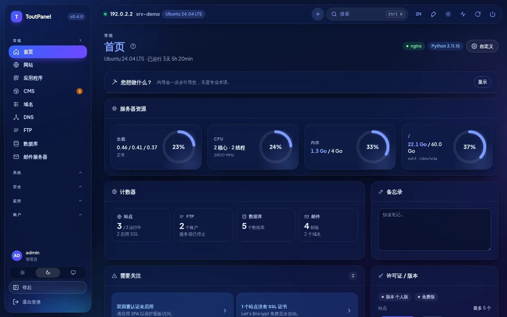
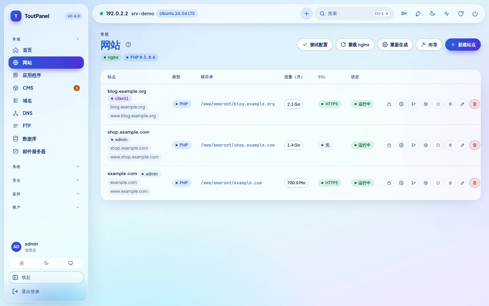
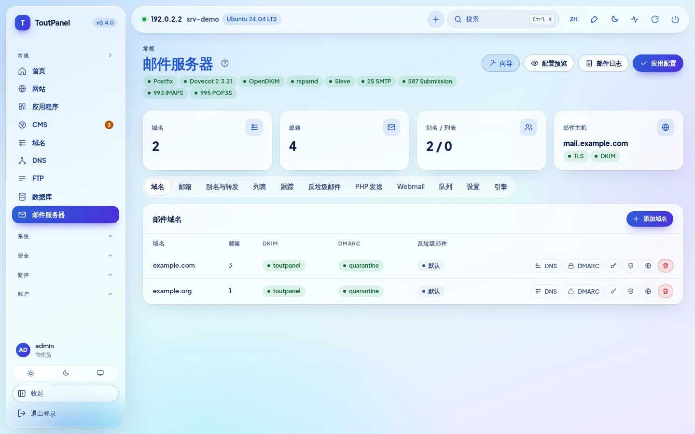
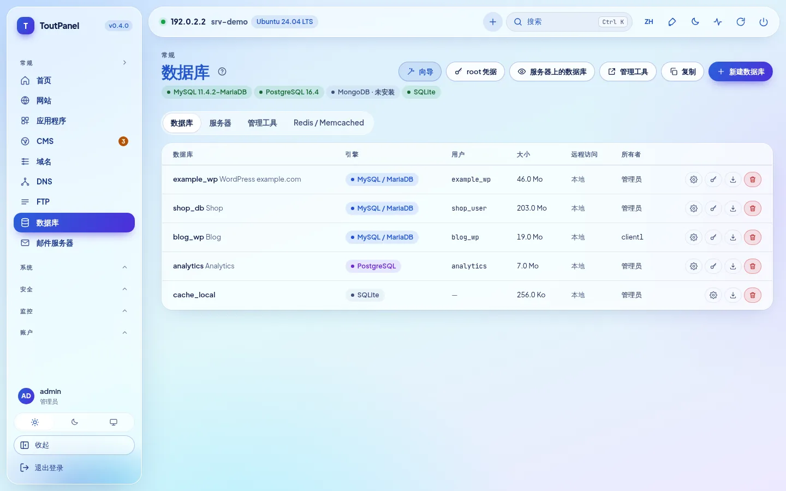
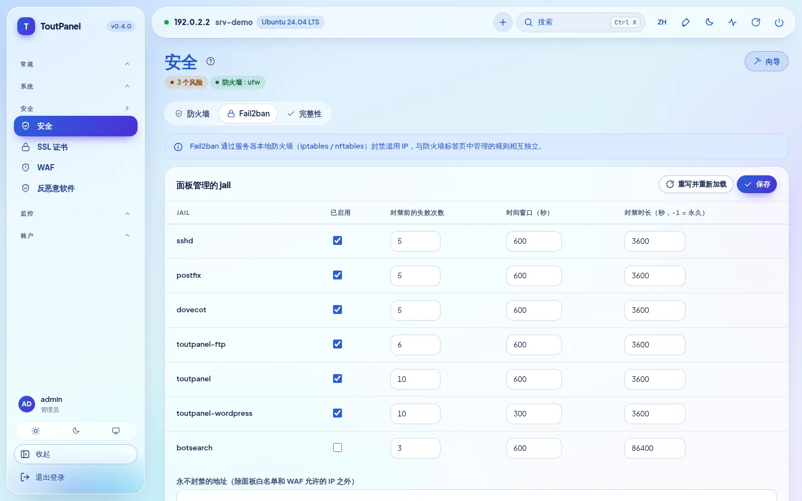
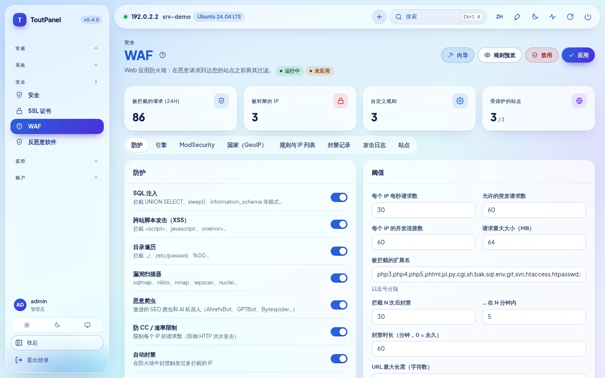
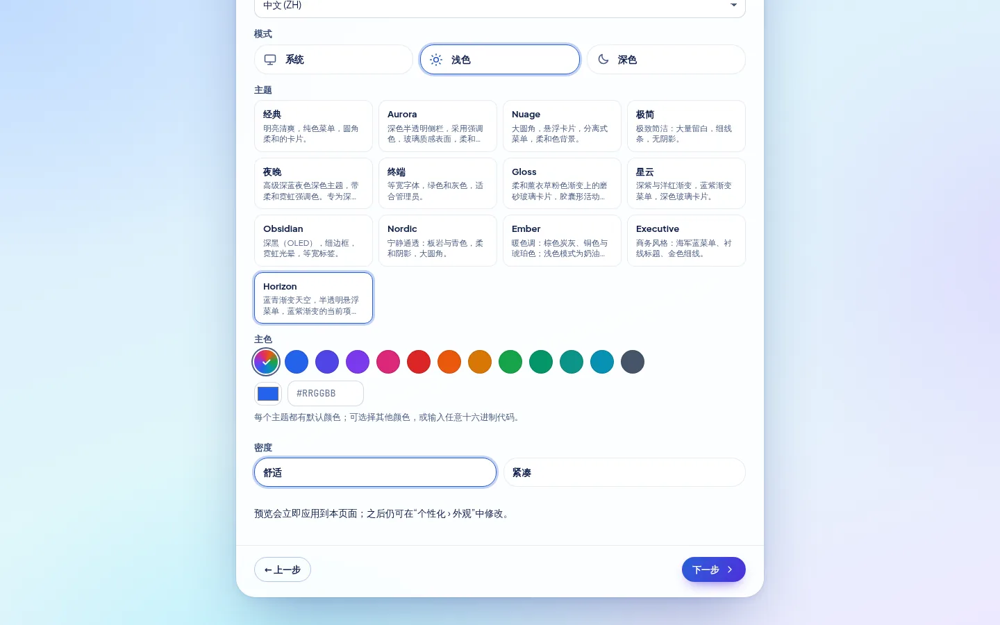
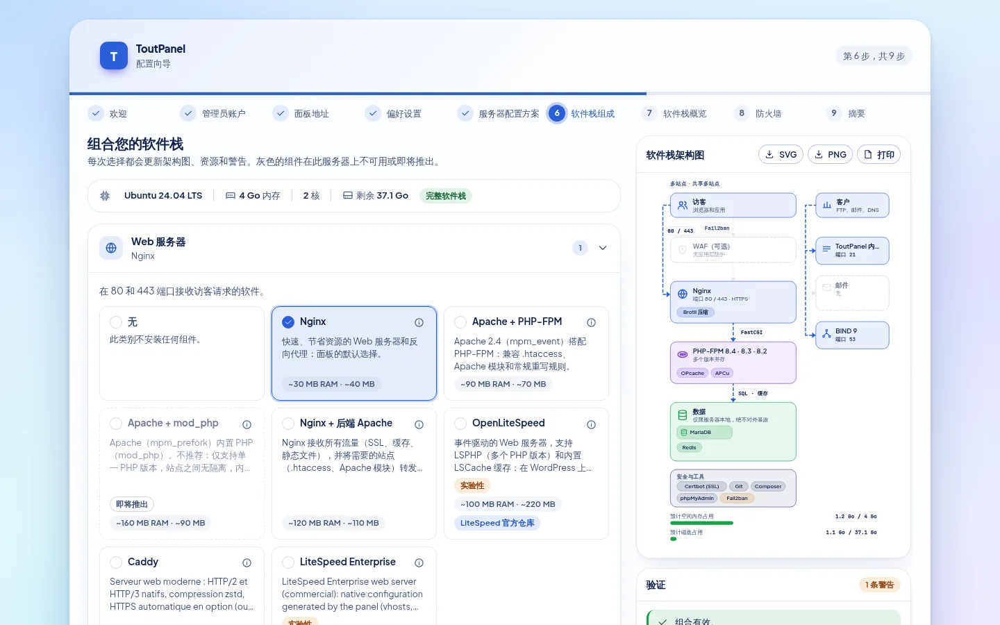
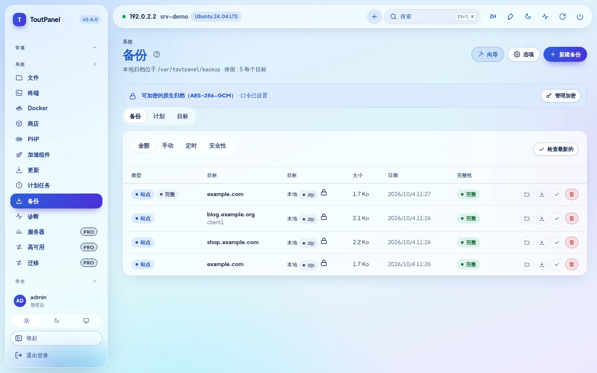
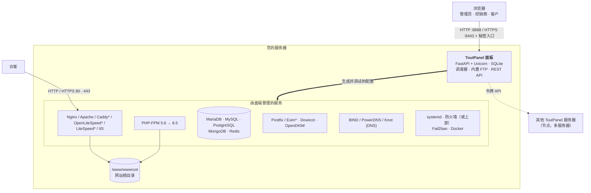

<div align="center">

# ToutPanel

**适用于 Linux 和 Windows 的网站托管面板：在同一个 Web 界面中管理网站、PHP、数据库、邮件、DNS、SSL、安全与备份，支持 10 种语言。**

Nginx · Apache · Caddy *（实验性）* · OpenLiteSpeed *（实验性）* · LiteSpeed Enterprise *（实验性）* · IIS · PHP 5.6 → 8.5 · MariaDB · MySQL · PostgreSQL · MongoDB · Postfix / Dovecot · BIND / PowerDNS / Knot · Let's Encrypt · WAF / ToutWAF · 防火墙 · Docker · 多租户 · 多服务器


[Français](README.md) · [English](README.en.md) · [Deutsch](README.de.md) · [Español](README.es.md) · [Italiano](README.it.md) · [Nederlands](README.nl.md) · [Português](README.pt.md) · [Русский](README.ru.md) · **中文** · [العربية](README.ar.md)

[安装](#full-installation) · [0.5 新特性](#05-新特性) · [功能](#features) · [测试情况](#what-is-tested-for-real-simulated-or-untested) · [CMS](#cms) · [截图](#screenshots) · [主题](#themes) · [版本](#editions) · [架构](#architecture) · [首次启动](#first-start) · [故障排查](#troubleshooting) · [已知限制](#known-limitations)

**Version 0.5.2** · 渠道 **稳定版** · 2026-10-06

</div>


---

## ToutPanel 是什么？

ToutPanel 能把一台刚装好系统的服务器变成**功能完整的网站托管平台**，全部通过浏览器操作。只需一条命令，就会安装整套软件栈（默认为 Nginx、PHP-FPM、MariaDB、Redis 或 Valkey、Certbot、Fail2ban，也可以自行组合：配置档、版本、Web 服务器、FTP、邮件、DNS、加速器）、面板本身及其服务；之后只需点几下，就能创建网站、数据库、邮箱、DNS 区域和证书，无需编辑任何一个配置文件。

它既适合托管**自己网站**的个人用户（个人版免费，无需密钥，无需注册），也适合转售托管服务的**代理商和托管商**：经销商与客户账户、套餐与配额、计费、白标、多服务器与高可用（专业版和企业版）。

您的数据始终留在**您自己的服务器上**：界面中没有任何外部字体或 CDN，在激活许可证之前不会调用任何许可证服务器。

**本 README 有意写得完整而坦诚。** 每项功能凡属实验性的都标注*（实验性）*，需要付费版本的标注 **Pro**；每一节都会说明哪些内容已被测试**真实执行**，哪些只用模拟验证过，哪些则完全没有测试。表格[哪些经过真实测试、哪些仅为模拟、哪些未经测试](#what-is-tested-for-real-simulated-or-untested)把这些信息汇总在一起，[已知限制](#known-limitations)则列出各项保留意见。如果某项功能对您至关重要，请先在测试服务器上验证，再投入生产。

> **本仓库不包含任何源代码。** 它只发布安装面板所需的内容：安装程序 `install.sh` 和 `install.ps1`、已编译的面板（`dist/`，“仅字节码”的 Python wheel 包）、版本说明、许可证以及 `version.json`。

## 快速安装

**Linux**（以 `root` 身份，最好在刚装好系统的服务器上）：

```bash
curl -sSL https://raw.githubusercontent.com/qu3ntin01/toutpanel/main/install.sh | sudo bash -s -- --lang zh
```

**Windows**（以**管理员身份**运行 PowerShell）：

```powershell
Set-ExecutionPolicy Bypass -Scope Process -Force
iwr -useb https://raw.githubusercontent.com/qu3ntin01/toutpanel/main/install.ps1 | iex
```

上面 Linux 命令中的 `--lang zh` 会让安装程序使用中文（该语言也会成为面板的初始语言）；在 Windows 上，可在运行前先执行 `$env:TOUTPANEL_LANG = "zh"`。脚本结束时会显示面板 URL（含**秘密入口**）、管理员账户，以及**配置向导**的链接。所有选择也都可以通过选项完成：软件栈（`--profile`、`--web`、`--php`、`--db`、`--ftp`、`--mail`、`--dns`、`--accel`……）、防火墙（`--firewall`）、指定版本（`--version`）、语言（`--lang`）、目录（`--home`，默认为 `/var/toutpanel`），以及不会出现在进程列表中的密码传递方式（`TOUTPANEL_PASSWORD`、`--password-file`、`--password-stdin`）。**[安装向导](https://toutpanel.com/installation-assistant)**可通过菜单生成命令行。详细说明、先决条件、端口与故障排查：[完整安装](#full-installation)。

## 概览

| | |
|---|---|
| **系统** | Linux：Debian 11+、Ubuntu 20.04+、AlmaLinux / Rocky Linux / RHEL / CentOS Stream / Oracle Linux 8+、Fedora，以及其他以精简软件栈支持的发行版系列（openSUSE、Arch、Alpine、Amazon Linux……），并显示**支持级别**（`toutpanel compat`）；Windows 10 / 11、Windows Server 2016 → 2025（经受的检验少于 Linux） |
| **Web 服务器** | Nginx、Apache、Nginx + Apache、**Caddy**\*、**OpenLiteSpeed**\*（LSPHP、LSCache）、**LiteSpeed Enterprise**\*（商业产品，在我们的测试中从未启动：参见[限制](#known-limitations)；`--web litespeed` 需要 `--accept-litespeed-license`）、IIS（基础支持）；Apache + mod_php *即将推出* |
| **软件栈** | **组合器**：配置档、版本、架构图、可续装的安装过程、真实状态；加速器（OPcache、JIT、Redis / Valkey、Memcached、Varnish\*、Brotli、Zstandard\*、HTTP/3\*） |
| **PHP** | 5.6 至 8.5 并存，目录中有 138 个扩展，每个网站可选一个版本，每个网站有独立的 `php.ini` 和 FPM 池 |
| **应用** | 每个网站可选版本的 Node.js、Python（WSGI / ASGI）、Ruby、Go、Java、.NET 运行时，systemd、PM2、Passenger；Docker 与 Compose；原子化 Git 部署 |
| **数据库** | MariaDB、MySQL（发行版自带，或 Oracle 的 8.4 / 9.x\*）、Percona Server\*、PostgreSQL、MongoDB、SQLite，按账户提供 Redis / Memcached |
| **FTP、DNS、邮件** | FTP：内置、Pure-FTPd\*、ProFTPD\*、vsftpd\*、仅 SFTP\* · DNS：BIND、PowerDNS、Knot · 邮件：Postfix + Dovecot、Exim\* · 同一时间只用一个引擎，可切换并可回退 · Roundcube、SnappyMail、SOGo\* 网页邮箱 |
| **防火墙与安全** | 由面板管理的防火墙（nftables、ufw、firewalld、CSF、iptables）**或由上游管理**，带防锁死保护；Fail2ban；内置 WAF、ModSecurity、ToutWAF；反恶意软件；账户隔离（CageFS 的**部分等价实现**） |
| **CMS** | 目录中有 595 个 CMS 和应用（582 个已验证：536 个免费、46 个商业），可选版本，安装受跟踪并可更新 |
| **界面** | **10 种语言的界面**、13 个亮色 / 暗色主题（默认 **Horizon**）、自由选择强调色、**16 个**引导式向导、**包含 844 项检查的诊断**、以 WCAG 2.1 AA 为目标的无障碍设计（**未经审核**） |
| **文档** | 以法语撰写；已翻译为英语、德语、西班牙语、意大利语、荷兰语、葡萄牙语、俄语、中文和阿拉伯语，覆盖 **79% 的页面**（94 页中的 75 页，这 9 种语言各自如此）；其余 19 页（参考部分：API、错误代码、模板……；诊断页面）保持法语并附有提示横幅；诊断目录和 API 消息已翻译为 10 种语言 |
| **安装程序** | `install.sh` 和 `install.ps1` 支持 10 种语言（默认英语，`--lang` / `--fr`……、`TOUTPANEL_LANG`、系统语言），提供软件栈和防火墙选项、指定版本（`--version`）、可生成命令的[安装向导](https://toutpanel.com/installation-assistant) |
| **自动化** | REST API（1016 个 OpenAPI 操作）、`toutpanel` 命令行、带签名的 Webhook、操作前 / 后脚本、Ansible 和 Terraform、**包含 800 个集成模块的 Marketplace**（显示成熟度） |

<sub>\* *实验性*：功能真实可用，但经受的检验较少，或带有在界面中和[已知限制](#known-limitations)里声明的限制。</sub>

## 0.5 新特性

**0.5.0** 是**稳定**版本（[`main`](https://github.com/qu3ntin01/toutpanel/tree/main) 分支）；它包含预发布版 **0.5.0b1**（**Analytics** 板块）和 **0.5.0b2**（**ToutWAF 集成**、在 ToutWAF 中管理的 SSL），并新增了 **ToutWAF 的“Web 服务器”板块**，以及经独立复核得出的**安全修复**。每一行都说明哪些是真实的、哪些不是：“0.5 新增”表示真实且经过测试，但经受的检验少于 0.4 的功能。

| 新特性 | 成熟度与保留意见 |
|---|---|
| **Analytics**（监控 → Analytics）：**自托管**的访问统计，风格类似 Google Analytics —— 在线访客、流量来源、受众、页面、事件、目标和转化漏斗、技术报告、时间段对比、筛选、CSV / JSON 导出、邮件报告、告警、只读分享链接；**默认不使用 Cookie，从不保存 IP 地址** | **0.5 新增**：引擎和 API 已测试（约 560 个测试）；在**真实的 Chromium** 中针对**真实的面板**做了端到端流程测试（130 位访客、427 次页面浏览、54 项检查与真实值一致）；跟踪器仅在 Chromium 下经过检验（Safari 和 Firefox 未测试）；精确的访问时长和实时数据需要跟踪器，仅使用日志只能得到页面浏览量；不使用 Cookie，就无法识别跨天的回访访客 |
| **世界地图**：236 个国家/地区、缩放、各大洲、合并显示的城市、实时的动画到访、亮色和暗色主题 | **0.5 新增**：流畅度是在软件渲染下测得的，**并非在真实显卡上** |
| 由面板安装的 **DB-IP 地理定位**（国家/地区、城市、网络；CC BY 4.0，每月更新） | **0.5 新增**：读取器已在**真实的**国家/地区数据库上验证；**城市和网络**数据库仅在合成文件上验证；没有数据库时，国家/地区显示为“未知” |
| **代理变体**：跟踪器由网站自身提供（以绕过广告拦截器） | nginx 和 Apache 已用**真实的服务器**验证；Caddy：仅验证了渲染和语法；**不支持 OpenLiteSpeed、LiteSpeed Enterprise 和 IIS**（需手动粘贴代码） |
| **ToutWAF 集成**：从 ToutWAF 创建网站（绑定时发放受限的 API 令牌，通过 `Idempotency-Key` 实现无重复重放，已发布的创建表单模式），**在 ToutWAF 中管理的 SSL**（由 ToutWAF 终止 HTTPS，面板的 SSL 页面在 ToutWAF 中管理证书），集群的全局开关和按服务器开关，**ToutWAF 的“Web 服务器”板块**（预设的受限范围令牌、`GET /api/capabilities`、`GET /api/sites/{id}`、任务进度、`toutpanel waf connect --ssl toutwaf\|panel`、`toutpanel waf status`） | **0.5 新增**：已针对**模拟的 ToutWAF**（遵循其开发者所描述契约）测试（约 500 个测试）；**从未在真实的 ToutWAF 上尝试过**（“Web 服务器”板块和受管理的 SSL 均未）；ToutWAF 证书 API 的续期、HTTPS 选项和能力路由有待确认；SSL 界面未在浏览器中验证 |
| **安全修复**（独立复核，两轮）：API 令牌的作用域提权（自 0.4.0 起存在）、复合 ToutWAF 令牌、网站的日志和 TLS 私钥、已删除网站的 Analytics 数据、`X-Forwarded-For` 的读取、按令牌的幂等性、Analytics 的摄取上限 | **真实**：每项修复都有一个回归测试；详情和严重程度见[变更日志](CHANGELOG.md)；复核并不详尽（vhost 指令的验证、解析器的 ReDoS 均未检查） |
| **翻译**：界面和服务器消息提供 10 种语言，文档的 Analytics 页面提供 9 种语言 | 文档已翻译 **79% 的页面**（94 页中的 75 页）；其余 19 页参考页面（诊断目录、错误代码、API、设置、模板）保持法语 |

<a id="whats-new-in-04"></a>

## 0.4 新特性

**0.4.0** 是上一个**稳定**版本（0.4.0b1 和 0.4.0b2 是 `dev` 渠道的预发布版本）。每项功能都标明其成熟度：**稳定**、**实验性**（真实且经过测试，但经受的检验较少或带有已声明的限制）或**即将推出**（可见但置灰，绝不模拟）。右列说明受保留或受限制的内容；每一项的详细说明见[功能](#features)中的对应章节。

| 新特性 | 成熟度与保留意见 |
|---|---|
| 面板**同时监听 HTTP 和 HTTPS**（8888 / 8443，初始使用自签名证书）；面板的 Let's Encrypt 证书，可选择证书颁发机构，支持 DNS-01、通配符和**热重载** | 稳定；已用 Pebble（测试用 ACME 服务器）测试，未使用真正的 Let's Encrypt |
| **安装指定版本**：`--version X.Y.Z`、`--list-versions`；**默认目录为 `/var/toutpanel`** | 稳定 |
| **由面板管理或由上游管理的防火墙**、专属页面、需开放的端口、**60 秒防锁死保护** | 稳定；规则已在私有网络命名空间中用真实的 nftables / iptables 测试 |
| **软件栈组合器**：配置档、版本、架构图、内存 / 磁盘估算、**9 步首次配置向导**、**软件栈**页面 | 稳定 |
| **DNS 引擎**：BIND、PowerDNS、Knot DNS（切换时迁移区域和 DNSSEC 密钥，可回退） | 稳定；已在 Ubuntu 24.04 上用真实守护进程测试 |
| **邮件引擎**：Postfix + Dovecot、外部中继、**Exim + Dovecot**；**FTP 引擎**：内置、**Pure-FTPd、ProFTPD、vsftpd、仅 SFTP** | Postfix 和内置 FTP：稳定；Exim 和其他 FTP 引擎：**实验性** |
| **Web 服务器**：**OpenLiteSpeed**（LSPHP、LSCache）、**Caddy**、**LiteSpeed Enterprise**（可与 Nginx、Apache、“两者并用”互相切换并可回退） | **实验性**；OpenLiteSpeed 和 Caddy 已在 Ubuntu 24.04 上真实测试；**LiteSpeed Enterprise 从未能够启动**（试用许可证被拒绝），只有其官方安装和配置验证真正运行过 |
| **加速器**：OPcache、JIT、APCu、Redis / Valkey、Memcached、FastCGI 缓存、Brotli；**Varnish、Zstandard、HTTP/3**（含可带保护措施安装的 nginx.org 版 Nginx） | Varnish、Zstandard、HTTP/3：**实验性**；其他：稳定 |
| **数据库**：MariaDB 10.6 → 11.8、**MySQL 8.4 / 9.x**（Oracle 软件源）、**Percona Server**、PostgreSQL 13 → 18；**数据库密码静态加密** | Oracle MySQL 和 Percona：**实验性**（在我们的测试中从未安装或启动） |
| **账户隔离**：每个账户一个 PHP-FPM 服务，置于其 cgroup 切片中，systemd 加固，**文件系统隔离笼**（bind mount + bubblewrap） | 为选项，**默认关闭**；**CageFS 的部分等价实现**（内核和网络共享）；未测试：启用此隔离时的 SELinux enforcing（在 AlmaLinux 上未启用此隔离时 SELinux Enforcing 已验证，参见[安全](#section-12)）、真正应用限制的 cgroup v2、整台服务器运行在 systemd 下 |
| **按网站的运行时**（Node.js、Python、Go、Java、Ruby、.NET）、**WSGI / ASGI**、**PM2**、**Passenger** | 真实：Node 20、Python 3.12、gunicorn、uvicorn、PM2、Nginx + Passenger；Go、Java、.NET 为模拟；Ruby 未编译 |
| **统计**：GoAccess、**AWStats**、Matomo；带数据库和双向同步的**预发布环境** | GoAccess、AWStats 和预发布环境（MariaDB）已真实测试；Matomo **从未对真实实例验证过** |
| **备份**：AES-256-GCM 加密、原生增量备份、**rsync** 和 **Borg** 目标、“完整服务器”配置档、部分备份 / 严格模式、恢复测试 | rsync 和 Borg 1.2.8 已真实测试；restic、S3、B2 和 rclone 为**模拟**；rsync / Borg 和 restic：**Pro** |
| **邮件系统**：PHP `mail()` 发送限额、**按域名的 DMARC**、**BIMI**、**DANE**、MTA-STS / TLS-RPT、**SpamAssassin**、**SOGo**、已测试的队列和 CalDAV / CardDAV | SOGo 为**实验性**（`sogod` 从未运行）；BIMI 的 VMC 证书链和 DNSSEC 签名未经验证 |
| **迁移**：完整的 **ISPConfig** 导入（SSH、归档、SQL 转储）、在客户之间转移网站或域名、**扩展的跨服务器账户迁移**（邮件、FTP、cron、SSL、套餐） | **Pro**；cPanel / Plesk / DirectAdmin 已在**人工构造的**归档上测试；从未在两台物理服务器上测试 |
| **高可用**：keepalived / VRRP 浮动 IP、NFS / GlusterFS 共享存储、Dovecot 复制、按节点的历史、Zabbix 模板、**扩展的自动修复** | **Pro**；配置已由真实工具验证，**两台机器之间的切换从未测试** |
| **身份验证**：SSO SAML / OIDC / LDAP 已针对测试提供方测试，WebAuthn 已用虚拟认证器测试，**加固的 TLS**，向账户所有者发送**异常登录提醒** | SSO：**Pro**；未测试任何生产环境的身份提供方或物理密钥 |
| **诊断**（系统 › 诊断）：**844 项检查**、**90 项带预览的自动修复**、**16 个**带真实测试的引导式配置向导 | 诊断计划任务：**Pro**；部分检查是用模拟服务测试的 |
| **服务器消息已翻译**为 10 种语言；**远程 ToutWAF**；更广泛的发行版兼容性；带软件栈选项的**多语言安装程序** | 稳定；少数动态拼接的消息仍为法语 |
| 包含 800 个集成模块的 **Marketplace**（计费、支付网关、监控、CI/CD、IaC、SSO、DNS / CDN、备份、主题……） | **5 个稳定**、199 个测试版、596 个**自动生成**（从未用真实服务试过） |
| Apache + mod_php | **即将推出**（干净地拒绝，绝不模拟） |

详细信息与限制：[已知限制](#known-limitations) · [CHANGELOG.md](CHANGELOG.md)。

<a id="features"></a>

## 功能

本大纲沿用一个完整托管面板参考规范的 **20 个章节**（从 cPanel / Plesk / ISPConfig / DirectAdmin 的水平到高级功能），然后是生态系统。每个章节中的“**真实情况 / 限制**”一行如实说明哪些内容已被执行、哪些没有。每个页面的详细文档：**[toutpanel.com/docs](https://toutpanel.com/docs/)**（在安装时构建后，也由面板在 `/help/` 下提供，并在每个页面提供上下文帮助）。

<a id="section-1"></a>

### 1. 账户、用户与多租户

- 层级为**管理员 → 经销商（Pro）→ 客户 → 子用户**；经销商只能看到并创建自己范围内的内容。
- **细粒度 RBAC**：按模块和按操作的权限，取角色、套餐、访问配置档与父级四者的交集；内置配置档**完全、开发者、会计、网站管理员、只读**以及自定义配置档。
- **套餐与配额**：磁盘、inode、流量、网站、域名、数据库（及每个数据库的大小）、邮件域名和邮箱、计划任务、FTP 账户、DNS 区域、备份、子用户；配额会被计数，并在创建时强制阻止。每月流量不会切断网站：它会触发告警、超额计费，以及（如果您启用）自动暂停。
- **按账户的资源限制**：专属系统用户、systemd 切片（CPU、内存、I/O、进程）应用于计划任务、Git 部署、应用、终端以及 Redis / Memcached 实例；**仅在启用“每账户一个 PHP-FPM 服务”隔离时才作用于 PHP 请求**（选项，默认关闭）。按网站的并发连接数限制：**仅限 Nginx**。
- 手动或自动的**暂停**与恢复（欠费、超出配额且宽限期届满）。
- **“以某用户身份”登录**（模拟登录）会记录在审计日志中，并有时间限制。
- 在客户之间**转移**网站或域名：文件、FTP、备份、数据库、DNS 区域、邮件域名、计划任务、预发布环境、Compose 项目；文件属主、vhost 和 PHP-FPM 池会重新生成，配额会被核对，执行前可预览。
- **批量创建**（最多 500 个账户）、**CSV 导入 / 导出**（1 000 行，防公式注入，UTF-8 / UTF-16 / Windows-1252）、**内部备注**和可筛选的**标签**（tag）。

> **真实情况 / 限制**：层级、权限、配额、暂停和转移都有 API 测试覆盖，并且逐条路由核对了配置档。`setquota`（文件系统的磁盘和 inode 配额）只用模拟执行器验证过，并且假定文件系统以 `usrquota` 挂载。真正应用限制的 cgroup v2 尚未测试。在主节点上暂停某个账户，不会同步到其在各节点上的镜像账户；托管在某个节点上的网站无法在客户之间转移。

<a id="section-2"></a>

### 2. 身份验证与面板访问

- **TOTP 双因素认证（2FA）**，附带备用码，可按角色或按套餐强制启用；**WebAuthn / FIDO2 安全密钥和 passkey**（个人版即包含）。
- **企业 SSO（Pro）**：**OpenID Connect**（发现、PKCE）、**SAML**（元数据、防重放、组 → 角色）、**LDAP / Active Directory**（LDAPS / StartTLS，**默认验证证书**）；SSO 登录绝不会默认授予管理员角色。
- 通过 IP 地址 / CIDR 白名单和国家（GeoIP，需自行提供 MaxMind 数据库）对面板进行**访问限制**，并且**拒绝保存会把管理员自己排除在外的规则**。
- **防暴力破解**：按 IP 和按账户的持久化锁定、恒定响应时间、N 次失败后启用自托管的 **ALTCHA 验证码**、面板的 Fail2ban jail、连续失败突发告警。
- **会话**：列表、撤销（管理员一侧也可操作）、绝对过期和空闲过期。
- **密码策略**：长度、字符类别、常见密码、用户名、基于 k-匿名的 **Have I Been Pwned**（可关闭）、历史记录、过期；通过一次性签名链接**重置密码**。
- **登录日志**和**异常登录提醒**（新 IP 地址、新国家、新设备），发送给管理员**以及账户所有者**（可按账户关闭，邮件或短信）。
- **HTTPS 面板**：同时监听 HTTP 和 HTTPS，初始为带 SAN 的自签名证书（地址变化时重新生成），随后可使用**针对面板主机名的 Let's Encrypt**（ZeroSSL、Buypass 或自定义 ACME，DNS-01 和通配符）并支持热重载；URL 中带有**秘密入口**（没有它，面板返回 404）。

> **真实情况 / 限制**：TOTP、锁定、会话、密码策略：已测试。**WebAuthn**：已用 Chromium 的虚拟认证器测试（真实的注册与登录），**未使用物理密钥**。**OIDC**：已针对真实的本地 OIDC 服务器测试（已验证 PKCE，伪造的令牌被拒绝）；**SAML**：已用测试身份提供方测试（31 个测试：有效、过期、重放、被篡改的断言……）；**LDAP**：已针对真实的 OpenLDAP（`slapd`）测试；**没有尝试过任何真实的身份提供方**（Keycloak、Entra ID、Okta……）。**新国家**的检测使用了真实的 MaxMind 测试数据库。面板的 Let's Encrypt：已用 **Pebble** + certbot 5.8 + BIND 测试，**未**使用真实服务。SAML 库（`python3-saml` + `xmlsec1`）为可选；没有它面板也能启动。

<a id="section-3"></a>

### 3. Web 与网站托管

- **一键建站**：多域名、别名、**停放域名**、**重定向**域名、**通配符**（`*.exemple.com`）、PHP-FPM、静态、反向代理、应用。子域名可以是网站的一个域名，也可以是独立的网站。
- **Web 服务器**：由 Jinja2 模板生成的 **Nginx、Apache、Nginx + Apache、Caddy\*、OpenLiteSpeed\*、LiteSpeed Enterprise\* 或 IIS** vhost，并在**重载前验证**（`nginx -t`、`apachectl -t`、`caddy validate`……），失败时回退到上一份有效的 vhost；Nginx ↔ Apache ↔ “两者并用” ↔ Caddy ↔ OpenLiteSpeed ↔ LiteSpeed 之间可**切换**并可回退；某个服务器无法复现的功能（内置 WAF、ModSecurity、按国家过滤、`.htaccess`……）会被**明确提示**，绝不会被悄悄忽略。
- **多版本 PHP** 5.6 → 8.5 并存（Sury、PPA ondrej、Remi、windows.php.net），每个网站一个版本和**一个 PHP-FPM 池**，以账户用户身份运行；**按网站的 `php.ini`**（允许 13 个指令，包括 `disable_functions` 和 `open_basedir`，并经过防注入验证），目录中有 **138 个扩展**（按 PHP 版本管理，由管理员操作）、ionCube、**FPM 参数**（`pm`、`max_children`、`start_servers`、超时、`max_requests`……）。
- **应用运行时**：Node.js、Python（**WSGI / ASGI**：gunicorn、uvicorn、hypercorn、daphne、waitress）、Ruby、Go、Java、.NET，**每个网站可选运行时版本**（官方下载并经 SHA-256 校验，Python 使用 `uv`，绝不编译；会检测 nvm、pyenv 等）、**systemd** 单元、**PM2**、**Phusion Passenger**（Nginx 和 Apache）、代理到端口或 Unix socket（含 WebSocket）、无中断重载、`toutpanel runtimes`。
- 到端口或 socket 的**反向代理**，**负载均衡**（round robin、`least_conn`、`ip_hash`）。
- 301 / 302 **重定向**（带或不带查询字符串，正则表达式）、强制 HTTPS、规范的 `www` 主机名。
- 自定义 **HTTP 头**（CSP、X-Frame-Options……）和 **HSTS**（时长可调、`includeSubDomains`、`preload` 需确认并经事先检查）。
- **按 vhost 的自定义 Nginx / Apache / Caddy 指令**（管理员）：写入、重新生成、测试服务器，服务器拒绝时**自动恢复**。
- 受密码保护的**目录**（bcrypt）和按 IP 的访问规则、自定义**错误页面**、**防盗链**、**维护模式**（带 `Retry-After` 的 503，允许的 IP）。
- **HTTP/2**、**HTTP/3 / QUIC\***（Caddy 和 OpenLiteSpeed 原生支持；使用编译了 QUIC 的 Nginx，或可从“加速器”页面安装 nginx.org 的 Nginx，带模拟、备份和回退；仅用 Apache 时不可能）、**Brotli** 压缩（模块存在时）、**Gzip**、**Zstandard\***。
- **缓存**：FastCGI 缓存（Nginx）、**OPcache**、**Redis / Valkey**、**Memcached**、**Varnish\***（仅 HTTP）、LSCache（OpenLiteSpeed 和 LiteSpeed Enterprise），并可**在面板中清除**（每个网站和每个加速器都有“清除缓存”按钮）。
- **预发布环境（staging）**：克隆网站（文件 + 数据库），**无需 wp-cli** 即可替换 URL（包括序列化的 PHP 值）、排除的表、**同步到生产环境、从生产环境同步或双向同步**（文件：以最新者为准；数据库按主键逐行合并，冲突规则可选，**删除操作绝不传播**），两侧都会先做备份。
- 可配置的**网站根目录**（`public/`、`web/`……），每个网站的**访问日志和错误日志**可实时查看并可下载（logrotate 轮转）。
- 使用三个引擎的**流量统计**：**GoAccess**、**AWStats**、**Matomo**（“针对此网站”）；按网站逐月的**带宽跟踪**。

> **真实情况 / 限制**：Nginx：vhost 由**真实的 Nginx** 提供服务并用 curl 查询（重定向、401 / 403、防盗链、维护、通配符、错误页面）。Apache：vhost 已由 `apache2 -t` 验证，**在我们的测试中从未真正提供服务**；Nginx 在 Apache 前面：从未一起启动；Nginx / Apache 的切换是用模拟执行器和真实的 vhost 语法测试的。OpenLiteSpeed：真实启动的 OpenLiteSpeed 提供 PHP、静态、重定向、认证、LSCache。**Caddy**：真实的 Caddy 2.11（HTTP、HTTPS、HTTP/2、HTTP/3、PHP-FPM、代理、无中断重载），在 Ubuntu 24.04 上；RHEL 系列、真实 ACME 均未执行。**LiteSpeed Enterprise：从未启动**（参见[限制](#known-limitations)）。`disable_functions` / `open_basedir`：已用真实的 PHP-FPM 验证。从软件源安装 PHP 版本：在我们的测试中未执行（需要 Internet）。**运行时**：Node 20、Python 3.12、gunicorn、uvicorn、PM2 和 Nginx + Passenger 为真实；**Go、Java 和 .NET 为模拟**，Ruby 未编译，应用的 systemd 单元未启动。**HTTP/3**：真实的 Nginx 1.31 二进制文件向 QUIC 客户端提供 HTTP/3；在本机上安装 nginx.org 软件包的过程未执行。Brotli 取决于 Nginx 模块。Memcached 和 Varnish（由 `varnishd` 7.1 编译的 VCL）：已真实执行，但 Varnish 置于 Nginx 前面的完整上线流程未执行。**GoAccess 和 AWStats**：已真实执行；**Matomo：从未对真实实例验证过**（使用的是假的 API 服务器）。**预发布环境**：已在真实的 MariaDB 实例上测试，逐行合并仅适用于 MySQL / MariaDB（PostgreSQL 和 SQLite 为直接复制，不替换 URL）。Apache 的 HTTP/3 和 Apache 的 FastCGI 缓存并不存在。

<a id="section-4"></a>

### 4. SSL / TLS

- **Let's Encrypt**、**ZeroSSL**（EAB）、**Buypass**、自定义 ACME 服务器；**HTTP-01** 和 **DNS-01** 验证（将 TXT 记录写入 BIND / PowerDNS，或写到 Cloudflare、OVH、Route53），**通配符**证书、**SAN / 多域名**证书（网站的所有名称、别名和停放域名）。
- 每日**自动续期**，并重载相关服务（Web 服务器、邮件、FTP、面板），**失败时告警**；到期前 30 / 14 / 7 / 1 天的**到期提醒**（可调）。
- **导入**商业证书（CRT、密钥、证书链、**PFX**）并**生成 CSR**（RSA / EC、SAN，私钥保留在服务器上）；自签名证书；**证书**页面显示所有证书的有效期、颁发者和到期时间。
- **服务的 SSL**：邮件（Postfix / Dovecot 的 SNI）、FTP / FTPS、面板、主机名。
- **加固的 TLS**：Mozilla 配置档（现代 = 仅 TLS 1.3，中间级为默认，旧版），经验证的自定义套件，可调的 **OCSP stapling**，曲线和 DH ffdhe2048，`ssl_session_tickets off`，按网站的 HSTS。

> **真实情况 / 限制**：已用 **Pebble**（Let's Encrypt 的 ACME 服务器）、真实的 certbot 5.8 和真实的 BIND 测试：HTTP-01、DNS-01、通配符、续期、失败、EAB。**从未向真正的 Let's Encrypt、ZeroSSL 或 Buypass 执行过任何签发。** DNS-01 要求域名的区域由面板（或已配置的提供商）管理。TLS：已用真实的 Nginx、`openssl s_client`（按配置档实际提供的协议和套件）、真实的 OCSP 应答器和 `apache2 -t` 验证；对 OpenLiteSpeed 和 Caddy 的适配未经测试；不支持后量子密码学。FTP 证书不受到期提醒的监控。

<a id="section-5"></a>

### 5. DNS

- 区域由 **BIND、PowerDNS 或 Knot DNS** 提供服务（同一时间只用一个本地服务器；切换时迁移区域和 DNSSEC 密钥，可回退），或推送到某个提供商。
- **14 种记录类型**：A、AAAA、CNAME、MX、TXT、SRV、NS、CAA、PTR、TLSA、DS、SSHFP、HTTPS、SVCB，带细致的验证；创建时应用的**区域模板**（变量 `{domain}`、`{ip}`、`{mail}`……）。
- **DNSSEC**：自动签名（BIND `dnssec-policy`、Knot KASP、PowerDNS），显示供注册商使用的 DS 和 DNSKEY，手动轮换（BIND、Knot；**PowerDNS：在面板之外轮换**）。
- 通过 TSIG 的**辅助服务器**（AXFR + NOTIFY），在服务器群的节点上自动配置（**Pro**）。
- 通过 API 的**外部提供商**：**Cloudflare、OVH、Route 53、PowerDNS**（推送和导入区域）；外部区域：列表、导出（BIND、CSV、JSON）以及**用 `dig` 验证传播**。
- **BIND 导入 / 导出**，每条记录和每个区域的 TTL，**自动序列号**（`AAAAMMJJnn`），服务器 IP 的**反向 DNS（PTR）**，**传播验证**（1.1.1.1、8.8.8.8、9.9.9.9 和本地服务器）以及语法验证（重载前执行 `named-checkzone`）。
- **自动生成的邮件记录**：MX、SPF、DKIM、DMARC、SRV IMAP / SMTP / POP3、`autoconfig` / `autodiscover`、MTA-STS、TLS-RPT、CalDAV / CardDAV；IPv6、国际化域名（IDN）、位于区域之外的邮件主机。

> **真实情况 / 限制**：BIND、PowerDNS 和 Knot 为真实（`named-checkzone`、`dig`，BIND → PowerDNS → Knot 的切换循环保持同一个 DS）。**Cloudflare、OVH、Route 53 和 PowerDNS 的 API 是用模拟的传输层测试的**，从未使用真实服务。**辅助服务器集群**从未在两台真实的 DNS 服务器上运行过。只有当地址块委派给您时，PTR 才会生效：面板无法向您的提供商申请。传播检查不涵盖 PTR、TLSA、DS、SSHFP、HTTPS 和 SVCB 类型。

<a id="section-6"></a>

### 6. 邮件系统

- **Postfix + Dovecot + OpenDKIM**，Rspamd 或 SpamAssassin，可选 **Exim + Dovecot\***（Postfix 的子集，已声明限制），外部中继；域名、**带配额的邮箱**、**别名**、**转发**、**兜底地址（catch-all）**、**邮件列表**（mlmmj）、**带日期范围的自动回复**、**Sieve 过滤器**（引导式规则或脚本，ManageSieve）、TLS 下的 IMAP / POP3、提交端口 587 / 465。
- 一键安装 Roundcube、SnappyMail 或 **SOGo\*** **网页邮箱**，并可**从面板直接登录**。
- **SPF、DKIM**（生成，**双发布轮换**）、**按域名的 DMARC**（`none` / `quarantine` / `reject`、`pct`、`rua`、`ruf`、`sp`、`adkim`、`aspf`、`fo`，**引导式逐步加严**）、**MTA-STS** 和 **TLS-RPT**、**BIMI**（由面板托管的 SVG 徽标，仅在 DMARC 强制执行率为 100 % 时才发布）、**DANE**（邮件端口的 TLSA `3 1 1`，**两步轮换**）。
- Rspamd **反垃圾邮件**（按域名和按邮箱的设置，垃圾邮件 / 正常邮件学习），或受控的 **SpamAssassin**（spamd、`spamass-milter`、按邮箱的 `user_prefs`；amavis 为实验性），**ClamAV 杀毒**、**灰名单**、**RBL / DNSBL**、全局、按域名或按邮箱的**白名单和黑名单**。
- **发送速率限制**：按邮箱、按套餐和默认值（已认证的 SMTP 用户，通过 Rspamd），**以及按网站和按账户的 PHP `mail()` 限制**（面板的 `sendmail` 封装：日志、1 小时和 24 小时上限、告警、防头注入保护），避免被入侵的网站发送垃圾邮件。
- **出站中继 / smarthost**、**队列**（刷新、挂起、删除）、**邮件日志和单封邮件跟踪**、客户端**自动配置**（Outlook、Thunderbird）、**fetchmail**、**CalDAV / CardDAV**（Radicale）、**IP 信誉监控**（黑名单，覆盖服务器的所有公网地址和各节点的出站 IP）。

> **真实情况 / 限制**：队列已用**真实的 Postfix** 测试；Dovecot：配置经 `doveconf` 验证；CalDAV / CardDAV：**真实的 Radicale 3.8**；SpamAssassin：`spamassassin --lint`、`spamd` 和 `spamc` 为真实；PHP `mail()`：封装已用 PHP 真实的 `mail()` 真正执行。**模拟**：Rspamd、ClamAV、mlmmj、fetchmail、`spamass-milter` / amavis 的组装；**SOGo：实验性，`sogod` 从未运行**。BIMI：**VMC 证书链未经验证**；DANE：DNSSEC 签名未经验证（DANE 只有配合 DNSSEC 才有意义）。PHP `mail()` 的限制**无法发现**直接调用 `sendmail` 或自行打开 SMTP 连接的脚本。使用 Exim 时：没有邮件跟踪，也没有邮件列表；使用 SpamAssassin 时：没有按邮箱的速率限制，也没有灰名单。收到的 DMARC 报告不会被分析。自动发布 DNS 记录的前提是该区域由面板管理。一个可靠的邮件服务器需要固定的公网 IP、正确的反向 DNS，并开放 25 / 465 / 587 端口。

<a id="section-7"></a>

### 7. 数据库

- **MariaDB（10.6 → 11.8）、MySQL、Percona Server\*、PostgreSQL（13 → 18）、MongoDB、SQLite**：数据库、用户和**权限**（完全、只读、自定义），**按 IP 授权的远程访问**（防火墙规则、`bind-address`、`pg_hba.conf`；`0.0.0.0/0` 被拒绝）。
- **Adminer**（MySQL 和 PostgreSQL）与 **phpMyAdmin**（MySQL）可安装所选版本，并核对 PHP 兼容性，可**从面板单点登录（SSO）**；**未集成 pgAdmin**。
- **导入 / 导出**（即时 gzip 压缩）、**计划转储**（计划任务）、**维护**（检查、修复、优化、分析）、每个数据库的**大小配额**（先撤销权限再恢复，并告警）。
- **选择数据库管理系统的版本**（MariaDB 和 PostgreSQL 官方软件源，大版本升级前会**先备份**，不支持降级）；MySQL 8.4 / 9.x（Oracle 软件源）和 Percona\*：MySQL 系列同一时间只用一个引擎。
- **额外的服务器**（Docker）、**按账户的 Redis / Memcached**（隔离实例、Unix socket、套餐的 `maxmemory`、账户的 cgroup 切片）。
- **复制（Pro）**：MariaDB / MySQL（GTID）和 PostgreSQL（streaming），命令向导**以及**由面板执行的复制，手动提升或带数据库主机重写的**自动切换**。
- **数据库密码静态加密**（Fernet，面板密钥已备份），列表中不含密码，**明确且有日志记录的显示操作**。

> **真实情况 / 限制**：SQLite：真实。**MariaDB**：有一个真实实例用于预发布环境和诊断的测试，但 SQL 管理层（用户、权限、配额）主要是用**模拟的 SQL 执行器**测试的；**PostgreSQL：模拟**；MongoDB（可选的 `pymongo` 模块）：用假客户端测试，并且在镜像存在时用 Docker 中真实的 `mongod` 7 测试。Oracle MySQL 和 Percona：软件包和软件源已验证，**从未安装或启动**。复制**从未在两台真实服务器之间搭建过**，自动切换也不是共识算法。**各引擎的 root 凭据以明文保存在 `settings.json` 中**（权限 0600）；`mongodump` 会把密码暴露在命令参数中。

<a id="section-8"></a>

### 8. 文件与访问

- **文件管理器**：上传、带语法高亮的 **CodeMirror 编辑器**、权限（`chmod`）和属主（`chown`）、zip / tar 压缩包、按名称和按内容的**搜索**、**回收站**、**按文件夹的磁盘和 inode 占用**、拖放、**一键修复权限和属主**。
- **内置 FTP / FTPS 服务器**（多账户、受限目录、权限、配额、允许的 IP、日志），或 **Pure-FTPd\*、ProFTPD\*、vsftpd\*、仅 SFTP\***（同步面板账户，切换并可回退）。
- **按用户 chroot 的 SFTP / SSH**（`sshd` 的 drop-in 由 `sshd -t` 验证并可回退，bind mount）、通过 jailkit 或 `rbash` 的**受限 shell**、**SSH 密钥**（ed25519、ECDSA、RSA ≥ 2048）。
- **Web 终端**（Linux 下为 bash，Windows 下为 PowerShell；客户端始终以其账户用户身份运行）。
- 按账户的**磁盘和 inode 配额**，使用 FTP 账户的 **WebDAV**。

> **真实情况 / 限制**：FTPS：**真实握手**并验证了证书；终端：PTY 中真实的 bash；jailkit：安装了 jailkit 时，真实的 `jk_init` / `jk_jailuser` 和真正被关进笼子里的 shell；WebDAV：真实的 `wsgidav`（可选模块 `wsgidav` + `a2wsgi`）。备用 FTP 引擎：已在 Ubuntu 24.04 上真实执行，**RHEL 系列未经检验**。测试从未重启真实的 `sshd`；`setquota`：见第 1 节。没有 `pywinpty` 模块时，Windows 终端功能会简化。

<a id="section-9"></a>

### 9. 应用与部署

- **一键安装程序**：**595 个 CMS 和应用**的目录（参见 [CMS](#cms)），包括 WordPress、Joomla、Drupal、PrestaShop、Nextcloud、Laravel、Symfony、Matomo、Dolibarr、Moodle、phpBB、MediaWiki、Ghost。
- **WP Toolkit**：wp-cli、核心、插件和主题的更新、加固、克隆、**检测存在漏洞的安装**（Wordfence Intelligence 数据源）、严重告警。
- **Git 部署**：克隆和更新（使用令牌的 HTTPS，或按网站使用部署密钥的 SSH）、分支、标签或提交、**带签名的 GitHub / GitLab Webhook**、**部署后脚本**、计划刷新、**原子部署**（`releases/`、`shared/`、`current` 链接、回退）。
- 从网站运行 **Composer、npm、pip**（`install` / `ci` / `update` 白名单，以账户用户身份）。
- **Docker**：容器、镜像、**网络、卷**、磁盘空间和清理、经验证的 `docker run`、按账户的 **Docker Compose** 项目（带代理网站，并拒绝危险的 YAML：特权、socket、敏感挂载）。
- “网站”、“应用安装”、“Git 部署”、“PHP”**向导**（参见[第 19 节](#section-19)）。

> **真实情况 / 限制**：Git：在本地仓库上使用真实的 `git`（克隆、更新、带签名的 Webhook、在真实文件系统上的原子部署）；**从未连接过真实的 GitHub 和 GitLab**。`npm` 和 `pip` 以网站用户身份真实运行；Composer：未执行（测试环境中没有 phar）。Docker：容器、镜像、网络和卷用模拟执行器测试，并且在有守护进程响应时执行真实的 Docker 循环。**CMS 安装：下载为模拟**（自动化测试套件没有端到端地执行任何真实的目录安装）；测试没有真实运行 WordPress / wp-cli，只有 Matomo 通过“应用”向导做了端到端安装。

<a id="section-10"></a>

### 10. 计划任务

- 逐字段的**可视化编辑器**与**原始 cron 语法**保持同步，预览接下来的 5 次执行，快捷写法（`@daily`……），类型：访问某个地址、运行命令、备份网站或数据库。
- **以账户或网站的用户身份执行，对客户绝不使用 root**：命令会被**拒绝**而不是以 root 运行；`root` 仅保留给管理员，需要确认并记录在审计日志中；会应用账户的 cgroup 限制。
- 可选的**调度器**：内部（APScheduler，默认）、**systemd 定时器**（`OnCalendar`、`Persistent=true`）或 `/etc/cron.d`，可逆地回退。
- **邮件通知**（从不 / 出错 / 总是）、**执行历史**（状态、时长、返回码、输出开头）、**由套餐强制的最小频率**、立即执行、带空跑测试的**向导**。

> **真实情况 / 限制**：与真实的 `systemd-analyze calendar`（18 个表达式）的比较，以及 `systemd-analyze verify` 都是真实的；**从未真正触发过 systemd 定时器**。使用内部调度器时，**面板停止期间任务不会运行**（重启时补跑 5 分钟以内的任务）；不支持导入已有的 crontab。在 Windows 下，客户的任务会被拒绝。

<a id="section-11"></a>

### 11. 备份与恢复

- **粒度**：网站、数据库、文件夹或文件、邮箱、邮件域名、账户、**整台服务器**；按需备份和**计划**，带 **GFS** 保留策略（每日、每周、每月）。
- **原生引擎（zip），所有版本均包含**：带 SHA-256 校验和与 CRC 检查的归档，可选的 **AES-256-GCM 加密**（口令，默认、按目标、按计划或按备份设置），**增量备份**（一次完整备份，然后是增量备份，可恢复每个备份的状态，保留策略会保护备份链）。目标：本地文件夹。
- **远程目标（Pro）**：**rsync**（文件夹或 SSH，`--link-dest` 硬链接或可加密的归档）、**Borg**（加密、去重、本地或 SSH）、**restic**（加密、去重：S3 及兼容服务、SFTP、Backblaze B2，并通过 rclone 支持 FTP / Google Drive / OneDrive / Dropbox / WebDAV）。密钥在数据库中加密保存，绝不会通过 API 返回。
- **“完整服务器（含配置）”配置档**：生成的 vhost、PHP-FPM 池、证书和密钥、DKIM、邮件、DNS、FTP、crontab、防火墙规则和面板数据；**必须使用加密归档**，在新服务器上进行**引导式恢复**（模拟、被替换的文件保留为 `.pre-restore-…`、重载服务）。**不包含系统、软件包和文件属主**。
- **细粒度恢复**（浏览归档、选择文件、原地恢复或恢复到某个文件夹），以及**客户自助**恢复，范围受控；在高风险操作（恢复、删除、安装、数据库管理系统更新）之前会**自动做安全备份**。
- **数据库转储失败不会被忽略**：“部分”备份会被标记（徽章、告警），或在**严格模式**下被拒绝；**完整性检查**（SHA-256、CRC、`restic check`）、**恢复测试**（把转储重新导入临时数据库，按校验和检查文件样本）和**每周报告**（默认关闭）、**失败告警**。
- 可选的 Btrfs、ZFS 或 LVM **快照**，用于在备份期间冻结读取。

> **真实情况 / 限制**：原生归档、加密、增量备份链、完整服务器配置档：已真实执行；**rsync**（本地文件夹以及通过临时 `sshd` 的 SSH）和 **Borg 1.2.8**（本地和 SSH）：真实，**从未发往真实的远程服务器**；Borg 2.x 未测试。**restic、S3、Backblaze B2 和 rclone：命令已生成并用模拟执行器验证，从未对真实的仓库或服务执行。** ZFS / LVM / Btrfs 快照以及 MySQL / PostgreSQL 恢复测试：执行器或数据库管理系统为模拟；`zfs send` 未实现。**加密归档的文件名是明文的**（目标和日期）；rsync 的“tree”模式存放的是**明文**文件；丢失口令会使归档无法读取。完整服务器恢复不会自动重新应用防火墙。远程备份、restic、Borg 和 rsync 需要 **Pro** 版本；请勿与高可用的 rsync / lsyncd 同步混淆，后者不是备份目标。

<a id="section-12"></a>

### 12. 服务器安全与隔离

- **防火墙** nftables、firewalld、UFW、CSF 或 iptables（自动检测），**由 ToutPanel 管理或由上游管理**（云安全组、托管商的防火墙：此时面板不会触碰任何规则，并列出**需要在托管商处开放的端口**）；规则、IP 列表、预定义服务、监听端口及暴露情况、**基础 DDoS 防护**（按 IP 的 SYN、连接数限制、扫描检测）、**60 秒保护机制**：未经确认，变更会被服务器自行撤销。
- **Fail2ban**：SSH、Postfix、Dovecot、FTP、面板和 WordPress（`wp-login.php`、`xmlrpc.php`）的 jail，封禁项可列出、添加、移除，并可测试过滤器。
- **内置 WAF**（SQL 注入、XSS、RCE、目录遍历、扫描器、机器人、速率、自动封禁；按国家封锁为 **Pro**）以及按网站的 **ModSecurity + OWASP CRS**，规则可按网站停用（**Pro**）；**ToutWAF** 是厂商自家的 WAF / 反向代理，为推荐引擎（**Pro**），可本地部署或**远程**部署在另一台服务器上；仍提供 **BunkerWeb** 和 **SafeLine**（Docker）。
- **反恶意软件**：ClamAV、Linux Malware Detect、YARA，以及**已安装的 ImunifyAV / Imunify360**（面板绝不会安装它）；隔离、恢复、计划扫描（Pro）。**Rootkit 检测**（rkhunter、chkrootkit），系统文件（debsums、`rpm -Va`、AIDE）和面板文件的**完整性检查**。
- **漏洞扫描**：WordPress（Wordfence 数据源），以及**超出 WordPress 范围**的 **OSV** 数据库（Joomla、Drupal、PrestaShop、OpenCart、Laravel、Symfony、TYPO3、Craft CMS、Pimcore、Silverstripe、Grav、Matomo、Django、Flask、Ghost、Strapi……），另外以账户用户身份运行 `composer audit`、`npm audit` 和 `pip-audit`。
- **账户隔离**：**每个账户一个系统用户**、每个网站一个 PHP-FPM 池、**每个账户的 PHP-FPM 服务置于其 cgroup 切片中**（`per-account` 选项，**默认关闭**）、**systemd 加固**（`PrivateTmp`、`ProtectSystem`、`NoNewPrivileges`、系统调用过滤……）、**按账户的文件系统隔离笼**（只读 bind mount、最小化的 `/etc`、私有的 `/tmp`、`/proc` 和 `/run`，shell、终端、任务和部署使用 bubblewrap；选项，默认关闭）。**这是 CageFS 的部分等价实现**：内核和网络仍然共享（参见限制）。
- **AppArmor**（Nginx、PHP-FPM、BIND 的本地配置档）和 **SELinux**（在 Red Hat 系列上自动声明上下文和布尔值；**已在 AlmaLinux 9.8 和 10.2 上以 Enforcing 模式验证**，见下文）；访客的 **GeoIP 封锁**（Nginx，**Pro**）；**自动安全更新**（`unattended-upgrades`、`dnf-automatic`）以及待处理更新的告警。
- **AlmaLinux 实验室（SELinux Enforcing）**：AlmaLinux 9.8 和 10.2 在 SELinux Enforcing 下已在真实的 QEMU 实验室中验证（2026 年 10 月 4 日：69/69 和 68/68 项检查，0 次 AVC 拒绝，包括重启；无 KVM，仅一个节点，流程仅限于 Nginx + PHP-FPM + MariaDB + Pure-FTPd + Postfix / Dovecot / rspamd + fail2ban + firewalld）；Rocky Linux、RHEL、Fedora 未执行；Apache、OpenLiteSpeed、Exim、ProFTPD、vsftpd、PostgreSQL、多服务器、ToutWAF、Docker 以及与 SELinux 配合的按账户 PHP-FPM 隔离均未覆盖。该实验室发现并促成修复了 **13 个 RHEL 系列特有的缺陷**，其中包括：Nginx 的 DH 文件上下文（只要安装了证书，Nginx 就无法再重载）；`/var/vmail` 在声明上下文之后才创建且没有 `restorecon`（Dovecot 无法写入，邮件滞留在队列中）；面板日志 fail2ban 无法读取（机器重启后该服务无法再启动）；`semanage` 拒绝 `/run/toutpanel-fpm`（`/run` = `/var/run` 的等价关系）；按模式逐条声明上下文，而不是**单个 `semanage import` 事务**（在仿真环境中耗时五分钟）；Dovecot 和 OpenDKIM 未设置开机启动；AlmaLinux 和 EPEL 中没有 rspamd（已添加 `rspamd.com` 软件源）；AlmaLinux 10 上的 Postfix 不带 Berkeley DB（改用 `lmdb` 表而非 `hash`）；云镜像中没有 `firewalld`（使用 `--firewall on` 时安装）。详情：文档中页面[在 Linux 上安装](https://toutpanel.com/docs/installation/linux/#selinux-alma-rocky-rhel-fedora)的 SELinux 一节。
- **密封的审计日志**（链式 HMAC、每日锚点、带签名的导出），记录所有操作：谁、做了什么、何时、来自哪个 IP 地址；安全页面上有“建议”卡片。

> **真实情况 / 限制**：规则和反 DDoS 脚本已由 `nft -c` 验证，防火墙已在**私有网络命名空间**中用真实的 nftables 和 iptables 测试；`apparmor_parser` 为真实；**隔离笼**已用为测试创建的系统用户下的真实进程、真实的 PHP-FPM 以及由**真实的 systemd**（在某个命名空间中）启动的生成单元测试；`disable_functions` / `open_basedir` 已用真实的 PHP-FPM 验证；WAF：真实的配置测试（`nginx -t`，正常请求 200，四次伪造攻击被 403 拦截）。**模拟**：Fail2ban、firewalld、CSF、ClamAV、rkhunter、自动更新、ImunifyAV（模拟的 CLI）、单元测试中的 SELinux 命令（模拟执行器；只有在上述 AlmaLinux 实验室中才会真正执行）。**未测试**：**SELinux enforcing 模式下配合隔离笼和按账户 PHP-FPM 隔离**、Rocky Linux、RHEL 和 Fedora、**真正应用限制的 cgroup v2**、整台服务器运行在真实的 systemd 下、ToutWAF（控制台、远程）、BunkerWeb 和 SafeLine。**隔离的限制**：共享内核（内核漏洞可绕过一切）、网络不按账户过滤、`open_basedir` 无法约束 PHP 启动的命令、使用网站的凭据即可访问数据库；Windows 和 OpenLiteSpeed 下没有按账户的服务和隔离笼。**内置 WAF 不分析 POST 请求的正文**；GeoIP 封锁需要 `geoip2` 模块和 MaxMind 数据库，并且只在 HTTP 层面生效。OpenLiteSpeed 下不应用 ModSecurity。OSV 扫描依赖对 `api.osv.dev` 的访问（可关闭）。

<a id="section-13"></a>

### 13. 监控与告警

- **可自定义的仪表盘**：**23 个小组件**（CPU、内存、磁盘、I/O、负载、网络、服务、配额、备忘、备份、工单……），布局按用户保存；服务器的**历史监控**（每 60 秒一个采样，保留 7 天）和**按账户**的监控（CPU、内存、进程），服务器群的**按节点历史**，按账户归并的资源消耗进程。
- **服务状态**，崩溃时**自动重启**（防循环保护，尊重主动停止），开机自启。
- **可用性（Uptime）**：HTTP(S) 探测，带预期状态码和**关键字**，24 小时 / 30 天统计、故障事件、告警及恢复通知；个人版有 3 个探测。
- **告警**：磁盘已满、配额已达、服务停止、证书即将过期、**IP 被列入黑名单**、备份失败、部署失败、异常登录、高可用切换、PHP 发信被拦截……；**通道**：邮件、**短信**（Twilio、OVHcloud、Brevo）、**Telegram**（官方 Bot API 或自托管）、**Slack、Discord、Microsoft Teams** 的 Webhook 或带事件过滤的通用 JSON；告警会抄送给账户所有者。
- **Analytics**：网站访问统计（在线访客、流量来源、受众、世界地图、页面、事件、目标、转化漏斗、技术报告），默认不使用 Cookie，也不保存 IP 地址；数据来源：访问日志和 JavaScript 跟踪器；DB-IP 地理定位；导出、邮件报告、告警、分享（**0.5 新增**，参见 [0.5 新特性](#05-新特性)）。
- **日志查看器**（面板、网站、Web 服务器、MySQL、系统、邮件、Let's Encrypt、`journalctl -u`），实时跟踪和搜索。
- **Prometheus 导出** `/metrics`（**Pro**），可下载 **Grafana 仪表盘**和 **Zabbix 模板**（6.0 和 7.0，YAML 或 JSON），以及 `UserParameter` 文件。

> **真实情况 / 限制**：邮件发送（SMTP、STARTTLS、认证）已针对**真实的本地 SMTP 服务器**测试；Telegram、Slack、Discord、短信：**模拟的 HTTP 端点**，没有发送任何真实消息。**Zabbix 模板未导入过真实的 Zabbix**；Grafana 仪表盘未导入过真实的 Grafana。只有配置了至少一个通道，告警才会发出。Uptime：仅支持 HTTP（没有 TCP 探测或 ping）。被监控的服务列表是固定的。

<a id="section-14"></a>

### 14. 服务器管理

- **服务**：启动、停止、重启、重载、设为开机自启；**系统更新**（apt、dnf / yum、pacman、apk、zypper：安全更新、自动更新、需要重启、历史记录）；按稳定 / dev / 自定义渠道的**面板更新**，带事先备份、健康检查和**自动回退**。
- **IP 地址**：IPv4 / IPv6 清单、持久化的附加 IP（netplan、NetworkManager、ifupdown）、按网站或按账户的独立 IP、共享 IP；**主机名、NTP、时区、swap**。
- **组件的选择与切换**：Web 服务器（Nginx、Apache、两者并用、Caddy\*、OpenLiteSpeed\*、LiteSpeed Enterprise\*）、PHP 版本、数据库管理系统版本、DNS、邮件和 FTP 引擎、加速器：全部可回退。
- 面板的**任务队列**（优先级、并发、取消、重试、清理）、**自动修复**（无效的 vhost 和 PHP-FPM 池、缺失的 socket、已停止的服务、已过期的证书、属于 root 的根目录；每小时 3 次尝试的保护）、**诊断**（参见[第 19 节](#section-19)）。
- **多服务器（Pro）**：一个**主面板**管理独立的 Web、邮件、DNS 和数据库**节点**（令牌注册、证书固定、镜像账户、按角色路由的资源、转发的操作）。

> **真实情况 / 限制**：Nginx / Apache / “两者并用”的切换会按释放端口的顺序真正启动和停止服务，但只用模拟执行器和真实的 vhost 语法测试过；系统和面板更新是用只读的 `apt`、模拟的 git / pip 测试的，**从未从公共仓库执行过真实更新**；网络命令（`ip addr add`）未执行过。多服务器是用**同一进程内的模拟节点**测试的，**从未在两台真实机器之间测试**。任务重试只存在于内存中（面板重启后丢失）。自动修复不涵盖邮件、DNS 和数据库配置。

<a id="section-15"></a>

### 15. 高可用与可扩展性 *（Pro）*

- Web 节点之间的**负载均衡**：Web 组（在每个成员上创建网站，前端为代理网站，权重、备用、健康检查和告警）。
- **keepalived / VRRP 浮动 IP**：实例、优先级、`track_script`、虚拟地址、持有者跟踪和切换告警。
- **共享存储**：由面板创建的 **NFS** 导出、NFS / **GlusterFS** 客户端向导（复制卷，必须确认）、**CephFS**（仅挂载）；定期 rsync 或实时 lsyncd 的**文件同步**。
- MariaDB / PostgreSQL **数据库复制**及自动切换；自动的**辅助 DNS** 和**辅助 MX**；**邮件复制**（Dovecot 复制）。
- 服务器之间的**热账户迁移**（降低 TTL、复制、维护、重新同步、DNS 切换、转发旧网站）。

> **真实情况 / 限制**：只有 `keepalived -t`、`exportfs`、`doveconf -n`、`nginx -t` 和 `apache2 -t` 是真正执行的；**节点、NFS、GlusterFS、VRRP、Dovecot 复制、数据库复制：模拟，从未在两台真实机器之间测试**。Web 组只有**一个前端**（没有 keepalived 时是单点故障）；主面板仍然是**唯一**的；面板管理 Ceph 的**挂载**，但不创建 Ceph 集群；数据库的自动切换不是共识算法（对要求较高的场景请选用 Patroni 或 MaxScale）；热迁移通过归档复制（没有差异 rsync），并且只涉及网站、数据库和区域。

<a id="section-16"></a>

### 16. 迁移 *（导入：Pro；导出免费）*

- **导入器**：**cPanel**、**Plesk**、**DirectAdmin**、**ISPConfig**（`dbispconfig` SQL 转储、归档或**直接 SSH 连接**，带大小的预览，按客户过滤）、**共享主机**（FTP / FTPS / SFTP 和远程 `mysqldump`）、**IMAP 邮箱**（imapsync 或内置的备用方案）；事先检查、JSON 报告以及带错误和不兼容项的 **CSV**，安全解压归档（防 zip-slip、解压炸弹）。
- **同一面板的服务器之间的账户转移**：网站、数据库、DNS 区域、**邮件域名**（邮箱、DKIM 密钥、邮件）、FTP 账户、计划任务、证书、网站设置、套餐和限制；估算大小、**空跑模拟**、失败后**续传**、**SHA-256 完整性校验**、可选更新 DNS 记录。

> **真实情况 / 限制**：ISPConfig：已在逼真的转储和真实的本地 `sshd` 上测试；**cPanel、Plesk 和 DirectAdmin：已在具有完整结构的人工构造归档上测试**，**不是真实的备份**；共享主机和 IMAP：**模拟**；服务器之间的转移：**从未在两台物理服务器上测试**。邮件通过 HTTPS 归档传输（节点之间没有 rsync / SSH），导入的 FTP 密码会被重新生成，导入的 cron 会被禁用，PHP 扩展和“一键”应用不会被带过去，fetchmail 不会迁移，cPanel 的 `pg_dump -Ft` 格式的 PostgreSQL 数据库需要手动导入。Let's Encrypt 证书会按手动证书的方式复制：DNS 切换后请重新签发。

<a id="section-17"></a>

### 17. API 与自动化

- 覆盖整个界面的 **REST API**（在此版本上统计到 1016 个 OpenAPI 操作）：**整个界面都基于它**；**带作用域（scope）的令牌**和**按 IP 地址限制**；**OpenAPI / Swagger** 文档（`/api/docs`、`/api/redoc`，仅限管理员）。
- **管理 CLI** `toutpanel`：面板的生命周期（端口、入口、密码、更新、许可证、节点），以及可通过 `--json` 脚本化的业务命令（`site`、`account`、`db`、`mail`、`dns`、`backup`、`cron`、`ftp`、`task`、`stack`、`firewall`、`waf`、`runtimes`、`diag`、`isolation`、`caddy`、`litespeed`……）。CLI 并未涵盖 API 能做的全部事情。
- **带签名的出站 Webhook**（HMAC、重试、配额）和**事件**（创建或删除账户、网站、域名、数据库、区域、发票……）；**操作前 / 后脚本**（前置脚本失败会阻止该操作）。
- **Ansible、Terraform、OpenTofu、Pulumi、Helm**：**Marketplace** 的基础设施模块（*测试版*：已针对真实的演示面板测试，而非生产基础设施）；没有专用的 Terraform provider（使用通用的 REST 或 `http` provider）。

> **真实情况 / 限制**：并行的写操作可能会遇到 SQLite 锁（使用 Terraform 时请用 `-parallelism=1`）；少数路由在修改时不接受创建时的字段。API 参考文档为法语。

<a id="section-18"></a>

### 18. 商业、计费与转售 *（Pro）*

- **原生计费**：套餐、发票（增值税、按比例计费、编号、催款、PDF）、**Stripe、PayPal、转账**付款、欠费与**自动暂停**、**用量报告**和按用量计费（CSV，发票上的超额明细行）。
- **下单时自动开通**（`POST /api/billing/provision` 和带签名的订单 Webhook）：一次操作创建账户、网站、DNS 区域、邮件域名和数据库；从客户中心直接登录（SSO）。
- **集成**：**Marketplace** 中的 WHMCS、Blesta、HostBill、FOSSBilling、WooCommerce、PrestaShop、Easy Digital Downloads……模块（见下文）。
- 经销商的**白标**：名称、徽标（通过地址或字母，**不支持上传文件**）、颜色、页脚、支持信息、带 Let's Encrypt 的**面板自定义域名**；可自定义的**事务性邮件**（管理员的全局模板）；**支持工单**（附件、内部备注、SLA、经销商范围）；按角色、套餐或账户定向的**公告**。

> **真实情况 / 限制**：原生计费已测试（按比例计费、增值税、编号、催款、文档）。**Stripe 和 PayPal 是用模拟的传输层测试的，从未对真实服务测试**。**WHMCS：模块已针对一个依据其文档编写的 WHMCS 模拟器测试，从未在真实的 WHMCS 中测试**；**Blesta 和 HostBill：模块仅用假类测试（测试版），从未在真实产品中测试**；ClientExec：仅限结构。**FOSSBilling、WooCommerce、PrestaShop 8.1.7 和 Easy Digital Downloads 3.7.1：模块已安装并在真实平台中运行。** Marketplace 的 **200 个支付网关是“自动生成的”**，依据各提供商的公开文档：**从未对真实服务测试**。自定义域名的证书签发没有被测试覆盖；邮件模板不能按经销商自定义。

<a id="section-19"></a>

### 19. 用户体验

- 可在手机上使用的**响应式界面**（可折叠菜单、触控目标）；**深色模式**（亮色、深色或跟随系统）；**13 个主题**和自由选择的强调色（[主题](#themes)）。
- **多语言**：**10 种语言的界面**（français、English、español、Deutsch、italiano、português、Nederlands、русский、中文、العربية，含从右到左书写；7 614 条界面文本）；**服务器返回的消息已翻译**为 10 种语言（5 388 个消息模板，按检查工具的结果，在其他 9 种语言中 100% 已翻译），以及**诊断目录**；10 种语言的安装程序；**文档**在除法语以外的 9 种语言（包括英语）中各翻译了 79% 的页面（94 页中的 75 页）。
- 全局搜索 `Ctrl+K`（网站、域名、区域、邮件域名、邮箱、别名、数据库、FTP、账户、任务、备份、应用），按您的权限过滤；每个页面都有**上下文帮助**。
- 面向非专业人士的 **16 个分步配置向导**：网站（域名 + SSL + DNS + 数据库 + FTP + 备份，一步完成）、数据库、FTP 账户、用户 / 客户、邮件、自动备份、计划任务、Git 部署、应用安装、PHP、安全加固、告警、防护（WAF）、HTTPS、DNS 区域、防火墙。每个向导都会讲解、实时验证、显示**“将要执行的操作如下”**，执行时若失败则**回退**，然后**真实测试**（连接、投递一封邮件、证书、伪造攻击……），并提供自动修复。
- **诊断**（系统 › 诊断）：**15 个类别**中共 **844 项检查**（网络、DNS、Web、系统、面板、邮件、备份、数据库、安全、FTP / SFTP、Docker、计划任务、应用、性能、第三方服务），**90 项带预览和确认的自动修复**，**7 个配置档**（“我的网站打不开”、“我的邮件收不到”、“服务器很慢”……），带对比的历史记录，导出 JSON / CSV / Markdown / HTML；**带告警的计划任务：Pro**。
- **工具**：DNS 检查、HTTP 和标头测试、SSL 证书、ping、traceroute、端口测试、SMTP 测试、WHOIS。
- **无障碍**：完整的键盘操作、跳转到内容的链接、带焦点陷阱的模态框、ARIA 角色、供屏幕阅读器使用的播报、高对比度、`prefers-reduced-motion`。界面**以** WCAG 2.1 的 AA 级为**目标**。

> **真实情况 / 限制**：**WCAG AA 合规性并未得到证明**：没有做过完整的审核（axe、Lighthouse、屏幕阅读器）；测试只核对源代码中属性的存在以及徽章的对比度。向导在可能时用真实服务测试（私有栈中真实的 Postfix / Dovecot、真实的 `named-checkzone` 和 `dig`、私有命名空间中真实的 nftables、针对 WAF 的真实正常请求和伪造攻击、本地仓库上的真实 `git`）；**模拟**：真实的 Fail2ban 和防火墙、自动更新、通过 `apt` 安装 PHP 扩展、GitHub、Let's Encrypt 证书（本地测试 CA）；备份向导中的 SFTP / S3 未做端到端测试。“向导”按钮不会出现在“网站”页面的页头（该页面有自己的创建向导），也不会出现在“应用商店”页面；告警、安全、WAF 和防火墙向导仅限管理员；诊断中的 SMTP 测试、ping 和 traceroute 在测试中很少被覆盖；少数动态拼接的消息仍为法语；诊断的一部分是用模拟的 fail2ban、防火墙、`apt`、PostgreSQL、MongoDB 和 systemd 测试的。

<a id="section-20"></a>

### 20. 合规与治理

- **GDPR**：以归档形式**导出客户的数据**（档案、网站、数据库转储、Maildir、DNS 区域），**彻底删除**（清除并匿名化发票、审计日志和登录记录），客户提出的删除请求，**处理活动记录**（JSON 或 Markdown）。
- 可配置的**日志保留与轮转**（审计、登录、任务、uptime、监控、反恶意软件、Webhook、导出、网站日志、面板日志）。
- 可导出并可验证的**密封审计日志**（链式 HMAC），每日**外部锚定**（仅追加文件、syslog、Webhook：**Pro**）；**托管商访问**客户数据的**可追溯性**（敏感读取会被记录，并向客户发送邮件）。
- **可强制执行的密码策略与 2FA**：复杂度规则、历史记录、过期；按角色或按套餐强制 2FA。

> **真实情况 / 限制**：审计和登录日志的默认保留期为 **90 天**：如果您需要保存 12 个月，请自行调高；它只涵盖面板的日志（不包括网站 logrotate 之外的系统 FTP / SSH / 邮件日志）。**“本地化的数据托管”：没有任何技术功能**：“数据区域”字段是仅供参考的文本，会写入记录；面板是自托管的，所以您的数据留在您的服务器上，但没有任何机制约束例如远程备份目标所在的区域。“**防篡改**”只有在使用外部锚定时才成立：本地系统管理员可能会重写链和本地锚点。没有一键“对所有人强制 2FA”的设置（请勾选相关的角色）。

---

### 20 个章节之外

#### 软件栈、安装程序与配置向导

- **软件栈组合器**：针对检测到的内存调整的初始配置档（单站点、多站点、托管商、高性能、应用、仅邮件、仅 DNS、节点、LAMP……），可选择 Web 服务器、PHP、数据库、FTP、邮件、DNS、安全、运行时和工具；每次选择都会更新**架构图**（可导出 SVG / PNG），估算内存和磁盘，并按内存大小自动调整设置。
- **同样的引擎，三个入口**：**配置向导**（9 步）、**设置 › 软件栈**页面（真实状态、添加、更改版本）以及 `toutpanel stack`（安装程序也会调用它）。安装**可续装且幂等**：失败的步骤绝不会被计为成功；“即将推出”的组件可见但会被拒绝，绝不模拟。
- **加速器**（专属页面）：OPcache、JIT、APCu、Redis / Valkey、Memcached、FastCGI 缓存、Brotli；**Varnish\***、**Zstandard\***、**HTTP/3\***，显示真实状态、内存、设置、“清除缓存”以及所声明的限制。
- 带支持级别的**发行版兼容性**（`toutpanel compat`）；**多语言安装程序** `install.sh` / `install.ps1`。

#### CMS

- **CMS 页面**：**595 个 CMS 和 Web 应用**的目录，其中 **582 个已验证**（已查询版本来源，已检查下载 URL）：**536 个免费**和 **46 个商业**；搜索、按类别、类型（PHP、Node.js、Python、Go、Java、.NET、静态）和发行版过滤，带“就绪”或“缺少先决条件”的标识。
- **版本选择**：默认为最新稳定版，可选所有已发布的版本（预发布版本需选择启用）；详情页含已核验的先决条件、现有网站或新网站、子目录、自动创建的数据库、管理员账户和语言，并可实时跟踪。
- **集中化的安装管理**：检测所有网站上的安装（包括面板之外的），显示已安装版本和最新版本，更新横幅；**备份**、带事先备份和回退的**更新**、**全部更新**、**克隆**、重新安装、删除、日志、按安装设置的自动小版本更新。
- **商业软件**：详情页含厂商、参考价格和购买链接；通过**厂商提供的软件包**（上传、路径或私有 URL）及其许可证密钥进行安装。
- **本地版本检索**：面板自己查询官方来源（wordpress.org、GitHub、Packagist、npm、PyPI、厂商网站），缓存 6 小时，**每天两次**（05:23 和 17:23，可调）；通过通知通道发出告警。

#### WAF、应用商店、Marketplace 与个性化

- **WAF**：参见[第 12 节](#section-12)。**ToutWAF** 引擎可通过官方安装程序从面板中安装（稳定或 dev 渠道，控制台在 `:9443`，网站同步，带回退的更新），也可在安装时安装（`--waf toutwaf`）；**远程 ToutWAF**：面板连接到另一台服务器上的 ToutWAF（通过 REST API 声明网站，按指纹固定控制台证书，加密令牌，80 / 443 仅限 ToutWAF）。
- **应用商店（Store）**与 toutpanel.com 的目录相连：应用、服务器软件（apt、dnf、pacman、apk、zypper、winget）、**模块**（清单经验证，必须有 SHA-256，热加载）、主题；可上传本地 zip，支持离线模式。
- **集成 Marketplace**：**800 个模块**，分为 14 个系列（支付网关 200、CI/CD 105、监控 104、Docker Compose 模板 65、主题 63、通知 61、备份 43、基础设施即代码 41、SSO 30、自动化 25、DNS / CDN 24、CMS 扩展 14、计费 / 开通 13、域名注册商 12）。**每个详情页都显示成熟度**：**5 个稳定**、**199 个测试版**、**596 个自动生成**（依据厂商公开文档编写，**从未用真实服务试过**）；测试级别：187 个在真实平台中测试，141 个针对模拟器，472 个仅结构性检查（只有语法和结构检查）。63 个模块是面板应用商店的插件，其余 737 个是需要安装到目标平台上的集成（WHMCS、Grafana、n8n、GitHub Actions、Keycloak……）。
- **个性化**：13 个主题、自由选择的强调色、密度、徽标、CSS、菜单链接、vhost 和邮件的 Jinja 模板、可导出的主题。

<a id="what-is-tested-for-real-simulated-or-untested"></a>

## 哪些经过真实测试、哪些仅为模拟、哪些未经测试

这里的“已测试”指由项目的自动化测试套件执行（此版本共收集到 7 605 个测试），或由变更日志中描述的手动验证执行。测试均在 **Ubuntu 24.04** 下进行，只有一个例外：**AlmaLinux 9.8 和 10.2** 下的 SELinux 实验室（见最后一行）。本表概括了上面各节的内容。

| 领域 | 真实测试过 | 模拟（模拟执行器、假服务、模拟传输层） | 未测试 |
|---|---|---|---|
| **Web 服务器** | 真实的 Nginx 提供网站服务（curl）；`nginx -t`、`apache2 -t`；真实的 OpenLiteSpeed；真实的 Caddy 2.11；真实的 Nginx 1.31 二进制文件提供 HTTP/3 | Nginx / Apache / “两者并用”的切换（模拟执行器）；Nginx 在 Apache 前面 | **LiteSpeed Enterprise 从未启动**；真正提供服务的 Apache；Red Hat、Fedora、Arch、Alpine、SUSE 上的 Caddy / OpenLiteSpeed；Caddy 的真实 ACME |
| **PHP 与应用** | 真实的 php-fpm（`-t`、`disable_functions`、`open_basedir`）；Node 20、Python 3.12、gunicorn、uvicorn、PM2、Nginx + Passenger；`npm`、`pip` | Go、Java、.NET；从软件源安装 PHP 版本；CMS 安装（下载） | Ruby（未编译）；已启动的应用的 systemd 单元；WordPress / wp-cli |
| **SSL / TLS** | Pebble + certbot 5.8 + BIND；真实的 OCSP；`openssl s_client` | — | **真正的 Let's Encrypt、ZeroSSL、Buypass**；带加固 TLS 的 OpenLiteSpeed / Caddy |
| **DNS** | 真实的 BIND、PowerDNS、Knot；`named-checkzone`、`dig`；带 DNSSEC 的切换循环 | Cloudflare、OVH、Route 53、PowerDNS 的 API；辅助服务器集群 | **两台真实的 DNS 服务器**；提供商的真实 API |
| **邮件** | 真实的 Postfix（队列，向导的私有栈）；`doveconf`；Radicale 3.8；SpamAssassin / spamd / spamc；PHP `mail()` | Rspamd、ClamAV、mlmmj、fetchmail；milter / amavis 的组装；Exim | `sogod`（SOGo）；BIMI 的 VMC 证书链；DANE 的 DNSSEC 签名 |
| **数据库** | SQLite；真实的 MariaDB 实例（预发布、诊断）；Docker 下的 `mongod` 7（如果存在）；使用真实 PHP 的 Adminer / phpMyAdmin | MariaDB / MySQL 的用户和权限（模拟的 SQL）；**PostgreSQL**；复制 | **Oracle MySQL 和 Percona（从未启动）**；两台真实服务器之间的复制 |
| **文件与 FTP** | 真实的 FTPS 握手；PTY 中真实的 bash；jailkit；`wsgidav`；备用 FTP 引擎 | `setquota`；真实的 `sshd` 重载 | FTP 引擎在 Red Hat 系列上；完整的 Windows 终端 |
| **备份** | 加密、增量、完整服务器的 zip；**rsync**（本地 SSH）；**Borg 1.2.8** | **restic、S3、Backblaze B2、rclone**；Btrfs / ZFS / LVM；MySQL / PostgreSQL 恢复测试 | **真实的 restic 或 S3 仓库**；Borg 2.x；发往远程服务器的 rsync |
| **安全与隔离** | `nft -c`；私有命名空间中的 nftables / iptables；`apparmor_parser`；**隔离笼**（真实进程、PHP-FPM、命名空间中的 systemd 255）；WAF（正常请求 + 4 次伪造攻击）；**AlmaLinux 9.8 和 10.2 上的 SELinux Enforcing**（QEMU 实验室，使用真实的 fail2ban 和 firewalld） | Fail2ban、firewalld、CSF、ClamAV、rkhunter、自动更新；ImunifyAV（模拟的 CLI）；SELinux 命令（单元测试） | **SELinux enforcing 下配合隔离笼和按账户 PHP-FPM 隔离**；**真正应用限制的 cgroup v2**；整台服务器运行在 systemd 下；ToutWAF、BunkerWeb、SafeLine |
| **身份验证** | OIDC（本地服务器）；SAML（测试 IdP，31 个测试）；LDAP（真实的 `slapd`）；WebAuthn（Chromium 虚拟认证器）；TOTP、锁定、会话 | — | **物理安全密钥**；真实的身份提供方 |
| **Analytics** *（0.5 新增）* | 引擎和 API（约 560 个测试）；真实的 Chromium 针对真实的面板（54 项检查）；真实页面上的跟踪器；代理变体搭配真实的 nginx 和真实的 Apache；真实的 DB-IP 国家/地区数据库上的 MMDB 读取器 | DB-IP 城市和网络数据库（合成文件）；Caddy（仅渲染和语法） | Safari 和 Firefox；真实显卡（地图的流畅度）；OpenLiteSpeed、LiteSpeed Enterprise、IIS（不支持代理变体） |
| **监控** | 本地 SMTP（STARTTLS）；`/metrics` | Telegram、Slack、Discord、短信（模拟的 HTTP） | 导入 Zabbix 模板；导入 Grafana 仪表盘 |
| **高可用与多服务器** | `keepalived -t`、`exportfs`、`doveconf -n` | 节点、NFS、GlusterFS、VRRP、dsync、数据库复制 | **两台真实机器** |
| **迁移** | ISPConfig（转储 + 真实的本地 `sshd`）；rsync | cPanel / Plesk / DirectAdmin（人工构造的归档）；共享主机；IMAP | 真实的 cPanel / Plesk / DirectAdmin 备份；两台物理服务器 |
| **计费与 Marketplace** | FOSSBilling、WooCommerce、PrestaShop 8.1.7、Easy Digital Downloads 3.7.1；针对真实面板的 IaC 模块 | Stripe、PayPal；WHMCS 模拟器；Blesta / HostBill（假类） | **真实的 WHMCS、Blesta、HostBill、ClientExec**；**真实的支付网关**；真实的 Matomo |
| **界面与无障碍** | Chromium 浏览器（WebAuthn、SAML、OIDC）；组件的 node 测试 | — | **完整的 WCAG 审核**（axe、Lighthouse、屏幕阅读器） |
| **发行版与架构** | Ubuntu 24.04（上述所有测试，实验室除外）；**AlmaLinux 9.8 和 10.2 的 SELinux Enforcing** 已在真实的 QEMU 实验室中验证（2026 年 10 月 4 日：69/69 和 68/68 项检查，0 次 AVC 拒绝，包括重启；无 KVM，仅一个节点，流程仅限于 Nginx + PHP-FPM + MariaDB + Pure-FTPd + Postfix / Dovecot / rspamd + fail2ban + firewalld） | — | **Rocky Linux、RHEL、Fedora** 未执行；**Apache、OpenLiteSpeed、Exim、ProFTPD、vsftpd、PostgreSQL、多服务器、ToutWAF、Docker 以及与 SELinux 配合的按账户 PHP-FPM 隔离**未被该实验室覆盖；Debian 12 / 13、openSUSE、Arch、Alpine、Amazon Linux、`aarch64`、Windows（经受的检验少于 Linux） |

撰写本文时，测试套件共收集到 7 605 个测试；其中少数依赖于执行顺序（共享状态）。标记为“模拟”并不意味着该功能不可用：逻辑和所生成的命令已经过验证，但**没有在真实服务上执行过**。

<a id="screenshots"></a>

## 截图

本 README 对已有中文版本的界面（14 张）使用 `screenshots/zh/` 中的截图；**其余截图仍为法语界面**（`screenshots/` 中的原图）。[法语 README](README.md) 使用法语截图，[英语 README](README.en.md) 对其 14 个界面使用 `screenshots/en/`。

| | |
|---|---|
| <br>**首页，深色模式**：仪表、计数器、注意事项、许可证 | <br>**网站**：域名、类型、根目录、流量、SSL 和操作 |
| <br>**PHP**：5.6 → 8.5 并存、支持状态、FPM 池 | <br>**网站设置**：Git 部署、SSL、重定向、安全 |
| <br>**DNS**：BIND 区域或提供商、模板、DNSSEC、集群 | <br>**证书**：有效期、颁发者、续期、面板证书 |
| <br>**邮件服务器**：Postfix、Dovecot、OpenDKIM、端口和标签页 | <br>**网页邮箱**：一键安装 Roundcube 或 SnappyMail |
| <br>**数据库**：MariaDB、PostgreSQL、MongoDB、SQLite、Redis | <br>**文件**：编辑器、压缩包、回收站、权限、占用情况 |
| <br>**CMS › 安装**：582 个已验证的 CMS 和应用、搜索、过滤、“就绪”标识 | <br>**CMS 详情页**：已核验的先决条件、版本选择、目标网站、数据库 |
| <br>**CMS › 已安装**：版本、可用更新、备份、克隆 | <br>**WAF › 引擎**：推荐 ToutWAF、内置 WAF、BunkerWeb、SafeLine |
| <br>**终端**：浏览器中的交互式 bash / PowerShell shell | <br>**应用**：WordPress、Joomla、Drupal、PrestaShop、Nextcloud…… |
| <br>**应用商店（Store）**：一键安装服务器软件、模块和主题 | <br>**安全**：建议、防火墙、反 DDoS、Fail2ban |
| <br>**WAF**：防护、阈值、引擎、GeoIP、攻击日志 | <br>**监控**：CPU、内存、网络、负载和磁盘，时间范围 1 小时 → 7 天 |
| <br>**账户**：经销商、客户、套餐、访问配置档 | <br>**服务器**：主面板、节点、路由、迁移 |
| <br>**更新**：系统软件包（安全）和面板 | <br>**设置**：访问、端口、秘密入口、HTTPS、界面 |
| <br>**配置向导**：主题、主色、密度、即时预览 | <br>**Horizon**，默认主题：同一界面的亮色和深色版本 |

**0.4 新特性** — 演示服务器的截图（使用文档专用地址）：

| | |
|---|---|
| <br>**配置向导，配置档步骤**：初始配置档、检测到的内存、推荐配置档 | <br>**软件栈组成**：按类别选择、架构图、验证和估算的资源 |
| <br>**软件栈安装**：进度、步骤、出错后续装 | <br>**向导，防火墙步骤**：由 ToutPanel 管理或由上游管理，将要开放的端口 |
| <br>**设置 › 软件栈**：真实状态、已安装版本、此服务器的架构图 | <br>**软件栈**，深色模式 |
| <br>**加速器**：OPcache、JIT、APCu、Redis、Memcached、FastCGI、Varnish……，显示状态、内存和限制 | <br>**OpenLiteSpeed** *（实验性）*：安装、LSPHP、Web 服务器切换、WebAdmin |
| <br>**安全 › 防火墙**：引擎、管理模式、保护机制、规则 | <br>**监听端口与暴露情况**：已暴露、受限、受保护 |
| <br>**上游防火墙**：需要在托管商处开放的端口，可复制或下载 | <br>**防火墙**，深色模式 |
| <br>**DNS › 引擎**：BIND、PowerDNS、Knot DNS、外部提供商 | <br>**邮件服务器 › 引擎**：Postfix、Exim *（实验性）*、外部中继 |
| <br>**FTP › 引擎**：内置、Pure-FTPd、ProFTPD、vsftpd、SFTP *（实验性）* | <br>**远程 ToutWAF**：面板连接到另一台服务器上的 ToutWAF |
| <br>**首页**：根据支持级别显示“精简软件栈发行版”横幅 | |

**0.4.0 新增的页面** — 约定相同（演示服务器、文档专用地址）：

| | |
|---|---|
| <br>**系统 › 诊断**：844 项检查、引导式流程、类别、即时搜索 | <br>**诊断结果**：可能的原因、隐藏了机密的技术证据、**自动修复** |
| <br>**自动修复**：将被修改内容的精确预览、影响、可撤销 | <br>**首页 ›“您想做什么？”**：分步引导式向导 |
| <br>**引导式向导**（此处：用户）：步骤、上下文帮助、简单或高级模式 | <br>**应用后的真实测试**：逐项检查的结果、可能的原因、一键修复 |
| <br>**高可用** *（Pro）*：keepalived 浮动 IP、服务器和优先级、地址持有者 | <br>**监控 › 服务器群** *（Pro）*：各服务器的可用性、CPU、内存、磁盘和负载 |
| <br>**服务器** *（Pro）*：主面板、Web / 邮件 / DNS 节点、状态、固定的 TLS 指纹 | <br>**账户 › 设置 › 账户隔离** *（选项，默认关闭）*：每账户一个 PHP-FPM、systemd 加固、隔离笼 |
| <br>**设置 › Web 服务器：Caddy** *（实验性）*：可回退的切换、HTTPS、不支持的功能 | <br>**LiteSpeed Enterprise** *（实验性；在我们的测试中从未启动）*：许可证、官方安装、LSPHP |
| <br>**应用商店 › 模块**：集成 Marketplace（计费、监控、SSO、CI/CD、DNS / CDN……） | <br>**备份**：加密归档（AES-256-GCM），完整或增量 |
| <br>**备份加密**：口令加密保存、丢失警告、默认加密或强制加密 | <br>**计划**：范围、保留策略、目标、增量 |
| <br>**设置 › 安全**：异常登录提醒、SSO OIDC / SAML | <br>**SSO** *（Pro）*：LDAP / Active Directory、OpenID Connect、SAML 2.0 |

**在手机上**，界面会自适应（可折叠菜单、可滚动的表格）：

<table>
<tr>
<td align="center"><br><b>首页</b></td>
<td align="center"><br><b>网站</b></td>
</tr>
</table>

> 截图拍摄于演示服务器（Ubuntu 24.04，文档专用地址 192.0.2.2，示例域名）。在这台演示服务器上，某些状态是**模拟的**（上面没有运行任何真实服务）：账户隔离（systemd、cgroup）、Caddy、服务器群和浮动 IP、数据库、邮件、WAF 和 Marketplace 目录；而诊断和向导则是真实执行的。其他语言的截图位于 `screenshots/<语言代码>/`（en、de、es、it、nl、pt、ru、zh、ar）。

<a id="themes"></a>

## 主题

### 13 个主题，您的颜色

全新安装默认使用 **Horizon**：蓝青渐变的天空背景，半透明悬浮的菜单和顶栏，随所选颜色变化的蓝紫渐变活动胶囊，非常粗的蓝色标题。**个性化 › 外观**：先选择另一种设计，再选择**任意强调色**（12 个预设、取色器或 `#RRGGBB` 代码）。面板据此推导出按钮、链接、活动菜单、徽章、渐变和图表，并始终保持至少 4.5:1 的对比度。每个主题都有**亮色和深色**两个版本，支持高对比度和从右到左的语言；预览是即时的，在点击“保存设计”之前不会保存任何内容。密度、圆角、字体、宽度、菜单位置、图标和动画也可以调整，可按用户设置，也可作为所有人的默认值；主题可以导出和导入。


| | | |
|---|---|---|
| <br>**Horizon** *（默认）* · `#2b5fd9` | <br>**经典（Classique）** · `#2563eb` | <br>**Aurora** · `#2563eb` |
| <br>**云（Nuage）** · `#5b5bd6` | <br>**Minimal** · `#18181b` | <br>**夜（Nuit）** · `#0369a1` |
| <br>**Terminal** · `#15803d` | <br>**Gloss** · `#7c3aed` | <br>**星云（Nébuleuse）** · `#8b5cf6` |
| <br>**Obsidian** · `#22c55e` | <br>**Nordic** · `#14b8a6` | <br>**Ember** · `#f97316` |
| <br>**Executive** · `#10b981` | | |

<sub>所示颜色：该主题在亮色模式下的默认强调色，可自由修改。</sub>

主题、模式、**主色**和**密度**也可以在**配置向导**中直接选择（“偏好设置”步骤），并带即时预览；这些是所有账户的默认值，之后每个人都可以选择自己的设置。

<a id="editions"></a>

## 产品版本

所有版本使用的是同一个程序：一个**许可证密钥**会在指定的服务器上启用高级功能。全新安装以个人版运行，无需注册，也无需连接 Internet。

| 版本 | 价格 | 密钥 | 适用对象 |
|---|---|---|---|
| **个人版** | 免费，无期限限制 | 无 | 个人使用：您自己的网站，**最多 5 个** |
| **专业版** | 付费 | 必需 | 托管商、代理商、商业用途：全部功能均包含，网站数量不限（或按许可证套餐） |
| **企业版** | 付费 | 必需 | 专业版 + 不限数量的多服务器 + 优先支持 |

个人版是**完整的**：网站、多版本 PHP、数据库、邮件、DNS、SSL、内置 WAF、本地备份（**包括 AES-256-GCM 加密和增量备份**）、监控、手动诊断、引导式向导（涉及 Pro 功能的步骤仍受限）、客户账户和子用户、WebAuthn、GDPR 工具、API 和 CLI。以下内容仅限付费版本：

<details>
<summary><b>专业版 / 企业版功能的完整清单</b></summary>

| 功能 | 个人版 | 专业版 |
|---|---|---|
| 网站 | 最多 5 个 | 不限（或按许可证） |
| Uptime 探测 | 3 个 | 不限 |
| 出站 Webhook | 2 个 | 不限 |
| 选择 WAF 引擎（ToutWAF、BunkerWeb、SafeLine） | 内置 WAF | ✓ |
| ModSecurity + OWASP CRS | — | ✓ |
| 多服务器：节点、高可用、热迁移 | — | ✓ |
| Web 组和 DNS 集群 | — | ✓ |
| 数据库复制 | — | ✓ |
| 计费、网关、WHMCS、开通 | — | ✓ |
| 经销商白标 | — | ✓ |
| 面板自定义域名 | — | ✓ |
| 支持（工单） | — | ✓ |
| 公告 | — | ✓ |
| 经销商账户 | —（客户和子用户：✓） | ✓ |
| SSO LDAP / OpenID Connect / SAML | —（WebAuthn：✓） | ✓ |
| 按国家封锁（GeoIP） | — | ✓ |
| 计划的反恶意软件扫描 | 手动扫描 | ✓ |
| 远程备份（S3、SFTP、B2、rsync SSH、rclone） | 本地存储（包括加密归档和增量备份） | ✓ |
| restic、Borg 和 rsync 引擎 | — | ✓ |
| Prometheus 导出 `/metrics` | — | ✓ |
| 从 cPanel、Plesk、DirectAdmin、ISPConfig、共享主机、IMAP 导入 | —（导出：✓） | ✓ |
| 应用商店的高级模块 | — | ✓ |
| 审计日志的外部锚定 | —（GDPR 导出和清除：✓） | ✓ |
| 带告警的计划诊断 | 手动诊断 | ✓ |

</details>

- 相关条目带有 **Pro** 徽章；这些页面仍可查看，只有创建和修改受限。
- 激活：**设置 › 许可证 › 激活密钥**（`TP-XXXXX-XXXXX-XXXXX-XXXXX`）或 `toutpanel licence activate <密钥>`。签名令牌在本地验证：许可证可离线运行（每日重新验证，15 天宽限期）。
- 如果许可证过期或不再有效，面板会**回到个人版，且不会删除任何内容**。

价格与购买：**[toutpanel.com/tarifs](https://toutpanel.com/tarifs)** · 详情：[版本与许可证](https://toutpanel.com/docs/guide/editions/)。

<a id="architecture"></a>

## 架构



| 组件 | 作用 |
|---|---|
| **面板** | 由 Uvicorn 提供服务的 FastAPI 应用（Linux 下为 systemd 服务 `toutpanel`，Windows 下为计划任务 `ToutPanel`）。无外部依赖的 Web 界面、REST API、任务调度器、内置 FTP 服务器。 |
| **Web 栈** | Nginx 和/或 Apache（Caddy、带 LSPHP 的 OpenLiteSpeed、LiteSpeed Enterprise：实验性；Windows 下为 IIS）搭配 PHP-FPM；面板根据自己的模板写入 vhost，测试后再重载服务。**软件栈组合器**负责选择并演进这些软件。 |
| **服务** | MariaDB / MySQL / PostgreSQL / MongoDB、Postfix（或 Exim*）/ Dovecot / OpenDKIM、BIND（或 PowerDNS、Knot）、FTP（内置或 Pure-FTPd*、ProFTPD*、vsftpd*）、Fail2ban、防火墙、Docker：由面板通过它们的原生工具来管理。 |
| **CLI `toutpanel`** | 面板的管理（端口、入口、密码、更新、许可证……）和可脚本化的业务命令（`--json`）。 |

<sub>\* 实验性</sub>

```
<home>  (/var/toutpanel 或 C:\toutpanel)
├── data/      面板的 SQLite 数据库、settings.json、密钥、install-info.txt
├── logs/      panel.log 和各网站的日志
├── vhost/     生成的 vhost（当 Web 服务器的原生目录不存在时）
├── ssl/       网站和面板的证书
├── backup/    本地备份
├── src/       本仓库的克隆（渠道、标签、toutpanel update）
└── venv/      面板的 Python 环境
/www/wwwroot   网站根目录（Windows 下为 C:\toutpanel\wwwroot）
```

<a id="full-installation"></a>

## 完整安装

### 先决条件

| | Linux | Windows |
|---|---|---|
| **系统** | **完整**级别：Debian 11 及以上、Ubuntu 20.04 及以上、AlmaLinux / Rocky Linux / RHEL / CentOS Stream / Oracle Linux / CloudLinux 8 及以上、Fedora · **精简**级别（面板可运行，部分功能缺失）：Debian 10、Ubuntu 18.04、CentOS / RHEL 7、Amazon Linux、openSUSE / SLES、Arch、Alpine、Devuan · 参见[发行版兼容性](#distribution-compatibility) | Windows 10、11 · Windows Server 2016、2019、2022、2025（最低 build 14393） |
| **权限** | `root`（或 `sudo`）和 `bash` | PowerShell 5.1+，**以管理员身份**运行（无需 winget） |
| **Python** | 3.9 至 3.14（如果发行版提供，由脚本安装） | 如果缺失，由脚本安装（3.12，来自 python.org） |
| **内存** | 至少 1 GB（仅面板），搭配 MariaDB 和 PHP 时推荐 2 GB | 同左 |
| **磁盘** | 2 GB 可用空间 + 您的网站 | 同左 |
| **网络** | 出站 HTTPS 访问（GitHub、PyPI、发行版软件源、Let's Encrypt）；邮件需要固定的公网 IP 和反向 DNS | 同左（python.org、nginx.org、windows.php.net、MariaDB） |

架构：`x86_64` 和 `aarch64`（其他：精简级别）。最好安装在**刚装好系统的**服务器上。如果服务器上已经配置好 Nginx、Apache 或 MariaDB，请使用 `--stack none`：面板会检测到它们，并把 vhost 写入它们的原生目录，而不触碰其余内容。

<a id="distribution-compatibility"></a>

### 发行版兼容性

安装程序和面板会检测发行版（`/etc/os-release`、架构）并显示**支持级别**：`toutpanel compat` 列出已知的发行版，`toutpanel check` 给出您服务器的级别，当级别不是“完整”时，首页的横幅会提醒您。**绝不设置版本上限**：已知系列的较新版本会被当作已知的最新版本来处理。

| 级别 | 含义 | 示例 |
|---|---|---|
| **完整** | 规划了完整的软件栈（Web 服务器、多版本 PHP、可选版本的数据库、邮件、防火墙、自动更新） | Debian 11+、Ubuntu 20.04+（LTS 和中间版本）、AlmaLinux / Rocky / RHEL / CentOS Stream / Oracle Linux 8+、CloudLinux 8 和 9、Fedora、Raspberry Pi OS 64 位 |
| **精简** | 面板可运行，但某些功能缺失或需要人工干预（系统已停止维护、没有 systemd 的 init、缺少第三方软件源、32 位架构）；非阻塞式警告 | Debian 10、Ubuntu 18.04、CentOS / RHEL 7、Amazon Linux 2 和 2023（同一时间只有一个 PHP）、openSUSE / SLES、Arch 及衍生版、Alpine、Devuan、Kali |
| **不支持** | 未知、过旧或不可变的系统：安装程序会说明并停止 | Fedora CoreOS / Silverblue、MicroOS、Flatcar、Gentoo、NixOS、Void |

“完整”描述的是面板**规划的**级别；**测试是在 Ubuntu 24.04 下进行的**，只有一个例外：**带 SELinux Enforcing 的 AlmaLinux 9.8 和 10.2**（2026 年 10 月 4 日的 QEMU 实验室）；其他发行版（包括 Rocky Linux、RHEL 和 Fedora）没有做端到端验证（参见[已知限制](#known-limitations)）。如果系统太旧，会提供 Python 3.9+（发行版较新的软件包，或经 SHA-256 校验的独立 Python，需经您同意）。

### Linux

```bash
curl -sSL https://raw.githubusercontent.com/qu3ntin01/toutpanel/main/install.sh | sudo bash
```

如果想在执行之前先阅读脚本：

```bash
curl -sSLO https://raw.githubusercontent.com/qu3ntin01/toutpanel/main/install.sh
less install.sh
sudo bash install.sh
```

安装需要 3 到 6 分钟，取决于网络连接。

**安装向导。** 所有选项（账户、端口、目录、软件栈、防火墙、WAF、版本、语言……）都可以通过 **[toutpanel.com/installation-assistant](https://toutpanel.com/installation-assistant)** 上的菜单选择，它会生成命令行并实时检查（机密信息绝不会以明文出现在其中）。

**安装指定版本。** 标准命令会安装最新的稳定版；`--version` 可选择其他版本（列表：`--list-versions`）。预发布版本发布在 `dev` 渠道，用 `--channel dev` 安装：

```bash
# 最新的稳定版
curl -sSL https://raw.githubusercontent.com/qu3ntin01/toutpanel/main/install.sh | sudo bash
# 指定版本（列表：--list-versions）
curl -sSL https://raw.githubusercontent.com/qu3ntin01/toutpanel/main/install.sh | sudo bash -s -- --list-versions
curl -sSL https://raw.githubusercontent.com/qu3ntin01/toutpanel/main/install.sh | sudo bash -s -- --version 0.4.0
# 最新的预发布版本（dev 渠道）
curl -sSL https://raw.githubusercontent.com/qu3ntin01/toutpanel/dev/install.sh | sudo bash -s -- --channel dev
```

**交互式菜单。** 在终端中不带模式选项运行时，脚本会介绍 ToutPanel，检测已有的安装，并提供选项：**安装**（完整软件栈）或**仅安装面板**（可选**节点模式**）；如果面板已存在，则可选择**更新**、**完全重新安装**或**卸载**。它还会询问**防火墙**（ToutPanel / 上游 / 稍后），并在面板启动后询问**软件栈配置档**。在没有终端的情况下（自动化，`--yes`），它不会提问：直接安装，如果面板已存在则更新（防火墙为“稍后”，软件栈为默认值）。

**脚本所做的事情：**

1. 如有需要，安装 Python 3.9+ 并创建虚拟环境 `<home>/venv`；
2. 安装 **Web 栈**（Nginx、PHP-FPM、MariaDB、Redis 或 Valkey、Certbot、Fail2ban），与以前一样，或安装您组合的栈（`--profile`、`--web`、`--php`、`--db`……，会传给 `toutpanel stack apply`）；
3. 将本仓库克隆到 `<home>/src`，**校验**与系统 Python 对应的 wheel 包的 **SHA-256 校验和**并安装；
4. 创建随机的**管理员账户**和**秘密访问 URL**；
5. 注册 **systemd 服务** `toutpanel`；
6. 按 `--firewall` 设置**防火墙**：`on`（ToutPanel 管理并开放必要的端口）、`off`（上游防火墙：不做任何系统规则，并列出需要在托管商处开放的端口）、在终端中会提问，否则为“稍后”（不触碰任何内容）；
7. 配置 **SELinux**（Alma、Rocky、RHEL、Fedora）或 **AppArmor**（Debian、Ubuntu、SUSE）；
8. 显示摘要，并保存在 `<home>/data/install-info.txt`（仅 root 可读）。

#### `install.sh` 的选项

| 选项 | 说明 | 默认值 |
|---|---|---|
| `--stack full` | **已弃用**（见 `--profile`）：Nginx + PHP-FPM + MariaDB + Redis/Valkey + Certbot + Fail2ban | ✓ |
| `--stack minimal` | **已弃用**：Nginx + PHP-FPM + Certbot | |
| `--stack none` | **已弃用**：仅面板（服务器已配置好） | |
| `--profile NOM` | **软件栈组合器**的配置档：`single-site`、`multi-site`、`hosting`、`performance`、`application`、`mail-only`、`dns-only`、`node`、`lamp`、`standard`、`custom`（其他选项的取值：见下表） | 默认软件栈 |
| `--web`、`--php`、`--php-default`、`--php-ext`、`--db`、`--redis`、`--accel`、`--ftp`、`--mail MOTEUR`、`--dns`、`--security`、`--runtime`、`--tools`、`--install-mode`、`--roles`、`--stack-file`、`--no-tuning` | 组合器的选项，在面板安装完成后原样传给 `toutpanel stack apply … --yes`（软件栈失败不会导致安装失败：会显示续装命令） | |
| `--accept-litespeed-license` | 与 `--web litespeed[:6.3]` 配合使用：接受 LiteSpeed Technologies 的许可协议；**必须提供**（没有它，安装程序会在做任何修改之前停止），与 `--stack` 不兼容，在 Windows 下被拒绝。**LiteSpeed Enterprise 是一款商业的实验性产品，在开发环境中从未启动过**：官方 15 天试用，之后需付费许可证 | 否 |
| `--mail` | （单独使用）添加 Postfix、Dovecot、OpenDKIM 并开放邮件端口 | 否 |
| `--firewall on\|off\|ask` | 由谁管理防火墙：ToutPanel（`on`）、不做系统规则的上游防火墙（`off`）、提问（`ask`）；没有终端也没有值时：“稍后”；更新绝不会修改它 | 在终端中提问 |
| `--firewall-engine nft\|ufw\|firewalld\|csf\|iptables` | 由 ToutPanel 管理的防火墙的引擎 | 自动检测 |
| `--dry-run` | 显示检测到的发行版、目录和计划执行的命令，不做任何修改（无需 root） | 否 |
| `--postgres` | 添加 PostgreSQL（生成 `postgres` 角色的密码并保存在面板中） | 否 |
| `--waf toutwaf` | 通过厂商的官方安装程序，在网站前部署厂商自家的 WAF **ToutWAF**（systemd 服务，不使用 Docker；Web 服务器移到 8080 / 8443，控制台在 9443，摘要位于 `/etc/toutwaf/INSTALL-SUMMARY.txt`） | 否 |
| `--waf bunkerweb` / `--waf safeline` | 安装 Docker，并在网站前部署外部 WAF（Web 服务器移到 8080 / 8443，控制台在 7000 或 9443） | 否 |
| `--waf toutwaf --waf-console URL` | **远程 ToutWAF**：将面板连接到安装在另一台服务器上的 ToutWAF（不在本地安装），配合 `--waf-origin-ip`、`--waf-origin-addr`、`--waf-cert-mode import\|acme`、`--waf-server-id`、`--waf-fingerprint` 或 `--waf-trust-first-use`、`--waf-restrict`（80 / 443 仅限 ToutWAF）；令牌通过 `--waf-token-file FICHIER` 或 `--waf-token-stdin` 提供（绝不作为参数） | 否 |
| `--node` | 多服务器的**节点**模式：面板仅提供 HTTPS，显示注册令牌、API 的 URL 和 TLS 指纹（在主面板上输入：系统 › 服务器 › 添加） | 否 |
| `--master URL` | 与 `--node` 配合使用：主面板的 URL | — |
| `--port N` | 面板的 **HTTP** 端口 | `8888` |
| `--https-port N` | 面板的 **HTTPS** 端口（面板同时监听 HTTP **和** HTTPS；初始使用自签名证书） | `8443` |
| `--version X.Y.Z` | 安装该已发布版本（也可用 `vX.Y.Z`、`0.4.0b1` 或 `0.4.0-beta.1`；变量 `TOUTPANEL_VERSION`）；预发布版本意味着使用 `dev` 渠道；找不到该版本或没有适用于您 Python 的 wheel 包：会在做任何修改之前停止并列出版本；降级需要确认（`--yes` 除外） | 该渠道的最新版本 |
| `--list-versions` | 列出已发布的版本（最新的在前）然后退出，不安装任何内容 | |
| `--random-port` | 20000 到 39999 之间的随机端口 | |
| `--username NOM` | 管理员账户的名称 | 随机的 `admin_xxxxxx` |
| `--password MDP` | 管理员密码（会出现在 `ps` 和 shell 历史中：建议改用后面三个选项） | 16 个随机字符 |
| `TOUTPANEL_PASSWORD` | 提供密码的环境变量（`sudo -E` 会保留它）；选项优先于该变量 | — |
| `--password-file FICHIER` | 从文件的第一行读取密码（在 Linux 下，仅限所有者访问：`chmod 600`） | — |
| `--password-stdin` | 从标准输入读取密码（第一行；不能与 `curl \| bash` 一起使用） | — |
| `--entrance /chemin` | URL 的安全入口 | 随机的 `/tp_xxxxxxxxxx` |
| `--home DIR` | 面板的目录（会检测并保留位于旧默认目录 `/www/toutpanel` 的现有安装） | `/var/toutpanel` |
| `--source DIR` | 从本地文件夹安装（含 `dist/` 的本仓库副本） | 分支的克隆 |
| `--branch NOM` | 要下载的 Git 分支 | `main` |
| `--channel stable\|dev` | 更新渠道，保存在面板中 | `stable` |
| `--update` | 更新已有的安装（自动检测）：备份数据、新代码、数据库迁移、重启 | 自动 |
| `--reinstall` | 即使面板已存在，也强制完整安装 | 否 |
| `--uninstall` | 卸载面板（保留网站和数据库，面板数据会归档） | 否 |
| `--yes`、`-y` | 不提任何问题（菜单和确认） | 否 |
| `--lang xx` | 安装程序的语言和面板的初始语言：`en`、`fr`、`de`、`es`、`it`、`pt`、`nl`、`ru`、`zh`、`ar` | 系统语言，否则为 `en` |
| `--en`、`--fr`、`--de`、`--es`、`--it`、`--pt`、`--nl`、`--ru`、`--zh`、`--ar` | `--lang` 的快捷方式 | |
| `-h`、`--help` | 显示脚本的帮助 | |

同一时间只能使用一个密码来源（两个选项会在做任何修改之前被拒绝）。如果一个都没有，交互式终端会提供“自动生成（推荐）”或“输入”（不回显，需确认）；在没有终端或使用 `--yes` 时，会生成一个密码并在结束时显示。提供的密码既不会显示，也不会写入摘要或 `install-info.txt`，并且更新绝不会修改它。

**软件栈选项的取值**（会在做任何修改之前检查；**\*** = 实验性）：

| 选项 | 取值 |
|---|---|
| `--web` | `nginx`、`apache`、`nginx-apache`、`caddy`\*、`openlitespeed`\*（`:1.9`、`:1.8`、`:1.7`）、`litespeed`\*（`:6.3`、`:6.2`、`:6.1`、`:6.0`；LiteSpeed Enterprise，商业产品，需要 `--accept-litespeed-license`）、`none`；`toutpanel stack apply` 接受相同的取值 |
| `--php` / `--php-default` / `--php-ext` | 以逗号分隔的版本（`8.3,8.4`，范围 5.6 到 8.5）/ 默认版本 / `minimal`、`standard`、`full` |
| `--db` | `mariadb`（`:10.6`、`:10.11`、`:11.4`、`:11.8`）、`mysql`\*（`:8.4`、`:9.7`）、`percona`\*（`:8.0`、`:8.4`）、`postgresql`（`:13` 至 `:18`）、`none` |
| `--accel` | `opcache`、`jit`、`apcu`、`redis`、`memcached`、`fastcgi-cache`、`varnish`\*、`brotli`、`zstd`\*、`http3`\*、`ioncube` |
| `--ftp` | `builtin`、`pureftpd`\*、`proftpd`\*、`vsftpd`\*、`sftp`\*、`none` |
| `--mail` | `postfix`、`postfix-clamav`、`postfix-light`、`exim`\*、`relay`、`none` |
| `--dns` | `bind`、`powerdns`、`knot`、`external`、`none` |
| `--security` | `firewall`、`fail2ban`、`modsecurity`、`clamav`、`toutwaf` |
| `--runtime` / `--tools` | `nodejs`、`python`、`go`、`ruby`、`java`、`docker` / `certbot`、`git`、`composer`、`phpmyadmin`、`adminer`、`restic`、`goaccess` |
| `--install-mode` / `--roles` | `single-server`、`single-site`、`multi-site`、`multi-server` / `web`、`db`、`mail`、`dns` |

“即将推出”的组件（Apache + mod_php）会被 `toutpanel stack` 干净地拒绝，不会安装任何内容。

示例：

```bash
sudo bash install.sh --stack minimal --port 7443
sudo bash install.sh --profile lamp --php 8.3,8.4 --db mariadb:11.4 --firewall on
sudo bash install.sh --profile hosting --mail postfix-clamav --dns bind --firewall off --yes
sudo bash install.sh --dry-run --profile lamp          # 模拟
sudo bash install.sh --mail --postgres
sudo bash install.sh --mail --username moi --password-file /root/mot-de-passe.txt --entrance /mon-acces
sudo bash install.sh --profile performance --web openlitespeed --php 8.3 --accel opcache,redis --firewall off --yes   # OpenLiteSpeed：实验性
sudo bash install.sh --web litespeed:6.3 --php 8.3 --accept-litespeed-license --yes   # LiteSpeed Enterprise：商业产品，实验性，必须有许可证（仅限 Linux）
sudo bash install.sh --waf toutwaf                 # 在网站前部署厂商的 WAF
sudo bash install.sh --stack minimal --node --master https://maitre.exemple.com:8888   # 由主面板管理的服务器
curl -sSL https://raw.githubusercontent.com/qu3ntin01/toutpanel/main/install.sh | sudo bash -s -- --yes --random-port
curl -sSL https://raw.githubusercontent.com/qu3ntin01/toutpanel/main/install.sh | sudo bash -s -- --channel dev
curl -sSL https://raw.githubusercontent.com/qu3ntin01/toutpanel/main/install.sh | sudo bash -s -- --fr   # 法语安装程序
```

<a id="installer-language"></a>

#### 安装程序的语言

安装程序是**多语言**的：横幅、菜单和问题、步骤、警告、错误、帮助、摘要以及 `install-info.txt` 都会以下面 **10 种语言**之一显示，**默认为英语**。所选语言也会成为**面板的初始语言**（安装和重新安装时）；横幅下方有一行说明所选的语言及其来源。

| 语言 | `--lang` | Linux 快捷方式 | Windows |
|---|---|---|---|
| English *（默认）* | `en` | `--en` | `-Lang en` / `-En` |
| Français | `fr` | `--fr` | `-Lang fr` / `-Fr` |
| Deutsch | `de` | `--de` | `-Lang de` / `-De` |
| Español | `es` | `--es` | `-Lang es` / `-Es` |
| Italiano | `it` | `--it` | `-Lang it` / `-It` |
| Português | `pt` | `--pt` | `-Lang pt` / `-Pt` |
| Nederlands | `nl` | `--nl` | `-Lang nl` / `-Nl` |
| Русский | `ru` | `--ru` | `-Lang ru` / `-Ru` |
| 中文 | `zh` | `--zh` | `-Lang zh` / `-Zh` |
| العربية | `ar` | `--ar` | `-Lang ar` / `-Ar` |

优先级，从高到低：

| # | 来源 | Linux | Windows |
|---|---|---|---|
| 1 | 命令行选项 | `--lang xx` 或快捷方式（`--fr`……） | `-Lang xx` 或快捷方式（`-Fr`……） |
| 2 | 环境变量 | `TOUTPANEL_LANG=fr` | `$env:TOUTPANEL_LANG = "fr"` |
| 3 | 写在脚本中的值 | `install.sh` 开头的 `INSTALLER_LANG="fr"` | `install.ps1` 开头的 `$InstallerLang = "fr"` |
| 4 | **检测**系统语言，前提是它属于这 10 种之一 | `LC_ALL`、`LC_MESSAGES`、`LANG` | `Get-Culture` |
| 5 | 英语 | | |

```bash
curl -sSL https://raw.githubusercontent.com/qu3ntin01/toutpanel/main/install.sh | sudo env TOUTPANEL_LANG=de bash
```

可识别的环境变量：`TOUTPANEL_LANG`（安装程序的语言）、`TOUTPANEL_HOME`（目录）、`TOUTPANEL_REPO`（Git 仓库）、`TOUTPANEL_BRANCH`（分支）、`TOUTPANEL_CHANNEL`（`stable` 或 `dev`）、`TOUTPANEL_VERSION`（指定版本）、`TOUTPANEL_PASSWORD`（管理员密码）、`TOUTPANEL_FIREWALL` / `TOUTPANEL_FIREWALL_ENGINE`，以及每个软件栈选项对应的一个变量（`TOUTPANEL_PROFILE`、`TOUTPANEL_WEB`、`TOUTPANEL_PHP`、`TOUTPANEL_DB`、`TOUTPANEL_ACCEL`、`TOUTPANEL_FTP`、`TOUTPANEL_MAIL_ENGINE`、`TOUTPANEL_DNS`……）。

<details>
<summary><b>各发行版所安装的软件包</b></summary>

- **Debian / Ubuntu**：`nginx`、`php8.x-fpm`（+ cli、mysql、curl、mbstring、xml、zip、gd、intl、bcmath、opcache）、`certbot`、`composer`、`mariadb-server`、`redis-server`、`fail2ban`、`python3-venv`、`git`、`unzip`；多版本 PHP 通过 packages.sury.org（Debian）或 ondrej 的 PPA（Ubuntu）。
- **AlmaLinux / Rocky / RHEL / Fedora**：`epel-release`（+ CRB）、`remi-release`、`nginx`、`php83-php-fpm`（+ 扩展）、`certbot`、`mariadb-server`、`redis` 或 `valkey`（AlmaLinux 10 上为 Valkey）、`fail2ban`、`policycoreutils-python-utils`、`dnf-plugins-core`、`rspamd`（来自官方软件源 `rspamd.com`，由软件栈添加：AlmaLinux 和 EPEL 中没有）、`firewalld`（使用 `--firewall on` 时安装：云镜像既没有 `firewalld` 也没有 `nft`）；已声明的 SELinux 上下文（`/www/wwwroot` 上的 `httpd_sys_rw_content_t`、`httpd_log_t`、`var_log_t`、`cert_t`、`httpd_config_t`、`mail_spool_t`），并启用布尔值 `httpd_can_network_connect`、`httpd_can_network_connect_db`、`httpd_can_sendmail`、`httpd_setrlimit`。
- **可选的 Python 模块**（默认不安装）：`pymongo`（MongoDB）、`wsgidav` + `a2wsgi`（WebDAV）、`geoip2`（GeoIP）、`python3-saml`（SAML）—— `/var/toutpanel/venv/bin/pip install "pymongo>=4.6"`，然后 `systemctl restart toutpanel`。

</details>

### Windows

在**以管理员身份**运行的 PowerShell 中：

```powershell
Set-ExecutionPolicy Bypass -Scope Process -Force
iwr -useb https://raw.githubusercontent.com/qu3ntin01/toutpanel/main/install.ps1 | iex
```

脚本会检查 Windows 版本和权限，如果没有 Python 3.9+ 则安装 **Python 3.12**，创建 `C:\toutpanel\venv` 并在其中安装面板，创建管理员账户和秘密 URL，添加防火墙规则（面板端口、80、443、21），创建计划任务 **ToutPanel**（以 SYSTEM 身份自动启动），并把 `C:\toutpanel\bin` 加入 PATH。

如果还要安装 Web 栈（`C:\nginx` 中的 **Nginx**、由面板监管的 **PHP 8.5**、作为 Windows 服务的 **MariaDB**）：

```powershell
iwr -useb https://raw.githubusercontent.com/qu3ntin01/toutpanel/main/install.ps1 -OutFile install.ps1
.\install.ps1 -Stack
```

| 选项 | 说明 |
|---|---|
| `-Port 8888` | 面板的 **HTTP** 端口 |
| `-HttpsPort 8443` | 面板的 **HTTPS** 端口 |
| `-Version X.Y.Z` / `-ListVersions` | 安装指定的已发布版本（变量 `TOUTPANEL_VERSION`）/ 列出已发布的版本 |
| `-Home C:\toutpanel` | 面板的目录 |
| `-Stack` | 安装 Nginx、PHP 8.5、MariaDB |
| `-Username`、`-Password`、`-Entrance /x` | 自选的管理员账户和秘密 URL（`-Password` 会出现在进程列表中：建议改用 `$env:TOUTPANEL_PASSWORD`、`-PasswordFile FICHIER` 或 `-PasswordStdin`） |
| `-PythonVersion`、`-NginxVersion`、`-MariaDBVersion`、`-PhpVersion` | 所下载的版本 |
| `-Source C:\chemin` / `-Branch main` | 本地文件夹（本仓库的副本）/ 所下载的分支 |
| `-Update` / `-Reinstall` / `-Uninstall` | 更新 / 全部重新安装 / 卸载 |
| `-Yes` | 不提任何问题（自动化） |
| `-Lang xx` / `-En`、`-Fr`、`-De`、`-Es`、`-It`、`-Pt`、`-Nl`、`-Ru`、`-Zh`、`-Ar` | 安装程序的语言和面板的初始语言（默认：如果支持则为系统语言，否则为英语；参见[安装程序的语言](#installer-language)）；使用 `iwr … \| iex` 时：在命令之前执行 `$env:TOUTPANEL_LANG = "zh"` |
| `-Help` | 脚本的帮助 |

### 需要开放的端口

| 端口 | 用途 | 安装程序是否开放 |
|---|---|---|
| **8888**（可配置） | 面板的 **HTTP** 界面 | 是 |
| **8443**（可配置） | 面板的 **HTTPS** 界面（初始为自签名证书） | 是（对已有的安装，请重新运行安装程序或手动开放） |
| **80 / 443** | 网站 | 是 |
| 21 + 60000-60100 | FTP（内置，或所选引擎：引擎的被动端口范围） | 仅 21；如果启用 FTP，请开放被动端口范围 |
| 25、465、587、143、993、110、995、4190 | 邮件（SMTP、IMAP、POP3、ManageSieve） | 使用 `--mail` 时（4190：远程 Sieve 需要开放） |
| 53（UDP 和 TCP） | 如果您托管自己的区域，则为 DNS（BIND、PowerDNS 或 Knot） | 否：安全 › 防火墙 |
| 9443 / 7000 | ToutWAF 和 SafeLine 的控制台（9443）、BunkerWeb 的控制台（7000） | 使用 `--waf` 时 |
| 3306 / 5432 | 数据库的远程访问（可选） | 否：仅当您启用时 |

请别忘了**托管商的防火墙**（安全组）：如果它阻止了面板的端口（8888 和 8443），浏览器将什么也不显示。使用 `--firewall off`（或“安全 › 防火墙”中的“上游”模式）时，ToutPanel 不会触碰任何系统规则，并会**列出需要在托管商处开放的端口**（`toutpanel firewall ports`，界面中可复制或下载 CSV）；使用 `--firewall on` 时，它会自行开放这些端口，并由**60 秒保护机制**撤销任何会让您失去访问权限而未经确认的更改。

<a id="first-start"></a>

## 首次启动

安装结束时，脚本会显示摘要：

```
╔══════════════════════════════════════════════════════════════════╗
║  ToutPanel 已安装！                                              ║
╚══════════════════════════════════════════════════════════════════╝

  面板 URL（HTTP）          : http://203.0.113.10:8888/tp_dchwp7kmkf
  面板 URL（HTTPS）         : https://203.0.113.10:8443/tp_dchwp7kmkf   自签名证书：浏览器出现警告属正常现象
  用户名                    : admin_gbhjkv
  密码                      : D9nYzTSKHbX8FTqC
  MariaDB root              : k3Jd82nLqP0sYt7wVb1c
  配置向导                  : https://203.0.113.10:8443/tp_dchwp7kmkf#/setup?token=npSj7xpVzJOI8weJl8R00AdQ18MHYn8YIJCbOYi43B8
  此链接（24 小时内一次性有效）可用于修改面板地址以及上面生成的用户名和密码。
  新链接：toutpanel setup-link
  PHP                       : 8.5（Nginx + PHP-FPM 已就绪）

  这些信息已保存在：/var/toutpanel/data/install-info.txt
  URL 中包含安全入口：缺少它时面板返回 404。
```

1. **记下完整的 URL**（HTTP 和 HTTPS）：它包含**安全入口**（`/tp_…`）。没有它，面板会返回 `404 Not Found`，因此扫描器看不到它。`toutpanel info` 会再次显示。HTTPS 证书初始为**自签名**：浏览器出现警告属正常现象；配置向导通过 HTTPS 打开，这样它的令牌就不会以明文传输。
2. **打开“配置向导”链接**（`#/setup?token=…`，24 小时内有效，仅可使用一次）：只需**九个步骤**，无需登录，就能把生成的值替换成您自己的（用户名、密码、端口、安全入口、主机名、语言、模式、主题、主色和密度），然后**选择服务器的配置档并组合其软件栈**（配置档、带架构图的组成、摘要和可续装的安装）以及**由谁管理防火墙**（ToutPanel、上游或稍后）。链接过期了？`toutpanel setup-link` 会生成新的链接。登录后仍可访问该向导（首页 › 快捷入口）。
3. **保护好账户**：双因素认证（TOTP），如果可能，再加一个 WebAuthn 安全密钥；如果您有固定 IP，设置允许的 IP；被认可的 HTTPS 证书（设置 › 访问与界面，如果有域名指向该服务器，则使用 Let's Encrypt），并且如果您愿意，启用 HTTP 到 HTTPS 的重定向。
4. **创建第一个网站**：网站 › 新建网站（或点击**向导**按钮，一次完成网站 + 数据库 + 证书 + 邮箱），将 DNS 指向服务器，然后点击锁形图标 › Let's Encrypt 并选择“强制 HTTPS”。
5. **启用防护**：WAF › 应用（或在专业版中使用 WAF › 引擎 › 安装 ToutWAF）、防火墙规则（安全 › 防火墙）、每日计划备份、告警（设置 › 告警）。
6. **检查服务器**：系统 › 诊断（844 项检查，带预览的自动修复）；并在每个页面上使用**向导**按钮，逐步配置网站、数据库、邮箱、备份或防火墙，最后会进行真实测试。
7. **随时扩展软件栈**：设置 › 软件栈（真实状态，添加组件、PHP 版本、引擎）、加速器页面，以及 FTP、DNS 和邮件服务器页面的“引擎”标签页。

## 更新

所有方法都会保留账户、设置、网站、数据库和软件。

- **从面板中**：**更新 › 面板**会显示已安装的版本、所跟踪的渠道、可用的版本和版本说明。**更新**会先备份 `settings.json`、面板数据库和当前版本（`<home>/data/updates/<日期>/`），然后安装新版本的 wheel 包、迁移数据库并重启；之后面板会检查自身的健康状况，失败时**自动回到上一个版本**。**回到上一个版本**随时可用。
- **通过命令行**：

  ```bash
  toutpanel update --check              # 已安装的版本、可用的版本、版本说明
  toutpanel update                      # 安装所跟踪渠道的版本
  toutpanel update --channel dev        # 跟踪开发分支
  toutpanel update --rollback           # 回到上一个版本（--restore-data：数据也一并恢复）
  ```

- **通过安装脚本**：在已经装好的服务器上再次运行时，`install.sh` 会进入更新模式（把 `data/` 备份到 `<home>/backup/panel-update-<日期>/`、新的 wheel 包、`toutpanel migrate`、重启）。除非您添加 `--stack`、某个组合器选项（`--profile`……）、`--mail` 或 `--waf`，否则不会重新安装软件栈；已有的防火墙绝不会被修改。在 Windows 下：`.\install.ps1 -Update`。

## 卸载

```bash
curl -sSL https://raw.githubusercontent.com/qu3ntin01/toutpanel/main/install.sh | sudo bash -s -- --uninstall
```

会删除服务、`/var/toutpanel`（或检测到的安装，例如 `/www/toutpanel`：面板、Python 环境、日志、证书）、`/usr/local/bin/toutpanel` 以及面板生成的 Nginx / Apache 配置。面板的数据会先归档到 `/root/toutpanel-backup-<日期>.tar.gz`。**网站（`/www/wwwroot`）、数据库和软件栈中的软件都会原样保留。** 添加 `--yes` 可跳过确认。

在 Windows 下：`.\install.ps1 -Uninstall`（数据归档到 `C:\toutpanel-backup-<日期>.zip`，网站移到 `C:\toutpanel-wwwroot-<日期>`，保留 Nginx、PHP 和 MariaDB）。

## 从 wheel 包手动安装

适用于特殊环境，不使用脚本。请选择与您的解释器相匹配的 wheel 包（Python 3.11 用 `cp311`，依此类推）：

```bash
git clone --depth 1 https://github.com/qu3ntin01/toutpanel.git /var/toutpanel/src
python3 -m venv /var/toutpanel/venv
. /var/toutpanel/venv/bin/activate          # Windows：venv\Scripts\activate
TAG=$(python -c 'import sys;print(f"cp{sys.version_info[0]}{sys.version_info[1]}")')
(cd /var/toutpanel/src/dist && sha256sum -c --ignore-missing SHA256SUMS)
pip install /var/toutpanel/src/dist/toutpanel-*-$TAG-none-any.whl
# 或者，对于 Python 3.12：pip install dist/toutpanel-0.5.2-cp312-none-any.whl
export TOUTPANEL_HOME=/var/toutpanel         # Windows：$env:TOUTPANEL_HOME="C:\toutpanel"
toutpanel setup --username admin --password 'MonMotDePasse' --entrance /mon-acces
toutpanel run
```

把克隆保留在 `<home>/src` 中，之后就可以使用 `toutpanel update`（渠道和回退）。`toutpanel service install` 会创建 systemd 服务（或 Windows 计划任务）。

<a id="troubleshooting"></a>

## 故障排查

| 现象 | 解决办法 |
|---|---|
| 打开面板时出现 `404 Not Found` | URL 中不含安全入口：`toutpanel info` 会显示完整的 URL；`toutpanel entrance /nouveau-chemin` 可更改它 |
| 浏览器在面板的端口上什么也不显示 | 托管商的防火墙未开放，或端口被修改：请开放该端口，并用 `toutpanel info` 检查；用 `toutpanel port N` 更改端口 |
| 忘记密码或无法使用 2FA | `toutpanel passwd`（生成新密码）或 `toutpanel passwd 'Nouveau' --disable-2fa` |
| 面板无法启动 | `systemctl status toutpanel`、`journalctl -u toutpanel -n 50` 和 `<home>/logs/panel.log`；用 `toutpanel check` 诊断这台机器 |
| `30 秒后面板仍未在端口 … 上响应。` | 启动缓慢或失败：查看同样的日志，然后执行 `systemctl restart toutpanel` |
| `[ToutPanel] 第 N 行失败（代码 C）：…` | 安装程序的某条命令失败（软件源、软件包、服务）：排除原因后用 `--update` 重新运行 |
| `需要 Python 3.9+。` 或没有适用于该 Python 的 wheel 包 | 安装 `python3.11` 或 `python3.12`（发行版的软件包），然后重新运行 |
| 在 Alma / Rocky / RHEL / Fedora 下网站或 PHP 被拒绝 | SELinux：`toutpanel selinux` 会重新声明上下文（尤其是在更改目录之后） |
| 在 SELinux 下服务或网站失败且没有明确的消息 | `ausearch -m avc,user_avc -ts recent` 会列出拒绝记录，然后用 `audit2why` 解释它们（`ausearch -m avc,user_avc -ts recent \| audit2why`）；开发仓库中的实验室 `scripts/lab/alma_selinux.sh` 会重放已验证的流程 |
| 服务无响应、网站打不开、邮件收不到 | 系统 › 诊断：配置档“我的网站打不开”和“我的邮件收不到”，或 `toutpanel diag run --profile …` |
| Windows：“请以管理员身份运行 PowerShell。” | 右键 › 以管理员身份运行；在运行脚本之前先执行 `Set-ExecutionPolicy Bypass -Scope Process -Force` |

### 常用命令

```
toutpanel info                      完整的 URL、用户名、初始密码
toutpanel check                     诊断：操作系统、Python、权限、systemd、SELinux、防火墙、Web 服务器、PHP、MariaDB、端口
toutpanel setup-link                配置向导的新链接（24 小时内，仅可使用一次）
toutpanel passwd [MDP] [--disable-2fa]
toutpanel username NOM              重命名管理员
toutpanel port N                    更改端口（需要重启）
toutpanel entrance [/chemin]        设置或停用安全入口
toutpanel ssl on|off                面板的 HTTPS（自签名证书）
toutpanel start|stop|restart|status
toutpanel service install|uninstall
toutpanel selinux | apparmor        SELinux 上下文 / AppArmor 配置档
toutpanel php install|remove VERSION [--extensions a,b]
toutpanel waf status|install|remove|sync [toutwaf|bunkerweb|safeline]
toutpanel waf update|links|doctor toutwaf   ToutWAF 的更新、控制台链接、诊断
toutpanel waf connect|disconnect toutwaf    连接 / 断开远程 ToutWAF（令牌通过 TOUTPANEL_WAF_TOKEN 或标准输入）
toutpanel stack profiles|plan|apply|status  软件栈组合器（--profile、--web、--php、--db……；plan 和 --dry-run 不会修改任何内容）
toutpanel firewall status|mode|enable|ports 防火墙：面板 / 上游模式，需要在托管商处开放的端口
toutpanel compat [--json]           受支持的发行版以及此服务器的级别
toutpanel accel …                   加速器（Varnish、Memcached、JIT、Zstandard、HTTP/3）
toutpanel ols|caddy|litespeed …     实验性 Web 服务器：status、install、switch、test、reload、unsupported
toutpanel runtimes list|install|remove   Node.js、Python、Go、Java、Ruby、.NET 的版本
toutpanel isolation status|sync|restart  账户隔离（每账户一个 PHP-FPM、隔离笼）
toutpanel diag list|run|fix|report|runs  诊断（--category、--profile、--json）
toutpanel cron list|add|del|run|backend  计划任务和调度器（内部、systemd 定时器、cron）
toutpanel backup list|run|restore|encryption|decrypt|extract|restore-server
toutpanel dns engine [NOM] | mail engine [NOM]   DNS / 邮件引擎（带 --dry-run 和 --rollback）
toutpanel update [--check] [--channel stable|dev|custom] [--rollback]
toutpanel node enroll [--master URL] | status
toutpanel licence status|activate CLÉ|deactivate|refresh
toutpanel site|account|db|mail|dns|ftp|task …   业务命令（--json）
```

完整参考：[命令行](https://toutpanel.com/docs/reference/cli/) · [REST API](https://toutpanel.com/docs/reference/api/) · [错误代码](https://toutpanel.com/docs/reference/codes-erreur/)。

## 渠道

| 渠道 | 内容 | 安装 | 之后 |
|---|---|---|---|
| **stable**（默认） | 最新的已发布版本，位于 [`main`](https://github.com/qu3ntin01/toutpanel/tree/main) 分支上的标签 `vX.Y.Z` | `install.sh` | 更新 › 面板，或 `toutpanel update` |
| **dev** | [`dev`](https://github.com/qu3ntin01/toutpanel/tree/dev) 分支：尚未发布的新特性，不作保证 | `install.sh --channel dev` | 用 `toutpanel update --channel stable` 切换回来 |
| **自定义** | 您自选的仓库、分支或标签 | `TOUTPANEL_REPO=… install.sh --branch …` | `toutpanel update --channel custom --repo URL --branch NOM` |

<a id="known-limitations"></a>

## 已知限制

为了对覆盖较少的部分保持透明。各项功能的详细信息见各[章节](#features)以及表格[哪些经过真实测试、哪些仅为模拟、哪些未经测试](#what-is-tested-for-real-simulated-or-untested)。

**平台与发行版**

- 所有测试都是在 **Ubuntu 24.04** 下进行的，只有一个例外：**带 SELinux Enforcing 的 AlmaLinux 9.8 和 10.2** 已在真实的 QEMU 实验室中验证（2026 年 10 月 4 日：69/69 和 68/68 项检查，0 次 AVC 拒绝，包括重启；无 KVM，仅一个节点，流程仅限于 Nginx + PHP-FPM + MariaDB + Pure-FTPd + Postfix / Dovecot / rspamd + fail2ban + firewalld）。Rocky Linux、RHEL 和 Fedora 未执行；Apache、OpenLiteSpeed、Exim、ProFTPD、vsftpd、PostgreSQL、多服务器、ToutWAF、Docker 以及与 SELinux 配合的按账户 PHP-FPM 隔离均未覆盖。发行版的“完整”级别是**规划的**级别；其他 Red Hat 系列（Rocky、RHEL、Fedora）、SUSE、Arch、Alpine、Amazon Linux、Debian 12 / 13 和 `aarch64` 架构，在此版本中都没有做端到端验证（测试套件中的 SELinux 命令用模拟执行器测试，AppArmor 规则用真实的 `apparmor_parser` 测试）。真实的机器、其他 SELinux 策略（MLS、自定义）或第三方模块可能产生其他拒绝（先 `ausearch -m avc,user_avc -ts recent`，再 `audit2why`）。请在投入生产之前先在测试服务器上验证。Arch、Alpine、openSUSE 和 Amazon Linux 以**精简级别**运行（系统自带的 PHP、仅一个版本、没有第三方软件源），**未经测试**。
- **ARM64**：已编译的面板是可移植的，其依赖项也有 ARM64 版本，但没有在该架构上验证过任何一次完整安装。32 位架构为精简级别。
- **Windows** 经受的检验少于 Linux：没有邮件服务器，文件管理器中没有 `chmod`，PHP 由面板以 `php-cgi` 运行，没有按系统用户的隔离、没有按账户的 PHP-FPM 服务，也没有隔离笼，没有 cgroup 限制，客户的计划任务被拒绝，IIS 仅提供基础支持（建议使用 Nginx），没有 `pywinpty` 模块时终端功能简化，软件栈组合器仅限 Linux，**不支持 LiteSpeed Enterprise**（`-AcceptLitespeedLicense` 会被拒绝）。

**实验性功能**（真实可用，但经受的检验较少；限制显示在界面中）

- **OpenLiteSpeed**、**Caddy**、**LiteSpeed Enterprise**、Exim、Pure-FTPd、ProFTPD、vsftpd、仅 SFTP、Varnish（仅 HTTP；HTTPS 仍由 Web 服务器提供）、Zstandard 和 HTTP/3（取决于您的 Nginx 的模块或编译方式，否则会给出说明并拒绝）、MySQL 8.4 / 9.x（Oracle 软件源）、Percona Server、SOGo。Apache + mod_php **即将推出**：可见，绝不模拟。
- **LiteSpeed Enterprise**：商业产品；6.3.7 的官方安装程序已端到端执行，LiteSpeed WebAdmin 的验证器也接受所生成的配置，但**在我们的测试中 LiteSpeed 本身从未能够启动**（官方试用许可证被 LiteSpeed Technologies 从测试环境拒绝：“Failed to communicate with licensing server”，原因尚未查明）：**没有任何请求**通过 ToutPanel 由 LiteSpeed Enterprise 提供服务。渲染、驱动和切换均为模拟；内置 WAF、ModSecurity、按国家过滤和连接数限制不受支持；Red Hat、`aarch64`、systemd 和 HTTP/3 未执行；更新已有的 LiteSpeed 安装会被拒绝。许可证：试用（估计为 15 天）然后付费，或使用您自行提供的密钥。安装：`install.sh --web litespeed[:6.3] --accept-litespeed-license`（**必须提供**该选项：没有它，安装程序会在做任何修改之前停止）或 `toutpanel stack apply --web litespeed --accept-litespeed-license`；仅限 Linux，**Windows 不支持 LiteSpeed**。
- **Caddy**：已在 Ubuntu 下用 Caddy 2.11 真实测试（HTTP、HTTPS、HTTP/2、HTTP/3、PHP-FPM、代理、维护）；在 Red Hat、Fedora、Arch、Alpine 和 SUSE 上**未执行**，也未做真实的 ACME 签发；内置 WAF、ModSecurity、按国家过滤、连接数限制、FastCGI 缓存、Brotli、`.htaccess` 以及 Nginx / Apache 指令都无法复现（列表由 `toutpanel caddy unsupported` 显示）。
- **OpenLiteSpeed**：面板的内置 WAF、ModSecurity、按国家过滤和按网站的连接数限制均不适用（界面会提示）；请在前面放置外部 WAF。发行版：Debian / Ubuntu 以及 Red Hat 8 至 10 系列。

**安全与隔离**

- **账户隔离只是 CageFS 的部分等价实现**：每个账户一个系统用户、每个账户一个 PHP-FPM 服务（选项）、systemd 加固以及文件系统隔离笼（bind mount + bubblewrap）；内核和网络仍然共享。cgroup 限制**仅在**启用每账户 PHP-FPM 服务（选项，默认关闭）时才涵盖 PHP 请求；并发连接数限制只适用于 Nginx。**未测试**：带隔离笼的 SELinux enforcing、真正应用限制的 cgroup v2、整台服务器运行在真实的 systemd 下。
- **内置 WAF**：它依赖 Nginx / Apache 的原生指令，**不分析 POST 请求的正文**；如需完整检查，请添加 ToutWAF（推荐）、ModSecurity + OWASP CRS、BunkerWeb 或 SafeLine（专业版）。ToutWAF（控制台、远程模式）、BunkerWeb 和 SafeLine 没有用真实服务测试过。
- **反恶意软件**：ImunifyAV / Imunify360 绝不会由面板安装（第三方许可产品），其集成是用模拟的 CLI 测试的；Linux Malware Detect 需手动安装。
- **防火墙**：面板看不到上游防火墙（Fail2ban 的封禁仍仅限本地）；保护机制可以避免失去网络访问，但不能取代托管商的应急控制台。
- **无障碍**：面板以 WCAG 2.1 AA **为目标**，但**没有做过完整的审核**；AA 合规性并未得到证明。

**邮件、DNS、SSL**

- **邮件**：一个可靠的邮件服务器需要固定的公网 IP、正确的反向 DNS，以及未被托管商封锁的 25 / 465 / 587 端口；Exim 没有邮件跟踪，也没有邮件列表；PHP `mail()` 的发送限制不涵盖直接调用 `sendmail` 或自行打开 SMTP 连接的脚本；BIMI：VMC 证书链未经验证；DANE：DNSSEC 签名未经验证；收到的 DMARC 报告不会被分析。
- **DNS**：提供商的 API（Cloudflare、OVH、Route 53、PowerDNS）和辅助服务器集群只用模拟测试过；PowerDNS 的 DNSSEC 密钥轮换要在面板之外进行；在 IP 提供商处设置 PTR 无法自动化。
- **SSL**：从未对 Let's Encrypt、ZeroSSL 或 Buypass 执行过真实的签发（测试使用 Pebble）；DNS-01 要求区域由面板管理。

**数据库、文件、应用**

- **数据库**：PostgreSQL 以及 MariaDB / MySQL 的 SQL 管理层是用模拟执行器测试的；Oracle MySQL 和 Percona 从未安装或启动过；各引擎的 root 凭据以明文保存在 `settings.json` 中（权限 0600）；`mongodump` 会把密码暴露在命令参数中；未集成 pgAdmin（由 Adminer 为 PostgreSQL 提供服务）。
- **可选模块**：MongoDB（`pymongo`）、WebDAV（`wsgidav` + `a2wsgi`）、GeoIP（`geoip2` + MaxMind 数据库）和 SAML（`python3-saml`）需要额外安装一个 Python 模块（参见[完整安装](#full-installation)）。
- **运行时**：Go、Java 和 .NET 为模拟，Ruby 未编译，应用的 systemd 单元未真正启动；**Matomo**（统计）从未对真实实例验证过；CMS 安装是用模拟的下载测试的；从未连接过真实的 GitHub 和 GitLab。
- **计划任务**：systemd 定时器从未被真正触发过；使用内部调度器时，面板停止期间不会执行任何任务。

**备份、迁移、高可用**

- **备份**：restic、S3、Backblaze B2 和 rclone 从未针对真实服务执行过；rsync 和 Borg 1.2.8 在本地并通过临时的 `sshd` 测试过，从未发往远程服务器；加密归档的名称是明文的；rsync 的“tree”模式是明文的；“完整服务器”不包含系统、软件包和文件属主。
- **迁移**：cPanel、Plesk 和 DirectAdmin 的导入器只在人工构造的归档上测试过；服务器之间的转移从未在两台物理服务器上试过；Maildir 通过 HTTPS 归档传输；热迁移模式仅限网站、数据库和区域。
- **多服务器与高可用**：用模拟的节点和服务测试过；**没有在两台真实机器之间试过任何 VRRP 切换、Dovecot 或数据库复制、GlusterFS 卷或 NFS 挂载**；主面板和 Web 组的前端仍然是唯一的；在主节点上暂停某个账户不会同步到其镜像账户；外部 WAF 和统计需要在每个节点上单独配置。

**商业、语言、文档**

- **计费与网关**：Stripe 和 PayPal 从未对真实服务测试过；Marketplace 的 200 个网关是“自动生成的”（从未用真实服务试过）；WHMCS 模块只在模拟器中执行过；Blesta 和 HostBill 仅通过使用假类的单元测试；只有 FOSSBilling、WooCommerce、PrestaShop 和 Easy Digital Downloads 是在真实平台中执行过的。
- **语言**：“10 种语言”指的是**界面**（以及服务器消息、安装程序）。**文档**在除法语以外的 9 种语言（包括英语）中各翻译了 79% 的页面（94 页中的 75 页）；其余 19 页（参考部分：API、错误代码、模板……；诊断页面）保持法语并附有提示横幅。诊断目录和 API 消息已翻译为 10 种语言。服务器端少数动态拼接的消息仍为法语。
- **合规**：“本地化的数据托管”只是一个信息字段，没有技术约束；如果您有更长的法定义务，请调高日志的默认保留期（90 天）。
- **API 和 CLI**：并行写入可能遇到 SQLite 锁（Terraform：`-parallelism=1`）；CLI 没有涵盖全部 API。

## 版本与下载

**Version 0.5.2**（2026-10-06）— 原生支持 **PHP 8.5**，并作为**新**安装的默认版本（若发行版仓库未发布则依次回退到 8.4、8.3；不会修改任何现有站点或软件栈），正确处理内置的 OPcache，并根据仓库修正扩展目录与安装程序。此处未尝试真实安装 PHP 8.5：仅核对了仓库元数据。

**Version 0.5.1**（2026-10-06）— ToutWAF 团队在真实安装测试后提出的需求：心跳中包含面板证书指纹、`--waf-strict`、`toutpanel uninstall`、`toutpanel waf connect --json` 与 `--lang`、更清晰的 API 错误（`Retry-After`、被拒绝的地址）、站点 SSL 标签页深层链接、受信任代理检查、已发布的安装程序选项。

**Version 0.5.0**（2026-10-06）— **Analytics** 板块（在线访客、世界地图、DB-IP 地理定位）、**ToutWAF 集成**（创建网站、在 ToutWAF 中管理的 SSL、“Web 服务器”板块、API 能力、任务进度）、安全修复（API 令牌、日志、TLS 私钥、Analytics）、10 种语言的翻译。

**Version 0.4.0**（2026-10-04）— 同时监听 HTTP 和 HTTPS、安装指定版本、默认 `/var/toutpanel`、由面板管理或由上游管理的**防火墙**、**软件栈组合器**和 9 步配置向导、**FTP、DNS 和邮件**引擎、**OpenLiteSpeed、Caddy 和 LiteSpeed Enterprise** Web 服务器以及**加速器**（其中一部分为实验性）、**远程 ToutWAF**、**账户隔离**（CageFS 的部分等价实现）、**按网站的运行时**、**加密、增量、rsync 和 Borg 备份**、扩展的**邮件系统**（DMARC、BIMI、DANE、受限的 PHP `mail()`、SpamAssassin、SOGo）、扩展的**迁移**、**高可用**（浮动 IP、共享存储、邮件复制）、**包含 844 项检查的诊断**、**16 个引导式向导**、已翻译的服务器消息、**包含 800 个模块的 Marketplace**、更广泛的发行版兼容性、带软件栈选项的多语言安装程序。上一个稳定版本：0.3.1（CMS、ToutWAF、Horizon 主题）。完整的说明见 [CHANGELOG.md](CHANGELOG.md)，面板在更新之前也会显示它们。

| 文件 | 内容 |
|---|---|
| `install.sh`、`install.ps1` | Linux 和 Windows 的安装程序 |
| `dist/toutpanel-0.5.2-cp3XY-none-any.whl` | 面板，**每个 CPython 版本一个 wheel 包**：`cp39`、`cp310`、`cp311`、`cp312`、`cp313`、`cp314`（每个 3 到 4.5 MB，仅字节码，Linux / Windows 通用） |
| `dist/manifest.json` | 版本、构建日期、受支持的 Python 版本、每个 wheel 包的大小和 SHA-256 |
| `dist/SHA256SUMS` | wheel 包的校验和（由安装程序和 `toutpanel update` 自动验证） |
| `version.json` | 已发布的版本和日期、最低 Python 版本、可用的 wheel 包：由“更新”页面读取 |
| `CHANGELOG.md`、`LICENSE` | 版本说明、使用许可证 |
| `screenshots/` | 本 README 的截图 |

手动验证 wheel 包：

```bash
cd dist && sha256sum -c SHA256SUMS
```

稳定版本在 `main` 上带有标签 `vX.Y.Z`；预发布版本没有标签，发布在 `dev` 上（可通过 `install.sh --list-versions` 找到它们）；每次发布都是一个单独的提交。

## 许可证

ToutPanel 是**专有软件**：参见 [LICENSE](LICENSE)（先法语，后英语）。**个人版**免费授权用于个人和非商业用途，每个安装最多 5 个网站，无需密钥。**专业版**和**企业版**需要许可证密钥，并受 [toutpanel.com](https://toutpanel.com/tarifs) 上公布的条款约束。面板使用的第三方组件（FastAPI、Starlette、SQLAlchemy、Uvicorn、httpx、Jinja2……）仍遵循各自的许可证，这些许可证列在 `LICENSE` 中。

---

<div align="center">

**[toutpanel.com](https://toutpanel.com)** · **[文档](https://toutpanel.com/docs/)** · **[价格](https://toutpanel.com/tarifs)** · **[English version](README.en.md)**

</div>
